# Diagrams — Mermaid Reference

> Paste any of these into a Mermaid renderer (GitHub preview, VS Code Mermaid, mermaid.live) to view them.

---

## 1. AI / ML / DL / GenAI Hierarchy

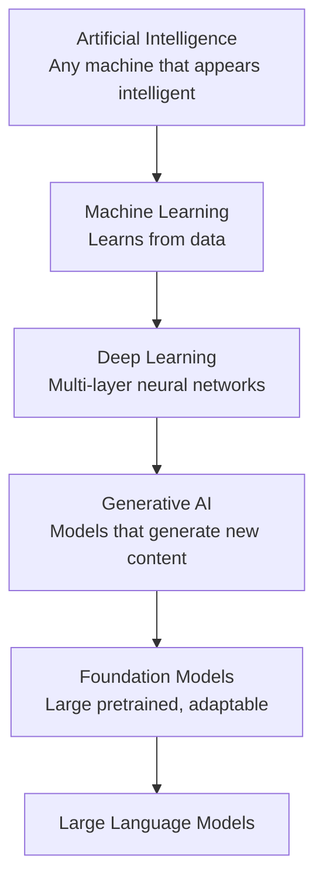

---

## 2. ML Development Lifecycle

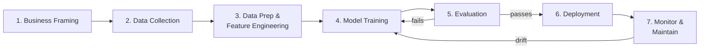

---

## 3. Three Layers of AWS AI Stack

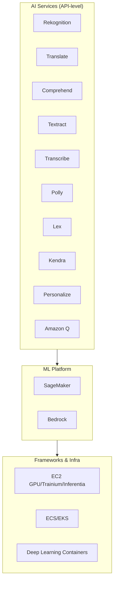

---

## 4. Transformer (High-Level)

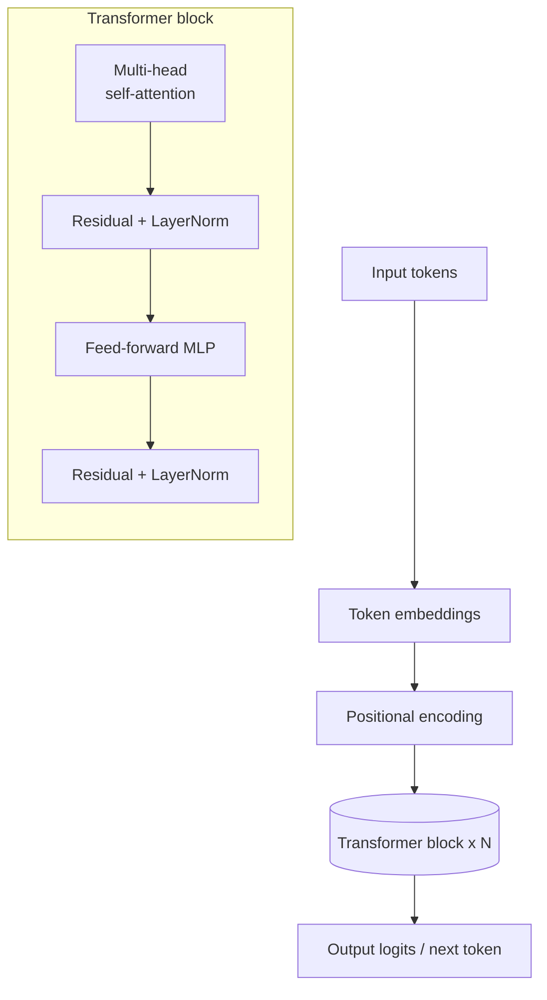

---

## 5. RAG Architecture (Bedrock Knowledge Base)

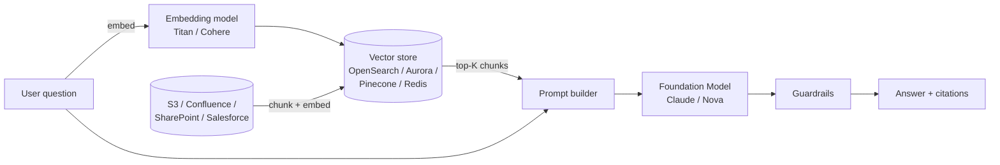

---

## 6. Agents for Bedrock

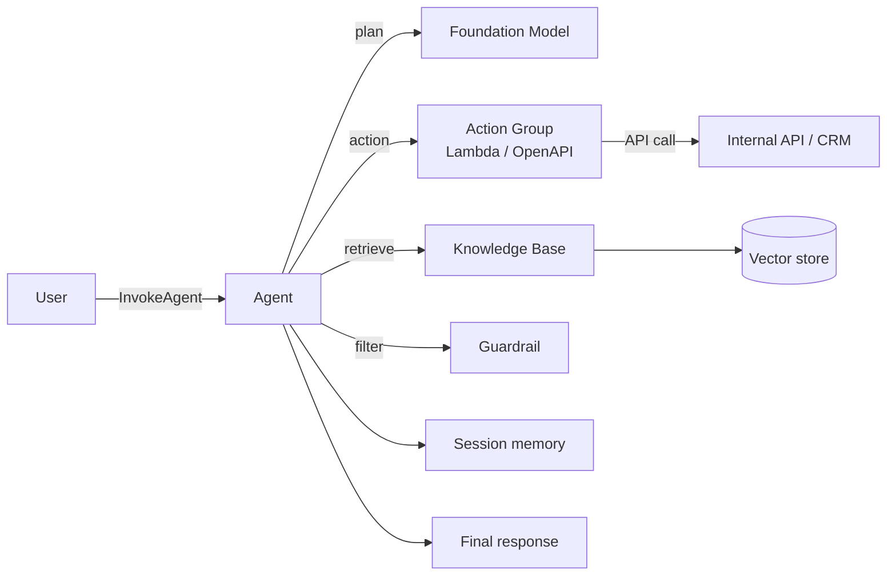

---

## 7. SageMaker Pipeline Example

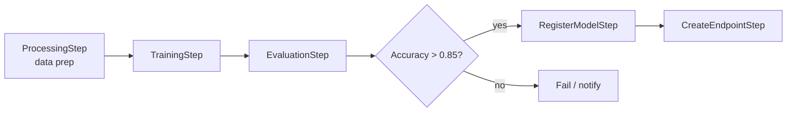

---

## 8. Responsible AI Framework

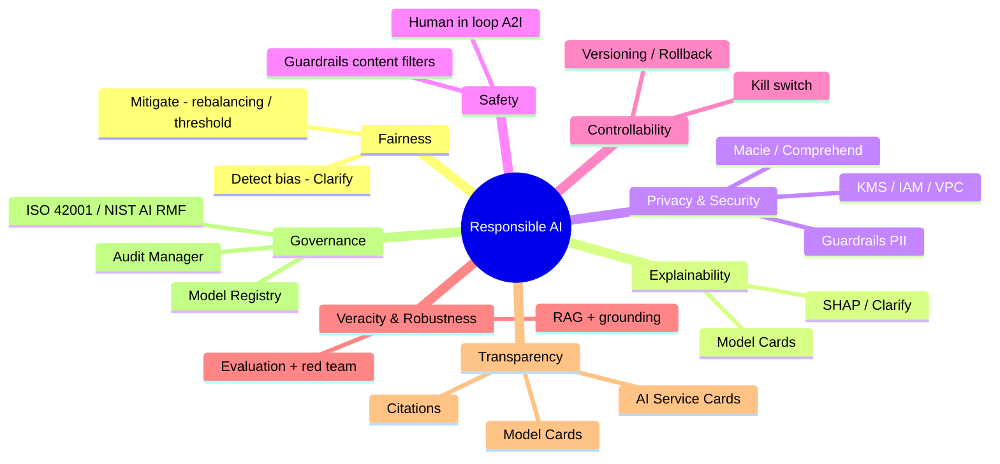

---

## 9. Shared Responsibility for Managed AI

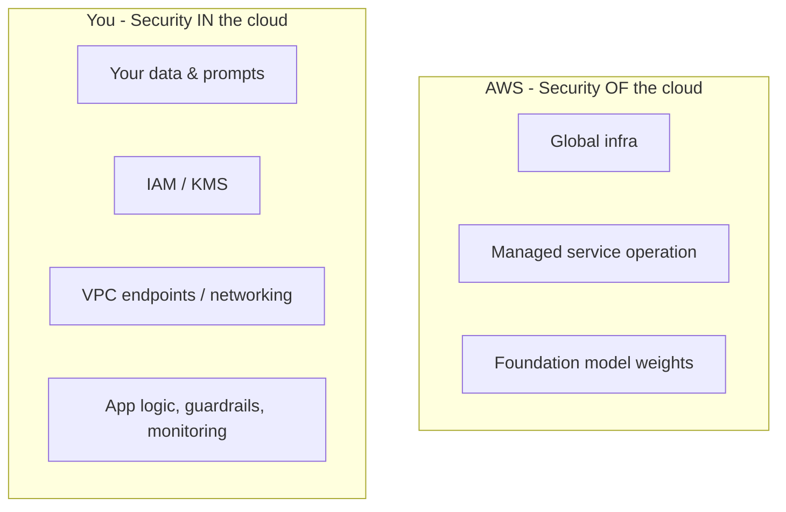

---

## 10. Bedrock Guardrails Features

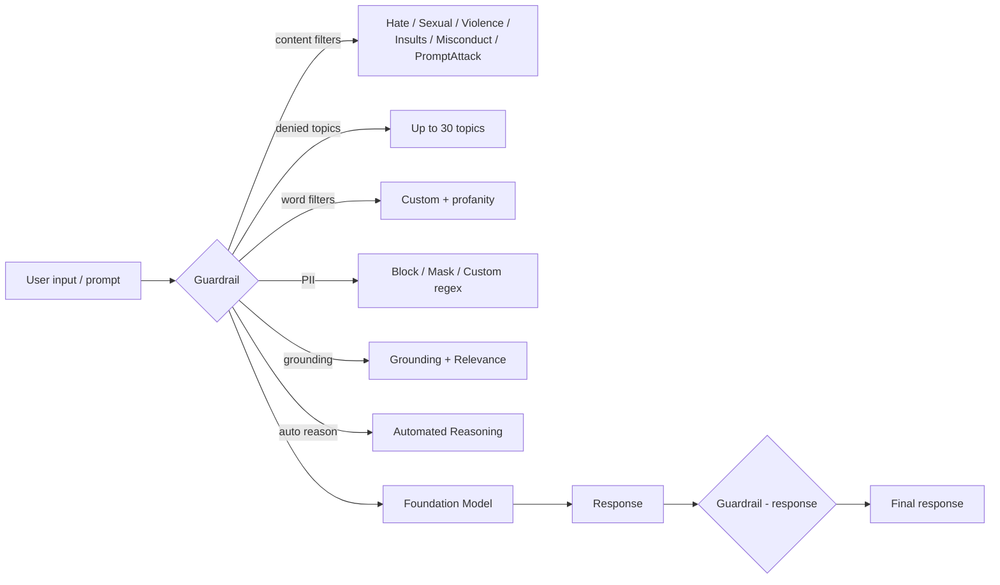

---

## 11. Customization Ladder

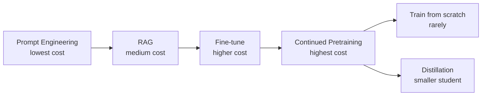

---

## 12. GenAI Security Scoping Matrix

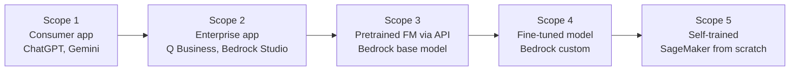

---

## 13. Secure RAG Reference

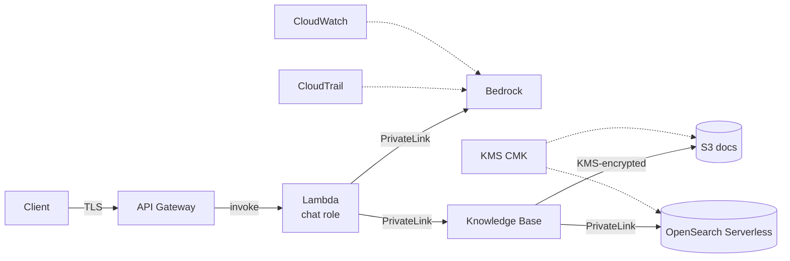

---

## 14. Model Selection Decision Tree

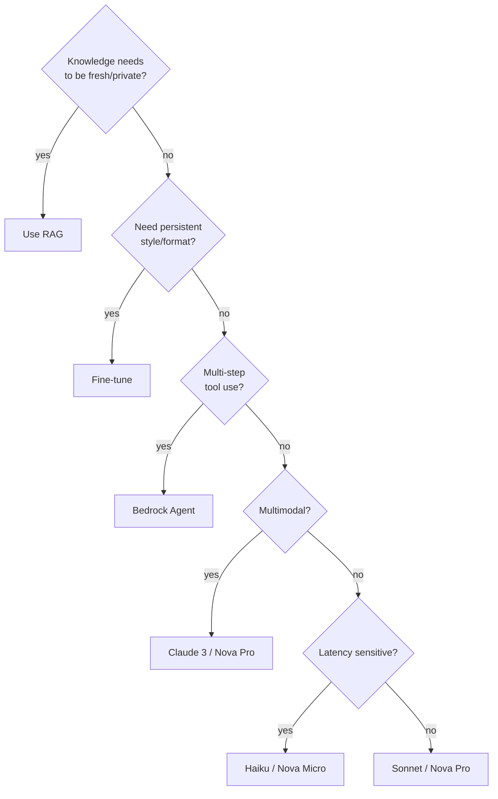

