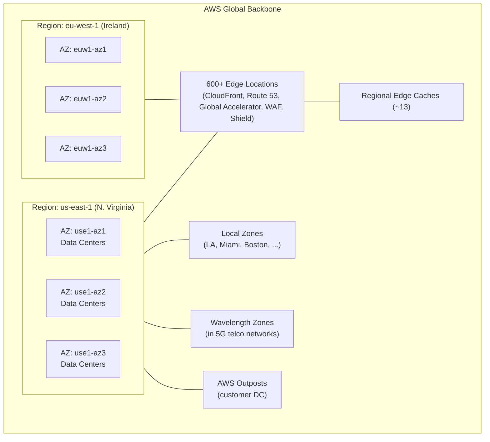

# AWS Global Infrastructure



```
┌───────────────────────── AWS Global Backbone ─────────────────────────┐
│                                                                       │
│  ┌────── Region us-east-1 ──────┐   ┌────── Region eu-west-1 ──────┐  │
│  │  AZ1   AZ2   AZ3             │   │  AZ1   AZ2   AZ3             │  │
│  │  [DC1] [DC2] [DC3]           │   │  [DC1] [DC2] [DC3]           │  │
│  └──────────────────────────────┘   └──────────────────────────────┘  │
│                                                                       │
│  Edge Locations (600+) ─┬─ CloudFront                                 │
│                         ├─ Route 53                                   │
│                         ├─ Global Accelerator                         │
│                         └─ WAF / Shield                               │
│                                                                       │
│  Local Zones • Wavelength • Outposts (hybrid)                          │
└───────────────────────────────────────────────────────────────────────┘
```

**Key takeaways**
- A **Region** contains ≥ 3 **AZs**.
- An **AZ** is one or more data centers with independent power, cooling,
  and networking.
- **Edge Locations** power CloudFront/Route 53/Global Accelerator/WAF.
- **Local Zones** = metro edges; **Wavelength** = 5G edges;
  **Outposts** = AWS hardware in customer DC.
