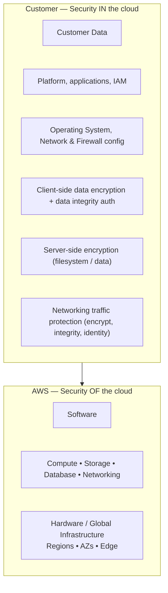

# Shared Responsibility Model



```
┌───────────────────────────────────────────────────────────────────┐
│                 CUSTOMER — "security IN the cloud"               │
│  • Customer data                                                 │
│  • Platform, applications, IAM                                   │
│  • Operating system, network and firewall configuration          │
│  • Client-side data encryption & integrity                       │
│  • Server-side encryption (filesystem and/or data)                │
│  • Networking traffic protection                                 │
├───────────────────────────────────────────────────────────────────┤
│                    AWS — "security OF the cloud"                 │
│  • Software                                                      │
│  • Compute • Storage • DB • Networking                            │
│  • Hardware / Global Infrastructure                              │
│    Regions • AZs • Edge Locations                                │
└───────────────────────────────────────────────────────────────────┘
```

**Rule of thumb**
- The higher up the abstraction (IaaS → PaaS → SaaS), the more AWS takes on.
- On **EC2**, customer patches the OS. On **RDS**, AWS patches the DB
  engine during your maintenance window.
- Shared controls: patch management, configuration management, awareness
  and training.
