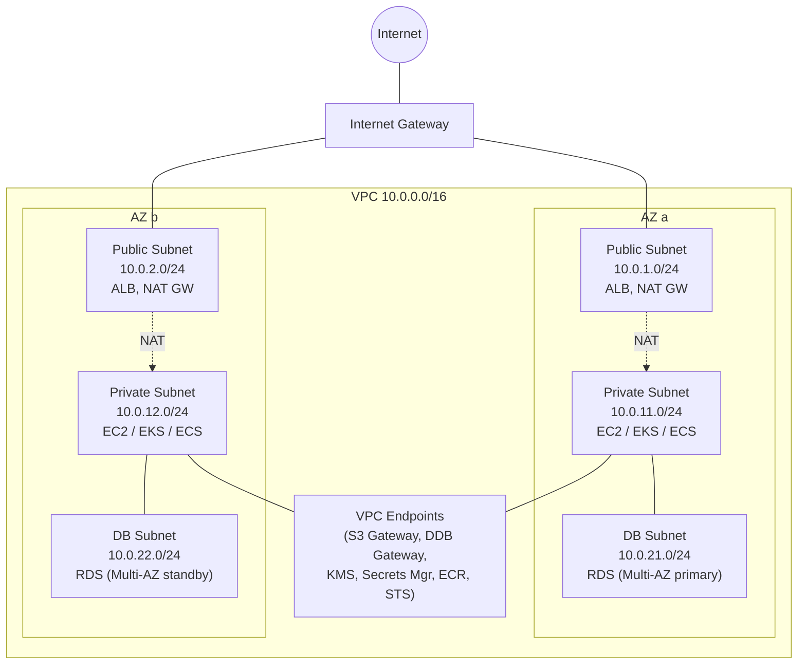

# VPC — Classic Public/Private Layout

**Design rules**
- Put **ALB** and **NAT Gateways** in **public subnets** (one per AZ for
  HA).
- Put **compute** (EC2, ECS, EKS, Lambda ENIs) in **private subnets**.
- Put **RDS/Aurora** in a **DB subnet group** spanning ≥ 2 AZs.
- Add **VPC Endpoints** for S3/DDB (Gateway) and KMS/Secrets/ECR/STS
  (Interface) to keep traffic off the public internet.
- Use **Security Groups** between tiers (e.g., DB SG allows only from
  App SG).
