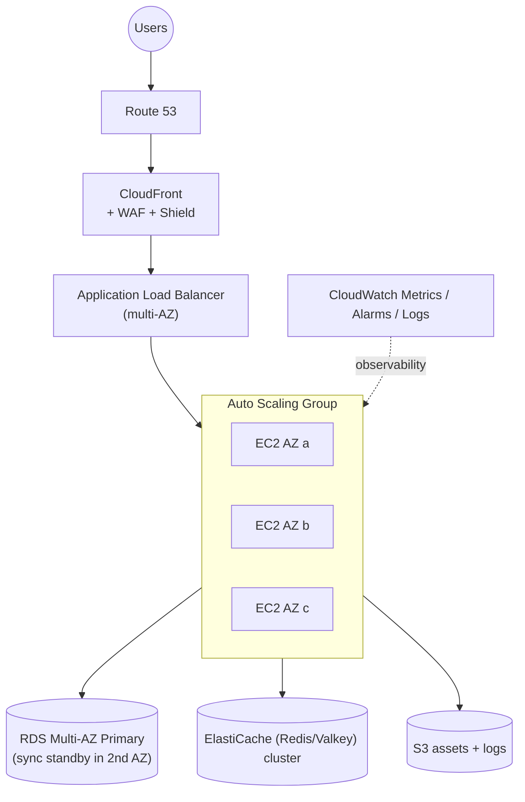

# High Availability — Multi-AZ Web Tier

**Why this is HA**
- DNS → CDN → ALB → ASG → RDS Multi-AZ. Any single AZ failure is
  tolerated.
- ASG replaces failed EC2 and scales based on CloudWatch alarms.
- RDS Multi-AZ provides synchronous standby for automated failover.
- ElastiCache replicates across AZs for cache HA.
- S3 is Regional (multi-AZ) by default.

**How to upgrade to DR (multi-Region)**
- Replicate S3 (CRR), Aurora (Global DB), DynamoDB (Global Tables).
- Use Route 53 Failover or Latency routing.
- Use AWS Backup cross-Region copy.
- Consider Global Accelerator for fast failover (TCP/UDP).
