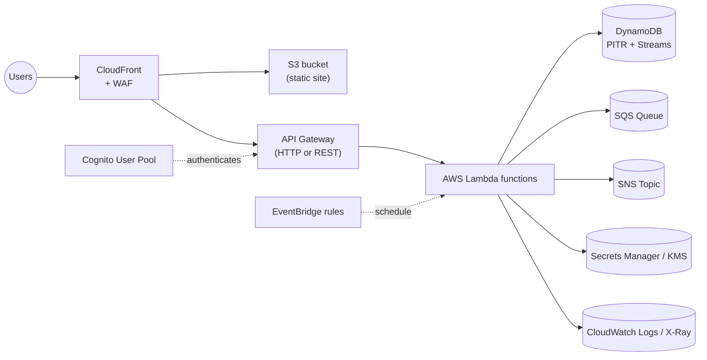

# Serverless Web Application

**Serverless characteristics**
- No servers to patch. Scale to zero. Pay per request.
- **Cognito** adds authn; JWT flows to API Gateway authorizers.
- **DynamoDB** for KV/document state. Lambda triggers via Streams.
- **SQS / SNS / EventBridge** for async decoupling.
- **CloudWatch + X-Ray** for observability.
- Add **Step Functions** if workflow spans many Lambdas with retries.
