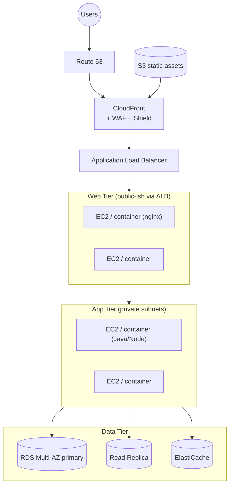

# Classic 3-Tier Web Application on AWS

**Notes**
- Static content on S3 behind CloudFront; dynamic through ALB/ASG.
- App tier connects to DB via the private subnet route.
- Cache reduces DB load for hot reads.
- Replace EC2 tiers with Fargate/ECS or Lambda to move toward
  serverless.
