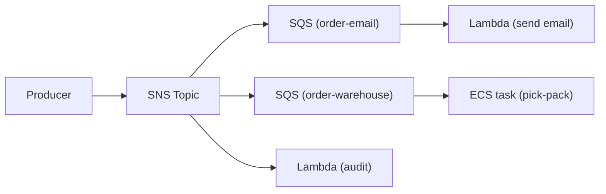
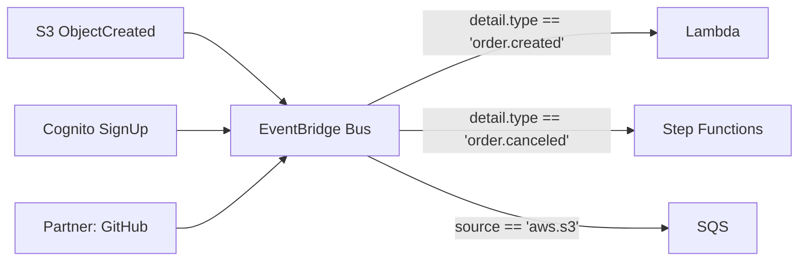
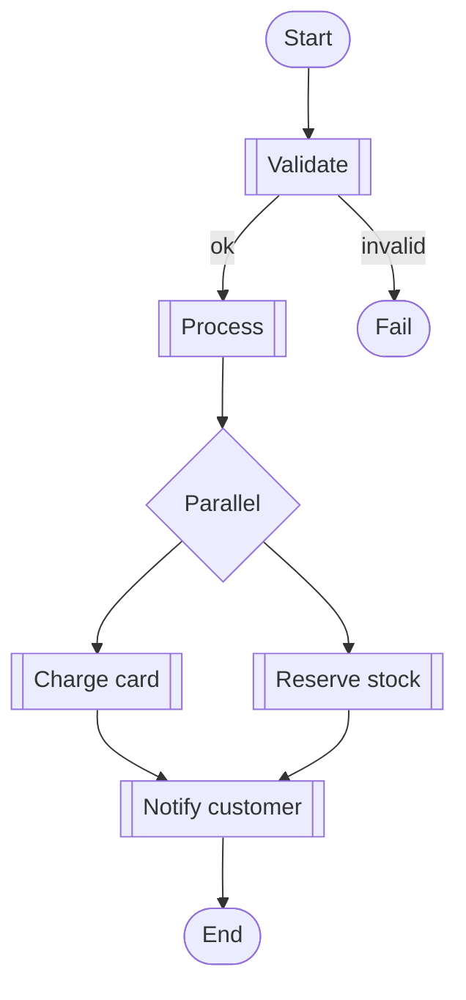
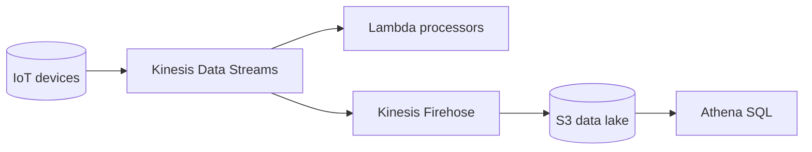

# Event-Driven Integration Patterns

## Pub/Sub with fan-out (SNS → SQS → Lambda)

## Event Bus routing (EventBridge)

## Orchestration (Step Functions)

## Stream processing (Kinesis + Lambda)

