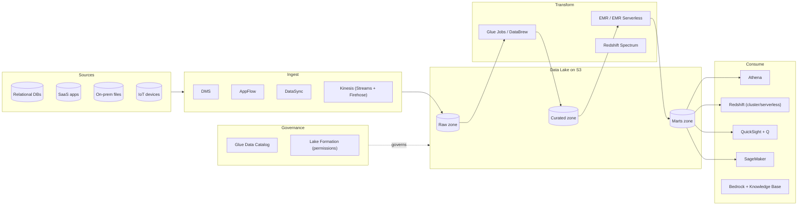

# Data Lake on AWS

**Pattern highlights**
- S3 is the storage foundation; partition data by `year/month/day` and
  use Parquet/ORC columnar formats for speed + cost.
- Use **Glue Catalog** as the metadata store; **Lake Formation** for
  fine-grained access.
- Query patterns: Athena (ad hoc), Redshift (warehouse), QuickSight
  (BI), SageMaker (ML).
- Generative AI: **Bedrock Knowledge Bases** + OpenSearch / Aurora for
  RAG.
