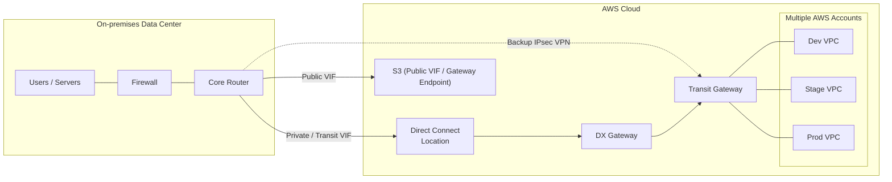

# Hybrid Network Connectivity

**Highlights**
- **Direct Connect** for dedicated bandwidth; use a **VPN backup** over
  the internet for HA.
- **Transit Gateway** hub; attach DX Gateway + VPCs + VPN connections.
- Route 53 **Resolver endpoints** for DNS between on-prem and AWS (not
  shown).
- MACsec at 10/100 Gbps for L2 encryption.
