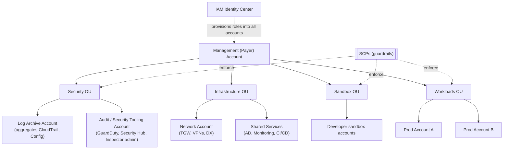

# AWS Organizations & Control Tower Landing Zone

**Landing Zone patterns**
- Separate **Log Archive** and **Audit** accounts never used for
  workloads. They receive org-wide CloudTrail and Config.
- Dedicated **Network** account for Transit Gateway, VPC sharing (RAM),
  central egress.
- **Identity Center** centralizes SSO across the org.
- **SCPs** enforce preventive guardrails (e.g., "no leaving an approved
  Region list", "no deleting CloudTrail").
- **Control Tower** sets most of this up in a day with a console wizard.
