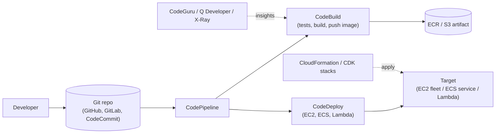

# CI/CD on AWS

**Principles**
- Trigger pipeline on Git push.
- **CodeBuild** creates immutable artifacts.
- **CodeDeploy** supports canary, linear, all-at-once deployment.
- **CloudFormation / CDK / Terraform** applied through an IaC stage.
- Pipelines can have **manual approval** gates.
- Use **multi-account pipelines** (e.g., deploy from Tools → Stage →
  Prod accounts).
