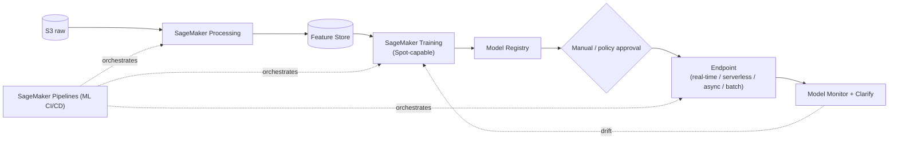

# SageMaker ML Pipeline

**Highlights**
- Training with **Managed Spot** saves up to 90%.
- **Model Registry** governs which model version is deployed.
- **Model Monitor + Clarify** detect drift and bias in production.
- **Pipelines** provide ML-specific CI/CD.
