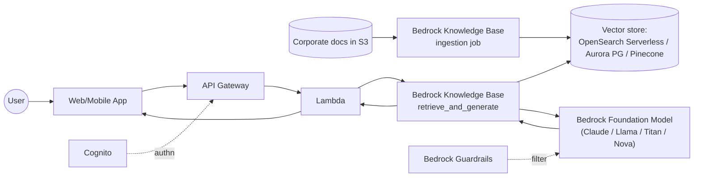

# Generative AI — RAG Pattern with Amazon Bedrock

**Why this pattern**
- Foundation Models don't know your private data. **RAG** (Retrieval
  Augmented Generation) adds your knowledge by embedding your docs into
  a vector DB and retrieving relevant chunks at query time.
- **Knowledge Bases for Amazon Bedrock** wraps this pattern.
- **Guardrails** enforce deny topics, PII filtering, and hallucination
  checks.
- Use **Agents** for tool-using LLM workflows (call APIs, Lambdas).
