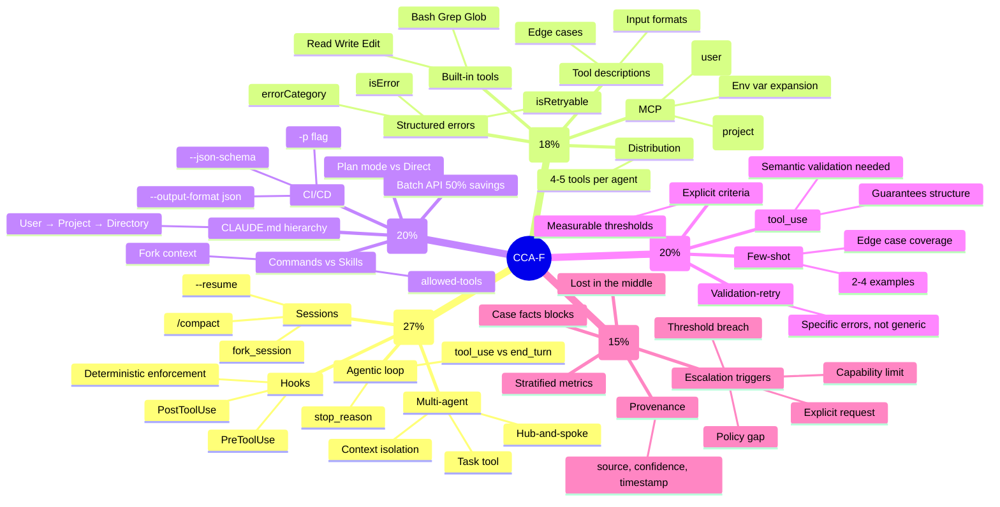

# Claude Certified Architect – Foundations (CCA-F)
## The Complete Architect's Study Pack

> *"Anthropic's first official technical certification. Proctored. No AI. No docs. No escape route. Just architecture."*

This is the **master study pack** for the Anthropic **Claude Certified Architect – Foundations** exam (launched March 12, 2026). It is designed so a seasoned software/solution architect — even one who has never touched Claude Code before — can pass with confidence in **8 – 12 weeks**.

Everything you need is in this repository: deep-dive articles, annotated code, Mermaid diagrams, 200+ flash cards, 200+ practice questions (and 3 full 60-question mock exams), anti-pattern cheatsheets, and a day-by-day study plan.

---

## 1. Exam At a Glance

| Attribute | Value |
|---|---|
| **Official name** | Claude Certified Architect – Foundations |
| **Issuing body** | Anthropic (via Anthropic Academy on Skilljar) |
| **Launch date** | March 12, 2026 |
| **Format** | 60 multiple-choice questions, scenario-based |
| **Time** | 120 minutes |
| **Passing score** | **720 / 1000** (scaled) |
| **Scenarios** | 4 of 6 selected randomly per session |
| **Conditions** | Proctored, closed-book, **no Claude, no AI, no docs, no external tools** |
| **Cost** | $99 (free for first 5,000 Claude Partner Network employees) |
| **Target audience** | Solution architects building production Claude applications |
| **Prereqs** | None formally, but ≥ 6 months hands-on Claude experience recommended |

### Domain Weights (memorize this)

| # | Domain | Weight | What it tests |
|---|---|---|---|
| 1 | **Agentic Architecture & Orchestration** | **27 %** | Agent loops, hub-and-spoke, hooks, sessions, task decomposition |
| 2 | **Claude Code Configuration & Workflows** | **20 %** | `CLAUDE.md`, commands vs. skills, plan mode, CI/CD, Batch API |
| 3 | **Prompt Engineering & Structured Output** | **20 %** | Explicit criteria, few-shot, `tool_use`, JSON schemas, validation-retry |
| 4 | **Tool Design & MCP Integration** | **18 %** | Tool descriptions, structured errors, tool distribution, MCP, built-in tools |
| 5 | **Context Management & Reliability** | **15 %** | Case facts blocks, escalation triggers, degradation, provenance |

> Two things: (a) Some sources list Domain 1 as 25 % and Tool/MCP as 20 % — the actual weights are close enough that the **ordering** matters more than the exact percentages. (b) The exam **mixes domains within scenarios**, so you cannot prepare only the highest-weighted one.

---

## 2. How to Use This Study Pack

### If you have **12 weeks** (recommended, 1 hr/day)
Follow [`00-Study-Plan/00-12-Week-Study-Plan.md`](00-Study-Plan/00-12-Week-Study-Plan.md) verbatim.

### If you have **4 weeks** (intensive, 2–3 hr/day)
1. Week 1: Read all 5 domain deep dives (`01-Domain1-*` through `05-Domain5-*`).
2. Week 2: Work all 6 scenarios (`06-Scenarios/`) and all 10 code samples (`09-Code-Samples/`).
3. Week 3: Drill flash cards daily. Take practice exam 1. Review wrong answers.
4. Week 4: Take practice exams 2 & 3. Re-read the anti-patterns cheatsheet daily. Take the exam.

### If you have **1 week** (triage — senior architect catching up)
1. Read [`12-Cheat-Sheets/01-Exam-Day-Quick-Reference.md`](12-Cheat-Sheets/01-Exam-Day-Quick-Reference.md) twice.
2. Read [`10-Anti-Patterns/01-Cheatsheet.md`](10-Anti-Patterns/01-Cheatsheet.md) three times.
3. Work all 6 scenarios (`06-Scenarios/`).
4. Take all 3 practice exams.
5. Re-read the **top-of-file summaries** of the 5 domains the morning of the exam.

---

## 3. Repository Structure

```
Claude-Certified-Architect/
├── README.md                           ← you are here
├── 00-Study-Plan/                      ← 12-week plan, exam guide, exam-day playbook
├── 01-Domain1-Agentic-Architecture/    ← 5 deep dives, ~5k words each
├── 02-Domain2-Tool-Design-MCP/         ← 5 deep dives
├── 03-Domain3-Claude-Code-Config/      ← 5 deep dives
├── 04-Domain4-Prompt-Engineering/      ← 5 deep dives
├── 05-Domain5-Context-Management/      ← 5 deep dives
├── 06-Scenarios/                       ← The 6 exam scenarios, fully walked through
├── 07-Flash-Cards/                     ← 200+ cards organized by domain
├── 08-Diagrams/                        ← Mermaid diagrams for every key pattern
├── 09-Code-Samples/                    ← Production-ready Python/TS reference code
├── 10-Anti-Patterns/                   ← The 18 canonical wrong answers
├── 11-Sample-Questions/                ← 190 domain questions + 3 × 60-Q practice exams
└── 12-Cheat-Sheets/                    ← One-page references for exam morning
```

---

## 4. The 10 "Golden Laws" of the CCA Exam

If you forget everything else, remember these. Anti-patterns are the exam's favourite distractors, and each of these laws maps to one.

1. **Check `stop_reason`, not natural language** — loop control is always `tool_use` vs `end_turn`.
2. **Hooks enforce, prompts suggest** — critical business rules live in `PreToolUse` / `PostToolUse`, never in system prompts.
3. **4–5 tools per agent** — more than that and selection accuracy falls off a cliff. Distribute across subagents.
4. **`tool_use` guarantees *structure*, not *semantics*** — always validate the content after extraction.
5. **Escalate on objective criteria, never on sentiment or self-reported confidence**.
6. **Access failure ≠ empty result** — a failed lookup returns `isError: true`, never `[]`.
7. **Case facts blocks over progressive summarization** — critical data lives in an immutable front-of-context block.
8. **Separate sessions for generator and reviewer** — same-session self-review is confirmation bias.
9. **Use `${ENV_VAR}` in `.mcp.json`, never hard-coded secrets** — config files are committed to git.
10. **Batch API = 50 % cheaper, 24 h window** — use it for non-urgent work; synchronous for blocking.

---

## 5. Key Concept Map



---

## 6. About the Scenarios

The exam presents you with **4 of 6 possible scenarios**. Each scenario is a realistic production problem that tests 2 – 4 domains simultaneously. The 6 scenarios are:

1. **Customer Support Resolution Agent** — D1, D2, D5
2. **Code Generation with Claude Code** — D3, D4
3. **Multi-Agent Research System** — D1, D5
4. **Developer Productivity with Claude** — D2, D3
5. **Claude Code for CI/CD** — D3, D4
6. **Structured Data Extraction** — D4, D5

Every scenario has its own walkthrough in [`06-Scenarios/`](06-Scenarios/). **You must be comfortable with all 6** — you cannot skip any.

---

## 7. What I Wish I Knew Before Starting

- **This is not the Prompt Engineering Specialist exam.** It's the AWS Solutions Architect equivalent. The questions test *architectural judgement under production constraints*, not API syntax.
- **Hands-on > reading.** Build at least one real system (a multi-agent pipeline, an MCP server, or a Claude Code CI workflow) before exam day. Concepts harden only when you shipped them.
- **Anti-patterns are the #1 source of points.** The exam writes its distractors from the anti-pattern list. Learn to spot them and you will eliminate 2 – 3 options on nearly every question.
- **Scenarios overlap.** A customer-support agent question will also test context-management and tool-design concepts. Don't compartmentalize.
- **Think in orders of magnitude.** Many questions hinge on whether your answer scales from 10 → 10 000 requests, or from 1 → 100 tool calls. The right answer is nearly always the one that degrades most gracefully.

---

## 8. External References (for deeper exploration, *not* for exam day)

- [Anthropic Academy (Skilljar)](https://anthropic.skilljar.com/) — Free official courses
- [Claude API Docs](https://platform.claude.com/docs/en/api/overview)
- [Claude Code Docs](https://code.claude.com/docs/en/overview)
- [Model Context Protocol Spec](https://modelcontextprotocol.io/)
- [claudecertifications.com](https://claudecertifications.com/claude-certified-architect) — Free community prep site
- [Claude Directory blog](https://www.claudedirectory.org/blog) — Deep guides on CLAUDE.md, hooks, MCP servers

---

## 9. A Final Word

The certification is new. The field is new. The scoring rubric is new. What Anthropic is really asking is this:

> *"If we put 100 of our customers' production Claude systems in front of you, can you tell which ones will still be up and trusted in six months?"*

That's the bar. Every page in this pack is written to get you to it.

**Good luck. Now turn the page.**

→ Start here: [`00-Study-Plan/01-Exam-Overview.md`](00-Study-Plan/01-Exam-Overview.md)
