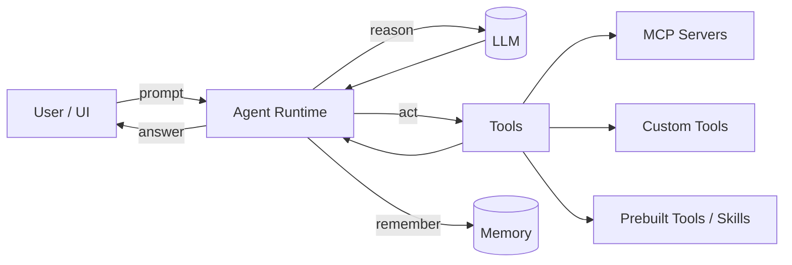
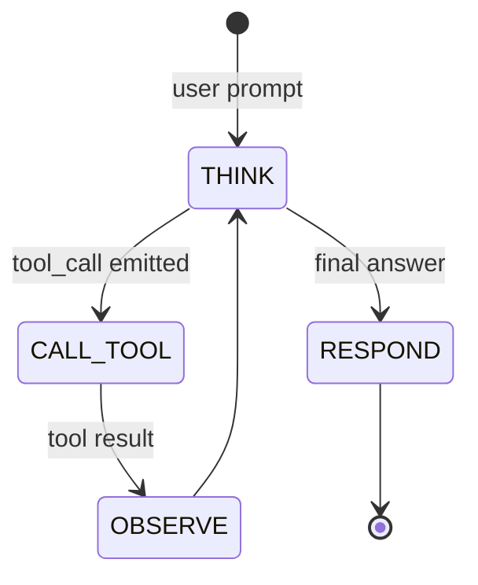
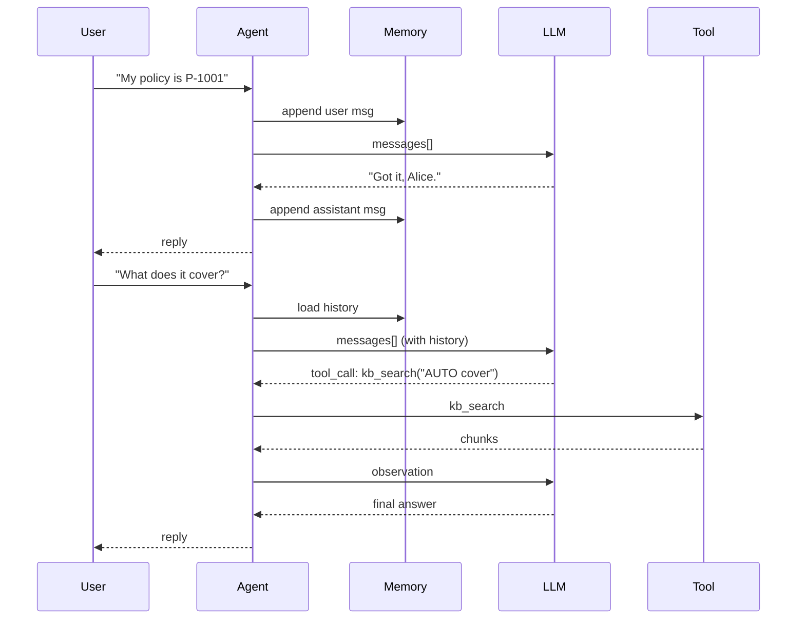
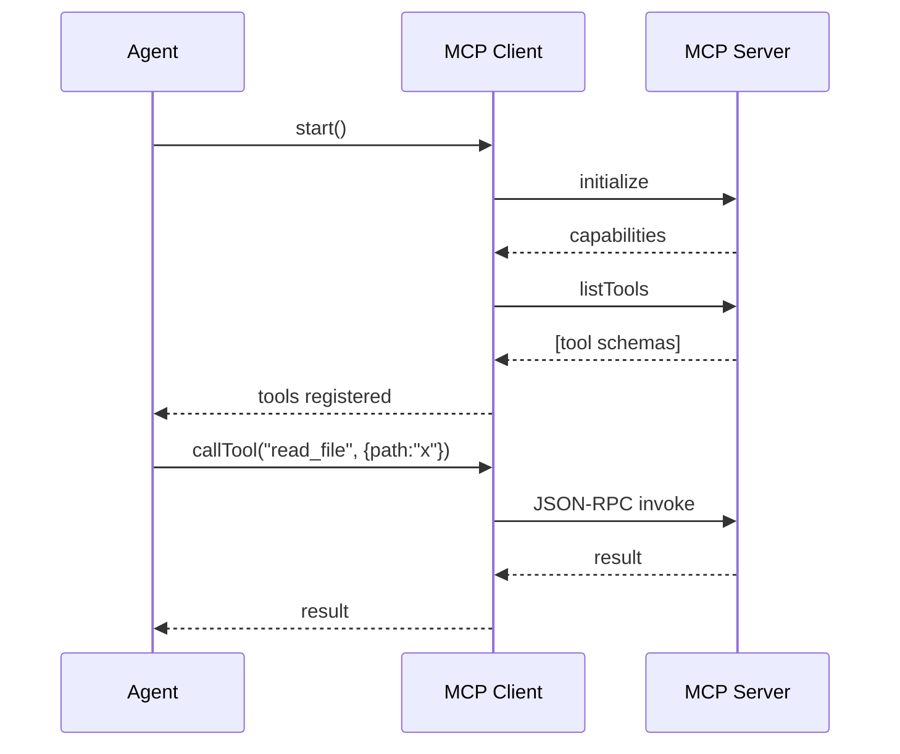
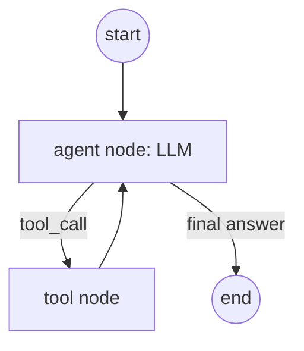
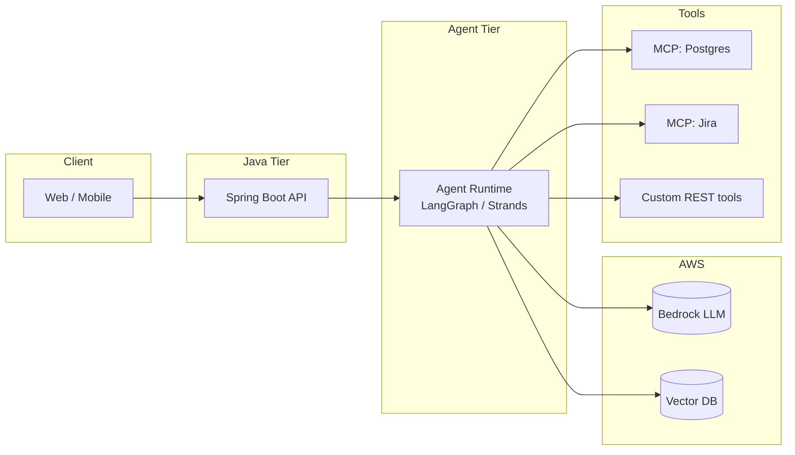

# Diagrams — Agent Internals

These are Mermaid diagrams. Paste them into any Markdown viewer that supports
Mermaid (GitHub, Cursor preview, Obsidian) to render.

---

## 1. High-level Architecture

---

## 2. ReAct State Machine

---

## 3. Multi-turn Conversation with Memory

---

## 4. MCP Tool Discovery

---

## 5. LangGraph Explicit Graph

---

## 6. Production Deployment Topology

