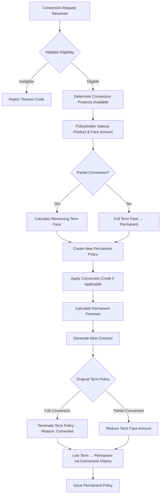
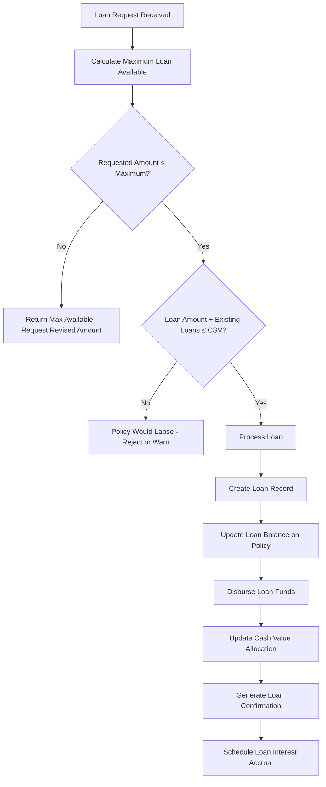
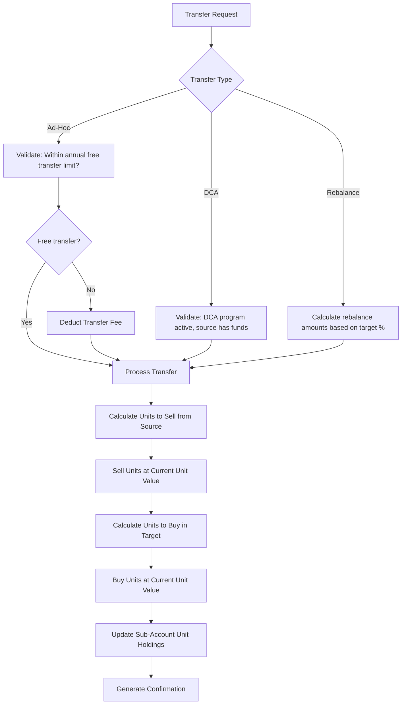
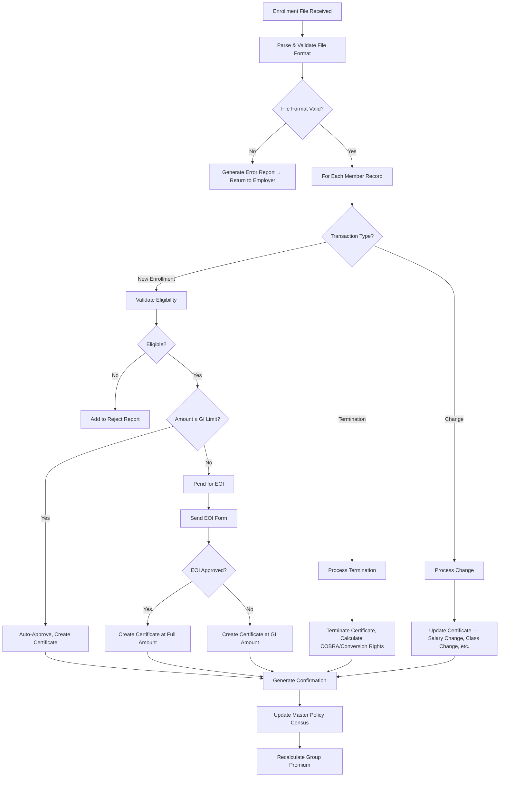
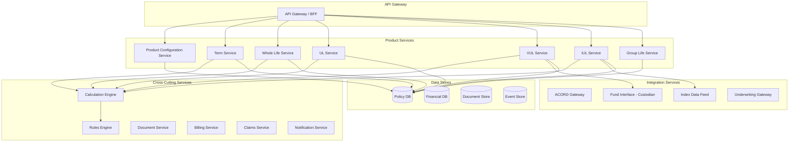

# Article 01 — Life Insurance Products Taxonomy

## A Solution Architect's Comprehensive Reference

---

## Table of Contents

1. [Introduction & Scope](#1-introduction--scope)
2. [Term Life Insurance](#2-term-life-insurance)
3. [Whole Life Insurance](#3-whole-life-insurance)
4. [Universal Life Insurance (UL)](#4-universal-life-insurance-ul)
5. [Variable Universal Life Insurance (VUL)](#5-variable-universal-life-insurance-vul)
6. [Indexed Universal Life Insurance (IUL)](#6-indexed-universal-life-insurance-iul)
7. [Group Life Insurance](#7-group-life-insurance)
8. [Survivorship / Second-to-Die Insurance](#8-survivorship--second-to-die-insurance)
9. [Product Feature Matrix](#9-product-feature-matrix)
10. [Architecture Implications](#10-architecture-implications)
11. [ACORD TXLife Reference](#11-acord-txlife-reference)
12. [Appendices](#12-appendices)

---

## 1. Introduction & Scope

### 1.1 Purpose

This article serves as the definitive architectural reference for every major life insurance product type that a Policy Administration System (PAS) must support. It is written for solution architects, data modelers, and integration engineers who design, build, or integrate with life insurance administration platforms.

### 1.2 Why Product Taxonomy Matters for PAS Design

The diversity of life insurance products is the single greatest driver of PAS complexity. Each product type introduces unique:

- **Calculation engines** — premium, cash value, cost of insurance, dividends, index credits
- **Processing cycles** — daily (VA/VUL), monthly (UL), annual (WL), or event-driven
- **Regulatory constraints** — Section 7702, MEC testing, SEC registration, state filing
- **Data models** — from simple (term) to extraordinarily complex (IUL with multipliers)
- **Integration surfaces** — illustration systems, underwriting engines, fund custodians, index data vendors

A PAS that is not designed with deep understanding of these product differences will either (a) fail to support the full product shelf, (b) require constant re-engineering, or (c) perform poorly under production load.

### 1.3 Taxonomy Overview

```
Life Insurance Products
├── Term Life
│   ├── Level Term (10, 15, 20, 25, 30 year)
│   ├── Decreasing Term
│   ├── Annual Renewable Term (ART / YRT)
│   ├── Return-of-Premium Term (ROP)
│   └── Convertible Term
├── Whole Life
│   ├── Ordinary Life (Straight Life)
│   ├── Limited-Pay (10-Pay, 20-Pay, Life Paid-Up at 65)
│   ├── Single Premium Whole Life (SPWL)
│   ├── Modified Endowment Contract (MEC)
│   ├── Participating (Par)
│   └── Non-Participating (Non-Par)
├── Universal Life (UL)
│   ├── Current Assumption UL
│   ├── No-Lapse Guarantee UL (NLGUL)
│   └── Equity-Indexed UL → see IUL
├── Variable Universal Life (VUL)
│   ├── Standard VUL
│   └── VUL with Guaranteed Living Benefits
├── Indexed Universal Life (IUL)
│   ├── Standard IUL
│   ├── IUL with Multiplier/Bonus
│   └── IUL with Volatility-Controlled Indices
├── Group Life
│   ├── Group Term Life (GTL)
│   ├── Group Universal Life (GUL)
│   ├── Group Variable Universal Life (GVUL)
│   └── Supplemental / Voluntary Group Life
└── Survivorship / Second-to-Die
    ├── Survivorship Whole Life
    ├── Survivorship Universal Life
    └── Survivorship Variable Universal Life
```

### 1.4 Conventions Used

| Convention | Meaning |
|---|---|
| `PAS` | Policy Administration System |
| `COI` | Cost of Insurance |
| `CSV` | Cash Surrender Value |
| `CV` | Cash Value / Account Value |
| `DB` | Death Benefit |
| `GPT` | Guideline Premium Test (IRC §7702) |
| `CVAT` | Cash Value Accumulation Test (IRC §7702) |
| `NAR` | Net Amount at Risk |
| `ACORD` | Association for Cooperative Operations Research and Development |

---

## 2. Term Life Insurance

### 2.1 Product Overview

Term life insurance provides a death benefit for a specified period (the "term") with no cash value accumulation. It is the simplest product type from a PAS perspective but still requires careful design to handle renewals, conversions, and guaranteed vs. current premium scales.

### 2.2 Level Term

#### 2.2.1 Product Structure

Level term provides a fixed face amount and fixed premium for a guaranteed period — typically 10, 15, 20, 25, or 30 years. After the guaranteed period, the policy enters the Annual Renewable Term (ART) phase with sharply increasing premiums based on attained age.

**Key Parameters:**

| Parameter | Description | Typical Values |
|---|---|---|
| `FaceAmount` | Death benefit amount | $50,000 – $50,000,000 |
| `GuaranteedPeriod` | Level premium duration (years) | 10, 15, 20, 25, 30 |
| `PremiumMode` | Payment frequency | Annual, Semi-Annual, Quarterly, Monthly |
| `ModalFactor` | Frequency-based premium multiplier | Annual=1.0, Semi=0.52, Qtr=0.265, Mth=0.0875 |
| `IssueAge` | Age at policy issue | 18–80 (varies by product) |
| `RiskClass` | Underwriting classification | Preferred Plus, Preferred, Standard Plus, Standard, Substandard (Table 1–16) |
| `GenderBasis` | Rating gender | Male, Female, Unisex |
| `TobaccoStatus` | Smoker classification | Non-Tobacco, Tobacco, former distinction varies |
| `RenewalMaxAge` | Maximum attained age for ART renewal | 80, 85, 90, 95 |
| `ConversionMaxAge` | Latest age for conversion to permanent | 65, 70, or end of guaranteed period |

#### 2.2.2 Premium Calculation Basis

The gross premium for a level term product is derived from:

```
Gross Premium = Net Premium + Loading

Where:
  Net Premium = Σ (v^t × t_p_x × q_(x+t) × FaceAmount) / Σ (v^t × t_p_x)
  
  v = 1 / (1 + i)                    [discount factor]
  t_p_x = probability of survival from age x to age x+t
  q_(x+t) = probability of death at age x+t
  i = assumed interest rate
  
Loading includes:
  - Per-policy expense load (flat dollar)
  - Percent-of-premium load
  - Per-unit expense load (per $1,000 face amount)
  - Profit margin
  - Contingency margin
  - Commission financing cost
```

**Mortality Tables Used:**

| Table | Use Case |
|---|---|
| 2017 CSO (Commissioners Standard Ordinary) | Regulatory reserve / nonforfeiture basis |
| 2015 VBT (Valuation Basic Table) | Principle-based reserves (PBR) under VM-20 |
| Company Experience Tables | Pricing / expected mortality |
| Select & Ultimate Structure | Issue age select period (typically 15-25 years) then ultimate rates |

#### 2.2.3 Renewal Mechanics

After the guaranteed level premium period ends:

1. **ART Phase Premiums**: PAS calculates attained-age premiums using a guaranteed ART rate scale filed with each state.
2. **Rate Scale Source**: Stored in product configuration table `TERM_ART_RATES` keyed by `(ProductCode, IssueAge, AttainedAge, Gender, TobaccoClass, RiskClass)`.
3. **Renewal Notice**: PAS generates a renewal notice at least 45 days (varies by state) before the anniversary, showing the new ART premium and conversion options.
4. **Billing Change**: PAS billing module switches from level premium to ART premium on the policy anniversary coinciding with or following the end of the guaranteed period.

#### 2.2.4 PAS Data Requirements

```sql
-- Core term policy table
CREATE TABLE TERM_POLICY (
    policy_id              VARCHAR(20)    PRIMARY KEY,
    policy_number          VARCHAR(15)    NOT NULL UNIQUE,
    product_code           VARCHAR(10)    NOT NULL,
    plan_code              VARCHAR(10)    NOT NULL,
    issue_date             DATE           NOT NULL,
    issue_age              SMALLINT       NOT NULL,
    issue_state            CHAR(2)        NOT NULL,
    face_amount            DECIMAL(15,2)  NOT NULL,
    risk_class             VARCHAR(20)    NOT NULL,
    gender                 CHAR(1)        NOT NULL,
    tobacco_status         CHAR(2)        NOT NULL,
    guaranteed_period_yrs  SMALLINT       NOT NULL,
    level_premium_amount   DECIMAL(12,2)  NOT NULL,
    premium_mode           CHAR(1)        NOT NULL,
    modal_premium          DECIMAL(12,2)  NOT NULL,
    art_premium_current    DECIMAL(12,2),
    renewal_max_age        SMALLINT       NOT NULL,
    conversion_max_age     SMALLINT,
    conversion_max_date    DATE,
    policy_status          VARCHAR(20)    NOT NULL DEFAULT 'INFORCE',
    paid_to_date           DATE           NOT NULL,
    termination_date       DATE,
    termination_reason     VARCHAR(30),
    created_ts             TIMESTAMP      DEFAULT CURRENT_TIMESTAMP,
    updated_ts             TIMESTAMP      DEFAULT CURRENT_TIMESTAMP
);

-- ART rate schedule table
CREATE TABLE TERM_ART_RATES (
    product_code    VARCHAR(10)   NOT NULL,
    issue_age       SMALLINT      NOT NULL,
    attained_age    SMALLINT      NOT NULL,
    gender          CHAR(1)       NOT NULL,
    tobacco_class   CHAR(2)       NOT NULL,
    risk_class      VARCHAR(20)   NOT NULL,
    rate_per_1000   DECIMAL(8,4)  NOT NULL,
    effective_date  DATE          NOT NULL,
    PRIMARY KEY (product_code, issue_age, attained_age, gender, tobacco_class, risk_class, effective_date)
);
```

### 2.3 Decreasing Term

#### 2.3.1 Product Structure

Decreasing term maintains a level premium while the face amount decreases over the policy term — typically designed to match a declining liability such as a mortgage balance.

**Decreasing Schedule Types:**

| Type | Description |
|---|---|
| **Straight Line** | Face decreases by a fixed dollar amount each year |
| **Mortgage-Matching** | Face follows an amortization schedule |
| **Custom Schedule** | Carrier-defined or policyholder-defined schedule |

**PAS Design Note:** The decreasing benefit schedule must be stored as a vector of face amounts indexed by policy year. The PAS death claim adjudication module must look up the applicable face amount as of the date of death.

```sql
-- Decreasing term benefit schedule
CREATE TABLE DEC_TERM_SCHEDULE (
    policy_id       VARCHAR(20)   NOT NULL,
    policy_year     SMALLINT      NOT NULL,
    benefit_amount  DECIMAL(15,2) NOT NULL,
    PRIMARY KEY (policy_id, policy_year),
    FOREIGN KEY (policy_id) REFERENCES TERM_POLICY(policy_id)
);
```

#### 2.3.2 Sample ACORD TXLife XML — Decreasing Term Policy Inquiry Response

```xml
<?xml version="1.0" encoding="UTF-8"?>
<TXLife xmlns="http://ACORD.org/Standards/Life/2" Version="2.43.00">
  <TXLifeResponse>
    <TransRefGUID>a1b2c3d4-e5f6-7890-abcd-ef1234567890</TransRefGUID>
    <TransType tc="228">Policy Inquiry</TransType>
    <TransExeDate>2025-09-15</TransExeDate>
    <TransExeTime>14:30:00</TransExeTime>
    <TransResult>
      <ResultCode tc="1">Success</ResultCode>
    </TransResult>
    <OLifE>
      <Holding id="Holding_1">
        <HoldingTypeCode tc="2">Policy</HoldingTypeCode>
        <Policy>
          <PolNumber>LT-2025-0001234</PolNumber>
          <LineOfBusiness tc="1">Life</LineOfBusiness>
          <ProductType tc="1">Term</ProductType>
          <PlanName>Decreasing Term 30</PlanName>
          <PolicyStatus tc="1">Active</PolicyStatus>
          <IssueDate>2020-03-15</IssueDate>
          <TermDate>2050-03-15</TermDate>
          <Life>
            <FaceAmt>500000.00</FaceAmt>
            <Coverage id="Cov_1">
              <ProductCode>DT30</ProductCode>
              <PlanName>Decreasing Term 30 Year</PlanName>
              <IndicatorCode tc="1">Base</IndicatorCode>
              <CurrentAmt>425000.00</CurrentAmt>
              <InitAmt>500000.00</InitAmt>
              <LifeCovTypeCode tc="4">Decreasing Term</LifeCovTypeCode>
              <LivesType tc="1">Single Life</LivesType>
              <DecreasingTermSchedule>
                <ScheduleItem>
                  <Duration>1</Duration>
                  <BenefitAmt>500000.00</BenefitAmt>
                </ScheduleItem>
                <ScheduleItem>
                  <Duration>2</Duration>
                  <BenefitAmt>483333.00</BenefitAmt>
                </ScheduleItem>
                <ScheduleItem>
                  <Duration>3</Duration>
                  <BenefitAmt>466666.00</BenefitAmt>
                </ScheduleItem>
                <!-- ... schedule continues for all 30 years ... -->
                <ScheduleItem>
                  <Duration>30</Duration>
                  <BenefitAmt>16667.00</BenefitAmt>
                </ScheduleItem>
              </DecreasingTermSchedule>
              <CovOption>
                <OptionType tc="1">Waiver of Premium</OptionType>
                <LifeCovOptTypeCode tc="7">Disability Waiver</LifeCovOptTypeCode>
              </CovOption>
            </Coverage>
          </Life>
        </Policy>
      </Holding>
      <Party id="Party_1">
        <PartyTypeCode tc="1">Person</PartyTypeCode>
        <Person>
          <FirstName>Robert</FirstName>
          <LastName>Henderson</LastName>
          <Gender tc="1">Male</Gender>
          <BirthDate>1985-07-22</BirthDate>
        </Person>
      </Party>
      <Relation RelatedObjectID="Party_1" OriginatingObjectID="Holding_1">
        <RelationRoleCode tc="8">Insured</RelationRoleCode>
      </Relation>
    </OLifE>
  </TXLifeResponse>
</TXLife>
```

### 2.4 Annual Renewable Term (ART / YRT)

#### 2.4.1 Product Structure

ART provides a one-year term that is guaranteed renewable each year without evidence of insurability. Premiums increase annually based on attained age.

**Key Characteristics:**

- Premium is recalculated each year using attained-age mortality rates
- Guaranteed renewable to a specified maximum age (typically 90 or 95)
- No level premium period — premiums start low and increase each year
- Commonly used as the post-level-term renewal basis
- Also used for group term life and reinsurance YRT

#### 2.4.2 PAS Implementation Notes

The PAS must maintain:
- A complete ART rate table by `(product_code, attained_age, gender, tobacco_class, risk_class)`
- Logic to recalculate the premium each policy year on the anniversary date
- Billing integration to update the modal premium at each anniversary
- A renewal notice generation process

```python
# Sample ART premium calculation
def calculate_art_premium(face_amount: float, attained_age: int, 
                          gender: str, tobacco_class: str, 
                          risk_class: str, rate_table: dict) -> float:
    """
    Calculate Annual Renewable Term premium for the upcoming policy year.
    
    Rate table is keyed by (attained_age, gender, tobacco_class, risk_class)
    and contains rate_per_1000 values.
    """
    key = (attained_age, gender, tobacco_class, risk_class)
    rate_per_1000 = rate_table.get(key)
    
    if rate_per_1000 is None:
        raise ValueError(f"No ART rate found for key: {key}")
    
    annual_premium = (face_amount / 1000.0) * rate_per_1000
    
    # Apply policy fee
    policy_fee = 60.00  # typical flat annual policy fee
    annual_premium += policy_fee
    
    return round(annual_premium, 2)
```

### 2.5 Return-of-Premium (ROP) Term

#### 2.5.1 Product Structure

ROP term returns all premiums paid if the insured survives the guaranteed term period. This creates a "money-back" guarantee that makes the product more expensive than standard level term (typically 30–60% higher premiums).

**PAS Implications:**

| Concern | Detail |
|---|---|
| **Premium Tracking** | PAS must track cumulative premiums paid (excluding substandard extras in some products) for the ROP calculation |
| **Pro-Rata ROP** | Some products offer partial ROP (e.g., 50% at year 20 of a 30-year term). PAS must store the ROP schedule. |
| **Lapse Impact** | If the policy lapses after a certain duration (e.g., year 15), a partial ROP may still be payable |
| **Death Before End of Term** | Only the face amount is paid, not the ROP — some products pay face + ROP |
| **Conversion** | If converted to permanent, accumulated premiums may or may not transfer |
| **Tax Treatment** | The ROP payment is a return of basis, not taxable income — PAS must generate appropriate tax reporting |

```sql
-- ROP tracking table
CREATE TABLE ROP_PREMIUM_TRACKING (
    policy_id               VARCHAR(20)   NOT NULL,
    policy_year             SMALLINT      NOT NULL,
    premium_paid_year       DECIMAL(12,2) NOT NULL DEFAULT 0,
    cumulative_premium_paid DECIMAL(15,2) NOT NULL DEFAULT 0,
    rop_percentage          DECIMAL(5,2)  NOT NULL DEFAULT 0,
    rop_amount_available    DECIMAL(15,2) NOT NULL DEFAULT 0,
    PRIMARY KEY (policy_id, policy_year),
    FOREIGN KEY (policy_id) REFERENCES TERM_POLICY(policy_id)
);
```

### 2.6 Convertible Term

#### 2.6.1 Conversion Options

Most term policies include a conversion privilege — the right to convert to a permanent policy without evidence of insurability. Conversion rules are a major PAS design consideration.

**Conversion Parameters:**

| Parameter | Description |
|---|---|
| `ConversionProducts` | List of permanent products eligible for conversion |
| `ConversionMaxAge` | Maximum attained age for conversion (e.g., 65 or 70) |
| `ConversionMaxDate` | Latest date for conversion (e.g., end of level term period) |
| `ConversionBasis` | Attained-age rates vs. original-age rates (rare) |
| `CreditForPriorPremiums` | Whether any term premiums paid reduce permanent premiums |
| `ConversionCredit` | Cash value credit applied to the new permanent policy |
| `PartialConversion` | Whether partial face amount can be converted |
| `RiderConversion` | Which term riders convert to what permanent riders |

#### 2.6.2 Conversion Processing Flow



#### 2.6.3 Term Product Entity-Relationship Model

```
┌─────────────────────┐     ┌─────────────────────────┐
│   TERM_PRODUCT       │     │   TERM_RATE_TABLE        │
│─────────────────────│     │─────────────────────────│
│ product_code    PK  │────>│ product_code      PK,FK │
│ product_name        │     │ issue_age          PK   │
│ product_type        │     │ gender             PK   │
│ filing_state        │     │ tobacco_class      PK   │
│ effective_date      │     │ risk_class         PK   │
│ termination_date    │     │ band_low           PK   │
│ min_face_amount     │     │ band_high          PK   │
│ max_face_amount     │     │ annual_rate_per_1000    │
│ min_issue_age       │     │ modal_factors           │
│ max_issue_age       │     │ policy_fee              │
│ guaranteed_periods  │     └─────────────────────────┘
│ art_max_age         │
│ conversion_allowed  │     ┌─────────────────────────┐
│ conversion_max_age  │     │   TERM_POLICY            │
│ conversion_products │────>│─────────────────────────│
│ rop_feature         │     │ policy_id          PK   │
│ rop_schedule        │     │ product_code       FK   │
│ riders_available    │     │ policy_number           │
└─────────────────────┘     │ insured_party_id   FK   │
                            │ owner_party_id     FK   │
    ┌───────────────────┐   │ issue_date              │
    │  TERM_RIDER       │   │ issue_age               │
    │───────────────────│   │ issue_state             │
    │ rider_id      PK  │   │ face_amount             │
    │ policy_id     FK  │──>│ risk_class              │
    │ rider_code        │   │ gender                  │
    │ rider_face_amt    │   │ tobacco_status          │
    │ rider_premium     │   │ guaranteed_period       │
    │ effective_date    │   │ policy_status           │
    │ termination_date  │   │ premium_mode            │
    │ rider_status      │   │ modal_premium           │
    └───────────────────┘   │ paid_to_date            │
                            │ conversion_max_date     │
    ┌───────────────────┐   │ ...                     │
    │ CONVERSION_HISTORY│   └─────────────────────────┘
    │───────────────────│
    │ conversion_id PK  │
    │ term_policy_id FK │
    │ perm_policy_id FK │
    │ conversion_date   │
    │ conversion_type   │
    │ face_converted    │
    │ conversion_credit │
    └───────────────────┘
```

---

## 3. Whole Life Insurance

### 3.1 Product Overview

Whole life insurance provides guaranteed lifetime protection with a guaranteed cash value accumulation schedule. It is the foundation of permanent life insurance and the most actuarially complex traditional product.

### 3.2 Ordinary Life (Straight Life)

#### 3.2.1 Product Structure

Ordinary whole life requires premium payments for the entire lifetime of the insured (to age 100 or 121 per the 2017 CSO mortality table). It builds guaranteed cash values based on the policy's reserves.

**Core Guarantees:**

| Guarantee | Description |
|---|---|
| **Death Benefit** | Fixed face amount payable upon death at any age while policy is in force |
| **Premium** | Level premium guaranteed never to increase |
| **Cash Value** | Guaranteed minimum cash value schedule, increasing each year |
| **Non-Forfeiture Values** | Guaranteed Extended Term Insurance (ETI) and Reduced Paid-Up (RPU) values |

#### 3.2.2 Cash Value Mechanics

The guaranteed cash value of a whole life policy is derived from the policy's net premium reserve:

```
Cash Value (at duration t) = Reserve(t) - Surrender Charge(t)

Where:
  Reserve(t) = Net Level Premium Reserve at duration t
             = A_(x+t) - P(A_x) × ä_(x+t)
  
  A_(x+t) = Net single premium for insurance at attained age x+t
  P(A_x)  = Net level annual premium based on issue age x
  ä_(x+t) = Present value of life annuity-due at age x+t
```

**Surrender Charge Schedule** — typically grades to zero over 10–20 years:

| Policy Year | Surrender Charge % of Reserve |
|---|---|
| 1 | 100% (no cash value) |
| 2 | 90% |
| 3 | 75% |
| 4 | 60% |
| 5 | 45% |
| 6-10 | Grades to 0% |
| 11+ | 0% |

#### 3.2.3 PAS Cash Value Table

```sql
CREATE TABLE WL_CASH_VALUE_SCHEDULE (
    product_code       VARCHAR(10)   NOT NULL,
    issue_age          SMALLINT      NOT NULL,
    gender             CHAR(1)       NOT NULL,
    tobacco_class      CHAR(2)       NOT NULL,
    risk_class         VARCHAR(20)   NOT NULL,
    policy_year        SMALLINT      NOT NULL,
    guaranteed_cv_per_1000  DECIMAL(8,4) NOT NULL,
    guaranteed_eti_years    SMALLINT,
    guaranteed_eti_days     SMALLINT,
    guaranteed_rpu_per_1000 DECIMAL(8,4),
    PRIMARY KEY (product_code, issue_age, gender, tobacco_class, risk_class, policy_year)
);
```

### 3.3 Limited-Pay Whole Life

#### 3.3.1 Product Variants

| Variant | Premium Payment Period | Premium Level |
|---|---|---|
| **10-Pay Life** | 10 years | Very high |
| **20-Pay Life** | 20 years | High |
| **Paid-Up at 65** | To age 65 | Moderate-high |
| **Single Premium (SPWL)** | One lump sum | Single large premium |

#### 3.3.2 PAS Design Impact

Limited-pay products affect the PAS in several areas:

1. **Billing**: Billing must stop after the premium-paying period while the policy remains in force.
2. **Paid-Up Status**: The PAS must transition the policy status from `PREMIUM_PAYING` to `PAID_UP` on the anniversary following the last scheduled premium.
3. **Cash Values**: Limited-pay products build cash value faster than ordinary whole life.
4. **Dividend Disposition**: After paid-up, dividend options like "Premium Reduction" are no longer applicable — the PAS must handle the switch.

### 3.4 Modified Endowment Contract (MEC)

#### 3.4.1 MEC Testing — IRC §7702A

A life insurance policy becomes a MEC if it fails the 7-pay test. The 7-pay test compares cumulative premiums paid in the first 7 years to a calculated 7-pay premium limit.

```python
def seven_pay_test(policy_data: dict) -> dict:
    """
    Determine if a life insurance policy is a Modified Endowment Contract.
    
    The 7-pay premium is the level annual premium that would pay up the 
    policy in exactly 7 years, using the policy's death benefit and the 
    applicable mortality/interest basis.
    """
    seven_pay_premium = policy_data['seven_pay_premium_limit']
    cumulative_limit = [seven_pay_premium * year for year in range(1, 8)]
    
    cumulative_premiums_paid = policy_data['cumulative_premiums_by_year']
    
    is_mec = False
    mec_year = None
    
    for year in range(min(7, len(cumulative_premiums_paid))):
        if cumulative_premiums_paid[year] > cumulative_limit[year]:
            is_mec = True
            mec_year = year + 1
            break
    
    return {
        'is_mec': is_mec,
        'mec_year': mec_year,
        'seven_pay_premium': seven_pay_premium,
        'cumulative_limit_7yr': cumulative_limit[6],
        'cumulative_paid': cumulative_premiums_paid,
        'tax_treatment': 'LIFO' if is_mec else 'FIFO',
        'early_withdrawal_penalty': is_mec and policy_data['owner_age'] < 59.5
    }
```

#### 3.4.2 MEC PAS Requirements

| Requirement | Detail |
|---|---|
| **7-Pay Limit Storage** | Store the computed 7-pay premium limit per policy |
| **Cumulative Premium Tracking** | Track cumulative premiums paid year by year for the first 7 contract years |
| **Material Change Detection** | Detect events that restart the 7-pay test: face amount increase, rider addition, certain benefit changes |
| **MEC Status Flag** | Binary flag on policy record — once MEC, always MEC (irreversible) |
| **Tax Treatment Override** | MEC policies have LIFO tax treatment on withdrawals and loans, plus 10% penalty under age 59½ |
| **Aggregation Rules** | Policies issued within same calendar year to same owner may be aggregated for MEC testing |
| **Reporting** | Annual 1099-R reporting for MEC distributions |

### 3.5 Participating vs. Non-Participating

#### 3.5.1 Participating Whole Life

Participating (par) policies are entitled to receive dividends from the insurance company's divisible surplus. Dividends are not guaranteed but are declared annually by the board of directors.

**Dividend Determination Factors:**

1. **Mortality Experience** — Actual vs. assumed death claims
2. **Investment Earnings** — Portfolio yield vs. pricing assumption
3. **Expense Savings** — Actual expenses vs. loading assumptions

The contribution principle allocates surplus to each policy in proportion to its contribution to surplus.

#### 3.5.2 Dividend Options

| Option Code | Option Name | Description | PAS Processing |
|---|---|---|---|
| `PUA` | Paid-Up Additions | Dividend purchases additional paid-up whole life insurance | PAS calculates the face amount purchased using net single premium at attained age, adds to PUA accumulation account |
| `CASH` | Cash Accumulation | Dividend deposited into an interest-bearing accumulation account | PAS credits dividend to accumulation fund, applies declared interest rate monthly/annually |
| `PREM` | Premium Reduction | Dividend applied to reduce next premium due | PAS applies dividend as a premium credit, generates adjusted billing |
| `DIV_PO` | Dividend Purchase of 1-Year Term | Dividend buys 1-year term insurance equal to the cash value (or other amount) | PAS calculates 1-year term cost at attained age, remainder uses another option |
| `LEFT_INT` | Left on Deposit at Interest | Dividend held by company at declared interest rate | PAS tracks accumulated dividends + interest as a separate liability |
| `REDUCE` | Reduce Premium | Same as PREM but different administrative treatment | Applied at billing time |

#### 3.5.3 Paid-Up Additions (PUA) Data Model

```sql
CREATE TABLE PUA_ACCUMULATION (
    policy_id              VARCHAR(20)   NOT NULL,
    pua_layer_id           SERIAL        PRIMARY KEY,
    purchase_date          DATE          NOT NULL,
    dividend_amount_used   DECIMAL(12,2) NOT NULL,
    face_amount_purchased  DECIMAL(12,2) NOT NULL,
    cash_value_current     DECIMAL(12,2) NOT NULL,
    death_benefit_current  DECIMAL(12,2) NOT NULL,
    attained_age_at_purch  SMALLINT      NOT NULL,
    nsp_rate_used          DECIMAL(10,6) NOT NULL,
    status                 VARCHAR(10)   DEFAULT 'ACTIVE',
    surrender_date         DATE,
    FOREIGN KEY (policy_id) REFERENCES WL_POLICY(policy_id)
);

-- PUA summary view for quick access
CREATE VIEW V_PUA_SUMMARY AS
SELECT
    policy_id,
    SUM(face_amount_purchased) AS total_pua_face,
    SUM(cash_value_current) AS total_pua_cash_value,
    SUM(death_benefit_current) AS total_pua_death_benefit,
    COUNT(*) AS pua_layer_count
FROM PUA_ACCUMULATION
WHERE status = 'ACTIVE'
GROUP BY policy_id;
```

#### 3.5.4 Dividend Calculation Engine

```python
class DividendEngine:
    """
    Calculates annual policy dividends using the contribution method.
    Each policy's dividend reflects its share of the three surplus factors:
    mortality, interest, and expense.
    """
    
    def calculate_policy_dividend(self, policy: dict, 
                                  dividend_scale: dict) -> dict:
        mortality_contribution = self._mortality_component(policy, dividend_scale)
        interest_contribution = self._interest_component(policy, dividend_scale)
        expense_contribution = self._expense_component(policy, dividend_scale)
        
        gross_dividend = (mortality_contribution + 
                         interest_contribution + 
                         expense_contribution)
        
        gross_dividend = max(0, gross_dividend)  # dividends cannot be negative
        
        return {
            'policy_id': policy['policy_id'],
            'dividend_year': dividend_scale['year'],
            'mortality_component': round(mortality_contribution, 2),
            'interest_component': round(interest_contribution, 2),
            'expense_component': round(expense_contribution, 2),
            'gross_dividend': round(gross_dividend, 2),
            'dividend_option': policy['dividend_option'],
        }
    
    def _mortality_component(self, policy: dict, scale: dict) -> float:
        """
        Mortality contribution = (Tabular COI - Experience COI) × NAR / 1000
        
        Where NAR = Death Benefit - Terminal Reserve
        """
        nar = policy['face_amount'] - policy['reserve']
        tabular_coi = scale['tabular_mortality_rate'] * (nar / 1000)
        experience_coi = scale['experience_mortality_rate'] * (nar / 1000)
        return tabular_coi - experience_coi
    
    def _interest_component(self, policy: dict, scale: dict) -> float:
        """
        Interest contribution = (Earned Rate - Guaranteed Rate) × Initial Reserve
        """
        earned_rate = scale['portfolio_earned_rate']
        guaranteed_rate = policy['guaranteed_interest_rate']
        initial_reserve = policy['initial_reserve']
        return (earned_rate - guaranteed_rate) * initial_reserve
    
    def _expense_component(self, policy: dict, scale: dict) -> float:
        """
        Expense contribution = (Premium Loading - Actual Expenses)
        """
        loading = policy['premium'] - policy['net_premium']
        actual_expense = scale['per_policy_expense'] + (
            scale['percent_premium_expense'] * policy['premium']
        )
        return loading - actual_expense
```

### 3.6 Policy Loan Provisions

#### 3.6.1 Loan Mechanics

Whole life (and other cash-value policies) allow the owner to borrow against the cash value. The policy is the collateral.

**Key Parameters:**

| Parameter | Description |
|---|---|
| `MaxLoanAmount` | Typically 90-95% of net cash value (CV less any existing loans and interest) |
| `LoanInterestRate` | Fixed rate (e.g., 8%) or variable (e.g., Moody's index + spread) |
| `LoanInterestMethod` | In-advance or in-arrears |
| `LoanCreditRate` | Interest credited on cash value pledged as collateral (may differ from non-loaned rate) |
| `DirectRecognition` | Whether the dividend calculation recognizes loans (par WL only) |
| `AutomaticPremiumLoan` | Whether unpaid premiums are automatically paid via loan |
| `LoanRepaymentMethod` | Scheduled repayment, unscheduled repayment, or repay from death benefit |

#### 3.6.2 Loan Processing Flow



#### 3.6.3 Loan Data Model

```sql
CREATE TABLE POLICY_LOAN (
    loan_id                VARCHAR(20)   PRIMARY KEY,
    policy_id              VARCHAR(20)   NOT NULL,
    loan_sequence          SMALLINT      NOT NULL,
    loan_date              DATE          NOT NULL,
    original_loan_amount   DECIMAL(15,2) NOT NULL,
    current_loan_balance   DECIMAL(15,2) NOT NULL,
    accrued_interest       DECIMAL(12,2) NOT NULL DEFAULT 0,
    loan_interest_rate     DECIMAL(6,4)  NOT NULL,
    interest_method        VARCHAR(15)   NOT NULL, -- IN_ADVANCE, IN_ARREARS
    interest_due_date      DATE,
    loan_status            VARCHAR(15)   NOT NULL DEFAULT 'ACTIVE',
    capitalized_interest   DECIMAL(12,2) NOT NULL DEFAULT 0,
    total_repayments       DECIMAL(15,2) NOT NULL DEFAULT 0,
    last_interest_calc_dt  DATE,
    created_ts             TIMESTAMP     DEFAULT CURRENT_TIMESTAMP,
    FOREIGN KEY (policy_id) REFERENCES WL_POLICY(policy_id)
);

CREATE TABLE LOAN_TRANSACTION (
    transaction_id    SERIAL        PRIMARY KEY,
    loan_id           VARCHAR(20)   NOT NULL,
    transaction_date  DATE          NOT NULL,
    transaction_type  VARCHAR(20)   NOT NULL, -- DISBURSEMENT, REPAYMENT, INTEREST_ACCRUAL, INTEREST_CAPITALIZATION
    amount            DECIMAL(15,2) NOT NULL,
    running_balance   DECIMAL(15,2) NOT NULL,
    created_ts        TIMESTAMP     DEFAULT CURRENT_TIMESTAMP,
    FOREIGN KEY (loan_id) REFERENCES POLICY_LOAN(loan_id)
);
```

### 3.7 Non-Forfeiture Options

When a whole life policyholder stops paying premiums, the policy does not simply terminate. The non-forfeiture law requires that the insurer provide one of the following options:

| Option | Description | PAS Processing |
|---|---|---|
| **Cash Surrender** | Policyholder receives the net cash surrender value (CSV) | Terminate policy, calculate CSV = CV − loans − interest − surrender charges, disburse |
| **Extended Term Insurance (ETI)** | Cash value used to purchase paid-up term insurance for the original face amount for as long as the CSV will support | Calculate ETI duration from CSV using single premium term rates at attained age |
| **Reduced Paid-Up (RPU)** | Cash value used to purchase a paid-up whole life policy for a reduced face amount | Calculate RPU face = CSV / NSP at attained age |
| **Automatic Premium Loan (APL)** | Unpaid premium is automatically borrowed against cash value | Process as policy loan; continue until CV exhausted |

```python
def calculate_extended_term(cash_surrender_value: float, face_amount: float,
                            attained_age: int, gender: str, 
                            mortality_table: dict) -> dict:
    """
    Calculate Extended Term Insurance duration.
    Uses the CSV as a net single premium to purchase term insurance
    for the original face amount.
    
    Returns the number of years and days of term coverage.
    """
    nsp_per_1000 = cash_surrender_value / (face_amount / 1000)
    
    years = 0
    remaining_nsp = nsp_per_1000
    age = attained_age
    
    while remaining_nsp > 0 and age < 100:
        qx = mortality_table.get((age, gender), 1.0)
        one_year_cost = qx * 1000  # cost per 1000 for one year
        discount = 1 / (1 + 0.035)  # statutory interest rate
        
        cost_this_year = one_year_cost * discount
        
        if remaining_nsp >= cost_this_year:
            remaining_nsp -= cost_this_year
            years += 1
            age += 1
        else:
            fractional_year = remaining_nsp / cost_this_year
            days = int(fractional_year * 365)
            remaining_nsp = 0
            return {
                'eti_years': years,
                'eti_days': days,
                'face_amount': face_amount,
                'effective_date': None,  # set by caller
                'expiry_date': None      # calculated from effective_date + years + days
            }
    
    return {
        'eti_years': years,
        'eti_days': 0,
        'face_amount': face_amount,
        'effective_date': None,
        'expiry_date': None
    }
```

### 3.8 Whole Life Entity-Relationship Model

```
┌──────────────────────┐      ┌────────────────────────┐
│ WL_PRODUCT            │      │ WL_POLICY               │
│──────────────────────│      │────────────────────────│
│ product_code     PK  │─────>│ policy_id          PK  │
│ product_name         │      │ product_code       FK  │
│ product_type         │      │ policy_number          │
│ par_non_par          │      │ insured_party_id   FK  │
│ premium_pay_period   │      │ owner_party_id     FK  │
│ dividend_eligible    │      │ issue_date             │
│ loan_rate_type       │      │ issue_age              │
│ loan_rate_fixed      │      │ maturity_age           │
│ loan_rate_variable   │      │ face_amount            │
│ direct_recognition   │      │ premium_mode           │
│ min_face_amount      │      │ annual_premium         │
│ max_face_amount      │      │ modal_premium          │
│ min_issue_age        │      │ dividend_option        │
│ max_issue_age        │      │ policy_status          │
│ nf_options_available │      │ current_cash_value     │
│ riders_available     │      │ current_loan_balance   │
│ mec_7pay_basis       │      │ paid_to_date           │
└──────────────────────┘      │ paid_up_date           │
                              │ is_mec                 │
┌──────────────────────┐      │ mec_date               │
│ WL_CV_SCHEDULE        │      │ nf_option_elected      │
│──────────────────────│      └────────────────────────┘
│ product_code    PK,FK│
│ issue_age       PK   │      ┌────────────────────────┐
│ gender          PK   │      │ DIVIDEND_HISTORY        │
│ risk_class      PK   │      │────────────────────────│
│ policy_year     PK   │      │ dividend_id        PK  │
│ cv_per_1000          │      │ policy_id          FK  │
│ eti_years            │      │ dividend_year          │
│ eti_days             │      │ declaration_date       │
│ rpu_per_1000         │      │ mortality_component    │
│ death_benefit_per1k  │      │ interest_component     │
└──────────────────────┘      │ expense_component      │
                              │ gross_dividend         │
┌──────────────────────┐      │ dividend_option_applied│
│ PUA_ACCUMULATION      │      │ amount_to_pua          │
│──────────────────────│      │ amount_to_cash         │
│ pua_layer_id     PK  │      │ amount_to_premium      │
│ policy_id        FK  │      │ status                 │
│ purchase_date        │      └────────────────────────┘
│ dividend_amount      │
│ face_purchased       │      ┌────────────────────────┐
│ current_cv           │      │ POLICY_LOAN             │
│ current_db           │      │ (see §3.6.3 above)     │
│ nsp_rate_used        │      └────────────────────────┘
│ status               │
└──────────────────────┘
```

---

## 4. Universal Life Insurance (UL)

### 4.1 Product Overview

Universal Life is a flexible-premium, adjustable-benefit permanent life insurance product. It unbundles the three components of whole life — mortality charges, expense charges, and cash value accumulation — making them transparent to the policyholder.

### 4.2 UL Mechanics

#### 4.2.1 Account Value Accumulation

The UL account value (also called "fund value" or "cash value") is calculated monthly:

```
AV(t) = AV(t-1) 
        + Premiums Received (net of premium load)
        - Cost of Insurance (COI) deduction
        - Monthly Administrative Charge
        - Per-unit Charge (per $1,000 face)
        + Interest Credited
        - Partial Withdrawals
        - Loan Interest Deductions (if applicable)
```

#### 4.2.2 Cost of Insurance (COI)

COI is the monthly mortality charge, calculated as:

```
Monthly COI = (COI Rate per $1,000 / 12) × (NAR / 1,000)

Where:
  NAR = Net Amount at Risk
  
  For Option A (Level Death Benefit):
    NAR = Death Benefit - Account Value
    
  For Option B (Increasing Death Benefit):
    NAR = Face Amount (death benefit = face + AV, so NAR = face)
    
  COI Rate = min(Current COI Rate, Maximum Guaranteed COI Rate)
```

**COI Rate Sources:**

| Rate Type | Description | PAS Storage |
|---|---|---|
| **Guaranteed Maximum** | Based on 2017 CSO or 2001 CSO (older policies) | Product-level rate table |
| **Current** | Based on company's current mortality experience | Can change annually; stored in rate-set vintage tables |

#### 4.2.3 Expense Charges

| Charge Type | Description | Typical Range |
|---|---|---|
| **Premium Load (Front-End)** | Percentage deducted from each premium payment | 3%–8% of premium |
| **Per-Policy Monthly Charge** | Flat dollar monthly administrative charge | $5–$15/month |
| **Per-Unit Monthly Charge** | Per $1,000 of face amount (or specified amount) | $0.01–$0.15/1000/month |
| **Surrender Charge** | Charge deducted from account value upon surrender | Grades down over 10–20 years |
| **Partial Withdrawal Fee** | Fee per withdrawal transaction | $0–$25 per withdrawal |

#### 4.2.4 Credited Interest

UL policies credit interest to the account value based on:

| Rate Type | Description |
|---|---|
| **Guaranteed Minimum** | Contractually guaranteed floor rate (e.g., 2%, 3%, 4% depending on issue era) |
| **Current Declared Rate** | Set by the company, typically annually or quarterly, must meet or exceed guarantee |
| **New Money Rate** | May apply to recent premiums differently than to existing funds |

```python
class ULMonthlyProcessor:
    """
    Processes one month of UL policy activity.
    This is the core monthly cycle that runs for every in-force UL policy.
    """
    
    def process_month(self, policy: dict, month_date: date) -> dict:
        av = policy['account_value']
        
        # 1. Add net premiums received this month
        gross_premiums = self._get_premiums_received(policy['policy_id'], month_date)
        premium_load_rate = policy['premium_load_rate']
        net_premiums = gross_premiums * (1 - premium_load_rate)
        av += net_premiums
        
        # 2. Deduct monthly admin charge
        monthly_admin = policy['monthly_admin_charge']
        av -= monthly_admin
        
        # 3. Deduct per-unit charge
        face_units = policy['face_amount'] / 1000
        per_unit_charge = policy['per_unit_monthly_rate'] * face_units
        av -= per_unit_charge
        
        # 4. Calculate and deduct COI
        death_benefit = self._calculate_death_benefit(policy, av)
        nar = death_benefit - av
        nar = max(0, nar)
        
        coi_rate = self._get_coi_rate(policy, month_date)
        monthly_coi = (coi_rate / 12) * (nar / 1000)
        av -= monthly_coi
        
        # 5. Deduct rider charges
        rider_charges = self._calculate_rider_charges(policy, month_date)
        av -= rider_charges
        
        # 6. Credit interest
        credited_rate = max(
            policy['current_declared_rate'],
            policy['guaranteed_minimum_rate']
        )
        monthly_rate = (1 + credited_rate) ** (1/12) - 1
        interest_credited = av * monthly_rate
        av += interest_credited
        
        # 7. Check for lapse
        if av <= 0:
            if policy.get('no_lapse_guarantee'):
                lapse = not self._check_no_lapse_guarantee(policy, month_date)
            else:
                lapse = True
        else:
            lapse = False
        
        return {
            'account_value': round(av, 2),
            'coi_deducted': round(monthly_coi, 2),
            'interest_credited': round(interest_credited, 2),
            'admin_charges': round(monthly_admin + per_unit_charge, 2),
            'rider_charges': round(rider_charges, 2),
            'net_premiums': round(net_premiums, 2),
            'death_benefit': round(death_benefit, 2),
            'nar': round(nar, 2),
            'lapse_indicator': lapse,
            'processing_date': month_date
        }
    
    def _calculate_death_benefit(self, policy: dict, account_value: float) -> float:
        face = policy['face_amount']
        db_option = policy['death_benefit_option']
        
        if db_option == 'A':  # Level
            corridor_factor = self._get_corridor_factor(
                policy['attained_age'], policy['section_7702_test']
            )
            db = max(face, account_value * corridor_factor)
        elif db_option == 'B':  # Increasing
            db = face + account_value
            corridor_factor = self._get_corridor_factor(
                policy['attained_age'], policy['section_7702_test']
            )
            db = max(db, account_value * corridor_factor)
        elif db_option == 'C':  # Return of Premium
            cumulative_premiums = policy['cumulative_premiums_paid']
            db = face + cumulative_premiums
        
        return db
    
    def _get_corridor_factor(self, attained_age: int, test_type: str) -> float:
        """IRC §7702 corridor factors - CVAT test."""
        cvat_corridor = {
            0: 2.50, 20: 2.50, 25: 2.50, 30: 2.50, 35: 2.50,
            40: 2.50, 45: 2.50, 50: 2.03, 55: 1.67, 60: 1.46,
            65: 1.30, 70: 1.17, 75: 1.09, 80: 1.05, 85: 1.03,
            90: 1.01, 95: 1.00, 100: 1.00
        }
        if test_type == 'CVAT':
            for age in sorted(cvat_corridor.keys(), reverse=True):
                if attained_age >= age:
                    return cvat_corridor[age]
        return 2.50
```

### 4.3 Section 7702 Compliance

#### 4.3.1 Overview

IRC §7702 defines what qualifies as a "life insurance contract" for federal tax purposes. A policy must satisfy either the Cash Value Accumulation Test (CVAT) or the Guideline Premium Test (GPT).

#### 4.3.2 Cash Value Accumulation Test (CVAT)

The CVAT requires that the death benefit at any time must equal or exceed the account value multiplied by a corridor factor that varies by attained age:

```
Death Benefit ≥ Account Value × Corridor Factor(attained age)
```

| Attained Age | Corridor Factor |
|---|---|
| 0–40 | 2.500 |
| 41 | 2.430 |
| 42 | 2.360 |
| 43 | 2.290 |
| 44 | 2.220 |
| 45 | 2.150 |
| 46 | 2.090 |
| 47 | 2.030 |
| 48 | 1.970 |
| 49 | 1.910 |
| 50 | 1.850 |
| 55 | 1.670 |
| 60 | 1.460 |
| 65 | 1.300 |
| 70 | 1.170 |
| 75 | 1.090 |
| 80 | 1.050 |
| 85 | 1.030 |
| 90 | 1.010 |
| 95+ | 1.000 |

**PAS Impact:** When the account value grows to a point where AV × corridor factor exceeds the specified face amount, the PAS must automatically increase the death benefit to maintain compliance. This is called "corridoring."

#### 4.3.3 Guideline Premium Test (GPT)

The GPT limits cumulative premiums to the greater of:

- **Guideline Single Premium (GSP):** Net single premium for the policy benefits using statutory assumptions
- **Guideline Level Premium (GLP):** Net level annual premium that would fund the benefits to maturity using statutory assumptions

```
Cumulative Premiums Paid ≤ max(GSP, Cumulative GLP)
```

If a premium payment would cause the cumulative premiums to exceed the guideline limit, the PAS must reject or reduce the premium.

```sql
CREATE TABLE SECTION_7702_TRACKING (
    policy_id                VARCHAR(20)  PRIMARY KEY,
    test_type                CHAR(4)      NOT NULL, -- CVAT or GPT
    guideline_single_prem    DECIMAL(15,2),          -- GPT only
    guideline_level_prem     DECIMAL(12,2),          -- GPT only
    cumulative_glp           DECIMAL(15,2),          -- GPT only
    cumulative_premiums      DECIMAL(15,2) NOT NULL,
    gpt_headroom             DECIMAL(15,2),          -- GPT: max(GSP, cum_GLP) - cum_prem
    corridor_db_required     DECIMAL(15,2),          -- CVAT: AV × corridor factor
    last_test_date           DATE         NOT NULL,
    compliance_status        VARCHAR(10)  NOT NULL DEFAULT 'COMPLIANT',
    FOREIGN KEY (policy_id) REFERENCES UL_POLICY(policy_id)
);
```

### 4.4 No-Lapse Guarantee UL (NLGUL)

#### 4.4.1 Shadow Account Mechanics

NLGUL products guarantee that the policy will not lapse even if the account value reaches zero, provided certain premium requirements are met. This is implemented via a "shadow account" or "no-lapse guarantee account."

**Shadow Account Rules:**

1. A separate shadow account is maintained alongside the actual account value
2. The shadow account uses a different (usually more conservative) set of charges and credits
3. As long as the shadow account value is positive, the no-lapse guarantee is in effect
4. If the shadow account goes to zero, the guarantee lapses (even if actual AV is still positive)
5. The shadow account does not represent real money — it's a test mechanism

```sql
CREATE TABLE UL_SHADOW_ACCOUNT (
    policy_id                 VARCHAR(20)  NOT NULL,
    processing_date           DATE         NOT NULL,
    shadow_premium_credit     DECIMAL(12,2) NOT NULL,
    shadow_coi_deduction      DECIMAL(12,2) NOT NULL,
    shadow_expense_deduction  DECIMAL(12,2) NOT NULL,
    shadow_interest_credit    DECIMAL(12,2) NOT NULL,
    shadow_account_value      DECIMAL(15,2) NOT NULL,
    nlg_status                VARCHAR(10)   NOT NULL, -- ACTIVE, EXPIRED
    actual_account_value      DECIMAL(15,2) NOT NULL,
    PRIMARY KEY (policy_id, processing_date),
    FOREIGN KEY (policy_id) REFERENCES UL_POLICY(policy_id)
);
```

### 4.5 UL Entity-Relationship Model

```
┌──────────────────────┐      ┌────────────────────────┐
│ UL_PRODUCT            │      │ UL_POLICY               │
│──────────────────────│      │────────────────────────│
│ product_code     PK  │─────>│ policy_id          PK  │
│ product_name         │      │ product_code       FK  │
│ product_subtype      │      │ policy_number          │
│ premium_load_rate    │      │ insured_party_id   FK  │
│ monthly_admin_charge │      │ owner_party_id     FK  │
│ per_unit_rate        │      │ issue_date             │
│ guaranteed_min_rate  │      │ issue_age              │
│ surrender_schedule   │      │ face_amount            │
│ section_7702_test    │      │ db_option (A/B/C)      │
│ nlg_available        │      │ account_value          │
│ nlg_shadow_params    │      │ surrender_value        │
│ min_premium          │      │ current_coi_class      │
│ max_premium          │      │ credited_rate_current  │
│ target_premium       │      │ guaranteed_min_rate    │
│ db_options_avail     │      │ premium_load_rate      │
│ partial_wd_rules     │      │ cumulative_premiums    │
│ loan_provisions      │      │ cumulative_coi         │
│ riders_available     │      │ loan_balance           │
│ min_face_amount      │      │ policy_status          │
│ max_face_amount      │      │ nlg_status             │
│ coi_rate_sets        │      │ section_7702_test      │
└──────────────────────┘      │ is_mec                 │
                              │ paid_to_date           │
┌──────────────────────┐      └────────────────────────┘
│ UL_MONTHLY_DETAIL     │
│──────────────────────│      ┌────────────────────────┐
│ policy_id       PK,FK│      │ UL_COI_RATE_TABLE       │
│ processing_date PK   │      │────────────────────────│
│ beg_account_value    │      │ product_code      PK,FK│
│ net_premium          │      │ rate_set_id       PK   │
│ coi_deduction        │      │ attained_age      PK   │
│ admin_charges        │      │ gender            PK   │
│ rider_charges        │      │ tobacco_class     PK   │
│ interest_credited    │      │ risk_class        PK   │
│ partial_withdrawals  │      │ coi_rate_per_1000      │
│ end_account_value    │      │ guaranteed_max_rate    │
│ death_benefit        │      │ effective_date         │
│ nar                  │      └────────────────────────┘
│ corridor_factor      │
│ credited_rate_used   │      ┌────────────────────────┐
│ coi_rate_used        │      │ UL_SURRENDER_SCHEDULE   │
│ nlg_shadow_value     │      │────────────────────────│
└──────────────────────┘      │ product_code      PK,FK│
                              │ policy_year       PK   │
                              │ surrender_charge_pct   │
                              │ surrender_charge_flat  │
                              └────────────────────────┘
```

### 4.6 Sample ACORD TXLife — UL Policy Inquiry

```xml
<?xml version="1.0" encoding="UTF-8"?>
<TXLife xmlns="http://ACORD.org/Standards/Life/2" Version="2.43.00">
  <TXLifeResponse>
    <TransRefGUID>b2c3d4e5-f6a7-8901-bcde-f23456789012</TransRefGUID>
    <TransType tc="228">Policy Inquiry</TransType>
    <TransExeDate>2025-10-01</TransExeDate>
    <OLifE>
      <Holding id="Holding_1">
        <HoldingTypeCode tc="2">Policy</HoldingTypeCode>
        <Policy>
          <PolNumber>UL-2020-0005678</PolNumber>
          <LineOfBusiness tc="1">Life</LineOfBusiness>
          <ProductType tc="2">Universal Life</ProductType>
          <PolicyStatus tc="1">Active</PolicyStatus>
          <IssueDate>2020-06-01</IssueDate>
          <Life>
            <FaceAmt>1000000.00</FaceAmt>
            <Coverage id="Cov_1">
              <ProductCode>ULNLG2020</ProductCode>
              <PlanName>SecureGuard UL with No-Lapse Guarantee</PlanName>
              <IndicatorCode tc="1">Base</IndicatorCode>
              <CurrentAmt>1000000.00</CurrentAmt>
              <DeathBenefitOptType tc="1">Level</DeathBenefitOptType>
              <LifeCovTypeCode tc="9">Universal Life</LifeCovTypeCode>
              <LivesType tc="1">Single Life</LivesType>
              <CurrentCOIRate>0.25</CurrentCOIRate>
              <GuaranteedMaxCOIRate>1.50</GuaranteedMaxCOIRate>
            </Coverage>
          </Life>
          <FinancialActivity>
            <FinActivityType tc="7">Account Value</FinActivityType>
            <FinActivityGrossAmt>125432.50</FinActivityGrossAmt>
          </FinancialActivity>
          <FinancialActivity>
            <FinActivityType tc="15">Surrender Value</FinActivityType>
            <FinActivityGrossAmt>98765.00</FinActivityGrossAmt>
          </FinancialActivity>
          <FinancialActivity>
            <FinActivityType tc="25">Loan Balance</FinActivityType>
            <FinActivityGrossAmt>0.00</FinActivityGrossAmt>
          </FinancialActivity>
        </Policy>
      </Holding>
      <Party id="Party_1">
        <PartyTypeCode tc="1">Person</PartyTypeCode>
        <Person>
          <FirstName>Sarah</FirstName>
          <LastName>Mitchell</LastName>
          <Gender tc="2">Female</Gender>
          <BirthDate>1978-11-10</BirthDate>
        </Person>
      </Party>
      <Relation RelatedObjectID="Party_1" OriginatingObjectID="Holding_1">
        <RelationRoleCode tc="8">Insured</RelationRoleCode>
      </Relation>
    </OLifE>
  </TXLifeResponse>
</TXLife>
```

---

## 5. Variable Universal Life Insurance (VUL)

### 5.1 Product Overview

VUL combines the flexible-premium structure of UL with the investment choices of variable annuities. The account value is invested in separate accounts (sub-accounts) that function like mutual funds, exposing the policyholder to market risk and potential gain.

### 5.2 Separate Account Structure

#### 5.2.1 Architecture

```
┌─────────────────────────────────────────────────────────────┐
│                    VUL POLICY                                │
│                                                             │
│  ┌──────────────┐   ┌──────────────┐   ┌──────────────┐   │
│  │ Fixed Account │   │  Sub-Account │   │  Sub-Account │   │
│  │  (General    │   │  (S&P 500   │   │  (Bond Index │   │
│  │   Account)   │   │   Index)     │   │   Fund)      │   │
│  │              │   │              │   │              │   │
│  │ Guaranteed   │   │ Units: 523.4 │   │ Units: 891.2 │   │
│  │ Min Rate     │   │ UV: $42.31  │   │ UV: $18.76  │   │
│  │              │   │ Value:       │   │ Value:       │   │
│  │ $25,000.00   │   │ $22,145.54  │   │ $16,718.51  │   │
│  └──────────────┘   └──────────────┘   └──────────────┘   │
│                                                             │
│  ┌──────────────┐   ┌──────────────┐                       │
│  │  Sub-Account │   │  Sub-Account │                       │
│  │  (Int'l      │   │  (Money      │                       │
│  │   Equity)    │   │   Market)    │                       │
│  │              │   │              │                       │
│  │ Units: 312.8 │   │ Units: 650.0 │                       │
│  │ UV: $35.90  │   │ UV: $10.00  │                       │
│  │ Value:       │   │ Value:       │                       │
│  │ $11,229.52  │   │ $6,500.00   │                       │
│  └──────────────┘   └──────────────┘                       │
│                                                             │
│  Total Account Value: $81,593.57                            │
└─────────────────────────────────────────────────────────────┘
```

#### 5.2.2 Unit Value Calculation

Each sub-account tracks value using a unit value mechanism:

```
Sub-Account Value = Number of Units × Unit Value

Unit Value (today) = Unit Value (yesterday) × (1 + Net Investment Return)

Net Investment Return = Gross Return - M&E Charge - Fund Management Fee - 12b-1 Fee
```

**Daily Processing:** VUL sub-accounts are valued daily, requiring the PAS to:

1. Receive daily NAV/unit value feeds from the fund custodian
2. Update unit values for each sub-account
3. Recalculate all policy account values
4. Process any pending transactions (allocations, transfers, COI deductions)

#### 5.2.3 VUL Charges

| Charge | Description | Frequency | Typical Range |
|---|---|---|---|
| **M&E Risk Charge** | Mortality and expense risk | Daily (annualized) | 0.50%–0.90% of AV |
| **Administrative Fee** | Per-policy flat charge | Monthly | $5–$15/month |
| **Premium Load** | Percent of premium | Per premium | 2%–6% |
| **Fund Management Fee** | Underlying fund expense ratio | Daily (annualized) | 0.30%–1.50% |
| **12b-1 Fee** | Distribution/marketing fee | Daily (annualized) | 0.00%–0.25% |
| **COI Charge** | Mortality charge (same as UL) | Monthly | Varies by age/risk |
| **Surrender Charge** | Early termination penalty | Upon surrender | Graded schedule |
| **Transfer Fee** | Fee for excess fund transfers | Per transfer | $0–$25 (after 12 free/year) |

### 5.3 Fund Transfer Processing

#### 5.3.1 Transfer Types

| Transfer Type | Description |
|---|---|
| **Ad-Hoc Transfer** | Policyholder-initiated one-time transfer between sub-accounts |
| **Dollar-Cost Averaging (DCA)** | Systematic monthly transfer from one account (typically money market) to target accounts |
| **Automatic Rebalancing** | Periodic (quarterly/annual) rebalancing to target allocation percentages |
| **Allocation Change** | Change to future premium allocation percentages (not a transfer of existing funds) |

#### 5.3.2 Transfer Processing



```sql
-- VUL sub-account holdings
CREATE TABLE VUL_SUB_ACCOUNT_HOLDING (
    policy_id          VARCHAR(20)   NOT NULL,
    sub_account_id     VARCHAR(10)   NOT NULL,
    fund_code          VARCHAR(10)   NOT NULL,
    unit_balance       DECIMAL(15,6) NOT NULL DEFAULT 0,
    market_value       DECIMAL(15,2) NOT NULL DEFAULT 0,
    allocation_pct     DECIMAL(5,2)  NOT NULL DEFAULT 0,
    last_valuation_dt  DATE          NOT NULL,
    PRIMARY KEY (policy_id, sub_account_id),
    FOREIGN KEY (policy_id) REFERENCES VUL_POLICY(policy_id)
);

-- Fund transfer history
CREATE TABLE VUL_FUND_TRANSFER (
    transfer_id        SERIAL        PRIMARY KEY,
    policy_id          VARCHAR(20)   NOT NULL,
    transfer_date      DATE          NOT NULL,
    transfer_type      VARCHAR(15)   NOT NULL, -- ADHOC, DCA, REBALANCE
    source_fund_code   VARCHAR(10)   NOT NULL,
    target_fund_code   VARCHAR(10)   NOT NULL,
    units_sold         DECIMAL(15,6) NOT NULL,
    sell_unit_value    DECIMAL(12,6) NOT NULL,
    dollar_amount      DECIMAL(15,2) NOT NULL,
    units_bought       DECIMAL(15,6) NOT NULL,
    buy_unit_value     DECIMAL(12,6) NOT NULL,
    transfer_fee       DECIMAL(8,2)  DEFAULT 0,
    FOREIGN KEY (policy_id) REFERENCES VUL_POLICY(policy_id)
);

-- Daily unit value feed
CREATE TABLE FUND_UNIT_VALUE (
    fund_code        VARCHAR(10)   NOT NULL,
    valuation_date   DATE          NOT NULL,
    unit_value       DECIMAL(12,6) NOT NULL,
    daily_return     DECIMAL(10,8),
    net_asset_value  DECIMAL(15,2),
    PRIMARY KEY (fund_code, valuation_date)
);

-- DCA program configuration
CREATE TABLE VUL_DCA_PROGRAM (
    dca_id             SERIAL        PRIMARY KEY,
    policy_id          VARCHAR(20)   NOT NULL,
    source_fund_code   VARCHAR(10)   NOT NULL,
    target_allocations JSONB         NOT NULL, -- {"FUND1": 50, "FUND2": 30, "FUND3": 20}
    monthly_amount     DECIMAL(12,2) NOT NULL,
    start_date         DATE          NOT NULL,
    end_date           DATE,
    day_of_month       SMALLINT      NOT NULL DEFAULT 1,
    status             VARCHAR(10)   NOT NULL DEFAULT 'ACTIVE',
    FOREIGN KEY (policy_id) REFERENCES VUL_POLICY(policy_id)
);
```

### 5.4 SEC/FINRA Regulatory Overlay

VUL is a registered security, subject to:

| Regulation | Impact on PAS |
|---|---|
| **SEC Registration** | Prospectus delivery tracking, prospectus update distribution |
| **FINRA Rule 2330** | Suitability for deferred variable annuities (applies to initial sale, not PAS) |
| **SEC Rule 22c-1** | Forward pricing — transactions processed at next-computed unit value |
| **SEC Form N-6** | Registration form for separate accounts; PAS must maintain fund data consistent with registration |
| **Annual Reports** | Annual and semi-annual report delivery tracking |
| **Trade Confirmation** | Written confirmation of fund transfers within defined timeframes |
| **Free Look** | State-specific free-look periods; PAS must calculate refund amount based on lesser of premiums paid or account value |

### 5.5 Sample JSON — VUL Daily Valuation

```json
{
  "policyId": "VUL-2022-0009876",
  "valuationDate": "2025-10-01",
  "totalAccountValue": 81593.57,
  "totalSurrenderValue": 71593.57,
  "deathBenefit": 500000.00,
  "deathBenefitOption": "A",
  "netAmountAtRisk": 418406.43,
  "subAccounts": [
    {
      "fundCode": "SPIDX",
      "fundName": "S&P 500 Index Fund",
      "units": 523.4321,
      "unitValue": 42.31,
      "marketValue": 22145.54,
      "allocationPct": 30.0,
      "dailyReturn": 0.0012,
      "ytdReturn": 0.1834
    },
    {
      "fundCode": "BNDIX",
      "fundName": "Total Bond Index Fund",
      "units": 891.2456,
      "unitValue": 18.76,
      "marketValue": 16718.51,
      "allocationPct": 20.0,
      "dailyReturn": -0.0003,
      "ytdReturn": 0.0423
    },
    {
      "fundCode": "INTLQ",
      "fundName": "International Equity Fund",
      "units": 312.7890,
      "unitValue": 35.90,
      "marketValue": 11229.52,
      "allocationPct": 15.0,
      "dailyReturn": 0.0008,
      "ytdReturn": 0.0956
    },
    {
      "fundCode": "MONEY",
      "fundName": "Money Market Fund",
      "units": 650.0000,
      "unitValue": 10.00,
      "marketValue": 6500.00,
      "allocationPct": 10.0,
      "dailyReturn": 0.0001,
      "ytdReturn": 0.0412
    },
    {
      "fundCode": "FIXED",
      "fundName": "Fixed Account",
      "units": null,
      "unitValue": null,
      "marketValue": 25000.00,
      "allocationPct": 25.0,
      "creditedRate": 0.035,
      "guaranteedMinRate": 0.02
    }
  ],
  "monthlyCharges": {
    "lastProcessingDate": "2025-10-01",
    "coiDeducted": 125.43,
    "meRiskCharge": 45.67,
    "adminCharge": 10.00,
    "perUnitCharge": 7.50,
    "totalMonthlyCharges": 188.60
  },
  "loanBalance": 0.00,
  "section7702Test": "GPT",
  "section7702Status": "COMPLIANT",
  "isMEC": false
}
```

---

## 6. Indexed Universal Life Insurance (IUL)

### 6.1 Product Overview

IUL is the most architecturally complex life insurance product type. It credits interest based on the performance of one or more external market indices (e.g., S&P 500) subject to caps, floors, participation rates, and spreads — while guaranteeing that the account value will never lose money due to index performance (0% or higher floor).

### 6.2 Index Crediting Methods

#### 6.2.1 Annual Point-to-Point

The most common crediting method. Compares the index value at the start and end of a one-year segment.

```
Segment Return = (Index End Value - Index Start Value) / Index Start Value

Credited Rate = max(Floor, min(Cap, Participation Rate × Segment Return - Spread))
```

**Example:**

```
Index at segment start:  4,200.00
Index at segment end:    4,620.00

Raw Return = (4,620 - 4,200) / 4,200 = 10.00%

With Cap = 12%, Participation = 100%, Floor = 0%, Spread = 0%:
  Credited Rate = max(0%, min(12%, 100% × 10.00% - 0%)) = 10.00%

With Cap = 9%, Participation = 100%, Floor = 0%, Spread = 0%:
  Credited Rate = max(0%, min(9%, 100% × 10.00% - 0%)) = 9.00%

With uncapped, Participation = 50%, Floor = 0%, Spread = 0%:
  Credited Rate = max(0%, min(∞, 50% × 10.00% - 0%)) = 5.00%

With Cap = ∞, Participation = 100%, Floor = 0%, Spread = 2%:
  Credited Rate = max(0%, min(∞, 100% × 10.00% - 2%)) = 8.00%
```

#### 6.2.2 Monthly Point-to-Point (with Monthly Cap)

Calculates a return for each month, applies a monthly cap, then sums the 12 monthly returns.

```
Monthly Return(m) = (Index(m) - Index(m-1)) / Index(m-1)
Capped Monthly Return(m) = max(Monthly Floor, min(Monthly Cap, Monthly Return(m)))
Annual Credited Rate = Σ Capped Monthly Return(m) for m = 1 to 12
Segment Credit = max(Annual Floor, Annual Credited Rate)
```

**PAS Note:** Monthly point-to-point requires 12 index observations per segment, not just 2. The PAS must store intermediate monthly values.

#### 6.2.3 Monthly Averaging

Uses the average of 12 monthly index values compared to the starting index value.

```
Monthly Average = (1/12) × Σ Index(m) for m = 1 to 12
Segment Return = (Monthly Average - Index Start) / Index Start
Credited Rate = max(Floor, min(Cap, Participation × Segment Return - Spread))
```

#### 6.2.4 Performance Trigger

A binary crediting method: if the index return is positive (or ≥0), a fixed declared rate is credited. If negative, the floor (usually 0%) is credited.

```
If Index End ≥ Index Start:
    Credited Rate = Trigger Rate (e.g., 7.5%)
Else:
    Credited Rate = Floor (e.g., 0%)
```

### 6.3 Segment Architecture

IUL policies manage account value through "segments" (also called "buckets" or "terms"). Each premium allocation or renewal creates a new segment with its own:

- Start date and end date (typically 1 year for annual point-to-point)
- Index selection
- Crediting method
- Cap / participation / spread / floor in effect at segment inception
- Starting value

```
┌─────────────────────────────────────────────────────────────────┐
│                     IUL POLICY ACCOUNT VALUE                     │
│                                                                 │
│  ┌──────────────────┐  ┌──────────────────┐  ┌──────────────┐  │
│  │ Segment 1        │  │ Segment 2        │  │ Segment 3    │  │
│  │ S&P 500 APtP     │  │ S&P 500 APtP     │  │ Fixed Acct   │  │
│  │ Start: 01/15/24  │  │ Start: 04/01/24  │  │ Rate: 4.0%   │  │
│  │ End:   01/15/25  │  │ End:   04/01/25  │  │              │  │
│  │ Cap: 10.5%       │  │ Cap: 10.5%       │  │ Value:       │  │
│  │ Floor: 0%        │  │ Floor: 0%        │  │ $15,000.00   │  │
│  │ Part: 100%       │  │ Part: 100%       │  │              │  │
│  │ Start Val:       │  │ Start Val:       │  │              │  │
│  │ $50,000.00       │  │ $25,000.00       │  │              │  │
│  │ Idx Start: 4200  │  │ Idx Start: 4350  │  │              │  │
│  └──────────────────┘  └──────────────────┘  └──────────────┘  │
│                                                                 │
│  ┌──────────────────┐  ┌──────────────────┐                    │
│  │ Segment 4        │  │ Segment 5        │                    │
│  │ Russell 2000 MSm │  │ VolCtrl Custom   │                    │
│  │ Start: 01/15/24  │  │ Start: 01/15/24  │                    │
│  │ End:   01/15/25  │  │ End:   01/15/25  │                    │
│  │ Cap: None        │  │ Cap: None        │                    │
│  │ Floor: 0%        │  │ Floor: 0%        │                    │
│  │ Part: 40%        │  │ Part: 120%       │                    │
│  │ Spread: 0%       │  │ Spread: 3.5%     │                    │
│  │ Start Val:       │  │ Start Val:       │                    │
│  │ $20,000.00       │  │ $30,000.00       │                    │
│  └──────────────────┘  └──────────────────┘                    │
│                                                                 │
│  Total Account Value (pre-sweep): $140,000.00                   │
└─────────────────────────────────────────────────────────────────┘
```

#### 6.3.1 Segment Data Model

```sql
CREATE TABLE IUL_SEGMENT (
    segment_id           SERIAL        PRIMARY KEY,
    policy_id            VARCHAR(20)   NOT NULL,
    segment_sequence     SMALLINT      NOT NULL,
    segment_type         VARCHAR(15)   NOT NULL, -- INDEXED, FIXED, LOAN_COLLATERAL
    index_code           VARCHAR(20),            -- SP500, RUSS2000, MSCIEAFE, CUSTOM1
    crediting_method     VARCHAR(20),            -- ANNUAL_PTP, MONTHLY_PTP, MONTHLY_AVG, PERF_TRIGGER
    segment_start_date   DATE          NOT NULL,
    segment_end_date     DATE          NOT NULL,
    segment_start_value  DECIMAL(15,2) NOT NULL,
    segment_end_value    DECIMAL(15,2),
    index_start_value    DECIMAL(12,4),
    index_end_value      DECIMAL(12,4),
    cap_rate             DECIMAL(6,4),
    participation_rate   DECIMAL(6,4),
    floor_rate           DECIMAL(6,4)  DEFAULT 0,
    spread_rate          DECIMAL(6,4)  DEFAULT 0,
    multiplier           DECIMAL(6,4)  DEFAULT 1.0,
    bonus_rate           DECIMAL(6,4)  DEFAULT 0,
    segment_raw_return   DECIMAL(10,6),
    segment_credited_rate DECIMAL(10,6),
    segment_credit_amount DECIMAL(15,2),
    segment_status       VARCHAR(10)   NOT NULL DEFAULT 'ACTIVE',
    is_renewed           BOOLEAN       DEFAULT FALSE,
    renewed_segment_id   INTEGER,
    FOREIGN KEY (policy_id) REFERENCES IUL_POLICY(policy_id)
);

-- Monthly index observations for monthly crediting methods
CREATE TABLE IUL_SEGMENT_MONTHLY_OBS (
    segment_id         INTEGER       NOT NULL,
    observation_month  SMALLINT      NOT NULL, -- 1 through 12
    observation_date   DATE          NOT NULL,
    index_value        DECIMAL(12,4) NOT NULL,
    monthly_return     DECIMAL(10,8),
    capped_monthly_return DECIMAL(10,8),
    PRIMARY KEY (segment_id, observation_month),
    FOREIGN KEY (segment_id) REFERENCES IUL_SEGMENT(segment_id)
);

-- Index master reference
CREATE TABLE INDEX_MASTER (
    index_code        VARCHAR(20)   PRIMARY KEY,
    index_name        VARCHAR(100)  NOT NULL,
    index_provider    VARCHAR(50)   NOT NULL,
    index_type        VARCHAR(20)   NOT NULL, -- BROAD_MARKET, SECTOR, VOLATILITY_CTRL, CUSTOM
    is_price_return   BOOLEAN       NOT NULL DEFAULT TRUE,
    ticker_symbol     VARCHAR(20),
    data_feed_source  VARCHAR(50),
    status            VARCHAR(10)   DEFAULT 'ACTIVE'
);
```

### 6.4 Multipliers and Bonuses

Modern IUL products include multipliers and/or bonuses that enhance credited rates:

| Feature | Description | PAS Impact |
|---|---|---|
| **Index Multiplier** | Multiplies the segment credit by a factor (e.g., 1.2×) | Applied after cap/floor/participation calculation |
| **Persistency Bonus** | Additional credit after a specified policy duration | Conditional on policy year, must check eligibility |
| **Interest Bonus** | Flat percentage added to the index credit | May be subject to its own cap |
| **Charge-Funded Bonus** | Funded by higher M&E or COI charges | Requires enhanced charge structure |

```python
def calculate_iul_segment_credit(segment: dict, index_data: dict) -> dict:
    """
    Calculate the credited rate for an IUL segment at maturity.
    Handles Annual Point-to-Point with cap/floor/participation/spread/multiplier/bonus.
    """
    method = segment['crediting_method']
    
    if method == 'ANNUAL_PTP':
        start_val = index_data['start_value']
        end_val = index_data['end_value']
        raw_return = (end_val - start_val) / start_val
        
        participation = segment['participation_rate']
        spread = segment['spread_rate']
        cap = segment.get('cap_rate', float('inf'))
        floor = segment['floor_rate']
        multiplier = segment.get('multiplier', 1.0)
        bonus = segment.get('bonus_rate', 0.0)
        
        # Apply participation and spread
        adjusted_return = (participation * raw_return) - spread
        
        # Apply cap and floor
        capped_return = max(floor, min(cap, adjusted_return))
        
        # Apply multiplier
        multiplied_return = capped_return * multiplier
        
        # Apply bonus
        final_credit = multiplied_return + bonus
        
        # Floor still applies after multiplier/bonus in most products
        final_credit = max(floor, final_credit)
        
        credit_amount = segment['segment_start_value'] * final_credit
        
        return {
            'segment_id': segment['segment_id'],
            'raw_index_return': round(raw_return, 6),
            'participation_adjusted': round(participation * raw_return, 6),
            'after_spread': round(adjusted_return, 6),
            'after_cap_floor': round(capped_return, 6),
            'after_multiplier': round(multiplied_return, 6),
            'final_credited_rate': round(final_credit, 6),
            'credit_amount': round(credit_amount, 2),
            'segment_end_value': round(
                segment['segment_start_value'] + credit_amount, 2
            )
        }
    
    elif method == 'MONTHLY_PTP':
        monthly_returns = index_data['monthly_returns']
        monthly_cap = segment.get('monthly_cap_rate', float('inf'))
        monthly_floor = segment.get('monthly_floor_rate', float('-inf'))
        annual_floor = segment['floor_rate']
        
        capped_sum = 0
        monthly_details = []
        for m, ret in enumerate(monthly_returns, 1):
            capped = max(monthly_floor, min(monthly_cap, ret))
            capped_sum += capped
            monthly_details.append({
                'month': m, 'raw': round(ret, 6), 'capped': round(capped, 6)
            })
        
        annual_credit = max(annual_floor, capped_sum)
        credit_amount = segment['segment_start_value'] * annual_credit
        
        return {
            'segment_id': segment['segment_id'],
            'monthly_details': monthly_details,
            'sum_capped_monthly': round(capped_sum, 6),
            'annual_credited_rate': round(annual_credit, 6),
            'credit_amount': round(credit_amount, 2),
            'segment_end_value': round(
                segment['segment_start_value'] + credit_amount, 2
            )
        }
    
    elif method == 'MONTHLY_AVG':
        monthly_values = index_data['monthly_values']
        start_val = index_data['start_value']
        avg_val = sum(monthly_values) / len(monthly_values)
        raw_return = (avg_val - start_val) / start_val
        
        participation = segment['participation_rate']
        cap = segment.get('cap_rate', float('inf'))
        floor = segment['floor_rate']
        
        credited = max(floor, min(cap, participation * raw_return))
        credit_amount = segment['segment_start_value'] * credited
        
        return {
            'segment_id': segment['segment_id'],
            'average_index_value': round(avg_val, 4),
            'raw_return': round(raw_return, 6),
            'credited_rate': round(credited, 6),
            'credit_amount': round(credit_amount, 2),
            'segment_end_value': round(
                segment['segment_start_value'] + credit_amount, 2
            )
        }
    
    elif method == 'PERF_TRIGGER':
        start_val = index_data['start_value']
        end_val = index_data['end_value']
        trigger_rate = segment['trigger_rate']
        floor = segment['floor_rate']
        
        if end_val >= start_val:
            credited = trigger_rate
        else:
            credited = floor
        
        credit_amount = segment['segment_start_value'] * credited
        
        return {
            'segment_id': segment['segment_id'],
            'index_positive': end_val >= start_val,
            'credited_rate': round(credited, 6),
            'credit_amount': round(credit_amount, 2),
            'segment_end_value': round(
                segment['segment_start_value'] + credit_amount, 2
            )
        }
```

### 6.5 Volatility-Controlled Indices

Modern IUL products increasingly use proprietary volatility-controlled indices that target a fixed volatility level (e.g., 5% annualized volatility). These indices dynamically shift between equities and fixed-income/cash based on realized or implied volatility.

**Examples:**

| Index | Provider | Target Vol | Typical Features |
|---|---|---|---|
| S&P 500 Daily Risk Control 5% | S&P Dow Jones | 5% | Dynamic equity/T-bill allocation |
| BNP Paribas Multi Asset Diversified 5 | BNP Paribas | 5% | Multi-asset with volatility targeting |
| Credit Suisse Momentum Index | Credit Suisse | Various | Momentum-based equity selection |
| Barclays Trax Actuarial Index | Barclays | 5% | Specifically designed for insurance |
| BlackRock iBLD Claria Index | BlackRock | 5% | ESG-integrated multi-asset |

**PAS Impact:** Volatility-controlled indices often have uncapped participation rates (100%+) and no traditional cap, but use a spread. The index itself limits upside through its volatility mechanism. PAS must integrate with multiple index data providers and handle diverse index calculation methodologies.

### 6.6 IUL Illustration System Interface

IUL illustrations are heavily regulated (AG 49-A / AG 49-B). The PAS illustration interface must:

| Requirement | Detail |
|---|---|
| **AG 49-A Benchmark Rate** | Maximum illustrated rate = 145% of the 25-year geometric average annual return of the underlying index |
| **AG 49-B Lookback** | For products with bonuses/multipliers, the max illustrated rate is further constrained |
| **Alternate Scale** | AG 49-B requires an additional illustrated scale for products with index enhancements |
| **Guaranteed Scale** | Must show policy values using guaranteed elements only (guaranteed COI, 0% index credit or guaranteed minimum) |
| **Midpoint Scale** | Average of guaranteed and illustrated scales |
| **Loan Arbitrage Limitation** | Cannot illustrate index loan arbitrage |

---

## 7. Group Life Insurance

### 7.1 Product Overview

Group life insurance covers multiple lives under a single master contract, typically offered through employer-sponsored benefit programs. The PAS architecture for group differs fundamentally from individual life.

### 7.2 Master Policy vs. Certificate Architecture

```
┌────────────────────────────────┐
│         MASTER POLICY          │
│  Policyholder: ABC Corporation │
│  Policy #: GL-2020-00001       │
│  Effective: 01/01/2020         │
│  Lives Covered: 5,200          │
│  Plan Types: Basic + Vol       │
│                                │
│  ┌──────────────────────────┐  │
│  │   PLAN: Basic GTL        │  │
│  │   Benefit: 1x Salary     │  │
│  │   Max: $500,000          │  │
│  │   Employer Paid          │  │
│  └──────────────────────────┘  │
│                                │
│  ┌──────────────────────────┐  │
│  │   PLAN: Voluntary GTL    │  │
│  │   Benefit: 1-5x Salary   │  │
│  │   Max: $1,000,000        │  │
│  │   Employee Paid          │  │
│  │   GI Amount: $200,000    │  │
│  └──────────────────────────┘  │
│                                │
│  ┌──────────┐ ┌──────────┐    │
│  │ CERT #1  │ │ CERT #2  │    │
│  │ J. Smith │ │ M. Jones │    │
│  │ Basic:   │ │ Basic:   │    │
│  │ $85,000  │ │ $120,000 │    │
│  │ Vol:     │ │ Vol:     │    │
│  │ $170,000 │ │ $0       │    │
│  └──────────┘ └──────────┘    │
│  ... 5,198 more certificates  │
└────────────────────────────────┘
```

### 7.3 Group Enrollment Processing



### 7.4 Evidence of Insurability (EOI)

EOI (also called "proof of insurability" or "medical underwriting") is required when:

1. Employee elects voluntary coverage above the Guaranteed Issue (GI) amount
2. Late enrollment (outside initial or annual enrollment window)
3. Increase in coverage amount beyond GI limit at annual enrollment
4. Spousal/dependent coverage above GI amounts

**PAS EOI Tracking:**

```sql
CREATE TABLE GROUP_EOI_REQUEST (
    eoi_id              SERIAL        PRIMARY KEY,
    master_policy_id    VARCHAR(20)   NOT NULL,
    certificate_id      VARCHAR(20),
    member_id           VARCHAR(20)   NOT NULL,
    eoi_type            VARCHAR(20)   NOT NULL, -- INITIAL, INCREASE, LATE_ENROLLMENT, SPOUSE
    requested_amount    DECIMAL(15,2) NOT NULL,
    gi_amount           DECIMAL(15,2) NOT NULL,
    eoi_amount          DECIMAL(15,2) NOT NULL, -- amount requiring EOI = requested - GI
    eoi_form_sent_date  DATE,
    eoi_form_recv_date  DATE,
    eoi_status          VARCHAR(15)   NOT NULL DEFAULT 'PENDING', -- PENDING, APPROVED, DECLINED, EXPIRED
    underwriter_id      VARCHAR(20),
    decision_date       DATE,
    approved_amount     DECIMAL(15,2),
    decline_reason      VARCHAR(100),
    effective_date      DATE,
    expiry_date         DATE          NOT NULL, -- EOI expires after X days
    created_ts          TIMESTAMP     DEFAULT CURRENT_TIMESTAMP
);
```

### 7.5 Group Life Data Model

```sql
-- Master policy
CREATE TABLE GROUP_MASTER_POLICY (
    master_policy_id     VARCHAR(20)   PRIMARY KEY,
    policyholder_name    VARCHAR(200)  NOT NULL,
    policyholder_party_id VARCHAR(20)  NOT NULL,
    effective_date       DATE          NOT NULL,
    renewal_date         DATE          NOT NULL,
    sic_code             VARCHAR(6),
    industry_class       VARCHAR(50),
    total_eligible_lives INT,
    total_enrolled_lives INT,
    billing_mode         VARCHAR(10)   NOT NULL, -- SELF_ADMIN, LIST_BILL
    policy_status        VARCHAR(15)   NOT NULL DEFAULT 'ACTIVE',
    admin_contact_id     VARCHAR(20),
    broker_id            VARCHAR(20)
);

-- Plan within master policy
CREATE TABLE GROUP_PLAN (
    plan_id              SERIAL        PRIMARY KEY,
    master_policy_id     VARCHAR(20)   NOT NULL,
    plan_code            VARCHAR(10)   NOT NULL,
    plan_name            VARCHAR(100)  NOT NULL,
    plan_type            VARCHAR(20)   NOT NULL, -- BASIC_GTL, VOL_GTL, BASIC_ADD, VOL_ADD, DEP_LIFE
    benefit_formula      VARCHAR(20)   NOT NULL, -- FLAT, SALARY_MULTIPLE, SALARY_BRACKET
    benefit_multiple     DECIMAL(4,2),
    flat_amount          DECIMAL(15,2),
    minimum_benefit      DECIMAL(15,2),
    maximum_benefit      DECIMAL(15,2),
    gi_amount            DECIMAL(15,2),
    employer_paid_pct    DECIMAL(5,2)  NOT NULL DEFAULT 100,
    age_reduction_schedule JSONB,
    waiting_period_days  SMALLINT      DEFAULT 0,
    eligible_classes     JSONB,
    rate_basis           VARCHAR(10)   NOT NULL, -- AGE_BANDED, COMPOSITE, BLENDED
    FOREIGN KEY (master_policy_id) REFERENCES GROUP_MASTER_POLICY(master_policy_id)
);

-- Individual certificate
CREATE TABLE GROUP_CERTIFICATE (
    certificate_id       VARCHAR(20)   PRIMARY KEY,
    master_policy_id     VARCHAR(20)   NOT NULL,
    plan_id              INTEGER       NOT NULL,
    member_id            VARCHAR(20)   NOT NULL,
    employee_id          VARCHAR(30),
    certificate_number   VARCHAR(20),
    enrollment_date      DATE          NOT NULL,
    effective_date       DATE          NOT NULL,
    termination_date     DATE,
    benefit_amount       DECIMAL(15,2) NOT NULL,
    annual_salary        DECIMAL(15,2),
    benefit_class        VARCHAR(20),
    eoi_required         BOOLEAN       DEFAULT FALSE,
    eoi_status           VARCHAR(15),
    certificate_status   VARCHAR(15)   NOT NULL DEFAULT 'ACTIVE',
    portability_elected  BOOLEAN       DEFAULT FALSE,
    conversion_eligible  BOOLEAN       DEFAULT TRUE,
    FOREIGN KEY (master_policy_id) REFERENCES GROUP_MASTER_POLICY(master_policy_id),
    FOREIGN KEY (plan_id) REFERENCES GROUP_PLAN(plan_id)
);

-- Age-banded rate table
CREATE TABLE GROUP_RATE_TABLE (
    rate_table_id      SERIAL        PRIMARY KEY,
    plan_id            INTEGER       NOT NULL,
    effective_date     DATE          NOT NULL,
    age_band_low       SMALLINT      NOT NULL,
    age_band_high      SMALLINT      NOT NULL,
    rate_per_1000      DECIMAL(8,4)  NOT NULL,
    tobacco_rate_per_1000 DECIMAL(8,4),
    FOREIGN KEY (plan_id) REFERENCES GROUP_PLAN(plan_id)
);
```

### 7.6 Portability and Conversion

When an employee terminates employment:

| Option | Description | PAS Processing |
|---|---|---|
| **COBRA Continuation** | Group coverage continues for limited period | Set COBRA flag, track COBRA period, bill employee directly |
| **Portability** | Employee continues group coverage individually at group rates | Create portability record, set up individual billing, no underwriting |
| **Conversion** | Employee converts to individual permanent policy | Generate conversion letter with deadline, create individual policy upon election |

---

## 8. Survivorship / Second-to-Die Insurance

### 8.1 Product Overview

Survivorship (second-to-die) life insurance covers two lives and pays the death benefit only upon the death of the second insured. It is primarily used for estate planning, particularly to pay estate taxes.

### 8.2 Joint Life Mechanics

#### 8.2.1 Mortality Basis

The joint mortality for a survivorship policy uses the probability that both lives have died:

```
q_(xy) for second-to-die = probability that the last survivor dies in the year

Annual Probability (both die within year):
  q_second_die = q_x × q_y + q_x × (1 - q_y) × q_y_next + (1 - q_x) × q_y × q_x_next
  
Simplified (assuming independence):
  Joint survival probability: t_p_xy = t_p_x + t_p_y - t_p_x × t_p_y
  (probability at least one survives t years)
  
  Second-to-die mortality at time t:
  q_last(t) = 1 - t+1_p_xy / t_p_xy
```

#### 8.2.2 First-Death Processing

When the first insured dies, the PAS must:

1. Record the first death date and cause
2. Recalculate the policy as a single-life policy on the surviving insured
3. Potentially adjust COI rates (for UL-based survivorship)
4. Process any first-death benefit rider (if attached)
5. Update the death benefit calculation basis
6. Modify the policy display to show single remaining insured

### 8.3 PAS Data Requirements

```sql
CREATE TABLE SURVIVORSHIP_POLICY (
    policy_id                VARCHAR(20)   PRIMARY KEY,
    product_code             VARCHAR(10)   NOT NULL,
    policy_number            VARCHAR(15)   NOT NULL,
    insured_1_party_id       VARCHAR(20)   NOT NULL,
    insured_1_issue_age      SMALLINT      NOT NULL,
    insured_1_gender         CHAR(1)       NOT NULL,
    insured_1_risk_class     VARCHAR(20)   NOT NULL,
    insured_1_tobacco        CHAR(2)       NOT NULL,
    insured_1_status         VARCHAR(10)   NOT NULL DEFAULT 'LIVING',
    insured_1_death_date     DATE,
    insured_2_party_id       VARCHAR(20)   NOT NULL,
    insured_2_issue_age      SMALLINT      NOT NULL,
    insured_2_gender         CHAR(1)       NOT NULL,
    insured_2_risk_class     VARCHAR(20)   NOT NULL,
    insured_2_tobacco        CHAR(2)       NOT NULL,
    insured_2_status         VARCHAR(10)   NOT NULL DEFAULT 'LIVING',
    insured_2_death_date     DATE,
    joint_risk_class         VARCHAR(20),
    policy_type              VARCHAR(10)   NOT NULL, -- WL, UL, VUL, IUL
    face_amount              DECIMAL(15,2) NOT NULL,
    policy_status            VARCHAR(20)   NOT NULL DEFAULT 'INFORCE',
    first_death_occurred     BOOLEAN       DEFAULT FALSE,
    first_death_rider_paid   BOOLEAN       DEFAULT FALSE,
    owner_party_id           VARCHAR(20)   NOT NULL,
    trust_name               VARCHAR(200),
    irrevocable_trust        BOOLEAN       DEFAULT FALSE
);
```

### 8.4 Estate Planning Context

Survivorship policies are almost always owned by an Irrevocable Life Insurance Trust (ILIT). PAS considerations:

| Consideration | PAS Impact |
|---|---|
| **Trust Ownership** | Owner is the trust entity — PAS must support trust as party type |
| **Trustee as Contact** | Correspondence goes to trustee, not insureds |
| **Crummey Notices** | Trust may require premium gift notification — out of PAS scope but integration point |
| **Split-Dollar Arrangements** | Complex ownership/premium arrangements — PAS must support collateral assignment |
| **Generation-Skipping Trust** | Beneficiary may be a trust — PAS must support trust beneficiaries |

---

## 9. Product Feature Matrix

### 9.1 Comprehensive Comparison — 30+ Dimensions

| Dimension | Level Term | Whole Life (Par) | UL | VUL | IUL | Group Term | Survivorship UL |
|---|---|---|---|---|---|---|---|
| **Death Benefit** | Level/Decreasing | Level | Flexible (A/B/C) | Flexible (A/B) | Flexible (A/B) | Formula-based | Level/Flexible |
| **Premium Type** | Fixed/Level | Fixed/Level | Flexible | Flexible | Flexible | Age-banded/Composite | Flexible |
| **Cash Value** | None | Guaranteed | Non-guaranteed | Market-based | Index-linked | None | Non-guaranteed |
| **Investment Risk** | None | None (Company) | None (Company) | Policyholder | Shared | None | Varies |
| **Guaranteed Min Rate** | N/A | Implicit in CV | 2%–4% | None | 0%–2% | N/A | 2%–4% |
| **Upside Potential** | N/A | Dividends | Current rate | Unlimited | Capped/Limited | N/A | Varies |
| **Downside Protection** | N/A | Guaranteed CV | Guaranteed min | None | Floor (0%) | N/A | Varies |
| **Policy Loans** | No | Yes | Yes | Yes | Yes | No | Yes |
| **Partial Withdrawals** | No | No (PUA only) | Yes | Yes | Yes | No | Yes |
| **SEC Registered** | No | No | No | Yes | No | No | If VUL-based |
| **Illustration Req** | Basic | Basic | Moderate | Moderate | Complex (AG49) | N/A | Moderate-Complex |
| **Processing Frequency** | Annual | Annual | Monthly | Daily | Monthly + Segment | Monthly/Annual | Monthly |
| **MEC Risk** | Very Low | Moderate | Moderate | Moderate | Moderate | N/A | High |
| **§7702 Test** | N/A | N/A | CVAT or GPT | CVAT or GPT | CVAT or GPT | N/A | CVAT or GPT |
| **Riders Available** | WP, ADB, CIR, CTR | WP, ADB, PUA, RPU, Term | WP, ADB, OPP, NLG | WP, ADB, GLB | WP, ADB, OPP, NLG, Chron | AD&D, WP | WP, ADB, First-Death |
| **Non-Forfeiture** | None | ETI, RPU, CSV | AV-based | AV-based | AV-based | None | AV-based |
| **Conversion Right** | Yes | N/A | N/A | N/A | N/A | Yes | N/A |
| **Dividend Eligible** | No | Yes (Par) | No | No | No | No | Possible |
| **Underwriting** | Full/Simplified | Full | Full | Full/Simplified | Full/Simplified | GI up to limit | Full |
| **Target Market** | Income protection | Estate, LIRP | Flexible needs | Accumulation | Accumulation, IBC | Employee benefit | Estate planning |
| **Typical Face Amt** | $250K–$2M | $100K–$5M | $250K–$10M | $250K–$10M | $250K–$10M | 1–5x salary | $1M–$25M |
| **Issue Ages** | 18–80 | 0–85 | 0–85 | 18–80 | 18–75 | 18–70 | 20–85 (joint) |
| **Maturity Age** | N/A | 100/121 | 100/121 | 100/121 | 100/121 | N/A | 100/121 |
| **Premium Tax** | State-specific | State-specific | State-specific | State-specific | State-specific | State-specific | State-specific |
| **Reserve Basis** | CRVM | CRVM | UL AG | UL AG | IUL AG | Group reserves | UL AG / Joint |
| **Data Complexity** | Low | Moderate | High | Very High | Very High | High (volume) | High |
| **Calc Engine Complexity** | Low | Moderate | High | Very High | Very High | Moderate | High |
| **Integration Points** | 2–3 | 3–5 | 5–7 | 8–12 | 8–12 | 5–8 | 5–7 |
| **Reinsurance** | YRT/Coinsurance | YRT/Coinsurance | YRT/Mod Co | YRT/Mod Co | YRT/Mod Co | Stop-Loss/Pooling | YRT/Coinsurance |
| **Typical Persistency** | Low (lapse-supported) | High | Moderate | Moderate | Moderate | Tied to employment | High |
| **Commission Structure** | Level → Renewal | Heaped (55%→5%) | Heaped (80%→3%) | Heaped (varies) | Heaped (varies) | Flat fee/pct | Heaped |

### 9.2 Product Selection Guide for PAS

| If the carrier primarily sells... | PAS Design Priority |
|---|---|
| **Term only** | Streamlined rating engine, conversion engine, high-volume issuance |
| **Whole Life (Mutual company)** | Dividend engine, PUA management, non-forfeiture calculation, loan processing |
| **UL suite (UL + IUL)** | Monthly processing engine, segment management, §7702 compliance, shadow accounts |
| **VUL** | Daily processing, fund management integration, SEC compliance, unit accounting |
| **Group** | Census management, enrollment processing, employer billing, high-volume certificate administration |
| **Full shelf** | Modular architecture with pluggable product engines, configuration-driven processing |

---

## 10. Architecture Implications

### 10.1 How Product Complexity Drives PAS Design

#### 10.1.1 Calculation Engine Architecture

```
┌─────────────────────────────────────────────────────────────┐
│                  CALCULATION ENGINE LAYER                     │
│                                                             │
│  ┌─────────────────────────────────────────────────────┐    │
│  │              Product Calculation Router               │    │
│  │  Routes to appropriate engine based on product type  │    │
│  └──────────────┬───────────────────────┬──────────────┘    │
│                 │                       │                    │
│  ┌──────────────▼──────┐  ┌────────────▼──────────────┐    │
│  │  Term Engine         │  │  Whole Life Engine         │    │
│  │  - Premium rating    │  │  - Premium rating          │    │
│  │  - ART renewal       │  │  - Cash value calculation  │    │
│  │  - Conversion calc   │  │  - Dividend calculation    │    │
│  │  - ROP tracking      │  │  - PUA management          │    │
│  └─────────────────────┘  │  - Non-forfeiture calc     │    │
│                            │  - Loan processing          │    │
│  ┌─────────────────────┐  └───────────────────────────┘    │
│  │  UL Engine           │                                    │
│  │  - Monthly deductions│  ┌───────────────────────────┐    │
│  │  - COI calculation   │  │  VUL Engine                │    │
│  │  - Interest crediting│  │  - Daily valuation         │    │
│  │  - §7702 compliance  │  │  - Unit accounting         │    │
│  │  - Shadow account    │  │  - Fund transfer           │    │
│  │  - Surrender calc    │  │  - M&E charge calc         │    │
│  └─────────────────────┘  │  - COI (monthly)           │    │
│                            │  - §7702 compliance        │    │
│  ┌─────────────────────┐  └───────────────────────────┘    │
│  │  IUL Engine          │                                    │
│  │  - Segment mgmt      │  ┌───────────────────────────┐    │
│  │  - Index crediting   │  │  Group Engine              │    │
│  │  - Cap/Floor/Part    │  │  - Census processing       │    │
│  │  - Multiplier/Bonus  │  │  - Enrollment validation   │    │
│  │  - Monthly process   │  │  - EOI workflow            │    │
│  │  - §7702 compliance  │  │  - Age-banded rating       │    │
│  │  - AG49 illustration │  │  - Benefit calculation     │    │
│  └─────────────────────┘  └───────────────────────────┘    │
└─────────────────────────────────────────────────────────────┘
```

#### 10.1.2 Rules Engine Integration

Product rules can be implemented through:

| Approach | Best For | Examples |
|---|---|---|
| **Hardcoded Rules** | Regulatory calculations that rarely change | §7702 corridor factors, MEC 7-pay test |
| **Configuration Tables** | Product parameters that vary by product | COI rates, expense charges, surrender schedules |
| **Business Rules Engine** | Complex conditional logic that changes frequently | Eligibility rules, conversion rules, underwriting rules |
| **Decision Tables** | Structured multi-criteria decisions | Risk class determination, rate-band selection |
| **Actuarial Libraries** | Mathematical calculations | Mortality table lookups, present value calculations, annuity factors |

#### 10.1.3 Product Configuration Tables

A well-designed PAS uses configuration-driven product definitions rather than hardcoded product logic. Core configuration entities:

```sql
-- Product master definition
CREATE TABLE PRODUCT_MASTER (
    product_code         VARCHAR(10)   PRIMARY KEY,
    product_name         VARCHAR(100)  NOT NULL,
    product_line         VARCHAR(20)   NOT NULL, -- TERM, WL, UL, VUL, IUL, GROUP, SURV
    product_subtype      VARCHAR(30),
    effective_date       DATE          NOT NULL,
    termination_date     DATE,
    filing_state         CHAR(2),      -- NULL = all states
    product_status       VARCHAR(10)   NOT NULL DEFAULT 'ACTIVE',
    processing_frequency VARCHAR(10)   NOT NULL, -- DAILY, MONTHLY, ANNUAL, EVENT
    section_7702_test    CHAR(4),      -- CVAT, GPT, NULL for term
    maturity_age         SMALLINT,
    calc_engine_class    VARCHAR(100)  NOT NULL  -- fully qualified engine class name
);

-- Product feature configuration
CREATE TABLE PRODUCT_FEATURE (
    product_code     VARCHAR(10)   NOT NULL,
    feature_code     VARCHAR(30)   NOT NULL,
    feature_value    VARCHAR(500)  NOT NULL,
    feature_datatype VARCHAR(10)   NOT NULL, -- STRING, NUMBER, BOOLEAN, JSON
    effective_date   DATE          NOT NULL,
    PRIMARY KEY (product_code, feature_code, effective_date),
    FOREIGN KEY (product_code) REFERENCES PRODUCT_MASTER(product_code)
);

-- Product-rider compatibility
CREATE TABLE PRODUCT_RIDER_COMPAT (
    product_code   VARCHAR(10)  NOT NULL,
    rider_code     VARCHAR(10)  NOT NULL,
    is_required    BOOLEAN      DEFAULT FALSE,
    max_instances  SMALLINT     DEFAULT 1,
    effective_date DATE         NOT NULL,
    PRIMARY KEY (product_code, rider_code, effective_date),
    FOREIGN KEY (product_code) REFERENCES PRODUCT_MASTER(product_code)
);

-- Rider master definition
CREATE TABLE RIDER_MASTER (
    rider_code       VARCHAR(10)   PRIMARY KEY,
    rider_name       VARCHAR(100)  NOT NULL,
    rider_type       VARCHAR(30)   NOT NULL, -- WP, ADB, CHILD_TERM, ACCIDENTAL, CHRONIC, NLG, etc.
    benefit_type     VARCHAR(20)   NOT NULL, -- LUMP_SUM, MONTHLY_INCOME, WAIVER, ACCELERATED
    rating_basis     VARCHAR(20),            -- FLAT, PER_UNIT, PCT_BASE_PREM
    charge_frequency VARCHAR(10),            -- MONTHLY, ANNUAL, INCLUDED
    max_benefit      DECIMAL(15,2),
    calc_engine_class VARCHAR(100)
);
```

### 10.2 PAS Technology Architecture Patterns

#### 10.2.1 Microservices Decomposition by Product Domain



#### 10.2.2 Event-Driven Processing

For high-volume processing (especially VUL daily valuation and IUL segment processing):

```
┌──────────────┐     ┌──────────────────┐     ┌──────────────────┐
│  Event        │     │  Message Broker   │     │  Processing       │
│  Sources      │────>│  (Kafka/RabbitMQ) │────>│  Workers          │
│               │     │                  │     │                  │
│ - NAV Feed    │     │ Topics:          │     │ - VUL Valuation  │
│ - Index Feed  │     │  vul.nav.update  │     │ - IUL Crediting  │
│ - Premium     │     │  iul.index.close │     │ - COI Deduction  │
│ - COI Trigger │     │  ul.monthly.proc │     │ - Premium Alloc  │
│ - Anniversary │     │  policy.premium  │     │ - Dividend Calc  │
│               │     │  policy.anniv    │     │                  │
└──────────────┘     └──────────────────┘     └──────────────────┘
```

---

## 11. ACORD TXLife Reference

### 11.1 Key ACORD Objects for Life Insurance

| ACORD Object | Description | Used In |
|---|---|---|
| `Holding` | Container for policy information | All products |
| `Policy` | Policy-level attributes | All products |
| `Life` | Life-specific policy attributes | All life products |
| `Annuity` | Annuity-specific attributes | Annuity products (see Article 02) |
| `Coverage` | Individual coverage/benefit within a policy | All products |
| `CovOption` | Rider or option on a coverage | All products |
| `LifeParticipant` | Insured or participant on a coverage | All products |
| `Party` | Person or organization entity | All products |
| `Relation` | Relationship between objects (e.g., insured, owner, beneficiary) | All products |
| `FinancialActivity` | Financial transaction or value | UL, VUL, IUL, WL |
| `Investment` | Investment/sub-account information | VUL |
| `SubAccount` | Individual sub-account holding | VUL |
| `Banking` | Bank account for EFT | All products |
| `Address` | Mailing/residential address | All products |
| `Phone` | Phone number | All products |
| `Email` | Email address | All products |
| `Attachment` | Document reference | All products |

### 11.2 ACORD Transaction Types (tc codes)

| tc Code | Transaction | Product Relevance |
|---|---|---|
| `103` | New Business Submission | All |
| `104` | Underwriting Requirement | All |
| `121` | Owner Service Request | UL, VUL, IUL, WL |
| `125` | Financial Activity | UL, VUL, IUL |
| `152` | Producer/Agent Change | All |
| `161` | Beneficiary Change | All |
| `203` | New Business Status | All |
| `204` | Underwriting Status | All |
| `228` | Policy Inquiry | All |
| `501` | Holding Inquiry | All |
| `502` | Client Inquiry | All |
| `510` | Producer Inquiry | All |
| `1125` | Fund Transfer | VUL |
| `1131` | Systematic Activity | VUL, UL, IUL |

### 11.3 Sample ACORD TXLife — New Business Submission (UL)

```xml
<?xml version="1.0" encoding="UTF-8"?>
<TXLife xmlns="http://ACORD.org/Standards/Life/2" Version="2.43.00">
  <TXLifeRequest>
    <TransRefGUID>c3d4e5f6-a7b8-9012-cdef-345678901234</TransRefGUID>
    <TransType tc="103">New Business Submission</TransType>
    <TransExeDate>2025-10-15</TransExeDate>
    <TransExeTime>09:15:00</TransExeTime>
    <OLifE>
      <Holding id="Holding_1">
        <HoldingTypeCode tc="2">Policy</HoldingTypeCode>
        <Policy>
          <LineOfBusiness tc="1">Life</LineOfBusiness>
          <ProductType tc="2">Universal Life</ProductType>
          <ApplicationInfo>
            <ApplicationType tc="1">New</ApplicationType>
            <ApplicationJurisdiction tc="37">New York</ApplicationJurisdiction>
            <SignedDate>2025-10-10</SignedDate>
            <HOAssignedAppNumber>APP-2025-0098765</HOAssignedAppNumber>
            <RequestedPolDate>2025-11-01</RequestedPolDate>
            <FormalAppInd tc="1">Yes</FormalAppInd>
            <ReplacementInd tc="0">No</ReplacementInd>
          </ApplicationInfo>
          <Life>
            <FaceAmt>750000.00</FaceAmt>
            <Coverage id="Cov_1">
              <ProductCode>ULPRO2025</ProductCode>
              <PlanName>ProGuard Universal Life</PlanName>
              <IndicatorCode tc="1">Base</IndicatorCode>
              <CurrentAmt>750000.00</CurrentAmt>
              <DeathBenefitOptType tc="1">Level</DeathBenefitOptType>
              <LifeCovTypeCode tc="9">Universal Life</LifeCovTypeCode>
              <LifeParticipant id="LifePart_1">
                <PartyID>Party_1</PartyID>
                <LifeParticipantRoleCode tc="1">Primary Insured</LifeParticipantRoleCode>
                <IssueAge>42</IssueAge>
                <IssueGender tc="1">Male</IssueGender>
                <TobaccoInd tc="0">Non-Tobacco</TobaccoInd>
                <UnderwritingClass tc="1">Preferred Non-Tobacco</UnderwritingClass>
              </LifeParticipant>
              <CovOption id="Rider_1">
                <LifeCovOptTypeCode tc="7">Waiver of Monthly Deductions</LifeCovOptTypeCode>
                <OptionType tc="1">Rider</OptionType>
              </CovOption>
              <CovOption id="Rider_2">
                <LifeCovOptTypeCode tc="26">Accelerated Death Benefit</LifeCovOptTypeCode>
                <OptionType tc="1">Rider</OptionType>
              </CovOption>
            </Coverage>
          </Life>
          <FinancialActivity>
            <FinActivityType tc="7">Initial Premium</FinActivityType>
            <FinActivityGrossAmt>5000.00</FinActivityGrossAmt>
            <Payment>
              <PaymentMethod tc="7">EFT</PaymentMethod>
              <PaymentFrequency tc="12">Monthly</PaymentFrequency>
            </Payment>
          </FinancialActivity>
        </Policy>
      </Holding>
      <Party id="Party_1">
        <PartyTypeCode tc="1">Person</PartyTypeCode>
        <Person>
          <FirstName>Michael</FirstName>
          <MiddleName>James</MiddleName>
          <LastName>Anderson</LastName>
          <Gender tc="1">Male</Gender>
          <BirthDate>1983-03-22</BirthDate>
          <Citizenship tc="1">US Citizen</Citizenship>
          <MarStat tc="1">Married</MarStat>
          <OccupClass tc="1">Professional</OccupClass>
        </Person>
        <Address>
          <AddressTypeCode tc="2">Residential</AddressTypeCode>
          <Line1>123 Oak Street</Line1>
          <City>Hartford</City>
          <AddressStateTC tc="7">Connecticut</AddressStateTC>
          <Zip>06103</Zip>
        </Address>
        <Phone>
          <PhoneTypeCode tc="1">Home</PhoneTypeCode>
          <AreaCode>860</AreaCode>
          <DialNumber>5551234</DialNumber>
        </Phone>
        <EMailAddress>
          <AddrLine>michael.anderson@email.com</AddrLine>
        </EMailAddress>
      </Party>
      <Party id="Party_2">
        <PartyTypeCode tc="1">Person</PartyTypeCode>
        <Person>
          <FirstName>Jennifer</FirstName>
          <LastName>Anderson</LastName>
          <Gender tc="2">Female</Gender>
          <BirthDate>1985-07-15</BirthDate>
        </Person>
      </Party>
      <Relation OriginatingObjectID="Holding_1" RelatedObjectID="Party_1">
        <RelationRoleCode tc="8">Insured</RelationRoleCode>
      </Relation>
      <Relation OriginatingObjectID="Holding_1" RelatedObjectID="Party_1">
        <RelationRoleCode tc="1">Owner</RelationRoleCode>
      </Relation>
      <Relation OriginatingObjectID="Holding_1" RelatedObjectID="Party_2">
        <RelationRoleCode tc="3">Primary Beneficiary</RelationRoleCode>
        <InterestPercent>100</InterestPercent>
        <BeneficiaryDesignation tc="1">Named</BeneficiaryDesignation>
      </Relation>
      <Relation OriginatingObjectID="Party_2" RelatedObjectID="Party_1">
        <RelationRoleCode tc="1">Spouse</RelationRoleCode>
      </Relation>
    </OLifE>
  </TXLifeRequest>
</TXLife>
```

---

## 12. Appendices

### Appendix A: Common Rider Types

| Rider Code | Rider Name | Description | Applicable Products |
|---|---|---|---|
| `WP` | Waiver of Premium | Waives premiums during disability | Term, WL |
| `WMD` | Waiver of Monthly Deductions | Waives COI + charges during disability | UL, VUL, IUL |
| `ADB` | Accidental Death Benefit | Additional benefit for accidental death | All |
| `CTR` | Child Term Rider | Provides term coverage for children | Term, WL, UL |
| `OPP` | Overloan Protection Rider | Prevents lapse due to policy loan | UL, IUL |
| `NLG` | No-Lapse Guarantee | Prevents lapse if premium requirements met | UL, IUL |
| `CHRON` | Chronic Illness Accelerated Benefit | Accelerates DB for chronic illness | UL, IUL, VUL |
| `TERM` | Terminal Illness Accelerated Benefit | Accelerates DB for terminal illness | All |
| `LTCR` | Long-Term Care Rider | Provides LTC benefits from DB | UL, WL, IUL |
| `PUA_RIDER` | Paid-Up Additions Rider | Allows additional PUA purchases | WL |
| `RPU` | Return of Premium Rider | Returns premiums on survival | Term |
| `GPO` | Guaranteed Purchase Option | Right to increase coverage without UW | Term, WL, UL |
| `COLA` | Cost of Living Adjustment | Automatic face increases with inflation | Term, WL, UL |
| `1STDEATH` | First-to-Die Benefit | Pays partial benefit on first death (survivorship) | Survivorship |
| `ADD` | Accidental Death & Dismemberment | Benefit for accidental death or injury | Group |

### Appendix B: Mortality Table Reference

| Table | Year | Use |
|---|---|---|
| 2017 CSO | 2017 | Statutory reserves, non-forfeiture (current standard) |
| 2001 CSO | 2001 | Statutory reserves (policies issued 2004–2019) |
| 1980 CSO | 1980 | Legacy policies still in force |
| 2015 VBT | 2015 | Principle-based reserves (PBR) under VM-20 |
| 2008 VBT | 2008 | PBR / experience studies |
| SOA Individual Life Experience Study | Annual | Pricing and experience analysis |
| Relative Risk Tables | Various | Substandard rating (table ratings) |

### Appendix C: Glossary of Key PAS Terms

| Term | Definition |
|---|---|
| **Account Value (AV)** | The accumulated funds in a UL/VUL/IUL policy before surrender charges |
| **Cash Surrender Value (CSV)** | AV minus surrender charges minus outstanding loans |
| **Cost of Insurance (COI)** | Monthly mortality charge based on NAR and mortality rate |
| **Net Amount at Risk (NAR)** | Death benefit minus account value (what the insurer is "at risk" for) |
| **Corridor Factor** | §7702 multiplier ensuring minimum DB relative to AV |
| **Death Benefit Option A** | Level death benefit (DB = face amount or AV × corridor, whichever is greater) |
| **Death Benefit Option B** | Increasing death benefit (DB = face + AV, or AV × corridor) |
| **Guideline Premium** | Maximum cumulative premium allowed under GPT (§7702) |
| **Shadow Account** | Parallel account used to test no-lapse guarantee status |
| **Segment** | An IUL account value allocation with specific index/crediting terms |
| **Paid-Up Additions (PUA)** | Fully paid whole life purchased with dividends |
| **Extended Term Insurance (ETI)** | Non-forfeiture option — term insurance for original face using CSV |
| **Reduced Paid-Up (RPU)** | Non-forfeiture option — paid-up WL for reduced face |
| **Modal Premium** | Premium adjusted for payment frequency (monthly, quarterly, etc.) |
| **Premium Load** | Percentage charge deducted from premiums before crediting to AV |
| **Surrender Charge** | Fee charged upon full or partial surrender, grading down over time |
| **Direct Recognition** | Dividend calculation method that recognizes policy loan status |

---

*End of Article 01 — Life Insurance Products Taxonomy*

*Next: [Article 02 — Annuities Deep Dive](./02-annuities-deep-dive.md)*
