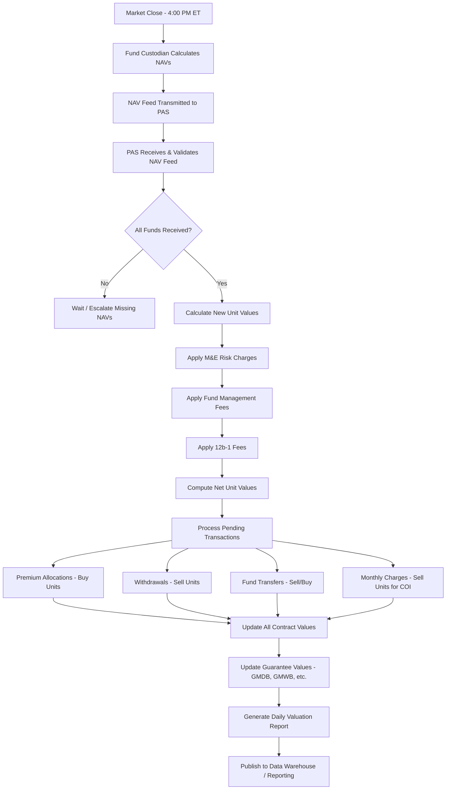
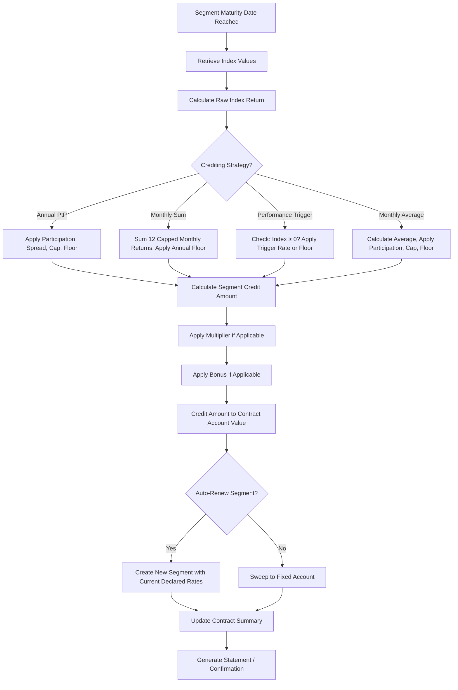
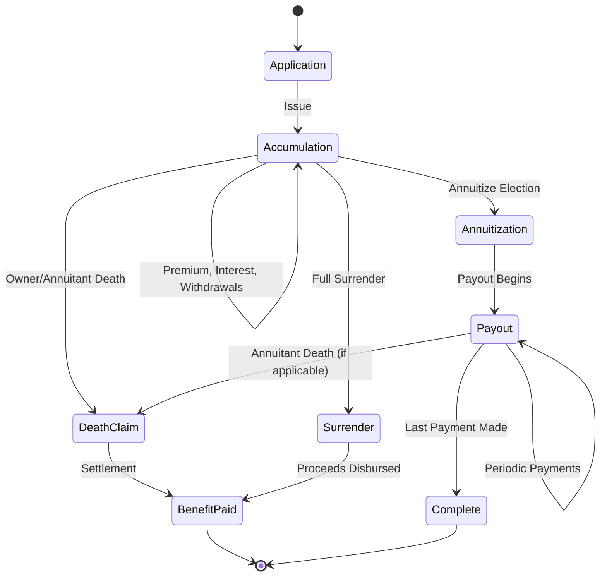
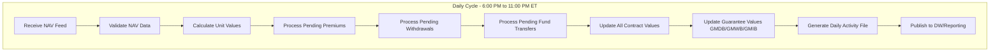
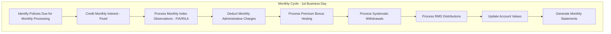
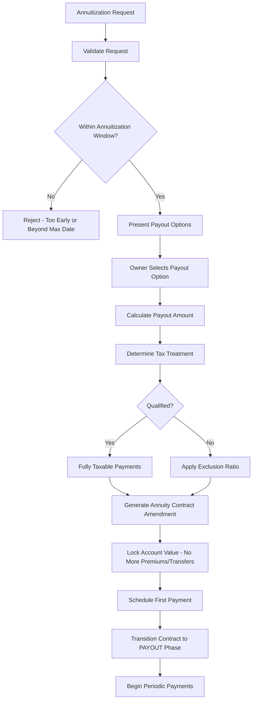
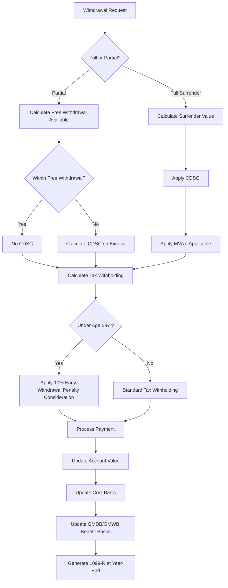
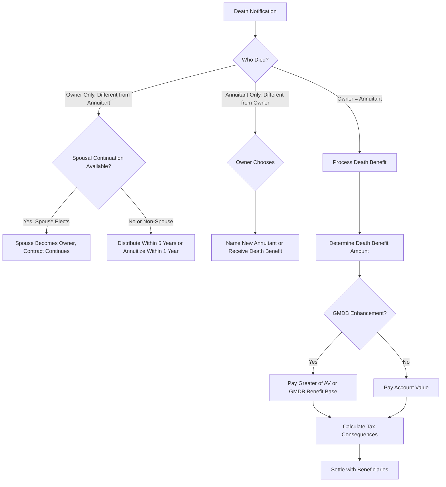
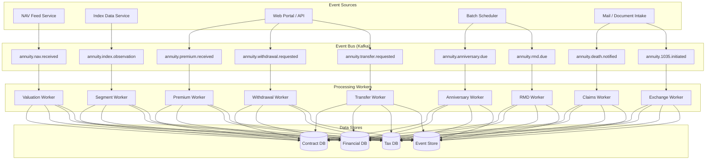

# Article 02 — Annuities Deep Dive

## A Solution Architect's Comprehensive Reference

---

## Table of Contents

1. [Introduction & Scope](#1-introduction--scope)
2. [Fixed Annuities](#2-fixed-annuities)
3. [Variable Annuities (VA)](#3-variable-annuities-va)
4. [Fixed Indexed Annuities (FIA)](#4-fixed-indexed-annuities-fia)
5. [Registered Index-Linked Annuities (RILA)](#5-registered-index-linked-annuities-rila)
6. [Immediate Annuities (SPIA)](#6-immediate-annuities-spia)
7. [Deferred Income Annuities (DIA)](#7-deferred-income-annuities-dia)
8. [Qualified vs. Non-Qualified Tax Treatment](#8-qualified-vs-non-qualified-tax-treatment)
9. [Annuity Phases & Processing Cycles](#9-annuity-phases--processing-cycles)
10. [Guaranteed Living Benefits (GLB)](#10-guaranteed-living-benefits-glb)
11. [Contract Roles & Processing Rules](#11-contract-roles--processing-rules)
12. [Complete Annuity Data Model](#12-complete-annuity-data-model)
13. [ACORD TXLife Annuity Reference](#13-acord-txlife-annuity-reference)
14. [PAS Processing Engine Design](#14-pas-processing-engine-design)
15. [Sample Payloads](#15-sample-payloads)
16. [Appendices](#16-appendices)

---

## 1. Introduction & Scope

### 1.1 Purpose

This article provides an exhaustive architectural reference for annuity products within a Policy Administration System (PAS). Annuities represent a distinct and complex product domain — they combine insurance guarantees, investment management, tax-deferred accumulation, and lifetime income distribution. A PAS must handle all of these dimensions across multiple annuity types, each with fundamentally different processing requirements.

### 1.2 Annuity Taxonomy

```
Annuity Products
├── Deferred Annuities (Accumulation Phase → Optional Annuitization)
│   ├── Fixed Annuities
│   │   ├── Traditional Fixed (Declared Rate)
│   │   ├── Multi-Year Guarantee Annuity (MYGA)
│   │   └── Market Value Adjusted (MVA)
│   ├── Variable Annuities (VA)
│   │   ├── Standard VA
│   │   ├── VA with GMDB (Guaranteed Minimum Death Benefit)
│   │   ├── VA with GMIB (Guaranteed Minimum Income Benefit)
│   │   ├── VA with GMWB (Guaranteed Minimum Withdrawal Benefit)
│   │   └── VA with GMAB (Guaranteed Minimum Accumulation Benefit)
│   ├── Fixed Indexed Annuities (FIA)
│   │   ├── Standard FIA
│   │   ├── FIA with GLWB (Guaranteed Lifetime Withdrawal Benefit)
│   │   └── FIA with Income Rider
│   └── Registered Index-Linked Annuities (RILA)
│       ├── Buffer Strategy
│       └── Floor Strategy
├── Immediate Annuities
│   ├── Single Premium Immediate Annuity (SPIA)
│   └── Structured Settlements
└── Deferred Income Annuities (DIA)
    ├── Qualified Longevity Annuity Contract (QLAC)
    └── Standard DIA
```

### 1.3 Annuity vs. Life Insurance — PAS Design Differences

| Dimension | Life Insurance | Annuity |
|---|---|---|
| **Primary Risk** | Mortality (dying too soon) | Longevity (living too long) |
| **Accumulation** | Secondary to protection | Primary purpose (deferred) |
| **Distribution** | Lump sum death benefit | Periodic income payments |
| **Tax Treatment** | Income tax free death benefit | Tax-deferred accumulation, taxable distributions |
| **Investment Options** | Limited (VUL only) | Extensive (VA, RILA) |
| **Regulatory** | State DOI | State DOI + SEC/FINRA (VA, RILA) |
| **Processing** | Event-driven + periodic | Highly periodic (daily/monthly/anniversary) |
| **Data Volume** | Moderate | Very high (daily valuations for VA) |

---

## 2. Fixed Annuities

### 2.1 Traditional Fixed (Declared Rate)

#### 2.1.1 Product Structure

A traditional fixed annuity accepts one or more premium payments and credits interest at a declared rate, typically with a minimum guaranteed rate. The declared rate may change periodically (usually annually at the contract anniversary).

**Key Parameters:**

| Parameter | Description | Typical Values |
|---|---|---|
| `InitialGuaranteedRate` | Rate guaranteed for the initial period | 3.0%–5.5% |
| `InitialGuaranteedPeriod` | Duration of initial rate guarantee | 1–10 years |
| `MinimumGuaranteedRate` | Contractual floor rate for life of contract | 1.0%–3.0% |
| `RenewalRateMethod` | How renewal rates are determined | Portfolio rate, new money rate, bucket |
| `PremiumType` | Single or flexible premium | Single Premium, Flexible Premium |
| `PremiumBonusRate` | Bonus added to first-year rate or premium | 0%–10% |
| `PremiumBonusVesting` | Vesting schedule for premium bonus | 10-year vesting typical |
| `SurrenderSchedule` | CDSC schedule | 7–10 year declining schedule |
| `FreeWithdrawalPct` | Annual penalty-free withdrawal percentage | 10% of AV or accumulated interest |
| `MinimumPremium` | Minimum initial premium | $5,000–$25,000 |
| `MaximumPremium` | Maximum premium (may require approval) | $500,000–$1,000,000 |
| `AnnuitizationOptions` | Available payout options | Life, Life with Period Certain, Joint Life |
| `DeathBenefitType` | Benefit paid on death | Account Value, Return of Premium, Enhanced |

#### 2.1.2 Interest Crediting

```python
class FixedAnnuityInterestEngine:
    """
    Credits interest to fixed annuity contracts.
    Supports declared rate, MYGA, and MVA contracts.
    """
    
    def credit_interest_monthly(self, contract: dict) -> dict:
        """Monthly interest crediting for fixed annuities."""
        av = contract['account_value']
        
        # Determine applicable rate
        current_rate = self._get_current_rate(contract)
        guaranteed_min = contract['minimum_guaranteed_rate']
        applicable_rate = max(current_rate, guaranteed_min)
        
        # Monthly rate from annual effective rate
        monthly_rate = (1 + applicable_rate) ** (1/12) - 1
        
        # Credit interest
        interest = av * monthly_rate
        new_av = av + interest
        
        # Apply premium bonus if in bonus period
        bonus_interest = 0
        if self._in_bonus_period(contract):
            bonus_rate = contract['premium_bonus_rate']
            monthly_bonus = (1 + bonus_rate) ** (1/12) - 1
            bonus_interest = av * monthly_bonus
            new_av += bonus_interest
        
        return {
            'contract_id': contract['contract_id'],
            'processing_date': contract['processing_date'],
            'beginning_av': round(av, 2),
            'base_rate_applied': round(applicable_rate, 6),
            'base_interest': round(interest, 2),
            'bonus_rate_applied': round(contract.get('premium_bonus_rate', 0), 6),
            'bonus_interest': round(bonus_interest, 2),
            'total_interest': round(interest + bonus_interest, 2),
            'ending_av': round(new_av, 2)
        }
    
    def _get_current_rate(self, contract: dict) -> float:
        """
        Determine the current credited rate based on:
        1. If within initial guarantee period: initial guaranteed rate
        2. If beyond initial guarantee: current declared renewal rate
        """
        contract_age_months = self._months_since_issue(contract)
        initial_period_months = contract['initial_guaranteed_period'] * 12
        
        if contract_age_months <= initial_period_months:
            return contract['initial_guaranteed_rate']
        else:
            return contract['current_renewal_rate']
    
    def _in_bonus_period(self, contract: dict) -> bool:
        if not contract.get('premium_bonus_rate'):
            return False
        contract_age_months = self._months_since_issue(contract)
        bonus_period_months = contract.get('premium_bonus_period_years', 0) * 12
        return contract_age_months <= bonus_period_months
    
    def _months_since_issue(self, contract: dict) -> int:
        from datetime import date
        issue = contract['issue_date']
        today = contract['processing_date']
        return (today.year - issue.year) * 12 + (today.month - issue.month)
```

### 2.2 Multi-Year Guarantee Annuity (MYGA)

#### 2.2.1 Product Structure

A MYGA guarantees a fixed interest rate for a specific number of years (typically 3, 5, 7, or 10). It functions similarly to a bank CD but with tax-deferred growth.

**Key Differentiators from Traditional Fixed:**

| Feature | MYGA | Traditional Fixed |
|---|---|---|
| **Rate Guarantee** | Entire term (e.g., 5 years at 4.5%) | Initial period, then renewable |
| **Premium Type** | Single premium only | Single or flexible |
| **Surrender Charge** | Aligns with guarantee period | May extend beyond guarantee |
| **Renewal** | At term end, new rate declared or rollover | Annually after initial period |
| **Target Market** | Conservative savers, CD alternatives | Long-term accumulation |

#### 2.2.2 MYGA PAS Processing

```sql
CREATE TABLE MYGA_CONTRACT (
    contract_id              VARCHAR(20)   PRIMARY KEY,
    contract_number          VARCHAR(15)   NOT NULL UNIQUE,
    product_code             VARCHAR(10)   NOT NULL,
    owner_party_id           VARCHAR(20)   NOT NULL,
    annuitant_party_id       VARCHAR(20)   NOT NULL,
    issue_date               DATE          NOT NULL,
    guarantee_term_years     SMALLINT      NOT NULL,
    guarantee_end_date       DATE          NOT NULL,
    guaranteed_rate          DECIMAL(6,4)  NOT NULL,
    minimum_guaranteed_rate  DECIMAL(6,4)  NOT NULL,
    initial_premium          DECIMAL(15,2) NOT NULL,
    account_value            DECIMAL(15,2) NOT NULL,
    surrender_value          DECIMAL(15,2) NOT NULL,
    premium_bonus_rate       DECIMAL(6,4)  DEFAULT 0,
    premium_bonus_vested_amt DECIMAL(15,2) DEFAULT 0,
    premium_bonus_vesting_pct DECIMAL(5,2) DEFAULT 0,
    free_withdrawal_pct      DECIMAL(5,2)  DEFAULT 10,
    free_withdrawal_remaining DECIMAL(15,2),
    contract_status          VARCHAR(15)   NOT NULL DEFAULT 'ACCUMULATION',
    tax_qualification        VARCHAR(10)   NOT NULL, -- NQ, IRA, ROTH, 403B
    cost_basis               DECIMAL(15,2) NOT NULL,
    total_withdrawals        DECIMAL(15,2) DEFAULT 0,
    total_interest_credited  DECIMAL(15,2) DEFAULT 0,
    maturity_date            DATE,
    annuitization_date       DATE,
    created_ts               TIMESTAMP     DEFAULT CURRENT_TIMESTAMP,
    updated_ts               TIMESTAMP     DEFAULT CURRENT_TIMESTAMP
);
```

### 2.3 Market Value Adjusted (MVA) Annuity

#### 2.3.1 MVA Mechanics

An MVA annuity adjusts the surrender value based on changes in interest rates since the contract was issued. If rates have risen, the MVA reduces the surrender value; if rates have fallen, the MVA increases it.

```python
def calculate_mva_adjustment(contract: dict, current_market_rate: float) -> dict:
    """
    Calculate Market Value Adjustment for early surrender.
    
    The MVA formula adjusts the account value based on the difference
    between the contract's guaranteed rate and current market rates.
    """
    guaranteed_rate = contract['guaranteed_rate']
    remaining_years = contract['remaining_guarantee_years']
    account_value = contract['account_value']
    
    # MVA Factor: reflects the present value impact of rate changes
    # Higher current rates → negative adjustment (rates went up, bond values down)
    # Lower current rates → positive adjustment (rates went down, bond values up)
    
    mva_factor = ((1 + guaranteed_rate) / (1 + current_market_rate)) ** remaining_years
    
    mva_adjustment = account_value * (mva_factor - 1)
    
    adjusted_value = account_value + mva_adjustment
    
    # Apply surrender charge after MVA
    surrender_charge_pct = contract['current_surrender_charge_pct']
    surrender_charge = adjusted_value * surrender_charge_pct
    
    surrender_value = adjusted_value - surrender_charge
    
    # Floor: surrender value cannot be less than minimum guaranteed value
    min_guaranteed = contract['minimum_guaranteed_value']
    surrender_value = max(surrender_value, min_guaranteed)
    
    return {
        'contract_id': contract['contract_id'],
        'account_value': round(account_value, 2),
        'guaranteed_rate': guaranteed_rate,
        'current_market_rate': current_market_rate,
        'remaining_years': remaining_years,
        'mva_factor': round(mva_factor, 6),
        'mva_adjustment': round(mva_adjustment, 2),
        'adjusted_value': round(adjusted_value, 2),
        'surrender_charge_pct': surrender_charge_pct,
        'surrender_charge': round(surrender_charge, 2),
        'net_surrender_value': round(surrender_value, 2),
        'mva_direction': 'FAVORABLE' if mva_adjustment > 0 else 'UNFAVORABLE'
    }
```

### 2.4 Bailout Provisions

Some fixed annuities include a bailout rate — if the renewal rate falls below this threshold, the contract owner can withdraw or surrender without penalty.

```sql
CREATE TABLE FIXED_ANNUITY_BAILOUT (
    contract_id       VARCHAR(20)  NOT NULL,
    bailout_rate      DECIMAL(6,4) NOT NULL,
    bailout_active    BOOLEAN      NOT NULL DEFAULT TRUE,
    bailout_triggered BOOLEAN      NOT NULL DEFAULT FALSE,
    trigger_date      DATE,
    window_start_date DATE,
    window_end_date   DATE,
    PRIMARY KEY (contract_id),
    FOREIGN KEY (contract_id) REFERENCES FIXED_ANNUITY_CONTRACT(contract_id)
);
```

### 2.5 Surrender Charge Schedules

```sql
CREATE TABLE ANNUITY_SURRENDER_SCHEDULE (
    product_code          VARCHAR(10)  NOT NULL,
    contract_year         SMALLINT     NOT NULL,
    surrender_charge_pct  DECIMAL(5,2) NOT NULL,
    PRIMARY KEY (product_code, contract_year)
);

-- Example MYGA 5-year surrender schedule
-- Year 1: 5%, Year 2: 4%, Year 3: 3%, Year 4: 2%, Year 5: 1%, Year 6+: 0%

-- Example traditional fixed 10-year schedule  
-- Year 1: 9%, Year 2: 8%, Year 3: 7%, Year 4: 6%, Year 5: 5%,
-- Year 6: 4%, Year 7: 3%, Year 8: 2%, Year 9: 1%, Year 10+: 0%
```

---

## 3. Variable Annuities (VA)

### 3.1 Product Overview

Variable annuities are the most operationally complex annuity product. They combine tax-deferred accumulation with investment in separate accounts (sub-accounts), guaranteed death benefits, and optional guaranteed living benefits. The PAS must handle daily valuations, unit accounting, and complex guarantee calculations.

### 3.2 Separate Account Architecture

```
┌─────────────────────────────────────────────────────────────────────┐
│                    VARIABLE ANNUITY CONTRACT                         │
│  Contract #: VA-2020-0012345                                        │
│  Contract Value: $327,845.20                                        │
│                                                                     │
│  ┌──────────────┐  ┌──────────────┐  ┌──────────────┐             │
│  │ Fixed Account │  │ Sub-Account  │  │ Sub-Account  │             │
│  │ (General Acct)│  │ Large Cap    │  │ Small Cap    │             │
│  │              │  │ Growth Fund  │  │ Value Fund   │             │
│  │ Rate: 3.0%   │  │              │  │              │             │
│  │ Value:       │  │ Units: 2,341 │  │ Units: 1,567 │             │
│  │ $50,000.00   │  │ UV: $52.31  │  │ UV: $38.44  │             │
│  │              │  │ Value:       │  │ Value:       │             │
│  │              │  │ $122,458.71  │  │ $60,235.48  │             │
│  └──────────────┘  └──────────────┘  └──────────────┘             │
│                                                                     │
│  ┌──────────────┐  ┌──────────────┐  ┌──────────────┐             │
│  │ Sub-Account  │  │ Sub-Account  │  │ Sub-Account  │             │
│  │ International│  │ Bond Fund    │  │ Money Market │             │
│  │ Equity Fund  │  │              │  │ Fund         │             │
│  │              │  │              │  │              │             │
│  │ Units: 890   │  │ Units: 3,200 │  │ Units: 450   │             │
│  │ UV: $41.20  │  │ UV: $12.85  │  │ UV: $1.00   │             │
│  │ Value:       │  │ Value:       │  │ Value:       │             │
│  │ $36,668.00  │  │ $41,120.00  │  │ $450.00     │             │
│  └──────────────┘  └──────────────┘  └──────────────┘             │
│                                                                     │
│  Riders:                                                            │
│  ├── GMDB: Return of Premium ($285,000 guaranteed minimum)          │
│  ├── GMWB: 5% annual withdrawal of benefit base ($14,250/yr)       │
│  └── Nursing Home Waiver                                            │
└─────────────────────────────────────────────────────────────────────┘
```

### 3.3 Unit Value Mechanics

#### 3.3.1 Daily Valuation Process



#### 3.3.2 Unit Value Calculation

```python
class VADailyValuationEngine:
    """
    Processes daily valuation for all variable annuity contracts.
    Runs as a batch process after market close.
    """
    
    def calculate_unit_value(self, fund: dict, nav_data: dict) -> dict:
        """
        Calculate the net unit value for a sub-account after charges.
        
        Gross Unit Value reflects the raw fund NAV.
        Net Unit Value reflects the fund NAV after daily M&E, admin, and fund charges.
        """
        previous_uv = fund['previous_unit_value']
        
        # Daily gross return from the underlying fund
        current_nav = nav_data['nav']
        previous_nav = nav_data['previous_nav']
        gross_daily_return = (current_nav - previous_nav) / previous_nav
        
        # Daily charges (annualized rates converted to daily)
        trading_days = 365  # some use 252 trading days or 365 calendar days
        
        me_daily = fund['me_risk_charge_annual'] / trading_days
        admin_daily = fund['admin_fee_annual'] / trading_days
        fund_mgmt_daily = fund['fund_management_fee_annual'] / trading_days
        twelve_b1_daily = fund['twelve_b1_fee_annual'] / trading_days
        
        total_daily_charge = me_daily + admin_daily + fund_mgmt_daily + twelve_b1_daily
        
        # Net daily return
        net_daily_return = gross_daily_return - total_daily_charge
        
        # New unit value
        new_uv = previous_uv * (1 + net_daily_return)
        
        return {
            'fund_code': fund['fund_code'],
            'valuation_date': nav_data['valuation_date'],
            'previous_unit_value': round(previous_uv, 6),
            'gross_daily_return': round(gross_daily_return, 8),
            'me_charge': round(me_daily, 8),
            'admin_charge': round(admin_daily, 8),
            'fund_mgmt_charge': round(fund_mgmt_daily, 8),
            'twelve_b1_charge': round(twelve_b1_daily, 8),
            'total_daily_charge': round(total_daily_charge, 8),
            'net_daily_return': round(net_daily_return, 8),
            'new_unit_value': round(new_uv, 6)
        }
    
    def value_contract(self, contract: dict, unit_values: dict) -> dict:
        """
        Calculate total contract value by summing all sub-account values.
        """
        total_value = 0
        sub_account_values = []
        
        for holding in contract['sub_account_holdings']:
            fund_code = holding['fund_code']
            units = holding['unit_balance']
            uv = unit_values[fund_code]
            value = units * uv
            total_value += value
            
            sub_account_values.append({
                'fund_code': fund_code,
                'units': round(units, 6),
                'unit_value': round(uv, 6),
                'market_value': round(value, 2)
            })
        
        # Add fixed account value
        if contract.get('fixed_account_value'):
            total_value += contract['fixed_account_value']
        
        return {
            'contract_id': contract['contract_id'],
            'valuation_date': contract['valuation_date'],
            'sub_accounts': sub_account_values,
            'fixed_account_value': round(contract.get('fixed_account_value', 0), 2),
            'total_contract_value': round(total_value, 2),
            'total_surrender_value': round(
                total_value - self._surrender_charge(contract, total_value), 2
            )
        }
    
    def _surrender_charge(self, contract: dict, total_value: float) -> float:
        contract_year = self._contract_year(contract)
        schedule = contract['surrender_schedule']
        pct = schedule.get(contract_year, 0)
        return total_value * pct
    
    def _contract_year(self, contract: dict) -> int:
        from datetime import date
        issue = contract['issue_date']
        today = contract['valuation_date']
        years = today.year - issue.year
        if (today.month, today.day) < (issue.month, issue.day):
            years -= 1
        return years + 1
```

### 3.4 VA Charge Structure

| Charge | Description | Basis | Typical Range | PAS Processing |
|---|---|---|---|---|
| **M&E Risk Charge** | Mortality and expense risk charge | Daily on AV (annualized) | 0.50%–1.40% | Deducted through unit value reduction |
| **Administrative Charge** | Contract admin fee | Annual flat fee or basis points | $30–$50/yr or 0.10%–0.15% | Deducted annually or through UV |
| **Fund Management Fee** | Underlying fund expense ratio | Daily on sub-account AV | 0.30%–2.00% | Deducted within fund NAV |
| **12b-1 Distribution Fee** | Trail commission/distribution | Daily on sub-account AV | 0.00%–0.25% | Deducted within fund NAV |
| **Rider Charge (GMDB)** | Guaranteed minimum death benefit | Annual/quarterly on benefit base | 0.15%–0.40% | Deducted by selling units |
| **Rider Charge (GMWB)** | Guaranteed withdrawal benefit | Annual/quarterly on benefit base | 0.50%–1.25% | Deducted by selling units |
| **Rider Charge (GMIB)** | Guaranteed income benefit | Annual/quarterly on benefit base | 0.50%–1.00% | Deducted by selling units |
| **Rider Charge (GMAB)** | Guaranteed accumulation benefit | Annual/quarterly on benefit base | 0.25%–0.75% | Deducted by selling units |
| **CDSC** | Contingent deferred sales charge | On surrenders/excess withdrawals | 7%–1% graded | Deducted from proceeds |
| **Transfer Fee** | Fee for excess fund transfers | Per transfer | $0–$25 | Deducted from AV |
| **Premium Tax** | State premium tax | On premiums | 0%–3.5% | Varies by state |

### 3.5 Free Withdrawal Provisions

Most VAs allow annual penalty-free withdrawals. The PAS must track:

```sql
CREATE TABLE VA_FREE_WITHDRAWAL_TRACKING (
    contract_id               VARCHAR(20)   NOT NULL,
    contract_year             SMALLINT      NOT NULL,
    anniversary_date          DATE          NOT NULL,
    free_withdrawal_method    VARCHAR(20)   NOT NULL, -- PCT_AV, PCT_PREMIUM, EARNINGS_ONLY, GREATER_OF
    free_withdrawal_pct       DECIMAL(5,2)  NOT NULL,
    base_amount               DECIMAL(15,2) NOT NULL,
    free_amount_available     DECIMAL(15,2) NOT NULL,
    free_amount_used_ytd      DECIMAL(15,2) NOT NULL DEFAULT 0,
    free_amount_remaining     DECIMAL(15,2) NOT NULL,
    rmd_withdrawal_ytd        DECIMAL(15,2) NOT NULL DEFAULT 0, -- RMDs are always free
    non_free_withdrawal_ytd   DECIMAL(15,2) NOT NULL DEFAULT 0,
    cdsc_charged_ytd          DECIMAL(12,2) NOT NULL DEFAULT 0,
    PRIMARY KEY (contract_id, contract_year),
    FOREIGN KEY (contract_id) REFERENCES VA_CONTRACT(contract_id)
);
```

### 3.6 VA Sub-Account Data Model

```sql
-- Sub-account master (fund shelf)
CREATE TABLE VA_SUB_ACCOUNT_MASTER (
    fund_code              VARCHAR(10)   PRIMARY KEY,
    fund_name              VARCHAR(200)  NOT NULL,
    fund_family            VARCHAR(100),
    asset_class            VARCHAR(50)   NOT NULL, -- EQUITY_LARGE, EQUITY_SMALL, BOND, INTL, MONEY_MKT, BALANCED
    investment_style       VARCHAR(20),            -- GROWTH, VALUE, BLEND, INDEX
    fund_manager           VARCHAR(100),
    inception_date         DATE          NOT NULL,
    expense_ratio          DECIMAL(6,4)  NOT NULL,
    me_risk_charge         DECIMAL(6,4)  NOT NULL,
    twelve_b1_fee          DECIMAL(6,4)  NOT NULL,
    total_annual_charge    DECIMAL(6,4)  NOT NULL,
    morningstar_category   VARCHAR(50),
    risk_level             SMALLINT,     -- 1=low, 5=high
    prospectus_date        DATE,
    status                 VARCHAR(10)   DEFAULT 'ACTIVE',
    sec_registration_id    VARCHAR(30)
);

-- Contract holdings in sub-accounts
CREATE TABLE VA_CONTRACT_HOLDING (
    contract_id          VARCHAR(20)    NOT NULL,
    fund_code            VARCHAR(10)    NOT NULL,
    unit_balance         DECIMAL(18,6)  NOT NULL DEFAULT 0,
    market_value         DECIMAL(15,2)  NOT NULL DEFAULT 0,
    cost_basis           DECIMAL(15,2)  NOT NULL DEFAULT 0,
    allocation_pct       DECIMAL(5,2)   DEFAULT 0,
    last_valuation_date  DATE           NOT NULL,
    PRIMARY KEY (contract_id, fund_code),
    FOREIGN KEY (contract_id) REFERENCES VA_CONTRACT(contract_id),
    FOREIGN KEY (fund_code) REFERENCES VA_SUB_ACCOUNT_MASTER(fund_code)
);

-- Daily unit value history
CREATE TABLE VA_UNIT_VALUE_HISTORY (
    fund_code         VARCHAR(10)   NOT NULL,
    valuation_date    DATE          NOT NULL,
    unit_value        DECIMAL(12,6) NOT NULL,
    daily_return      DECIMAL(10,8),
    nav_per_share     DECIMAL(12,6),
    total_net_assets  DECIMAL(18,2),
    PRIMARY KEY (fund_code, valuation_date)
);

-- Transaction history for unit accounting
CREATE TABLE VA_UNIT_TRANSACTION (
    transaction_id      BIGSERIAL     PRIMARY KEY,
    contract_id         VARCHAR(20)   NOT NULL,
    fund_code           VARCHAR(10)   NOT NULL,
    transaction_date    DATE          NOT NULL,
    transaction_type    VARCHAR(20)   NOT NULL,
    -- Types: PREMIUM_ALLOC, WITHDRAWAL, TRANSFER_IN, TRANSFER_OUT,
    --        RIDER_CHARGE, ADMIN_CHARGE, DCA_IN, DCA_OUT, REBALANCE_IN, REBALANCE_OUT
    units               DECIMAL(18,6) NOT NULL, -- positive=buy, negative=sell
    unit_value          DECIMAL(12,6) NOT NULL,
    dollar_amount       DECIMAL(15,2) NOT NULL,
    running_unit_bal    DECIMAL(18,6) NOT NULL,
    reference_id        VARCHAR(30),  -- links related transactions
    created_ts          TIMESTAMP     DEFAULT CURRENT_TIMESTAMP
);
```

---

## 4. Fixed Indexed Annuities (FIA)

### 4.1 Product Overview

Fixed Indexed Annuities (also called Equity Indexed Annuities) credit interest based on the performance of an external market index while guaranteeing that the contract value will never decrease due to index performance. They occupy a middle ground between fixed and variable annuities.

### 4.2 Crediting Strategies

#### 4.2.1 Annual Point-to-Point

The most common FIA crediting strategy. Measures index change over a one-year period.

```
Segment Credit = max(Floor, min(Cap, Participation × Index Return - Spread))

Where:
  Index Return = (Index Value at End - Index Value at Start) / Index Value at Start
```

#### 4.2.2 Monthly Sum (Monthly Point-to-Point)

Sums 12 individually capped monthly returns.

```
For each month m = 1 to 12:
  Monthly Return(m) = (Index(m) - Index(m-1)) / Index(m-1)
  Capped Return(m) = min(Monthly Cap, Monthly Return(m))
  [Note: no monthly floor — negative months are NOT floored]

Annual Credit = Σ Capped Return(m) for m = 1 to 12
Segment Credit = max(Annual Floor, Annual Credit)
```

**PAS Note:** Monthly sum is asymmetric — positive months are capped but negative months are NOT floored at the monthly level. Only the annual result has a floor. This creates a negative skew that the PAS illustration engine must correctly model.

#### 4.2.3 Performance Trigger (Declared Rate Trigger)

```
If Index Return ≥ 0%:
    Credited Rate = Trigger Rate (declared, e.g., 6.5%)
Else:
    Credited Rate = Floor Rate (typically 0%)
```

#### 4.2.4 Multi-Year Point-to-Point

Measures index performance over 2, 3, or 5 years.

```
Multi-Year Return = (Index Value at End of Period - Index Value at Start) / Index Value at Start
Credited Rate = max(Floor, min(Cap, Participation × Multi-Year Return - Spread))
```

**PAS Note:** Multi-year segments lock up funds for the full period — the PAS must enforce different withdrawal rules during the segment term.

#### 4.2.5 Crediting Strategy Comparison

| Strategy | Upside | Downside | Complexity | When Best |
|---|---|---|---|---|
| **Annual PtP** | Capped or participation-limited | 0% floor | Low | Simple, transparent |
| **Monthly Sum** | Monthly cap limits upside | Negative months uncapped | Medium | Moderate gains expected |
| **Performance Trigger** | Fixed declared rate | 0% if index negative | Low | Flat/uncertain markets |
| **Multi-Year PtP** | Higher caps (longer term) | Locked funds | Medium | Long-term horizon |
| **Monthly Average** | Smoothed returns | Averaging drag | Medium | Volatile markets |

### 4.3 Index Options

#### 4.3.1 Standard Indices

| Index | Code | Description | Typical Crediting |
|---|---|---|---|
| S&P 500 Price Return | `SP500` | Large-cap US equities (price only) | Annual PtP, Monthly Sum |
| Russell 2000 | `RUSS2000` | Small-cap US equities | Annual PtP |
| MSCI EAFE | `MSCIEAFE` | International developed equities | Annual PtP |
| Nasdaq-100 | `NDX100` | Large-cap tech-heavy equities | Annual PtP |
| DJIA (Dow Jones) | `DJIA` | 30 large-cap US blue chips | Annual PtP |
| EURO STOXX 50 | `ESTX50` | European large-cap equities | Annual PtP |
| Hang Seng | `HSI` | Hong Kong large-cap equities | Annual PtP |

#### 4.3.2 Volatility-Controlled and Custom Indices

| Index | Provider | Target Vol | Strategy |
|---|---|---|---|
| S&P 500 Daily Risk Control 5% | S&P DJI | 5% | Dynamic equity/T-bill |
| BNP Paribas Multi Asset Diversified 5 | BNP | 5% | Multi-asset vol target |
| Credit Suisse Momentum Index | Credit Suisse | Varies | Momentum equity |
| Barclays Transatlantic Index | Barclays | 5% | US/EU/UK equities |
| J.P. Morgan Mozaic II | J.P. Morgan | 5% | Multi-asset momentum |
| BlackRock iBLD Diversa | BlackRock | Varies | ESG multi-asset |
| PIMCO Tactical Balanced ER | PIMCO | 5% | Bonds + commodities |
| Fidelity AIM Dividend Index | Fidelity | Varies | Dividend-focused equity |

**PAS Impact for Custom Indices:**
- Daily index values must be obtained from the index provider (not public exchanges)
- Index methodology documents must be retained for regulatory purposes
- Custom indices may have complex calculation dates (not just market close)
- Some custom indices publish with a 1-day lag

### 4.4 Cap/Participation/Spread Mechanics

#### 4.4.1 Rate-Setting Process

FIA caps, participation rates, and spreads are declared by the carrier and can change at each segment renewal. The PAS must:

1. Store the current declared rates for each index/strategy combination
2. Apply the rates in effect at segment inception for the duration of that segment
3. Apply new rates at segment renewal
4. Maintain a history of all rate declarations

```sql
-- Declared rate history
CREATE TABLE FIA_DECLARED_RATES (
    rate_declaration_id   SERIAL        PRIMARY KEY,
    product_code          VARCHAR(10)   NOT NULL,
    index_code            VARCHAR(20)   NOT NULL,
    crediting_strategy    VARCHAR(20)   NOT NULL,
    effective_date        DATE          NOT NULL,
    cap_rate              DECIMAL(6,4),
    participation_rate    DECIMAL(6,4),
    floor_rate            DECIMAL(6,4),
    spread_rate           DECIMAL(6,4),
    trigger_rate          DECIMAL(6,4),
    monthly_cap_rate      DECIMAL(6,4),
    multiplier            DECIMAL(6,4)  DEFAULT 1.0,
    bonus_rate            DECIMAL(6,4)  DEFAULT 0,
    declaration_date      DATE          NOT NULL,
    approved_by           VARCHAR(50),
    UNIQUE (product_code, index_code, crediting_strategy, effective_date)
);
```

### 4.5 FIA Segment Processing



### 4.6 FIA Segment Data Model

```sql
CREATE TABLE FIA_SEGMENT (
    segment_id            SERIAL        PRIMARY KEY,
    contract_id           VARCHAR(20)   NOT NULL,
    segment_sequence      SMALLINT      NOT NULL,
    segment_type          VARCHAR(15)   NOT NULL, -- INDEXED, FIXED
    index_code            VARCHAR(20),
    crediting_strategy    VARCHAR(20),
    segment_start_date    DATE          NOT NULL,
    segment_end_date      DATE          NOT NULL,
    segment_term_months   SMALLINT      NOT NULL DEFAULT 12,
    segment_start_value   DECIMAL(15,2) NOT NULL,
    segment_end_value     DECIMAL(15,2),
    index_start_value     DECIMAL(12,4),
    index_end_value       DECIMAL(12,4),
    cap_rate              DECIMAL(6,4),
    participation_rate    DECIMAL(6,4),
    floor_rate            DECIMAL(6,4)  DEFAULT 0,
    spread_rate           DECIMAL(6,4)  DEFAULT 0,
    trigger_rate          DECIMAL(6,4),
    monthly_cap           DECIMAL(6,4),
    multiplier            DECIMAL(6,4)  DEFAULT 1.0,
    bonus_rate            DECIMAL(6,4)  DEFAULT 0,
    raw_index_return      DECIMAL(10,6),
    credited_rate         DECIMAL(10,6),
    credit_amount         DECIMAL(15,2),
    segment_status        VARCHAR(10)   NOT NULL DEFAULT 'ACTIVE',
    auto_renew            BOOLEAN       DEFAULT TRUE,
    renewed_from_segment  INTEGER,
    FOREIGN KEY (contract_id) REFERENCES FIA_CONTRACT(contract_id)
);

-- Monthly observations for monthly crediting strategies
CREATE TABLE FIA_SEGMENT_MONTHLY (
    segment_id          INTEGER       NOT NULL,
    month_number        SMALLINT      NOT NULL,
    observation_date    DATE          NOT NULL,
    index_value         DECIMAL(12,4) NOT NULL,
    monthly_raw_return  DECIMAL(10,8),
    monthly_capped_return DECIMAL(10,8),
    cumulative_return   DECIMAL(10,8),
    PRIMARY KEY (segment_id, month_number),
    FOREIGN KEY (segment_id) REFERENCES FIA_SEGMENT(segment_id)
);
```

### 4.7 Premium Bonus and Vesting

Many FIA products offer a premium bonus — an additional percentage added to the initial premium (e.g., 5%–10%). This bonus typically vests over time.

```sql
CREATE TABLE FIA_PREMIUM_BONUS (
    bonus_id              SERIAL        PRIMARY KEY,
    contract_id           VARCHAR(20)   NOT NULL,
    premium_date          DATE          NOT NULL,
    premium_amount        DECIMAL(15,2) NOT NULL,
    bonus_rate            DECIMAL(6,4)  NOT NULL,
    bonus_amount          DECIMAL(15,2) NOT NULL,
    vesting_schedule_code VARCHAR(10)   NOT NULL,
    vested_pct            DECIMAL(5,2)  NOT NULL DEFAULT 0,
    vested_amount         DECIMAL(15,2) NOT NULL DEFAULT 0,
    fully_vested_date     DATE,
    status                VARCHAR(10)   DEFAULT 'VESTING',
    FOREIGN KEY (contract_id) REFERENCES FIA_CONTRACT(contract_id)
);

CREATE TABLE FIA_BONUS_VESTING_SCHEDULE (
    vesting_schedule_code VARCHAR(10)  NOT NULL,
    contract_year         SMALLINT     NOT NULL,
    cumulative_vested_pct DECIMAL(5,2) NOT NULL,
    PRIMARY KEY (vesting_schedule_code, contract_year)
);

-- Example: 10% bonus, 10-year vesting
-- Year 1: 10%, Year 2: 20%, ... Year 10: 100%
```

### 4.8 Guaranteed Minimum Value

FIA contracts guarantee a minimum value regardless of index performance — typically:

```
Guaranteed Minimum Value = (87.5% × Total Premiums Paid) × (1 + Guaranteed Min Rate)^n - Withdrawals

Where:
  87.5% = typical percentage (varies: 85%–100%)
  Guaranteed Min Rate = 1%–3% (contractual)
  n = number of years since issue
```

```python
def calculate_fia_guaranteed_minimum(contract: dict) -> float:
    """
    Calculate the guaranteed minimum contract value for an FIA.
    This is the floor that the contract can never go below.
    """
    total_premiums = contract['total_premiums_paid']
    premium_pct = contract['guaranteed_premium_pct']  # e.g., 0.875
    guaranteed_rate = contract['guaranteed_minimum_rate']  # e.g., 0.01
    years_since_issue = contract['years_since_issue']
    total_withdrawals = contract['total_withdrawals']
    
    base = total_premiums * premium_pct
    accumulated = base * ((1 + guaranteed_rate) ** years_since_issue)
    guaranteed_min = accumulated - total_withdrawals
    
    return max(0, round(guaranteed_min, 2))
```

---

## 5. Registered Index-Linked Annuities (RILA)

### 5.1 Product Overview

RILAs (also called "structured annuities" or "buffered annuities") are SEC-registered products that provide index-linked returns with defined downside protection. Unlike FIAs (which guarantee 0% floor), RILAs allow negative returns within defined boundaries, in exchange for higher upside potential.

### 5.2 Protection Strategies

#### 5.2.1 Buffer Strategy

The carrier absorbs the first X% of losses. The contract owner absorbs losses beyond the buffer.

```
If Index Return ≥ 0:
    Credited Rate = min(Cap, Index Return)
Else:
    If |Index Return| ≤ Buffer:
        Credited Rate = 0% (carrier absorbs the loss)
    Else:
        Credited Rate = Index Return + Buffer (owner absorbs excess)

Example (10% Buffer, 15% Cap):
  Index Return = +20%  → Credited = +15% (capped)
  Index Return = +8%   → Credited = +8%
  Index Return = -7%   → Credited = 0% (within 10% buffer)
  Index Return = -15%  → Credited = -5% (owner absorbs 15% - 10% buffer = -5%)
  Index Return = -30%  → Credited = -20% (owner absorbs 30% - 10% buffer = -20%)
```

#### 5.2.2 Floor Strategy

The contract guarantees a maximum loss (floor), regardless of index performance.

```
Credited Rate = max(Floor, min(Cap, Index Return))

Example (-10% Floor, 12% Cap):
  Index Return = +20%  → Credited = +12% (capped)
  Index Return = +8%   → Credited = +8%
  Index Return = -7%   → Credited = -7% (owner absorbs, above floor)
  Index Return = -15%  → Credited = -10% (floored at -10%)
  Index Return = -30%  → Credited = -10% (floored at -10%)
```

### 5.3 RILA PAS Processing

```python
def calculate_rila_segment_credit(segment: dict, index_data: dict) -> dict:
    """
    Calculate segment credit for a RILA segment.
    Handles buffer and floor protection strategies.
    """
    start_val = index_data['start_value']
    end_val = index_data['end_value']
    raw_return = (end_val - start_val) / start_val
    
    protection_type = segment['protection_type']  # BUFFER or FLOOR
    cap = segment.get('cap_rate', float('inf'))
    
    if protection_type == 'BUFFER':
        buffer = segment['buffer_rate']  # e.g., 0.10 for 10%
        
        if raw_return >= 0:
            credited = min(cap, raw_return)
        elif abs(raw_return) <= buffer:
            credited = 0
        else:
            credited = raw_return + buffer
    
    elif protection_type == 'FLOOR':
        floor = segment['floor_rate']  # e.g., -0.10 for -10%
        credited = max(floor, min(cap, raw_return))
    
    credit_amount = segment['segment_start_value'] * credited
    end_value = segment['segment_start_value'] + credit_amount
    
    return {
        'segment_id': segment['segment_id'],
        'protection_type': protection_type,
        'raw_index_return': round(raw_return, 6),
        'credited_rate': round(credited, 6),
        'credit_amount': round(credit_amount, 2),
        'segment_end_value': round(end_value, 2),
        'protection_used': raw_return < 0
    }
```

### 5.4 SEC Registration Requirements

Since RILAs expose the contract owner to downside risk, they are classified as securities:

| Requirement | PAS Impact |
|---|---|
| **SEC Form S-1 or S-3** | Product registered with SEC; PAS must track prospectus versions |
| **Prospectus Delivery** | Must deliver prospectus before or at sale; track delivery |
| **Annual/Semi-Annual Reports** | Track delivery of fund reports to owners |
| **FINRA Suitability** | Initial sale suitability — PAS stores suitability assessment |
| **State Blue Sky Laws** | Product must be approved state-by-state |
| **Trade Confirmations** | Written confirmations for transactions |

### 5.5 RILA Data Model

```sql
CREATE TABLE RILA_CONTRACT (
    contract_id              VARCHAR(20)   PRIMARY KEY,
    contract_number          VARCHAR(15)   NOT NULL UNIQUE,
    product_code             VARCHAR(10)   NOT NULL,
    owner_party_id           VARCHAR(20)   NOT NULL,
    annuitant_party_id       VARCHAR(20)   NOT NULL,
    issue_date               DATE          NOT NULL,
    account_value            DECIMAL(15,2) NOT NULL,
    total_premiums_paid      DECIMAL(15,2) NOT NULL,
    total_withdrawals        DECIMAL(15,2) DEFAULT 0,
    surrender_value          DECIMAL(15,2) NOT NULL,
    contract_status          VARCHAR(15)   DEFAULT 'ACCUMULATION',
    tax_qualification        VARCHAR(10)   NOT NULL,
    cost_basis               DECIMAL(15,2) NOT NULL,
    sec_registration_id      VARCHAR(30),
    prospectus_version       VARCHAR(20),
    prospectus_delivery_date DATE
);

CREATE TABLE RILA_SEGMENT (
    segment_id            SERIAL        PRIMARY KEY,
    contract_id           VARCHAR(20)   NOT NULL,
    index_code            VARCHAR(20)   NOT NULL,
    protection_type       VARCHAR(10)   NOT NULL, -- BUFFER, FLOOR
    buffer_rate           DECIMAL(6,4),
    floor_rate            DECIMAL(6,4),
    cap_rate              DECIMAL(6,4),
    participation_rate    DECIMAL(6,4)  DEFAULT 1.0,
    segment_term_years    SMALLINT      NOT NULL, -- 1, 2, 3, 6
    segment_start_date    DATE          NOT NULL,
    segment_end_date      DATE          NOT NULL,
    segment_start_value   DECIMAL(15,2) NOT NULL,
    segment_end_value     DECIMAL(15,2),
    index_start_value     DECIMAL(12,4) NOT NULL,
    index_end_value       DECIMAL(12,4),
    raw_index_return      DECIMAL(10,6),
    credited_rate         DECIMAL(10,6),
    credit_amount         DECIMAL(15,2),
    interim_value         DECIMAL(15,2), -- daily estimated value before maturity
    segment_status        VARCHAR(10)   DEFAULT 'ACTIVE',
    FOREIGN KEY (contract_id) REFERENCES RILA_CONTRACT(contract_id)
);
```

---

## 6. Immediate Annuities (SPIA)

### 6.1 Product Overview

A Single Premium Immediate Annuity converts a lump sum premium into a stream of periodic income payments beginning within one payment period (typically 1 month) after purchase. SPIAs are in the payout phase from inception — there is no accumulation phase.

### 6.2 Payout Options

| Option Code | Payout Option | Description | Mortality Risk |
|---|---|---|---|
| `LIFE` | Life Only | Payments for annuitant's lifetime; no payments after death | Full longevity risk transferred to carrier |
| `LIFE_PC` | Life with Period Certain | Payments for life, with minimum guaranteed period (5, 10, 15, 20 years) | Longevity risk with minimum guarantee |
| `PERIOD_CERTAIN` | Period Certain Only | Payments for fixed period regardless of survival | No mortality risk — fixed schedule |
| `JOINT_SURV` | Joint and Survivor | Payments for both lives; continues at 100%, 75%, 67%, or 50% to survivor | Two-life longevity risk |
| `JOINT_PC` | Joint with Period Certain | Joint and survivor with minimum period certain | Two-life + period certain |
| `LIFE_REFUND` | Life with Cash Refund | Payments for life; if annuitant dies before premiums recovered, balance paid lump sum | Modified longevity risk |
| `LIFE_INST_REFUND` | Life with Installment Refund | Same as refund but balance paid in installments | Modified longevity risk |
| `INFLATION_ADJ` | Life with COLA | Payments increase annually by fixed percentage or CPI | Longevity + inflation risk |
| `TEMP_LIFE` | Temporary Life Annuity | Payments for lesser of life or specified period | Limited longevity risk |

### 6.3 Payout Calculation

#### 6.3.1 Actuarial Present Value Method

```python
class SPIAPayoutCalculator:
    """
    Calculates periodic payout amounts for immediate annuities
    using actuarial present value methodology.
    """
    
    def calculate_life_annuity_payout(self, premium: float, 
                                       annuitant_age: int,
                                       gender: str,
                                       payout_mode: str,
                                       interest_rate: float,
                                       mortality_table: dict,
                                       period_certain: int = 0) -> dict:
        """
        Calculate the periodic payout for a life annuity.
        
        Premium = Payout × ä (annuity-due factor)
        Payout = Premium / ä
        
        Where ä = present value of $1 annuity-due at the given age, 
                  interest rate, and mortality basis.
        """
        payout_frequency = {'ANNUAL': 1, 'SEMIANNUAL': 2, 
                           'QUARTERLY': 4, 'MONTHLY': 12}[payout_mode]
        
        # Calculate annuity factor
        annuity_factor = self._annuity_due_factor(
            annuitant_age, gender, interest_rate, 
            mortality_table, payout_frequency, period_certain
        )
        
        annual_payout = premium / annuity_factor
        periodic_payout = annual_payout / payout_frequency
        
        # Exclusion ratio for non-qualified (tax purposes)
        expected_return = annual_payout * self._life_expectancy(
            annuitant_age, gender, mortality_table
        )
        if period_certain > 0:
            expected_return = max(expected_return, annual_payout * period_certain)
        
        exclusion_ratio = min(1.0, premium / expected_return)
        taxable_per_payment = periodic_payout * (1 - exclusion_ratio)
        excluded_per_payment = periodic_payout * exclusion_ratio
        
        return {
            'premium': round(premium, 2),
            'annuity_factor': round(annuity_factor, 6),
            'annual_payout': round(annual_payout, 2),
            'periodic_payout': round(periodic_payout, 2),
            'payout_frequency': payout_mode,
            'period_certain_years': period_certain,
            'exclusion_ratio': round(exclusion_ratio, 4),
            'taxable_per_payment': round(taxable_per_payment, 2),
            'excluded_per_payment': round(excluded_per_payment, 2),
            'expected_return': round(expected_return, 2)
        }
    
    def _annuity_due_factor(self, age: int, gender: str, i: float, 
                             mortality: dict, freq: int, 
                             certain: int) -> float:
        """
        Calculate the present value annuity-due factor.
        Combines certain and life components for life with period certain.
        """
        v = 1 / (1 + i)
        
        # Period certain component
        certain_factor = 0
        if certain > 0:
            for t in range(certain * freq):
                k = t / freq
                certain_factor += v ** k / freq
        
        # Life contingent component (beyond certain period)
        life_factor = 0
        start_year = certain if certain > 0 else 0
        
        for t in range(start_year * freq, 120 * freq):
            k = t / freq
            year = int(k)
            survival_prob = self._survival_probability(age, gender, year, mortality)
            if survival_prob < 0.0001:
                break
            life_factor += v ** k * survival_prob / freq
        
        return certain_factor + life_factor
    
    def _survival_probability(self, age: int, gender: str, 
                               years: int, mortality: dict) -> float:
        prob = 1.0
        for t in range(years):
            qx = mortality.get((age + t, gender), 1.0)
            prob *= (1 - qx)
        return prob
    
    def _life_expectancy(self, age: int, gender: str, 
                          mortality: dict) -> float:
        le = 0
        for t in range(120 - age):
            survival = self._survival_probability(age, gender, t, mortality)
            le += survival
        return le
    
    def calculate_joint_survivor_payout(self, premium: float,
                                         age_1: int, gender_1: str,
                                         age_2: int, gender_2: str,
                                         survivor_pct: float,
                                         interest_rate: float,
                                         mortality_table: dict,
                                         payout_mode: str) -> dict:
        """
        Joint and survivor annuity payout calculation.
        
        During joint lifetime: full payout
        After first death: survivor_pct × full payout (e.g., 50%, 67%, 75%, 100%)
        """
        freq = {'ANNUAL': 1, 'SEMIANNUAL': 2, 
                'QUARTERLY': 4, 'MONTHLY': 12}[payout_mode]
        
        v = 1 / (1 + interest_rate)
        
        joint_factor = 0
        for t in range(120 * freq):
            k = t / freq
            year = int(k)
            
            surv_1 = self._survival_probability(age_1, gender_1, year, mortality_table)
            surv_2 = self._survival_probability(age_2, gender_2, year, mortality_table)
            
            # Both alive: full payment
            joint_alive = surv_1 * surv_2
            # Only person 1 alive: survivor_pct payment (from person 2's perspective)
            only_1_alive = surv_1 * (1 - surv_2)
            # Only person 2 alive: survivor_pct payment
            only_2_alive = (1 - surv_1) * surv_2
            
            factor = joint_alive * 1.0 + (only_1_alive + only_2_alive) * survivor_pct
            joint_factor += v ** k * factor / freq
            
            if factor < 0.0001:
                break
        
        annual_payout = premium / joint_factor
        periodic_payout = annual_payout / freq
        
        return {
            'premium': round(premium, 2),
            'joint_annuity_factor': round(joint_factor, 6),
            'annual_payout': round(annual_payout, 2),
            'periodic_payout': round(periodic_payout, 2),
            'survivor_pct': survivor_pct,
            'payout_frequency': payout_mode
        }
```

### 6.4 SPIA Data Model

```sql
CREATE TABLE SPIA_CONTRACT (
    contract_id            VARCHAR(20)   PRIMARY KEY,
    contract_number        VARCHAR(15)   NOT NULL UNIQUE,
    product_code           VARCHAR(10)   NOT NULL,
    owner_party_id         VARCHAR(20)   NOT NULL,
    annuitant_party_id     VARCHAR(20)   NOT NULL,
    joint_annuitant_id     VARCHAR(20),
    issue_date             DATE          NOT NULL,
    first_payment_date     DATE          NOT NULL,
    premium_amount         DECIMAL(15,2) NOT NULL,
    payout_option          VARCHAR(20)   NOT NULL,
    payout_mode            VARCHAR(12)   NOT NULL, -- MONTHLY, QUARTERLY, SEMIANNUAL, ANNUAL
    payout_amount          DECIMAL(12,2) NOT NULL,
    period_certain_years   SMALLINT,
    period_certain_end     DATE,
    survivor_pct           DECIMAL(5,2),
    cola_rate              DECIMAL(5,2),  -- e.g., 3% annual increase
    cola_type              VARCHAR(10),   -- FIXED_PCT, CPI_LINKED
    annuity_factor_used    DECIMAL(12,6),
    interest_rate_used     DECIMAL(6,4),
    mortality_table_used   VARCHAR(30),
    exclusion_ratio        DECIMAL(6,4),
    investment_in_contract DECIMAL(15,2), -- cost basis
    expected_return        DECIMAL(15,2),
    payments_made_count    INT           DEFAULT 0,
    total_payments_made    DECIMAL(15,2) DEFAULT 0,
    remaining_certain      SMALLINT,
    contract_status        VARCHAR(15)   DEFAULT 'PAYING',
    annuitant_death_date   DATE,
    last_payment_date      DATE,
    next_payment_date      DATE,
    tax_qualification      VARCHAR(10)   NOT NULL
);

-- Payment schedule and history
CREATE TABLE SPIA_PAYMENT (
    payment_id           BIGSERIAL     PRIMARY KEY,
    contract_id          VARCHAR(20)   NOT NULL,
    payment_sequence     INT           NOT NULL,
    scheduled_date       DATE          NOT NULL,
    actual_payment_date  DATE,
    gross_payment        DECIMAL(12,2) NOT NULL,
    federal_tax_withheld DECIMAL(10,2) DEFAULT 0,
    state_tax_withheld   DECIMAL(10,2) DEFAULT 0,
    net_payment          DECIMAL(12,2) NOT NULL,
    taxable_amount       DECIMAL(12,2) NOT NULL,
    excluded_amount      DECIMAL(12,2) NOT NULL,
    payment_method       VARCHAR(10)   NOT NULL, -- CHECK, EFT, WIRE
    payment_status       VARCHAR(10)   NOT NULL DEFAULT 'SCHEDULED',
    -- Statuses: SCHEDULED, PROCESSED, PAID, RETURNED, SUSPENDED, FINAL
    FOREIGN KEY (contract_id) REFERENCES SPIA_CONTRACT(contract_id)
);
```

---

## 7. Deferred Income Annuities (DIA)

### 7.1 Product Overview

A DIA is a single-premium annuity that delays the start of income payments until a future date (typically 2–40 years after purchase). It functions as "longevity insurance" — providing guaranteed income starting at an advanced age.

### 7.2 Key Features

| Feature | Description |
|---|---|
| **Deferral Period** | 2–40 years; income starts at a predetermined future age |
| **Purchase Window** | Typically ages 40–80 |
| **Income Start** | Typically ages 60–85 |
| **Premium** | Single premium; some allow additional premiums during deferral |
| **QLAC Compliance** | Qualified Longevity Annuity Contract for IRA/401(k) — up to $200,000 (2024 limit) |
| **Commutation** | Some contracts allow partial commutation (lump sum of future payments) |
| **Return of Premium** | Some offer ROP death benefit during deferral period |
| **Cash Value During Deferral** | None (typical) or limited commutation value |

### 7.3 DIA Data Model

```sql
CREATE TABLE DIA_CONTRACT (
    contract_id              VARCHAR(20)   PRIMARY KEY,
    contract_number          VARCHAR(15)   NOT NULL UNIQUE,
    product_code             VARCHAR(10)   NOT NULL,
    owner_party_id           VARCHAR(20)   NOT NULL,
    annuitant_party_id       VARCHAR(20)   NOT NULL,
    issue_date               DATE          NOT NULL,
    premium_amount           DECIMAL(15,2) NOT NULL,
    income_start_date        DATE          NOT NULL,
    income_start_age         SMALLINT      NOT NULL,
    payout_option            VARCHAR(20)   NOT NULL,
    estimated_payout_amount  DECIMAL(12,2) NOT NULL,
    guaranteed_payout_amount DECIMAL(12,2),
    payout_mode              VARCHAR(12)   NOT NULL,
    period_certain_years     SMALLINT,
    joint_annuitant_id       VARCHAR(20),
    survivor_pct             DECIMAL(5,2),
    cola_rate                DECIMAL(5,2),
    is_qlac                  BOOLEAN       DEFAULT FALSE,
    qlac_amount              DECIMAL(15,2),
    commutation_available    BOOLEAN       DEFAULT FALSE,
    commutation_value        DECIMAL(15,2),
    rop_death_benefit        BOOLEAN       DEFAULT FALSE,
    contract_phase           VARCHAR(15)   NOT NULL DEFAULT 'DEFERRAL',
    -- Phases: DEFERRAL, PAYING, COMPLETE, DEATH_CLAIM
    contract_status          VARCHAR(15)   NOT NULL DEFAULT 'ACTIVE',
    tax_qualification        VARCHAR(10)   NOT NULL,
    cost_basis               DECIMAL(15,2) NOT NULL,
    annuity_factor_used      DECIMAL(12,6),
    interest_rate_locked     DECIMAL(6,4),
    mortality_table_used     VARCHAR(30)
);
```

### 7.4 QLAC-Specific Processing

Qualified Longevity Annuity Contracts have specific requirements under IRS regulations:

| Requirement | PAS Impact |
|---|---|
| **Premium Limit** | $200,000 (2024, indexed) across all QLACs from all qualified sources | PAS must track cumulative QLAC purchases |
| **Income Start** | Must begin by age 85 | Validate income start date at issue |
| **RMD Exclusion** | QLAC value excluded from RMD calculation | Interface with RMD calculation engine |
| **Death Benefit** | Limited to return of premium or actuarial equivalent | Validate death benefit structure |
| **No Variable Features** | Must be fixed income — no VA or RILA features | Product validation at issue |
| **Annual Reporting** | IRS Form 1098-Q reporting | Generate 1098-Q annually |

---

## 8. Qualified vs. Non-Qualified Tax Treatment

### 8.1 Overview

The tax treatment of an annuity fundamentally affects PAS processing — from premium acceptance to withdrawal processing to tax reporting.

### 8.2 Qualification Types

| Qualification | Tax Code | Premium Source | Premium Limit | Taxation on Distribution | RMD Required? |
|---|---|---|---|---|---|
| **Non-Qualified (NQ)** | N/A | After-tax funds | No IRS limit | LIFO (earnings first) | No |
| **Traditional IRA** | IRC §408 | Pre-tax or after-tax | $7,000 + $1,000 catch-up (2024) | Fully taxable (except basis) | Yes, age 73+ |
| **Roth IRA** | IRC §408A | After-tax (Roth) | Same as Traditional IRA | Tax-free (after 5 yr + 59½) | No (owner's lifetime) |
| **SEP IRA** | IRC §408(k) | Employer contributions | 25% of comp, max $69,000 (2024) | Fully taxable | Yes, age 73+ |
| **SIMPLE IRA** | IRC §408(p) | Employee + employer | $16,000 + $3,500 catch-up (2024) | Fully taxable | Yes, age 73+ |
| **401(k)** | IRC §401(k) | Employee + employer | $23,000 + $7,500 catch-up (2024) | Fully taxable | Yes, age 73+ |
| **403(b)/TSA** | IRC §403(b) | Employee + employer | Same as 401(k) | Fully taxable | Yes, age 73+ |
| **457(b)** | IRC §457(b) | Employee deferral | Same as 401(k) | Fully taxable | Yes, age 73+ |
| **Inherited IRA** | Various | Inherited | N/A | Depends on relationship | Yes, special rules |

### 8.3 Cost Basis Tracking

Non-qualified annuities require careful cost basis tracking for LIFO tax treatment:

```sql
CREATE TABLE ANNUITY_TAX_LOT (
    tax_lot_id         BIGSERIAL     PRIMARY KEY,
    contract_id        VARCHAR(20)   NOT NULL,
    lot_date           DATE          NOT NULL,
    lot_type           VARCHAR(20)   NOT NULL, -- PREMIUM, 1035_EXCHANGE_BASIS, RETURN_OF_PREMIUM
    lot_amount         DECIMAL(15,2) NOT NULL,
    remaining_basis    DECIMAL(15,2) NOT NULL,
    FOREIGN KEY (contract_id) REFERENCES ANNUITY_CONTRACT(contract_id)
);

CREATE TABLE ANNUITY_COST_BASIS_SUMMARY (
    contract_id                VARCHAR(20)  PRIMARY KEY,
    tax_qualification          VARCHAR(10)  NOT NULL,
    total_premiums_paid        DECIMAL(15,2) NOT NULL DEFAULT 0,
    total_1035_basis_received  DECIMAL(15,2) NOT NULL DEFAULT 0,
    total_cost_basis           DECIMAL(15,2) NOT NULL DEFAULT 0,
    total_gain                 DECIMAL(15,2) NOT NULL DEFAULT 0,
    total_withdrawals          DECIMAL(15,2) NOT NULL DEFAULT 0,
    total_taxable_withdrawn    DECIMAL(15,2) NOT NULL DEFAULT 0,
    total_basis_recovered      DECIMAL(15,2) NOT NULL DEFAULT 0,
    remaining_cost_basis       DECIMAL(15,2) NOT NULL DEFAULT 0,
    exclusion_ratio            DECIMAL(6,4),
    FOREIGN KEY (contract_id) REFERENCES ANNUITY_CONTRACT(contract_id)
);
```

### 8.4 Withdrawal Tax Processing

```python
class AnnuityTaxEngine:
    """
    Handles tax calculations for annuity withdrawals and distributions.
    """
    
    def calculate_withdrawal_tax(self, contract: dict, 
                                  withdrawal_amount: float) -> dict:
        """
        Calculate the taxable and non-taxable portions of a withdrawal.
        """
        qualification = contract['tax_qualification']
        
        if qualification == 'NQ':
            return self._nq_withdrawal(contract, withdrawal_amount)
        elif qualification in ('IRA', 'SEP_IRA', 'SIMPLE_IRA', '401K', '403B'):
            return self._qualified_withdrawal(contract, withdrawal_amount)
        elif qualification == 'ROTH_IRA':
            return self._roth_withdrawal(contract, withdrawal_amount)
        elif qualification == 'INHERITED_IRA':
            return self._inherited_ira_withdrawal(contract, withdrawal_amount)
    
    def _nq_withdrawal(self, contract: dict, amount: float) -> dict:
        """
        Non-qualified: LIFO — earnings come out first (taxable),
        then basis (non-taxable).
        """
        account_value = contract['account_value']
        cost_basis = contract['remaining_cost_basis']
        gain = account_value - cost_basis
        
        if gain > 0:
            taxable = min(amount, gain)
            non_taxable = amount - taxable
        else:
            taxable = 0
            non_taxable = amount
        
        # 10% penalty if owner under 59½ and taxable portion exists
        penalty = 0
        if contract['owner_age'] < 59.5 and taxable > 0:
            penalty = taxable * 0.10
        
        return {
            'withdrawal_amount': round(amount, 2),
            'taxable_amount': round(taxable, 2),
            'non_taxable_amount': round(non_taxable, 2),
            'early_withdrawal_penalty': round(penalty, 2),
            'tax_treatment': 'LIFO',
            'form_1099r_box_1': round(amount, 2),
            'form_1099r_box_2a': round(taxable, 2),
            'form_1099r_box_5': round(non_taxable, 2),
            'distribution_code': '1' if contract['owner_age'] < 59.5 else '7'
        }
    
    def _qualified_withdrawal(self, contract: dict, amount: float) -> dict:
        """Qualified: fully taxable (assuming all pre-tax contributions)."""
        penalty = 0
        if contract['owner_age'] < 59.5:
            penalty = amount * 0.10
        
        return {
            'withdrawal_amount': round(amount, 2),
            'taxable_amount': round(amount, 2),
            'non_taxable_amount': 0,
            'early_withdrawal_penalty': round(penalty, 2),
            'tax_treatment': 'FULLY_TAXABLE',
            'form_1099r_box_1': round(amount, 2),
            'form_1099r_box_2a': round(amount, 2),
            'distribution_code': '1' if contract['owner_age'] < 59.5 else '7'
        }
    
    def _roth_withdrawal(self, contract: dict, amount: float) -> dict:
        """
        Roth IRA: ordering rules — contributions first (tax-free),
        then conversions, then earnings.
        """
        is_qualified = (contract['owner_age'] >= 59.5 and 
                       contract['roth_5_year_met'])
        
        if is_qualified:
            return {
                'withdrawal_amount': round(amount, 2),
                'taxable_amount': 0,
                'non_taxable_amount': round(amount, 2),
                'early_withdrawal_penalty': 0,
                'tax_treatment': 'QUALIFIED_ROTH',
                'distribution_code': 'Q'
            }
        else:
            # Complex Roth ordering rules
            contributions = contract['total_roth_contributions']
            conversions = contract['total_roth_conversions']
            
            remaining = amount
            non_taxable = min(remaining, contributions)
            remaining -= non_taxable
            
            conversion_portion = min(remaining, conversions)
            remaining -= conversion_portion
            
            earnings_portion = remaining
            penalty = earnings_portion * 0.10 if contract['owner_age'] < 59.5 else 0
            
            return {
                'withdrawal_amount': round(amount, 2),
                'taxable_amount': round(earnings_portion, 2),
                'non_taxable_amount': round(non_taxable + conversion_portion, 2),
                'early_withdrawal_penalty': round(penalty, 2),
                'tax_treatment': 'NON_QUALIFIED_ROTH',
                'distribution_code': 'J'
            }
```

### 8.5 Required Minimum Distribution (RMD) Processing

```python
class RMDEngine:
    """
    Calculates Required Minimum Distributions for qualified annuities.
    """
    
    UNIFORM_LIFETIME_TABLE = {
        72: 27.4, 73: 26.5, 74: 25.5, 75: 24.6, 76: 23.7,
        77: 22.9, 78: 22.0, 79: 21.1, 80: 20.2, 81: 19.4,
        82: 18.5, 83: 17.7, 84: 16.8, 85: 16.0, 86: 15.2,
        87: 14.4, 88: 13.7, 89: 12.9, 90: 12.2, 91: 11.5,
        92: 10.8, 93: 10.1, 94: 9.5, 95: 8.9, 96: 8.4,
        97: 7.8, 98: 7.3, 99: 6.8, 100: 6.4, 101: 6.0,
        102: 5.6, 103: 5.2, 104: 4.9, 105: 4.6, 106: 4.3,
        107: 4.1, 108: 3.9, 109: 3.7, 110: 3.5, 111: 3.4,
        112: 3.3, 113: 3.1, 114: 3.0, 115: 2.9, 116: 2.8,
        117: 2.7, 118: 2.5, 119: 2.3, 120: 2.0
    }
    
    def calculate_rmd(self, contract: dict, prior_year_end_value: float,
                      owner_age: int) -> dict:
        """
        Calculate the RMD for the current year.
        
        RMD = Prior Year-End Account Value / Distribution Period
        """
        if owner_age < 73:
            return {
                'rmd_required': False,
                'rmd_amount': 0,
                'message': 'Owner has not reached RMD age (73)'
            }
        
        # QLAC values are excluded from the prior year-end value
        qlac_exclusion = contract.get('qlac_exclusion_amount', 0)
        rmd_base = prior_year_end_value - qlac_exclusion
        
        distribution_period = self.UNIFORM_LIFETIME_TABLE.get(owner_age, 2.0)
        
        rmd_amount = rmd_base / distribution_period
        
        # Check if already annuitized (SPIA satisfies RMD if payments ≥ RMD)
        annuitized_payments = contract.get('annual_annuity_payments', 0)
        rmd_satisfied_by_annuity = annuitized_payments >= rmd_amount
        
        return {
            'rmd_required': True,
            'owner_age': owner_age,
            'prior_year_end_value': round(prior_year_end_value, 2),
            'qlac_exclusion': round(qlac_exclusion, 2),
            'rmd_base': round(rmd_base, 2),
            'distribution_period': distribution_period,
            'rmd_amount': round(rmd_amount, 2),
            'ytd_distributions': round(contract.get('ytd_distributions', 0), 2),
            'remaining_rmd': round(
                max(0, rmd_amount - contract.get('ytd_distributions', 0)), 2
            ),
            'rmd_satisfied_by_annuity': rmd_satisfied_by_annuity,
            'rmd_deadline': f"December 31, {contract['current_year']}"
        }
```

---

## 9. Annuity Phases & Processing Cycles

### 9.1 Phase Overview



### 9.2 Accumulation Phase Processing

#### 9.2.1 Daily Processing (Variable Annuities)



#### 9.2.2 Monthly Processing (Fixed, FIA, RILA)



#### 9.2.3 Anniversary Processing

```mermaid
flowchart TD
    subgraph "Anniversary Processing"
        A[Policy Anniversary Reached] --> B[Process Segment Maturities - FIA/IUL]
        B --> C[Credit Segment Interest]
        C --> D[Renew Segments with New Rates]
        D --> E[Process Annual Charges]
        E --> F[Update Surrender Charge - Reduce by Year]
        F --> G[Deduct Rider Charges - GMDB, GMWB]
        G --> H[Step Up Guarantee Values if Applicable]
        H --> I[Update Free Withdrawal Allowance]
        I --> J[Recalculate MVA if Applicable]
        J --> K[Process Renewal Rate Setting - Fixed]
        K --> L[Check Bailout Provision - Fixed]
        L --> M[Generate Anniversary Statement]
        M --> N[Generate Tax Documents if Needed]
    end
```



### 9.3 Annuitization Process

The process of converting an accumulated value into a guaranteed income stream:



### 9.4 Surrender/Withdrawal Processing



---

## 10. Guaranteed Living Benefits (GLB)

### 10.1 Overview

GLBs are optional riders on variable annuities (and increasingly on FIAs) that provide guarantees on the living benefits — protecting against investment losses while alive.

### 10.2 GMDB — Guaranteed Minimum Death Benefit

**Types:**

| GMDB Type | Description | Benefit Base Formula |
|---|---|---|
| **Return of Premium** | Death benefit ≥ total premiums paid less withdrawals | Premiums - Withdrawals |
| **Highest Anniversary Value** | Death benefit ≥ highest account value on any anniversary | max(AV on each anniversary) - pro-rata withdrawals |
| **Ratchet + Roll-Up** | Greater of highest anniversary value or premiums compounded at X% | max(Ratchet, Roll-Up) |
| **Earnings Enhancement** | Death benefit = AV + percentage of gains | AV + (AV - premiums) × enhancement % |

```sql
CREATE TABLE VA_GMDB (
    gmdb_id                  SERIAL        PRIMARY KEY,
    contract_id              VARCHAR(20)   NOT NULL UNIQUE,
    gmdb_type                VARCHAR(30)   NOT NULL,
    gmdb_charge_rate         DECIMAL(6,4)  NOT NULL,
    charge_basis             VARCHAR(20)   NOT NULL, -- AV, BENEFIT_BASE, NAR
    charge_frequency         VARCHAR(10)   NOT NULL, -- ANNUAL, QUARTERLY, MONTHLY
    benefit_base             DECIMAL(15,2) NOT NULL,
    total_premiums           DECIMAL(15,2) NOT NULL,
    total_withdrawals        DECIMAL(15,2) NOT NULL DEFAULT 0,
    highest_anniversary_av   DECIMAL(15,2),
    rollup_rate              DECIMAL(6,4),
    rollup_value             DECIMAL(15,2),
    max_gmdb_age             SMALLINT,     -- age at which GMDB stops stepping up
    step_up_frequency        VARCHAR(10),  -- ANNUAL, QUARTERLY, DAILY
    last_step_up_date        DATE,
    gmdb_status              VARCHAR(10)   DEFAULT 'ACTIVE',
    FOREIGN KEY (contract_id) REFERENCES VA_CONTRACT(contract_id)
);
```

### 10.3 GMWB — Guaranteed Minimum Withdrawal Benefit

The GMWB guarantees that the contract owner can withdraw a specified percentage of the "benefit base" (typically 4%–6% annually) for life, regardless of actual account value performance.

**Key Concepts:**

| Term | Description |
|---|---|
| **Benefit Base** | The notional amount used to calculate the guaranteed withdrawal (not the actual AV) |
| **Withdrawal Percentage** | The annual % of benefit base guaranteed for life (e.g., 5%) |
| **Step-Up / Ratchet** | Benefit base may "step up" to higher of AV or previous benefit base on each anniversary |
| **Roll-Up** | Benefit base may grow at a declared rate (e.g., 5% simple or compound) during deferral period |
| **Excess Withdrawal** | Withdrawals exceeding the guaranteed amount reduce the benefit base proportionally |
| **Reset** | At certain ages or anniversaries, the benefit base may be reset to AV |

```python
class GMWBProcessor:
    """
    Processes GMWB (Guaranteed Minimum Withdrawal Benefit) 
    for variable and indexed annuities.
    """
    
    def process_withdrawal(self, gmwb: dict, withdrawal_amount: float) -> dict:
        """
        Process a withdrawal against the GMWB benefit.
        Determines if withdrawal is within guarantee or excess.
        """
        annual_guaranteed = gmwb['benefit_base'] * gmwb['withdrawal_rate']
        ytd_withdrawals = gmwb['ytd_guaranteed_withdrawals']
        remaining_guaranteed = annual_guaranteed - ytd_withdrawals
        
        if withdrawal_amount <= remaining_guaranteed:
            guaranteed_portion = withdrawal_amount
            excess_portion = 0
            benefit_base_reduction = 0
        else:
            guaranteed_portion = remaining_guaranteed
            excess_portion = withdrawal_amount - remaining_guaranteed
            
            # Excess reduces benefit base proportionally
            proportion = excess_portion / gmwb['account_value']
            benefit_base_reduction = gmwb['benefit_base'] * proportion
        
        new_benefit_base = gmwb['benefit_base'] - benefit_base_reduction
        new_annual_guaranteed = new_benefit_base * gmwb['withdrawal_rate']
        
        return {
            'withdrawal_amount': round(withdrawal_amount, 2),
            'guaranteed_portion': round(guaranteed_portion, 2),
            'excess_portion': round(excess_portion, 2),
            'previous_benefit_base': round(gmwb['benefit_base'], 2),
            'benefit_base_reduction': round(benefit_base_reduction, 2),
            'new_benefit_base': round(new_benefit_base, 2),
            'new_annual_guaranteed': round(new_annual_guaranteed, 2),
            'is_excess': excess_portion > 0,
            'warning': 'EXCESS_WITHDRAWAL_REDUCES_GUARANTEE' if excess_portion > 0 else None
        }
    
    def process_anniversary_step_up(self, gmwb: dict) -> dict:
        """
        On each contract anniversary, determine if the benefit base
        should be stepped up to the current account value.
        """
        current_av = gmwb['account_value']
        current_bb = gmwb['benefit_base']
        
        # Step-up: benefit base = max(current_bb, current_av)
        new_bb = max(current_bb, current_av)
        stepped_up = new_bb > current_bb
        
        # Also apply roll-up if in deferral (before first withdrawal)
        if gmwb['status'] == 'DEFERRAL' and gmwb.get('rollup_rate'):
            rollup_bb = current_bb * (1 + gmwb['rollup_rate'])
            new_bb = max(new_bb, rollup_bb)
        
        return {
            'anniversary_date': gmwb['anniversary_date'],
            'previous_benefit_base': round(current_bb, 2),
            'account_value': round(current_av, 2),
            'new_benefit_base': round(new_bb, 2),
            'stepped_up': stepped_up or (new_bb > current_bb),
            'step_up_amount': round(new_bb - current_bb, 2)
        }
```

### 10.4 GMIB — Guaranteed Minimum Income Benefit

The GMIB guarantees a minimum level of lifetime income when the owner annuitizes, regardless of actual account value.

```sql
CREATE TABLE VA_GMIB (
    gmib_id                SERIAL        PRIMARY KEY,
    contract_id            VARCHAR(20)   NOT NULL UNIQUE,
    benefit_base           DECIMAL(15,2) NOT NULL,
    rollup_rate            DECIMAL(6,4)  NOT NULL, -- e.g., 5% compound
    annuitization_rate_set VARCHAR(20)   NOT NULL, -- guaranteed payout rate table
    waiting_period_years   SMALLINT      NOT NULL DEFAULT 10,
    earliest_exercise_date DATE          NOT NULL,
    latest_exercise_date   DATE,
    max_exercise_age       SMALLINT,
    charge_rate            DECIMAL(6,4)  NOT NULL,
    charge_basis           VARCHAR(20)   NOT NULL,
    last_step_up_date      DATE,
    step_up_frequency      VARCHAR(10),
    gmib_status            VARCHAR(10)   DEFAULT 'ACTIVE',
    exercise_date          DATE,
    FOREIGN KEY (contract_id) REFERENCES VA_CONTRACT(contract_id)
);
```

### 10.5 GMAB — Guaranteed Minimum Accumulation Benefit

The GMAB guarantees that after a specified waiting period (e.g., 10 years), the account value will be at least equal to the initial investment (or some percentage).

```sql
CREATE TABLE VA_GMAB (
    gmab_id                SERIAL        PRIMARY KEY,
    contract_id            VARCHAR(20)   NOT NULL UNIQUE,
    guaranteed_amount      DECIMAL(15,2) NOT NULL,
    guarantee_pct          DECIMAL(5,2)  NOT NULL DEFAULT 100,
    waiting_period_years   SMALLINT      NOT NULL DEFAULT 10,
    maturity_date          DATE          NOT NULL,
    charge_rate            DECIMAL(6,4)  NOT NULL,
    charge_basis           VARCHAR(20)   NOT NULL,
    gmab_status            VARCHAR(10)   DEFAULT 'ACTIVE',
    payout_amount          DECIMAL(15,2),
    payout_date            DATE,
    FOREIGN KEY (contract_id) REFERENCES VA_CONTRACT(contract_id)
);
```

---

## 11. Contract Roles & Processing Rules

### 11.1 Role Definitions

| Role | Description | Processing Impact |
|---|---|---|
| **Contract Owner** | The person/entity with all contractual rights | Receives statements, makes all financial decisions, can surrender/withdraw/transfer, taxable entity |
| **Annuitant** | The person whose life the annuity payments are based on | Mortality basis for payout calculations; death triggers death benefit processing |
| **Joint Owner** | Co-owner with equal rights | Both must authorize transactions; surviving owner receives contract on first death |
| **Beneficiary (Primary)** | Receives death benefit upon owner/annuitant death | Must be verified at claim; may have multiple with percentages |
| **Beneficiary (Contingent)** | Receives if primary predeceases | Activated only if all primaries predecease |
| **Payor** | Entity making premium payments (if different from owner) | Billing/payment processing only |
| **Agent/Producer** | Licensed representative who sold the contract | Receives commissions, servicing responsibility |
| **Custodian** | IRA custodian or qualified plan trustee | Required for qualified contracts; must authorize certain transactions |
| **Power of Attorney** | Authorized representative | PAS must verify and store POA documents; may act on owner's behalf |
| **Trust** | Trust entity as owner or beneficiary | Complex distribution rules; requires trust documentation |

### 11.2 Owner vs. Annuitant Death Processing



### 11.3 Party Data Model

```sql
CREATE TABLE ANNUITY_PARTY_ROLE (
    role_id            SERIAL        PRIMARY KEY,
    contract_id        VARCHAR(20)   NOT NULL,
    party_id           VARCHAR(20)   NOT NULL,
    role_type          VARCHAR(20)   NOT NULL,
    -- OWNER, JOINT_OWNER, ANNUITANT, JOINT_ANNUITANT, 
    -- PRIMARY_BENE, CONTINGENT_BENE, AGENT, CUSTODIAN, POA
    benefit_pct        DECIMAL(5,2),  -- for beneficiaries
    irrevocable        BOOLEAN       DEFAULT FALSE, -- irrevocable beneficiary
    effective_date     DATE          NOT NULL,
    termination_date   DATE,
    role_status        VARCHAR(10)   DEFAULT 'ACTIVE',
    per_stirpes        BOOLEAN       DEFAULT FALSE, -- beneficiary designation type
    FOREIGN KEY (contract_id) REFERENCES ANNUITY_CONTRACT(contract_id)
);
```

---

## 12. Complete Annuity Data Model

### 12.1 Entity-Relationship Diagram

```
┌──────────────────────────┐        ┌──────────────────────────┐
│ ANNUITY_PRODUCT           │        │ ANNUITY_CONTRACT          │
│──────────────────────────│        │──────────────────────────│
│ product_code        PK   │───────>│ contract_id          PK  │
│ product_name             │        │ contract_number          │
│ product_type             │        │ product_code         FK  │
│   (FIXED,VA,FIA,RILA,   │        │ owner_party_id       FK  │
│    SPIA,DIA)             │        │ annuitant_party_id   FK  │
│ premium_type             │        │ issue_date               │
│ min_premium              │        │ issue_state              │
│ max_premium              │        │ account_value            │
│ min_issue_age            │        │ surrender_value          │
│ max_issue_age            │        │ death_benefit_amount     │
│ max_annuitization_age    │        │ total_premiums_paid      │
│ surrender_schedule       │        │ cost_basis               │
│ free_withdrawal_pct      │        │ tax_qualification        │
│ free_withdrawal_method   │        │ contract_phase           │
│ processing_frequency     │        │ contract_status          │
│ riders_available         │        │ maturity_date            │
│ qualified_types_allowed  │        │ annuitization_date       │
│ state_approvals          │        │ payout_option            │
└──────────────────────────┘        │ payout_amount            │
                                    │ next_payment_date        │
┌──────────────────────────┐        │ ...                      │
│ ANNUITY_PARTY_ROLE        │        └──────────────────────────┘
│──────────────────────────│                    │
│ role_id             PK   │                    │
│ contract_id         FK   │────────────────────┘
│ party_id            FK   │        ┌──────────────────────────┐
│ role_type                │        │ ANNUITY_PREMIUM           │
│ benefit_pct              │        │──────────────────────────│
│ effective_date           │        │ premium_id          PK   │
│ role_status              │        │ contract_id         FK   │
└──────────────────────────┘        │ premium_date             │
                                    │ gross_amount             │
┌──────────────────────────┐        │ premium_tax              │
│ ANNUITY_FINANCIAL_TXN     │        │ net_amount               │
│──────────────────────────│        │ premium_type             │
│ txn_id              PK   │        │ allocation_instructions   │
│ contract_id         FK   │        │ 1035_exchange_flag       │
│ txn_date                 │        │ source_contract_id       │
│ txn_type                 │        └──────────────────────────┘
│   (PREMIUM, WITHDRAWAL,  │
│    TRANSFER, INTEREST,   │        ┌──────────────────────────┐
│    CHARGE, RIDER_FEE,    │        │ VA_SUB_ACCOUNT_HOLDING    │
│    PAYOUT, SURRENDER,    │        │──────────────────────────│
│    1035_OUT, 1035_IN,    │        │ contract_id    PK,FK     │
│    RMD, DEATH_BENEFIT)   │        │ fund_code      PK,FK     │
│ gross_amount             │        │ unit_balance             │
│ charges                  │        │ market_value             │
│ net_amount               │        │ allocation_pct           │
│ tax_withheld             │        │ cost_basis               │
│ running_av               │        │ last_valuation_date      │
│ reference_id             │        └──────────────────────────┘
└──────────────────────────┘
                                    ┌──────────────────────────┐
┌──────────────────────────┐        │ FIA_SEGMENT               │
│ ANNUITY_RIDER             │        │──────────────────────────│
│──────────────────────────│        │ segment_id          PK   │
│ rider_id            PK   │        │ contract_id         FK   │
│ contract_id         FK   │        │ index_code               │
│ rider_code               │        │ crediting_strategy       │
│ rider_type               │        │ segment_start_date       │
│   (GMDB, GMWB, GMIB,    │        │ segment_end_date         │
│    GMAB, NURSING_HOME,   │        │ segment_start_value      │
│    DEATH_BENEFIT_ENH)    │        │ cap_rate                 │
│ benefit_base             │        │ participation_rate       │
│ charge_rate              │        │ floor_rate               │
│ charge_frequency         │        │ spread_rate              │
│ effective_date           │        │ credited_rate            │
│ rider_status             │        │ segment_status           │
└──────────────────────────┘        └──────────────────────────┘

┌──────────────────────────┐        ┌──────────────────────────┐
│ RILA_SEGMENT              │        │ SPIA_PAYMENT              │
│──────────────────────────│        │──────────────────────────│
│ segment_id          PK   │        │ payment_id          PK   │
│ contract_id         FK   │        │ contract_id         FK   │
│ protection_type          │        │ payment_sequence         │
│ buffer_rate              │        │ scheduled_date           │
│ floor_rate               │        │ gross_payment            │
│ cap_rate                 │        │ tax_withheld             │
│ segment_start_value      │        │ net_payment              │
│ segment_end_value        │        │ taxable_amount           │
│ index_code               │        │ excluded_amount          │
│ segment_status           │        │ payment_status           │
└──────────────────────────┘        └──────────────────────────┘

┌──────────────────────────┐        ┌──────────────────────────┐
│ ANNUITY_1035_EXCHANGE     │        │ ANNUITY_TAX_REPORTING     │
│──────────────────────────│        │──────────────────────────│
│ exchange_id         PK   │        │ report_id           PK   │
│ outgoing_contract_id FK  │        │ contract_id         FK   │
│ incoming_contract_id FK  │        │ tax_year                 │
│ exchange_date            │        │ form_type (1099-R, 5498) │
│ exchange_amount          │        │ box_1_gross_dist         │
│ cost_basis_transferred   │        │ box_2a_taxable_amount    │
│ gain_transferred         │        │ box_4_fed_tax_withheld   │
│ outgoing_carrier         │        │ box_5_nontaxable         │
│ incoming_carrier         │        │ box_7_distribution_code  │
│ exchange_status          │        │ box_14_state_tax         │
│ irs_reporting_status     │        │ filing_status            │
└──────────────────────────┘        └──────────────────────────┘
```

### 12.2 Additional Supporting Tables

```sql
-- Systematic withdrawal program
CREATE TABLE ANNUITY_SYSTEMATIC_WITHDRAWAL (
    program_id          SERIAL        PRIMARY KEY,
    contract_id         VARCHAR(20)   NOT NULL,
    withdrawal_type     VARCHAR(20)   NOT NULL, -- FIXED_AMOUNT, INTEREST_ONLY, RMD, GMWB_MAX
    amount              DECIMAL(12,2),
    frequency           VARCHAR(10)   NOT NULL, -- MONTHLY, QUARTERLY, SEMIANNUAL, ANNUAL
    start_date          DATE          NOT NULL,
    end_date            DATE,
    day_of_period       SMALLINT,
    fund_source         VARCHAR(20),  -- PRO_RATA, SPECIFIC_FUND, FIXED_FIRST
    tax_withholding_pct DECIMAL(5,2)  DEFAULT 0,
    state_withholding   DECIMAL(5,2)  DEFAULT 0,
    payment_method      VARCHAR(10)   NOT NULL, -- CHECK, EFT
    bank_account_id     VARCHAR(20),
    program_status      VARCHAR(10)   DEFAULT 'ACTIVE',
    FOREIGN KEY (contract_id) REFERENCES ANNUITY_CONTRACT(contract_id)
);

-- 1035 exchange tracking
CREATE TABLE ANNUITY_1035_EXCHANGE (
    exchange_id                SERIAL        PRIMARY KEY,
    direction                  VARCHAR(10)   NOT NULL, -- INCOMING, OUTGOING
    contract_id                VARCHAR(20)   NOT NULL,
    counterparty_carrier       VARCHAR(100),
    counterparty_contract_num  VARCHAR(20),
    exchange_amount            DECIMAL(15,2) NOT NULL,
    cost_basis_amount          DECIMAL(15,2) NOT NULL,
    gain_amount                DECIMAL(15,2) NOT NULL,
    exchange_request_date      DATE          NOT NULL,
    exchange_complete_date     DATE,
    exchange_status            VARCHAR(15)   DEFAULT 'PENDING',
    -- Statuses: PENDING, FUNDS_RECEIVED, COMPLETE, REJECTED, CANCELLED
    paperwork_received         BOOLEAN       DEFAULT FALSE,
    irs_requirements_met       BOOLEAN       DEFAULT FALSE,
    absolute_assignment_recv   BOOLEAN       DEFAULT FALSE,
    FOREIGN KEY (contract_id) REFERENCES ANNUITY_CONTRACT(contract_id)
);

-- Nursing home waiver tracking
CREATE TABLE ANNUITY_NH_WAIVER (
    waiver_id            SERIAL        PRIMARY KEY,
    contract_id          VARCHAR(20)   NOT NULL,
    confinement_start    DATE          NOT NULL,
    confinement_facility VARCHAR(200),
    physician_cert_date  DATE,
    waiting_period_met   BOOLEAN       DEFAULT FALSE,
    waiver_effective_dt  DATE,
    waiver_end_date      DATE,
    waiver_status        VARCHAR(10)   DEFAULT 'PENDING',
    cdsc_waived          DECIMAL(12,2) DEFAULT 0,
    FOREIGN KEY (contract_id) REFERENCES ANNUITY_CONTRACT(contract_id)
);
```

---

## 13. ACORD TXLife Annuity Reference

### 13.1 Key ACORD Annuity Objects

| ACORD Object | Description | Mapping |
|---|---|---|
| `Annuity` | Top-level annuity container under `Policy` | Product type, phase, qualification |
| `Payout` | Payout option details | Option type, period, amounts |
| `AnnuityRider` | Rider/guarantee details | GMDB, GMWB, GMIB, GMAB |
| `Fund` | Sub-account/fund information | VA sub-accounts |
| `SubAccount` | Contract's holdings in a fund | Units, value, allocation |
| `AnnuityPayment` | Payout payment details | Payment schedule, amounts |
| `Arrangement` | Premium arrangement | Systematic premium, DCA |
| `FinancialActivity` | Financial transaction | Premiums, withdrawals, transfers |
| `Tax1099` | Tax reporting information | 1099-R generation |
| `AnnuitantParticipant` | Annuitant details on the contract | Age, gender, mortality basis |

### 13.2 ACORD ProductType Codes for Annuities

| tc Code | Description |
|---|---|
| `4` | Fixed Annuity |
| `5` | Variable Annuity |
| `6` | Fixed Indexed Annuity |
| `7` | Immediate Annuity (SPIA) |
| `8` | Deferred Income Annuity (DIA) |
| `17` | Registered Index-Linked Annuity (RILA) |

### 13.3 Sample ACORD TXLife — VA Contract Inquiry Response

```xml
<?xml version="1.0" encoding="UTF-8"?>
<TXLife xmlns="http://ACORD.org/Standards/Life/2" Version="2.43.00">
  <TXLifeResponse>
    <TransRefGUID>d4e5f6a7-b8c9-0123-def4-567890123456</TransRefGUID>
    <TransType tc="228">Contract Inquiry</TransType>
    <TransExeDate>2025-10-15</TransExeDate>
    <OLifE>
      <Holding id="Holding_1">
        <HoldingTypeCode tc="2">Policy</HoldingTypeCode>
        <Policy>
          <PolNumber>VA-2019-0054321</PolNumber>
          <LineOfBusiness tc="2">Annuity</LineOfBusiness>
          <ProductType tc="5">Variable Annuity</ProductType>
          <PolicyStatus tc="1">Active</PolicyStatus>
          <IssueDate>2019-05-15</IssueDate>
          <Annuity>
            <AnnuityCategory tc="2">Individual</AnnuityCategory>
            <QualPlanType tc="0">Non-Qualified</QualPlanType>
            <InitPaymentAmt>0.00</InitPaymentAmt>
            <AnnuityPhase tc="1">Accumulation</AnnuityPhase>
            <RiderCount>2</RiderCount>
            <Fund id="Fund_1">
              <FundCode>LCGROW</FundCode>
              <FundName>Large Cap Growth Fund</FundName>
              <FundTypeCode tc="1">Equity</FundTypeCode>
            </Fund>
            <Fund id="Fund_2">
              <FundCode>TOTBND</FundCode>
              <FundName>Total Bond Index Fund</FundName>
              <FundTypeCode tc="3">Bond</FundTypeCode>
            </Fund>
            <Fund id="Fund_3">
              <FundCode>INTLEQ</FundCode>
              <FundName>International Equity Fund</FundName>
              <FundTypeCode tc="1">Equity</FundTypeCode>
            </Fund>
            <SubAccount>
              <FundID>Fund_1</FundID>
              <NumUnits>2341.123456</NumUnits>
              <SubAcctValue>122458.71</SubAcctValue>
              <AllocPct>40</AllocPct>
            </SubAccount>
            <SubAccount>
              <FundID>Fund_2</FundID>
              <NumUnits>3200.000000</NumUnits>
              <SubAcctValue>41120.00</SubAcctValue>
              <AllocPct>35</AllocPct>
            </SubAccount>
            <SubAccount>
              <FundID>Fund_3</FundID>
              <NumUnits>890.543210</NumUnits>
              <SubAcctValue>36668.00</SubAcctValue>
              <AllocPct>25</AllocPct>
            </SubAccount>
            <AnnuityRider id="Rider_1">
              <AnnuityRiderTypeCode tc="3">GMDB</AnnuityRiderTypeCode>
              <RiderChargeAmt>0.25</RiderChargeAmt>
              <BenefitBaseAmt>285000.00</BenefitBaseAmt>
              <GMDBType tc="1">Return of Premium</GMDBType>
            </AnnuityRider>
            <AnnuityRider id="Rider_2">
              <AnnuityRiderTypeCode tc="5">GMWB</AnnuityRiderTypeCode>
              <RiderChargeAmt>0.95</RiderChargeAmt>
              <BenefitBaseAmt>285000.00</BenefitBaseAmt>
              <WithdrawalPct>5.00</WithdrawalPct>
              <MaxAnnualWithdrawal>14250.00</MaxAnnualWithdrawal>
            </AnnuityRider>
          </Annuity>
          <FinancialActivity>
            <FinActivityType tc="7">Account Value</FinActivityType>
            <FinActivityGrossAmt>200246.71</FinActivityGrossAmt>
          </FinancialActivity>
          <FinancialActivity>
            <FinActivityType tc="15">Surrender Value</FinActivityType>
            <FinActivityGrossAmt>192236.84</FinActivityGrossAmt>
          </FinancialActivity>
        </Policy>
      </Holding>
      <Party id="Party_1">
        <PartyTypeCode tc="1">Person</PartyTypeCode>
        <Person>
          <FirstName>David</FirstName>
          <LastName>Thompson</LastName>
          <Gender tc="1">Male</Gender>
          <BirthDate>1965-02-28</BirthDate>
        </Person>
      </Party>
      <Relation OriginatingObjectID="Holding_1" RelatedObjectID="Party_1">
        <RelationRoleCode tc="1">Owner</RelationRoleCode>
      </Relation>
      <Relation OriginatingObjectID="Holding_1" RelatedObjectID="Party_1">
        <RelationRoleCode tc="35">Annuitant</RelationRoleCode>
      </Relation>
    </OLifE>
  </TXLifeResponse>
</TXLife>
```

---

## 14. PAS Processing Engine Design

### 14.1 Engine Architecture by Annuity Type

```
┌─────────────────────────────────────────────────────────────────┐
│               ANNUITY PROCESSING ENGINE LAYER                    │
│                                                                 │
│  ┌────────────────────────────────────────────────────────┐     │
│  │            Annuity Processing Router                    │     │
│  │  Routes to appropriate engine based on annuity type    │     │
│  └──────────┬────────────┬──────────────┬────────────────┘     │
│             │            │              │                        │
│  ┌──────────▼──────────┐ │  ┌───────────▼────────────┐         │
│  │ Fixed Annuity Engine │ │  │ FIA Engine              │         │
│  │ - Interest crediting │ │  │ - Segment management    │         │
│  │ - Renewal rates      │ │  │ - Index crediting       │         │
│  │ - MVA calculation    │ │  │ - Cap/Floor/Part calc   │         │
│  │ - Bailout check      │ │  │ - Bonus vesting         │         │
│  │ - Bonus vesting      │ │  │ - Guaranteed min value  │         │
│  └─────────────────────┘ │  └────────────────────────┘         │
│                          │                                      │
│  ┌───────────────────────▼──────────┐  ┌────────────────────┐  │
│  │ Variable Annuity Engine           │  │ RILA Engine         │  │
│  │ - Daily unit valuation            │  │ - Segment mgmt     │  │
│  │ - Fund transfer processing        │  │ - Buffer/Floor calc│  │
│  │ - Sub-account management          │  │ - Interim valuation│  │
│  │ - M&E charge calculation          │  │ - SEC compliance   │  │
│  │ - GMDB/GMWB/GMIB/GMAB processing │  └────────────────────┘  │
│  │ - DCA/Rebalance processing        │                          │
│  └──────────────────────────────────┘  ┌────────────────────┐  │
│                                        │ Payout Engine       │  │
│  ┌──────────────────────────────────┐  │ - SPIA payments    │  │
│  │ Common Processing Engine          │  │ - DIA transitions  │  │
│  │ - Withdrawal/surrender processing │  │ - Annuitization    │  │
│  │ - Tax withholding calculation     │  │ - Period certain   │  │
│  │ - RMD calculation                 │  │ - Joint survivor   │  │
│  │ - 1035 exchange processing        │  │ - Exclusion ratio  │  │
│  │ - Cost basis tracking             │  └────────────────────┘  │
│  │ - Death benefit processing        │                          │
│  │ - Statement generation            │                          │
│  │ - Tax reporting (1099-R, 5498)    │                          │
│  └──────────────────────────────────┘                          │
└─────────────────────────────────────────────────────────────────┘
```

### 14.2 Batch Processing Schedule

| Time | Process | Frequency | Products |
|---|---|---|---|
| 5:00 PM ET | Receive NAV feed | Daily | VA |
| 6:00 PM ET | Daily valuation cycle | Daily | VA |
| 7:00 PM ET | Process pending transactions | Daily | VA, RILA |
| 8:00 PM ET | Update guarantee values | Daily | VA (GMDB/GMWB) |
| 9:00 PM ET | Daily reconciliation | Daily | VA |
| 12:00 AM ET | Month-end processing | Monthly | All |
| 12:00 AM ET | Monthly interest credit | Monthly | Fixed, FIA (fixed bucket) |
| 1:00 AM ET | Index observation capture | Monthly | FIA, RILA |
| 2:00 AM ET | Segment maturity processing | Anniversary | FIA, RILA |
| 3:00 AM ET | Anniversary processing | Anniversary | All |
| 4:00 AM ET | RMD calculation & distribution | Annual (Q4) | All qualified |
| 5:00 AM ET | Tax reporting generation | Annual (Jan) | All |

### 14.3 Event-Driven Processing Architecture



---

## 15. Sample Payloads

### 15.1 FIA Premium Allocation — JSON

```json
{
  "transactionType": "PREMIUM_ALLOCATION",
  "contractId": "FIA-2024-0076543",
  "contractNumber": "FIA0076543",
  "transactionDate": "2025-10-15",
  "premium": {
    "grossAmount": 100000.00,
    "premiumTax": 0.00,
    "netAmount": 100000.00,
    "premiumType": "INITIAL",
    "paymentMethod": "CHECK",
    "checkNumber": "4567",
    "1035Exchange": false
  },
  "allocation": {
    "segments": [
      {
        "indexCode": "SP500",
        "creditingStrategy": "ANNUAL_PTP",
        "allocationPct": 40.0,
        "allocationAmount": 40000.00,
        "segmentStartDate": "2025-10-15",
        "segmentEndDate": "2026-10-15",
        "capRate": 0.0925,
        "participationRate": 1.00,
        "floorRate": 0.00,
        "spreadRate": 0.00
      },
      {
        "indexCode": "RUSS2000",
        "creditingStrategy": "ANNUAL_PTP",
        "allocationPct": 20.0,
        "allocationAmount": 20000.00,
        "segmentStartDate": "2025-10-15",
        "segmentEndDate": "2026-10-15",
        "capRate": 0.1200,
        "participationRate": 1.00,
        "floorRate": 0.00,
        "spreadRate": 0.00
      },
      {
        "indexCode": "JPMORGAN_MOZAIC",
        "creditingStrategy": "ANNUAL_PTP",
        "allocationPct": 25.0,
        "allocationAmount": 25000.00,
        "segmentStartDate": "2025-10-15",
        "segmentEndDate": "2026-10-15",
        "capRate": null,
        "participationRate": 1.15,
        "floorRate": 0.00,
        "spreadRate": 0.035
      },
      {
        "indexCode": "FIXED",
        "creditingStrategy": "DECLARED_RATE",
        "allocationPct": 15.0,
        "allocationAmount": 15000.00,
        "declaredRate": 0.040,
        "guaranteedMinRate": 0.010
      }
    ]
  },
  "premiumBonus": {
    "bonusRate": 0.08,
    "bonusAmount": 8000.00,
    "vestingSchedule": "10_YEAR_LINEAR",
    "vestedPct": 0.00
  },
  "contractSummaryAfter": {
    "accountValue": 108000.00,
    "surrenderValue": 0.00,
    "surrenderChargePct": 0.10,
    "guaranteedMinimumValue": 94500.00,
    "totalPremiumsPaid": 100000.00,
    "costBasis": 100000.00
  }
}
```

### 15.2 VA Withdrawal Request — JSON

```json
{
  "transactionType": "WITHDRAWAL",
  "contractId": "VA-2019-0054321",
  "contractNumber": "VA0054321",
  "requestDate": "2025-10-15",
  "withdrawal": {
    "type": "PARTIAL",
    "requestedAmount": 15000.00,
    "withdrawalReason": "OWNER_REQUESTED",
    "fundSource": "PRO_RATA",
    "specificFunds": null
  },
  "freeWithdrawalAnalysis": {
    "annualFreeAmount": 20024.67,
    "freeAmountUsedYTD": 5000.00,
    "freeAmountRemaining": 15024.67,
    "requestedWithinFree": true,
    "cdscAmount": 0.00
  },
  "taxAnalysis": {
    "qualification": "NQ",
    "accountValue": 200246.71,
    "costBasis": 150000.00,
    "gain": 50246.71,
    "withdrawalAmount": 15000.00,
    "taxableAmount": 15000.00,
    "nonTaxableAmount": 0.00,
    "taxTreatment": "LIFO",
    "ownerAge": 60,
    "earlyWithdrawalPenalty": 0.00,
    "federalWithholdingPct": 10.0,
    "federalWithholdingAmt": 1500.00,
    "stateWithholdingPct": 5.0,
    "stateWithholdingAmt": 750.00,
    "netDisbursement": 12750.00
  },
  "gmwbImpact": {
    "annualGuaranteedAmount": 14250.00,
    "ytdGuaranteedUsed": 0.00,
    "guaranteedRemaining": 14250.00,
    "thisWithdrawalGuaranteed": 14250.00,
    "thisWithdrawalExcess": 750.00,
    "benefitBaseReduction": 1069.33,
    "newBenefitBase": 283930.67,
    "newAnnualGuaranteed": 14196.53,
    "excessWarning": "Withdrawal exceeds GMWB annual maximum. Excess reduces benefit base proportionally."
  },
  "disbursement": {
    "method": "EFT",
    "bankRoutingNumber": "021000089",
    "bankAccountNumber": "****7890",
    "estimatedSettlementDate": "2025-10-18"
  }
}
```

### 15.3 SPIA Payout Schedule — JSON

```json
{
  "contractId": "SPIA-2025-0011111",
  "contractNumber": "SPIA0011111",
  "payoutOption": "LIFE_WITH_10_YEAR_CERTAIN",
  "annuitantName": "Margaret Wilson",
  "annuitantAge": 68,
  "annuitantGender": "Female",
  "premium": 500000.00,
  "annuityFactor": 12.847392,
  "interestRate": 0.0425,
  "mortalityTable": "2012_IAM_PERIOD",
  "schedule": {
    "payoutMode": "MONTHLY",
    "firstPaymentDate": "2025-11-01",
    "grossMonthlyPayment": 3242.18,
    "periodCertainEndDate": "2035-11-01",
    "taxQualification": "NQ",
    "investmentInContract": 500000.00,
    "expectedReturn": 681578.64,
    "exclusionRatio": 0.7336,
    "taxablePerPayment": 864.80,
    "excludedPerPayment": 2377.38,
    "payments": [
      {
        "sequence": 1,
        "scheduledDate": "2025-11-01",
        "grossAmount": 3242.18,
        "federalWithholding": 86.48,
        "stateWithholding": 43.24,
        "netPayment": 3112.46,
        "taxablePortion": 864.80,
        "excludedPortion": 2377.38,
        "cumulativeGross": 3242.18,
        "cumulativeBasisRecovered": 2377.38
      },
      {
        "sequence": 2,
        "scheduledDate": "2025-12-01",
        "grossAmount": 3242.18,
        "federalWithholding": 86.48,
        "stateWithholding": 43.24,
        "netPayment": 3112.46,
        "taxablePortion": 864.80,
        "excludedPortion": 2377.38,
        "cumulativeGross": 6484.36,
        "cumulativeBasisRecovered": 4754.76
      }
    ]
  }
}
```

---

## 16. Appendices

### Appendix A: Annuity Product Comparison Matrix

| Feature | Fixed | MYGA | VA | FIA | RILA | SPIA | DIA |
|---|---|---|---|---|---|---|---|
| **Accumulation** | Yes | Yes | Yes | Yes | Yes | No | Deferred |
| **Investment Options** | No | No | Yes (sub-accounts) | No (index-linked) | No (index-linked) | No | No |
| **Principal Protection** | Yes | Yes | No | Yes (0% floor) | Partial (buffer/floor) | N/A | N/A |
| **Upside Potential** | Limited (declared) | Fixed | Unlimited | Capped/Limited | Capped | N/A | N/A |
| **SEC Registered** | No | No | Yes | No | Yes | No | No |
| **Guaranteed Income** | Optional rider | Optional | Optional rider | Optional rider | Optional | Yes (inherent) | Yes (inherent) |
| **Processing** | Monthly | Monthly/Anniversary | Daily | Monthly/Anniversary | Monthly/Anniversary | Payment schedule | Deferral → Payout |
| **Death Benefit** | AV or higher | AV | AV + optional GMDB | AV or higher | AV | Depends on option | ROP or none |
| **Surrender Charges** | Yes (7-10yr) | Yes (matches term) | Yes (6-8yr) | Yes (7-16yr) | Yes (6yr) | N/A | N/A |
| **RMD Friendly** | Yes | Yes | Yes | Yes | Yes | Satisfies RMD | QLAC delays RMD |
| **Typical Target Age** | 50-75 | 50-80 | 40-70 | 50-75 | 40-65 | 60-85 | 45-80 |

### Appendix B: Regulatory Reference

| Regulation | Applies To | PAS Impact |
|---|---|---|
| **IRC §72** | All annuities | Taxation of distributions, exclusion ratio |
| **IRC §72(q)** | All annuities | 10% early withdrawal penalty before 59½ |
| **IRC §72(s)** | All annuities | Distribution at death requirements (5-year rule) |
| **IRC §1035** | All annuities | Tax-free exchange processing |
| **IRC §401(a)(9)** | Qualified annuities | Required Minimum Distributions |
| **IRC §408** | IRA annuities | IRA contribution/distribution rules |
| **IRC §408A** | Roth IRA | Roth IRA specific rules |
| **SECURE Act 2.0** | Qualified | RMD age increases, QLAC limits |
| **SEC Securities Act** | VA, RILA | Registration, prospectus delivery |
| **FINRA Rule 2330** | VA | Suitability for deferred VAs |
| **Regulation Best Interest** | All | SEC best interest standard at point of sale |
| **NAIC Suitability Model** | All | State-level suitability/best interest |
| **NAIC Annuity Disclosure** | All | Buyer's Guide, disclosure requirements |
| **State Insurance Code** | All | Non-forfeiture, free look, reserve requirements |
| **DOL Fiduciary Rule** | Qualified | Fiduciary standard for qualified plan assets |

### Appendix C: 1099-R Distribution Codes

| Code | Description | Use Case |
|---|---|---|
| `1` | Early distribution (under 59½), no exception | Standard early withdrawal |
| `2` | Early distribution, exception applies | 72(t) SEPP, disability |
| `3` | Disability | Permanent disability |
| `4` | Death | Death benefit distribution |
| `5` | Prohibited transaction | Tax penalty applies |
| `6` | Section 1035 exchange | Tax-free exchange |
| `7` | Normal distribution (59½+) | Standard post-59½ |
| `8` | Excess contribution | Return of excess IRA contribution |
| `G` | Direct rollover to qualified plan/IRA | Rollover processing |
| `H` | Direct rollover to Roth IRA | Roth conversion |
| `J` | Early Roth distribution | Roth under 59½ |
| `Q` | Qualified Roth distribution | Roth 59½+ and 5-year met |
| `T` | Roth exception applies | Roth with exception |

### Appendix D: Glossary

| Term | Definition |
|---|---|
| **Account Value (AV)** | Current value of the annuity contract |
| **Annuitant** | Person whose life determines payout duration |
| **Annuitization** | Process of converting accumulated value to income stream |
| **Benefit Base** | Notional amount used for guarantee calculations (not actual AV) |
| **Buffer** | RILA feature — carrier absorbs first X% of losses |
| **Cap Rate** | Maximum crediting rate for an indexed segment |
| **CDSC** | Contingent Deferred Sales Charge — surrender penalty |
| **Cost Basis** | Total after-tax premiums paid into the contract |
| **Credited Rate** | Interest rate applied to the account value |
| **Exclusion Ratio** | Portion of each annuity payment that is tax-free (return of basis) |
| **Floor Rate** | Minimum crediting rate (0% for FIA, negative for RILA) |
| **Free Withdrawal** | Annual amount withdrawable without surrender charges |
| **GMAB** | Guaranteed Minimum Accumulation Benefit |
| **GMDB** | Guaranteed Minimum Death Benefit |
| **GMIB** | Guaranteed Minimum Income Benefit |
| **GMWB** | Guaranteed Minimum Withdrawal Benefit |
| **M&E Charge** | Mortality and Expense risk charge (VA) |
| **MVA** | Market Value Adjustment |
| **MYGA** | Multi-Year Guarantee Annuity |
| **NAV** | Net Asset Value (sub-account pricing) |
| **Participation Rate** | Percentage of index return credited to contract |
| **QLAC** | Qualified Longevity Annuity Contract |
| **RILA** | Registered Index-Linked Annuity |
| **RMD** | Required Minimum Distribution |
| **Segment** | An allocation to a specific index/strategy for a defined term |
| **Separate Account** | Segregated investment account for VA sub-accounts |
| **Spread** | Amount deducted from index return before crediting |
| **SPIA** | Single Premium Immediate Annuity |
| **Sub-Account** | Individual fund option within a VA separate account |
| **Surrender Value** | Account value minus surrender charges and outstanding loans |
| **Unit Value** | Per-unit price of a VA sub-account |

---

*End of Article 02 — Annuities Deep Dive*

*Previous: [Article 01 — Life Insurance Products Taxonomy](./01-life-insurance-products-taxonomy.md)*
*Next: [Article 03 — Policy Lifecycle End-to-End](./03-policy-lifecycle-end-to-end.md)*
