# Article 03 — Policy Lifecycle: End-to-End

## A Solution Architect's Comprehensive Reference

---

## Table of Contents

1. [Introduction & Scope](#1-introduction--scope)
2. [Complete Policy State Machine](#2-complete-policy-state-machine)
3. [Pre-Sale](#3-pre-sale)
4. [Application](#4-application)
5. [Underwriting](#5-underwriting)
6. [Policy Issuance](#6-policy-issuance)
7. [In-Force Servicing](#7-in-force-servicing)
8. [Conservation & Lapse Prevention](#8-conservation--lapse-prevention)
9. [Lapse & Reinstatement](#9-lapse--reinstatement)
10. [Claims](#10-claims)
11. [Termination](#11-termination)
12. [Complete State Transition Reference](#12-complete-state-transition-reference)
13. [Policy Timeline: Cradle to Grave](#13-policy-timeline-cradle-to-grave)
14. [Architectural Patterns](#14-architectural-patterns)
15. [ACORD Transaction Reference](#15-acord-transaction-reference)
16. [Appendices](#16-appendices)

---

## 1. Introduction & Scope

### 1.1 Purpose

This article traces the complete lifecycle of a life insurance policy — from the first illustration generated during a sales presentation through every possible state and transition until the policy is ultimately terminated, matured, surrendered, or paid as a death claim. It is written for solution architects who must design the state machine, workflows, integrations, and data models that govern every stage of a policy's existence within a Policy Administration System (PAS).

### 1.2 Why Lifecycle Mastery Matters

The policy lifecycle is the backbone of every PAS. Every screen, every batch process, every integration, every report, and every regulatory filing relates to some stage of the lifecycle. A solution architect who does not have an encyclopedic understanding of every possible state, transition, trigger, and business rule will inevitably produce a system with gaps.

**Key architectural concerns driven by lifecycle:**

| Concern | Lifecycle Impact |
|---|---|
| **State Machine Design** | Must support 15+ states with 50+ transitions |
| **Workflow Orchestration** | Long-running processes (underwriting can take weeks) |
| **Event Sourcing** | Every state change should be an auditable event |
| **Regulatory Compliance** | State-specific rules for notices, timeframes, and grace periods |
| **Integration** | Different external systems at each stage (UW engines, labs, billing, claims) |
| **STP (Straight-Through Processing)** | Automation opportunity varies dramatically by stage |
| **Exception Handling** | Each stage has unique exceptions requiring human intervention |

### 1.3 Scope

This article covers the lifecycle for individual life insurance policies (Term, Whole Life, UL, VUL, IUL). Group life and annuity lifecycle variations are noted where they differ materially. The focus is on US domestic life insurance, though international parallels are referenced.

---

## 2. Complete Policy State Machine

### 2.1 Primary States

| State Code | State Name | Description |
|---|---|---|
| `APPL` | Application | Application received, not yet submitted to underwriting |
| `PEND` | Pending Underwriting | Application in underwriting review |
| `PEND_REQ` | Pending Requirements | Underwriting awaiting additional requirements (medical, financial, etc.) |
| `APPR` | Approved | Underwriting complete, approved for issue |
| `APPR_CNTR` | Approved Counter-Offer | Approved at different terms than applied for (rated, modified) |
| `DECL` | Declined | Underwriting declined the application |
| `WITH` | Withdrawn | Application withdrawn by applicant or agent |
| `POSTP` | Postponed | Decision deferred pending future information |
| `ISSD` | Issued | Policy contract generated but not yet delivered |
| `DELIV` | Delivered | Policy delivered to owner; free-look period begins |
| `INFORCE` | In-Force | Active policy, premiums current, coverage in effect |
| `GRACE` | Grace Period | Premium overdue, within grace period (30-60 days) |
| `LAPSED` | Lapsed | Premium not paid within grace period; coverage suspended |
| `REINST` | Reinstated | Previously lapsed policy restored to active status |
| `PAID_UP` | Paid-Up | No further premiums due; coverage continues |
| `EXT_TERM` | Extended Term | Non-forfeiture: converted to term insurance for original face |
| `RED_PU` | Reduced Paid-Up | Non-forfeiture: reduced face amount, fully paid up |
| `APL_ACTIVE` | Automatic Premium Loan | Premium being paid via policy loan |
| `MATURED` | Matured | Policy reached maturity age (100/121); endowment paid |
| `SURR` | Surrendered | Owner voluntarily surrendered the policy |
| `DEATH_CLM` | Death Claim | Death claim filed; in adjudication |
| `DEATH_PAID` | Death Claim Paid | Death benefit settled |
| `CONV` | Converted | Term policy converted to permanent |
| `EXCH_1035` | 1035 Exchanged | Policy exchanged under IRC §1035 |
| `TERM` | Terminated | Policy terminated (expiry, non-renewal, etc.) |
| `FREERETURN` | Free Look Return | Policy returned during free-look period |
| `CONTEST` | Contestable Claim | Death claim within contestability period |

### 2.2 State Machine Diagram

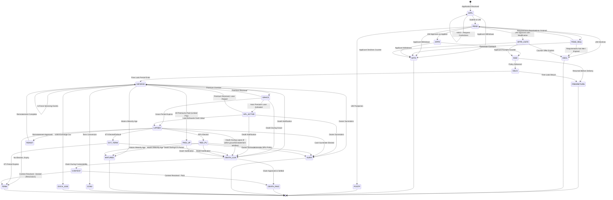

### 2.3 State Transition Table

| From State | To State | Trigger | Business Rules |
|---|---|---|---|
| `APPL` | `PEND` | Application submitted to UW | All required fields complete, initial premium received (if required), NIGO checks passed |
| `APPL` | `WITH` | Withdrawal request | Refund any premium collected |
| `APPL` | `APPL` | NIGO correction | Track NIGO reason and re-submission |
| `PEND` | `PEND_REQ` | UW orders requirements | Create requirement records, track due dates |
| `PEND` | `APPR` | UW approves as applied | Set risk class, premium confirmed |
| `PEND` | `APPR_CNTR` | UW approves with modification | Generate counter-offer letter |
| `PEND` | `DECL` | UW declines | Generate adverse action notice (per FCRA) |
| `PEND` | `POSTP` | UW postpones | Set follow-up date |
| `PEND` | `WITH` | Applicant withdraws | Refund premium |
| `PEND_REQ` | `PEND` | Requirements received | Re-route to underwriter |
| `PEND_REQ` | `WITH` | Applicant withdraws | Refund premium |
| `PEND_REQ` | `DECL` | Requirements expired | Auto-close after X days |
| `APPR` | `ISSD` | Contract generated | Schedule pages, rider pages, illustration attached |
| `APPR` | `WITH` | Applicant withdraws before issue | Refund premium |
| `APPR_CNTR` | `ISSD` | Applicant accepts counter | Signed acceptance on file |
| `APPR_CNTR` | `WITH` | Applicant rejects counter | Refund premium |
| `APPR_CNTR` | `DECL` | Counter offer expires | After 30–60 days |
| `ISSD` | `DELIV` | Delivery confirmed | Agent delivery receipt or mail confirmation |
| `ISSD` | `FREERETURN` | Returned before delivery | Full premium refund |
| `DELIV` | `INFORCE` | Free look period ends | Typically 10–30 days after delivery (state-specific) |
| `DELIV` | `FREERETURN` | Owner returns during free look | Full premium refund (or AV for VUL in some states) |
| `INFORCE` | `GRACE` | Premium not received by due date | Grace period begins (30 or 61 days) |
| `INFORCE` | `PAID_UP` | All scheduled premiums paid | Limited-pay products; or PUA/dividend makes policy paid-up |
| `INFORCE` | `SURR` | Owner surrenders | Calculate CSV, process disbursement |
| `INFORCE` | `DEATH_CLM` | Death notification received | Begin claims process |
| `INFORCE` | `CONV` | Conversion request | Validate eligibility, create permanent policy |
| `INFORCE` | `EXCH_1035` | 1035 exchange initiated | Transfer to receiving carrier |
| `INFORCE` | `MATURED` | Attained age = maturity age | Pay endowment/maturity value |
| `GRACE` | `INFORCE` | Premium received within grace | Apply premium, restore coverage |
| `GRACE` | `LAPSED` | Grace period expires | No premium, no APL |
| `GRACE` | `APL_ACTIVE` | APL provision activated | Borrow against CV to pay premium |
| `GRACE` | `DEATH_CLM` | Death during grace | Coverage still in effect; deduct overdue premium from DB |
| `APL_ACTIVE` | `INFORCE` | Premium received, loan not needed | Reverse APL if applicable |
| `APL_ACTIVE` | `LAPSED` | Loan exhausts CV | No more CV to borrow against |
| `APL_ACTIVE` | `SURR` | Owner surrenders | Process with loan deduction |
| `APL_ACTIVE` | `DEATH_CLM` | Death notification | Deduct loan from DB |
| `LAPSED` | `REINST` | Reinstatement application approved | Premium + interest collected, UW approval if > X months |
| `LAPSED` | `EXT_TERM` | Owner elects ETI or default NF option | Calculate ETI duration, set term expiry |
| `LAPSED` | `RED_PU` | Owner elects RPU | Calculate reduced face, issue paid-up endorsement |
| `LAPSED` | `SURR` | Owner elects cash surrender | Pay CSV less any loans |
| `LAPSED` | `TERM` | No election within allowed period | Varies by state; default NF option applies |
| `LAPSED` | `DEATH_CLM` | Death during early lapse | Some policies still in "limbo" during NF election period |
| `REINST` | `INFORCE` | Reinstatement processed | Back-premium applied, coverage restored |
| `EXT_TERM` | `DEATH_CLM` | Death during ETI period | Pay original face amount |
| `EXT_TERM` | `TERM` | ETI term expires | No further coverage |
| `RED_PU` | `DEATH_CLM` | Death notification | Pay reduced face amount |
| `RED_PU` | `SURR` | Owner surrenders RPU | Pay cash value of RPU |
| `RED_PU` | `MATURED` | Attains maturity age | Pay maturity value |
| `PAID_UP` | `DEATH_CLM` | Death notification | Pay face amount |
| `PAID_UP` | `SURR` | Owner surrenders | Pay CSV |
| `PAID_UP` | `MATURED` | Attains maturity age | Pay maturity value |
| `DEATH_CLM` | `DEATH_PAID` | Claim approved and settled | Disburse to beneficiaries |
| `DEATH_CLM` | `CONTEST` | Death within 2 years of issue | Contestability investigation |
| `CONTEST` | `DEATH_PAID` | Investigation complete — valid claim | Pay death benefit |
| `CONTEST` | `TERM` | Rescission — material misrepresentation | Refund premiums paid, void contract |

---

## 3. Pre-Sale

### 3.1 Illustration Generation

Before a policy is sold, the agent generates an illustration showing projected policy values. This is the first interaction with PAS-adjacent systems.

#### 3.1.1 Illustration Components

| Component | Description | Source System |
|---|---|---|
| **Premium Summary** | Planned premium, minimum premium, target, max | Product rating engine |
| **Death Benefit Projections** | DB at guaranteed and current/illustrated assumptions | Calculation engine |
| **Cash Value Projections** | Year-by-year CV at guaranteed and illustrated rates | Calculation engine |
| **Surrender Value Projections** | CV less surrender charges | Calculation engine |
| **Loan Available** | Projected loanable values | Calculation engine |
| **Cost Summary** | Premiums paid vs. death benefit vs. cash value | Calculation engine |
| **Rider Benefits** | Projected rider costs and values | Product configuration |
| **Regulatory Disclosures** | State-specific required disclosures | Compliance engine |

#### 3.1.2 Illustration Regulatory Requirements

| Regulation | Scope | Key Requirements |
|---|---|---|
| **NAIC Illustration Model Regulation** | All individual life | Guaranteed vs. current scale, narrative summary, numeric summary |
| **AG 49-A** | IUL | Maximum illustrated rate based on geometric mean of index |
| **AG 49-B** | IUL with multipliers/bonuses | Additional constraints on illustrated rates, alternate scale |
| **State-specific** | Varies | Some states require specific disclosures, signature requirements |

#### 3.1.3 Illustration-to-Application Link

The PAS must maintain a link between the illustration used during sale and the issued policy to support regulatory audits:

```sql
CREATE TABLE ILLUSTRATION (
    illustration_id     VARCHAR(20)    PRIMARY KEY,
    illustration_number VARCHAR(15)    NOT NULL,
    product_code        VARCHAR(10)    NOT NULL,
    agent_id            VARCHAR(20)    NOT NULL,
    proposed_insured    VARCHAR(200),
    issue_age           SMALLINT       NOT NULL,
    gender              CHAR(1)        NOT NULL,
    risk_class          VARCHAR(20),
    face_amount         DECIMAL(15,2)  NOT NULL,
    planned_premium     DECIMAL(12,2),
    death_benefit_option CHAR(1),
    riders_illustrated  JSONB,
    guaranteed_scale    JSONB,
    illustrated_scale   JSONB,
    midpoint_scale      JSONB,
    illustration_date   DATE           NOT NULL,
    signed_date         DATE,
    version             SMALLINT       NOT NULL DEFAULT 1,
    status              VARCHAR(15)    NOT NULL DEFAULT 'DRAFT',
    linked_policy_id    VARCHAR(20),
    regulatory_compliant BOOLEAN       DEFAULT TRUE,
    created_ts          TIMESTAMP      DEFAULT CURRENT_TIMESTAMP
);
```

### 3.2 Suitability & Best Interest

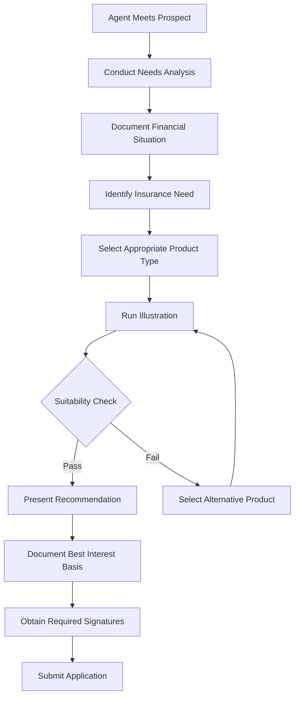

**Best Interest Compliance (Reg BI / NAIC Model):**

```sql
CREATE TABLE SUITABILITY_ASSESSMENT (
    assessment_id          SERIAL        PRIMARY KEY,
    application_id         VARCHAR(20)   NOT NULL,
    agent_id               VARCHAR(20)   NOT NULL,
    assessment_date        DATE          NOT NULL,
    annual_income          DECIMAL(12,2),
    net_worth              DECIMAL(15,2),
    liquid_net_worth       DECIMAL(15,2),
    tax_bracket            VARCHAR(10),
    insurance_need         VARCHAR(50),   -- INCOME_PROTECTION, ESTATE_PLANNING, BUSINESS, ACCUMULATION
    risk_tolerance         VARCHAR(10),   -- CONSERVATIVE, MODERATE, AGGRESSIVE
    investment_experience  VARCHAR(20),
    time_horizon           VARCHAR(10),
    existing_insurance     JSONB,
    replacement_involved   BOOLEAN       DEFAULT FALSE,
    replacement_details    TEXT,
    product_recommended    VARCHAR(10)   NOT NULL,
    rationale              TEXT          NOT NULL,
    alternatives_considered JSONB,
    supervisor_reviewed    BOOLEAN       DEFAULT FALSE,
    supervisor_id          VARCHAR(20),
    review_date            DATE,
    compliance_status      VARCHAR(15)   DEFAULT 'PENDING'
);
```

---

## 4. Application

### 4.1 Application Intake

#### 4.1.1 Paper vs. Electronic Application

| Channel | Description | PAS Processing |
|---|---|---|
| **Paper Application** | Physical form mailed or delivered to home office | Scanned → OCR/manual data entry → validation |
| **E-Application (Agent Portal)** | Agent enters data via web portal | Direct API submission, real-time validation |
| **E-Application (Direct-to-Consumer)** | Applicant self-service online | API submission with simplified UW path |
| **E-Signature** | Electronic signature via DocuSign, OneSpan, etc. | Track e-sign status, store signed documents |
| **Phone Application** | Tele-interview application | Recorded → transcribed → data entry |

#### 4.1.2 Application Data Capture

```sql
CREATE TABLE APPLICATION (
    application_id           VARCHAR(20)   PRIMARY KEY,
    application_number       VARCHAR(15)   NOT NULL UNIQUE,
    application_type         VARCHAR(10)   NOT NULL, -- NEW, CONVERSION, REINSTATEMENT
    application_source       VARCHAR(15)   NOT NULL, -- PAPER, E_APP, D2C, PHONE
    product_code             VARCHAR(10)   NOT NULL,
    agent_id                 VARCHAR(20)   NOT NULL,
    agency_id                VARCHAR(20),
    proposed_insured_id      VARCHAR(20)   NOT NULL,
    proposed_owner_id        VARCHAR(20)   NOT NULL,
    application_date         DATE          NOT NULL,
    signed_date              DATE,
    received_date            DATE          NOT NULL,
    face_amount_requested    DECIMAL(15,2) NOT NULL,
    planned_premium          DECIMAL(12,2),
    premium_mode             CHAR(1),
    death_benefit_option     CHAR(1),
    riders_requested         JSONB,
    beneficiary_info         JSONB,
    replacement_indicator    BOOLEAN       DEFAULT FALSE,
    state_of_issue           CHAR(2)       NOT NULL,
    application_status       VARCHAR(15)   NOT NULL DEFAULT 'RECEIVED',
    nigo_indicator           BOOLEAN       DEFAULT FALSE,
    nigo_reasons             JSONB,
    esign_status             VARCHAR(15),
    esign_provider           VARCHAR(30),
    esign_envelope_id        VARCHAR(50),
    illustration_id          VARCHAR(20),
    suitability_id           INTEGER,
    initial_premium_amount   DECIMAL(12,2),
    initial_premium_method   VARCHAR(10),  -- CHECK, EFT, CC
    premium_held_in_suspense BOOLEAN       DEFAULT FALSE,
    created_ts               TIMESTAMP     DEFAULT CURRENT_TIMESTAMP,
    updated_ts               TIMESTAMP     DEFAULT CURRENT_TIMESTAMP
);
```

### 4.2 NIGO (Not In Good Order) Processing

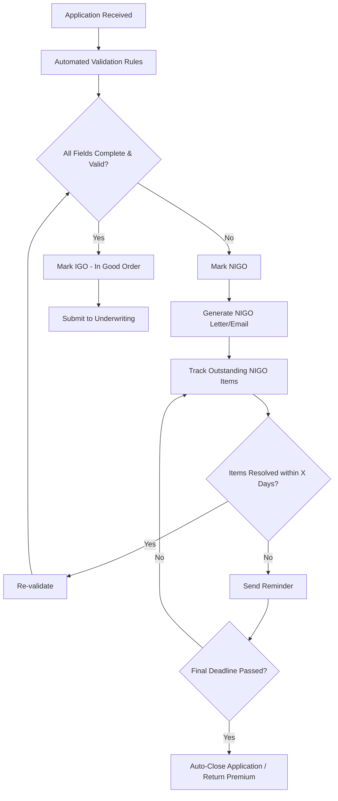

**Common NIGO Reasons:**

| Code | Reason | Resolution |
|---|---|---|
| `NIGO_SIG` | Missing signature | Request signature page |
| `NIGO_BENE` | Incomplete beneficiary information | Request beneficiary details |
| `NIGO_MED` | Missing medical history answers | Request Part B completion |
| `NIGO_FIN` | Incomplete financial information | Request financial supplement |
| `NIGO_REPL` | Replacement forms not complete | Request replacement disclosure |
| `NIGO_PREM` | Initial premium not received | Request premium payment |
| `NIGO_ID` | Missing identification | Request government-issued ID |
| `NIGO_TRUST` | Trust documentation incomplete | Request trust documents |
| `NIGO_AGE` | Age/DOB discrepancy | Request proof of age |
| `NIGO_STATE` | Application not approved for state | Cannot proceed unless state filed |

### 4.3 Pending Requirements Tracking

```sql
CREATE TABLE APPLICATION_REQUIREMENT (
    requirement_id       SERIAL        PRIMARY KEY,
    application_id       VARCHAR(20)   NOT NULL,
    requirement_type     VARCHAR(30)   NOT NULL,
    -- Types: APS, LAB_RESULTS, MVR, MIB, RX_CHECK, FINANCIAL_STMT,
    --        PARAMEDICAL, TELE_INTERVIEW, INSPECTION, ATTENDING_PHYSICIAN,
    --        EKG, STRESS_TEST, COGNITIVE_TEST, BLOOD_PROFILE
    requirement_source   VARCHAR(30),  -- EXAMONE, EMSI, MIB, MILLIMAN, LN_RISK
    ordered_date         DATE,
    due_date             DATE,
    received_date        DATE,
    requirement_status   VARCHAR(15)   NOT NULL DEFAULT 'PENDING',
    -- Statuses: PENDING, ORDERED, RECEIVED, REVIEWED, WAIVED, EXPIRED
    vendor_ref_number    VARCHAR(50),
    cost                 DECIMAL(8,2),
    assigned_to          VARCHAR(20),
    notes                TEXT,
    document_id          VARCHAR(30),  -- link to document management
    FOREIGN KEY (application_id) REFERENCES APPLICATION(application_id)
);
```

---

## 5. Underwriting

### 5.1 Underwriting Process Overview

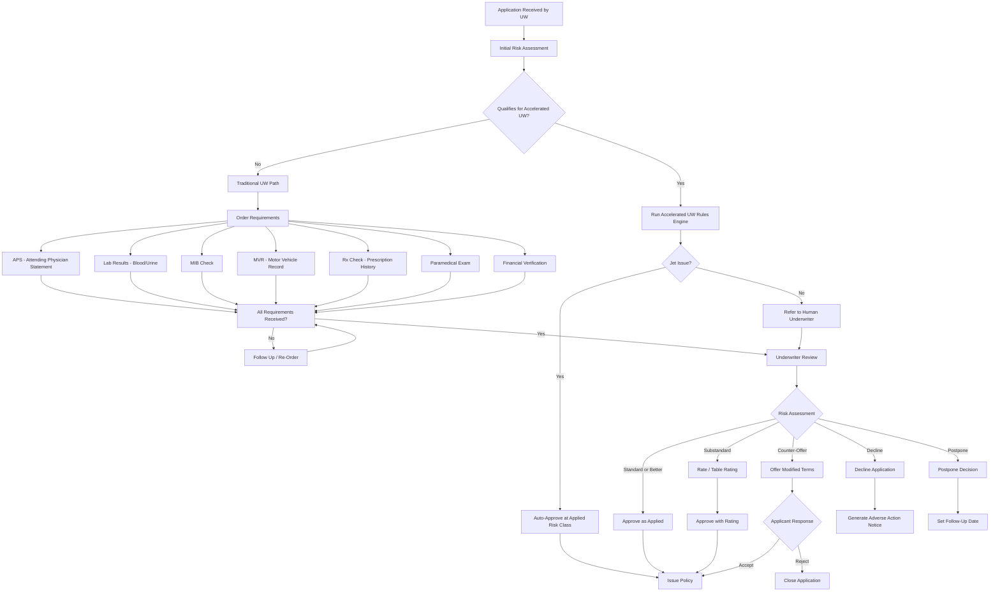

### 5.2 Risk Classification

| Risk Class | Description | Typical Criteria | Premium Impact |
|---|---|---|---|
| **Super Preferred / Preferred Plus** | Best possible rates | Excellent health, no tobacco, no family history, excellent build | Lowest premium |
| **Preferred** | Very good rates | Good health, no tobacco, minor family history acceptable | ~15-20% above SP |
| **Standard Plus** | Better than standard | Generally healthy, minor issues | ~25-35% above SP |
| **Standard** | Average risk | Some health conditions, average build | ~40-50% above SP |
| **Substandard (Table 1-16)** | Higher than average risk | Significant health issues | Table 1 = +25%, Table 2 = +50%, ... Table 16 = +400% |
| **Tobacco Preferred** | Best smoker rates | Smoker but otherwise excellent health | Significantly higher |
| **Tobacco Standard** | Standard smoker | Smoker with standard health | Highest standard rates |

### 5.3 Accelerated / Automated Underwriting

Modern PAS systems integrate with automated underwriting engines that can issue policies in minutes:

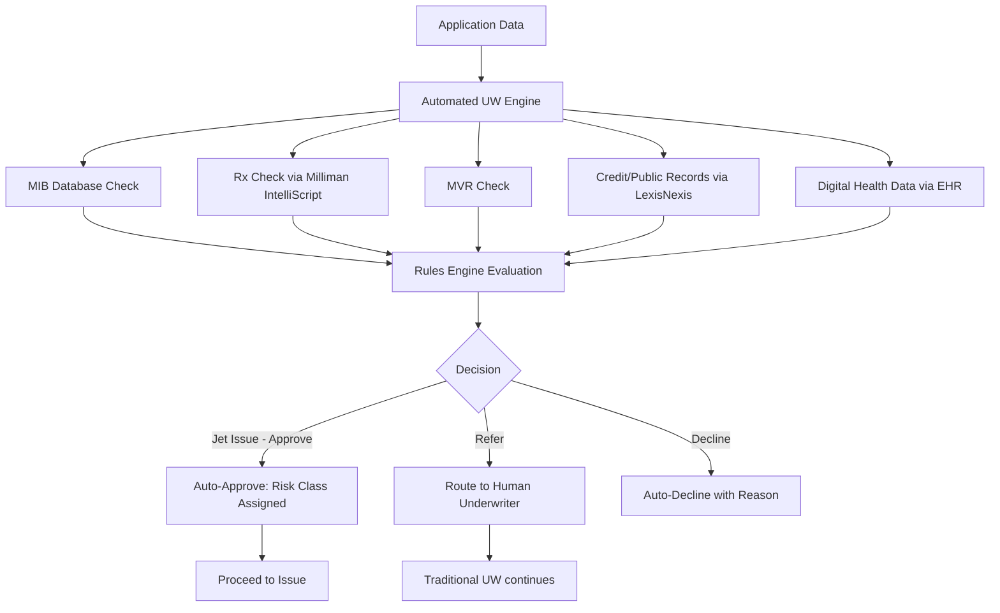

**Data Sources for Accelerated UW:**

| Source | Provider | Data Obtained | PAS Integration |
|---|---|---|---|
| **MIB** | MIB Group | Prior insurance application history, medical codes | ACORD TXLife real-time check |
| **Rx History** | Milliman IntelliScript / Optum | 7-year prescription drug history | API call with SSN, DOB |
| **MVR** | LexisNexis | Driving record, violations, DUI | API or batch |
| **Credit/Public Records** | LexisNexis Risk Classifier | Financial risk score, public records | API with consent |
| **Lab Results** | ExamOne, EMSI, Clinical Reference Laboratory | Blood chemistry, urinalysis | HL7/ACORD electronic results |
| **APS** | Attending physicians | Full medical records | Typically fax/mail; some EHR integration |
| **EHR Data** | Epic, Cerner (via Redox, etc.) | Electronic health records | FHIR API integration |
| **Wearable Data** | Fitbit, Apple Health (with consent) | Activity, sleep, heart rate | API with explicit consent |
| **Facial Analytics** | Lapetus (emerging) | Predicted health markers from selfie | API — emerging technology |

### 5.4 Underwriting Data Model

```sql
CREATE TABLE UNDERWRITING_CASE (
    case_id              VARCHAR(20)   PRIMARY KEY,
    application_id       VARCHAR(20)   NOT NULL UNIQUE,
    case_status          VARCHAR(15)   NOT NULL DEFAULT 'OPEN',
    -- Statuses: OPEN, IN_REVIEW, PENDING_REQS, DECIDED, CLOSED
    assigned_underwriter VARCHAR(20),
    uw_queue             VARCHAR(30),  -- NEW_BUSINESS, INFORMAL, JUMBO, SIMPLIFIED
    risk_amount          DECIMAL(15,2) NOT NULL, -- face amount for risk assessment
    total_line           DECIMAL(15,2), -- total insurance in force + applied for
    preliminary_class    VARCHAR(20),
    final_risk_class     VARCHAR(20),
    table_rating         VARCHAR(5),   -- NULL, A-P or 1-16
    flat_extra           DECIMAL(8,2), -- per $1,000 flat extra premium
    flat_extra_duration  SMALLINT,     -- years for flat extra
    exclusion_rider      BOOLEAN       DEFAULT FALSE,
    exclusion_details    TEXT,
    decision             VARCHAR(15),  -- APPROVE, DECLINE, POSTPONE, COUNTER, WITHDRAW
    decision_date        DATE,
    decision_reason      TEXT,
    reinsurance_required BOOLEAN       DEFAULT FALSE,
    reinsurance_ceded_to VARCHAR(50),
    facultative_required BOOLEAN       DEFAULT FALSE,
    mib_codes            JSONB,
    created_ts           TIMESTAMP     DEFAULT CURRENT_TIMESTAMP,
    updated_ts           TIMESTAMP     DEFAULT CURRENT_TIMESTAMP,
    FOREIGN KEY (application_id) REFERENCES APPLICATION(application_id)
);

CREATE TABLE UW_MEDICAL_INFO (
    medical_id          SERIAL        PRIMARY KEY,
    case_id             VARCHAR(20)   NOT NULL,
    condition_code      VARCHAR(10)   NOT NULL,
    condition_desc      VARCHAR(200)  NOT NULL,
    diagnosis_date      DATE,
    treatment_status    VARCHAR(20),
    severity            VARCHAR(10),
    impact_on_mortality VARCHAR(30),  -- NONE, MILD, MODERATE, SEVERE, DECLINE
    notes               TEXT,
    source              VARCHAR(20),  -- APS, LAB, RX, MIB, SELF_REPORTED
    FOREIGN KEY (case_id) REFERENCES UNDERWRITING_CASE(case_id)
);

CREATE TABLE UW_FINANCIAL_INFO (
    financial_id        SERIAL        PRIMARY KEY,
    case_id             VARCHAR(20)   NOT NULL,
    annual_income       DECIMAL(12,2),
    net_worth           DECIMAL(15,2),
    existing_insurance  DECIMAL(15,2),
    insurance_need      DECIMAL(15,2),
    income_multiple     DECIMAL(5,2),
    financial_uw_result VARCHAR(15),  -- APPROVED, REDUCED, DECLINED
    max_face_justified  DECIMAL(15,2),
    notes               TEXT,
    FOREIGN KEY (case_id) REFERENCES UNDERWRITING_CASE(case_id)
);
```

---

## 6. Policy Issuance

### 6.1 Contract Generation

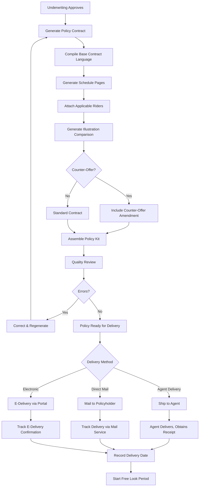

### 6.2 Policy Kit Components

| Component | Description | Generation Source |
|---|---|---|
| **Cover Page** | Policy number, owner, insured, face amount | PAS contract generator |
| **Schedule Pages** | Premium, risk class, riders, values | PAS calculation engine |
| **Base Contract** | Policy provisions, definitions | Document template library |
| **Rider Pages** | Each attached rider's terms | Document template library |
| **Application Copy** | Copy of the signed application | Document management |
| **Illustration** | Illustration used at point of sale | Illustration system |
| **Privacy Notice** | GLBA privacy notice | Compliance templates |
| **Buyer's Guide** | State-required buyer's guide | Compliance templates |
| **Replacement Forms** | If replacing existing coverage | Compliance templates |
| **Delivery Receipt** | For agent to obtain owner's signature | PAS form generator |
| **Temporary Insurance Agreement (TIA)** | If temporary coverage was provided | PAS form generator |

### 6.3 Free Look Period

| State | Free Look Period | Special Rules |
|---|---|---|
| **Most States** | 10 days from delivery | Standard |
| **New York** | 10 days (20 for replacements) | Extended for replacements |
| **California** | 30 days for seniors (age 60+) | Extended for senior protection |
| **Florida** | 14 days | Slightly longer than standard |
| **VUL** | 10-30 days (state varies) | Refund may be AV or premium |
| **Replacement** | 20-30 days in many states | Extended free look for replacements |

```sql
CREATE TABLE FREE_LOOK_TRACKING (
    policy_id            VARCHAR(20)   PRIMARY KEY,
    delivery_date        DATE          NOT NULL,
    free_look_days       SMALLINT      NOT NULL,
    free_look_end_date   DATE          NOT NULL,
    free_look_status     VARCHAR(10)   NOT NULL DEFAULT 'ACTIVE',
    -- Statuses: ACTIVE, EXPIRED, RETURNED
    return_request_date  DATE,
    return_reason        VARCHAR(50),
    refund_amount        DECIMAL(15,2),
    refund_method        VARCHAR(10),
    refund_processed_date DATE,
    FOREIGN KEY (policy_id) REFERENCES POLICY(policy_id)
);
```

---

## 7. In-Force Servicing

### 7.1 Overview

In-force servicing encompasses all administrative activities that occur while a policy is active. This is the longest phase of the lifecycle and generates the highest transaction volume.

### 7.2 Premium Processing

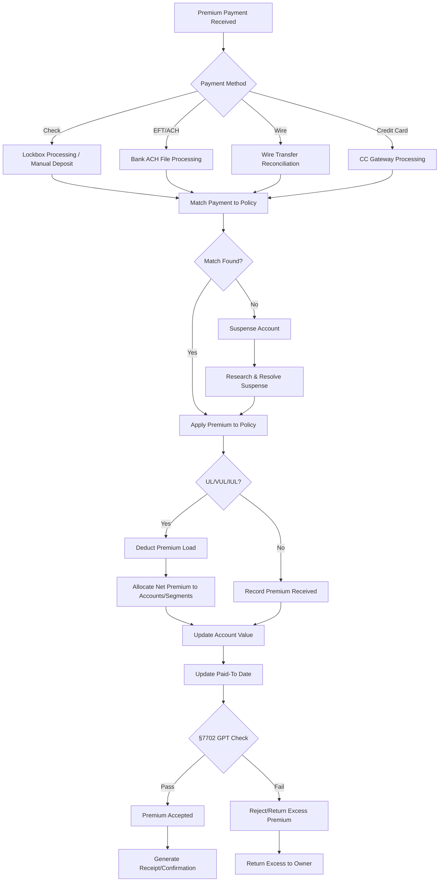

### 7.3 Billing Modes & Processing

```sql
CREATE TABLE BILLING (
    billing_id          SERIAL        PRIMARY KEY,
    policy_id           VARCHAR(20)   NOT NULL,
    billing_mode        VARCHAR(15)   NOT NULL, -- DIRECT, LIST_BILL, PAYROLL, EFT
    premium_mode        CHAR(1)       NOT NULL, -- A=Annual, S=Semi, Q=Quarterly, M=Monthly
    modal_premium       DECIMAL(12,2) NOT NULL,
    next_due_date       DATE          NOT NULL,
    paid_to_date        DATE          NOT NULL,
    billing_day         SMALLINT,     -- day of month for monthly
    payment_method      VARCHAR(10)   NOT NULL, -- CHECK, EFT, PAYROLL, CREDIT_CARD
    bank_account_id     VARCHAR(20),  -- for EFT
    auto_draft_active   BOOLEAN       DEFAULT FALSE,
    billing_status      VARCHAR(10)   DEFAULT 'ACTIVE',
    -- Statuses: ACTIVE, SUSPENDED, PAID_UP, WAIVED, TERMINATED
    last_notice_sent    DATE,
    notice_count        SMALLINT      DEFAULT 0,
    FOREIGN KEY (policy_id) REFERENCES POLICY(policy_id)
);

CREATE TABLE PREMIUM_TRANSACTION (
    transaction_id       BIGSERIAL     PRIMARY KEY,
    policy_id            VARCHAR(20)   NOT NULL,
    transaction_date     DATE          NOT NULL,
    effective_date       DATE          NOT NULL,
    transaction_type     VARCHAR(20)   NOT NULL,
    -- Types: SCHEDULED_PREMIUM, ADDITIONAL_PREMIUM, MODAL_CHANGE,
    --        PREMIUM_REFUND, SUSPENSE_APPLY, APL_PREMIUM, WAIVER_CREDIT
    gross_amount         DECIMAL(12,2) NOT NULL,
    premium_load         DECIMAL(10,2) DEFAULT 0,
    net_amount           DECIMAL(12,2) NOT NULL,
    payment_method       VARCHAR(10),
    reference_number     VARCHAR(30),
    premium_mode_applied CHAR(1),
    paid_to_date_before  DATE,
    paid_to_date_after   DATE,
    processing_status    VARCHAR(10)   DEFAULT 'APPLIED',
    FOREIGN KEY (policy_id) REFERENCES POLICY(policy_id)
);
```

### 7.4 Policy Anniversary Processing

Policy anniversaries trigger critical calculations:

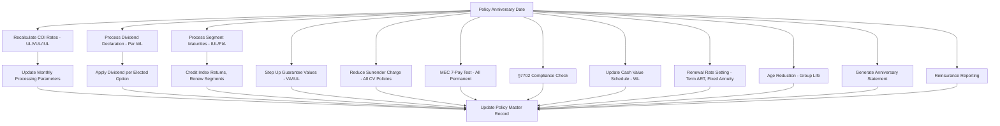

### 7.5 Cash Value Operations

#### 7.5.1 Policy Loans

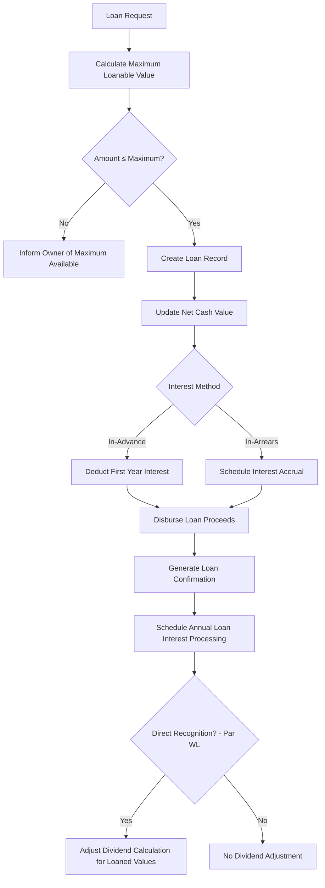

#### 7.5.2 Partial Withdrawals (UL/VUL/IUL)

```python
class PartialWithdrawalProcessor:
    """
    Processes partial withdrawals from UL, VUL, and IUL policies.
    """
    
    def process_withdrawal(self, policy: dict, 
                           requested_amount: float) -> dict:
        av = policy['account_value']
        loan_balance = policy['loan_balance']
        surrender_charges = policy['current_surrender_charge']
        min_av_required = policy.get('minimum_account_value', 500)
        
        # Maximum withdrawal
        max_withdrawal = av - loan_balance - surrender_charges - min_av_required
        
        if requested_amount > max_withdrawal:
            return {
                'status': 'REJECTED',
                'reason': f'Maximum withdrawal is ${max_withdrawal:.2f}',
                'max_available': round(max_withdrawal, 2)
            }
        
        # Tax impact
        cost_basis = policy['cost_basis']
        gain = av - cost_basis
        
        if policy['is_mec']:
            # MEC: LIFO — earnings out first
            taxable = min(requested_amount, gain)
            penalty = taxable * 0.10 if policy['owner_age'] < 59.5 else 0
        else:
            # Non-MEC: FIFO — basis out first
            taxable = max(0, requested_amount - cost_basis)
            penalty = 0
        
        # Impact on death benefit
        db_option = policy['death_benefit_option']
        if db_option == 'A':
            new_db = policy['death_benefit']  # unchanged unless corridor
        elif db_option == 'B':
            new_db = policy['face_amount'] + (av - requested_amount)
        
        # Check if withdrawal causes corridor violation
        new_av = av - requested_amount
        corridor_factor = self._get_corridor_factor(policy['attained_age'])
        min_db_for_corridor = new_av * corridor_factor
        
        face_reduction_needed = 0
        if db_option == 'A' and policy['face_amount'] < min_db_for_corridor:
            pass  # corridor already requires higher DB
        
        return {
            'status': 'APPROVED',
            'withdrawal_amount': round(requested_amount, 2),
            'new_account_value': round(new_av, 2),
            'taxable_amount': round(taxable, 2),
            'tax_free_amount': round(requested_amount - taxable, 2),
            'early_withdrawal_penalty': round(penalty, 2),
            'new_cost_basis': round(max(0, cost_basis - (requested_amount - taxable)), 2),
            'new_death_benefit': round(new_db, 2),
            'is_mec': policy['is_mec']
        }
```

### 7.6 Face Amount Changes

```sql
CREATE TABLE FACE_AMOUNT_CHANGE (
    change_id           SERIAL        PRIMARY KEY,
    policy_id           VARCHAR(20)   NOT NULL,
    change_type         VARCHAR(10)   NOT NULL, -- INCREASE, DECREASE
    request_date        DATE          NOT NULL,
    effective_date      DATE,
    previous_face       DECIMAL(15,2) NOT NULL,
    new_face            DECIMAL(15,2) NOT NULL,
    change_amount       DECIMAL(15,2) NOT NULL,
    uw_required         BOOLEAN       DEFAULT FALSE,
    uw_case_id          VARCHAR(20),
    uw_status           VARCHAR(15),
    premium_impact      DECIMAL(12,2),
    mec_retest_required BOOLEAN       DEFAULT FALSE,
    section_7702_retest BOOLEAN       DEFAULT FALSE,
    change_status       VARCHAR(15)   DEFAULT 'PENDING',
    FOREIGN KEY (policy_id) REFERENCES POLICY(policy_id)
);
```

### 7.7 Beneficiary Changes

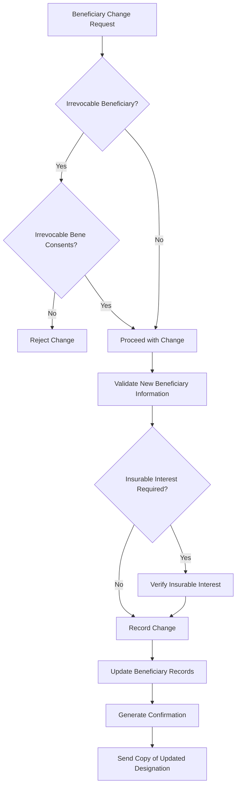

```sql
CREATE TABLE BENEFICIARY (
    beneficiary_id       SERIAL        PRIMARY KEY,
    policy_id            VARCHAR(20)   NOT NULL,
    party_id             VARCHAR(20)   NOT NULL,
    beneficiary_type     VARCHAR(15)   NOT NULL, -- PRIMARY, CONTINGENT
    designation_type     VARCHAR(10)   NOT NULL, -- NAMED, PER_STIRPES, ESTATE, TRUST
    benefit_percentage   DECIMAL(5,2)  NOT NULL,
    relationship         VARCHAR(30),
    irrevocable          BOOLEAN       DEFAULT FALSE,
    effective_date       DATE          NOT NULL,
    termination_date     DATE,
    beneficiary_status   VARCHAR(10)   DEFAULT 'ACTIVE',
    trust_name           VARCHAR(200),
    trust_date           DATE,
    sequence             SMALLINT      NOT NULL DEFAULT 1,
    FOREIGN KEY (policy_id) REFERENCES POLICY(policy_id)
);
```

### 7.8 Ownership Changes & Assignments

| Change Type | Description | Tax Impact | PAS Processing |
|---|---|---|---|
| **Absolute Assignment** | Full transfer of ownership | Gift tax may apply; FMV at transfer is the basis | Change owner, notify IRS if required |
| **Collateral Assignment** | Assign policy as loan collateral | No tax impact | Record assignee, restrict surrenders |
| **Change of Owner** | New owner (e.g., to a trust) | May be a taxable gift | Update owner, update billing, correspondence |
| **Change of Insured** | Not possible after issue | N/A | Reject request |
| **Divorce Transfer** | Transfer incident to divorce | Tax-free under IRC §1041 | Change owner, record court order |

```sql
CREATE TABLE POLICY_ASSIGNMENT (
    assignment_id         SERIAL        PRIMARY KEY,
    policy_id             VARCHAR(20)   NOT NULL,
    assignment_type       VARCHAR(15)   NOT NULL, -- ABSOLUTE, COLLATERAL, RELEASE
    assignor_party_id     VARCHAR(20)   NOT NULL,
    assignee_party_id     VARCHAR(20)   NOT NULL,
    assignment_date       DATE          NOT NULL,
    effective_date        DATE          NOT NULL,
    release_date          DATE,
    lender_name           VARCHAR(200),
    loan_reference        VARCHAR(50),
    restriction_notes     TEXT,
    document_id           VARCHAR(30),
    assignment_status     VARCHAR(10)   DEFAULT 'ACTIVE',
    FOREIGN KEY (policy_id) REFERENCES POLICY(policy_id)
);
```

### 7.9 1035 Exchange Processing

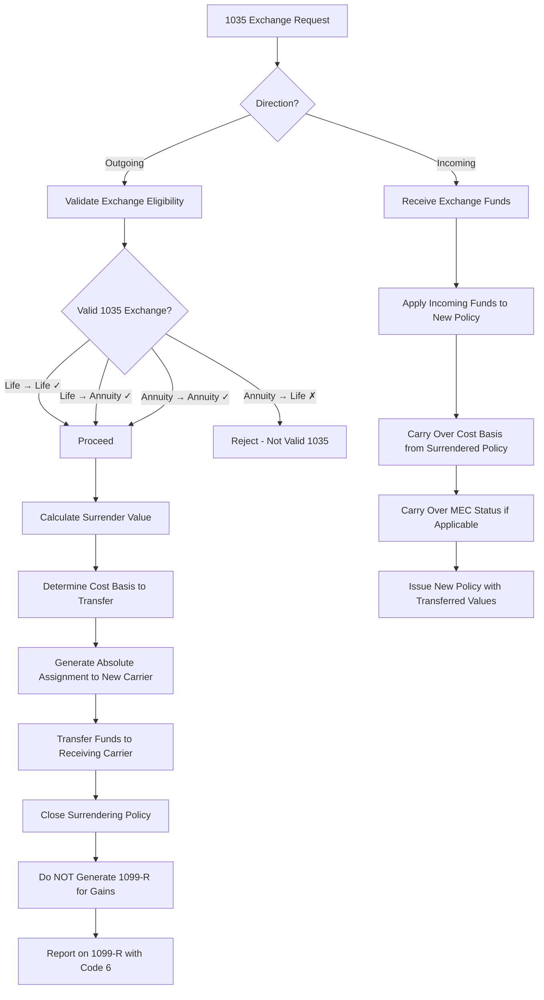

```sql
CREATE TABLE EXCHANGE_1035 (
    exchange_id              SERIAL        PRIMARY KEY,
    direction                VARCHAR(10)   NOT NULL, -- INCOMING, OUTGOING
    policy_id                VARCHAR(20)   NOT NULL,
    counterparty_carrier     VARCHAR(100)  NOT NULL,
    counterparty_policy_num  VARCHAR(20),
    exchange_type            VARCHAR(20)   NOT NULL, -- LIFE_TO_LIFE, LIFE_TO_ANNUITY, ANNUITY_TO_ANNUITY
    request_date             DATE          NOT NULL,
    funds_transfer_date      DATE,
    completion_date          DATE,
    exchange_amount           DECIMAL(15,2) NOT NULL,
    cost_basis_transferred   DECIMAL(15,2) NOT NULL,
    gain_transferred         DECIMAL(15,2) NOT NULL,
    mec_status_transferred   BOOLEAN       DEFAULT FALSE,
    absolute_assignment_recv BOOLEAN       DEFAULT FALSE,
    exchange_status          VARCHAR(15)   DEFAULT 'PENDING',
    -- Statuses: PENDING, FUNDS_SENT, FUNDS_RECEIVED, COMPLETE, CANCELLED
    irs_reporting_status     VARCHAR(10)   DEFAULT 'PENDING',
    FOREIGN KEY (policy_id) REFERENCES POLICY(policy_id)
);
```

---

## 8. Conservation & Lapse Prevention

### 8.1 Overview

Conservation is the process of preventing policy lapses. It is one of the most valuable functions a PAS can support because retaining a policy is far more profitable than acquiring a new one.

### 8.2 Grace Period Processing

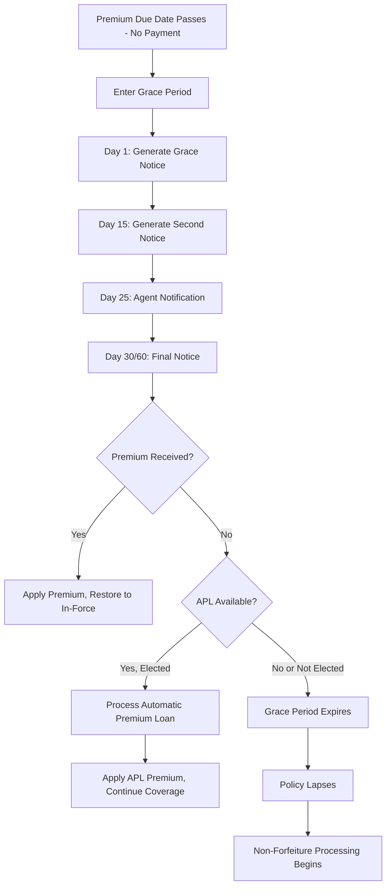

**Grace Period Rules:**

| Product Type | Grace Period | Special Rules |
|---|---|---|
| **Term Life** | 31 days from premium due date | Coverage continues during grace |
| **Whole Life** | 31 days | APL may activate |
| **UL / IUL** | 61 days from date AV insufficient for monthly deduction | Some use "specified premium" grace trigger |
| **VUL** | 61 days from insufficient AV | Daily valuation may trigger earlier |
| **Group Life** | 31 days from premium due date (master policy) | Applies to employer premium, not individual certificates |

### 8.3 Conservation Desk Workflow

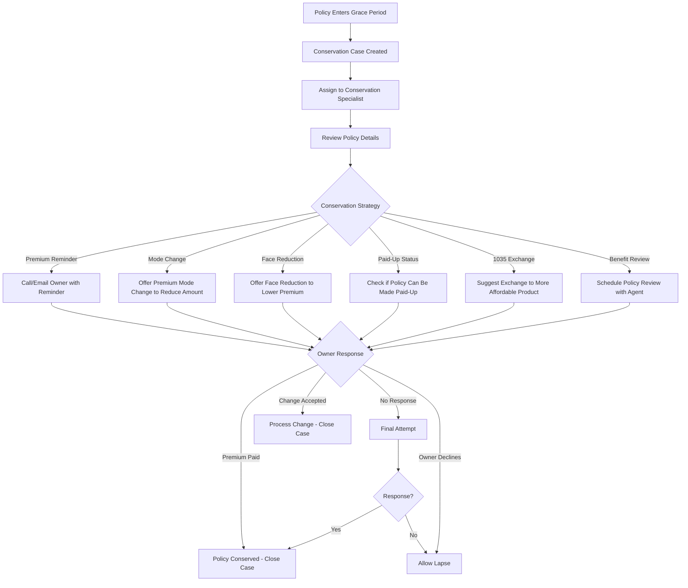

```sql
CREATE TABLE CONSERVATION_CASE (
    case_id                SERIAL        PRIMARY KEY,
    policy_id              VARCHAR(20)   NOT NULL,
    case_open_date         DATE          NOT NULL,
    case_reason            VARCHAR(20)   NOT NULL, -- GRACE, PENDING_LAPSE, PREMIUM_INCREASE, RETENTION
    assigned_to            VARCHAR(20),
    priority               VARCHAR(10)   DEFAULT 'NORMAL', -- LOW, NORMAL, HIGH, CRITICAL
    contact_attempts       SMALLINT      DEFAULT 0,
    last_contact_date      DATE,
    last_contact_method    VARCHAR(10),  -- PHONE, EMAIL, LETTER
    strategy_employed      VARCHAR(30),
    outcome                VARCHAR(15),  -- CONSERVED, LAPSED, MODE_CHANGE, FACE_REDUCTION, PAID_UP
    case_close_date        DATE,
    case_status            VARCHAR(10)   DEFAULT 'OPEN',
    annual_premium         DECIMAL(12,2),
    policy_cash_value      DECIMAL(15,2),
    policy_face_amount     DECIMAL(15,2),
    agent_id               VARCHAR(20),
    notes                  TEXT,
    FOREIGN KEY (policy_id) REFERENCES POLICY(policy_id)
);
```

---

## 9. Lapse & Reinstatement

### 9.1 Lapse Processing

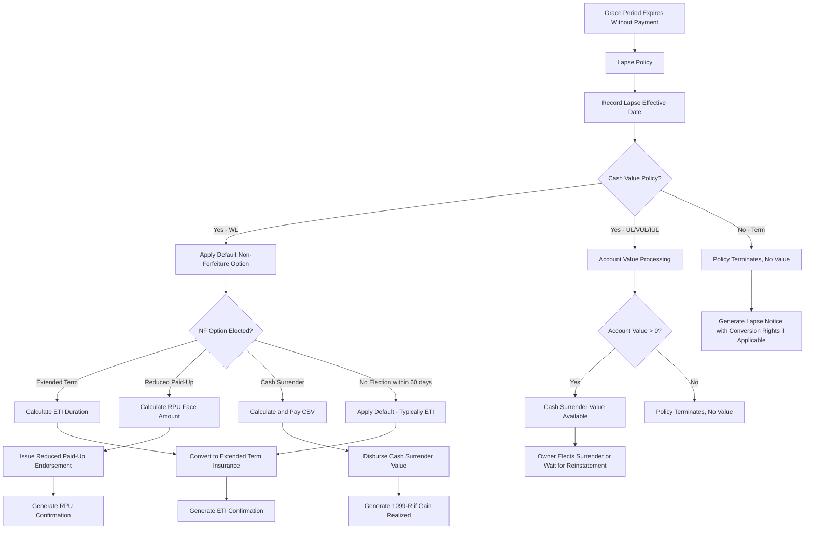

### 9.2 Non-Forfeiture Calculations

```python
class NonForfeitureEngine:
    """
    Calculates non-forfeiture values for lapsed whole life policies.
    """
    
    def calculate_extended_term(self, policy: dict) -> dict:
        """
        Extended Term Insurance: Uses the cash surrender value as a
        net single premium to purchase term insurance for the
        original face amount.
        """
        csv = policy['cash_surrender_value']
        face = policy['face_amount']
        pua_face = policy.get('pua_face_amount', 0)
        total_face = face + pua_face
        
        loan_balance = policy['loan_balance']
        net_csv = csv - loan_balance
        
        if net_csv <= 0:
            return {
                'eligible': False,
                'reason': 'No cash value available after loan deduction'
            }
        
        # Net single premium per $1,000 of term coverage at attained age
        attained_age = policy['attained_age']
        gender = policy['gender']
        
        years = 0
        days = 0
        remaining = net_csv
        age = attained_age
        
        while remaining > 0 and age < 100:
            qx = self._get_mortality_rate(age, gender)
            v = 1 / (1 + 0.035)  # statutory interest
            annual_cost = (total_face / 1000) * qx * v
            
            if remaining >= annual_cost:
                remaining -= annual_cost
                years += 1
                age += 1
            else:
                fraction = remaining / annual_cost
                days = int(fraction * 365)
                remaining = 0
        
        return {
            'eligible': True,
            'eti_face_amount': round(total_face, 2),
            'eti_duration_years': years,
            'eti_duration_days': days,
            'csv_used': round(net_csv, 2),
            'eti_expiry_date': self._add_years_days(
                policy['lapse_date'], years, days
            ),
            'loan_deducted': round(loan_balance, 2)
        }
    
    def calculate_reduced_paid_up(self, policy: dict) -> dict:
        """
        Reduced Paid-Up: Uses the CSV to purchase a paid-up whole life
        policy at a reduced face amount.
        """
        csv = policy['cash_surrender_value']
        loan_balance = policy['loan_balance']
        net_csv = csv - loan_balance
        
        if net_csv <= 0:
            return {
                'eligible': False,
                'reason': 'No cash value available after loan deduction'
            }
        
        attained_age = policy['attained_age']
        gender = policy['gender']
        
        # Net single premium rate per $1,000 at attained age for whole life
        nsp_per_1000 = self._get_nsp_rate(attained_age, gender)
        
        # Reduced face amount = CSV / NSP rate × 1000
        rpu_face = (net_csv / nsp_per_1000) * 1000
        
        return {
            'eligible': True,
            'rpu_face_amount': round(rpu_face, 2),
            'original_face': policy['face_amount'],
            'face_reduction': round(policy['face_amount'] - rpu_face, 2),
            'csv_used': round(net_csv, 2),
            'loan_deducted': round(loan_balance, 2),
            'nsp_rate_used': round(nsp_per_1000, 4)
        }
    
    def calculate_cash_surrender(self, policy: dict) -> dict:
        """
        Cash Surrender: Pay out the net cash surrender value.
        """
        cv = policy['cash_value']
        surrender_charge = policy.get('surrender_charge', 0)
        loan_balance = policy['loan_balance']
        loan_interest = policy.get('accrued_loan_interest', 0)
        
        csv = cv - surrender_charge - loan_balance - loan_interest
        
        # Tax calculation
        cost_basis = policy['cost_basis']
        gain = max(0, csv - cost_basis)
        
        return {
            'cash_value': round(cv, 2),
            'surrender_charge': round(surrender_charge, 2),
            'loan_balance': round(loan_balance, 2),
            'accrued_loan_interest': round(loan_interest, 2),
            'net_cash_surrender_value': round(max(0, csv), 2),
            'cost_basis': round(cost_basis, 2),
            'taxable_gain': round(gain, 2),
            'form_1099r_required': gain > 0
        }
```

### 9.3 Reinstatement Processing

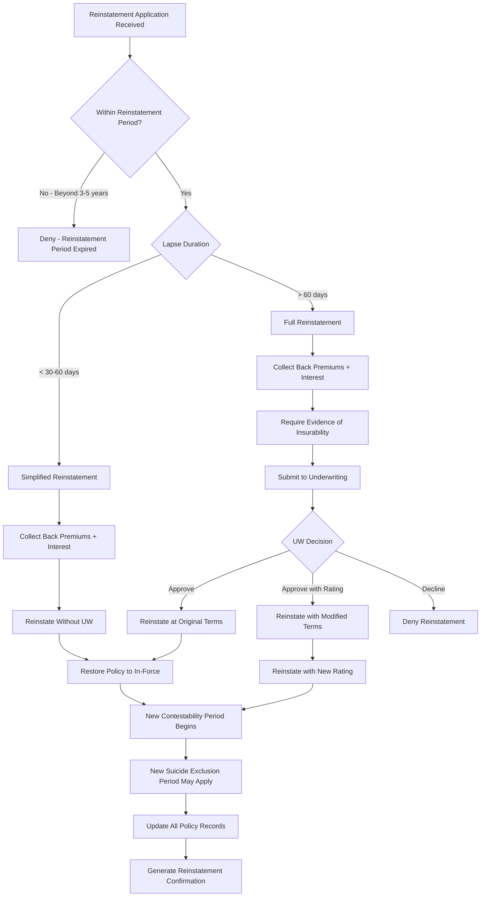

```sql
CREATE TABLE REINSTATEMENT (
    reinstatement_id     SERIAL        PRIMARY KEY,
    policy_id            VARCHAR(20)   NOT NULL,
    request_date         DATE          NOT NULL,
    lapse_date           DATE          NOT NULL,
    lapse_duration_days  INT           NOT NULL,
    back_premium_amount  DECIMAL(12,2) NOT NULL,
    back_premium_interest DECIMAL(10,2) NOT NULL,
    total_amount_due     DECIMAL(12,2) NOT NULL,
    uw_required          BOOLEAN       NOT NULL,
    uw_case_id           VARCHAR(20),
    uw_result            VARCHAR(15),
    new_risk_class       VARCHAR(20),
    new_table_rating     VARCHAR(5),
    reinstatement_date   DATE,
    new_contest_start    DATE,
    new_contest_end      DATE,
    new_suicide_start    DATE,
    new_suicide_end      DATE,
    reinstatement_status VARCHAR(15)   DEFAULT 'PENDING',
    -- Statuses: PENDING, UW_REVIEW, APPROVED, DENIED, COMPLETED
    amount_received      DECIMAL(12,2),
    payment_date         DATE,
    FOREIGN KEY (policy_id) REFERENCES POLICY(policy_id)
);
```

---

## 10. Claims

### 10.1 Death Claim Process

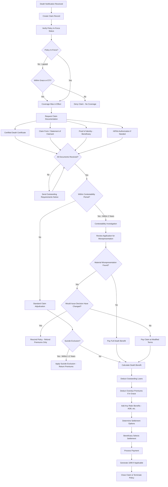

### 10.2 Claims Data Model

```sql
CREATE TABLE DEATH_CLAIM (
    claim_id              VARCHAR(20)   PRIMARY KEY,
    policy_id             VARCHAR(20)   NOT NULL,
    claim_number          VARCHAR(15)   NOT NULL UNIQUE,
    notification_date     DATE          NOT NULL,
    date_of_death         DATE          NOT NULL,
    cause_of_death        VARCHAR(200),
    manner_of_death       VARCHAR(20),  -- NATURAL, ACCIDENT, SUICIDE, HOMICIDE, UNDETERMINED
    place_of_death        VARCHAR(200),
    death_cert_received   BOOLEAN       DEFAULT FALSE,
    death_cert_number     VARCHAR(30),
    claimant_party_id     VARCHAR(20)   NOT NULL,
    claim_status          VARCHAR(20)   NOT NULL DEFAULT 'OPEN',
    -- Statuses: OPEN, PENDING_DOCS, UNDER_REVIEW, CONTESTABILITY_REVIEW,
    --           APPROVED, DENIED, SETTLED, CLOSED
    assigned_examiner     VARCHAR(20),
    policy_in_force       BOOLEAN       NOT NULL,
    contestability_flag   BOOLEAN       NOT NULL DEFAULT FALSE,
    suicide_exclusion_flag BOOLEAN      NOT NULL DEFAULT FALSE,
    total_death_benefit   DECIMAL(15,2),
    base_face_amount      DECIMAL(15,2),
    rider_benefits        DECIMAL(15,2) DEFAULT 0,
    pua_death_benefit     DECIMAL(15,2) DEFAULT 0,
    adb_benefit           DECIMAL(15,2) DEFAULT 0,
    loan_deduction        DECIMAL(15,2) DEFAULT 0,
    premium_deduction     DECIMAL(15,2) DEFAULT 0,
    net_death_benefit     DECIMAL(15,2),
    settlement_option     VARCHAR(20),
    -- Options: LUMP_SUM, INTEREST_ONLY, FIXED_PERIOD, LIFE_ANNUITY
    settlement_date       DATE,
    payment_amount        DECIMAL(15,2),
    created_ts            TIMESTAMP     DEFAULT CURRENT_TIMESTAMP,
    updated_ts            TIMESTAMP     DEFAULT CURRENT_TIMESTAMP,
    FOREIGN KEY (policy_id) REFERENCES POLICY(policy_id)
);

-- Claim beneficiary payment detail
CREATE TABLE CLAIM_BENEFICIARY_PAYMENT (
    payment_id           SERIAL        PRIMARY KEY,
    claim_id             VARCHAR(20)   NOT NULL,
    beneficiary_party_id VARCHAR(20)   NOT NULL,
    beneficiary_type     VARCHAR(15)   NOT NULL,
    benefit_percentage   DECIMAL(5,2)  NOT NULL,
    gross_payment        DECIMAL(15,2) NOT NULL,
    federal_tax_withheld DECIMAL(10,2) DEFAULT 0,
    state_tax_withheld   DECIMAL(10,2) DEFAULT 0,
    net_payment          DECIMAL(15,2) NOT NULL,
    payment_method       VARCHAR(10)   NOT NULL, -- CHECK, EFT, WIRE, RETAINED_ASSET
    payment_date         DATE,
    payment_status       VARCHAR(10)   DEFAULT 'PENDING',
    settlement_option    VARCHAR(20)   DEFAULT 'LUMP_SUM',
    FOREIGN KEY (claim_id) REFERENCES DEATH_CLAIM(claim_id)
);

-- Claim document tracking
CREATE TABLE CLAIM_DOCUMENT (
    document_id         SERIAL        PRIMARY KEY,
    claim_id            VARCHAR(20)   NOT NULL,
    document_type       VARCHAR(30)   NOT NULL,
    -- Types: DEATH_CERTIFICATE, CLAIM_FORM, ID_PROOF, HIPAA_AUTH,
    --        POLICE_REPORT, AUTOPSY, MEDICAL_RECORDS, COURT_ORDER
    document_status     VARCHAR(10)   DEFAULT 'REQUESTED',
    requested_date      DATE,
    received_date       DATE,
    reviewed_by         VARCHAR(20),
    review_date         DATE,
    document_ref        VARCHAR(30),  -- document management system reference
    notes               TEXT,
    FOREIGN KEY (claim_id) REFERENCES DEATH_CLAIM(claim_id)
);
```

### 10.3 Settlement Options

| Option | Description | PAS Processing |
|---|---|---|
| **Lump Sum** | Single payment to beneficiary | One-time disbursement, 1099-INT if interest accrued |
| **Interest Only** | Death benefit held by carrier at interest; beneficiary receives interest payments | Set up retained asset account, schedule interest payments |
| **Fixed Period** | Equal installments over specified period | Calculate installment amount, schedule payments |
| **Fixed Amount** | Specified amount per period until exhausted | Schedule payments, track remaining balance |
| **Life Annuity** | Death benefit annuitized for beneficiary's lifetime | Calculate payout rate, create annuity record |
| **Retained Asset Account** | Checkbook access to death benefit held at interest | Create custodial account, issue checkbook |

---

## 11. Termination

### 11.1 Surrender Processing

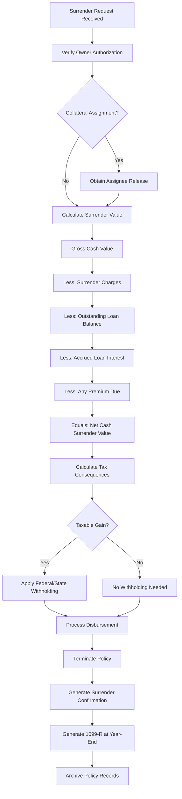

### 11.2 Maturity Processing

When a policy reaches its maturity age (100 or 121 under the 2017 CSO), the PAS must:

1. Calculate the maturity value (equal to the face amount for WL, or account value for UL)
2. Generate a maturity notice to the owner at least 30 days before maturity
3. Deduct any outstanding loans from the maturity proceeds
4. Process the maturity payment as a taxable event
5. Report on 1099-R

```sql
CREATE TABLE POLICY_MATURITY (
    maturity_id          SERIAL        PRIMARY KEY,
    policy_id            VARCHAR(20)   NOT NULL,
    maturity_date        DATE          NOT NULL,
    maturity_age         SMALLINT      NOT NULL,
    gross_maturity_value DECIMAL(15,2) NOT NULL,
    loan_deduction       DECIMAL(15,2) DEFAULT 0,
    net_maturity_value   DECIMAL(15,2) NOT NULL,
    cost_basis           DECIMAL(15,2) NOT NULL,
    taxable_gain         DECIMAL(15,2) NOT NULL,
    federal_withholding  DECIMAL(10,2) DEFAULT 0,
    state_withholding    DECIMAL(10,2) DEFAULT 0,
    net_payment          DECIMAL(15,2) NOT NULL,
    payment_method       VARCHAR(10),
    payment_date         DATE,
    maturity_status      VARCHAR(10)   DEFAULT 'PENDING',
    notice_sent_date     DATE,
    FOREIGN KEY (policy_id) REFERENCES POLICY(policy_id)
);
```

### 11.3 Conversion Processing (Term → Permanent)

See Article 01, Section 2.6 for detailed conversion processing flow and data model.

### 11.4 Policy Archive & Retention

| Record Type | Retention Period | Regulatory Basis |
|---|---|---|
| **Policy Contract** | Life of policy + 10 years after termination | State insurance code |
| **Application** | Life of policy + 10 years | State insurance code |
| **Underwriting Files** | 7–10 years after policy termination | Company policy / E&O |
| **Claim Files** | 10 years after claim settlement | State insurance code |
| **Financial Transactions** | 7 years | IRS requirements |
| **Tax Documents** | 7 years | IRS requirements |
| **Correspondence** | 5–7 years after policy termination | Company policy |
| **Agent Records** | 5 years after agent termination | State DOI requirements |

---

## 12. Complete State Transition Reference

### 12.1 All 50+ Transitions

| # | From | To | Trigger Event | Automated? | STP? |
|---|---|---|---|---|---|
| 1 | `[START]` | `APPL` | Application received | Yes | Yes |
| 2 | `APPL` | `PEND` | Submit to underwriting | Yes | Yes (if IGO) |
| 3 | `APPL` | `APPL` | NIGO - correction needed | Yes | Partial |
| 4 | `APPL` | `WITH` | Applicant withdraws | Manual | No |
| 5 | `PEND` | `PEND_REQ` | UW orders requirements | Yes/Manual | Partial |
| 6 | `PEND` | `APPR` | UW approves as applied | Manual/Auto | Auto for jet issue |
| 7 | `PEND` | `APPR_CNTR` | UW approves with modification | Manual | No |
| 8 | `PEND` | `DECL` | UW declines | Manual | No |
| 9 | `PEND` | `POSTP` | UW postpones | Manual | No |
| 10 | `PEND` | `WITH` | Applicant withdraws during UW | Manual | No |
| 11 | `PEND_REQ` | `PEND` | Requirements received | Yes | Yes |
| 12 | `PEND_REQ` | `WITH` | Applicant withdraws | Manual | No |
| 13 | `PEND_REQ` | `DECL` | Requirements expired | Auto (timer) | Yes |
| 14 | `APPR` | `ISSD` | Contract generated | Yes | Yes |
| 15 | `APPR` | `WITH` | Applicant withdraws before issue | Manual | No |
| 16 | `APPR_CNTR` | `ISSD` | Counter-offer accepted | Manual | No |
| 17 | `APPR_CNTR` | `WITH` | Counter-offer rejected | Manual | No |
| 18 | `APPR_CNTR` | `DECL` | Counter-offer expired | Auto (timer) | Yes |
| 19 | `ISSD` | `DELIV` | Policy delivered | Manual/Auto | Partial |
| 20 | `ISSD` | `FREERETURN` | Returned before delivery | Manual | No |
| 21 | `DELIV` | `INFORCE` | Free look period ends | Auto (timer) | Yes |
| 22 | `DELIV` | `FREERETURN` | Owner returns during free look | Manual | No |
| 23 | `INFORCE` | `GRACE` | Premium overdue | Auto (billing) | Yes |
| 24 | `INFORCE` | `PAID_UP` | All premiums paid (limited pay) | Auto | Yes |
| 25 | `INFORCE` | `SURR` | Owner surrenders | Manual | Partial |
| 26 | `INFORCE` | `DEATH_CLM` | Death notification | Manual | No |
| 27 | `INFORCE` | `CONV` | Term conversion | Manual | Partial |
| 28 | `INFORCE` | `EXCH_1035` | 1035 exchange out | Manual | No |
| 29 | `INFORCE` | `MATURED` | Attains maturity age | Auto | Yes |
| 30 | `INFORCE` | `INFORCE` | Premium payment | Auto | Yes |
| 31 | `INFORCE` | `INFORCE` | Beneficiary change | Manual/Online | Yes |
| 32 | `INFORCE` | `INFORCE` | Face amount change | Manual | No |
| 33 | `INFORCE` | `INFORCE` | Rider addition/removal | Manual | No |
| 34 | `INFORCE` | `INFORCE` | Ownership change | Manual | No |
| 35 | `INFORCE` | `INFORCE` | Policy loan | Manual/Online | Yes |
| 36 | `INFORCE` | `INFORCE` | Partial withdrawal | Manual/Online | Yes |
| 37 | `INFORCE` | `INFORCE` | Fund transfer (VUL) | Manual/Online | Yes |
| 38 | `INFORCE` | `INFORCE` | Anniversary processing | Auto (batch) | Yes |
| 39 | `GRACE` | `INFORCE` | Premium received | Auto | Yes |
| 40 | `GRACE` | `LAPSED` | Grace expires without payment | Auto | Yes |
| 41 | `GRACE` | `APL_ACTIVE` | APL activated | Auto | Yes |
| 42 | `GRACE` | `DEATH_CLM` | Death during grace | Manual | No |
| 43 | `APL_ACTIVE` | `INFORCE` | Premium received, no more APL | Auto | Yes |
| 44 | `APL_ACTIVE` | `LAPSED` | APL exhausts cash value | Auto | Yes |
| 45 | `APL_ACTIVE` | `SURR` | Owner surrenders | Manual | No |
| 46 | `APL_ACTIVE` | `DEATH_CLM` | Death notification | Manual | No |
| 47 | `LAPSED` | `REINST` | Reinstatement application | Manual | No |
| 48 | `LAPSED` | `EXT_TERM` | ETI elected/default | Auto/Manual | Partial |
| 49 | `LAPSED` | `RED_PU` | RPU elected | Manual | Partial |
| 50 | `LAPSED` | `SURR` | Cash surrender elected | Manual | Partial |
| 51 | `LAPSED` | `TERM` | No election, period expires | Auto | Yes |
| 52 | `LAPSED` | `DEATH_CLM` | Death during NF election | Manual | No |
| 53 | `REINST` | `INFORCE` | Reinstatement complete | Manual/Auto | Partial |
| 54 | `EXT_TERM` | `DEATH_CLM` | Death during ETI | Manual | No |
| 55 | `EXT_TERM` | `TERM` | ETI expires | Auto | Yes |
| 56 | `RED_PU` | `DEATH_CLM` | Death notification | Manual | No |
| 57 | `RED_PU` | `SURR` | Surrender RPU policy | Manual | Partial |
| 58 | `RED_PU` | `MATURED` | Attains maturity age | Auto | Yes |
| 59 | `PAID_UP` | `DEATH_CLM` | Death notification | Manual | No |
| 60 | `PAID_UP` | `SURR` | Owner surrenders | Manual | Partial |
| 61 | `PAID_UP` | `MATURED` | Attains maturity age | Auto | Yes |
| 62 | `DEATH_CLM` | `DEATH_PAID` | Claim approved & settled | Manual | No |
| 63 | `DEATH_CLM` | `CONTEST` | Contestability investigation | Manual | No |
| 64 | `CONTEST` | `DEATH_PAID` | Investigation cleared — pay | Manual | No |
| 65 | `CONTEST` | `TERM` | Rescission | Manual | No |

---

## 13. Policy Timeline: Cradle to Grave

### 13.1 Typical Timeline — Term Life (20-Year Level Term)

```
Year 0          Year 1          Year 5          Year 10         Year 20         Year 25+
│               │               │               │               │               │
▼               ▼               ▼               ▼               ▼               ▼
┌──┐  ┌─────┐  ┌──────────────────────────────────────────────┐  ┌────────────┐
│AP│→│UW/IS│→│              IN-FORCE (Level Premium)          │→│ART Renewal│→ LAPSE/EXPIRE
│PL│  │SUE  │  │ Anniversary Processing, Billing, Statements  │  │(Increasing │  (Age 80-95)
└──┘  └─────┘  └──────────────────────────────────────────────┘  │ Premiums)  │
 ↕      ↕                                                        └────────────┘
2-6    2-8                     ↑                                       ↑
wks    wks              Conversion Window                         Renewal Notices
              (e.g., first 15 years or to age 65)
```

### 13.2 Typical Timeline — Whole Life (Participating)

```
Year 0      Year 1          Year 5          Year 20         Year 40         Maturity
│           │               │               │               │               │
▼           ▼               ▼               ▼               ▼               ▼
┌──┐ ┌────┐ ┌───────────────────────────────────────────────────────────────┐ ┌─────┐
│AP│→│UW/ │→│                    IN-FORCE                                   │→│MATUR│
│PL│ │ISSU│ │  Premiums → Cash Value Growth → Dividends → PUA Accumulation │ │ITY  │
└──┘ │E   │ └───────────────────────────────────────────────────────────────┘ │PAID │
     └────┘              ↑              ↑              ↑                      └─────┘
                    Year 3-5:      Year 10:       Year 20+:
                    First          Significant    Policy may
                    meaningful     CV, loan       be self-
                    dividends      available      sustaining
```

### 13.3 Typical Timeline — Universal Life

```
Year 0      Year 1          Year 5          Year 15         Year 30+        Maturity
│           │               │               │               │               │
▼           ▼               ▼               ▼               ▼               ▼
┌──┐ ┌────┐ ┌───────────────────────────────────────────────────────────────┐ ┌─────┐
│AP│→│UW/ │→│                    IN-FORCE                                   │→│MATUR│
│PL│ │ISSU│ │  Monthly: COI + Charges deducted, Interest credited           │ │ITY  │
└──┘ │E   │ │  Flexible premiums, Partial withdrawals, Loans                │ └─────┘
     └────┘ └───────────────────────────────────────────────────────────────┘
                  ↑                    ↑                    ↑
             Monthly Cycle:       Anniversary:          Ongoing:
             COI, charges,        Surrender charge      Monitor AV
             interest credit      reduction, §7702      vs COI for
                                  test, NLG check       sustainability
```

### 13.4 Duration Estimates by Lifecycle Stage

| Stage | Typical Duration | STP Target |
|---|---|---|
| **Pre-Sale to Application** | 1 day – 4 weeks | N/A |
| **Application to Underwriting** | 1–3 days (e-app) / 1–2 weeks (paper) | 1 day |
| **Underwriting** | 1 day (jet issue) / 2–8 weeks (full UW) | 1 day (accelerated) |
| **Issuance** | 1–3 days | Same day |
| **Delivery** | 1 day (electronic) / 1–2 weeks (mail) | Same day |
| **Free Look** | 10–30 days | N/A (regulatory) |
| **In-Force** | 1 year – 100+ years | N/A |
| **Grace Period** | 31–61 days | N/A (regulatory) |
| **Reinstatement Window** | 3–5 years | N/A |
| **Claim Settlement** | 5–30 days (clean claim) / months (contested) | 5 days |

---

## 14. Architectural Patterns

### 14.1 State Machine Implementation

#### 14.1.1 Pattern: Database-Driven State Machine

```sql
-- State definition
CREATE TABLE LIFECYCLE_STATE (
    state_code       VARCHAR(15)   PRIMARY KEY,
    state_name       VARCHAR(50)   NOT NULL,
    state_category   VARCHAR(20)   NOT NULL, -- PRE_ISSUE, ACTIVE, INACTIVE, TERMINAL
    is_terminal      BOOLEAN       NOT NULL DEFAULT FALSE,
    allow_billing    BOOLEAN       NOT NULL DEFAULT FALSE,
    allow_servicing  BOOLEAN       NOT NULL DEFAULT FALSE,
    allow_claims     BOOLEAN       NOT NULL DEFAULT FALSE,
    display_order    SMALLINT
);

-- Valid transitions
CREATE TABLE LIFECYCLE_TRANSITION (
    transition_id    SERIAL        PRIMARY KEY,
    from_state       VARCHAR(15)   NOT NULL,
    to_state         VARCHAR(15)   NOT NULL,
    trigger_event    VARCHAR(50)   NOT NULL,
    is_automated     BOOLEAN       DEFAULT FALSE,
    requires_approval BOOLEAN      DEFAULT FALSE,
    validation_rule  VARCHAR(200),
    post_action      VARCHAR(200),
    FOREIGN KEY (from_state) REFERENCES LIFECYCLE_STATE(state_code),
    FOREIGN KEY (to_state) REFERENCES LIFECYCLE_STATE(state_code),
    UNIQUE (from_state, trigger_event)
);

-- State history (audit trail)
CREATE TABLE POLICY_STATE_HISTORY (
    history_id       BIGSERIAL     PRIMARY KEY,
    policy_id        VARCHAR(20)   NOT NULL,
    from_state       VARCHAR(15),
    to_state         VARCHAR(15)   NOT NULL,
    transition_date  TIMESTAMP     NOT NULL DEFAULT CURRENT_TIMESTAMP,
    effective_date   DATE          NOT NULL,
    trigger_event    VARCHAR(50)   NOT NULL,
    triggered_by     VARCHAR(20),  -- user_id or 'SYSTEM'
    reason_code      VARCHAR(30),
    reason_text      TEXT,
    FOREIGN KEY (policy_id) REFERENCES POLICY(policy_id),
    FOREIGN KEY (from_state) REFERENCES LIFECYCLE_STATE(state_code),
    FOREIGN KEY (to_state) REFERENCES LIFECYCLE_STATE(state_code)
);
```

#### 14.1.2 Pattern: Event-Sourced State Machine

```python
from dataclasses import dataclass
from datetime import date, datetime
from typing import Optional
from enum import Enum

class PolicyState(Enum):
    APPLICATION = "APPL"
    PENDING = "PEND"
    PENDING_REQUIREMENTS = "PEND_REQ"
    APPROVED = "APPR"
    APPROVED_COUNTER = "APPR_CNTR"
    DECLINED = "DECL"
    WITHDRAWN = "WITH"
    POSTPONED = "POSTP"
    ISSUED = "ISSD"
    DELIVERED = "DELIV"
    INFORCE = "INFORCE"
    GRACE = "GRACE"
    LAPSED = "LAPSED"
    REINSTATED = "REINST"
    PAID_UP = "PAID_UP"
    EXTENDED_TERM = "EXT_TERM"
    REDUCED_PAID_UP = "RED_PU"
    APL_ACTIVE = "APL_ACTIVE"
    MATURED = "MATURED"
    SURRENDERED = "SURR"
    DEATH_CLAIM = "DEATH_CLM"
    DEATH_PAID = "DEATH_PAID"
    CONVERTED = "CONV"
    EXCHANGED_1035 = "EXCH_1035"
    TERMINATED = "TERM"
    FREE_RETURN = "FREERETURN"
    CONTESTABLE_CLAIM = "CONTEST"

@dataclass
class PolicyEvent:
    event_id: str
    policy_id: str
    event_type: str
    event_timestamp: datetime
    effective_date: date
    triggered_by: str
    payload: dict
    
class PolicyLifecycleStateMachine:
    """
    Event-sourced state machine for policy lifecycle management.
    All state transitions are recorded as events and can be replayed.
    """
    
    VALID_TRANSITIONS = {
        PolicyState.APPLICATION: {
            'SUBMIT_TO_UW': PolicyState.PENDING,
            'WITHDRAW': PolicyState.WITHDRAWN,
            'NIGO_CORRECTION': PolicyState.APPLICATION,
        },
        PolicyState.PENDING: {
            'ORDER_REQUIREMENTS': PolicyState.PENDING_REQUIREMENTS,
            'APPROVE': PolicyState.APPROVED,
            'APPROVE_COUNTER': PolicyState.APPROVED_COUNTER,
            'DECLINE': PolicyState.DECLINED,
            'POSTPONE': PolicyState.POSTPONED,
            'WITHDRAW': PolicyState.WITHDRAWN,
        },
        PolicyState.PENDING_REQUIREMENTS: {
            'REQUIREMENTS_RECEIVED': PolicyState.PENDING,
            'WITHDRAW': PolicyState.WITHDRAWN,
            'REQUIREMENTS_EXPIRED': PolicyState.DECLINED,
        },
        PolicyState.APPROVED: {
            'ISSUE_POLICY': PolicyState.ISSUED,
            'WITHDRAW': PolicyState.WITHDRAWN,
        },
        PolicyState.APPROVED_COUNTER: {
            'ACCEPT_COUNTER': PolicyState.ISSUED,
            'REJECT_COUNTER': PolicyState.WITHDRAWN,
            'COUNTER_EXPIRED': PolicyState.DECLINED,
        },
        PolicyState.ISSUED: {
            'POLICY_DELIVERED': PolicyState.DELIVERED,
            'FREE_LOOK_RETURN': PolicyState.FREE_RETURN,
        },
        PolicyState.DELIVERED: {
            'FREE_LOOK_EXPIRES': PolicyState.INFORCE,
            'FREE_LOOK_RETURN': PolicyState.FREE_RETURN,
        },
        PolicyState.INFORCE: {
            'PREMIUM_OVERDUE': PolicyState.GRACE,
            'ALL_PREMIUMS_PAID': PolicyState.PAID_UP,
            'SURRENDER': PolicyState.SURRENDERED,
            'DEATH_NOTIFICATION': PolicyState.DEATH_CLAIM,
            'CONVERSION': PolicyState.CONVERTED,
            'EXCHANGE_1035': PolicyState.EXCHANGED_1035,
            'MATURITY': PolicyState.MATURED,
        },
        PolicyState.GRACE: {
            'PREMIUM_RECEIVED': PolicyState.INFORCE,
            'GRACE_EXPIRED': PolicyState.LAPSED,
            'APL_ACTIVATED': PolicyState.APL_ACTIVE,
            'DEATH_NOTIFICATION': PolicyState.DEATH_CLAIM,
        },
        PolicyState.APL_ACTIVE: {
            'PREMIUM_RECEIVED': PolicyState.INFORCE,
            'APL_EXHAUSTED': PolicyState.LAPSED,
            'SURRENDER': PolicyState.SURRENDERED,
            'DEATH_NOTIFICATION': PolicyState.DEATH_CLAIM,
        },
        PolicyState.LAPSED: {
            'REINSTATEMENT_APPROVED': PolicyState.REINSTATED,
            'ETI_ELECTED': PolicyState.EXTENDED_TERM,
            'RPU_ELECTED': PolicyState.REDUCED_PAID_UP,
            'CASH_SURRENDER': PolicyState.SURRENDERED,
            'NO_ELECTION_EXPIRED': PolicyState.TERMINATED,
            'DEATH_NOTIFICATION': PolicyState.DEATH_CLAIM,
        },
        PolicyState.REINSTATED: {
            'REINSTATEMENT_COMPLETE': PolicyState.INFORCE,
        },
        PolicyState.EXTENDED_TERM: {
            'DEATH_NOTIFICATION': PolicyState.DEATH_CLAIM,
            'ETI_EXPIRED': PolicyState.TERMINATED,
        },
        PolicyState.REDUCED_PAID_UP: {
            'DEATH_NOTIFICATION': PolicyState.DEATH_CLAIM,
            'SURRENDER': PolicyState.SURRENDERED,
            'MATURITY': PolicyState.MATURED,
        },
        PolicyState.PAID_UP: {
            'DEATH_NOTIFICATION': PolicyState.DEATH_CLAIM,
            'SURRENDER': PolicyState.SURRENDERED,
            'MATURITY': PolicyState.MATURED,
        },
        PolicyState.DEATH_CLAIM: {
            'CLAIM_APPROVED': PolicyState.DEATH_PAID,
            'CONTESTABILITY_REVIEW': PolicyState.CONTESTABLE_CLAIM,
        },
        PolicyState.CONTESTABLE_CLAIM: {
            'CONTEST_CLEARED': PolicyState.DEATH_PAID,
            'RESCISSION': PolicyState.TERMINATED,
        },
    }
    
    def __init__(self, policy_id: str):
        self.policy_id = policy_id
        self.current_state: Optional[PolicyState] = None
        self.events: list[PolicyEvent] = []
    
    def transition(self, trigger_event: str, 
                   effective_date: date,
                   triggered_by: str,
                   payload: dict = None) -> PolicyEvent:
        """
        Attempt a state transition. Validates the transition is allowed,
        records the event, and updates the current state.
        """
        if self.current_state is None:
            if trigger_event == 'APPLICATION_RECEIVED':
                new_state = PolicyState.APPLICATION
            else:
                raise ValueError(
                    f"Policy has no current state. "
                    f"First event must be APPLICATION_RECEIVED"
                )
        else:
            transitions = self.VALID_TRANSITIONS.get(self.current_state, {})
            new_state = transitions.get(trigger_event)
            
            if new_state is None:
                raise ValueError(
                    f"Invalid transition: {self.current_state.value} "
                    f"→ [{trigger_event}] not allowed"
                )
        
        event = PolicyEvent(
            event_id=self._generate_event_id(),
            policy_id=self.policy_id,
            event_type=trigger_event,
            event_timestamp=datetime.now(),
            effective_date=effective_date,
            triggered_by=triggered_by,
            payload=payload or {}
        )
        
        self.events.append(event)
        previous_state = self.current_state
        self.current_state = new_state
        
        self._execute_post_transition_actions(
            previous_state, new_state, trigger_event, payload
        )
        
        return event
    
    def _execute_post_transition_actions(self, from_state, to_state, 
                                          trigger, payload):
        """Execute side effects after a state transition."""
        if to_state == PolicyState.GRACE:
            pass  # schedule grace notices
        elif to_state == PolicyState.LAPSED:
            pass  # trigger non-forfeiture processing
        elif to_state == PolicyState.DEATH_CLAIM:
            pass  # create claim record
        elif to_state == PolicyState.INFORCE and from_state == PolicyState.DELIVERED:
            pass  # activate billing
    
    def _generate_event_id(self) -> str:
        import uuid
        return str(uuid.uuid4())
    
    def replay(self, events: list[PolicyEvent]):
        """Replay events to reconstruct current state."""
        for event in sorted(events, key=lambda e: e.event_timestamp):
            if self.current_state is None and event.event_type == 'APPLICATION_RECEIVED':
                self.current_state = PolicyState.APPLICATION
            else:
                transitions = self.VALID_TRANSITIONS.get(self.current_state, {})
                new_state = transitions.get(event.event_type)
                if new_state:
                    self.current_state = new_state
            self.events.append(event)
```

### 14.2 Workflow Orchestration Pattern

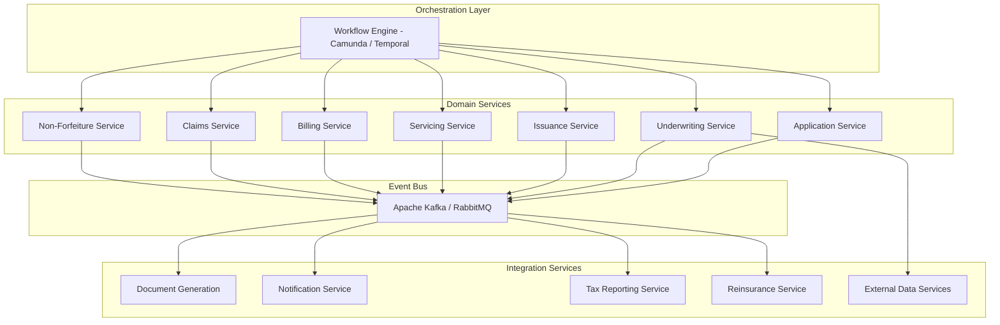

### 14.3 BPMN Process: Complete New Business Flow

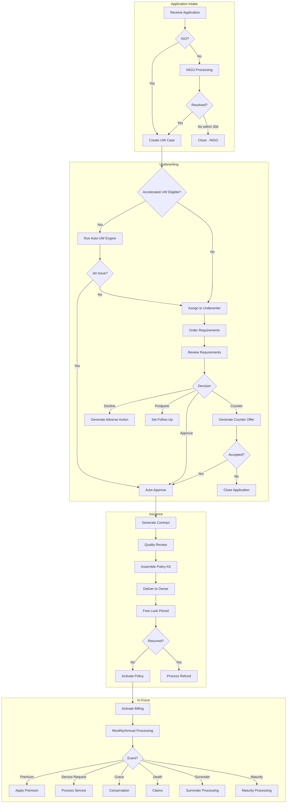

---

## 15. ACORD Transaction Reference

### 15.1 Lifecycle Transaction Types

| ACORD tc Code | Transaction Type | Lifecycle Stage | Direction |
|---|---|---|---|
| `103` | New Business Submission | Application | Inbound |
| `104` | Underwriting Requirement Order | Underwriting | Outbound |
| `109` | Requirement Result | Underwriting | Inbound |
| `121` | Owner Service Request | In-Force Servicing | Inbound |
| `125` | Financial Activity Report | In-Force | Outbound |
| `128` | Policy Status Change | All stages | Outbound |
| `141` | Payment/Premium Activity | In-Force | Inbound |
| `151` | Agent Activity | All stages | Inbound |
| `152` | Agent/Producer Change | In-Force | Inbound |
| `161` | Beneficiary Change | In-Force | Inbound |
| `162` | Ownership Change | In-Force | Inbound |
| `163` | Assignment | In-Force | Inbound |
| `171` | Loan Request | In-Force | Inbound |
| `172` | Withdrawal Request | In-Force | Inbound |
| `181` | Face Amount Change | In-Force | Inbound |
| `191` | Conversion Request | Termination (Term) | Inbound |
| `201` | Claim Notification | Claims | Inbound |
| `202` | Claim Status | Claims | Outbound |
| `203` | New Business Status | Application / UW | Outbound |
| `204` | Underwriting Decision | Underwriting | Outbound |
| `228` | Policy Inquiry | All stages | Inbound/Outbound |
| `501` | Holding Inquiry | All stages | Inbound/Outbound |
| `1122` | 1035 Exchange Request | Termination | Inbound |
| `1125` | Fund Transfer | In-Force (VUL) | Inbound |
| `1131` | Systematic Activity Setup | In-Force | Inbound |

### 15.2 Sample ACORD TXLife — Death Claim Notification

```xml
<?xml version="1.0" encoding="UTF-8"?>
<TXLife xmlns="http://ACORD.org/Standards/Life/2" Version="2.43.00">
  <TXLifeRequest>
    <TransRefGUID>e5f6a7b8-c9d0-1234-ef56-789012345678</TransRefGUID>
    <TransType tc="201">Claim Notification</TransType>
    <TransExeDate>2025-11-01</TransExeDate>
    <TransExeTime>10:30:00</TransExeTime>
    <OLifE>
      <Holding id="Holding_1">
        <HoldingTypeCode tc="2">Policy</HoldingTypeCode>
        <Policy>
          <PolNumber>UL-2020-0005678</PolNumber>
          <Claim>
            <ClaimType tc="1">Death</ClaimType>
            <DateOfLoss>2025-10-28</DateOfLoss>
            <ClaimStatus tc="1">Notification</ClaimStatus>
            <DeathCertInd tc="0">Not Yet Received</DeathCertInd>
            <CauseOfLoss>Natural Causes</CauseOfLoss>
            <ClaimantInfo>
              <ClaimantPartyID>Party_2</ClaimantPartyID>
              <ClaimantRoleCode tc="3">Primary Beneficiary</ClaimantRoleCode>
            </ClaimantInfo>
          </Claim>
        </Policy>
      </Holding>
      <Party id="Party_1">
        <PartyTypeCode tc="1">Person</PartyTypeCode>
        <Person>
          <FirstName>Sarah</FirstName>
          <LastName>Mitchell</LastName>
          <Gender tc="2">Female</Gender>
          <BirthDate>1978-11-10</BirthDate>
        </Person>
      </Party>
      <Party id="Party_2">
        <PartyTypeCode tc="1">Person</PartyTypeCode>
        <Person>
          <FirstName>James</FirstName>
          <LastName>Mitchell</LastName>
        </Person>
        <Phone>
          <PhoneTypeCode tc="1">Home</PhoneTypeCode>
          <AreaCode>860</AreaCode>
          <DialNumber>5559876</DialNumber>
        </Phone>
      </Party>
      <Relation OriginatingObjectID="Holding_1" RelatedObjectID="Party_1">
        <RelationRoleCode tc="8">Insured</RelationRoleCode>
      </Relation>
      <Relation OriginatingObjectID="Holding_1" RelatedObjectID="Party_2">
        <RelationRoleCode tc="3">Primary Beneficiary</RelationRoleCode>
      </Relation>
    </OLifE>
  </TXLifeRequest>
</TXLife>
```

### 15.3 Sample JSON — Policy Status Change Event

```json
{
  "eventId": "EVT-2025-0000456789",
  "eventType": "POLICY_STATE_CHANGE",
  "eventTimestamp": "2025-10-28T14:30:00Z",
  "policyId": "UL-2020-0005678",
  "policyNumber": "UL0005678",
  "productCode": "ULNLG2020",
  "stateChange": {
    "fromState": "INFORCE",
    "toState": "DEATH_CLM",
    "triggerEvent": "DEATH_NOTIFICATION",
    "effectiveDate": "2025-10-28",
    "triggeredBy": "CLAIMS_INTAKE_USER_42",
    "reasonCode": "DEATH_OF_INSURED"
  },
  "policySnapshot": {
    "insuredName": "Sarah Mitchell",
    "insuredDOB": "1978-11-10",
    "ownerName": "Sarah Mitchell",
    "faceAmount": 1000000.00,
    "accountValue": 125432.50,
    "loanBalance": 0.00,
    "deathBenefit": 1000000.00,
    "paidToDate": "2025-12-01",
    "riskClass": "PREFERRED_NONTOBACCO",
    "issueDate": "2020-06-01",
    "issueAge": 41,
    "contestabilityEndDate": "2022-06-01",
    "suicideExclusionEndDate": "2022-06-01"
  },
  "claimInfo": {
    "claimNumber": "CLM-2025-0001234",
    "dateOfDeath": "2025-10-28",
    "causeOfDeath": "Natural Causes",
    "withinContestability": false,
    "suicideExclusionApplies": false,
    "primaryBeneficiary": "James Mitchell",
    "beneficiaryRelationship": "Spouse",
    "estimatedDeathBenefit": 1000000.00
  },
  "relatedSystems": {
    "reinsuranceNotificationRequired": true,
    "reinsuranceTreatyId": "REIN-2020-AUTO-001",
    "cededAmount": 500000.00
  }
}
```

---

## 16. Appendices

### Appendix A: Regulatory Notices by Lifecycle Stage

| Stage | Notice Type | Timing | Regulatory Basis |
|---|---|---|---|
| **Application** | Privacy Notice (GLBA) | At application | Gramm-Leach-Bliley Act |
| **Application** | Replacement Notice | At application if replacing | State replacement regulations |
| **Underwriting** | Adverse Action Notice | Upon decline | Fair Credit Reporting Act |
| **Underwriting** | MIB Pre-Notification | Before MIB check | MIB Agreement |
| **Issuance** | Buyer's Guide | With policy delivery | NAIC Model |
| **Issuance** | Free Look Notice | With policy delivery | State insurance code |
| **In-Force** | Annual Statement | Annually | State insurance code |
| **In-Force** | Annual Privacy Notice | Annually (if sharing) | GLBA |
| **In-Force** | Illustration Update | Upon request or trigger | NAIC Illustration Model |
| **Grace** | Grace Period Notice | At start of grace | State insurance code |
| **Grace** | Lapse Warning | Before lapse | State insurance code (varies) |
| **Lapse** | Lapse Notice | Upon lapse | State insurance code |
| **Lapse** | Non-Forfeiture Options | Upon lapse | Standard Non-Forfeiture Law |
| **Lapse** | Conversion Rights (Term) | Upon lapse/expiry | Policy provisions |
| **Claims** | Claim Forms | Upon notification | State insurance code |
| **Claims** | Proof of Death Request | Upon notification | Policy provisions |
| **Claims** | Claim Decision | Within X days | State prompt pay laws |
| **Termination** | Surrender Confirmation | Upon surrender | State insurance code |
| **Termination** | 1099-R | By January 31 | IRS requirements |

### Appendix B: STP (Straight-Through Processing) Opportunities

| Transaction | STP Feasibility | Key STP Enablers |
|---|---|---|
| E-Application submission | High | Validation rules, real-time APIs |
| Accelerated underwriting | High | Rules engine, data vendor APIs |
| Policy issuance (post-approval) | High | Document generation automation |
| Premium payment (EFT) | Very High | Bank file processing automation |
| Premium payment (check) | Medium | Lockbox OCR, matching algorithms |
| Beneficiary change | High | Online self-service, validation rules |
| Address change | Very High | Online self-service |
| Allocation change (VUL) | Very High | Online self-service |
| Fund transfer (VUL) | Very High | Online self-service with limits |
| Policy loan (within limits) | High | Online self-service, EFT disbursement |
| Partial withdrawal | Medium-High | Online with tax calc automation |
| Face amount decrease | Medium | Requires recalculation, compliance check |
| Face amount increase | Low | Requires underwriting |
| Full surrender | Medium | Requires compliance checks, tax calc |
| Death claim (clean) | Medium | Document verification, benefit calc |
| Death claim (contested) | Very Low | Requires investigation |
| Reinstatement | Low | Requires UW for most |
| 1035 Exchange | Low | Multi-party coordination |

### Appendix C: Exception Handling Patterns

| Exception | Pattern | Resolution |
|---|---|---|
| **Premium Suspense** | Payment received but cannot be matched to a policy | Research queue → manual matching → apply or return |
| **NIGO Application** | Application missing required information | Automated checklist → notification → tracking → timeout |
| **UW Requirement Timeout** | Requirements not received within deadline | Reminder → escalation → auto-close or manual decision |
| **Counter-Offer No Response** | Applicant does not respond to counter | Aging report → agent follow-up → auto-expire |
| **Delivery Failure** | Policy cannot be delivered (bad address) | Address research → re-mail → agent notification |
| **Premium Bounce (NSF)** | EFT/ACH payment returned by bank | Retry logic → fallback billing → grace processing |
| **Lapse During Claim** | Policy lapses and death claim filed simultaneously | Claims priority → reinstatement analysis → adjudicate |
| **Duplicate Application** | Same person, same product | Duplicate detection rules → merge or flag |
| **Regulatory Hold** | State-specific processing restriction | Compliance review queue → manual release |
| **System Outage During Batch** | Processing failure mid-batch | Checkpoint/restart → idempotent processing → reconciliation |

### Appendix D: Data Model — Core Policy Entity

```sql
CREATE TABLE POLICY (
    policy_id              VARCHAR(20)    PRIMARY KEY,
    policy_number          VARCHAR(15)    NOT NULL UNIQUE,
    product_code           VARCHAR(10)    NOT NULL,
    product_line           VARCHAR(20)    NOT NULL,
    plan_code              VARCHAR(10)    NOT NULL,
    application_id         VARCHAR(20),
    illustration_id        VARCHAR(20),
    
    -- Party references
    insured_party_id       VARCHAR(20)    NOT NULL,
    owner_party_id         VARCHAR(20)    NOT NULL,
    payor_party_id         VARCHAR(20),
    agent_id               VARCHAR(20)    NOT NULL,
    agency_id              VARCHAR(20),
    
    -- Issue information
    issue_date             DATE           NOT NULL,
    issue_age              SMALLINT       NOT NULL,
    issue_state            CHAR(2)        NOT NULL,
    effective_date         DATE           NOT NULL,
    
    -- Coverage
    face_amount            DECIMAL(15,2)  NOT NULL,
    death_benefit_option   CHAR(1),       -- A, B, C (UL/VUL/IUL)
    risk_class             VARCHAR(20)    NOT NULL,
    gender                 CHAR(1)        NOT NULL,
    tobacco_status         CHAR(2)        NOT NULL,
    table_rating           VARCHAR(5),
    flat_extra_per_1000    DECIMAL(8,2),
    flat_extra_years       SMALLINT,
    
    -- Premium
    planned_premium        DECIMAL(12,2),
    target_premium         DECIMAL(12,2),
    minimum_premium        DECIMAL(12,2),
    modal_premium          DECIMAL(12,2),
    premium_mode           CHAR(1),       -- A, S, Q, M
    
    -- Financial
    account_value          DECIMAL(15,2),
    cash_surrender_value   DECIMAL(15,2),
    death_benefit_amount   DECIMAL(15,2),
    loan_balance           DECIMAL(15,2)  DEFAULT 0,
    cumulative_premiums    DECIMAL(15,2)  DEFAULT 0,
    cost_basis             DECIMAL(15,2)  DEFAULT 0,
    
    -- Status
    policy_status          VARCHAR(15)    NOT NULL DEFAULT 'APPL',
    policy_status_date     DATE           NOT NULL,
    paid_to_date           DATE,
    
    -- Dates
    maturity_date          DATE,
    maturity_age           SMALLINT,
    termination_date       DATE,
    termination_reason     VARCHAR(30),
    delivery_date          DATE,
    free_look_end_date     DATE,
    
    -- Compliance
    section_7702_test      CHAR(4),       -- CVAT, GPT
    is_mec                 BOOLEAN        DEFAULT FALSE,
    mec_date               DATE,
    contestability_end     DATE,
    suicide_exclusion_end  DATE,
    
    -- Reinsurance
    reinsurance_treaty_id  VARCHAR(20),
    reinsurance_type       VARCHAR(15),   -- YRT, COINS, MODCO
    retained_amount        DECIMAL(15,2),
    ceded_amount           DECIMAL(15,2),
    
    -- Audit
    created_ts             TIMESTAMP      DEFAULT CURRENT_TIMESTAMP,
    updated_ts             TIMESTAMP      DEFAULT CURRENT_TIMESTAMP,
    created_by             VARCHAR(20),
    updated_by             VARCHAR(20),
    version                INT            DEFAULT 1,
    
    FOREIGN KEY (product_code) REFERENCES PRODUCT_MASTER(product_code)
);

-- Indexes for common access patterns
CREATE INDEX idx_policy_number ON POLICY(policy_number);
CREATE INDEX idx_policy_status ON POLICY(policy_status);
CREATE INDEX idx_policy_insured ON POLICY(insured_party_id);
CREATE INDEX idx_policy_owner ON POLICY(owner_party_id);
CREATE INDEX idx_policy_agent ON POLICY(agent_id);
CREATE INDEX idx_policy_product ON POLICY(product_code);
CREATE INDEX idx_policy_issue_date ON POLICY(issue_date);
CREATE INDEX idx_policy_paid_to ON POLICY(paid_to_date);
```

### Appendix E: Glossary of Lifecycle Terms

| Term | Definition |
|---|---|
| **Application** | Formal request for insurance coverage |
| **APL** | Automatic Premium Loan — premium paid by borrowing against cash value |
| **APS** | Attending Physician's Statement — medical records from insured's doctor |
| **Contestability Period** | First 2 years after issue during which insurer can contest claims for material misrepresentation |
| **Conversion** | Right to change a term policy to permanent without evidence of insurability |
| **CSV** | Cash Surrender Value — amount payable upon voluntary termination |
| **ETI** | Extended Term Insurance — non-forfeiture option converting to term |
| **Free Look** | Period after delivery during which owner can return policy for full refund |
| **Grace Period** | Time after premium due date during which coverage remains in effect |
| **IGO** | In Good Order — application has all required information |
| **Jet Issue** | Automated approval without human underwriter involvement |
| **Lapse** | Termination of coverage due to non-payment of premium |
| **Maturity** | Policy reaches its contractual end age (100 or 121) |
| **MEC** | Modified Endowment Contract — policy that fails 7-pay test |
| **MIB** | Medical Information Bureau — insurance industry database |
| **MVR** | Motor Vehicle Record |
| **NIGO** | Not In Good Order — application missing required information |
| **Non-Forfeiture** | Guaranteed options for lapsed cash-value policies |
| **Paid-Up** | Policy requires no further premium payments |
| **Reinstatement** | Restoration of a lapsed policy to active status |
| **Rescission** | Voiding of a policy due to material misrepresentation during contestability |
| **RPU** | Reduced Paid-Up — non-forfeiture option for reduced paid-up coverage |
| **STP** | Straight-Through Processing — fully automated processing without human intervention |
| **Surrender** | Voluntary termination of a policy by the owner |
| **Suicide Exclusion** | Provision excluding death benefit for suicide within 1–2 years of issue |
| **1035 Exchange** | Tax-free exchange of one life insurance or annuity contract for another |

---

*End of Article 03 — Policy Lifecycle: End-to-End*

*Previous: [Article 02 — Annuities Deep Dive](./02-annuities-deep-dive.md)*
*First: [Article 01 — Life Insurance Products Taxonomy](./01-life-insurance-products-taxonomy.md)*
