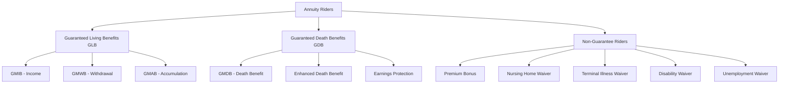
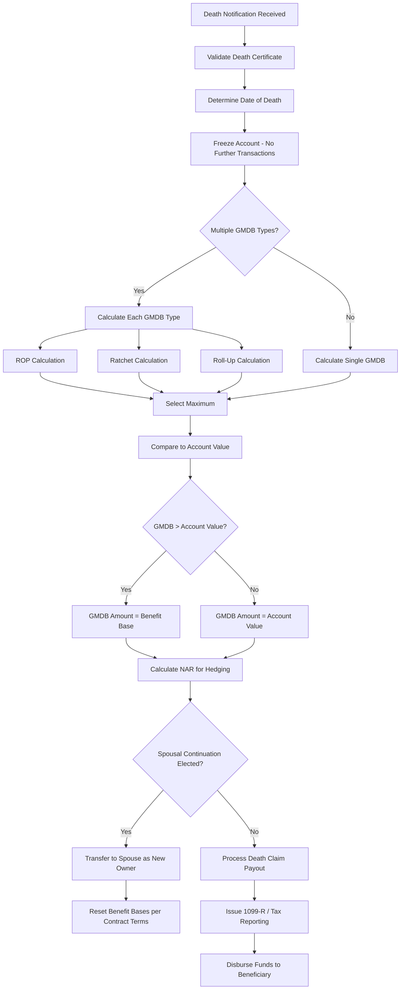
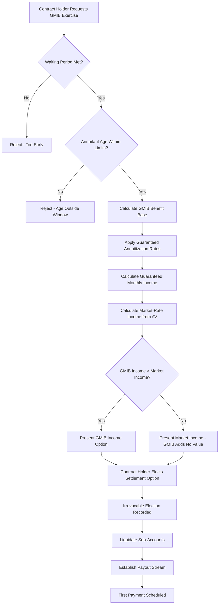
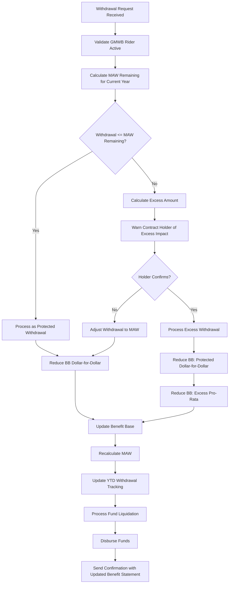
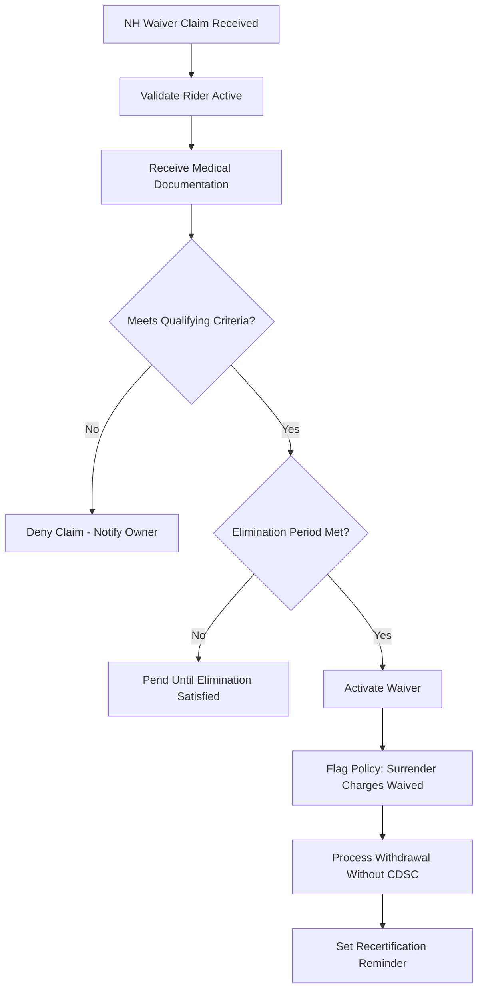
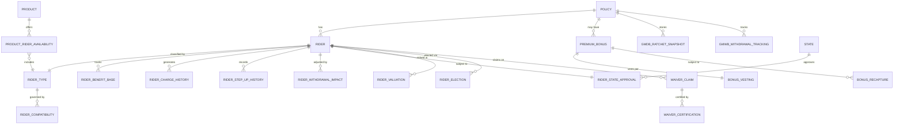
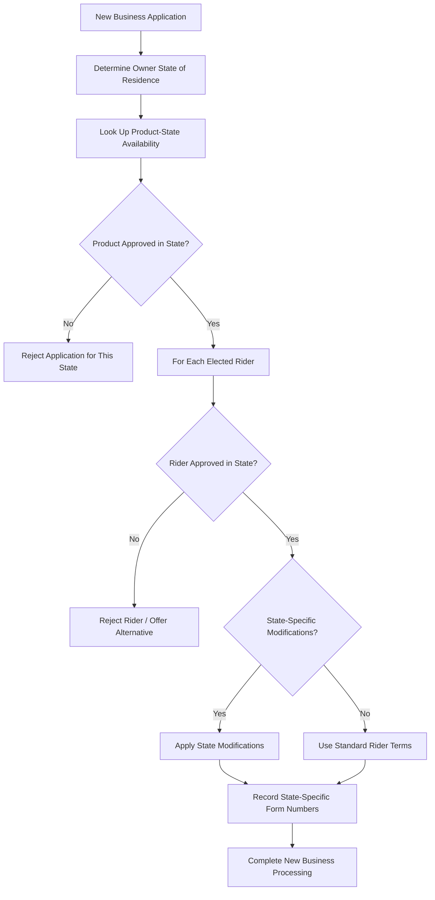
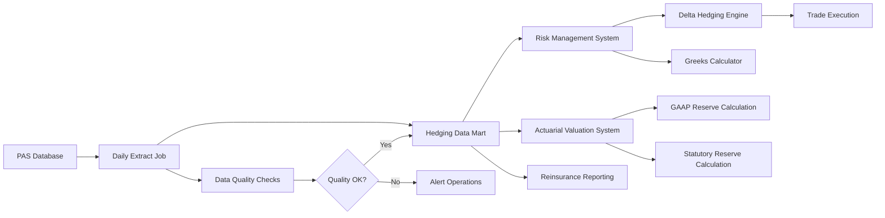
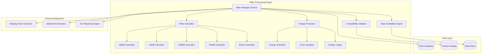

# Article 04: Annuity Product Design & Riders

## Table of Contents

1. [Introduction](#1-introduction)
2. [Guaranteed Minimum Death Benefit (GMDB)](#2-guaranteed-minimum-death-benefit-gmdb)
3. [Guaranteed Minimum Income Benefit (GMIB)](#3-guaranteed-minimum-income-benefit-gmib)
4. [Guaranteed Minimum Withdrawal Benefit (GMWB)](#4-guaranteed-minimum-withdrawal-benefit-gmwb)
5. [Guaranteed Minimum Accumulation Benefit (GMAB)](#5-guaranteed-minimum-accumulation-benefit-gmab)
6. [Living Benefit Riders](#6-living-benefit-riders)
7. [Premium Bonus Credits](#7-premium-bonus-credits)
8. [Rider Stacking Rules](#8-rider-stacking-rules)
9. [Rider Charge Calculations](#9-rider-charge-calculations)
10. [Comprehensive Data Model](#10-comprehensive-data-model)
11. [State-by-State Rider Availability](#11-state-by-state-rider-availability)
12. [ACORD Integration for Riders](#12-acord-integration-for-riders)
13. [Hedging Implications](#13-hedging-implications)
14. [Architecture & Implementation Guidance](#14-architecture--implementation-guidance)

---

## 1. Introduction

Annuity riders represent the most complex and actuarially significant features within a Policy Administration System (PAS). These optional benefits — offered for additional charges — transform a base annuity contract from a simple accumulation or income vehicle into a sophisticated risk-transfer mechanism. From a PAS perspective, rider management demands:

- **Multi-dimensional benefit base tracking** independent of account value
- **Complex interaction rules** between riders, base contract events, and external triggers
- **Daily or anniversary-based processing** depending on rider type and contract design
- **Hedging data feeds** to downstream risk management systems
- **Regulatory compliance** across 50+ jurisdictions with varying approval statuses

This article serves as the definitive reference for solution architects designing or maintaining annuity rider capabilities within a PAS. Every data element, calculation formula, process flow, and integration pattern is documented to production-grade specificity.

### 1.1 Rider Classification Taxonomy



### 1.2 Rider Lifecycle in PAS

```mermaid
statechart-v2
    [*] --> Elected
    Elected --> Active: Issue/Effective Date
    Active --> Exercised: Benefit Triggered
    Active --> Terminated: Rider Cancel / Lapse
    Active --> Expired: Max Age / Term Reached
    Exercised --> PayingOut: Payout Stream Created
    PayingOut --> Exhausted: Benefits Fully Paid
    Terminated --> [*]
    Expired --> [*]
    Exhausted --> [*]
```

### 1.3 ACORD Object Model Context

ACORD Life data model references relevant to riders:

| ACORD Object | Description | Key Elements |
|---|---|---|
| `OLifE.Holding.Policy.Life.Coverage.CovOption` | Rider attachment point | `CovOptionKey`, `LifeCovOptTypeCode` |
| `OLifE.Holding.Policy.Annuity.Rider` | Annuity-specific rider | `RiderCode`, `RiderTypeCode` |
| `OLifE.Holding.Policy.Annuity.Payout` | Payout configuration | `PayoutMode`, `PayoutAmt` |
| `OLifE.Party.Risk` | Risk classification | `RiskTypeCode` |

---

## 2. Guaranteed Minimum Death Benefit (GMDB)

### 2.1 Overview

The Guaranteed Minimum Death Benefit ensures that upon the death of the annuitant (or owner, depending on contract terms), the beneficiary receives at least a minimum amount, regardless of investment performance in variable sub-accounts. This is the most fundamental guarantee in variable annuity design and carries significant mortality and market risk for the insurer.

### 2.2 GMDB Types — Detailed Specifications

#### 2.2.1 Return of Premium (ROP) GMDB

**Definition:** The death benefit equals the greater of the current account value or total premiums paid, minus any prior withdrawals (adjusted proportionally or dollar-for-dollar).

**Calculation Formula:**

```
GMDB_ROP = MAX(AccountValue, TotalPremiums - CumulativeWithdrawals_ProRata)
```

Where:
```
CumulativeWithdrawals_ProRata = Σ (Withdrawal_i × (TotalPremiums_at_time_i / AccountValue_at_time_i))
```

**Pro-Rata Adjustment Example:**

| Event | Premium | Withdrawal | AV Before | AV After | Adjusted Premium Base |
|---|---|---|---|---|---|
| Initial Premium | $100,000 | — | $0 | $100,000 | $100,000 |
| Year 1 Growth | — | — | $100,000 | $115,000 | $100,000 |
| Year 2 Withdrawal | — | $20,000 | $115,000 | $95,000 | $100,000 × (1 - 20,000/115,000) = $82,609 |
| Year 3 Additional Premium | $25,000 | — | $95,000 | $120,000 | $82,609 + $25,000 = $107,609 |
| Year 4 Loss | — | — | $120,000 | $90,000 | $107,609 |

**Death Benefit at Year 4:** MAX($90,000, $107,609) = **$107,609**

**Net Amount at Risk (NAR):** $107,609 - $90,000 = **$17,609**

**Pseudocode:**

```python
def calculate_rop_gmdb(policy):
    account_value = policy.current_account_value
    adjusted_premium_base = policy.initial_premium
    
    for event in policy.transaction_history:
        if event.type == 'ADDITIONAL_PREMIUM':
            adjusted_premium_base += event.amount
        elif event.type == 'WITHDRAWAL':
            pro_rata_factor = event.amount / event.account_value_before
            adjusted_premium_base *= (1 - pro_rata_factor)
    
    return max(account_value, adjusted_premium_base)
```

#### 2.2.2 Highest Anniversary Value (Ratchet) GMDB

**Definition:** The death benefit equals the greatest of: current account value, the highest account value on any contract anniversary, or return of premium (some designs). The ratchet "locks in" gains on each anniversary date.

**Calculation Formula:**

```
GMDB_Ratchet = MAX(
    AccountValue,
    MAX(AnniversaryValue_1, AnniversaryValue_2, ..., AnniversaryValue_n),
    AdjustedPremiumBase  // if combined with ROP
)
```

**Anniversary Value Adjustment for Withdrawals:**

Each stored anniversary high-water mark must be reduced proportionally when a withdrawal occurs:

```
AdjustedAnniversaryValue_i = AnniversaryValue_i × (1 - Withdrawal / AV_before_withdrawal)
```

**Detailed Example:**

| Date | Event | AV | Anniversary Value | Adjusted Ratchet Base |
|---|---|---|---|---|
| 01/01/2020 | Initial Premium $200,000 | $200,000 | — | $200,000 |
| 01/01/2021 | Anniversary 1 | $230,000 | $230,000 | $230,000 |
| 01/01/2022 | Anniversary 2 | $210,000 | $210,000 | $230,000 (prior high) |
| 06/15/2022 | Withdrawal $30,000 | $180,000 | — | $230,000 × (1 - 30,000/210,000) = $197,143 |
| 01/01/2023 | Anniversary 3 | $195,000 | $195,000 | MAX($197,143, $195,000) = $197,143 |
| 01/01/2024 | Anniversary 4 | $250,000 | $250,000 | $250,000 |
| 07/01/2024 | Death | $240,000 | — | MAX($240,000, $250,000) = **$250,000** |

**Data Storage Requirements:**

```json
{
  "gmdb_ratchet": {
    "anniversaryHighWaterMarks": [
      {"anniversaryDate": "2021-01-01", "originalValue": 230000.00, "adjustedValue": 197142.86},
      {"anniversaryDate": "2022-01-01", "originalValue": 210000.00, "adjustedValue": 180000.00},
      {"anniversaryDate": "2023-01-01", "originalValue": 195000.00, "adjustedValue": 195000.00},
      {"anniversaryDate": "2024-01-01", "originalValue": 250000.00, "adjustedValue": 250000.00}
    ],
    "currentRatchetBase": 250000.00,
    "lastProcessedDate": "2024-01-01"
  }
}
```

#### 2.2.3 Roll-Up GMDB

**Definition:** The death benefit base grows at a specified compounding rate (typically 3%–7%) from the issue date, regardless of actual investment performance. The death benefit is the greater of the rolled-up value or the current account value.

**Calculation Formula:**

```
GMDB_RollUp = MAX(AccountValue, RollUpBase)

RollUpBase = (InitialPremium × (1 + RollUpRate)^n) - ProRataWithdrawalAdjustments
```

Where `n` = number of years (or portions thereof depending on daily vs anniversary compounding).

**Roll-Up Rate Variations:**

| Rate Type | Typical Rates | Compounding | Cap |
|---|---|---|---|
| Simple | 5%, 6%, 7% | Annual, on anniversary | 200% of premium, age 80 |
| Compound | 3%, 4%, 5% | Annual, daily | 200%-250% of premium, age 80/85 |
| Tiered | 7% yr 1-10, 4% yr 11+ | Annual | None or 300% |

**Detailed Roll-Up Calculation (5% Compound, Annual):**

Starting Premium: $100,000

| Year | Roll-Up Base (Before W/D) | Withdrawal | Pro-Rata Reduction | Adjusted Roll-Up Base | Account Value | GMDB |
|---|---|---|---|---|---|---|
| 0 | $100,000.00 | — | — | $100,000.00 | $100,000 | $100,000 |
| 1 | $105,000.00 | — | — | $105,000.00 | $108,000 | $108,000 |
| 2 | $110,250.00 | — | — | $110,250.00 | $95,000 | $110,250 |
| 3 | $115,762.50 | $10,000 | 10,000/95,000 = 10.526% | $115,762.50 × 0.8947 = $103,576 | $85,000 | $103,576 |
| 4 | $103,576 × 1.05 = $108,755 | — | — | $108,755 | $92,000 | $108,755 |
| 5 | $108,755 × 1.05 = $114,193 | — | — | $114,193 | $88,000 | $114,193 |

**Daily Compounding Variant:**

```
DailyRollUpBase = InitialPremium × (1 + AnnualRate/365)^(DaysSinceIssue)
```

For $100,000 at 5%:
- After 365 days: $100,000 × (1.000136986)^365 = $105,126.75
- After 730 days: $100,000 × (1.000136986)^730 = $110,516.56

**Maximum Benefit Cap Processing:**

```python
def calculate_rollup_gmdb(policy):
    roll_up_base = policy.initial_premium
    years_elapsed = calculate_years(policy.issue_date, policy.valuation_date)
    
    if policy.rollup_compounding == 'ANNUAL':
        roll_up_base *= (1 + policy.rollup_rate) ** years_elapsed
    elif policy.rollup_compounding == 'DAILY':
        days_elapsed = (policy.valuation_date - policy.issue_date).days
        roll_up_base *= (1 + policy.rollup_rate / 365) ** days_elapsed
    
    for withdrawal in policy.withdrawals:
        pro_rata = withdrawal.amount / withdrawal.av_before
        roll_up_base *= (1 - pro_rata)
    
    # Apply cap
    max_cap = policy.initial_premium * policy.rollup_cap_multiple  # e.g., 2.0 for 200%
    roll_up_base = min(roll_up_base, max_cap)
    
    # Apply age cutoff
    if policy.annuitant_age >= policy.rollup_max_age:  # e.g., 80
        roll_up_base = roll_up_base  # frozen, no further roll-up
    
    return max(policy.account_value, roll_up_base)
```

#### 2.2.4 Greater-Of GMDB

**Definition:** Combines multiple GMDB types, paying the greatest of all applicable calculations.

```
GMDB_GreaterOf = MAX(
    AccountValue,
    ROP_Base,
    Ratchet_Base,
    RollUp_Base
)
```

**PAS Implementation Note:** The system must maintain parallel benefit bases for each sub-type and evaluate all at the time of death claim. This requires:

- Separate roll-up base tracking (with daily/anniversary compounding)
- Anniversary high-water mark array
- Adjusted premium base
- All must be independently adjusted for withdrawals

#### 2.2.5 Stepped-Up GMDB

**Definition:** The benefit base resets (steps up) to the current account value at specified intervals (e.g., every 5th anniversary), but only if the account value exceeds the current benefit base.

```
On Step-Up Date:
    IF AccountValue > CurrentBenefitBase THEN
        NewBenefitBase = AccountValue
    ELSE
        NewBenefitBase = CurrentBenefitBase  // no step-down
```

**Step-Up Schedule Example:**

| Anniversary | Account Value | Benefit Base Before | Step-Up Eligible? | Benefit Base After |
|---|---|---|---|---|
| 5 | $135,000 | $100,000 | Yes (AV > Base) | $135,000 |
| 10 | $120,000 | $135,000 | No (AV < Base) | $135,000 |
| 15 | $180,000 | $135,000 | Yes (AV > Base) | $180,000 |

#### 2.2.6 Enhanced Death Benefit (EDB)

**Definition:** Pays an additional percentage (typically 25%-40%) of the gain over the premium, subject to a dollar cap.

```
Enhancement = MIN(EnhancementPct × (AccountValue - TotalPremiums), DollarCap)
EDB = AccountValue + Enhancement

// Only if AccountValue > TotalPremiums (i.e., there is a gain)
IF AccountValue <= TotalPremiums THEN Enhancement = 0
```

**Example (25% Enhancement, $25,000 Cap):**
- Account Value: $150,000
- Total Premiums: $100,000
- Gain: $50,000
- Enhancement: MIN(25% × $50,000, $25,000) = MIN($12,500, $25,000) = $12,500
- EDB: $150,000 + $12,500 = **$162,500**

### 2.3 GMDB Processing Flows



### 2.4 Spousal Continuation

When the deceased is the owner (not annuitant) and the surviving spouse is the beneficiary, many contracts allow "spousal continuation" — the spouse becomes the new owner and the contract continues in force.

**PAS Processing Rules:**

1. **Eligibility Check:** Spouse must be named beneficiary; some contracts require legal marriage.
2. **Benefit Base Reset Options:**
   - Option A: Benefit base resets to current account value (restarts guarantee)
   - Option B: Benefit base carries forward at current level
   - Option C: Benefit base resets to greater of AV or existing base
3. **Charge Rate Impact:** Rider charges may reset or continue at current rates.
4. **Step-Up Basis:** For tax purposes, the surviving spouse receives a stepped-up cost basis to the date-of-death value.

**Data Elements for Spousal Continuation:**

```json
{
  "spousalContinuation": {
    "eligible": true,
    "electionDeadlineDays": 60,
    "benefitBaseResetRule": "GREATER_OF_AV_OR_BASE",
    "newOwnerPartyId": "PTY-9876",
    "originalOwnerDateOfDeath": "2024-07-15",
    "costBasisStepUp": true,
    "newCostBasis": 250000.00,
    "priorCostBasis": 100000.00,
    "riderChargeResetRule": "CONTINUE_CURRENT"
  }
}
```

### 2.5 Beneficiary Step-Up Basis Rules

| Scenario | Tax Basis Treatment |
|---|---|
| Non-qualified: Owner dies | No step-up; beneficiary receives with carryover basis |
| Non-qualified: Annuitant dies (owner alive) | Depends on contract; may trigger full distribution |
| Qualified (IRA): Owner dies | Inherited IRA rules apply; no step-up |
| Spousal continuation | Step-up to DOD value for NQ; inherited IRA for Q |

### 2.6 Daily vs. Anniversary GMDB Processing

| Aspect | Daily Processing | Anniversary Processing |
|---|---|---|
| Ratchet evaluation | Check and store daily high-water mark | Check only on anniversary |
| Roll-up compounding | Daily compounding formula | Annual compounding formula |
| Withdrawal adjustment | Immediate pro-rata adjustment | Adjustment on next anniversary |
| System load | Higher (daily batch for all policies) | Lower (spread across year) |
| Accuracy | Higher | Adequate for most products |
| Storage | Larger (daily snapshots) | Smaller (annual snapshots) |

---

## 3. Guaranteed Minimum Income Benefit (GMIB)

### 3.1 Overview

The GMIB guarantees that, regardless of actual investment performance, the contract holder can annuitize at a minimum benefit base using guaranteed annuitization rates. This rider protects the income stream rather than the account value.

### 3.2 Benefit Base Accumulation

The GMIB benefit base typically grows at a guaranteed roll-up rate (commonly 5%–6% compound or simple) from the issue date, independent of actual investment returns.

```
GMIB_BenefitBase = InitialPremium × (1 + RollUpRate)^n
```

**Key Distinction from GMDB Roll-Up:** The GMIB benefit base is used solely for annuitization calculations — it is NOT paid out as a lump sum. The contract holder must annuitize to receive the guaranteed income.

### 3.3 Waiting Period Requirements

Most GMIBs impose a mandatory waiting period (typically 7–10 years) before the benefit can be exercised.

```
EarliestExerciseDate = RiderEffectiveDate + WaitingPeriodYears
```

**PAS Calendar Logic:**

```python
def is_gmib_exercisable(rider):
    if rider.waiting_period_type == 'ANNIVERSARY':
        exercise_date = add_years(rider.effective_date, rider.waiting_period_years)
        return current_date >= exercise_date
    elif rider.waiting_period_type == 'CALENDAR':
        return (current_date.year - rider.effective_date.year) >= rider.waiting_period_years
    return False
```

### 3.4 Annuitization Requirements

When exercising the GMIB, the PAS must enforce:

1. **Irrevocability:** Once elected, the annuitization cannot be reversed.
2. **Settlement Option Restrictions:** Only specific settlement options qualify (typically life contingent).
3. **Minimum Annuitization Period:** The payout period must be at least the required minimum (e.g., life with 10-year certain).
4. **Entire Account:** The entire account value must be annuitized; partial annuitization is typically not allowed.

### 3.5 In-the-Money Calculation

The GMIB is "in the money" when the guaranteed annuitization value exceeds what the current account value would produce using current market annuitization rates.

```
GMIB_Income = Annuitize(GMIB_BenefitBase, GuaranteedRates)
Market_Income = Annuitize(AccountValue, CurrentMarketRates)

InTheMoney = GMIB_Income > Market_Income
```

**Detailed In-the-Money Example:**

| Parameter | GMIB Guarantee | Current Market |
|---|---|---|
| Basis for annuitization | $180,000 (rolled-up base) | $130,000 (account value) |
| Interest rate assumption | 3.0% (guaranteed) | 4.5% (current) |
| Mortality table | 1983 Table A (guaranteed) | 2012 IAM (current) |
| Monthly payout (Life w/ 10-yr certain, male age 70) | $1,125.47 | $847.92 |
| In the money? | **Yes — GMIB payout exceeds market** | |

### 3.6 Election Mechanics



### 3.7 Conversion to Payout Stream

When the GMIB is exercised and the guaranteed income exceeds market income, the insurer must fund the difference. The PAS must:

1. Liquidate all sub-account units.
2. Transfer account value to the general account.
3. Recognize the shortfall (GMIB benefit base minus account value) as a reserve liability.
4. Create the payout annuity record using guaranteed rates.
5. Schedule payments per elected frequency (monthly, quarterly, semi-annual, annual).

**Cost to Insurer:**

```
PV_of_GMIB_Payout = PresentValue(GuaranteedPaymentStream, CurrentDiscountRate)
Insurer_Cost = PV_of_GMIB_Payout - AccountValue_at_Exercise
```

### 3.8 Assumed Interest Rates

The GMIB typically specifies one or more of:

| Rate Parameter | Description | Typical Values |
|---|---|---|
| Roll-up rate | Rate at which benefit base grows | 5%-6% compound |
| Annuitization interest rate | Rate used in payout factor calculation | 2%-3.5% |
| Mortality table | Table for life contingent calculations | 1983 Table A, Annuity 2000 |
| Age setback | Adjustment to annuitant age for rate lookup | 0-5 years |

### 3.9 GMIB Withdrawal Impact

Withdrawals reduce the GMIB benefit base proportionally:

```
AdjustedBenefitBase = BenefitBase × (1 - WithdrawalAmount / AccountValueBeforeWithdrawal)
```

**Critical PAS Design Note:** Some GMIB riders distinguish between "protected" withdrawals (up to a maximum annual amount, e.g., 5% of benefit base) and "excess" withdrawals:

- **Protected withdrawal:** Reduces benefit base dollar-for-dollar
- **Excess withdrawal:** Reduces benefit base pro-rata (greater reduction)

```python
def adjust_gmib_for_withdrawal(rider, withdrawal_amount, av_before):
    if withdrawal_amount <= rider.annual_protected_amount_remaining:
        # Dollar-for-dollar reduction
        rider.benefit_base -= withdrawal_amount
        rider.annual_protected_amount_remaining -= withdrawal_amount
    else:
        protected_portion = rider.annual_protected_amount_remaining
        excess_portion = withdrawal_amount - protected_portion
        
        # Dollar-for-dollar for protected
        rider.benefit_base -= protected_portion
        rider.annual_protected_amount_remaining = 0
        
        # Pro-rata for excess
        av_after_protected = av_before - protected_portion
        pro_rata_factor = excess_portion / av_after_protected
        rider.benefit_base *= (1 - pro_rata_factor)
```

---

## 4. Guaranteed Minimum Withdrawal Benefit (GMWB)

### 4.1 Overview

The GMWB guarantees that the contract holder can withdraw a specified percentage of the benefit base annually, regardless of actual account performance, until the entire benefit base has been recovered. The most popular modern variant — GMWB for Life (GLWB) — extends this to a lifetime guarantee.

### 4.2 Core GMWB Mechanics

**Key Terms:**

| Term | Definition |
|---|---|
| Benefit Base (BB) | Notional amount used to calculate maximum annual withdrawal |
| Annual Withdrawal Percentage (AWP) | Percentage of BB allowed per year (typically 4%-7%) |
| Maximum Annual Withdrawal (MAW) | BB × AWP |
| Remaining Guaranteed Amount (RGA) | Amount of BB still to be recovered |
| Lifetime Income Amount (LIA) | For GLWB: MAW continues for life even after RGA = 0 |

### 4.3 Annual Withdrawal Percentage Schedules

AWP typically varies by the annuitant's age at the time of the first withdrawal (or rider election):

| Age at First Withdrawal | Single Life AWP | Joint Life AWP |
|---|---|---|
| 55-59 | 4.0% | 3.5% |
| 60-64 | 4.5% | 4.0% |
| 65-69 | 5.0% | 4.5% |
| 70-74 | 5.5% | 5.0% |
| 75-79 | 6.0% | 5.5% |
| 80+ | 6.5% | 6.0% |

**Lock-In Rule:** Once the first withdrawal is taken, the AWP is locked based on the annuitant's attained age at that point. Some products allow a higher AWP if the holder delays the first withdrawal.

### 4.4 Benefit Base Step-Ups

The GMWB benefit base can increase ("step up") through several mechanisms:

#### 4.4.1 Automatic Anniversary Step-Up

On each contract anniversary, if the account value exceeds the current benefit base, the benefit base steps up to the account value.

```
On Anniversary:
    IF AccountValue > BenefitBase THEN
        BenefitBase = AccountValue
        // MAW may also increase
        MAW = BenefitBase × AWP
```

#### 4.4.2 Highest Anniversary Value Step-Up

Similar to ratchet GMDB, but applied to the GMWB benefit base.

#### 4.4.3 Roll-Up Step-Up

The benefit base grows at a guaranteed rate (e.g., 5%-8%) each year the contract holder has NOT yet taken a withdrawal.

```
IF no withdrawals taken during year THEN
    BenefitBase = BenefitBase × (1 + RollUpRate)
```

**Deferral Bonus Example:**

| Year | Account Value | Benefit Base (6% Roll-Up) | Withdrawal | MAW (5% of BB) |
|---|---|---|---|---|
| 0 | $200,000 | $200,000 | None | — |
| 1 | $210,000 | $212,000 | None | — |
| 2 | $195,000 | $224,720 | None | — |
| 3 | $205,000 | $238,203 | None | — |
| 4 | $215,000 | $252,495 | None | — |
| 5 | $200,000 | $267,645 | None | — |
| 6 | $190,000 | $283,704 | Starts | $14,185/yr |

### 4.5 Excess Withdrawal Impact

**This is the most critical GMWB processing rule for PAS implementation.**

Withdrawals up to the MAW are "protected" — they reduce the benefit base dollar-for-dollar and do not impair the guarantee. Withdrawals exceeding the MAW ("excess withdrawals") cause a proportional reduction in the benefit base.

```
IF Withdrawal <= MAW_Remaining THEN
    // Dollar-for-dollar
    BenefitBase -= Withdrawal
    RemainingGuarantee -= Withdrawal
ELSE
    // Protected portion
    ProtectedPortion = MAW_Remaining
    BenefitBase -= ProtectedPortion
    
    // Excess portion - Pro-rata
    ExcessPortion = Withdrawal - ProtectedPortion
    AV_AfterProtected = AV_Before - ProtectedPortion
    ProRataFactor = ExcessPortion / AV_AfterProtected
    BenefitBase *= (1 - ProRataFactor)
```

**Excess Withdrawal Impact Example:**

- Benefit Base: $300,000
- MAW (5%): $15,000
- Account Value: $250,000
- Withdrawal Requested: $40,000

Step 1: Protected portion = $15,000 (MAW remaining)
- BB after protected: $300,000 - $15,000 = $285,000

Step 2: Excess portion = $40,000 - $15,000 = $25,000
- AV after protected: $250,000 - $15,000 = $235,000
- Pro-rata factor: $25,000 / $235,000 = 10.638%
- BB after excess: $285,000 × (1 - 0.10638) = $254,682

Step 3: New MAW = $254,682 × 5% = $12,734

**The excess withdrawal permanently reduced the benefit base by $45,318 (from $300,000 to $254,682) even though only $40,000 was withdrawn.**

### 4.6 Lifetime vs. Fixed-Period GMWB

| Feature | Fixed-Period GMWB | GMWB for Life (GLWB) |
|---|---|---|
| Duration | Until benefit base exhausted | For life of annuitant |
| When AV = 0 | Contract terminates | Insurer pays from general account |
| AWP determination | Fixed at election | Age-based at first withdrawal |
| Rider charge | Lower (typically 40-60 bps) | Higher (typically 75-125 bps) |
| Mortality risk | None to insurer | Significant longevity risk |

### 4.7 Single vs. Joint Life GLWB

**Joint Life Processing:**

1. Both lives must be spouses at issue (or within defined relationship).
2. AWP is lower for joint (longer expected payout).
3. Upon first death, surviving spouse continues receiving the same MAW.
4. Benefit base does NOT reset on first death.
5. Payments continue until second death.

**PAS Data Requirements for Joint Life:**

```json
{
  "glwb_joint": {
    "primaryAnnuitantId": "PTY-1001",
    "jointAnnuitantId": "PTY-1002",
    "primaryDOB": "1960-03-15",
    "jointDOB": "1962-07-22",
    "ageAtFirstWithdrawal_primary": null,
    "ageAtFirstWithdrawal_joint": null,
    "awpDeterminedBy": "YOUNGER_LIFE",
    "firstDeathDate": null,
    "survivorContinuationRule": "SAME_MAW",
    "currentBenefitBase": 300000.00,
    "currentMAW": 13500.00,
    "withdrawalsYTD": 6750.00,
    "mawRemaining": 6750.00
  }
}
```

### 4.8 Withdrawal Processing Rules



### 4.9 Benefit Base Reduction Formulas — Complete Reference

| Scenario | Formula |
|---|---|
| Protected withdrawal (within MAW) | `BB_new = BB_old - Withdrawal` |
| Excess withdrawal | `BB_new = (BB_old - MAW_remaining) × (1 - Excess / (AV - MAW_remaining))` |
| Additional premium | `BB_new = BB_old + Premium` |
| Step-up (anniversary) | `BB_new = MAX(BB_old, AV)` |
| Roll-up (no withdrawals in year) | `BB_new = BB_old × (1 + RollUpRate)` |
| Contract-holder death (GLWB) | For single: contract terminates. For joint: BB continues |

---

## 5. Guaranteed Minimum Accumulation Benefit (GMAB)

### 5.1 Overview

The GMAB guarantees that, at the end of a specified waiting period (typically 10 years), the account value will be at least equal to a guaranteed minimum amount (usually the initial premium or a specified percentage of premiums). If the account value is below the guarantee at maturity, the insurer "tops up" the account to the guaranteed level.

### 5.2 Maturity Guarantee

```
At GMAB Maturity Date:
    IF AccountValue < GuaranteedAmount THEN
        TopUp = GuaranteedAmount - AccountValue
        AccountValue += TopUp
    // Contract continues with full account value
```

### 5.3 Waiting Periods

| Product Design | Waiting Period | Guarantee Level |
|---|---|---|
| Basic GMAB | 10 years | 100% of premium |
| Enhanced GMAB | 10 years | 100% of premium + additional premiums |
| Aggressive GMAB | 7 years | 80% of premium |
| Double GMAB | 10 years | 200% of premium (rare) |

### 5.4 Automatic Exercise

Unlike GMIB (which requires election), the GMAB exercises automatically on the maturity date:

```python
def process_gmab_maturity(policy, rider):
    maturity_date = add_years(rider.effective_date, rider.waiting_period_years)
    
    if current_date == maturity_date:
        guaranteed_amount = calculate_gmab_guarantee(rider)
        
        if policy.account_value < guaranteed_amount:
            top_up = guaranteed_amount - policy.account_value
            
            # Credit top-up to fixed account or proportionally
            if rider.top_up_allocation == 'FIXED_ACCOUNT':
                policy.fixed_account_value += top_up
            elif rider.top_up_allocation == 'PROPORTIONAL':
                allocate_proportionally(policy, top_up)
            
            # Record for hedging/actuarial
            create_gmab_claim(policy, rider, top_up)
        
        # Rider terminates at maturity
        rider.status = 'MATURED'
        rider.termination_date = maturity_date
```

### 5.5 Clawback Provisions

Some GMAB designs include "clawback" or "recapture" provisions allowing the insurer to recover the top-up if the account value subsequently increases:

```
IF within ClawbackPeriod (e.g., 3 years post-maturity):
    IF AccountValue > GuaranteedAmount + TopUpAmount THEN
        Recapture = MIN(TopUpAmount, AccountValue - GuaranteedAmount)
        AccountValue -= Recapture
```

**PAS Implementation Warning:** Clawback provisions are rare and extremely unpopular. When implemented, they must be clearly tracked and disclosed.

### 5.6 Reset Mechanics

Some GMAB products allow the contract holder to "reset" the guarantee, restarting the waiting period with a new benefit base:

```
On Reset:
    NewBenefitBase = MAX(AccountValue, CurrentBenefitBase)  // or just AV
    NewMaturityDate = ResetDate + WaitingPeriodYears
    RiderChargeMayChange = true  // reset may trigger new charge rate
```

**Reset Restrictions:**
- Maximum number of resets (e.g., 2 lifetime)
- Minimum interval between resets (e.g., 1 year)
- Age cutoff (e.g., no resets after age 75)
- Cannot reset during GMAB waiting period (some products)

### 5.7 GMAB Withdrawal Impact

Withdrawals during the waiting period reduce the guaranteed amount:

```
AdjustedGuarantee = OriginalGuarantee × (1 - Withdrawal / AV_Before)
```

**Example:**
- Original guarantee: $100,000
- AV before withdrawal: $85,000
- Withdrawal: $10,000
- Adjusted guarantee: $100,000 × (1 - 10,000/85,000) = $100,000 × 0.8824 = $88,235

---

## 6. Living Benefit Riders

### 6.1 Nursing Home Waiver

**Purpose:** Waives surrender charges and/or GMWB excess withdrawal penalties if the annuitant is confined to a nursing home or long-term care facility for a qualifying period.

**Qualifying Conditions:**
- Confinement to a licensed nursing home / assisted living facility
- Minimum confinement period: 30, 60, or 90 consecutive days (varies by product)
- Some require inability to perform 2 of 6 Activities of Daily Living (ADLs)
- Doctor's certification required

**PAS Processing:**

```json
{
  "nursingHomeWaiver": {
    "riderCode": "NHW-01",
    "status": "ACTIVE",
    "eliminationPeriodDays": 90,
    "qualifyingCriteria": ["NURSING_HOME_CONFINEMENT", "ADL_2_OF_6"],
    "benefitsWaived": ["SURRENDER_CHARGE", "MVA_ADJUSTMENT"],
    "claimStartDate": null,
    "certificationExpiryDate": null,
    "requiresAnnualRecertification": true,
    "maximumBenefitPeriod": null,
    "stateVariations": {
      "CT": {"eliminationPeriodDays": 60},
      "NY": {"eliminationPeriodDays": 30, "additionalCriteria": "COGNITIVE_IMPAIRMENT"}
    }
  }
}
```



### 6.2 Terminal Illness Waiver

**Purpose:** Allows penalty-free withdrawals or full surrender if the annuitant is diagnosed with a terminal illness with a life expectancy of 12 months or less (some products: 24 months).

**Key Parameters:**

| Parameter | Typical Value |
|---|---|
| Life expectancy threshold | 12 months |
| Doctor certification required | Yes (two physicians in some states) |
| Waiting period after issue | 1 year (anti-selection provision) |
| Benefits waived | Surrender charges, MVA |
| Additional benefit | Some products accelerate death benefit |

### 6.3 Unemployment Waiver

**Purpose:** Waives surrender charges for withdrawals during periods of involuntary unemployment.

**Restrictions:**
- Must have been employed full-time at issue
- Unemployment must be involuntary (layoff, not resignation)
- Typically limited to 1 year of waiver per unemployment event
- Annual withdrawal limit (e.g., 10% of AV)
- Documentation required from state unemployment office

### 6.4 Disability Waiver

**Purpose:** Waives charges during periods of total and permanent disability.

**PAS Processing:** Similar to nursing home waiver with medical certification and periodic recertification requirements.

---

## 7. Premium Bonus Credits

### 7.1 First-Year Bonus

A percentage bonus added to the initial premium at issue (or within a specified window).

**Typical Structures:**

| Bonus Type | Percentage | Application | Example ($100K Premium) |
|---|---|---|---|
| Standard first-year | 3% | Applied to initial premium | $3,000 bonus → $103,000 AV |
| Enhanced first-year | 5% | Applied to initial premium | $5,000 bonus → $105,000 AV |
| Tiered first-year | 4% on first $250K, 2% over | Applied in tiers | Per tier schedule |

### 7.2 Recurrent Bonus

A bonus applied to each premium payment, not just the first.

```
For each premium payment:
    BonusAmount = PremiumAmount × BonusRate
    AccountValue += PremiumAmount + BonusAmount
```

### 7.3 Vesting Schedules

Premium bonuses typically vest over time — the bonus is "earned" gradually and subject to recapture if the contract is surrendered early.

**Sample Vesting Schedule:**

| Contract Year | Vested Percentage | Recapture Percentage |
|---|---|---|
| 1 | 0% | 100% |
| 2 | 10% | 90% |
| 3 | 20% | 80% |
| 4 | 40% | 60% |
| 5 | 60% | 40% |
| 6 | 80% | 20% |
| 7 | 100% | 0% |

### 7.4 Recapture Provisions

When the contract is surrendered before the bonus is fully vested, the unvested portion is recaptured:

```
RecapturedBonus = TotalBonusCredits × (1 - VestedPercentage)
SurrenderValue = AccountValue - SurrenderCharge - RecapturedBonus
```

**Detailed Example:**

- Initial Premium: $100,000
- Bonus Rate: 5% → Bonus = $5,000
- Account Value at Year 3 (after gains/losses): $112,000
- Surrender Charge (Year 3): 5% → $5,600
- Vested Percentage (Year 3): 20%
- Recaptured Bonus: $5,000 × (1 - 0.20) = $4,000

```
Surrender Value = $112,000 - $5,600 - $4,000 = $102,400
```

### 7.5 Bonus Impact on Surrender Charges

Some products apply surrender charges to the entire account value including bonuses, while others apply only to premiums:

| Design | Surrender Charge Basis | Implication |
|---|---|---|
| CDSC on premium | Premiums only | Lower charge; bonus not penalized |
| CDSC on AV | Full account value | Higher charge; bonus amplifies penalty |
| Separate bonus recapture | Premium + separate recapture | Two separate deductions |

### 7.6 Bonus Forfeiture Rules

In addition to surrender recapture, bonus forfeiture may occur with:

- **Excess withdrawals** beyond free withdrawal amount
- **Partial annuitization** before vesting complete
- **1035 exchange** outgoing before vesting
- **Contract lapse** (non-payment of qualified premiums)

**Pseudocode for Bonus Processing:**

```python
def process_bonus(policy, premium):
    bonus_rider = get_active_bonus_rider(policy)
    if not bonus_rider:
        return 0
    
    bonus_amount = premium * bonus_rider.rate
    
    # Track bonus separately for recapture
    bonus_record = {
        'premium_date': current_date,
        'premium_amount': premium,
        'bonus_amount': bonus_amount,
        'vesting_schedule': bonus_rider.vesting_schedule,
        'fully_vested_date': add_years(current_date, bonus_rider.vesting_years)
    }
    
    policy.bonus_records.append(bonus_record)
    policy.account_value += bonus_amount
    
    return bonus_amount

def calculate_bonus_recapture(policy):
    total_recapture = 0
    for bonus in policy.bonus_records:
        years_held = year_diff(bonus['premium_date'], current_date)
        vested_pct = get_vesting_percentage(bonus['vesting_schedule'], years_held)
        recapture = bonus['bonus_amount'] * (1 - vested_pct)
        total_recapture += recapture
    return total_recapture
```

---

## 8. Rider Stacking Rules

### 8.1 Compatibility Matrix

Not all riders can coexist on the same contract. The PAS must enforce a product-rider compatibility matrix.

**Sample Compatibility Matrix:**

| Rider | GMDB-ROP | GMDB-Ratchet | GMDB-RollUp | GMIB | GMWB | GLWB | GMAB | NHW | TIW | Bonus |
|---|---|---|---|---|---|---|---|---|---|---|
| GMDB-ROP | — | ❌ | ❌ | ✅ | ✅ | ✅ | ✅ | ✅ | ✅ | ✅ |
| GMDB-Ratchet | ❌ | — | ❌ | ✅ | ✅ | ✅ | ✅ | ✅ | ✅ | ✅ |
| GMDB-RollUp | ❌ | ❌ | — | ✅ | ✅ | ✅ | ✅ | ✅ | ✅ | ✅ |
| GMIB | ✅ | ✅ | ✅ | — | ❌ | ❌ | ❌ | ✅ | ✅ | ✅ |
| GMWB | ✅ | ✅ | ✅ | ❌ | — | ❌ | ❌ | ✅ | ✅ | ✅ |
| GLWB | ✅ | ✅ | ✅ | ❌ | ❌ | — | ❌ | ✅ | ✅ | ✅ |
| GMAB | ✅ | ✅ | ✅ | ❌ | ❌ | ❌ | — | ✅ | ✅ | ✅ |
| NHW | ✅ | ✅ | ✅ | ✅ | ✅ | ✅ | ✅ | — | ✅ | ✅ |
| TIW | ✅ | ✅ | ✅ | ✅ | ✅ | ✅ | ✅ | ✅ | — | ✅ |
| Bonus | ✅ | ✅ | ✅ | ✅ | ✅ | ✅ | ✅ | ✅ | ✅ | — |

**Key Rules:**
- Only ONE GMDB type per contract (ROP, Ratchet, RollUp, Greater-Of, etc.)
- Only ONE GLB type per contract (GMIB, GMWB, GLWB, or GMAB are mutually exclusive)
- Multiple waiver riders CAN coexist (NHW + TIW)
- Bonus rider is compatible with all guarantee riders
- GMIB and GMWB/GLWB are ALWAYS mutually exclusive (income vs withdrawal)

### 8.2 Product-Rider Compatibility Enforcement

```python
class RiderCompatibilityEngine:
    
    MUTUAL_EXCLUSION_GROUPS = {
        'GMDB': ['GMDB_ROP', 'GMDB_RATCHET', 'GMDB_ROLLUP', 'GMDB_GREATER_OF', 'GMDB_STEPPED'],
        'GLB': ['GMIB', 'GMWB', 'GLWB', 'GMAB']
    }
    
    def validate_rider_addition(self, policy, new_rider_code):
        existing_riders = [r.code for r in policy.active_riders]
        
        for group_name, group_codes in self.MUTUAL_EXCLUSION_GROUPS.items():
            if new_rider_code in group_codes:
                conflicts = [r for r in existing_riders if r in group_codes and r != new_rider_code]
                if conflicts:
                    return ValidationResult(
                        valid=False,
                        message=f"Cannot add {new_rider_code}: conflicts with {conflicts} in group {group_name}"
                    )
        
        # Check product-specific rules
        product_rules = self.get_product_rules(policy.product_code)
        if new_rider_code not in product_rules.available_riders:
            return ValidationResult(
                valid=False,
                message=f"Rider {new_rider_code} not available for product {policy.product_code}"
            )
        
        # Check issue age limits
        rider_spec = self.get_rider_spec(new_rider_code)
        if policy.annuitant_issue_age < rider_spec.min_issue_age or \
           policy.annuitant_issue_age > rider_spec.max_issue_age:
            return ValidationResult(
                valid=False,
                message=f"Annuitant age {policy.annuitant_issue_age} outside rider limits "
                        f"[{rider_spec.min_issue_age}, {rider_spec.max_issue_age}]"
            )
        
        return ValidationResult(valid=True)
```

### 8.3 Rider Addition/Removal Rules

| Action | Typical Rules |
|---|---|
| Add rider at issue | Allowed per product rules |
| Add rider post-issue | Rarely allowed; some products permit within first 30 days |
| Remove rider | Irrevocable for most GLBs; some allow removal with charge |
| Upgrade rider | Some products allow upgrade (e.g., GMWB → GLWB) with fee change |
| Rider term expiration | Automatic removal at max age or term end |
| Rider termination on event | Annuitization terminates all accumulation riders |

---

## 9. Rider Charge Calculations

### 9.1 Charge Basis Types

| Basis | Calculation | Common Use |
|---|---|---|
| Account Value (AV) | Charge = AV × Rate | M&E, GMDB-basic |
| Benefit Base (BB) | Charge = BB × Rate | GMWB, GLWB, GMIB |
| Net Amount at Risk (NAR) | Charge = (BB - AV) × Rate, if BB > AV | Risk-based GMDB pricing |
| Greater of AV or BB | Charge = MAX(AV, BB) × Rate | Some enhanced GLBs |

### 9.2 Charge Rate Tables

**Typical Rider Charges (Annual Basis Points):**

| Rider Type | Low Range | Mid Range | High Range |
|---|---|---|---|
| GMDB - ROP | Included in M&E | Included | 5-15 bps |
| GMDB - Ratchet | 10-20 bps | 20-35 bps | 35-50 bps |
| GMDB - Roll-Up | 20-35 bps | 35-50 bps | 50-75 bps |
| GMIB | 40-60 bps | 60-80 bps | 80-100 bps |
| GMWB (fixed period) | 30-50 bps | 50-70 bps | 70-90 bps |
| GLWB (for life) | 75-100 bps | 100-125 bps | 125-150 bps |
| GMAB | 25-40 bps | 40-60 bps | 60-80 bps |

### 9.3 Charge Frequency and Timing

| Frequency | Deduction Method | Common For |
|---|---|---|
| Daily | AV × (AnnualRate / 365) deducted from each fund | M&E, fund-level charges |
| Monthly | AV × (AnnualRate / 12) deducted from policy-level | Administrative charges |
| Quarterly | AV × (AnnualRate / 4) | Some rider charges |
| Anniversary | AV × AnnualRate | Some GLB riders |

### 9.4 Fee Deduction Sequencing

When multiple charges are due on the same day, the PAS must follow a defined deduction sequence:

```
Deduction Sequence (typical):
    1. Fund management fees (deducted within fund NAV — not visible to PAS)
    2. M&E charges (daily, from sub-accounts proportionally)
    3. Administrative charges (monthly/quarterly, from sub-accounts or fixed account)
    4. Rider charges (monthly/quarterly/anniversary, deduction order per product spec)
    5. Premium tax charges (if deducted periodically rather than upfront)
```

**Fund Liquidation for Charges:**

```python
def deduct_rider_charge(policy, rider, charge_amount):
    """Deduct rider charge from sub-accounts proportionally."""
    total_variable_av = sum(sa.value for sa in policy.sub_accounts)
    
    if total_variable_av >= charge_amount:
        for sa in policy.sub_accounts:
            sa_share = (sa.value / total_variable_av) * charge_amount
            units_to_sell = sa_share / sa.unit_value
            sa.units -= units_to_sell
            sa.value -= sa_share
    else:
        # Insufficient variable AV — deduct remainder from fixed account
        variable_deduction = total_variable_av
        fixed_deduction = charge_amount - variable_deduction
        
        for sa in policy.sub_accounts:
            sa.units = 0
            sa.value = 0
        
        policy.fixed_account_value -= fixed_deduction
```

### 9.5 Charge Calculation Examples

**Example: GLWB Charge on Benefit Base**

- Benefit Base: $350,000
- Account Value: $280,000
- GLWB Annual Charge Rate: 1.10% (110 bps)
- Charge Frequency: Quarterly

```
Quarterly Charge = $350,000 × (1.10% / 4) = $350,000 × 0.00275 = $962.50

// Deducted proportionally from sub-accounts:
// Sub-account A ($140,000 / $280,000 = 50%): $481.25
// Sub-account B ($84,000 / $280,000 = 30%): $288.75
// Sub-account C ($56,000 / $280,000 = 20%): $192.50
```

**Example: NAR-Based GMDB Charge**

- Benefit Base (Ratchet): $250,000
- Account Value: $210,000
- NAR: $250,000 - $210,000 = $40,000
- Annual Charge Rate: 0.50% of NAR
- Charge Frequency: Monthly

```
Monthly Charge = $40,000 × (0.50% / 12) = $40,000 × 0.000417 = $16.67

// Note: If AV ≥ BB, NAR = 0, and charge = $0 (some products use a minimum charge)
```

---

## 10. Comprehensive Data Model

### 10.1 Entity Relationship Diagram



### 10.2 Core Entities — Detailed Schema

#### RIDER

| Column | Type | Description |
|---|---|---|
| rider_id | BIGINT PK | Unique rider identifier |
| policy_id | BIGINT FK | Parent policy |
| rider_type_code | VARCHAR(20) | GMDB_ROP, GMDB_RATCHET, GMIB, GMWB, GLWB, GMAB, NHW, TIW, UEW, DW, BONUS |
| rider_status | VARCHAR(15) | ACTIVE, EXERCISED, TERMINATED, EXPIRED, SUSPENDED |
| effective_date | DATE | Rider start date |
| termination_date | DATE | Rider end date (null if active) |
| termination_reason | VARCHAR(30) | SURRENDER, ANNUITIZATION, MAX_AGE, LAPSE, HOLDER_CANCEL, DEATH |
| charge_rate_annual_bps | DECIMAL(8,4) | Annual charge in basis points |
| charge_basis | VARCHAR(20) | ACCOUNT_VALUE, BENEFIT_BASE, NAR, GREATER_OF |
| charge_frequency | VARCHAR(15) | DAILY, MONTHLY, QUARTERLY, ANNIVERSARY |
| benefit_base_current | DECIMAL(15,2) | Current benefit base |
| benefit_base_initial | DECIMAL(15,2) | Benefit base at issue |
| roll_up_rate | DECIMAL(6,4) | Annual roll-up rate (e.g., 0.0500 = 5%) |
| roll_up_compounding | VARCHAR(10) | DAILY, ANNUAL, SIMPLE |
| roll_up_cap_multiple | DECIMAL(5,2) | Maximum as multiple of premium (e.g., 2.00) |
| roll_up_max_age | INT | Age at which roll-up ceases |
| waiting_period_years | INT | Years before exercise allowed |
| max_age_benefit | INT | Maximum age for benefit (e.g., 95) |
| is_irrevocable | BOOLEAN | Cannot be removed once elected |
| created_timestamp | TIMESTAMP | Record creation |
| updated_timestamp | TIMESTAMP | Last modification |

#### RIDER_BENEFIT_BASE

| Column | Type | Description |
|---|---|---|
| benefit_base_id | BIGINT PK | Unique identifier |
| rider_id | BIGINT FK | Parent rider |
| effective_date | DATE | Date this base became effective |
| benefit_base_amount | DECIMAL(15,2) | Base amount |
| base_type | VARCHAR(20) | ROLLUP, RATCHET, ROP, STEP_UP, PREMIUM |
| trigger_event | VARCHAR(30) | ISSUE, ANNIVERSARY, PREMIUM, WITHDRAWAL, STEP_UP, RESET |
| prior_base_amount | DECIMAL(15,2) | Previous base for audit trail |
| adjustment_amount | DECIMAL(15,2) | Change amount |
| adjustment_reason | VARCHAR(50) | Description of change |

#### GMDB_RATCHET_SNAPSHOT

| Column | Type | Description |
|---|---|---|
| snapshot_id | BIGINT PK | Unique identifier |
| policy_id | BIGINT FK | Parent policy |
| rider_id | BIGINT FK | Associated rider |
| anniversary_date | DATE | Anniversary date |
| account_value_on_date | DECIMAL(15,2) | AV on anniversary |
| is_high_water_mark | BOOLEAN | True if this was a new high |
| original_value | DECIMAL(15,2) | Unadjusted value |
| adjusted_value | DECIMAL(15,2) | Value after withdrawal adjustments |

#### GMWB_WITHDRAWAL_TRACKING

| Column | Type | Description |
|---|---|---|
| tracking_id | BIGINT PK | Unique identifier |
| rider_id | BIGINT FK | Associated GMWB/GLWB rider |
| policy_year | INT | Contract year |
| year_start_date | DATE | Anniversary date starting this year |
| annual_max_withdrawal | DECIMAL(15,2) | MAW for this year |
| withdrawals_ytd | DECIMAL(15,2) | Total withdrawn this year |
| protected_withdrawals_ytd | DECIMAL(15,2) | Within MAW |
| excess_withdrawals_ytd | DECIMAL(15,2) | Over MAW |
| remaining_maw | DECIMAL(15,2) | MAW - withdrawals_ytd |
| awp_rate | DECIMAL(6,4) | Annual withdrawal percentage |
| age_at_first_withdrawal | INT | Annuitant age when first withdrawal taken |

#### RIDER_CHARGE_HISTORY

| Column | Type | Description |
|---|---|---|
| charge_id | BIGINT PK | Unique identifier |
| rider_id | BIGINT FK | Associated rider |
| charge_date | DATE | Date charge deducted |
| charge_basis_amount | DECIMAL(15,2) | AV, BB, or NAR used for calculation |
| charge_rate_applied | DECIMAL(8,6) | Periodic rate applied |
| charge_amount | DECIMAL(12,2) | Actual charge amount |
| deduction_source | VARCHAR(20) | VARIABLE_PROPORTIONAL, FIXED_ACCOUNT, SPECIFIC_FUND |

#### PREMIUM_BONUS

| Column | Type | Description |
|---|---|---|
| bonus_id | BIGINT PK | Unique identifier |
| policy_id | BIGINT FK | Parent policy |
| premium_date | DATE | Date of associated premium |
| premium_amount | DECIMAL(15,2) | Premium that triggered bonus |
| bonus_rate | DECIMAL(6,4) | Bonus percentage |
| bonus_amount | DECIMAL(15,2) | Bonus credited |
| vesting_schedule_id | INT FK | Vesting schedule reference |
| fully_vested_date | DATE | Date bonus fully vests |
| current_vested_pct | DECIMAL(5,2) | Current vested percentage |
| recaptured_amount | DECIMAL(15,2) | Amount recaptured (if any) |
| recapture_date | DATE | Date recaptured |

#### BONUS_VESTING

| Column | Type | Description |
|---|---|---|
| vesting_schedule_id | INT PK | Unique identifier |
| product_code | VARCHAR(20) | Product this schedule belongs to |
| year_number | INT | Year since bonus credit |
| vested_percentage | DECIMAL(5,2) | Cumulative vested percentage |

#### RIDER_STEP_UP_HISTORY

| Column | Type | Description |
|---|---|---|
| step_up_id | BIGINT PK | Unique identifier |
| rider_id | BIGINT FK | Associated rider |
| step_up_date | DATE | Date of step-up |
| step_up_type | VARCHAR(20) | ANNIVERSARY, MANUAL_RESET, AUTOMATIC |
| prior_benefit_base | DECIMAL(15,2) | Base before step-up |
| new_benefit_base | DECIMAL(15,2) | Base after step-up |
| account_value_at_step_up | DECIMAL(15,2) | AV at time of step-up |
| triggered_by | VARCHAR(20) | SYSTEM_BATCH, USER_REQUEST |

#### WAIVER_CLAIM

| Column | Type | Description |
|---|---|---|
| claim_id | BIGINT PK | Unique identifier |
| rider_id | BIGINT FK | Associated waiver rider |
| claim_type | VARCHAR(20) | NURSING_HOME, TERMINAL_ILLNESS, DISABILITY, UNEMPLOYMENT |
| claim_status | VARCHAR(15) | PENDING, APPROVED, DENIED, EXPIRED |
| claim_date | DATE | Date claim filed |
| approval_date | DATE | Date approved |
| expiry_date | DATE | Certification expiry |
| elimination_start_date | DATE | Start of elimination period |
| elimination_end_date | DATE | End of elimination period |
| requires_recertification | BOOLEAN | Annual recertification needed |
| next_recertification_date | DATE | Next recertification due |

#### WAIVER_CERTIFICATION

| Column | Type | Description |
|---|---|---|
| certification_id | BIGINT PK | Unique identifier |
| claim_id | BIGINT FK | Associated claim |
| physician_name | VARCHAR(100) | Certifying physician |
| physician_license | VARCHAR(50) | License number |
| certification_date | DATE | Date of certification |
| diagnosis_code | VARCHAR(20) | ICD-10 code |
| prognosis | VARCHAR(200) | Physician's prognosis |
| document_reference | VARCHAR(200) | Scanned document ID |

#### RIDER_VALUATION

| Column | Type | Description |
|---|---|---|
| valuation_id | BIGINT PK | Unique identifier |
| rider_id | BIGINT FK | Associated rider |
| valuation_date | DATE | Date of valuation |
| account_value | DECIMAL(15,2) | AV on valuation date |
| benefit_base | DECIMAL(15,2) | BB on valuation date |
| net_amount_at_risk | DECIMAL(15,2) | BB - AV (floored at 0) |
| pv_of_future_charges | DECIMAL(15,2) | Present value of future rider charges |
| fair_value_liability | DECIMAL(15,2) | FAS 133/157 fair value of guarantee |

#### RIDER_ELECTION

| Column | Type | Description |
|---|---|---|
| election_id | BIGINT PK | Unique identifier |
| rider_id | BIGINT FK | Associated rider |
| election_date | DATE | Date benefit was elected/exercised |
| election_type | VARCHAR(20) | EXERCISE_GMIB, FIRST_WITHDRAWAL_GLWB, GMAB_RESET |
| settlement_option | VARCHAR(30) | For GMIB: LIFE_10YR_CERTAIN, etc. |
| payment_frequency | VARCHAR(15) | MONTHLY, QUARTERLY |
| payment_amount | DECIMAL(12,2) | Calculated payment |
| irrevocable | BOOLEAN | Election cannot be reversed |
| elected_by | VARCHAR(50) | Contract holder, POA, etc. |

#### RIDER_WITHDRAWAL_IMPACT

| Column | Type | Description |
|---|---|---|
| impact_id | BIGINT PK | Unique identifier |
| rider_id | BIGINT FK | Associated rider |
| withdrawal_date | DATE | Date of withdrawal |
| withdrawal_amount | DECIMAL(15,2) | Total withdrawal |
| protected_amount | DECIMAL(15,2) | Dollar-for-dollar portion |
| excess_amount | DECIMAL(15,2) | Pro-rata portion |
| av_before_withdrawal | DECIMAL(15,2) | AV before |
| benefit_base_before | DECIMAL(15,2) | BB before |
| benefit_base_after | DECIMAL(15,2) | BB after |
| pro_rata_factor | DECIMAL(10,8) | Excess / (AV - protected) |

#### RIDER_COMPATIBILITY

| Column | Type | Description |
|---|---|---|
| compatibility_id | INT PK | Unique identifier |
| rider_type_a | VARCHAR(20) | First rider type |
| rider_type_b | VARCHAR(20) | Second rider type |
| is_compatible | BOOLEAN | Can coexist |
| mutual_exclusion_group | VARCHAR(20) | Exclusion group name |
| effective_date | DATE | Rule effective date |

#### PRODUCT_RIDER_AVAILABILITY

| Column | Type | Description |
|---|---|---|
| availability_id | INT PK | Unique identifier |
| product_code | VARCHAR(20) | Product code |
| rider_type_code | VARCHAR(20) | Rider type |
| available_from_date | DATE | Availability start |
| available_to_date | DATE | Availability end |
| min_issue_age | INT | Minimum annuitant age |
| max_issue_age | INT | Maximum annuitant age |
| min_premium | DECIMAL(15,2) | Minimum premium required |
| charge_rate_bps | DECIMAL(8,4) | Charge rate for this product |

#### RIDER_STATE_APPROVAL

| Column | Type | Description |
|---|---|---|
| approval_id | INT PK | Unique identifier |
| rider_type_code | VARCHAR(20) | Rider type |
| state_code | VARCHAR(2) | State/jurisdiction code |
| form_number | VARCHAR(30) | Approved form number |
| approval_date | DATE | Date approved |
| approval_status | VARCHAR(15) | APPROVED, PENDING, DENIED, WITHDRAWN |
| special_provisions | TEXT | State-specific requirements |
| effective_date | DATE | Rider available in this state from |
| withdrawal_date | DATE | No longer available from |

### 10.3 Complete JSON Representation — Rider State for a Policy

```json
{
  "policyId": "POL-2024-VA-001234",
  "riders": [
    {
      "riderId": "RDR-001",
      "riderTypeCode": "GMDB_RATCHET",
      "status": "ACTIVE",
      "effectiveDate": "2020-01-15",
      "chargeRate": 0.0025,
      "chargeBasis": "ACCOUNT_VALUE",
      "chargeFrequency": "DAILY",
      "benefitBase": {
        "current": 265000.00,
        "initial": 200000.00,
        "lastUpdated": "2024-01-15"
      },
      "ratchetSnapshots": [
        {"anniversaryDate": "2021-01-15", "originalAV": 230000.00, "adjustedValue": 225400.00},
        {"anniversaryDate": "2022-01-15", "originalAV": 255000.00, "adjustedValue": 255000.00},
        {"anniversaryDate": "2023-01-15", "originalAV": 240000.00, "adjustedValue": 240000.00},
        {"anniversaryDate": "2024-01-15", "originalAV": 265000.00, "adjustedValue": 265000.00}
      ]
    },
    {
      "riderId": "RDR-002",
      "riderTypeCode": "GLWB",
      "status": "ACTIVE",
      "effectiveDate": "2020-01-15",
      "chargeRate": 0.0110,
      "chargeBasis": "BENEFIT_BASE",
      "chargeFrequency": "QUARTERLY",
      "benefitBase": {
        "current": 310000.00,
        "initial": 200000.00,
        "rollUpRate": 0.06,
        "rollUpCompounding": "ANNUAL",
        "rollUpActive": false
      },
      "withdrawalTracking": {
        "firstWithdrawalDate": "2024-06-01",
        "ageAtFirstWithdrawal": 66,
        "awpRate": 0.05,
        "currentMAW": 15500.00,
        "policyYear": 5,
        "ytdWithdrawals": 7750.00,
        "remainingMAW": 7750.00
      },
      "jointLife": {
        "enabled": true,
        "primaryPartyId": "PTY-1001",
        "jointPartyId": "PTY-1002",
        "awpDeterminedBy": "YOUNGER_LIFE"
      }
    },
    {
      "riderId": "RDR-003",
      "riderTypeCode": "NHW",
      "status": "ACTIVE",
      "effectiveDate": "2020-01-15",
      "chargeRate": 0.0,
      "eliminationPeriodDays": 90,
      "claims": []
    }
  ],
  "premiumBonuses": [
    {
      "bonusId": "BNS-001",
      "premiumDate": "2020-01-15",
      "premiumAmount": 200000.00,
      "bonusRate": 0.04,
      "bonusAmount": 8000.00,
      "vestingScheduleId": "VS-7YR",
      "currentVestedPct": 60.0,
      "fullyVestedDate": "2027-01-15"
    }
  ]
}
```

---

## 11. State-by-State Rider Availability

### 11.1 Overview

Each rider form must be filed and approved by the state insurance department before it can be offered in that jurisdiction. Approval status, effective dates, and state-specific modifications must be tracked in the PAS.

### 11.2 Common State Variations

| State | Notable Rider Restrictions / Requirements |
|---|---|
| **New York (NY)** | Most restrictive state; separate form filings; GMWB excess withdrawal disclosure required; bonus products face additional scrutiny |
| **California (CA)** | Requires plain-language rider description; specific disclosure requirements for GLB charges |
| **Connecticut (CT)** | Nursing home waiver: 60-day elimination period (vs 90 in most states) |
| **Texas (TX)** | Premium tax implications for bonus credits; specific replacement regulation requirements |
| **Florida (FL)** | Large annuity market; generally permissive; suitability requirements for elderly purchasers (age 65+) |
| **New Jersey (NJ)** | Additional suitability requirements; enhanced disclosure for variable annuity riders |
| **Massachusetts (MA)** | Follows NAIC model closely but with stricter enforcement |
| **Washington (WA)** | Best interest standard for annuity recommendations |
| **Pennsylvania (PA)** | Premium tax treatment of bonus credits varies |
| **Illinois (IL)** | Generally follows NAIC model; specific replacement regulations |

### 11.3 PAS State Availability Processing



### 11.4 State Approval Data Structure

```json
{
  "riderStateApprovals": [
    {
      "riderTypeCode": "GLWB",
      "stateCode": "NY",
      "formNumber": "GLWB-NY-2024-01",
      "approvalStatus": "APPROVED",
      "approvalDate": "2023-11-15",
      "effectiveDate": "2024-01-01",
      "specialProvisions": [
        "Additional disclosure paragraph required in confirmation",
        "Excess withdrawal warning must include specific dollar impact example",
        "Annual benefit statement must include comparison to non-guaranteed amount"
      ],
      "parameterOverrides": {
        "eliminationPeriodDays_NHW": 60,
        "maxIssueAge": 80,
        "minPremium": 25000.00
      }
    },
    {
      "riderTypeCode": "GLWB",
      "stateCode": "CA",
      "formNumber": "GLWB-CA-2024-01",
      "approvalStatus": "APPROVED",
      "approvalDate": "2023-12-01",
      "effectiveDate": "2024-02-01",
      "specialProvisions": [
        "Plain-language summary required",
        "10-day free look period for rider (in addition to contract free look)"
      ]
    }
  ]
}
```

---

## 12. ACORD Integration for Riders

### 12.1 ACORD Transaction Types for Riders

| Transaction | ACORD TXLife TransType | TransSubType | Description |
|---|---|---|---|
| Rider Attachment | 103 (New Business) | — | Rider elected with new contract |
| Rider Addition | 502 (Change) | RIDER_ADD | Add rider to in-force contract |
| Rider Removal | 502 (Change) | RIDER_REMOVE | Remove rider from contract |
| Rider Exercise | 502 (Change) | RIDER_EXERCISE | Exercise GMIB, trigger GMAB |
| Rider Benefit Inquiry | 302 (Inquiry) | RIDER_BENEFIT | Query current rider values |
| Rider Charge Inquiry | 302 (Inquiry) | RIDER_CHARGES | Query rider fee details |

### 12.2 Sample ACORD XML — Rider Attachment at New Business

```xml
<?xml version="1.0" encoding="UTF-8"?>
<TXLife xmlns="http://ACORD.org/Standards/Life/2" Version="2.44.00">
  <TXLifeRequest>
    <TransRefGUID>TX-2024-RDR-001</TransRefGUID>
    <TransType tc="103">New Business Submission</TransType>
    <OLifE>
      <Holding id="H1">
        <Policy>
          <ProductCode>VA-FLEX-2024</ProductCode>
          <Annuity>
            <QualPlanType tc="0">Non-Qualified</QualPlanType>
            <InitPaymentAmt>200000.00</InitPaymentAmt>
            
            <!-- GMDB Ratchet Rider -->
            <Rider id="R1">
              <RiderCode>GMDB-RATCHET-V3</RiderCode>
              <RiderTypeCode tc="1">Guaranteed Minimum Death Benefit</RiderTypeCode>
              <LifeCovOptTypeCode tc="37">Ratchet GMDB</LifeCovOptTypeCode>
              <EffDate>2024-01-15</EffDate>
              <RiderStatus tc="1">Active</RiderStatus>
              <AnnualPremAmt>0.00</AnnualPremAmt>
              <ChargeBasis tc="1">Account Value</ChargeBasis>
              <ChargeRate>0.0025</ChargeRate>
              <BenefitBaseAmt>200000.00</BenefitBaseAmt>
              <OLifEExtension VendorCode="INSCO">
                <RiderExtension>
                  <MaxBenefitAge>95</MaxBenefitAge>
                  <StepUpFrequency tc="4">Annual</StepUpFrequency>
                  <SpousalContinuationAllowed>true</SpousalContinuationAllowed>
                  <BenefitBaseResetRule tc="3">Greater of AV or Base</BenefitBaseResetRule>
                </RiderExtension>
              </OLifEExtension>
            </Rider>
            
            <!-- GLWB Rider -->
            <Rider id="R2">
              <RiderCode>GLWB-LIFETIME-V5</RiderCode>
              <RiderTypeCode tc="4">Guaranteed Lifetime Withdrawal Benefit</RiderTypeCode>
              <LifeCovOptTypeCode tc="43">GLWB for Life</LifeCovOptTypeCode>
              <EffDate>2024-01-15</EffDate>
              <RiderStatus tc="1">Active</RiderStatus>
              <ChargeRate>0.0110</ChargeRate>
              <ChargeBasis tc="2">Benefit Base</ChargeBasis>
              <BenefitBaseAmt>200000.00</BenefitBaseAmt>
              <OLifEExtension VendorCode="INSCO">
                <RiderExtension>
                  <RollUpRate>0.06</RollUpRate>
                  <RollUpCompounding tc="2">Annual</RollUpCompounding>
                  <RollUpMaxYears>10</RollUpMaxYears>
                  <RollUpCapMultiple>2.00</RollUpCapMultiple>
                  <JointLifeIndicator>true</JointLifeIndicator>
                  <AWPSchedule>
                    <AWPEntry MinAge="55" MaxAge="59" SingleRate="0.040" JointRate="0.035"/>
                    <AWPEntry MinAge="60" MaxAge="64" SingleRate="0.045" JointRate="0.040"/>
                    <AWPEntry MinAge="65" MaxAge="69" SingleRate="0.050" JointRate="0.045"/>
                    <AWPEntry MinAge="70" MaxAge="74" SingleRate="0.055" JointRate="0.050"/>
                    <AWPEntry MinAge="75" MaxAge="79" SingleRate="0.060" JointRate="0.055"/>
                    <AWPEntry MinAge="80" MaxAge="99" SingleRate="0.065" JointRate="0.060"/>
                  </AWPSchedule>
                  <ExcessWithdrawalRule tc="2">Pro-Rata Reduction</ExcessWithdrawalRule>
                  <StepUpRule tc="1">Automatic Anniversary</StepUpRule>
                </RiderExtension>
              </OLifEExtension>
            </Rider>
            
            <!-- Nursing Home Waiver -->
            <Rider id="R3">
              <RiderCode>NHW-STANDARD-V2</RiderCode>
              <RiderTypeCode tc="10">Nursing Home Waiver</RiderTypeCode>
              <EffDate>2024-01-15</EffDate>
              <RiderStatus tc="1">Active</RiderStatus>
              <ChargeRate>0.00</ChargeRate>
              <OLifEExtension VendorCode="INSCO">
                <RiderExtension>
                  <EliminationPeriodDays>90</EliminationPeriodDays>
                  <BenefitsWaived>SURRENDER_CHARGE,MVA</BenefitsWaived>
                  <QualifyingCriteria>NURSING_HOME_CONFINEMENT,ADL_2_OF_6</QualifyingCriteria>
                </RiderExtension>
              </OLifEExtension>
            </Rider>
            
            <!-- Premium Bonus -->
            <Rider id="R4">
              <RiderCode>BONUS-4PCT-7YR</RiderCode>
              <RiderTypeCode tc="20">Premium Bonus</RiderTypeCode>
              <EffDate>2024-01-15</EffDate>
              <RiderStatus tc="1">Active</RiderStatus>
              <OLifEExtension VendorCode="INSCO">
                <BonusExtension>
                  <BonusRate>0.04</BonusRate>
                  <BonusType tc="1">First Year</BonusType>
                  <VestingYears>7</VestingYears>
                  <RecaptureRule tc="1">Linear Vesting</RecaptureRule>
                </BonusExtension>
              </OLifEExtension>
            </Rider>
          </Annuity>
        </Policy>
      </Holding>
    </OLifE>
  </TXLifeRequest>
</TXLife>
```

### 12.3 Sample ACORD XML — Rider Modification (Step-Up Request)

```xml
<?xml version="1.0" encoding="UTF-8"?>
<TXLife xmlns="http://ACORD.org/Standards/Life/2" Version="2.44.00">
  <TXLifeRequest>
    <TransRefGUID>TX-2024-STEPUP-001</TransRefGUID>
    <TransType tc="502">Policy Change</TransType>
    <TransSubType tc="1009">Rider Modification</TransSubType>
    <OLifE>
      <Holding id="H1">
        <HoldingKey>POL-2024-VA-001234</HoldingKey>
        <Policy>
          <Annuity>
            <Rider id="R2">
              <RiderCode>GLWB-LIFETIME-V5</RiderCode>
              <OLifEExtension VendorCode="INSCO">
                <RiderChangeExtension>
                  <ChangeType tc="5">Manual Benefit Base Reset</ChangeType>
                  <RequestedResetDate>2024-07-15</RequestedResetDate>
                  <CurrentBenefitBase>310000.00</CurrentBenefitBase>
                  <CurrentAccountValue>340000.00</CurrentAccountValue>
                  <RequestedNewBenefitBase>340000.00</RequestedNewBenefitBase>
                </RiderChangeExtension>
              </OLifEExtension>
            </Rider>
          </Annuity>
        </Policy>
      </Holding>
    </OLifE>
  </TXLifeRequest>
</TXLife>
```

### 12.4 ACORD Response for Rider Benefit Inquiry

```xml
<?xml version="1.0" encoding="UTF-8"?>
<TXLife xmlns="http://ACORD.org/Standards/Life/2" Version="2.44.00">
  <TXLifeResponse>
    <TransRefGUID>TX-2024-INQ-001</TransRefGUID>
    <TransType tc="302">Inquiry</TransType>
    <TransResult>
      <ResultCode tc="1">Success</ResultCode>
    </TransResult>
    <OLifE>
      <Holding id="H1">
        <HoldingKey>POL-2024-VA-001234</HoldingKey>
        <Policy>
          <Annuity>
            <AccountValue>280000.00</AccountValue>
            <Rider id="R2">
              <RiderCode>GLWB-LIFETIME-V5</RiderCode>
              <RiderStatus tc="1">Active</RiderStatus>
              <BenefitBaseAmt>310000.00</BenefitBaseAmt>
              <OLifEExtension VendorCode="INSCO">
                <RiderBenefitDetail>
                  <AnnualMaxWithdrawal>15500.00</AnnualMaxWithdrawal>
                  <AWPRate>0.05</AWPRate>
                  <WithdrawalsYTD>7750.00</WithdrawalsYTD>
                  <RemainingMAW>7750.00</RemainingMAW>
                  <NextStepUpDate>2025-01-15</NextStepUpDate>
                  <RollUpActive>false</RollUpActive>
                  <RollUpFrozenDate>2024-06-01</RollUpFrozenDate>
                  <NetAmountAtRisk>30000.00</NetAmountAtRisk>
                  <JointLifeStatus>BOTH_ALIVE</JointLifeStatus>
                  <RiderChargeNextDue>2024-10-15</RiderChargeNextDue>
                  <RiderChargeNextAmount>852.50</RiderChargeNextAmount>
                </RiderBenefitDetail>
              </OLifEExtension>
            </Rider>
          </Annuity>
        </Policy>
      </Holding>
    </OLifE>
  </TXLifeResponse>
</TXLife>
```

---

## 13. Hedging Implications

### 13.1 Overview

Annuity guarantee riders create significant financial risk for the insurer. The PAS must provide accurate, timely data to downstream hedging and risk management systems.

### 13.2 Risk Types by Rider

| Rider | Market Risk | Interest Rate Risk | Longevity Risk | Mortality Risk | Policyholder Behavior Risk |
|---|---|---|---|---|---|
| GMDB-ROP | High | Low | Low | High | Moderate |
| GMDB-Ratchet | Very High | Low | Low | High | Moderate |
| GMDB-Roll-Up | High | Moderate | Low | High | Moderate |
| GMIB | High | Very High | Moderate | Low | High (election behavior) |
| GMWB | High | Moderate | Low | Low | Very High (withdrawal patterns) |
| GLWB | High | Moderate | Very High | Low | Very High |
| GMAB | High | Low | Low | Low | Moderate |

### 13.3 PAS Data Required for Hedging

The PAS must provide a daily (or intraday) feed with the following data per policy:

```json
{
  "hedgingDataFeed": {
    "policyId": "POL-2024-VA-001234",
    "valuationDate": "2024-07-15",
    "accountValue": 280000.00,
    "fundAllocations": [
      {"fundCode": "EQUITY_LARGE_CAP", "value": 140000.00, "betaToSP500": 1.05},
      {"fundCode": "BOND_INTERMEDIATE", "value": 84000.00, "duration": 5.2},
      {"fundCode": "INTL_EQUITY", "value": 56000.00, "betaToMSCI": 0.95}
    ],
    "riders": [
      {
        "riderType": "GMDB_RATCHET",
        "benefitBase": 265000.00,
        "netAmountAtRisk": 0.00,
        "annuitantAge": 66,
        "annuitantGender": "M"
      },
      {
        "riderType": "GLWB",
        "benefitBase": 310000.00,
        "netAmountAtRisk": 30000.00,
        "awpRate": 0.05,
        "maw": 15500.00,
        "withdrawalsYTD": 7750.00,
        "firstWithdrawalAge": 66,
        "jointLife": true,
        "primaryAge": 66,
        "jointAge": 64,
        "rollUpActive": false
      }
    ],
    "surrenderCharge": {
      "currentPct": 0.03,
      "yearsRemaining": 2
    },
    "qualifiedStatus": "NON_QUALIFIED"
  }
}
```

### 13.4 Hedging Greeks from PAS Data

The PAS data enables downstream systems to calculate:

| Greek | Definition | PAS Data Needed |
|---|---|---|
| Delta | Sensitivity to fund value changes | Fund allocations, benefit bases, NAR |
| Rho | Sensitivity to interest rate changes | GMIB guaranteed rates, account duration |
| Theta | Time decay of guarantee value | Issue date, waiting periods, annuitant age |
| Vega | Sensitivity to volatility | Fund allocations, benefit base levels |

### 13.5 Hedging Data Feed Architecture



---

## 14. Architecture & Implementation Guidance

### 14.1 Rider Engine Architecture



### 14.2 Key Design Principles

1. **Separate Benefit Base Tracking:** Maintain independent benefit base histories for each rider type. Never derive benefit bases from account value — they follow different rules.

2. **Event-Sourced Adjustments:** Every change to a benefit base must be recorded as an event with full context (withdrawal amount, AV before/after, pro-rata factor) for auditability.

3. **Product-Driven Configuration:** Rider rules (rates, schedules, formulas) must be externalized in product configuration, not hard-coded. Support multiple product versions simultaneously.

4. **State Override Layer:** Implement a state override mechanism that can modify any rider parameter based on jurisdiction without duplicating the entire rider definition.

5. **Batch vs. Real-Time Balance:** 
   - **Daily batch:** Interest crediting, charge deduction, roll-up accrual, step-up evaluation
   - **Real-time:** Withdrawal processing, benefit base adjustments, MAW calculations

6. **Temporal Data Management:** All rider data must be temporally aware — the system must be able to reconstruct rider state as of any historical date for auditing, corrections, and regulatory inquiries.

### 14.3 Performance Considerations

| Operation | Frequency | Target SLA | Scaling Strategy |
|---|---|---|---|
| Rider charge deduction | Daily (per policy) | 4-hour batch window | Parallel by policy group |
| GMDB ratchet evaluation | Annual (per policy, spread daily) | Within daily batch | Anniversary-date partitioning |
| GMWB withdrawal processing | On-demand (real-time) | < 2 seconds | Stateless calculation service |
| Hedging data extract | Daily (all policies) | 2-hour window | Incremental change detection |
| Benefit inquiry | On-demand (real-time) | < 500ms | Read-replica, caching |

### 14.4 Testing Strategy

| Test Type | Coverage Area | Approach |
|---|---|---|
| Unit tests | Individual calculator formulas | Parameterized tests with known-answer test vectors |
| Integration tests | Withdrawal → benefit base adjustment chain | End-to-end transaction tests |
| Regression tests | Product version changes | Golden file comparison |
| Stress tests | Large-scale batch processing | Synthetic book of business (500K+ policies) |
| Actuarial validation | Calculation accuracy | Compare PAS output to actuarial model output for sample policies |

### 14.5 Common Implementation Pitfalls

1. **Pro-rata vs. dollar-for-dollar confusion:** The #1 source of calculation errors. Ensure the withdrawal processing engine clearly separates protected and excess portions.

2. **Anniversary date calculation edge cases:** Leap year handling, month-end (Feb 29 issue date → Feb 28 anniversary?), time zone considerations for daily processing.

3. **Rider termination cascading:** When a policy annuitizes, ALL accumulation-phase riders must terminate simultaneously. When a policy lapses, rider charges cease immediately.

4. **Concurrent modification:** Two withdrawals submitted on the same day must be processed sequentially against the same benefit base — not in parallel with stale data.

5. **Retroactive corrections:** When a prior transaction is corrected (e.g., reversed withdrawal), all subsequent benefit base adjustments must be recalculated in chronological order.

---

## Appendix A: Glossary of Rider Terms

| Term | Definition |
|---|---|
| Account Value (AV) | Current market value of the contract's investment accounts |
| Benefit Base (BB) | Notional value used for guarantee calculations; may differ from AV |
| Net Amount at Risk (NAR) | MAX(BB - AV, 0); insurer's exposure |
| Annual Withdrawal Percentage (AWP) | Percentage of BB allowed as annual GMWB withdrawal |
| Maximum Annual Withdrawal (MAW) | BB × AWP; dollar amount allowed per year |
| Roll-Up | Guaranteed growth rate applied to benefit base |
| Ratchet | Mechanism that locks in gains at specified intervals |
| Step-Up | One-time or periodic increase in benefit base to current AV |
| Excess Withdrawal | Amount withdrawn beyond MAW; triggers pro-rata base reduction |
| Free Withdrawal | Amount withdrawable without surrender charge (distinct from GMWB MAW) |
| Elimination Period | Waiting period for waiver benefits (nursing home, disability) |
| Vesting | Gradual earning of bonus credits over time |
| Recapture | Recovery of unvested bonus by insurer upon surrender |
| Spousal Continuation | Surviving spouse continues contract on owner death |
| In-the-Money | Guarantee value exceeds what current AV/rates would provide |

## Appendix B: Reference Regulatory Framework

| Regulation | Relevance |
|---|---|
| NAIC Annuity Suitability Model Regulation | Suitability requirements for rider sales |
| NAIC Annuity Disclosure Model Regulation | Disclosure requirements for rider benefits and charges |
| SEC Rule 6e-2/6e-3(T) | Variable annuity exemptions for GLBs |
| FINRA Rule 2330 | Variable annuity suitability (members) |
| IRC Section 72 | Tax treatment of annuity distributions |
| IRC Section 1035 | Tax-free exchanges |
| SECURE Act 2019 / SECURE 2.0 (2022) | RMD rule changes, 10-year distribution rule |
| State insurance codes (various) | State-specific rider form approval requirements |

## Appendix C: Version History

| Version | Date | Author | Changes |
|---|---|---|---|
| 1.0 | 2024-01-15 | PAS Architecture Team | Initial publication |
| 1.1 | 2024-04-01 | PAS Architecture Team | Added GMAB reset mechanics, expanded hedging section |
| 1.2 | 2024-07-15 | PAS Architecture Team | Enhanced data model with 22 entities, added state-by-state matrix |

---

*This article is part of the Life Insurance PAS Architect's Encyclopedia. For related topics, see Article 05 (Accumulation Phase), Article 06 (Payout & Annuitization), and Article 07 (Tax Treatment & 1035 Exchanges).*
