# Article 05: Annuity Accumulation Phase Processing

## Table of Contents

1. [Introduction](#1-introduction)
2. [Premium Processing](#2-premium-processing)
3. [Fixed Account Crediting](#3-fixed-account-crediting)
4. [Variable Account Processing](#4-variable-account-processing)
5. [Index Crediting (FIA/IUL)](#5-index-crediting-fiaiul)
6. [Charge Deductions](#6-charge-deductions)
7. [Surrender Charge Schedules](#7-surrender-charge-schedules)
8. [Account Value Reconciliation](#8-account-value-reconciliation)
9. [Comprehensive Calculation Walkthroughs](#9-comprehensive-calculation-walkthroughs)
10. [Data Model for Accumulation Tracking](#10-data-model-for-accumulation-tracking)
11. [Batch Processing Architecture](#11-batch-processing-architecture)
12. [Real-Time vs. Batch Processing Decision Matrix](#12-real-time-vs-batch-processing-decision-matrix)
13. [Architecture & Implementation Guidance](#13-architecture--implementation-guidance)

---

## 1. Introduction

The accumulation phase is the period between contract issuance and the commencement of benefit payouts (annuitization, systematic withdrawal, or full surrender). During this phase, the PAS must perform the most computationally intensive and precision-critical operations in the annuity lifecycle:

- **Daily fund valuation and unit processing** for variable annuities
- **Index segment tracking and crediting** for fixed indexed annuities (FIA)
- **Interest crediting** for fixed and multi-year guarantee (MYGA) annuities
- **Systematic charge deduction** across multiple fee layers
- **Premium allocation and rebalancing** across investment options
- **Benefit base maintenance** for all attached guarantee riders

This article provides the exhaustive technical reference for every accumulation-phase process, including worked calculation examples, batch architecture patterns, and data model specifications.

### 1.1 Accumulation Phase Lifecycle

```mermaid
statechart-v2
    [*] --> PremiumReceived
    PremiumReceived --> Allocated: Allocate to Funds/Strategies
    Allocated --> Accumulating: Daily/Periodic Processing
    Accumulating --> Accumulating: Crediting, Charges, Transfers
    Accumulating --> Surrendered: Full Surrender
    Accumulating --> Annuitized: Annuitization Election
    Accumulating --> DeathClaim: Owner/Annuitant Death
    Accumulating --> Lapsed: Non-Payment / Zero AV
    Surrendered --> [*]
    Annuitized --> [*]
    DeathClaim --> [*]
    Lapsed --> [*]
```

### 1.2 Product Type Comparison

| Feature | Fixed Annuity | Variable Annuity (VA) | Fixed Indexed Annuity (FIA) | Registered Index-Linked Annuity (RILA) |
|---|---|---|---|---|
| Investment risk | Insurer | Contract holder | Insurer (with cap) | Shared (buffer/floor) |
| Return mechanism | Declared rate | Sub-account NAV | Index-linked credit | Index-linked with downside participation |
| Guarantee | Minimum rate | None (AV can decline) | Floor (0% or higher) | Buffer (e.g., first 10% loss absorbed) |
| Regulation | State only | SEC + State | State only | SEC + State |
| Daily valuation | No | Yes | No (segment-based) | Yes (some) or segment |
| PAS complexity | Low | High | Very High | Very High |

---

## 2. Premium Processing

### 2.1 Premium Types

| Premium Type | Description | Timing | Limits |
|---|---|---|---|
| Initial Premium | First payment establishing the contract | At issue | Product minimum (e.g., $5,000 NQ, $2,000 IRA) |
| Additional Premium | Subsequent payments during accumulation | Post-issue, within window | Product maximum, IRS limits for qualified |
| Transfer-In Premium | Funds received via 1035 exchange or rollover | At issue or post-issue | Same as initial/additional |
| Scheduled Premium | Recurring automatic payments (flexible premium) | Per schedule | Per payment limits |

### 2.2 Premium Limits

#### 2.2.1 Contract-Level Limits

```json
{
  "premiumLimits": {
    "initialPremiumMin": 10000.00,
    "initialPremiumMax": 1000000.00,
    "additionalPremiumMin": 1000.00,
    "additionalPremiumMax": 500000.00,
    "cumulativeMax": 2000000.00,
    "additionalPremiumWindowYears": 5,
    "requiresApprovalAbove": 1000000.00
  }
}
```

#### 2.2.2 IRS Limits for Qualified Contracts

| Qualified Plan Type | 2024 Contribution Limit | Catch-Up (Age 50+) |
|---|---|---|
| Traditional IRA | $7,000 | $1,000 |
| Roth IRA | $7,000 | $1,000 |
| SEP IRA | 25% of compensation, max $69,000 | N/A |
| SIMPLE IRA | $16,000 | $3,500 |
| 401(k) Employee | $23,000 | $7,500 |
| 403(b) Employee | $23,000 | $7,500 |
| 457(b) | $23,000 | $7,500 |

### 2.3 Premium Allocation

When a premium is received, it must be allocated to one or more investment options according to the contract holder's allocation instructions.

**Allocation Percentage Management:**

```json
{
  "allocationInstructions": {
    "policyId": "POL-2024-VA-001234",
    "effectiveDate": "2024-01-15",
    "allocationType": "PERCENTAGE",
    "allocations": [
      {"fundCode": "EQUITY_LARGE_CAP", "percentage": 40.00},
      {"fundCode": "EQUITY_INTL", "percentage": 20.00},
      {"fundCode": "BOND_INTERMEDIATE", "percentage": 25.00},
      {"fundCode": "FIXED_ACCOUNT", "percentage": 15.00}
    ],
    "totalPercentage": 100.00
  }
}
```

**Validation Rules:**
- Allocations must sum to exactly 100.00%
- Each fund must be available for the product and state
- Fixed account allocation may have minimums/maximums (e.g., max 40% to fixed)
- Some funds may be closed to new investments
- Dollar-cost averaging funds have special allocation rules

### 2.4 Premium Allocation Processing Flow

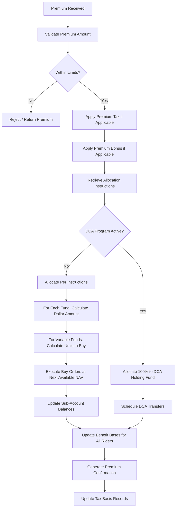

### 2.5 Premium Allocation Example

$100,000 initial premium with 4% bonus:

| Step | Amount | Description |
|---|---|---|
| Gross Premium | $100,000.00 | Amount received |
| Premium Tax (2.35% — varies by state) | -$2,350.00 | Deducted upfront (some products deduct from AV) |
| Net Premium | $97,650.00 | After premium tax |
| Premium Bonus (4%) | +$4,000.00 | Based on gross premium |
| Total to Allocate | $101,650.00 | Net premium + bonus |

| Fund | Allocation % | Dollar Amount | Fund NAV | Units Purchased |
|---|---|---|---|---|
| Equity Large Cap | 40% | $40,660.00 | $25.4321 | 1,598.7441 |
| Equity International | 20% | $20,330.00 | $18.7654 | 1,083.3082 |
| Bond Intermediate | 25% | $25,412.50 | $12.3456 | 2,058.4597 |
| Fixed Account | 15% | $15,247.50 | N/A (dollar) | N/A |
| **Total** | **100%** | **$101,650.00** | | |

### 2.6 Re-Allocation (Transfer)

Contract holders may change their allocation instructions or transfer existing balances between funds.

**Types of Transfers:**

| Transfer Type | Description | Restrictions |
|---|---|---|
| Future allocation change | Changes where new premiums go | No limit typically |
| Existing balance transfer | Move current AV between funds | May have annual limit (e.g., 12 free transfers/year) |
| Dollar amount transfer | Transfer specific dollar amount | Minimum transfer amount |
| Percentage transfer | Transfer a percentage of a fund | Must not exceed fund balance |
| Full fund transfer | Move entire fund to another | Cannot leave < minimum in source |

### 2.7 Premium Bonus Application

See Article 04 Section 7 for detailed bonus mechanics. PAS processing for bonus credits:

```python
def apply_premium_bonus(policy, premium_amount, premium_type):
    bonus_rider = get_active_bonus_rider(policy)
    if not bonus_rider:
        return 0.0
    
    # Check if this premium type qualifies for bonus
    if premium_type == 'INITIAL' and not bonus_rider.applies_to_initial:
        return 0.0
    if premium_type == 'ADDITIONAL' and not bonus_rider.applies_to_additional:
        return 0.0
    
    bonus_amount = premium_amount * bonus_rider.rate
    
    # Allocate bonus per allocation instructions (or to fixed account per product)
    if bonus_rider.allocation_rule == 'FOLLOW_PREMIUM':
        allocate_per_instructions(policy, bonus_amount)
    elif bonus_rider.allocation_rule == 'FIXED_ACCOUNT_ONLY':
        policy.fixed_account_value += bonus_amount
    
    # Create bonus tracking record
    create_bonus_record(policy, premium_amount, bonus_amount, bonus_rider)
    
    return bonus_amount
```

---

## 3. Fixed Account Crediting

### 3.1 Declared Rate Mechanics

Fixed annuity accounts credit interest at a rate declared by the insurer. The declared rate is typically set quarterly or annually and must not fall below the contractual guaranteed minimum rate.

**Rate Hierarchy:**

```
Credited Rate = MAX(DeclaredRate, GuaranteedMinimumRate)
```

### 3.2 Guaranteed Minimum Rate

| Product Era | Typical Guaranteed Minimum | Regulatory Floor |
|---|---|---|
| Pre-2000 | 3.0% - 4.5% | State-dependent (usually 1.0%) |
| 2000-2010 | 1.5% - 3.0% | State-dependent |
| 2010-2020 | 1.0% - 2.0% | NAIC Model: 1.0% (some states 0.5%) |
| 2020+ | 0.5% - 1.5% | Some states adopted 0.15%-0.50% |

### 3.3 Rate Tiers

Some fixed accounts offer tiered rates based on the fixed account balance:

```json
{
  "rateTiers": [
    {"minBalance": 0, "maxBalance": 24999.99, "declaredRate": 0.0300},
    {"minBalance": 25000, "maxBalance": 99999.99, "declaredRate": 0.0325},
    {"minBalance": 100000, "maxBalance": 249999.99, "declaredRate": 0.0350},
    {"minBalance": 250000, "maxBalance": null, "declaredRate": 0.0375}
  ],
  "guaranteedMinimumRate": 0.0100,
  "effectiveDate": "2024-01-01",
  "expirationDate": "2024-03-31"
}
```

### 3.4 Multi-Year Guarantee Periods (MYGA)

Multi-Year Guarantee Annuities lock in a rate for a specified period (3, 5, 7, or 10 years).

**MYGA Rate Structure:**

```json
{
  "mygaRates": {
    "productCode": "MYGA-2024",
    "guaranteePeriods": [
      {
        "termYears": 3,
        "guaranteedRate": 0.0475,
        "minimumPremium": 10000.00,
        "maximumIssueAge": 85
      },
      {
        "termYears": 5,
        "guaranteedRate": 0.0500,
        "minimumPremium": 10000.00,
        "maximumIssueAge": 85
      },
      {
        "termYears": 7,
        "guaranteedRate": 0.0510,
        "minimumPremium": 25000.00,
        "maximumIssueAge": 80
      },
      {
        "termYears": 10,
        "guaranteedRate": 0.0525,
        "minimumPremium": 25000.00,
        "maximumIssueAge": 75
      }
    ]
  }
}
```

**End-of-Term Processing:**

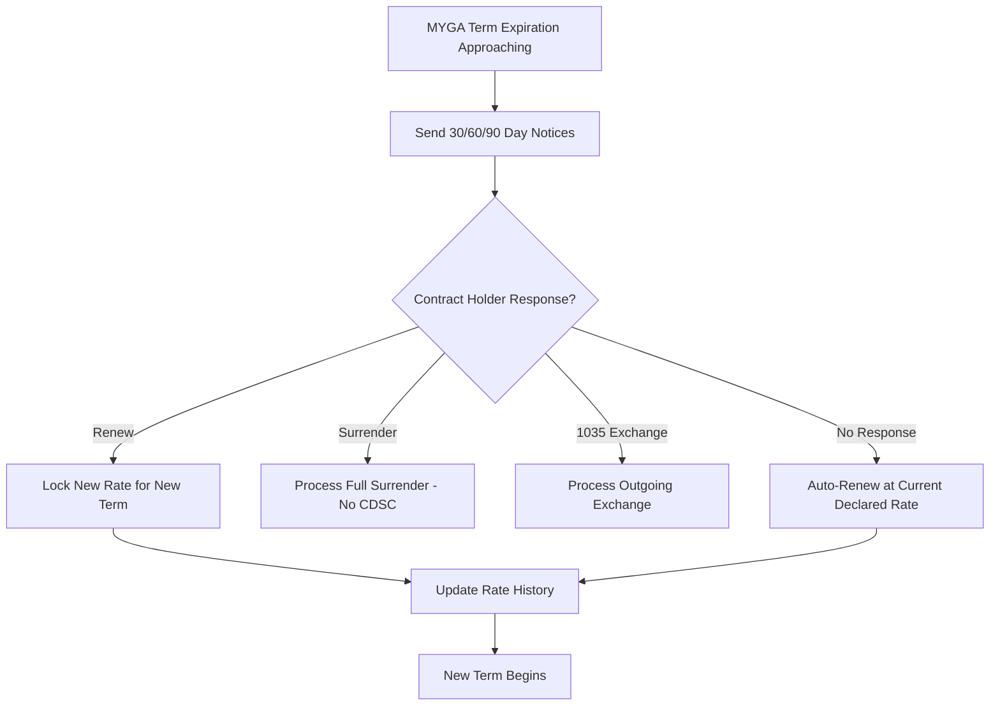

### 3.5 Renewal Rate Setting Process

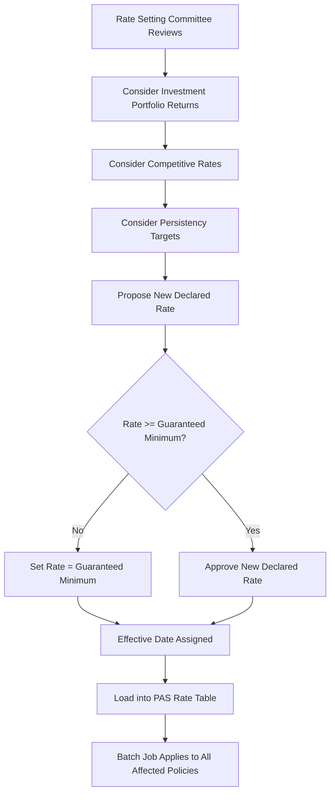

### 3.6 Rate History Tracking

```json
{
  "rateHistory": {
    "policyId": "POL-2024-FA-005678",
    "fundCode": "FIXED_DECLARED",
    "history": [
      {"effectiveDate": "2020-01-15", "expirationDate": "2020-12-31", "rate": 0.0350, "rateType": "INITIAL_GUARANTEE"},
      {"effectiveDate": "2021-01-01", "expirationDate": "2021-12-31", "rate": 0.0275, "rateType": "RENEWAL"},
      {"effectiveDate": "2022-01-01", "expirationDate": "2022-12-31", "rate": 0.0250, "rateType": "RENEWAL"},
      {"effectiveDate": "2023-01-01", "expirationDate": "2023-12-31", "rate": 0.0325, "rateType": "RENEWAL"},
      {"effectiveDate": "2024-01-01", "expirationDate": null, "rate": 0.0400, "rateType": "RENEWAL"}
    ]
  }
}
```

### 3.7 Fixed Account Interest Crediting Calculation

**Daily Crediting:**

```
DailyRate = AnnualRate / 365
DailyInterest = PriorDayBalance × DailyRate
NewBalance = PriorDayBalance + DailyInterest
```

**Monthly Crediting (more common for fixed annuities):**

```
MonthlyRate = (1 + AnnualRate)^(1/12) - 1
MonthlyInterest = MonthEndBalance × MonthlyRate
```

**Anniversary Crediting:**

```
AnnualInterest = AnniversaryBalance × AnnualRate
```

**Pseudocode for Daily Fixed Crediting Batch:**

```python
def daily_fixed_crediting_batch(valuation_date):
    policies = get_active_fixed_policies()
    
    for policy in policies:
        fixed_account = policy.fixed_account
        current_rate = get_effective_rate(policy, valuation_date)
        daily_rate = current_rate / 365.0
        
        interest = fixed_account.balance * daily_rate
        
        # Round to nearest cent
        interest = round(interest, 2)
        
        fixed_account.balance += interest
        fixed_account.ytd_interest += interest
        fixed_account.mtd_interest += interest
        
        create_interest_transaction(
            policy_id=policy.id,
            date=valuation_date,
            amount=interest,
            rate=current_rate,
            balance_before=fixed_account.balance - interest,
            balance_after=fixed_account.balance
        )
```

---

## 4. Variable Account Processing

### 4.1 Daily Unit Value Calculation

Variable annuity sub-accounts are valued daily based on the net asset value (NAV) of the underlying mutual fund.

```
SubAccountUnitValue_today = FundNAV_today × (1 - DailyM&ERate - DailyAdminRate)
```

Note: Many PAS implementations receive the sub-account unit value directly from the fund company after M&E deductions, rather than calculating it internally.

### 4.2 Buy/Sell Unit Processing

**Buying Units (Premium Allocation or Transfer In):**

```
UnitsToBuy = DollarAmount / UnitValue_atTradeDate
```

**Selling Units (Withdrawal, Transfer Out, Charge Deduction):**

```
UnitsToSell = DollarAmount / UnitValue_atTradeDate
```

**Trade Date Determination:**

| Transaction Timing | Trade Date | Unit Value Used |
|---|---|---|
| Request received before cutoff (typically 4 PM ET) | Same business day | Today's closing NAV |
| Request received after cutoff | Next business day | Next day's closing NAV |
| Death claim | Date of death (or next business day) | DOD closing NAV |
| Systematic withdrawal | Scheduled date | That day's closing NAV |

### 4.3 Fund Transfer Mechanics

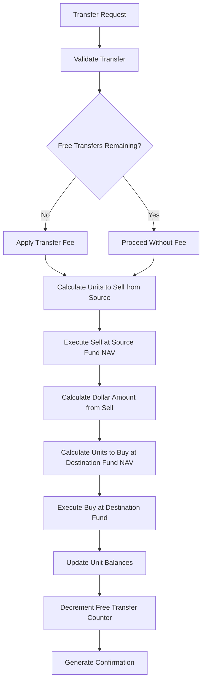

**Transfer Restrictions:**

```json
{
  "transferRules": {
    "freeTransfersPerYear": 12,
    "transferFee": 25.00,
    "minimumTransferAmount": 250.00,
    "minimumRemainingBalance": 500.00,
    "roundTripRestriction": {
      "enabled": true,
      "cooldownDays": 30,
      "description": "Cannot transfer back to same fund within 30 days"
    },
    "marketTimingRestriction": {
      "enabled": true,
      "maxTransfersIn30Days": 4,
      "consequenceIfExceeded": "RESTRICT_TO_FIXED_FOR_90_DAYS"
    }
  }
}
```

### 4.4 Dollar-Cost Averaging (DCA) Programs

DCA systematically moves money from a holding fund (usually money market or fixed) to target funds on a scheduled basis.

**DCA Configuration:**

```json
{
  "dcaProgram": {
    "policyId": "POL-2024-VA-001234",
    "status": "ACTIVE",
    "sourceFund": "MONEY_MARKET",
    "startDate": "2024-02-01",
    "frequency": "MONTHLY",
    "transferDay": 15,
    "totalAmount": 100000.00,
    "transferAmount": 8333.33,
    "numberOfTransfers": 12,
    "completedTransfers": 5,
    "remainingAmount": 58333.35,
    "targetAllocations": [
      {"fundCode": "EQUITY_LARGE_CAP", "percentage": 50.0},
      {"fundCode": "EQUITY_INTL", "percentage": 30.0},
      {"fundCode": "BOND_INTERMEDIATE", "percentage": 20.0}
    ],
    "terminationRules": {
      "onSourceExhausted": "TERMINATE_PROGRAM",
      "onPolicySurrender": "CANCEL_REMAINING",
      "onFullWithdrawal": "CANCEL_REMAINING"
    }
  }
}
```

**DCA Processing Pseudocode:**

```python
def process_dca_transfers(valuation_date):
    active_dcas = get_active_dca_programs(valuation_date)
    
    for dca in active_dcas:
        if not is_dca_transfer_date(dca, valuation_date):
            continue
        
        source_balance = get_fund_balance(dca.policy_id, dca.source_fund)
        transfer_amount = min(dca.transfer_amount, source_balance)
        
        if transfer_amount < dca.minimum_transfer:
            terminate_dca(dca, reason='SOURCE_EXHAUSTED')
            continue
        
        # Sell from source
        sell_units(dca.policy_id, dca.source_fund, transfer_amount)
        
        # Buy in target funds per allocation
        for target in dca.target_allocations:
            target_amount = transfer_amount * (target.percentage / 100.0)
            buy_units(dca.policy_id, target.fund_code, target_amount)
        
        # Update DCA tracking
        dca.completed_transfers += 1
        dca.remaining_amount -= transfer_amount
        
        if dca.completed_transfers >= dca.number_of_transfers:
            terminate_dca(dca, reason='SCHEDULE_COMPLETE')
```

### 4.5 Automatic Rebalancing Programs

Rebalancing restores the portfolio to target allocations on a scheduled basis.

**Rebalancing Example:**

Target: 60% Equity, 30% Bond, 10% Fixed

| Fund | Target | Current Value | Current % | Action |
|---|---|---|---|---|
| Equity Large Cap | 60% | $78,000 | 65% | Sell $6,000 |
| Bond Intermediate | 30% | $32,400 | 27% | Buy $3,600 |
| Fixed Account | 10% | $9,600 | 8% | Buy $2,400 |
| **Total** | **100%** | **$120,000** | **100%** | **Net $0** |

**Rebalancing Configuration:**

```json
{
  "rebalancingProgram": {
    "policyId": "POL-2024-VA-001234",
    "status": "ACTIVE",
    "frequency": "QUARTERLY",
    "nextRebalanceDate": "2024-07-15",
    "rebalanceMethod": "THRESHOLD",
    "thresholdPercentage": 5.0,
    "targetAllocations": [
      {"fundCode": "EQUITY_LARGE_CAP", "targetPct": 60.0},
      {"fundCode": "BOND_INTERMEDIATE", "targetPct": 30.0},
      {"fundCode": "FIXED_ACCOUNT", "targetPct": 10.0}
    ]
  }
}
```

### 4.6 Fund Addition/Closure Processing

**Fund Closure:**

When a fund is closed to new investments or fully liquidated:

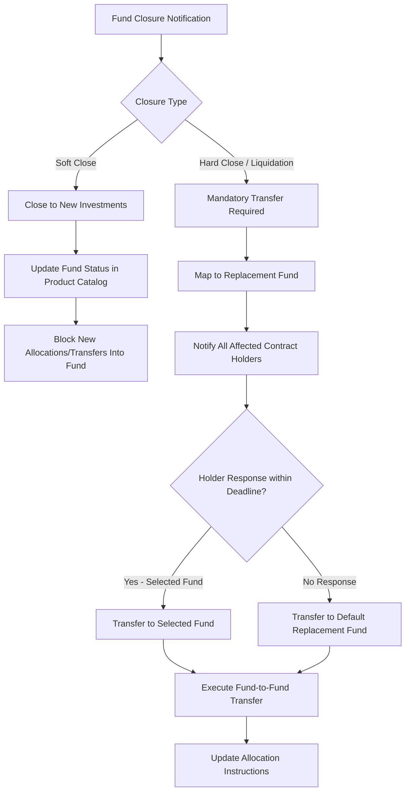

### 4.7 Fund Mapping/Merger

```json
{
  "fundMerger": {
    "effectiveDate": "2024-06-01",
    "mergingFund": {
      "fundCode": "EQUITY_MID_CAP_V1",
      "fundName": "Mid-Cap Growth Fund - Original",
      "status": "MERGING"
    },
    "survivingFund": {
      "fundCode": "EQUITY_MID_CAP_V2",
      "fundName": "Mid-Cap Growth Fund - Successor",
      "status": "ACTIVE"
    },
    "conversionRatio": 1.234567,
    "processing": {
      "step1": "Freeze merging fund NAV as of close on effective date",
      "step2": "Calculate units in surviving fund: old_units × conversionRatio",
      "step3": "Create new unit position in surviving fund",
      "step4": "Zero out merging fund position",
      "step5": "Update all allocation instructions referencing merging fund",
      "step6": "Update all DCA/rebalancing programs"
    }
  }
}
```

---

## 5. Index Crediting (FIA/IUL)

### 5.1 Overview

Fixed Indexed Annuities (FIA) and Indexed Universal Life (IUL) products credit interest based on the performance of an external index (e.g., S&P 500, NASDAQ-100, Russell 2000) subject to crediting parameters such as caps, participation rates, spreads, and floors.

### 5.2 Segment Creation and Management

FIA products use a "segment" or "term" concept — each premium allocation creates a separate segment with its own:
- Start date and maturity date
- Index assignment
- Crediting method
- Cap, participation rate, spread, and floor locked at segment creation

```json
{
  "segment": {
    "segmentId": "SEG-2024-001",
    "policyId": "POL-2024-FIA-001234",
    "strategyCode": "SP500_PTP_ANNUAL_CAP",
    "indexCode": "SP500",
    "creditingMethod": "POINT_TO_POINT",
    "termMonths": 12,
    "startDate": "2024-01-15",
    "maturityDate": "2025-01-15",
    "startIndexValue": 4850.43,
    "currentIndexValue": null,
    "endIndexValue": null,
    "capRate": 0.0950,
    "participationRate": 1.0000,
    "spreadRate": 0.0000,
    "floorRate": 0.0000,
    "premiumAllocated": 50000.00,
    "currentInterimValue": null,
    "maturityCreditAmount": null,
    "segmentStatus": "ACTIVE"
  }
}
```

### 5.3 Index Tracking

The PAS must store daily closing values for all tracked indices:

```json
{
  "indexData": {
    "indexCode": "SP500",
    "indexName": "S&P 500 Total Return",
    "dailyValues": [
      {"date": "2024-01-15", "closeValue": 4850.43},
      {"date": "2024-01-16", "closeValue": 4835.12},
      {"date": "2024-01-17", "closeValue": 4868.91}
    ],
    "source": "BLOOMBERG",
    "lastUpdated": "2024-07-15T18:30:00Z"
  }
}
```

### 5.4 Point-to-Point Calculation — Worked Examples

#### 5.4.1 Annual Point-to-Point with Cap

**Parameters:**
- Index: S&P 500
- Start Value: 4,850.43
- End Value: 5,320.78
- Cap: 9.50%
- Participation Rate: 100%
- Spread: 0%
- Floor: 0%
- Segment Amount: $50,000

**Step-by-Step Calculation:**

```
Step 1: Calculate raw index return
    RawReturn = (EndValue - StartValue) / StartValue
    RawReturn = (5320.78 - 4850.43) / 4850.43
    RawReturn = 470.35 / 4850.43
    RawReturn = 9.6970%

Step 2: Apply participation rate
    ParticipatedReturn = RawReturn × ParticipationRate
    ParticipatedReturn = 9.6970% × 100%
    ParticipatedReturn = 9.6970%

Step 3: Subtract spread
    AfterSpread = ParticipatedReturn - SpreadRate
    AfterSpread = 9.6970% - 0%
    AfterSpread = 9.6970%

Step 4: Apply cap
    CappedReturn = MIN(AfterSpread, CapRate)
    CappedReturn = MIN(9.6970%, 9.50%)
    CappedReturn = 9.50%

Step 5: Apply floor
    CreditedRate = MAX(CappedReturn, FloorRate)
    CreditedRate = MAX(9.50%, 0%)
    CreditedRate = 9.50%

Step 6: Calculate credited amount
    CreditedAmount = SegmentAmount × CreditedRate
    CreditedAmount = $50,000 × 9.50%
    CreditedAmount = $4,750.00

Step 7: New segment value
    NewValue = $50,000 + $4,750.00 = $54,750.00
```

#### 5.4.2 Negative Index Scenario (Floor Protection)

**Parameters:** Same as above except End Value: 4,500.00

```
Step 1: RawReturn = (4500.00 - 4850.43) / 4850.43 = -7.2237%
Step 2: ParticipatedReturn = -7.2237% × 100% = -7.2237%
Step 3: AfterSpread = -7.2237% - 0% = -7.2237%
Step 4: CappedReturn = MIN(-7.2237%, 9.50%) = -7.2237%  // cap doesn't help here
Step 5: CreditedRate = MAX(-7.2237%, 0%) = 0.00%  // FLOOR PROTECTS!
Step 6: CreditedAmount = $50,000 × 0% = $0.00

Result: Segment value remains $50,000.00 — no loss, but no gain.
```

#### 5.4.3 Point-to-Point with Participation Rate and Spread

**Parameters:**
- Start Value: 4,850.43
- End Value: 5,600.00
- Cap: None (uncapped)
- Participation Rate: 80%
- Spread: 2.50%
- Floor: 0%
- Segment Amount: $75,000

```
Step 1: RawReturn = (5600.00 - 4850.43) / 4850.43 = 15.4525%
Step 2: ParticipatedReturn = 15.4525% × 80% = 12.3620%
Step 3: AfterSpread = 12.3620% - 2.50% = 9.8620%
Step 4: CappedReturn = MIN(9.8620%, ∞) = 9.8620%  // no cap
Step 5: CreditedRate = MAX(9.8620%, 0%) = 9.8620%
Step 6: CreditedAmount = $75,000 × 9.8620% = $7,396.50
Step 7: NewValue = $75,000 + $7,396.50 = $82,396.50
```

### 5.5 Monthly Averaging Calculation — Worked Example

Monthly averaging uses the average of 12 monthly index values instead of a single end-point value.

**Parameters:**
- Index: S&P 500
- Start Value: 4,850.43
- Cap: 7.00%
- Participation Rate: 100%
- Floor: 0%
- Segment Amount: $50,000

**Monthly Index Values:**

| Month | Date | Index Value |
|---|---|---|
| Start | 01/15/2024 | 4,850.43 |
| 1 | 02/15/2024 | 4,920.00 |
| 2 | 03/15/2024 | 5,010.50 |
| 3 | 04/15/2024 | 4,890.25 |
| 4 | 05/15/2024 | 4,950.00 |
| 5 | 06/15/2024 | 5,100.75 |
| 6 | 07/15/2024 | 5,200.00 |
| 7 | 08/15/2024 | 5,150.30 |
| 8 | 09/15/2024 | 5,050.00 |
| 9 | 10/15/2024 | 5,300.00 |
| 10 | 11/15/2024 | 5,250.45 |
| 11 | 12/15/2024 | 5,320.78 |
| 12 | 01/15/2025 | 5,400.00 |

```
Step 1: Calculate monthly average
    MonthlyAvg = (4920 + 5010.50 + 4890.25 + 4950 + 5100.75 + 5200 + 
                  5150.30 + 5050 + 5300 + 5250.45 + 5320.78 + 5400) / 12
    MonthlyAvg = 61,542.03 / 12
    MonthlyAvg = 5,128.50

Step 2: Calculate averaged return
    AvgReturn = (MonthlyAvg - StartValue) / StartValue
    AvgReturn = (5128.50 - 4850.43) / 4850.43
    AvgReturn = 278.07 / 4850.43
    AvgReturn = 5.7329%

Step 3-6: Apply cap, floor, etc.
    CreditedRate = MIN(MAX(5.7329%, 0%), 7.00%)
    CreditedRate = 5.7329%

Step 7: CreditedAmount = $50,000 × 5.7329% = $2,866.45
```

**Note:** Monthly averaging typically produces a lower credited rate than point-to-point in rising markets, but offers more protection in volatile markets. This is why monthly average strategies often have higher caps.

### 5.6 Segment Maturity Processing

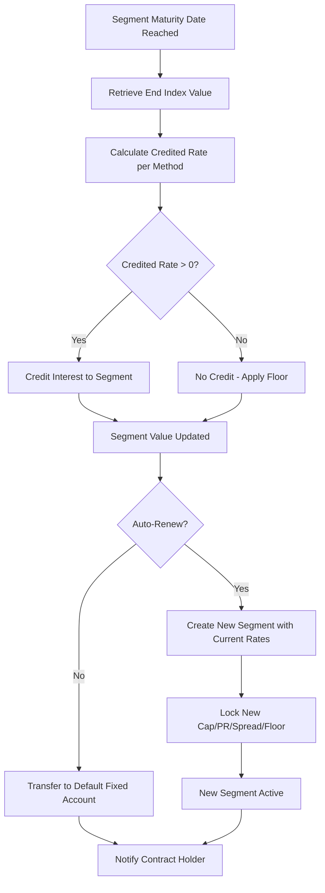

### 5.7 Mid-Segment Withdrawal Impact

This is one of the most complex calculations in FIA processing. When a withdrawal occurs before segment maturity, the PAS must calculate the segment's interim value.

#### 5.7.1 Interim Value Methods

**Method 1: MVA-Based Interim Value**

```
InterimValue = SegmentValue × MVA_Factor

MVA_Factor = (1 + CreditingRate_AtIssue) ^ RemainingMonths/12
             ÷ (1 + CurrentRate) ^ RemainingMonths/12
```

**Method 2: Vesting Schedule Interim Value**

```
InterimValue = SegmentPrincipal + (AccruedCredit × VestingFactor)

VestingFactor is based on months elapsed:
    Month 1-3: 25%
    Month 4-6: 50%
    Month 7-9: 75%
    Month 10-12: 100% (or pro-rata)
```

**Method 3: Daily Interim Value (Most Common in Modern FIAs)**

```
DailyInterimValue = SegmentPrincipal × (1 + DailyAccrualRate) ^ DaysElapsed

Where:
    DailyAccrualRate is based on the guaranteed minimum rate
    OR
    DailyInterimValue = SegmentPrincipal × (1 + GuaranteedMinRate/365) ^ DaysElapsed
```

#### 5.7.2 Mid-Segment Withdrawal Formulas

When a withdrawal occurs, the segment is reduced proportionally:

```
WithdrawalRatio = WithdrawalAmount / TotalAccountValue
SegmentReduction = SegmentValue × WithdrawalRatio
NewSegmentValue = SegmentValue - SegmentReduction
```

**Detailed Example:**

Policy has two active segments:
- Segment A: $60,000 (started 6 months ago)
- Segment B: $40,000 (started 3 months ago)
- Total AV: $100,000

Contract holder withdraws $20,000:

```
WithdrawalRatio = $20,000 / $100,000 = 20%

Segment A reduction: $60,000 × 20% = $12,000
New Segment A: $60,000 - $12,000 = $48,000

Segment B reduction: $40,000 × 20% = $8,000
New Segment B: $40,000 - $8,000 = $32,000

Total AV after withdrawal: $48,000 + $32,000 = $80,000 ✓
```

The interest credited at segment maturity is now based on the reduced segment value. If Segment A would have earned 7%:

```
Original credit: $60,000 × 7% = $4,200
Reduced credit: $48,000 × 7% = $3,360
Lost credit due to withdrawal: $840
```

### 5.8 Comprehensive Index Crediting Pseudocode

```python
class IndexCreditingEngine:
    
    def calculate_segment_credit(self, segment):
        raw_return = self._calculate_raw_return(segment)
        
        if segment.crediting_method == 'POINT_TO_POINT':
            return self._apply_crediting_parameters(raw_return, segment)
        elif segment.crediting_method == 'MONTHLY_AVERAGE':
            avg_return = self._calculate_monthly_average_return(segment)
            return self._apply_crediting_parameters(avg_return, segment)
        elif segment.crediting_method == 'MONTHLY_SUM_CAP':
            return self._calculate_monthly_sum_cap(segment)
        elif segment.crediting_method == 'PERFORMANCE_TRIGGER':
            return self._calculate_performance_trigger(segment)
    
    def _calculate_raw_return(self, segment):
        start_value = segment.start_index_value
        end_value = segment.end_index_value
        return (end_value - start_value) / start_value
    
    def _calculate_monthly_average_return(self, segment):
        monthly_values = self.get_monthly_index_values(segment)
        average = sum(monthly_values) / len(monthly_values)
        return (average - segment.start_index_value) / segment.start_index_value
    
    def _apply_crediting_parameters(self, raw_return, segment):
        # Apply participation rate
        participated = raw_return * segment.participation_rate
        
        # Apply spread (only for positive returns in most designs)
        if participated > 0:
            after_spread = participated - segment.spread_rate
        else:
            after_spread = participated
        
        # Apply cap
        if segment.cap_rate is not None and segment.cap_rate > 0:
            capped = min(after_spread, segment.cap_rate)
        else:
            capped = after_spread
        
        # Apply floor
        credited = max(capped, segment.floor_rate)
        
        return credited
    
    def _calculate_monthly_sum_cap(self, segment):
        """Monthly sum cap: each month's return is individually capped,
           then months are summed. Total can be negative if floor allows."""
        monthly_returns = self._get_monthly_returns(segment)
        capped_returns = []
        
        for monthly_return in monthly_returns:
            capped = min(monthly_return, segment.monthly_cap)
            # No monthly floor typically
            capped_returns.append(capped)
        
        total_return = sum(capped_returns)
        return max(total_return, segment.floor_rate)
    
    def _calculate_performance_trigger(self, segment):
        """Performance trigger: if index return >= 0, credit a fixed rate.
           Otherwise, credit 0%."""
        raw_return = self._calculate_raw_return(segment)
        if raw_return >= 0:
            return segment.trigger_rate  # e.g., 7% fixed
        else:
            return max(0.0, segment.floor_rate)
    
    def calculate_interim_value(self, segment, valuation_date):
        """Calculate segment value before maturity for withdrawal/statement."""
        days_elapsed = (valuation_date - segment.start_date).days
        term_days = (segment.maturity_date - segment.start_date).days
        
        guaranteed_daily_rate = segment.guaranteed_minimum_rate / 365.0
        interim_guaranteed = segment.current_value * (1 + guaranteed_daily_rate) ** days_elapsed
        
        return interim_guaranteed
```

---

## 6. Charge Deductions

### 6.1 Charge Types — Complete Reference

| Charge | Basis | Typical Rate | Frequency | Deduction Method |
|---|---|---|---|---|
| M&E (Mortality & Expense) | Account Value (variable only) | 100-150 bps | Daily | Within unit value (not visible) |
| Administrative Charge | Account Value or flat fee | 15-30 bps or $30-50/yr | Monthly or annual | Fund liquidation |
| Rider Charges (GMDB) | AV or NAR | 5-75 bps | Daily or quarterly | Fund liquidation |
| Rider Charges (GLB) | Benefit Base | 75-150 bps | Quarterly or annual | Fund liquidation |
| Fund Management Fee | Fund NAV | 50-200 bps | Daily | Within fund NAV (not visible) |
| Premium Tax | Premium | 0%-3.5% | At premium receipt | Deducted from premium |
| DAC Tax | Premium (life companies) | 1.75% (annuities) | At premium receipt | Internal reserve |
| Contract Maintenance Fee | Flat | $25-$50/year | Anniversary | Fund liquidation (waived if AV > threshold) |
| Transfer Fee | Per transfer | $25 per excess transfer | At transfer | Fund liquidation |

### 6.2 M&E Charge Calculation

M&E (Mortality & Expense Risk Charge) is the primary revenue source for variable annuity insurers.

**Daily M&E Deduction:**

```
DailyM&ERate = AnnualM&ERate / 365
DailyM&ECharge = SubAccountValue × DailyM&ERate
```

Typically, M&E is deducted within the sub-account unit value calculation, so it is not a visible line-item transaction in the PAS.

**Example:**
- Annual M&E: 1.30% (130 bps)
- Sub-account value: $100,000
- Daily M&E: $100,000 × (0.0130 / 365) = $3.56/day
- Annual impact: $100,000 × 0.013 = $1,300/year

### 6.3 Administrative Charges

**Flat Fee with Waiver:**

```python
def calculate_annual_admin_fee(policy):
    if policy.account_value >= policy.admin_fee_waiver_threshold:  # e.g., $50,000
        return 0.00
    return policy.annual_admin_fee  # e.g., $30.00
```

**Basis Points Fee:**

```python
def calculate_monthly_admin_charge(policy):
    annual_rate = policy.admin_charge_bps / 10000.0  # e.g., 15 bps = 0.0015
    monthly_rate = annual_rate / 12.0
    return policy.account_value * monthly_rate
```

### 6.4 Rider Charges

See Article 04, Section 9 for detailed rider charge calculations.

### 6.5 Premium Tax by State

| State | Premium Tax Rate | Applies To | Notes |
|---|---|---|---|
| CA | 2.35% | Qualified & Non-Qualified | |
| ME | 2.00% | Non-Qualified only | |
| NV | 3.50% | All premiums | Highest rate |
| WV | 1.00% | All premiums | |
| WY | 1.00% | All premiums | |
| SD | 1.25% | Non-Qualified only | |
| PR | 1.00% | All premiums | Puerto Rico |
| DA | 5.00% | — | District of America (DC) varies |
| Most states | 0.00% | — | No premium tax on annuities |

**PAS Processing Note:** Premium tax may be deducted:
- Upfront from the premium (reducing the invested amount)
- From the account value over time (spread over a period)
- Deferred and deducted at surrender/annuitization

### 6.6 Deduction Sequencing and Timing

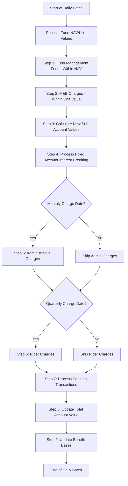

---

## 7. Surrender Charge Schedules

### 7.1 CDSC (Contingent Deferred Sales Charge) Calculation

The CDSC is a charge applied when funds are withdrawn or the contract is surrendered before the surrender charge period expires.

**Declining Schedule Example:**

| Contract Year | CDSC Percentage |
|---|---|
| 1 | 7.0% |
| 2 | 6.0% |
| 3 | 5.0% |
| 4 | 4.0% |
| 5 | 3.0% |
| 6 | 2.0% |
| 7 | 1.0% |
| 8+ | 0.0% |

### 7.2 CDSC Calculation Methods

**Method 1: FIFO on Premiums**

```
Surrender charges apply to premiums in the order received (FIFO).
Each premium has its own schedule based on its receipt date.
```

**Example:**

| Premium Date | Amount | Years Held | CDSC Rate | CDSC Amount |
|---|---|---|---|---|
| 01/15/2020 | $100,000 | 4.5 years | 3.0% (Year 5) | $3,000 |
| 06/15/2021 | $50,000 | 3.0 years | 4.0% (Year 4) | $2,000 |
| 01/15/2023 | $25,000 | 1.5 years | 6.0% (Year 2) | $1,500 |

On $175,000 full surrender: Total CDSC = $6,500

**Method 2: CDSC on Total Account Value**

```
CDSC = AccountValue × CDSCRate_based_on_contract_duration
```

This is simpler but generally less favorable to the contract holder.

### 7.3 Free Withdrawal Amount Determination

Most contracts allow a portion of the account value to be withdrawn annually without surrender charges.

**Common Free Withdrawal Formulas:**

| Method | Formula | Example ($200K AV, $175K premiums) |
|---|---|---|
| 10% of premiums | FreeAmount = Premiums × 10% | $17,500 |
| 10% of account value | FreeAmount = AV × 10% | $20,000 |
| Earnings only | FreeAmount = AV - Premiums | $25,000 |
| Greater of 10% premium or earnings | MAX(Premiums × 10%, AV - Premiums) | $25,000 |
| RMD amount | FreeAmount = RMD calculation | Varies |
| Cumulative unused | Prior years' unused free amounts carry forward | Varies |

**Free Withdrawal Pseudocode:**

```python
def calculate_free_withdrawal(policy, withdrawal_amount):
    if policy.free_withdrawal_method == 'PCT_OF_PREMIUM':
        annual_free = policy.total_premiums * policy.free_withdrawal_pct  # 10%
    elif policy.free_withdrawal_method == 'PCT_OF_AV':
        annual_free = policy.account_value * policy.free_withdrawal_pct
    elif policy.free_withdrawal_method == 'EARNINGS':
        annual_free = max(0, policy.account_value - policy.total_premiums)
    elif policy.free_withdrawal_method == 'GREATER_OF':
        annual_free = max(
            policy.total_premiums * policy.free_withdrawal_pct,
            policy.account_value - policy.total_premiums
        )
    
    # Reduce by YTD free withdrawals already taken
    remaining_free = annual_free - policy.ytd_free_withdrawals
    remaining_free = max(0, remaining_free)
    
    free_portion = min(withdrawal_amount, remaining_free)
    chargeable_portion = withdrawal_amount - free_portion
    
    return free_portion, chargeable_portion
```

### 7.4 Systematic Withdrawal Exemptions

Many contracts exempt systematic withdrawal programs from surrender charges:

| Exemption Type | Conditions |
|---|---|
| Systematic withdrawal | Regular schedule, max 10% of AV annually |
| RMD withdrawals | Required minimum distributions (qualified contracts) |
| 72(t)/SEPP | Substantially equal periodic payments |
| Nursing home | With qualifying waiver rider |
| Terminal illness | With qualifying waiver rider |
| Death benefit | CDSC waived on death claim |
| Annuitization | CDSC waived if annuitized after minimum period |

### 7.5 CDSC Waiver Triggers

```python
def is_cdsc_waived(policy, withdrawal_type, withdrawal_amount):
    # Death claim
    if withdrawal_type == 'DEATH_CLAIM':
        return True
    
    # Annuitization after minimum period
    if withdrawal_type == 'ANNUITIZATION':
        years_since_issue = year_diff(policy.issue_date, current_date)
        if years_since_issue >= policy.min_annuitization_years:
            return True
    
    # Nursing home waiver
    if has_active_waiver_claim(policy, 'NURSING_HOME'):
        return True
    
    # Terminal illness waiver
    if has_active_waiver_claim(policy, 'TERMINAL_ILLNESS'):
        return True
    
    # Disability waiver
    if has_active_waiver_claim(policy, 'DISABILITY'):
        return True
    
    # Free withdrawal amount
    free_amount, _ = calculate_free_withdrawal(policy, withdrawal_amount)
    if withdrawal_amount <= free_amount:
        return True
    
    # RMD for qualified contracts
    if policy.qualified_type and withdrawal_type == 'RMD':
        rmd_amount = calculate_rmd(policy)
        if withdrawal_amount <= rmd_amount:
            return True
    
    return False
```

---

## 8. Account Value Reconciliation

### 8.1 Daily Account Value Build-Up

```
Total Account Value = 
    Σ (SubAccount_i.Units × SubAccount_i.UnitValue)  // Variable accounts
    + FixedAccountValue                                 // Fixed account(s)
    + IndexedSegment_j.InterimValue                     // Indexed segments
    - PendingCharges                                     // Accrued but not yet deducted
```

### 8.2 Monthly Statement Components

```json
{
  "monthlyStatement": {
    "policyId": "POL-2024-VA-001234",
    "statementDate": "2024-06-30",
    "statementPeriod": {
      "start": "2024-06-01",
      "end": "2024-06-30"
    },
    "beginningValues": {
      "totalAccountValue": 285000.00,
      "subAccounts": [
        {"fundCode": "EQUITY_LARGE_CAP", "units": 5623.4521, "unitValue": 26.1234, "value": 146890.45},
        {"fundCode": "BOND_INTERMEDIATE", "units": 4521.8765, "unitValue": 12.4567, "value": 56344.23},
        {"fundCode": "FIXED_ACCOUNT", "value": 81765.32}
      ]
    },
    "activity": {
      "premiumsReceived": 0.00,
      "withdrawals": -5000.00,
      "transfers": 0.00,
      "investmentGainLoss": 3245.67,
      "interestCredited": 272.34,
      "chargesDeducted": -487.50,
      "bonusCredits": 0.00,
      "netChange": -1969.49
    },
    "endingValues": {
      "totalAccountValue": 283030.51,
      "subAccounts": [
        {"fundCode": "EQUITY_LARGE_CAP", "units": 5523.4521, "unitValue": 26.8901, "value": 148519.28},
        {"fundCode": "BOND_INTERMEDIATE", "units": 4521.8765, "unitValue": 12.2345, "value": 55335.91},
        {"fundCode": "FIXED_ACCOUNT", "value": 79175.32}
      ]
    },
    "riderBenefitSummary": {
      "gmdbBenefitBase": 285000.00,
      "glwbBenefitBase": 310000.00,
      "glwbMAW": 15500.00,
      "glwbWithdrawalsYTD": 5000.00,
      "glwbRemainingMAW": 10500.00
    },
    "chargeDetail": [
      {"chargeType": "M&E", "amount": 308.75, "basis": "Sub-Account Values", "rate": "1.30% annual"},
      {"chargeType": "Admin", "amount": 35.25, "basis": "Account Value", "rate": "0.15% annual"},
      {"chargeType": "GLWB Rider", "amount": 143.50, "basis": "Benefit Base $310,000", "rate": "1.10% annual"}
    ],
    "surrenderChargeSchedule": {
      "currentRate": 0.03,
      "expirationDate": "2027-01-15",
      "freeWithdrawalRemaining": 15000.00
    }
  }
}
```

### 8.3 Anniversary Processing

On each contract anniversary, the PAS performs a consolidated set of operations:

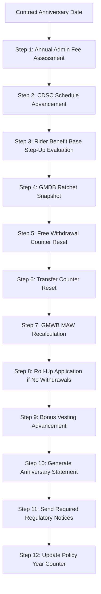

### 8.4 Audit Trail Requirements

Every transaction affecting account value must be recorded with:

```json
{
  "auditTrail": {
    "transactionId": "TXN-2024-001234567",
    "policyId": "POL-2024-VA-001234",
    "transactionDate": "2024-06-15",
    "transactionType": "WITHDRAWAL",
    "processedDate": "2024-06-15",
    "processedBy": "SYSTEM_BATCH_DAILY",
    "amounts": {
      "grossAmount": 5000.00,
      "surrenderCharge": 0.00,
      "freeWithdrawalApplied": 5000.00,
      "netAmount": 5000.00,
      "taxWithheld": 500.00,
      "disbursedAmount": 4500.00
    },
    "fundImpact": [
      {
        "fundCode": "EQUITY_LARGE_CAP",
        "unitsSold": 100.0000,
        "unitValue": 26.5432,
        "dollarAmount": 2654.32,
        "unitsBeforeTxn": 5623.4521,
        "unitsAfterTxn": 5523.4521
      },
      {
        "fundCode": "BOND_INTERMEDIATE",
        "unitsSold": 189.2345,
        "unitValue": 12.3987,
        "dollarAmount": 2345.68,
        "unitsBeforeTxn": 4521.8765,
        "unitsAfterTxn": 4332.6420
      }
    ],
    "benefitBaseImpact": [
      {
        "riderCode": "GLWB",
        "benefitBaseBefore": 310000.00,
        "benefitBaseAfter": 305000.00,
        "adjustmentType": "PROTECTED_DOLLAR_FOR_DOLLAR",
        "mawRemaining": 10500.00
      }
    ],
    "taxBasisImpact": {
      "costBasisBefore": 190000.00,
      "costBasisAfter": 190000.00,
      "gainRealized": 5000.00,
      "taxableAmount": 5000.00
    }
  }
}
```

---

## 9. Comprehensive Calculation Walkthroughs

### 9.1 Fixed Annuity: $100,000 Through 5 Years

**Product:** Fixed Deferred Annuity, 3.50% declared rate (years 1-3), 3.00% declared rate (years 4-5), 1.00% guaranteed minimum. Annual crediting. $30/year admin fee waived above $50K.

| Year | Beginning Balance | Declared Rate | Interest Credited | Admin Fee | Ending Balance |
|---|---|---|---|---|---|
| 1 | $100,000.00 | 3.50% | $3,500.00 | $0 | $103,500.00 |
| 2 | $103,500.00 | 3.50% | $3,622.50 | $0 | $107,122.50 |
| 3 | $107,122.50 | 3.50% | $3,749.29 | $0 | $110,871.79 |
| 4 | $110,871.79 | 3.00% | $3,326.15 | $0 | $114,197.94 |
| 5 | $114,197.94 | 3.00% | $3,425.94 | $0 | $117,623.88 |

**Total Interest Earned:** $17,623.88
**Effective Annual Rate:** (117,623.88 / 100,000)^(1/5) - 1 = 3.296%

**CDSC Schedule:**

| Year | CDSC % | Surrender Value (AV - CDSC) |
|---|---|---|
| 1 | 7% | $103,500 - $7,245 = $96,255 |
| 2 | 6% | $107,123 - $6,427 = $100,696 |
| 3 | 5% | $110,872 - $5,544 = $105,328 |
| 4 | 4% | $114,198 - $4,568 = $109,630 |
| 5 | 3% | $117,624 - $3,529 = $114,095 |
| 6 | 0% | $117,624 (no CDSC) |

### 9.2 Variable Annuity: $100,000 Through 5 Years

**Product:** Variable annuity, M&E 1.30%, Admin 0.15%, GLWB rider 1.10% (on benefit base). GMDB Ratchet included. 4% premium bonus, 7-year vesting.

**Assumptions:**
- Fund returns (gross of M&E/admin): Year 1: +12%, Year 2: -8%, Year 3: +15%, Year 4: +5%, Year 5: -3%
- All allocated to Equity Large Cap fund
- No withdrawals

**Initial Setup:**

```
Gross Premium:             $100,000.00
Premium Tax (CA, 2.35%):  -$2,350.00
Net Premium:               $97,650.00
Premium Bonus (4%):        +$4,000.00
Total Invested:            $101,650.00
Initial Units: $101,650.00 / $25.0000 = 4,066.0000 units
```

**Year-by-Year Breakdown:**

**Year 1:**

```
Gross Fund Return: 12%
M&E Deduction: 1.30%
Admin Deduction: 0.15%
Net Fund Return: 12% - 1.30% - 0.15% = 10.55%

Beginning AV: $101,650.00
Investment Gain: $101,650.00 × 10.55% = $10,724.08
AV Before Rider Charge: $112,374.08

GLWB Rider Charge (quarterly, on benefit base):
  Benefit Base (initial): $101,650.00 (premium + bonus)
  Rider charge roll-up (6%, no withdrawals): $101,650 × 1.06 = $107,749.00 (end of year BB)
  Average BB for year: ~$104,699.50
  Annual charge: $104,699.50 × 1.10% = $1,151.69
  (deducted quarterly: ~$287.92 each)

AV End of Year 1: $112,374.08 - $1,151.69 = $111,222.39

GMDB Ratchet: Anniversary AV = $111,222.39 (new high)
GLWB Benefit Base: $107,749.00 (roll-up, since no withdrawals taken yet)
```

**Year 2:**

```
Gross Fund Return: -8%
Net Fund Return: -8% - 1.30% - 0.15% = -9.45%

Beginning AV: $111,222.39
Investment Loss: $111,222.39 × (-9.45%) = -$10,510.52
AV Before Rider Charge: $100,711.87

GLWB Benefit Base: $107,749.00 × 1.06 = $114,213.94
Average BB: ~$110,981.47
Annual charge: $110,981.47 × 1.10% = $1,220.80

AV End of Year 2: $100,711.87 - $1,220.80 = $99,491.07

GMDB Ratchet: Anniversary AV = $99,491.07 (NOT new high; ratchet stays at $111,222.39)
```

**Year 3:**

```
Gross Fund Return: +15%
Net Fund Return: 15% - 1.30% - 0.15% = 13.55%

Beginning AV: $99,491.07
Investment Gain: $99,491.07 × 13.55% = $13,481.04
AV Before Rider Charge: $112,972.11

GLWB Benefit Base: $114,213.94 × 1.06 = $121,066.77
Average BB: ~$117,640.36
Annual charge: $117,640.36 × 1.10% = $1,294.04

AV End of Year 3: $112,972.11 - $1,294.04 = $111,678.07

GMDB Ratchet: Anniversary AV = $111,678.07 (new high — exceeds $111,222.39)
```

**Year 4:**

```
Gross Fund Return: +5%
Net Fund Return: 5% - 1.30% - 0.15% = 3.55%

Beginning AV: $111,678.07
Investment Gain: $111,678.07 × 3.55% = $3,964.57
AV Before Rider Charge: $115,642.64

GLWB Benefit Base: $121,066.77 × 1.06 = $128,330.78
Average BB: ~$124,698.78
Annual charge: $124,698.78 × 1.10% = $1,371.69

AV End of Year 4: $115,642.64 - $1,371.69 = $114,270.95

GMDB Ratchet: Anniversary AV = $114,270.95 (new high)
```

**Year 5:**

```
Gross Fund Return: -3%
Net Fund Return: -3% - 1.30% - 0.15% = -4.45%

Beginning AV: $114,270.95
Investment Loss: $114,270.95 × (-4.45%) = -$5,085.06
AV Before Rider Charge: $109,185.89

GLWB Benefit Base: $128,330.78 × 1.06 = $136,030.63
Average BB: ~$132,180.71
Annual charge: $132,180.71 × 1.10% = $1,453.99

AV End of Year 5: $109,185.89 - $1,453.99 = $107,731.90

GMDB Ratchet: Anniversary AV = $107,731.90 (NOT new high; ratchet stays at $114,270.95)
```

**Summary After 5 Years:**

| Metric | Value |
|---|---|
| Total Invested (premium + bonus) | $101,650.00 |
| Account Value | $107,731.90 |
| GMDB Ratchet Base | $114,270.95 |
| GLWB Benefit Base | $136,030.63 |
| GLWB MAW (5% at age 65) | $6,801.53/year |
| Total Rider Charges Paid | $6,492.21 |
| Total M&E + Admin Deducted | ~$8,070 (within fund returns) |
| Bonus Vested (Year 5 = 60%) | $2,400 of $4,000 |
| Surrender Charge (Year 5 = 3%) | $3,231.96 |
| Net Surrender Value | $107,731.90 - $3,231.96 - $1,600 (bonus recapture) = $102,899.94 |

### 9.3 Fixed Indexed Annuity: $100,000 Through 5 Years

**Product:** FIA with S&P 500 annual point-to-point, 9% cap, 0% floor. No M&E. $0 admin fee. 5% premium bonus, 10-year vesting.

**Index Returns:**

| Year | S&P 500 Return | Capped Return | Credited Rate |
|---|---|---|---|
| 1 | +18.5% | MIN(18.5%, 9%) = 9.00% | 9.00% |
| 2 | -12.3% | MAX(-12.3%, 0%) = 0.00% | 0.00% |
| 3 | +22.1% | MIN(22.1%, 9%) = 9.00% | 9.00% |
| 4 | +7.2% | MIN(7.2%, 9%) = 7.20% | 7.20% |
| 5 | -4.8% | MAX(-4.8%, 0%) = 0.00% | 0.00% |

**Year-by-Year:**

| Year | Beginning Value | Bonus | Credited Rate | Interest | Ending Value |
|---|---|---|---|---|---|
| 0 (Issue) | $100,000 | +$5,000 | — | — | $105,000.00 |
| 1 | $105,000.00 | — | 9.00% | $9,450.00 | $114,450.00 |
| 2 | $114,450.00 | — | 0.00% | $0.00 | $114,450.00 |
| 3 | $114,450.00 | — | 9.00% | $10,300.50 | $124,750.50 |
| 4 | $124,750.50 | — | 7.20% | $8,982.04 | $133,732.54 |
| 5 | $133,732.54 | — | 0.00% | $0.00 | $133,732.54 |

**Total Growth:** $133,732.54 - $100,000 = $33,732.54 (33.7% cumulative, ~5.97% CAGR)

---

## 10. Data Model for Accumulation Tracking

### 10.1 Entity Relationship Diagram

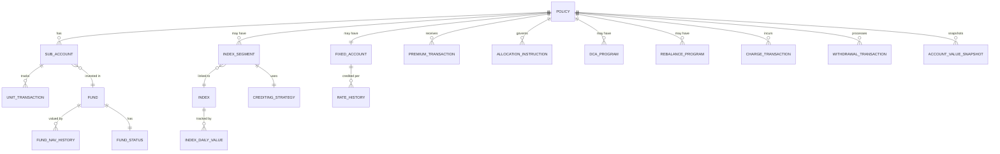

### 10.2 Core Entities

#### SUB_ACCOUNT

| Column | Type | Description |
|---|---|---|
| sub_account_id | BIGINT PK | Unique identifier |
| policy_id | BIGINT FK | Parent policy |
| fund_code | VARCHAR(20) FK | Fund reference |
| units | DECIMAL(18,8) | Current unit balance |
| unit_value | DECIMAL(12,6) | Latest unit value |
| market_value | DECIMAL(15,2) | units × unit_value |
| cost_basis | DECIMAL(15,2) | Tax cost basis for this fund |
| status | VARCHAR(10) | ACTIVE, FROZEN, CLOSED |

#### INDEX_SEGMENT

| Column | Type | Description |
|---|---|---|
| segment_id | BIGINT PK | Unique identifier |
| policy_id | BIGINT FK | Parent policy |
| strategy_code | VARCHAR(30) | Crediting strategy |
| index_code | VARCHAR(20) FK | Index reference |
| crediting_method | VARCHAR(30) | PTP, MONTHLY_AVG, MONTHLY_SUM_CAP, TRIGGER |
| term_months | INT | Segment term length |
| start_date | DATE | Segment start |
| maturity_date | DATE | Segment end |
| start_index_value | DECIMAL(12,4) | Index value at start |
| end_index_value | DECIMAL(12,4) | Index value at maturity (null until matured) |
| cap_rate | DECIMAL(8,6) | Cap rate locked at creation |
| participation_rate | DECIMAL(8,6) | Participation rate locked |
| spread_rate | DECIMAL(8,6) | Spread/margin locked |
| floor_rate | DECIMAL(8,6) | Floor rate locked |
| segment_value | DECIMAL(15,2) | Current segment value |
| credited_amount | DECIMAL(15,2) | Interest credited at maturity |
| interim_value | DECIMAL(15,2) | Calculated interim value |
| status | VARCHAR(15) | ACTIVE, MATURED, WITHDRAWN |

#### PREMIUM_TRANSACTION

| Column | Type | Description |
|---|---|---|
| premium_id | BIGINT PK | Unique identifier |
| policy_id | BIGINT FK | Parent policy |
| premium_date | DATE | Date received |
| gross_amount | DECIMAL(15,2) | Amount received |
| premium_tax | DECIMAL(12,2) | Premium tax deducted |
| net_amount | DECIMAL(15,2) | After tax |
| bonus_amount | DECIMAL(12,2) | Bonus credited |
| total_allocated | DECIMAL(15,2) | Net + bonus |
| premium_type | VARCHAR(20) | INITIAL, ADDITIONAL, TRANSFER_IN, SCHEDULED |
| source_type | VARCHAR(20) | CHECK, WIRE, ACH, 1035_EXCHANGE, ROLLOVER |
| qualified_year | INT | Tax year for IRA contribution tracking |

#### FUND_NAV_HISTORY

| Column | Type | Description |
|---|---|---|
| nav_id | BIGINT PK | Unique identifier |
| fund_code | VARCHAR(20) FK | Fund reference |
| nav_date | DATE | Valuation date |
| nav_per_share | DECIMAL(12,6) | Net asset value |
| unit_value | DECIMAL(12,6) | Sub-account unit value (after M&E) |
| daily_return | DECIMAL(10,8) | Day-over-day return |

#### CHARGE_TRANSACTION

| Column | Type | Description |
|---|---|---|
| charge_id | BIGINT PK | Unique identifier |
| policy_id | BIGINT FK | Parent policy |
| charge_date | DATE | Date assessed |
| charge_type | VARCHAR(30) | ME, ADMIN, RIDER_GLWB, RIDER_GMDB, PREMIUM_TAX, CONTRACT_FEE |
| charge_basis_amount | DECIMAL(15,2) | AV, BB, or flat |
| charge_rate | DECIMAL(10,8) | Periodic rate applied |
| charge_amount | DECIMAL(12,2) | Actual charge |
| deducted_from | VARCHAR(30) | PROPORTIONAL, FIXED_ACCOUNT, SPECIFIC_FUND |

#### ACCOUNT_VALUE_SNAPSHOT

| Column | Type | Description |
|---|---|---|
| snapshot_id | BIGINT PK | Unique identifier |
| policy_id | BIGINT FK | Parent policy |
| snapshot_date | DATE | Date of snapshot |
| snapshot_type | VARCHAR(15) | DAILY, MONTHLY, ANNIVERSARY, AD_HOC |
| total_account_value | DECIMAL(15,2) | Total AV |
| variable_account_value | DECIMAL(15,2) | Sum of sub-accounts |
| fixed_account_value | DECIMAL(15,2) | Fixed account |
| indexed_account_value | DECIMAL(15,2) | Sum of indexed segments |
| loan_balance | DECIMAL(15,2) | Outstanding loans |
| net_account_value | DECIMAL(15,2) | AV - loans |

---

## 11. Batch Processing Architecture

### 11.1 Overnight Batch Cycle Overview

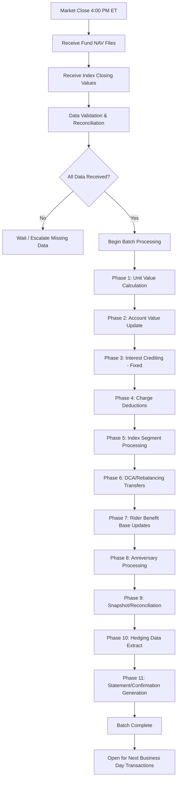

### 11.2 Phase Details

#### Phase 1: Unit Value Calculation

```python
def phase1_unit_value_calc(valuation_date):
    """Calculate sub-account unit values from fund NAVs."""
    funds = get_all_active_funds()
    
    for fund in funds:
        nav = get_fund_nav(fund.code, valuation_date)
        if nav is None:
            raise MissingNAVError(fund.code, valuation_date)
        
        daily_me_rate = fund.annual_me_rate / 365.0
        daily_admin_rate = fund.annual_admin_rate / 365.0
        
        prior_unit_value = get_prior_unit_value(fund.code)
        nav_return = (nav - fund.prior_nav) / fund.prior_nav
        
        new_unit_value = prior_unit_value * (1 + nav_return - daily_me_rate - daily_admin_rate)
        
        save_unit_value(fund.code, valuation_date, new_unit_value, nav)
```

#### Phase 2: Account Value Update

```python
def phase2_account_value_update(valuation_date):
    """Update all sub-account market values."""
    policies = get_policies_with_variable_accounts()
    
    for policy in policies:
        total_variable = 0
        for sub_account in policy.sub_accounts:
            unit_value = get_unit_value(sub_account.fund_code, valuation_date)
            sub_account.unit_value = unit_value
            sub_account.market_value = sub_account.units * unit_value
            total_variable += sub_account.market_value
        
        policy.variable_account_value = total_variable
        policy.total_account_value = (
            total_variable + 
            policy.fixed_account_value + 
            policy.indexed_account_value
        )
```

#### Phase 5: Index Segment Processing

```python
def phase5_index_segment_processing(valuation_date):
    """Process maturing indexed segments and create new ones."""
    maturing_segments = get_maturing_segments(valuation_date)
    
    for segment in maturing_segments:
        end_index = get_index_value(segment.index_code, valuation_date)
        segment.end_index_value = end_index
        
        credited_rate = index_crediting_engine.calculate_segment_credit(segment)
        credited_amount = segment.segment_value * credited_rate
        
        segment.credited_amount = credited_amount
        segment.segment_value += credited_amount
        segment.status = 'MATURED'
        
        # Auto-renew into new segment
        if segment.auto_renew:
            new_rates = get_current_crediting_rates(segment.strategy_code)
            create_new_segment(
                policy_id=segment.policy_id,
                strategy_code=segment.strategy_code,
                start_date=valuation_date,
                start_index_value=end_index,
                value=segment.segment_value,
                cap_rate=new_rates.cap,
                participation_rate=new_rates.participation,
                spread_rate=new_rates.spread,
                floor_rate=new_rates.floor
            )
```

### 11.3 Batch Error Handling

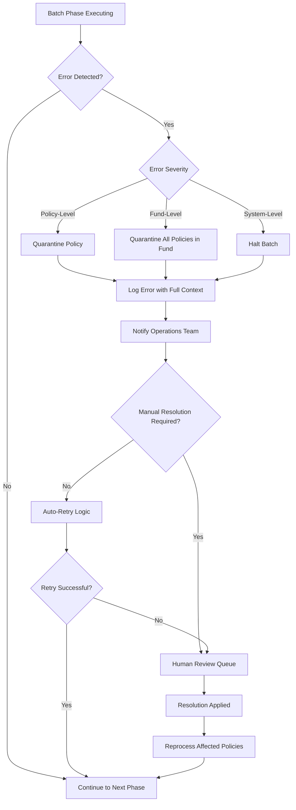

### 11.4 Performance Benchmarks

| Batch Phase | Policies/Second | Target Window | For 500K Policies |
|---|---|---|---|
| Unit Value Calc | N/A (fund-level) | 5 minutes | 5 minutes |
| Account Value Update | 10,000 | 30 minutes | 50 seconds |
| Fixed Interest Credit | 15,000 | 15 minutes | 33 seconds |
| Charge Deductions | 5,000 | 60 minutes | 100 seconds |
| Index Segment Processing | 3,000 | 45 minutes | Variable (only maturing) |
| Rider Updates | 4,000 | 45 minutes | 125 seconds |
| Hedging Extract | 8,000 | 30 minutes | 62 seconds |
| **Total** | | **4 hours** | |

---

## 12. Real-Time vs. Batch Processing Decision Matrix

| Operation | Real-Time | Batch | Rationale |
|---|---|---|---|
| Premium receipt / allocation | ✅ | | Immediate confirmation needed |
| Fund NAV / unit value update | | ✅ | Dependent on market close data |
| Fixed interest crediting | | ✅ | Daily or monthly batch |
| Charge deductions (M&E) | | ✅ | Within unit value calculation |
| Charge deductions (rider) | | ✅ | Quarterly/anniversary batch |
| Withdrawal processing | ✅ | | Immediate; uses current-day NAV |
| Fund transfer | ✅ | | Same-day or next-day execution |
| DCA transfers | | ✅ | Scheduled batch |
| Rebalancing | | ✅ | Scheduled batch |
| Index segment maturity | | ✅ | Date-driven batch |
| GMDB ratchet snapshot | | ✅ | Anniversary batch |
| GMWB benefit base update | ✅ (on withdrawal) | ✅ (step-up) | Both |
| Surrender processing | ✅ | | Immediate calculation needed |
| Death claim | ✅ | | Time-sensitive |
| Statement generation | | ✅ | Monthly/quarterly batch |
| Hedging data feed | | ✅ | Daily batch |
| Tax reporting (1099-R) | | ✅ | Annual batch |

---

## 13. Architecture & Implementation Guidance

### 13.1 Accumulation Engine Architecture

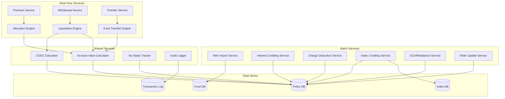

### 13.2 Key Design Principles

1. **Idempotent Processing:** Every batch operation must be idempotent — running the same batch twice for the same date must produce identical results. Use valuation date + policy ID as the natural key.

2. **Compensating Transactions:** Never delete or modify historical transactions. If a correction is needed, post a compensating (reversal) transaction followed by the corrected transaction.

3. **Precision Handling:**
   - Unit quantities: 8 decimal places (e.g., 4,066.00000000 units)
   - Unit values: 6 decimal places (e.g., $25.432100)
   - Dollar amounts: 2 decimal places (standard currency)
   - Rates: 6-8 decimal places (e.g., 0.001300 for 0.13%)
   - Index values: 4 decimal places

4. **Fund NAV Dependency Chain:** The entire batch depends on timely receipt of fund NAVs. Implement a dependency tracker that:
   - Monitors expected vs. received NAVs
   - Alerts operations for missing data after T+30 minutes
   - Provides a manual override mechanism for stale NAVs
   - Supports backdated NAV corrections

5. **Account Value Consistency:** At the end of every batch cycle, verify:
   ```
   TotalAV = Σ(SubAccount.units × SubAccount.unitValue) + FixedAccountValue + Σ(IndexSegment.interimValue)
   ```
   Any discrepancy > $0.01 must be investigated.

### 13.3 Disaster Recovery Considerations

| Scenario | Recovery Strategy | RPO | RTO |
|---|---|---|---|
| Missed NAV feed | Rerun batch with delayed NAV | Same day | 2 hours |
| Batch failure mid-cycle | Restart from last checkpoint | Same day | 1 hour |
| Database corruption | Restore from point-in-time backup | 15 minutes | 4 hours |
| Data center failure | Failover to DR site | 1 hour | 4 hours |
| Incorrect NAV applied | Reverse and reprocess affected policies | N/A | 24 hours |

### 13.4 Monitoring & Alerting

| Metric | Threshold | Alert Level |
|---|---|---|
| Batch completion time | > 5 hours | Warning |
| Batch completion time | > 6 hours | Critical |
| Missing fund NAVs | > 15 min after expected | Warning |
| Missing fund NAVs | > 60 min after expected | Critical |
| Policy processing errors | > 0.1% of book | Warning |
| Policy processing errors | > 1.0% of book | Critical |
| AV reconciliation break | > $0.01 per policy | Error |
| Hedging feed delivery | > 30 min past SLA | Critical |

---

## Appendix A: ACORD Transaction Types for Accumulation

| Transaction | ACORD TransType | Description |
|---|---|---|
| Premium Payment | 103 (NB) / 501 (Premium) | Initial or additional premium |
| Fund Transfer | 502 (Change) | Transfer between investment options |
| Allocation Change | 502 (Change) | Future allocation instruction change |
| Withdrawal | 508 (Surrender/Withdrawal) | Full or partial withdrawal |
| DCA Setup | 502 (Change) | Dollar-cost averaging program |
| Rebalance Setup | 502 (Change) | Automatic rebalancing program |
| Account Value Inquiry | 302 (Inquiry) | Current AV and fund positions |
| Fund Listing | 302 (Inquiry) | Available funds for product |

## Appendix B: Sample ACORD XML — Premium Payment

```xml
<?xml version="1.0" encoding="UTF-8"?>
<TXLife xmlns="http://ACORD.org/Standards/Life/2" Version="2.44.00">
  <TXLifeRequest>
    <TransRefGUID>TX-2024-PRM-001234</TransRefGUID>
    <TransType tc="501">Premium Payment</TransType>
    <OLifE>
      <Holding id="H1">
        <HoldingKey>POL-2024-VA-001234</HoldingKey>
        <Policy>
          <Annuity>
            <Payout>
              <PaymentAmt>50000.00</PaymentAmt>
              <PaymentForm tc="7">Wire Transfer</PaymentForm>
            </Payout>
          </Annuity>
        </Policy>
      </Holding>
      <SourceInfo>
        <CreationDate>2024-06-15</CreationDate>
      </SourceInfo>
    </OLifE>
  </TXLifeRequest>
</TXLife>
```

## Appendix C: Glossary

| Term | Definition |
|---|---|
| NAV | Net Asset Value — per-share value of a mutual fund |
| Unit Value | Sub-account per-unit value (NAV adjusted for M&E/admin) |
| CDSC | Contingent Deferred Sales Charge (surrender charge) |
| DCA | Dollar-Cost Averaging — systematic transfer program |
| M&E | Mortality & Expense Risk Charge |
| FIA | Fixed Indexed Annuity |
| RILA | Registered Index-Linked Annuity |
| PTP | Point-to-Point — index crediting method |
| MYGA | Multi-Year Guarantee Annuity |
| Segment | FIA index-linked term with locked crediting parameters |
| MVA | Market Value Adjustment |

---

*This article is part of the Life Insurance PAS Architect's Encyclopedia. For related topics, see Article 04 (Product Design & Riders), Article 06 (Payout & Annuitization), and Article 07 (Tax Treatment & 1035 Exchanges).*
