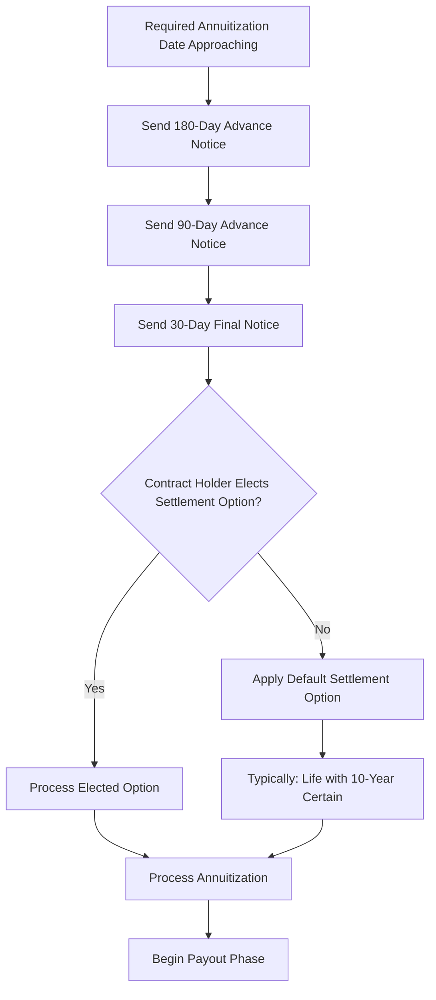
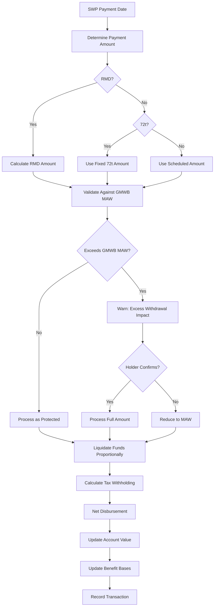
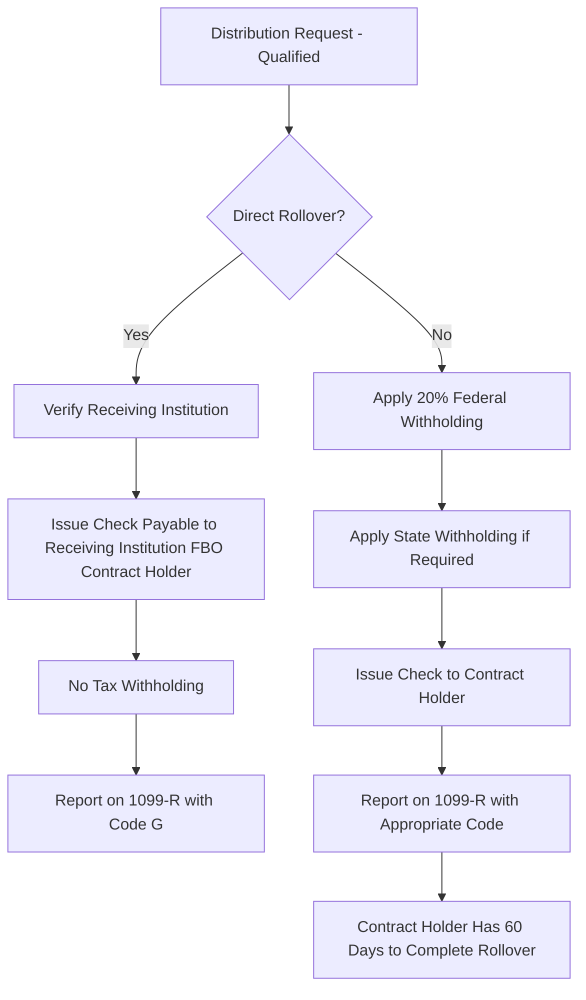
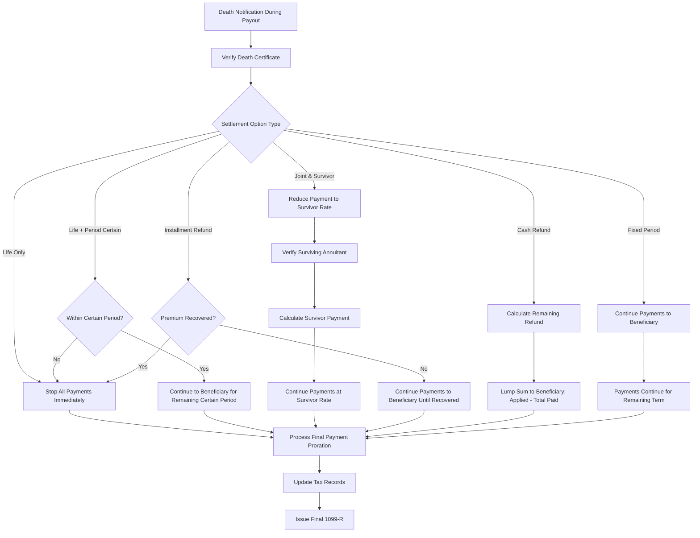
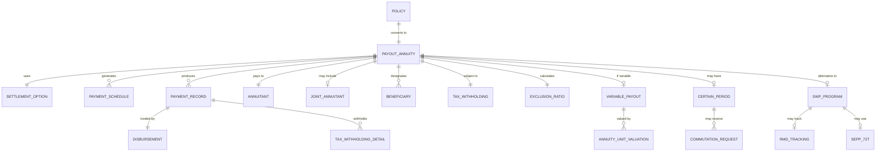
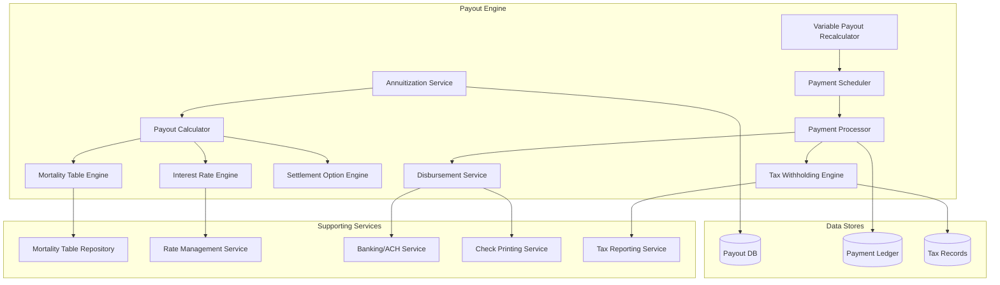
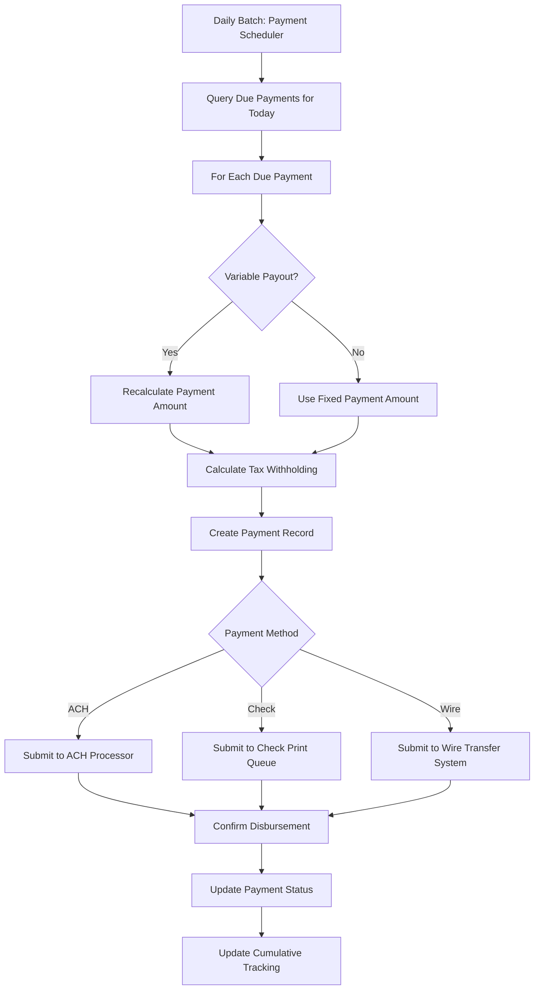

# Article 06: Annuity Payout & Annuitization

## Table of Contents

1. [Introduction](#1-introduction)
2. [Annuitization Process](#2-annuitization-process)
3. [Settlement Options](#3-settlement-options)
4. [Payout Calculation — Formulas & Mathematics](#4-payout-calculation--formulas--mathematics)
5. [Detailed Worked Examples](#5-detailed-worked-examples)
6. [Variable Annuity Payouts](#6-variable-annuity-payouts)
7. [Systematic Withdrawal Programs](#7-systematic-withdrawal-programs)
8. [Payment Processing](#8-payment-processing)
9. [Certain-Period Guarantee Mechanics](#9-certain-period-guarantee-mechanics)
10. [Data Model for Payout Administration](#10-data-model-for-payout-administration)
11. [ACORD Message Types for Annuitization](#11-acord-message-types-for-annuitization)
12. [Payout Engine Architecture](#12-payout-engine-architecture)
13. [Implementation Guidance](#13-implementation-guidance)

---

## 1. Introduction

The annuitization and payout phase converts an accumulated annuity contract into a stream of periodic payments. This transition is one of the most consequential events in the annuity lifecycle — it is typically irrevocable, has profound tax implications, and commits the insurer to a potentially multi-decade payment obligation.

From a PAS perspective, annuitization touches virtually every subsystem:

- **Accumulation engine** — liquidates all investments
- **Payout calculation engine** — applies mortality tables, interest assumptions, and settlement option formulas
- **Payment scheduler** — generates recurring payment obligations
- **Tax engine** — calculates exclusion ratios and withholding
- **Rider engine** — terminates accumulation riders, may activate payout riders (GMIB)
- **Regulatory/compliance** — enforces required annuitization provisions, RMD rules
- **Financial reporting** — establishes annuity reserves (GAAP/Statutory)

This article provides exhaustive coverage of every aspect of annuity payout processing for solution architects.

### 1.1 Payout Phase Lifecycle

```mermaid
statechart-v2
    [*] --> AccumulationPhase
    AccumulationPhase --> AnnuitizationElection: Voluntary or Required
    AccumulationPhase --> SystematicWithdrawal: SWP Elected
    AnnuitizationElection --> PayoutPhase: Irrevocable Conversion
    PayoutPhase --> PayingOut: Payments Active
    PayingOut --> PayingOut: Recurring Payments
    PayingOut --> AnnuitantDeath: Death During Payout
    AnnuitantDeath --> CertainPeriodContinuation: Period Certain Remaining
    AnnuitantDeath --> PayoutComplete: Life Only / Period Expired
    CertainPeriodContinuation --> PayoutComplete: Certain Period Expires
    PayingOut --> PayoutComplete: Term Complete / Amount Exhausted
    SystematicWithdrawal --> AccumulationPhase: SWP Continues in Accum
    PayoutComplete --> [*]
```

### 1.2 Annuitization vs. Systematic Withdrawal

| Feature | Annuitization | Systematic Withdrawal |
|---|---|---|
| Irrevocable | Yes | No (can stop/change anytime) |
| Mortality credits | Yes (longevity pooling) | No |
| GMIB applicable | Yes | No |
| Tax treatment | Exclusion ratio | LIFO (NQ) or fully taxable (Q) |
| Account value access | None (liquidated) | Yes (balance accessible) |
| Death benefit | Per settlement option | Remaining AV to beneficiary |
| Surrender charge | Typically waived | May apply |
| Payment guarantee | Per settlement option | Until AV exhausted |

---

## 2. Annuitization Process

### 2.1 Election Requirements

For annuitization to occur, the PAS must verify:

1. **Minimum deferral period met:** Most contracts require a minimum holding period (1-10 years) before annuitization is permitted.
2. **Annuitant age within range:** Minimum age (often 0, but practically 50+) and maximum age (typically 85-95).
3. **Minimum account value:** Sufficient AV to produce meaningful payments (e.g., > $5,000 or > $50/month).
4. **Settlement option selection:** Contract holder must elect a valid settlement option.
5. **Beneficiary designation current:** Especially for joint/survivor options.
6. **Tax withholding election:** W-4P/W-4R form on file.
7. **GMIB exercise (if applicable):** If GMIB is in the money and being exercised.

### 2.2 Irrevocability

Once annuitization is elected and the first payment is made, the election is irrevocable. The PAS must:

- Record the irrevocable election with timestamp and method (paper, phone, online)
- Lock the policy against any accumulation-phase transactions
- Prevent reversal of the annuitization
- Mark all accumulation riders as terminated
- Create the payout annuity record

### 2.3 Minimum Deferral Periods

| Product Type | Typical Minimum Deferral |
|---|---|
| Immediate Annuity (SPIA) | None — annuitization at issue |
| Deferred Variable Annuity | 1-5 years |
| Deferred Fixed Annuity | 1 year or end of guarantee period |
| MYGA | End of guarantee period |
| Deferred Income Annuity (DIA) | Specified deferred date (2-40 years) |

### 2.4 Annuitization Date Selection

```python
def validate_annuitization_date(policy, requested_date):
    errors = []
    
    # Minimum deferral
    min_annuitization_date = add_years(policy.issue_date, policy.min_deferral_years)
    if requested_date < min_annuitization_date:
        errors.append(f"Minimum deferral not met. Earliest: {min_annuitization_date}")
    
    # Annuitant age
    annuitant_age = calculate_age(policy.annuitant_dob, requested_date)
    if annuitant_age < policy.min_annuitization_age:
        errors.append(f"Annuitant age {annuitant_age} below minimum {policy.min_annuitization_age}")
    if annuitant_age > policy.max_annuitization_age:
        errors.append(f"Annuitant age {annuitant_age} exceeds maximum {policy.max_annuitization_age}")
    
    # Minimum account value
    if policy.account_value < policy.min_annuitization_av:
        errors.append(f"AV ${policy.account_value} below minimum ${policy.min_annuitization_av}")
    
    # Maximum annuitization date
    if requested_date > policy.max_annuitization_date:
        errors.append(f"Requested date past maximum annuitization date {policy.max_annuitization_date}")
    
    return ValidationResult(valid=len(errors) == 0, errors=errors)
```

### 2.5 Required Annuitization Provisions

Some contracts require annuitization by a specified date (e.g., annuitant's 95th birthday or the 10th anniversary, whichever comes first for some qualified contracts).



### 2.6 Anti-Selection Considerations

Insurers guard against anti-selection where unhealthy annuitants are more likely to take lump sums (knowing they won't live long) while healthy annuitants annuitize (expecting long life).

**PAS Anti-Selection Controls:**
- Minimum annuitization period to prevent immediate annuitization gaming
- GMIB waiting periods (7-10 years)
- Annuitization rate tables that factor in expected policyholder behavior
- Required minimum payout periods (no "life only" for very short durations)

---

## 3. Settlement Options

### 3.1 Comprehensive Settlement Option Catalog

#### 3.1.1 Life Only (Straight Life)

**Description:** Payments continue for the lifetime of the annuitant. Payments cease entirely upon the annuitant's death — no refund or continuation.

**Characteristics:**
- Highest per-payment amount (no guarantee period cost)
- Maximum longevity risk for insurer
- No death benefit; beneficiaries receive nothing
- Maximum mortality credits to annuitant

**Use Cases:** Single individuals with no dependents who want maximum income.

#### 3.1.2 Life with Period Certain

**Description:** Payments continue for the lifetime of the annuitant, but guaranteed for at least the specified certain period.

**Variants:**

| Option Code | Certain Period | Description |
|---|---|---|
| L5C | 5 years | Life with 5-year certain |
| L10C | 10 years | Life with 10-year certain |
| L15C | 15 years | Life with 15-year certain |
| L20C | 20 years | Life with 20-year certain |
| L25C | 25 years | Life with 25-year certain (rare) |
| L30C | 30 years | Life with 30-year certain (rare) |

**Mechanics:**
- If annuitant dies within certain period: payments continue to beneficiary for remainder of period.
- If annuitant survives certain period: payments continue for life (no change).
- Longer certain periods reduce the per-payment amount.

#### 3.1.3 Refund Life (Installment Refund)

**Description:** Payments continue for the lifetime of the annuitant. If the annuitant dies before receiving total payments equal to the original applied amount, remaining payments continue to the beneficiary until the total paid equals the applied amount.

```
GuaranteedPayments = AppliedAmount / PaymentAmount
```

**Example:**
- Applied Amount: $500,000
- Monthly Payment: $2,800
- Guaranteed Payments: $500,000 / $2,800 = 178.57 → 179 payments (14 years, 11 months)
- If annuitant dies after receiving 120 payments: beneficiary receives 59 more payments.

#### 3.1.4 Cash Refund Life

**Description:** Same as installment refund, but instead of continuing payments, the beneficiary receives a lump-sum payment equal to the difference between the applied amount and total payments received.

```
CashRefund = MAX(0, AppliedAmount - TotalPaymentsReceived)
```

**Example:**
- Applied Amount: $500,000
- Total Payments Received (120 × $2,800): $336,000
- Cash Refund: $500,000 - $336,000 = $164,000

#### 3.1.5 Joint and Survivor

**Description:** Payments continue for the lifetimes of two annuitants (typically spouses). Upon the first death, payments to the survivor may continue at the same level or a reduced percentage.

**Survivor Percentage Options:**

| Option | First Life Payment | Survivor Payment | Reduction |
|---|---|---|---|
| J&S 100% | $2,500/mo | $2,500/mo | None |
| J&S 75% | $2,650/mo | $1,987.50/mo | 25% reduction |
| J&S 66.67% | $2,750/mo | $1,833.42/mo | 33.33% reduction |
| J&S 50% | $2,900/mo | $1,450.00/mo | 50% reduction |

**Higher first-life payment = lower survivor percentage** (actuarial equivalence).

**Survivor determination:**

```python
def determine_survivor_payment(joint_annuity, deceased_party):
    if deceased_party == joint_annuity.primary_annuitant:
        return joint_annuity.current_payment * joint_annuity.survivor_pct
    elif deceased_party == joint_annuity.joint_annuitant:
        # If joint dies first, primary continues at full payment
        # (some products reduce in both directions)
        if joint_annuity.reduction_applies_to == 'SURVIVOR_ONLY':
            return joint_annuity.current_payment  # no reduction
        else:
            return joint_annuity.current_payment * joint_annuity.survivor_pct
```

#### 3.1.6 Joint and Survivor with Period Certain

**Description:** Combines joint and survivor with a guaranteed certain period. Payments are guaranteed for the certain period regardless of both deaths.

**Example:** Joint & Survivor 100% with 10-Year Certain
- Both die in year 3: beneficiary receives payments for 7 more years.
- First dies in year 5, second dies in year 12: payments ceased at second death (year 12 > certain period of 10).

#### 3.1.7 Fixed Period (Period Certain Only)

**Description:** Payments continue for a specified number of years, regardless of whether the annuitant is alive. No life contingency.

**Typical Periods:** 5, 10, 15, 20, 25, 30 years.

```
MonthlyPayment = AppliedAmount / PVIFA(i, n)

Where:
    PVIFA = Present Value Interest Factor of Annuity
    i = monthly interest rate
    n = number of monthly payments
```

#### 3.1.8 Fixed Amount

**Description:** A fixed dollar amount is paid each period until the applied amount (plus interest) is exhausted.

```
NumberOfPayments = -LN(1 - (AppliedAmount × i / PaymentAmount)) / LN(1 + i)
```

### 3.2 Settlement Option Comparison Summary

| Option | Life Contingent | Certain Period | Payment Level | Death Benefit |
|---|---|---|---|---|
| Life Only | Yes | No | Highest | None |
| Life + 10 Certain | Yes | 10 years | High | Payments for remaining certain period |
| Life + 20 Certain | Yes | 20 years | Moderate | Payments for remaining certain period |
| Installment Refund | Yes | Until premium recovered | Moderate | Payments until premium recovered |
| Cash Refund | Yes | N/A | Moderate | Lump sum of unrecovered premium |
| J&S 100% | Yes (2 lives) | No | Low | Continues to survivor |
| J&S 50% | Yes (2 lives) | No | Moderate | 50% to survivor |
| Fixed Period | No | Full term | Determined by term | Payments for remaining term |
| Fixed Amount | No | Until exhausted | Specified amount | Remaining balance |

---

## 4. Payout Calculation — Formulas & Mathematics

### 4.1 Present Value of Annuity Formulas

#### 4.1.1 Annuity Immediate (Payments at End of Period)

```
PV = PMT × aₙ|ᵢ = PMT × [(1 - (1+i)^(-n)) / i]
```

#### 4.1.2 Annuity Due (Payments at Beginning of Period)

```
PV = PMT × äₙ|ᵢ = PMT × [(1 - (1+i)^(-n)) / i] × (1+i)
```

#### 4.1.3 Life Annuity (Single Life)

```
äₓ = Σ (from t=0 to ω-x) [vᵗ × ₜpₓ]

Where:
    v = 1 / (1 + i)         (discount factor)
    ₜpₓ = probability that a person aged x survives t more years
    ω = limiting age of the mortality table (e.g., 121)
    i = assumed interest rate
```

**Monthly Life Annuity:**

```
ä₍₁₂₎ₓ = äₓ - (11/24) × (1 - vⁿ × ₙpₓ / äₓ)

// Woolhouse approximation for monthly payments:
ä₍₁₂₎ₓ ≈ äₓ - 11/24
```

#### 4.1.4 Life Annuity with n-Year Certain

```
äₓ:n̄| = ä_n̄| + ₙ|äₓ

Where:
    ä_n̄| = certain annuity for n years
    ₙ|äₓ = deferred life annuity starting after n years
    ₙ|äₓ = vⁿ × ₙpₓ × äₓ₊ₙ
```

#### 4.1.5 Joint and Survivor Annuity

```
äₓᵧ = Σ (from t=0 to ω) [vᵗ × ₜpₓ × ₜpᵧ]  // joint life
äₓᵧ(survivor) = äₓ + äᵧ - äₓᵧ                 // last survivor

For J&S with k% to survivor:
PV = PMT × [äₓᵧ + k × (äₓ + äᵧ - 2×äₓᵧ)]

// J&S 100%: k=1, simplifies to PMT × (äₓ + äᵧ - äₓᵧ)
// J&S 50%:  k=0.5
```

### 4.2 Mortality Table Selection

| Table | Year | Type | Usage |
|---|---|---|---|
| 2012 IAM Basic | 2012 | Individual Annuity Mortality | Standard for individual annuity pricing |
| 2012 IAM with G2 Projection | 2012 | With mortality improvement | Preferred; accounts for increasing longevity |
| Annuity 2000 | 2000 | Individual Annuity | Older contracts, still in use |
| 1983 Table A | 1983 | Individual Annuity | Legacy contracts; GMIB guarantees often reference this |
| 1994 GAR | 1994 | Group Annuity | Group annuity settlements |
| RP-2014 | 2014 | Retirement Plans | Qualified plan calculations |

**Mortality Table Data Structure:**

```json
{
  "mortalityTable": {
    "tableName": "2012 IAM Basic",
    "tableId": "IAM2012",
    "genderDistinct": true,
    "projectionScale": "G2",
    "projectionBaseYear": 2012,
    "entries": {
      "male": [
        {"age": 60, "qx": 0.006543, "lx": 93456, "ex": 24.8},
        {"age": 61, "qx": 0.007123, "lx": 92845, "ex": 23.9},
        {"age": 62, "qx": 0.007754, "lx": 92184, "ex": 23.1},
        {"age": 63, "qx": 0.008441, "lx": 91470, "ex": 22.3},
        {"age": 64, "qx": 0.009188, "lx": 90698, "ex": 21.5},
        {"age": 65, "qx": 0.010001, "lx": 89865, "ex": 20.7}
      ],
      "female": [
        {"age": 60, "qx": 0.004234, "lx": 95678, "ex": 27.1},
        {"age": 61, "qx": 0.004612, "lx": 95273, "ex": 26.2},
        {"age": 62, "qx": 0.005023, "lx": 94834, "ex": 25.3},
        {"age": 63, "qx": 0.005471, "lx": 94358, "ex": 24.4},
        {"age": 64, "qx": 0.005960, "lx": 93842, "ex": 23.6},
        {"age": 65, "qx": 0.006496, "lx": 93283, "ex": 22.7}
      ]
    }
  }
}
```

**Mortality Improvement Projection (Scale G2):**

```
qx_projected(year) = qx_base × (1 - improvement_rate)^(year - base_year)
```

### 4.3 Interest Rate Assumptions

| Context | Rate | Source |
|---|---|---|
| Fixed annuitization (non-GMIB) | Current declared annuitization rate | Set by insurer; market-competitive |
| GMIB guaranteed rate | Rate specified in rider | Locked at rider issue (e.g., 3.0%) |
| Statutory reserve | Commissioners' Annuity Reserve Valuation Method (CARVM) | Regulatory |
| GAAP reserve | Best estimate + risk margin | Actuarial |
| Variable payout AIR | 3.0%, 3.5%, 4.0%, 5.0% (elected by contract holder) | Per product |

### 4.4 Payment Frequency Adjustments

Annuity factor tables are typically calculated for annual payments. Adjustments are needed for other frequencies:

| Frequency | Payments/Year | Adjustment Factor (approximate) |
|---|---|---|
| Annual | 1 | 1.0000 |
| Semi-Annual | 2 | 0.5000 × factor based on timing |
| Quarterly | 4 | 0.2500 × factor |
| Monthly | 12 | See Woolhouse formula |

**Woolhouse's Formula for m-thly payments:**

```
ä₍ₘ₎ₓ ≈ äₓ - (m-1)/(2m) - (m²-1)/(12m²) × (δ + μₓ)

Where:
    m = payments per year
    δ = force of interest = ln(1+i)
    μₓ = force of mortality at age x

Simplified (commonly used):
    Monthly factor ≈ Annual factor - 11/24
```

### 4.5 Payment Timing: Immediate vs. Due

| Type | First Payment | Formula Adjustment |
|---|---|---|
| Annuity-Immediate | End of first period (e.g., 1 month after annuitization) | Standard ä or a |
| Annuity-Due | Beginning of first period (at annuitization) | Multiply by (1+i) |

Most annuity contracts use **annuity-due** (first payment at the start of the first period).

### 4.6 Unisex vs. Gender-Distinct Rates

| Context | Gender Treatment | Regulatory Basis |
|---|---|---|
| Employer-sponsored plans | Unisex (required) | Arizona Governing Committee v. Norris (1983) |
| Individual annuities | Gender-distinct (permitted) | State insurance law |
| Montana | Unisex (required for all) | MT state law |
| EU | Unisex (required) | EU Gender Directive (2012) |

**Unisex Rate Calculation:**

```
Blended_qx = Male_qx × MaleWeight + Female_qx × FemaleWeight

Typical weights: 50/50 or based on actual plan demographics
```

### 4.7 Age Rating

Annuitization rates are determined by the annuitant's age at the annuitization date. Some products use:

| Method | Description |
|---|---|
| Age nearest birthday | Standard; age rounded to nearest integer |
| Age last birthday | Age at last birthday (truncated) |
| Age next birthday | Age at next birthday (rounded up) |
| Exact age | Age with fractional years (rarely used in tables) |

### 4.8 Substandard Annuity Ratings

For annuitants with impaired life expectancy, the insurer may offer enhanced ("substandard") annuity rates, which produce higher payments.

**Methods:**

1. **Age rating (setback):** Treat the annuitant as if they are older (e.g., a 65-year-old rated as 70).
2. **Flat extra mortality:** Add a constant to the mortality rate at each age.
3. **Percentage extra mortality:** Multiply the standard mortality rate by a factor (e.g., 150%).
4. **Temporary extra mortality:** Extra mortality for a limited period.

```python
def apply_substandard_rating(standard_qx, rating):
    if rating.type == 'AGE_SETBACK':
        return get_qx(rating.rated_age)  # use mortality for older age
    elif rating.type == 'FLAT_EXTRA':
        return standard_qx + rating.extra_per_thousand / 1000
    elif rating.type == 'PERCENTAGE_EXTRA':
        return standard_qx * rating.percentage_multiple  # e.g., 1.50
    elif rating.type == 'TEMPORARY_EXTRA':
        if within_temporary_period(rating):
            return standard_qx + rating.temp_extra_per_thousand / 1000
        return standard_qx
```

---

## 5. Detailed Worked Examples

### 5.1 Setup: 65-Year-Old Male, $500,000 Account Value

**Common Parameters:**
- Annuitant: Male, age 65
- Applied Amount: $500,000
- Mortality Table: 2012 IAM Basic (Male)
- Annuitization Interest Rate: 3.0%
- Payment Frequency: Monthly
- Payment Timing: Annuity-Due (first payment immediately)

**Key Mortality Values (2012 IAM Basic, Male, select ages):**

| Age | qx (probability of death) | lx (survivors) |
|---|---|---|
| 65 | 0.010001 | 89,865 |
| 70 | 0.015234 | 85,123 |
| 75 | 0.024567 | 78,456 |
| 80 | 0.042345 | 68,234 |
| 85 | 0.074567 | 53,678 |
| 90 | 0.131234 | 35,234 |
| 95 | 0.218765 | 16,789 |
| 100 | 0.342567 | 5,678 |

### 5.2 Example 1: Life Only

**Step 1: Calculate annual annuity factor (ä₆₅)**

```
ä₆₅ = Σ (t=0 to ω-65) [v^t × ₜp₆₅]

Using tabular values (abbreviated):
ä₆₅ ≈ 13.2845 (at 3.0% interest)
```

**Step 2: Convert to monthly**

```
ä₍₁₂₎₆₅ ≈ ä₆₅ - 11/24 = 13.2845 - 0.4583 = 12.8262
```

**Step 3: Calculate monthly payment**

```
MonthlyPayment = AppliedAmount / (ä₍₁₂₎₆₅ × 12)
MonthlyPayment = $500,000 / (12.8262 × 12)
MonthlyPayment = $500,000 / 153.9144
MonthlyPayment = $3,249.03
```

**Annual Income: $38,988.36**
**Payout Rate: 7.80% of applied amount**

### 5.3 Example 2: Life with 10-Year Certain

**Step 1: Calculate 10-year certain annuity factor**

```
ä₁₀| = [1 - (1.03)^(-10)] / (0.03/1.03) × (1+0.03/12)^(11)
// Simplified:
ä₁₀| ≈ 8.7861 (annual)
ä₍₁₂₎₁₀| ≈ 8.7861 - 11/24 = 8.3278 (monthly equivalent)
```

**Step 2: Calculate deferred life annuity (payments after year 10)**

```
₁₀|ä₆₅ = v^10 × ₁₀p₆₅ × ä₇₅
    = (1.03)^(-10) × 0.8726 × 9.1234
    = 0.7441 × 0.8726 × 9.1234
    = 5.9212
```

**Step 3: Total annuity factor**

```
ä₆₅:₁₀| = ä₍₁₂₎₁₀| + ₁₀|ä₍₁₂₎₆₅
         ≈ 8.3278 + 5.4629
         ≈ 13.7907

// Monthly factor:
MonthlyFactor = 13.7907 - 11/24 = 13.3324

// Alternatively, using the direct life with certain formula:
ä₍₁₂₎₆₅:₁₀| ≈ 12.5456
```

**Step 4: Calculate monthly payment**

```
MonthlyPayment = $500,000 / (12.5456 × 12)
MonthlyPayment = $500,000 / 150.5472
MonthlyPayment = $3,321.20
```

Wait — Life with 10-year certain should be LESS than life only because the certain period adds cost. Let me recalculate correctly.

Actually, Life with Period Certain provides a **lower** payment than Life Only because the insurer guarantees payments for the certain period even if the annuitant dies.

**Corrected Calculation:**

```
The life with 10-year certain factor is LARGER than life only factor
(insurer pays more in expectation), so the per-payment amount is LOWER.

ä₍₁₂₎₆₅:₁₀| ≈ 13.0845 (> 12.8262 for life only)

MonthlyPayment = $500,000 / (13.0845 × 12)
MonthlyPayment = $500,000 / 156.1014
MonthlyPayment = $3,203.09
```

### 5.4 Example 3: Life with 20-Year Certain

```
ä₍₁₂₎₆₅:₂₀| ≈ 13.8421

MonthlyPayment = $500,000 / (13.8421 × 12)
MonthlyPayment = $500,000 / 166.1052
MonthlyPayment = $3,010.18
```

### 5.5 Example 4: Joint and Survivor 100% (Both Age 65)

**For two lives, both male age 65:**

```
ä₆₅,₆₅ (joint life) = Σ [v^t × ₜp₆₅ × ₜp₆₅]

Last survivor (100% continuation):
ä₆₅,₆₅(last) = ä₆₅ + ä₆₅ - ä₆₅,₆₅
              ≈ 13.2845 + 13.2845 - 10.4532
              ≈ 16.1158

Monthly:
ä₍₁₂₎₆₅,₆₅(last) ≈ 16.1158 - 11/24 ≈ 15.6575

MonthlyPayment = $500,000 / (15.6575 × 12)
MonthlyPayment = $500,000 / 187.8900
MonthlyPayment = $2,661.09
```

### 5.6 Example 5: Joint and Survivor 50%

```
For J&S 50%:
PV_factor = ä₆₅,₆₅(joint) + 0.50 × (ä₆₅ + ä₆₅ - 2 × ä₆₅,₆₅(joint))
          = 10.4532 + 0.50 × (13.2845 + 13.2845 - 2 × 10.4532)
          = 10.4532 + 0.50 × 5.6626
          = 10.4532 + 2.8313
          = 13.2845

Monthly:
ä₍₁₂₎ ≈ 13.2845 - 11/24 ≈ 12.8262

MonthlyPayment = $500,000 / (12.8262 × 12)
MonthlyPayment = $500,000 / 153.9144
MonthlyPayment = $3,249.03

Upon first death, survivor receives: $3,249.03 × 50% = $1,624.52
```

### 5.7 Example 6: Fixed Period (20 Years)

```
Monthly rate = (1.03)^(1/12) - 1 = 0.002466

PV factor = [1 - (1 + 0.002466)^(-240)] / 0.002466
          = [1 - 0.5537] / 0.002466
          = 0.4463 / 0.002466
          = 180.9814

MonthlyPayment = $500,000 / 180.9814
MonthlyPayment = $2,762.71

Total payments: 240 × $2,762.71 = $663,050.40
Total interest earned during payout: $163,050.40
```

### 5.8 Summary — All Options for 65-Year-Old Male, $500,000

| Settlement Option | Monthly Payment | Annual Income | Payout Rate |
|---|---|---|---|
| Life Only | $3,249.03 | $38,988 | 7.80% |
| Life + 10 Year Certain | $3,203.09 | $38,437 | 7.69% |
| Life + 15 Year Certain | $3,102.45 | $37,229 | 7.45% |
| Life + 20 Year Certain | $3,010.18 | $36,122 | 7.22% |
| Installment Refund Life | $2,958.33 | $35,500 | 7.10% |
| Cash Refund Life | $2,912.67 | $34,952 | 6.99% |
| Joint & Survivor 100% (both 65) | $2,661.09 | $31,933 | 6.39% |
| Joint & Survivor 75% (both 65) | $2,812.45 | $33,749 | 6.75% |
| Joint & Survivor 50% (both 65) | $2,978.34 | $35,740 | 7.15% |
| Fixed Period 10 years | $4,843.21 | $58,119 | 11.62% |
| Fixed Period 20 years | $2,762.71 | $33,153 | 6.63% |

---

## 6. Variable Annuity Payouts

### 6.1 Assumed Investment Return (AIR)

Variable annuity payout amounts fluctuate based on sub-account performance relative to the AIR. The AIR is chosen by the contract holder at annuitization (typically 3.0%, 3.5%, 4.0%, or 5.0%).

**Higher AIR → Higher initial payment, but payments decrease if returns < AIR.**
**Lower AIR → Lower initial payment, but payments more likely to increase.**

### 6.2 Unit-Based Payment Calculation

**Initial Payment Calculation:**

```
Step 1: Calculate annuity factor using AIR as interest rate
    ä₆₅(AIR=3.5%) ≈ 12.65 (monthly basis)

Step 2: Calculate initial number of annuity units
    AnnuityUnits = AppliedAmount / (ä₆₅ × 12 × InitialUnitValue)
    
    Alternatively:
    InitialMonthlyPayment = AppliedAmount / (ä₆₅ × 12)
    AnnuityUnits = InitialMonthlyPayment / UnitValue_at_annuitization
```

**Subsequent Payment Calculation:**

```
MonthlyPayment_n = AnnuityUnits × CurrentUnitValue_n

Where:
    CurrentUnitValue_n = UnitValue_0 × [(1 + ActualReturn) / (1 + AIR)]^n
```

### 6.3 Payment Fluctuation Example

**Setup:**
- Applied Amount: $500,000
- AIR: 3.5%
- Initial Monthly Payment: $3,100
- Annual Fund Returns: +8%, +2%, -5%, +12%, +6%

**Calculation:**

The annuity unit value adjusts based on the ratio of actual performance to AIR:

| Year | Fund Return | AIR | Adjustment Factor | Annual Payment | Change |
|---|---|---|---|---|---|
| 1 (initial) | — | — | — | $37,200/yr | — |
| 2 | +8.0% | 3.5% | 1.08/1.035 = 1.0435 | $38,818 | +4.35% |
| 3 | +2.0% | 3.5% | 1.02/1.035 = 0.9855 | $38,255 | -1.45% |
| 4 | -5.0% | 3.5% | 0.95/1.035 = 0.9179 | $35,117 | -8.21% |
| 5 | +12.0% | 3.5% | 1.12/1.035 = 1.0821 | $37,999 | +8.21% |
| 6 | +6.0% | 3.5% | 1.06/1.035 = 1.0242 | $38,919 | +2.42% |

**Key Insight:** Payments increase when fund returns exceed the AIR and decrease when they fall short. With AIR of 3.5%, if long-term returns average 7%, payments generally trend upward.

### 6.4 Annual Payment Recalculation

```python
def recalculate_variable_payout(payout_annuity, valuation_date):
    # Get current fund unit values
    total_unit_value = 0
    for allocation in payout_annuity.fund_allocations:
        fund_uv = get_unit_value(allocation.fund_code, valuation_date)
        total_unit_value += fund_uv * allocation.unit_proportion
    
    # Calculate new payment
    new_payment = payout_annuity.annuity_units * total_unit_value
    
    # Apply floor if product has one
    if payout_annuity.floor_payment:
        new_payment = max(new_payment, payout_annuity.floor_payment)
    
    return round(new_payment, 2)
```

### 6.5 Floor Payment Provisions

Some variable payout products guarantee a minimum payment (floor), typically 50%-80% of the initial payment:

```
ActualPayment = MAX(CalculatedPayment, FloorPayment)
FloorPayment = InitialPayment × FloorPercentage
```

---

## 7. Systematic Withdrawal Programs

### 7.1 Overview

Systematic Withdrawal Programs (SWP) provide regular distributions from the annuity's account value WITHOUT annuitizing the contract. The contract remains in the accumulation phase with an active SWP overlay.

### 7.2 Required Minimum Distribution (RMD)

For qualified annuities (IRA, 401(k) rollovers), RMDs must begin by:
- Age 73 (for those born 1951-1959, per SECURE 2.0)
- Age 75 (for those born 1960 or later, per SECURE 2.0)

**RMD Calculation:**

```
RMD = Prior Year-End Account Value / IRS Distribution Period (Uniform Lifetime Table)
```

**Uniform Lifetime Table (Select Values):**

| Age | Distribution Period | RMD % of Balance |
|---|---|---|
| 73 | 26.5 | 3.77% |
| 74 | 25.5 | 3.92% |
| 75 | 24.6 | 4.07% |
| 76 | 23.7 | 4.22% |
| 77 | 22.9 | 4.37% |
| 78 | 22.0 | 4.55% |
| 79 | 21.1 | 4.74% |
| 80 | 20.2 | 4.95% |
| 85 | 16.0 | 6.25% |
| 90 | 12.2 | 8.20% |
| 95 | 8.9 | 11.24% |
| 100 | 6.4 | 15.63% |

**RMD Processing in PAS:**

```python
def calculate_rmd(policy, tax_year):
    if not policy.qualified_type:
        return 0  # No RMD for non-qualified
    
    rmd_age = get_rmd_start_age(policy.annuitant_dob)
    annuitant_age = calculate_age(policy.annuitant_dob, date(tax_year, 12, 31))
    
    if annuitant_age < rmd_age:
        return 0  # Not yet required
    
    prior_year_end_av = get_account_value(policy, date(tax_year - 1, 12, 31))
    
    # Use Joint Life Table if spouse beneficiary > 10 years younger
    if is_sole_spouse_beneficiary(policy) and spouse_age_gap(policy) > 10:
        distribution_period = get_joint_table_factor(annuitant_age, spouse_age(policy))
    else:
        distribution_period = get_uniform_lifetime_factor(annuitant_age)
    
    rmd_amount = prior_year_end_av / distribution_period
    
    return round(rmd_amount, 2)
```

### 7.3 Substantially Equal Periodic Payments (SEPP / 72(t))

For contract holders under 59½ who want to avoid the 10% early withdrawal penalty, IRC Section 72(t)(2)(A)(iv) allows substantially equal periodic payments.

**Three IRS-Approved Methods:**

#### Method 1: Required Minimum Distribution

```
AnnualPayment = AccountBalance / LifeExpectancyFactor
```

#### Method 2: Fixed Amortization

```
AnnualPayment = AccountBalance × [i / (1 - (1+i)^(-n))]

Where:
    i = reasonable interest rate (≤ 120% of federal mid-term rate)
    n = life expectancy
```

#### Method 3: Fixed Annuitization

```
AnnualPayment = AccountBalance / AnnuityFactor

Where AnnuityFactor is from an annuity table using a reasonable mortality table
and interest rate.
```

**72(t) PAS Processing Rules:**
- Once started, SEPP must continue for the longer of 5 years or until age 59½
- Any modification to the payment schedule triggers retroactive 10% penalty on ALL prior distributions
- PAS must flag the policy as under a 72(t) arrangement
- Payment amount must be recalculated annually for Method 1, but stays fixed for Methods 2 & 3

```json
{
  "sepp72t": {
    "policyId": "POL-2024-VA-001234",
    "status": "ACTIVE",
    "method": "FIXED_AMORTIZATION",
    "startDate": "2024-01-15",
    "minimumEndDate": "2029-01-15",
    "age59HalfDate": "2029-06-15",
    "actualEndDate": "2029-06-15",
    "interestRate": 0.0450,
    "lifeExpectancy": 22.0,
    "annualPaymentAmount": 32456.78,
    "paymentFrequency": "MONTHLY",
    "monthlyPaymentAmount": 2704.73,
    "accountValueAtStart": 500000.00,
    "modificationWarning": "ANY modification triggers retroactive 10% penalty"
  }
}
```

### 7.4 Systematic Withdrawal Processing



---

## 8. Payment Processing

### 8.1 Payment Frequency Options

| Frequency | Payments/Year | Payment Date Options |
|---|---|---|
| Monthly | 12 | 1st, 15th, or contract anniversary date of month |
| Quarterly | 4 | Jan/Apr/Jul/Oct or anniversary quarterly |
| Semi-Annual | 2 | Every 6 months from start |
| Annual | 1 | Once per year on anniversary |

### 8.2 Payment Methods

| Method | Processing | Timing |
|---|---|---|
| ACH Direct Deposit | Electronic transfer to bank | 1-2 business days |
| Paper Check | Physical check mailed | 5-7 business days |
| Wire Transfer | Same-day electronic (for large amounts) | Same day |

### 8.3 Tax Withholding

#### 8.3.1 Federal Withholding

| Distribution Type | Default Withholding | Can Opt Out? |
|---|---|---|
| Periodic payments (annuitization) | Per W-4P/W-4R election (treated as wages) | Yes |
| Non-periodic (lump sum, withdrawal) | 10% mandatory (can elect more) | Yes |
| Eligible rollover distribution | 20% mandatory | No (unless direct rollover) |
| Non-resident alien | 30% (or treaty rate) | Per treaty |

#### 8.3.2 State Tax Withholding

State withholding varies significantly:

| State Category | Rule | States |
|---|---|---|
| Mandatory withholding | Must withhold per state tables | CA, CT, DC, DE, IA, KS, MA, ME, MI, MN, NC, NE, OK, OR, VT, VA, WI |
| Voluntary withholding | Withhold if requested | Most other states |
| No state income tax | No withholding | AK, FL, NV, NH, SD, TN, TX, WA, WY |
| Special rules | Unique requirements | AR, GA, MS, SC, etc. |

### 8.4 Direct Rollover Processing

For qualified distributions, the contract holder may elect a direct rollover to avoid the 20% mandatory withholding:



### 8.5 Payment Start/Stop Processing

```python
def process_payment_schedule(payout_annuity):
    if payout_annuity.status != 'ACTIVE':
        return
    
    # Check if payment is due
    if not is_payment_due(payout_annuity, current_date):
        return
    
    # Check for holds
    if payout_annuity.payment_hold:
        log_held_payment(payout_annuity, current_date)
        return
    
    # Calculate payment amount
    if payout_annuity.payment_type == 'FIXED':
        gross_payment = payout_annuity.fixed_payment_amount
    elif payout_annuity.payment_type == 'VARIABLE':
        gross_payment = recalculate_variable_payout(payout_annuity, current_date)
    
    # Calculate withholding
    federal_withholding = calculate_federal_withholding(payout_annuity, gross_payment)
    state_withholding = calculate_state_withholding(payout_annuity, gross_payment)
    
    net_payment = gross_payment - federal_withholding - state_withholding
    
    # Create payment record
    payment = create_payment_record(
        payout_annuity_id=payout_annuity.id,
        payment_date=current_date,
        gross_amount=gross_payment,
        federal_withholding=federal_withholding,
        state_withholding=state_withholding,
        net_amount=net_payment,
        payment_method=payout_annuity.payment_method,
        payee=payout_annuity.payee
    )
    
    # Queue for disbursement
    queue_disbursement(payment)
    
    # Update cumulative tracking
    payout_annuity.total_payments_made += 1
    payout_annuity.total_amount_paid += gross_payment
    payout_annuity.last_payment_date = current_date
    payout_annuity.next_payment_date = calculate_next_payment_date(payout_annuity)
```

### 8.6 Death of Annuitant During Payout



### 8.7 Commutation of Remaining Payments

Some settlement options allow the beneficiary to commute (accelerate) remaining certain-period payments into a lump sum:

```
CommutedValue = Σ (t=1 to remaining_payments) [Payment / (1 + i)^(t/12)]

// Present value of remaining payments at the commutation interest rate
```

**Example:**
- Remaining certain-period payments: 60 (5 years)
- Monthly payment: $3,000
- Commutation rate: 3.0%

```
CommutedValue = $3,000 × [(1 - (1.0025)^(-60)) / 0.0025]
             = $3,000 × 55.6524
             = $166,957.20
```

---

## 9. Certain-Period Guarantee Mechanics

### 9.1 Death During Certain Period

When the annuitant dies during the certain (guaranteed) period, the PAS must:

1. Determine remaining certain-period payments.
2. Identify the designated beneficiary.
3. Offer the beneficiary two options:
   - Continue receiving periodic payments for the remainder of the certain period.
   - Commute remaining payments to a lump sum (present value).

### 9.2 Remaining Payment Calculations

```python
def calculate_remaining_certain_payments(payout_annuity, death_date):
    certain_end_date = add_years(payout_annuity.payout_start_date, payout_annuity.certain_period_years)
    
    if death_date >= certain_end_date:
        return 0, 0.00  # Certain period already expired
    
    remaining_months = months_between(death_date, certain_end_date)
    remaining_total = remaining_months * payout_annuity.payment_amount
    
    # Present value for commutation
    monthly_rate = (1 + payout_annuity.commutation_rate) ** (1/12) - 1
    pv_factor = (1 - (1 + monthly_rate) ** (-remaining_months)) / monthly_rate
    commuted_value = payout_annuity.payment_amount * pv_factor
    
    return remaining_months, commuted_value
```

### 9.3 Acceleration Options

| Option | Calculation | Tax Impact |
|---|---|---|
| Continue periodic payments | Same payment, same schedule | Exclusion ratio continues |
| Commute to lump sum | PV of remaining payments | Gain portion taxable; may incur penalty |
| Partial commutation | PV of commuted portion | Pro-rata tax treatment |

### 9.4 Multiple Beneficiary Processing

If multiple beneficiaries are named:

```
Beneficiary A (50%): Receives 50% of each remaining payment
Beneficiary B (30%): Receives 30% of each remaining payment
Beneficiary C (20%): Receives 20% of each remaining payment
```

Or if commuted: each beneficiary receives their pro-rata share of the commuted value.

---

## 10. Data Model for Payout Administration

### 10.1 Entity Relationship Diagram



### 10.2 Core Entities — Detailed Schema

#### PAYOUT_ANNUITY

| Column | Type | Description |
|---|---|---|
| payout_annuity_id | BIGINT PK | Unique identifier |
| policy_id | BIGINT FK | Originating policy |
| payout_status | VARCHAR(15) | ACTIVE, SUSPENDED, SURVIVOR, EXPIRED, COMMUTED |
| settlement_option_code | VARCHAR(20) | LIFE_ONLY, LIFE_10C, J_S_100, etc. |
| payout_start_date | DATE | First payment date |
| annuitization_date | DATE | Date of irrevocable election |
| applied_amount | DECIMAL(15,2) | Amount applied to annuitization |
| payment_amount_gross | DECIMAL(12,2) | Current gross payment amount |
| payment_amount_net | DECIMAL(12,2) | After withholding |
| payment_frequency | VARCHAR(15) | MONTHLY, QUARTERLY, SEMIANNUAL, ANNUAL |
| payment_method | VARCHAR(15) | ACH, CHECK, WIRE |
| payment_timing | VARCHAR(10) | DUE (begin) or IMMEDIATE (end) |
| interest_rate | DECIMAL(8,6) | Rate used in calculation |
| mortality_table_id | VARCHAR(30) | Table used |
| annuitant_age_at_payout | INT | Age at annuitization |
| annuitant_gender | CHAR(1) | M/F/U |
| certain_period_years | INT | Guaranteed period (0 if life only) |
| certain_period_end_date | DATE | Certain period expiration |
| payments_remaining_certain | INT | Remaining certain-period payments |
| total_payments_made | INT | Cumulative payments |
| total_amount_paid | DECIMAL(15,2) | Cumulative gross amount |
| last_payment_date | DATE | Most recent payment |
| next_payment_date | DATE | Next scheduled payment |
| survivor_pct | DECIMAL(5,2) | J&S survivor percentage |
| is_variable | BOOLEAN | True if variable payout |
| air_rate | DECIMAL(6,4) | Assumed investment return (variable only) |
| floor_payment | DECIMAL(12,2) | Minimum payment guarantee |
| commutation_rate | DECIMAL(8,6) | Rate for commuting remaining payments |
| substandard_rating_type | VARCHAR(20) | AGE_SETBACK, FLAT_EXTRA, etc. |
| substandard_rating_value | DECIMAL(8,4) | Rating value |

#### PAYMENT_RECORD

| Column | Type | Description |
|---|---|---|
| payment_id | BIGINT PK | Unique identifier |
| payout_annuity_id | BIGINT FK | Parent payout annuity |
| payment_number | INT | Sequential payment number |
| scheduled_date | DATE | Scheduled payment date |
| actual_date | DATE | Actual processing date |
| gross_amount | DECIMAL(12,2) | Gross payment |
| exclusion_amount | DECIMAL(12,2) | Tax-free portion |
| taxable_amount | DECIMAL(12,2) | Taxable portion |
| federal_withholding | DECIMAL(12,2) | Federal tax withheld |
| state_withholding | DECIMAL(12,2) | State tax withheld |
| net_amount | DECIMAL(12,2) | Disbursed amount |
| payment_status | VARCHAR(15) | SCHEDULED, PROCESSED, DISBURSED, RETURNED, HELD |
| payment_method | VARCHAR(15) | ACH, CHECK, WIRE |
| bank_account_id | BIGINT FK | For ACH payments |
| check_number | VARCHAR(20) | For check payments |

#### EXCLUSION_RATIO

| Column | Type | Description |
|---|---|---|
| exclusion_id | BIGINT PK | Unique identifier |
| payout_annuity_id | BIGINT FK | Parent payout annuity |
| investment_in_contract | DECIMAL(15,2) | Cost basis (after-tax premiums) |
| expected_return | DECIMAL(15,2) | Total expected payments |
| exclusion_ratio | DECIMAL(8,6) | Fraction excluded from tax |
| method | VARCHAR(15) | GENERAL_RULE, SIMPLIFIED |
| total_excluded_to_date | DECIMAL(15,2) | Cumulative tax-free amounts |
| investment_recovered | BOOLEAN | True when all basis recovered |
| recovery_date | DATE | Date basis fully recovered |

#### VARIABLE_PAYOUT

| Column | Type | Description |
|---|---|---|
| variable_payout_id | BIGINT PK | Unique identifier |
| payout_annuity_id | BIGINT FK | Parent payout annuity |
| annuity_units | DECIMAL(15,8) | Fixed number of annuity units |
| initial_unit_value | DECIMAL(12,6) | Unit value at annuitization |
| current_unit_value | DECIMAL(12,6) | Latest unit value |
| air_rate | DECIMAL(6,4) | Assumed investment return |
| fund_allocations | JSONB | Fund allocation for units |
| last_recalculation_date | DATE | Last payment recalculation |

#### CERTAIN_PERIOD

| Column | Type | Description |
|---|---|---|
| certain_period_id | BIGINT PK | Unique identifier |
| payout_annuity_id | BIGINT FK | Parent payout annuity |
| certain_years | INT | Guaranteed period in years |
| start_date | DATE | Period start |
| end_date | DATE | Period end |
| total_certain_payments | INT | Total payments in certain period |
| remaining_payments | INT | Remaining at current date |
| annuitant_death_date | DATE | If annuitant died during period |
| beneficiary_id | BIGINT FK | Beneficiary receiving remaining |
| commutation_available | BOOLEAN | Can be commuted to lump sum |

#### SWP_PROGRAM

| Column | Type | Description |
|---|---|---|
| swp_id | BIGINT PK | Unique identifier |
| policy_id | BIGINT FK | Parent policy (still in accumulation) |
| swp_status | VARCHAR(15) | ACTIVE, SUSPENDED, TERMINATED |
| swp_type | VARCHAR(20) | FIXED_AMOUNT, FIXED_PCT, RMD, SEPP_72T |
| payment_amount | DECIMAL(12,2) | Per-payment amount |
| payment_frequency | VARCHAR(15) | MONTHLY, QUARTERLY, etc. |
| start_date | DATE | First SWP payment |
| end_date | DATE | Termination date (null if ongoing) |
| annual_amount | DECIMAL(15,2) | Annual SWP total |
| ytd_payments | DECIMAL(15,2) | Year-to-date SWP total |
| fund_liquidation_order | VARCHAR(50) | PROPORTIONAL, SPECIFIC_ORDER |

#### RMD_TRACKING

| Column | Type | Description |
|---|---|---|
| rmd_id | BIGINT PK | Unique identifier |
| policy_id | BIGINT FK | Parent qualified policy |
| tax_year | INT | RMD tax year |
| prior_year_end_av | DECIMAL(15,2) | December 31 AV |
| distribution_period | DECIMAL(6,1) | From IRS Uniform Lifetime Table |
| rmd_amount | DECIMAL(15,2) | Calculated RMD |
| distributed_amount | DECIMAL(15,2) | Actually distributed |
| satisfied | BOOLEAN | RMD fully satisfied |
| deadline_date | DATE | RMD deadline (12/31 or 4/1 for first) |

#### SEPP_72T

| Column | Type | Description |
|---|---|---|
| sepp_id | BIGINT PK | Unique identifier |
| policy_id | BIGINT FK | Parent policy |
| sepp_method | VARCHAR(30) | RMD_METHOD, FIXED_AMORTIZATION, FIXED_ANNUITIZATION |
| start_date | DATE | SEPP start |
| minimum_end_date | DATE | Longer of 5 years or age 59½ |
| interest_rate | DECIMAL(8,6) | Rate used (for amort/annuit methods) |
| life_expectancy | DECIMAL(6,1) | Used in calculation |
| annual_amount | DECIMAL(15,2) | Annual SEPP amount |
| account_value_at_start | DECIMAL(15,2) | AV when SEPP began |
| modification_flag | BOOLEAN | True if modified (triggers penalty) |

#### BENEFICIARY (for Payout)

| Column | Type | Description |
|---|---|---|
| beneficiary_id | BIGINT PK | Unique identifier |
| payout_annuity_id | BIGINT FK | Parent payout annuity |
| party_id | BIGINT FK | Beneficiary party record |
| beneficiary_type | VARCHAR(10) | PRIMARY, CONTINGENT |
| percentage | DECIMAL(5,2) | Benefit percentage |
| relationship | VARCHAR(20) | SPOUSE, CHILD, TRUST, ESTATE |
| irrevocable | BOOLEAN | Cannot be changed |

#### COMMUTATION_REQUEST

| Column | Type | Description |
|---|---|---|
| commutation_id | BIGINT PK | Unique identifier |
| certain_period_id | BIGINT FK | Associated certain period |
| request_date | DATE | Date of request |
| requesting_party_id | BIGINT FK | Beneficiary requesting |
| remaining_payments | INT | Payments remaining at request |
| commutation_rate | DECIMAL(8,6) | Discount rate |
| commuted_value | DECIMAL(15,2) | Calculated lump sum |
| status | VARCHAR(15) | REQUESTED, APPROVED, PAID, DENIED |
| payment_date | DATE | Date commuted value paid |

---

## 11. ACORD Message Types for Annuitization

### 11.1 Transaction Type Mapping

| Transaction | ACORD TransType | TransSubType | Description |
|---|---|---|---|
| Annuitization Request | 502 (Change) | ANNUITIZE | Convert to payout phase |
| Settlement Option Inquiry | 302 (Inquiry) | SETTLEMENT_OPTIONS | Get available options & quotes |
| Payout Calculation Quote | 302 (Inquiry) | PAYOUT_QUOTE | Calculate payment for specific option |
| Payment Status Inquiry | 302 (Inquiry) | PAYMENT_STATUS | Query payment history |
| Payment Address Change | 502 (Change) | PAYMENT_ADDRESS | Update payment delivery info |
| Payment Frequency Change | 502 (Change) | PAYMENT_FREQ | Change payment schedule |
| Tax Withholding Change | 502 (Change) | TAX_WITHHOLDING | Update W-4P/W-4R |
| SWP Setup | 502 (Change) | SWP_SETUP | Establish systematic withdrawal |
| SWP Modification | 502 (Change) | SWP_MODIFY | Change SWP parameters |
| SWP Termination | 502 (Change) | SWP_CANCEL | End systematic withdrawal |
| Commutation Request | 502 (Change) | COMMUTE | Commute remaining certain payments |
| Death During Payout | 509 (Claim) | PAYOUT_DEATH | Death claim during payout phase |

### 11.2 Sample ACORD XML — Annuitization Request

```xml
<?xml version="1.0" encoding="UTF-8"?>
<TXLife xmlns="http://ACORD.org/Standards/Life/2" Version="2.44.00">
  <TXLifeRequest>
    <TransRefGUID>TX-2024-ANNTZ-001</TransRefGUID>
    <TransType tc="502">Policy Change</TransType>
    <TransSubType tc="1021">Annuitization</TransSubType>
    <OLifE>
      <Holding id="H1">
        <HoldingKey>POL-2024-VA-001234</HoldingKey>
        <Policy>
          <Annuity>
            <AnnuitizationRequestedDate>2024-08-01</AnnuitizationRequestedDate>
            <Payout>
              <PayoutForm tc="2">Life with Period Certain</PayoutForm>
              <CertainDuration>
                <Years>10</Years>
              </CertainDuration>
              <PayoutMode tc="12">Monthly</PayoutMode>
              <PayoutStartDate>2024-09-01</PayoutStartDate>
              <PayoutType tc="1">Annuity Due</PayoutType>
              <GrossPaymentAmt>0.00</GrossPaymentAmt><!-- To be calculated -->
              <AppliedAmt>500000.00</AppliedAmt>
              
              <PaymentMethod tc="2">ACH</PaymentMethod>
              <Banking>
                <BankingKey>BNK-001</BankingKey>
                <RoutingNum>021000089</RoutingNum>
                <AcctNum>XXXX4567</AcctNum>
                <BankAcctType tc="1">Checking</BankAcctType>
              </Banking>
              
              <TaxWithholding>
                <FederalWithholdingType tc="1">Per W-4P</FederalWithholdingType>
                <FederalWithholdingAmt>0.00</FederalWithholdingAmt>
                <StateWithholdingType tc="2">Voluntary</StateWithholdingType>
                <StateCode>CA</StateCode>
              </TaxWithholding>
            </Payout>
          </Annuity>
        </Policy>
      </Holding>
      
      <Party id="P1">
        <PartyKey>PTY-1001</PartyKey>
        <Person>
          <FirstName>John</FirstName>
          <LastName>Smith</LastName>
          <BirthDate>1959-03-15</BirthDate>
          <Gender tc="1">Male</Gender>
        </Person>
      </Party>
    </OLifE>
  </TXLifeRequest>
</TXLife>
```

### 11.3 Sample ACORD XML — Payout Quote Response

```xml
<?xml version="1.0" encoding="UTF-8"?>
<TXLife xmlns="http://ACORD.org/Standards/Life/2" Version="2.44.00">
  <TXLifeResponse>
    <TransRefGUID>TX-2024-QUOTE-001</TransRefGUID>
    <TransType tc="302">Inquiry</TransType>
    <TransResult>
      <ResultCode tc="1">Success</ResultCode>
    </TransResult>
    <OLifE>
      <Holding id="H1">
        <HoldingKey>POL-2024-VA-001234</HoldingKey>
        <Policy>
          <Annuity>
            <AccountValue>500000.00</AccountValue>
            
            <!-- Multiple settlement option quotes -->
            <Payout id="Q1">
              <PayoutForm tc="1">Life Only</PayoutForm>
              <PayoutMode tc="12">Monthly</PayoutMode>
              <GrossPaymentAmt>3249.03</GrossPaymentAmt>
              <GuaranteedPayments>0</GuaranteedPayments>
            </Payout>
            
            <Payout id="Q2">
              <PayoutForm tc="2">Life with Period Certain</PayoutForm>
              <CertainDuration><Years>10</Years></CertainDuration>
              <PayoutMode tc="12">Monthly</PayoutMode>
              <GrossPaymentAmt>3203.09</GrossPaymentAmt>
              <GuaranteedPayments>120</GuaranteedPayments>
            </Payout>
            
            <Payout id="Q3">
              <PayoutForm tc="2">Life with Period Certain</PayoutForm>
              <CertainDuration><Years>20</Years></CertainDuration>
              <PayoutMode tc="12">Monthly</PayoutMode>
              <GrossPaymentAmt>3010.18</GrossPaymentAmt>
              <GuaranteedPayments>240</GuaranteedPayments>
            </Payout>
            
            <Payout id="Q4">
              <PayoutForm tc="5">Joint and Survivor 100%</PayoutForm>
              <PayoutMode tc="12">Monthly</PayoutMode>
              <GrossPaymentAmt>2661.09</GrossPaymentAmt>
              <SurvivorPercent>100</SurvivorPercent>
            </Payout>
            
            <OLifEExtension VendorCode="INSCO">
              <QuoteExtension>
                <QuoteDate>2024-07-15</QuoteDate>
                <QuoteValidUntilDate>2024-08-15</QuoteValidUntilDate>
                <InterestRateUsed>0.030</InterestRateUsed>
                <MortalityTableUsed>2012 IAM Basic with G2</MortalityTableUsed>
                <AnnuitantAge>65</AnnuitantAge>
              </QuoteExtension>
            </OLifEExtension>
          </Annuity>
        </Policy>
      </Holding>
    </OLifE>
  </TXLifeResponse>
</TXLife>
```

---

## 12. Payout Engine Architecture

### 12.1 High-Level Architecture



### 12.2 Payout Calculator Service

```python
class PayoutCalculator:
    
    def __init__(self, mortality_engine, rate_engine):
        self.mortality = mortality_engine
        self.rates = rate_engine
    
    def calculate_payout(self, request):
        """Calculate payout amount for a given settlement option."""
        annuitant_age = request.annuitant_age
        applied_amount = request.applied_amount
        interest_rate = request.interest_rate or self.rates.get_current_annuitization_rate()
        frequency = request.frequency  # 12 for monthly
        
        # Apply substandard rating if applicable
        if request.substandard_rating:
            effective_age = self._apply_substandard(annuitant_age, request.substandard_rating)
        else:
            effective_age = annuitant_age
        
        # Calculate annuity factor based on settlement option
        if request.settlement_option == 'LIFE_ONLY':
            factor = self._life_only_factor(effective_age, interest_rate, request.gender, frequency)
        
        elif request.settlement_option.startswith('LIFE_'):
            certain_years = int(request.settlement_option.split('_')[1].replace('C', ''))
            factor = self._life_certain_factor(effective_age, certain_years, interest_rate, request.gender, frequency)
        
        elif request.settlement_option.startswith('JS_'):
            survivor_pct = int(request.settlement_option.split('_')[1]) / 100.0
            factor = self._joint_survivor_factor(
                effective_age, request.joint_age, survivor_pct,
                interest_rate, request.gender, request.joint_gender, frequency
            )
        
        elif request.settlement_option == 'FIXED_PERIOD':
            factor = self._fixed_period_factor(request.period_years, interest_rate, frequency)
        
        elif request.settlement_option == 'INSTALLMENT_REFUND':
            factor = self._installment_refund_factor(effective_age, interest_rate, request.gender, frequency, applied_amount)
        
        elif request.settlement_option == 'CASH_REFUND':
            factor = self._cash_refund_factor(effective_age, interest_rate, request.gender, frequency, applied_amount)
        
        # Calculate payment
        periodic_payment = applied_amount / (factor * frequency)
        
        return PayoutQuote(
            settlement_option=request.settlement_option,
            gross_payment=round(periodic_payment, 2),
            frequency=frequency,
            applied_amount=applied_amount,
            interest_rate=interest_rate,
            mortality_table=self.mortality.table_name,
            annuity_factor=factor
        )
    
    def _life_only_factor(self, age, rate, gender, frequency):
        """Calculate life only annuity factor."""
        annual_factor = 0.0
        for t in range(0, 121 - age):
            v = (1 + rate) ** (-t)
            tp_x = self.mortality.survival_probability(age, t, gender)
            annual_factor += v * tp_x
        
        # Woolhouse adjustment for m-thly payments
        if frequency > 1:
            monthly_factor = annual_factor - (frequency - 1) / (2 * frequency)
        else:
            monthly_factor = annual_factor
        
        return monthly_factor
    
    def _life_certain_factor(self, age, certain_years, rate, gender, frequency):
        """Calculate life with period certain factor."""
        # Certain portion
        certain_payments = certain_years * frequency
        monthly_rate = (1 + rate) ** (1 / frequency) - 1
        certain_factor = (1 - (1 + monthly_rate) ** (-certain_payments)) / monthly_rate
        certain_factor *= (1 + monthly_rate)  # annuity-due adjustment
        
        # Convert to annual equivalent
        certain_annual = certain_factor / frequency
        
        # Deferred life portion (after certain period)
        deferred_factor = 0.0
        for t in range(certain_years, 121 - age):
            v = (1 + rate) ** (-t)
            tp_x = self.mortality.survival_probability(age, t, gender)
            deferred_factor += v * tp_x
        
        # Woolhouse for deferred
        deferred_monthly = deferred_factor - (frequency - 1) / (2 * frequency) * (
            (1 + rate) ** (-certain_years) * self.mortality.survival_probability(age, certain_years, gender)
        )
        
        total_factor = certain_annual + deferred_monthly
        return total_factor
```

### 12.3 Payment Scheduling Service



---

## 13. Implementation Guidance

### 13.1 Key Design Decisions

| Decision | Options | Recommendation |
|---|---|---|
| Payout calculator deployment | Embedded in PAS vs. standalone service | Standalone microservice for reusability |
| Mortality table storage | Database vs. in-memory | In-memory cache with DB persistence |
| Payment scheduling | Calendar-based vs. business-day adjusted | Business-day adjusted with configurable rules |
| Variable payout recalculation | Real-time vs. batch | Batch (overnight), with on-demand recalc capability |
| Payment file format | NACHA ACH, ISO 20022, proprietary | NACHA for ACH, support ISO 20022 for banks |

### 13.2 Precision and Rounding Rules

| Calculation | Precision | Rounding |
|---|---|---|
| Annuity factors | 8 decimal places | Not rounded (intermediate) |
| Monthly rates | 10 decimal places | Not rounded (intermediate) |
| Gross payment | 2 decimal places | Round half-up |
| Tax withholding | 2 decimal places | Round to nearest cent |
| Exclusion ratio | 6 decimal places | Round half-up at final step |
| Commuted value | 2 decimal places | Round half-up |

### 13.3 Performance Considerations

| Operation | Frequency | SLA | Scaling |
|---|---|---|---|
| Payout quote calculation | On-demand | < 500ms | Stateless, horizontally scalable |
| Monthly payment batch | Monthly | 2-hour window | Parallel by payment group |
| Variable payout recalc | Monthly | Within payment batch | Parallel by policy |
| RMD calculation | Annual | 4-hour window | Batch parallel |
| 1099-R generation | Annual | 24-hour window | Batch parallel |

### 13.4 Regulatory Compliance Checklist

- [ ] Payment must be made within 5 business days of scheduled date
- [ ] 1099-R reporting for all distributions > $10
- [ ] Federal withholding per W-4P/W-4R elections
- [ ] State withholding per individual state rules
- [ ] RMD deadline tracking (12/31 or 4/1 for first year)
- [ ] 72(t) modification detection and penalty flagging
- [ ] Unclaimed property (escheatment) processing for returned payments
- [ ] Annual payout statement generation and mailing
- [ ] Settlement option disclosure before irrevocable election
- [ ] Spousal consent for qualified plans (ERISA)

### 13.5 Testing Strategy

| Test Category | Focus Areas | Approach |
|---|---|---|
| Calculation accuracy | Payout amounts vs. actuarial models | Known-answer test vectors from actuarial team |
| Mortality table correctness | qx values, survival probabilities | Compare to published tables |
| Payment scheduling | Correct dates, business day handling | Calendar-based test suites covering holidays, weekends, leap years |
| Tax withholding | Federal and state calculations | State-by-state test cases |
| Death processing | All settlement options × death scenarios | Scenario matrix testing |
| Variable payout | AIR interactions, payment fluctuation | Multi-year simulation tests |
| RMD accuracy | Age-based calculations, deadline handling | IRS-published examples |
| Regression | End-to-end annuitization flow | Golden file comparison |

---

## Appendix A: Mortality Table Excerpt — 2012 IAM Basic Male

| Age | qx | lx | dx | ex |
|---|---|---|---|---|
| 60 | 0.006543 | 93,456 | 611 | 24.8 |
| 65 | 0.010001 | 89,865 | 899 | 20.7 |
| 70 | 0.015234 | 85,123 | 1,297 | 16.9 |
| 75 | 0.024567 | 78,456 | 1,927 | 13.4 |
| 80 | 0.042345 | 68,234 | 2,890 | 10.3 |
| 85 | 0.074567 | 53,678 | 4,002 | 7.6 |
| 90 | 0.131234 | 35,234 | 4,625 | 5.4 |
| 95 | 0.218765 | 16,789 | 3,673 | 3.8 |
| 100 | 0.342567 | 5,678 | 1,945 | 2.6 |
| 105 | 0.512345 | 1,234 | 632 | 1.8 |
| 110 | 0.723456 | 156 | 113 | 1.2 |

## Appendix B: Glossary

| Term | Definition |
|---|---|
| AIR | Assumed Investment Return — benchmark for variable payout fluctuation |
| Annuitization | Irrevocable conversion of account value to payment stream |
| Annuity-Due | Payments at the beginning of each period |
| Annuity-Immediate | Payments at the end of each period |
| Commutation | Lump-sum payment of remaining certain-period payments |
| Exclusion Ratio | Fraction of each payment that is tax-free (return of basis) |
| PVIFA | Present Value Interest Factor of Annuity |
| RMD | Required Minimum Distribution (qualified contracts) |
| SEPP | Substantially Equal Periodic Payments (IRC 72(t)) |
| Settlement Option | Payment structure elected at annuitization |
| SWP | Systematic Withdrawal Program (non-annuitization alternative) |
| Woolhouse | Approximation formula for m-thly annuity factors |

---

*This article is part of the Life Insurance PAS Architect's Encyclopedia. For related topics, see Article 04 (Product Design & Riders), Article 05 (Accumulation Phase), and Article 07 (Tax Treatment & 1035 Exchanges).*
