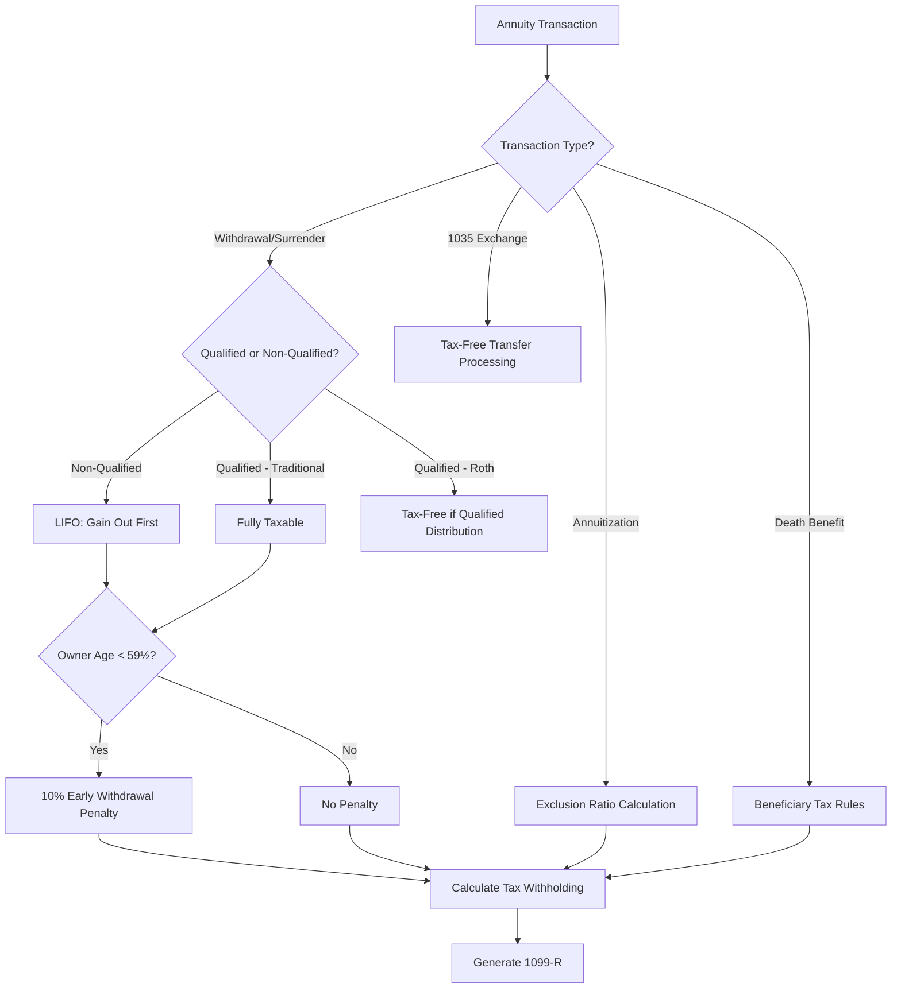
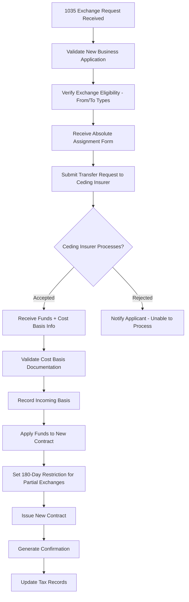
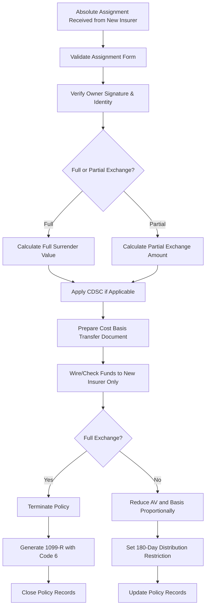
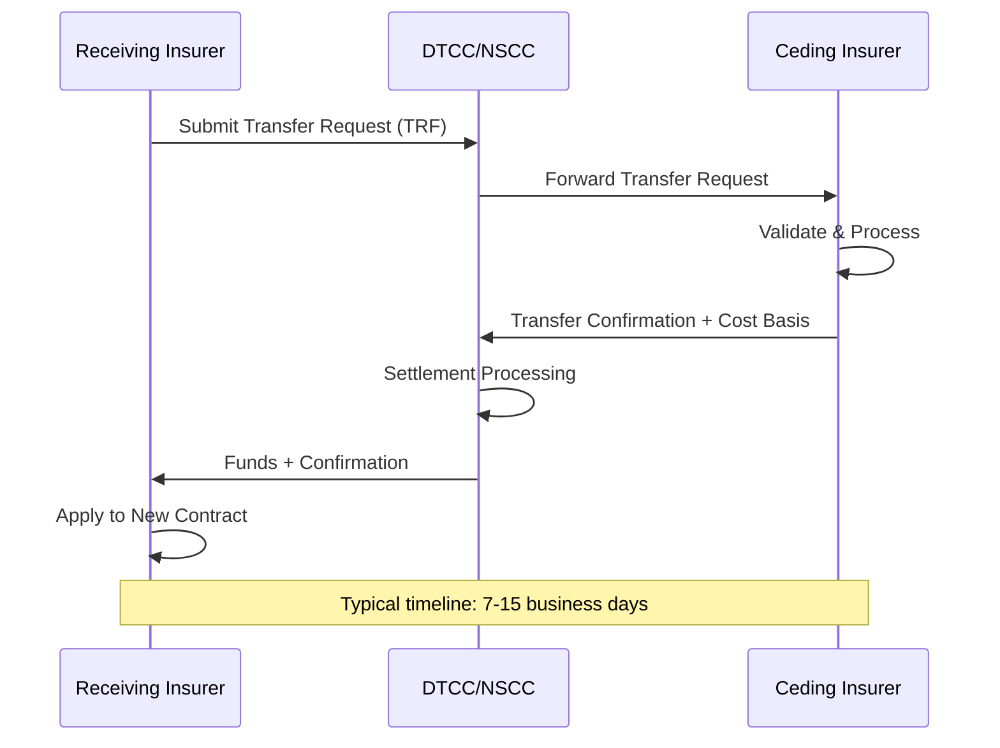
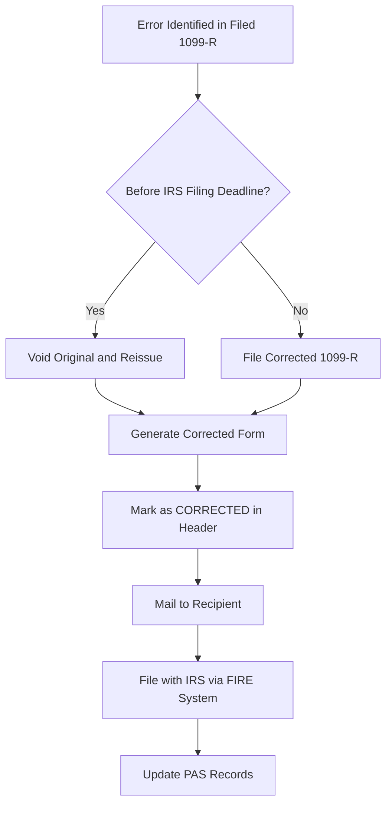
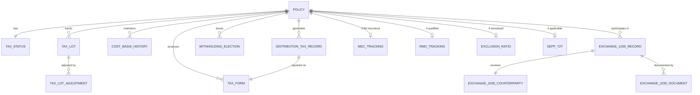
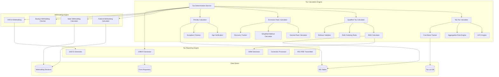
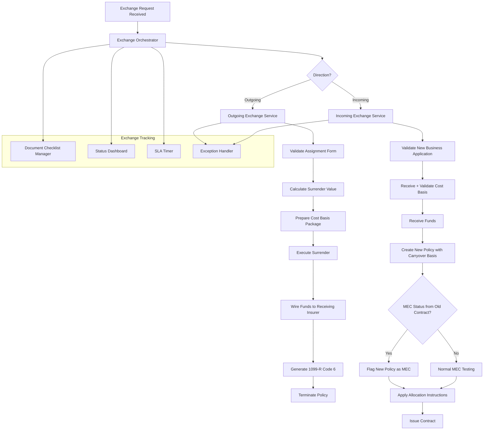

# Article 07: Annuity Tax Treatment & 1035 Exchanges

## Table of Contents

1. [Introduction](#1-introduction)
2. [Non-Qualified Annuity Taxation](#2-non-qualified-annuity-taxation)
3. [Qualified Annuity Taxation](#3-qualified-annuity-taxation)
4. [Exclusion Ratio](#4-exclusion-ratio)
5. [1035 Exchanges](#5-1035-exchanges)
6. [Processing 1035 Exchanges in PAS](#6-processing-1035-exchanges-in-pas)
7. [Modified Endowment Contract (MEC) Rules](#7-modified-endowment-contract-mec-rules)
8. [Tax Reporting](#8-tax-reporting)
9. [Withholding Rules](#9-withholding-rules)
10. [Estate and Gift Tax Considerations](#10-estate-and-gift-tax-considerations)
11. [Data Model for Tax Lot Tracking & Cost Basis](#11-data-model-for-tax-lot-tracking--cost-basis)
12. [ACORD Transaction Types for 1035 Exchanges](#12-acord-transaction-types-for-1035-exchanges)
13. [Sample Payloads for Tax Reporting](#13-sample-payloads-for-tax-reporting)
14. [Architecture for Tax Calculation Engine & 1035 Exchange Orchestration](#14-architecture-for-tax-calculation-engine--1035-exchange-orchestration)

---

## 1. Introduction

Annuity taxation is among the most complex areas of the U.S. tax code as it applies to insurance products. The tax treatment varies dramatically based on:

- **Qualification status:** Non-qualified (after-tax dollars) vs. qualified (pre-tax IRA/401(k) dollars)
- **Transaction type:** Withdrawal, surrender, annuitization, death benefit, 1035 exchange
- **Contract type:** Deferred vs. immediate, fixed vs. variable
- **Owner/annuitant relationship:** Natural person vs. non-natural person, owner vs. annuitant
- **MEC status:** Whether the contract is a Modified Endowment Contract
- **Age of owner/annuitant:** Before vs. after age 59½
- **Applicable regulations:** IRC Section 72, Section 1035, SECURE Act, SECURE 2.0

A Policy Administration System must accurately track cost basis, calculate taxable amounts, apply correct withholding, generate tax forms, and orchestrate 1035 exchanges — all while maintaining a complete audit trail.

This article provides the definitive technical reference for implementing annuity tax processing in a PAS.

### 1.1 Tax Processing Overview



### 1.2 Key IRC Sections

| IRC Section | Topic | Relevance |
|---|---|---|
| §72 | Annuities; certain proceeds of endowment and life insurance contracts | Primary taxation section for all annuity distributions |
| §72(e) | Amounts not received as annuities | Withdrawal/surrender taxation (LIFO for NQ) |
| §72(q) | 10% penalty on premature distributions | Early withdrawal penalty rules |
| §72(s) | Required distributions | Death distribution requirements for NQ annuities |
| §72(t) | 10% penalty exceptions for qualified plans | SEPP and other penalty exceptions |
| §72(u) | Non-natural person ownership | No tax deferral for non-natural owners |
| §1035 | Certain exchanges of insurance policies | Tax-free exchange provisions |
| §408 | Individual Retirement Accounts | IRA rules |
| §408A | Roth IRAs | Roth IRA specific rules |
| §401(a)(9) | Required Minimum Distributions | RMD rules for qualified plans |
| §7702A | Modified Endowment Contract | MEC definition and rules |

---

## 2. Non-Qualified Annuity Taxation

### 2.1 LIFO Rule for Withdrawals (IRC §72(e))

For non-qualified annuity contracts, withdrawals are taxed on a **Last-In, First-Out (LIFO)** basis. This means earnings (gain) come out first and are fully taxable. Only after all gain has been withdrawn does the return of premium (cost basis) begin.

**Fundamental Formula:**

```
Investment in the Contract = Total Premiums Paid - Any Previously Returned Basis
Gain in the Contract = Account Value - Investment in the Contract

For any withdrawal:
    IF Gain > 0 THEN
        Taxable Amount = MIN(Withdrawal, Gain)
        Non-Taxable Amount = Withdrawal - Taxable Amount
    ELSE
        Taxable Amount = 0
        Non-Taxable Amount = Withdrawal
```

### 2.2 Cost Basis (Investment in the Contract) Tracking

**PAS must track:**

```json
{
  "costBasis": {
    "policyId": "POL-2024-VA-001234",
    "qualifiedStatus": "NON_QUALIFIED",
    "components": {
      "totalPremiumsPaid": 200000.00,
      "premiumBonuses": 8000.00,
      "dividendsReinvested": 0.00,
      "returnOfPremiumReceived": 0.00,
      "priorExclusionAmounts": 0.00,
      "premiumTaxesPaid": 4700.00,
      "prior1035BasisCarryover": 0.00
    },
    "investmentInContract": 204700.00,
    "currentAccountValue": 280000.00,
    "currentGain": 75300.00,
    "bonusBasisTreatment": "INCLUDED_IN_BASIS"
  }
}
```

**Important Cost Basis Nuances:**

| Item | Treatment | Notes |
|---|---|---|
| Premiums paid | Included in basis | Dollar-for-dollar |
| Premium bonuses | May or may not be in basis | Depends on product/IRS guidance; most exclude |
| Premium taxes | Included in basis | State premium taxes paid are part of basis |
| 1035 carryover basis | Included | Basis from exchanged contract carries forward |
| CDSC (surrender charge) | NOT in basis | Does not increase basis; reduces distribution |
| Dividends used to reduce premiums | Reduces basis | Not common in annuities |
| Return of premium distributions | Reduces basis | After all gain distributed (LIFO) |

### 2.3 Gain Calculation

```python
def calculate_nq_gain(policy):
    investment_in_contract = (
        policy.total_premiums_paid
        + policy.premium_taxes_paid
        + policy.prior_1035_basis_carryover
        - policy.return_of_premium_received
        - policy.prior_exclusion_amounts
    )
    
    # Note: Premium bonuses are generally NOT included in basis
    # unless specific IRS guidance applies
    
    gain = policy.account_value - investment_in_contract
    return max(gain, 0), investment_in_contract
```

### 2.4 LIFO Withdrawal Example

**Setup:**
- Total premiums paid: $200,000
- Premium taxes paid: $4,700
- Investment in contract: $204,700
- Current account value: $280,000
- Current gain: $75,300

**Withdrawal of $50,000:**

```
Step 1: Determine gain in contract
    Gain = $280,000 - $204,700 = $75,300

Step 2: Apply LIFO
    Taxable portion = MIN($50,000, $75,300) = $50,000
    Non-taxable portion = $50,000 - $50,000 = $0

Step 3: Result
    Entire $50,000 withdrawal is taxable as ordinary income
    
Step 4: Update tracking
    New AV: $230,000
    New gain: $230,000 - $204,700 = $25,300
    Investment in contract: $204,700 (unchanged — no basis returned)
```

**Subsequent withdrawal of $40,000:**

```
Step 1: Remaining gain = $25,300
Step 2: Taxable = MIN($40,000, $25,300) = $25,300
         Non-taxable = $40,000 - $25,300 = $14,700 (return of premium)
Step 3: Update
    New AV: $190,000
    Investment in contract: $204,700 - $14,700 = $190,000
    Gain: $190,000 - $190,000 = $0
```

### 2.5 10% Early Withdrawal Penalty (IRC §72(q))

A 10% additional tax applies to the taxable portion of distributions taken before the owner reaches age 59½.

```
Penalty = Taxable_Amount × 10%
Total Tax Impact = Taxable_Amount × MarginalTaxRate + Taxable_Amount × 10%
```

### 2.6 Exceptions to the 10% Penalty

| Exception | IRC Citation | Description |
|---|---|---|
| Age 59½ or older | §72(q)(2)(A) | Standard age threshold |
| Death of owner | §72(q)(2)(B) | Distributions to beneficiary |
| Disability | §72(q)(2)(C) | Total and permanent disability |
| Substantially equal periodic payments | §72(q)(2)(D) | SEPP / 72(t) distributions |
| Immediate annuity (SPIA) | §72(q)(2)(E) | Purchased with single premium, payments begin within 1 year |
| Qualified plan distributions | Various | See qualified section |

**PAS Penalty Tracking:**

```python
def calculate_penalty(policy, withdrawal_amount, taxable_amount):
    owner_age = calculate_age(policy.owner_dob, current_date)
    
    if owner_age >= 59.5:
        return 0.00
    
    # Check exceptions
    if policy.owner_deceased:
        return 0.00
    if policy.owner_disabled:
        return 0.00
    if policy.has_active_sepp_72t:
        return 0.00
    if policy.product_type == 'SPIA' and within_one_year_of_issue(policy):
        return 0.00
    
    penalty = taxable_amount * 0.10
    return round(penalty, 2)
```

### 2.7 Aggregation Rule

**IRC §72(e)(12):** All annuity contracts issued by the same company to the same policyholder during any calendar year are treated as one annuity contract for purposes of determining the taxable portion of distributions.

**PAS Implementation:**

```python
def apply_aggregation_rule(policy, withdrawal_amount):
    """Check if aggregation rule applies and calculate across aggregated contracts."""
    if policy.qualified_status != 'NON_QUALIFIED':
        return standard_lifo_calculation(policy, withdrawal_amount)
    
    # Find all NQ annuity contracts issued same year by same company to same owner
    aggregated_policies = find_aggregated_contracts(
        owner_id=policy.owner_id,
        insurer_code=policy.insurer_code,
        issue_year=policy.issue_date.year,
        qualified_status='NON_QUALIFIED'
    )
    
    if len(aggregated_policies) <= 1:
        return standard_lifo_calculation(policy, withdrawal_amount)
    
    # Aggregate investment and value across all contracts
    total_investment = sum(p.investment_in_contract for p in aggregated_policies)
    total_av = sum(p.account_value for p in aggregated_policies)
    total_gain = total_av - total_investment
    
    taxable = min(withdrawal_amount, max(total_gain, 0))
    nontaxable = withdrawal_amount - taxable
    
    return taxable, nontaxable
```

---

## 3. Qualified Annuity Taxation

### 3.1 Traditional IRA Annuity Rules

All distributions from Traditional IRA annuities are **fully taxable as ordinary income** (assuming all contributions were deductible). No cost basis exists unless non-deductible contributions were made.

```
Taxable Amount = Gross Distribution (if all contributions deductible)

IF non-deductible contributions exist:
    Taxable = Distribution × (1 - Basis Ratio)
    Basis Ratio = Total Non-Deductible Contributions / Total IRA Value (ALL IRAs)
```

**Form 8606 Tracking:** IRA owners who made non-deductible contributions must file Form 8606 to track basis. The PAS may need to reference this information.

### 3.2 Roth IRA Annuity Rules

**Qualified distributions** from Roth IRAs are completely tax-free:
- Owner is age 59½ or older
- 5-year holding period has been met (from first Roth contribution)
- Due to death, disability, or first-time home purchase ($10K lifetime max)

**Non-qualified distributions** follow an ordering rule:
1. First: Regular contributions (tax-free)
2. Second: Conversion amounts (tax-free, but 10% penalty if < 5 years since conversion)
3. Third: Earnings (taxable + potential 10% penalty)

### 3.3 401(k)/403(b) Rollover Rules

When a qualified plan balance is rolled into an IRA annuity:

| Source | Tax Treatment in Annuity |
|---|---|
| Pre-tax 401(k) → Traditional IRA annuity | Fully taxable on distribution |
| Roth 401(k) → Roth IRA annuity | Tax-free if qualified |
| After-tax 401(k) → IRA annuity | After-tax portion is basis |
| Employer match → Traditional IRA | Fully taxable (was never taxed) |

**Rollover Processing in PAS:**

```json
{
  "rollover": {
    "sourceType": "401K_PRETAX",
    "sourceInstitution": "Fidelity Investments",
    "sourcePlanName": "ABC Corp 401(k) Plan",
    "rolloverType": "DIRECT_ROLLOVER",
    "rolloverAmount": 350000.00,
    "pretaxAmount": 320000.00,
    "afterTaxAmount": 30000.00,
    "costBasisCarryover": 30000.00,
    "rolloverDate": "2024-06-15",
    "directRollover": true,
    "sixtyDayDeadline": null
  }
}
```

### 3.4 Required Minimum Distributions (RMD)

#### 3.4.1 RMD Calculation

```
RMD = Prior Year-End Account Value / Applicable Distribution Period
```

**Applicable Tables:**

| Table | When Used |
|---|---|
| Uniform Lifetime | Owner during lifetime (spouse < 10 years younger, or non-spouse beneficiary) |
| Joint Life and Last Survivor | Owner during lifetime when sole beneficiary is spouse > 10 years younger |
| Single Life | Beneficiary after owner's death |

**Uniform Lifetime Table (SECURE 2.0 Updated, Select Values):**

| Age | Distribution Period |
|---|---|
| 73 | 26.5 |
| 74 | 25.5 |
| 75 | 24.6 |
| 76 | 23.7 |
| 77 | 22.9 |
| 78 | 22.0 |
| 79 | 21.1 |
| 80 | 20.2 |
| 81 | 19.4 |
| 82 | 18.5 |
| 83 | 17.7 |
| 84 | 16.8 |
| 85 | 16.0 |
| 90 | 12.2 |
| 95 | 8.9 |
| 100 | 6.4 |

#### 3.4.2 RMD Timing

| Scenario | RMD Deadline |
|---|---|
| First RMD | April 1 of year following the year owner reaches RMD age |
| Subsequent RMDs | December 31 of each year |
| Year of death RMD | Must still be taken for year of death |
| Inherited IRA | Depends on beneficiary type (see SECURE Act) |

#### 3.4.3 RMD Penalty

Failure to take the full RMD results in a **25% excise tax** on the shortfall (reduced from 50% by SECURE 2.0). If corrected within 2 years, reduced to **10%**.

```
RMD_Penalty = (RequiredRMD - ActualDistributed) × 25%  // or 10% if corrected
```

#### 3.4.4 RMD Aggregation Rules

For IRAs, the RMD is calculated separately for each IRA, but the total may be taken from **any one or combination of IRAs**. However, 403(b) RMDs must be taken from 403(b) accounts, and 401(k) RMDs from each specific 401(k).

**PAS RMD Processing:**

```python
def calculate_and_track_rmd(policy, tax_year):
    if not policy.is_qualified:
        return None
    
    owner_age = calculate_age(policy.owner_dob, date(tax_year, 12, 31))
    rmd_start_age = get_rmd_start_age(policy.owner_dob)
    
    if owner_age < rmd_start_age:
        return RMDResult(required=False)
    
    # Get prior year end AV
    prior_year_av = get_year_end_av(policy, tax_year - 1)
    
    # Determine applicable table
    if is_sole_spouse_beneficiary(policy) and spouse_age_gap(policy) > 10:
        distribution_period = joint_life_table(owner_age, get_spouse_age(policy, tax_year))
    else:
        distribution_period = uniform_lifetime_table(owner_age)
    
    rmd_amount = prior_year_av / distribution_period
    
    # Determine deadline
    if is_first_rmd_year(policy, tax_year):
        deadline = date(tax_year + 1, 4, 1)  # April 1 of following year
    else:
        deadline = date(tax_year, 12, 31)
    
    # Track against distributions
    ytd_distributions = get_ytd_qualified_distributions(policy, tax_year)
    shortfall = max(0, rmd_amount - ytd_distributions)
    
    return RMDResult(
        required=True,
        rmd_amount=round(rmd_amount, 2),
        deadline=deadline,
        prior_year_av=prior_year_av,
        distribution_period=distribution_period,
        distributed_ytd=ytd_distributions,
        shortfall=shortfall,
        satisfied=(shortfall == 0)
    )
```

### 3.5 SECURE Act Provisions

#### 3.5.1 10-Year Rule (SECURE Act 2019)

For deaths after 12/31/2019, most non-spouse beneficiaries must fully distribute the inherited account within 10 years of the owner's death.

**Designated Beneficiary Categories:**

| Category | Distribution Rule |
|---|---|
| Eligible Designated Beneficiary (EDB) | Stretch (life expectancy) still available |
| — Surviving spouse | Stretch or 10-year rule; can roll to own IRA |
| — Minor child of owner | Stretch until age of majority, then 10-year |
| — Disabled individual | Stretch |
| — Chronically ill individual | Stretch |
| — Not more than 10 years younger | Stretch |
| Designated Beneficiary (non-EDB) | 10-year rule (full distribution by 12/31 of 10th year) |
| Non-designated beneficiary (estate, charity) | 5-year rule (if death before RBD) or ghost life (if after RBD) |

#### 3.5.2 SECURE 2.0 (2022) Provisions

| Provision | Change | Effective |
|---|---|---|
| RMD age increase | 73 (2023), 75 (2033) | Phased |
| RMD penalty reduction | 50% → 25% (10% if corrected) | 2023 |
| Roth 401(k) RMD elimination | No RMDs for Roth 401(k) | 2024 |
| Roth SIMPLE/SEP | Roth option for SIMPLE/SEP | 2023 |

### 3.6 Roth Conversion Mechanics

Converting a Traditional IRA annuity to a Roth IRA annuity:

```
Conversion Amount = Account Value at Time of Conversion
Taxable Amount = Conversion Amount - Non-Deductible Basis (if any)
No 10% Penalty on Conversion (regardless of age)

5-Year Clock: Each conversion starts a separate 5-year clock for penalty-free access
```

**PAS Processing:**

```json
{
  "rothConversion": {
    "policyId": "POL-2024-TIRA-001234",
    "conversionDate": "2024-06-15",
    "conversionAmount": 50000.00,
    "taxablePortion": 47000.00,
    "basisPortion": 3000.00,
    "newRothPolicyId": "POL-2024-RIRA-005678",
    "fiveYearClockStart": "2024-01-01",
    "reportedOn1099R": true,
    "distributionCode": "2",
    "taxableAmountDetermined": true
  }
}
```

---

## 4. Exclusion Ratio

### 4.1 Overview

When a non-qualified annuity is annuitized (converted to a stream of periodic payments), each payment is split into taxable and tax-free portions using the **exclusion ratio**. This is fundamentally different from the LIFO rule that applies to non-annuitized withdrawals.

### 4.2 Exclusion Ratio Calculation

```
Exclusion Ratio = Investment in the Contract / Expected Return

Tax-Free Portion of Each Payment = Payment × Exclusion Ratio
Taxable Portion of Each Payment = Payment × (1 - Exclusion Ratio)
```

### 4.3 Expected Return Calculation

**For Life-Contingent Payments (General Rule):**

```
Expected Return = Annual Payment × Life Expectancy Multiple

Life Expectancy Multiple is from IRS Table V (Single Life) or Table VI (Joint)
```

**IRS Table V — Ordinary Life Annuities (Select Values):**

| Age at Annuitization | Expected Return Multiple |
|---|---|
| 55 | 28.6 |
| 60 | 24.2 |
| 65 | 20.0 |
| 70 | 16.0 |
| 75 | 12.5 |
| 80 | 9.5 |
| 85 | 6.9 |
| 90 | 5.0 |

### 4.4 Exclusion Ratio — Worked Example

**Setup:**
- Non-qualified annuity
- Investment in Contract: $200,000
- Annuitization Amount: $280,000 (AV)
- Settlement Option: Life with 10-year Certain
- Annuitant: Male, age 65
- Monthly Payment: $1,800
- Annual Payment: $21,600

**Calculation (General Rule):**

```
Step 1: Expected Return
    Annual Payment × Life Expectancy Multiple
    = $21,600 × 20.0 (age 65)
    = $432,000

Step 2: Exclusion Ratio
    = Investment / Expected Return
    = $200,000 / $432,000
    = 46.30%

Step 3: Tax-Free Portion per Payment
    = $1,800 × 46.30%
    = $833.40

Step 4: Taxable Portion per Payment
    = $1,800 - $833.40
    = $966.60
```

### 4.5 Simplified Method (For Qualified Plans)

For annuity starting dates after November 18, 1996, qualified plan annuities use the **Simplified Method**:

```
Tax-Free Monthly Amount = Investment in Contract / Number of Expected Payments

Expected Payments (Simplified):
    Age 55 or under: 360
    Age 56-60: 310
    Age 61-65: 260
    Age 66-70: 210
    Age 71 and over: 160
```

**Simplified Method Example:**

```
Investment in Contract: $50,000 (after-tax contributions to 401(k))
Monthly Payment: $3,000
Annuitant Age: 67

Expected Payments = 210

Tax-Free Monthly = $50,000 / 210 = $238.10
Taxable Monthly = $3,000 - $238.10 = $2,761.90

After 210 payments, all basis recovered — subsequent payments fully taxable.
```

### 4.6 Adjustment After Recovery of Investment

Once the total tax-free amounts received equal the investment in the contract, **all subsequent payments become fully taxable**.

```python
def calculate_exclusion(payout_annuity, payment_amount):
    if payout_annuity.investment_recovered:
        return 0.00, payment_amount  # Fully taxable
    
    exclusion_amount = payment_amount * payout_annuity.exclusion_ratio
    
    # Check if this payment completes the recovery
    new_total_excluded = payout_annuity.total_excluded_to_date + exclusion_amount
    
    if new_total_excluded >= payout_annuity.investment_in_contract:
        # Partial exclusion for final recovery payment
        remaining_basis = payout_annuity.investment_in_contract - payout_annuity.total_excluded_to_date
        exclusion_amount = remaining_basis
        payout_annuity.investment_recovered = True
        payout_annuity.recovery_date = current_date
    
    taxable_amount = payment_amount - exclusion_amount
    payout_annuity.total_excluded_to_date += exclusion_amount
    
    return exclusion_amount, taxable_amount
```

### 4.7 Death Before Full Recovery

If the annuitant dies before recovering the full investment, the unrecovered amount is allowed as a deduction on the annuitant's final tax return.

```
Unrecovered Investment = Investment in Contract - Total Excluded Amounts
Deduction = Unrecovered Investment (reported on Schedule A or as adjustment)
```

---

## 5. 1035 Exchanges

### 5.1 Section 1035 Overview

IRC Section 1035 allows certain exchanges of insurance products on a tax-free basis. The rationale is that the taxpayer is merely changing the form of their investment, not realizing a gain.

### 5.2 Eligible Exchange Types

| From | To | Eligible? | Notes |
|---|---|---|---|
| Life Insurance | Life Insurance | ✅ | Like-kind within life |
| Life Insurance | Annuity | ✅ | Life can go to annuity |
| Life Insurance | Long-Term Care | ✅ | Per Pension Protection Act 2006 |
| Annuity | Annuity | ✅ | Most common 1035 exchange |
| Annuity | Long-Term Care | ✅ | Per Pension Protection Act 2006 |
| Annuity | Life Insurance | ❌ | Not permitted |
| LTC | LTC | ✅ | Like-kind within LTC |
| LTC | Life Insurance | ❌ | Not permitted |
| LTC | Annuity | ❌ | Not permitted |

### 5.3 Partial 1035 Exchanges

Revenue Procedure 2008-24 (later modified by Rev. Proc. 2011-38) established rules for partial 1035 exchanges:

**Key Requirements:**
- The original contract is partially exchanged into a new contract.
- No distribution may be taken from either the old or new contract within 180 days of the exchange (without causing the exchange to be treated as a taxable event).
- The basis is allocated proportionally between the remaining old contract and the new contract.

**Partial Exchange Basis Allocation:**

```
ExchangeRatio = ExchangeAmount / TotalAVBeforeExchange
BasisToNewContract = TotalBasis × ExchangeRatio
BasisRemainingInOldContract = TotalBasis × (1 - ExchangeRatio)
```

**Example:**

```
Old Contract:
    Account Value: $300,000
    Cost Basis: $200,000
    Gain: $100,000

Partial 1035 Exchange: $150,000 (50% of AV)

ExchangeRatio = $150,000 / $300,000 = 50%
Basis to New Contract = $200,000 × 50% = $100,000
Basis Remaining in Old = $200,000 × 50% = $100,000

Old Contract After Exchange:
    AV: $150,000
    Basis: $100,000
    Gain: $50,000

New Contract:
    AV: $150,000
    Basis: $100,000 (carried over)
    Gain: $50,000
```

### 5.4 Direct Transfer Requirement

The funds must transfer directly from the old insurer to the new insurer. The contract owner must never have constructive receipt of the funds. This is an **absolute requirement** — any check made payable to the owner voids the 1035 treatment.

### 5.5 Assignment/Transfer Forms

The 1035 exchange is accomplished through an **absolute assignment** — the owner assigns all rights in the existing contract to the new insurer.

### 5.6 Cost Basis Carryover

The cost basis from the old contract carries forward to the new contract:

```
New Contract Basis = Old Contract Basis (full exchange)
                   OR
                   Old Contract Basis × ExchangeRatio (partial exchange)
```

**Critical:** Any gain in the old contract is NOT recognized at the time of exchange. It is deferred until distributions are taken from the new contract.

### 5.7 Surrender Charge Considerations

- The old contract's surrender charges still apply to the funds being exchanged out.
- The new contract typically starts a new surrender charge schedule on the transferred amount.
- The contract holder may be subject to surrender charges from BOTH contracts during the overlap period.

### 5.8 Replacement Regulations

Most states require completion of a **replacement form** for 1035 exchanges to ensure suitability:

| Regulation | Requirement |
|---|---|
| NAIC Model Regulation 613 | Replacement form, comparison of old vs. new contract |
| New York Regulation 60 | Enhanced replacement requirements |
| State suitability requirements | Agent must document suitability of exchange |
| FINRA Rule 2330 | Variable annuity suitability (for broker-dealer) |

---

## 6. Processing 1035 Exchanges in PAS

### 6.1 Incoming 1035 Exchange Workflow



### 6.2 Outgoing 1035 Exchange Workflow



### 6.3 Absolute Assignment Processing

```json
{
  "absoluteAssignment": {
    "assignmentId": "ASN-2024-001234",
    "assignmentDate": "2024-06-15",
    "cedingInsurer": {
      "name": "Old Life Insurance Company",
      "naicCode": "12345",
      "policyNumber": "OLD-POL-789012"
    },
    "receivingInsurer": {
      "name": "New Life Insurance Company",
      "naicCode": "67890",
      "newPolicyNumber": "NEW-POL-345678"
    },
    "owner": {
      "name": "John Smith",
      "ssn": "XXX-XX-1234",
      "signatureDate": "2024-06-10"
    },
    "exchangeType": "FULL_1035",
    "transferAmount": 280000.00,
    "costBasisTransferred": 200000.00,
    "gainDeferred": 80000.00,
    "surrenderChargeApplied": 5600.00,
    "netTransferAmount": 274400.00,
    "mecStatus": false,
    "qualifiedStatus": "NON_QUALIFIED"
  }
}
```

### 6.4 DTCC/NSCC Automated Exchange Processing

For large-scale automated processing, insurers use the DTCC (Depository Trust & Clearing Corporation) NSCC (National Securities Clearing Corporation) automated platforms:

**ACATS (Automated Customer Account Transfer System)** — for variable annuity transfers between broker-dealers.

**Insurance Processing:**



### 6.5 Cost Basis Transfer Documentation

The ceding insurer must provide to the receiving insurer:

```json
{
  "costBasisTransfer": {
    "originalIssueDate": "2015-03-20",
    "originalPremiums": [
      {"date": "2015-03-20", "amount": 150000.00, "type": "INITIAL"},
      {"date": "2016-06-15", "amount": 50000.00, "type": "ADDITIONAL"}
    ],
    "totalPremiums": 200000.00,
    "premiumTaxesPaid": 4700.00,
    "previousExchangeBasis": 0.00,
    "dividendsApplied": 0.00,
    "totalCostBasis": 204700.00,
    "accountValueAtExchange": 280000.00,
    "gainDeferred": 75300.00,
    "mecStatus": false,
    "mecSevenPayPremiums": null,
    "priorExchanges": [],
    "qualifiedStatus": "NON_QUALIFIED",
    "issueState": "CA"
  }
}
```

### 6.6 Tax Lot Tracking

For policies with multiple premiums at different times, the PAS should maintain tax lot records:

```json
{
  "taxLots": [
    {
      "lotId": "LOT-001",
      "premiumDate": "2015-03-20",
      "premiumAmount": 150000.00,
      "premiumTax": 3525.00,
      "basisAmount": 153525.00,
      "percentOfTotal": 75.0
    },
    {
      "lotId": "LOT-002",
      "premiumDate": "2016-06-15",
      "premiumAmount": 50000.00,
      "premiumTax": 1175.00,
      "basisAmount": 51175.00,
      "percentOfTotal": 25.0
    }
  ],
  "totalBasis": 204700.00
}
```

---

## 7. Modified Endowment Contract (MEC) Rules

### 7.1 Overview

A Modified Endowment Contract (MEC) is a life insurance contract that fails the 7-pay test under IRC §7702A. While primarily a life insurance concept, MEC status has important implications when life insurance contracts are exchanged into annuities, and the rules closely parallel annuity taxation.

### 7.2 The 7-Pay Test

```
A contract fails the 7-pay test if cumulative premiums paid at any time during 
the first 7 contract years exceed the sum of net level premiums that would be 
paid over the same period to provide paid-up future benefits at age 95.
```

**7-Pay Premium Calculation:**

```
7-Pay Limit = Net Level Premium for a 7-pay whole life policy
            providing the same death benefit

IF Cumulative Premiums at any point ≤ 7-Pay Limit × Years Elapsed THEN
    Not a MEC
ELSE
    MEC — retroactive to the date the test was first failed
```

### 7.3 Material Change Rules

A "material change" to a life insurance contract (e.g., increasing the death benefit, adding a rider) restarts the 7-pay test with a new 7-pay premium limit based on the new benefits.

**Material Changes Include:**
- Increase in death benefit
- Increase in qualified additional benefits
- Exchange under Section 1035
- Addition of riders that increase benefits

**NOT Material Changes:**
- Cost-of-living increases per contract terms
- Policyholder dividend additions
- Premium adjustments due to experience rating changes

### 7.4 MEC Status Tracking in PAS

```json
{
  "mecTracking": {
    "policyId": "POL-2024-LI-001234",
    "isMEC": false,
    "sevenPayTestStatus": "PASSING",
    "sevenPayLimit": 15000.00,
    "sevenPayTestStartDate": "2024-01-15",
    "sevenPayTestEndDate": "2031-01-15",
    "cumulativePremiums": [
      {"year": 1, "premiumPaid": 10000.00, "cumulativeLimit": 15000.00, "status": "PASS"},
      {"year": 2, "premiumPaid": 8000.00, "cumulativeTotal": 18000.00, "cumulativeLimit": 30000.00, "status": "PASS"},
      {"year": 3, "premiumPaid": 12000.00, "cumulativeTotal": 30000.00, "cumulativeLimit": 45000.00, "status": "PASS"}
    ],
    "materialChanges": [],
    "reductionInPaidUpAdditions": false
  }
}
```

### 7.5 LIFO Taxation Impact for MECs

A MEC is taxed similarly to an annuity — LIFO rule applies to all distributions:

```
For MEC distributions:
    Taxable Amount = MIN(Distribution, Gain in Contract)
    + 10% penalty if owner < 59½ (same exceptions as annuities under §72(q))
```

This applies to:
- Withdrawals / partial surrenders
- Policy loans (treated as distributions!)
- Pledging the contract as collateral

### 7.6 10% Penalty on MEC Distributions

The 10% additional tax under IRC §72(v) applies to the taxable portion of any MEC distribution if the owner is under 59½. The same exceptions as §72(q) for annuities apply.

### 7.7 Reduction in Paid-Up Additions Testing

A reduction in the death benefit or paid-up additions during the 7-pay period is tested as if the contract were newly issued with the reduced benefits, using the reduced 7-pay premium.

### 7.8 Exchange of MEC Preserves MEC Status

**Critical Rule:** If a MEC is exchanged under Section 1035 for a new contract, the new contract is automatically classified as a MEC, regardless of whether it would have passed the 7-pay test on its own.

```python
def check_mec_status_on_1035(incoming_exchange):
    if incoming_exchange.source_is_mec:
        # New contract is automatically a MEC
        new_policy.is_mec = True
        new_policy.mec_effective_date = incoming_exchange.exchange_date
        new_policy.mec_reason = '1035_EXCHANGE_FROM_MEC'
        return True
    
    # If source was not a MEC, perform normal 7-pay test
    return perform_seven_pay_test(new_policy)
```

---

## 8. Tax Reporting

### 8.1 1099-R Generation

Form 1099-R is filed for every distribution from an annuity contract exceeding $10 in a calendar year.

**Key 1099-R Fields:**

| Box | Field | Description |
|---|---|---|
| 1 | Gross Distribution | Total amount distributed |
| 2a | Taxable Amount | Taxable portion (may be blank if unknown) |
| 2b | Taxable Amount Not Determined | Check if insurer cannot determine taxable amount |
| 2b | Total Distribution | Check if total distribution of contract |
| 3 | Capital Gain | Generally N/A for annuities |
| 4 | Federal Tax Withheld | Amount of federal tax withheld |
| 5 | Employee Contributions | Investment in the contract (cost basis) |
| 7 | Distribution Code(s) | One or two-character code(s) |
| 8 | Other | Percentage of total distribution |
| 9a | Percentage of Total Distribution | For 1035 or split distributions |
| 9b | Total Employee Contributions | Aggregate employee contributions |
| 10 | Amount Allocable to IRR | Within 5 years |
| 12 | State Tax Withheld | State withholding |
| 13 | State/Payer's State No. | State and payer ID |
| 14 | State Distribution | Amount for state reporting |

### 8.2 Distribution Codes (Box 7)

| Code | Meaning | Common Use |
|---|---|---|
| 1 | Early distribution, no known exception | NQ withdrawal before 59½ |
| 2 | Early distribution, exception applies | 72(t), disability, etc. |
| 3 | Disability | Total and permanent disability |
| 4 | Death | Distribution to beneficiary |
| 5 | Prohibited transaction | Rare |
| 6 | Section 1035 exchange | Tax-free exchange |
| 7 | Normal distribution | Age 59½ or older |
| 8 | Excess contributions + earnings/Excess deferrals | Corrective distribution |
| A | May be eligible for 10-year tax option | Rare |
| B | Roth designated account | Roth 401(k)/403(b) |
| D | Annuity payments from NQ annuity | Annuitized payments |
| G | Direct rollover to qualified plan | Direct rollover |
| H | Direct rollover to Roth IRA | Roth conversion via rollover |
| J | Early distribution from Roth IRA | Before 59½ |
| Q | Qualified distribution from Roth IRA | Tax-free Roth |
| T | Roth IRA, exception applies | Roth with exception |

### 8.3 1099-R Generation Logic

```python
def generate_1099r(policy, tax_year):
    distributions = get_annual_distributions(policy, tax_year)
    
    if not distributions or sum(d.gross_amount for d in distributions) < 10.00:
        return None  # No 1099-R required
    
    gross_distribution = sum(d.gross_amount for d in distributions)
    federal_withheld = sum(d.federal_withholding for d in distributions)
    state_withheld = sum(d.state_withholding for d in distributions)
    
    # Determine taxable amount
    if policy.qualified_status == 'NON_QUALIFIED':
        taxable_amount = calculate_nq_taxable(policy, distributions)
        employee_contributions = policy.investment_in_contract
    elif policy.qualified_status == 'TRADITIONAL_IRA':
        taxable_amount = gross_distribution  # Fully taxable (unless non-deductible contributions)
        employee_contributions = 0
    elif policy.qualified_status == 'ROTH_IRA':
        taxable_amount = calculate_roth_taxable(policy, distributions)
        employee_contributions = policy.roth_contributions
    
    # Determine distribution code
    distribution_code = determine_distribution_code(policy, distributions)
    
    form_1099r = Form1099R(
        payer_tin=policy.insurer_tin,
        payer_name=policy.insurer_name,
        recipient_tin=policy.owner_ssn,
        recipient_name=policy.owner_name,
        recipient_address=policy.owner_address,
        box1_gross_distribution=gross_distribution,
        box2a_taxable_amount=taxable_amount,
        box2b_taxable_not_determined=(taxable_amount is None),
        box2b_total_distribution=is_total_distribution(distributions),
        box4_federal_withheld=federal_withheld,
        box5_employee_contributions=employee_contributions,
        box7_distribution_code=distribution_code,
        box12_state_withheld=state_withheld,
        box13_state_code=policy.owner_state,
        box14_state_distribution=gross_distribution
    )
    
    return form_1099r

def determine_distribution_code(policy, distributions):
    """Determine the appropriate 1099-R distribution code."""
    owner_age = calculate_age(policy.owner_dob, distributions[0].date)
    
    # 1035 exchange
    if any(d.type == '1035_EXCHANGE' for d in distributions):
        return '6'
    
    # Death
    if policy.owner_deceased:
        return '4'
    
    # Disability
    if policy.owner_disabled:
        return '3'
    
    # Direct rollover
    if any(d.type == 'DIRECT_ROLLOVER' for d in distributions):
        return 'G'
    
    # Roth qualified distribution
    if policy.qualified_status == 'ROTH_IRA':
        if is_qualified_roth_distribution(policy):
            return 'Q'
        elif owner_age < 59.5:
            return 'J'
        else:
            return 'T'
    
    # NQ annuity payments (annuitized)
    if any(d.type == 'ANNUITY_PAYMENT' for d in distributions):
        if policy.qualified_status == 'NON_QUALIFIED':
            return 'D'
    
    # Age-based for standard distributions
    if owner_age >= 59.5:
        return '7'  # Normal distribution
    
    # Early distribution
    if has_penalty_exception(policy, distributions):
        return '2'  # Exception applies
    
    return '1'  # Early, no exception
```

### 8.4 Other Tax Forms

#### 8.4.1 Form 5498 (IRA Contribution Information)

Filed for each IRA annuity to report contributions:

| Box | Description |
|---|---|
| 1 | IRA contributions |
| 2 | Rollover contributions |
| 3 | Roth IRA conversion amount |
| 5 | Fair market value of account (12/31) |
| 7 | IRA type (traditional, Roth, SEP, SIMPLE) |
| 10 | Roth IRA contributions |
| 11 | Required minimum distribution for next year |
| 12a | RMD date |
| 13a | Postponed/late contribution (for military, disaster) |

#### 8.4.2 Form 1099-INT

Issued for fixed annuity interest if the contract is owned by a non-natural person (corporation, trust other than grantor trust) and not tax-deferred under §72(u).

#### 8.4.3 W-4P / W-4R Processing

| Form | Use | Key Fields |
|---|---|---|
| W-4P | Periodic payments (annuitized) | Filing status, withholding amount, additional withholding |
| W-4R | Non-periodic payments | Withholding rate (0%-100%) |

### 8.5 Corrected 1099 Processing

When a 1099-R must be corrected:



**Correction Record:**

```json
{
  "correction": {
    "originalFormId": "1099R-2024-001234",
    "correctionReason": "INCORRECT_TAXABLE_AMOUNT",
    "correctionDate": "2025-02-15",
    "originalValues": {
      "box1_gross": 50000.00,
      "box2a_taxable": 50000.00,
      "box7_code": "7"
    },
    "correctedValues": {
      "box1_gross": 50000.00,
      "box2a_taxable": 35000.00,
      "box7_code": "7"
    },
    "correctionType": "CORRECTED_RETURN"
  }
}
```

### 8.6 Deadline Management

| Form | Recipient Deadline | IRS Filing Deadline |
|---|---|---|
| 1099-R | January 31 | February 28 (paper) / March 31 (electronic) |
| 5498 | May 31 | May 31 |
| 1099-INT | January 31 | February 28 / March 31 |
| Corrected 1099 | As soon as possible | As soon as possible |

---

## 9. Withholding Rules

### 9.1 Federal Withholding

#### 9.1.1 Periodic Payments (Annuitized)

Treated as wages for withholding purposes. Recipient files W-4P to specify withholding preferences. If no W-4P is filed, the default is **married filing jointly with 3 allowances** (pre-2020 form) or withholding based on the default single/zero entries under the redesigned form.

#### 9.1.2 Non-Periodic Payments (Withdrawals, Surrenders)

Default withholding: **10% of the taxable amount**. Recipient can elect a different rate (0%-100%) on Form W-4R.

#### 9.1.3 Eligible Rollover Distributions

**Mandatory 20% withholding** — cannot be waived unless the distribution is directly rolled over to another qualified plan or IRA.

```python
def calculate_federal_withholding(payment, payment_type, w4_election, is_eligible_rollover):
    if is_eligible_rollover and not payment.is_direct_rollover:
        return payment.taxable_amount * 0.20  # Mandatory 20%
    
    if payment_type == 'PERIODIC':
        # Use W-4P wage-based calculation
        if w4_election:
            return compute_wage_withholding(
                payment.taxable_amount,
                w4_election.filing_status,
                w4_election.additional_withholding,
                w4_election.withholding_allowances
            )
        else:
            # Default: single, no adjustments
            return compute_wage_withholding(payment.taxable_amount, 'SINGLE', 0, 0)
    
    elif payment_type == 'NON_PERIODIC':
        if w4_election and w4_election.elected_rate is not None:
            return payment.taxable_amount * w4_election.elected_rate
        else:
            return payment.taxable_amount * 0.10  # Default 10%
    
    return 0
```

### 9.2 State Tax Withholding

#### 9.2.1 State Withholding Categories

| Category | Rule | States |
|---|---|---|
| **Mandatory** | Must withhold; no opt-out for periodic | AR, CA, CT, DC, DE, IA, KS, MA, ME, MI, MN, MS, NC, NE, OK, OR, VT, VA, WI |
| **Voluntary** | Withhold only if requested | Most other states with income tax |
| **No Income Tax** | No withholding | AK, FL, NV, NH (interest/dividends only), SD, TN (investment income only pre-2021), TX, WA, WY |

#### 9.2.2 State-Specific Rules

| State | Withholding Rule | Special Notes |
|---|---|---|
| **California** | Mandatory; 10% of federal amount if periodic; flat rate for non-periodic | Residents AND non-residents with CA-source income |
| **New York** | Voluntary; can elect withholding | State supplemental rate applies |
| **Connecticut** | Mandatory; 6.99% of federal AGI attributable to distribution | Complex calculation |
| **Michigan** | Mandatory; 4.25% flat rate | Simple flat rate |
| **Oregon** | Mandatory; 8% minimum for periodic | High rate state |
| **Iowa** | Mandatory; 5% of distribution | Flat 5% |
| **Virginia** | Mandatory for periodic; based on VA withholding tables | W-4P equivalent required |
| **Massachusetts** | Mandatory; 5% of distribution | Flat 5% |

**PAS State Withholding Engine:**

```python
class StateWithholdingEngine:
    
    def calculate_state_withholding(self, payment, state_code, state_election):
        state_rules = self.get_state_rules(state_code)
        
        if state_rules.category == 'NO_INCOME_TAX':
            return 0.00
        
        if state_rules.category == 'VOLUNTARY':
            if not state_election or not state_election.withhold:
                return 0.00
            return payment.taxable_amount * state_election.elected_rate
        
        if state_rules.category == 'MANDATORY':
            if state_rules.method == 'FLAT_RATE':
                return payment.taxable_amount * state_rules.flat_rate
            elif state_rules.method == 'PCT_OF_FEDERAL':
                return payment.federal_withholding * state_rules.federal_pct
            elif state_rules.method == 'TABLE_BASED':
                return self.table_based_withholding(
                    payment, state_code, state_election
                )
        
        return 0.00
```

### 9.3 Backup Withholding

If the recipient fails to provide a valid TIN (SSN/EIN), backup withholding at **24%** applies.

```python
def check_backup_withholding(policy, payment):
    if not policy.owner_tin_validated:
        return payment.gross_amount * 0.24  # 24% backup withholding
    if policy.owner_tin_status == 'B_NOTICE_2':
        return payment.gross_amount * 0.24  # Second B-notice, must backup withhold
    return 0
```

### 9.4 FATCA (Foreign Account Tax Compliance Act)

For non-U.S. persons receiving annuity distributions:

| Recipient Type | Default Withholding | Treaty Rate Available |
|---|---|---|
| Non-Resident Alien (NRA) | 30% | Yes, per applicable treaty |
| Foreign Entity | 30% | Depends on entity type |
| FFI (Foreign Financial Institution) | 30% unless compliant | Must have GIIN |

**PAS FATCA Requirements:**
- W-8BEN collection for NRA recipients
- Treaty rate application
- FATCA classification for entities
- Annual FATCA reporting (Form 1042-S)

---

## 10. Estate and Gift Tax Considerations

### 10.1 Annuity Valuation at Death

For estate tax purposes, an annuity is valued based on its type:

| Annuity Type | Estate Tax Value |
|---|---|
| Deferred annuity (accumulation phase) | Account value at date of death |
| Immediate annuity (payout phase) | Present value of remaining payments |
| Joint & survivor (first death) | Not included if spouse continues (marital deduction) |
| Period certain (annuitant died) | Present value of remaining certain payments |

### 10.2 Stretch Provisions (Pre-SECURE Act)

Prior to the SECURE Act, non-spouse beneficiaries could "stretch" inherited annuity distributions over their own life expectancy. This is now limited to Eligible Designated Beneficiaries.

### 10.3 Non-Spouse Beneficiary Rules

For non-qualified annuities (IRC §72(s)):

| Scenario | Distribution Requirement |
|---|---|
| Owner dies before annuity start date | Distribute within 5 years of death, OR start life expectancy payments within 1 year of death |
| Owner dies after annuity start date | Continue at least as rapidly as existing payment method |
| Surviving spouse as beneficiary | May continue contract as new owner |
| Non-spouse designated beneficiary | 5-year rule or life expectancy (pre-SECURE) / 10-year (post-SECURE for qualified) |

### 10.4 Estate Inclusion Rules

The full value of an annuity contract is included in the decedent's gross estate under IRC §2039 if the decedent had an interest in the annuity at death.

```
Estate Value of Annuity = 
    Account Value (deferred) 
    OR 
    PV of Remaining Payments × Decedent's Proportionate Interest
```

### 10.5 Gift Tax Implications

Transferring an annuity contract to another person is a taxable gift:

```
Gift Value = Account Value - Cost Basis (NOTE: IRS position may differ)
             OR
             Full Account Value (IRC §72(e)(4)(C) — assignment = recognition of gain)
```

**Important:** Under IRC §72(e)(4)(C), any assignment or transfer for less than full consideration of an annuity contract triggers immediate recognition of gain by the transferor.

---

## 11. Data Model for Tax Lot Tracking & Cost Basis

### 11.1 Entity Relationship Diagram



### 11.2 Core Entities — Detailed Schema

#### TAX_STATUS

| Column | Type | Description |
|---|---|---|
| tax_status_id | BIGINT PK | Unique identifier |
| policy_id | BIGINT FK | Parent policy |
| qualified_type | VARCHAR(20) | NON_QUALIFIED, TRADITIONAL_IRA, ROTH_IRA, SEP_IRA, SIMPLE_IRA, 403B, 457B |
| mec_status | BOOLEAN | Is this contract a MEC (life insurance only) |
| mec_effective_date | DATE | Date MEC status became effective |
| owner_type | VARCHAR(15) | NATURAL_PERSON, TRUST, CORPORATION, ESTATE |
| tax_deferral_eligible | BOOLEAN | IRC 72(u) check for non-natural owners |
| aggregation_group_id | VARCHAR(30) | For §72(e)(12) aggregation |
| roth_first_contribution_year | INT | For Roth 5-year rule |

#### TAX_LOT

| Column | Type | Description |
|---|---|---|
| tax_lot_id | BIGINT PK | Unique identifier |
| policy_id | BIGINT FK | Parent policy |
| lot_date | DATE | Date of contribution/exchange |
| lot_type | VARCHAR(20) | PREMIUM, 1035_INCOMING, ROLLOVER, CONVERSION, BONUS |
| gross_amount | DECIMAL(15,2) | Gross contribution |
| premium_tax | DECIMAL(12,2) | Premium tax (increases basis) |
| basis_amount | DECIMAL(15,2) | Amount contributing to cost basis |
| remaining_basis | DECIMAL(15,2) | Basis not yet recovered |
| source_policy_id | BIGINT | For 1035 carryover |
| qualified_year | INT | Tax year for IRA contribution limits |
| is_deductible | BOOLEAN | For traditional IRA |
| is_rollover | BOOLEAN | Rollover contribution |
| is_conversion | BOOLEAN | Roth conversion |

#### TAX_LOT_ADJUSTMENT

| Column | Type | Description |
|---|---|---|
| adjustment_id | BIGINT PK | Unique identifier |
| tax_lot_id | BIGINT FK | Associated tax lot |
| adjustment_date | DATE | Date of adjustment |
| adjustment_type | VARCHAR(20) | WITHDRAWAL, PARTIAL_1035, EXCLUSION_RECOVERY, CORRECTION |
| adjustment_amount | DECIMAL(15,2) | Amount of basis adjustment |
| remaining_basis_after | DECIMAL(15,2) | Updated remaining basis |
| transaction_id | BIGINT FK | Associated transaction |

#### DISTRIBUTION_TAX_RECORD

| Column | Type | Description |
|---|---|---|
| dist_tax_id | BIGINT PK | Unique identifier |
| policy_id | BIGINT FK | Parent policy |
| distribution_date | DATE | Date of distribution |
| distribution_type | VARCHAR(30) | WITHDRAWAL, SURRENDER, ANNUITY_PAYMENT, 1035, RMD, DEATH_BENEFIT |
| gross_amount | DECIMAL(15,2) | Total distribution |
| taxable_amount | DECIMAL(15,2) | Taxable portion |
| nontaxable_amount | DECIMAL(15,2) | Return of basis portion |
| federal_withholding | DECIMAL(12,2) | Federal tax withheld |
| state_withholding | DECIMAL(12,2) | State tax withheld |
| state_code | VARCHAR(2) | Withholding state |
| penalty_applicable | BOOLEAN | Subject to 10% penalty |
| penalty_amount | DECIMAL(12,2) | 10% penalty amount (informational) |
| distribution_code | VARCHAR(2) | 1099-R box 7 code |
| tax_year | INT | Reporting tax year |
| form_1099r_id | BIGINT FK | Associated 1099-R |

#### TAX_FORM

| Column | Type | Description |
|---|---|---|
| form_id | BIGINT PK | Unique identifier |
| policy_id | BIGINT FK | Parent policy |
| form_type | VARCHAR(10) | 1099R, 5498, 1099INT, 1042S |
| tax_year | INT | Reporting year |
| form_status | VARCHAR(15) | DRAFT, GENERATED, FILED, CORRECTED, VOID |
| generation_date | TIMESTAMP | When form was generated |
| filing_date | TIMESTAMP | When filed with IRS |
| recipient_mailed_date | DATE | When mailed to recipient |
| corrected_form_id | BIGINT FK | If this is a correction, the original |
| correction_reason | VARCHAR(100) | Reason for correction |
| form_data | JSONB | Full form field values |

#### WITHHOLDING_ELECTION

| Column | Type | Description |
|---|---|---|
| election_id | BIGINT PK | Unique identifier |
| policy_id | BIGINT FK | Parent policy |
| election_type | VARCHAR(10) | W4P, W4R, STATE |
| effective_date | DATE | When election takes effect |
| filing_status | VARCHAR(20) | SINGLE, MARRIED_JOINT, HEAD_OF_HOUSEHOLD |
| additional_withholding | DECIMAL(12,2) | Extra withholding per payment |
| flat_rate | DECIMAL(6,4) | Flat percentage elected |
| state_code | VARCHAR(2) | For state withholding elections |
| opt_out | BOOLEAN | Opted out of withholding (where permitted) |
| form_received_date | DATE | Date form received |
| superseded_by | BIGINT FK | Newer election replacing this one |

#### EXCHANGE_1035_RECORD

| Column | Type | Description |
|---|---|---|
| exchange_id | BIGINT PK | Unique identifier |
| policy_id | BIGINT FK | Policy involved |
| exchange_direction | VARCHAR(10) | INCOMING, OUTGOING |
| exchange_type | VARCHAR(15) | FULL, PARTIAL |
| exchange_date | DATE | Effective date |
| counterparty_insurer | VARCHAR(100) | Other insurer name |
| counterparty_naic | VARCHAR(10) | Other insurer NAIC code |
| counterparty_policy | VARCHAR(30) | Other policy number |
| exchange_amount | DECIMAL(15,2) | Dollar amount exchanged |
| cost_basis_transferred | DECIMAL(15,2) | Basis carryover amount |
| gain_deferred | DECIMAL(15,2) | Gain not recognized |
| mec_status_transferred | BOOLEAN | MEC carryover |
| absolute_assignment_date | DATE | Date assignment executed |
| funds_transfer_date | DATE | Date funds moved |
| form_1099r_code | VARCHAR(2) | Distribution code (6) |
| dtcc_confirmation | VARCHAR(30) | DTCC reference number |
| partial_180_day_restriction | BOOLEAN | 180-day restriction active |
| restriction_end_date | DATE | When 180-day restriction expires |

#### EXCHANGE_1035_DOCUMENT

| Column | Type | Description |
|---|---|---|
| document_id | BIGINT PK | Unique identifier |
| exchange_id | BIGINT FK | Associated exchange |
| document_type | VARCHAR(30) | ABSOLUTE_ASSIGNMENT, REPLACEMENT_FORM, COST_BASIS_LETTER, SUITABILITY_FORM |
| received_date | DATE | Date received |
| document_status | VARCHAR(15) | PENDING, RECEIVED, VERIFIED, MISSING |
| document_reference | VARCHAR(200) | Image/document management reference |

---

## 12. ACORD Transaction Types for 1035 Exchanges

### 12.1 Transaction Mapping

| Transaction | ACORD TransType | TransSubType | Description |
|---|---|---|---|
| 1035 Exchange - Outgoing Request | 508 (Surrender) | 1035_OUT | Process outgoing exchange |
| 1035 Exchange - Incoming | 103 (New Business) | 1035_IN | New contract from exchange |
| 1035 Exchange - Status Inquiry | 302 (Inquiry) | 1035_STATUS | Check exchange processing status |
| 1035 - Cost Basis Transfer | 501 (Financial Activity) | BASIS_TRANSFER | Transfer cost basis information |
| 1035 - Partial Exchange | 508 (Surrender) | PARTIAL_1035 | Partial exchange processing |

### 12.2 Sample ACORD XML — Outgoing 1035 Exchange

```xml
<?xml version="1.0" encoding="UTF-8"?>
<TXLife xmlns="http://ACORD.org/Standards/Life/2" Version="2.44.00">
  <TXLifeRequest>
    <TransRefGUID>TX-2024-1035-OUT-001</TransRefGUID>
    <TransType tc="508">Surrender/Withdrawal</TransType>
    <TransSubType tc="1035">1035 Exchange</TransSubType>
    <OLifE>
      <Holding id="H1">
        <HoldingKey>POL-2024-VA-001234</HoldingKey>
        <Policy>
          <Annuity>
            <QualPlanType tc="0">Non-Qualified</QualPlanType>
            <AccountValue>280000.00</AccountValue>
          </Annuity>
          
          <OLifEExtension VendorCode="INSCO">
            <ExchangeExtension>
              <ExchangeType tc="1">Full 1035</ExchangeType>
              <ReceivingInsurer>
                <Name>New Life Insurance Company</Name>
                <NAICCode>67890</NAICCode>
                <NewPolicyNumber>NEW-POL-345678</NewPolicyNumber>
              </ReceivingInsurer>
              <CostBasisInformation>
                <InvestmentInContract>204700.00</InvestmentInContract>
                <TotalPremiumsPaid>200000.00</TotalPremiumsPaid>
                <PremiumTaxesPaid>4700.00</PremiumTaxesPaid>
                <GainInContract>75300.00</GainInContract>
                <MECStatus>false</MECStatus>
                <OriginalIssueDate>2015-03-20</OriginalIssueDate>
              </CostBasisInformation>
              <SurrenderChargeApplied>5600.00</SurrenderChargeApplied>
              <NetTransferAmount>274400.00</NetTransferAmount>
              <TransferMethod tc="2">Wire Transfer</TransferMethod>
              <AbsoluteAssignmentDate>2024-06-10</AbsoluteAssignmentDate>
            </ExchangeExtension>
          </OLifEExtension>
        </Policy>
      </Holding>
      
      <Party id="P1">
        <PartyKey>PTY-1001</PartyKey>
        <GovtID>XXX-XX-1234</GovtID>
        <Person>
          <FirstName>John</FirstName>
          <LastName>Smith</LastName>
          <BirthDate>1959-03-15</BirthDate>
        </Person>
      </Party>
    </OLifE>
  </TXLifeRequest>
</TXLife>
```

### 12.3 Sample ACORD XML — Incoming 1035 Exchange with Cost Basis

```xml
<?xml version="1.0" encoding="UTF-8"?>
<TXLife xmlns="http://ACORD.org/Standards/Life/2" Version="2.44.00">
  <TXLifeRequest>
    <TransRefGUID>TX-2024-1035-IN-001</TransRefGUID>
    <TransType tc="103">New Business Submission</TransType>
    <TransSubType tc="1035">1035 Exchange</TransSubType>
    <OLifE>
      <Holding id="H1">
        <Policy>
          <ProductCode>VA-FLEX-2024</ProductCode>
          <Annuity>
            <QualPlanType tc="0">Non-Qualified</QualPlanType>
            <InitPaymentAmt>274400.00</InitPaymentAmt>
            
            <OLifEExtension VendorCode="INSCO">
              <ExchangeIncomingExtension>
                <CedingInsurer>
                  <Name>Old Life Insurance Company</Name>
                  <NAICCode>12345</NAICCode>
                  <OriginalPolicyNumber>OLD-POL-789012</OriginalPolicyNumber>
                  <OriginalIssueDate>2015-03-20</OriginalIssueDate>
                </CedingInsurer>
                <CostBasisReceived>
                  <InvestmentInContract>204700.00</InvestmentInContract>
                  <GainDeferred>69700.00</GainDeferred>
                  <MECStatus>false</MECStatus>
                  <PriorExchangeCount>0</PriorExchangeCount>
                </CostBasisReceived>
                <FundsReceivedDate>2024-06-20</FundsReceivedDate>
                <FundsReceivedAmount>274400.00</FundsReceivedAmount>
                <AbsoluteAssignment>
                  <FormReceivedDate>2024-06-12</FormReceivedDate>
                  <OwnerSignatureDate>2024-06-10</OwnerSignatureDate>
                </AbsoluteAssignment>
                <ReplacementFormNumber>RPL-CA-2024-001234</ReplacementFormNumber>
              </ExchangeIncomingExtension>
            </OLifEExtension>
          </Annuity>
        </Policy>
      </Holding>
    </OLifE>
  </TXLifeRequest>
</TXLife>
```

---

## 13. Sample Payloads for Tax Reporting

### 13.1 1099-R JSON Payload (For Internal Generation)

```json
{
  "form1099R": {
    "taxYear": 2024,
    "corrected": false,
    "payer": {
      "name": "ABC Life Insurance Company",
      "tin": "12-3456789",
      "address": {
        "street": "100 Insurance Plaza",
        "city": "Hartford",
        "state": "CT",
        "zip": "06103"
      },
      "phone": "800-555-1234"
    },
    "recipient": {
      "name": "John A. Smith",
      "tin": "XXX-XX-1234",
      "address": {
        "street": "456 Oak Avenue",
        "city": "San Francisco",
        "state": "CA",
        "zip": "94102"
      },
      "accountNumber": "POL-2024-VA-001234"
    },
    "boxes": {
      "box1_grossDistribution": 50000.00,
      "box2a_taxableAmount": 50000.00,
      "box2b_taxableNotDetermined": false,
      "box2b_totalDistribution": false,
      "box3_capitalGain": 0.00,
      "box4_federalTaxWithheld": 5000.00,
      "box5_employeeContributions": 204700.00,
      "box6_netUnrealizedAppreciation": 0.00,
      "box7_distributionCode": "7",
      "box8_other": 0.00,
      "box9a_percentageOfTotal": null,
      "box9b_totalEmployeeContributions": 204700.00,
      "box10_amountAllocableToIRR": 0.00,
      "box11_firstYearOfRoth": null,
      "box12_stateWithheld": 2350.00,
      "box13_statePayerNumber": "CA-9876543",
      "box14_stateDistribution": 50000.00,
      "box15_localWithheld": 0.00
    },
    "fatcaFiling": false,
    "generatedTimestamp": "2025-01-15T10:30:00Z",
    "status": "GENERATED"
  }
}
```

### 13.2 5498 JSON Payload

```json
{
  "form5498": {
    "taxYear": 2024,
    "trusteeOrIssuer": {
      "name": "ABC Life Insurance Company",
      "tin": "12-3456789"
    },
    "participant": {
      "name": "Jane B. Doe",
      "tin": "XXX-XX-5678",
      "accountNumber": "POL-2024-IRA-005678"
    },
    "boxes": {
      "box1_iraContributions": 7000.00,
      "box2_rolloverContributions": 0.00,
      "box3_rothConversionAmount": 0.00,
      "box4_recharacterizedContributions": 0.00,
      "box5_fairMarketValue": 125000.00,
      "box6_lifeInsuranceCost": 0.00,
      "box7_iraType": "TRADITIONAL",
      "box8_sepContributions": 0.00,
      "box9_simpleContributions": 0.00,
      "box10_rothIraContributions": 0.00,
      "box11_rmdRequired": true,
      "box12a_rmdDate": "2025-12-31",
      "box12b_rmdAmount": 4717.00,
      "box13a_postponedLateContribution": 0.00,
      "box14a_repayments": 0.00,
      "box15a_fmvCertainSpecifiedAssets": 0.00
    },
    "generatedTimestamp": "2025-05-15T10:30:00Z"
  }
}
```

### 13.3 Batch 1099-R Generation Summary

```json
{
  "batch1099RSummary": {
    "batchId": "BATCH-1099R-2024-001",
    "taxYear": 2024,
    "generationDate": "2025-01-10",
    "statistics": {
      "totalFormsGenerated": 45230,
      "totalGrossDistributions": 892456789.00,
      "totalFederalWithheld": 98234567.00,
      "totalStateWithheld": 23456789.00,
      "byDistributionCode": {
        "code_1": 3245,
        "code_2": 567,
        "code_3": 89,
        "code_4": 1234,
        "code_6": 456,
        "code_7": 35678,
        "code_D": 2345,
        "code_G": 1234,
        "code_Q": 382
      },
      "byState": {
        "CA": 8765,
        "FL": 6543,
        "NY": 5432,
        "TX": 4321
      }
    },
    "mailingSchedule": {
      "printDate": "2025-01-20",
      "mailDate": "2025-01-22",
      "recipientDeadline": "2025-01-31"
    },
    "irsFilingSchedule": {
      "filingMethod": "ELECTRONIC_FIRE",
      "filingDeadline": "2025-03-31",
      "scheduledFilingDate": "2025-03-15"
    }
  }
}
```

---

## 14. Architecture for Tax Calculation Engine & 1035 Exchange Orchestration

### 14.1 Tax Calculation Engine Architecture



### 14.2 1035 Exchange Orchestration Engine



### 14.3 Orchestration State Machine

```mermaid
statechart-v2
    [*] --> RequestReceived
    RequestReceived --> DocumentsCollected: All forms received
    DocumentsCollected --> Validated: Validation passed
    DocumentsCollected --> DocumentsIncomplete: Missing documents
    DocumentsIncomplete --> DocumentsCollected: Documents received
    Validated --> FundsRequested: Surrender initiated (outgoing) / Funds expected (incoming)
    FundsRequested --> FundsReceived: Funds received
    FundsRequested --> FundsTimeout: 30-day SLA exceeded
    FundsTimeout --> Escalated: Manual intervention
    Escalated --> FundsReceived: Resolved
    Escalated --> Cancelled: Abandoned
    FundsReceived --> BasisTransferred: Cost basis communicated
    BasisTransferred --> PolicyCreated: New policy issued (incoming) / Policy terminated (outgoing)
    PolicyCreated --> TaxReported: 1099-R generated
    TaxReported --> Complete: All processing done
    Complete --> [*]
    Cancelled --> [*]
```

### 14.4 Key Design Principles

1. **Immutable Tax Lots:** Once created, tax lots should never be modified — only adjusted through new adjustment records. This provides a complete audit trail.

2. **Basis Integrity:** The sum of all tax lot remaining bases must always equal the policy's current investment in the contract. Implement a reconciliation check in every batch cycle.

3. **Multi-State Support:** The withholding engine must support simultaneous federal and multiple state withholding (e.g., owner in CA, annuity issued in CT, payments delivered to FL).

4. **1099-R Accuracy:** Incorrect 1099-R forms are the #1 source of regulatory penalties. Implement multi-layer validation:
   - Business rule validation (codes, amounts)
   - Cross-validation (Box 2a ≤ Box 1)
   - TIN validation
   - Historical consistency checks

5. **1035 Idempotency:** Exchange processing must be idempotent to handle retries, duplicate messages from DTCC, and communication failures.

6. **Temporal Correctness:** All tax calculations must use the law in effect at the time of the transaction, not the current law. Maintain versioned tax rules.

### 14.5 Integration Patterns

| Integration | Protocol | Frequency | Direction |
|---|---|---|---|
| IRS FIRE System (1099/5498 filing) | HTTPS upload (specific format) | Annual | Outbound |
| DTCC/NSCC (automated exchanges) | MQ/HTTPS | Daily | Bidirectional |
| State tax agencies | Varies by state | Annual | Outbound |
| Banking (ACH) | NACHA file | Daily | Outbound |
| External tax calculation service | REST API | Real-time | Outbound |
| Cost basis exchange (insurer-to-insurer) | ACORD XML, proprietary | Per transaction | Bidirectional |

### 14.6 Performance & Scalability

| Operation | Annual Volume (500K policies) | Target SLA | Architecture |
|---|---|---|---|
| Withdrawal tax calculation | 200K/year | < 500ms real-time | Stateless microservice |
| RMD calculation | 150K/year | Batch: 4 hours | Parallel batch, partitioned by policy |
| 1099-R generation | 50K forms | Annual batch: 24 hours | Parallel, partitioned by state |
| 5498 generation | 100K forms | Annual batch: 12 hours | Parallel |
| 1035 exchange processing | 5K/year | 15 business days end-to-end | Event-driven, stateful workflow |
| Cost basis reconciliation | Nightly | 2-hour batch window | Parallel, with exception reporting |

### 14.7 Testing Strategy

| Test Type | Focus | Approach |
|---|---|---|
| Unit tests | Individual tax formulas (LIFO, exclusion ratio, RMD) | Known-answer test vectors from IRS publications |
| Integration tests | End-to-end withdrawal with tax determination | Parameterized scenarios covering all distribution codes |
| 1099-R validation | Form accuracy and completeness | Compare generated forms to manually calculated forms |
| 1035 exchange | Full exchange workflow | End-to-end with mock ceding/receiving insurer |
| State withholding | All 50 states + DC + territories | State-by-state test cases |
| Regression | Annual tax law changes | Versioned test suites per tax year |
| Stress tests | Volume processing for 1099-R generation | 100K+ forms in single batch run |

---

## Appendix A: IRS Distribution Code Quick Reference

| Code | Description | Taxable? | 10% Penalty? |
|---|---|---|---|
| 1 | Early distribution, no exception | Yes | Yes |
| 2 | Early distribution, exception applies | Yes | No |
| 3 | Disability | Yes | No |
| 4 | Death | Yes | No |
| 5 | Prohibited transaction | Yes | Yes |
| 6 | 1035 exchange | No | No |
| 7 | Normal distribution (≥ 59½) | Yes | No |
| 8 | Excess contribution | Earnings: Yes | Earnings: Maybe |
| B | Designated Roth account | Depends | Depends |
| D | NQ annuity payments | Partial (excl. ratio) | No |
| G | Direct rollover to qualified plan | No | No |
| H | Direct rollover to Roth IRA | Yes (conversion) | No |
| J | Early Roth IRA distribution | Depends | Maybe |
| Q | Qualified Roth IRA distribution | No | No |
| T | Roth IRA, exception applies | Depends | No |

## Appendix B: Glossary

| Term | Definition |
|---|---|
| LIFO | Last-In, First-Out — gain is taxed before return of premium |
| Cost Basis | Investment in the contract — after-tax dollars contributed |
| Exclusion Ratio | Fraction of each annuity payment that is tax-free |
| RMD | Required Minimum Distribution from qualified accounts |
| MEC | Modified Endowment Contract — life insurance that fails 7-pay test |
| 1035 Exchange | Tax-free exchange of insurance/annuity contracts |
| FIRE | Filing Information Returns Electronically (IRS system) |
| DTCC | Depository Trust & Clearing Corporation |
| NSCC | National Securities Clearing Corporation |
| ACATS | Automated Customer Account Transfer System |
| W-4P | Withholding Certificate for Periodic Pension Payments |
| W-4R | Withholding Certificate for Non-Periodic Payments |
| FATCA | Foreign Account Tax Compliance Act |
| SEPP | Substantially Equal Periodic Payments (IRC §72(t)) |
| SECURE Act | Setting Every Community Up for Retirement Enhancement Act |
| EDB | Eligible Designated Beneficiary (SECURE Act) |
| TIN | Taxpayer Identification Number (SSN or EIN) |

## Appendix C: Key IRS Publications and Revenue Procedures

| Reference | Topic |
|---|---|
| IRS Publication 575 | Pension and Annuity Income |
| IRS Publication 590-A | Contributions to IRAs |
| IRS Publication 590-B | Distributions from IRAs |
| IRS Publication 939 | General Rule for Pensions and Annuities |
| IRS Publication 571 | Tax-Sheltered Annuity Plans (403(b)) |
| Rev. Proc. 2008-24 | Partial 1035 exchanges |
| Rev. Proc. 2011-38 | Modified partial 1035 exchange rules |
| Rev. Rul. 2003-76 | Qualified annuity to Roth conversion |
| Notice 2024-02 | SECURE 2.0 RMD guidance |
| IRS Instructions for 1099-R and 5498 | Current year filing instructions |

---

*This article is part of the Life Insurance PAS Architect's Encyclopedia. For related topics, see Article 04 (Product Design & Riders), Article 05 (Accumulation Phase), and Article 06 (Payout & Annuitization).*
