# Article 08: New Business & Application Processing

## Life Insurance Policy Administration System — Architect's Encyclopedia

---

## Table of Contents

1. [Introduction & Scope](#1-introduction--scope)
2. [Application Channels](#2-application-channels)
3. [Application Data Model](#3-application-data-model)
4. [NIGO (Not In Good Order) Processing](#4-nigo-not-in-good-order-processing)
5. [Case Management](#5-case-management)
6. [Suitability & Best Interest](#6-suitability--best-interest)
7. [Replacement Processing](#7-replacement-processing)
8. [Premium Handling](#8-premium-handling)
9. [Application Status Tracking](#9-application-status-tracking)
10. [Electronic Application (e-App)](#10-electronic-application-e-app)
11. [Third-Party Data Integration](#11-third-party-data-integration)
12. [Complete ERD for Application/Case Management](#12-complete-erd-for-applicationcase-management)
13. [ACORD TXLife 103 Deep Dive](#13-acord-txlife-103-deep-dive)
14. [BPMN Process Flows](#14-bpmn-process-flows)
15. [Straight-Through Processing (STP) Design](#15-straight-through-processing-stp-design)
16. [Metrics & KPIs](#16-metrics--kpis)
17. [Architecture Reference](#17-architecture-reference)
18. [Glossary](#18-glossary)

---

## 1. Introduction & Scope

New business and application processing is the lifeblood of any life insurance carrier. It encompasses the entire journey from the moment a prospective policyholder submits an application through final policy issuance or decline. This article provides an exhaustive, architect-level reference for building the **New Business** domain within a modern Life Insurance Policy Administration System (PAS).

### 1.1 Business Context

The new business function directly impacts:

- **Revenue generation**: Every dollar of new premium begins here.
- **Customer experience**: The application journey sets the tone for the policyholder relationship.
- **Regulatory compliance**: NAIC model regulations, state-specific requirements, and federal oversight (AML/OFAC) all intersect at the point of sale.
- **Agent satisfaction**: Producers expect fast, transparent, and easy-to-use submission workflows.
- **Operational efficiency**: Straight-through processing (STP) rates directly reduce per-policy acquisition costs.

### 1.2 Domain Boundaries

Within a domain-driven design (DDD) framework, the New Business bounded context typically owns:

| Subdomain | Responsibility |
|-----------|---------------|
| Application Intake | Receive, validate, and normalize applications from all channels |
| Case Management | Track cases, assign work, manage workflow |
| Suitability | Determine product appropriateness for the applicant |
| Replacement | Handle existing coverage replacement requirements |
| Premium Handling | Manage initial premium, conditional receipts, refunds |
| Status & Notifications | Track application status, notify agents and applicants |
| Evidence Ordering | Order requirements (MIB, MVR, labs, APS) |
| STP / Auto-Decision | Apply rules for automated issuance decisions |

### 1.3 Key Design Principles

1. **Channel-agnostic core**: All channels normalize to a canonical application model.
2. **Event-driven architecture**: Domain events drive downstream processes (underwriting, compliance, billing setup).
3. **Rules externalization**: Business rules for NIGO detection, suitability, STP, and replacement are externalized into a rules engine.
4. **Idempotency**: Application submission APIs must be idempotent to handle channel retries.
5. **Auditability**: Every state transition, data change, and decision must be audit-logged.

---

## 2. Application Channels

### 2.1 Channel Overview

Life insurance applications arrive through multiple channels, each with distinct characteristics:

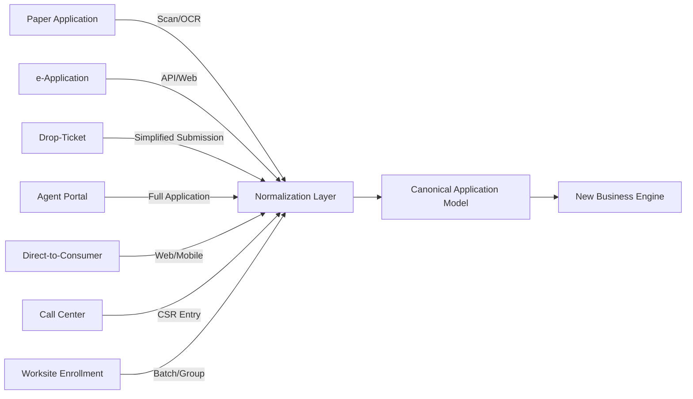
```mermaid
graph LR
    A[Paper Application] -->|Scan/OCR| N[Normalization Layer]
    B[e-Application] -->|API/Web| N
    C[Drop-Ticket] -->|Simplified Submission| N
    D[Agent Portal] -->|Full Application| N
    E[Direct-to-Consumer] -->|Web/Mobile| N
    F[Call Center] -->|CSR Entry| N
    G[Worksite Enrollment] -->|Batch/Group| N
    N --> H[Canonical Application Model]
    H --> I[New Business Engine]
```

### 2.2 Paper Application

**Description**: Traditional paper-based applications completed by hand, signed physically, and mailed or faxed to the carrier.

**Architecture Considerations**:

- **Document Ingestion**: Mailroom scanning with barcode/QR tracking.
- **OCR Pipeline**: Intelligent character recognition (ICR) for handwritten fields; structured OCR for printed sections.
- **Data Extraction**: Machine learning models trained on carrier-specific form layouts to extract field-level data.
- **Quality Assurance**: Human-in-the-loop verification for low-confidence OCR results (typically confidence < 85%).
- **Wet Signature Handling**: Original documents archived per state retention requirements (typically 7-10 years post policy termination).

**Data Flow**:

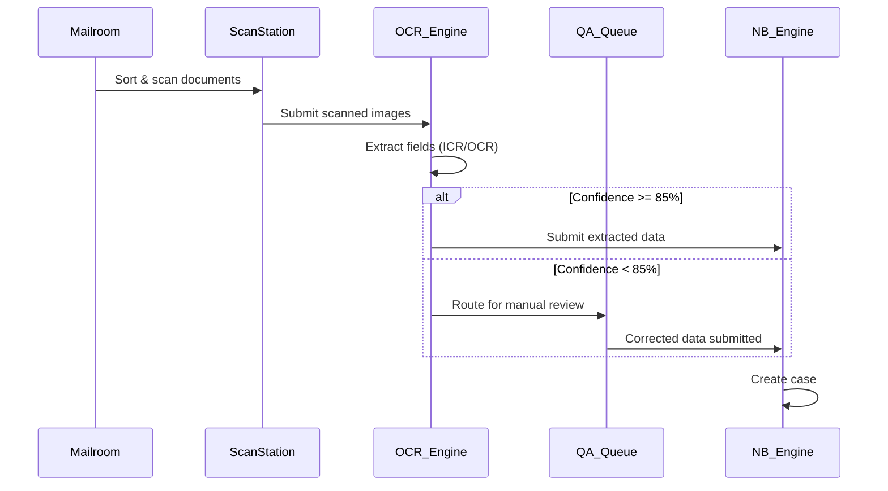
```mermaid
sequenceDiagram
    participant Mailroom
    participant ScanStation
    participant OCR_Engine
    participant QA_Queue
    participant NB_Engine

    Mailroom->>ScanStation: Sort & scan documents
    ScanStation->>OCR_Engine: Submit scanned images
    OCR_Engine->>OCR_Engine: Extract fields (ICR/OCR)
    alt Confidence >= 85%
        OCR_Engine->>NB_Engine: Submit extracted data
    else Confidence < 85%
        OCR_Engine->>QA_Queue: Route for manual review
        QA_Queue->>NB_Engine: Corrected data submitted
    end
    NB_Engine->>NB_Engine: Create case
```

**Technology Stack Recommendations**:

| Component | Options |
|-----------|---------|
| Scanning | Kofax, OPEX, Kodak Alaris |
| OCR/ICR | ABBYY FlexiCapture, Kofax Transformation, AWS Textract |
| Document Management | FileNet, Alfresco, OnBase |
| Workflow | Camunda, Appian, Pega |

### 2.3 Electronic Application (e-App)

**Description**: Digital application completed on a tablet (in-person with agent), desktop, or mobile device. This is the fastest-growing channel.

**Architecture**:

- **Front-End**: Responsive SPA (React/Angular) or native mobile app.
- **Reflexive Questioning**: Dynamic question flow driven by a rules engine; questions appear/hide based on prior answers.
- **Real-Time Validation**: Client-side and server-side validation; field-level and cross-field rules.
- **E-Signature**: Integration with DocuSign, OneSpan Sign, or Adobe Sign for legally binding signatures.
- **Data Pre-Fill**: Pull existing data from CRM (Salesforce, agency management systems) to reduce applicant effort.
- **Save & Resume**: Persistent session storage allowing multi-session application completion.

**Reflexive Question Engine Design**:

```json
{
  "questionId": "Q_TOBACCO_USE",
  "text": "Have you used any tobacco or nicotine products in the past 12 months?",
  "type": "BOOLEAN",
  "required": true,
  "dependents": [
    {
      "condition": "answer == true",
      "questions": [
        {
          "questionId": "Q_TOBACCO_TYPE",
          "text": "What type of tobacco/nicotine products?",
          "type": "MULTI_SELECT",
          "options": ["Cigarettes", "Cigars", "Chewing Tobacco", "Vaping/E-Cigarettes", "Nicotine Patches/Gum"],
          "required": true
        },
        {
          "questionId": "Q_TOBACCO_FREQUENCY",
          "text": "How frequently do you use tobacco/nicotine?",
          "type": "SELECT",
          "options": ["Daily", "Weekly", "Monthly", "Occasional"],
          "required": true
        }
      ]
    }
  ]
}
```

### 2.4 Drop-Ticket

**Description**: Simplified submission (typically name, DOB, SSN, coverage amount, product) submitted by an agent, with the carrier collecting remaining information directly from the applicant.

**Architecture**:

- **Minimal Data Set**: Agent submits only essential identifying information and coverage request.
- **Applicant Engagement**: Carrier initiates contact via email/SMS with a secure link to complete the application.
- **Agent of Record Tracking**: Original submitting agent remains the agent of record.
- **SLA Management**: Time limits on applicant response before case auto-closure.

**Drop-Ticket Canonical Schema**:

```json
{
  "dropTicket": {
    "submittingAgent": {
      "agentId": "AGT-2024-00451",
      "npn": "12345678",
      "name": "Jane Smith"
    },
    "proposedInsured": {
      "firstName": "John",
      "lastName": "Doe",
      "dateOfBirth": "1985-03-15",
      "ssn": "***-**-1234",
      "gender": "Male",
      "email": "john.doe@example.com",
      "phone": "+1-555-0123"
    },
    "coverageRequest": {
      "productCode": "TERM20",
      "faceAmount": 500000,
      "premiumMode": "Monthly"
    },
    "submissionDate": "2025-01-15T14:30:00Z"
  }
}
```

### 2.5 Agent Portal

**Description**: Full-featured web application used by agents/producers to submit complete applications, check status, and manage their book of business.

**Key Features**:

- **Product Selector**: Guided product selection based on client needs.
- **Illustration Integration**: Run and attach illustrations from within the portal.
- **Application Wizard**: Step-by-step application completion with progress tracking.
- **Document Upload**: Attach supporting documents (financial statements, trust documents, medical records).
- **E-Signature Ceremony**: Orchestrate multi-party signing (applicant, owner, agent).
- **Status Dashboard**: Real-time case status with NIGO details.
- **Commission Estimator**: Preview estimated commissions for the selected product/premium.

### 2.6 Direct-to-Consumer (D2C)

**Description**: Consumer-facing web/mobile application with no agent involvement, or with a virtual agent assist.

**Architecture Considerations**:

- **UX Optimization**: Minimize questions, use plain language, progressive disclosure.
- **Instant Decision**: Jet-issue products with immediate coverage binding.
- **Payment Integration**: ACH, credit card, or digital wallet for initial premium.
- **Chat/Video Assist**: Optional connection to a licensed agent for complex questions.
- **Abandoned Application Recovery**: Email/SMS follow-up for incomplete applications.

### 2.7 Call Center

**Description**: Applications taken by licensed call center representatives (CSRs) over the phone.

**Architecture**:

- **Telephony Integration**: CTI (Computer Telephony Integration) with CRM screen-pop.
- **Scripted Workflow**: Guided scripts ensure consistent data collection.
- **Voice Recording**: Calls recorded for compliance; voice signature where permitted.
- **Real-Time Compliance**: State-specific disclosures read and acknowledged during the call.

### 2.8 Worksite Enrollment

**Description**: Group voluntary enrollment conducted at employer locations, typically for simplified-issue products.

**Architecture**:

- **Census Integration**: Import employee census data for pre-population.
- **Batch Processing**: High-volume submission of enrollment forms.
- **Guaranteed Issue Thresholds**: Automatic approval below participation-based GI limits.
- **Payroll Deduction Setup**: Integration with payroll providers for premium collection.

### 2.9 Channel Normalization Architecture

All channels must normalize to a single canonical application model:

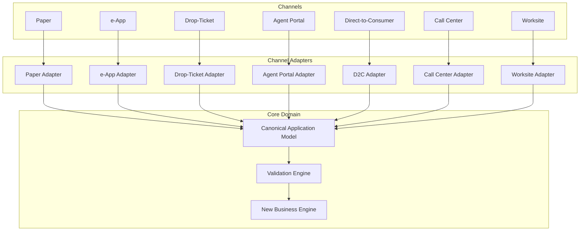
```mermaid
graph TB
    subgraph Channels
        P[Paper]
        E[e-App]
        DT[Drop-Ticket]
        AP[Agent Portal]
        D2C[Direct-to-Consumer]
        CC[Call Center]
        WE[Worksite]
    end

    subgraph "Channel Adapters"
        PA[Paper Adapter]
        EA[e-App Adapter]
        DTA[Drop-Ticket Adapter]
        APA[Agent Portal Adapter]
        D2CA[D2C Adapter]
        CCA[Call Center Adapter]
        WEA[Worksite Adapter]
    end

    subgraph "Core Domain"
        CAM[Canonical Application Model]
        VAL[Validation Engine]
        NB[New Business Engine]
    end

    P --> PA --> CAM
    E --> EA --> CAM
    DT --> DTA --> CAM
    AP --> APA --> CAM
    D2C --> D2CA --> CAM
    CC --> CCA --> CAM
    WE --> WEA --> CAM
    CAM --> VAL --> NB
```

Each **Channel Adapter** is responsible for:

1. Protocol translation (HTTP, SFTP, MQ, file system)
2. Data mapping to canonical schema
3. Channel-specific validation
4. Idempotency key generation
5. Source system acknowledgment

---

## 3. Application Data Model

### 3.1 Core Application Entity

The application is the central aggregate root in the new business domain.

| Attribute | Type | Description |
|-----------|------|-------------|
| `applicationId` | UUID | System-generated unique identifier |
| `applicationNumber` | VARCHAR(20) | Human-readable application number |
| `applicationDate` | DATE | Date application was signed |
| `receivedDate` | TIMESTAMP | Date/time application received by carrier |
| `channelCode` | ENUM | Source channel (PAPER, EAPP, DROP_TICKET, AGENT_PORTAL, D2C, CALL_CENTER, WORKSITE) |
| `applicationStatus` | ENUM | Current status code |
| `productCode` | VARCHAR(20) | FK to product catalog |
| `stateOfIssue` | CHAR(2) | State where policy will be issued |
| `signatureCity` | VARCHAR(100) | City where application was signed |
| `signatureState` | CHAR(2) | State where application was signed |
| `replacementIndicator` | BOOLEAN | Whether this replaces existing insurance |
| `solicitedIndicator` | BOOLEAN | Whether the sale was solicited |
| `initialPremiumAmount` | DECIMAL(12,2) | Initial premium submitted |
| `premiumMode` | ENUM | Annual, Semi-Annual, Quarterly, Monthly |
| `paymentMethod` | ENUM | EFT, Direct Bill, List Bill, Payroll Deduction |
| `createdTimestamp` | TIMESTAMP | Record creation time |
| `lastModifiedTimestamp` | TIMESTAMP | Last modification time |
| `version` | INT | Optimistic locking version |

### 3.2 Proposed Insured

| Attribute | Type | Description |
|-----------|------|-------------|
| `proposedInsuredId` | UUID | Unique identifier |
| `applicationId` | UUID | FK to application |
| `partyRoleCode` | ENUM | PRIMARY_INSURED, JOINT_INSURED, CHILD_RIDER_INSURED |
| `firstName` | VARCHAR(50) | Legal first name |
| `middleName` | VARCHAR(50) | Middle name or initial |
| `lastName` | VARCHAR(50) | Legal last name |
| `suffix` | VARCHAR(10) | Jr., Sr., III, etc. |
| `dateOfBirth` | DATE | Date of birth |
| `gender` | ENUM | Male, Female, Non-Binary |
| `ssn` | VARCHAR(11) | Social Security Number (encrypted at rest) |
| `tobaccoUseIndicator` | BOOLEAN | Current tobacco user |
| `tobaccoType` | ENUM | Cigarette, Cigar, Chewing, Vaping, Pipe, None |
| `tobaccoCessationDate` | DATE | Date tobacco use stopped (if applicable) |
| `heightFeet` | INT | Height in feet |
| `heightInches` | INT | Remaining inches |
| `weightPounds` | DECIMAL(5,1) | Weight in pounds |
| `citizenship` | VARCHAR(2) | Country code |
| `immigrationStatus` | ENUM | Citizen, Permanent Resident, Visa Holder, etc. |
| `driversLicenseNumber` | VARCHAR(30) | Driver's license number (encrypted) |
| `driversLicenseState` | CHAR(2) | State of issuance |
| `occupation` | VARCHAR(100) | Current occupation |
| `occupationCode` | VARCHAR(10) | Standardized occupation code |
| `employerName` | VARCHAR(100) | Current employer |
| `annualIncome` | DECIMAL(14,2) | Gross annual income |
| `netWorth` | DECIMAL(14,2) | Estimated net worth |

### 3.3 Owner Information

| Attribute | Type | Description |
|-----------|------|-------------|
| `ownerId` | UUID | Unique identifier |
| `applicationId` | UUID | FK to application |
| `ownerType` | ENUM | INDIVIDUAL, TRUST, CORPORATION, PARTNERSHIP, ESTATE |
| `sameAsInsured` | BOOLEAN | Owner is same as proposed insured |
| `firstName` | VARCHAR(50) | First name (if individual) |
| `lastName` | VARCHAR(50) | Last name (if individual) |
| `entityName` | VARCHAR(200) | Entity name (if non-individual) |
| `taxId` | VARCHAR(11) | SSN or EIN (encrypted) |
| `dateOfBirth` | DATE | DOB (if individual) |
| `dateOfTrust` | DATE | Trust date (if trust) |
| `trustName` | VARCHAR(200) | Trust name |
| `trusteeNames` | TEXT | Trustee names |
| `relationship` | ENUM | Self, Spouse, Parent, Child, Business Partner, Employer, Trust, Other |
| `insurableInterestDescription` | TEXT | Description of insurable interest |

### 3.4 Beneficiary Designations

This is one of the most complex data structures in the application model due to the numerous designation types and distribution schemes.

| Attribute | Type | Description |
|-----------|------|-------------|
| `beneficiaryId` | UUID | Unique identifier |
| `applicationId` | UUID | FK to application |
| `coverageId` | UUID | FK to specific coverage (base or rider) |
| `designationType` | ENUM | PRIMARY, CONTINGENT |
| `beneficiaryType` | ENUM | INDIVIDUAL, TRUST, ESTATE, CHARITY, CORPORATION |
| `revocabilityType` | ENUM | REVOCABLE, IRREVOCABLE |
| `distributionType` | ENUM | PER_STIRPES, PER_CAPITA, EQUAL_SHARES, SPECIFIC_PERCENTAGE |
| `sharePercentage` | DECIMAL(5,2) | Percentage share (must sum to 100% per designation type) |
| `sequenceNumber` | INT | Order within designation level |
| `firstName` | VARCHAR(50) | First name |
| `lastName` | VARCHAR(50) | Last name |
| `entityName` | VARCHAR(200) | Entity name (if non-individual) |
| `taxId` | VARCHAR(11) | SSN or EIN (encrypted) |
| `dateOfBirth` | DATE | DOB |
| `relationship` | ENUM | Spouse, Child, Parent, Sibling, Trust, Estate, Charity, Business, Other |
| `trustName` | VARCHAR(200) | Trust name (if trust) |
| `trustDate` | DATE | Trust date |
| `charityEIN` | VARCHAR(10) | Charity EIN |

**Beneficiary Distribution Types Explained**:

- **Per Stirpes**: If a beneficiary predeceases the insured, their share passes to their descendants equally. Example: Insured names 3 children at 33.33% each per stirpes. If child A predeceases, child A's children equally split the 33.33%.
- **Per Capita**: If a beneficiary predeceases, their share is redistributed equally among surviving beneficiaries. No descendant inheritance.
- **Equal Shares**: Each named beneficiary receives an equal share. Functionally similar to per capita for distribution.
- **Specific Percentage**: Each beneficiary receives a specifically designated percentage.

**Validation Rules**:

```python
def validate_beneficiary_designations(beneficiaries: list) -> list:
    """Validate beneficiary designations for an application."""
    errors = []

    primary = [b for b in beneficiaries if b.designation_type == 'PRIMARY']
    contingent = [b for b in beneficiaries if b.designation_type == 'CONTINGENT']

    # Rule 1: At least one primary beneficiary required
    if not primary:
        errors.append("At least one primary beneficiary is required")

    # Rule 2: Primary percentages must sum to 100%
    primary_total = sum(b.share_percentage for b in primary)
    if primary and abs(primary_total - 100.0) > 0.01:
        errors.append(f"Primary beneficiary shares sum to {primary_total}%, must equal 100%")

    # Rule 3: Contingent percentages must sum to 100% (if any contingent exists)
    if contingent:
        contingent_total = sum(b.share_percentage for b in contingent)
        if abs(contingent_total - 100.0) > 0.01:
            errors.append(f"Contingent beneficiary shares sum to {contingent_total}%, must equal 100%")

    # Rule 4: Irrevocable beneficiaries require additional consent documentation
    irrevocable = [b for b in beneficiaries if b.revocability_type == 'IRREVOCABLE']
    for irr in irrevocable:
        if not irr.consent_document_attached:
            errors.append(f"Irrevocable beneficiary {irr.name} requires consent documentation")

    # Rule 5: Minor beneficiaries (under 18) should have a custodian
    for b in beneficiaries:
        if b.date_of_birth and calculate_age(b.date_of_birth) < 18:
            if not b.custodian_name:
                errors.append(f"Minor beneficiary {b.name} should have a custodian designated under UTMA/UGMA")

    # Rule 6: Estate as beneficiary generates a suitability warning
    estate_benes = [b for b in beneficiaries if b.beneficiary_type == 'ESTATE']
    if estate_benes:
        errors.append("WARNING: Estate as beneficiary may subject proceeds to probate and creditors")

    return errors
```

### 3.5 Coverage Details

| Attribute | Type | Description |
|-----------|------|-------------|
| `coverageId` | UUID | Unique identifier |
| `applicationId` | UUID | FK to application |
| `coverageType` | ENUM | BASE, RIDER |
| `productCode` | VARCHAR(20) | Specific product/rider code |
| `faceAmount` | DECIMAL(14,2) | Face amount / benefit amount |
| `premiumAmount` | DECIMAL(12,2) | Premium for this coverage |
| `coveragePeriod` | INT | Coverage duration in years (for term) |
| `insuredPartyId` | UUID | FK to the insured for this coverage |
| `riderCode` | VARCHAR(20) | Rider identifier (if rider) |
| `benefitAmount` | DECIMAL(14,2) | Rider benefit amount |
| `eliminationPeriod` | INT | Waiting period in days (for disability riders) |
| `benefitPeriod` | INT | Benefit duration in months (for disability riders) |

### 3.6 Rider Selections

Common riders and their data requirements:

| Rider | Key Data Fields |
|-------|----------------|
| Waiver of Premium (WP) | Elimination period, occupation class |
| Accidental Death Benefit (ADB) | Benefit multiple (1x, 2x face) |
| Guaranteed Insurability (GI) | Option dates, maximum additional amount |
| Child Term Rider (CTR) | Number of children, units ($1,000 each) |
| Accelerated Death Benefit (ADB-LTC) | Chronic/terminal/critical illness trigger, benefit percentage |
| Long-Term Care Rider | Monthly benefit, benefit period, elimination period, inflation protection |
| Return of Premium (ROP) | Return percentage at various durations |
| Term Conversion Rider | Conversion period, convertible products |
| Spouse Term Rider | Spouse DOB, gender, tobacco status, face amount |
| Paid-Up Additions (PUA) | Additional premium amount |

### 3.7 Premium Payment Method

| Attribute | Type | Description |
|-----------|------|-------------|
| `paymentMethodId` | UUID | Unique identifier |
| `applicationId` | UUID | FK to application |
| `paymentType` | ENUM | EFT_CHECKING, EFT_SAVINGS, CREDIT_CARD, DIRECT_BILL, LIST_BILL, PAYROLL_DEDUCTION, GOVERNMENT_ALLOTMENT |
| `bankRoutingNumber` | VARCHAR(9) | ABA routing number (encrypted) |
| `bankAccountNumber` | VARCHAR(17) | Account number (encrypted) |
| `bankName` | VARCHAR(100) | Financial institution name |
| `accountHolderName` | VARCHAR(100) | Name on account |
| `creditCardType` | ENUM | Visa, MasterCard, Amex, Discover |
| `creditCardNumber` | VARCHAR(19) | Card number (tokenized via PCI vault) |
| `creditCardExpiry` | VARCHAR(7) | MM/YYYY |
| `payrollDeductionCode` | VARCHAR(20) | Employer payroll code |
| `draftDay` | INT | Preferred day of month for EFT (1-28) |

### 3.8 Existing Insurance & Replacement Declarations

| Attribute | Type | Description |
|-----------|------|-------------|
| `existingInsuranceId` | UUID | Unique identifier |
| `applicationId` | UUID | FK to application |
| `carrierName` | VARCHAR(200) | Existing carrier name |
| `policyNumber` | VARCHAR(30) | Existing policy number |
| `faceAmount` | DECIMAL(14,2) | Existing face amount |
| `productType` | ENUM | Term, Whole Life, Universal Life, Variable Life, etc. |
| `issueDate` | DATE | Existing policy issue date |
| `annualPremium` | DECIMAL(12,2) | Existing annual premium |
| `cashValue` | DECIMAL(14,2) | Current cash/account value |
| `loanBalance` | DECIMAL(14,2) | Outstanding loan amount |
| `willBeReplaced` | BOOLEAN | Whether this policy will be replaced |
| `replacementAction` | ENUM | SURRENDER, LAPSE, REDUCE, CONVERT, EXCHANGE_1035, NO_CHANGE |

### 3.9 Agent/Producer Information

| Attribute | Type | Description |
|-----------|------|-------------|
| `agentId` | UUID | Unique identifier in PAS |
| `applicationId` | UUID | FK to application |
| `agentRole` | ENUM | WRITING_AGENT, SERVICING_AGENT, SPLIT_AGENT, SUPERVISOR |
| `npn` | VARCHAR(10) | National Producer Number |
| `firstName` | VARCHAR(50) | Agent first name |
| `lastName` | VARCHAR(50) | Agent last name |
| `agencyCode` | VARCHAR(20) | Agency/firm code |
| `agencyName` | VARCHAR(200) | Agency name |
| `commissionSplit` | DECIMAL(5,2) | Commission split percentage |
| `stateOfLicense` | CHAR(2) | Licensed state |
| `licenseNumber` | VARCHAR(30) | State license number |
| `appointmentStatus` | ENUM | Active, Pending, Terminated |
| `e_and_o_verified` | BOOLEAN | E&O insurance verified |

### 3.10 Medical History Questions (Part 2 of Application)

The medical history section, often called "Part 2," captures health information:

| Category | Sample Questions |
|----------|-----------------|
| **Cardiovascular** | Heart attack, stroke, TIA, angina, heart failure, arrhythmia, heart surgery, angioplasty/stent |
| **Cancer** | Any cancer diagnosis, type, stage, treatment, date of last treatment, remission status |
| **Respiratory** | Asthma, COPD, emphysema, sleep apnea, pulmonary fibrosis |
| **Neurological** | Seizures, epilepsy, multiple sclerosis, Parkinson's, ALS, neuropathy |
| **Endocrine** | Diabetes (Type 1/2), thyroid disorders, adrenal disorders |
| **Mental Health** | Depression, anxiety, bipolar disorder, substance abuse, hospitalization |
| **Gastrointestinal** | Hepatitis, cirrhosis, Crohn's disease, ulcerative colitis |
| **Musculoskeletal** | Arthritis, back disorders, joint replacement |
| **HIV/AIDS** | HIV positive status, AIDS diagnosis |
| **Family History** | Heart disease, cancer, diabetes, stroke before age 60 in parents/siblings |

**Medical History Data Structure**:

```json
{
  "medicalHistory": {
    "proposedInsuredId": "uuid-here",
    "questions": [
      {
        "questionCode": "MH_CARDIO_01",
        "category": "CARDIOVASCULAR",
        "questionText": "Have you ever been diagnosed with or treated for any heart or circulatory disorder?",
        "answer": true,
        "details": [
          {
            "condition": "Atrial Fibrillation",
            "diagnosisDate": "2019-06",
            "treatment": "Medication - Eliquis",
            "currentStatus": "Controlled",
            "treatingPhysician": "Dr. Robert Chen",
            "lastVisitDate": "2024-11-15"
          }
        ]
      },
      {
        "questionCode": "MH_TOBACCO_01",
        "category": "TOBACCO",
        "questionText": "Have you used any tobacco or nicotine products in the past 5 years?",
        "answer": false,
        "details": []
      }
    ]
  }
}
```

### 3.11 Aviation, Avocation & Foreign Travel

| Category | Data Fields |
|----------|-------------|
| **Aviation** | Pilot type (private/commercial), hours per year, aircraft type, highest rating, solo flights, military aviation |
| **Avocations** | Scuba diving (depth, certifications), skydiving (jumps/year), rock climbing, racing (auto/motorcycle), hang gliding, bungee jumping |
| **Foreign Travel** | Countries visited/planned, duration, purpose, military deployment, hazardous regions |

### 3.12 Financial & Suitability Data

| Attribute | Type | Description |
|-----------|------|-------------|
| `annualEarnedIncome` | DECIMAL(14,2) | W-2 or self-employment income |
| `annualUnearnedIncome` | DECIMAL(14,2) | Investment, rental, other income |
| `totalNetWorth` | DECIMAL(14,2) | Total assets minus liabilities |
| `liquidNetWorth` | DECIMAL(14,2) | Liquid assets only |
| `existingLifeInsurance` | DECIMAL(14,2) | Total existing life insurance in force |
| `purposeOfInsurance` | ENUM | Income Replacement, Estate Planning, Business Continuation, Key Person, Mortgage Protection, Final Expenses, Wealth Transfer, Charitable Giving |
| `sourceOfFunds` | TEXT | Description of premium funding source |
| `riskTolerance` | ENUM | Conservative, Moderate, Aggressive (for VUL/IUL) |
| `investmentExperience` | ENUM | None, Limited, Moderate, Extensive |
| `taxBracket` | ENUM | 10%, 12%, 22%, 24%, 32%, 35%, 37% |

---

## 4. NIGO (Not In Good Order) Processing

### 4.1 Overview

An application is **Not In Good Order (NIGO)** when it is missing required information, contains errors, or lacks necessary supporting documents. NIGO is one of the largest drivers of new business cycle time and is a critical focus area for operational efficiency.

### 4.2 NIGO Reason Codes

| Code | Category | Description |
|------|----------|-------------|
| `NIGO-001` | Missing Data | Missing proposed insured date of birth |
| `NIGO-002` | Missing Data | Missing proposed insured SSN |
| `NIGO-003` | Missing Data | Missing beneficiary designation |
| `NIGO-004` | Missing Data | Missing owner information |
| `NIGO-005` | Missing Data | Missing payment method |
| `NIGO-006` | Signature | Missing applicant signature |
| `NIGO-007` | Signature | Missing owner signature (when different from insured) |
| `NIGO-008` | Signature | Missing agent signature |
| `NIGO-009` | Signature | Signature date mismatch |
| `NIGO-010` | Financial | Initial premium not received |
| `NIGO-011` | Financial | Premium amount incorrect for coverage selected |
| `NIGO-012` | Financial | Invalid bank account information |
| `NIGO-013` | Form | Missing replacement form (required for state) |
| `NIGO-014` | Form | Missing suitability form |
| `NIGO-015` | Form | Missing state-specific disclosure form |
| `NIGO-016` | Form | Missing HIPAA authorization |
| `NIGO-017` | Licensing | Agent not licensed in state of application |
| `NIGO-018` | Licensing | Agent not appointed with carrier |
| `NIGO-019` | Medical | Incomplete medical history section |
| `NIGO-020` | Medical | Medical question answered "yes" without details |
| `NIGO-021` | Beneficiary | Beneficiary percentages do not sum to 100% |
| `NIGO-022` | Beneficiary | Minor beneficiary without custodian |
| `NIGO-023` | Coverage | Face amount exceeds non-medical limit without exam |
| `NIGO-024` | Coverage | Requested product not available in state |
| `NIGO-025` | Identity | Date of birth inconsistent with age stated |
| `NIGO-026` | Identity | SSN fails validation check |
| `NIGO-027` | Replacement | Replacement indicated but replacement form not attached |
| `NIGO-028` | Replacement | 1035 exchange form incomplete |
| `NIGO-029` | Trust | Trust beneficiary missing trust date |
| `NIGO-030` | Suitability | Suitability responses indicate product may be unsuitable |

### 4.3 Automated NIGO Detection Rules Engine

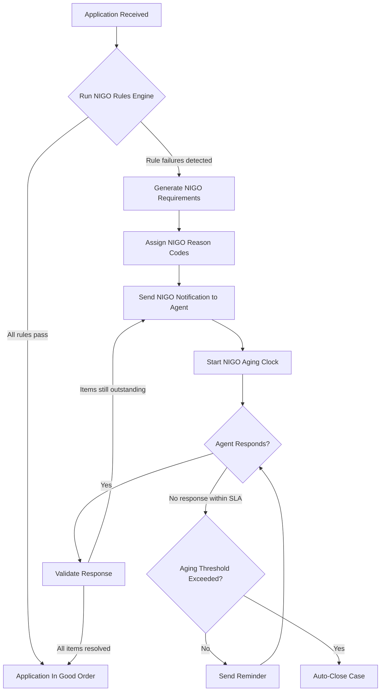
```mermaid
graph TD
    A[Application Received] --> B{Run NIGO Rules Engine}
    B -->|All rules pass| C[Application In Good Order]
    B -->|Rule failures detected| D[Generate NIGO Requirements]
    D --> E[Assign NIGO Reason Codes]
    E --> F[Send NIGO Notification to Agent]
    F --> G[Start NIGO Aging Clock]
    G --> H{Agent Responds?}
    H -->|Yes| I[Validate Response]
    I -->|All items resolved| C
    I -->|Items still outstanding| F
    H -->|No response within SLA| J{Aging Threshold Exceeded?}
    J -->|No| K[Send Reminder]
    K --> H
    J -->|Yes| L[Auto-Close Case]
```

**Rules Engine Configuration**:

```json
{
  "nigoRules": [
    {
      "ruleId": "NIGO_RULE_001",
      "name": "MissingDOB",
      "category": "MISSING_DATA",
      "priority": 1,
      "condition": "proposedInsured.dateOfBirth == null || proposedInsured.dateOfBirth == ''",
      "nigoCode": "NIGO-001",
      "severity": "CRITICAL",
      "autoResolvable": false,
      "description": "Proposed insured date of birth is required"
    },
    {
      "ruleId": "NIGO_RULE_021",
      "name": "BeneficiaryPercentageValidation",
      "category": "BENEFICIARY",
      "priority": 2,
      "condition": "sum(primaryBeneficiaries.sharePercentage) != 100.00",
      "nigoCode": "NIGO-021",
      "severity": "HIGH",
      "autoResolvable": false,
      "description": "Primary beneficiary percentages must sum to 100%"
    },
    {
      "ruleId": "NIGO_RULE_013",
      "name": "ReplacementFormRequired",
      "category": "FORM",
      "priority": 1,
      "condition": "application.replacementIndicator == true && !documents.contains('REPLACEMENT_FORM') && state.requiresReplacementForm(application.stateOfIssue)",
      "nigoCode": "NIGO-013",
      "severity": "CRITICAL",
      "autoResolvable": false,
      "description": "State requires replacement form when existing insurance is being replaced"
    }
  ]
}
```

### 4.4 NIGO Aging & Auto-Close

| Aging Level | Days Since NIGO | Action |
|-------------|-----------------|--------|
| Initial | 0 | NIGO notification sent to agent via email and portal |
| Reminder 1 | 7 | First reminder to agent |
| Reminder 2 | 14 | Second reminder, supervisor copied |
| Escalation | 21 | Case escalated to case manager |
| Warning | 30 | Auto-close warning sent |
| Auto-Close | 45 | Case auto-closed, premium refunded (if applicable) |

**Auto-Close Processing**:

```python
def process_nigo_auto_close(case: Case) -> None:
    """Process auto-close for aged NIGO cases."""
    nigo_age_days = (date.today() - case.nigo_date).days

    if nigo_age_days >= 45:
        case.status = CaseStatus.CLOSED_NIGO
        case.close_reason = "AUTO_CLOSE_NIGO_AGED"
        case.close_date = date.today()

        # Refund premium if collected
        if case.premium_deposit_amount > 0:
            create_premium_refund(
                case_id=case.case_id,
                amount=case.premium_deposit_amount,
                refund_reason="NIGO_AUTO_CLOSE",
                refund_method=case.original_payment_method,
                payee=case.premium_payor
            )

        # Release any pending requirements
        for req in case.outstanding_requirements:
            req.status = RequirementStatus.CANCELLED
            cancel_vendor_order(req) if req.vendor_order_id else None

        # Notify agent
        send_notification(
            recipient=case.writing_agent,
            template="NIGO_AUTO_CLOSE",
            variables={"caseNumber": case.case_number, "nigoReasons": case.nigo_reasons}
        )

        # Notify applicant
        send_notification(
            recipient=case.proposed_insured,
            template="APPLICATION_CLOSED",
            variables={"applicationNumber": case.application_number}
        )

        # Publish domain event
        publish_event(CaseClosedEvent(
            case_id=case.case_id,
            close_reason="NIGO_AUTO_CLOSE",
            close_date=date.today()
        ))
```

---

## 5. Case Management

### 5.1 Case Creation

A **case** is created when an application passes initial intake validation (or is flagged NIGO but accepted for processing). The case is the workflow container that tracks the application through the entire new business lifecycle.

```mermaid
statechart-v2
```

**Case Status State Machine**:

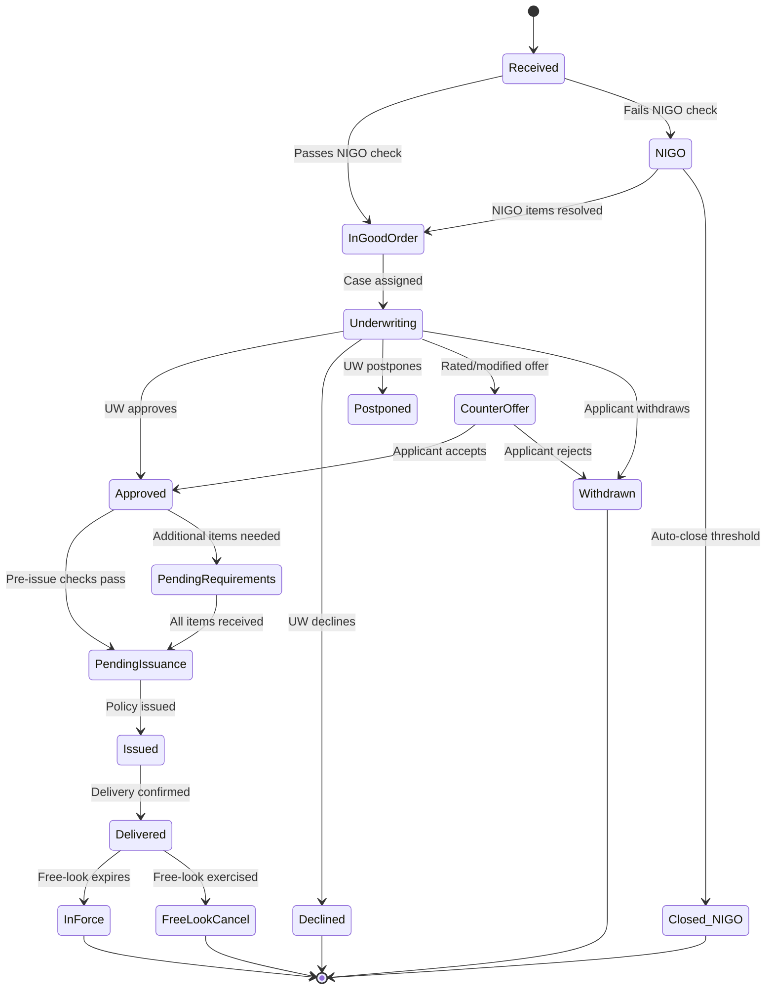
```mermaid
stateDiagram-v2
    [*] --> Received
    Received --> InGoodOrder: Passes NIGO check
    Received --> NIGO: Fails NIGO check
    NIGO --> InGoodOrder: NIGO items resolved
    NIGO --> Closed_NIGO: Auto-close threshold
    InGoodOrder --> Underwriting: Case assigned
    Underwriting --> Approved: UW approves
    Underwriting --> Declined: UW declines
    Underwriting --> Postponed: UW postpones
    Underwriting --> CounterOffer: Rated/modified offer
    Underwriting --> Withdrawn: Applicant withdraws
    CounterOffer --> Approved: Applicant accepts
    CounterOffer --> Withdrawn: Applicant rejects
    Approved --> PendingIssuance: Pre-issue checks pass
    PendingIssuance --> Issued: Policy issued
    Approved --> PendingRequirements: Additional items needed
    PendingRequirements --> PendingIssuance: All items received
    Issued --> Delivered: Delivery confirmed
    Delivered --> InForce: Free-look expires
    Delivered --> FreeLookCancel: Free-look exercised
    Declined --> [*]
    Closed_NIGO --> [*]
    Withdrawn --> [*]
    FreeLookCancel --> [*]
    InForce --> [*]
```

### 5.2 Assignment Rules

Cases are assigned to new business processors or underwriters using configurable assignment rules.

**Round-Robin Assignment**:

```python
class RoundRobinAssigner:
    def __init__(self, team_members: list):
        self.team_members = team_members
        self.current_index = 0

    def assign(self, case: Case) -> str:
        assignee = self.team_members[self.current_index]
        self.current_index = (self.current_index + 1) % len(self.team_members)
        case.assigned_to = assignee.user_id
        return assignee.user_id
```

**Skill-Based Assignment**:

| Factor | Weight | Description |
|--------|--------|-------------|
| Product expertise | 30% | Assignee's proficiency with the product type |
| Face amount tier | 25% | High face amount cases to senior underwriters |
| Complexity score | 20% | Complex cases (multiple impairments, trusts) to experienced staff |
| State knowledge | 15% | Familiarity with state-specific requirements |
| Current workload | 10% | Balance across team members |

**Workload-Based Assignment**:

```python
def assign_by_workload(case: Case, team: list) -> TeamMember:
    """Assign case to team member with lowest weighted workload."""
    for member in team:
        member.weighted_load = (
            member.open_cases * 1.0 +
            member.pending_nigo_cases * 0.5 +
            member.aged_cases * 1.5  # Aged cases count more
        )
    team.sort(key=lambda m: m.weighted_load)
    selected = team[0]
    case.assigned_to = selected.user_id
    return selected
```

### 5.3 Case Notes & Diary

Every case maintains a chronological journal of notes, activities, and diary entries:

| Attribute | Type | Description |
|-----------|------|-------------|
| `noteId` | UUID | Unique identifier |
| `caseId` | UUID | FK to case |
| `noteType` | ENUM | GENERAL, DIARY, SYSTEM, UNDERWRITING, COMPLIANCE, AGENT_COMMUNICATION |
| `noteText` | TEXT | Note content |
| `diaryDate` | DATE | Follow-up date (for diary entries) |
| `diaryCompleted` | BOOLEAN | Whether diary has been actioned |
| `createdBy` | VARCHAR(50) | User or system that created the note |
| `createdTimestamp` | TIMESTAMP | Creation time |
| `confidentialIndicator` | BOOLEAN | Restricted visibility (e.g., compliance notes) |

### 5.4 Case Escalation

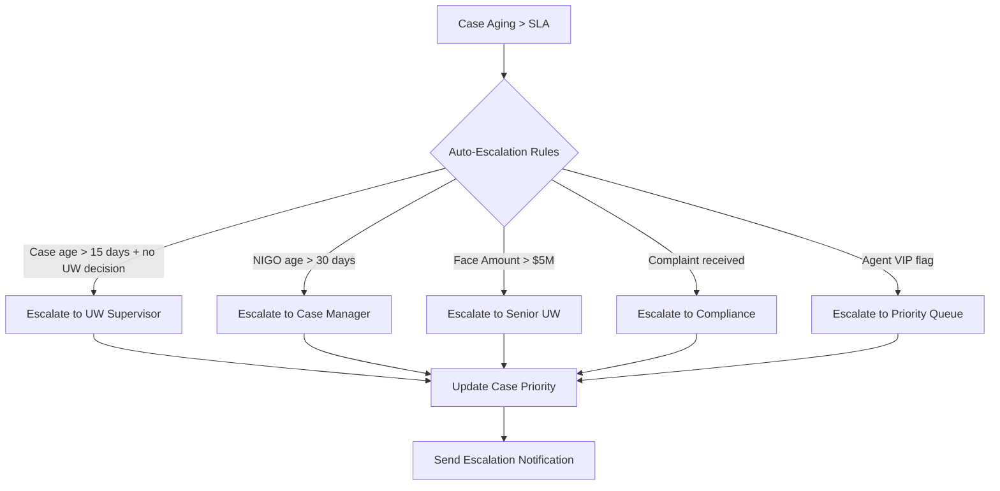
```mermaid
graph TD
    A[Case Aging > SLA] --> B{Auto-Escalation Rules}
    B -->|Case age > 15 days + no UW decision| C[Escalate to UW Supervisor]
    B -->|NIGO age > 30 days| D[Escalate to Case Manager]
    B -->|Face Amount > $5M| E[Escalate to Senior UW]
    B -->|Complaint received| F[Escalate to Compliance]
    B -->|Agent VIP flag| G[Escalate to Priority Queue]
    C --> H[Update Case Priority]
    D --> H
    E --> H
    F --> H
    G --> H
    H --> I[Send Escalation Notification]
```

### 5.5 SLA Tracking

| Metric | SLA Target | Measurement |
|--------|-----------|-------------|
| Application to case creation | < 1 business day | Received date to case create date |
| NIGO notification | < 4 hours | NIGO detection to agent notification |
| Case assignment | < 2 hours | Case creation to assignment |
| Underwriting decision | < 5 business days (simplified), < 15 days (full) | Assignment to UW decision |
| Counter-offer response | < 10 business days | Offer sent to response received |
| Issuance after approval | < 2 business days | Approval date to issue date |
| End-to-end cycle time | < 21 business days | Received date to issue date |

---

## 6. Suitability & Best Interest

### 6.1 Regulatory Background

The NAIC **Suitability in Annuity Transactions Model Regulation** (revised 2020) introduced a "best interest" standard. While primarily targeting annuities, many carriers apply similar principles to life insurance products. SEC **Regulation Best Interest (Reg BI)** applies to broker-dealer sales of variable life products.

### 6.2 Suitability Data Capture

| Data Element | Purpose |
|-------------|---------|
| Annual income | Financial capacity for premiums |
| Net worth / liquid net worth | Overall financial picture |
| Existing insurance | Avoid over-insurance |
| Financial objectives | Ensure product aligns with goals |
| Risk tolerance | For variable/indexed products |
| Investment experience | For variable products |
| Time horizon | Premium commitment period |
| Liquidity needs | Ensure not locking up needed funds |
| Source of funds | AML/compliance |
| Tax situation | Product tax advantages |
| Intended use of policy | Income replacement, estate planning, etc. |
| Other financial products owned | Holistic view |
| Dependents | Insurance need validation |

### 6.3 Suitability Determination Rules Engine

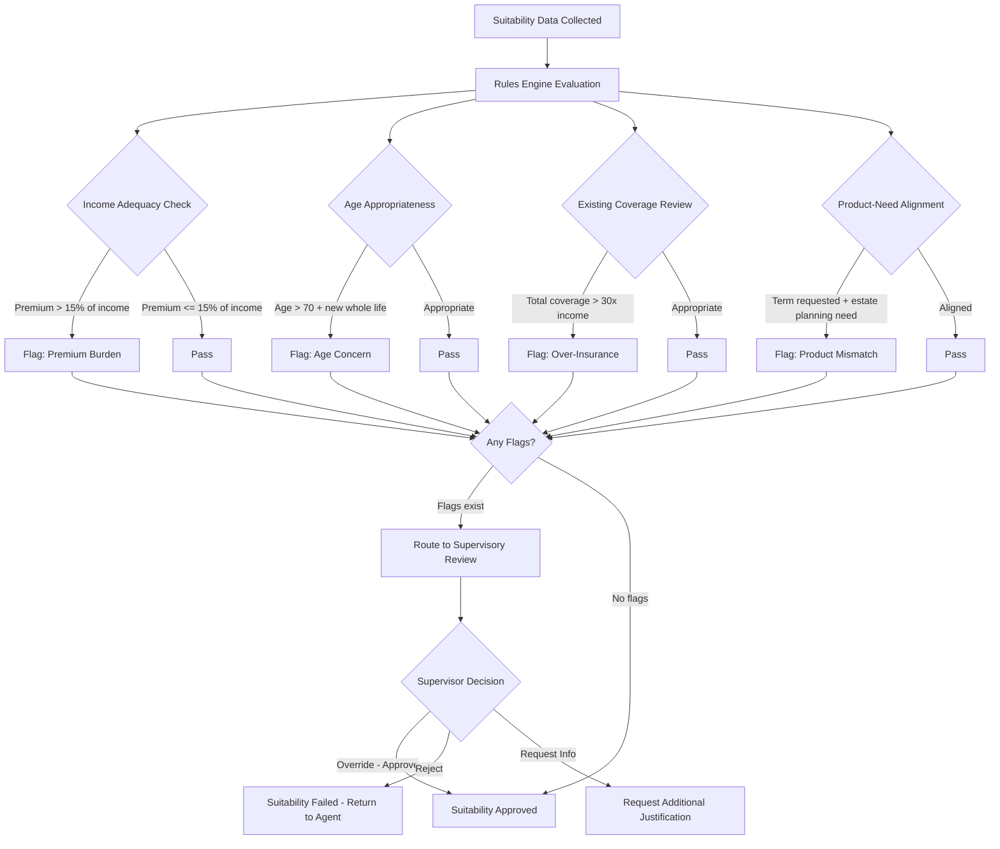
```mermaid
graph TD
    A[Suitability Data Collected] --> B[Rules Engine Evaluation]
    B --> C{Income Adequacy Check}
    C -->|Premium > 15% of income| D[Flag: Premium Burden]
    C -->|Premium <= 15% of income| E[Pass]
    B --> F{Age Appropriateness}
    F -->|Age > 70 + new whole life| G[Flag: Age Concern]
    F -->|Appropriate| H[Pass]
    B --> I{Existing Coverage Review}
    I -->|Total coverage > 30x income| J[Flag: Over-Insurance]
    I -->|Appropriate| K[Pass]
    B --> L{Product-Need Alignment}
    L -->|Term requested + estate planning need| M[Flag: Product Mismatch]
    L -->|Aligned| N[Pass]
    D --> O{Any Flags?}
    G --> O
    J --> O
    M --> O
    E --> O
    H --> O
    K --> O
    N --> O
    O -->|Flags exist| P[Route to Supervisory Review]
    O -->|No flags| Q[Suitability Approved]
    P --> R{Supervisor Decision}
    R -->|Override - Approve| Q
    R -->|Reject| S[Suitability Failed - Return to Agent]
    R -->|Request Info| T[Request Additional Justification]
```

### 6.4 Suitability Rules Examples

```json
{
  "suitabilityRules": [
    {
      "ruleId": "SUIT_001",
      "name": "PremiumBurden",
      "description": "Premium exceeds reasonable percentage of income",
      "condition": "annualPremium / annualIncome > 0.15",
      "action": "FLAG",
      "severity": "WARNING",
      "requiresSupervisoryReview": true
    },
    {
      "ruleId": "SUIT_002",
      "name": "SeniorAgeSuitability",
      "description": "Permanent insurance for applicants over age 70",
      "condition": "proposedInsured.age > 70 && product.type IN ('WHOLE_LIFE', 'UNIVERSAL_LIFE') && faceAmount > 100000",
      "action": "FLAG",
      "severity": "HIGH",
      "requiresSupervisoryReview": true
    },
    {
      "ruleId": "SUIT_003",
      "name": "ReplacementWithHigherPremium",
      "description": "Replacement results in significantly higher premiums",
      "condition": "replacementIndicator == true && newAnnualPremium > existingAnnualPremium * 1.25",
      "action": "FLAG",
      "severity": "WARNING",
      "requiresSupervisoryReview": true
    },
    {
      "ruleId": "SUIT_004",
      "name": "VariableProductExperience",
      "description": "Variable product sold to applicant with no investment experience",
      "condition": "product.type == 'VARIABLE_LIFE' && investmentExperience == 'NONE'",
      "action": "FLAG",
      "severity": "HIGH",
      "requiresSupervisoryReview": true
    }
  ]
}
```

### 6.5 Supervisory Review Workflow

| Step | Actor | Action |
|------|-------|--------|
| 1 | System | Suitability flag triggered |
| 2 | System | Case routed to supervisory review queue |
| 3 | Supervisor | Review application, suitability data, and flag reason |
| 4 | Supervisor | Determine: Approve, Reject, or Request Additional Information |
| 5 | System | If approved, document rationale and proceed |
| 6 | System | If rejected, notify agent with specific reasons |
| 7 | System | Archive suitability determination for regulatory retention |

### 6.6 Documentation Retention

Per NAIC model regulation, suitability documentation must be retained for a minimum period:

- **Suitability questionnaire**: Retained for the life of the policy + 5 years.
- **Supervisory review documentation**: Same retention as questionnaire.
- **Agent training records**: 5 years from date of training.
- **Comparison ledgers (replacements)**: Life of the new policy + 5 years.

---

## 7. Replacement Processing

### 7.1 Regulatory Framework

Replacement is governed by NAIC **Model Regulation 613** — *Life Insurance and Annuities Replacement Model Regulation*. States have adopted this with variations.

**Key Definitions**:
- **Replacement**: A transaction where new insurance is purchased and existing insurance is lapsed, surrendered, converted, reduced, or subject to borrowing.
- **Conservation**: The existing carrier's right to make a counter-offer to retain the business.
- **Financed Purchase**: Using values from an existing policy to pay for a new one.

### 7.2 Replacement Detection Rules

```python
REPLACEMENT_TRIGGERS = [
    "applicant_indicates_existing_insurance_will_lapse",
    "applicant_indicates_existing_insurance_will_surrender",
    "1035_exchange_indicated",
    "existing_policy_loan_to_fund_new_premium",
    "existing_policy_withdrawal_to_fund_new_premium",
    "reduced_paid_up_on_existing_policy",
    "existing_policy_face_amount_reduction",
    "conversion_of_existing_term_policy_at_another_carrier"
]

def is_replacement(application: Application) -> bool:
    """Determine if the application constitutes a replacement."""
    if application.existing_insurance:
        for policy in application.existing_insurance:
            if policy.will_be_replaced:
                return True
            if policy.replacement_action in [
                'SURRENDER', 'LAPSE', 'REDUCE', 'EXCHANGE_1035'
            ]:
                return True
    return False
```

### 7.3 State-Specific Replacement Requirements

| State | Form Requirement | Notice to Existing Carrier | Consumer Notice | Special Rules |
|-------|-----------------|---------------------------|-----------------|---------------|
| CA | Replacement form required | Yes, within 3 business days | Yes, comparative information | Additional disclosure for seniors |
| NY | Reg 60 replacement form | Yes, within 3 business days | Yes, detailed comparison | Most stringent requirements; separate form for internal replacements |
| FL | Replacement notice required | Yes, within 5 business days | Yes | Enhanced disclosure for seniors (age 65+) |
| TX | Replacement form required | Yes, within 3 business days | Yes | Standard Model 613 adoption |
| PA | Replacement form required | Yes, within 10 days | Yes | Allows carrier conservation period |

### 7.4 Replacement Processing Workflow

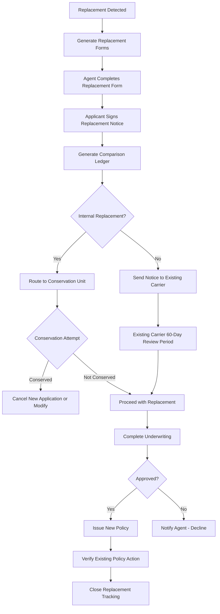
```mermaid
graph TD
    A[Replacement Detected] --> B[Generate Replacement Forms]
    B --> C[Agent Completes Replacement Form]
    C --> D[Applicant Signs Replacement Notice]
    D --> E[Generate Comparison Ledger]
    E --> F{Internal Replacement?}
    F -->|Yes| G[Route to Conservation Unit]
    F -->|No| H[Send Notice to Existing Carrier]
    G --> I{Conservation Attempt}
    I -->|Conserved| J[Cancel New Application or Modify]
    I -->|Not Conserved| K[Proceed with Replacement]
    H --> L[Existing Carrier 60-Day Review Period]
    L --> K
    K --> M[Complete Underwriting]
    M --> N{Approved?}
    N -->|Yes| O[Issue New Policy]
    O --> P[Verify Existing Policy Action]
    P --> Q[Close Replacement Tracking]
    N -->|No| R[Notify Agent - Decline]
```

### 7.5 Comparison Ledger Generation

A comparison ledger (or "replacement analysis") shows the applicant a side-by-side comparison of the existing and proposed policies:

| Element | Existing Policy | Proposed Policy |
|---------|----------------|-----------------|
| Product Type | Whole Life | Universal Life |
| Face Amount | $250,000 | $500,000 |
| Annual Premium | $3,400 | $4,200 |
| Cash Value (current) | $42,500 | N/A |
| Guaranteed Interest Rate | 3.00% | 2.00% |
| Current Interest Rate | 4.25% | 4.50% |
| Surrender Charges | None (past surrender period) | 15-year schedule |
| Death Benefit | $250,000 | $500,000 |
| Loan Rate | 5.00% | 4.00% variable |
| Tax Implications | Surrender gain of $12,500 taxable | New cost basis |
| Commission to Agent | N/A | $5,040 first year |

### 7.6 1035 Exchange Processing

A Section 1035 exchange allows tax-free transfer of cash value from one life insurance policy to another.

**Requirements**:

1. Same insured on both policies
2. Direct transfer (carrier-to-carrier)
3. Absolute assignment form
4. 1035 exchange form signed by policy owner
5. Existing carrier processes surrender
6. New carrier receives proceeds and applies to new policy

**1035 Exchange Data Model**:

| Attribute | Type | Description |
|-----------|------|-------------|
| `exchangeId` | UUID | Unique identifier |
| `applicationId` | UUID | FK to new application |
| `existingPolicyNumber` | VARCHAR(30) | Existing policy being exchanged |
| `existingCarrierName` | VARCHAR(200) | Existing carrier |
| `existingCarrierCode` | VARCHAR(10) | NAIC company code |
| `expectedCashValue` | DECIMAL(14,2) | Expected cash value to transfer |
| `actualCashValue` | DECIMAL(14,2) | Actual amount received |
| `costBasis` | DECIMAL(14,2) | Tax cost basis from existing policy |
| `exchangeStatus` | ENUM | INITIATED, FORMS_SENT, FUNDS_REQUESTED, FUNDS_RECEIVED, APPLIED, COMPLETED |
| `absoluteAssignmentDate` | DATE | Date assignment signed |
| `fundsReceivedDate` | DATE | Date funds received from existing carrier |

---

## 8. Premium Handling

### 8.1 Initial Premium Receipt

The initial premium payment may arrive through several channels:

| Method | Processing |
|--------|-----------|
| Check with application | Deposited to premium deposit account; held in suspense |
| EFT authorization | Draft initiated after case setup; held in suspense |
| Credit card | Authorized at submission; captured after approval |
| Wire transfer | High face amount cases; deposited to premium deposit account |
| 1035 proceeds | Applied upon receipt from existing carrier |

### 8.2 Premium Deposit Account

Initial premiums are held in a premium deposit/suspense account until the application is either approved (premium applied to policy) or declined/withdrawn (premium refunded).

**Accounting Entries**:

| Event | Debit | Credit |
|-------|-------|--------|
| Premium received | Cash/Bank | Premium Suspense (Liability) |
| Application approved - premium applied | Premium Suspense | Unearned Premium Revenue |
| Application declined - refund | Premium Suspense | Cash/Bank |
| Application withdrawn - refund | Premium Suspense | Cash/Bank |
| NIGO auto-close - refund | Premium Suspense | Cash/Bank |

### 8.3 Conditional Receipt Processing

A **conditional receipt** provides temporary insurance coverage from the date of the application (or date of medical exam, whichever is later), subject to the applicant ultimately being insurable at standard rates or better.

**Key Business Rules**:

```python
class ConditionalReceipt:
    """Conditional receipt processing logic."""

    def is_coverage_effective(self, application: Application) -> tuple:
        """Determine if conditional receipt coverage is in effect."""
        if not application.initial_premium_received:
            return False, "No premium received with application"

        if not application.conditional_receipt_signed:
            return False, "Conditional receipt not signed"

        # Coverage effective date is later of:
        effective_date = max(
            application.application_date,
            application.medical_exam_date or application.application_date
        )

        # Conditional receipt typically expires after 60 days
        expiry_date = effective_date + timedelta(days=60)

        if date.today() > expiry_date:
            return False, "Conditional receipt expired"

        # Coverage only applies if applicant is insurable at standard rates
        if application.uw_decision:
            if application.uw_decision.risk_class in ['DECLINE', 'POSTPONE']:
                return False, "Applicant not insurable at standard rates"
            if application.uw_decision.table_rating:  # Substandard
                return False, "Applicant rated substandard"

        return True, f"Coverage effective from {effective_date}"

    def process_claim_under_receipt(self, application: Application, claim_date: date) -> dict:
        """Process a death claim under a conditional receipt."""
        coverage_effective, reason = self.is_coverage_effective(application)

        if not coverage_effective:
            return {
                "claimPayable": False,
                "reason": reason,
                "action": "REFUND_PREMIUM"
            }

        # Would the applicant have been approved at standard rates?
        hypothetical_decision = self.underwrite_hypothetically(application)
        if hypothetical_decision.risk_class in ['STANDARD', 'PREFERRED', 'PREFERRED_PLUS']:
            return {
                "claimPayable": True,
                "faceAmount": application.requested_face_amount,
                "effectiveDate": self.get_effective_date(application),
                "action": "PAY_CLAIM"
            }
        else:
            return {
                "claimPayable": False,
                "reason": "Applicant would not have qualified at standard rates",
                "action": "REFUND_PREMIUM"
            }
```

### 8.4 Temporary Insurance Agreement (TIA)

Some carriers offer a Temporary Insurance Agreement that provides coverage for a specified amount (often $100,000 to $500,000) from the date of the application, regardless of insurability outcome, for a limited period (typically 60-90 days).

| Feature | Conditional Receipt | Temporary Insurance Agreement |
|---------|-------------------|-------------------------------|
| Premium required | Yes | Yes |
| Coverage trigger | Date of app or exam | Date of application |
| Insurability condition | Must be insurable at standard | No insurability condition |
| Maximum coverage | Full applied amount | Typically capped ($100K-$500K) |
| Duration | Until decision (up to 60 days) | Fixed period (60-90 days) |
| Exclusions | Typically none | Suicide, aviation, certain hazardous activities |

### 8.5 Premium Refund Processing

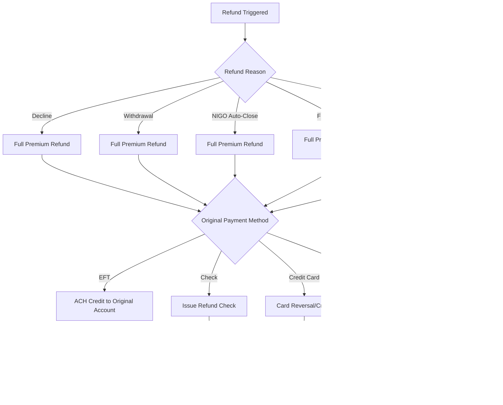
```mermaid
graph TD
    A[Refund Triggered] --> B{Refund Reason}
    B -->|Decline| C[Full Premium Refund]
    B -->|Withdrawal| D[Full Premium Refund]
    B -->|NIGO Auto-Close| E[Full Premium Refund]
    B -->|Free-Look Cancel| F[Full Premium Refund or AV Return]
    B -->|Overpayment| G[Excess Premium Refund]
    C --> H{Original Payment Method}
    D --> H
    E --> H
    F --> H
    G --> H
    H -->|EFT| I[ACH Credit to Original Account]
    H -->|Check| J[Issue Refund Check]
    H -->|Credit Card| K[Card Reversal/Credit]
    H -->|Wire| L[Wire Return]
    I --> M[Update Accounting]
    J --> M
    K --> M
    L --> M
    M --> N[Send Refund Notification]
```

---

## 9. Application Status Tracking

### 9.1 Status Code Taxonomy

| Status Code | Display Name | Description |
|-------------|-------------|-------------|
| `RECEIVED` | Application Received | Application received by carrier |
| `NIGO` | Incomplete Application | Application not in good order |
| `IGO` | In Good Order | Application complete, case created |
| `ASSIGNED` | Case Assigned | Assigned to processor/underwriter |
| `UW_IN_PROGRESS` | Under Review | Underwriting review in progress |
| `EVIDENCE_ORDERED` | Gathering Information | Medical/financial evidence ordered |
| `EVIDENCE_RECEIVED` | Information Received | Evidence received, awaiting review |
| `UW_DECISION` | Decision Made | Underwriting decision rendered |
| `APPROVED_STD` | Approved - Standard | Approved at standard rates |
| `APPROVED_PREF` | Approved - Preferred | Approved at preferred rates |
| `APPROVED_RATED` | Approved - Modified | Approved with rating/modification |
| `COUNTER_OFFER` | Counter Offer | Modified terms offered to applicant |
| `COUNTER_ACCEPTED` | Offer Accepted | Applicant accepted counter offer |
| `COUNTER_REJECTED` | Offer Declined | Applicant rejected counter offer |
| `PENDING_ISSUANCE` | Preparing Your Policy | Pre-issue checks in progress |
| `ISSUED` | Policy Issued | Policy contract generated |
| `DELIVERED` | Policy Delivered | Policy delivered to owner |
| `IN_FORCE` | Policy In Force | Free-look period passed, policy active |
| `DECLINED` | Not Approved | Application declined |
| `POSTPONED` | Postponed | Decision delayed pending future events |
| `WITHDRAWN` | Withdrawn | Applicant/agent withdrew application |
| `CLOSED_NIGO` | Closed - Incomplete | Closed due to unresolved NIGO |
| `CANCELLED_FREELOOK` | Cancelled - Free Look | Cancelled during free-look period |

### 9.2 Status History Tracking

Every status change is recorded with full audit detail:

```json
{
  "statusHistory": [
    {
      "statusCode": "RECEIVED",
      "effectiveTimestamp": "2025-01-15T14:30:00Z",
      "changedBy": "SYSTEM",
      "reason": "Application received via e-App channel"
    },
    {
      "statusCode": "NIGO",
      "effectiveTimestamp": "2025-01-15T14:31:00Z",
      "changedBy": "SYSTEM",
      "reason": "NIGO-006: Missing applicant signature page 3",
      "nigoReasons": ["NIGO-006"]
    },
    {
      "statusCode": "IGO",
      "effectiveTimestamp": "2025-01-17T10:15:00Z",
      "changedBy": "agent.jsmith",
      "reason": "Missing signature received"
    },
    {
      "statusCode": "ASSIGNED",
      "effectiveTimestamp": "2025-01-17T10:20:00Z",
      "changedBy": "SYSTEM",
      "reason": "Assigned to underwriter UW_THOMPSON via skill-based routing"
    }
  ]
}
```

### 9.3 Agent/Applicant Notifications

| Trigger Event | Agent Notification | Applicant Notification |
|--------------|-------------------|----------------------|
| Application received | Email + portal alert | Email/SMS confirmation |
| NIGO detected | Email with details + portal | Email (if contact info available) |
| NIGO resolved | Portal status update | N/A |
| Evidence ordered | Portal status update | Email for exam scheduling |
| UW decision - approved | Email + portal | N/A (policy delivery notification) |
| UW decision - declined | Email with reasons (FCRA) | Adverse action notice (FCRA) |
| Counter offer | Email + portal | Letter with offer details |
| Policy issued | Email + portal | Email + delivery notification |
| Premium refund | Email + portal | Refund notification |

### 9.4 Status Inquiry API

```yaml
openapi: 3.0.3
info:
  title: New Business Status API
  version: 1.0.0
paths:
  /api/v1/applications/{applicationId}/status:
    get:
      summary: Get current application status
      parameters:
        - name: applicationId
          in: path
          required: true
          schema:
            type: string
            format: uuid
      responses:
        '200':
          description: Current status
          content:
            application/json:
              schema:
                type: object
                properties:
                  applicationId:
                    type: string
                  applicationNumber:
                    type: string
                  currentStatus:
                    type: string
                  statusDisplayName:
                    type: string
                  statusTimestamp:
                    type: string
                    format: date-time
                  outstandingRequirements:
                    type: array
                    items:
                      type: object
                      properties:
                        requirementType:
                          type: string
                        status:
                          type: string
                        description:
                          type: string
                  estimatedCompletionDate:
                    type: string
                    format: date

  /api/v1/applications/{applicationId}/status/history:
    get:
      summary: Get full status history
      parameters:
        - name: applicationId
          in: path
          required: true
          schema:
            type: string
      responses:
        '200':
          description: Status history
          content:
            application/json:
              schema:
                type: array
                items:
                  type: object
                  properties:
                    statusCode:
                      type: string
                    displayName:
                      type: string
                    effectiveTimestamp:
                      type: string
                      format: date-time
                    changedBy:
                      type: string
                    reason:
                      type: string
```

---

## 10. Electronic Application (e-App)

### 10.1 E-Signature Integration

**Supported Providers**:

| Provider | Features | Integration Method |
|----------|----------|-------------------|
| DocuSign | Signing ceremony, templates, SMS delivery, audit trail | REST API, embedded signing |
| OneSpan Sign | E-signature, identity verification, white-labeled | REST API, embedded |
| Adobe Sign | Signing workflows, compliance, mega sign (bulk) | REST API, embedded |

**E-Signature Workflow**:

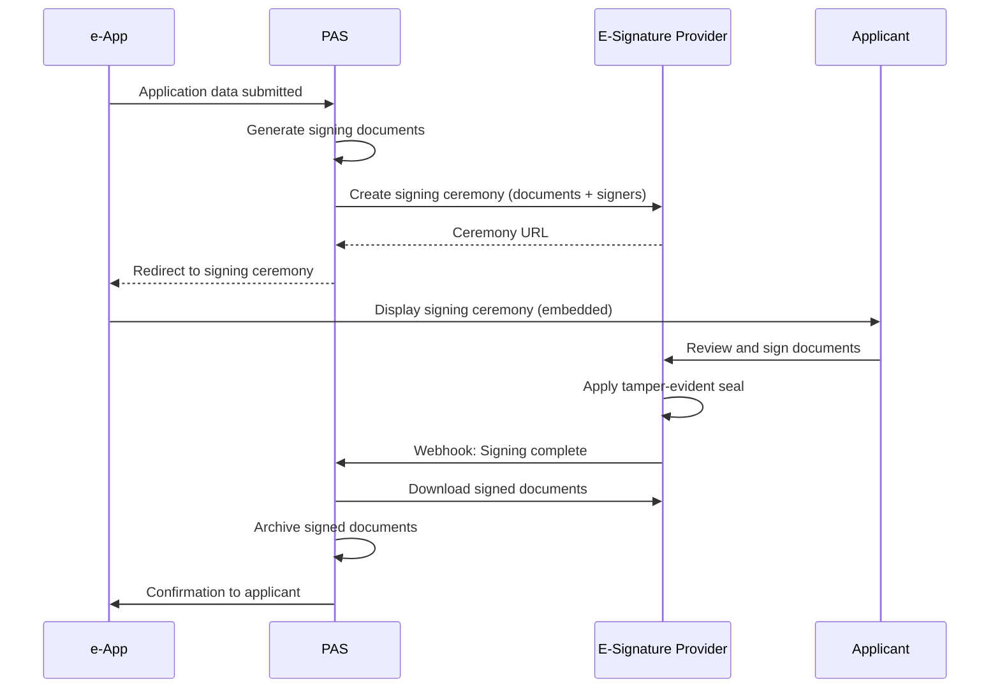
```mermaid
sequenceDiagram
    participant App as e-App
    participant PAS as PAS
    participant ESP as E-Signature Provider
    participant Signer as Applicant

    App->>PAS: Application data submitted
    PAS->>PAS: Generate signing documents
    PAS->>ESP: Create signing ceremony (documents + signers)
    ESP-->>PAS: Ceremony URL
    PAS-->>App: Redirect to signing ceremony
    App->>Signer: Display signing ceremony (embedded)
    Signer->>ESP: Review and sign documents
    ESP->>ESP: Apply tamper-evident seal
    ESP->>PAS: Webhook: Signing complete
    PAS->>ESP: Download signed documents
    PAS->>PAS: Archive signed documents
    PAS->>App: Confirmation to applicant
```

### 10.2 Reflexive Questioning Architecture

Reflexive questioning dynamically adjusts the application form based on prior answers, reducing applicant effort and improving data quality.

**Architecture Pattern**: A rules-driven question graph where each question node has zero or more conditional child nodes.

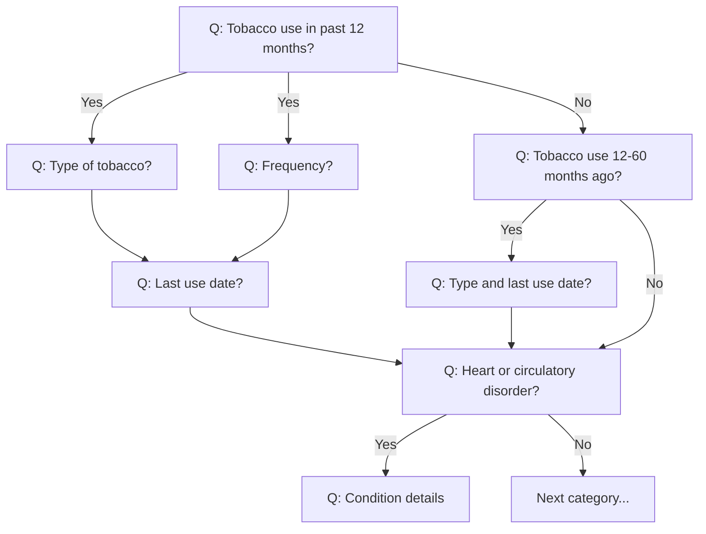
```mermaid
graph TD
    Q1[Q: Tobacco use in past 12 months?]
    Q1 -->|Yes| Q1a[Q: Type of tobacco?]
    Q1 -->|Yes| Q1b[Q: Frequency?]
    Q1 -->|No| Q2[Q: Tobacco use 12-60 months ago?]
    Q1a --> Q1c[Q: Last use date?]
    Q1b --> Q1c
    Q2 -->|Yes| Q2a[Q: Type and last use date?]
    Q2 -->|No| Q3[Q: Heart or circulatory disorder?]
    Q1c --> Q3
    Q2a --> Q3
    Q3 -->|Yes| Q3a[Q: Condition details]
    Q3 -->|No| Q4[Next category...]
```

### 10.3 Real-Time Validation Rules

```json
{
  "validationRules": [
    {
      "field": "proposedInsured.dateOfBirth",
      "rules": [
        {"type": "REQUIRED", "message": "Date of birth is required"},
        {"type": "DATE_FORMAT", "format": "YYYY-MM-DD", "message": "Invalid date format"},
        {"type": "MIN_AGE", "value": 0, "message": "Invalid date of birth"},
        {"type": "MAX_AGE", "value": 85, "message": "Applicant exceeds maximum issue age"},
        {"type": "NOT_FUTURE", "message": "Date of birth cannot be in the future"}
      ]
    },
    {
      "field": "proposedInsured.ssn",
      "rules": [
        {"type": "REQUIRED", "message": "SSN is required"},
        {"type": "PATTERN", "regex": "^(?!000|666|9\\d{2})\\d{3}-(?!00)\\d{2}-(?!0{4})\\d{4}$", "message": "Invalid SSN format"},
        {"type": "CUSTOM", "function": "validateSSN_ITIN", "message": "SSN/ITIN validation failed"}
      ]
    },
    {
      "field": "coverageDetails.faceAmount",
      "rules": [
        {"type": "REQUIRED", "message": "Face amount is required"},
        {"type": "MIN_VALUE", "value": 25000, "message": "Minimum face amount is $25,000"},
        {"type": "MAX_VALUE", "value": 65000000, "message": "Maximum face amount is $65,000,000"},
        {"type": "INCREMENT", "value": 1000, "message": "Face amount must be in increments of $1,000"},
        {"type": "CROSS_FIELD", "function": "validateFaceAmountToIncome", "message": "Face amount exceeds income multiple guideline"}
      ]
    }
  ]
}
```

### 10.4 Data Pre-Fill from CRM

**Integration Architecture**:

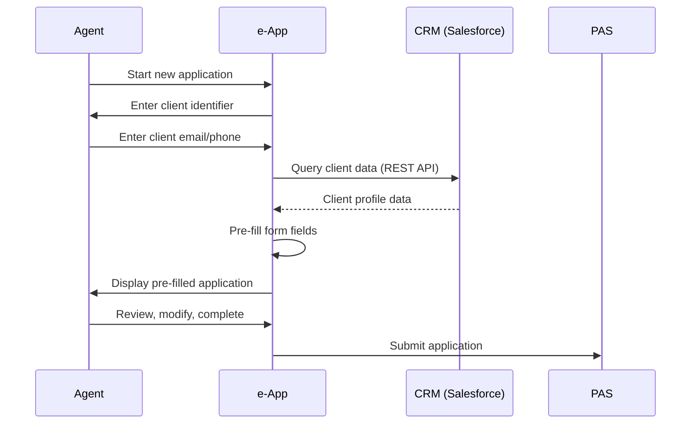
```mermaid
sequenceDiagram
    participant Agent as Agent
    participant eApp as e-App
    participant CRM as CRM (Salesforce)
    participant PAS as PAS

    Agent->>eApp: Start new application
    eApp->>Agent: Enter client identifier
    Agent->>eApp: Enter client email/phone
    eApp->>CRM: Query client data (REST API)
    CRM-->>eApp: Client profile data
    eApp->>eApp: Pre-fill form fields
    eApp->>Agent: Display pre-filled application
    Agent->>eApp: Review, modify, complete
    eApp->>PAS: Submit application
```

### 10.5 Photo ID Capture

For identity verification and compliance:

- **Front-end**: Camera access via browser API (getUserMedia) or native camera.
- **Image Processing**: Crop, deskew, enhance.
- **OCR**: Extract data from ID (name, DOB, address, ID number).
- **Verification**: Compare extracted data against application data.
- **Storage**: Encrypted image storage per PII retention policies.

---

## 11. Third-Party Data Integration

### 11.1 MIB (Medical Information Bureau)

**Purpose**: MIB is a member-owned organization that maintains coded medical information from prior insurance applications. Carriers query MIB to detect omissions or inconsistencies in medical history disclosure.

**Integration**:

| Aspect | Detail |
|--------|--------|
| Query timing | At case creation or underwriting initiation |
| Query data | Name, DOB, SSN, gender |
| Response | Coded medical conditions (000-999 codes), prior application activity |
| Format | ACORD TXLife or proprietary API |
| Regulatory | Applicant must authorize MIB check; FCRA applies |
| Follow-up | MIB hits require underwriter review; codes don't prove insurability |

**Sample MIB Codes**:

| Code Range | Category |
|-----------|----------|
| 001-099 | Cardiovascular |
| 100-199 | Cancer/Neoplasm |
| 200-299 | Endocrine/Metabolic |
| 300-399 | Respiratory |
| 400-499 | Neurological |
| 500-599 | Mental/Behavioral |
| 600-699 | Musculoskeletal |
| 700-799 | Blood/Immune |
| 800-899 | Hazardous Activities |
| 900-999 | Financial/Administrative |

### 11.2 MVR (Motor Vehicle Report)

**Purpose**: Retrieve driving record to assess risk from DUI/DWI, reckless driving, moving violations, and license suspensions.

**Integration Architecture**:

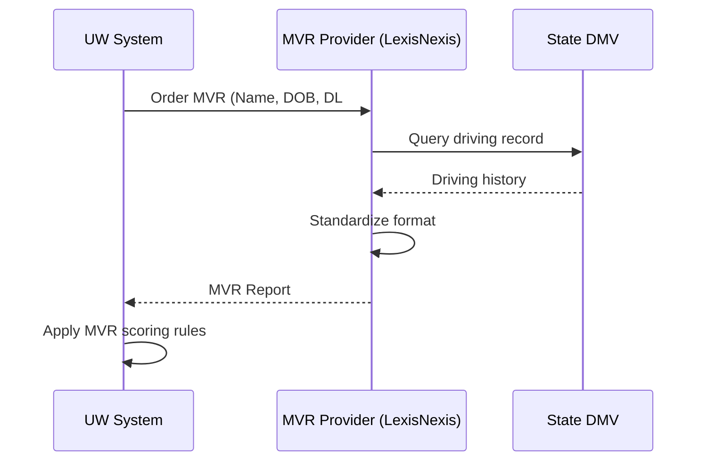
```mermaid
sequenceDiagram
    participant UW as UW System
    participant MVR as MVR Provider (LexisNexis)
    participant DMV as State DMV

    UW->>MVR: Order MVR (Name, DOB, DL#, State)
    MVR->>DMV: Query driving record
    DMV-->>MVR: Driving history
    MVR->>MVR: Standardize format
    MVR-->>UW: MVR Report
    UW->>UW: Apply MVR scoring rules
```

### 11.3 Prescription History (Rx)

**Purpose**: Retrieve prescription medication history to identify undisclosed medical conditions (e.g., insulin = diabetes, SSRIs = depression/anxiety, antiretrovirals = HIV).

**Vendors**: Milliman IntelliScript, ExamOne/Quest ScriptCheck.

**Key Rx Indicators**:

| Medication Class | Indicates |
|-----------------|-----------|
| Metformin, Insulin | Diabetes |
| Statins (Atorvastatin, Rosuvastatin) | Hyperlipidemia |
| ACE Inhibitors, ARBs | Hypertension |
| SSRIs, SNRIs | Depression/Anxiety |
| Anticoagulants (Warfarin, Eliquis) | Blood clot risk, A-fib |
| Opioids | Chronic pain, potential substance abuse |
| Benzodiazepines | Anxiety, seizures |
| Antiretrovirals | HIV |
| Biologics (Humira, Enbrel) | Autoimmune disorders |

### 11.4 Credit-Based Insurance Scoring

**Purpose**: Some states allow credit-based scoring as a factor in underwriting (primarily for accelerated/simplified underwriting programs).

**Regulatory Considerations**:
- Prohibited in some states (CA, MD, HI for life insurance)
- FCRA adverse action notice required if score negatively impacts decision
- Score used as one factor, not sole determinant

### 11.5 Identity Verification

| Service | Provider | Purpose |
|---------|----------|---------|
| SSN Verification | LexisNexis, Experian | Verify SSN matches name and DOB |
| Address Verification | USPS, LexisNexis | Validate address and residency |
| OFAC Screening | Treasury SDN List | Sanctions check |
| PEP Screening | Dow Jones, World-Check | Politically exposed persons |
| Death Master File | NTIS/SSA | Verify proposed insured is alive |

### 11.6 Electronic Health Records (EHR)

**Emerging integration** for accelerated underwriting:

- **FHIR API**: HL7 FHIR R4 standard for EHR data exchange.
- **Patient consent**: Applicant authorizes EHR access via HIPAA-compliant consent.
- **Data elements**: Diagnoses, medications, lab results, vital signs, procedures.
- **Vendors**: Human API, Veridian, Ciox Health.

---

## 12. Complete ERD for Application/Case Management

### 12.1 Entity Relationship Diagram


```mermaid
erDiagram
    APPLICATION ||--o{ PROPOSED_INSURED : has
    APPLICATION ||--|| OWNER : has
    APPLICATION ||--o{ BENEFICIARY : has
    APPLICATION ||--o{ COVERAGE : includes
    APPLICATION ||--o{ RIDER : includes
    APPLICATION ||--|| PAYMENT_METHOD : has
    APPLICATION ||--o{ EXISTING_INSURANCE : declares
    APPLICATION ||--o{ AGENT_ASSIGNMENT : has
    APPLICATION ||--o{ MEDICAL_HISTORY : contains
    APPLICATION ||--o{ AVIATION_AVOCATION : contains
    APPLICATION ||--o{ FINANCIAL_DATA : contains
    APPLICATION ||--|| SUITABILITY_DATA : has
    APPLICATION ||--o{ APPLICATION_DOCUMENT : has
    APPLICATION ||--o{ APPLICATION_STATUS_HISTORY : tracks
    APPLICATION ||--|| CASE : creates

    CASE ||--o{ CASE_NOTE : has
    CASE ||--o{ CASE_ASSIGNMENT : tracks
    CASE ||--o{ CASE_ESCALATION : has
    CASE ||--o{ REQUIREMENT : orders
    CASE ||--o{ NIGO_ITEM : has
    CASE ||--o{ CASE_STATUS_HISTORY : tracks
    CASE ||--|| SUITABILITY_REVIEW : undergoes
    CASE ||--o| REPLACEMENT_TRACKING : tracks
    CASE ||--o| PREMIUM_DEPOSIT : holds
    CASE ||--o{ CASE_SLA_TRACKING : monitors
    CASE ||--|| UNDERWRITING_DECISION : receives

    REQUIREMENT ||--o| VENDOR_ORDER : triggers
    REQUIREMENT ||--o{ REQUIREMENT_FOLLOW_UP : has
    REQUIREMENT ||--o{ REQUIREMENT_DOCUMENT : has

    REPLACEMENT_TRACKING ||--o{ REPLACEMENT_FORM : requires
    REPLACEMENT_TRACKING ||--o| EXCHANGE_1035 : has
    REPLACEMENT_TRACKING ||--o| COMPARISON_LEDGER : generates

    PROPOSED_INSURED ||--o{ MEDICAL_HISTORY : has
    PROPOSED_INSURED ||--o{ PHYSICIAN_INFO : has

    BENEFICIARY }o--|| COVERAGE : "designated for"

    APPLICATION {
        uuid application_id PK
        string application_number
        date application_date
        timestamp received_date
        string channel_code
        string product_code
        string state_of_issue
        boolean replacement_indicator
        decimal initial_premium_amount
        string premium_mode
        string application_status
    }

    PROPOSED_INSURED {
        uuid proposed_insured_id PK
        uuid application_id FK
        string party_role_code
        string first_name
        string last_name
        date date_of_birth
        string gender
        string ssn_encrypted
        boolean tobacco_indicator
        int height_feet
        int height_inches
        decimal weight_pounds
        string occupation
        decimal annual_income
    }

    OWNER {
        uuid owner_id PK
        uuid application_id FK
        string owner_type
        boolean same_as_insured
        string entity_name
        string tax_id_encrypted
        string relationship
    }

    BENEFICIARY {
        uuid beneficiary_id PK
        uuid application_id FK
        uuid coverage_id FK
        string designation_type
        string beneficiary_type
        string revocability_type
        string distribution_type
        decimal share_percentage
        string first_name
        string last_name
        string relationship
    }

    COVERAGE {
        uuid coverage_id PK
        uuid application_id FK
        string coverage_type
        string product_code
        decimal face_amount
        decimal premium_amount
        int coverage_period
        uuid insured_party_id FK
    }

    CASE {
        uuid case_id PK
        uuid application_id FK
        string case_number
        string case_status
        string assigned_to
        timestamp created_date
        int priority
        date sla_target_date
    }

    REQUIREMENT {
        uuid requirement_id PK
        uuid case_id FK
        string requirement_type
        string requirement_status
        string vendor_code
        date ordered_date
        date received_date
        date expiration_date
    }

    NIGO_ITEM {
        uuid nigo_item_id PK
        uuid case_id FK
        string nigo_code
        string nigo_description
        string severity
        date identified_date
        date resolved_date
        string resolved_by
    }

    UNDERWRITING_DECISION {
        uuid decision_id PK
        uuid case_id FK
        string decision_type
        string risk_class
        string table_rating
        decimal flat_extra
        date decision_date
        string decided_by
    }
```

### 12.2 Complete Entity Listing (30+ Entities)

| # | Entity | Description |
|---|--------|-------------|
| 1 | APPLICATION | Master application record |
| 2 | PROPOSED_INSURED | Person(s) to be insured |
| 3 | OWNER | Policy owner information |
| 4 | BENEFICIARY | Beneficiary designations |
| 5 | COVERAGE | Base coverage and rider coverages |
| 6 | RIDER | Rider-specific details |
| 7 | PAYMENT_METHOD | Premium payment information |
| 8 | EXISTING_INSURANCE | Declared existing insurance policies |
| 9 | AGENT_ASSIGNMENT | Agent/producer associations |
| 10 | MEDICAL_HISTORY | Health history responses |
| 11 | MEDICAL_CONDITION_DETAIL | Specific condition details |
| 12 | PHYSICIAN_INFO | Treating physician information |
| 13 | AVIATION_AVOCATION | Hazardous activity data |
| 14 | FINANCIAL_DATA | Financial information for underwriting |
| 15 | SUITABILITY_DATA | Suitability questionnaire responses |
| 16 | APPLICATION_DOCUMENT | Attached documents |
| 17 | APPLICATION_STATUS_HISTORY | Status change audit trail |
| 18 | CASE | Case management record |
| 19 | CASE_NOTE | Case notes and diary entries |
| 20 | CASE_ASSIGNMENT | Assignment history |
| 21 | CASE_ESCALATION | Escalation records |
| 22 | CASE_STATUS_HISTORY | Case status audit trail |
| 23 | CASE_SLA_TRACKING | SLA monitoring records |
| 24 | REQUIREMENT | Evidence/requirement orders |
| 25 | REQUIREMENT_FOLLOW_UP | Follow-up tracking |
| 26 | REQUIREMENT_DOCUMENT | Received requirement documents |
| 27 | VENDOR_ORDER | External vendor order tracking |
| 28 | NIGO_ITEM | NIGO reason tracking |
| 29 | NIGO_NOTIFICATION | NIGO communication log |
| 30 | SUITABILITY_REVIEW | Suitability determination record |
| 31 | REPLACEMENT_TRACKING | Replacement processing record |
| 32 | REPLACEMENT_FORM | Replacement form tracking |
| 33 | EXCHANGE_1035 | 1035 exchange detail |
| 34 | COMPARISON_LEDGER | Replacement comparison data |
| 35 | PREMIUM_DEPOSIT | Initial premium suspense tracking |
| 36 | PREMIUM_REFUND | Refund processing record |
| 37 | CONDITIONAL_RECEIPT | Conditional receipt tracking |
| 38 | UNDERWRITING_DECISION | UW decision record |
| 39 | E_SIGNATURE_CEREMONY | E-signature tracking |
| 40 | THIRD_PARTY_DATA_REQUEST | Third-party data order log |

---

## 13. ACORD TXLife 103 Deep Dive

### 13.1 Overview

ACORD **TXLife Transaction Code 103** is the standard message for submitting a new life insurance application. It is part of the ACORD Life & Annuity XML standard (TXLife).

### 13.2 Message Structure

```
TXLife
├── UserAuthRequest (authentication)
├── TXLifeRequest
│   ├── TransRefGUID (unique transaction reference)
│   ├── TransType (tc="103" — New Application)
│   ├── TransSubType
│   ├── TransExeDate
│   ├── TransExeTime
│   └── OLifE
│       ├── SourceInfo
│       │   ├── CreationDate
│       │   ├── CreationTime
│       │   └── SourceInfoName
│       ├── Holding (the application/policy)
│       │   ├── HoldingTypeCode (tc="2" — Policy)
│       │   ├── HoldingSysKey
│       │   ├── Policy
│       │   │   ├── ProductCode
│       │   │   ├── CarrierCode
│       │   │   ├── PlanName
│       │   │   ├── PolicyStatus (tc="12" — Pending)
│       │   │   ├── FaceAmt
│       │   │   ├── PaymentMode
│       │   │   ├── PaymentAmt
│       │   │   ├── ApplicationInfo
│       │   │   │   ├── ApplicationType
│       │   │   │   ├── TrackingID
│       │   │   │   ├── SignedDate
│       │   │   │   ├── SubmissionDate
│       │   │   │   ├── ApplicationJurisdiction
│       │   │   │   ├── ReplacementInd
│       │   │   │   └── HOAssignedAppNumber
│       │   │   ├── Life/AnnuityProduct specific
│       │   │   │   ├── FaceAmt
│       │   │   │   ├── Coverage (multiple)
│       │   │   │   └── Rider (multiple)
│       │   │   └── RequirementInfo (multiple)
│       │   └── Banking
│       │       ├── BankAcctType
│       │       ├── RoutingNum
│       │       └── AccountNumber
│       ├── Party (multiple — insured, owner, beneficiary, agent)
│       │   ├── PartyTypeCode
│       │   ├── FullName
│       │   ├── GovtID (SSN/EIN)
│       │   ├── Person
│       │   │   ├── FirstName
│       │   │   ├── LastName
│       │   │   ├── BirthDate
│       │   │   ├── Gender
│       │   │   ├── Height2
│       │   │   ├── Weight2
│       │   │   ├── Occupation
│       │   │   ├── SmokerStat
│       │   │   └── RiskRights (medical history)
│       │   ├── Organization (for trust/corp owners)
│       │   ├── Address (multiple)
│       │   ├── Phone (multiple)
│       │   └── EMailAddress (multiple)
│       └── Relation (multiple — defines relationships)
│           ├── OriginatingObjectID
│           ├── RelatedObjectID
│           ├── RelationRoleCode
│           └── BeneficiaryDesignation
```

### 13.3 Full XML Example

```xml
<?xml version="1.0" encoding="UTF-8"?>
<TXLife xmlns="http://ACORD.org/Standards/Life/2"
        xmlns:xsi="http://www.w3.org/2001/XMLSchema-instance"
        version="2.43.00">
  <UserAuthRequest>
    <UserLoginName>CARRIER_API_USER</UserLoginName>
    <UserPswd>
      <CryptType>NONE</CryptType>
      <Pswd>encrypted_token_here</Pswd>
    </UserPswd>
  </UserAuthRequest>

  <TXLifeRequest PrimaryObjectID="Holding_1">
    <TransRefGUID>a1b2c3d4-e5f6-7890-abcd-ef1234567890</TransRefGUID>
    <TransType tc="103">New Business Application</TransType>
    <TransSubType tc="10301">Initial Submission</TransSubType>
    <TransExeDate>2025-01-15</TransExeDate>
    <TransExeTime>14:30:00</TransExeTime>
    <TransMode tc="2">Original</TransMode>

    <OLifE>
      <SourceInfo>
        <CreationDate>2025-01-15</CreationDate>
        <CreationTime>14:30:00</CreationTime>
        <SourceInfoName>AgentPortal_v3.2</SourceInfoName>
      </SourceInfo>

      <!-- ========== HOLDING (Application/Policy) ========== -->
      <Holding id="Holding_1">
        <HoldingTypeCode tc="2">Policy</HoldingTypeCode>
        <HoldingSysKey>APP-2025-00012345</HoldingSysKey>
        <Policy>
          <PolNumber/>
          <ProductCode>TERM20_2024</ProductCode>
          <CarrierCode>ABC_LIFE</CarrierCode>
          <PlanName>20-Year Level Term</PlanName>
          <LineOfBusiness tc="1">Life</LineOfBusiness>
          <PolicyStatus tc="12">Pending</PolicyStatus>
          <Jurisdiction tc="6">California</Jurisdiction>
          <FaceAmt>500000.00</FaceAmt>
          <PaymentMode tc="4">Monthly</PaymentMode>
          <PaymentAmt>52.50</PaymentAmt>

          <ApplicationInfo>
            <ApplicationType tc="1">New</ApplicationType>
            <TrackingID>TRK-20250115-001234</TrackingID>
            <HOAssignedAppNumber>APP-2025-00012345</HOAssignedAppNumber>
            <SignedDate>2025-01-15</SignedDate>
            <SubmissionDate>2025-01-15</SubmissionDate>
            <SubmissionType tc="3">Electronic</SubmissionType>
            <ApplicationJurisdiction tc="6">California</ApplicationJurisdiction>
            <FormalAppInd tc="1">true</FormalAppInd>
            <ReplacementInd tc="0">false</ReplacementInd>
          </ApplicationInfo>

          <Life>
            <FaceAmt>500000.00</FaceAmt>
            <Coverage id="Coverage_Base">
              <IndicatorCode tc="1">Base</IndicatorCode>
              <LifeCovTypeCode tc="9">Term Life</LifeCovTypeCode>
              <CurrentAmt>500000.00</CurrentAmt>
              <CovOption id="Rider_WP">
                <LifeCovOptTypeCode tc="20">Waiver of Premium</LifeCovOptTypeCode>
              </CovOption>
              <CovOption id="Rider_ADB">
                <LifeCovOptTypeCode tc="1">Accidental Death Benefit</LifeCovOptTypeCode>
                <BenefitAmt>500000.00</BenefitAmt>
              </CovOption>
            </Coverage>
          </Life>
        </Policy>

        <!-- Banking/Payment Information -->
        <Banking id="Banking_1">
          <BankAcctType tc="1">Checking</BankAcctType>
          <RoutingNum>021000021</RoutingNum>
          <AccountNumber>ENCRYPTED_ACCT_NUM</AccountNumber>
          <AcctHolderName>John A. Doe</AcctHolderName>
          <BankName>Chase Bank</BankName>
          <CreditDebitType tc="2">Debit</CreditDebitType>
        </Banking>
      </Holding>

      <!-- ========== PARTY: Proposed Insured ========== -->
      <Party id="Party_Insured_1">
        <PartyTypeCode tc="1">Person</PartyTypeCode>
        <GovtID>***-**-1234</GovtID>
        <GovtIDTC tc="1">SSN</GovtIDTC>
        <Person>
          <FirstName>John</FirstName>
          <MiddleName>Andrew</MiddleName>
          <LastName>Doe</LastName>
          <Suffix>Jr</Suffix>
          <BirthDate>1985-03-15</BirthDate>
          <Gender tc="1">Male</Gender>
          <Age>39</Age>
          <Citizenship tc="1">US</Citizenship>
          <Height2>
            <MeasureUnits tc="1">Feet and Inches</MeasureUnits>
            <MeasureValue>5'11"</MeasureValue>
          </Height2>
          <Weight2>
            <MeasureUnits tc="5">Pounds</MeasureUnits>
            <MeasureValue>185</MeasureValue>
          </Weight2>
          <SmokerStat tc="1">Never</SmokerStat>
          <Occupation>Software Engineer</Occupation>
          <OccupClass tc="1">Professional</OccupClass>
          <AnnualIncome>175000.00</AnnualIncome>
          <NetWorth>850000.00</NetWorth>
          <DriversLicenseNum>D1234567</DriversLicenseNum>
          <DriversLicenseState tc="6">CA</DriversLicenseState>
        </Person>
        <Address>
          <AddressTypeCode tc="1">Residence</AddressTypeCode>
          <Line1>123 Main Street</Line1>
          <Line2>Apt 4B</Line2>
          <City>San Francisco</City>
          <AddressStateTC tc="6">CA</AddressStateTC>
          <Zip>94102</Zip>
        </Address>
        <Phone>
          <PhoneTypeCode tc="1">Home</PhoneTypeCode>
          <AreaCode>415</AreaCode>
          <DialNumber>5550123</DialNumber>
        </Phone>
        <Phone>
          <PhoneTypeCode tc="12">Mobile</PhoneTypeCode>
          <AreaCode>415</AreaCode>
          <DialNumber>5550456</DialNumber>
        </Phone>
        <EMailAddress>
          <AddrLine>john.doe@example.com</AddrLine>
          <EMailType tc="2">Personal</EMailType>
        </EMailAddress>
      </Party>

      <!-- ========== PARTY: Primary Beneficiary ========== -->
      <Party id="Party_Bene_1">
        <PartyTypeCode tc="1">Person</PartyTypeCode>
        <Person>
          <FirstName>Jane</FirstName>
          <LastName>Doe</LastName>
          <BirthDate>1987-07-22</BirthDate>
          <Gender tc="2">Female</Gender>
        </Person>
      </Party>

      <!-- ========== PARTY: Writing Agent ========== -->
      <Party id="Party_Agent_1">
        <PartyTypeCode tc="1">Person</PartyTypeCode>
        <Person>
          <FirstName>Robert</FirstName>
          <LastName>Smith</LastName>
        </Person>
        <Producer>
          <CarrierAppointment>
            <CompanyProducerID>AGT-2024-00451</CompanyProducerID>
          </CarrierAppointment>
          <NationalProducerNumber>12345678</NationalProducerNumber>
        </Producer>
      </Party>

      <!-- ========== RELATIONS ========== -->
      <!-- Insured to Holding -->
      <Relation id="Rel_1"
                OriginatingObjectID="Party_Insured_1"
                RelatedObjectID="Holding_1"
                RelationRoleCode="32">
        <!-- tc="32" = Insured -->
      </Relation>

      <!-- Owner to Holding -->
      <Relation id="Rel_2"
                OriginatingObjectID="Party_Insured_1"
                RelatedObjectID="Holding_1"
                RelationRoleCode="8">
        <!-- tc="8" = Owner -->
      </Relation>

      <!-- Primary Beneficiary to Coverage -->
      <Relation id="Rel_3"
                OriginatingObjectID="Party_Bene_1"
                RelatedObjectID="Coverage_Base"
                RelationRoleCode="34">
        <!-- tc="34" = Beneficiary -->
        <BeneficiaryDesignation tc="1">Primary</BeneficiaryDesignation>
        <InterestPercent>100.00</InterestPercent>
        <RelationDescription>Spouse</RelationDescription>
        <BeneficiaryDistributionOption tc="2">Per Stirpes</BeneficiaryDistributionOption>
      </Relation>

      <!-- Agent to Holding -->
      <Relation id="Rel_4"
                OriginatingObjectID="Party_Agent_1"
                RelatedObjectID="Holding_1"
                RelationRoleCode="37">
        <!-- tc="37" = Agent -->
        <CommissionPct>100.00</CommissionPct>
      </Relation>

      <!-- Insured to Beneficiary relationship -->
      <Relation id="Rel_5"
                OriginatingObjectID="Party_Insured_1"
                RelatedObjectID="Party_Bene_1"
                RelationRoleCode="1">
        <!-- tc="1" = Spouse -->
      </Relation>

    </OLifE>
  </TXLifeRequest>
</TXLife>
```

### 13.4 Key ACORD TXLife Elements Reference

| Element | Location | Description |
|---------|----------|-------------|
| `TransType tc="103"` | TXLifeRequest | New application transaction |
| `HoldingTypeCode tc="2"` | Holding | Policy holding |
| `PolicyStatus tc="12"` | Policy | Pending status |
| `LineOfBusiness tc="1"` | Policy | Life insurance |
| `ApplicationType tc="1"` | ApplicationInfo | New application |
| `SubmissionType tc="3"` | ApplicationInfo | Electronic submission |
| `IndicatorCode tc="1"` | Coverage | Base coverage |
| `LifeCovTypeCode tc="9"` | Coverage | Term life |
| `PartyTypeCode tc="1"` | Party | Person (vs. Organization) |
| `GovtIDTC tc="1"` | Party | SSN |
| `Gender tc="1"` | Person | Male |
| `SmokerStat tc="1"` | Person | Never smoked |
| `RelationRoleCode tc="32"` | Relation | Insured |
| `RelationRoleCode tc="8"` | Relation | Owner |
| `RelationRoleCode tc="34"` | Relation | Beneficiary |
| `RelationRoleCode tc="37"` | Relation | Agent/Producer |
| `BeneficiaryDesignation tc="1"` | Relation | Primary beneficiary |

---

## 14. BPMN Process Flows

### 14.1 End-to-End New Business Process

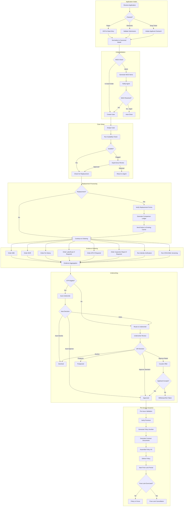
```mermaid
graph TB
    subgraph "Application Intake"
        A1[Receive Application] --> A2{Channel?}
        A2 -->|Paper| A3[OCR & Data Entry]
        A2 -->|Electronic| A4[Validate Submission]
        A2 -->|Drop-Ticket| A5[Initiate Applicant Outreach]
        A3 --> A6[Normalize to Canonical Model]
        A4 --> A6
        A5 --> A6
    end

    subgraph "Initial Validation"
        A6 --> B1{NIGO Check}
        B1 -->|In Good Order| B2[Create Case]
        B1 -->|NIGO| B3[Generate NIGO Items]
        B3 --> B4[Notify Agent]
        B4 --> B5{NIGO Resolved?}
        B5 -->|Yes| B2
        B5 -->|No - Aged| B6[Auto-Close]
    end

    subgraph "Case Setup"
        B2 --> C1[Assign Case]
        C1 --> C2[Run Suitability Check]
        C2 --> C3{Suitable?}
        C3 -->|Yes| C4[Check for Replacement]
        C3 -->|Flagged| C5[Supervisory Review]
        C5 -->|Approved| C4
        C5 -->|Rejected| C6[Return to Agent]
    end

    subgraph "Replacement Processing"
        C4 --> D1{Replacement?}
        D1 -->|No| D5[Continue to Ordering]
        D1 -->|Yes| D2[Verify Replacement Forms]
        D2 --> D3[Generate Comparison Ledger]
        D3 --> D4[Send Notice to Existing Carrier]
        D4 --> D5
    end

    subgraph "Evidence Ordering"
        D5 --> E1[Order MIB]
        D5 --> E2[Order MVR]
        D5 --> E3[Order Rx History]
        D5 --> E4[Order Labs/Exam if Required]
        D5 --> E5[Order APS if Required]
        D5 --> E6[Order Inspection Report if Required]
        D5 --> E7[Run Identity Verification]
        D5 --> E8[Run OFAC/AML Screening]
        E1 --> F1[Evidence Aggregation]
        E2 --> F1
        E3 --> F1
        E4 --> F1
        E5 --> F1
        E6 --> F1
        E7 --> F1
        E8 --> F1
    end

    subgraph "Underwriting"
        F1 --> G1{STP Eligible?}
        G1 -->|Yes| G2[Auto-Underwrite]
        G1 -->|No| G3[Route to Underwriter]
        G2 --> G4{Auto Decision}
        G4 -->|Auto-Approve| G7[Approved]
        G4 -->|Auto-Decline| G8[Declined]
        G4 -->|Refer| G3
        G3 --> G5[Underwriter Review]
        G5 --> G6{UW Decision}
        G6 -->|Approve Standard| G7
        G6 -->|Approve Rated| G9[Counter Offer]
        G6 -->|Decline| G8
        G6 -->|Postpone| G10[Postponed]
        G9 --> G11{Applicant Accepts?}
        G11 -->|Yes| G7
        G11 -->|No| G12[Withdrawn/Not Taken]
    end

    subgraph "Pre-Issue & Issuance"
        G7 --> H1[Pre-Issue Validation]
        H1 --> H2[Verify Premium]
        H2 --> H3[Generate Policy Number]
        H3 --> H4[Generate Contract Documents]
        H4 --> H5[Assemble Policy Kit]
        H5 --> H6[Deliver Policy]
        H6 --> H7[Start Free-Look Period]
        H7 --> H8{Free-Look Exercised?}
        H8 -->|No| H9[Policy In Force]
        H8 -->|Yes| H10[Free-Look Cancellation]
    end
```

### 14.2 NIGO Resolution Sub-Process (Detailed)

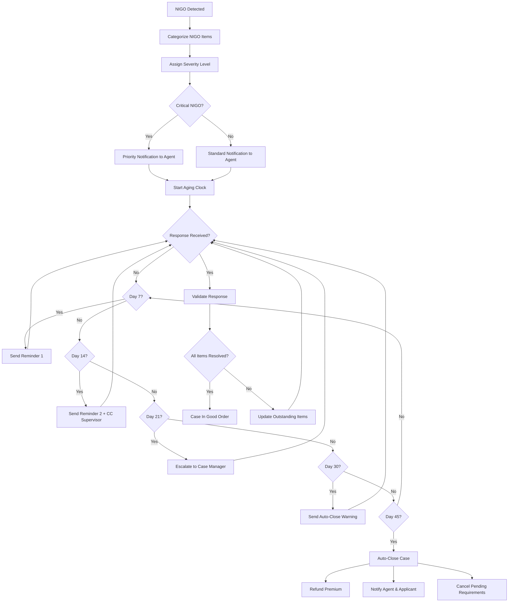
```mermaid
graph TD
    N1[NIGO Detected] --> N2[Categorize NIGO Items]
    N2 --> N3[Assign Severity Level]
    N3 --> N4{Critical NIGO?}
    N4 -->|Yes| N5[Priority Notification to Agent]
    N4 -->|No| N6[Standard Notification to Agent]
    N5 --> N7[Start Aging Clock]
    N6 --> N7
    N7 --> N8{Response Received?}
    N8 -->|Yes| N9[Validate Response]
    N8 -->|No| N10{Day 7?}
    N10 -->|Yes| N11[Send Reminder 1]
    N10 -->|No| N12{Day 14?}
    N12 -->|Yes| N13[Send Reminder 2 + CC Supervisor]
    N12 -->|No| N14{Day 21?}
    N14 -->|Yes| N15[Escalate to Case Manager]
    N14 -->|No| N16{Day 30?}
    N16 -->|Yes| N17[Send Auto-Close Warning]
    N16 -->|No| N18{Day 45?}
    N18 -->|Yes| N19[Auto-Close Case]
    N18 -->|No| N10
    N11 --> N8
    N13 --> N8
    N15 --> N8
    N17 --> N8
    N9 --> N20{All Items Resolved?}
    N20 -->|Yes| N21[Case In Good Order]
    N20 -->|No| N22[Update Outstanding Items]
    N22 --> N8
    N19 --> N23[Refund Premium]
    N19 --> N24[Notify Agent & Applicant]
    N19 --> N25[Cancel Pending Requirements]
```

### 14.3 Evidence Ordering Sub-Process

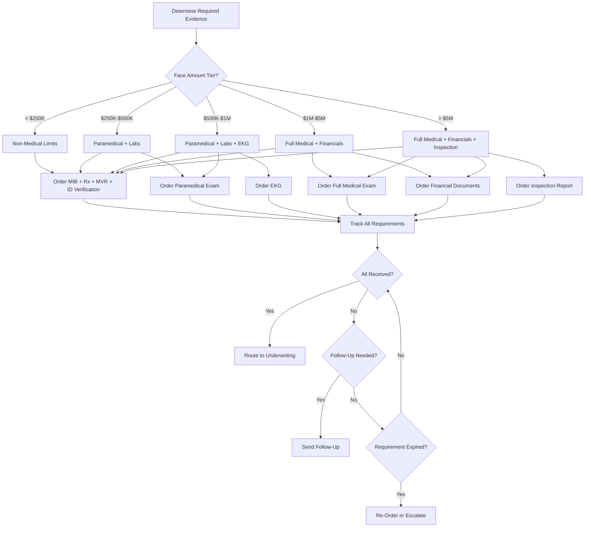
```mermaid
graph TD
    E1[Determine Required Evidence] --> E2{Face Amount Tier?}
    E2 -->|< $250K| E3[Non-Medical Limits]
    E2 -->|$250K-$500K| E4[Paramedical + Labs]
    E2 -->|$500K-$1M| E5[Paramedical + Labs + EKG]
    E2 -->|$1M-$5M| E6[Full Medical + Financials]
    E2 -->|> $5M| E7[Full Medical + Financials + Inspection]

    E3 --> E8[Order MIB + Rx + MVR + ID Verification]
    E4 --> E8
    E4 --> E9[Order Paramedical Exam]
    E5 --> E8
    E5 --> E9
    E5 --> E10[Order EKG]
    E6 --> E8
    E6 --> E11[Order Full Medical Exam]
    E6 --> E12[Order Financial Documents]
    E7 --> E8
    E7 --> E11
    E7 --> E12
    E7 --> E13[Order Inspection Report]

    E8 --> E14[Track All Requirements]
    E9 --> E14
    E10 --> E14
    E11 --> E14
    E12 --> E14
    E13 --> E14

    E14 --> E15{All Received?}
    E15 -->|Yes| E16[Route to Underwriting]
    E15 -->|No| E17{Follow-Up Needed?}
    E17 -->|Yes| E18[Send Follow-Up]
    E17 -->|No| E19{Requirement Expired?}
    E19 -->|Yes| E20[Re-Order or Escalate]
    E19 -->|No| E15
```

---

## 15. Straight-Through Processing (STP) Design

### 15.1 STP Philosophy

STP aims to process applications from submission to issuance with minimal or zero human intervention, reducing cycle time from weeks to minutes.

**STP Eligibility Tiers**:

| Tier | Name | Criteria | Expected Outcome |
|------|------|----------|-----------------|
| Tier 1 | Jet Issue | Simple product, low face, clean data, all auto-checks pass | Issue in < 15 minutes |
| Tier 2 | Auto-Approve | Moderate face, all evidence favorable, rules engine approves | Issue in < 24 hours |
| Tier 3 | Fast-Track | Some manual evidence review needed, but straightforward | Issue in < 5 business days |
| Tier 4 | Full Underwrite | Complex case, manual underwriting required | 10-30 business days |

### 15.2 Auto-Approve Rules

```python
class STPRulesEngine:
    """Rules engine for straight-through processing decisions."""

    def evaluate(self, case: Case) -> STPDecision:
        # Knockout rules — any failure prevents STP
        knockout_result = self._evaluate_knockout_rules(case)
        if knockout_result.has_failures:
            return STPDecision(eligible=False, reason=knockout_result.reasons)

        # Scoring rules — accumulate risk score
        risk_score = self._calculate_risk_score(case)

        # Classification rules — determine risk class
        risk_class = self._classify_risk(case, risk_score)

        # Decision rules
        if risk_score <= 100 and risk_class in ['PREFERRED_PLUS', 'PREFERRED', 'STANDARD']:
            return STPDecision(
                eligible=True,
                decision='AUTO_APPROVE',
                risk_class=risk_class,
                risk_score=risk_score
            )
        elif risk_score <= 200:
            return STPDecision(
                eligible=True,
                decision='AUTO_RATE',
                risk_class=risk_class,
                risk_score=risk_score,
                table_rating=self._calculate_table_rating(risk_score)
            )
        else:
            return STPDecision(eligible=False, reason="Risk score exceeds STP threshold")

    def _evaluate_knockout_rules(self, case: Case) -> KnockoutResult:
        """Rules that immediately disqualify from STP."""
        failures = []

        # Age limits
        if case.insured_age > 60:
            failures.append("Insured age exceeds STP maximum (60)")

        # Face amount limits
        if case.face_amount > 1000000:
            failures.append("Face amount exceeds STP maximum ($1M)")

        # Medical history knockouts
        if case.has_medical_condition('CANCER', within_years=10):
            failures.append("Cancer history within 10 years")
        if case.has_medical_condition('HEART_ATTACK'):
            failures.append("History of myocardial infarction")
        if case.has_medical_condition('STROKE'):
            failures.append("History of stroke/CVA")
        if case.has_medical_condition('DIABETES_TYPE1'):
            failures.append("Type 1 Diabetes")
        if case.has_medical_condition('HIV_POSITIVE'):
            failures.append("HIV positive")

        # MIB hits requiring review
        if case.mib_response.has_significant_hits:
            failures.append("MIB check returned significant findings")

        # Rx knockouts
        if case.rx_history.has_medication_class('ANTIRETROVIRAL'):
            failures.append("Antiretroviral medication detected")
        if case.rx_history.has_medication_class('CHEMOTHERAPY'):
            failures.append("Chemotherapy medication detected")

        # MVR knockouts
        if case.mvr.dui_count > 0:
            failures.append("DUI/DWI on driving record")

        # Replacement
        if case.is_replacement:
            failures.append("Replacement case requires manual review")

        # Foreign travel/residency
        if case.has_hazardous_travel:
            failures.append("Hazardous foreign travel declared")

        # Aviation/Avocation
        if case.has_hazardous_avocation:
            failures.append("Hazardous avocation declared")

        return KnockoutResult(failures)
```

### 15.3 Auto-Decline Rules

```python
AUTO_DECLINE_RULES = [
    {
        "rule_id": "AD_001",
        "name": "OFAC_Match",
        "condition": "ofac_screening.match_status == 'CONFIRMED_MATCH'",
        "action": "AUTO_DECLINE",
        "decline_reason": "OFAC sanctions match"
    },
    {
        "rule_id": "AD_002",
        "name": "Death_Master_File_Match",
        "condition": "dmf_check.match_found == true",
        "action": "AUTO_DECLINE",
        "decline_reason": "SSN found on Death Master File"
    },
    {
        "rule_id": "AD_003",
        "name": "Age_Over_Maximum",
        "condition": "insured_age > product.maximum_issue_age",
        "action": "AUTO_DECLINE",
        "decline_reason": "Proposed insured exceeds maximum issue age"
    },
    {
        "rule_id": "AD_004",
        "name": "Active_Felony",
        "condition": "background_check.active_felony == true",
        "action": "AUTO_DECLINE",
        "decline_reason": "Active felony conviction"
    },
    {
        "rule_id": "AD_005",
        "name": "Identity_Fraud",
        "condition": "identity_verification.fraud_score > 900",
        "action": "AUTO_DECLINE",
        "decline_reason": "Identity verification failure - potential fraud"
    }
]
```

### 15.4 STP Architecture

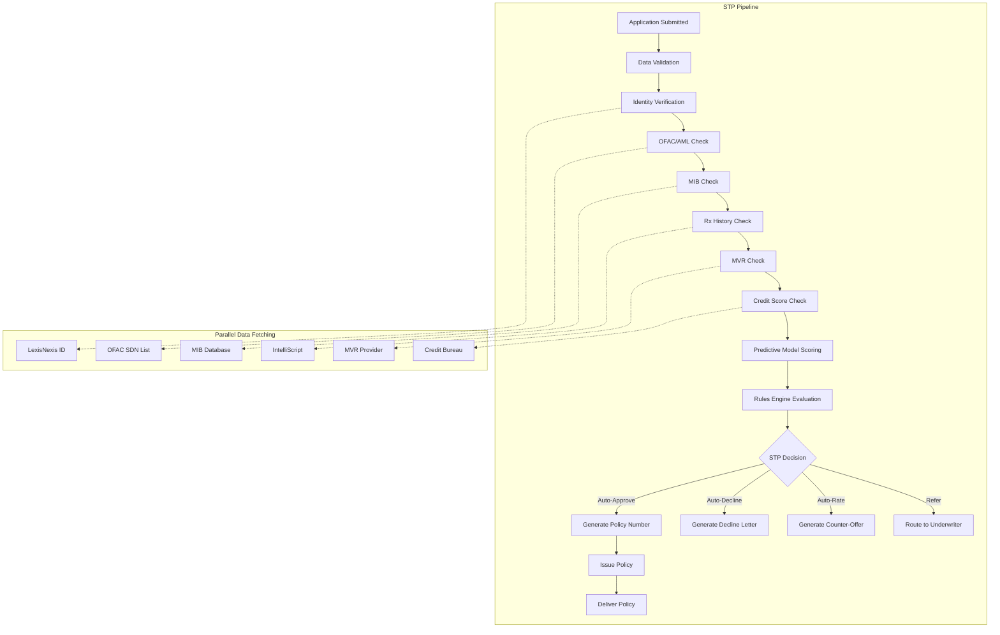
```mermaid
graph TB
    subgraph "STP Pipeline"
        S1[Application Submitted] --> S2[Data Validation]
        S2 --> S3[Identity Verification]
        S3 --> S4[OFAC/AML Check]
        S4 --> S5[MIB Check]
        S5 --> S6[Rx History Check]
        S6 --> S7[MVR Check]
        S7 --> S8[Credit Score Check]
        S8 --> S9[Predictive Model Scoring]
        S9 --> S10[Rules Engine Evaluation]
        S10 --> S11{STP Decision}
        S11 -->|Auto-Approve| S12[Generate Policy Number]
        S11 -->|Auto-Decline| S13[Generate Decline Letter]
        S11 -->|Auto-Rate| S14[Generate Counter-Offer]
        S11 -->|Refer| S15[Route to Underwriter]
        S12 --> S16[Issue Policy]
        S16 --> S17[Deliver Policy]
    end

    subgraph "Parallel Data Fetching"
        S3 -.-> P1[LexisNexis ID]
        S4 -.-> P2[OFAC SDN List]
        S5 -.-> P3[MIB Database]
        S6 -.-> P4[IntelliScript]
        S7 -.-> P5[MVR Provider]
        S8 -.-> P6[Credit Bureau]
    end
```

---

## 16. Metrics & KPIs

### 16.1 Key Performance Indicators

| KPI | Definition | Target | Calculation |
|-----|-----------|--------|-------------|
| **Application-to-Issue Ratio** | Percentage of submitted applications that result in issued policies | ≥ 75% | Issued Policies / Submitted Applications × 100 |
| **Cycle Time** | Average elapsed days from application receipt to policy issuance | ≤ 21 business days (full UW), ≤ 1 day (STP) | Average(Issue Date - Received Date) |
| **NIGO Rate** | Percentage of applications received NIGO | ≤ 15% | NIGO Applications / Total Applications × 100 |
| **STP Rate** | Percentage of applications processed straight-through | ≥ 40% | Auto-Decisioned / Total Eligible × 100 |
| **Placement Rate** | Percentage of approved policies that are actually placed (premium paid) | ≥ 85% | Placed Policies / Approved Policies × 100 |
| **Not-Taken Rate** | Percentage of approved policies that are not taken by the applicant | ≤ 10% | Not-Taken Policies / Approved Policies × 100 |
| **Decline Rate** | Percentage of applications declined by underwriting | ≤ 5% | Declined / Total Decisioned × 100 |
| **Average Requirements per Case** | Mean number of evidence items ordered per case | Trending downward | Total Requirements Ordered / Total Cases |
| **Lapse Rate (First Year)** | Percentage of issued policies that lapse in the first year | ≤ 8% | First Year Lapses / Issued × 100 |
| **Agent Satisfaction Score** | Survey-based score of agent experience with new business process | ≥ 4.0/5.0 | Average survey responses |

### 16.2 Operational Dashboard Metrics

```json
{
  "dashboard": {
    "period": "2025-Q1",
    "applicationsReceived": 12450,
    "applicationsInGoodOrder": 10582,
    "nigoRate": "15.0%",
    "casesCreated": 10582,
    "casesInUnderwriting": 3215,
    "casesApproved": 8945,
    "casesDeclined": 412,
    "casesPostponed": 87,
    "casesWithdrawn": 1138,
    "policiesIssued": 8567,
    "policiesDelivered": 8234,
    "policiesInForce": 7890,
    "applicationToIssueRatio": "68.8%",
    "averageCycleTime": "18.3 business days",
    "stpRate": "35.2%",
    "placementRate": "88.1%",
    "notTakenRate": "9.5%",
    "averageNIGOResolutionTime": "4.2 business days",
    "topNIGOReasons": [
      {"code": "NIGO-006", "description": "Missing signature", "count": 587},
      {"code": "NIGO-013", "description": "Missing replacement form", "count": 342},
      {"code": "NIGO-005", "description": "Missing payment method", "count": 298}
    ]
  }
}
```

### 16.3 Cycle Time Breakdown

| Phase | Target | Measured |
|-------|--------|----------|
| Intake to case creation | 1 day | 0.8 days |
| Case creation to UW assignment | 0.5 days | 0.3 days |
| Evidence ordering | 1 day | 0.5 days |
| Evidence receipt (all) | 7 days | 9.2 days |
| Underwriting review | 3 days | 4.1 days |
| Pre-issue processing | 1 day | 0.7 days |
| Issuance | 1 day | 0.5 days |
| Delivery | 3 days | 2.2 days |
| **Total** | **17.5 days** | **18.3 days** |

---

## 17. Architecture Reference

### 17.1 Microservice Decomposition

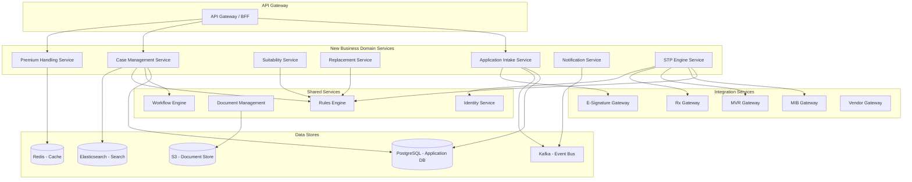
```mermaid
graph TB
    subgraph "API Gateway"
        GW[API Gateway / BFF]
    end

    subgraph "New Business Domain Services"
        AS[Application Intake Service]
        CS[Case Management Service]
        SS[Suitability Service]
        RS[Replacement Service]
        PS[Premium Handling Service]
        NS[Notification Service]
        STP[STP Engine Service]
    end

    subgraph "Shared Services"
        RE[Rules Engine]
        DM[Document Management]
        ID[Identity Service]
        WF[Workflow Engine]
    end

    subgraph "Integration Services"
        MIB[MIB Gateway]
        MVR[MVR Gateway]
        RX[Rx Gateway]
        ES[E-Signature Gateway]
        VND[Vendor Gateway]
    end

    subgraph "Data Stores"
        PG[(PostgreSQL - Application DB)]
        ES2[(Elasticsearch - Search)]
        RD[(Redis - Cache)]
        S3[(S3 - Document Store)]
        MQ[Kafka - Event Bus]
    end

    GW --> AS
    GW --> CS
    GW --> PS
    AS --> PG
    AS --> MQ
    CS --> PG
    CS --> WF
    CS --> RE
    SS --> RE
    RS --> RE
    STP --> RE
    STP --> MIB
    STP --> MVR
    STP --> RX
    STP --> ID
    NS --> MQ
    AS --> ES
    CS --> ES2
    PS --> RD
    DM --> S3
```

### 17.2 Event-Driven Architecture

**Domain Events**:

| Event | Published By | Consumed By |
|-------|-------------|-------------|
| `ApplicationReceived` | Application Intake | Case Management, Notification |
| `ApplicationNIGO` | Application Intake | Case Management, Notification |
| `NIGOResolved` | Case Management | Application Intake, STP Engine |
| `CaseCreated` | Case Management | Evidence Ordering, Suitability |
| `CaseAssigned` | Case Management | Notification |
| `SuitabilityFlagged` | Suitability | Case Management, Notification |
| `SuitabilityApproved` | Suitability | Case Management |
| `ReplacementDetected` | Replacement | Case Management, Notification |
| `EvidenceOrdered` | Evidence Ordering | Vendor Gateway |
| `EvidenceReceived` | Vendor Gateway | Case Management, Underwriting |
| `STPDecisionMade` | STP Engine | Case Management, Underwriting |
| `UnderwritingDecision` | Underwriting | Case Management, Issuance |
| `PolicyApproved` | Underwriting | Issuance, Notification |
| `PolicyDeclined` | Underwriting | Notification, Premium Handling |
| `CounterOfferSent` | Underwriting | Case Management, Notification |
| `CounterOfferAccepted` | Case Management | Issuance |
| `PolicyIssued` | Issuance | Billing, Commission, Reinsurance |
| `PolicyDelivered` | Delivery | Case Management |
| `FreeLookExpired` | Policy Admin | Case Management |
| `PremiumRefundProcessed` | Premium Handling | Accounting, Notification |

### 17.3 Technology Stack Recommendations

| Layer | Technology Options |
|-------|-------------------|
| **API Gateway** | Kong, AWS API Gateway, Apigee |
| **Services** | Java/Spring Boot, .NET Core, Node.js |
| **Rules Engine** | Drools, ILOG/ODM, Corticon, custom |
| **Workflow** | Camunda, Temporal, AWS Step Functions |
| **Database** | PostgreSQL, Oracle, SQL Server |
| **Document Store** | AWS S3, Azure Blob, MinIO |
| **Search** | Elasticsearch, OpenSearch |
| **Cache** | Redis, Hazelcast |
| **Message Broker** | Apache Kafka, RabbitMQ, AWS SQS/SNS |
| **OCR** | ABBYY, AWS Textract, Google Vision |
| **E-Signature** | DocuSign, OneSpan, Adobe Sign |
| **Monitoring** | Prometheus, Grafana, Datadog |
| **CI/CD** | Jenkins, GitHub Actions, GitLab CI |

### 17.4 Security Considerations

| Concern | Implementation |
|---------|---------------|
| PII Encryption | AES-256 at rest, TLS 1.3 in transit |
| SSN/TIN Masking | Display only last 4 digits; full values encrypted in DB |
| PCI Compliance | Credit card data tokenized via PCI-compliant vault (e.g., Basis Theory, Spreedly) |
| HIPAA | Medical data access logging, minimum necessary principle |
| RBAC | Role-based access: agent (own cases), underwriter (assigned cases), manager (team cases), compliance (all) |
| Audit Trail | Immutable audit log for all data changes and access events |
| Data Retention | Configurable retention policies per data type and state regulation |

---

## 18. Glossary

| Term | Definition |
|------|-----------|
| **ACORD** | Association for Cooperative Operations Research and Development — industry data standards body |
| **AML** | Anti-Money Laundering |
| **APS** | Attending Physician Statement |
| **BFF** | Backend for Frontend — API pattern |
| **BPMN** | Business Process Model and Notation |
| **CTI** | Computer Telephony Integration |
| **D2C** | Direct-to-Consumer |
| **DDD** | Domain-Driven Design |
| **DMF** | Death Master File |
| **EFT** | Electronic Funds Transfer |
| **EHR** | Electronic Health Record |
| **FCRA** | Fair Credit Reporting Act |
| **FHIR** | Fast Healthcare Interoperability Resources |
| **GI** | Guaranteed Issue |
| **HIPAA** | Health Insurance Portability and Accountability Act |
| **ICR** | Intelligent Character Recognition |
| **IGO** | In Good Order |
| **MIB** | Medical Information Bureau |
| **MVR** | Motor Vehicle Report |
| **NAIC** | National Association of Insurance Commissioners |
| **NIGO** | Not In Good Order |
| **NPN** | National Producer Number |
| **OCR** | Optical Character Recognition |
| **OFAC** | Office of Foreign Assets Control |
| **PAS** | Policy Administration System |
| **PCI** | Payment Card Industry |
| **PEP** | Politically Exposed Person |
| **Reg BI** | Regulation Best Interest (SEC) |
| **Rx** | Prescription history |
| **SDN** | Specially Designated Nationals (OFAC list) |
| **SERFF** | System for Electronic Rate and Form Filing |
| **SLA** | Service Level Agreement |
| **STP** | Straight-Through Processing |
| **TIA** | Temporary Insurance Agreement |
| **TXLife** | ACORD Life & Annuity XML transaction standard |
| **UTMA/UGMA** | Uniform Transfers/Gifts to Minors Act |
| **UW** | Underwriting / Underwriter |

---

*Article 08 — New Business & Application Processing — Life Insurance PAS Architect's Encyclopedia*
*Version 1.0 — 2025*
