# Article 09: Underwriting Engine & Risk Assessment

## Life Insurance Policy Administration System — Architect's Encyclopedia

---

## Table of Contents

1. [Introduction & Scope](#1-introduction--scope)
2. [Risk Classification Framework](#2-risk-classification-framework)
3. [Medical Underwriting](#3-medical-underwriting)
4. [Financial Underwriting](#4-financial-underwriting)
5. [Accelerated Underwriting](#5-accelerated-underwriting)
6. [Rules Engine Architecture](#6-rules-engine-architecture)
7. [Underwriting Workbench](#7-underwriting-workbench)
8. [Reinsurance in Underwriting](#8-reinsurance-in-underwriting)
9. [Evidence & Requirement Management](#9-evidence--requirement-management)
10. [Predictive Analytics & AI/ML](#10-predictive-analytics--aiml)
11. [Complete Data Model for Underwriting](#11-complete-data-model-for-underwriting)
12. [ACORD Messages for Underwriting](#12-acord-messages-for-underwriting)
13. [Decision Tree Diagrams](#13-decision-tree-diagrams)
14. [Architecture Reference](#14-architecture-reference)
15. [Glossary](#15-glossary)

---

## 1. Introduction & Scope

Underwriting is the process of evaluating risk to determine whether to issue a life insurance policy, and if so, at what terms and price. The underwriting engine is the intellectual core of a life insurance PAS — it encodes decades of actuarial science, medical knowledge, and regulatory compliance into a decision-making system.

### 1.1 Business Context

The underwriting engine impacts:

- **Mortality experience**: Accurate risk classification directly affects profitability and claim ratios.
- **Competitive positioning**: Faster, more accurate underwriting attracts agents and consumers.
- **Regulatory compliance**: Unfair discrimination statutes, FCRA, state insurance codes, and emerging AI/ML regulations.
- **Reinsurance relationships**: Risk classifications must align with reinsurance treaties.
- **Customer experience**: Speed to decision is a primary driver of application placement.

### 1.2 Domain Boundaries

| Subdomain | Responsibility |
|-----------|---------------|
| Risk Classification | Determine risk class based on all available evidence |
| Medical Evaluation | Assess medical history, lab results, exams |
| Financial Evaluation | Validate financial justification for coverage amount |
| Accelerated UW | Enable fluidless, STP, and jet-issue pathways |
| Rules Engine | Execute underwriting rules and guidelines |
| Evidence Management | Order, track, and manage underwriting evidence |
| Workbench | UI/UX for manual underwriting review and decision |
| Reinsurance Integration | Manage reinsurance bindings and facultative submissions |
| Predictive Analytics | ML-based risk scoring and decision support |

### 1.3 Key Design Principles

1. **Separation of rules from code**: Underwriting guidelines change frequently; rules must be externalized and versioned independently of application code.
2. **Transparency and explainability**: Every underwriting decision must be traceable to specific evidence and rules.
3. **Consistency**: Same evidence + same rules = same decision, regardless of underwriter.
4. **Regulatory compliance by design**: Fair lending principles, anti-discrimination, and FCRA requirements built into the architecture.
5. **Extensibility**: New products, riders, and risk factors must be addable without major system changes.

---

## 2. Risk Classification Framework

### 2.1 Standard Risk Classes

Life insurance risk classification follows a tiered system, with each class representing a different mortality expectation:

| Risk Class | Mortality Expectation | Typical Premium Impact | Description |
|-----------|----------------------|----------------------|-------------|
| **Preferred Plus** (Super Preferred / Elite) | 40-60% of standard mortality | 60-70% of standard premium | Exceptional health, family history, build, no tobacco, no hazardous activities |
| **Preferred** | 60-80% of standard mortality | 75-85% of standard premium | Very good health, minor controlled conditions acceptable |
| **Standard Plus** | 80-95% of standard mortality | 85-95% of standard premium | Good health with some risk factors |
| **Standard** | 100% of standard mortality | 100% (base rate) | Average mortality; baseline for pricing |
| **Preferred Tobacco** | 80-100% of tobacco mortality | Tobacco rates, preferred tier | Tobacco user with otherwise excellent health |
| **Standard Tobacco** | 100% of tobacco mortality | Tobacco rates, standard tier | Average tobacco user mortality |
| **Substandard** | 125-400%+ of standard mortality | Table-rated premiums | Impaired risk requiring extra premium |

### 2.2 Substandard (Table) Ratings

Substandard risks are rated using a **table rating** system, where each table adds an incremental percentage to the standard mortality charge:

| Table Rating | Mortality Multiple | Extra Mortality | Industry Notation |
|-------------|-------------------|-----------------|-------------------|
| Table A / Table 1 | 125% | 25% extra | Mild impairment |
| Table B / Table 2 | 150% | 50% extra | — |
| Table C / Table 3 | 175% | 75% extra | — |
| Table D / Table 4 | 200% | 100% extra | Moderate impairment |
| Table E / Table 5 | 225% | 125% extra | — |
| Table F / Table 6 | 250% | 150% extra | — |
| Table G / Table 7 | 275% | 175% extra | — |
| Table H / Table 8 | 300% | 200% extra | Significant impairment |
| Table J / Table 9 | 325% | 225% extra | — |
| Table K / Table 10 | 350% | 250% extra | — |
| Table L / Table 12 | 400% | 300% extra | Severe impairment |
| Table P / Table 16 | 500% | 400% extra | Maximum insurable |

> **Note**: Some companies use letters (A-P, skipping I), others use numbers (1-16). The mapping varies by carrier. The letter "I" is typically skipped to avoid confusion with the number "1".

### 2.3 Flat Extra Ratings

A **flat extra** is an additional charge per $1,000 of face amount, applied for a specific period or permanently:

| Type | Description | Example |
|------|-------------|---------|
| **Permanent Flat Extra** | Applied for the life of the policy | $5.00 per $1,000 for HIV-controlled |
| **Temporary Flat Extra** | Applied for a limited number of years | $2.50 per $1,000 for 5 years for recent cancer remission |
| **Decreasing Flat Extra** | Decreases over time | $10.00/yr 1-3, $5.00/yr 4-6, $0 thereafter |

**Premium Calculation with Table Rating and Flat Extra**:

```python
def calculate_rated_premium(
    base_premium: float,
    face_amount: float,
    table_rating: int,  # 1-16
    flat_extra_per_thousand: float,
    flat_extra_duration_years: int,
    policy_year: int
) -> float:
    """Calculate premium with substandard rating and flat extra."""
    # Table rating adds percentage to mortality charge
    # Simplified: table_rating * 25% extra mortality
    mortality_multiplier = 1.0 + (table_rating * 0.25)

    # Separate base premium into mortality and expense components
    # Typical split: 60% mortality, 40% expense/profit (simplified)
    mortality_component = base_premium * 0.60
    expense_component = base_premium * 0.40

    rated_mortality = mortality_component * mortality_multiplier
    rated_base = rated_mortality + expense_component

    # Add flat extra if within duration
    flat_extra = 0.0
    if policy_year <= flat_extra_duration_years:
        flat_extra = (face_amount / 1000) * flat_extra_per_thousand

    total_premium = rated_base + flat_extra
    return round(total_premium, 2)


# Example: $500,000 Term, Table 4 + $2.50 flat extra for 5 years
base_annual_premium = 420.00
face = 500000

year_1_premium = calculate_rated_premium(base_annual_premium, face, 4, 2.50, 5, 1)
# mortality: $252 * 2.0 = $504, expense: $168, flat extra: $1,250
# Total: $504 + $168 + $1,250 = $1,922.00

year_6_premium = calculate_rated_premium(base_annual_premium, face, 4, 2.50, 5, 6)
# mortality: $504, expense: $168, flat extra: $0 (past 5 years)
# Total: $672.00
```

### 2.4 Other Risk Dispositions

| Disposition | Description | Typical Situations |
|------------|-------------|-------------------|
| **Decline** | Risk is uninsurable | Active cancer, AIDS, severe organ failure, dangerous criminal history |
| **Postpone** | Defer decision to a future date | Recent surgery (assess recovery), pending diagnosis, recent DUI (wait 3-5 years) |
| **Incomplete** | Cannot make decision due to missing evidence | APS not received, labs expired, financial documents outstanding |
| **Counter Offer** | Offer modified terms to applicant | Rated, reduced face amount, exclude rider, different product |

### 2.5 Rating Equivalences Across Companies

Different carriers may use different classification names for equivalent risk:

| Carrier A | Carrier B | Carrier C | Mortality Equivalent |
|-----------|-----------|-----------|---------------------|
| Super Preferred | Preferred Plus | Elite | 40-50% standard |
| Preferred | Preferred | Preferred Select | 60-75% standard |
| Standard Plus | Select | Standard Plus | 80-90% standard |
| Standard | Standard | Standard | 100% standard |
| Table B | Table 2 | Substandard 2 | 150% standard |
| Table D | Table 4 | Substandard 4 | 200% standard |

---

## 3. Medical Underwriting

### 3.1 Medical History Evaluation

The underwriter evaluates the applicant's medical history across multiple dimensions:

```mermaid
graph TB
    MH[Medical History Evaluation] --> CV[Cardiovascular]
    MH --> ON[Oncology]
    MH --> EN[Endocrine]
    MH --> NE[Neurological]
    MH --> RE[Respiratory]
    MH --> GI[Gastrointestinal]
    MH --> MK[Musculoskeletal]
    MH --> MH2[Mental Health]
    MH --> UR[Urological]
    MH --> IM[Immune/Infectious]
    MH --> FH[Family History]

    CV --> CV1[Coronary Artery Disease]
    CV --> CV2[Hypertension]
    CV --> CV3[Atrial Fibrillation]
    CV --> CV4[Heart Failure]
    CV --> CV5[Valve Disorders]

    ON --> ON1[Breast Cancer]
    ON --> ON2[Prostate Cancer]
    ON --> ON3[Colon Cancer]
    ON --> ON4[Melanoma]
    ON --> ON5[Lung Cancer]

    EN --> EN1[Type 2 Diabetes]
    EN --> EN2[Type 1 Diabetes]
    EN --> EN3[Thyroid Disorders]
    EN --> EN4[Obesity]
```

### 3.2 Attending Physician Statement (APS)

The APS is a detailed report from the applicant's treating physician containing medical records.

**APS Ordering Criteria**:

| Trigger | When to Order APS |
|---------|------------------|
| Medical history disclosure | "Yes" answer to specific conditions |
| MIB hit | Coded condition requiring verification |
| Rx history | Medications indicating undisclosed conditions |
| High face amount | Above APS-always threshold (varies, typically $1M+) |
| Age + amount | Age-amount matrix requires APS |
| Lab results | Abnormal lab values requiring explanation |
| Underwriter judgment | Manual request based on case review |

**APS Processing Pipeline**:

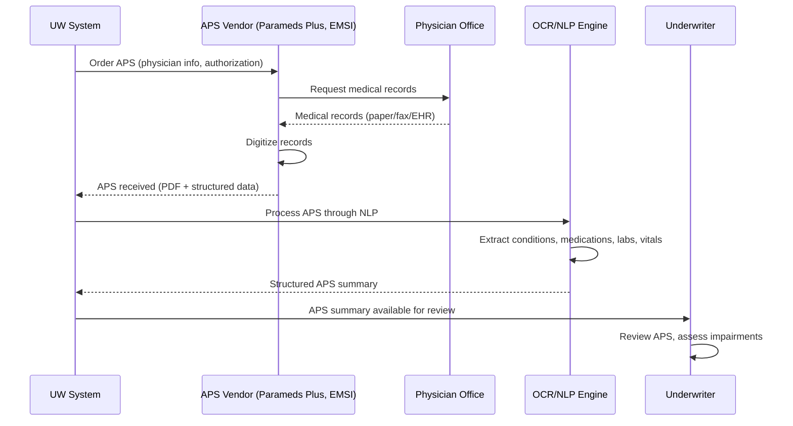

**APS Data Extraction (NLP)**:

Modern systems use NLP to automatically extract structured data from unstructured APS documents:

```json
{
  "apsExtraction": {
    "source": "Dr. Robert Chen, Internal Medicine",
    "recordDates": "2020-01-15 to 2024-11-15",
    "extractedConditions": [
      {
        "condition": "Atrial Fibrillation",
        "icdCode": "I48.91",
        "diagnosisDate": "2019-06-20",
        "status": "Chronic, controlled",
        "medications": [
          {"name": "Eliquis (Apixaban)", "dose": "5mg", "frequency": "BID"}
        ],
        "lastEpisode": "2023-02-10",
        "complications": "None documented"
      },
      {
        "condition": "Hyperlipidemia",
        "icdCode": "E78.5",
        "diagnosisDate": "2018-03-10",
        "status": "Controlled with medication",
        "medications": [
          {"name": "Atorvastatin", "dose": "20mg", "frequency": "QD"}
        ],
        "lastLabValues": {
          "totalCholesterol": 195,
          "ldl": 110,
          "hdl": 52,
          "triglycerides": 148,
          "date": "2024-09-15"
        }
      }
    ],
    "vitals": {
      "bloodPressure": [
        {"date": "2024-11-15", "systolic": 128, "diastolic": 78},
        {"date": "2024-05-20", "systolic": 132, "diastolic": 82},
        {"date": "2023-11-10", "systolic": 126, "diastolic": 76}
      ],
      "weight": {"value": 185, "unit": "lbs", "date": "2024-11-15"},
      "height": {"value": 71, "unit": "inches"}
    },
    "surgeries": [],
    "hospitalizations": [
      {
        "date": "2019-06-20",
        "facility": "UCSF Medical Center",
        "reason": "Atrial fibrillation - initial diagnosis",
        "duration": "2 days"
      }
    ],
    "confidence": 0.92
  }
}
```

### 3.3 Paramedical Exam Processing

A paramedical exam is a basic physical examination conducted by a mobile examiner (nurse or paramedic) at the applicant's home or office.

**Exam Components**:

| Component | Description |
|-----------|-------------|
| **Vital Signs** | Blood pressure (2 readings, 5 min apart), pulse, height, weight |
| **Blood Draw** | Full chemistry panel, CBC, lipid panel, HbA1c, HIV, Hepatitis B/C, cotinine, PSA (males 50+) |
| **Urine Specimen** | Drug screen, cotinine, glucose, protein, blood |
| **Medical History Interview** | Review/confirm application Part 2 responses |
| **Physical Measurements** | Waist circumference, BMI calculation |

**Lab Results Integration**:

```json
{
  "labResults": {
    "specimenId": "LAB-2025-00789",
    "collectionDate": "2025-01-20",
    "reportDate": "2025-01-23",
    "vendor": "ExamOne",
    "panels": {
      "chemistry": {
        "glucose": {"value": 95, "unit": "mg/dL", "range": "65-99", "flag": "NORMAL"},
        "bun": {"value": 18, "unit": "mg/dL", "range": "7-20", "flag": "NORMAL"},
        "creatinine": {"value": 1.0, "unit": "mg/dL", "range": "0.7-1.3", "flag": "NORMAL"},
        "gfr": {"value": 92, "unit": "mL/min", "range": ">60", "flag": "NORMAL"},
        "sodium": {"value": 140, "unit": "mEq/L", "range": "136-145", "flag": "NORMAL"},
        "potassium": {"value": 4.2, "unit": "mEq/L", "range": "3.5-5.1", "flag": "NORMAL"},
        "alt": {"value": 28, "unit": "U/L", "range": "7-56", "flag": "NORMAL"},
        "ast": {"value": 24, "unit": "U/L", "range": "10-40", "flag": "NORMAL"},
        "alkalinePhosphatase": {"value": 65, "unit": "U/L", "range": "44-147", "flag": "NORMAL"},
        "totalBilirubin": {"value": 0.8, "unit": "mg/dL", "range": "0.1-1.2", "flag": "NORMAL"},
        "totalProtein": {"value": 7.0, "unit": "g/dL", "range": "6.0-8.3", "flag": "NORMAL"},
        "albumin": {"value": 4.2, "unit": "g/dL", "range": "3.5-5.5", "flag": "NORMAL"}
      },
      "lipidPanel": {
        "totalCholesterol": {"value": 210, "unit": "mg/dL", "range": "<200", "flag": "HIGH"},
        "ldlCholesterol": {"value": 130, "unit": "mg/dL", "range": "<100", "flag": "HIGH"},
        "hdlCholesterol": {"value": 55, "unit": "mg/dL", "range": ">40", "flag": "NORMAL"},
        "triglycerides": {"value": 125, "unit": "mg/dL", "range": "<150", "flag": "NORMAL"},
        "cholesterolHDLRatio": {"value": 3.8, "unit": "", "range": "<5.0", "flag": "NORMAL"}
      },
      "hba1c": {"value": 5.4, "unit": "%", "range": "<5.7", "flag": "NORMAL"},
      "psa": {"value": null, "unit": null, "range": null, "flag": null, "note": "Not applicable (age < 50)"},
      "hivScreen": {"value": "Non-Reactive", "flag": "NORMAL"},
      "hepatitisBSurfaceAntigen": {"value": "Non-Reactive", "flag": "NORMAL"},
      "hepatitisCAntibody": {"value": "Non-Reactive", "flag": "NORMAL"},
      "cotinine": {"value": "Negative", "flag": "NORMAL"},
      "cbc": {
        "wbc": {"value": 6.8, "unit": "K/uL", "range": "4.5-11.0", "flag": "NORMAL"},
        "rbc": {"value": 4.9, "unit": "M/uL", "range": "4.5-5.5", "flag": "NORMAL"},
        "hemoglobin": {"value": 14.5, "unit": "g/dL", "range": "13.5-17.5", "flag": "NORMAL"},
        "hematocrit": {"value": 43, "unit": "%", "range": "38.3-48.6", "flag": "NORMAL"},
        "platelets": {"value": 250, "unit": "K/uL", "range": "150-400", "flag": "NORMAL"}
      },
      "urinalysis": {
        "specificGravity": {"value": 1.020, "range": "1.005-1.030", "flag": "NORMAL"},
        "ph": {"value": 6.0, "range": "4.5-8.0", "flag": "NORMAL"},
        "glucose": {"value": "Negative", "flag": "NORMAL"},
        "protein": {"value": "Negative", "flag": "NORMAL"},
        "blood": {"value": "Negative", "flag": "NORMAL"},
        "drugs": {"value": "Negative", "flag": "NORMAL"},
        "cotinine": {"value": "Negative", "flag": "NORMAL"}
      }
    }
  }
}
```

### 3.4 Build Chart (Height/Weight) Evaluation

The build chart is a critical underwriting tool that maps height and weight to mortality risk:

```python
BUILD_CHART = {
    # height_inches: {preferred_plus_max, preferred_max, standard_max, table_a_max, ...}
    # Male chart (sample entries)
    60: {"PP": 136, "P": 148, "STD": 170, "T1": 185, "T2": 200, "T4": 230, "T8": 280, "DECLINE": 310},
    62: {"PP": 145, "P": 157, "STD": 180, "T1": 196, "T2": 212, "T4": 244, "T8": 296, "DECLINE": 328},
    64: {"PP": 152, "P": 166, "STD": 190, "T1": 207, "T2": 224, "T4": 258, "T8": 312, "DECLINE": 346},
    66: {"PP": 160, "P": 175, "STD": 201, "T1": 219, "T2": 237, "T4": 273, "T8": 330, "DECLINE": 366},
    68: {"PP": 168, "P": 184, "STD": 212, "T1": 231, "T2": 250, "T4": 288, "T8": 348, "DECLINE": 386},
    70: {"PP": 177, "P": 194, "STD": 223, "T1": 243, "T2": 263, "T4": 303, "T8": 366, "DECLINE": 406},
    71: {"PP": 181, "P": 198, "STD": 228, "T1": 249, "T2": 269, "T4": 310, "T8": 375, "DECLINE": 416},
    72: {"PP": 186, "P": 204, "STD": 234, "T1": 255, "T2": 276, "T4": 318, "T8": 384, "DECLINE": 426},
    74: {"PP": 195, "P": 214, "STD": 246, "T1": 268, "T2": 290, "T4": 334, "T8": 404, "DECLINE": 448},
    76: {"PP": 205, "P": 225, "STD": 259, "T1": 282, "T2": 305, "T4": 351, "T8": 425, "DECLINE": 471},
}

def evaluate_build(height_inches: int, weight_lbs: float, gender: str) -> str:
    """Evaluate build chart to determine risk class impact."""
    chart = BUILD_CHART  # Would select male/female chart based on gender

    if height_inches not in chart:
        # Interpolate between nearest heights
        return "REFER_TO_UNDERWRITER"

    limits = chart[height_inches]

    if weight_lbs <= limits["PP"]:
        return "PREFERRED_PLUS"
    elif weight_lbs <= limits["P"]:
        return "PREFERRED"
    elif weight_lbs <= limits["STD"]:
        return "STANDARD"
    elif weight_lbs <= limits["T1"]:
        return "TABLE_1"
    elif weight_lbs <= limits["T2"]:
        return "TABLE_2"
    elif weight_lbs <= limits["T4"]:
        return "TABLE_4"
    elif weight_lbs <= limits["T8"]:
        return "TABLE_8"
    elif weight_lbs <= limits["DECLINE"]:
        return "TABLE_12_OR_HIGHER"
    else:
        return "DECLINE"

# Example: 5'11" (71 inches), 185 lbs, Male
result = evaluate_build(71, 185, "Male")
# Returns: "PREFERRED" (185 <= 198)
```

### 3.5 Medical Impairment Risk Factors — Debit/Credit System

Underwriters assess impairments using a debit/credit system where each condition adds debits (increased risk) or credits (reduced risk) to the overall risk score:

| Impairment | Debits (Extra Mortality %) | Credits Available | Net Effect |
|-----------|---------------------------|-------------------|------------|
| **Hypertension** (controlled, on 1 med) | +50 | -25 (if well controlled, normal ECG) | +25 (Table 1) |
| **Hypertension** (uncontrolled) | +150 | None | +150 (Table 6) |
| **Type 2 Diabetes** (well controlled, HbA1c < 7.0) | +75-100 | -25 (if no complications, good control) | +50-75 (Table 2-3) |
| **Type 2 Diabetes** (poorly controlled, HbA1c > 9.0) | +200-300 | None | +200-300 (Table 8-12) |
| **Type 1 Diabetes** | +150-250 | -25 (if well controlled, no complications) | +125-225 (Table 5-9) |
| **Atrial Fibrillation** (controlled, on anticoagulant) | +75 | -25 (if no structural heart disease) | +50 (Table 2) |
| **Coronary Artery Disease** (post-CABG, 5+ years) | +100-150 | -25 (if normal stress test) | +75-125 (Table 3-5) |
| **Breast Cancer** (Stage I, 5+ years remission) | +25-50 | -25 (if 10+ years) | +0-25 (Standard to Table 1) |
| **Prostate Cancer** (Gleason 6, treated) | +25-50 | -25 (if 5+ years, low PSA) | +0-25 (Standard) |
| **Depression** (mild, controlled, no hospitalization) | +0-25 | N/A | Standard to +25 |
| **Depression** (severe, hospitalization) | +75-100 | -25 (if 3+ years stable) | +50-75 (Table 2-3) |
| **Sleep Apnea** (treated with CPAP, compliant) | +0-25 | N/A | Standard to +25 |
| **Sleep Apnea** (untreated) | +75-100 | None | +75-100 (Table 3-4) |
| **Obesity** (BMI 30-35) | +25-50 | N/A | Table 1-2 |
| **Morbid Obesity** (BMI 40+) | +150-200+ | None | Table 6-8 or Decline |

### 3.6 Concurrent Impairment Handling

When an applicant has multiple impairments, the total risk may be more (or less) than the sum of individual debits:

```python
class ConcurrentImpairmentCalculator:
    """Handle multiple impairments with interaction effects."""

    SYNERGY_MATRIX = {
        ("DIABETES", "HYPERTENSION"): 1.3,  # 30% synergy (multiplicative risk)
        ("DIABETES", "OBESITY"): 1.2,
        ("HYPERTENSION", "OBESITY"): 1.15,
        ("DIABETES", "CAD"): 1.4,
        ("SMOKING", "HYPERTENSION"): 1.25,
        ("SMOKING", "CAD"): 1.5,
        ("DEPRESSION", "SUBSTANCE_ABUSE"): 1.3,
    }

    def calculate_total_debits(self, impairments: list) -> int:
        """Calculate total debits with synergy effects."""
        # Base debits: sum of individual impairment debits
        base_total = sum(imp.debits for imp in impairments)

        # Apply synergy multipliers for known interactions
        synergy_multiplier = 1.0
        for i, imp1 in enumerate(impairments):
            for imp2 in impairments[i+1:]:
                key = tuple(sorted([imp1.category, imp2.category]))
                if key in self.SYNERGY_MATRIX:
                    synergy_multiplier *= self.SYNERGY_MATRIX[key]

        adjusted_total = int(base_total * synergy_multiplier)

        # Cap at decline threshold
        if adjusted_total > 400:
            return -1  # Indicates decline

        return adjusted_total

    def debits_to_table_rating(self, debits: int) -> str:
        """Convert debit total to table rating."""
        if debits <= 0:
            return "STANDARD_OR_BETTER"
        table = (debits + 24) // 25  # Each 25 debits = 1 table
        if table > 16:
            return "DECLINE"
        return f"TABLE_{table}"
```

### 3.7 EKG and Stress Test Evaluation

| Finding | Risk Assessment |
|---------|----------------|
| Normal sinus rhythm | No debits |
| Left ventricular hypertrophy (LVH) | +25-75 debits depending on severity |
| ST segment changes | +50-150 debits; may require cardiology consult |
| Bundle branch block (RBBB) | +0-25 debits (usually benign) |
| Bundle branch block (LBBB) | +50-100 debits (may indicate structural disease) |
| Atrial fibrillation | +50-100 debits depending on treatment/control |
| Premature ventricular contractions (PVCs) | +0-50 debits depending on frequency |
| Normal stress test (Bruce protocol, Stage III+) | Credit: -25 debits against cardiac risk |
| Abnormal stress test | +100-200 debits; may require catheterization |

---

## 4. Financial Underwriting

### 4.1 Purpose

Financial underwriting ensures that the amount of insurance applied for is justified by the applicant's financial situation, preventing:

- **Over-insurance**: Coverage amounts grossly disproportionate to financial need (potential moral hazard).
- **Speculative insurance**: Insurance purchased without genuine insurable interest.
- **Money laundering**: Using life insurance as a vehicle for illicit funds.
- **STOLI/IOLI**: Stranger-owned or investor-owned life insurance schemes.

### 4.2 Income Multiple Guidelines

| Age Range | Maximum Income Multiple | Example |
|-----------|------------------------|---------|
| 18-30 | 30x annual income | $100K income → $3M max |
| 31-40 | 25x annual income | $150K income → $3.75M max |
| 41-50 | 20x annual income | $200K income → $4M max |
| 51-60 | 15x annual income | $250K income → $3.75M max |
| 61-65 | 10x annual income | $300K income → $3M max |
| 66-70 | 5x annual income | $200K income → $1M max |
| 71+ | Case-by-case | Typically estate/business need |

### 4.3 Human Life Value Calculation

```python
def calculate_human_life_value(
    annual_income: float,
    current_age: int,
    retirement_age: int = 65,
    income_growth_rate: float = 0.03,  # 3% annual growth
    discount_rate: float = 0.05,  # 5% discount rate
    income_tax_rate: float = 0.25,  # 25% average tax rate
    personal_consumption_pct: float = 0.30  # 30% personal consumption
) -> float:
    """Calculate the human life value (HLV) for financial underwriting."""
    after_tax_income = annual_income * (1 - income_tax_rate)
    economic_contribution = after_tax_income * (1 - personal_consumption_pct)

    years_to_retirement = retirement_age - current_age
    hlv = 0.0

    for year in range(1, years_to_retirement + 1):
        future_contribution = economic_contribution * ((1 + income_growth_rate) ** year)
        present_value = future_contribution / ((1 + discount_rate) ** year)
        hlv += present_value

    return round(hlv, 2)


# Example: 35-year-old, $175K income
hlv = calculate_human_life_value(175000, 35)
# After-tax: $131,250, Economic contribution: $91,875
# HLV ≈ $1,850,000 (approximate)
```

### 4.4 Financial Justification by Purpose

| Purpose | Financial Justification | Documentation |
|---------|------------------------|---------------|
| **Income Replacement** | HLV calculation, number of dependents, years of support needed | Tax returns, pay stubs |
| **Mortgage Protection** | Outstanding mortgage balance | Mortgage statement |
| **Estate Planning** | Estate tax liability estimate | Estate plan, trust documents |
| **Business Continuation** | Buy-sell agreement value, business valuation | Buy-sell agreement, financial statements |
| **Key Person** | Company revenue, key person's contribution to revenue | Financial statements, role description |
| **Loan Collateral** | Outstanding loan balance | Loan documents |
| **Charitable Giving** | Desired endowment amount | Gift commitment letter |
| **Wealth Transfer** | Desired transfer amount, tax efficiency | Financial plan, attorney letter |

### 4.5 Net Worth Analysis

For high face amounts (typically $5M+), carriers require net worth documentation:

| Face Amount | Financial Documentation Required |
|-------------|--------------------------------|
| < $1M | Self-reported income, no verification |
| $1M - $3M | 2 years tax returns or income verification |
| $3M - $5M | Tax returns + personal financial statement |
| $5M - $10M | Tax returns + financial statement + CPA letter |
| $10M - $25M | Full financial package + accountant certification |
| $25M+ | Full financial package + third-party valuation + detailed purpose letter |

---

## 5. Accelerated Underwriting

### 5.1 Overview

Accelerated underwriting (also called "fluidless" or "simplified" underwriting) aims to approve applicants without requiring traditional paramedical exams, lab work, or APS—using data-driven risk assessment instead.

### 5.2 Accelerated UW Architecture

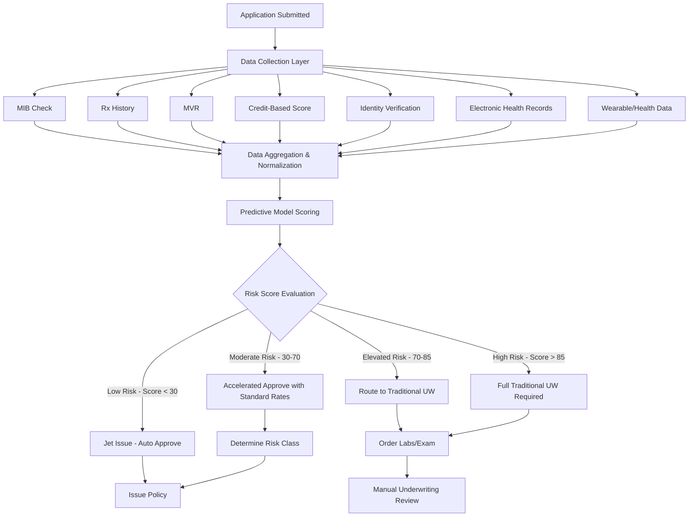

### 5.3 Eligibility Criteria for Accelerated UW

| Criteria | Typical Threshold |
|----------|------------------|
| Age | 18-60 (varies by carrier) |
| Face Amount | Up to $1M-$3M (varies) |
| Product | Term, simplified whole life (not VUL/complex products) |
| BMI Range | 18.5-35 |
| Tobacco | Non-tobacco only (some programs) |
| Medical History | No major impairments in past 5-10 years |
| MIB | No significant coded conditions |
| Rx History | No knockout medications |
| MVR | No DUI in past 5 years, limited violations |
| Credit Score | Above minimum threshold (varies) |
| State Availability | May not be available in all states |

### 5.4 Electronic Health Records (EHR) Integration

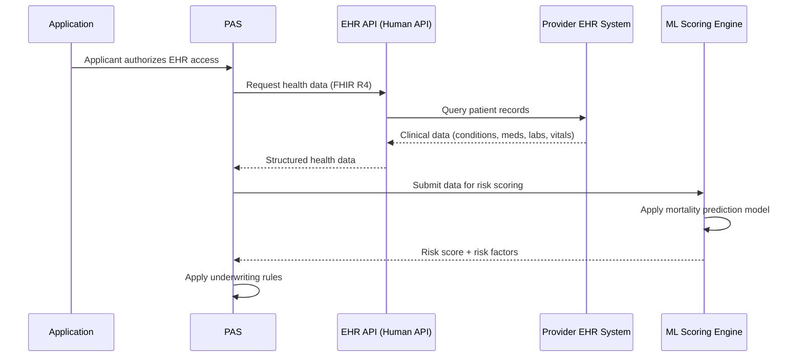

**FHIR R4 Data Elements Used**:

| FHIR Resource | Underwriting Use |
|--------------|-----------------|
| `Patient` | Demographics, identity confirmation |
| `Condition` | Active and historical diagnoses (ICD-10 codes) |
| `MedicationRequest` | Prescribed medications |
| `Observation` | Lab results, vital signs, BMI |
| `Procedure` | Surgeries, procedures |
| `Encounter` | Hospitalizations, ED visits |
| `DiagnosticReport` | Imaging, pathology results |

### 5.5 Wearable Data Integration

Emerging carriers are incorporating wearable device data (Fitbit, Apple Watch, Garmin) into underwriting:

| Data Point | Underwriting Relevance |
|-----------|----------------------|
| Resting heart rate | Cardiovascular fitness indicator |
| Steps per day | Activity level, overall health proxy |
| Sleep duration/quality | Mental health, recovery indicator |
| VO2 max estimate | Cardiovascular fitness |
| Blood oxygen (SpO2) | Respiratory health indicator |
| ECG readings | Arrhythmia detection |

### 5.6 Predictive Model Integration

```python
class AcceleratedUWModel:
    """Predictive model for accelerated underwriting decisions."""

    def __init__(self, model_path: str):
        self.model = self._load_model(model_path)
        self.feature_names = self._load_feature_names()

    def score(self, applicant_data: dict) -> dict:
        """Score an applicant for accelerated underwriting."""
        features = self._extract_features(applicant_data)
        risk_score = self.model.predict_proba(features)[0][1] * 100

        return {
            "riskScore": round(risk_score, 2),
            "riskCategory": self._categorize(risk_score),
            "topRiskFactors": self._explain(features),
            "recommendedAction": self._recommend(risk_score),
            "modelVersion": self.model.version,
            "scoringTimestamp": datetime.utcnow().isoformat()
        }

    def _extract_features(self, data: dict) -> list:
        """Extract model features from applicant data."""
        return [
            data.get("age"),
            data.get("gender_code"),  # 0=Female, 1=Male
            data.get("bmi"),
            data.get("tobacco_indicator"),  # 0=No, 1=Yes
            data.get("mib_hit_count"),
            data.get("mib_max_severity"),
            data.get("rx_medication_count"),
            data.get("rx_has_knockout"),  # 0=No, 1=Yes
            data.get("rx_chronic_condition_count"),
            data.get("mvr_violation_count"),
            data.get("mvr_dui_indicator"),  # 0=No, 1=Yes
            data.get("credit_score_band"),  # 1-5 bands
            data.get("identity_confidence_score"),
            data.get("face_amount_income_ratio"),
            data.get("medical_question_yes_count"),
            data.get("family_history_cardiac"),  # 0=No, 1=Yes
            data.get("family_history_cancer"),  # 0=No, 1=Yes
            data.get("ehr_condition_count"),
            data.get("ehr_hospitalization_count"),
            data.get("ehr_max_condition_severity"),
        ]

    def _categorize(self, score: float) -> str:
        if score < 30:
            return "LOW_RISK"
        elif score < 70:
            return "MODERATE_RISK"
        elif score < 85:
            return "ELEVATED_RISK"
        else:
            return "HIGH_RISK"

    def _recommend(self, score: float) -> str:
        if score < 30:
            return "JET_ISSUE"
        elif score < 50:
            return "ACCELERATED_APPROVE"
        elif score < 70:
            return "ACCELERATED_WITH_REVIEW"
        elif score < 85:
            return "TRADITIONAL_UW"
        else:
            return "FULL_TRADITIONAL_UW"
```

### 5.7 STP (Straight-Through Processing) Rules for Auto-Issue

| Rule Category | Rule | Action |
|--------------|------|--------|
| **Knockout** | MIB has cancer code within 10 years | Refer to traditional UW |
| **Knockout** | Rx history shows insulin | Refer to traditional UW |
| **Knockout** | MVR shows DUI within 5 years | Refer to traditional UW |
| **Knockout** | BMI > 40 | Refer to traditional UW |
| **Knockout** | Application discloses HIV | Refer to traditional UW |
| **Qualification** | Age 18-45, face < $500K, no knockouts, score < 30 | Jet issue (auto-approve) |
| **Qualification** | Age 46-55, face < $250K, no knockouts, score < 25 | Jet issue |
| **Classification** | Score < 15, BMI < 25, no tobacco, no MIB | Preferred Plus |
| **Classification** | Score 15-25, no tobacco, minor MIB codes | Preferred |
| **Classification** | Score 25-40, no knockouts | Standard |
| **Classification** | Score 40-50, no knockouts | Standard Tobacco (if tobacco) |

---

## 6. Rules Engine Architecture

### 6.1 Rules Engine Design

The underwriting rules engine is the central decision-making component. It must be:

- **Externalized**: Rules stored outside application code, managed by business users.
- **Versioned**: Multiple rule versions can coexist; rules are associated with effective dates.
- **Auditable**: Every rule execution is logged with input data and outcome.
- **Testable**: Rules can be tested independently with sample scenarios.
- **Performant**: Typical case should be evaluated in < 500ms.

### 6.2 Rules Engine Technology Options

| Technology | Type | Strengths | Considerations |
|-----------|------|-----------|----------------|
| **Drools** (Red Hat) | BRMS (open source) | Rich rule language (DRL), decision tables, RETE algorithm, strong community | JVM-only, learning curve for DRL |
| **IBM ODM** (ILOG) | Commercial BRMS | Enterprise-grade, rule authoring UI, comprehensive audit, J2EE integration | Expensive licensing, vendor lock-in |
| **FICO Blaze Advisor** | Commercial BRMS | Financial services focus, decision modeling | Expensive, complex deployment |
| **Corticon** (Progress) | Commercial BRMS | No-code rule authoring, decision modeling, completeness checking | Licensing cost |
| **Custom Engine** | Bespoke | Full control, no licensing, tailored to needs | Development/maintenance cost, limited features |
| **DMN (Decision Model)** | Standard | Vendor-neutral, visual decision tables, FEEL expression language | Requires compatible engine (Camunda, Drools) |

### 6.3 Rule Categories

```mermaid
graph TD
    RE[Rules Engine] --> KO[Knockout Rules]
    RE --> RQ[Requirement Generation Rules]
    RE --> RF[Referral Rules]
    RE --> CL[Classification Rules]
    RE --> RT[Rating Rules]
    RE --> AA[Auto-Approve Rules]
    RE --> AD[Auto-Decline Rules]

    KO --> KO1[Immediate disqualifiers]
    KO --> KO2[Product-specific limits]

    RQ --> RQ1[Evidence ordering triggers]
    RQ --> RQ2[Age/amount requirements matrix]

    RF --> RF1[Conditions requiring human review]
    RF --> RF2[Authority level routing]

    CL --> CL1[Risk class determination]
    CL --> CL2[Build chart evaluation]
    CL --> CL3[Lab result classification]

    RT --> RT1[Table rating calculation]
    RT --> RT2[Flat extra determination]
    RT --> RT3[Temporary flat extra rules]

    AA --> AA1[STP eligibility rules]
    AA --> AA2[Jet-issue criteria]

    AD --> AD1[Decline criteria]
    AD --> AD2[OFAC/AML rules]
```

### 6.4 Rule Priority and Ordering

Rules execute in a defined order to ensure consistent outcomes:

| Priority | Rule Category | Description |
|----------|-------------|-------------|
| 1 (Highest) | **Auto-Decline** | OFAC match, Death Master File match, fraud indicators |
| 2 | **Knockout** | Uninsurable conditions (active cancer, etc.) |
| 3 | **Requirement Generation** | Determine what evidence is needed |
| 4 | **Referral** | Route complex cases to appropriate underwriter |
| 5 | **Classification** | Determine risk class based on all evidence |
| 6 | **Rating** | Calculate table ratings and flat extras |
| 7 | **Auto-Approve** | STP eligibility evaluation |
| 8 (Lowest) | **Pricing** | Final premium calculation |

### 6.5 Rule Versioning

```json
{
  "ruleSet": {
    "ruleSetId": "UW_RULES_TERM",
    "ruleSetName": "Term Life Underwriting Rules",
    "versions": [
      {
        "version": "2024.1",
        "effectiveDate": "2024-01-01",
        "expirationDate": "2024-06-30",
        "status": "RETIRED",
        "ruleCount": 342
      },
      {
        "version": "2024.2",
        "effectiveDate": "2024-07-01",
        "expirationDate": "2024-12-31",
        "status": "ACTIVE",
        "ruleCount": 358
      },
      {
        "version": "2025.1",
        "effectiveDate": "2025-01-01",
        "expirationDate": null,
        "status": "PENDING_ACTIVATION",
        "ruleCount": 371,
        "changes": [
          "Updated build chart thresholds",
          "Added EHR-based rules for accelerated UW",
          "Revised diabetes classification criteria"
        ]
      }
    ]
  }
}
```

### 6.6 A/B Testing of Rule Sets

For optimizing underwriting outcomes:

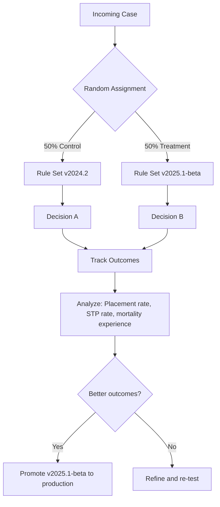

### 6.7 Rule Audit Trail

Every rule execution is captured for regulatory compliance and quality assurance:

```json
{
  "ruleAuditEntry": {
    "auditId": "AUD-2025-00987654",
    "caseId": "CASE-2025-00012345",
    "ruleSetVersion": "2024.2",
    "executionTimestamp": "2025-01-21T10:15:32Z",
    "totalRulesEvaluated": 358,
    "rulesFired": 12,
    "executionTimeMs": 245,
    "firedRules": [
      {
        "ruleId": "KO_BMI_MAX",
        "ruleName": "BMI Maximum Threshold",
        "category": "KNOCKOUT",
        "input": {"bmi": 28.5},
        "result": "NOT_TRIGGERED",
        "explanation": "BMI 28.5 is below knockout threshold of 45"
      },
      {
        "ruleId": "CL_BUILD_CHART",
        "ruleName": "Build Chart Classification",
        "category": "CLASSIFICATION",
        "input": {"heightInches": 71, "weightLbs": 185, "gender": "Male"},
        "result": "PREFERRED",
        "explanation": "Weight 185 within Preferred range (≤198) for 71 inches male"
      },
      {
        "ruleId": "CL_CHOLESTEROL",
        "ruleName": "Cholesterol Classification",
        "category": "CLASSIFICATION",
        "input": {"totalCholesterol": 210, "hdl": 55, "ratio": 3.8},
        "result": "STANDARD",
        "explanation": "Total cholesterol 210 exceeds Preferred max of 200; ratio 3.8 acceptable"
      },
      {
        "ruleId": "AA_JET_ISSUE",
        "ruleName": "Jet Issue Eligibility",
        "category": "AUTO_APPROVE",
        "input": {"age": 39, "faceAmount": 500000, "riskScore": 22, "knockouts": 0},
        "result": "NOT_ELIGIBLE",
        "explanation": "Cholesterol classification limits to Standard; jet issue requires Preferred or better"
      }
    ],
    "finalDecision": {
      "action": "REFER_TO_UNDERWRITER",
      "suggestedRiskClass": "STANDARD",
      "reason": "Elevated cholesterol requires underwriter review for Preferred consideration"
    }
  }
}
```

### 6.8 Drools Rule Example

```java
package com.insurance.underwriting.rules

import com.insurance.underwriting.model.Case
import com.insurance.underwriting.model.LabResult
import com.insurance.underwriting.model.Decision

rule "Build Chart - Preferred Plus Eligibility"
    salience 100
    when
        $case : Case(
            insuredGender == "MALE",
            insuredHeightInches >= 60,
            insuredHeightInches <= 76,
            insuredWeightLbs > 0
        )
        $buildLimit : BuildChartLimit(
            gender == "MALE",
            heightInches == $case.insuredHeightInches,
            riskClass == "PREFERRED_PLUS"
        )
        eval($case.getInsuredWeightLbs() <= $buildLimit.getMaxWeight())
    then
        $case.setBuildClassification("PREFERRED_PLUS");
        update($case);
end

rule "Cholesterol - Preferred Disqualification"
    salience 90
    when
        $case : Case()
        $lab : LabResult(
            caseId == $case.getCaseId(),
            testCode == "TOTAL_CHOLESTEROL",
            numericValue > 240
        )
    then
        $case.addDebit("CHOLESTEROL_HIGH", 50);
        $case.addReferralReason("Total cholesterol " + $lab.getNumericValue() + " exceeds 240 mg/dL");
        update($case);
end

rule "Diabetes - Type 2 Well Controlled"
    salience 80
    when
        $case : Case()
        $condition : MedicalCondition(
            caseId == $case.getCaseId(),
            conditionCode == "DIABETES_TYPE_2"
        )
        $lab : LabResult(
            caseId == $case.getCaseId(),
            testCode == "HBA1C",
            numericValue <= 7.0
        )
        not MedicalCondition(
            caseId == $case.getCaseId(),
            conditionCode in ("DIABETIC_RETINOPATHY", "DIABETIC_NEUROPATHY", "DIABETIC_NEPHROPATHY")
        )
    then
        $case.addDebit("DIABETES_T2_CONTROLLED", 75);
        $case.addCredit("DIABETES_GOOD_CONTROL", -25);
        update($case);
end

rule "Auto-Approve - Jet Issue"
    salience 10
    when
        $case : Case(
            insuredAge >= 18,
            insuredAge <= 45,
            faceAmount <= 500000,
            totalDebits == 0,
            referralReasons.size() == 0,
            knockoutTriggered == false,
            riskScore < 30
        )
    then
        Decision decision = new Decision();
        decision.setDecisionType("AUTO_APPROVE");
        decision.setRiskClass("PREFERRED_PLUS");
        decision.setReason("Jet issue criteria met - no debits, low risk score");
        $case.setDecision(decision);
        update($case);
end
```

---

## 7. Underwriting Workbench

### 7.1 Overview

The Underwriting Workbench is the primary UI for underwriters to review cases, evaluate evidence, and render decisions. It must be designed for efficiency (underwriters may review 15-30+ cases per day).

### 7.2 Case Summary View

```mermaid
graph TB
    subgraph "Underwriting Workbench"
        subgraph "Header"
            H1[Case #: CASE-2025-00012345]
            H2[Insured: John A. Doe, M, Age 39]
            H3[Product: 20-Year Term, $500K]
            H4[Status: In Underwriting]
            H5[Priority: Normal | SLA: Day 3 of 15]
        end

        subgraph "Evidence Panel"
            E1[Application ✅]
            E2[MIB ✅ - No hits]
            E3[Rx History ✅ - Atorvastatin noted]
            E4[MVR ✅ - Clean record]
            E5[ID Verification ✅ - Confirmed]
            E6[Lab Results ✅ - See details]
            E7[APS ⏳ - Ordered 01/20, pending]
        end

        subgraph "Risk Assessment"
            R1[Build: 5'11", 185 lbs = Preferred]
            R2[Blood Pressure: 128/78 = Preferred]
            R3[Cholesterol: 210 Total, 3.8 Ratio = Standard]
            R4[HbA1c: 5.4% = Preferred Plus]
            R5[Tobacco: Non-smoker, Cotinine negative]
            R6[Rx: Atorvastatin - Hyperlipidemia]
            R7[Auto-Score: 35 - Moderate Risk]
        end

        subgraph "Decision Panel"
            D1[Risk Class Recommendation: Standard Non-Tobacco]
            D2[Table Rating: None]
            D3[Flat Extra: None]
            D4[Debits: +50 Cholesterol]
            D5[Credits: -25 Active lifestyle]
        end

        subgraph "Actions"
            A1[Approve]
            A2[Approve with Rating]
            A3[Decline]
            A4[Postpone]
            A5[Request More Evidence]
            A6[Refer to Peer Review]
            A7[Refer to Medical Director]
        end
    end
```

### 7.3 Evidence Management View

The evidence panel provides a consolidated view of all gathered evidence:

| Evidence Type | Status | Received Date | Key Findings | Actions |
|--------------|--------|--------------|--------------|---------|
| Application | Complete | 2025-01-15 | A-fib disclosed, Atorvastatin | View |
| MIB Report | Complete | 2025-01-16 | No significant codes | View |
| Rx History | Complete | 2025-01-16 | Eliquis, Atorvastatin | View |
| MVR | Complete | 2025-01-16 | Clean record | View |
| ID Verification | Complete | 2025-01-15 | Identity confirmed | View |
| Lab Results | Complete | 2025-01-23 | Cholesterol elevated (210) | View/Detail |
| Paramedical Exam | Complete | 2025-01-20 | BP 128/78, build normal | View |
| APS - Dr. Chen | Pending | Ordered 01/20 | — | Follow-up/Expedite |

### 7.4 Risk Assessment Worksheet

The digital risk assessment worksheet guides the underwriter through systematic evaluation:

```json
{
  "riskAssessmentWorksheet": {
    "caseId": "CASE-2025-00012345",
    "underwriter": "UW_THOMPSON",
    "sections": [
      {
        "section": "BUILD",
        "classification": "PREFERRED",
        "debits": 0,
        "notes": "BMI 25.8, within preferred range"
      },
      {
        "section": "BLOOD_PRESSURE",
        "classification": "PREFERRED",
        "debits": 0,
        "notes": "128/78 average of 2 readings"
      },
      {
        "section": "CHOLESTEROL",
        "classification": "STANDARD",
        "debits": 50,
        "notes": "Total 210, LDL 130 - controlled with Atorvastatin"
      },
      {
        "section": "CARDIAC",
        "classification": "PENDING_APS",
        "debits": null,
        "notes": "A-fib disclosed, controlled with Eliquis. Awaiting APS for full cardiac history."
      },
      {
        "section": "DIABETES",
        "classification": "PREFERRED_PLUS",
        "debits": 0,
        "notes": "HbA1c 5.4%, no indicators"
      },
      {
        "section": "TOBACCO",
        "classification": "NON_TOBACCO",
        "debits": 0,
        "notes": "Cotinine negative, no tobacco declared"
      },
      {
        "section": "FAMILY_HISTORY",
        "classification": "STANDARD",
        "debits": 25,
        "notes": "Father MI at age 58"
      },
      {
        "section": "DRIVING",
        "classification": "PREFERRED_PLUS",
        "debits": 0,
        "notes": "Clean MVR"
      },
      {
        "section": "FINANCIAL",
        "classification": "APPROVED",
        "debits": 0,
        "notes": "$500K face / $175K income = 2.86x. Well within guidelines."
      }
    ],
    "totalDebits": 75,
    "totalCredits": 0,
    "netDebits": 75,
    "preliminaryClassification": "STANDARD_NON_TOBACCO",
    "awaitingEvidence": ["APS - Dr. Chen (Cardiology)"]
  }
}
```

### 7.5 Peer Review Workflow

For significant decisions (high face amounts, complex impairments, borderline cases):

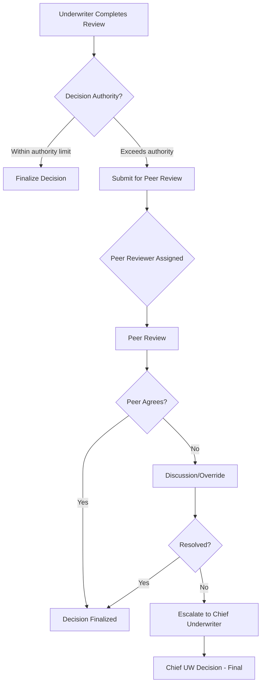

**Authority Limits**:

| Underwriter Level | Maximum Face Amount | Maximum Table Rating | Can Decline? |
|-------------------|--------------------|--------------------|-------------|
| Associate UW | $250,000 | Table 2 | No |
| Senior UW | $1,000,000 | Table 8 | Yes (with peer review) |
| Chief UW | $5,000,000 | Table 16 | Yes |
| Medical Director | Unlimited | Unlimited | Yes |
| VP Underwriting | Unlimited | Unlimited | Yes (policy exceptions) |

### 7.6 Medical Director Referral

Cases referred to the Medical Director typically involve:

- Complex concurrent impairments
- Unusual medical conditions
- Experimental treatments
- Conflicting medical opinions
- Foreign medical records
- Very high face amounts with health concerns

---

## 8. Reinsurance in Underwriting

### 8.1 Retention and Binding

**Retention** is the maximum amount of risk the ceding company (direct writer) retains on a single life:

| Carrier Size | Typical Retention | Automatic Binding Limit |
|-------------|-------------------|------------------------|
| Small carrier | $500K-$2M | Equal to retention |
| Mid-size carrier | $2M-$10M | Equal to retention |
| Large carrier | $10M-$25M | Equal to retention |

### 8.2 Automatic vs. Facultative Reinsurance

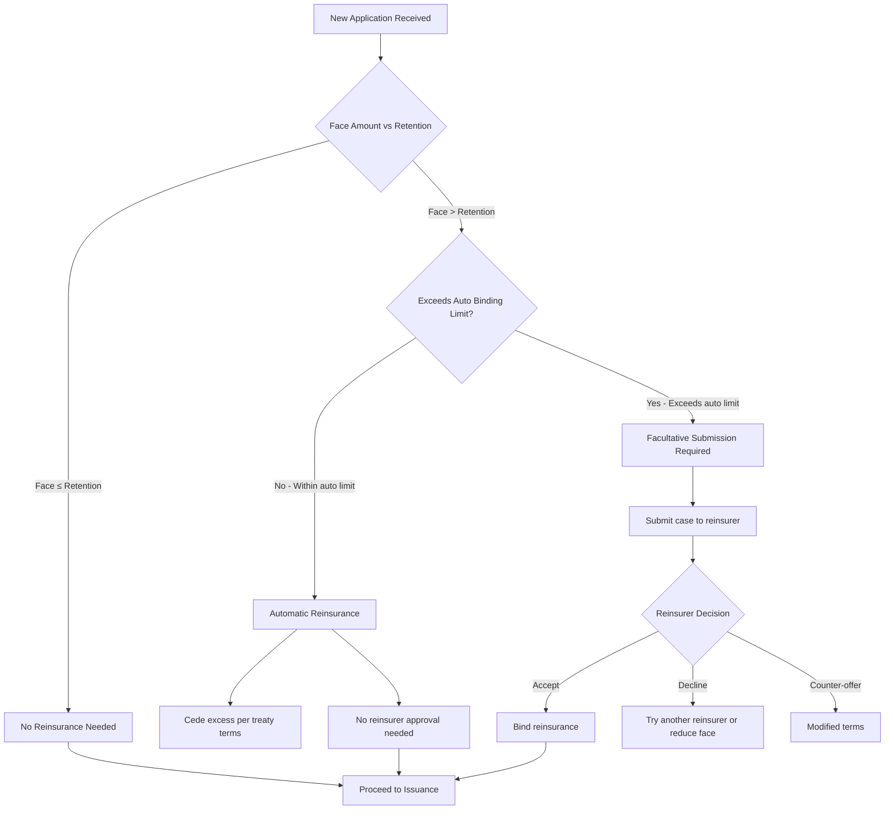

### 8.3 Facultative Submission Process

When the amount at risk exceeds the automatic binding limit, the carrier must submit the case to reinsurers for individual review:

**Facultative Submission Package**:

| Document | Description |
|----------|-------------|
| Cover letter | Summary of case, amount ceded, terms requested |
| Application | Full application copy |
| Lab results | All laboratory findings |
| APS | Attending physician statements |
| Paramedical report | Exam findings |
| Financial summary | Financial justification |
| MIB results | MIB check results |
| Rx history | Prescription history |
| Underwriting assessment | Ceding company's preliminary assessment |
| Illustration | Policy illustration |

**Reinsurer Decision Integration**:

```json
{
  "facultativeResponse": {
    "submissionId": "FAC-2025-00456",
    "caseId": "CASE-2025-00012345",
    "reinsurer": "Swiss Re",
    "treatyNumber": "TR-2024-001",
    "decision": "ACCEPT",
    "riskClass": "STANDARD_NON_TOBACCO",
    "tableRating": null,
    "flatExtra": null,
    "amountAccepted": 1500000,
    "retentionAmount": 500000,
    "cedingAmount": 1500000,
    "conditions": [
      "APS from cardiologist required before binding",
      "Echocardiogram results needed"
    ],
    "expirationDate": "2025-04-21",
    "underwriter": "M. Williams, SVP Underwriting",
    "responseDate": "2025-01-25"
  }
}
```

### 8.4 Preliminary Inquiry

For very large cases or uncertain risks, the carrier may submit a **preliminary inquiry** to gauge reinsurer interest before completing full underwriting:

- Anonymous submission (no identifying information)
- High-level medical/financial summary
- Reinsurer provides informal indication (favorable/unfavorable/need more info)
- Not a binding commitment

---

## 9. Evidence & Requirement Management

### 9.1 Requirement Types

| Requirement Type | Code | Source | Typical Turnaround |
|-----------------|------|--------|-------------------|
| MIB Check | MIB | MIB Inc. | < 1 minute (electronic) |
| Motor Vehicle Report | MVR | LexisNexis, various | < 1 minute (electronic) |
| Prescription History | RX | Milliman IntelliScript, ExamOne | < 1 minute (electronic) |
| Credit-Based Score | CREDIT | TransUnion, Equifax | < 1 minute (electronic) |
| Identity Verification | IDV | LexisNexis, Experian | < 1 minute (electronic) |
| OFAC Screening | OFAC | OFAC SDN List | < 1 minute (electronic) |
| Paramedical Exam | PARA | ExamOne, APPS, Portamedic | 5-10 business days |
| Full Medical Exam | MEDICAL | Physician | 10-20 business days |
| Blood/Urine Labs | LABS | ExamOne, Quest | 3-5 business days |
| EKG/Resting ECG | EKG | ExamOne, physician | 5-10 business days |
| Stress Test | STRESS | Cardiologist | 10-20 business days |
| Attending Physician Statement | APS | Treating physician | 15-45 business days |
| Inspection Report | IR | LexisNexis Risk Solutions | 5-10 business days |
| Financial Documents | FIN | Applicant/CPA | 10-20 business days |
| Trust Documents | TRUST | Attorney | 10-20 business days |
| Foreign Medical Records | FMED | International sources | 30-60 business days |
| Cognitive Assessment | COG | Physician | 10-20 business days |
| Treadmill ECG | TECG | Cardiologist | 10-20 business days |

### 9.2 Age/Amount Requirement Matrix

This matrix determines which evidence is required based on the applicant's age and the face amount applied for:

| Face Amount | Ages 18-30 | Ages 31-40 | Ages 41-50 | Ages 51-60 | Ages 61-70 | Ages 71+ |
|-------------|-----------|-----------|-----------|-----------|-----------|---------|
| $0-$100K | App, MIB, Rx | App, MIB, Rx | App, MIB, Rx, MVR | App, MIB, Rx, MVR | App, MIB, Rx, MVR, Para | App, MIB, Rx, MVR, Para, EKG |
| $100K-$250K | App, MIB, Rx, MVR | App, MIB, Rx, MVR | App, MIB, Rx, MVR, Para | App, MIB, Rx, MVR, Para | App, MIB, Rx, MVR, Para, EKG | App, MIB, Rx, MVR, Para, EKG, APS |
| $250K-$500K | App, MIB, Rx, MVR, Para | App, MIB, Rx, MVR, Para | App, MIB, Rx, MVR, Para, Labs | App, MIB, Rx, MVR, Para, Labs, EKG | App, MIB, Rx, MVR, Para, Labs, EKG | App, MIB, Rx, MVR, Para, Labs, EKG, APS |
| $500K-$1M | App, MIB, Rx, MVR, Para, Labs | App, MIB, Rx, MVR, Para, Labs | App, MIB, Rx, MVR, Para, Labs, EKG | App, MIB, Rx, MVR, Para, Labs, EKG, IR | App, MIB, Rx, MVR, Para, Labs, EKG, IR, APS | Full workup |
| $1M-$5M | App, MIB, Rx, MVR, Para, Labs, FIN | All + EKG, FIN | All + EKG, FIN, IR | All + EKG, FIN, IR | Full workup | Full workup |
| $5M+ | Full workup + IR, FIN | Full workup + IR, FIN | Full workup + IR, FIN | Full workup | Full workup | Full workup |

### 9.3 Vendor Integration Architecture

```mermaid
graph TB
    subgraph "PAS Underwriting"
        REQ[Requirement Manager]
    end

    subgraph "Vendor Gateway"
        VG[Vendor Gateway Service]
        VG --> VQ[Vendor Queue]
    end

    subgraph "Electronic Vendors (Real-Time)"
        E1[MIB]
        E2[LexisNexis - MVR/ID]
        E3[Milliman IntelliScript - Rx]
        E4[TransUnion - Credit]
        E5[OFAC - Treasury]
    end

    subgraph "Exam Vendors (Async)"
        X1[ExamOne - Labs/Para]
        X2[APPS - Paramedical]
        X3[Portamedic - Paramedical]
    end

    subgraph "APS Vendors (Async)"
        A1[Parameds Plus]
        A2[EMSI]
        A3[Concentra]
    end

    REQ --> VG
    VG -->|REST API| E1
    VG -->|REST API| E2
    VG -->|REST API| E3
    VG -->|REST API| E4
    VG -->|REST API| E5
    VG -->|Order API| X1
    VG -->|Order API| X2
    VG -->|Order API| X3
    VG -->|Order API| A1
    VG -->|Order API| A2
    VG -->|Order API| A3

    X1 -->|Webhook/SFTP| VG
    X2 -->|Webhook/SFTP| VG
    X3 -->|Webhook/SFTP| VG
    A1 -->|Webhook/SFTP| VG
    A2 -->|Webhook/SFTP| VG
    A3 -->|Webhook/SFTP| VG

    VG --> REQ
```

### 9.4 Requirement Follow-Up Scheduling

```python
FOLLOW_UP_SCHEDULE = {
    "APS": {
        "initial_follow_up_days": 10,
        "subsequent_follow_up_days": 7,
        "max_follow_ups": 5,
        "escalation_after_days": 40,
        "expiration_days": 180
    },
    "PARA": {
        "initial_follow_up_days": 7,
        "subsequent_follow_up_days": 5,
        "max_follow_ups": 3,
        "escalation_after_days": 21,
        "expiration_days": 90
    },
    "LABS": {
        "initial_follow_up_days": 5,
        "subsequent_follow_up_days": 3,
        "max_follow_ups": 3,
        "escalation_after_days": 14,
        "expiration_days": 90
    },
    "FIN": {
        "initial_follow_up_days": 10,
        "subsequent_follow_up_days": 7,
        "max_follow_ups": 4,
        "escalation_after_days": 30,
        "expiration_days": 120
    }
}

def schedule_follow_up(requirement) -> date:
    """Calculate next follow-up date for a requirement."""
    config = FOLLOW_UP_SCHEDULE.get(requirement.type)
    if not config:
        return None

    if requirement.follow_up_count == 0:
        return requirement.ordered_date + timedelta(days=config["initial_follow_up_days"])
    elif requirement.follow_up_count < config["max_follow_ups"]:
        return requirement.last_follow_up_date + timedelta(days=config["subsequent_follow_up_days"])
    else:
        return None  # Max follow-ups reached; escalate
```

### 9.5 Requirement Expiration

Evidence has shelf-life and expires:

| Evidence Type | Expiration Period | Action on Expiry |
|--------------|-------------------|-----------------|
| Lab Results | 6 months | Re-order labs |
| Paramedical Exam | 6 months | Re-order exam |
| APS | 12 months | Request updated records |
| MVR | 6 months | Re-order |
| MIB | 12 months | Re-order |
| Financial Documents | 12 months (with current tax year) | Request updated docs |
| EKG | 12 months | Re-order |
| Inspection Report | 6 months | Re-order |

---

## 10. Predictive Analytics & AI/ML

### 10.1 Mortality Risk Scoring Models

Modern underwriting incorporates predictive models to estimate mortality risk:

**Model Types**:

| Model Type | Description | Use Case |
|-----------|-------------|----------|
| **Logistic Regression** | Simple, interpretable, baseline model | Traditional risk scoring |
| **Gradient Boosted Trees** (XGBoost, LightGBM) | High accuracy, handles non-linear relationships | Accelerated UW scoring |
| **Random Forest** | Ensemble method, good for feature importance | Feature selection |
| **Neural Network** | Complex patterns, high dimensionality | EHR data processing |
| **Survival Analysis** (Cox PH) | Time-to-event modeling | Mortality curve prediction |

### 10.2 Machine Learning Features

| Feature Category | Specific Features |
|-----------------|-------------------|
| **Demographics** | Age, gender, BMI, income, occupation class |
| **Medical History** | Condition codes, condition count, severity scores, time since diagnosis |
| **Laboratory** | All lab values (normalized), lab value trends, abnormal count |
| **Rx History** | Medication count, chronic medication count, medication classes, adherence proxy |
| **MVR** | Violation count, DUI indicator, license status, accident count |
| **MIB** | Code count, code severity, consistency with application |
| **Behavioral** | Tobacco status, alcohol use, exercise frequency, BMI trend |
| **Financial** | Income-to-coverage ratio, credit score band, net worth band |
| **Family History** | Cardiac history indicator, cancer history indicator, age of onset |
| **EHR (if available)** | Diagnosis count, hospitalization count, ER visits, medication adherence |

### 10.3 Model Governance

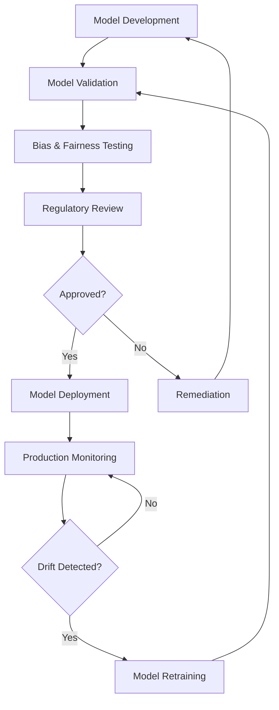

### 10.4 Model Validation Requirements

| Validation Aspect | Description |
|-------------------|-------------|
| **Discrimination** | AUC-ROC > 0.75 for mortality prediction |
| **Calibration** | Predicted probabilities match observed frequencies |
| **Stability** | PSI (Population Stability Index) < 0.1 |
| **Out-of-Time** | Validated on holdout data from different time period |
| **Subgroup Performance** | Consistent performance across gender, age, and race groups |
| **Sensitivity Analysis** | Model robust to small input perturbations |

### 10.5 Regulatory Considerations (NAIC Model Bulletin on AI/ML)

The NAIC issued a Model Bulletin on the Use of AI Systems by Insurers (2023/2024), establishing expectations:

| Requirement | Implementation |
|-------------|---------------|
| **Transparency** | Document model purpose, data inputs, decision logic |
| **Fairness** | Test for unfair discrimination against protected classes |
| **Accountability** | Designated responsible officer for AI/ML systems |
| **Explainability** | Ability to explain individual decisions to regulators |
| **Data Quality** | Ensure training data is accurate, complete, and representative |
| **Human Oversight** | Human-in-the-loop for consequential decisions |
| **Audit Trail** | Log model inputs, outputs, and versions for all decisions |
| **Periodic Review** | Regular model performance monitoring and revalidation |

### 10.6 Fairness and Bias Testing

```python
class FairnessTester:
    """Test underwriting model for fairness across protected classes."""

    PROTECTED_ATTRIBUTES = ["gender", "race_ethnicity", "zip_code_proxy"]

    def test_disparate_impact(self, predictions: dict, protected_attr: str) -> dict:
        """Test for disparate impact using the 4/5ths rule."""
        groups = self._group_by_attribute(predictions, protected_attr)
        approval_rates = {}

        for group, preds in groups.items():
            approval_rates[group] = sum(1 for p in preds if p["approved"]) / len(preds)

        max_rate = max(approval_rates.values())
        results = {}

        for group, rate in approval_rates.items():
            ratio = rate / max_rate if max_rate > 0 else 0
            results[group] = {
                "approvalRate": round(rate, 4),
                "disparateImpactRatio": round(ratio, 4),
                "passesThreshold": ratio >= 0.8  # 4/5ths rule
            }

        return {
            "protectedAttribute": protected_attr,
            "groupResults": results,
            "overallPass": all(r["passesThreshold"] for r in results.values())
        }

    def test_equalized_odds(self, predictions: dict, protected_attr: str) -> dict:
        """Test for equal true positive and false positive rates across groups."""
        groups = self._group_by_attribute(predictions, protected_attr)
        metrics = {}

        for group, preds in groups.items():
            tp = sum(1 for p in preds if p["approved"] and p["actual_good_risk"])
            fp = sum(1 for p in preds if p["approved"] and not p["actual_good_risk"])
            tn = sum(1 for p in preds if not p["approved"] and not p["actual_good_risk"])
            fn = sum(1 for p in preds if not p["approved"] and p["actual_good_risk"])

            tpr = tp / (tp + fn) if (tp + fn) > 0 else 0
            fpr = fp / (fp + tn) if (fp + tn) > 0 else 0

            metrics[group] = {"tpr": round(tpr, 4), "fpr": round(fpr, 4)}

        return {
            "protectedAttribute": protected_attr,
            "groupMetrics": metrics,
            "tprSpread": max(m["tpr"] for m in metrics.values()) - min(m["tpr"] for m in metrics.values()),
            "fprSpread": max(m["fpr"] for m in metrics.values()) - min(m["fpr"] for m in metrics.values())
        }
```

---

## 11. Complete Data Model for Underwriting

### 11.1 Entity Relationship Diagram

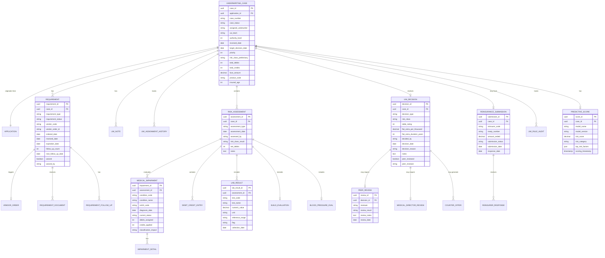

### 11.2 Complete Entity Listing (25+ Entities)

| # | Entity | Description |
|---|--------|-------------|
| 1 | UNDERWRITING_CASE | Master underwriting case record |
| 2 | REQUIREMENT | Evidence requirements |
| 3 | REQUIREMENT_DOCUMENT | Received evidence documents |
| 4 | REQUIREMENT_FOLLOW_UP | Follow-up tracking |
| 5 | VENDOR_ORDER | Vendor order details |
| 6 | VENDOR_RESPONSE | Vendor response data |
| 7 | RISK_ASSESSMENT | Risk evaluation records |
| 8 | MEDICAL_IMPAIRMENT | Identified medical impairments |
| 9 | IMPAIRMENT_DETAIL | Detailed impairment data |
| 10 | DEBIT_CREDIT_ENTRY | Individual debit/credit entries |
| 11 | LAB_RESULT | Laboratory result values |
| 12 | LAB_PANEL | Lab panel groupings |
| 13 | BUILD_EVALUATION | Height/weight evaluation |
| 14 | BLOOD_PRESSURE_EVAL | Blood pressure readings and classification |
| 15 | UW_DECISION | Underwriting decision record |
| 16 | COUNTER_OFFER | Modified offer details |
| 17 | COUNTER_OFFER_RESPONSE | Applicant response to counter offer |
| 18 | PEER_REVIEW | Peer review records |
| 19 | MEDICAL_DIRECTOR_REVIEW | Medical director consultation records |
| 20 | UW_NOTE | Case notes and diary |
| 21 | UW_ASSIGNMENT_HISTORY | Assignment audit trail |
| 22 | UW_RULE_AUDIT | Rule execution audit log |
| 23 | PREDICTIVE_SCORE | ML model scores |
| 24 | PREDICTIVE_SCORE_FACTORS | Score explanation factors |
| 25 | REINSURANCE_SUBMISSION | Facultative submission records |
| 26 | REINSURER_RESPONSE | Reinsurer decision records |
| 27 | BUILD_CHART | Build chart reference data |
| 28 | UW_RULE_SET | Rule set version management |
| 29 | UW_GUIDELINE | Underwriting guideline reference |
| 30 | AUTHORITY_LIMIT | Underwriter authority levels |

---

## 12. ACORD Messages for Underwriting

### 12.1 Key ACORD Transaction Types

| TXLife TransType | Code | Description |
|-----------------|------|-------------|
| Underwriting Status Update | 152 | Status change during underwriting |
| Requirement Order | 121 | Order requirements from vendors |
| Requirement Result | 122 | Receive requirement results |
| Underwriting Decision | 103 (response) | Decision communicated |
| Reinsurance Submission | 160 | Submit to reinsurer |
| Reinsurance Response | 161 | Reinsurer response |

### 12.2 ACORD Requirement Order XML

```xml
<?xml version="1.0" encoding="UTF-8"?>
<TXLife xmlns="http://ACORD.org/Standards/Life/2" version="2.43.00">
  <TXLifeRequest>
    <TransRefGUID>req-order-guid-001</TransRefGUID>
    <TransType tc="121">Requirement Order</TransType>
    <TransExeDate>2025-01-16</TransExeDate>
    <OLifE>
      <Holding id="Holding_1">
        <Policy>
          <RequirementInfo id="Req_APS_01">
            <ReqCode tc="7">Attending Physician Statement</ReqCode>
            <ReqStatus tc="3">Ordered</ReqStatus>
            <RequestedDate>2025-01-16</RequestedDate>
            <RequiredInd tc="1">true</RequiredInd>
            <RestrictIssueCode tc="1">Cannot Issue Without</RestrictIssueCode>
          </RequirementInfo>
        </Policy>
      </Holding>
      <Party id="Party_Physician">
        <PartyTypeCode tc="1">Person</PartyTypeCode>
        <Person>
          <FirstName>Robert</FirstName>
          <LastName>Chen</LastName>
        </Person>
        <Address>
          <Line1>456 Medical Center Dr</Line1>
          <City>San Francisco</City>
          <AddressStateTC tc="6">CA</AddressStateTC>
          <Zip>94143</Zip>
        </Address>
        <Phone>
          <DialNumber>4155550789</DialNumber>
        </Phone>
      </Party>
      <Relation OriginatingObjectID="Req_APS_01"
                RelatedObjectID="Party_Physician"
                RelationRoleCode="41">
        <!-- tc="41" = Attending Physician -->
      </Relation>
    </OLifE>
  </TXLifeRequest>
</TXLife>
```

### 12.3 ACORD Underwriting Decision Response

```xml
<?xml version="1.0" encoding="UTF-8"?>
<TXLife xmlns="http://ACORD.org/Standards/Life/2" version="2.43.00">
  <TXLifeResponse>
    <TransRefGUID>uw-decision-guid-001</TransRefGUID>
    <TransType tc="103">Application Response</TransType>
    <TransSubType tc="10302">Underwriting Decision</TransSubType>
    <TransResult>
      <ResultCode tc="1">Success</ResultCode>
    </TransResult>
    <OLifE>
      <Holding id="Holding_1">
        <Policy>
          <ApplicationInfo>
            <HOAssignedAppNumber>APP-2025-00012345</HOAssignedAppNumber>
            <ApplicationInfoExtension>
              <UnderwritingDecision>
                <DecisionCode tc="1">Approved</DecisionCode>
                <RiskClassification tc="3">Standard Non-Tobacco</RiskClassification>
                <DecisionDate>2025-02-01</DecisionDate>
                <DecisionReason>
                  Approved Standard Non-Tobacco. Elevated cholesterol with
                  family history of cardiac disease precludes Preferred class.
                  Well-controlled A-fib with good cardiac function per APS.
                </DecisionReason>
                <UnderwriterName>Sarah Thompson, Senior UW</UnderwriterName>
              </UnderwritingDecision>
            </ApplicationInfoExtension>
          </ApplicationInfo>
        </Policy>
      </Holding>
    </OLifE>
  </TXLifeResponse>
</TXLife>
```

---

## 13. Decision Tree Diagrams

### 13.1 Type 2 Diabetes Decision Tree

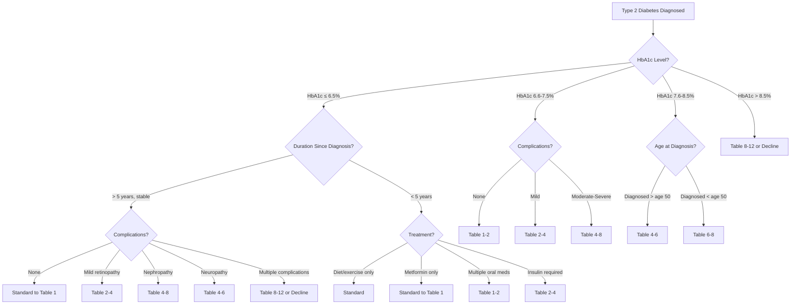

### 13.2 Coronary Artery Disease Decision Tree

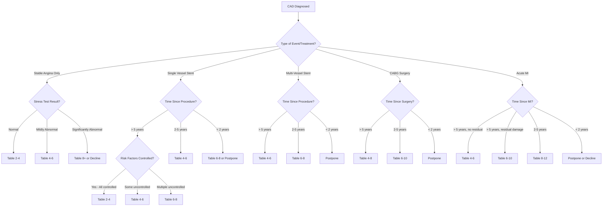

### 13.3 Depression/Anxiety Decision Tree

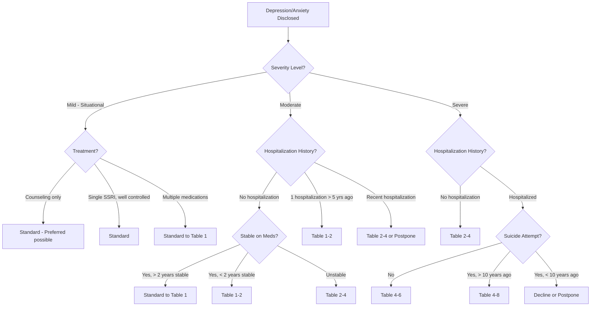

---

## 14. Architecture Reference

### 14.1 Underwriting Microservice Design

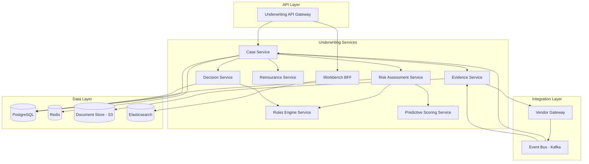

### 14.2 Evidence Management System Design

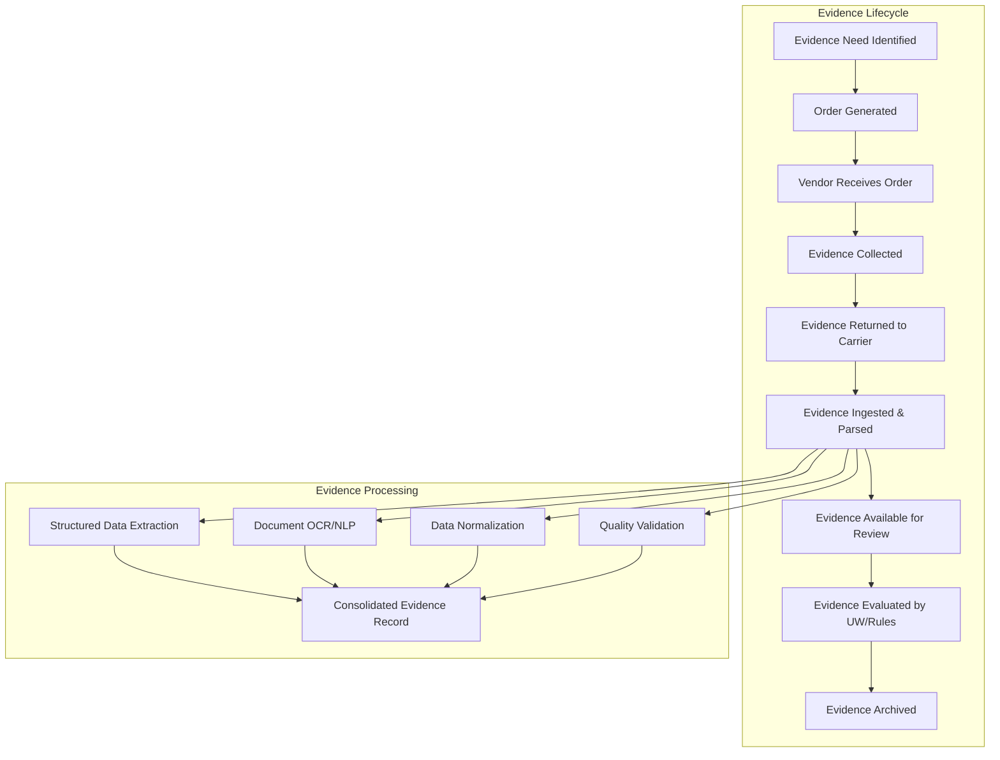

### 14.3 Rules Engine Integration Pattern

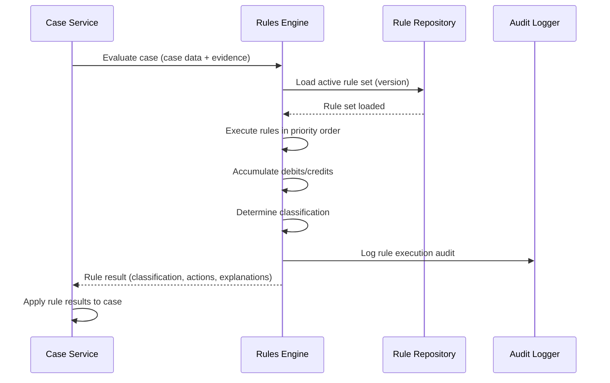

### 14.4 Scalability Considerations

| Component | Scaling Strategy |
|-----------|-----------------|
| Rules Engine | Stateless; horizontal pod scaling; cache rule sets in memory |
| Evidence Service | Async processing; queue-based ordering; parallel vendor calls |
| Predictive Model | Model serving (TensorFlow Serving, SageMaker); GPU for batch scoring |
| Document Processing | Worker pools for OCR/NLP; auto-scale based on queue depth |
| Case Database | Read replicas for workbench queries; partitioning by case date |
| Search Index | Elasticsearch cluster with dedicated search nodes |

---

## 15. Glossary

| Term | Definition |
|------|-----------|
| **ABCL** | Automatic Binding Cover Letter (reinsurance) |
| **APS** | Attending Physician Statement — medical records from treating physician |
| **AUC-ROC** | Area Under the Receiver Operating Characteristic Curve — model discrimination metric |
| **BMI** | Body Mass Index — weight (kg) / height (m)² |
| **BRMS** | Business Rules Management System |
| **CABG** | Coronary Artery Bypass Graft surgery |
| **Ceding Company** | Insurance company transferring risk to a reinsurer |
| **Cox PH** | Cox Proportional Hazards model — survival analysis technique |
| **Debit** | Risk points added for adverse health findings |
| **Credit** | Risk points subtracted for favorable findings |
| **DMN** | Decision Model and Notation — OMG standard |
| **DRL** | Drools Rule Language |
| **EHR** | Electronic Health Record |
| **Facultative** | Individual case reinsurance submission and acceptance |
| **FHIR** | Fast Healthcare Interoperability Resources — HL7 standard |
| **Flat Extra** | Additional premium per $1,000 of face amount |
| **GBT** | Gradient Boosted Trees — ML algorithm |
| **HbA1c** | Glycated hemoglobin — 3-month average blood sugar measure |
| **HLV** | Human Life Value — economic value of a person's future income |
| **ICD-10** | International Classification of Diseases, 10th Revision |
| **Impairment** | Medical condition affecting mortality risk |
| **Jet Issue** | Fastest STP pathway — immediate policy issuance |
| **Knockout Rule** | Rule that immediately disqualifies from a pathway (STP, preferred class, etc.) |
| **LDL** | Low-Density Lipoprotein — "bad" cholesterol |
| **MI** | Myocardial Infarction — heart attack |
| **MIB** | Medical Information Bureau |
| **Mortality** | Rate of death in a population |
| **MVR** | Motor Vehicle Report |
| **NLP** | Natural Language Processing |
| **OFAC** | Office of Foreign Assets Control |
| **Paramedical** | Basic medical exam by mobile examiner |
| **PSA** | Prostate-Specific Antigen — prostate cancer marker |
| **PSI** | Population Stability Index — model monitoring metric |
| **Retention** | Maximum risk amount retained by ceding company |
| **Rx** | Prescription medication |
| **SDN** | Specially Designated Nationals (OFAC sanctions list) |
| **STOLI** | Stranger-Owned Life Insurance |
| **STP** | Straight-Through Processing |
| **Table Rating** | Substandard rating adding extra mortality charge |
| **Treaty** | Agreement between ceding company and reinsurer |
| **Underwriting** | Process of evaluating and classifying insurance risk |

---

*Article 09 — Underwriting Engine & Risk Assessment — Life Insurance PAS Architect's Encyclopedia*
*Version 1.0 — 2025*
