# Article 10: Policy Issuance & Contract Generation

## Life Insurance Policy Administration System — Architect's Encyclopedia

---

## Table of Contents

1. [Introduction & Scope](#1-introduction--scope)
2. [Pre-Issue Validation](#2-pre-issue-validation)
3. [Policy Number Assignment](#3-policy-number-assignment)
4. [Contract Generation](#4-contract-generation)
5. [Policy Kit Assembly](#5-policy-kit-assembly)
6. [Document Composition Technology](#6-document-composition-technology)
7. [Delivery Methods](#7-delivery-methods)
8. [Free-Look Period](#8-free-look-period)
9. [Policy Effective Dating](#9-policy-effective-dating)
10. [First-Year Processing Setup](#10-first-year-processing-setup)
11. [Regulatory Filing](#11-regulatory-filing)
12. [Complete ERD for Policy Contract & Document Management](#12-complete-erd-for-policy-contract--document-management)
13. [ACORD TXLife Policy Issuance Messages](#13-acord-txlife-policy-issuance-messages)
14. [BPMN Process Flow for Issuance](#14-bpmn-process-flow-for-issuance)
15. [Sample Document Template Structure](#15-sample-document-template-structure)
16. [Architecture Reference](#16-architecture-reference)
17. [Glossary](#17-glossary)

---

## 1. Introduction & Scope

Policy issuance is the culmination of the new business lifecycle — the point at which a binding legal contract is created between the life insurance carrier and the policyholder. This article provides an exhaustive architectural reference for the issuance domain, covering pre-issue validation, policy number assignment, contract document generation, delivery, free-look processing, and the initial setup of all downstream administrative systems.

### 1.1 Business Context

The issuance function impacts:

- **Legal binding**: The issued policy is a legal contract; errors have direct legal and financial consequences.
- **Regulatory compliance**: Policy forms must be state-approved, disclosures must be included, and delivery must follow state rules.
- **Customer experience**: The policy kit is the first tangible artifact the customer receives — it sets expectations.
- **Operational efficiency**: Automated issuance reduces costs and accelerates time-to-market.
- **Downstream systems**: Issuance triggers billing, commissions, reinsurance, reserves, and accounting — data accuracy is paramount.

### 1.2 Domain Boundaries

| Subdomain | Responsibility |
|-----------|---------------|
| Pre-Issue Validation | Final checks before policy creation |
| Policy Number Assignment | Generate unique, valid policy identifiers |
| Contract Generation | Compose the policy document from templates and variable data |
| Policy Kit Assembly | Bundle all required documents for delivery |
| Delivery Management | Print/mail, e-delivery, agent delivery |
| Free-Look Processing | Track free-look period, handle cancellations |
| Effective Dating | Determine policy effective date, backdating rules |
| First-Year Setup | Initialize billing, commissions, reinsurance, reserves |
| Regulatory Compliance | Form filing, state approvals, interstate compact |

### 1.3 Key Design Principles

1. **Idempotent issuance**: The issuance process must be idempotent — re-running with the same input produces the same output without duplicating policies or documents.
2. **Atomic transactions**: Policy creation, billing setup, commission activation, and reinsurance cession must succeed or fail as a unit (saga pattern for distributed transactions).
3. **Document fidelity**: Generated documents must be pixel-perfect replicas of state-approved forms.
4. **Regulatory traceability**: Every issued policy must be traceable to an approved form filing.
5. **Version control**: Template changes must be versioned and auditable.

---

## 2. Pre-Issue Validation

### 2.1 Overview

Pre-issue validation is the final quality gate before a policy is created. It consists of a comprehensive checklist of automated and manual verifications.

### 2.2 Pre-Issue Validation Checklist

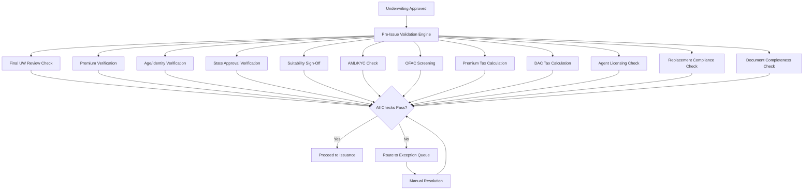

### 2.3 Detailed Validation Rules

#### 2.3.1 Final Underwriting Review

| Check | Rule | Failure Action |
|-------|------|----------------|
| Decision exists | UW decision must be recorded and active | Block issuance |
| Decision not expired | Decision date within 90 days | Route to UW for re-review |
| All requirements satisfied | No open/outstanding requirements | Block issuance |
| Counter-offer accepted | If rated, applicant acceptance must be on file | Block issuance |
| Reinsurance binding confirmed | If facultative, reinsurer acceptance on file | Block issuance |

#### 2.3.2 Premium Verification

```python
def verify_premium_for_issuance(case: Case, policy: PolicyDraft) -> list:
    """Verify premium amounts and payment before issuance."""
    errors = []

    # Verify premium calculation matches approved coverage
    expected_premium = calculate_premium(
        product=policy.product_code,
        face_amount=policy.face_amount,
        risk_class=case.uw_decision.risk_class,
        table_rating=case.uw_decision.table_rating,
        flat_extra=case.uw_decision.flat_extra_per_thousand,
        flat_extra_years=case.uw_decision.flat_extra_duration,
        riders=policy.riders,
        insured_age=policy.issue_age,
        gender=policy.insured_gender,
        state=policy.state_of_issue,
        premium_mode=policy.premium_mode
    )

    if abs(expected_premium - policy.modal_premium) > 0.01:
        errors.append(
            f"Premium mismatch: expected {expected_premium}, "
            f"policy shows {policy.modal_premium}"
        )

    # Verify initial premium received (if required before issuance)
    if case.premium_deposit_amount < expected_premium:
        if not case.payment_method.is_eft:
            errors.append(
                f"Insufficient premium: received {case.premium_deposit_amount}, "
                f"required {expected_premium}"
            )

    # Verify modal premium meets product minimums
    if policy.annual_premium < policy.product.minimum_annual_premium:
        errors.append(
            f"Annual premium {policy.annual_premium} below product minimum "
            f"{policy.product.minimum_annual_premium}"
        )

    return errors
```

#### 2.3.3 Age and Identity Verification

| Check | Rule | Details |
|-------|------|---------|
| Age at issue | Calculated from DOB to policy effective date | Must match pricing age (ALB or ANB) |
| Maximum issue age | Product maximum issue age not exceeded | Product-specific (typically 75-85) |
| Minimum issue age | Product minimum issue age met | Typically 18 (0 for juvenile) |
| Identity confirmed | SSN verified against external sources | LexisNexis/Experian verification |
| Not on Death Master File | SSN not found on DMF | Critical check — would indicate fraud |

**Age Calculation Methods**:

```python
from datetime import date
from dateutil.relativedelta import relativedelta

def calculate_age_last_birthday(dob: date, effective_date: date) -> int:
    """Age Last Birthday (ALB): Most common method."""
    age = relativedelta(effective_date, dob)
    return age.years

def calculate_age_nearest_birthday(dob: date, effective_date: date) -> int:
    """Age Nearest Birthday (ANB): Rounds to nearest birthday."""
    age_last = relativedelta(effective_date, dob).years
    next_birthday = dob.replace(year=dob.year + age_last + 1)
    days_to_next = (next_birthday - effective_date).days
    days_since_last = (effective_date - dob.replace(year=dob.year + age_last)).days

    if days_to_next <= days_since_last:
        return age_last + 1
    return age_last

# Example: DOB = 1985-03-15, Effective = 2025-01-15
dob = date(1985, 3, 15)
effective = date(2025, 1, 15)

alb = calculate_age_last_birthday(dob, effective)  # 39
anb = calculate_age_nearest_birthday(dob, effective)  # 40 (closer to 40th birthday)
```

#### 2.3.4 State Approval Verification

The system must verify that the product and form combination is approved for sale in the policy's jurisdiction:

```json
{
  "stateApprovalCheck": {
    "productCode": "TERM20_2024",
    "stateOfIssue": "CA",
    "formNumber": "ICC24-TL20",
    "formFilingStatus": "APPROVED",
    "approvalDate": "2024-06-15",
    "effectiveDate": "2024-07-01",
    "expirationDate": null,
    "serffTrackingNumber": "SERFF-2024-001234",
    "riders": [
      {
        "riderCode": "WP_2024",
        "formNumber": "ICC24-WP01",
        "filingStatus": "APPROVED",
        "approvalDate": "2024-06-15"
      },
      {
        "riderCode": "ADB_2024",
        "formNumber": "ICC24-ADB01",
        "filingStatus": "APPROVED",
        "approvalDate": "2024-06-15"
      }
    ],
    "overallResult": "APPROVED"
  }
}
```

#### 2.3.5 AML/KYC and OFAC Screening

**Anti-Money Laundering (AML) checks**:

| Check | Threshold | Action |
|-------|-----------|--------|
| Face amount threshold | Single premium > $50,000 or annual > $10,000 | Enhanced due diligence |
| Cash payment | Any cash payment > $10,000 | File CTR (Currency Transaction Report) |
| Structuring detection | Multiple payments just under $10,000 | SAR (Suspicious Activity Report) |
| PEP screening | All applicants | Enhanced due diligence if match |
| Adverse media | High face amount or PEP | Flag for compliance review |

**OFAC Screening**:

```python
def screen_ofac(party: Party) -> dict:
    """Screen a party against OFAC SDN list."""
    search_params = {
        "name": f"{party.first_name} {party.last_name}",
        "dateOfBirth": party.date_of_birth.isoformat() if party.date_of_birth else None,
        "address": party.address.to_string() if party.address else None,
        "citizenship": party.citizenship,
        "idNumber": party.government_id  # Only for confirmed matches
    }

    result = ofac_service.search(search_params)

    return {
        "screeningId": result.screening_id,
        "screeningDate": datetime.utcnow().isoformat(),
        "matchStatus": result.match_status,  # NO_MATCH, POSSIBLE_MATCH, CONFIRMED_MATCH
        "matchScore": result.score,
        "matchedEntries": [
            {
                "sdnName": entry.name,
                "sdnType": entry.entity_type,
                "program": entry.program,
                "score": entry.match_score
            }
            for entry in result.matched_entries
        ],
        "action": _determine_action(result)
    }

def _determine_action(result) -> str:
    if result.match_status == "NO_MATCH":
        return "PROCEED"
    elif result.match_status == "POSSIBLE_MATCH":
        return "MANUAL_REVIEW"  # Route to compliance
    elif result.match_status == "CONFIRMED_MATCH":
        return "BLOCK_ISSUANCE"  # Cannot issue — sanctions violation
```

#### 2.3.6 Premium Tax Calculation

Premium taxes vary by state and product type:

| State | Life Insurance Premium Tax Rate | Retaliatory Tax | Notes |
|-------|-------------------------------|-----------------|-------|
| CA | 2.35% | Yes | Additional fraud assessment |
| NY | 1.50% (domestic) / 2.00% (foreign) | Yes | Varies by domicile |
| TX | 1.75% | Yes | — |
| FL | 1.75% | Yes | — |
| PA | 2.00% | Yes | — |
| IL | 0.50% (domestic) / 2.00% (foreign) | Yes | Significant domestic discount |
| OH | 1.40% | Yes | — |

```python
def calculate_premium_tax(
    annual_premium: float,
    state: str,
    carrier_domicile_state: str,
    product_type: str
) -> dict:
    """Calculate state premium tax for the policy."""
    base_rate = get_premium_tax_rate(state, product_type)

    # Check for retaliatory tax
    home_state_rate = get_premium_tax_rate(carrier_domicile_state, product_type)
    if state != carrier_domicile_state:
        foreign_rate = get_foreign_premium_tax_rate(state, product_type)
        effective_rate = max(foreign_rate, home_state_rate)  # Retaliatory
    else:
        effective_rate = base_rate

    premium_tax = annual_premium * effective_rate
    
    # State-specific assessments
    assessments = get_state_assessments(state, annual_premium)

    return {
        "state": state,
        "annualPremium": annual_premium,
        "baseTaxRate": base_rate,
        "effectiveTaxRate": effective_rate,
        "premiumTax": round(premium_tax, 2),
        "assessments": assessments,
        "totalTax": round(premium_tax + sum(a["amount"] for a in assessments), 2)
    }
```

#### 2.3.7 DAC Tax

Deferred Acquisition Cost (DAC) tax under IRC Section 848 requires insurance companies to capitalize a portion of acquisition costs:

| Product Category | DAC Tax Capitalization Rate |
|-----------------|---------------------------|
| Annuity contracts | 1.75% of net premiums |
| Group life insurance | 2.05% of net premiums |
| Other life insurance (individual) | 7.70% of net premiums |

```python
def calculate_dac_tax(
    annual_premium: float,
    product_category: str,
    reinsurance_premium_ceded: float = 0
) -> dict:
    """Calculate DAC tax capitalization amount."""
    DAC_RATES = {
        "ANNUITY": 0.0175,
        "GROUP_LIFE": 0.0205,
        "INDIVIDUAL_LIFE": 0.077
    }

    rate = DAC_RATES.get(product_category, 0.077)
    net_premium = annual_premium - reinsurance_premium_ceded
    dac_amount = net_premium * rate

    return {
        "productCategory": product_category,
        "grossPremium": annual_premium,
        "reinsuranceCeded": reinsurance_premium_ceded,
        "netPremium": net_premium,
        "dacRate": rate,
        "dacCapitalizationAmount": round(dac_amount, 2),
        "amortizationPeriod": 120  # 10 years in months
    }
```

---

## 3. Policy Number Assignment

### 3.1 Numbering Schemes

Policy numbers serve as the primary human-readable identifier throughout the life of the contract.

**Common Formats**:

| Scheme | Format | Example | Description |
|--------|--------|---------|-------------|
| Sequential | NNNNNNN | 1234567 | Simple incrementing number |
| Prefixed | PP-NNNNNNN | TL-1234567 | Product prefix + sequential |
| Year-Product-Seq | YYPP-NNNNNN | 25TL-012345 | Year + product + sequential |
| Company-Seq | CCC-NNNNNNN | ABC-1234567 | Company code + sequential |
| Structured | SS-YY-PP-NNNNNN-C | CA-25-TL-012345-7 | State-year-product-seq-check |
| Legacy Compatible | Variable | L1234567A | Must map to legacy systems |

### 3.2 Check Digit Algorithms

Check digits detect transcription errors (transposition, single-digit errors):

**Luhn Algorithm (Mod 10)**:

```python
def luhn_check_digit(number_str: str) -> int:
    """Calculate Luhn check digit for a numeric string."""
    digits = [int(d) for d in number_str]
    odd_digits = digits[-1::-2]
    even_digits = digits[-2::-2]

    total = sum(odd_digits)
    for d in even_digits:
        total += sum(divmod(d * 2, 10))

    check = (10 - (total % 10)) % 10
    return check

def validate_luhn(number_with_check: str) -> bool:
    """Validate a number with Luhn check digit."""
    digits = [int(d) for d in number_with_check]
    odd_digits = digits[-1::-2]
    even_digits = digits[-2::-2]
    total = sum(odd_digits)
    for d in even_digits:
        total += sum(divmod(d * 2, 10))
    return total % 10 == 0

# Example: Policy number base "2501234"
base = "2501234"
check = luhn_check_digit(base)  # Returns 5
policy_number = f"{base}{check}"  # "25012345"
assert validate_luhn(policy_number)  # True
```

**Modulo 11 Algorithm**:

```python
def mod11_check_digit(number_str: str) -> str:
    """Calculate Modulo 11 check digit (used by some carriers)."""
    weights = [2, 3, 4, 5, 6, 7, 2, 3, 4, 5, 6, 7]
    digits = [int(d) for d in reversed(number_str)]

    total = sum(d * w for d, w in zip(digits, weights))
    remainder = total % 11

    if remainder == 0:
        return "0"
    elif remainder == 1:
        return "X"  # Some systems use X for check digit = 10
    else:
        return str(11 - remainder)
```

### 3.3 Policy Number Generation Service

```python
class PolicyNumberGenerator:
    """Thread-safe policy number generation with check digits."""

    def __init__(self, db_session, config: dict):
        self.db = db_session
        self.config = config

    def generate(self, product_code: str, state: str, issue_year: int) -> str:
        """Generate a unique policy number."""
        prefix = self._build_prefix(product_code, state, issue_year)

        # Atomic sequence retrieval using database sequence
        seq = self.db.execute(
            "SELECT nextval('policy_number_seq')"
        ).scalar()

        seq_str = str(seq).zfill(self.config["sequence_length"])
        base_number = f"{prefix}{seq_str}"
        check = luhn_check_digit(base_number.replace("-", ""))
        policy_number = f"{base_number}{check}"

        # Verify uniqueness (belt-and-suspenders)
        if self.db.query(Policy).filter_by(policy_number=policy_number).first():
            raise PolicyNumberCollisionError(policy_number)

        return policy_number

    def _build_prefix(self, product_code: str, state: str, year: int) -> str:
        product_map = {
            "TERM10": "T1", "TERM20": "T2", "TERM30": "T3",
            "WHOLE_LIFE": "WL", "UL": "UL", "IUL": "IL",
            "VUL": "VL"
        }
        prod = product_map.get(product_code, "XX")
        yr = str(year)[-2:]
        return f"{yr}{prod}"
```

### 3.4 Legacy Number Mapping

When migrating from legacy systems or issuing on behalf of reinsurance partners:

| Scenario | Approach |
|----------|----------|
| Legacy migration | Cross-reference table: `LEGACY_POLICY_XREF(legacy_number, new_number)` |
| Reinsurance partner | Separate numbering namespace with partner prefix |
| Assumed business | Preserve original policy number with carrier prefix |
| Conversions | New number generated; old number retained as reference |

---

## 4. Contract Generation

### 4.1 Document Composition Engine Architecture

The contract generation engine combines approved form templates with variable policyholder data to produce the final policy document.

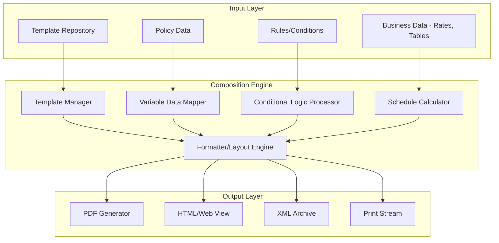

### 4.2 Template Management

Templates are the approved form layouts that have been filed with and approved by state regulators.

**Template Hierarchy**:

```
Policy Contract
├── Cover Page
├── Contract Provisions (base form)
│   ├── Definitions
│   ├── General Provisions
│   ├── Premium Provisions
│   ├── Benefit Provisions
│   ├── Settlement Options
│   ├── Incontestability Clause
│   └── Suicide Clause
├── Schedule Pages
│   ├── Coverage Schedule
│   ├── Premium Schedule
│   ├── Beneficiary Schedule
│   └── Value Schedule (for permanent products)
├── Rider Addenda
│   ├── Waiver of Premium Rider
│   ├── Accidental Death Benefit Rider
│   └── [Other selected riders]
├── State-Specific Endorsements
│   ├── State Amendment Endorsement
│   └── State-Required Notices
└── Application Copy
    └── Attached as part of the contract
```

**Template Version Control**:

| Attribute | Type | Description |
|-----------|------|-------------|
| `templateId` | UUID | Unique identifier |
| `formNumber` | VARCHAR(30) | Regulatory form number (e.g., ICC24-TL20) |
| `templateName` | VARCHAR(200) | Descriptive name |
| `productCode` | VARCHAR(20) | Associated product |
| `templateType` | ENUM | BASE_CONTRACT, SCHEDULE, RIDER, ENDORSEMENT, NOTICE |
| `stateCode` | CHAR(2) | State (or 'XX' for interstate compact) |
| `version` | INT | Template version number |
| `effectiveDate` | DATE | When this version becomes active |
| `expirationDate` | DATE | When this version expires |
| `filingStatus` | ENUM | DRAFT, FILED, APPROVED, WITHDRAWN |
| `serffTrackingNumber` | VARCHAR(30) | SERFF filing reference |
| `templateContent` | BLOB | Template file (XML, DOCX, Documaker FAP) |
| `approvedBy` | VARCHAR(50) | Compliance approver |
| `lastModifiedBy` | VARCHAR(50) | Last editor |
| `lastModifiedDate` | TIMESTAMP | Last modification date |

### 4.3 Variable Data Insertion

Variable data points that populate the contract template:

| Variable | Source | Example |
|----------|--------|---------|
| `{{policyNumber}}` | Policy Number Generator | 25T2-012345-7 |
| `{{insuredName}}` | Application | John Andrew Doe Jr. |
| `{{insuredDOB}}` | Application | March 15, 1985 |
| `{{insuredAge}}` | Calculated | 40 |
| `{{insuredGender}}` | Application | Male |
| `{{ownerName}}` | Application | John Andrew Doe Jr. |
| `{{beneficiaryPrimary}}` | Application | Jane Doe, Spouse — 100% |
| `{{beneficiaryContingent}}` | Application | Estate |
| `{{productName}}` | Product Catalog | 20-Year Level Premium Term Life Insurance |
| `{{faceAmount}}` | Application/UW | $500,000.00 |
| `{{riskClass}}` | UW Decision | Standard Non-Tobacco |
| `{{annualPremium}}` | Rating Engine | $672.00 |
| `{{modalPremium}}` | Rating Engine | $57.64 (Monthly) |
| `{{premiumMode}}` | Application | Monthly |
| `{{effectiveDate}}` | Issuance | January 15, 2025 |
| `{{maturityDate}}` | Calculated | January 15, 2045 |
| `{{stateOfIssue}}` | Application | California |
| `{{tableRating}}` | UW Decision | None |
| `{{flatExtra}}` | UW Decision | None |

### 4.4 Schedule Page Generation

#### Coverage Schedule

```
╔══════════════════════════════════════════════════════════════╗
║                    COVERAGE SCHEDULE                        ║
╠══════════════════════════════════════════════════════════════╣
║ Policy Number:     25T2-012345-7                            ║
║ Policy Date:       January 15, 2025                        ║
║ Insured:           John Andrew Doe Jr.                     ║
║ Issue Age:         40          Gender: Male                ║
║ Risk Class:        Standard Non-Tobacco                    ║
╠══════════════════════════════════════════════════════════════╣
║                                                             ║
║ BASE COVERAGE                                               ║
║ ─────────────                                               ║
║ Plan:              20-Year Level Premium Term Life          ║
║ Face Amount:       $500,000.00                             ║
║ Coverage Period:   20 years (to January 15, 2045)          ║
║ Conversion Right:  Available through policy year 15        ║
║                                                             ║
║ RIDERS                                                      ║
║ ──────                                                      ║
║ Waiver of Premium Disability Benefit                       ║
║   Benefit:         Waiver of premium during disability     ║
║   Elimination:     180 days                                ║
║   Maximum Age:     Age 65                                  ║
║                                                             ║
║ Accidental Death Benefit                                   ║
║   Benefit Amount:  $500,000.00                             ║
║   Maximum Age:     Age 70                                  ║
║                                                             ║
╠══════════════════════════════════════════════════════════════╣
║ TOTAL ANNUAL PREMIUM:  $735.00                             ║
║   Base Coverage:       $672.00                             ║
║   Waiver of Premium:   $38.00                              ║
║   Accidental Death:    $25.00                              ║
╚══════════════════════════════════════════════════════════════╝
```

#### Premium Schedule

```python
def generate_premium_schedule(policy: Policy) -> list:
    """Generate premium schedule for the policy."""
    schedule = []

    for year in range(1, policy.coverage_period + 1):
        entry = {
            "policyYear": year,
            "fromDate": policy.effective_date + relativedelta(years=year-1),
            "toDate": policy.effective_date + relativedelta(years=year) - timedelta(days=1),
            "insuredAge": policy.issue_age + year - 1,
            "basePremium": policy.base_annual_premium,
            "riderPremiums": {},
            "flatExtra": 0.0,
            "totalAnnualPremium": 0.0
        }

        # Base premium (level for term)
        entry["basePremium"] = policy.base_annual_premium

        # Rider premiums
        for rider in policy.riders:
            if year <= rider.coverage_period:
                entry["riderPremiums"][rider.rider_code] = rider.annual_premium
            else:
                entry["riderPremiums"][rider.rider_code] = 0.0

        # Flat extra (if applicable and within duration)
        if policy.flat_extra_per_thousand and year <= policy.flat_extra_duration:
            entry["flatExtra"] = (policy.face_amount / 1000) * policy.flat_extra_per_thousand

        # Total
        entry["totalAnnualPremium"] = (
            entry["basePremium"] +
            sum(entry["riderPremiums"].values()) +
            entry["flatExtra"]
        )

        schedule.append(entry)

    return schedule
```

#### Beneficiary Schedule

```
╔══════════════════════════════════════════════════════════════╗
║                   BENEFICIARY SCHEDULE                      ║
╠══════════════════════════════════════════════════════════════╣
║                                                             ║
║ PRIMARY BENEFICIARY(IES):                                   ║
║ ─────────────────────────                                   ║
║ Jane Marie Doe                                             ║
║   Relationship: Spouse                                     ║
║   Share: 100%                                              ║
║   Distribution: Per Stirpes                                ║
║   Designation: Revocable                                   ║
║                                                             ║
║ CONTINGENT BENEFICIARY(IES):                               ║
║ ───────────────────────────                                 ║
║ The Estate of the Insured                                  ║
║   Share: 100%                                              ║
║                                                             ║
╚══════════════════════════════════════════════════════════════╝
```

### 4.5 State-Specific Endorsements

Many states require modifications to base policy forms:

| State | Endorsement | Requirement |
|-------|-------------|-------------|
| CA | CA Amendment | Enhanced free-look (30 days for seniors 60+), specific disclosure language |
| NY | NY Amendment | Extended contestability provisions, specific suicide clause language |
| FL | FL Amendment | Senior-specific disclosures (age 65+) |
| TX | TX Amendment | Specific grace period language |
| WA | WA Amendment | Gender-neutral pricing endorsement |
| MT | MT Amendment | Unisex rating endorsement |
| CT | CT Amendment | Domestic partner beneficiary provisions |

### 4.6 Language and Translation Requirements

| State/Region | Requirement |
|-------------|-------------|
| CA | Policy summary in applicant's primary language if solicited in that language |
| TX | Spanish translation available if solicited in Spanish |
| FL | Spanish translation for policies sold in Spanish |
| PR (Puerto Rico) | Spanish required as primary; English optional |
| QC (Quebec, for cross-border) | French required |
| Federal (NAIC model) | Plain language requirements for readability |

---

## 5. Policy Kit Assembly

### 5.1 Policy Kit Contents

The complete policy kit delivered to the policyholder includes:

| Document | Required | Description |
|----------|----------|-------------|
| Policy Contract | Yes | The legal contract including all provisions |
| Schedule Pages | Yes | Coverage, premium, beneficiary schedules |
| Rider Addenda | If riders selected | Rider-specific terms and conditions |
| State Endorsements | If state requires | State-specific modifications |
| Application Copy | Yes | Copy of the signed application (made part of contract) |
| Illustration Comparison | If required | Comparison with original illustration |
| Privacy Notice | Yes | GLBA privacy notice |
| Delivery Receipt | Yes | Acknowledgment of receipt (for signature) |
| Replacement Acknowledgment | If replacement | Replacement notice and comparison |
| Buyer's Guide | Yes (most states) | NAIC Life Insurance Buyer's Guide |
| Producer Commission Disclosure | Some states | Commission paid to agent |
| Payment Coupon Book | If direct bill | Perforated payment coupons (legacy) |
| Welcome Letter | Yes | Personalized welcome and key information |
| Accelerated Death Benefit Notice | If ADB rider | Notice of living benefit availability |
| HIPAA Authorization | Yes | Authorization for medical information |

### 5.2 Assembly Workflow

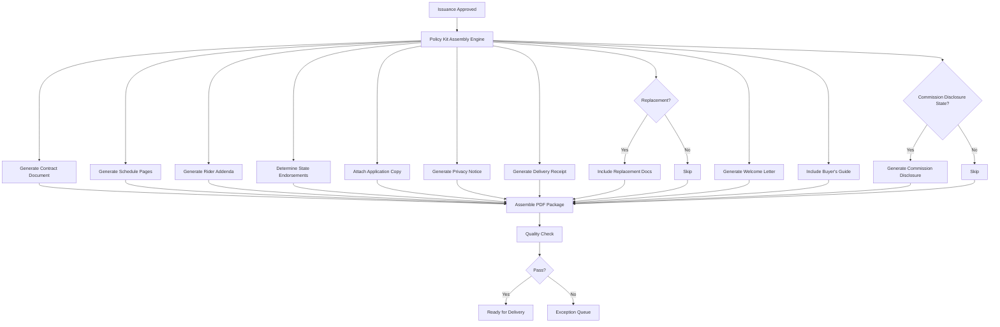

### 5.3 Quality Check Rules

| Check | Rule | Severity |
|-------|------|----------|
| Page count | Document page count within expected range for product | Warning |
| Variable data populated | No empty/null variable placeholders remaining | Critical |
| Face amount consistency | Face amount matches across all schedule pages | Critical |
| Premium consistency | Premium amounts match across documents | Critical |
| Beneficiary present | At least one beneficiary listed | Critical |
| State endorsement included | Required state endorsements present | Critical |
| Signature blocks | All required signature blocks present | Critical |
| Barcode/QR code | Tracking codes readable and correct | Warning |
| Readability | Flesch-Kincaid readability score acceptable | Warning |

---

## 6. Document Composition Technology

### 6.1 Technology Options

| Technology | Vendor | Approach | Strengths |
|-----------|--------|----------|-----------|
| **Documaker** | Oracle | Template-driven, batch & interactive | Industry standard in insurance, powerful rule-based composition |
| **Smart Communications** (Thunderhead) | Smart Communications | Cloud-native, omnichannel | Modern UI, strong personalization, SaaS delivery |
| **OpenText Exstream** | OpenText | High-volume batch, interactive | Scalable batch processing, multi-channel output |
| **Messagepoint** | Messagepoint | Content-centric, template management | Strong content governance, variation management |
| **Custom (XML/XSLT)** | Internal | XSLT transformations from XML data | Full control, no licensing, standards-based |
| **Custom (HTML/CSS to PDF)** | Internal | HTML templates rendered to PDF | Modern web technologies, easy to maintain |
| **DocuSign CLM** | DocuSign | Contract lifecycle management | Integrated e-signature, template management |

### 6.2 XML/XSLT-Based Composition

For carriers building custom composition:

```xml
<!-- Policy Data XML -->
<policyData>
  <policyNumber>25T2-012345-7</policyNumber>
  <effectiveDate>2025-01-15</effectiveDate>
  <insured>
    <fullName>John Andrew Doe Jr.</fullName>
    <dateOfBirth>1985-03-15</dateOfBirth>
    <issueAge>40</issueAge>
    <gender>Male</gender>
    <riskClass>Standard Non-Tobacco</riskClass>
  </insured>
  <owner>
    <fullName>John Andrew Doe Jr.</fullName>
    <sameAsInsured>true</sameAsInsured>
  </owner>
  <coverage>
    <productName>20-Year Level Premium Term Life Insurance</productName>
    <faceAmount>500000.00</faceAmount>
    <coveragePeriod>20</coveragePeriod>
    <annualPremium>672.00</annualPremium>
  </coverage>
  <riders>
    <rider>
      <name>Waiver of Premium</name>
      <annualPremium>38.00</annualPremium>
    </rider>
    <rider>
      <name>Accidental Death Benefit</name>
      <benefitAmount>500000.00</benefitAmount>
      <annualPremium>25.00</annualPremium>
    </rider>
  </riders>
  <beneficiaries>
    <primary>
      <name>Jane Marie Doe</name>
      <relationship>Spouse</relationship>
      <percentage>100</percentage>
      <distribution>Per Stirpes</distribution>
    </primary>
  </beneficiaries>
  <premiumSchedule>
    <mode>Monthly</mode>
    <modalPremium>62.92</modalPremium>
    <annualPremium>735.00</annualPremium>
  </premiumSchedule>
  <stateOfIssue>CA</stateOfIssue>
</policyData>
```

### 6.3 HTML/CSS-to-PDF Approach

Modern carriers increasingly use HTML/CSS templates with a PDF rendering engine (Puppeteer, wkhtmltopdf, Prince XML):

```html
<!-- Schedule Page Template (Jinja2/Handlebars) -->
<!DOCTYPE html>
<html>
<head>
  <style>
    @page {
      size: letter;
      margin: 1in;
      @bottom-center {
        content: "Page " counter(page) " of " counter(pages);
        font-size: 9pt;
      }
    }
    body { font-family: 'Times New Roman', serif; font-size: 11pt; }
    .header { text-align: center; border-bottom: 2px solid #000; padding-bottom: 10px; }
    .company-name { font-size: 16pt; font-weight: bold; }
    .form-number { font-size: 8pt; color: #666; }
    table { width: 100%; border-collapse: collapse; margin: 15px 0; }
    th, td { border: 1px solid #333; padding: 6px 10px; text-align: left; }
    th { background-color: #f0f0f0; }
    .amount { text-align: right; }
    .highlight { background-color: #ffffcc; }
  </style>
</head>
<body>
  <div class="header">
    <div class="company-name">ABC Life Insurance Company</div>
    <div>A Stock Company</div>
    <div>Home Office: Hartford, Connecticut</div>
  </div>

  <h2>COVERAGE SCHEDULE</h2>

  <table>
    <tr><th>Policy Number</th><td>{{ policyNumber }}</td></tr>
    <tr><th>Policy Date</th><td>{{ effectiveDate | date_format }}</td></tr>
    <tr><th>Insured</th><td>{{ insured.fullName }}</td></tr>
    <tr><th>Issue Age / Gender</th><td>{{ insured.issueAge }} / {{ insured.gender }}</td></tr>
    <tr><th>Risk Classification</th><td>{{ insured.riskClass }}</td></tr>
  </table>

  <h3>Base Coverage</h3>
  <table>
    <tr><th>Plan</th><td>{{ coverage.productName }}</td></tr>
    <tr><th>Face Amount</th><td class="amount">{{ coverage.faceAmount | currency }}</td></tr>
    <tr><th>Coverage Period</th><td>{{ coverage.coveragePeriod }} years</td></tr>
    <tr><th>Annual Premium</th><td class="amount">{{ coverage.annualPremium | currency }}</td></tr>
  </table>

  
  <h3>Riders and Benefits</h3>
  <table>
    <tr><th>Rider</th><th>Benefit</th><th class="amount">Annual Premium</th></tr>
    
    <tr>
      <td>{{ rider.name }}</td>
      <td>{{ rider.benefitDescription }}</td>
      <td class="amount">{{ rider.annualPremium | currency }}</td>
    </tr>
    
  </table>
  

  <table class="highlight">
    <tr>
      <th>TOTAL ANNUAL PREMIUM</th>
      <td class="amount"><strong>{{ premiumSchedule.annualPremium | currency }}</strong></td>
    </tr>
    <tr>
      <th>{{ premiumSchedule.mode | title }} Premium</th>
      <td class="amount">{{ premiumSchedule.modalPremium | currency }}</td>
    </tr>
  </table>

  <div class="form-number">Form ICC24-TL20-SCH (01/2024)</div>
</body>
</html>
```

### 6.4 Accessibility Compliance (WCAG)

For electronic delivery, documents must meet accessibility standards:

| Requirement | Standard | Implementation |
|-------------|----------|---------------|
| Tagged PDF | PDF/UA (ISO 14289) | Proper tag structure for screen readers |
| Alt text | WCAG 2.1 AA | Alternative text for images/logos |
| Reading order | WCAG 2.1 AA | Logical reading order in document |
| Color contrast | WCAG 2.1 AA | 4.5:1 contrast ratio for text |
| Font size | WCAG 2.1 AA | Minimum 10pt for body text |
| Language tag | PDF/UA | Document language specified |
| Bookmarks | Best practice | Table of contents with bookmarks |

---

## 7. Delivery Methods

### 7.1 Delivery Options

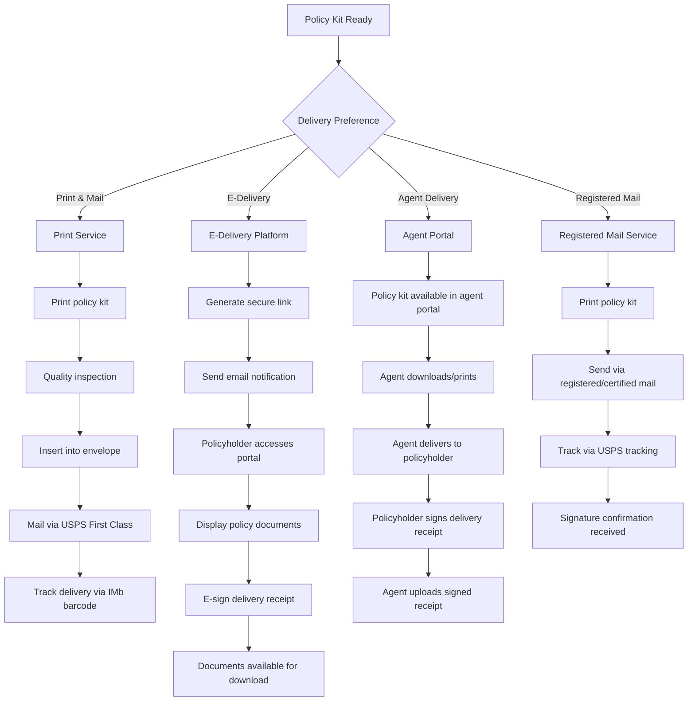

### 7.2 E-Delivery Architecture

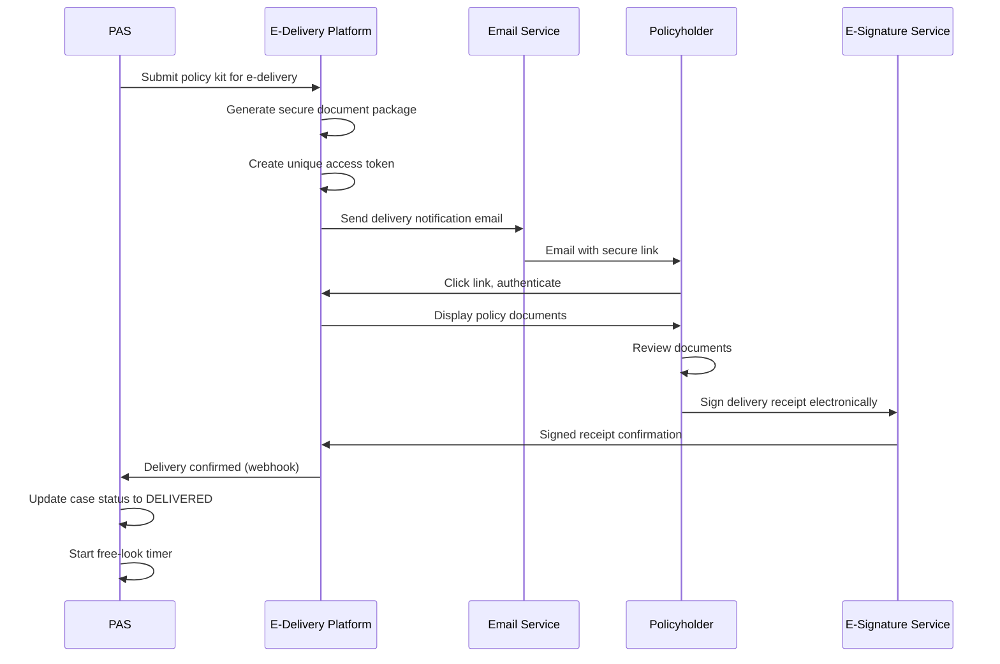

### 7.3 E-Delivery Consent

Before electronic delivery, the policyholder must consent per the E-SIGN Act (15 U.S.C. § 7001):

| Requirement | Description |
|-------------|-------------|
| Affirmative consent | Policyholder actively agrees to e-delivery |
| Hardware/software disclosure | Inform of required equipment to access documents |
| Right to paper copy | Policyholder can request paper copy at any time |
| Right to withdraw consent | Can revert to paper delivery |
| Updated contact info | Policyholder agrees to keep email current |
| Retention | Consent record retained for policy duration |

### 7.4 State-Specific Delivery Requirements

| State | Special Requirement |
|-------|-------------------|
| NY | Certain policy types require delivery by licensed agent |
| CA | Free-look period starts on date of delivery, not mailing date |
| NJ | Registered mail required for replacement policies |
| FL | Senior policies (age 65+) may require specific delivery method |
| All States | Delivery receipt recommended for free-look tracking |

---

## 8. Free-Look Period

### 8.1 State-Specific Free-Look Duration

| State | Standard Free-Look | Senior Free-Look (65+) | Replacement Free-Look |
|-------|-------------------|----------------------|---------------------|
| CA | 10 days | 30 days | 30 days |
| NY | 10 days | 60 days | 60 days |
| FL | 10 days | 30 days | — |
| TX | 10 days | 10 days | — |
| IL | 10 days | 30 days | — |
| PA | 10 days | 30 days | — |
| NJ | 10 days | 30 days | 30 days |
| AZ | 10 days | 30 days | — |
| Default (NAIC) | 10 days | — | — |

### 8.2 Free-Look Processing

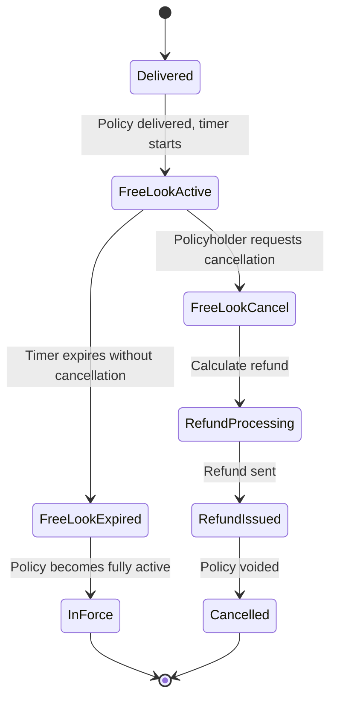

### 8.3 Free-Look Refund Calculation

```python
def calculate_freelook_refund(policy: Policy, cancel_date: date) -> dict:
    """Calculate refund amount for free-look cancellation."""
    if policy.product_type in ['TERM', 'WHOLE_LIFE']:
        # Return of premium (ROP) — full premium refund
        refund_amount = policy.total_premium_paid
        refund_type = "RETURN_OF_PREMIUM"
    elif policy.product_type in ['UNIVERSAL_LIFE', 'VUL', 'IUL']:
        # Return of account value or premium, depending on state
        if policy.state_of_issue in ['NY', 'CA']:
            # Some states require return of premium for UL
            refund_amount = policy.total_premium_paid
            refund_type = "RETURN_OF_PREMIUM"
        else:
            # Return of account value (may be less than premium due to charges)
            refund_amount = max(
                policy.account_value,
                policy.total_premium_paid  # Floor at premium paid
            )
            refund_type = "RETURN_OF_ACCOUNT_VALUE"
    elif policy.product_type == 'VARIABLE_LIFE':
        # Return of account value (which may have changed due to market)
        refund_amount = policy.account_value
        refund_type = "RETURN_OF_ACCOUNT_VALUE"
    else:
        refund_amount = policy.total_premium_paid
        refund_type = "RETURN_OF_PREMIUM"

    return {
        "policyNumber": policy.policy_number,
        "cancelDate": cancel_date.isoformat(),
        "refundType": refund_type,
        "totalPremiumPaid": policy.total_premium_paid,
        "accountValue": getattr(policy, 'account_value', None),
        "refundAmount": round(refund_amount, 2),
        "refundMethod": policy.original_payment_method,
        "expectedRefundDate": (cancel_date + timedelta(days=10)).isoformat()
    }
```

### 8.4 Free-Look Expiration Tracking

```python
def check_freelook_expiration() -> None:
    """Batch process: check for policies where free-look has expired."""
    policies = query_policies_in_freelook()

    for policy in policies:
        freelook_days = get_freelook_days(
            state=policy.state_of_issue,
            insured_age=policy.issue_age,
            is_replacement=policy.is_replacement
        )

        expiration_date = policy.delivery_date + timedelta(days=freelook_days)

        if date.today() >= expiration_date:
            # Free-look expired — policy is now fully in force
            policy.status = PolicyStatus.IN_FORCE
            policy.freelook_expiration_date = expiration_date

            # Publish domain event
            publish_event(FreeLookExpiredEvent(
                policy_id=policy.policy_id,
                policy_number=policy.policy_number,
                expiration_date=expiration_date
            ))

            # Activate downstream processes
            activate_renewal_billing(policy)
            confirm_reinsurance_cession(policy)
            finalize_commission_schedule(policy)
```

---

## 9. Policy Effective Dating

### 9.1 Effective Date Determination

| Scenario | Effective Date Rule |
|----------|-------------------|
| Standard issue | Date of last requirement satisfied (UW approval, premium received) |
| Backdating | Earlier date as requested, subject to limits |
| Save-age backdating | Date that preserves a younger insurance age |
| Conditional receipt | Application date or medical exam date |
| Future dating | Requested future date (uncommon) |

### 9.2 Backdating Rules and Limits

```python
def validate_backdate(
    requested_effective_date: date,
    application_date: date,
    insured_dob: date,
    state: str
) -> dict:
    """Validate a backdating request."""
    MAX_BACKDATE_MONTHS = {
        "DEFAULT": 6,
        "NY": 6,
        "CA": 6,
        "TX": 6,
        "FL": 6,
        "NJ": 6,
        "IL": 6,
    }

    max_months = MAX_BACKDATE_MONTHS.get(state, MAX_BACKDATE_MONTHS["DEFAULT"])
    earliest_allowed = application_date - relativedelta(months=max_months)

    result = {
        "requestedDate": requested_effective_date.isoformat(),
        "applicationDate": application_date.isoformat(),
        "maxBackdateMonths": max_months,
        "earliestAllowedDate": earliest_allowed.isoformat(),
        "valid": True,
        "errors": [],
        "warnings": []
    }

    # Rule 1: Cannot backdate beyond maximum allowed period
    if requested_effective_date < earliest_allowed:
        result["valid"] = False
        result["errors"].append(
            f"Requested date exceeds maximum backdate of {max_months} months"
        )

    # Rule 2: Cannot backdate before application date minus max
    if requested_effective_date < earliest_allowed:
        result["valid"] = False

    # Rule 3: Check save-age benefit
    age_at_requested = calculate_age_nearest_birthday(insured_dob, requested_effective_date)
    age_at_current = calculate_age_nearest_birthday(insured_dob, date.today())

    if age_at_requested < age_at_current:
        result["warnings"].append(
            f"Backdating saves age: {age_at_requested} vs {age_at_current}. "
            f"Additional premium for backdate period will be collected."
        )
        result["saveAgeBackdate"] = True
        result["issueAge"] = age_at_requested
    else:
        result["saveAgeBackdate"] = False
        result["issueAge"] = age_at_current

    # Rule 4: Premium implications
    if requested_effective_date < date.today():
        months_back = relativedelta(date.today(), requested_effective_date).months
        result["backPremiumMonths"] = months_back
        result["warnings"].append(
            f"Back premium of {months_back} months will be due at issuance"
        )

    return result
```

### 9.3 Save-Age Backdating

Save-age backdating is when a policy is backdated to preserve a younger insurance age, potentially resulting in lower premiums:

| Factor | Consideration |
|--------|--------------|
| Premium savings | Lower annual premium at younger age |
| Back premium cost | Must pay premiums for backdated period |
| Net benefit | Premium savings over policy life vs. back premium cost |
| State rules | Most states allow up to 6 months backdating |
| Coverage gap | No coverage during backdated period (coverage starts at effective date for future claims) |

**Break-Even Analysis**:

```python
def backdate_break_even_analysis(
    premium_at_current_age: float,
    premium_at_younger_age: float,
    back_premium_months: int,
    coverage_years: int
) -> dict:
    """Analyze whether backdating is financially beneficial."""
    annual_savings = premium_at_current_age - premium_at_younger_age
    back_premium_cost = (premium_at_younger_age / 12) * back_premium_months
    total_savings = annual_savings * coverage_years
    net_benefit = total_savings - back_premium_cost
    break_even_years = back_premium_cost / annual_savings if annual_savings > 0 else float('inf')

    return {
        "premiumAtCurrentAge": premium_at_current_age,
        "premiumAtYoungerAge": premium_at_younger_age,
        "annualSavings": round(annual_savings, 2),
        "backPremiumCost": round(back_premium_cost, 2),
        "totalSavingsOverTerm": round(total_savings, 2),
        "netBenefit": round(net_benefit, 2),
        "breakEvenYears": round(break_even_years, 1),
        "recommendation": "BACKDATE" if net_benefit > 0 else "DO_NOT_BACKDATE"
    }
```

---

## 10. First-Year Processing Setup

### 10.1 Overview

Policy issuance triggers the initialization of multiple downstream systems. These setups must be coordinated to ensure consistent data across the enterprise.

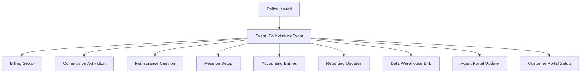

### 10.2 Billing Schedule Creation

```json
{
  "billingSchedule": {
    "policyNumber": "25T2-012345-7",
    "billingMode": "MONTHLY",
    "billingMethod": "EFT",
    "firstBillingDate": "2025-02-15",
    "draftDay": 15,
    "modalPremium": 62.92,
    "annualPremium": 735.00,
    "gracePeriodDays": 31,
    "bankInfo": {
      "routingNumber": "021000021",
      "accountNumber": "ENCRYPTED",
      "accountType": "CHECKING",
      "accountHolder": "John A. Doe"
    },
    "schedule": [
      {"dueDate": "2025-02-15", "amount": 62.92, "status": "SCHEDULED"},
      {"dueDate": "2025-03-15", "amount": 62.92, "status": "SCHEDULED"},
      {"dueDate": "2025-04-15", "amount": 62.92, "status": "SCHEDULED"},
      {"dueDate": "2025-05-15", "amount": 62.92, "status": "SCHEDULED"},
      {"dueDate": "2025-06-15", "amount": 62.92, "status": "SCHEDULED"},
      {"dueDate": "2025-07-15", "amount": 62.92, "status": "SCHEDULED"},
      {"dueDate": "2025-08-15", "amount": 62.92, "status": "SCHEDULED"},
      {"dueDate": "2025-09-15", "amount": 62.92, "status": "SCHEDULED"},
      {"dueDate": "2025-10-15", "amount": 62.92, "status": "SCHEDULED"},
      {"dueDate": "2025-11-15", "amount": 62.92, "status": "SCHEDULED"},
      {"dueDate": "2025-12-15", "amount": 62.92, "status": "SCHEDULED"},
      {"dueDate": "2026-01-15", "amount": 62.92, "status": "SCHEDULED"}
    ]
  }
}
```

### 10.3 Commission Schedule Activation

```python
def activate_commission_schedule(policy: Policy, agents: list) -> list:
    """Create commission schedule entries for the issued policy."""
    commission_entries = []

    for agent in agents:
        comm_schedule = get_commission_schedule(
            product=policy.product_code,
            agent_level=agent.agent_level,
            distribution_channel=agent.channel
        )

        # First-year commission
        fy_entry = {
            "policyNumber": policy.policy_number,
            "agentId": agent.agent_id,
            "commissionType": "FIRST_YEAR",
            "targetPremium": policy.annual_premium,
            "commissionRate": comm_schedule.first_year_rate,  # e.g., 55%
            "commissionAmount": round(
                policy.annual_premium * comm_schedule.first_year_rate * agent.split_pct,
                2
            ),
            "splitPercentage": agent.split_pct,
            "paymentSchedule": "AS_EARNED",  # or HEAPED
            "effectiveDate": policy.effective_date.isoformat(),
            "status": "ACTIVE"
        }
        commission_entries.append(fy_entry)

        # Renewal commissions (years 2-10 typical)
        for year in range(2, comm_schedule.renewal_years + 1):
            renewal_entry = {
                "policyNumber": policy.policy_number,
                "agentId": agent.agent_id,
                "commissionType": "RENEWAL",
                "policyYear": year,
                "commissionRate": comm_schedule.renewal_rate,  # e.g., 5%
                "splitPercentage": agent.split_pct,
                "effectiveDate": (
                    policy.effective_date + relativedelta(years=year-1)
                ).isoformat(),
                "status": "PENDING"
            }
            commission_entries.append(renewal_entry)

    return commission_entries
```

### 10.4 Reinsurance Cession Creation

```json
{
  "reinsuranceCession": {
    "cessionId": "CES-2025-00789",
    "policyNumber": "25T2-012345-7",
    "treatyNumber": "TR-2024-AUTO-001",
    "reinsurerCode": "SWISS_RE",
    "cessionType": "AUTOMATIC",
    "retainedAmount": 250000.00,
    "cededAmount": 250000.00,
    "totalFaceAmount": 500000.00,
    "retentionPercentage": 50.0,
    "cessionPercentage": 50.0,
    "reinsurancePremium": 156.00,
    "riskClass": "STANDARD_NON_TOBACCO",
    "insuredAge": 40,
    "insuredGender": "Male",
    "effectiveDate": "2025-01-15",
    "cessionBasis": "YRT",
    "status": "ACTIVE"
  }
}
```

### 10.5 Reserve Setup

Initial reserve establishment at policy issuance:

| Reserve Type | Calculation | Description |
|-------------|-------------|-------------|
| **Statutory Reserve** | Net Premium Valuation (NPV) or CRVM | Minimum reserve per state law |
| **GAAP Reserve** | FAS 60 / ASC 944 | GAAP accounting reserve |
| **Tax Reserve** | IRC Section 807 | Federal tax reserve |
| **Deficiency Reserve** | If gross premium < net valuation premium | Additional reserve for underpriced products |

```python
def setup_initial_reserves(policy: Policy) -> dict:
    """Calculate and establish initial reserves at policy issuance."""
    # Commissioner's Reserve Valuation Method (CRVM) for term
    mortality_table = get_mortality_table(
        table_name="2017 CSO",
        risk_class=policy.risk_class,
        gender=policy.insured_gender,
        tobacco=policy.tobacco_status
    )

    valuation_rate = get_valuation_interest_rate(
        issue_year=policy.effective_date.year,
        guarantee_duration=policy.coverage_period
    )

    statutory_reserve = calculate_crvm_reserve(
        face_amount=policy.face_amount,
        issue_age=policy.issue_age,
        duration=0,  # At issue
        mortality_table=mortality_table,
        interest_rate=valuation_rate,
        gross_premium=policy.annual_premium,
        coverage_period=policy.coverage_period
    )

    return {
        "policyNumber": policy.policy_number,
        "valuationDate": policy.effective_date.isoformat(),
        "reserves": {
            "statutory": {
                "method": "CRVM",
                "mortalityTable": "2017 CSO",
                "interestRate": valuation_rate,
                "amount": round(statutory_reserve, 2)
            },
            "gaap": {
                "method": "FAS_60",
                "amount": round(statutory_reserve * 0.95, 2)  # Simplified
            },
            "tax": {
                "method": "IRC_807",
                "amount": round(statutory_reserve * 0.925, 2)  # Simplified
            }
        }
    }
```

### 10.6 Accounting Entries

| Event | Debit | Credit | Amount |
|-------|-------|--------|--------|
| Premium received (initial) | Cash | Premium Income | $62.92 |
| Commission payable | Commission Expense | Commission Payable | $34.61 (55%) |
| Premium tax accrual | Premium Tax Expense | Premium Tax Payable | $1.48 (2.35% CA) |
| DAC capitalization | DAC Asset | DAC Capitalized | $4.84 (7.7%) |
| Reserve establishment | Reserve Expense | Policy Reserves | $XX.XX |
| Reinsurance premium | Reinsurance Ceded | Cash/Payable | $13.00 |

---

## 11. Regulatory Filing

### 11.1 Policy Form Filing Requirements

All policy forms, riders, endorsements, and applications must be filed with and approved by state insurance departments before use.

### 11.2 SERFF (System for Electronic Rate and Form Filing)

SERFF is the NAIC's electronic filing system used by all 50 states:

| Aspect | Detail |
|--------|--------|
| Filing types | Policy forms, rates, rules, advertisements |
| Review types | File & Use, Prior Approval, Use & File, Informational |
| Turnaround | 30-90 days depending on state and complexity |
| Tracking | SERFF tracking number assigned to each filing |
| Status | Submitted, Under Review, Objection Letter, Approved, Withdrawn |

### 11.3 Interstate Insurance Product Regulation Compact (Compact)

The Interstate Compact allows carriers to file certain products once for approval across all member states:

| Feature | Description |
|---------|-------------|
| Member states | 47 states + DC + PR (as of 2024) |
| Eligible products | Individual life, annuities, disability income, LTC |
| Filing authority | Office of the Interstate Compact |
| Uniform standards | Standardized product requirements |
| Speed-to-market | Single filing vs. 50+ individual state filings |
| Turnaround | Typically 60-90 days |

### 11.4 Form Filing Tracking

| Attribute | Type | Description |
|-----------|------|-------------|
| `filingId` | UUID | Unique identifier |
| `serffTrackingNumber` | VARCHAR(30) | SERFF reference number |
| `formNumber` | VARCHAR(30) | Form number being filed |
| `formType` | ENUM | POLICY, RIDER, ENDORSEMENT, APPLICATION, NOTICE |
| `productCode` | VARCHAR(20) | Associated product |
| `state` | CHAR(2) | Filing jurisdiction |
| `filingType` | ENUM | PRIOR_APPROVAL, FILE_AND_USE, USE_AND_FILE, INFORMATIONAL |
| `filingStatus` | ENUM | DRAFT, SUBMITTED, UNDER_REVIEW, OBJECTION, APPROVED, WITHDRAWN |
| `submittedDate` | DATE | Date submitted to regulator |
| `approvedDate` | DATE | Date approved |
| `effectiveDate` | DATE | Date form becomes available for use |
| `expirationDate` | DATE | Date form expires (if applicable) |
| `reviewerNotes` | TEXT | Regulator comments |
| `objectionDetails` | TEXT | Objection letter details |

### 11.5 State-Specific Form Variations

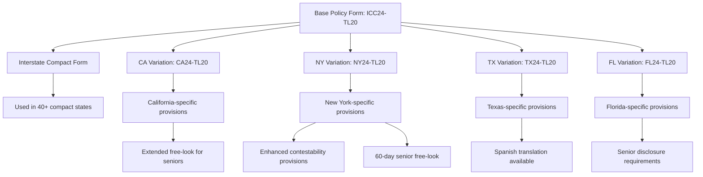

---

## 12. Complete ERD for Policy Contract & Document Management

### 12.1 Entity Relationship Diagram

```mermaid
erDiagram
    POLICY ||--|| APPLICATION : "originates from"
    POLICY ||--o{ COVERAGE : "includes"
    POLICY ||--o{ RIDER : "includes"
    POLICY ||--o{ BENEFICIARY_DESIGNATION : "has"
    POLICY ||--|| POLICY_OWNER : "owned by"
    POLICY ||--o{ POLICY_INSURED : "covers"
    POLICY ||--o{ POLICY_DOCUMENT : "has"
    POLICY ||--|| BILLING_SCHEDULE : "billed via"
    POLICY ||--o{ COMMISSION_SCHEDULE : "pays"
    POLICY ||--o| REINSURANCE_CESSION : "ceded under"
    POLICY ||--o{ RESERVE_RECORD : "reserved"
    POLICY ||--o{ ACCOUNTING_ENTRY : "generates"
    POLICY ||--o{ POLICY_STATUS_HISTORY : "tracks"
    POLICY ||--|| DELIVERY_RECORD : "delivered via"
    POLICY ||--o| FREELOOK_TRACKING : "tracks"
    POLICY ||--o{ ENDORSEMENT : "modified by"
    POLICY ||--|| EFFECTIVE_DATE_RECORD : "dated"

    POLICY_DOCUMENT ||--|| DOCUMENT_TEMPLATE : "generated from"
    DOCUMENT_TEMPLATE ||--|| FORM_FILING : "approved under"

    DELIVERY_RECORD ||--o| DELIVERY_RECEIPT : "acknowledged by"
    DELIVERY_RECORD ||--o{ DELIVERY_TRACKING : "tracked"

    FREELOOK_TRACKING ||--o| FREELOOK_CANCELLATION : "may result in"
    FREELOOK_CANCELLATION ||--|| PREMIUM_REFUND : "triggers"

    POLICY {
        uuid policy_id PK
        string policy_number
        uuid application_id FK
        string product_code
        string policy_status
        date effective_date
        date issue_date
        date maturity_date
        string state_of_issue
        decimal face_amount
        string risk_class
        int table_rating
        decimal flat_extra
        decimal annual_premium
        decimal modal_premium
        string premium_mode
        int issue_age
        string insured_gender
    }

    COVERAGE {
        uuid coverage_id PK
        uuid policy_id FK
        string coverage_type
        string product_code
        decimal face_amount
        decimal annual_premium
        int coverage_period
        date expiry_date
    }

    POLICY_DOCUMENT {
        uuid document_id PK
        uuid policy_id FK
        string document_type
        string document_name
        string form_number
        string template_version
        string storage_path
        timestamp generated_date
        string generated_by
        int page_count
        string content_hash
    }

    DOCUMENT_TEMPLATE {
        uuid template_id PK
        string form_number
        string template_name
        string product_code
        string state_code
        int version
        date effective_date
        date expiration_date
        string filing_status
        string serff_tracking_number
        blob template_content
    }

    FORM_FILING {
        uuid filing_id PK
        string serff_tracking_number
        string form_number
        string form_type
        string state
        string filing_type
        string filing_status
        date submitted_date
        date approved_date
        date effective_date
    }

    DELIVERY_RECORD {
        uuid delivery_id PK
        uuid policy_id FK
        string delivery_method
        date delivery_date
        string delivery_status
        string tracking_number
        date confirmed_date
    }

    FREELOOK_TRACKING {
        uuid freelook_id PK
        uuid policy_id FK
        date delivery_date
        int freelook_days
        date expiration_date
        string status
    }

    BILLING_SCHEDULE {
        uuid billing_id PK
        uuid policy_id FK
        string billing_mode
        string billing_method
        int draft_day
        decimal modal_premium
        date first_billing_date
        date next_billing_date
    }

    COMMISSION_SCHEDULE {
        uuid commission_id PK
        uuid policy_id FK
        uuid agent_id FK
        string commission_type
        int policy_year
        decimal commission_rate
        decimal commission_amount
        string status
    }

    REINSURANCE_CESSION {
        uuid cession_id PK
        uuid policy_id FK
        string treaty_number
        string reinsurer_code
        decimal retained_amount
        decimal ceded_amount
        decimal reinsurance_premium
        string cession_basis
        string status
    }

    RESERVE_RECORD {
        uuid reserve_id PK
        uuid policy_id FK
        string reserve_type
        string valuation_method
        date valuation_date
        decimal reserve_amount
        string mortality_table
        decimal interest_rate
    }
```

### 12.2 Complete Entity Listing

| # | Entity | Description |
|---|--------|-------------|
| 1 | POLICY | Master policy record |
| 2 | COVERAGE | Base and rider coverages |
| 3 | RIDER | Rider-specific details |
| 4 | BENEFICIARY_DESIGNATION | Beneficiary records |
| 5 | POLICY_OWNER | Owner information |
| 6 | POLICY_INSURED | Insured person(s) |
| 7 | POLICY_DOCUMENT | Generated documents |
| 8 | DOCUMENT_TEMPLATE | Template definitions |
| 9 | TEMPLATE_VERSION | Template version history |
| 10 | TEMPLATE_VARIABLE | Variable definitions per template |
| 11 | FORM_FILING | Regulatory filing records |
| 12 | FORM_FILING_STATE | State-specific filing status |
| 13 | ENDORSEMENT | Policy endorsements/amendments |
| 14 | STATE_ENDORSEMENT_RULE | Rules for state-specific endorsements |
| 15 | DELIVERY_RECORD | Delivery tracking |
| 16 | DELIVERY_RECEIPT | Signed delivery receipts |
| 17 | DELIVERY_TRACKING | Postal/courier tracking |
| 18 | FREELOOK_TRACKING | Free-look period monitoring |
| 19 | FREELOOK_CANCELLATION | Free-look cancellation records |
| 20 | BILLING_SCHEDULE | Premium billing setup |
| 21 | BILLING_ENTRY | Individual billing entries |
| 22 | COMMISSION_SCHEDULE | Commission payment schedule |
| 23 | COMMISSION_ENTRY | Individual commission entries |
| 24 | REINSURANCE_CESSION | Reinsurance cession records |
| 25 | RESERVE_RECORD | Reserve calculations |
| 26 | RESERVE_HISTORY | Reserve calculation history |
| 27 | ACCOUNTING_ENTRY | GL accounting entries |
| 28 | PREMIUM_TAX_RECORD | Premium tax calculations |
| 29 | DAC_TAX_RECORD | DAC tax capitalization records |
| 30 | POLICY_STATUS_HISTORY | Status change audit trail |
| 31 | POLICY_NUMBER_SEQUENCE | Policy number generation tracking |
| 32 | EFFECTIVE_DATE_RECORD | Effective date determination |
| 33 | PRE_ISSUE_VALIDATION_LOG | Pre-issue check results |
| 34 | OFAC_SCREENING_LOG | OFAC screening audit |
| 35 | AML_CHECK_LOG | AML/KYC check audit |

---

## 13. ACORD TXLife Policy Issuance Messages

### 13.1 Key Transaction Types

| TransType | Code | Description |
|-----------|------|-------------|
| Policy Issue Notification | 103 (response) | Notification of policy issuance |
| Policy Status Update | 152 | Status change notification |
| Policy Data Inquiry | 228 | Request policy details |
| Policy Data Response | 228 (response) | Return policy details |
| New Business Completion | 103 | Final issuance confirmation |

### 13.2 Policy Issuance Notification XML

```xml
<?xml version="1.0" encoding="UTF-8"?>
<TXLife xmlns="http://ACORD.org/Standards/Life/2" version="2.43.00">
  <TXLifeResponse>
    <TransRefGUID>issue-notify-guid-001</TransRefGUID>
    <TransType tc="103">Application</TransType>
    <TransSubType tc="10305">Policy Issue Notification</TransSubType>
    <TransExeDate>2025-02-05</TransExeDate>
    <TransResult>
      <ResultCode tc="1">Success</ResultCode>
    </TransResult>

    <OLifE>
      <Holding id="Holding_1">
        <HoldingTypeCode tc="2">Policy</HoldingTypeCode>
        <HoldingSysKey>25T2-012345-7</HoldingSysKey>
        <Policy>
          <PolNumber>25T2-012345-7</PolNumber>
          <ProductCode>TERM20_2024</ProductCode>
          <CarrierCode>ABC_LIFE</CarrierCode>
          <PlanName>20-Year Level Premium Term Life Insurance</PlanName>
          <LineOfBusiness tc="1">Life</LineOfBusiness>
          <PolicyStatus tc="1">Active</PolicyStatus>
          <IssueDate>2025-02-05</IssueDate>
          <EffDate>2025-01-15</EffDate>
          <TermDate>2045-01-15</TermDate>
          <Jurisdiction tc="6">California</Jurisdiction>
          <FaceAmt>500000.00</FaceAmt>
          <PaymentMode tc="4">Monthly</PaymentMode>
          <PaymentAmt>62.92</PaymentAmt>
          <AnnualPremAmt>735.00</AnnualPremAmt>

          <ApplicationInfo>
            <HOAssignedAppNumber>APP-2025-00012345</HOAssignedAppNumber>
            <UnderwritingApprovedDate>2025-02-01</UnderwritingApprovedDate>
          </ApplicationInfo>

          <Life>
            <FaceAmt>500000.00</FaceAmt>
            <Coverage id="Coverage_Base">
              <IndicatorCode tc="1">Base</IndicatorCode>
              <LifeCovTypeCode tc="9">Term Life</LifeCovTypeCode>
              <CurrentAmt>500000.00</CurrentAmt>
              <TermDate>2045-01-15</TermDate>

              <CovOption id="Rider_WP">
                <LifeCovOptTypeCode tc="20">Waiver of Premium</LifeCovOptTypeCode>
                <CovOptStatus tc="1">Active</CovOptStatus>
              </CovOption>

              <CovOption id="Rider_ADB">
                <LifeCovOptTypeCode tc="1">Accidental Death Benefit</LifeCovOptTypeCode>
                <BenefitAmt>500000.00</BenefitAmt>
                <CovOptStatus tc="1">Active</CovOptStatus>
              </CovOption>
            </Coverage>
          </Life>

          <PolicyExtension>
            <IssueAge>40</IssueAge>
            <RiskClassification tc="3">Standard Non-Tobacco</RiskClassification>
            <PolicyDeliveryMethod tc="2">Electronic</PolicyDeliveryMethod>
            <FreeLookEndDate>2025-02-15</FreeLookEndDate>
          </PolicyExtension>
        </Policy>
      </Holding>

      <Party id="Party_Insured_1">
        <PartyTypeCode tc="1">Person</PartyTypeCode>
        <Person>
          <FirstName>John</FirstName>
          <MiddleName>Andrew</MiddleName>
          <LastName>Doe</LastName>
          <Suffix>Jr</Suffix>
        </Person>
      </Party>

      <Relation OriginatingObjectID="Party_Insured_1"
                RelatedObjectID="Holding_1"
                RelationRoleCode="32">
      </Relation>
    </OLifE>
  </TXLifeResponse>
</TXLife>
```

---

## 14. BPMN Process Flow for Issuance

### 14.1 Complete Issuance Process

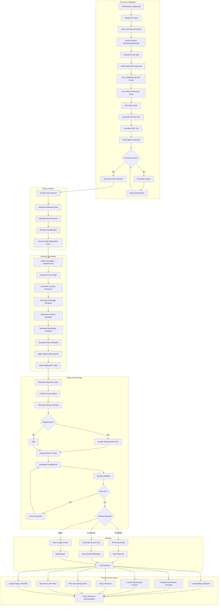

---

## 15. Sample Document Template Structure

### 15.1 Template Configuration (JSON)

```json
{
  "templateConfiguration": {
    "productCode": "TERM20_2024",
    "templateSetVersion": "2024.1",
    "effectiveDate": "2024-07-01",
    "documents": [
      {
        "documentType": "COVER_PAGE",
        "templateFile": "templates/term20/cover_page.html",
        "formNumber": "ICC24-TL20-COV",
        "required": true,
        "sortOrder": 1
      },
      {
        "documentType": "CONTRACT_PROVISIONS",
        "templateFile": "templates/term20/contract_provisions.html",
        "formNumber": "ICC24-TL20",
        "required": true,
        "sortOrder": 2,
        "stateVariations": {
          "CA": "templates/term20/contract_provisions_CA.html",
          "NY": "templates/term20/contract_provisions_NY.html"
        }
      },
      {
        "documentType": "COVERAGE_SCHEDULE",
        "templateFile": "templates/term20/coverage_schedule.html",
        "formNumber": "ICC24-TL20-SCH",
        "required": true,
        "sortOrder": 3
      },
      {
        "documentType": "PREMIUM_SCHEDULE",
        "templateFile": "templates/term20/premium_schedule.html",
        "formNumber": "ICC24-TL20-PRM",
        "required": true,
        "sortOrder": 4
      },
      {
        "documentType": "BENEFICIARY_SCHEDULE",
        "templateFile": "templates/term20/beneficiary_schedule.html",
        "formNumber": "ICC24-TL20-BEN",
        "required": true,
        "sortOrder": 5
      },
      {
        "documentType": "RIDER_WP",
        "templateFile": "templates/riders/waiver_of_premium.html",
        "formNumber": "ICC24-WP01",
        "required": false,
        "condition": "riders.contains('WP')",
        "sortOrder": 10
      },
      {
        "documentType": "RIDER_ADB",
        "templateFile": "templates/riders/accidental_death.html",
        "formNumber": "ICC24-ADB01",
        "required": false,
        "condition": "riders.contains('ADB')",
        "sortOrder": 11
      },
      {
        "documentType": "STATE_ENDORSEMENT",
        "templateFile": "templates/endorsements/state_{{stateCode}}.html",
        "formNumber": "{{stateCode}}24-AMEND",
        "required": true,
        "condition": "stateEndorsementRequired(stateOfIssue)",
        "sortOrder": 20
      },
      {
        "documentType": "APPLICATION_COPY",
        "source": "DOCUMENT_STORE",
        "documentRef": "application.signedCopy",
        "required": true,
        "sortOrder": 30
      },
      {
        "documentType": "WELCOME_LETTER",
        "templateFile": "templates/common/welcome_letter.html",
        "formNumber": null,
        "required": true,
        "sortOrder": 0
      },
      {
        "documentType": "PRIVACY_NOTICE",
        "templateFile": "templates/common/privacy_notice.html",
        "formNumber": "ICC24-PRIV01",
        "required": true,
        "sortOrder": 31
      },
      {
        "documentType": "DELIVERY_RECEIPT",
        "templateFile": "templates/common/delivery_receipt.html",
        "formNumber": "ICC24-DLVR01",
        "required": true,
        "sortOrder": 32
      },
      {
        "documentType": "BUYERS_GUIDE",
        "source": "STATIC_DOCUMENT",
        "documentRef": "naic_buyers_guide_2024.pdf",
        "required": true,
        "sortOrder": 33
      }
    ],
    "outputFormat": "PDF",
    "pdfSettings": {
      "pageSize": "LETTER",
      "orientation": "PORTRAIT",
      "margins": {"top": "1in", "bottom": "1in", "left": "1in", "right": "1in"},
      "compression": true,
      "accessibilityTagged": true,
      "digitallySigned": true
    }
  }
}
```

### 15.2 Template Variable Mapping (XML)

```xml
<templateVariables>
  <variableGroup name="policy">
    <variable name="policyNumber" source="policy.policy_number" format="string"/>
    <variable name="effectiveDate" source="policy.effective_date" format="date:MMMM d, yyyy"/>
    <variable name="issueDate" source="policy.issue_date" format="date:MMMM d, yyyy"/>
    <variable name="maturityDate" source="policy.maturity_date" format="date:MMMM d, yyyy"/>
    <variable name="stateOfIssue" source="policy.state_of_issue" format="state_full_name"/>
    <variable name="productName" source="product.display_name" format="string"/>
    <variable name="faceAmount" source="policy.face_amount" format="currency"/>
    <variable name="annualPremium" source="policy.annual_premium" format="currency"/>
    <variable name="modalPremium" source="policy.modal_premium" format="currency"/>
    <variable name="premiumMode" source="policy.premium_mode" format="string"/>
    <variable name="riskClass" source="policy.risk_class" format="risk_class_display"/>
    <variable name="tableRating" source="policy.table_rating" format="table_rating_display"/>
    <variable name="flatExtra" source="policy.flat_extra" format="currency_per_thousand"/>
  </variableGroup>

  <variableGroup name="insured">
    <variable name="fullName" source="insured.full_name" format="string"/>
    <variable name="dateOfBirth" source="insured.date_of_birth" format="date:MMMM d, yyyy"/>
    <variable name="issueAge" source="policy.issue_age" format="integer"/>
    <variable name="gender" source="insured.gender" format="string"/>
  </variableGroup>

  <variableGroup name="owner">
    <variable name="fullName" source="owner.full_name" format="string"/>
    <variable name="ownerType" source="owner.owner_type" format="string"/>
  </variableGroup>

  <variableGroup name="beneficiaries">
    <variable name="primaryList" source="beneficiaries.primary" format="beneficiary_list"/>
    <variable name="contingentList" source="beneficiaries.contingent" format="beneficiary_list"/>
  </variableGroup>

  <variableGroup name="riders" repeating="true" source="policy.riders">
    <variable name="riderName" source="rider.display_name" format="string"/>
    <variable name="riderFormNumber" source="rider.form_number" format="string"/>
    <variable name="benefitAmount" source="rider.benefit_amount" format="currency"/>
    <variable name="annualPremium" source="rider.annual_premium" format="currency"/>
  </variableGroup>
</templateVariables>
```

---

## 16. Architecture Reference

### 16.1 Document Composition Microservice

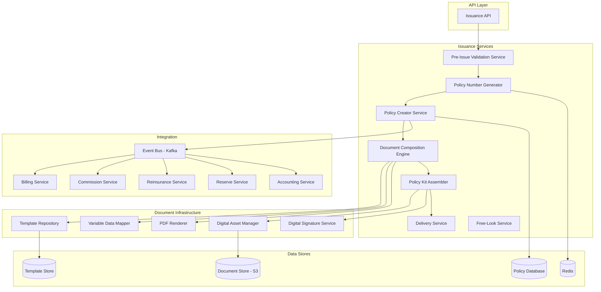

### 16.2 Template Versioning Architecture

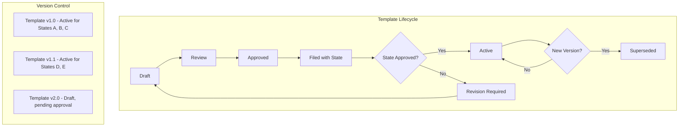

### 16.3 Digital Asset Management

| Asset Type | Storage | Retention | Access Control |
|-----------|---------|-----------|---------------|
| Policy contract PDF | S3 (encrypted, versioned) | Life of policy + 10 years | Policy-level RBAC |
| Signed application | S3 (encrypted) | Life of policy + 10 years | Policy-level RBAC |
| Delivery receipt | S3 (encrypted) | Life of policy + 10 years | Policy-level RBAC |
| Templates | Git repository + S3 | Indefinite | DevOps team |
| Form filings | Document management system | Indefinite | Compliance team |

### 16.4 Performance Requirements

| Operation | SLA | Notes |
|-----------|-----|-------|
| Pre-issue validation | < 5 seconds | All checks including OFAC |
| Policy number generation | < 100ms | Cached sequence |
| Contract document generation | < 30 seconds | Full policy kit |
| PDF rendering | < 10 seconds | Per document |
| E-delivery notification | < 1 minute | Email delivery |
| Batch issuance (nightly) | 1,000+ policies/hour | For bulk processing |

### 16.5 Disaster Recovery & Business Continuity

| Component | RPO | RTO | Strategy |
|-----------|-----|-----|----------|
| Policy database | 0 (synchronous replication) | < 15 minutes | Multi-AZ RDS with failover |
| Document store | 0 (S3 cross-region replication) | < 5 minutes | S3 multi-region |
| Template repository | < 1 hour | < 30 minutes | Git mirror + S3 backup |
| Issuance service | N/A | < 15 minutes | Auto-scaling, multi-AZ |
| PDF rendering | N/A | < 15 minutes | Stateless, auto-scaling |

---

## 17. Glossary

| Term | Definition |
|------|-----------|
| **ACORD** | Association for Cooperative Operations Research and Development |
| **AML** | Anti-Money Laundering — regulations to prevent financial crimes |
| **ANB** | Age Nearest Birthday — age calculation method |
| **ALB** | Age Last Birthday — age calculation method |
| **Backdating** | Setting a policy effective date before the issue date |
| **Buyer's Guide** | NAIC-mandated consumer information document |
| **Compact** | Interstate Insurance Product Regulation Compact |
| **CRVM** | Commissioner's Reserve Valuation Method |
| **CSO** | Commissioner's Standard Ordinary mortality table |
| **CTR** | Currency Transaction Report (AML filing) |
| **DAC** | Deferred Acquisition Cost — tax treatment of acquisition expenses |
| **Delivery Receipt** | Signed acknowledgment of policy delivery |
| **DMF** | Death Master File — SSA database of reported deaths |
| **E-SIGN Act** | Electronic Signatures in Global and National Commerce Act |
| **Endorsement** | Modification/amendment to the base policy form |
| **FAP** | Forms Automation Package (Documaker template format) |
| **FAS 60** | FASB statement for long-duration insurance contracts |
| **Free-Look** | Period during which policyholder can return the policy for full refund |
| **GAAP** | Generally Accepted Accounting Principles |
| **GLBA** | Gramm-Leach-Bliley Act — financial privacy regulation |
| **ICC** | Interstate Commerce Commission prefix for compact-approved forms |
| **IMb** | Intelligent Mail barcode (USPS tracking) |
| **KYC** | Know Your Customer — identity verification requirement |
| **Luhn** | Algorithm for generating/validating check digits |
| **Modal Premium** | Premium amount per payment frequency (monthly, quarterly, etc.) |
| **NAIC** | National Association of Insurance Commissioners |
| **OFAC** | Office of Foreign Assets Control — sanctions enforcement |
| **PAS** | Policy Administration System |
| **PDF/UA** | Universal Accessibility standard for PDF documents |
| **PEP** | Politically Exposed Person |
| **RPO** | Recovery Point Objective — acceptable data loss window |
| **RTO** | Recovery Time Objective — acceptable downtime window |
| **SAR** | Suspicious Activity Report (AML filing) |
| **Save-Age** | Backdating to preserve a younger insurance age |
| **SERFF** | System for Electronic Rate and Form Filing (NAIC) |
| **TXLife** | ACORD Life & Annuity XML transaction standard |
| **WCAG** | Web Content Accessibility Guidelines |
| **YRT** | Yearly Renewable Term — reinsurance premium basis |

---

*Article 10 — Policy Issuance & Contract Generation — Life Insurance PAS Architect's Encyclopedia*
*Version 1.0 — 2025*
