# Article 14: ACORD Standards for Life & Annuity

## Table of Contents

1. [ACORD Organization](#1-acord-organization)
2. [ACORD Life & Annuity Data Model](#2-acord-life--annuity-data-model)
3. [TXLife Object Model Hierarchy](#3-txlife-object-model-hierarchy)
4. [TXLife Transaction Types](#4-txlife-transaction-types)
5. [ACORD Message Patterns](#5-acord-message-patterns)
6. [ACORD TXLife XML Schema](#6-acord-txlife-xml-schema)
7. [OLI Type Codes — Exhaustive Reference](#7-oli-type-codes--exhaustive-reference)
8. [ACORD 103 Deep Dive — New Application](#8-acord-103-deep-dive--new-application)
9. [ACORD 121 Deep Dive — Policy Change](#9-acord-121-deep-dive--policy-change)
10. [ACORD 151 Deep Dive — Death Claim](#10-acord-151-deep-dive--death-claim)
11. [ACORD Life API Standards](#11-acord-life-api-standards)
12. [ACORD Data Dictionary](#12-acord-data-dictionary)
13. [Full XML Examples](#13-full-xml-examples)
14. [Mapping Strategies](#14-mapping-strategies)
15. [ACORD Testing and Certification](#15-acord-testing-and-certification)
16. [Architecture Patterns](#16-architecture-patterns)
17. [Practical Guidance for Solution Architects](#17-practical-guidance-for-solution-architects)

---

## 1. ACORD Organization

### 1.1 History and Foundation

The Association for Cooperative Operations Research and Development (ACORD) was founded in 1970 by a group of insurance industry executives who recognized the need for standardized data exchange between insurers, reinsurers, agents, brokers, and service providers. Originally focused on property and casualty lines, ACORD expanded into life insurance and annuity standards in the late 1980s with the creation of the Life & Annuity Technical Standards Committee.

Key milestones in ACORD history:

| Year | Milestone |
|------|-----------|
| 1970 | ACORD founded by 7 insurance companies |
| 1972 | First ACORD forms published for P&C |
| 1983 | Electronic data standards initiative launched |
| 1988 | Life & Annuity Standards Committee established |
| 1992 | First TXLife XML standard draft |
| 1998 | TXLife 2.0 schema released |
| 2001 | ACORD Framework for Life standards |
| 2004 | TXLife 2.9 released with enhanced annuity support |
| 2007 | ACORD 2007.01 — major schema consolidation |
| 2010 | ACORD Integration Architecture Guide published |
| 2013 | RESTful API standards initiative |
| 2016 | ACORD Global Data Model v3 |
| 2018 | ACORD API Strategy Framework |
| 2020 | Cloud-native integration patterns published |
| 2022 | Event-driven architecture guidelines |
| 2024 | ACORD Next-Gen Life Standards (JSON-first) |

### 1.2 Governance Structure

ACORD's governance operates through a multi-tiered committee structure:

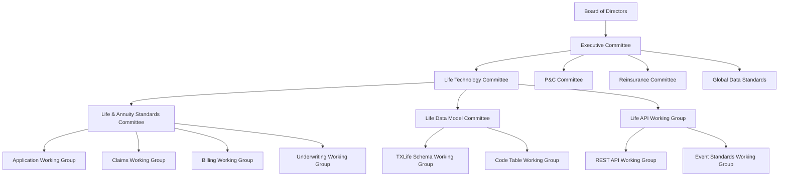

**Board of Directors**: Comprises C-level executives from member companies (typically 15–25 members), sets strategic direction and approves major standards releases.

**Executive Committee**: Day-to-day governance, prioritization of standards development work, budget approval.

**Life Technology Committee (LTC)**: Oversees all life and annuity technology standards. Meets quarterly. Composed of VP-level technology leaders from carriers, distributors, and vendors.

**Life & Annuity Standards Committee (LASC)**: The primary working body for TXLife standards. Produces the specifications, reviews change requests, and manages the release cycle. Meets bi-weekly.

**Working Groups**: Focused on specific domains (applications, claims, billing, underwriting). Each working group typically has 10–30 active participants from member companies. Working groups draft specifications that flow up to LASC for formal review and approval.

### 1.3 Membership

ACORD membership categories:

| Category | Description | Typical Count |
|----------|-------------|---------------|
| Full Member | Insurance carriers with voting rights | ~350 |
| Associate Member | Vendors, consultants, technology companies | ~200 |
| User Group Member | Agent/broker organizations | ~150 |
| Academic Member | Universities and research institutions | ~30 |
| Government Member | Regulatory bodies (observer status) | ~20 |

Membership provides access to:
- All published standards and specifications
- Schema files (XSD, JSON Schema, WSDL)
- Code tables and data dictionaries
- Working group participation
- Annual conference and regional events
- Implementation guides and best practices
- Certification programs

### 1.4 Standards Development Process

The ACORD standards development lifecycle follows a formal process:

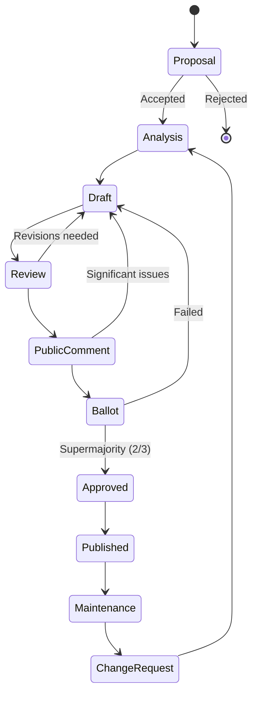

**Phase Details:**

1. **Proposal** (2–4 weeks): Any member may submit a Standard Change Request (SCR). The SCR describes the business need, proposed approach, and impact assessment. The relevant working group evaluates feasibility.

2. **Analysis** (4–8 weeks): Technical analysis of the proposed change, including impact on existing schema elements, backward compatibility assessment, and implementation complexity estimation.

3. **Draft** (8–16 weeks): Detailed specification writing, including XML schema changes, code table additions, implementation notes, and sample messages.

4. **Review** (4–6 weeks): Formal review by LASC members. All comments tracked in a disposition matrix.

5. **Public Comment** (4 weeks): Published to the full membership for review and comment.

6. **Ballot** (2 weeks): Formal vote by LASC voting members. Requires two-thirds supermajority for approval.

7. **Published**: Incorporated into the next schema release. Release cadence is typically annual (major) with quarterly patches.

---

## 2. ACORD Life & Annuity Data Model

### 2.1 Design Philosophy

The ACORD Life & Annuity data model is built on several foundational principles:

- **Object-oriented hierarchy**: Entities are organized in a containment hierarchy reflecting real-world insurance relationships.
- **Code-driven extensibility**: Enumerated type codes (OLI_ codes) provide standardized vocabularies without schema changes.
- **Temporal modeling**: Effective dates, transaction dates, and as-of dates are first-class citizens.
- **Multi-carrier support**: The model supports data exchange between any combination of carriers, distributors, reinsurers, and service providers.
- **Backward compatibility**: New schema versions must support all elements from prior versions (deprecation but not removal).

### 2.2 Core Entity Relationship Model

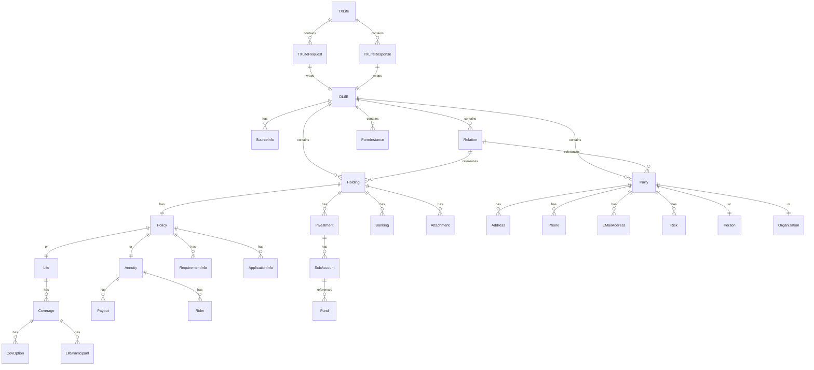

### 2.3 Top-Level Container: OLifE

The OLifE (Open Life Exchange) container is the root element of all ACORD life and annuity data exchange. It serves as the universal envelope for transporting insurance objects.

**OLifE Attributes:**

| Attribute | Type | Description |
|-----------|------|-------------|
| Version | String | Schema version (e.g., "2.43.00") |
| UniqueID | String | Globally unique identifier for this OLifE instance |
| SchemaVersion | String | XSD schema version reference |

**OLifE Child Elements:**

| Element | Cardinality | Description |
|---------|-------------|-------------|
| SourceInfo | 1..* | Identifies the originating and receiving systems |
| Holding | 0..* | Policy holdings, investments, banking |
| Party | 0..* | People and organizations |
| Relation | 0..* | Relationships between parties and holdings |
| FormInstance | 0..* | Forms, documents, and attachments |
| Activity | 0..* | Work items, tasks, and audit trail entries |

### 2.4 Complete Object Breakdown

#### 2.4.1 SourceInfo

Identifies the originating system and provides message routing information.

```xml
<SourceInfo>
  <CreationDate>2025-01-15</CreationDate>
  <CreationTime>14:30:00</CreationTime>
  <SourceInfoName>CarrierPAS</SourceInfoName>
  <SourceInfoDescription>Carrier Policy Admin System v4.2</SourceInfoDescription>
  <FileControlID>MSG-2025-0115-001</FileControlID>
</SourceInfo>
```

| Field | Type | Req | Description |
|-------|------|-----|-------------|
| CreationDate | Date | Y | Date the message was created (YYYY-MM-DD) |
| CreationTime | Time | Y | Time the message was created (HH:MM:SS) |
| SourceInfoName | String(128) | Y | Unique system identifier |
| SourceInfoDescription | String(256) | N | Human-readable system description |
| FileControlID | String(64) | Y | Unique message control number |

#### 2.4.2 Holding

The Holding object represents a financial product owned by a party. In life insurance, this is the top-level container for a policy.

```xml
<Holding id="Holding_1">
  <HoldingTypeCode tc="2">Policy</HoldingTypeCode>
  <HoldingStatus tc="2">Active</HoldingStatus>
  <HoldingForm tc="1">Individual</HoldingForm>
  <CurrencyTypeCode tc="840">USD</CurrencyTypeCode>
  <Purpose tc="8">Estate Planning</Purpose>
  <Policy>
    <!-- Policy details -->
  </Policy>
  <Investment>
    <!-- Investment details for variable products -->
  </Investment>
  <Banking>
    <!-- Banking/EFT information -->
  </Banking>
  <Attachment>
    <!-- Attached documents -->
  </Attachment>
</Holding>
```

**HoldingTypeCode Values:**

| tc | Description |
|----|-------------|
| 1 | Investment |
| 2 | Policy |
| 3 | Banking |
| 4 | Loan |
| 5 | Retirement Plan |
| 6 | Reinsurance |
| 7 | Trust |
| 8 | Custodial Account |

#### 2.4.3 Policy

The Policy object contains all product-specific details of an insurance policy.

```xml
<Policy>
  <PolNumber>LIF-2025-00012345</PolNumber>
  <LineOfBusiness tc="1">Life</LineOfBusiness>
  <ProductType tc="2">Term Life</ProductType>
  <ProductCode>TL20-PREM</ProductCode>
  <CarrierCode>ACME</CarrierCode>
  <PlanName>20-Year Level Term Premier</PlanName>
  <PolicyStatus tc="1">Active</PolicyStatus>
  <IssueDate>2025-01-15</IssueDate>
  <EffDate>2025-02-01</EffDate>
  <TermDate>2045-02-01</TermDate>
  <Jurisdiction tc="37">New York</Jurisdiction>
  <IssueNation tc="1">USA</IssueNation>
  <PaymentMode tc="4">Monthly</PaymentMode>
  <PaymentMethod tc="7">EFT</PaymentMethod>
  <PaymentAmt>125.50</PaymentAmt>
  <MinPremiumInitialAmt>1500.00</MinPremiumInitialAmt>
  <AnnualPremAmt>1506.00</AnnualPremAmt>
  <NonFortProvision tc="1">Auto Premium Loan</NonFortProvision>
  <DivType tc="2">PaidUpAdditions</DivType>
  <ApplicationInfo>
    <TrackingID>APP-2024-98765</TrackingID>
    <ApplicationType tc="1">New</ApplicationType>
    <FormalAppInd tc="1">true</FormalAppInd>
    <SignedDate>2024-12-20</SignedDate>
    <ApplicationJurisdiction tc="37">New York</ApplicationJurisdiction>
    <ReplacementInd tc="1">true</ReplacementInd>
    <ReplacementType tc="2">External</ReplacementType>
  </ApplicationInfo>
  <RequirementInfo>
    <ReqCode tc="100">Paramedical Exam</ReqCode>
    <ReqStatus tc="3">Received</ReqStatus>
    <ReqSubStatus tc="1">Complete</ReqSubStatus>
    <RequestedDate>2024-12-22</RequestedDate>
    <FulfilledDate>2025-01-05</FulfilledDate>
  </RequirementInfo>
  <Life>
    <!-- Life insurance product details -->
  </Life>
</Policy>
```

**Key Policy Fields:**

| Field | Type | Req | Description |
|-------|------|-----|-------------|
| PolNumber | String(30) | Y | Unique policy number |
| LineOfBusiness | tc | Y | 1=Life, 2=Annuity, 3=Health, 4=Disability |
| ProductType | tc | Y | See Product Type code table |
| ProductCode | String(20) | Y | Carrier-specific product identifier |
| CarrierCode | String(10) | Y | NAIC company code or ACORD carrier ID |
| PolicyStatus | tc | Y | See Policy Status code table |
| IssueDate | Date | C | Date policy was issued |
| EffDate | Date | Y | Policy effective date |
| TermDate | Date | C | Policy termination/maturity date |
| Jurisdiction | tc | Y | State/province of issue |
| PaymentMode | tc | Y | 1=Annual, 2=Semi-annual, 3=Quarterly, 4=Monthly |
| PaymentMethod | tc | Y | 2=Check, 5=Direct Bill, 7=EFT, 8=Credit Card |
| PaymentAmt | Decimal | Y | Modal premium amount |
| AnnualPremAmt | Decimal | Y | Annualized premium amount |

#### 2.4.4 Life Object

Contains life insurance-specific product structure.

```xml
<Life>
  <FaceAmt>500000.00</FaceAmt>
  <TotalFaceAmt>575000.00</TotalFaceAmt>
  <InitialPremAmt>1506.00</InitialPremAmt>
  <QualPlanType tc="1">Non-Qualified</QualPlanType>
  <NonFortProvision tc="1">Automatic Premium Loan</NonFortProvision>
  <IndividualOrJoint tc="1">Individual</IndividualOrJoint>
  <Coverage id="Coverage_Base">
    <!-- Base coverage -->
  </Coverage>
  <Coverage id="Coverage_Rider1">
    <!-- Rider coverage -->
  </Coverage>
</Life>
```

#### 2.4.5 Coverage

Represents a specific coverage unit within a life policy. A policy may have one base coverage plus multiple rider coverages.

```xml
<Coverage id="Coverage_Base">
  <IndicatorCode tc="1">Base</IndicatorCode>
  <LifeCovTypeCode tc="1">WholeLife</LifeCovTypeCode>
  <LifeCovStatus tc="1">Active</LifeCovStatus>
  <CurrentAmt>500000.00</CurrentAmt>
  <InitCovAmt>500000.00</InitCovAmt>
  <ModalPremAmt>125.50</ModalPremAmt>
  <AnnualPremAmt>1506.00</AnnualPremAmt>
  <EffDate>2025-02-01</EffDate>
  <TermDate>2045-02-01</TermDate>
  <CovPeriod tc="1">Years</CovPeriod>
  <NumPeriods>20</NumPeriods>
  <PremMode tc="4">Monthly</PremMode>
  <DeathBenefitOptType tc="1">Level</DeathBenefitOptType>
  <CurrentNumberOfUnits>1</CurrentNumberOfUnits>
  <ValuePerUnit>500000.00</ValuePerUnit>
  <LivesType tc="1">SingleLife</LivesType>
  <SmokerStat tc="1">NonSmoker</SmokerStat>
  <UnderwritingClass tc="1">Standard</UnderwritingClass>
  <PermTableRating tc="1">Standard</PermTableRating>
  <LifeParticipant id="LP_1">
    <PartyID>Party_Insured1</PartyID>
    <LifeParticipantRoleCode tc="1">Primary Insured</LifeParticipantRoleCode>
    <IssueAge>35</IssueAge>
    <IssueGender tc="1">Male</IssueGender>
    <SmokerStat tc="1">NonSmoker</SmokerStat>
    <UnderwritingClass tc="1">Preferred Plus</UnderwritingClass>
  </LifeParticipant>
  <CovOption id="WOP_1">
    <LifeCovOptTypeCode tc="7">Waiver of Premium</LifeCovOptTypeCode>
    <OptionStatus tc="1">Active</OptionStatus>
    <ModalPremAmt>8.50</ModalPremAmt>
    <EffDate>2025-02-01</EffDate>
  </CovOption>
</Coverage>
```

**Coverage Fields Reference:**

| Field | Type | Description |
|-------|------|-------------|
| IndicatorCode | tc | 1=Base, 2=Rider, 3=Benefit |
| LifeCovTypeCode | tc | See Coverage Type codes |
| LifeCovStatus | tc | 1=Active, 3=Proposed, 6=Terminated |
| CurrentAmt | Decimal | Current face amount |
| DeathBenefitOptType | tc | 1=Level, 2=Increasing (Option A/B) |
| LivesType | tc | 1=Single, 2=JointFirst, 3=JointLast |
| SmokerStat | tc | 1=NonSmoker, 2=Smoker, 3=NeverSmoked |
| UnderwritingClass | tc | 1=Standard, 2=Preferred, 3=SubStandard |

#### 2.4.6 Annuity Object

For annuity products, the Policy contains an Annuity object instead of Life.

```xml
<Annuity>
  <AnnuityCategory tc="2">Deferred</AnnuityCategory>
  <QualPlanType tc="12">Traditional IRA</QualPlanType>
  <InitPaymentAmt>100000.00</InitPaymentAmt>
  <TotalPremAmt>250000.00</TotalPremAmt>
  <AnnuityStatus tc="1">Active</AnnuityStatus>
  <AnnuitizationDate>2040-01-01</AnnuitizationDate>
  <GuaranteedMinAccumRate>0.015</GuaranteedMinAccumRate>
  <SurrenderChargeSchd>
    <Duration>1</Duration><SurrenderPct>0.08</SurrenderPct>
    <Duration>2</Duration><SurrenderPct>0.07</SurrenderPct>
    <Duration>3</Duration><SurrenderPct>0.06</SurrenderPct>
    <Duration>4</Duration><SurrenderPct>0.05</SurrenderPct>
    <Duration>5</Duration><SurrenderPct>0.04</SurrenderPct>
    <Duration>6</Duration><SurrenderPct>0.03</SurrenderPct>
    <Duration>7</Duration><SurrenderPct>0.02</SurrenderPct>
    <Duration>8</Duration><SurrenderPct>0.01</SurrenderPct>
    <Duration>9</Duration><SurrenderPct>0.00</SurrenderPct>
  </SurrenderChargeSchd>
  <FreeWithdrawalPct>0.10</FreeWithdrawalPct>
  <Rider id="GMDB_1">
    <RiderTypeCode tc="47">GMDB - Return of Premium</RiderTypeCode>
    <RiderStatus tc="1">Active</RiderStatus>
    <AnnualCostAmt>350.00</AnnualCostAmt>
    <BenefitAmt>250000.00</BenefitAmt>
  </Rider>
  <Rider id="GLWB_1">
    <RiderTypeCode tc="52">GLWB</RiderTypeCode>
    <RiderStatus tc="1">Active</RiderStatus>
    <AnnualCostPct>0.0095</AnnualCostPct>
    <WithdrawalPct>0.05</WithdrawalPct>
    <RollUpRate>0.05</RollUpRate>
    <RollUpPeriod>10</RollUpPeriod>
    <BenefitBase>250000.00</BenefitBase>
  </Rider>
  <Payout id="Payout_1">
    <PayoutType tc="3">Life with Period Certain</PayoutType>
    <PayoutMode tc="4">Monthly</PayoutMode>
    <PayoutAmt>1250.00</PayoutAmt>
    <StartDate>2040-01-01</StartDate>
    <CertainDuration>10</CertainDuration>
    <CertainPeriod tc="1">Years</CertainPeriod>
  </Payout>
</Annuity>
```

#### 2.4.7 Party Object

Represents any person or organization involved in the insurance transaction.

```xml
<Party id="Party_Insured1">
  <PartyTypeCode tc="1">Person</PartyTypeCode>
  <PartySysKey>CUST-00012345</PartySysKey>
  <GovtID>123-45-6789</GovtID>
  <GovtIDTC tc="1">SSN</GovtIDTC>
  <GovtIDStat tc="1">Verified</GovtIDStat>
  <ResidenceState tc="37">New York</ResidenceState>
  <ResidenceCountry tc="1">USA</ResidenceCountry>
  <Person>
    <FirstName>John</FirstName>
    <MiddleName>Michael</MiddleName>
    <LastName>Smith</LastName>
    <Suffix>Jr</Suffix>
    <Prefix>Mr</Prefix>
    <Gender tc="1">Male</Gender>
    <BirthDate>1990-03-15</BirthDate>
    <Age>35</Age>
    <MarStat tc="1">Married</MarStat>
    <Citizenship tc="1">US Citizen</Citizenship>
    <DriversLicenseNum>NY12345678</DriversLicenseNum>
    <DriversLicenseState tc="37">New York</DriversLicenseState>
    <Occupation>Software Engineer</Occupation>
    <OccupClass tc="1">Professional</OccupClass>
    <AnnualIncome>185000.00</AnnualIncome>
    <NetWorth>750000.00</NetWorth>
    <Height2>
      <MeasureUnits tc="1">Inches</MeasureUnits>
      <MeasureValue>72</MeasureValue>
    </Height2>
    <Weight2>
      <MeasureUnits tc="1">Pounds</MeasureUnits>
      <MeasureValue>185</MeasureValue>
    </Weight2>
  </Person>
  <Address id="Addr_Home">
    <AddressTypeCode tc="1">Home</AddressTypeCode>
    <Line1>123 Oak Street</Line1>
    <Line2>Apt 4B</Line2>
    <City>Brooklyn</City>
    <AddressStateTC tc="37">NY</AddressStateTC>
    <Zip>11201</Zip>
    <AddressCountryTC tc="1">USA</AddressCountryTC>
    <StartDate>2020-06-15</StartDate>
  </Address>
  <Address id="Addr_Work">
    <AddressTypeCode tc="2">Business</AddressTypeCode>
    <Line1>456 Tech Plaza</Line1>
    <Line2>Floor 12</Line2>
    <City>Manhattan</City>
    <AddressStateTC tc="37">NY</AddressStateTC>
    <Zip>10001</Zip>
    <AddressCountryTC tc="1">USA</AddressCountryTC>
  </Address>
  <Phone id="Phone_Home">
    <PhoneTypeCode tc="1">Home</PhoneTypeCode>
    <DialNumber>718-555-0123</DialNumber>
    <PrefPhone tc="1">true</PrefPhone>
  </Phone>
  <Phone id="Phone_Mobile">
    <PhoneTypeCode tc="17">Mobile</PhoneTypeCode>
    <DialNumber>917-555-0456</DialNumber>
  </Phone>
  <EMailAddress id="Email_1">
    <EMailType tc="1">Personal</EMailType>
    <AddrLine>john.smith@email.com</AddrLine>
    <PrefEMailAddr tc="1">true</PrefEMailAddr>
  </EMailAddress>
  <Risk>
    <TobaccoInd tc="0">false</TobaccoInd>
    <TobaccoPremBasis tc="2">NonTobacco</TobaccoPremBasis>
    <HealthRating tc="1">Preferred Plus</HealthRating>
    <MedicalCondition id="MC_1">
      <ConditionType tc="23">Controlled Hypertension</ConditionType>
      <DiagnosisDate>2020-01-01</DiagnosisDate>
      <MedCondStatus tc="1">Active-Controlled</MedCondStatus>
      <Treatment>Lisinopril 10mg daily</Treatment>
    </MedicalCondition>
    <AvocHobby id="AH_1">
      <AvocHobbyType tc="5">Scuba Diving</AvocHobbyType>
      <FrequencyPerYear>4</FrequencyPerYear>
      <MaxDepthFeet>100</MaxDepthFeet>
    </AvocHobby>
    <ForeignTravel id="FT_1">
      <ForeignCountry tc="45">Thailand</ForeignCountry>
      <TravelPurpose tc="2">Vacation</TravelPurpose>
      <Duration>14</Duration>
      <DurationUnit tc="2">Days</DurationUnit>
    </ForeignTravel>
  </Risk>
</Party>
```

#### 2.4.8 Organization (Party subtype)

```xml
<Party id="Party_Corp_Owner">
  <PartyTypeCode tc="2">Organization</PartyTypeCode>
  <GovtID>12-3456789</GovtID>
  <GovtIDTC tc="2">EIN</GovtIDTC>
  <Organization>
    <OrgForm tc="2">Corporation</OrgForm>
    <DBA>ACME Technology Solutions Inc.</DBA>
    <EstabDate>2010-03-20</EstabDate>
    <CountryOfIncorp tc="1">USA</CountryOfIncorp>
    <StateOfIncorp tc="37">New York</StateOfIncorp>
    <SICCode>7372</SICCode>
    <NAICSCode>511210</NAICSCode>
    <NumEmployees>250</NumEmployees>
    <AnnualRevenue>45000000.00</AnnualRevenue>
    <NetWorth>12000000.00</NetWorth>
  </Organization>
</Party>
```

#### 2.4.9 Relation Object

Defines the relationships between Party and Holding objects.

```xml
<!-- Owner relationship -->
<Relation id="Rel_1">
  <OriginatingObjectID>Party_Insured1</OriginatingObjectID>
  <OriginatingObjectType tc="6">Party</OriginatingObjectType>
  <RelatedObjectID>Holding_1</RelatedObjectID>
  <RelatedObjectType tc="4">Holding</RelatedObjectType>
  <RelationRoleCode tc="8">Owner</RelationRoleCode>
  <RelationDescription>Policy Owner</RelationDescription>
  <BeneficiaryDesignation tc="1">Primary</BeneficiaryDesignation>
  <InterestPercent>100</InterestPercent>
</Relation>

<!-- Primary Beneficiary -->
<Relation id="Rel_Bene1">
  <OriginatingObjectID>Party_Spouse1</OriginatingObjectID>
  <OriginatingObjectType tc="6">Party</OriginatingObjectType>
  <RelatedObjectID>Holding_1</RelatedObjectID>
  <RelatedObjectType tc="4">Holding</RelatedObjectType>
  <RelationRoleCode tc="34">Beneficiary</RelationRoleCode>
  <BeneficiaryDesignation tc="1">Primary</BeneficiaryDesignation>
  <InterestPercent>100</InterestPercent>
  <BeneficiaryDistOption tc="1">Lump Sum</BeneficiaryDistOption>
</Relation>

<!-- Agent relationship -->
<Relation id="Rel_Agent1">
  <OriginatingObjectID>Party_Agent1</OriginatingObjectID>
  <OriginatingObjectType tc="6">Party</OriginatingObjectType>
  <RelatedObjectID>Holding_1</RelatedObjectID>
  <RelatedObjectType tc="4">Holding</RelatedObjectType>
  <RelationRoleCode tc="37">WritingAgent</RelationRoleCode>
  <VolumeSharePct>60</VolumeSharePct>
  <CommissionPct>55</CommissionPct>
  <SituationCode>NY-LIF-PREM</SituationCode>
</Relation>

<!-- Party-to-Party relationship -->
<Relation id="Rel_PP1">
  <OriginatingObjectID>Party_Insured1</OriginatingObjectID>
  <OriginatingObjectType tc="6">Party</OriginatingObjectType>
  <RelatedObjectID>Party_Spouse1</RelatedObjectID>
  <RelatedObjectType tc="6">Party</RelatedObjectType>
  <RelationRoleCode tc="1">Spouse</RelationRoleCode>
</Relation>
```

**Common RelationRoleCode Values:**

| tc | Description |
|----|-------------|
| 1 | Spouse |
| 5 | Insured |
| 8 | Owner |
| 11 | Payor |
| 32 | Assignee |
| 34 | Beneficiary |
| 37 | WritingAgent |
| 38 | ServiceAgent |
| 39 | Employer |
| 41 | Trustee |
| 46 | PowerOfAttorney |
| 48 | ContingentOwner |
| 49 | ContingentBeneficiary |
| 67 | Irrevocable Beneficiary |
| 108 | GuardianOfMinor |
| 131 | Cedant (Reinsurance) |
| 132 | Reinsurer |

#### 2.4.10 Banking Object

Captures EFT/ACH banking information for premium payment or disbursement.

```xml
<Banking id="Banking_1">
  <BankingStatus tc="1">Active</BankingStatus>
  <AccountNumber>XXXX4567</AccountNumber>
  <RoutingNum>021000089</RoutingNum>
  <AcctHolderName>John M Smith</AcctHolderName>
  <BankAcctType tc="1">Checking</BankAcctType>
  <CreditDebitType tc="2">Debit</CreditDebitType>
  <BankName>Chase Manhattan Bank</BankName>
  <InitialPremBankInd tc="1">true</InitialPremBankInd>
  <DraftDayOfMonth>15</DraftDayOfMonth>
</Banking>
```

#### 2.4.11 Investment and SubAccount

For variable life/annuity products with fund allocations.

```xml
<Investment>
  <InvestmentType tc="2">Variable</InvestmentType>
  <TotalAccountValue>245678.90</TotalAccountValue>
  <NetSurrenderValue>238765.00</NetSurrenderValue>
  <LoanBalance>0.00</LoanBalance>
  <SubAccount id="SA_1">
    <FundID>FUND-LCG-001</FundID>
    <FundSysKey>VG-SP500-IDX</FundSysKey>
    <AllocPercent>40</AllocPercent>
    <AccountValue>98271.56</AccountValue>
    <NumberOfUnits>1523.456</NumberOfUnits>
    <UnitValue>64.50</UnitValue>
    <ValuationDate>2025-01-14</ValuationDate>
    <PerformanceYTD>0.0234</PerformanceYTD>
    <ExpenseRatio>0.0045</ExpenseRatio>
  </SubAccount>
  <SubAccount id="SA_2">
    <FundID>FUND-FI-002</FundID>
    <FundSysKey>PIMCO-TOTRET</FundSysKey>
    <AllocPercent>30</AllocPercent>
    <AccountValue>73703.67</AccountValue>
    <NumberOfUnits>6789.012</NumberOfUnits>
    <UnitValue>10.856</UnitValue>
    <ValuationDate>2025-01-14</ValuationDate>
  </SubAccount>
  <SubAccount id="SA_3">
    <FundID>FUND-GA-003</FundID>
    <FundSysKey>FIXED-ACCT</FundSysKey>
    <AllocPercent>30</AllocPercent>
    <AccountValue>73703.67</AccountValue>
    <GuaranteedRate>0.025</GuaranteedRate>
    <CurrentRate>0.035</CurrentRate>
  </SubAccount>
</Investment>
```

#### 2.4.12 SignatureInfo

```xml
<SignatureInfo>
  <SignatureRoleCode tc="1">Owner</SignatureRoleCode>
  <SignatureDate>2024-12-20</SignatureDate>
  <SignatureCity>Brooklyn</SignatureCity>
  <SignatureState tc="37">New York</SignatureState>
  <SignatureOK tc="1">Signed</SignatureOK>
  <SignatureType tc="3">Electronic</SignatureType>
  <ElectronicSignature>
    <CertificateID>ESIG-2024-12345</CertificateID>
    <SignatureProvider>DocuSign</SignatureProvider>
    <IPAddress>192.168.1.100</IPAddress>
    <Timestamp>2024-12-20T14:32:15Z</Timestamp>
  </ElectronicSignature>
</SignatureInfo>
```

---

## 3. TXLife Object Model Hierarchy

### 3.1 TXLife Container Structure

The TXLife element is the outermost wrapper for all ACORD life and annuity message exchanges. Every message — whether a new application, policy inquiry, change request, or claim — is wrapped in a TXLife envelope.

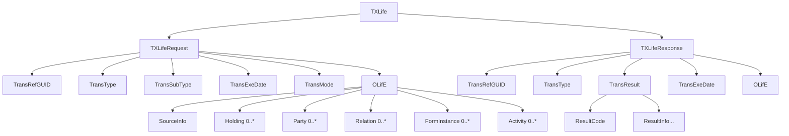

### 3.2 TXLifeRequest Structure

```xml
<TXLife>
  <UserAuthRequest>
    <UserLoginName>svc_pas_user</UserLoginName>
    <UserPswd>
      <CryptType tc="1">None</CryptType>
      <Pswd>encrypted_token_here</Pswd>
    </UserPswd>
  </UserAuthRequest>
  <TXLifeRequest PrimaryObjectID="Holding_1">
    <TransRefGUID>a1b2c3d4-e5f6-7890-abcd-ef1234567890</TransRefGUID>
    <TransType tc="103">New Business Submission</TransType>
    <TransSubType tc="10301">New Application</TransSubType>
    <TransExeDate>2025-01-15</TransExeDate>
    <TransExeTime>14:30:00</TransExeTime>
    <TransMode tc="2">Original</TransMode>
    <InquiryLevel tc="3">ObjectAndChildren</InquiryLevel>
    <InquiryView>
      <InquiryViewTypeCode tc="1">Full</InquiryViewTypeCode>
    </InquiryView>
    <MaxRecords>100</MaxRecords>
    <OLifE>
      <!-- Contains all Holding, Party, Relation objects -->
    </OLifE>
  </TXLifeRequest>
</TXLife>
```

### 3.3 TXLifeResponse Structure

```xml
<TXLife>
  <TXLifeResponse>
    <TransRefGUID>a1b2c3d4-e5f6-7890-abcd-ef1234567890</TransRefGUID>
    <TransType tc="103">New Business Submission</TransType>
    <TransExeDate>2025-01-15</TransExeDate>
    <TransExeTime>14:30:05</TransExeTime>
    <TransResult>
      <ResultCode tc="1">Success</ResultCode>
      <ConfirmationID>CONF-2025-001234</ConfirmationID>
      <RecordsFound>1</RecordsFound>
      <ResultInfo>
        <ResultInfoCode tc="0">Success</ResultInfoCode>
        <ResultInfoDesc>Application received and validated successfully</ResultInfoDesc>
      </ResultInfo>
    </TransResult>
    <OLifE>
      <!-- Echo back with system-assigned IDs, status updates -->
    </OLifE>
  </TXLifeResponse>
</TXLife>
```

**TransResult ResultCode Values:**

| tc | Description | Meaning |
|----|-------------|---------|
| 1 | Success | Transaction processed successfully |
| 2 | Success With Info | Processed with informational messages |
| 3 | Failure | Transaction failed — see ResultInfo |
| 4 | Data Not Found | Requested record not found |
| 5 | Partial Success | Some items processed, some failed |
| 6 | Duplicate | Transaction previously processed |

---

## 4. TXLife Transaction Types

### 4.1 Transaction Type Catalog

The TransType code identifies the nature of the ACORD transaction. Below is a comprehensive catalog of transaction types used in life and annuity processing:

#### New Business Transactions (100-series)

| TransType tc | Name | Description |
|-------------|------|-------------|
| 100 | Quote Request | Request premium quote for a proposed policy |
| 101 | Quote Response | Premium quote result |
| 103 | New Business Submission | Full application submission for new policy |
| 104 | Application Status Inquiry | Query status of submitted application |
| 105 | Application Status Response | Status of application (UW status, requirements) |
| 109 | Illustration Request | Request policy illustration |
| 110 | Illustration Response | Policy illustration values |
| 111 | Pre-Submission Inquiry | Validate application data before submission |
| 112 | Pre-Qualification | Simplified underwriting pre-qualification |
| 113 | E-Application Submission | Electronic application with e-signature |
| 114 | Supplemental Application | Additional application info post-submission |
| 115 | Replacement Notification | 1035 exchange/replacement disclosure |
| 116 | Order Requirements | Order underwriting requirements |
| 117 | Requirement Status | Status update on ordered requirements |
| 118 | Underwriting Decision | UW decision communication (approve/decline/rate) |
| 119 | Policy Issue Notification | Notify distributor of policy issuance |
| 120 | Delivery Receipt | Confirmation of policy delivery |

#### Policy Change Transactions (121-series)

| TransType tc | Name | Description |
|-------------|------|-------------|
| 121 | Policy Change/Endorsement | Modify existing policy |
| 122 | Policy Change Status | Status of submitted change request |
| 123 | Change Confirmation | Confirmation of processed change |
| 124 | Reinstatement Request | Request to reinstate lapsed policy |
| 125 | Reinstatement Confirmation | Reinstatement processing result |
| 126 | Policy Surrender/Termination | Request to surrender or terminate |
| 127 | Conversion Request | Term-to-perm conversion |
| 128 | Loan Request | Policy loan request |
| 129 | Loan Repayment | Policy loan repayment |
| 130 | Dividend Option Change | Change dividend election |
| 131 | Face Amount Change | Increase/decrease face amount |
| 132 | Rider Addition/Removal | Add or remove coverage rider |
| 133 | Ownership Change | Transfer policy ownership |
| 134 | Beneficiary Change | Update beneficiaries |
| 135 | Address Change | Update mailing/residence address |
| 136 | Name Change | Update party name |
| 137 | Payment Mode Change | Change billing frequency |
| 138 | Payment Method Change | Change payment method (EFT, direct bill) |
| 139 | Assignment | Collateral or absolute assignment |

#### Claims Transactions (150-series)

| TransType tc | Name | Description |
|-------------|------|-------------|
| 150 | Claim Submission | Submit a new claim |
| 151 | Death Claim | Submit death claim notification |
| 152 | Disability Claim | Submit disability claim |
| 153 | Accelerated Death Benefit | ADB claim request |
| 154 | Claim Status Inquiry | Check claim processing status |
| 155 | Claim Status Response | Claim status details |
| 156 | Claim Payment Notification | Notify of claim payment |
| 157 | Proof of Claim | Submit supporting documentation |
| 158 | Claim Investigation | Request additional claim investigation |
| 159 | Claim Decision | Approve/deny claim decision |
| 160 | Settlement Option Election | Beneficiary settlement choice |
| 161 | Supplemental Claim Info | Additional claim information |

#### Financial Transactions (200-series)

| TransType tc | Name | Description |
|-------------|------|-------------|
| 200 | Premium Payment | Record premium payment |
| 201 | Premium Inquiry | Query premium information |
| 202 | Withdrawal Request | Partial withdrawal from cash value |
| 203 | Full Surrender | Full policy surrender |
| 228 | Fund Transfer | Transfer between investment funds |
| 229 | Fund Rebalance | Rebalance investment allocations |
| 230 | Dollar Cost Averaging Setup | Configure DCA schedule |
| 231 | Systematic Withdrawal Setup | Configure systematic withdrawal |
| 232 | Asset Allocation Change | Change target fund allocation |
| 233 | Account Value Inquiry | Query current account value |
| 234 | Transaction History | Request transaction history |
| 235 | MVA Calculation | Market Value Adjustment calculation |

#### Billing Transactions (500-series)

| TransType tc | Name | Description |
|-------------|------|-------------|
| 500 | Billing Statement | Generate/retrieve billing statement |
| 501 | Premium Due Notice | Premium due notification |
| 502 | Grace Period Notice | Grace period warning |
| 503 | Lapse Notice | Policy lapse notification |
| 504 | Premium Receipt | Premium payment receipt |
| 505 | Commission Statement | Agent commission statement |
| 506 | Commission Inquiry | Agent commission inquiry |
| 507 | Payment Plan Change | Change premium payment schedule |
| 508 | Billing Inquiry | Query billing information |
| 509 | Billing Adjustment | Adjust billing amount |
| 510 | NSF/Returned Payment | Insufficient funds notification |
| 511 | Reinstatement Billing | Premium required for reinstatement |

#### Inquiry/Service Transactions (600-series)

| TransType tc | Name | Description |
|-------------|------|-------------|
| 600 | Policy Inquiry | Query full policy details |
| 601 | Policy Summary | Summary-level policy inquiry |
| 602 | In-Force Illustration | In-force ledger/illustration |
| 603 | Certificate of Insurance | Request COI |
| 604 | Policy Values Inquiry | Query cash value, death benefit |
| 605 | Loan Inquiry | Query loan balance and details |
| 606 | Correspondence Request | Request policy correspondence |
| 607 | Document Retrieval | Retrieve policy documents |
| 608 | Party Inquiry | Inquiry on party information |
| 609 | Coverage Inquiry | Query coverage details |
| 610 | Anniversary Statement | Annual policy statement |

#### Administrative Transactions (700-series)

| TransType tc | Name | Description |
|-------------|------|-------------|
| 700 | Policy Transfer (Admin) | Transfer policy between admin systems |
| 701 | Reinsurance Cession | Reinsurance cession/bordereaux |
| 702 | Reinsurance Claim | Reinsurance claim notification |
| 703 | Regulatory Reporting | State regulatory data submission |
| 704 | Tax Reporting | 1099/5498 tax data |
| 705 | Audit Data | SOC/audit data extraction |

#### Systematic/Recurring Activity (1100-series)

| TransType tc | Name | Description |
|-------------|------|-------------|
| 1100 | Systematic Activity Setup | Configure recurring transaction |
| 1101 | Systematic Activity Update | Modify recurring transaction |
| 1102 | Systematic Activity Cancel | Cancel recurring transaction |
| 1103 | Systematic Activity Status | Status of recurring transaction |
| 1122 | Systematic Activity Processing | Process scheduled systematic activity |

### 4.2 Transaction Type Detail — Business Rules

For each major transaction type, the following rules apply:

**TC 103 — New Business Submission:**
- Required: At least one Holding with Policy, at least one Party (insured), at least one Relation (owner, insured to holding).
- Conditionally required: Banking (if PaymentMethod = EFT), Investment (if variable product), Risk (if medical underwriting required).
- Business rules: ProductCode must be valid and active, Jurisdiction must be a state where product is filed, insured age must fall within product min/max age, face amount within product limits.
- Response: Must include PolNumber (or tracking number), RequirementInfo for any outstanding requirements.

**TC 121 — Policy Change:**
- Required: Holding with PolNumber, ChangeSubType identifying the specific change, before/after values.
- ChangeSubType codes drive the specific change logic and required fields.
- Effective dating: Changes can be backdated (within carrier rules), current-dated, or future-dated.
- Response: Confirmation of change, updated policy values if applicable.

**TC 151 — Death Claim:**
- Required: Holding with PolNumber, Party for deceased insured and claimant(s), Relation for beneficiaries, proof of death documentation.
- Business rules: Must validate policy was in force at date of death, check contestability period, verify beneficiary designations.
- Response: Claim number, claim status, expected settlement timeline.

---

## 5. ACORD Message Patterns

### 5.1 Request/Response (Synchronous)

The most common pattern where the sender submits a request and waits for an immediate response.

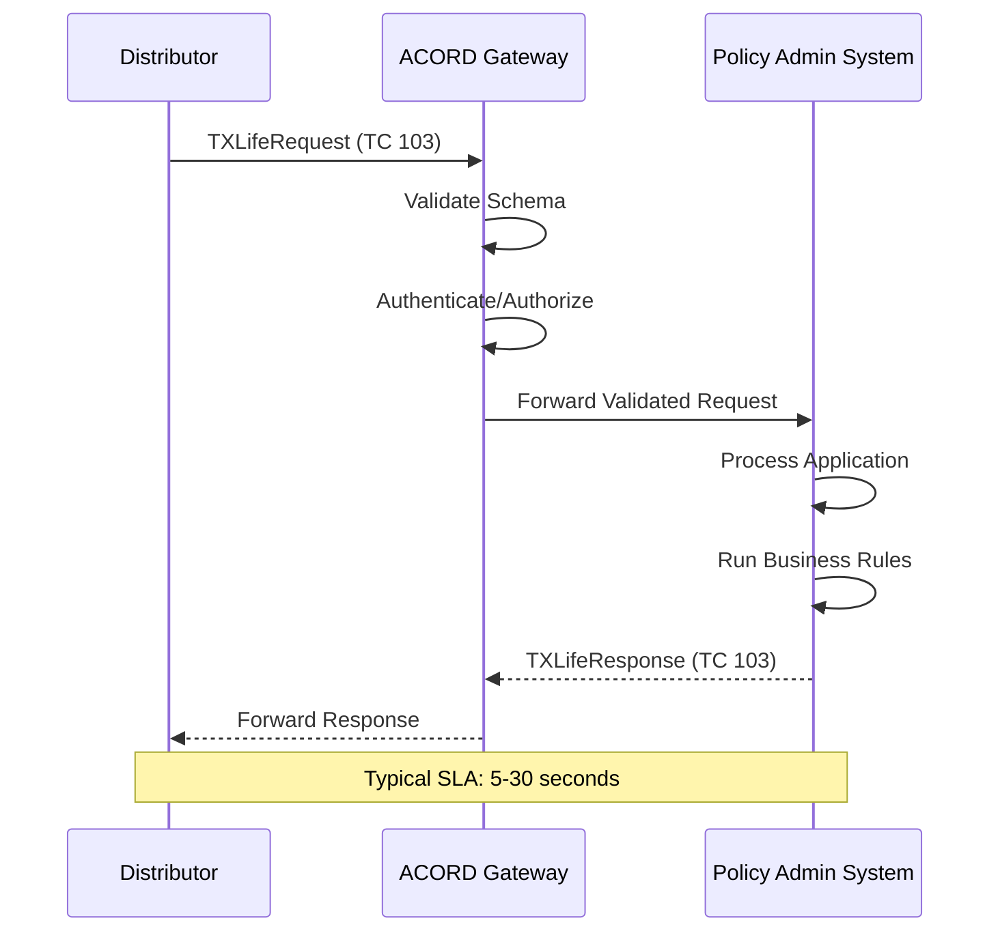

**Characteristics:**
- Sender blocks waiting for response.
- Timeout policies typically 30–120 seconds.
- Must be idempotent — same TransRefGUID yields same result.
- Used for: Quotes (100), applications (103), inquiries (600s), real-time changes (121).

### 5.2 Notification (Unsolicited/Asynchronous)

The sender pushes a notification without expecting a synchronous response.

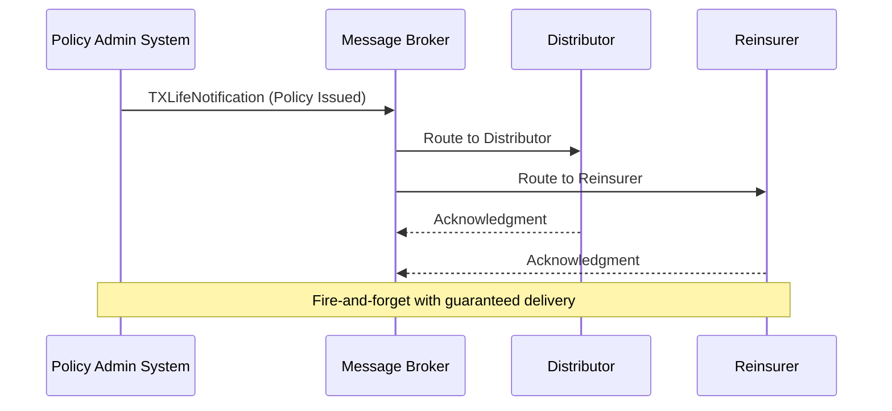

**Characteristics:**
- Producer does not wait for business-level response.
- Message broker provides guaranteed delivery, retry, and DLQ.
- Used for: Policy issue notifications (119), claim payments (156), status changes.

### 5.3 Inquiry Pattern

Optimized for data retrieval with search criteria and pagination.

```xml
<TXLifeRequest>
  <TransType tc="601">Policy Summary</TransType>
  <TransMode tc="2">Original</TransMode>
  <InquiryLevel tc="3">ObjectAndChildren</InquiryLevel>
  <InquiryView>
    <InquiryViewTypeCode tc="1">Full</InquiryViewTypeCode>
    <FilterCriteria>
      <PolNumber>LIF-2025-00012345</PolNumber>
    </FilterCriteria>
  </InquiryView>
  <MaxRecords>50</MaxRecords>
  <StartRecord>1</StartRecord>
</TXLifeRequest>
```

### 5.4 Batch Processing

Multiple transactions bundled in a single file for batch processing.

```xml
<TXLife>
  <TXLifeRequest PrimaryObjectID="Holding_1">
    <TransRefGUID>batch-guid-001</TransRefGUID>
    <TransType tc="508">Billing Inquiry</TransType>
    <!-- First billing record -->
  </TXLifeRequest>
  <TXLifeRequest PrimaryObjectID="Holding_2">
    <TransRefGUID>batch-guid-002</TransRefGUID>
    <TransType tc="508">Billing Inquiry</TransType>
    <!-- Second billing record -->
  </TXLifeRequest>
  <!-- ... hundreds or thousands of records ... -->
</TXLife>
```

**Batch Processing Architecture:**

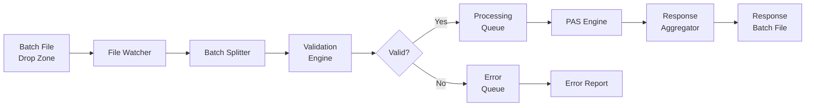

### 5.5 Real-Time vs Batch Decision Matrix

| Factor | Real-Time | Batch |
|--------|-----------|-------|
| Latency Requirement | < 30 seconds | Hours to next business day |
| Volume | < 100 TPS | Millions per run |
| Error Handling | Immediate feedback | Post-processing report |
| Use Cases | Quotes, inquiries, urgent changes | Daily billing, mass updates, reporting |
| Infrastructure | API Gateway, Load Balancer | File Transfer, Job Scheduler |
| SLA Monitoring | Per-transaction | Per-batch run |

---

## 6. ACORD TXLife XML Schema

### 6.1 Namespace Structure

```xml
<?xml version="1.0" encoding="UTF-8"?>
<TXLife
  xmlns="http://ACORD.org/Standards/Life/2"
  xmlns:xsi="http://www.w3.org/2001/XMLSchema-instance"
  xsi:schemaLocation="http://ACORD.org/Standards/Life/2 TXLife2.43.00.xsd"
  Version="2.43.00">
  <!-- Transaction content -->
</TXLife>
```

**Namespace conventions:**
- Primary namespace: `http://ACORD.org/Standards/Life/2` (the "2" denotes the 2.x major version series)
- Vendor extensions: `http://ACORD.org/Standards/Life/2/vendor/{VendorName}`
- Custom extensions: Carrier-specific namespaces for OLifEExtension blocks

### 6.2 Schema Versioning

ACORD follows a three-part versioning scheme: `Major.Minor.Patch`

| Component | Meaning | Example |
|-----------|---------|---------|
| Major | Breaking changes (rare — last was 1.x to 2.x) | 2 |
| Minor | New elements, new codes, new transaction types | 43 |
| Patch | Bug fixes, clarifications, minor code table updates | 00 |

**Version History (Recent):**

| Version | Release Date | Key Changes |
|---------|-------------|-------------|
| 2.38.00 | 2019-Q1 | Enhanced annuity living benefit riders |
| 2.39.00 | 2019-Q3 | NAIC 2019 CSO mortality table support |
| 2.40.00 | 2020-Q1 | Digital application enhancements, e-signature |
| 2.41.00 | 2021-Q1 | COVID-related underwriting elements |
| 2.42.00 | 2022-Q2 | Real-time settlement option enhancements |
| 2.43.00 | 2023-Q1 | JSON Schema parallel publication, API alignment |

**Backward Compatibility Rules:**
1. New optional elements may be added in any minor release.
2. New required elements are never added to existing structures (would break backward compatibility).
3. Existing elements are never removed — only deprecated.
4. Code table values are never removed — only deprecated with a deprecation date.
5. Data type widening is permitted (e.g., String(20) → String(30)) but not narrowing.

### 6.3 Extension Mechanisms

#### OLifEExtension

The primary extension point for adding non-standard data. Every major object in the model contains an OLifEExtension element.

```xml
<Party id="Party_1">
  <PartyTypeCode tc="1">Person</PartyTypeCode>
  <Person>
    <FirstName>John</FirstName>
    <LastName>Smith</LastName>
  </Person>
  <OLifEExtension VendorCode="ACME" ExtensionCode="Party">
    <CustomerSegment>HNW</CustomerSegment>
    <OnboardingChannel>Digital</OnboardingChannel>
    <DigitalConsentTimestamp>2024-12-20T14:32:00Z</DigitalConsentTimestamp>
    <RiskScore>742</RiskScore>
    <PEPIndicator>false</PEPIndicator>
    <SanctionsScreenDate>2024-12-20</SanctionsScreenDate>
    <SanctionsScreenResult>Clear</SanctionsScreenResult>
  </OLifEExtension>
</Party>
```

**Extension Design Best Practices:**
- Always use a registered VendorCode.
- Namespace-qualify extension elements.
- Provide XSD for extensions to enable validation.
- Document extension usage in implementation guides.
- Use extensions sparingly — prefer standard elements when available.

#### Vendor Extensions

Carriers and vendors can register named extension blocks:

```xml
<Policy>
  <PolNumber>LIF-2025-001</PolNumber>
  <OLifEExtension VendorCode="CARRIER_A" ExtensionCode="PolicyExtension">
    <xmlns:ca="http://www.carrier-a.com/acord/extension">
      <ca:InternalRiskClass>4A-PREF-ELITE</ca:InternalRiskClass>
      <ca:PricingModel>2024-CSO-SELECT</ca:PricingModel>
      <ca:AdminSystemCode>LIFEPRO</ca:AdminSystemCode>
      <ca:LegacyPolicyNumber>OLD-12345</ca:LegacyPolicyNumber>
      <ca:ReinsurancePool>POOL-A-AUTO</ca:ReinsurancePool>
    </xmlns:ca>
  </OLifEExtension>
</Policy>
```

### 6.4 Code Resolution — OLI_ Type Codes

ACORD uses a type code system (prefixed with `OLI_` in documentation) where enumerated values are represented as numeric `tc` attributes with descriptive text content.

```xml
<!-- Pattern: tc attribute contains the numeric code, element text is descriptive -->
<PolicyStatus tc="1">Active</PolicyStatus>
<PolicyStatus tc="12">Lapsed</PolicyStatus>
<PolicyStatus tc="35">Pending Issue</PolicyStatus>
```

The `tc` attribute is the authoritative value — the text content is informational only and may vary by implementation.

---

## 7. OLI Type Codes — Exhaustive Reference

### 7.1 Policy Status (OLI_POLSTAT)

| tc | Code Name | Description |
|----|-----------|-------------|
| 1 | Active | Policy is in force and current |
| 2 | Inactive | Policy is not currently active |
| 3 | Proposed | Application submitted, not yet issued |
| 4 | Pending | Pending underwriting or other processing |
| 5 | Approved | Approved, pending delivery |
| 6 | Terminated | Policy has been terminated |
| 7 | Declined | Application was declined |
| 8 | Incomplete | Application is incomplete |
| 9 | Cancelled | Policy was cancelled |
| 10 | Surrendered | Policy was voluntarily surrendered |
| 11 | PaidUp | Policy is paid-up (no further premiums due) |
| 12 | Lapsed | Policy lapsed due to non-payment |
| 13 | Extended Term | Converted to extended term insurance |
| 14 | Reduced Paid-Up | Converted to reduced paid-up |
| 15 | Death Claim | Insured has died, claim in process |
| 16 | Matured | Policy has reached maturity date |
| 17 | Converted | Term policy converted to permanent |
| 18 | Rescinded | Policy rescinded (fraud/material misrepresentation) |
| 19 | Not Taken | Policy offered but not accepted |
| 20 | Withdrawn | Application withdrawn by applicant |
| 21 | Postponed | Underwriting postponed |
| 22 | Free Look Return | Returned during free look period |
| 23 | In Contest | Under contestability review |
| 24 | Annuitized | Annuity has been annuitized |
| 25 | Disability Waiver | Premium being waived due to disability |
| 30 | Grace Period | Policy in grace period |
| 35 | Pending Issue | Approved, awaiting issuance |
| 40 | RPU | Reduced Paid-Up |
| 41 | ETI | Extended Term Insurance |
| 50 | Pending Reinstatement | Reinstatement request in process |

### 7.2 Product Type (OLI_PRODTYPE)

| tc | Code Name | Description |
|----|-----------|-------------|
| 1 | Whole Life | Whole life insurance |
| 2 | Term Life | Term life insurance |
| 3 | Universal Life | Universal life insurance |
| 4 | Variable Life | Variable life insurance |
| 5 | Variable Universal Life | VUL |
| 6 | Indexed Universal Life | IUL |
| 7 | Endowment | Endowment policy |
| 8 | Fixed Annuity | Fixed deferred annuity |
| 9 | Variable Annuity | Variable deferred annuity |
| 10 | Fixed Indexed Annuity | FIA/EIA |
| 11 | Immediate Annuity (SPIA) | Single premium immediate annuity |
| 12 | Deferred Income Annuity (DIA) | QLAC/DIA |
| 13 | RILA | Registered index-linked annuity |
| 14 | Group Term Life | Group term life |
| 15 | Group Universal Life | Group UL |
| 16 | Group Variable Universal Life | Group VUL |
| 17 | Credit Life | Credit life insurance |
| 18 | Final Expense | Simplified issue whole life |
| 19 | Pre-Need | Pre-need funeral insurance |
| 20 | Juvenile Life | Life insurance for minors |
| 21 | Key Person Life | Key-man life insurance |
| 22 | Buy-Sell Agreement | Business succession planning |
| 23 | COLI | Corporate-owned life insurance |
| 24 | BOLI | Bank-owned life insurance |

### 7.3 Coverage Type (OLI_LIFECOVTYPE)

| tc | Code Name |
|----|-----------|
| 1 | Whole Life |
| 2 | Term |
| 3 | Universal Life |
| 4 | Endowment |
| 5 | Variable Life |
| 6 | Variable Universal Life |
| 7 | Accidental Death |
| 8 | Accidental Death & Dismemberment |
| 9 | Children's Term Rider |
| 10 | Cost of Living Rider |
| 11 | Disability Income |
| 12 | Guaranteed Insurability |
| 13 | Waiver of Premium |
| 14 | Other Insured Rider |
| 15 | Return of Premium Rider |
| 16 | Long Term Care Rider |
| 17 | Critical Illness Rider |
| 18 | Chronic Illness Rider |
| 19 | Indexed Universal Life |
| 20 | Term Conversion Rider |

### 7.4 Underwriting Status (OLI_UWSTATUS)

| tc | Code Name | Description |
|----|-----------|-------------|
| 1 | Not Started | UW review not yet initiated |
| 2 | In Review | Active underwriting |
| 3 | Pending Requirements | Waiting for information |
| 4 | Medical Review | In medical underwriting |
| 5 | Financial Review | In financial underwriting |
| 6 | Approved Standard | Approved at standard rates |
| 7 | Approved Preferred | Approved at preferred rates |
| 8 | Approved Preferred Plus | Super preferred |
| 9 | Approved Substandard | Rated — table rating or flat extra |
| 10 | Approved Modified | Approved with modifications |
| 11 | Declined | Application declined |
| 12 | Postponed | Decision postponed |
| 13 | Counter-Offer | Different terms offered |
| 14 | Incomplete | Insufficient info for decision |
| 15 | Referred | Referred to senior underwriter |
| 16 | Auto-Approved | Straight-through processing |
| 17 | Pending Reinsurance | Awaiting reinsurance approval |
| 18 | Withdrawn | Applicant withdrew |

### 7.5 Requirement Type (OLI_REQCODE)

| tc | Code Name |
|----|-----------|
| 1 | Application Part 1 |
| 2 | Application Part 2 |
| 10 | Medical Records (APS) |
| 11 | Paramedical Exam |
| 12 | Full Medical Exam |
| 13 | Blood Profile |
| 14 | Urinalysis |
| 15 | Treadmill/Stress Test |
| 16 | EKG/ECG |
| 17 | Chest X-Ray |
| 20 | MIB Check |
| 21 | MVR (Motor Vehicle Record) |
| 22 | Rx Database Check |
| 23 | Credit Check |
| 24 | Criminal Background Check |
| 30 | Financial Statement |
| 31 | Tax Returns |
| 32 | Third-Party Verification |
| 33 | Existing Coverage Verification |
| 40 | Phone Interview |
| 41 | Inspection Report |
| 42 | Foreign Travel Questionnaire |
| 43 | Aviation Questionnaire |
| 44 | Hazardous Occupation Questionnaire |
| 50 | HIPAA Authorization |
| 51 | State Replacement Forms |
| 52 | Suitability Form |
| 53 | Beneficiary Designation Form |
| 60 | Agent Report/Certification |
| 100 | Paramedical Exam (Alternate) |
| 200 | E-Application Signature |

### 7.6 Payment Mode (OLI_PAYMODE)

| tc | Code Name |
|----|-----------|
| 1 | Annual |
| 2 | Semi-Annual |
| 3 | Quarterly |
| 4 | Monthly |
| 5 | Weekly |
| 6 | Bi-Weekly |
| 7 | Single Premium |
| 8 | Flex Premium (UL) |
| 9 | PAC (Pre-Authorized Check) |

### 7.7 Relationship Role (OLI_REL_ROLE)

| tc | Code Name |
|----|-----------|
| 1 | Spouse |
| 2 | Child |
| 3 | Parent |
| 4 | Sibling |
| 5 | Insured |
| 6 | Joint Insured |
| 7 | Annuitant |
| 8 | Owner |
| 9 | Joint Owner |
| 10 | Contingent Owner |
| 11 | Payor |
| 12 | Employer |
| 13 | Trust |
| 34 | Beneficiary |
| 35 | Contingent Beneficiary |
| 37 | Writing Agent |
| 38 | Service Agent |
| 39 | General Agent |
| 40 | Managing General Agent |
| 41 | Trustee |
| 42 | Attorney |
| 43 | Guardian |
| 44 | Custodian |
| 45 | Third Party Administrator |
| 46 | Power of Attorney |
| 67 | Irrevocable Beneficiary |

---

## 8. ACORD 103 Deep Dive — New Application

### 8.1 Overview

TransType 103 (New Business Submission) is the most complex and commonly used ACORD transaction. It carries a complete insurance application from a distributor or enrollment platform to a carrier's policy administration system.

### 8.2 Message Architecture

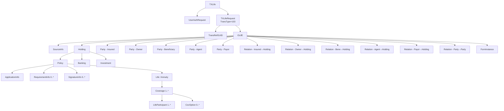

### 8.3 Required vs Optional Sections

| Section | Req | Condition |
|---------|-----|-----------|
| SourceInfo | Y | Always required |
| Holding | Y | At least one |
| Holding/Policy | Y | Always within Holding |
| Policy/ApplicationInfo | Y | Required for new business |
| Policy/Life or Policy/Annuity | Y | Based on product type |
| Life/Coverage (base) | Y | At least one base coverage |
| Coverage/LifeParticipant | Y | At least one participant |
| Party (insured) | Y | At least one insured party |
| Party (owner) | Y | Owner (may be same as insured) |
| Party/Person or Organization | Y | Based on party type |
| Party/Address | Y | At least home address |
| Relation (insured-to-holding) | Y | Links insured to policy |
| Relation (owner-to-holding) | Y | Links owner to policy |
| Party (beneficiary) | C | Required unless trust/estate |
| Relation (beneficiary) | C | With beneficiary party |
| Party (agent) | C | Required for commissionable business |
| Party/Risk | C | If medical UW required |
| Holding/Banking | C | If EFT payment method |
| Holding/Investment | C | If variable product |
| SignatureInfo | C | If e-signature captured |
| FormInstance | N | Attached documents |
| RequirementInfo | N | Pre-ordered requirements |

### 8.4 Complete 103 XML Example

```xml
<?xml version="1.0" encoding="UTF-8"?>
<TXLife
  xmlns="http://ACORD.org/Standards/Life/2"
  xmlns:xsi="http://www.w3.org/2001/XMLSchema-instance"
  Version="2.43.00">

  <!-- Authentication -->
  <UserAuthRequest>
    <UserLoginName>distributor_api_user</UserLoginName>
    <UserPswd>
      <CryptType tc="2">SHA-256</CryptType>
      <Pswd>e3b0c44298fc1c149afbf4c8996fb924</Pswd>
    </UserPswd>
  </UserAuthRequest>

  <!-- Request Envelope -->
  <TXLifeRequest PrimaryObjectID="Holding_1">
    <TransRefGUID>f47ac10b-58cc-4372-a567-0e02b2c3d479</TransRefGUID>
    <TransType tc="103">New Business Submission</TransType>
    <TransSubType tc="10301">New Application</TransSubType>
    <TransExeDate>2025-01-15</TransExeDate>
    <TransExeTime>14:30:00Z</TransExeTime>
    <TransMode tc="2">Original</TransMode>
    <NoResponseOK tc="0">false</NoResponseOK>

    <OLifE>
      <!-- Source System Identification -->
      <SourceInfo>
        <CreationDate>2025-01-15</CreationDate>
        <CreationTime>14:30:00</CreationTime>
        <SourceInfoName>AgentPortal-v3.2</SourceInfoName>
        <SourceInfoDescription>ABC Insurance Distribution Platform</SourceInfoDescription>
        <FileControlID>AP-2025-01-15-00001</FileControlID>
      </SourceInfo>

      <!-- ================================================ -->
      <!-- HOLDING — Policy Container                       -->
      <!-- ================================================ -->
      <Holding id="Holding_1">
        <HoldingTypeCode tc="2">Policy</HoldingTypeCode>
        <HoldingStatus tc="3">Proposed</HoldingStatus>
        <HoldingForm tc="1">Individual</HoldingForm>
        <CurrencyTypeCode tc="840">USD</CurrencyTypeCode>
        <Purpose tc="1">Personal Insurance</Purpose>

        <!-- ============================================== -->
        <!-- POLICY                                        -->
        <!-- ============================================== -->
        <Policy>
          <LineOfBusiness tc="1">Life</LineOfBusiness>
          <ProductType tc="3">Universal Life</ProductType>
          <ProductCode>IUL-ACCUM-2025</ProductCode>
          <CarrierCode>ACME</CarrierCode>
          <PlanName>Accumulation IUL Premier</PlanName>
          <PolicyStatus tc="3">Proposed</PolicyStatus>
          <Jurisdiction tc="37">New York</Jurisdiction>
          <IssueNation tc="1">USA</IssueNation>
          <PaymentMode tc="4">Monthly</PaymentMode>
          <PaymentMethod tc="7">EFT</PaymentMethod>
          <PaymentAmt>850.00</PaymentAmt>
          <AnnualPremAmt>10200.00</AnnualPremAmt>
          <MinPremiumInitialAmt>850.00</MinPremiumInitialAmt>
          <TargetPremAmt>10200.00</TargetPremAmt>
          <NonFortProvision tc="3">Extended Term Insurance</NonFortProvision>

          <!-- Application Information -->
          <ApplicationInfo>
            <TrackingID>APP-2025-IUL-00001</TrackingID>
            <ApplicationType tc="1">New</ApplicationType>
            <FormalAppInd tc="1">true</FormalAppInd>
            <SignedDate>2025-01-10</SignedDate>
            <ApplicationJurisdiction tc="37">New York</ApplicationJurisdiction>
            <AppSource tc="2">Agent Portal</AppSource>
            <SubmitDate>2025-01-15</SubmitDate>
            <ReplacementInd tc="0">false</ReplacementInd>
            <MECInd tc="0">false</MECInd>
            <Section1035Ind tc="0">false</Section1035Ind>
          </ApplicationInfo>

          <!-- Underwriting Requirements -->
          <RequirementInfo id="Req_1">
            <ReqCode tc="11">Paramedical Exam</ReqCode>
            <ReqStatus tc="1">Ordered</ReqStatus>
            <RequestedDate>2025-01-15</RequestedDate>
            <RequiredInd tc="1">true</RequiredInd>
            <ReqVendorCode>EMSI</ReqVendorCode>
          </RequirementInfo>
          <RequirementInfo id="Req_2">
            <ReqCode tc="13">Blood Profile</ReqCode>
            <ReqStatus tc="1">Ordered</ReqStatus>
            <RequestedDate>2025-01-15</RequestedDate>
            <RequiredInd tc="1">true</RequiredInd>
          </RequirementInfo>
          <RequirementInfo id="Req_3">
            <ReqCode tc="20">MIB Check</ReqCode>
            <ReqStatus tc="3">Received</ReqStatus>
            <RequestedDate>2025-01-15</RequestedDate>
            <FulfilledDate>2025-01-15</FulfilledDate>
          </RequirementInfo>
          <RequirementInfo id="Req_4">
            <ReqCode tc="22">Rx Database Check</ReqCode>
            <ReqStatus tc="3">Received</ReqStatus>
            <RequestedDate>2025-01-15</RequestedDate>
            <FulfilledDate>2025-01-15</FulfilledDate>
          </RequirementInfo>
          <RequirementInfo id="Req_5">
            <ReqCode tc="50">HIPAA Authorization</ReqCode>
            <ReqStatus tc="3">Received</ReqStatus>
            <RequestedDate>2025-01-10</RequestedDate>
            <FulfilledDate>2025-01-10</FulfilledDate>
          </RequirementInfo>

          <!-- Signatures -->
          <SignatureInfo>
            <SignatureRoleCode tc="8">Owner</SignatureRoleCode>
            <SignatureDate>2025-01-10</SignatureDate>
            <SignatureCity>Brooklyn</SignatureCity>
            <SignatureState tc="37">New York</SignatureState>
            <SignatureOK tc="1">Signed</SignatureOK>
            <SignatureType tc="3">Electronic</SignatureType>
          </SignatureInfo>
          <SignatureInfo>
            <SignatureRoleCode tc="5">Insured</SignatureRoleCode>
            <SignatureDate>2025-01-10</SignatureDate>
            <SignatureCity>Brooklyn</SignatureCity>
            <SignatureState tc="37">New York</SignatureState>
            <SignatureOK tc="1">Signed</SignatureOK>
            <SignatureType tc="3">Electronic</SignatureType>
          </SignatureInfo>
          <SignatureInfo>
            <SignatureRoleCode tc="37">Writing Agent</SignatureRoleCode>
            <SignatureDate>2025-01-10</SignatureDate>
            <SignatureCity>Brooklyn</SignatureCity>
            <SignatureState tc="37">New York</SignatureState>
            <SignatureOK tc="1">Signed</SignatureOK>
            <SignatureType tc="3">Electronic</SignatureType>
          </SignatureInfo>

          <!-- ============================================ -->
          <!-- LIFE INSURANCE PRODUCT DETAIL               -->
          <!-- ============================================ -->
          <Life>
            <FaceAmt>1000000.00</FaceAmt>
            <TotalFaceAmt>1250000.00</TotalFaceAmt>
            <InitialPremAmt>10200.00</InitialPremAmt>
            <QualPlanType tc="1">Non-Qualified</QualPlanType>
            <IndividualOrJoint tc="1">Individual</IndividualOrJoint>

            <!-- Base Coverage -->
            <Coverage id="Cov_Base">
              <IndicatorCode tc="1">Base</IndicatorCode>
              <LifeCovTypeCode tc="19">Indexed Universal Life</LifeCovTypeCode>
              <LifeCovStatus tc="3">Proposed</LifeCovStatus>
              <CurrentAmt>1000000.00</CurrentAmt>
              <InitCovAmt>1000000.00</InitCovAmt>
              <ModalPremAmt>750.00</ModalPremAmt>
              <AnnualPremAmt>9000.00</AnnualPremAmt>
              <EffDate>2025-02-01</EffDate>
              <DeathBenefitOptType tc="1">Level</DeathBenefitOptType>
              <LivesType tc="1">SingleLife</LivesType>

              <LifeParticipant id="LP_Base_1">
                <PartyID>Party_Insured1</PartyID>
                <LifeParticipantRoleCode tc="1">Primary Insured</LifeParticipantRoleCode>
                <IssueAge>35</IssueAge>
                <IssueGender tc="1">Male</IssueGender>
                <SmokerStat tc="1">NonSmoker</SmokerStat>
                <UnderwritingClass tc="1">Preferred Plus</UnderwritingClass>
                <PermTableRating tc="1">Standard</PermTableRating>
              </LifeParticipant>

              <!-- Index Accounts -->
              <CovOption id="IdxAcct_SP500">
                <LifeCovOptTypeCode tc="120">Index Account - S&P 500</LifeCovOptTypeCode>
                <OptionStatus tc="3">Proposed</OptionStatus>
                <AllocPercent>60</AllocPercent>
                <CapRate>0.10</CapRate>
                <FloorRate>0.00</FloorRate>
                <ParticipationRate>1.00</ParticipationRate>
              </CovOption>
              <CovOption id="IdxAcct_Fixed">
                <LifeCovOptTypeCode tc="121">Fixed Account</LifeCovOptTypeCode>
                <OptionStatus tc="3">Proposed</OptionStatus>
                <AllocPercent>40</AllocPercent>
                <GuaranteedRate>0.02</GuaranteedRate>
                <CurrentRate>0.04</CurrentRate>
              </CovOption>
            </Coverage>

            <!-- Rider: Accidental Death Benefit -->
            <Coverage id="Cov_ADB">
              <IndicatorCode tc="2">Rider</IndicatorCode>
              <LifeCovTypeCode tc="7">Accidental Death</LifeCovTypeCode>
              <LifeCovStatus tc="3">Proposed</LifeCovStatus>
              <CurrentAmt>250000.00</CurrentAmt>
              <ModalPremAmt>15.00</ModalPremAmt>
              <AnnualPremAmt>180.00</AnnualPremAmt>
              <EffDate>2025-02-01</EffDate>
              <TermDate>2055-02-01</TermDate>
              <LifeParticipant id="LP_ADB_1">
                <PartyID>Party_Insured1</PartyID>
                <LifeParticipantRoleCode tc="1">Primary Insured</LifeParticipantRoleCode>
              </LifeParticipant>
            </Coverage>

            <!-- Rider: Waiver of Premium -->
            <Coverage id="Cov_WOP">
              <IndicatorCode tc="2">Rider</IndicatorCode>
              <LifeCovTypeCode tc="13">Waiver of Premium</LifeCovTypeCode>
              <LifeCovStatus tc="3">Proposed</LifeCovStatus>
              <ModalPremAmt>25.00</ModalPremAmt>
              <AnnualPremAmt>300.00</AnnualPremAmt>
              <EffDate>2025-02-01</EffDate>
              <TermDate>2055-02-01</TermDate>
              <LifeParticipant id="LP_WOP_1">
                <PartyID>Party_Insured1</PartyID>
                <LifeParticipantRoleCode tc="1">Primary Insured</LifeParticipantRoleCode>
              </LifeParticipant>
            </Coverage>

            <!-- Rider: Chronic Illness Accelerated Benefit -->
            <Coverage id="Cov_CIAB">
              <IndicatorCode tc="2">Rider</IndicatorCode>
              <LifeCovTypeCode tc="18">Chronic Illness Rider</LifeCovTypeCode>
              <LifeCovStatus tc="3">Proposed</LifeCovStatus>
              <CurrentAmt>500000.00</CurrentAmt>
              <ModalPremAmt>60.00</ModalPremAmt>
              <AnnualPremAmt>720.00</AnnualPremAmt>
              <EffDate>2025-02-01</EffDate>
              <LifeParticipant id="LP_CIAB_1">
                <PartyID>Party_Insured1</PartyID>
                <LifeParticipantRoleCode tc="1">Primary Insured</LifeParticipantRoleCode>
              </LifeParticipant>
            </Coverage>
          </Life>
        </Policy>

        <!-- ============================================== -->
        <!-- BANKING / EFT                                 -->
        <!-- ============================================== -->
        <Banking id="Banking_1">
          <BankingStatus tc="1">Active</BankingStatus>
          <AccountNumber>XXXX4567</AccountNumber>
          <RoutingNum>021000089</RoutingNum>
          <AcctHolderName>John M Smith</AcctHolderName>
          <BankAcctType tc="1">Checking</BankAcctType>
          <CreditDebitType tc="2">Debit</CreditDebitType>
          <BankName>Chase Bank</BankName>
          <InitialPremBankInd tc="1">true</InitialPremBankInd>
          <DraftDayOfMonth>15</DraftDayOfMonth>
        </Banking>
      </Holding>

      <!-- ================================================ -->
      <!-- PARTIES                                          -->
      <!-- ================================================ -->

      <!-- Insured / Owner -->
      <Party id="Party_Insured1">
        <PartyTypeCode tc="1">Person</PartyTypeCode>
        <GovtID>123-45-6789</GovtID>
        <GovtIDTC tc="1">SSN</GovtIDTC>
        <ResidenceState tc="37">New York</ResidenceState>
        <ResidenceCountry tc="1">USA</ResidenceCountry>
        <Person>
          <FirstName>John</FirstName>
          <MiddleName>Michael</MiddleName>
          <LastName>Smith</LastName>
          <Prefix>Mr</Prefix>
          <Gender tc="1">Male</Gender>
          <BirthDate>1990-03-15</BirthDate>
          <Age>35</Age>
          <MarStat tc="1">Married</MarStat>
          <Citizenship tc="1">US Citizen</Citizenship>
          <BirthCountry tc="1">USA</BirthCountry>
          <BirthJurisdiction tc="37">New York</BirthJurisdiction>
          <Occupation>Software Engineering Manager</Occupation>
          <OccupClass tc="1">Professional</OccupClass>
          <AnnualIncome>225000.00</AnnualIncome>
          <NetWorth>1500000.00</NetWorth>
          <Height2>
            <MeasureUnits tc="1">Inches</MeasureUnits>
            <MeasureValue>72</MeasureValue>
          </Height2>
          <Weight2>
            <MeasureUnits tc="1">Pounds</MeasureUnits>
            <MeasureValue>185</MeasureValue>
          </Weight2>
        </Person>
        <Address id="Addr_Ins_Home">
          <AddressTypeCode tc="1">Home</AddressTypeCode>
          <Line1>123 Oak Street</Line1>
          <Line2>Apt 4B</Line2>
          <City>Brooklyn</City>
          <AddressStateTC tc="37">NY</AddressStateTC>
          <Zip>11201</Zip>
          <AddressCountryTC tc="1">USA</AddressCountryTC>
        </Address>
        <Phone id="Phone_Ins_Mobile">
          <PhoneTypeCode tc="17">Mobile</PhoneTypeCode>
          <AreaCode>917</AreaCode>
          <DialNumber>555-0456</DialNumber>
          <PrefPhone tc="1">true</PrefPhone>
        </Phone>
        <EMailAddress id="Email_Ins_1">
          <EMailType tc="1">Personal</EMailType>
          <AddrLine>john.smith@email.com</AddrLine>
          <PrefEMailAddr tc="1">true</PrefEMailAddr>
        </EMailAddress>
        <Risk>
          <TobaccoInd tc="0">false</TobaccoInd>
          <TobaccoPremBasis tc="2">NonTobacco</TobaccoPremBasis>
          <SubstanceUsage id="SU_1">
            <SubstanceType tc="1">Alcohol</SubstanceType>
            <FrequencyPerWeek>3</FrequencyPerWeek>
            <DrinksPerOccasion>2</DrinksPerOccasion>
          </SubstanceUsage>
          <FamilyHistory id="FH_1">
            <FamilyRelation tc="3">Father</FamilyRelation>
            <ConditionType tc="1">Heart Disease</ConditionType>
            <AgeAtOnset>62</AgeAtOnset>
            <LivingInd tc="1">true</LivingInd>
            <CurrentAge>68</CurrentAge>
          </FamilyHistory>
          <FamilyHistory id="FH_2">
            <FamilyRelation tc="4">Mother</FamilyRelation>
            <LivingInd tc="1">true</LivingInd>
            <CurrentAge>65</CurrentAge>
          </FamilyHistory>
        </Risk>
      </Party>

      <!-- Primary Beneficiary: Spouse -->
      <Party id="Party_Spouse">
        <PartyTypeCode tc="1">Person</PartyTypeCode>
        <GovtID>987-65-4321</GovtID>
        <GovtIDTC tc="1">SSN</GovtIDTC>
        <Person>
          <FirstName>Jane</FirstName>
          <MiddleName>Marie</MiddleName>
          <LastName>Smith</LastName>
          <Gender tc="2">Female</Gender>
          <BirthDate>1991-07-22</BirthDate>
        </Person>
        <Address id="Addr_Spouse_Home">
          <AddressTypeCode tc="1">Home</AddressTypeCode>
          <Line1>123 Oak Street</Line1>
          <Line2>Apt 4B</Line2>
          <City>Brooklyn</City>
          <AddressStateTC tc="37">NY</AddressStateTC>
          <Zip>11201</Zip>
          <AddressCountryTC tc="1">USA</AddressCountryTC>
        </Address>
        <Phone id="Phone_Sp_1">
          <PhoneTypeCode tc="17">Mobile</PhoneTypeCode>
          <DialNumber>917-555-0789</DialNumber>
        </Phone>
      </Party>

      <!-- Contingent Beneficiary: Trust -->
      <Party id="Party_Trust">
        <PartyTypeCode tc="2">Organization</PartyTypeCode>
        <Organization>
          <OrgForm tc="6">Trust</OrgForm>
          <DBA>The Smith Family Irrevocable Trust</DBA>
          <EstabDate>2024-06-15</EstabDate>
        </Organization>
      </Party>

      <!-- Writing Agent -->
      <Party id="Party_Agent1">
        <PartyTypeCode tc="1">Person</PartyTypeCode>
        <GovtID>111-22-3333</GovtID>
        <GovtIDTC tc="1">SSN</GovtIDTC>
        <Person>
          <FirstName>Robert</FirstName>
          <LastName>Johnson</LastName>
        </Person>
        <Producer>
          <CarrierAppointment>
            <CompanyProducerID>AGT-NY-00567</CompanyProducerID>
            <CarrierCode>ACME</CarrierCode>
            <AppointmentStatus tc="1">Active</AppointmentStatus>
          </CarrierAppointment>
          <NIPRNumber>12345678</NIPRNumber>
          <StateLicenseInfo>
            <StateLicenseState tc="37">New York</StateLicenseState>
            <LicenseNum>LA-1234567</LicenseNum>
            <LicenseStatus tc="1">Active</LicenseStatus>
            <LicenseType tc="1">Life</LicenseType>
            <LicenseExpDate>2026-12-31</LicenseExpDate>
          </StateLicenseInfo>
        </Producer>
      </Party>

      <!-- Supervising Agent -->
      <Party id="Party_Agent2">
        <PartyTypeCode tc="1">Person</PartyTypeCode>
        <Person>
          <FirstName>Sarah</FirstName>
          <LastName>Williams</LastName>
        </Person>
        <Producer>
          <CarrierAppointment>
            <CompanyProducerID>AGT-NY-00123</CompanyProducerID>
            <CarrierCode>ACME</CarrierCode>
          </CarrierAppointment>
        </Producer>
      </Party>

      <!-- ================================================ -->
      <!-- RELATIONS                                        -->
      <!-- ================================================ -->

      <!-- Insured → Holding -->
      <Relation id="Rel_InsuredToHolding">
        <OriginatingObjectID>Party_Insured1</OriginatingObjectID>
        <OriginatingObjectType tc="6">Party</OriginatingObjectType>
        <RelatedObjectID>Holding_1</RelatedObjectID>
        <RelatedObjectType tc="4">Holding</RelatedObjectType>
        <RelationRoleCode tc="5">Insured</RelationRoleCode>
      </Relation>

      <!-- Owner → Holding -->
      <Relation id="Rel_OwnerToHolding">
        <OriginatingObjectID>Party_Insured1</OriginatingObjectID>
        <OriginatingObjectType tc="6">Party</OriginatingObjectType>
        <RelatedObjectID>Holding_1</RelatedObjectID>
        <RelatedObjectType tc="4">Holding</RelatedObjectType>
        <RelationRoleCode tc="8">Owner</RelationRoleCode>
      </Relation>

      <!-- Payor → Holding -->
      <Relation id="Rel_PayorToHolding">
        <OriginatingObjectID>Party_Insured1</OriginatingObjectID>
        <OriginatingObjectType tc="6">Party</OriginatingObjectType>
        <RelatedObjectID>Holding_1</RelatedObjectID>
        <RelatedObjectType tc="4">Holding</RelatedObjectType>
        <RelationRoleCode tc="11">Payor</RelationRoleCode>
      </Relation>

      <!-- Primary Beneficiary → Holding -->
      <Relation id="Rel_PrimBeneToHolding">
        <OriginatingObjectID>Party_Spouse</OriginatingObjectID>
        <OriginatingObjectType tc="6">Party</OriginatingObjectType>
        <RelatedObjectID>Holding_1</RelatedObjectID>
        <RelatedObjectType tc="4">Holding</RelatedObjectType>
        <RelationRoleCode tc="34">Beneficiary</RelationRoleCode>
        <BeneficiaryDesignation tc="1">Primary</BeneficiaryDesignation>
        <InterestPercent>100</InterestPercent>
        <BeneficiaryDistOption tc="1">Lump Sum</BeneficiaryDistOption>
      </Relation>

      <!-- Contingent Beneficiary → Holding -->
      <Relation id="Rel_ContBeneToHolding">
        <OriginatingObjectID>Party_Trust</OriginatingObjectID>
        <OriginatingObjectType tc="6">Party</OriginatingObjectType>
        <RelatedObjectID>Holding_1</RelatedObjectID>
        <RelatedObjectType tc="4">Holding</RelatedObjectType>
        <RelationRoleCode tc="34">Beneficiary</RelationRoleCode>
        <BeneficiaryDesignation tc="2">Contingent</BeneficiaryDesignation>
        <InterestPercent>100</InterestPercent>
      </Relation>

      <!-- Writing Agent → Holding -->
      <Relation id="Rel_Agent1ToHolding">
        <OriginatingObjectID>Party_Agent1</OriginatingObjectID>
        <OriginatingObjectType tc="6">Party</OriginatingObjectType>
        <RelatedObjectID>Holding_1</RelatedObjectID>
        <RelatedObjectType tc="4">Holding</RelatedObjectType>
        <RelationRoleCode tc="37">WritingAgent</RelationRoleCode>
        <VolumeSharePct>60</VolumeSharePct>
        <CommissionPct>55</CommissionPct>
        <SituationCode>NY-IUL-PREM</SituationCode>
      </Relation>

      <!-- Supervising Agent → Holding -->
      <Relation id="Rel_Agent2ToHolding">
        <OriginatingObjectID>Party_Agent2</OriginatingObjectID>
        <OriginatingObjectType tc="6">Party</OriginatingObjectType>
        <RelatedObjectID>Holding_1</RelatedObjectID>
        <RelatedObjectType tc="4">Holding</RelatedObjectType>
        <RelationRoleCode tc="39">Supervisor</RelationRoleCode>
        <VolumeSharePct>40</VolumeSharePct>
        <CommissionPct>15</CommissionPct>
      </Relation>

      <!-- Party-to-Party: Insured ↔ Spouse -->
      <Relation id="Rel_InsuredToSpouse">
        <OriginatingObjectID>Party_Insured1</OriginatingObjectID>
        <OriginatingObjectType tc="6">Party</OriginatingObjectType>
        <RelatedObjectID>Party_Spouse</RelatedObjectID>
        <RelatedObjectType tc="6">Party</RelatedObjectType>
        <RelationRoleCode tc="1">Spouse</RelationRoleCode>
      </Relation>

      <!-- Banking → Holding -->
      <Relation id="Rel_BankToHolding">
        <OriginatingObjectID>Banking_1</OriginatingObjectID>
        <OriginatingObjectType tc="17">Banking</OriginatingObjectType>
        <RelatedObjectID>Holding_1</RelatedObjectID>
        <RelatedObjectType tc="4">Holding</RelatedObjectType>
        <RelationRoleCode tc="195">PremiumPayment</RelationRoleCode>
      </Relation>

      <!-- ================================================ -->
      <!-- FORM INSTANCES (Attached Documents)              -->
      <!-- ================================================ -->
      <FormInstance id="Form_App">
        <FormName>Application for Life Insurance</FormName>
        <FormTypeCode tc="1">Application</FormTypeCode>
        <FormNumber>ACME-APP-2025-NY</FormNumber>
        <FormVersion>2025.01</FormVersion>
        <FormState tc="37">New York</FormState>
        <Attachment>
          <AttachmentType tc="4">Application Image</AttachmentType>
          <MIMETypeTC tc="6">application/pdf</MIMETypeTC>
          <AttachmentLocation>https://docs.carrier.com/apps/APP-2025-IUL-00001.pdf</AttachmentLocation>
          <DateCreated>2025-01-10</DateCreated>
          <Description>Completed Application with Signatures</Description>
        </Attachment>
      </FormInstance>
      <FormInstance id="Form_HIPAA">
        <FormName>HIPAA Authorization</FormName>
        <FormTypeCode tc="15">Authorization</FormTypeCode>
        <FormNumber>ACME-HIPAA-2025</FormNumber>
        <Attachment>
          <AttachmentType tc="15">Authorization Form</AttachmentType>
          <MIMETypeTC tc="6">application/pdf</MIMETypeTC>
          <AttachmentLocation>https://docs.carrier.com/auth/HIPAA-2025-00001.pdf</AttachmentLocation>
        </Attachment>
      </FormInstance>

    </OLifE>
  </TXLifeRequest>
</TXLife>
```

### 8.5 Application Response

```xml
<TXLife xmlns="http://ACORD.org/Standards/Life/2" Version="2.43.00">
  <TXLifeResponse>
    <TransRefGUID>f47ac10b-58cc-4372-a567-0e02b2c3d479</TransRefGUID>
    <TransType tc="103">New Business Submission</TransType>
    <TransExeDate>2025-01-15</TransExeDate>
    <TransExeTime>14:30:03Z</TransExeTime>
    <TransResult>
      <ResultCode tc="2">Success With Info</ResultCode>
      <ConfirmationID>NB-2025-01-15-00234</ConfirmationID>
      <RecordsFound>1</RecordsFound>
      <ResultInfo>
        <ResultInfoCode tc="0">Success</ResultInfoCode>
        <ResultInfoDesc>Application received. Underwriting requirements pending.</ResultInfoDesc>
      </ResultInfo>
      <ResultInfo>
        <ResultInfoCode tc="3">Information</ResultInfoCode>
        <ResultInfoDesc>Paramedical exam must be completed within 60 days.</ResultInfoDesc>
        <ObjectRef>Req_1</ObjectRef>
      </ResultInfo>
    </TransResult>
    <OLifE>
      <Holding id="Holding_1">
        <Policy>
          <PolNumber>IUL-2025-00012345</PolNumber>
          <PolicyStatus tc="4">Pending Underwriting</PolicyStatus>
          <ApplicationInfo>
            <TrackingID>APP-2025-IUL-00001</TrackingID>
            <ApplicationStatus tc="1">Received</ApplicationStatus>
          </ApplicationInfo>
          <RequirementInfo id="Req_1">
            <ReqCode tc="11">Paramedical Exam</ReqCode>
            <ReqStatus tc="1">Outstanding</ReqStatus>
            <ExpectedDeliveryDate>2025-03-16</ExpectedDeliveryDate>
          </RequirementInfo>
          <RequirementInfo id="Req_2">
            <ReqCode tc="13">Blood Profile</ReqCode>
            <ReqStatus tc="1">Outstanding</ReqStatus>
          </RequirementInfo>
          <RequirementInfo id="Req_3">
            <ReqCode tc="20">MIB Check</ReqCode>
            <ReqStatus tc="4">Completed - Clear</ReqStatus>
          </RequirementInfo>
          <RequirementInfo id="Req_4">
            <ReqCode tc="22">Rx Database Check</ReqCode>
            <ReqStatus tc="4">Completed</ReqStatus>
          </RequirementInfo>
        </Policy>
      </Holding>
    </OLifE>
  </TXLifeResponse>
</TXLife>
```

---

## 9. ACORD 121 Deep Dive — Policy Change

### 9.1 Overview

TransType 121 (Policy Change/Endorsement) handles all modifications to existing in-force policies. The ChangeSubType code specifies the exact nature of the change.

### 9.2 ChangeSubType Codes

| ChangeSubType tc | Description |
|-----------------|-------------|
| 12101 | Name Change |
| 12102 | Address Change |
| 12103 | Beneficiary Change |
| 12104 | Ownership Change |
| 12105 | Payment Mode Change |
| 12106 | Payment Method Change |
| 12107 | Face Amount Increase |
| 12108 | Face Amount Decrease |
| 12109 | Rider Addition |
| 12110 | Rider Removal |
| 12111 | Dividend Option Change |
| 12112 | Non-Forfeiture Option Change |
| 12113 | Loan Request |
| 12114 | Partial Withdrawal |
| 12115 | Fund Transfer |
| 12116 | Allocation Change |
| 12117 | Death Benefit Option Change |
| 12118 | Conversion (Term to Perm) |
| 12119 | Assignment |
| 12120 | Collateral Assignment Release |
| 12121 | Tax Withholding Election |
| 12122 | Systematic Activity Change |
| 12123 | Premium Payment Amount Change |
| 12124 | Billing Address Change |

### 9.3 Change Processing Flow

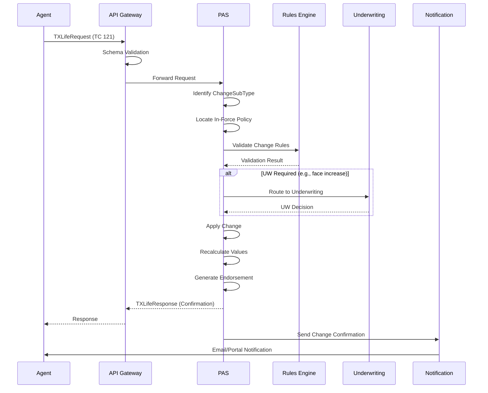

### 9.4 Before/After Value Tracking

Policy changes track both the old and new values:

```xml
<TXLife xmlns="http://ACORD.org/Standards/Life/2" Version="2.43.00">
  <TXLifeRequest PrimaryObjectID="Holding_1">
    <TransRefGUID>b2c3d4e5-f6a7-8901-bcde-f23456789012</TransRefGUID>
    <TransType tc="121">Policy Change</TransType>
    <TransSubType tc="12103">Beneficiary Change</TransSubType>
    <TransExeDate>2025-06-15</TransExeDate>
    <TransMode tc="2">Original</TransMode>
    <ChangeSubType tc="12103">Beneficiary Change</ChangeSubType>

    <OLifE>
      <SourceInfo>
        <CreationDate>2025-06-15</CreationDate>
        <CreationTime>10:15:00</CreationTime>
        <SourceInfoName>AgentPortal-v3.2</SourceInfoName>
        <FileControlID>CHG-2025-06-15-00001</FileControlID>
      </SourceInfo>

      <Holding id="Holding_1">
        <Policy>
          <PolNumber>IUL-2025-00012345</PolNumber>
          <PolicyStatus tc="1">Active</PolicyStatus>
        </Policy>
      </Holding>

      <!-- New Primary Beneficiary (replacing spouse) -->
      <Party id="Party_NewBene1">
        <PartyTypeCode tc="1">Person</PartyTypeCode>
        <Person>
          <FirstName>Emily</FirstName>
          <LastName>Smith</LastName>
          <Gender tc="2">Female</Gender>
          <BirthDate>2020-05-10</BirthDate>
        </Person>
      </Party>

      <!-- New Contingent Beneficiary -->
      <Party id="Party_NewBene2">
        <PartyTypeCode tc="1">Person</PartyTypeCode>
        <Person>
          <FirstName>Michael</FirstName>
          <LastName>Smith</LastName>
          <Gender tc="1">Male</Gender>
          <BirthDate>2022-08-22</BirthDate>
        </Person>
      </Party>

      <!-- Existing Spouse remains as primary beneficiary -->
      <Party id="Party_Spouse">
        <PartyTypeCode tc="1">Person</PartyTypeCode>
        <Person>
          <FirstName>Jane</FirstName>
          <LastName>Smith</LastName>
        </Person>
      </Party>

      <!-- Updated Beneficiary Relations -->
      <!-- Primary: 50% Spouse, 25% Child 1, 25% Child 2 -->
      <Relation id="Rel_Bene_New1">
        <OriginatingObjectID>Party_Spouse</OriginatingObjectID>
        <OriginatingObjectType tc="6">Party</OriginatingObjectType>
        <RelatedObjectID>Holding_1</RelatedObjectID>
        <RelatedObjectType tc="4">Holding</RelatedObjectType>
        <RelationRoleCode tc="34">Beneficiary</RelationRoleCode>
        <BeneficiaryDesignation tc="1">Primary</BeneficiaryDesignation>
        <InterestPercent>50</InterestPercent>
      </Relation>
      <Relation id="Rel_Bene_New2">
        <OriginatingObjectID>Party_NewBene1</OriginatingObjectID>
        <OriginatingObjectType tc="6">Party</OriginatingObjectType>
        <RelatedObjectID>Holding_1</RelatedObjectID>
        <RelatedObjectType tc="4">Holding</RelatedObjectType>
        <RelationRoleCode tc="34">Beneficiary</RelationRoleCode>
        <BeneficiaryDesignation tc="1">Primary</BeneficiaryDesignation>
        <InterestPercent>25</InterestPercent>
      </Relation>
      <Relation id="Rel_Bene_New3">
        <OriginatingObjectID>Party_NewBene2</OriginatingObjectID>
        <OriginatingObjectType tc="6">Party</OriginatingObjectType>
        <RelatedObjectID>Holding_1</RelatedObjectID>
        <RelatedObjectType tc="4">Holding</RelatedObjectType>
        <RelationRoleCode tc="34">Beneficiary</RelationRoleCode>
        <BeneficiaryDesignation tc="1">Primary</BeneficiaryDesignation>
        <InterestPercent>25</InterestPercent>
      </Relation>

      <!-- Contingent: Trust at 100% -->
      <Relation id="Rel_ContBene_New">
        <OriginatingObjectID>Party_Trust</OriginatingObjectID>
        <OriginatingObjectType tc="6">Party</OriginatingObjectType>
        <RelatedObjectID>Holding_1</RelatedObjectID>
        <RelatedObjectType tc="4">Holding</RelatedObjectType>
        <RelationRoleCode tc="34">Beneficiary</RelationRoleCode>
        <BeneficiaryDesignation tc="2">Contingent</BeneficiaryDesignation>
        <InterestPercent>100</InterestPercent>
      </Relation>

      <!-- Party-to-Party: Insured to children -->
      <Relation id="Rel_Child1">
        <OriginatingObjectID>Party_Insured1</OriginatingObjectID>
        <OriginatingObjectType tc="6">Party</OriginatingObjectType>
        <RelatedObjectID>Party_NewBene1</RelatedObjectID>
        <RelatedObjectType tc="6">Party</RelatedObjectType>
        <RelationRoleCode tc="2">Child</RelationRoleCode>
      </Relation>
      <Relation id="Rel_Child2">
        <OriginatingObjectID>Party_Insured1</OriginatingObjectID>
        <OriginatingObjectType tc="6">Party</OriginatingObjectType>
        <RelatedObjectID>Party_NewBene2</RelatedObjectID>
        <RelatedObjectType tc="6">Party</RelatedObjectType>
        <RelationRoleCode tc="2">Child</RelationRoleCode>
      </Relation>
    </OLifE>
  </TXLifeRequest>
</TXLife>
```

### 9.5 Face Amount Increase Example

```xml
<TXLifeRequest PrimaryObjectID="Holding_1">
  <TransRefGUID>c3d4e5f6-a7b8-9012-cdef-345678901234</TransRefGUID>
  <TransType tc="121">Policy Change</TransType>
  <TransSubType tc="12107">Face Amount Increase</TransSubType>
  <TransExeDate>2025-06-15</TransExeDate>
  <ChangeSubType tc="12107">Face Amount Increase</ChangeSubType>

  <OLifE>
    <Holding id="Holding_1">
      <Policy>
        <PolNumber>IUL-2025-00012345</PolNumber>
        <Life>
          <FaceAmt>1500000.00</FaceAmt>
          <!-- Increased from $1,000,000 to $1,500,000 -->
          <Coverage id="Cov_Base">
            <IndicatorCode tc="1">Base</IndicatorCode>
            <CurrentAmt>1500000.00</CurrentAmt>
            <OLifEExtension VendorCode="ACME" ExtensionCode="CoverageChange">
              <PriorAmt>1000000.00</PriorAmt>
              <ChangeAmt>500000.00</ChangeAmt>
              <ChangeEffDate>2025-07-01</ChangeEffDate>
              <ChangeReason>Income increase</ChangeReason>
              <UWRequired>true</UWRequired>
            </OLifEExtension>
          </Coverage>
        </Life>
      </Policy>
    </Holding>
  </OLifE>
</TXLifeRequest>
```

### 9.6 Effective Dating Rules

| Change Type | Backdating | Current Date | Future Date |
|-------------|-----------|--------------|-------------|
| Name/Address Change | Up to 30 days | Yes | No |
| Beneficiary Change | Policy inception | Yes | No |
| Face Increase | No | Yes | Up to 90 days |
| Face Decrease | No | Yes | Next anniversary |
| Rider Add/Remove | No | Yes | Next anniversary |
| Payment Mode Change | No | Yes | Next billing cycle |
| Fund Transfer | No | Same business day | Up to 30 days |

---

## 10. ACORD 151 Deep Dive — Death Claim

### 10.1 Overview

TransType 151 (Death Claim Notification) initiates the death claim process. It carries claimant information, proof of death, beneficiary details, and settlement preferences.

### 10.2 Death Claim Flow

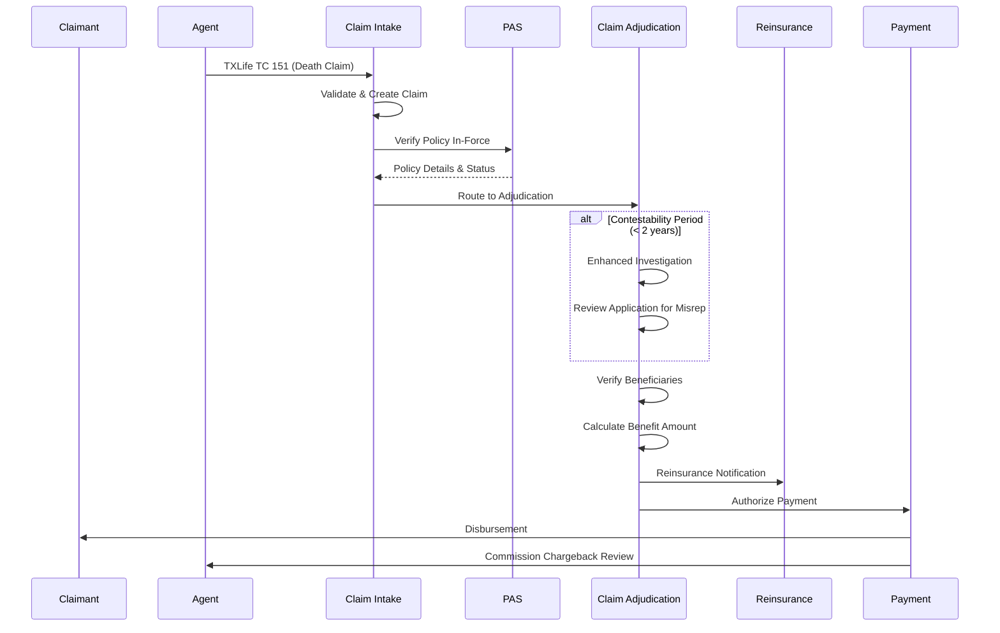

### 10.3 Complete 151 XML Example

```xml
<TXLife xmlns="http://ACORD.org/Standards/Life/2" Version="2.43.00">
  <TXLifeRequest PrimaryObjectID="Holding_1">
    <TransRefGUID>d4e5f6a7-b8c9-0123-def0-456789012345</TransRefGUID>
    <TransType tc="151">Death Claim</TransType>
    <TransExeDate>2025-09-20</TransExeDate>
    <TransMode tc="2">Original</TransMode>

    <OLifE>
      <SourceInfo>
        <CreationDate>2025-09-20</CreationDate>
        <CreationTime>09:00:00</CreationTime>
        <SourceInfoName>ClaimPortal-v2.1</SourceInfoName>
        <FileControlID>CLM-2025-09-20-00001</FileControlID>
      </SourceInfo>

      <!-- Policy Holding -->
      <Holding id="Holding_1">
        <HoldingTypeCode tc="2">Policy</HoldingTypeCode>
        <Policy>
          <PolNumber>IUL-2025-00012345</PolNumber>
          <CarrierCode>ACME</CarrierCode>
          <PolicyStatus tc="15">Death Claim</PolicyStatus>

          <!-- Claim Details -->
          <Claim id="Claim_1">
            <ClaimType tc="1">Death</ClaimType>
            <ClaimStatus tc="1">Submitted</ClaimStatus>
            <IncurredDate>2025-09-15</IncurredDate>
            <ReportedDate>2025-09-18</ReportedDate>
            <CauseOfDeath tc="3">Accident</CauseOfDeath>
            <DeathPlace>
              <City>Brooklyn</City>
              <AddressStateTC tc="37">NY</AddressStateTC>
              <AddressCountryTC tc="1">USA</AddressCountryTC>
            </DeathPlace>
            <ContestableInd tc="0">false</ContestableInd>
            <SuicideExclusionInd tc="0">false</SuicideExclusionInd>
            <ProofOfDeath>
              <CertificateType tc="1">Death Certificate</CertificateType>
              <CertificateNumber>NY-2025-DC-12345</CertificateNumber>
              <IssuingAuthority>New York City Vital Records</IssuingAuthority>
              <IssueDate>2025-09-17</IssueDate>
              <CertifiedInd tc="1">true</CertifiedInd>
            </ProofOfDeath>
            <ClaimSettlement id="Settlement_1">
              <SettlementType tc="1">Lump Sum</SettlementType>
              <GrossBenefitAmt>1000000.00</GrossBenefitAmt>
              <LoanBalanceDeduction>0.00</LoanBalanceDeduction>
              <PremiumDueDeduction>0.00</PremiumDueDeduction>
              <InterestAmt>1234.56</InterestAmt>
              <NetBenefitAmt>1001234.56</NetBenefitAmt>
              <FederalWithholding>0.00</FederalWithholding>
              <StateWithholding>0.00</StateWithholding>
            </ClaimSettlement>
            <ClaimRequirement id="ClmReq_1">
              <ReqType tc="1">Death Certificate</ReqType>
              <ReqStatus tc="3">Received</ReqStatus>
            </ClaimRequirement>
            <ClaimRequirement id="ClmReq_2">
              <ReqType tc="2">Claimant Statement</ReqType>
              <ReqStatus tc="3">Received</ReqStatus>
            </ClaimRequirement>
            <ClaimRequirement id="ClmReq_3">
              <ReqType tc="5">Proof of Identity</ReqType>
              <ReqStatus tc="3">Received</ReqStatus>
            </ClaimRequirement>
          </Claim>
        </Policy>
      </Holding>

      <!-- Deceased Insured -->
      <Party id="Party_Deceased">
        <PartyTypeCode tc="1">Person</PartyTypeCode>
        <GovtID>123-45-6789</GovtID>
        <GovtIDTC tc="1">SSN</GovtIDTC>
        <Person>
          <FirstName>John</FirstName>
          <MiddleName>Michael</MiddleName>
          <LastName>Smith</LastName>
          <Gender tc="1">Male</Gender>
          <BirthDate>1990-03-15</BirthDate>
          <DeathDate>2025-09-15</DeathDate>
          <Age>35</Age>
        </Person>
      </Party>

      <!-- Claimant / Primary Beneficiary -->
      <Party id="Party_Claimant">
        <PartyTypeCode tc="1">Person</PartyTypeCode>
        <GovtID>987-65-4321</GovtID>
        <GovtIDTC tc="1">SSN</GovtIDTC>
        <Person>
          <FirstName>Jane</FirstName>
          <MiddleName>Marie</MiddleName>
          <LastName>Smith</LastName>
          <Gender tc="2">Female</Gender>
          <BirthDate>1991-07-22</BirthDate>
        </Person>
        <Address>
          <AddressTypeCode tc="1">Home</AddressTypeCode>
          <Line1>123 Oak Street</Line1>
          <Line2>Apt 4B</Line2>
          <City>Brooklyn</City>
          <AddressStateTC tc="37">NY</AddressStateTC>
          <Zip>11201</Zip>
        </Address>
        <Phone>
          <PhoneTypeCode tc="17">Mobile</PhoneTypeCode>
          <DialNumber>917-555-0789</DialNumber>
        </Phone>
        <EMailAddress>
          <EMailType tc="1">Personal</EMailType>
          <AddrLine>jane.smith@email.com</AddrLine>
        </EMailAddress>
      </Party>

      <!-- Claimant banking for disbursement -->
      <Holding id="Holding_Disbursement">
        <HoldingTypeCode tc="3">Banking</HoldingTypeCode>
        <Banking id="Banking_Disbursement">
          <BankingStatus tc="1">Active</BankingStatus>
          <AccountNumber>XXXX8901</AccountNumber>
          <RoutingNum>021000089</RoutingNum>
          <AcctHolderName>Jane M Smith</AcctHolderName>
          <BankAcctType tc="1">Checking</BankAcctType>
          <CreditDebitType tc="1">Credit</CreditDebitType>
          <BankName>Chase Bank</BankName>
        </Banking>
      </Holding>

      <!-- Relations -->
      <Relation id="Rel_Deceased">
        <OriginatingObjectID>Party_Deceased</OriginatingObjectID>
        <OriginatingObjectType tc="6">Party</OriginatingObjectType>
        <RelatedObjectID>Holding_1</RelatedObjectID>
        <RelatedObjectType tc="4">Holding</RelatedObjectType>
        <RelationRoleCode tc="5">Insured</RelationRoleCode>
      </Relation>
      <Relation id="Rel_Claimant">
        <OriginatingObjectID>Party_Claimant</OriginatingObjectID>
        <OriginatingObjectType tc="6">Party</OriginatingObjectType>
        <RelatedObjectID>Holding_1</RelatedObjectID>
        <RelatedObjectType tc="4">Holding</RelatedObjectType>
        <RelationRoleCode tc="34">Beneficiary</RelationRoleCode>
        <BeneficiaryDesignation tc="1">Primary</BeneficiaryDesignation>
        <InterestPercent>100</InterestPercent>
      </Relation>

      <!-- Attached Proof of Death -->
      <FormInstance id="Form_DeathCert">
        <FormName>Certified Death Certificate</FormName>
        <FormTypeCode tc="20">Proof of Death</FormTypeCode>
        <Attachment>
          <AttachmentType tc="20">Death Certificate</AttachmentType>
          <MIMETypeTC tc="6">application/pdf</MIMETypeTC>
          <AttachmentLocation>https://claims.carrier.com/docs/DC-2025-12345.pdf</AttachmentLocation>
        </Attachment>
      </FormInstance>
    </OLifE>
  </TXLifeRequest>
</TXLife>
```

### 10.4 Settlement Options

| tc | Settlement Type | Description |
|----|----------------|-------------|
| 1 | Lump Sum | Single payment of full benefit |
| 2 | Interest Only | Hold proceeds, pay interest periodically |
| 3 | Fixed Period | Equal payments over specified period |
| 4 | Fixed Amount | Specific dollar amount until exhausted |
| 5 | Life Income | Annuitized over beneficiary's lifetime |
| 6 | Life with Period Certain | Life income with minimum payment guarantee |
| 7 | Joint Life | Income over two lives |
| 8 | Retained Asset Account | Carrier holds funds in interest-bearing account with checkbook access |

---

## 11. ACORD Life API Standards

### 11.1 RESTful API Specifications

ACORD's modern API standards define RESTful interfaces that complement the traditional XML-based TXLife messaging.

#### Resource Model

```
/api/v1/applications
/api/v1/applications/{applicationId}
/api/v1/applications/{applicationId}/requirements
/api/v1/applications/{applicationId}/status

/api/v1/policies
/api/v1/policies/{policyNumber}
/api/v1/policies/{policyNumber}/coverages
/api/v1/policies/{policyNumber}/parties
/api/v1/policies/{policyNumber}/values
/api/v1/policies/{policyNumber}/transactions
/api/v1/policies/{policyNumber}/documents
/api/v1/policies/{policyNumber}/changes

/api/v1/claims
/api/v1/claims/{claimId}
/api/v1/claims/{claimId}/documents
/api/v1/claims/{claimId}/payments

/api/v1/quotes
/api/v1/quotes/{quoteId}

/api/v1/parties
/api/v1/parties/{partyId}
/api/v1/parties/{partyId}/policies

/api/v1/producers
/api/v1/producers/{producerId}
/api/v1/producers/{producerId}/book-of-business
```

#### OpenAPI Example

```yaml
openapi: 3.0.3
info:
  title: ACORD Life Insurance API
  version: 1.0.0
  description: RESTful API aligned with ACORD Life & Annuity standards

paths:
  /api/v1/applications:
    post:
      operationId: submitApplication
      summary: Submit new insurance application (ACORD TC 103 equivalent)
      tags:
        - Applications
      requestBody:
        required: true
        content:
          application/json:
            schema:
              $ref: '#/components/schemas/ApplicationSubmission'
      responses:
        '201':
          description: Application created successfully
          content:
            application/json:
              schema:
                $ref: '#/components/schemas/ApplicationResponse'
        '400':
          description: Validation errors
          content:
            application/json:
              schema:
                $ref: '#/components/schemas/ErrorResponse'
        '409':
          description: Duplicate application
        '422':
          description: Business rule violation

  /api/v1/policies/{policyNumber}/changes:
    post:
      operationId: submitPolicyChange
      summary: Submit policy change request (ACORD TC 121 equivalent)
      parameters:
        - name: policyNumber
          in: path
          required: true
          schema:
            type: string
      requestBody:
        required: true
        content:
          application/json:
            schema:
              $ref: '#/components/schemas/PolicyChangeRequest'
      responses:
        '202':
          description: Change request accepted for processing
          content:
            application/json:
              schema:
                $ref: '#/components/schemas/PolicyChangeResponse'

components:
  schemas:
    ApplicationSubmission:
      type: object
      required:
        - productCode
        - jurisdiction
        - parties
        - coverages
      properties:
        transactionId:
          type: string
          format: uuid
        productCode:
          type: string
          example: "IUL-ACCUM-2025"
        jurisdiction:
          type: string
          example: "NY"
        paymentMode:
          type: string
          enum: [annual, semi-annual, quarterly, monthly]
        paymentMethod:
          type: string
          enum: [eft, check, credit-card, direct-bill]
        plannedPremium:
          type: number
          format: decimal
          example: 10200.00
        coverages:
          type: array
          items:
            $ref: '#/components/schemas/CoverageRequest'
        parties:
          type: array
          items:
            $ref: '#/components/schemas/PartyRequest'
        banking:
          $ref: '#/components/schemas/BankingInfo'

    CoverageRequest:
      type: object
      properties:
        coverageType:
          type: string
          enum: [base, rider]
        productFeatureCode:
          type: string
        faceAmount:
          type: number
        participants:
          type: array
          items:
            $ref: '#/components/schemas/Participant'

    PartyRequest:
      type: object
      properties:
        partyType:
          type: string
          enum: [person, organization]
        roles:
          type: array
          items:
            type: string
            enum: [insured, owner, beneficiary, payor, agent]
        person:
          $ref: '#/components/schemas/PersonInfo'
        addresses:
          type: array
          items:
            $ref: '#/components/schemas/Address'

    ErrorResponse:
      type: object
      properties:
        errors:
          type: array
          items:
            type: object
            properties:
              code:
                type: string
              message:
                type: string
              field:
                type: string
              severity:
                type: string
                enum: [error, warning, info]
```

### 11.2 Event-Driven Messaging

ACORD event standards use CloudEvents specification for asynchronous notifications:

```json
{
  "specversion": "1.0",
  "type": "org.acord.life.policy.issued",
  "source": "urn:acme:pas:production",
  "id": "evt-2025-01-15-00234",
  "time": "2025-01-15T14:30:00Z",
  "datacontenttype": "application/json",
  "subject": "IUL-2025-00012345",
  "data": {
    "policyNumber": "IUL-2025-00012345",
    "productCode": "IUL-ACCUM-2025",
    "issueDate": "2025-01-15",
    "effectiveDate": "2025-02-01",
    "faceAmount": 1000000.00,
    "annualPremium": 10200.00,
    "insuredParty": {
      "firstName": "John",
      "lastName": "Smith",
      "dateOfBirth": "1990-03-15"
    },
    "writingAgent": {
      "agentId": "AGT-NY-00567",
      "agentName": "Robert Johnson"
    },
    "status": "issued",
    "jurisdiction": "NY"
  }
}
```

**Standard Event Types:**

| Event Type | Trigger |
|------------|---------|
| `org.acord.life.application.submitted` | New application received |
| `org.acord.life.application.status-changed` | UW status change |
| `org.acord.life.policy.issued` | Policy issued |
| `org.acord.life.policy.changed` | Policy endorsement processed |
| `org.acord.life.policy.lapsed` | Policy lapsed |
| `org.acord.life.policy.reinstated` | Policy reinstated |
| `org.acord.life.policy.surrendered` | Policy surrendered |
| `org.acord.life.claim.submitted` | New claim filed |
| `org.acord.life.claim.decided` | Claim approved/denied |
| `org.acord.life.claim.paid` | Claim payment issued |
| `org.acord.life.premium.received` | Premium payment posted |
| `org.acord.life.premium.nsf` | Payment returned NSF |

---

## 12. ACORD Data Dictionary

### 12.1 Key Data Elements

| Element | Data Type | Max Length | Definition |
|---------|-----------|-----------|------------|
| PolNumber | String | 30 | Unique policy identifier assigned by carrier |
| TransRefGUID | UUID | 36 | Globally unique transaction reference ID |
| GovtID | String | 20 | Government-issued identifier (SSN, EIN, ITIN) |
| GovtIDTC | TypeCode | N/A | Type of government ID |
| CarrierCode | String | 10 | NAIC or ACORD carrier code |
| ProductCode | String | 20 | Carrier-specific product identifier |
| CurrentAmt | Decimal | 15,2 | Current face/benefit amount |
| ModalPremAmt | Decimal | 15,2 | Premium per billing mode |
| AnnualPremAmt | Decimal | 15,2 | Annualized premium |
| AccountValue | Decimal | 15,2 | Current account/cash value |
| CashSurrValue | Decimal | 15,2 | Cash surrender value net of charges |
| DeathBenefitAmt | Decimal | 15,2 | Current death benefit amount |
| LoanBalance | Decimal | 15,2 | Outstanding loan balance |
| EffDate | Date | 10 | Effective date (YYYY-MM-DD) |
| TermDate | Date | 10 | Termination/maturity date |
| IssueDate | Date | 10 | Date policy was issued |
| BirthDate | Date | 10 | Date of birth |
| IssueAge | Integer | 3 | Age at policy issue |
| InterestPercent | Decimal | 5,2 | Percentage interest (beneficiary share) |
| AllocPercent | Decimal | 5,2 | Fund allocation percentage |
| VolumeSharePct | Decimal | 5,2 | Agent volume sharing percentage |
| CommissionPct | Decimal | 5,2 | Commission percentage |

### 12.2 Date Format Conventions

All dates in ACORD TXLife follow ISO 8601:

| Format | Usage | Example |
|--------|-------|---------|
| YYYY-MM-DD | Dates | 2025-01-15 |
| HH:MM:SS | Times (local) | 14:30:00 |
| YYYY-MM-DDTHH:MM:SSZ | Timestamps (UTC) | 2025-01-15T14:30:00Z |
| YYYY-MM-DDTHH:MM:SS±HH:MM | Timestamps (offset) | 2025-01-15T14:30:00-05:00 |

### 12.3 Currency and Amount Rules

- All monetary amounts use XML `decimal` type with 2 decimal places.
- Currency is specified at the Holding level via `CurrencyTypeCode` (ISO 4217 numeric).
- Negative amounts are permitted (e.g., loan repayment credits).
- Zero amounts must be explicitly represented as `0.00`.

---

## 13. Full XML Examples

### 13.1 Fund Transfer (TC 228)

```xml
<TXLife xmlns="http://ACORD.org/Standards/Life/2" Version="2.43.00">
  <TXLifeRequest PrimaryObjectID="Holding_1">
    <TransRefGUID>e5f6a7b8-c9d0-1234-ef01-567890123456</TransRefGUID>
    <TransType tc="228">Fund Transfer</TransType>
    <TransExeDate>2025-03-15</TransExeDate>
    <TransMode tc="2">Original</TransMode>

    <OLifE>
      <SourceInfo>
        <CreationDate>2025-03-15</CreationDate>
        <CreationTime>11:00:00</CreationTime>
        <SourceInfoName>CustomerPortal-v4.0</SourceInfoName>
        <FileControlID>FT-2025-03-15-00001</FileControlID>
      </SourceInfo>

      <Holding id="Holding_1">
        <Policy>
          <PolNumber>VA-2025-00056789</PolNumber>
        </Policy>
        <Investment>
          <!-- Transfer FROM: S&P 500 Index Fund -->
          <SubAccount id="SA_From">
            <FundID>FUND-LCG-001</FundID>
            <TransferAmount>25000.00</TransferAmount>
            <TransferType tc="1">Absolute Dollar</TransferType>
            <TransferDirection tc="2">Out</TransferDirection>
          </SubAccount>
          <!-- Transfer TO: Bond Fund -->
          <SubAccount id="SA_To">
            <FundID>FUND-FI-002</FundID>
            <TransferAmount>25000.00</TransferAmount>
            <TransferType tc="1">Absolute Dollar</TransferType>
            <TransferDirection tc="1">In</TransferDirection>
          </SubAccount>
        </Investment>
      </Holding>
    </OLifE>
  </TXLifeRequest>
</TXLife>
```

### 13.2 Billing Inquiry (TC 508)

```xml
<TXLife xmlns="http://ACORD.org/Standards/Life/2" Version="2.43.00">
  <TXLifeRequest PrimaryObjectID="Holding_1">
    <TransRefGUID>f6a7b8c9-d0e1-2345-f012-678901234567</TransRefGUID>
    <TransType tc="508">Billing Inquiry</TransType>
    <TransExeDate>2025-04-01</TransExeDate>
    <InquiryLevel tc="3">ObjectAndChildren</InquiryLevel>

    <OLifE>
      <Holding id="Holding_1">
        <Policy>
          <PolNumber>IUL-2025-00012345</PolNumber>
        </Policy>
      </Holding>
    </OLifE>
  </TXLifeRequest>
</TXLife>
```

**Billing Inquiry Response:**

```xml
<TXLife xmlns="http://ACORD.org/Standards/Life/2" Version="2.43.00">
  <TXLifeResponse>
    <TransRefGUID>f6a7b8c9-d0e1-2345-f012-678901234567</TransRefGUID>
    <TransType tc="508">Billing Inquiry</TransType>
    <TransResult>
      <ResultCode tc="1">Success</ResultCode>
    </TransResult>
    <OLifE>
      <Holding id="Holding_1">
        <Policy>
          <PolNumber>IUL-2025-00012345</PolNumber>
          <PaymentMode tc="4">Monthly</PaymentMode>
          <PaymentMethod tc="7">EFT</PaymentMethod>
          <PaymentAmt>850.00</PaymentAmt>
          <BillingInfo>
            <BillingStatus tc="1">Current</BillingStatus>
            <PaidToDate>2025-04-01</PaidToDate>
            <NextDueDate>2025-05-01</NextDueDate>
            <NextPremAmt>850.00</NextPremAmt>
            <GracePeriodEndDate>2025-05-31</GracePeriodEndDate>
            <TotalAmtDue>850.00</TotalAmtDue>
            <PastDueAmt>0.00</PastDueAmt>
            <MinPremDue>350.00</MinPremDue>
            <TargetPrem>850.00</TargetPrem>
            <YTDPremPaid>3400.00</YTDPremPaid>
            <LastPaymentDate>2025-03-15</LastPaymentDate>
            <LastPaymentAmt>850.00</LastPaymentAmt>
          </BillingInfo>
        </Policy>
      </Holding>
    </OLifE>
  </TXLifeResponse>
</TXLife>
```

---

## 14. Mapping Strategies

### 14.1 Legacy-to-ACORD Data Mapping

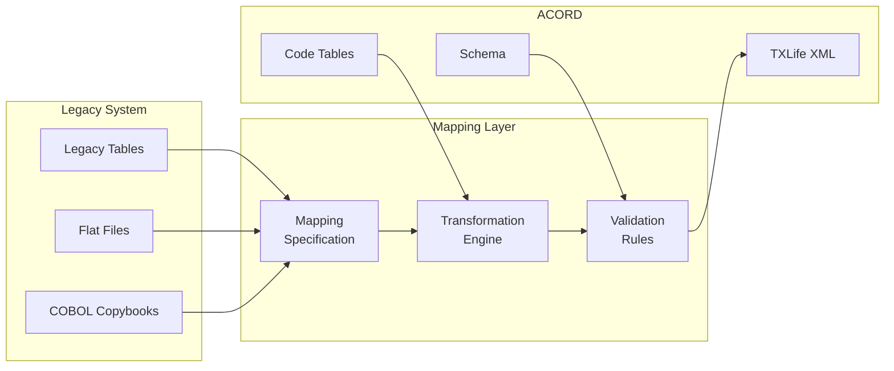

### 14.2 Canonical Data Model Approach

A canonical data model (CDM) serves as an intermediary between source-specific formats and ACORD standards.

**Mapping Matrix Example:**

| CDM Field | ACORD Element | Legacy System A | Legacy System B |
|-----------|---------------|-----------------|-----------------|
| PolicyNumber | Policy/PolNumber | POLMAST.POL_NBR | tbl_policy.policy_id |
| ProductCode | Policy/ProductCode | POLMAST.PROD_CD | tbl_policy.product_code |
| FaceAmount | Coverage/CurrentAmt | COVMAST.FACE_AMT | tbl_coverage.face_value |
| InsuredFirstName | Party/Person/FirstName | CLNTMAST.FRST_NM | tbl_customer.first_name |
| InsuredSSN | Party/GovtID | CLNTMAST.SSN_NBR | tbl_customer.tax_id |
| PolicyStatus | Policy/PolicyStatus | POLMAST.STAT_CD (mapped) | tbl_policy.status (mapped) |
| IssueDate | Policy/IssueDate | POLMAST.ISS_DT (CYYMMDD) | tbl_policy.issue_date (ISO) |
| PaymentMode | Policy/PaymentMode | POLMAST.PAY_FREQ (1-4) | tbl_policy.billing_freq |

### 14.3 Code Mapping Tables

Legacy systems use proprietary codes that must map to ACORD OLI_ type codes:

```json
{
  "policyStatusMapping": {
    "legacySystemA": {
      "A": {"acordTC": "1", "acordDesc": "Active"},
      "I": {"acordTC": "2", "acordDesc": "Inactive"},
      "L": {"acordTC": "12", "acordDesc": "Lapsed"},
      "S": {"acordTC": "10", "acordDesc": "Surrendered"},
      "D": {"acordTC": "15", "acordDesc": "Death Claim"},
      "P": {"acordTC": "11", "acordDesc": "PaidUp"},
      "M": {"acordTC": "16", "acordDesc": "Matured"},
      "T": {"acordTC": "6", "acordDesc": "Terminated"},
      "G": {"acordTC": "30", "acordDesc": "Grace Period"},
      "X": {"acordTC": "9", "acordDesc": "Cancelled"}
    },
    "legacySystemB": {
      "ACTIVE": {"acordTC": "1", "acordDesc": "Active"},
      "LAPSED": {"acordTC": "12", "acordDesc": "Lapsed"},
      "SURRENDERED": {"acordTC": "10", "acordDesc": "Surrendered"},
      "CLAIM": {"acordTC": "15", "acordDesc": "Death Claim"},
      "PAID_UP": {"acordTC": "11", "acordDesc": "PaidUp"},
      "MATURED": {"acordTC": "16", "acordDesc": "Matured"}
    }
  }
}
```

### 14.4 Date Format Conversion

| Source Format | Example | Conversion to ACORD (YYYY-MM-DD) |
|---------------|---------|----------------------------------|
| CYYMMDD (mainframe) | 1250115 | 2025-01-15 (C=1 → 20xx) |
| YYYYMMDD | 20250115 | 2025-01-15 |
| MM/DD/YYYY | 01/15/2025 | 2025-01-15 |
| Julian (YYDDD) | 25015 | 2025-01-15 |
| Epoch (seconds) | 1736899200 | 2025-01-15 |

---

## 15. ACORD Testing and Certification

### 15.1 ACORD Certification Program

ACORD offers a certification program to verify that implementations conform to the published standards.

**Certification Levels:**

| Level | Name | Requirements |
|-------|------|-------------|
| 1 | Schema Compliance | Messages validate against ACORD XSD |
| 2 | Content Compliance | Required fields populated, valid code values |
| 3 | Behavioral Compliance | Transaction processing follows ACORD semantics |
| 4 | Interoperability | Successful exchange with reference implementation |

### 15.2 Testing Framework

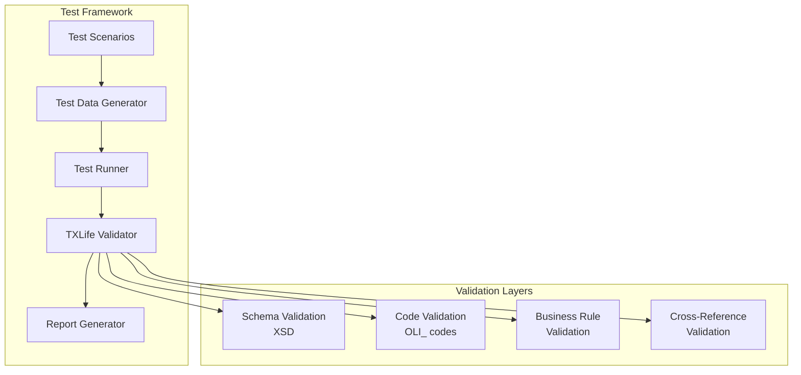

### 15.3 Common Validation Rules

1. **Schema Validation**: All messages must validate against the versioned XSD.
2. **Required Field Validation**: All required elements must be present and non-empty.
3. **Type Code Validation**: All `tc` values must exist in the current ACORD code tables.
4. **Referential Integrity**: All `id` references (PartyID, ObjectRef) must resolve to existing objects.
5. **Date Validation**: All dates must be valid and logically consistent (IssueDate ≤ EffDate, BirthDate < IssueDate).
6. **Amount Validation**: Percentages sum to 100 (beneficiary allocations), amounts are non-negative where required.
7. **Business Rule Validation**: Product-specific rules (age limits, face amount limits, jurisdiction restrictions).

---

## 16. Architecture Patterns

### 16.1 ACORD Message Broker Architecture

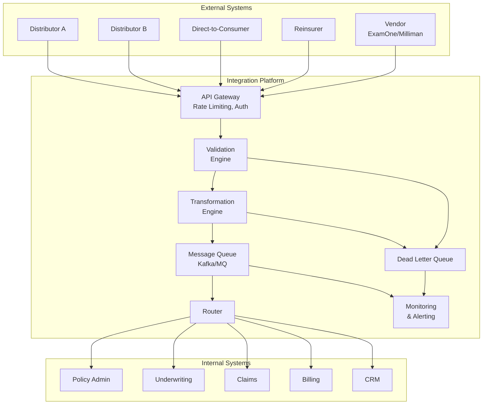

### 16.2 Transformation Layer Design

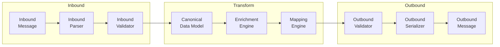

### 16.3 Schema Registry Pattern

A schema registry manages versioned ACORD schemas and mapping configurations:

```json
{
  "schemaRegistry": {
    "schemas": [
      {
        "id": "acord-txlife-2.43.00",
        "version": "2.43.00",
        "type": "XSD",
        "location": "s3://schema-registry/acord/TXLife2.43.00.xsd",
        "status": "active",
        "effectiveDate": "2023-01-01"
      },
      {
        "id": "acord-txlife-2.42.00",
        "version": "2.42.00",
        "type": "XSD",
        "location": "s3://schema-registry/acord/TXLife2.42.00.xsd",
        "status": "deprecated",
        "deprecationDate": "2023-06-01"
      }
    ],
    "mappings": [
      {
        "id": "map-legacy-a-to-acord-2.43",
        "sourceFormat": "LEGACY-A",
        "targetFormat": "ACORD-2.43",
        "mappingFile": "s3://schema-registry/mappings/legacy-a-acord243.xslt",
        "version": "3.1"
      }
    ],
    "codeTables": [
      {
        "id": "oli-polstat",
        "name": "OLI_POLSTAT",
        "version": "2.43.00",
        "location": "s3://schema-registry/codes/OLI_POLSTAT.json",
        "lastUpdated": "2023-01-01"
      }
    ]
  }
}
```

### 16.4 Validation Framework Architecture

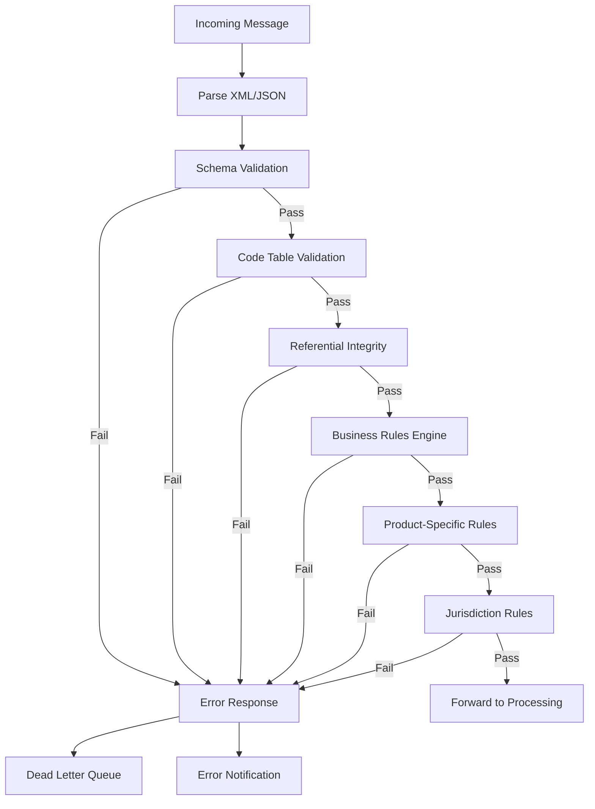

---

## 17. Practical Guidance for Solution Architects

### 17.1 Implementation Checklist

| # | Task | Priority |
|---|------|----------|
| 1 | Obtain ACORD membership and access to specifications | Critical |
| 2 | Identify target ACORD schema version | Critical |
| 3 | Map business transactions to ACORD TransType codes | Critical |
| 4 | Design canonical data model (if multi-system) | High |
| 5 | Build code table mapping infrastructure | High |
| 6 | Implement schema validation pipeline | High |
| 7 | Design extension strategy (OLifEExtension) | High |
| 8 | Build transformation layer (XSLT or programmatic) | High |
| 9 | Implement error handling and DLQ processing | High |
| 10 | Design message routing and orchestration | Medium |
| 11 | Build monitoring and alerting | Medium |
| 12 | Create test harness with sample messages | Medium |
| 13 | Plan for schema version upgrades | Medium |
| 14 | Document all extensions and custom mappings | Medium |
| 15 | Pursue ACORD certification | Low |

### 17.2 Common Pitfalls

1. **Ignoring OLifEExtension strategy**: Without a planned extension approach, vendors end up with inconsistent custom elements that break interoperability.

2. **Hardcoding tc values**: Type codes should be resolved from a managed code table service, not hardcoded. Code tables get updated with each schema release.

3. **Missing referential integrity**: Party IDs referenced in Relation objects that don't exist in the message. Always validate cross-references before processing.

4. **Date format inconsistencies**: Legacy systems use dozens of date formats. Build a robust date parsing/formatting library.

5. **Over-relying on text content**: The `tc` attribute is authoritative. The element text (e.g., "Active", "NonSmoker") is informational and may differ between implementations.

6. **Neglecting batch vs real-time**: Designing only for real-time leads to problems when carriers need to process overnight batches of millions of records.

7. **Schema version lock-in**: Build your transformation layer to handle multiple schema versions simultaneously. Partners may not upgrade at the same pace.

### 17.3 Performance Considerations

| Concern | Guidance |
|---------|----------|
| Large XML messages | Use streaming parsers (StAX) for messages > 1 MB |
| High-volume batch | Split batch files into configurable chunk sizes (1000–5000 records) |
| Schema validation overhead | Cache compiled XSD schemas; validate in parallel |
| Code table lookups | In-memory code table cache with periodic refresh |
| Transformation throughput | Pre-compile XSLT templates; consider programmatic mapping for hot paths |
| Message routing | Content-based routing on TransType should use indexed lookup, not sequential |

### 17.4 Security Considerations

- **Authentication**: UserAuthRequest supports basic auth, token-based, and certificate-based authentication.
- **Encryption**: GovtID (SSN) and Banking information must be encrypted at rest and in transit (TLS 1.2+).
- **PII Masking**: Log messages with GovtID and AccountNumber fields masked (show last 4 digits).
- **Access Control**: TransType-based authorization — not all partners should be able to submit claims or change ownership.
- **Audit Trail**: Every ACORD transaction must be logged with TransRefGUID, timestamp, sender, receiver, and outcome.

### 17.5 Migration Strategy

When migrating from proprietary formats to ACORD:

1. **Phase 1 — Shadow Mode**: Generate ACORD messages in parallel with existing format. Compare and validate.
2. **Phase 2 — Dual Write**: Send both formats to receiving system. Receiving system processes ACORD and validates against proprietary.
3. **Phase 3 — ACORD Primary**: ACORD becomes the primary format. Proprietary format generated only for legacy consumers.
4. **Phase 4 — ACORD Only**: Decommission proprietary format.

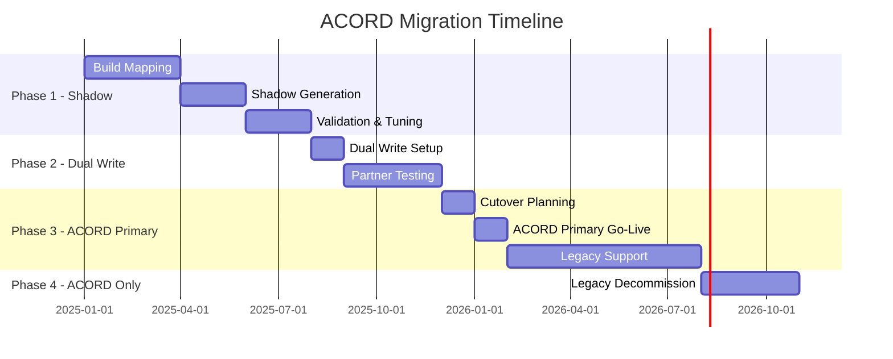

---

*This article is part of the Life Insurance PAS Architect's Encyclopedia. For related topics, see Article 15 (Data Interchange Formats), Article 16 (ISO 20022 & Financial Messaging), and Article 17 (Master Data Management).*
