# Article 15: Data Interchange Formats — XML, JSON, EDI

## Table of Contents

1. [XML in Insurance](#1-xml-in-insurance)
2. [XML Schema Design Patterns](#2-xml-schema-design-patterns)
3. [XML Validation Strategies](#3-xml-validation-strategies)
4. [XSLT Transformation Patterns](#4-xslt-transformation-patterns)
5. [XML Performance Considerations](#5-xml-performance-considerations)
6. [JSON in Modern PAS](#6-json-in-modern-pas)
7. [JSON Schema Design for Insurance](#7-json-schema-design-for-insurance)
8. [JSON API Patterns for Insurance](#8-json-api-patterns-for-insurance)
9. [JSON Patch and Merge Patch](#9-json-patch-and-merge-patch)
10. [EDI Standards for Insurance](#10-edi-standards-for-insurance)
11. [ANSI X12 834 — Benefit Enrollment](#11-ansi-x12-834--benefit-enrollment)
12. [ANSI X12 820 — Payment Order](#12-ansi-x12-820--payment-order)
13. [ANSI X12 835 — Claim Payment](#13-ansi-x12-835--claim-payment)
14. [Canonical Data Model](#14-canonical-data-model)
15. [Data Transformation Patterns](#15-data-transformation-patterns)
16. [DTCC/NSCC Integration](#16-dtccnscc-integration)
17. [NAIC Data Standards](#17-naic-data-standards)
18. [FIX Protocol for Insurance](#18-fix-protocol-for-insurance)
19. [Complete Sample Payloads](#19-complete-sample-payloads)
20. [Data Quality](#20-data-quality)
21. [Architecture Patterns](#21-architecture-patterns)

---

## 1. XML in Insurance

### 1.1 XML's Role in Life Insurance

XML (eXtensible Markup Language) has been the dominant data interchange format in life insurance since the late 1990s. The ACORD TXLife standard, the industry's primary message format, is XML-based. Despite the rise of JSON for modern APIs, XML remains essential for:

- ACORD TXLife messaging between carriers, distributors, and vendors
- NAIC regulatory filings (XBRL, which is XML-based)
- Reinsurance data exchanges
- Document generation (XSL-FO for policy documents)
- Configuration-driven product rules (coverage definitions, rate tables)
- Legacy system integration (mainframe data bridges)

### 1.2 XML Ecosystem Components

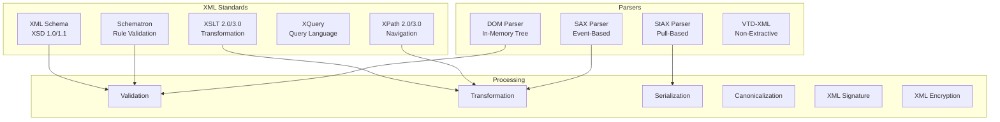

### 1.3 XML Namespace Management

In life insurance XML, proper namespace management is critical because messages combine elements from multiple standards:

```xml
<?xml version="1.0" encoding="UTF-8"?>
<TXLife
  xmlns="http://ACORD.org/Standards/Life/2"
  xmlns:xsi="http://www.w3.org/2001/XMLSchema-instance"
  xmlns:carrier="http://www.acmeinsurance.com/extensions"
  xmlns:reins="http://www.genre.com/reinsurance/v2"
  xmlns:doc="http://www.acmeinsurance.com/documents"
  xsi:schemaLocation="
    http://ACORD.org/Standards/Life/2 TXLife2.43.00.xsd
    http://www.acmeinsurance.com/extensions CarrierExtensions.xsd">
  
  <TXLifeRequest>
    <OLifE>
      <Party id="Party_1">
        <Person>
          <FirstName>John</FirstName>
          <LastName>Smith</LastName>
        </Person>
        <!-- Carrier-specific extension using registered namespace -->
        <OLifEExtension VendorCode="ACME">
          <carrier:CustomerSegment>HNW</carrier:CustomerSegment>
          <carrier:RiskScore>742</carrier:RiskScore>
        </OLifEExtension>
      </Party>
    </OLifE>
  </TXLifeRequest>
</TXLife>
```

**Namespace Best Practices:**
- Use the ACORD default namespace for all standard elements.
- Register a unique namespace for each carrier/vendor extension.
- Never use namespace prefixes for ACORD standard elements (use default namespace).
- Include `schemaLocation` for all namespaces to enable validation.
- Version namespaces (e.g., `/v2/`) to support schema evolution.

---

## 2. XML Schema Design Patterns

### 2.1 Russian Doll Pattern

All elements are defined inline within a single root element. No reusable type definitions.

```xml
<xs:schema xmlns:xs="http://www.w3.org/2001/XMLSchema">
  <xs:element name="Policy">
    <xs:complexType>
      <xs:sequence>
        <xs:element name="PolNumber" type="xs:string"/>
        <xs:element name="Coverage">
          <xs:complexType>
            <xs:sequence>
              <xs:element name="CoverageType" type="xs:string"/>
              <xs:element name="FaceAmount" type="xs:decimal"/>
              <xs:element name="Participant">
                <xs:complexType>
                  <xs:sequence>
                    <xs:element name="Name" type="xs:string"/>
                    <xs:element name="Age" type="xs:integer"/>
                  </xs:sequence>
                </xs:complexType>
              </xs:element>
            </xs:sequence>
          </xs:complexType>
        </xs:element>
      </xs:sequence>
    </xs:complexType>
  </xs:element>
</xs:schema>
```

**Pros:** Simple, self-contained, easy to read for small schemas.  
**Cons:** No type reuse, very verbose for large models, difficult to extend.  
**Insurance Use:** Rarely used for full message schemas; sometimes for small configuration files.

### 2.2 Venetian Blind Pattern

All types are defined globally and named; elements reference types.

```xml
<xs:schema xmlns:xs="http://www.w3.org/2001/XMLSchema">
  
  <xs:complexType name="ParticipantType">
    <xs:sequence>
      <xs:element name="Name" type="xs:string"/>
      <xs:element name="Age" type="xs:integer"/>
      <xs:element name="Gender" type="GenderType"/>
    </xs:sequence>
  </xs:complexType>
  
  <xs:simpleType name="GenderType">
    <xs:restriction base="xs:string">
      <xs:enumeration value="Male"/>
      <xs:enumeration value="Female"/>
      <xs:enumeration value="NonBinary"/>
    </xs:restriction>
  </xs:simpleType>
  
  <xs:complexType name="CoverageType">
    <xs:sequence>
      <xs:element name="CoverageTypeCode" type="xs:string"/>
      <xs:element name="FaceAmount" type="xs:decimal"/>
      <xs:element name="Participant" type="ParticipantType" maxOccurs="unbounded"/>
    </xs:sequence>
    <xs:attribute name="id" type="xs:ID"/>
  </xs:complexType>
  
  <xs:complexType name="PolicyType">
    <xs:sequence>
      <xs:element name="PolNumber" type="xs:string"/>
      <xs:element name="Coverage" type="CoverageType" maxOccurs="unbounded"/>
    </xs:sequence>
  </xs:complexType>
  
  <xs:element name="Policy" type="PolicyType"/>
</xs:schema>
```

**Pros:** Maximum type reuse, types can be extended via restriction/extension.  
**Cons:** Only root element is globally visible, types are globally exposed.  
**Insurance Use:** ACORD TXLife schema primarily uses this pattern.

### 2.3 Salami Slice Pattern

All elements are defined globally; types are local or absent.

```xml
<xs:schema xmlns:xs="http://www.w3.org/2001/XMLSchema">
  
  <xs:element name="PolNumber" type="xs:string"/>
  <xs:element name="CoverageTypeCode" type="xs:string"/>
  <xs:element name="FaceAmount" type="xs:decimal"/>
  <xs:element name="Name" type="xs:string"/>
  <xs:element name="Age" type="xs:integer"/>
  
  <xs:element name="Participant">
    <xs:complexType>
      <xs:sequence>
        <xs:element ref="Name"/>
        <xs:element ref="Age"/>
      </xs:sequence>
    </xs:complexType>
  </xs:element>
  
  <xs:element name="Coverage">
    <xs:complexType>
      <xs:sequence>
        <xs:element ref="CoverageTypeCode"/>
        <xs:element ref="FaceAmount"/>
        <xs:element ref="Participant" maxOccurs="unbounded"/>
      </xs:sequence>
    </xs:complexType>
  </xs:element>
  
  <xs:element name="Policy">
    <xs:complexType>
      <xs:sequence>
        <xs:element ref="PolNumber"/>
        <xs:element ref="Coverage" maxOccurs="unbounded"/>
      </xs:sequence>
    </xs:complexType>
  </xs:element>
</xs:schema>
```

**Pros:** All elements globally referenceable, flexible composition.  
**Cons:** Name collision risk, all elements visible globally, harder to manage in large schemas.  
**Insurance Use:** Used in some EDI-to-XML mapping schemas.

### 2.4 Garden of Eden Pattern

Combination of Venetian Blind and Salami Slice — both elements and types are globally defined.

```xml
<xs:schema xmlns:xs="http://www.w3.org/2001/XMLSchema">
  
  <xs:simpleType name="PolicyNumberType">
    <xs:restriction base="xs:string">
      <xs:pattern value="[A-Z]{3}-\d{4}-\d{8}"/>
    </xs:restriction>
  </xs:simpleType>
  
  <xs:complexType name="ParticipantType">
    <xs:sequence>
      <xs:element ref="Name"/>
      <xs:element ref="Age"/>
    </xs:sequence>
  </xs:complexType>
  
  <xs:complexType name="CoverageType">
    <xs:sequence>
      <xs:element ref="FaceAmount"/>
      <xs:element ref="Participant" maxOccurs="unbounded"/>
    </xs:sequence>
  </xs:complexType>
  
  <xs:element name="PolNumber" type="PolicyNumberType"/>
  <xs:element name="Name" type="xs:string"/>
  <xs:element name="Age" type="xs:positiveInteger"/>
  <xs:element name="FaceAmount" type="xs:decimal"/>
  <xs:element name="Participant" type="ParticipantType"/>
  <xs:element name="Coverage" type="CoverageType"/>
  <xs:element name="Policy">
    <xs:complexType>
      <xs:sequence>
        <xs:element ref="PolNumber"/>
        <xs:element ref="Coverage" maxOccurs="unbounded"/>
      </xs:sequence>
    </xs:complexType>
  </xs:element>
</xs:schema>
```

**Pros:** Maximum reuse for both elements and types, supports both element ref and type extension.  
**Cons:** Largest namespace footprint, most complex to manage.  
**Insurance Use:** Recommended for enterprise canonical data models that need to serve multiple interfaces.

### 2.5 Schema Versioning Strategies

| Strategy | Approach | Pros | Cons |
|----------|----------|------|------|
| URL Versioning | `http://acord.org/life/v2.43` | Clear, explicit | New namespace per version breaks compatibility |
| Element Versioning | `<Schema version="2.43">` | Preserves namespace | Must handle version-specific processing |
| Additive Only | Never remove/rename; only add | Full backward compat | Schema grows without bound |
| Parallel Schemas | Maintain v2.42 and v2.43 simultaneously | Clean separation | Double maintenance |
| Transformation Bridge | XSLT converts between versions | Transparent to consumers | Extra processing overhead |

---

## 3. XML Validation Strategies

### 3.1 XSD Validation

Primary validation using the ACORD TXLife XML Schema Definition.

```java
// Java implementation for ACORD TXLife validation
public class AcordSchemaValidator {
    private static final SchemaFactory SCHEMA_FACTORY =
        SchemaFactory.newInstance(XMLConstants.W3C_XML_SCHEMA_NS_URI);
    private final Schema schema;

    public AcordSchemaValidator(String schemaVersion) throws SAXException {
        URL schemaUrl = getClass().getResource(
            "/schemas/TXLife" + schemaVersion + ".xsd");
        this.schema = SCHEMA_FACTORY.newSchema(schemaUrl);
    }

    public ValidationResult validate(String xmlMessage) {
        ValidationResult result = new ValidationResult();
        try {
            Validator validator = schema.newValidator();
            ErrorCollector errorHandler = new ErrorCollector();
            validator.setErrorHandler(errorHandler);
            validator.validate(new StreamSource(new StringReader(xmlMessage)));
            result.setErrors(errorHandler.getErrors());
            result.setWarnings(errorHandler.getWarnings());
            result.setValid(errorHandler.getErrors().isEmpty());
        } catch (Exception e) {
            result.setValid(false);
            result.addError("FATAL", e.getMessage());
        }
        return result;
    }
}
```

### 3.2 Schematron Validation

Schematron provides rule-based validation beyond what XSD can express. It is particularly valuable for insurance business rules.

```xml
<?xml version="1.0" encoding="UTF-8"?>
<sch:schema xmlns:sch="http://purl.oclc.org/dml/schematron"
            xmlns:acord="http://ACORD.org/Standards/Life/2"
            queryBinding="xslt2">

  <sch:title>ACORD Life Insurance Business Rules</sch:title>

  <!-- Rule: Beneficiary percentages must sum to 100 -->
  <sch:pattern name="beneficiary-allocation">
    <sch:rule context="acord:OLifE">
      <sch:let name="primaryBenePercent"
               value="sum(acord:Relation[acord:RelationRoleCode/@tc='34']
                         [acord:BeneficiaryDesignation/@tc='1']
                         /acord:InterestPercent)"/>
      <sch:assert test="$primaryBenePercent = 100 or $primaryBenePercent = 0">
        Primary beneficiary interest percentages must sum to 100%.
        Current sum: <sch:value-of select="$primaryBenePercent"/>%
      </sch:assert>
    </sch:rule>
  </sch:pattern>

  <!-- Rule: Insured age within product limits -->
  <sch:pattern name="insured-age-limits">
    <sch:rule context="acord:Coverage/acord:LifeParticipant">
      <sch:assert test="acord:IssueAge >= 18 and acord:IssueAge &lt;= 80">
        Insured age must be between 18 and 80 for this product.
        Current age: <sch:value-of select="acord:IssueAge"/>
      </sch:assert>
    </sch:rule>
  </sch:pattern>

  <!-- Rule: EFT banking required when payment method is EFT -->
  <sch:pattern name="eft-banking-required">
    <sch:rule context="acord:Policy[acord:PaymentMethod/@tc='7']">
      <sch:assert test="../acord:Banking">
        Banking information is required when payment method is EFT (tc=7).
      </sch:assert>
    </sch:rule>
  </sch:pattern>

  <!-- Rule: Face amount within product minimums -->
  <sch:pattern name="face-amount-minimum">
    <sch:rule context="acord:Coverage[acord:IndicatorCode/@tc='1']">
      <sch:assert test="acord:CurrentAmt >= 25000">
        Base coverage face amount must be at least $25,000.
        Current amount: $<sch:value-of select="acord:CurrentAmt"/>
      </sch:assert>
    </sch:rule>
  </sch:pattern>

  <!-- Rule: SSN format validation -->
  <sch:pattern name="ssn-format">
    <sch:rule context="acord:Party[acord:GovtIDTC/@tc='1']">
      <sch:assert test="matches(acord:GovtID, '^\d{3}-?\d{2}-?\d{4}$')">
        SSN must be in format XXX-XX-XXXX or XXXXXXXXX.
      </sch:assert>
      <sch:assert test="not(starts-with(translate(acord:GovtID, '-', ''), '000'))">
        SSN cannot begin with 000.
      </sch:assert>
      <sch:assert test="not(starts-with(translate(acord:GovtID, '-', ''), '666'))">
        SSN cannot begin with 666.
      </sch:assert>
    </sch:rule>
  </sch:pattern>

  <!-- Rule: State must be valid for product filing -->
  <sch:pattern name="jurisdiction-validation">
    <sch:rule context="acord:Policy">
      <sch:assert test="acord:Jurisdiction/@tc != '37' or 
                        not(contains(acord:ProductCode, 'BASIC'))">
        Product BASIC is not filed in New York (tc=37).
      </sch:assert>
    </sch:rule>
  </sch:pattern>
</sch:schema>
```

### 3.3 Custom Validator Pipeline

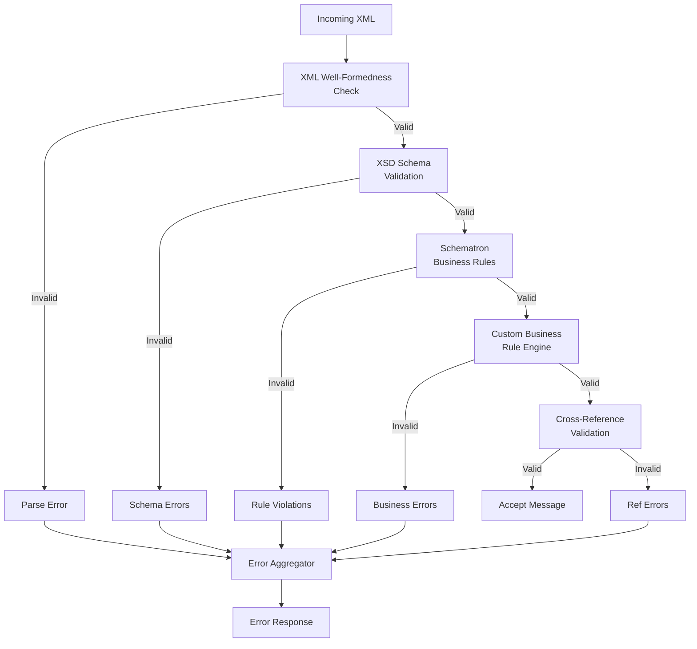

---

## 4. XSLT Transformation Patterns

### 4.1 Legacy-to-ACORD Transformation

```xml
<?xml version="1.0" encoding="UTF-8"?>
<xsl:stylesheet version="2.0"
  xmlns:xsl="http://www.w3.org/1999/XSL/Transform"
  xmlns:acord="http://ACORD.org/Standards/Life/2"
  xmlns:leg="http://legacy.carrier.com/policy"
  exclude-result-prefixes="leg">

  <xsl:output method="xml" indent="yes" encoding="UTF-8"/>

  <!-- Code table mapping document -->
  <xsl:variable name="codeMap"
    select="document('code-mappings.xml')/CodeMappings"/>

  <xsl:template match="leg:PolicyExtract">
    <acord:TXLife Version="2.43.00">
      <acord:TXLifeResponse>
        <acord:TransRefGUID>
          <xsl:value-of select="generate-id()"/>
        </acord:TransRefGUID>
        <acord:TransType tc="601">Policy Summary</acord:TransType>
        <acord:TransResult>
          <acord:ResultCode tc="1">Success</acord:ResultCode>
        </acord:TransResult>
        <acord:OLifE>
          <xsl:apply-templates select="leg:Policy"/>
          <xsl:apply-templates select="leg:Client"/>
          <xsl:call-template name="generateRelations"/>
        </acord:OLifE>
      </acord:TXLifeResponse>
    </acord:TXLife>
  </xsl:template>

  <xsl:template match="leg:Policy">
    <acord:Holding id="Holding_{leg:PolicyNumber}">
      <acord:HoldingTypeCode tc="2">Policy</acord:HoldingTypeCode>
      <acord:Policy>
        <acord:PolNumber>
          <xsl:value-of select="leg:PolicyNumber"/>
        </acord:PolNumber>
        <acord:LineOfBusiness>
          <xsl:attribute name="tc">
            <xsl:value-of select="$codeMap/LOB
              [@legacy=current()/leg:LineOfBusiness]/@acord"/>
          </xsl:attribute>
        </acord:LineOfBusiness>
        <acord:PolicyStatus>
          <xsl:attribute name="tc">
            <xsl:value-of select="$codeMap/PolicyStatus
              [@legacy=current()/leg:Status]/@acord"/>
          </xsl:attribute>
        </acord:PolicyStatus>
        <acord:IssueDate>
          <xsl:call-template name="convertDate">
            <xsl:with-param name="legacyDate" select="leg:IssueDate"/>
          </xsl:call-template>
        </acord:IssueDate>
      </acord:Policy>
    </acord:Holding>
  </xsl:template>

  <!-- Convert legacy CYYMMDD date to ACORD YYYY-MM-DD -->
  <xsl:template name="convertDate">
    <xsl:param name="legacyDate"/>
    <xsl:variable name="century"
      select="if (substring($legacyDate, 1, 1) = '1') then '20' else '19'"/>
    <xsl:variable name="year" select="substring($legacyDate, 2, 2)"/>
    <xsl:variable name="month" select="substring($legacyDate, 4, 2)"/>
    <xsl:variable name="day" select="substring($legacyDate, 6, 2)"/>
    <xsl:value-of select="concat($century, $year, '-', $month, '-', $day)"/>
  </xsl:template>

  <xsl:template match="leg:Client">
    <acord:Party id="Party_{leg:ClientID}">
      <acord:PartyTypeCode tc="1">Person</acord:PartyTypeCode>
      <acord:GovtID>
        <xsl:value-of select="leg:SSN"/>
      </acord:GovtID>
      <acord:GovtIDTC tc="1">SSN</acord:GovtIDTC>
      <acord:Person>
        <acord:FirstName>
          <xsl:value-of select="leg:FirstName"/>
        </acord:FirstName>
        <acord:LastName>
          <xsl:value-of select="leg:LastName"/>
        </acord:LastName>
        <acord:BirthDate>
          <xsl:call-template name="convertDate">
            <xsl:with-param name="legacyDate" select="leg:DOB"/>
          </xsl:call-template>
        </acord:BirthDate>
        <acord:Gender>
          <xsl:attribute name="tc">
            <xsl:choose>
              <xsl:when test="leg:Sex = 'M'">1</xsl:when>
              <xsl:when test="leg:Sex = 'F'">2</xsl:when>
              <xsl:otherwise>3</xsl:otherwise>
            </xsl:choose>
          </xsl:attribute>
        </acord:Gender>
      </acord:Person>
    </acord:Party>
  </xsl:template>

  <xsl:template name="generateRelations">
    <xsl:for-each select="leg:Policy">
      <acord:Relation>
        <acord:OriginatingObjectID>
          Party_<xsl:value-of select="../leg:Client/leg:ClientID"/>
        </acord:OriginatingObjectID>
        <acord:OriginatingObjectType tc="6">Party</acord:OriginatingObjectType>
        <acord:RelatedObjectID>
          Holding_<xsl:value-of select="leg:PolicyNumber"/>
        </acord:RelatedObjectID>
        <acord:RelatedObjectType tc="4">Holding</acord:RelatedObjectType>
        <acord:RelationRoleCode tc="8">Owner</acord:RelationRoleCode>
      </acord:Relation>
    </xsl:for-each>
  </xsl:template>
</xsl:stylesheet>
```

### 4.2 ACORD-to-JSON Transformation

```xml
<xsl:stylesheet version="2.0"
  xmlns:xsl="http://www.w3.org/1999/XSL/Transform"
  xmlns:acord="http://ACORD.org/Standards/Life/2">
  
  <xsl:output method="text" encoding="UTF-8"/>

  <xsl:template match="acord:TXLife">
    <xsl:text>{</xsl:text>
    <xsl:text>"transactionType": "</xsl:text>
    <xsl:value-of select="acord:TXLifeResponse/acord:TransType/@tc"/>
    <xsl:text>",</xsl:text>
    <xsl:text>"policies": [</xsl:text>
    <xsl:apply-templates select=".//acord:Holding[acord:HoldingTypeCode/@tc='2']"/>
    <xsl:text>]</xsl:text>
    <xsl:text>}</xsl:text>
  </xsl:template>

  <xsl:template match="acord:Holding">
    <xsl:if test="position() > 1">,</xsl:if>
    <xsl:text>{</xsl:text>
    <xsl:text>"policyNumber": "</xsl:text>
    <xsl:value-of select="acord:Policy/acord:PolNumber"/>
    <xsl:text>",</xsl:text>
    <xsl:text>"status": "</xsl:text>
    <xsl:value-of select="acord:Policy/acord:PolicyStatus/@tc"/>
    <xsl:text>",</xsl:text>
    <xsl:text>"faceAmount": </xsl:text>
    <xsl:value-of select="acord:Policy/acord:Life/acord:FaceAmt"/>
    <xsl:text>}</xsl:text>
  </xsl:template>
</xsl:stylesheet>
```

---

## 5. XML Performance Considerations

### 5.1 Parser Comparison

| Parser Type | Memory | Speed | Use Case |
|-------------|--------|-------|----------|
| **DOM** | O(n) - Full tree in memory | Moderate | Small-medium messages (< 1 MB), random access needed |
| **SAX** | O(1) - Event-driven | Fast | Large files, streaming, read-only |
| **StAX** | O(1) - Pull-based | Fast | Large files, selective processing |
| **VTD-XML** | O(n) - Non-extractive | Very fast | Repeated XPath on same document |

### 5.2 Performance Benchmarks for Insurance Messages

| Scenario | Message Size | DOM | SAX | StAX |
|----------|-------------|-----|-----|------|
| Single application (TC 103) | 50 KB | 5ms | 2ms | 3ms |
| Policy inquiry response (TC 601) | 200 KB | 18ms | 6ms | 8ms |
| Batch billing file (10K records) | 50 MB | 2.5s (OOM risk) | 450ms | 500ms |
| Annual statement extract | 500 MB | OOM | 4.2s | 4.8s |
| Full book conversion | 5 GB | Impossible | 42s | 48s |

### 5.3 Optimization Strategies

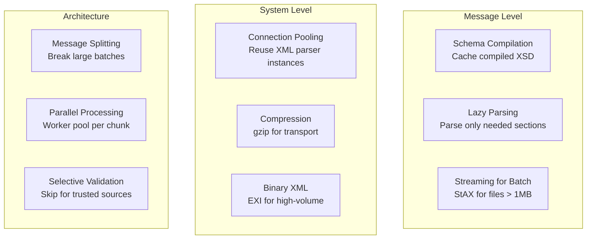

**Practical Guidelines:**
1. **Cache compiled schemas**: Schema compilation is expensive; do it once at startup.
2. **Use StAX for anything > 1 MB**: DOM parsing of large ACORD batch files will cause OutOfMemoryError.
3. **Compress in transit**: ACORD XML compresses 80–90% with gzip.
4. **Pool parser instances**: XML parser creation has significant overhead.
5. **Validate selectively**: Full XSD validation of every message adds 40–60% processing time. For trusted internal sources, consider validating a sample.

---

## 6. JSON in Modern PAS

### 6.1 JSON's Growing Role

JSON has become the preferred format for modern PAS interfaces:

| Interface | XML | JSON |
|-----------|-----|------|
| Carrier-to-carrier B2B | Primary | Emerging |
| Carrier-to-distributor | Primary | Growing |
| Internal microservices | Declining | Primary |
| Customer-facing APIs | Rare | Primary |
| Mobile applications | None | Primary |
| Event streaming (Kafka) | Rare | Primary |
| Analytics/Data Lake | None | Primary |
| Regulatory filing | Primary (XBRL) | None |

### 6.2 XML-to-JSON Migration Strategy

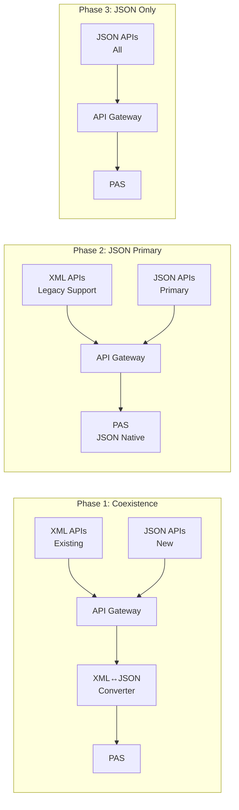

### 6.3 JSON Representation of ACORD Concepts

Mapping ACORD XML idioms to JSON:

**ACORD Type Codes in JSON:**

```json
{
  "_comment": "Option 1: Code + Description object",
  "policyStatus": {
    "code": "1",
    "description": "Active"
  },
  
  "_comment2": "Option 2: Enum string (preferred for modern APIs)",
  "policyStatus": "ACTIVE",
  
  "_comment3": "Option 3: Numeric code only (legacy compatibility)",
  "policyStatus": 1
}
```

**Recommended approach** — use human-readable enum strings in JSON, with a code table API for mapping:

```json
{
  "policy": {
    "policyNumber": "IUL-2025-00012345",
    "status": "ACTIVE",
    "lineOfBusiness": "LIFE",
    "productType": "INDEXED_UNIVERSAL_LIFE",
    "productCode": "IUL-ACCUM-2025",
    "jurisdiction": "NY",
    "issueDate": "2025-01-15",
    "effectiveDate": "2025-02-01",
    "paymentMode": "MONTHLY",
    "paymentMethod": "EFT",
    "paymentAmount": 850.00,
    "annualPremium": 10200.00
  }
}
```

---

## 7. JSON Schema Design for Insurance

### 7.1 Policy JSON Schema

```json
{
  "$schema": "https://json-schema.org/draft/2020-12/schema",
  "$id": "https://api.carrier.com/schemas/policy/v1",
  "title": "Life Insurance Policy",
  "description": "JSON Schema for life insurance policy representation",
  "type": "object",
  "required": ["policyNumber", "status", "lineOfBusiness", "product", "coverages", "parties"],
  "properties": {
    "policyNumber": {
      "type": "string",
      "pattern": "^[A-Z]{2,4}-\\d{4}-\\d{8,12}$",
      "description": "Unique policy identifier"
    },
    "status": {
      "type": "string",
      "enum": [
        "PROPOSED", "PENDING_UW", "APPROVED", "ISSUED", "ACTIVE",
        "GRACE_PERIOD", "LAPSED", "REINSTATED", "PAID_UP",
        "EXTENDED_TERM", "REDUCED_PAID_UP", "SURRENDERED",
        "MATURED", "DEATH_CLAIM", "TERMINATED", "CANCELLED"
      ]
    },
    "lineOfBusiness": {
      "type": "string",
      "enum": ["LIFE", "ANNUITY", "HEALTH", "DISABILITY"]
    },
    "product": {
      "$ref": "#/$defs/ProductReference"
    },
    "jurisdiction": {
      "type": "string",
      "pattern": "^[A-Z]{2}$",
      "description": "Two-letter state code"
    },
    "issueDate": {
      "type": "string",
      "format": "date"
    },
    "effectiveDate": {
      "type": "string",
      "format": "date"
    },
    "terminationDate": {
      "type": ["string", "null"],
      "format": "date"
    },
    "billing": {
      "$ref": "#/$defs/BillingInfo"
    },
    "coverages": {
      "type": "array",
      "minItems": 1,
      "items": {
        "$ref": "#/$defs/Coverage"
      }
    },
    "parties": {
      "type": "array",
      "minItems": 1,
      "items": {
        "$ref": "#/$defs/PartyRole"
      }
    },
    "values": {
      "$ref": "#/$defs/PolicyValues"
    }
  },
  "$defs": {
    "ProductReference": {
      "type": "object",
      "required": ["productCode", "productName"],
      "properties": {
        "productCode": { "type": "string" },
        "productName": { "type": "string" },
        "productType": {
          "type": "string",
          "enum": [
            "WHOLE_LIFE", "TERM", "UNIVERSAL_LIFE",
            "VARIABLE_LIFE", "VUL", "IUL",
            "FIXED_ANNUITY", "VARIABLE_ANNUITY", "FIA", "RILA"
          ]
        }
      }
    },
    "Coverage": {
      "type": "object",
      "required": ["coverageId", "type", "indicator", "faceAmount"],
      "properties": {
        "coverageId": { "type": "string" },
        "type": { "type": "string" },
        "indicator": {
          "type": "string",
          "enum": ["BASE", "RIDER", "BENEFIT"]
        },
        "status": { "type": "string" },
        "faceAmount": {
          "type": "number",
          "minimum": 0
        },
        "modalPremium": { "type": "number" },
        "annualPremium": { "type": "number" },
        "effectiveDate": { "type": "string", "format": "date" },
        "terminationDate": { "type": ["string", "null"], "format": "date" },
        "participants": {
          "type": "array",
          "items": { "$ref": "#/$defs/CoverageParticipant" }
        },
        "options": {
          "type": "array",
          "items": { "$ref": "#/$defs/CoverageOption" }
        }
      }
    },
    "PartyRole": {
      "type": "object",
      "required": ["partyId", "roles"],
      "properties": {
        "partyId": { "type": "string" },
        "roles": {
          "type": "array",
          "items": {
            "type": "string",
            "enum": [
              "INSURED", "OWNER", "BENEFICIARY", "CONTINGENT_BENEFICIARY",
              "PAYOR", "ANNUITANT", "AGENT", "TRUSTEE"
            ]
          }
        },
        "beneficiaryInfo": {
          "$ref": "#/$defs/BeneficiaryInfo"
        },
        "party": {
          "$ref": "#/$defs/Party"
        }
      }
    },
    "Party": {
      "type": "object",
      "required": ["partyType"],
      "properties": {
        "partyType": {
          "type": "string",
          "enum": ["PERSON", "ORGANIZATION"]
        },
        "governmentId": {
          "type": "string",
          "description": "Masked: last 4 digits only in responses"
        },
        "governmentIdType": {
          "type": "string",
          "enum": ["SSN", "EIN", "ITIN", "PASSPORT"]
        },
        "person": { "$ref": "#/$defs/PersonInfo" },
        "organization": { "$ref": "#/$defs/OrganizationInfo" },
        "addresses": {
          "type": "array",
          "items": { "$ref": "#/$defs/Address" }
        },
        "phones": {
          "type": "array",
          "items": { "$ref": "#/$defs/Phone" }
        },
        "emails": {
          "type": "array",
          "items": { "$ref": "#/$defs/Email" }
        }
      }
    },
    "PersonInfo": {
      "type": "object",
      "required": ["firstName", "lastName"],
      "properties": {
        "firstName": { "type": "string", "maxLength": 50 },
        "middleName": { "type": "string", "maxLength": 50 },
        "lastName": { "type": "string", "maxLength": 50 },
        "suffix": { "type": "string" },
        "prefix": { "type": "string" },
        "gender": { "type": "string", "enum": ["MALE", "FEMALE", "NON_BINARY"] },
        "dateOfBirth": { "type": "string", "format": "date" },
        "maritalStatus": { "type": "string" },
        "citizenship": { "type": "string" },
        "occupation": { "type": "string" },
        "annualIncome": { "type": "number" },
        "netWorth": { "type": "number" }
      }
    },
    "OrganizationInfo": {
      "type": "object",
      "required": ["name"],
      "properties": {
        "name": { "type": "string" },
        "organizationType": { "type": "string" },
        "establishedDate": { "type": "string", "format": "date" },
        "stateOfIncorporation": { "type": "string" }
      }
    },
    "Address": {
      "type": "object",
      "properties": {
        "type": { "type": "string", "enum": ["HOME", "BUSINESS", "MAILING"] },
        "line1": { "type": "string" },
        "line2": { "type": "string" },
        "city": { "type": "string" },
        "state": { "type": "string", "pattern": "^[A-Z]{2}$" },
        "zipCode": { "type": "string", "pattern": "^\\d{5}(-\\d{4})?$" },
        "country": { "type": "string", "default": "US" }
      }
    },
    "Phone": {
      "type": "object",
      "properties": {
        "type": { "type": "string", "enum": ["HOME", "BUSINESS", "MOBILE", "FAX"] },
        "number": { "type": "string" },
        "preferred": { "type": "boolean", "default": false }
      }
    },
    "Email": {
      "type": "object",
      "properties": {
        "type": { "type": "string", "enum": ["PERSONAL", "BUSINESS"] },
        "address": { "type": "string", "format": "email" },
        "preferred": { "type": "boolean", "default": false }
      }
    },
    "BillingInfo": {
      "type": "object",
      "properties": {
        "paymentMode": { "type": "string", "enum": ["ANNUAL", "SEMI_ANNUAL", "QUARTERLY", "MONTHLY"] },
        "paymentMethod": { "type": "string", "enum": ["EFT", "CHECK", "CREDIT_CARD", "DIRECT_BILL"] },
        "paymentAmount": { "type": "number" },
        "paidToDate": { "type": "string", "format": "date" },
        "nextDueDate": { "type": "string", "format": "date" }
      }
    },
    "PolicyValues": {
      "type": "object",
      "properties": {
        "accountValue": { "type": "number" },
        "cashSurrenderValue": { "type": "number" },
        "deathBenefit": { "type": "number" },
        "loanBalance": { "type": "number" },
        "loanAvailable": { "type": "number" },
        "valuationDate": { "type": "string", "format": "date" }
      }
    },
    "BeneficiaryInfo": {
      "type": "object",
      "properties": {
        "designation": { "type": "string", "enum": ["PRIMARY", "CONTINGENT"] },
        "percentage": { "type": "number", "minimum": 0, "maximum": 100 },
        "distributionOption": { "type": "string" }
      }
    },
    "CoverageParticipant": {
      "type": "object",
      "properties": {
        "partyId": { "type": "string" },
        "role": { "type": "string" },
        "issueAge": { "type": "integer" },
        "riskClass": { "type": "string" },
        "tobaccoStatus": { "type": "string" }
      }
    },
    "CoverageOption": {
      "type": "object",
      "properties": {
        "optionType": { "type": "string" },
        "status": { "type": "string" },
        "value": { "type": "number" }
      }
    }
  }
}
```

---

## 8. JSON API Patterns for Insurance

### 8.1 HAL (Hypertext Application Language)

```json
{
  "_links": {
    "self": { "href": "/api/v1/policies/IUL-2025-00012345" },
    "coverages": { "href": "/api/v1/policies/IUL-2025-00012345/coverages" },
    "parties": { "href": "/api/v1/policies/IUL-2025-00012345/parties" },
    "values": { "href": "/api/v1/policies/IUL-2025-00012345/values" },
    "changes": { "href": "/api/v1/policies/IUL-2025-00012345/changes" },
    "documents": { "href": "/api/v1/policies/IUL-2025-00012345/documents" },
    "billing": { "href": "/api/v1/policies/IUL-2025-00012345/billing" }
  },
  "policyNumber": "IUL-2025-00012345",
  "status": "ACTIVE",
  "productCode": "IUL-ACCUM-2025",
  "productName": "Accumulation IUL Premier",
  "jurisdiction": "NY",
  "issueDate": "2025-01-15",
  "effectiveDate": "2025-02-01",
  "_embedded": {
    "owner": {
      "_links": {
        "self": { "href": "/api/v1/parties/CUST-00012345" }
      },
      "partyId": "CUST-00012345",
      "firstName": "John",
      "lastName": "Smith"
    }
  }
}
```

### 8.2 JSON:API Format

```json
{
  "data": {
    "type": "policies",
    "id": "IUL-2025-00012345",
    "attributes": {
      "status": "ACTIVE",
      "productCode": "IUL-ACCUM-2025",
      "jurisdiction": "NY",
      "issueDate": "2025-01-15",
      "faceAmount": 1000000.00,
      "annualPremium": 10200.00
    },
    "relationships": {
      "owner": {
        "data": { "type": "parties", "id": "CUST-00012345" }
      },
      "insured": {
        "data": { "type": "parties", "id": "CUST-00012345" }
      },
      "coverages": {
        "data": [
          { "type": "coverages", "id": "COV-BASE-001" },
          { "type": "coverages", "id": "COV-ADB-001" }
        ]
      }
    },
    "links": {
      "self": "/api/v1/policies/IUL-2025-00012345"
    }
  },
  "included": [
    {
      "type": "parties",
      "id": "CUST-00012345",
      "attributes": {
        "firstName": "John",
        "lastName": "Smith",
        "dateOfBirth": "1990-03-15"
      }
    },
    {
      "type": "coverages",
      "id": "COV-BASE-001",
      "attributes": {
        "coverageType": "INDEXED_UNIVERSAL_LIFE",
        "indicator": "BASE",
        "faceAmount": 1000000.00,
        "status": "ACTIVE"
      }
    }
  ]
}
```

### 8.3 Pagination Pattern

```json
{
  "data": [
    { "policyNumber": "IUL-2025-00012345", "status": "ACTIVE" },
    { "policyNumber": "TL-2025-00012346", "status": "ACTIVE" },
    { "policyNumber": "WL-2025-00012347", "status": "PAID_UP" }
  ],
  "pagination": {
    "page": 1,
    "pageSize": 25,
    "totalItems": 156,
    "totalPages": 7,
    "hasNext": true,
    "hasPrevious": false
  },
  "links": {
    "self": "/api/v1/producers/AGT-001/book-of-business?page=1&pageSize=25",
    "next": "/api/v1/producers/AGT-001/book-of-business?page=2&pageSize=25",
    "last": "/api/v1/producers/AGT-001/book-of-business?page=7&pageSize=25"
  }
}
```

---

## 9. JSON Patch and Merge Patch

### 9.1 JSON Patch (RFC 6902) for Policy Changes

```json
[
  {
    "op": "replace",
    "path": "/billing/paymentMode",
    "value": "QUARTERLY"
  },
  {
    "op": "replace",
    "path": "/billing/paymentAmount",
    "value": 2550.00
  },
  {
    "op": "add",
    "path": "/parties/-",
    "value": {
      "partyId": "NEW-BENE-001",
      "roles": ["BENEFICIARY"],
      "beneficiaryInfo": {
        "designation": "CONTINGENT",
        "percentage": 100
      },
      "party": {
        "partyType": "ORGANIZATION",
        "organization": {
          "name": "Smith Family Trust",
          "organizationType": "TRUST"
        }
      }
    }
  },
  {
    "op": "replace",
    "path": "/parties/0/beneficiaryInfo/percentage",
    "value": 60
  },
  {
    "op": "replace",
    "path": "/parties/1/beneficiaryInfo/percentage",
    "value": 40
  }
]
```

### 9.2 JSON Merge Patch (RFC 7396) for Simple Updates

```json
{
  "billing": {
    "paymentMode": "QUARTERLY",
    "paymentAmount": 2550.00
  },
  "parties": null
}
```

### 9.3 Policy Change Request Envelope

```json
{
  "changeRequest": {
    "transactionId": "b2c3d4e5-f6a7-8901-bcde-f23456789012",
    "changeType": "BENEFICIARY_CHANGE",
    "requestedEffectiveDate": "2025-07-01",
    "reason": "Adding children as beneficiaries",
    "requestedBy": {
      "partyId": "CUST-00012345",
      "role": "OWNER"
    },
    "changes": [
      {
        "op": "replace",
        "path": "/beneficiaries",
        "value": {
          "primary": [
            { "partyId": "CUST-00012346", "name": "Jane Smith", "percentage": 50, "relationship": "SPOUSE" },
            { "partyId": "CUST-00012347", "name": "Emily Smith", "percentage": 25, "relationship": "CHILD" },
            { "partyId": "CUST-00012348", "name": "Michael Smith", "percentage": 25, "relationship": "CHILD" }
          ],
          "contingent": [
            { "partyId": "TRUST-00001", "name": "Smith Family Trust", "percentage": 100, "relationship": "TRUST" }
          ]
        }
      }
    ],
    "signatures": [
      {
        "role": "OWNER",
        "signedDate": "2025-06-15",
        "signatureType": "ELECTRONIC",
        "certificateId": "ESIG-2025-56789"
      }
    ]
  }
}
```

---

## 10. EDI Standards for Insurance

### 10.1 EDI Overview

Electronic Data Interchange (EDI) predates both XML and JSON in insurance data exchange. While declining for new implementations, EDI remains critical for:

- Group life enrollment (834)
- Premium payment processing (820)
- Claim payment advice (835)
- Employer/plan sponsor data exchange
- Government reporting (some state filings)

### 10.2 EDI Envelope Structure

```
ISA*00*          *00*          *ZZ*SENDER         *ZZ*RECEIVER       *250115*1430*^*00501*000000001*0*P*:~
  GS*HP*SENDER*RECEIVER*20250115*1430*1*X*005010X220A1~
    ST*834*0001*005010X220A1~
      [Transaction Set Content]
    SE*[segment count]*0001~
  GE*1*1~
IEA*1*000000001~
```

**Envelope Layers:**

| Layer | Segments | Purpose |
|-------|----------|---------|
| Interchange | ISA/IEA | Sender/receiver identification, control numbers |
| Functional Group | GS/GE | Transaction type grouping |
| Transaction Set | ST/SE | Individual transaction |

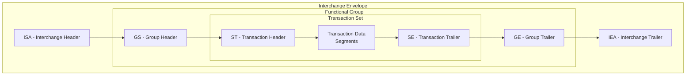

---

## 11. ANSI X12 834 — Benefit Enrollment

### 11.1 Overview

The ANSI X12 834 (Benefit Enrollment and Maintenance) transaction is the standard for exchanging group life insurance enrollment data between employers, plan sponsors, TPAs, and carriers.

### 11.2 Segment Breakdown

| Segment | Name | Usage |
|---------|------|-------|
| BGN | Beginning Segment | Transaction type, ref number, date |
| REF | Reference Information | Group/employer references |
| DTP | Date/Time Reference | Dates (enrollment, termination, etc.) |
| QTY | Quantity | Member counts |
| N1 | Name | Organization identification |
| INS | Insured Benefit | Member enrollment details |
| REF | Reference (under INS) | Member references (SSN, employee ID) |
| DTP | Date (under INS) | Member dates |
| NM1 | Individual Name | Member/dependent name |
| PER | Administrative Communications | Contact info |
| N3 | Address | Street address |
| N4 | Geographic Location | City, state, ZIP |
| DMG | Demographic | Birth date, gender |
| ICM | Income | Salary information |
| HD | Health Coverage | Coverage elections |
| DTP | Date (under HD) | Coverage dates |
| COB | Coordination of Benefits | Other coverage info |
| LX | Assigned Number | Line counter (optional) |
| LS/LE | Loop Header/Trailer | Additional reporting categories |

### 11.3 Complete 834 Example — Group Life Enrollment

```
ISA*00*          *00*          *ZZ*EMPLOYER_ABC   *ZZ*ACME_LIFE      *250115*1430*^*00501*000000001*0*P*:~
GS*HP*EMPLOYER_ABC*ACME_LIFE*20250115*1430*1*X*005010X220A1~
ST*834*0001*005010X220A1~
BGN*00*ENR20250115001*20250115*1430****2~
REF*38*GROUP-LIFE-10001~
DTP*007*D8*20250101~
DTP*090*D8*20250115~
QTY*TO*250~
QTY*DT*5~
N1*P5*ACME Insurance Company*FI*123456789~
N1*IN*ABC Corporation*FI*987654321~
N1*BO*ABC Corporation HR Department~
PER*IP*Jane HR Manager*TE*2125551234*EM*hr@abccorp.com~
INS*Y*18*021*28*A***FT~
REF*0F*EMP-2025-001~
REF*1L*GROUP-LIFE-10001~
REF*23*CERT-000001~
DTP*336*D8*20250101~
DTP*350*D8*20241215~
DTP*303*D8*20250101~
NM1*IL*1*Johnson*Robert*A***34*123456789~
PER*IP**TE*9175550100*EM*rjohnson@email.com~
N3*100 Main Street*Suite 200~
N4*New York*NY*10001~
DMG*D8*19850615*M*U~
ICM*B*85000*A~
HD*021**LIF*GRPTERM50*EMP~
DTP*348*D8*20250101~
DTP*349*D8*20251231~
AMT*D2*50000~
AMT*C1*8.50~
INS*Y*18*021*28*A***FT~
REF*0F*EMP-2025-002~
REF*1L*GROUP-LIFE-10001~
REF*23*CERT-000002~
DTP*336*D8*20250101~
DTP*350*D8*20250110~
NM1*IL*1*Williams*Sarah*M***34*234567890~
PER*IP**TE*9175550200*EM*swilliams@email.com~
N3*200 Oak Avenue~
N4*Brooklyn*NY*11201~
DMG*D8*19900322*F*U~
ICM*B*95000*A~
HD*021**LIF*GRPTERM50*EMP~
DTP*348*D8*20250101~
AMT*D2*95000~
AMT*C1*15.67~
HD*021**LIF*GRPTERM50*DEP~
DTP*348*D8*20250101~
AMT*D2*25000~
AMT*C1*3.25~
INS*N*01*030*XN*A***FT~
REF*0F*EMP-2025-002~
NM1*IL*1*Williams*Thomas*J***34*345678901~
DMG*D8*20180815*M*U~
N3*200 Oak Avenue~
N4*Brooklyn*NY*11201~
HD*030**LIF*GRPTERM50*DEP~
INS*Y*18*024*43*A***FT~
REF*0F*EMP-2025-003~
REF*1L*GROUP-LIFE-10001~
DTP*336*D8*20241201~
DTP*350*D8*20241115~
NM1*IL*1*Garcia*Maria*L***34*456789012~
PER*IP**TE*9175550300~
N3*300 Elm Street*Apt 5C~
N4*Queens*NY*11375~
DMG*D8*19880210*F*U~
ICM*B*72000*A~
HD*024**LIF*GRPTERM50*EMP~
DTP*348*D8*20241201~
AMT*D2*72000~
AMT*C1*11.88~
SE*68*0001~
GE*1*1~
IEA*1*000000001~
```

### 11.4 Key 834 Segment Details

**BGN — Beginning Segment:**

| Element | Position | Description | Values |
|---------|----------|-------------|--------|
| BGN01 | Transaction Type | 00=Original, 15=Re-enrollment, 22=Information Copy | |
| BGN02 | Reference Number | Unique file reference | |
| BGN03 | Date | File creation date (CCYYMMDD) | |
| BGN04 | Time | File creation time | |
| BGN08 | Action Code | 2=Change, 4=Verify, RX=Replace | |

**INS — Insured Benefit:**

| Element | Position | Description | Values |
|---------|----------|-------------|--------|
| INS01 | Member Indicator | Y=Subscriber, N=Dependent | |
| INS02 | Individual Relationship | 18=Self, 01=Spouse, 19=Child | |
| INS03 | Maintenance Type | 021=Addition, 024=Reinstatement, 030=Dep Add | |
| INS04 | Maintenance Reason | 28=Initial Enrollment, 43=Rehire | |
| INS05 | Benefit Status | A=Active, C=COBRA, S=Surviving Dependent | |
| INS08 | Employment Status | FT=Full-Time, PT=Part-Time, RT=Retired | |

**HD — Health/Coverage Data:**

| Element | Position | Description | Values |
|---------|----------|-------------|--------|
| HD01 | Maintenance Type | 021=Addition, 024=Reinstate, 025=Cancel | |
| HD03 | Insurance Line | LIF=Life, ADD=AD&D, LTD=Long Term Disability | |
| HD04 | Plan Coverage | Plan identifier code | |
| HD05 | Coverage Level | EMP=Employee, DEP=Dependent, ECH=Emp+Children | |

---

## 12. ANSI X12 820 — Payment Order

### 12.1 Overview

The 820 transaction handles premium payment remittance advice between employers/plan sponsors and insurance carriers.

### 12.2 Complete 820 Example — Group Premium Payment

```
ISA*00*          *00*          *ZZ*EMPLOYER_ABC   *ZZ*ACME_LIFE      *250215*1000*^*00501*000000002*0*P*:~
GS*RA*EMPLOYER_ABC*ACME_LIFE*20250215*1000*2*X*005010~
ST*820*0001~
BPR*C*12450.75*C*ACH*CTX*01*021000089*DA*123456789**01*021000089*DA*987654321*20250215~
TRN*1*PMT-2025-02-001*1234567890~
DTM*009*20250215~
N1*PR*ABC Corporation*FI*987654321~
N1*PE*ACME Insurance Company*FI*123456789~
ENT*1*2J*38*GROUP-LIFE-10001~
RMR*IV*INV-2025-02-001**12450.75*12450.75~
REF*38*GROUP-LIFE-10001~
DTM*003*20250201~
DTM*004*20250228~
ADX*8500.00*1*LIF*EMPLOYEE LIFE PREMIUM~
ADX*2250.00*1*ADD*EMPLOYEE AD&D PREMIUM~
ADX*1200.75*1*LIF*DEPENDENT LIFE PREMIUM~
ADX*500.00*2*LIF*ADJUSTMENT - RETRO ENROLLMENT~
SE*17*0001~
GE*1*2~
IEA*1*000000002~
```

**BPR — Beginning Segment for Payment:**

| Element | Position | Description |
|---------|----------|-------------|
| BPR01 | Transaction Handling | C=Payment with remittance, D=Make payment only |
| BPR02 | Total Amount | Total payment amount |
| BPR03 | Credit/Debit | C=Credit, D=Debit |
| BPR04 | Payment Method | ACH, CHK, FWT (wire) |
| BPR05 | Payment Format | CCD, CTX, PPD |
| BPR06-09 | Originator Bank | ID qualifier, ABA, account type, account |
| BPR10-13 | Receiver Bank | Same structure |
| BPR16 | Payment Date | CCYYMMDD |

---

## 13. ANSI X12 835 — Claim Payment

### 13.1 Overview

The 835 transaction communicates claim payment/advice details from carriers to claimants, providers, or plan administrators.

### 13.2 835 Segment Structure for Life Claims

```
ISA*00*          *00*          *ZZ*ACME_LIFE      *ZZ*CLAIMANT       *250920*1500*^*00501*000000003*0*P*:~
GS*HP*ACME_LIFE*CLAIMANT*20250920*1500*3*X*005010X221A1~
ST*835*0001~
BPR*I*1001234.56*C*ACH*CTX*01*021000089*DA*987654321**01*021000089*DA*XXXX8901*20250925~
TRN*1*CLM-PMT-2025-001*1234567890~
DTM*405*20250920~
N1*PR*ACME Insurance Company*FI*123456789~
N1*PE*Jane M Smith*34*987654321~
LX*1~
CLP*CLM-2025-DC-001*1*1000000.00*1001234.56**LI*IUL-2025-00012345~
NM1*QC*1*Smith*John*M***34*123456789~
NM1*IL*1*Smith*Jane*M***34*987654321~
DTM*232*20250915~
DTM*233*20250920~
AMT*AU*1000000.00~
AMT*B6*1234.56~
AMT*T*0.00~
REF*1L*IUL-2025-00012345~
SE*18*0001~
GE*1*3~
IEA*1*000000003~
```

---

## 14. Canonical Data Model

### 14.1 Design Principles

A Canonical Data Model (CDM) for life insurance creates a single, normalized representation that bridges all source and target formats.

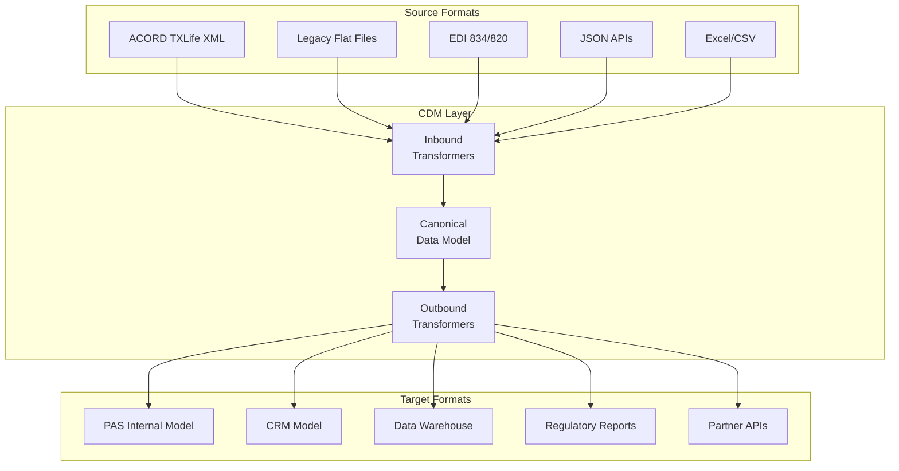

### 14.2 CDM Entity Model

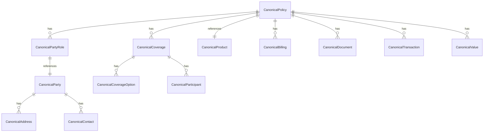

### 14.3 CDM-to-Format Mapping Registry

```json
{
  "mappingRegistry": {
    "entity": "CanonicalPolicy",
    "mappings": {
      "ACORD_XML": {
        "policyNumber": "Holding/Policy/PolNumber",
        "status": "Holding/Policy/PolicyStatus/@tc",
        "statusLookup": "OLI_POLSTAT",
        "issueDate": "Holding/Policy/IssueDate",
        "dateFormat": "YYYY-MM-DD"
      },
      "LEGACY_MAINFRAME": {
        "policyNumber": "POLMAST.POL-NBR",
        "status": "POLMAST.STAT-CD",
        "statusLookup": "LEGACY_POLSTAT",
        "issueDate": "POLMAST.ISS-DT",
        "dateFormat": "CYYMMDD"
      },
      "EDI_834": {
        "policyNumber": "REF*23*{value}",
        "status": "INS*{Y/N}*{rel}*{maintType}",
        "issueDate": "DTP*336*D8*{value}",
        "dateFormat": "CCYYMMDD"
      },
      "JSON_API": {
        "policyNumber": "$.policyNumber",
        "status": "$.status",
        "statusLookup": "ENUM_POLSTAT",
        "issueDate": "$.issueDate",
        "dateFormat": "ISO-8601"
      }
    }
  }
}
```

---

## 15. Data Transformation Patterns

### 15.1 ETL vs ELT for Insurance Data

| Aspect | ETL | ELT |
|--------|-----|-----|
| Transform Location | Middleware/integration layer | Target data platform |
| Best For | Structured, well-defined mappings | Complex analytics, data lake |
| Tools | DataWeave, MapForce, XSLT | dbt, Spark, BigQuery SQL |
| Insurance Use | Real-time policy data exchange | Actuarial/analytics data prep |
| Latency | Sub-second to minutes | Minutes to hours |
| Scalability | Limited by middleware | Scale with data platform |

### 15.2 Real-Time Transformation Architecture

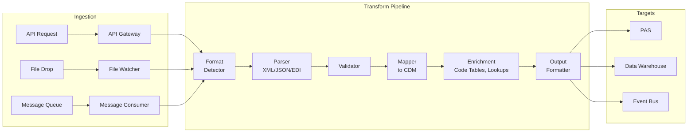

### 15.3 Transformation Error Handling

```json
{
  "transformationResult": {
    "transactionId": "f47ac10b-58cc-4372-a567-0e02b2c3d479",
    "sourceFormat": "ACORD_XML_2.43",
    "targetFormat": "PAS_INTERNAL_JSON",
    "status": "PARTIAL_SUCCESS",
    "recordsProcessed": 1,
    "errors": [
      {
        "severity": "WARNING",
        "field": "Party.Risk.AvocHobby.AvocHobbyType",
        "sourceValue": "tc=99",
        "message": "Unknown avocation/hobby type code. Mapped to 'OTHER'.",
        "resolution": "DEFAULT_MAPPING"
      },
      {
        "severity": "ERROR",
        "field": "Coverage.CovOption.LifeCovOptTypeCode",
        "sourceValue": "tc=999",
        "message": "Unknown coverage option type. Skipped.",
        "resolution": "SKIPPED"
      }
    ],
    "warnings": 1,
    "criticalErrors": 0,
    "timestamp": "2025-01-15T14:30:02Z"
  }
}
```

---

## 16. DTCC/NSCC Integration

### 16.1 Insurance Processing Services (IPS)

The Depository Trust & Clearing Corporation (DTCC) through its subsidiary National Securities Clearing Corporation (NSCC) provides centralized processing services for the life insurance and annuity industry.

**Key DTCC/NSCC Services:**

| Service | Description | Participants |
|---------|-------------|-------------|
| **Commission & Premium Processing** | Centralized commission and premium data exchange | Carriers, broker-dealers, banks |
| **Insurance Processing Service (IPS)** | Automated position/activity reporting | Carriers, distributors |
| **DTCC Financial Activity Reporting (FAR)** | Financial activity feeds for variable products | Carriers, fund companies |
| **Networking** | Contract-level data synchronization | Carriers, distributors |

### 16.2 Position and Activity Files

**Position File Layout (Daily):**

| Field | Position | Length | Description |
|-------|----------|--------|-------------|
| Record Type | 1 | 2 | "01" Header, "02" Detail, "99" Trailer |
| NSCC Participant ID | 3 | 4 | Distributor NSCC number |
| Contract Number | 7 | 20 | Policy/contract number |
| CUSIP | 27 | 9 | Fund CUSIP |
| Share Balance | 36 | 15 | Units held (implied 6 decimals) |
| Market Value | 51 | 15 | Current market value (implied 2 decimals) |
| NAV | 66 | 10 | Current NAV per share |
| As-Of Date | 76 | 8 | Valuation date (CCYYMMDD) |
| Surrender Value | 84 | 15 | Net surrender value |
| Loan Balance | 99 | 15 | Outstanding loan |

**Activity File Layout (Daily):**

| Field | Position | Length | Description |
|-------|----------|--------|-------------|
| Record Type | 1 | 2 | "01" Header, "10" Trade, "99" Trailer |
| Trade Date | 3 | 8 | CCYYMMDD |
| Settlement Date | 11 | 8 | CCYYMMDD |
| Contract Number | 19 | 20 | Policy/contract number |
| CUSIP | 39 | 9 | Fund CUSIP |
| Transaction Type | 48 | 2 | BU=Buy, SE=Sell, DV=Dividend, TR=Transfer |
| Dollar Amount | 50 | 15 | Transaction amount |
| Share Quantity | 65 | 15 | Shares traded |
| NAV | 80 | 10 | NAV per share at trade |

### 16.3 Commission File Format

```
HDRACME_LIFE20250215001
CMSAGT-NY-00567IUL-2025-00012345FYC 0005610020250215
CMSAGT-NY-00567IUL-2025-00012345TRL 0000510020250215
CMSAGT-NY-00123IUL-2025-00012345OVR 0001500020250215
CMSAGT-NY-00789TL-2025-00098765 FYC 0003200020250215
TRL0004                    00151400
```

| Field | Description |
|-------|-------------|
| Record Type | HDR=Header, CMS=Commission, TRL=Trailer |
| Agent ID | Producer identifier |
| Policy Number | Associated policy |
| Commission Type | FYC=First Year, TRL=Trail/Renewal, OVR=Override, BNS=Bonus |
| Amount | Commission amount (implied 2 decimals) |
| Rate | Commission rate (implied 4 decimals) |
| Effective Date | CCYYMMDD |

---

## 17. NAIC Data Standards

### 17.1 Annual/Quarterly Statement (XBRL)

The National Association of Insurance Commissioners requires electronic filing using XBRL (eXtensible Business Reporting Language), an XML-based standard.

```xml
<?xml version="1.0" encoding="UTF-8"?>
<xbrli:xbrl
  xmlns:xbrli="http://www.xbrl.org/2003/instance"
  xmlns:naic="http://www.naic.org/taxonomy/2024"
  xmlns:iso4217="http://www.xbrl.org/2003/iso4217">

  <xbrli:context id="FY2024">
    <xbrli:entity>
      <xbrli:identifier scheme="http://www.naic.org">12345</xbrli:identifier>
    </xbrli:entity>
    <xbrli:period>
      <xbrli:startDate>2024-01-01</xbrli:startDate>
      <xbrli:endDate>2024-12-31</xbrli:endDate>
    </xbrli:period>
  </xbrli:context>

  <xbrli:unit id="USD">
    <xbrli:measure>iso4217:USD</xbrli:measure>
  </xbrli:unit>

  <!-- Schedule S - Life, Annuity and Deposit-Type Premiums -->
  <naic:DirectPremiumsWritten contextRef="FY2024" unitRef="USD"
    decimals="-3">2500000000</naic:DirectPremiumsWritten>
  <naic:ReinsuranceCeded contextRef="FY2024" unitRef="USD"
    decimals="-3">250000000</naic:ReinsuranceCeded>
  <naic:NetPremiums contextRef="FY2024" unitRef="USD"
    decimals="-3">2250000000</naic:NetPremiums>

  <!-- Policy and Claims Data -->
  <naic:PoliciesInForceCount contextRef="FY2024"
    decimals="0">1250000</naic:PoliciesInForceCount>
  <naic:DeathClaimsPaid contextRef="FY2024" unitRef="USD"
    decimals="-3">450000000</naic:DeathClaimsPaid>
  <naic:SurrenderBenefitsPaid contextRef="FY2024" unitRef="USD"
    decimals="-3">320000000</naic:SurrenderBenefitsPaid>
</xbrli:xbrl>
```

### 17.2 Risk-Based Capital (RBC) Reporting

| Component | Description | Format |
|-----------|-------------|--------|
| C-0 | Asset risk — affiliates | XBRL |
| C-1 | Asset risk — fixed income | XBRL |
| C-2 | Insurance risk | XBRL |
| C-3 | Interest rate risk | XBRL |
| C-4 | Business risk | XBRL |

### 17.3 State-Specific Filing Formats

| Filing Type | Format | Frequency |
|------------|--------|-----------|
| Annual Statement | XBRL | Annual |
| Quarterly Statement | XBRL | Quarterly |
| Market Conduct Annual Statement | XML/CSV | Annual |
| Rate Filing (SERFF) | XML | As needed |
| Form Filing (SERFF) | XML | As needed |
| Complaint Data | CSV | Annual |
| Replacement Activity | CSV/EDI | Quarterly |

---

## 18. FIX Protocol for Insurance

### 18.1 FIX in Variable Products

The Financial Information eXchange (FIX) protocol is used in life insurance for variable product fund data exchange.

**Key FIX Messages for Insurance:**

| Message Type | Tag 35 | Usage |
|-------------|--------|-------|
| Security List Request | x | Request available fund list |
| Security List | y | Fund information response |
| Market Data Request | V | Request fund pricing |
| Market Data Snapshot | W | Fund pricing response |
| New Order Single | D | Fund trade order |
| Execution Report | 8 | Trade execution confirmation |

### 18.2 FIX Message Example — Fund Pricing

```
8=FIX.4.4|9=256|35=W|49=FUNDCOMPANY|56=CARRIER|34=1|
52=20250115-19:30:00.000|262=MDREQ-001|
55=VANGUARD-SP500|48=922908363|22=1|
268=3|
269=4|270=412.56|271=1000000|272=20250115|
269=5|270=413.20|
269=6|270=411.90|
10=185|
```

**Decoded:**
- Tag 55: Symbol (fund identifier)
- Tag 48: CUSIP
- Tag 268: Number of market data entries
- Tag 269: MDEntryType (4=Close, 5=High, 6=Low)
- Tag 270: Price (NAV)
- Tag 271: Volume (shares outstanding)

---

## 19. Complete Sample Payloads

### 19.1 ACORD XML — Policy Inquiry Response

```xml
<?xml version="1.0" encoding="UTF-8"?>
<TXLife xmlns="http://ACORD.org/Standards/Life/2" Version="2.43.00">
  <TXLifeResponse>
    <TransRefGUID>a1b2c3d4-0001-0001-0001-000000000001</TransRefGUID>
    <TransType tc="601">Policy Summary</TransType>
    <TransExeDate>2025-06-15</TransExeDate>
    <TransResult>
      <ResultCode tc="1">Success</ResultCode>
    </TransResult>
    <OLifE>
      <Holding id="H1">
        <HoldingTypeCode tc="2">Policy</HoldingTypeCode>
        <HoldingStatus tc="1">Active</HoldingStatus>
        <Policy>
          <PolNumber>IUL-2025-00012345</PolNumber>
          <LineOfBusiness tc="1">Life</LineOfBusiness>
          <ProductType tc="6">IUL</ProductType>
          <ProductCode>IUL-ACCUM-2025</ProductCode>
          <PlanName>Accumulation IUL Premier</PlanName>
          <PolicyStatus tc="1">Active</PolicyStatus>
          <IssueDate>2025-01-15</IssueDate>
          <EffDate>2025-02-01</EffDate>
          <PaymentMode tc="4">Monthly</PaymentMode>
          <PaymentAmt>850.00</PaymentAmt>
          <AnnualPremAmt>10200.00</AnnualPremAmt>
          <Jurisdiction tc="37">New York</Jurisdiction>
          <Life>
            <FaceAmt>1000000.00</FaceAmt>
            <Coverage id="C1">
              <IndicatorCode tc="1">Base</IndicatorCode>
              <LifeCovTypeCode tc="19">IUL</LifeCovTypeCode>
              <CurrentAmt>1000000.00</CurrentAmt>
              <LifeParticipant>
                <PartyID>P1</PartyID>
                <LifeParticipantRoleCode tc="1">Primary Insured</LifeParticipantRoleCode>
                <IssueAge>35</IssueAge>
              </LifeParticipant>
            </Coverage>
          </Life>
          <PolicyValues>
            <AccountValue>4523.67</AccountValue>
            <CashSurrValue>4012.34</CashSurrValue>
            <DeathBenefitAmt>1000000.00</DeathBenefitAmt>
            <LoanBalance>0.00</LoanBalance>
            <LoanAvailable>3610.00</LoanAvailable>
            <ValuationDate>2025-06-14</ValuationDate>
          </PolicyValues>
        </Policy>
      </Holding>
      <Party id="P1">
        <PartyTypeCode tc="1">Person</PartyTypeCode>
        <GovtID>XXXX6789</GovtID>
        <Person>
          <FirstName>John</FirstName>
          <LastName>Smith</LastName>
          <BirthDate>1990-03-15</BirthDate>
          <Gender tc="1">Male</Gender>
        </Person>
      </Party>
      <Relation>
        <OriginatingObjectID>P1</OriginatingObjectID>
        <OriginatingObjectType tc="6">Party</OriginatingObjectType>
        <RelatedObjectID>H1</RelatedObjectID>
        <RelatedObjectType tc="4">Holding</RelatedObjectType>
        <RelationRoleCode tc="8">Owner</RelationRoleCode>
      </Relation>
    </OLifE>
  </TXLifeResponse>
</TXLife>
```

### 19.2 REST/JSON — Same Policy Inquiry

```json
{
  "transactionId": "a1b2c3d4-0001-0001-0001-000000000001",
  "timestamp": "2025-06-15T14:30:00Z",
  "status": "SUCCESS",
  "data": {
    "policyNumber": "IUL-2025-00012345",
    "status": "ACTIVE",
    "lineOfBusiness": "LIFE",
    "product": {
      "code": "IUL-ACCUM-2025",
      "name": "Accumulation IUL Premier",
      "type": "INDEXED_UNIVERSAL_LIFE"
    },
    "jurisdiction": "NY",
    "issueDate": "2025-01-15",
    "effectiveDate": "2025-02-01",
    "billing": {
      "paymentMode": "MONTHLY",
      "paymentAmount": 850.00,
      "annualPremium": 10200.00
    },
    "coverages": [
      {
        "id": "COV-BASE",
        "type": "INDEXED_UNIVERSAL_LIFE",
        "indicator": "BASE",
        "faceAmount": 1000000.00,
        "status": "ACTIVE",
        "participants": [
          {
            "partyId": "CUST-00012345",
            "role": "PRIMARY_INSURED",
            "issueAge": 35
          }
        ]
      }
    ],
    "values": {
      "accountValue": 4523.67,
      "cashSurrenderValue": 4012.34,
      "deathBenefit": 1000000.00,
      "loanBalance": 0.00,
      "loanAvailable": 3610.00,
      "valuationDate": "2025-06-14"
    },
    "parties": [
      {
        "partyId": "CUST-00012345",
        "roles": ["OWNER", "INSURED"],
        "party": {
          "partyType": "PERSON",
          "governmentIdLast4": "6789",
          "person": {
            "firstName": "John",
            "lastName": "Smith",
            "dateOfBirth": "1990-03-15",
            "gender": "MALE"
          }
        }
      }
    ]
  }
}
```

---

## 20. Data Quality

### 20.1 Validation Rule Categories

| Category | Examples | Implementation |
|----------|----------|----------------|
| **Format** | SSN format, date format, ZIP code format | Regex patterns |
| **Range** | Age 0–120, premium > 0, percentage 0–100 | Boundary checks |
| **Referential** | State codes, product codes, type codes | Lookup tables |
| **Cross-field** | Issue age consistent with DOB and issue date | Calculated validation |
| **Business** | Face amount within product limits | Rules engine |
| **Temporal** | Issue date ≤ effective date | Date comparison |
| **Uniqueness** | Policy number unique, SSN per carrier | Database constraints |

### 20.2 Address Standardization

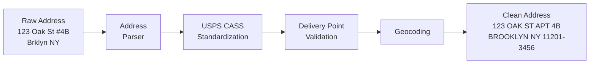

**USPS CASS/DPV Processing:**
- CASS (Coding Accuracy Support System): Verifies ZIP+4 coding
- DPV (Delivery Point Validation): Confirms address exists as deliverable
- LACSLink: Converts rural route addresses to city-style
- SuiteLink: Appends suite/apartment numbers for businesses

### 20.3 Duplicate Detection

```json
{
  "duplicateDetectionRules": {
    "party": {
      "exactMatch": {
        "fields": ["governmentId"],
        "confidence": 1.0,
        "action": "MERGE"
      },
      "probabilisticMatch": {
        "fields": [
          {"field": "lastName", "algorithm": "SOUNDEX", "weight": 0.25},
          {"field": "firstName", "algorithm": "JARO_WINKLER", "weight": 0.20},
          {"field": "dateOfBirth", "algorithm": "EXACT", "weight": 0.30},
          {"field": "zipCode", "algorithm": "FIRST_5", "weight": 0.15},
          {"field": "phone", "algorithm": "LAST_7", "weight": 0.10}
        ],
        "thresholds": {
          "autoMerge": 0.95,
          "reviewRequired": 0.75,
          "noMatch": 0.50
        }
      }
    }
  }
}
```

---

## 21. Architecture Patterns

### 21.1 API Gateway with Format Transformation

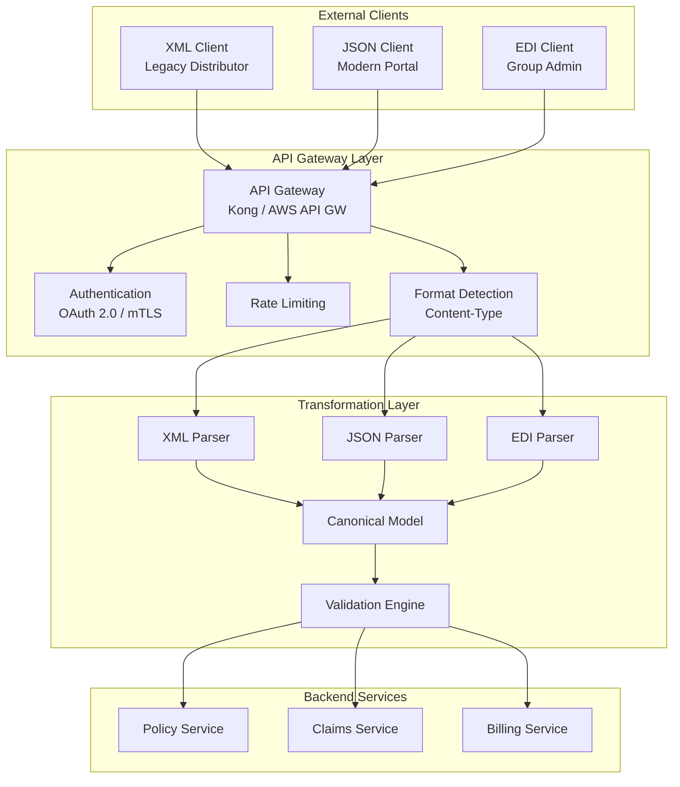

### 21.2 Schema Registry Architecture

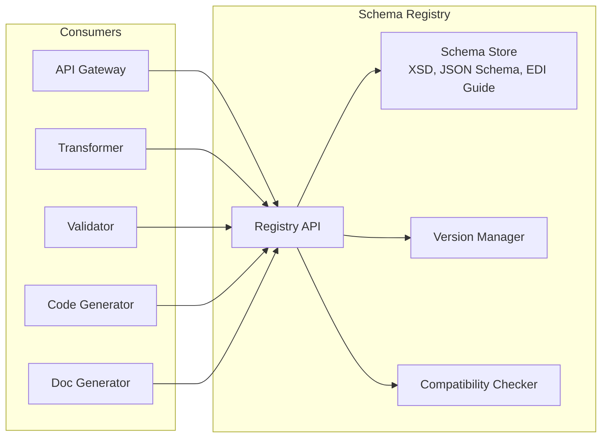

### 21.3 Message Broker Integration

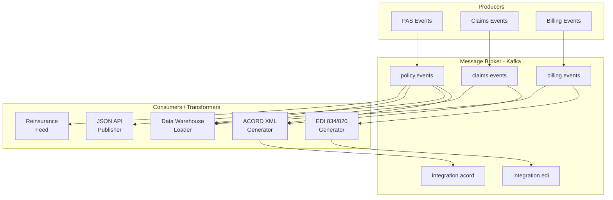

### 21.4 Format Decision Matrix

| Criterion | Use XML | Use JSON | Use EDI |
|-----------|---------|----------|---------|
| Partner requires ACORD TXLife | Yes | | |
| New customer-facing API | | Yes | |
| Group enrollment with TPA | | | Yes |
| Internal microservice communication | | Yes | |
| Regulatory filing | Yes (XBRL) | | |
| High-volume batch (existing EDI) | | | Yes |
| Mobile/SPA frontend | | Yes | |
| Complex document structure | Yes | | |
| Real-time streaming | | Yes | |
| Reinsurance bordereau | Yes | | |

---

*This article is part of the Life Insurance PAS Architect's Encyclopedia. For related topics, see Article 14 (ACORD Standards), Article 16 (ISO 20022 & Financial Messaging), and Article 17 (Master Data Management).*
