# Article 16: ISO 20022 & Financial Messaging for Insurance

## Table of Contents

1. [ISO 20022 Overview](#1-iso-20022-overview)
2. [ISO 20022 Business Model and Architecture](#2-iso-20022-business-model-and-architecture)
3. [Payments Domain — Customer to Bank (pain)](#3-payments-domain--customer-to-bank-pain)
4. [Payments Domain — FI to FI (pacs)](#4-payments-domain--fi-to-fi-pacs)
5. [Cash Management Domain (camt)](#5-cash-management-domain-camt)
6. [Insurance Premium Collection Flows](#6-insurance-premium-collection-flows)
7. [Insurance Claim/Benefit Disbursement](#7-insurance-claimbenefit-disbursement)
8. [SWIFT for Insurance](#8-swift-for-insurance)
9. [ACH/NACHA File Format](#9-achnacha-file-format)
10. [Wire Transfer Formats](#10-wire-transfer-formats)
11. [Real-Time Payments](#11-real-time-payments)
12. [Payment Orchestration](#12-payment-orchestration)
13. [Insurance-Specific Payment Patterns](#13-insurance-specific-payment-patterns)
14. [Reconciliation](#14-reconciliation)
15. [Complete ISO 20022 Message Examples](#15-complete-iso-20022-message-examples)
16. [NACHA File Format Examples](#16-nacha-file-format-examples)
17. [Architecture Patterns](#17-architecture-patterns)

---

## 1. ISO 20022 Overview

### 1.1 What is ISO 20022?

ISO 20022 is an international standard for financial messaging that provides a common platform for the development of messages. Unlike its predecessor ISO 15022 (which was text-based with fixed-field formats), ISO 20022 is built on XML and uses a methodology that allows financial institutions to define message structures based on business processes.

For life insurance, ISO 20022 is critical because it standardizes the payment messages used for:
- Premium collection (direct debit, credit transfer)
- Claim and benefit disbursement
- Commission payments to agents
- Reinsurance settlements
- Investment-linked product fund transactions
- Annuity payout processing
- 1035 exchange fund transfers

### 1.2 Evolution from ISO 15022

| Feature | ISO 15022 | ISO 20022 |
|---------|-----------|-----------|
| Syntax | Tagged text (MT format) | XML |
| Field Length | Fixed (limited) | Flexible |
| Character Set | Limited (SWIFT charset) | Unicode (UTF-8) |
| Data Richness | Constrained by field size | Rich, structured data |
| Remittance Info | 4 × 35 characters | Unlimited structured data |
| Business Model | No formal model | UML-based business model |
| Extensibility | Limited | Market practice extensions |
| Coexistence | MT messages | MX messages (coexist during migration) |

### 1.3 Adoption Timeline

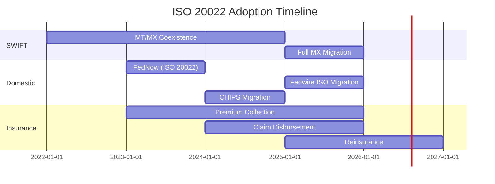
```mermaid
gantt
    title ISO 20022 Adoption Timeline
    dateFormat YYYY
    section SWIFT
    MT/MX Coexistence       :2022, 2025
    Full MX Migration       :2025, 2026
    section Domestic
    FedNow (ISO 20022)      :2023, 2024
    Fedwire ISO Migration   :2025, 2026
    CHIPS Migration         :2024, 2025
    section Insurance
    Premium Collection      :2023, 2026
    Claim Disbursement      :2024, 2026
    Reinsurance             :2025, 2027
```

### 1.4 ISO 20022 Message Identification

ISO 20022 messages follow a naming convention:

```
[business area].[message type].[variant].[version]

Examples:
  pain.001.001.09  — Customer Credit Transfer Initiation (version 9)
  pacs.008.001.08  — FI to FI Customer Credit Transfer (version 8)
  camt.053.001.08  — Bank to Customer Statement (version 8)
```

**Business Area Codes:**

| Code | Business Area | Insurance Relevance |
|------|--------------|-------------------|
| pain | Payment Initiation | Premium debit, claim payment initiation |
| pacs | Payment Clearing & Settlement | Interbank premium/claim clearing |
| camt | Cash Management | Bank statement reconciliation |
| acmt | Account Management | Banking relationship setup |
| admi | Administration | Message rejection, system events |
| auth | Authorities | Regulatory reporting |
| sese | Securities Settlement | Variable product fund settlements |
| seev | Securities Events | Corporate actions on funds |
| reda | Reference Data | Fund reference data |

---

## 2. ISO 20022 Business Model and Architecture

### 2.1 Layered Architecture

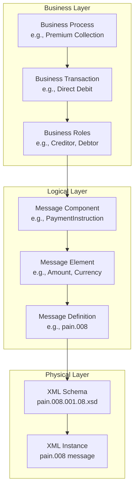
```mermaid
graph TB
    subgraph Business Layer
        BP[Business Process<br>e.g., Premium Collection]
        BT[Business Transaction<br>e.g., Direct Debit]
        BR[Business Roles<br>e.g., Creditor, Debtor]
    end
    
    subgraph Logical Layer
        MC[Message Component<br>e.g., PaymentInstruction]
        ME[Message Element<br>e.g., Amount, Currency]
        MD[Message Definition<br>e.g., pain.008]
    end
    
    subgraph Physical Layer
        XSD[XML Schema<br>pain.008.001.08.xsd]
        XML[XML Instance<br>pain.008 message]
    end
    
    BP --> BT --> BR
    BR --> MC --> ME --> MD
    MD --> XSD --> XML
```

### 2.2 Key Concepts

**Business Components:** Reusable building blocks that model real-world entities:
- `Party` — Person or organization
- `Account` — Financial account
- `Amount` — Monetary value with currency
- `DateAndDateTime` — Temporal references
- `PaymentInstruction` — Payment order details

**Message Building Blocks (MBBs):** Standardized sub-structures reused across messages:
- `GroupHeader` — Common header for all payment messages
- `PaymentInformation` — Batch-level payment details
- `CreditTransferTransactionInformation` — Individual transaction
- `CreditorAgent` — Beneficiary's bank
- `DebtorAgent` — Payer's bank

---

## 3. Payments Domain — Customer to Bank (pain)

### 3.1 pain.001 — Customer Credit Transfer Initiation

Used by insurance carriers to initiate outbound payments — claim disbursements, commission payments, annuity payouts.

**Message Structure:**

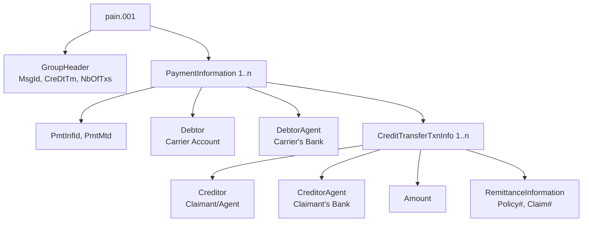
```mermaid
graph TB
    MSG[pain.001] --> GH[GroupHeader<br>MsgId, CreDtTm, NbOfTxs]
    MSG --> PI1[PaymentInformation 1..n]
    PI1 --> PID[PmtInfId, PmtMtd]
    PI1 --> DBTR[Debtor<br>Carrier Account]
    PI1 --> DBTAGT[DebtorAgent<br>Carrier's Bank]
    PI1 --> CDT1[CreditTransferTxnInfo 1..n]
    CDT1 --> CDTR[Creditor<br>Claimant/Agent]
    CDT1 --> CDTAGT[CreditorAgent<br>Claimant's Bank]
    CDT1 --> AMT[Amount]
    CDT1 --> RMT[RemittanceInformation<br>Policy#, Claim#]
```

**Insurance Use Cases:**
- Claim payment to beneficiary
- Commission payment to agent/broker
- Annuity payout to annuitant
- Surrender value disbursement
- Loan disbursement
- Dividend payment
- Premium refund

### 3.2 pain.002 — Payment Status Report

Response from bank to carrier about payment status.

| Status Code | Description | Insurance Action |
|-------------|-------------|-----------------|
| ACCP | Accepted | Log successful initiation |
| ACTC | AcceptedTechnicalValidation | Validated, pending processing |
| ACSP | AcceptedSettlementInProcess | In clearing/settlement |
| ACSC | AcceptedSettlementCompleted | Payment complete — update claim |
| RJCT | Rejected | Re-route or manual intervention |
| PDNG | Pending | Monitor, escalate if delayed |
| CANC | Cancelled | Void original, reprocess |

### 3.3 pain.008 — Customer Direct Debit Initiation

Used for premium collection via direct debit.

```xml
<?xml version="1.0" encoding="UTF-8"?>
<Document xmlns="urn:iso:std:iso:20022:tech:xsd:pain.008.001.08">
  <CstmrDrctDbtInitn>
    <GrpHdr>
      <MsgId>PREM-DD-20250215-001</MsgId>
      <CreDtTm>2025-02-15T08:00:00Z</CreDtTm>
      <NbOfTxs>3</NbOfTxs>
      <CtrlSum>2350.00</CtrlSum>
      <InitgPty>
        <Nm>ACME Life Insurance Company</Nm>
        <Id>
          <OrgId>
            <Othr>
              <Id>ACME-INS-001</Id>
              <SchmeNm>
                <Cd>CUST</Cd>
              </SchmeNm>
            </Othr>
          </OrgId>
        </Id>
      </InitgPty>
    </GrpHdr>
    <PmtInf>
      <PmtInfId>BATCH-PREM-20250215-001</PmtInfId>
      <PmtMtd>DD</PmtMtd>
      <BtchBookg>true</BtchBookg>
      <NbOfTxs>3</NbOfTxs>
      <CtrlSum>2350.00</CtrlSum>
      <PmtTpInf>
        <SvcLvl>
          <Cd>SEPA</Cd>
        </SvcLvl>
        <LclInstrm>
          <Cd>CORE</Cd>
        </LclInstrm>
        <SeqTp>RCUR</SeqTp>
      </PmtTpInf>
      <ReqdColltnDt>2025-02-15</ReqdColltnDt>
      <Cdtr>
        <Nm>ACME Life Insurance Company</Nm>
        <PstlAdr>
          <StrtNm>100 Insurance Plaza</StrtNm>
          <TwnNm>Hartford</TwnNm>
          <CtrySubDvsn>CT</CtrySubDvsn>
          <PstCd>06103</PstCd>
          <Ctry>US</Ctry>
        </PstlAdr>
      </Cdtr>
      <CdtrAcct>
        <Id>
          <Othr>
            <Id>98765432100</Id>
          </Othr>
        </Id>
      </CdtrAcct>
      <CdtrAgt>
        <FinInstnId>
          <BICFI>CHASUS33XXX</BICFI>
          <ClrSysMmbId>
            <MmbId>021000021</MmbId>
          </ClrSysMmbId>
        </FinInstnId>
      </CdtrAgt>

      <!-- Premium Payment 1 -->
      <DrctDbtTxInf>
        <PmtId>
          <InstrId>INSTR-001</InstrId>
          <EndToEndId>PREM-IUL2025-00012345-202502</EndToEndId>
        </PmtId>
        <InstdAmt Ccy="USD">850.00</InstdAmt>
        <DrctDbtTx>
          <MndtRltdInf>
            <MndtId>MANDATE-IUL2025-00012345</MndtId>
            <DtOfSgntr>2025-01-10</DtOfSgntr>
          </MndtRltdInf>
        </DrctDbtTx>
        <DbtrAgt>
          <FinInstnId>
            <BICFI>CHASUS33XXX</BICFI>
            <ClrSysMmbId>
              <MmbId>021000089</MmbId>
            </ClrSysMmbId>
          </FinInstnId>
        </DbtrAgt>
        <Dbtr>
          <Nm>John M Smith</Nm>
          <PstlAdr>
            <StrtNm>123 Oak Street Apt 4B</StrtNm>
            <TwnNm>Brooklyn</TwnNm>
            <CtrySubDvsn>NY</CtrySubDvsn>
            <PstCd>11201</PstCd>
            <Ctry>US</Ctry>
          </PstlAdr>
        </Dbtr>
        <DbtrAcct>
          <Id>
            <Othr>
              <Id>XXXX4567</Id>
            </Othr>
          </Id>
        </DbtrAcct>
        <RmtInf>
          <Strd>
            <RfrdDocInf>
              <Tp>
                <CdOrPrtry>
                  <Cd>CINV</Cd>
                </CdOrPrtry>
              </Tp>
              <Nb>PREM-INV-202502-00012345</Nb>
              <RltdDt>2025-02-01</RltdDt>
            </RfrdDocInf>
            <RfrdDocAmt>
              <DuePyblAmt Ccy="USD">850.00</DuePyblAmt>
            </RfrdDocAmt>
            <AddtlRmtInf>Policy: IUL-2025-00012345 | Premium Feb 2025</AddtlRmtInf>
          </Strd>
        </RmtInf>
      </DrctDbtTxInf>

      <!-- Premium Payment 2 -->
      <DrctDbtTxInf>
        <PmtId>
          <InstrId>INSTR-002</InstrId>
          <EndToEndId>PREM-TL2025-00098765-202502</EndToEndId>
        </PmtId>
        <InstdAmt Ccy="USD">125.50</InstdAmt>
        <DrctDbtTx>
          <MndtRltdInf>
            <MndtId>MANDATE-TL2025-00098765</MndtId>
            <DtOfSgntr>2024-06-15</DtOfSgntr>
          </MndtRltdInf>
        </DrctDbtTx>
        <DbtrAgt>
          <FinInstnId>
            <ClrSysMmbId>
              <MmbId>021000021</MmbId>
            </ClrSysMmbId>
          </FinInstnId>
        </DbtrAgt>
        <Dbtr>
          <Nm>Jane M Smith</Nm>
        </Dbtr>
        <DbtrAcct>
          <Id>
            <Othr>
              <Id>XXXX8901</Id>
            </Othr>
          </Id>
        </DbtrAcct>
        <RmtInf>
          <Strd>
            <AddtlRmtInf>Policy: TL-2025-00098765 | Premium Feb 2025</AddtlRmtInf>
          </Strd>
        </RmtInf>
      </DrctDbtTxInf>

      <!-- Premium Payment 3 -->
      <DrctDbtTxInf>
        <PmtId>
          <InstrId>INSTR-003</InstrId>
          <EndToEndId>PREM-WL2025-00045678-202502</EndToEndId>
        </PmtId>
        <InstdAmt Ccy="USD">1374.50</InstdAmt>
        <DrctDbtTx>
          <MndtRltdInf>
            <MndtId>MANDATE-WL2025-00045678</MndtId>
            <DtOfSgntr>2023-12-01</DtOfSgntr>
          </MndtRltdInf>
        </DrctDbtTx>
        <DbtrAgt>
          <FinInstnId>
            <ClrSysMmbId>
              <MmbId>026009593</MmbId>
            </ClrSysMmbId>
          </FinInstnId>
        </DbtrAgt>
        <Dbtr>
          <Nm>Robert A Johnson</Nm>
        </Dbtr>
        <DbtrAcct>
          <Id>
            <Othr>
              <Id>XXXX2345</Id>
            </Othr>
          </Id>
        </DbtrAcct>
        <RmtInf>
          <Strd>
            <AddtlRmtInf>Policy: WL-2025-00045678 | Premium Feb 2025</AddtlRmtInf>
          </Strd>
        </RmtInf>
      </DrctDbtTxInf>
    </PmtInf>
  </CstmrDrctDbtInitn>
</Document>
```

---

## 4. Payments Domain — FI to FI (pacs)

### 4.1 pacs.008 — FI to FI Customer Credit Transfer

Interbank message for processing claim payments, commission payments, and other carrier disbursements.

```xml
<?xml version="1.0" encoding="UTF-8"?>
<Document xmlns="urn:iso:std:iso:20022:tech:xsd:pacs.008.001.08">
  <FIToFICstmrCdtTrf>
    <GrpHdr>
      <MsgId>CLMPAY-20250920-001</MsgId>
      <CreDtTm>2025-09-20T15:00:00Z</CreDtTm>
      <NbOfTxs>1</NbOfTxs>
      <SttlmInf>
        <SttlmMtd>INDA</SttlmMtd>
      </SttlmInf>
    </GrpHdr>
    <CdtTrfTxInf>
      <PmtId>
        <InstrId>CLMPAY-INSTR-001</InstrId>
        <EndToEndId>CLM-2025-DC-001-PAY</EndToEndId>
        <UETR>f47ac10b-58cc-4372-a567-0e02b2c3d479</UETR>
      </PmtId>
      <PmtTpInf>
        <InstrPrty>NORM</InstrPrty>
        <SvcLvl>
          <Cd>URGP</Cd>
        </SvcLvl>
        <CtgyPurp>
          <Cd>INSU</Cd>
        </CtgyPurp>
      </PmtTpInf>
      <IntrBkSttlmAmt Ccy="USD">1001234.56</IntrBkSttlmAmt>
      <IntrBkSttlmDt>2025-09-20</IntrBkSttlmDt>
      <ChrgBr>DEBT</ChrgBr>
      <InstgAgt>
        <FinInstnId>
          <BICFI>CHASUS33XXX</BICFI>
        </FinInstnId>
      </InstgAgt>
      <InstdAgt>
        <FinInstnId>
          <BICFI>CHASUS33XXX</BICFI>
        </FinInstnId>
      </InstdAgt>
      <Dbtr>
        <Nm>ACME Life Insurance Company</Nm>
        <PstlAdr>
          <StrtNm>100 Insurance Plaza</StrtNm>
          <TwnNm>Hartford</TwnNm>
          <CtrySubDvsn>CT</CtrySubDvsn>
          <PstCd>06103</PstCd>
          <Ctry>US</Ctry>
        </PstlAdr>
        <Id>
          <OrgId>
            <Othr>
              <Id>123456789</Id>
              <SchmeNm>
                <Cd>TXID</Cd>
              </SchmeNm>
            </Othr>
          </OrgId>
        </Id>
      </Dbtr>
      <DbtrAcct>
        <Id>
          <Othr>
            <Id>98765432100</Id>
          </Othr>
        </Id>
        <Tp>
          <Cd>CACC</Cd>
        </Tp>
      </DbtrAcct>
      <DbtrAgt>
        <FinInstnId>
          <BICFI>CHASUS33XXX</BICFI>
          <ClrSysMmbId>
            <MmbId>021000021</MmbId>
          </ClrSysMmbId>
        </FinInstnId>
      </DbtrAgt>
      <CdtrAgt>
        <FinInstnId>
          <BICFI>CHASUS33XXX</BICFI>
          <ClrSysMmbId>
            <MmbId>021000089</MmbId>
          </ClrSysMmbId>
        </FinInstnId>
      </CdtrAgt>
      <Cdtr>
        <Nm>Jane M Smith</Nm>
        <PstlAdr>
          <StrtNm>123 Oak Street Apt 4B</StrtNm>
          <TwnNm>Brooklyn</TwnNm>
          <CtrySubDvsn>NY</CtrySubDvsn>
          <PstCd>11201</PstCd>
          <Ctry>US</Ctry>
        </PstlAdr>
      </Cdtr>
      <CdtrAcct>
        <Id>
          <Othr>
            <Id>XXXX8901</Id>
          </Othr>
        </Id>
        <Tp>
          <Cd>CACC</Cd>
        </Tp>
      </CdtrAcct>
      <Purp>
        <Cd>INSU</Cd>
      </Purp>
      <RmtInf>
        <Strd>
          <RfrdDocInf>
            <Tp>
              <CdOrPrtry>
                <Prtry>INSURANCE_CLAIM</Prtry>
              </CdOrPrtry>
            </Tp>
            <Nb>CLM-2025-DC-001</Nb>
          </RfrdDocInf>
          <AddtlRmtInf>Death Claim Payment | Policy: IUL-2025-00012345 | Insured: John M Smith | Beneficiary: Jane M Smith</AddtlRmtInf>
        </Strd>
      </RmtInf>
    </CdtTrfTxInf>
  </FIToFICstmrCdtTrf>
</Document>
```

### 4.2 pacs.009 — Financial Institution Credit Transfer

Used for interbank transfers related to reinsurance settlements or large-value fund transfers (1035 exchanges).

### 4.3 Purpose Codes Relevant to Insurance

| Code | Description | Insurance Use |
|------|-------------|---------------|
| INSU | Insurance Premium | Premium collection |
| LICF | Life Insurance Claims | Death/disability claim payments |
| BENE | Benefit Payment | Annuity payout, maturity benefit |
| COMM | Commission | Agent/broker commission |
| DIVI | Dividend Payment | Policy dividend |
| LOAN | Loan | Policy loan disbursement |
| TAXS | Tax Payment | Tax withholding remittance |
| REFU | Refund | Premium refund |
| RINP | Recurring Insurance Payment | Systematic withdrawals |

---

## 5. Cash Management Domain (camt)

### 5.1 camt.052 — Bank to Customer Account Report (Intraday)

Real-time account balance and transaction reporting used for intraday cash position monitoring.

### 5.2 camt.053 — Bank to Customer Statement (End of Day)

End-of-day bank statement used for daily reconciliation of premium collection accounts and disbursement accounts.

```xml
<?xml version="1.0" encoding="UTF-8"?>
<Document xmlns="urn:iso:std:iso:20022:tech:xsd:camt.053.001.08">
  <BkToCstmrStmt>
    <GrpHdr>
      <MsgId>STMT-20250215-001</MsgId>
      <CreDtTm>2025-02-16T06:00:00Z</CreDtTm>
    </GrpHdr>
    <Stmt>
      <Id>STMT-ACME-PREM-20250215</Id>
      <ElctrncSeqNb>46</ElctrncSeqNb>
      <CreDtTm>2025-02-16T06:00:00Z</CreDtTm>
      <FrToDt>
        <FrDtTm>2025-02-15T00:00:00Z</FrDtTm>
        <ToDtTm>2025-02-15T23:59:59Z</ToDtTm>
      </FrToDt>
      <Acct>
        <Id>
          <Othr>
            <Id>98765432100</Id>
          </Othr>
        </Id>
        <Tp>
          <Cd>CACC</Cd>
        </Tp>
        <Ccy>USD</Ccy>
        <Ownr>
          <Nm>ACME Life Insurance - Premium Collection</Nm>
        </Ownr>
      </Acct>
      <Bal>
        <Tp>
          <CdOrPrtry>
            <Cd>OPBD</Cd>
          </CdOrPrtry>
        </Tp>
        <Amt Ccy="USD">5234567.89</Amt>
        <CdtDbtInd>CRDT</CdtDbtInd>
        <Dt>
          <Dt>2025-02-15</Dt>
        </Dt>
      </Bal>
      <Bal>
        <Tp>
          <CdOrPrtry>
            <Cd>CLBD</Cd>
          </CdOrPrtry>
        </Tp>
        <Amt Ccy="USD">5456789.01</Amt>
        <CdtDbtInd>CRDT</CdtDbtInd>
        <Dt>
          <Dt>2025-02-15</Dt>
        </Dt>
      </Bal>

      <!-- Entry: Batch premium collection -->
      <Ntry>
        <NtryRef>ENT-20250215-001</NtryRef>
        <Amt Ccy="USD">245678.90</Amt>
        <CdtDbtInd>CRDT</CdtDbtInd>
        <Sts>
          <Cd>BOOK</Cd>
        </Sts>
        <BookgDt>
          <Dt>2025-02-15</Dt>
        </BookgDt>
        <ValDt>
          <Dt>2025-02-15</Dt>
        </ValDt>
        <BkTxCd>
          <Domn>
            <Cd>PMNT</Cd>
            <Fmly>
              <Cd>RCDT</Cd>
              <SubFmlyCd>DMCT</SubFmlyCd>
            </Fmly>
          </Domn>
        </BkTxCd>
        <NtryDtls>
          <Btch>
            <NbOfTxs>1523</NbOfTxs>
            <TtlAmt Ccy="USD">245678.90</TtlAmt>
          </Btch>
          <TxDtls>
            <Refs>
              <EndToEndId>BATCH-PREM-20250215-001</EndToEndId>
            </Refs>
            <RmtInf>
              <Ustrd>Monthly Premium Collection Batch - Feb 2025</Ustrd>
            </RmtInf>
          </TxDtls>
        </NtryDtls>
      </Ntry>

      <!-- Entry: NSF Return -->
      <Ntry>
        <NtryRef>ENT-20250215-002</NtryRef>
        <Amt Ccy="USD">850.00</Amt>
        <CdtDbtInd>DBIT</CdtDbtInd>
        <Sts>
          <Cd>BOOK</Cd>
        </Sts>
        <BookgDt>
          <Dt>2025-02-15</Dt>
        </BookgDt>
        <BkTxCd>
          <Domn>
            <Cd>PMNT</Cd>
            <Fmly>
              <Cd>RDDT</Cd>
              <SubFmlyCd>RJCT</SubFmlyCd>
            </Fmly>
          </Domn>
        </BkTxCd>
        <NtryDtls>
          <TxDtls>
            <Refs>
              <EndToEndId>PREM-IUL2025-00099999-202502</EndToEndId>
            </Refs>
            <RtrInf>
              <Rsn>
                <Cd>AM04</Cd>
              </Rsn>
              <AddtlInf>Insufficient Funds</AddtlInf>
            </RtrInf>
          </TxDtls>
        </NtryDtls>
      </Ntry>

      <!-- Entry: Claim payment outbound -->
      <Ntry>
        <NtryRef>ENT-20250215-003</NtryRef>
        <Amt Ccy="USD">23456.78</Amt>
        <CdtDbtInd>DBIT</CdtDbtInd>
        <Sts>
          <Cd>BOOK</Cd>
        </Sts>
        <BookgDt>
          <Dt>2025-02-15</Dt>
        </BookgDt>
        <BkTxCd>
          <Domn>
            <Cd>PMNT</Cd>
            <Fmly>
              <Cd>ICDT</Cd>
              <SubFmlyCd>ESCT</SubFmlyCd>
            </Fmly>
          </Domn>
        </BkTxCd>
        <NtryDtls>
          <TxDtls>
            <Refs>
              <EndToEndId>CLM-2025-AB-00456</EndToEndId>
            </Refs>
            <RmtInf>
              <Strd>
                <AddtlRmtInf>Accelerated Death Benefit - Policy WL-2020-00045678</AddtlRmtInf>
              </Strd>
            </RmtInf>
          </TxDtls>
        </NtryDtls>
      </Ntry>
    </Stmt>
  </BkToCstmrStmt>
</Document>
```

### 5.3 camt.054 — Bank to Customer Debit/Credit Notification

Real-time notification of individual credits/debits. Used for immediate premium posting or claim payment confirmation.

### 5.4 Balance Type Codes

| Code | Description | Insurance Use |
|------|-------------|---------------|
| OPBD | Opening Booked | Previous day closing = today's opening |
| CLBD | Closing Booked | End-of-day balance for reconciliation |
| OPAV | Opening Available | Available balance at start of day |
| CLAV | Closing Available | Available for claim disbursement |
| ITBD | InterimBooked | Intraday position monitoring |
| ITAV | InterimAvailable | Intraday available for payment decisions |
| PRCD | Previously Closed Booked | Prior period balance |
| FWAV | Forward Available | Future-dated settlements included |

---

## 6. Insurance Premium Collection Flows

### 6.1 EFT/ACH Premium Collection

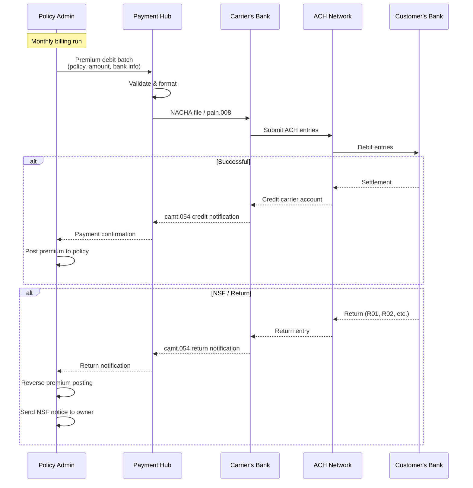
```mermaid
sequenceDiagram
    participant PAS as Policy Admin
    participant PayHub as Payment Hub
    participant Bank as Carrier's Bank
    participant ACH as ACH Network
    participant CustBank as Customer's Bank
    
    Note over PAS: Monthly billing run
    PAS->>PayHub: Premium debit batch<br>(policy, amount, bank info)
    PayHub->>PayHub: Validate & format
    PayHub->>Bank: NACHA file / pain.008
    Bank->>ACH: Submit ACH entries
    ACH->>CustBank: Debit entries
    
    alt Successful
        CustBank-->>ACH: Settlement
        ACH-->>Bank: Credit carrier account
        Bank-->>PayHub: camt.054 credit notification
        PayHub-->>PAS: Payment confirmation
        PAS->>PAS: Post premium to policy
    end
    
    alt NSF / Return
        CustBank-->>ACH: Return (R01, R02, etc.)
        ACH-->>Bank: Return entry
        Bank-->>PayHub: camt.054 return notification
        PayHub-->>PAS: Return notification
        PAS->>PAS: Reverse premium posting
        PAS->>PAS: Send NSF notice to owner
    end
```

### 6.2 ACH Return Codes for Insurance

| Return Code | Description | Insurance Action |
|-------------|-------------|-----------------|
| R01 | Insufficient Funds | Send NSF notice, retry per policy |
| R02 | Account Closed | Suspend EFT, request new bank info |
| R03 | No Account/Unable to Locate | Verify banking data, send direct bill |
| R04 | Invalid Account Number | Verify and correct, NOC if available |
| R05 | Unauthorized Debit | Contact policy owner, may need new auth |
| R06 | Returned per ODFI Request | Investigate, may be recall |
| R07 | Auth Revoked by Customer | Suspend EFT, convert to direct bill |
| R08 | Payment Stopped | Contact owner, may be intentional |
| R10 | Customer Advises Not Authorized | Fraud investigation, suspend EFT |
| R16 | Account Frozen | Contact owner, convert to direct bill |
| R20 | Non-Transaction Account | Need different account type |
| R29 | Corporate Customer Not Authorized | Verify corporate authorization |

### 6.3 Premium Collection Timing

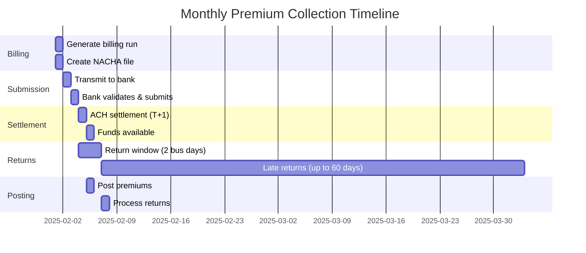
```mermaid
gantt
    title Monthly Premium Collection Timeline
    dateFormat YYYY-MM-DD
    
    section Billing
    Generate billing run       :2025-02-01, 1d
    Create NACHA file          :2025-02-01, 1d
    
    section Submission
    Transmit to bank           :2025-02-02, 1d
    Bank validates & submits   :2025-02-03, 1d
    
    section Settlement
    ACH settlement (T+1)       :2025-02-04, 1d
    Funds available            :2025-02-05, 1d
    
    section Returns
    Return window (2 bus days) :2025-02-04, 3d
    Late returns (up to 60 days) :2025-02-07, 55d
    
    section Posting
    Post premiums              :2025-02-05, 1d
    Process returns            :2025-02-07, 1d
```

---

## 7. Insurance Claim/Benefit Disbursement

### 7.1 Claim Payment Flow

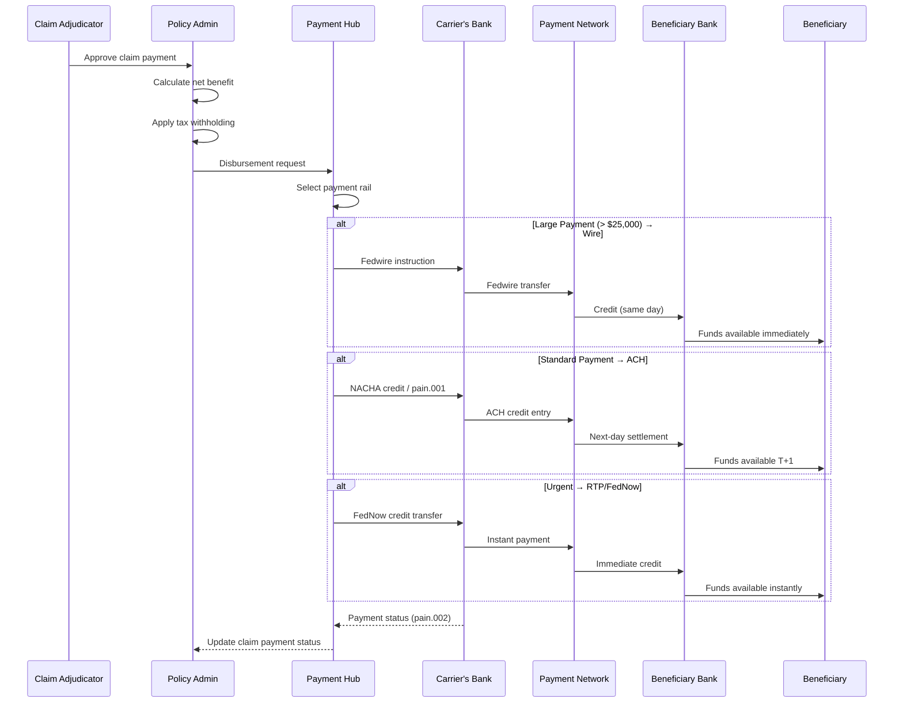
```mermaid
sequenceDiagram
    participant Adj as Claim Adjudicator
    participant PAS as Policy Admin
    participant PayHub as Payment Hub
    participant Bank as Carrier's Bank
    participant Network as Payment Network
    participant BeneBank as Beneficiary Bank
    participant Bene as Beneficiary
    
    Adj->>PAS: Approve claim payment
    PAS->>PAS: Calculate net benefit
    PAS->>PAS: Apply tax withholding
    PAS->>PayHub: Disbursement request
    
    PayHub->>PayHub: Select payment rail
    
    alt Large Payment (> $25,000) → Wire
        PayHub->>Bank: Fedwire instruction
        Bank->>Network: Fedwire transfer
        Network->>BeneBank: Credit (same day)
        BeneBank->>Bene: Funds available immediately
    end
    
    alt Standard Payment → ACH
        PayHub->>Bank: NACHA credit / pain.001
        Bank->>Network: ACH credit entry
        Network->>BeneBank: Next-day settlement
        BeneBank->>Bene: Funds available T+1
    end
    
    alt Urgent → RTP/FedNow
        PayHub->>Bank: FedNow credit transfer
        Bank->>Network: Instant payment
        Network->>BeneBank: Immediate credit
        BeneBank->>Bene: Funds available instantly
    end
    
    Bank-->>PayHub: Payment status (pain.002)
    PayHub-->>PAS: Update claim payment status
```

### 7.2 Tax Withholding on Disbursements

| Payment Type | Federal W/H | State W/H | 1099 Type |
|-------------|-------------|-----------|-----------|
| Death Benefit (proceeds) | None (life insurance exclusion) | None | None |
| Death Benefit (interest component) | Backup W/H if no W-9 | Varies by state | 1099-INT |
| Annuity Payout | 10% default (W-4P) | Varies | 1099-R |
| Policy Surrender (gain) | 10% default | Varies | 1099-R |
| Policy Loan (MEC) | 10% + 10% penalty if < 59½ | Varies | 1099-R |
| 1035 Exchange | None (tax-free exchange) | None | 1099-R (Code 6) |
| Dividend (excess of basis) | Backup W/H | Varies | 1099-R |

---

## 8. SWIFT for Insurance

### 8.1 SWIFT gpi for Cross-Border Payments

SWIFT gpi (Global Payments Innovation) provides end-to-end tracking for cross-border premium and claim payments.

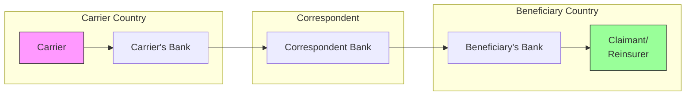
```mermaid
graph LR
    subgraph Carrier Country
        C[Carrier] --> CB[Carrier's Bank]
    end
    subgraph Correspondent
        CB --> CORR[Correspondent Bank]
    end
    subgraph Beneficiary Country
        CORR --> BB[Beneficiary's Bank]
        BB --> B[Claimant/<br>Reinsurer]
    end
    
    style C fill:#f9f,stroke:#333
    style B fill:#9f9,stroke:#333
```

**SWIFT gpi Features for Insurance:**
- **UETR**: Universal End-to-End Transaction Reference — tracks payment from initiation to credit
- **Tracker**: Real-time visibility into payment status
- **Confirm of Credit**: Immediate confirmation when beneficiary is credited
- **SLA**: gpi banks commit to same-day processing

### 8.2 SWIFT Message Types for Insurance

| MT/MX | Type | Insurance Use |
|-------|------|---------------|
| MT103 / pacs.008 | Single Customer Credit Transfer | Individual claim payment |
| MT202 / pacs.009 | General FI Transfer | Reinsurance settlement |
| MT940 / camt.053 | Customer Statement | Bank reconciliation |
| MT942 / camt.052 | Interim Transaction Report | Intraday cash position |
| MT199 / admi.004 | Free Format Message | Exception/inquiry |

### 8.3 Reinsurance Settlement via SWIFT

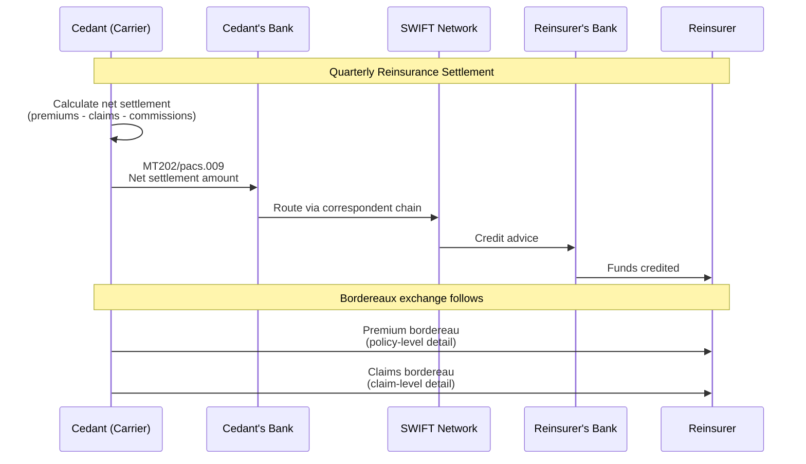
```mermaid
sequenceDiagram
    participant Cedant as Cedant (Carrier)
    participant CBank as Cedant's Bank
    participant SWIFT as SWIFT Network
    participant RBank as Reinsurer's Bank
    participant Rein as Reinsurer
    
    Note over Cedant,Rein: Quarterly Reinsurance Settlement
    
    Cedant->>Cedant: Calculate net settlement<br>(premiums - claims - commissions)
    Cedant->>CBank: MT202/pacs.009<br>Net settlement amount
    CBank->>SWIFT: Route via correspondent chain
    SWIFT->>RBank: Credit advice
    RBank->>Rein: Funds credited
    
    Note over Cedant,Rein: Bordereaux exchange follows
    Cedant->>Rein: Premium bordereau<br>(policy-level detail)
    Cedant->>Rein: Claims bordereau<br>(claim-level detail)
```

---

## 9. ACH/NACHA File Format

### 9.1 File Structure

The NACHA file format is a fixed-length record format used for ACH transactions in the United States. It is the primary format for life insurance premium collection and claim disbursement in the US market.

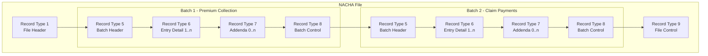
```mermaid
graph TB
    subgraph NACHA File
        FH[Record Type 1<br>File Header]
        subgraph Batch 1 - Premium Collection
            BH1[Record Type 5<br>Batch Header]
            ED1[Record Type 6<br>Entry Detail 1..n]
            AD1[Record Type 7<br>Addenda 0..n]
            BC1[Record Type 8<br>Batch Control]
        end
        subgraph Batch 2 - Claim Payments
            BH2[Record Type 5<br>Batch Header]
            ED2[Record Type 6<br>Entry Detail 1..n]
            AD2[Record Type 7<br>Addenda 0..n]
            BC2[Record Type 8<br>Batch Control]
        end
        FC[Record Type 9<br>File Control]
    end
    
    FH --> BH1 --> ED1 --> AD1 --> BC1 --> BH2 --> ED2 --> AD2 --> BC2 --> FC
```

### 9.2 Record Type Specifications

**Record Type 1 — File Header (94 characters):**

| Position | Length | Field | Description |
|----------|--------|-------|-------------|
| 1 | 1 | Record Type | "1" |
| 2-3 | 2 | Priority Code | "01" |
| 4-13 | 10 | Immediate Destination | Receiving bank routing (b+9 digits) |
| 14-23 | 10 | Immediate Origin | Originator ID (b+9 digits) |
| 24-29 | 6 | File Creation Date | YYMMDD |
| 30-33 | 4 | File Creation Time | HHMM |
| 34 | 1 | File ID Modifier | A-Z, 0-9 (uniqueness within day) |
| 35-37 | 3 | Record Size | "094" |
| 38-39 | 2 | Blocking Factor | "10" |
| 40 | 1 | Format Code | "1" |
| 41-63 | 23 | Immediate Destination Name | Bank name |
| 64-86 | 23 | Immediate Origin Name | Company name |
| 87-94 | 8 | Reference Code | Optional |

**Record Type 5 — Batch Header (94 characters):**

| Position | Length | Field | Description |
|----------|--------|-------|-------------|
| 1 | 1 | Record Type | "5" |
| 2-4 | 3 | Service Class Code | 200=Mixed, 220=Credits, 225=Debits |
| 5-20 | 16 | Company Name | "ACME LIFE INS CO" |
| 21-40 | 20 | Company Discretionary Data | Batch description |
| 41-50 | 10 | Company Identification | 1+EIN or DUNS |
| 51-53 | 3 | SEC Code | PPD, CCD, CTX, WEB |
| 54-63 | 10 | Company Entry Description | "PREMIUM", "CLMPAYMENT" |
| 64-69 | 6 | Company Descriptive Date | YYMMDD |
| 70-75 | 6 | Effective Entry Date | YYMMDD |
| 76-78 | 3 | Settlement Date (Julian) | Filled by ACH Operator |
| 79 | 1 | Originator Status Code | "1" |
| 80-87 | 8 | Originating DFI ID | First 8 of routing |
| 88-94 | 7 | Batch Number | Sequential |

**SEC Codes for Insurance:**

| SEC Code | Name | Insurance Use |
|----------|------|---------------|
| PPD | Prearranged Payment and Deposit | Individual premium collection, claim payment to individuals |
| CCD | Corporate Credit or Debit | Group premium, commission to broker-dealers |
| CTX | Corporate Trade Exchange | Premium with structured addenda (policy detail) |
| WEB | Internet-Initiated Entry | Online premium payment, web-initiated enrollment |
| TEL | Telephone-Initiated Entry | Phone-authorized premium payment |

**Record Type 6 — Entry Detail (94 characters):**

| Position | Length | Field | Description |
|----------|--------|-------|-------------|
| 1 | 1 | Record Type | "6" |
| 2-3 | 2 | Transaction Code | 22=Checking Credit, 27=Checking Debit, 32=Savings Credit, 37=Savings Debit |
| 4-11 | 8 | Receiving DFI ID | First 8 of routing number |
| 12 | 1 | Check Digit | 9th digit of routing |
| 13-29 | 17 | DFI Account Number | Account number |
| 30-39 | 10 | Amount | In cents (no decimal) |
| 40-54 | 15 | Individual ID Number | Policy number |
| 55-76 | 22 | Individual Name | Policyholder name |
| 77-78 | 2 | Discretionary Data | Optional |
| 79 | 1 | Addenda Record Indicator | 0=No, 1=Yes |
| 80-94 | 15 | Trace Number | Originating DFI + sequence |

**Record Type 7 — Addenda (94 characters):**

| Position | Length | Field | Description |
|----------|--------|-------|-------------|
| 1 | 1 | Record Type | "7" |
| 2-3 | 2 | Addenda Type Code | "05" for payment-related info |
| 4-83 | 80 | Payment Related Information | Policy details, invoice ref |
| 84-87 | 4 | Addenda Sequence Number | Sequential |
| 88-94 | 7 | Entry Detail Sequence Number | Links to entry |

### 9.3 NOC (Notification of Change) Handling

When a bank returns a Notification of Change (NOC), the carrier must update the banking information.

| NOC Code | Description | Fields to Update |
|----------|-------------|-----------------|
| C01 | Incorrect DFI Account Number | Account Number |
| C02 | Incorrect Routing Number | Routing Number |
| C03 | Incorrect Routing and Account | Both |
| C04 | Incorrect Individual Name | Name on Account |
| C05 | Incorrect Transaction Code | Trans Code (checking↔savings) |
| C06 | Incorrect Account and Trans Code | Account + Trans Code |
| C07 | Incorrect Routing, Account, Trans Code | All three |
| C09 | Incorrect Individual ID Number | Policy Number field |

---

## 10. Wire Transfer Formats

### 10.1 Fedwire Message Format

Used for same-day, irrevocable large-value transfers — single premium payments, large claim settlements.

| Tag | Field | Example |
|-----|-------|---------|
| {1500} | Sender Supplied Information | 30T (wire type) |
| {1510} | Type/Subtype | 1000 (Funds Transfer) |
| {2000} | Amount | 000001001234.56 |
| {3100} | Sender DFI | 021000021 CHASE MANHATTAN |
| {3400} | Receiver DFI | 021000089 CITIBANK |
| {3600} | Business Function Code | CTR (Customer Transfer) |
| {4000} | Beneficiary | Jane M Smith, 123 Oak St |
| {4100} | Beneficiary FI | Citibank NA |
| {4200} | Originator | ACME Life Insurance Company |
| {5000} | Originator to Beneficiary Info | Death Claim IUL-2025-00012345 |
| {6000} | Currency | USD |

### 10.2 Wire vs ACH Decision Matrix

| Factor | Wire (Fedwire) | ACH |
|--------|---------------|-----|
| Speed | Same-day, real-time | T+1 (Next business day) |
| Cost | $15–$45 per wire | $0.25–$1.50 per entry |
| Irrevocable | Yes (once sent) | No (returns possible) |
| Max Amount | No limit (practically) | $100M per entry |
| Cutoff Time | 6:00 PM ET | Various (varies by bank) |
| Best For | Claims > $25K, urgency | Recurring premiums, small payments |
| Remittance Data | Limited (4 lines × 35 chars) | CTX addenda (unlimited) |

---

## 11. Real-Time Payments

### 11.1 FedNow for Insurance

FedNow, launched in July 2023, enables instant payment processing 24/7/365.

**Insurance Use Cases:**

| Use Case | Benefit |
|----------|---------|
| Instant Claim Payment | Beneficiary receives funds within seconds |
| Emergency Advance on Claim | Partial payment while claim processes |
| Real-Time Premium Payment | Customer pays premium instantly, avoids lapse |
| Request for Payment (RfP) | Carrier sends premium request, customer approves |
| Instant Policy Loan | Policy loan disbursed immediately |
| Same-Day Surrender | Surrender proceeds available instantly |

### 11.2 FedNow Message Flow

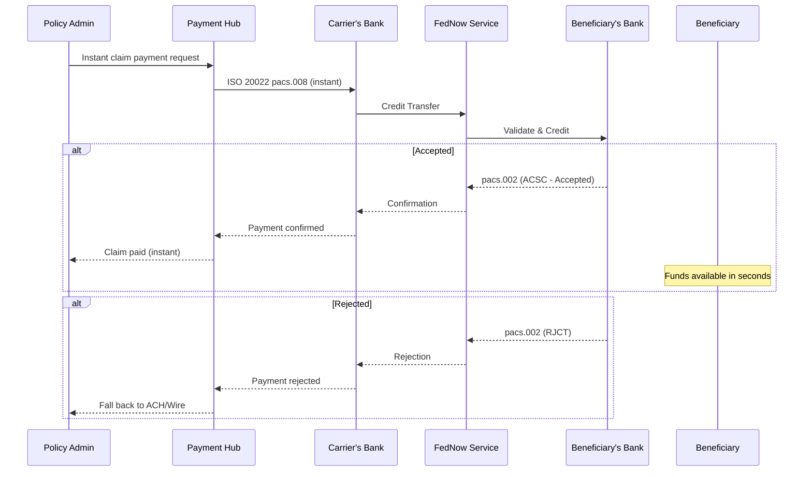
```mermaid
sequenceDiagram
    participant PAS as Policy Admin
    participant PayHub as Payment Hub
    participant FI as Carrier's Bank
    participant FedNow as FedNow Service
    participant RFI as Beneficiary's Bank
    participant Bene as Beneficiary
    
    PAS->>PayHub: Instant claim payment request
    PayHub->>FI: ISO 20022 pacs.008 (instant)
    FI->>FedNow: Credit Transfer
    FedNow->>RFI: Validate & Credit
    
    alt Accepted
        RFI-->>FedNow: pacs.002 (ACSC - Accepted)
        FedNow-->>FI: Confirmation
        FI-->>PayHub: Payment confirmed
        PayHub-->>PAS: Claim paid (instant)
        Note over Bene: Funds available in seconds
    end
    
    alt Rejected
        RFI-->>FedNow: pacs.002 (RJCT)
        FedNow-->>FI: Rejection
        FI-->>PayHub: Payment rejected
        PayHub-->>PAS: Fall back to ACH/Wire
    end
```

### 11.3 RTP (Real-Time Payments) Network

The Clearing House's RTP network provides similar capabilities. Key difference from FedNow:

| Feature | FedNow | RTP |
|---------|--------|-----|
| Operator | Federal Reserve | The Clearing House |
| Launch | July 2023 | November 2017 |
| Max Amount | $500,000 (initial) | $1,000,000 |
| Coverage | All Fed member banks eligible | ~350+ FIs connected |
| Request for Payment | Planned | Available |
| Settlement | Federal Reserve | TCH settlement account |
| Standard | ISO 20022 | ISO 20022 |

### 11.4 Request for Payment (RfP)

Allows insurers to send premium payment requests that customers can approve in their banking app.

```json
{
  "requestForPayment": {
    "rfpId": "RFP-PREM-2025-001",
    "creditor": {
      "name": "ACME Life Insurance Company",
      "accountId": "98765432100",
      "routingNumber": "021000021"
    },
    "debtor": {
      "name": "John M Smith",
      "accountId": "XXXX4567",
      "routingNumber": "021000089"
    },
    "amount": {
      "value": 850.00,
      "currency": "USD"
    },
    "expiryDate": "2025-02-28",
    "remittanceInfo": {
      "policyNumber": "IUL-2025-00012345",
      "description": "Monthly Premium - February 2025",
      "invoiceNumber": "PREM-INV-202502-00012345"
    }
  }
}
```

---

## 12. Payment Orchestration

### 12.1 Multi-Rail Payment Strategy

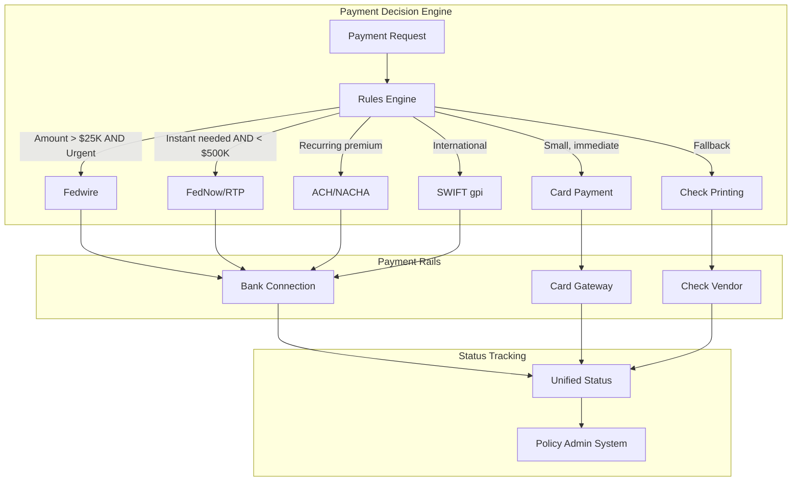
```mermaid
graph TB
    subgraph Payment Decision Engine
        REQ[Payment Request] --> RULES[Rules Engine]
        RULES --> |Amount > $25K AND Urgent| WIRE[Fedwire]
        RULES --> |Instant needed AND < $500K| FEDNOW[FedNow/RTP]
        RULES --> |Recurring premium| ACH[ACH/NACHA]
        RULES --> |International| SWIFT[SWIFT gpi]
        RULES --> |Small, immediate| CARD[Card Payment]
        RULES --> |Fallback| CHECK[Check Printing]
    end
    
    subgraph Payment Rails
        WIRE --> BANK[Bank Connection]
        FEDNOW --> BANK
        ACH --> BANK
        SWIFT --> BANK
        CARD --> GATEWAY[Card Gateway]
        CHECK --> PRINT[Check Vendor]
    end
    
    subgraph Status Tracking
        BANK --> STATUS[Unified Status]
        GATEWAY --> STATUS
        PRINT --> STATUS
        STATUS --> PAS[Policy Admin System]
    end
```

### 12.2 Payment Method Selection Logic

```json
{
  "paymentRules": [
    {
      "name": "Large Claim Payment",
      "conditions": {
        "paymentType": "CLAIM_DISBURSEMENT",
        "amount": { "gt": 25000 },
        "urgency": "HIGH"
      },
      "preferredRail": "FEDWIRE",
      "fallback": ["FEDNOW", "ACH_SAMEDAY"]
    },
    {
      "name": "Standard Claim Payment",
      "conditions": {
        "paymentType": "CLAIM_DISBURSEMENT",
        "amount": { "lte": 25000 }
      },
      "preferredRail": "FEDNOW",
      "fallback": ["ACH", "CHECK"]
    },
    {
      "name": "Recurring Premium",
      "conditions": {
        "paymentType": "PREMIUM_COLLECTION",
        "frequency": ["MONTHLY", "QUARTERLY"]
      },
      "preferredRail": "ACH_DEBIT",
      "fallback": ["REQUEST_FOR_PAYMENT"]
    },
    {
      "name": "Commission Payment",
      "conditions": {
        "paymentType": "COMMISSION"
      },
      "preferredRail": "ACH_CREDIT",
      "fallback": ["CHECK"]
    },
    {
      "name": "International Reinsurance",
      "conditions": {
        "paymentType": "REINSURANCE_SETTLEMENT",
        "country": { "ne": "US" }
      },
      "preferredRail": "SWIFT_GPI",
      "fallback": ["CORRESPONDENT_WIRE"]
    },
    {
      "name": "Annuity Payout",
      "conditions": {
        "paymentType": "ANNUITY_PAYOUT",
        "frequency": "MONTHLY"
      },
      "preferredRail": "ACH_CREDIT",
      "fallback": ["CHECK"]
    }
  ]
}
```

### 12.3 Fallback Routing

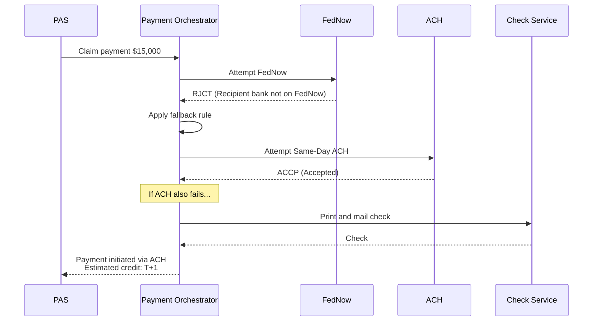
```mermaid
sequenceDiagram
    participant PAS
    participant Orch as Payment Orchestrator
    participant FN as FedNow
    participant ACH as ACH
    participant CHK as Check Service
    
    PAS->>Orch: Claim payment $15,000
    Orch->>FN: Attempt FedNow
    FN-->>Orch: RJCT (Recipient bank not on FedNow)
    
    Orch->>Orch: Apply fallback rule
    Orch->>ACH: Attempt Same-Day ACH
    ACH-->>Orch: ACCP (Accepted)
    
    Note over Orch: If ACH also fails...
    Orch->>CHK: Print and mail check
    CHK-->>Orch: Check #12345 queued
    
    Orch-->>PAS: Payment initiated via ACH<br>Estimated credit: T+1
```

---

## 13. Insurance-Specific Payment Patterns

### 13.1 Premium Collection Flows

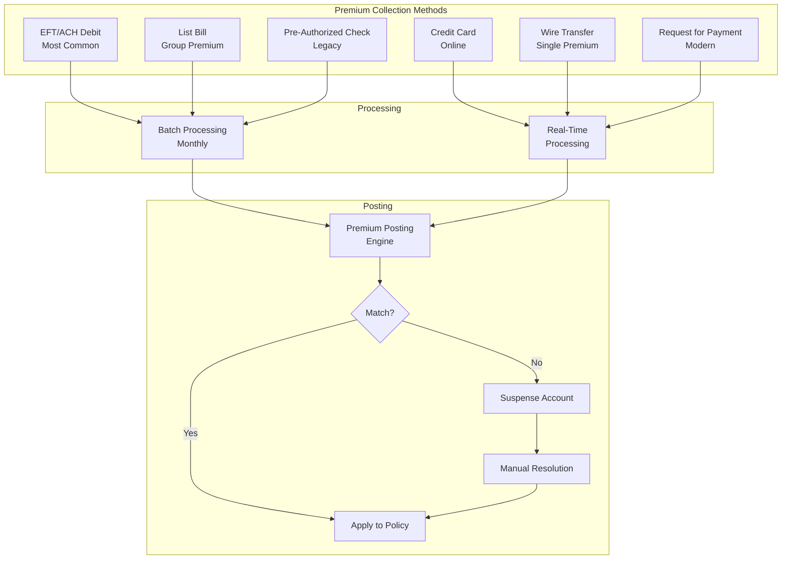
```mermaid
graph TB
    subgraph Premium Collection Methods
        EFT[EFT/ACH Debit<br>Most Common]
        LIST[List Bill<br>Group Premium]
        PAC[Pre-Authorized Check<br>Legacy]
        CC[Credit Card<br>Online]
        WIRE_IN[Wire Transfer<br>Single Premium]
        RFP_IN[Request for Payment<br>Modern]
    end
    
    subgraph Processing
        EFT --> BATCH[Batch Processing<br>Monthly]
        LIST --> BATCH
        PAC --> BATCH
        CC --> REAL[Real-Time<br>Processing]
        WIRE_IN --> REAL
        RFP_IN --> REAL
    end
    
    subgraph Posting
        BATCH --> POST[Premium Posting<br>Engine]
        REAL --> POST
        POST --> SUSPENSE{Match?}
        SUSPENSE -->|Yes| APPLY[Apply to Policy]
        SUSPENSE -->|No| SUSP[Suspense Account]
        SUSP --> MANUAL[Manual Resolution]
        MANUAL --> APPLY
    end
```

### 13.2 Commission Payment Flows

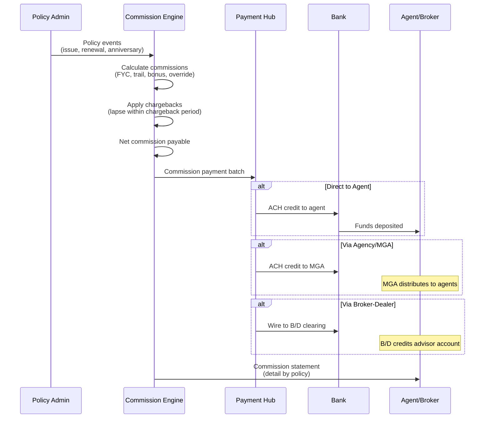
```mermaid
sequenceDiagram
    participant PAS as Policy Admin
    participant COMM as Commission Engine
    participant PAY as Payment Hub
    participant BANK as Bank
    participant AGENT as Agent/Broker
    
    PAS->>COMM: Policy events<br>(issue, renewal, anniversary)
    COMM->>COMM: Calculate commissions<br>(FYC, trail, bonus, override)
    COMM->>COMM: Apply chargebacks<br>(lapse within chargeback period)
    COMM->>COMM: Net commission payable
    COMM->>PAY: Commission payment batch
    
    alt Direct to Agent
        PAY->>BANK: ACH credit to agent
        BANK->>AGENT: Funds deposited
    end
    
    alt Via Agency/MGA
        PAY->>BANK: ACH credit to MGA
        Note over AGENT: MGA distributes to agents
    end
    
    alt Via Broker-Dealer
        PAY->>BANK: Wire to B/D clearing
        Note over AGENT: B/D credits advisor account
    end
    
    COMM->>AGENT: Commission statement<br>(detail by policy)
```

### 13.3 1035 Exchange Fund Transfer Flow

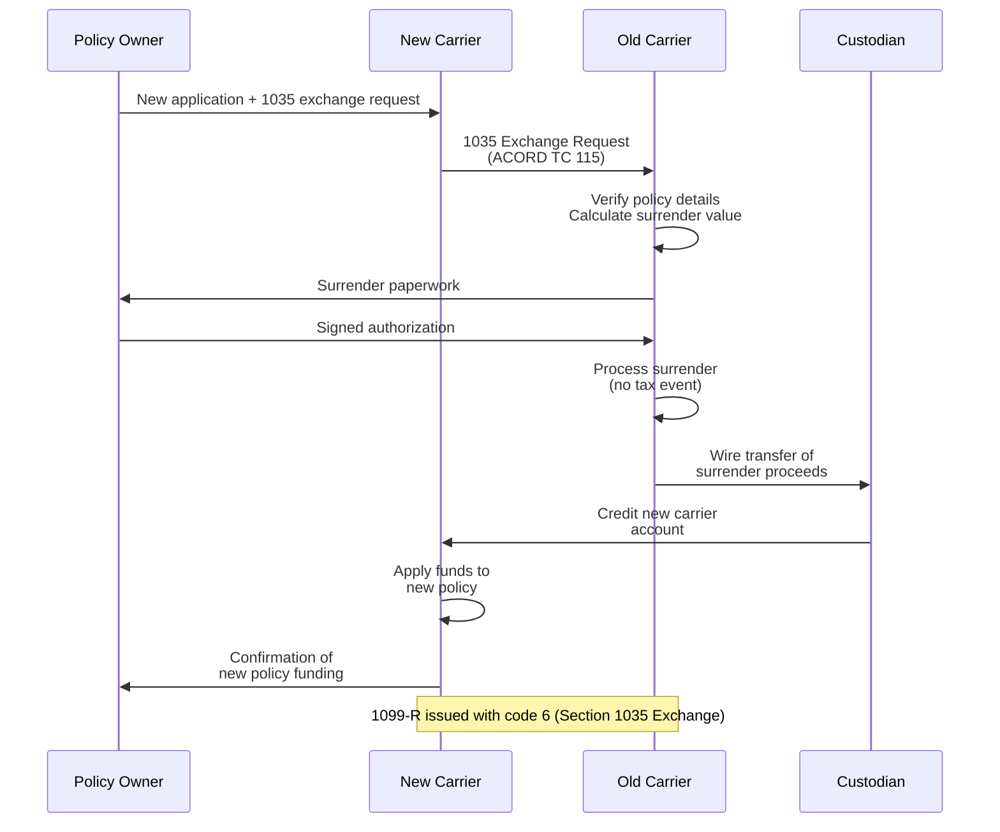
```mermaid
sequenceDiagram
    participant Owner as Policy Owner
    participant NewCarrier as New Carrier
    participant OldCarrier as Old Carrier
    participant CustodianBank as Custodian
    
    Owner->>NewCarrier: New application + 1035 exchange request
    NewCarrier->>OldCarrier: 1035 Exchange Request<br>(ACORD TC 115)
    OldCarrier->>OldCarrier: Verify policy details<br>Calculate surrender value
    OldCarrier->>Owner: Surrender paperwork
    Owner->>OldCarrier: Signed authorization
    OldCarrier->>OldCarrier: Process surrender<br>(no tax event)
    OldCarrier->>CustodianBank: Wire transfer of<br>surrender proceeds
    CustodianBank->>NewCarrier: Credit new carrier<br>account
    NewCarrier->>NewCarrier: Apply funds to<br>new policy
    NewCarrier->>Owner: Confirmation of<br>new policy funding
    
    Note over OldCarrier,NewCarrier: 1099-R issued with code 6 (Section 1035 Exchange)
```

### 13.4 Reinsurance Settlement Flow

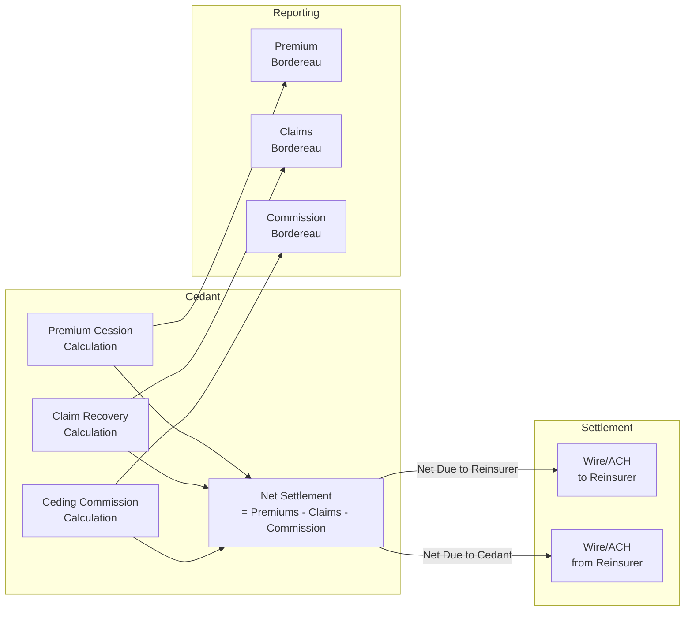
```mermaid
graph LR
    subgraph Cedant
        PC[Premium Cession<br>Calculation]
        CC2[Claim Recovery<br>Calculation]
        CE[Ceding Commission<br>Calculation]
        NS[Net Settlement<br>= Premiums - Claims - Commission]
    end
    
    subgraph Settlement
        NS -->|Net Due to Reinsurer| PAY_OUT[Wire/ACH<br>to Reinsurer]
        NS -->|Net Due to Cedant| PAY_IN[Wire/ACH<br>from Reinsurer]
    end
    
    subgraph Reporting
        PC --> BRD[Premium<br>Bordereau]
        CC2 --> BRD2[Claims<br>Bordereau]
        CE --> BRD3[Commission<br>Bordereau]
    end
    
    PC --> NS
    CC2 --> NS
    CE --> NS
```

---

## 14. Reconciliation

### 14.1 Bank Statement Reconciliation Architecture

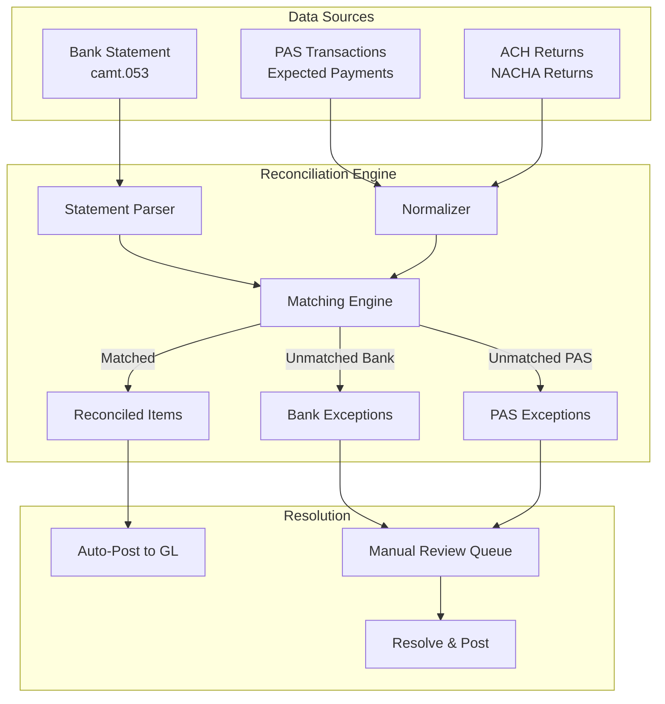
```mermaid
graph TB
    subgraph Data Sources
        BS[Bank Statement<br>camt.053]
        PAS_TXN[PAS Transactions<br>Expected Payments]
        ACH_RET[ACH Returns<br>NACHA Returns]
    end
    
    subgraph Reconciliation Engine
        BS --> PARSE[Statement Parser]
        PAS_TXN --> NORM[Normalizer]
        ACH_RET --> NORM
        PARSE --> MATCH[Matching Engine]
        NORM --> MATCH
        MATCH --> |Matched| REC[Reconciled Items]
        MATCH --> |Unmatched Bank| BANK_EXC[Bank Exceptions]
        MATCH --> |Unmatched PAS| PAS_EXC[PAS Exceptions]
    end
    
    subgraph Resolution
        REC --> POST[Auto-Post to GL]
        BANK_EXC --> REVIEW[Manual Review Queue]
        PAS_EXC --> REVIEW
        REVIEW --> RESOLVE[Resolve & Post]
    end
```

### 14.2 Payment Matching Algorithms

```json
{
  "matchingRules": [
    {
      "name": "Exact Match",
      "priority": 1,
      "criteria": {
        "endToEndId": "EXACT",
        "amount": "EXACT",
        "date": "WITHIN_1_DAY"
      },
      "confidence": 1.0,
      "action": "AUTO_RECONCILE"
    },
    {
      "name": "Amount + Policy Match",
      "priority": 2,
      "criteria": {
        "amount": "EXACT",
        "policyNumber": "EXTRACTED_FROM_REMITTANCE",
        "date": "WITHIN_3_DAYS"
      },
      "confidence": 0.95,
      "action": "AUTO_RECONCILE"
    },
    {
      "name": "Fuzzy Amount Match",
      "priority": 3,
      "criteria": {
        "amount": "WITHIN_0.01",
        "payerName": "FUZZY_MATCH_0.85",
        "date": "WITHIN_5_DAYS"
      },
      "confidence": 0.80,
      "action": "QUEUE_FOR_REVIEW"
    },
    {
      "name": "Batch Total Match",
      "priority": 4,
      "criteria": {
        "batchTotal": "EXACT",
        "batchCount": "EXACT",
        "date": "EXACT"
      },
      "confidence": 0.99,
      "action": "AUTO_RECONCILE_BATCH"
    }
  ]
}
```

### 14.3 Exception Handling and Aging

| Age (Days) | Status | Action |
|-----------|--------|--------|
| 0–3 | New | Auto-matching retry |
| 4–7 | Aging | Assigned to recon analyst |
| 8–14 | Escalated | Supervisor review |
| 15–30 | Critical | Finance management notification |
| 31+ | Overdue | Write-off review / adjustment |

### 14.4 Reconciliation Metrics

```json
{
  "dailyReconReport": {
    "date": "2025-02-15",
    "premiumCollectionAccount": {
      "bankStatementItems": 1523,
      "expectedTransactions": 1530,
      "autoReconciled": 1515,
      "autoReconciledPct": 99.47,
      "manualReview": 8,
      "unmatched": 7,
      "bankBalance": 5456789.01,
      "bookBalance": 5456123.45,
      "variance": 665.56,
      "varianceExplanation": [
        {"type": "TIMING", "amount": 450.00, "description": "Late ACH posting"},
        {"type": "NSF_RETURN", "amount": 125.50, "description": "Return not yet processed"},
        {"type": "UNIDENTIFIED", "amount": 90.06, "description": "Under investigation"}
      ]
    }
  }
}
```

---

## 15. Complete ISO 20022 Message Examples

### 15.1 pain.001 — Claim Payment Initiation

```xml
<?xml version="1.0" encoding="UTF-8"?>
<Document xmlns="urn:iso:std:iso:20022:tech:xsd:pain.001.001.09">
  <CstmrCdtTrfInitn>
    <GrpHdr>
      <MsgId>CLMPAY-BATCH-20250920-001</MsgId>
      <CreDtTm>2025-09-20T15:00:00Z</CreDtTm>
      <NbOfTxs>2</NbOfTxs>
      <CtrlSum>1026234.56</CtrlSum>
      <InitgPty>
        <Nm>ACME Life Insurance Company</Nm>
        <Id>
          <OrgId>
            <Othr>
              <Id>ACME-INS-001</Id>
            </Othr>
          </OrgId>
        </Id>
      </InitgPty>
    </GrpHdr>

    <!-- Payment Batch: Claim Disbursements -->
    <PmtInf>
      <PmtInfId>CLMPAY-20250920-001</PmtInfId>
      <PmtMtd>TRF</PmtMtd>
      <BtchBookg>false</BtchBookg>
      <NbOfTxs>2</NbOfTxs>
      <CtrlSum>1026234.56</CtrlSum>
      <PmtTpInf>
        <InstrPrty>HIGH</InstrPrty>
        <CtgyPurp>
          <Cd>INSU</Cd>
        </CtgyPurp>
      </PmtTpInf>
      <ReqdExctnDt>
        <Dt>2025-09-20</Dt>
      </ReqdExctnDt>
      <Dbtr>
        <Nm>ACME Life Insurance Company</Nm>
        <PstlAdr>
          <StrtNm>100 Insurance Plaza</StrtNm>
          <TwnNm>Hartford</TwnNm>
          <CtrySubDvsn>CT</CtrySubDvsn>
          <PstCd>06103</PstCd>
          <Ctry>US</Ctry>
        </PstlAdr>
      </Dbtr>
      <DbtrAcct>
        <Id>
          <Othr><Id>CLAIMS-DISB-001</Id></Othr>
        </Id>
      </DbtrAcct>
      <DbtrAgt>
        <FinInstnId>
          <BICFI>CHASUS33XXX</BICFI>
        </FinInstnId>
      </DbtrAgt>

      <!-- Death Claim Payment -->
      <CdtTrfTxInf>
        <PmtId>
          <InstrId>CLM-PAY-001</InstrId>
          <EndToEndId>CLM-2025-DC-001-PAY</EndToEndId>
        </PmtId>
        <Amt>
          <InstdAmt Ccy="USD">1001234.56</InstdAmt>
        </Amt>
        <CdtrAgt>
          <FinInstnId>
            <BICFI>CHASUS33XXX</BICFI>
            <ClrSysMmbId><MmbId>021000089</MmbId></ClrSysMmbId>
          </FinInstnId>
        </CdtrAgt>
        <Cdtr>
          <Nm>Jane M Smith</Nm>
          <PstlAdr>
            <StrtNm>123 Oak Street Apt 4B</StrtNm>
            <TwnNm>Brooklyn</TwnNm>
            <CtrySubDvsn>NY</CtrySubDvsn>
            <PstCd>11201</PstCd>
            <Ctry>US</Ctry>
          </PstlAdr>
        </Cdtr>
        <CdtrAcct>
          <Id>
            <Othr><Id>XXXX8901</Id></Othr>
          </Id>
        </CdtrAcct>
        <RmtInf>
          <Strd>
            <RfrdDocInf>
              <Tp><CdOrPrtry><Prtry>DEATH_CLAIM</Prtry></CdOrPrtry></Tp>
              <Nb>CLM-2025-DC-001</Nb>
            </RfrdDocInf>
            <AddtlRmtInf>Policy: IUL-2025-00012345 | Death Claim Payment to Primary Beneficiary</AddtlRmtInf>
          </Strd>
        </RmtInf>
      </CdtTrfTxInf>

      <!-- Surrender Payment -->
      <CdtTrfTxInf>
        <PmtId>
          <InstrId>SURR-PAY-001</InstrId>
          <EndToEndId>SURR-2025-00056789-PAY</EndToEndId>
        </PmtId>
        <Amt>
          <InstdAmt Ccy="USD">25000.00</InstdAmt>
        </Amt>
        <CdtrAgt>
          <FinInstnId>
            <ClrSysMmbId><MmbId>026009593</MmbId></ClrSysMmbId>
          </FinInstnId>
        </CdtrAgt>
        <Cdtr>
          <Nm>Robert A Johnson</Nm>
        </Cdtr>
        <CdtrAcct>
          <Id>
            <Othr><Id>XXXX2345</Id></Othr>
          </Id>
        </CdtrAcct>
        <RmtInf>
          <Strd>
            <AddtlRmtInf>Policy: WL-2020-00056789 | Full Surrender - CSV $25,000.00</AddtlRmtInf>
          </Strd>
        </RmtInf>
      </CdtTrfTxInf>
    </PmtInf>
  </CstmrCdtTrfInitn>
</Document>
```

---

## 16. NACHA File Format Examples

### 16.1 Premium Collection NACHA File

```
101 021000021 1234567890250215143010940101CHASE MANHATTAN BANK    ACME LIFE INS CO       REF00001
5225ACME LIFE INS  PREMIUM FEB 2025  1123456789PPD PREMIUM   250215250215   1021000010000001
627021000089XXXX4567         0000085000IUL2025-00012345JOHN M SMITH          01021000010000001
627021000021XXXX8901         0000012550TL-2025-00098765JANE M SMITH          01021000010000002
627026009593XXXX2345         0000137450WL-2025-00045678ROBERT A JOHNSON      01021000010000003
627021000089XXXX5678         0000045000VA-2025-00034567MARIA L GARCIA        01021000010000004
627021000021XXXX9012         0000022500FA-2025-00078901DAVID K LEE           01021000010000005
8225000005000880223530000000302500000000000001123456789                         021000010000001
9000001000001000000050008802235300000003025000000000000
9999999999999999999999999999999999999999999999999999999999999999999999999999999999999999999999
```

**File Breakdown:**

| Line | Record | Description |
|------|--------|-------------|
| 1 | File Header (1) | File from ACME LIFE to CHASE, created 02/15/2025 |
| 2 | Batch Header (5) | PPD debit batch for PREMIUM, effective 02/15/2025 |
| 3 | Entry Detail (6) | $850.00 debit from John Smith for IUL policy |
| 4 | Entry Detail (6) | $125.50 debit from Jane Smith for Term policy |
| 5 | Entry Detail (6) | $1,374.50 debit from Robert Johnson for Whole Life |
| 6 | Entry Detail (6) | $450.00 debit from Maria Garcia for Variable Annuity |
| 7 | Entry Detail (6) | $225.00 debit from David Lee for Fixed Annuity |
| 8 | Batch Control (8) | 5 entries, total debit $3,025.00 |
| 9 | File Control (9) | 1 batch, 5 entries |
| 10 | Padding (9) | Blocked to factor of 10 records |

### 16.2 Claim Payment NACHA File with Addenda

```
101 021000021 1234567890250920150010940101CHASE MANHATTAN BANK    ACME LIFE INS CO       REF00002
5220ACME LIFE INS  CLAIM PAYMENTS    1123456789PPDCLMPAYMENT 250920250920   1021000010000002
62202100008912345678901234567100123456CLM-2025-DC-001   JANE M SMITH          11021000010000001
705CLM-2025-DC-001 DEATH CLAIM PAYMENT POLICY IUL-2025-00012345 INSURED JOHN M SMITH     00010000001
62202600959334567890123456789002500000SURR-2025-056789  ROBERT A JOHNSON      11021000010000002
705SURR-2025-056789 FULL SURRENDER POLICY WL-2020-00056789 CSV $25000.00             00010000002
8220000004000460224680000000000000001026234561123456789                         021000010000002
9000001000001000000040004602246800000000000001026234560
9999999999999999999999999999999999999999999999999999999999999999999999999999999999999999999999
9999999999999999999999999999999999999999999999999999999999999999999999999999999999999999999999
9999999999999999999999999999999999999999999999999999999999999999999999999999999999999999999999
9999999999999999999999999999999999999999999999999999999999999999999999999999999999999999999999
```

---

## 17. Architecture Patterns

### 17.1 Payment Hub Design

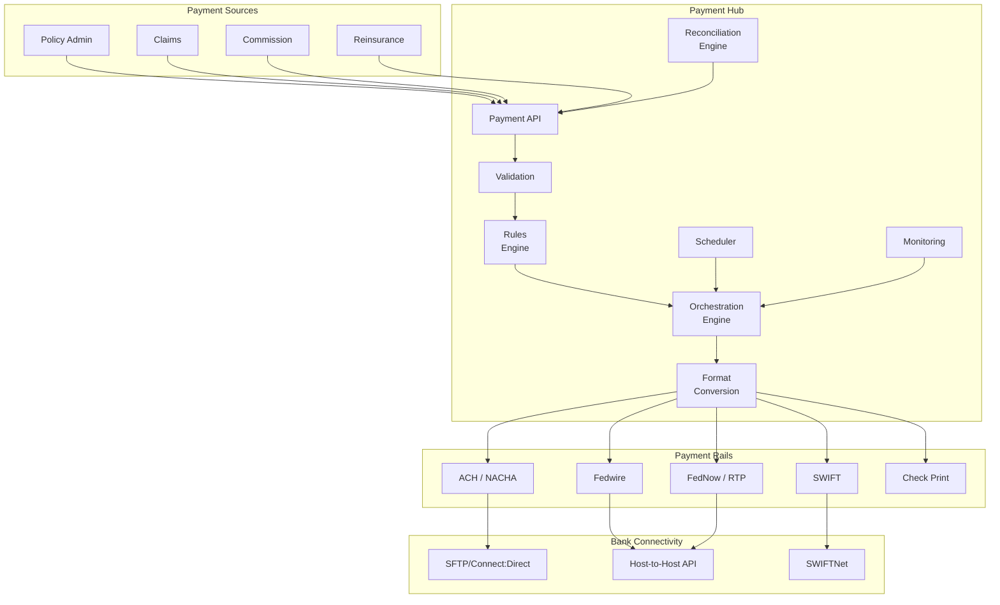
```mermaid
graph TB
    subgraph Payment Hub
        API[Payment API]
        ORQ[Orchestration<br>Engine]
        FMT[Format<br>Conversion]
        VAL[Validation]
        RUL[Rules<br>Engine]
        SCH[Scheduler]
        MON[Monitoring]
        REC[Reconciliation<br>Engine]
    end
    
    subgraph Payment Sources
        PAS_SRC[Policy Admin]
        CLM_SRC[Claims]
        COMM_SRC[Commission]
        REIN_SRC[Reinsurance]
    end
    
    subgraph Payment Rails
        ACH_OUT[ACH / NACHA]
        WIRE_OUT[Fedwire]
        RTP_OUT[FedNow / RTP]
        SWIFT_OUT[SWIFT]
        CHECK_OUT[Check Print]
    end
    
    subgraph Bank Connectivity
        SFTP[SFTP/Connect:Direct]
        H2H[Host-to-Host API]
        SWIFT_NET[SWIFTNet]
    end
    
    PAS_SRC --> API
    CLM_SRC --> API
    COMM_SRC --> API
    REIN_SRC --> API
    API --> VAL --> RUL --> ORQ
    ORQ --> FMT
    FMT --> ACH_OUT --> SFTP
    FMT --> WIRE_OUT --> H2H
    FMT --> RTP_OUT --> H2H
    FMT --> SWIFT_OUT --> SWIFT_NET
    FMT --> CHECK_OUT
    SCH --> ORQ
    MON --> ORQ
    REC --> API
```

### 17.2 Payment Orchestration Engine

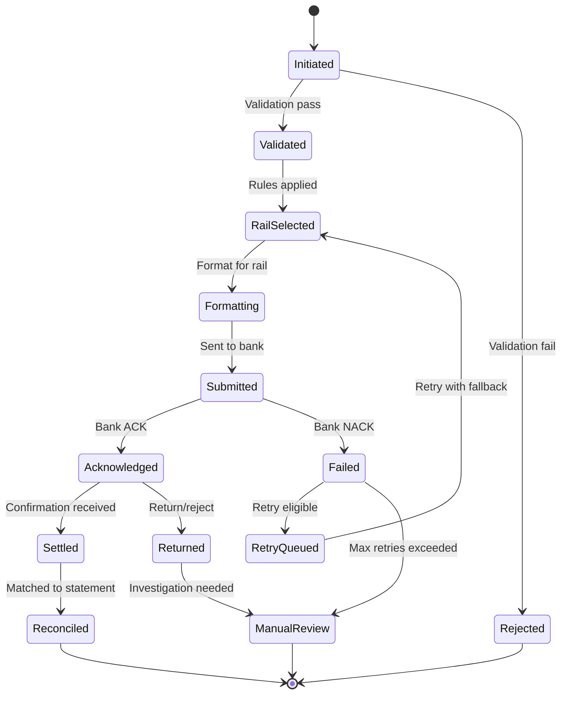
```mermaid
stateDiagram-v2
    [*] --> Initiated
    Initiated --> Validated: Validation pass
    Initiated --> Rejected: Validation fail
    Validated --> RailSelected: Rules applied
    RailSelected --> Formatting: Format for rail
    Formatting --> Submitted: Sent to bank
    Submitted --> Acknowledged: Bank ACK
    Submitted --> Failed: Bank NACK
    Acknowledged --> Settled: Confirmation received
    Acknowledged --> Returned: Return/reject
    Settled --> Reconciled: Matched to statement
    Failed --> RetryQueued: Retry eligible
    RetryQueued --> RailSelected: Retry with fallback
    Failed --> ManualReview: Max retries exceeded
    Returned --> ManualReview: Investigation needed
    Reconciled --> [*]
    Rejected --> [*]
    ManualReview --> [*]
```

### 17.3 Reconciliation Engine Architecture

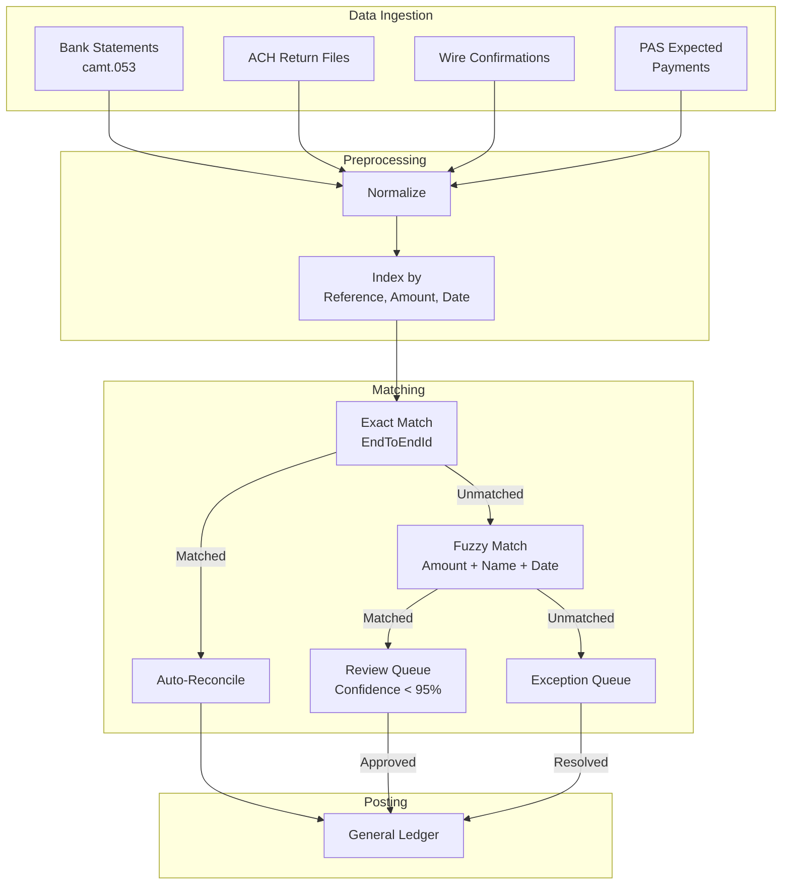
```mermaid
graph TB
    subgraph Data Ingestion
        STMT[Bank Statements<br>camt.053]
        ACH_RET2[ACH Return Files]
        WIRE_CONF[Wire Confirmations]
        PAS_EXP[PAS Expected<br>Payments]
    end
    
    subgraph Preprocessing
        STMT --> NORM2[Normalize]
        ACH_RET2 --> NORM2
        WIRE_CONF --> NORM2
        PAS_EXP --> NORM2
        NORM2 --> INDEX[Index by<br>Reference, Amount, Date]
    end
    
    subgraph Matching
        INDEX --> EXACT[Exact Match<br>EndToEndId]
        EXACT --> |Matched| AUTO[Auto-Reconcile]
        EXACT --> |Unmatched| FUZZY[Fuzzy Match<br>Amount + Name + Date]
        FUZZY --> |Matched| REVIEW[Review Queue<br>Confidence < 95%]
        FUZZY --> |Unmatched| EXCEPT[Exception Queue]
    end
    
    subgraph Posting
        AUTO --> GL[General Ledger]
        REVIEW --> |Approved| GL
        EXCEPT --> |Resolved| GL
    end
```

### 17.4 Security Architecture for Payment Processing

```mermaid
graph TB
    subgraph Security Layers
        TLS[TLS 1.3<br>Transport Encryption]
        MTLS[Mutual TLS<br>Bank Connectivity]
        ENC[Field-Level Encryption<br>Account Numbers]
        TOK[Tokenization<br>Sensitive Data]
        HSM[HSM<br>Key Management]
        RBAC[RBAC<br>Payment Authorization]
        SOD[Segregation of Duties<br>Maker-Checker]
        AUDIT[Audit Trail<br>Immutable Logging]
    end
    
    subgraph Compliance
        PCI[PCI-DSS<br>Card Data]
        NACHA_SEC[NACHA Rules<br>ACH Security]
        SOX2[SOX<br>Financial Controls]
        OFAC[OFAC Screening<br>Sanctions Check]
        AML[AML Monitoring<br>Large Payments]
    end
```

**Payment Security Requirements:**

| Layer | Requirement | Implementation |
|-------|------------|----------------|
| Transport | Encryption in transit | TLS 1.3 for all connections |
| Authentication | Bank identification | Mutual TLS certificates |
| Authorization | Payment approval | Dual-control / maker-checker for > $50K |
| Data Protection | Account number security | Tokenization in database, HSM for encryption keys |
| Sanctions | OFAC compliance | Screen all disbursements against SDN list |
| Fraud | Payment fraud detection | Velocity checks, amount thresholds, geographic anomalies |
| Audit | Non-repudiation | Immutable audit log, digital signatures on payment files |
| Compliance | Regulatory | SOX controls on payment processes |

---

*This article is part of the Life Insurance PAS Architect's Encyclopedia. For related topics, see Article 14 (ACORD Standards), Article 15 (Data Interchange Formats), and Article 17 (Master Data Management).*
