# Article 17: Master Data Management for PAS

## Table of Contents

1. [MDM Domains for Insurance](#1-mdm-domains-for-insurance)
2. [Party/Customer MDM](#2-partycustomer-mdm)
3. [Identity Resolution and Matching](#3-identity-resolution-and-matching)
4. [Golden Record and Survivorship](#4-golden-record-and-survivorship)
5. [Product MDM](#5-product-mdm)
6. [Producer/Agent MDM](#6-produceragent-mdm)
7. [Reference Data Management](#7-reference-data-management)
8. [Data Governance](#8-data-governance)
9. [Data Quality](#9-data-quality)
10. [MDM Architecture Patterns](#10-mdm-architecture-patterns)
11. [Customer 360 for Insurance](#11-customer-360-for-insurance)
12. [Party MDM Data Model](#12-party-mdm-data-model)
13. [Product Configuration Data Model](#13-product-configuration-data-model)
14. [MDM Platform Patterns](#14-mdm-platform-patterns)
15. [Integration Patterns](#15-integration-patterns)
16. [Practical Guidance for Solution Architects](#16-practical-guidance-for-solution-architects)

---

## 1. MDM Domains for Insurance

### 1.1 Overview

Master Data Management (MDM) in life insurance addresses the fundamental challenge of maintaining a single, authoritative source of truth for critical business entities across multiple policy administration systems, CRM platforms, claims systems, billing engines, and distribution portals.

Life insurance carriers typically operate with fragmented data across:
- Multiple policy administration systems (legacy mainframe + modern platforms)
- Separate individual and group life platforms
- Dedicated annuity administration systems
- Claims management systems
- Agent/distributor portals
- CRM systems
- Data warehouses and analytics platforms
- Regulatory reporting systems

### 1.2 MDM Domain Landscape

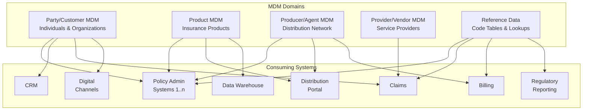

### 1.3 Domain Characteristics

| Domain | Record Volume | Change Frequency | Quality Priority | Regulatory Impact |
|--------|-------------|-----------------|-----------------|-------------------|
| Party/Customer | Millions | Medium (address/contact changes) | Critical | High (KYC, AML, tax) |
| Product | Hundreds to thousands | Low (new products, state filings) | Critical | High (compliance) |
| Producer/Agent | Tens of thousands | Medium (licensing, appointments) | High | High (licensing compliance) |
| Provider/Vendor | Thousands | Low | Medium | Medium |
| Reference Data | Thousands of codes | Low | Critical | High (regulatory codes) |

---

## 2. Party/Customer MDM

### 2.1 Party Types and Roles

In life insurance, a "party" can serve multiple roles across multiple policies. The MDM challenge is to maintain a single, consolidated view of each party regardless of how many roles they play.

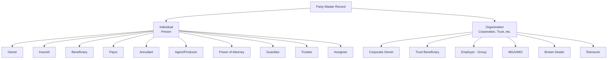

### 2.2 Individual Party Attributes

| Category | Attributes |
|----------|-----------|
| **Identity** | PartyID (MDM Golden Key), GovtID (SSN/ITIN), GovtID Type, Verification Status, Prior SSNs |
| **Name** | Prefix, First, Middle, Last, Suffix, Maiden Name, Alias/AKA, Prior Names, Name Change History |
| **Demographics** | Date of Birth, Gender, Marital Status, Citizenship, Country of Birth, State of Birth |
| **Contact** | Home Address, Mailing Address, Business Address, Home Phone, Mobile Phone, Business Phone, Email (Personal), Email (Business), Communication Preferences |
| **Employment** | Employer Name, Occupation, SIC/NAICS Code, Annual Income, Employment Status, Years Employed |
| **Financial** | Net Worth, Liquid Net Worth, Tax Bracket, Tax Filing Status, Risk Tolerance |
| **Regulatory** | PEP (Politically Exposed Person) Flag, Sanctions Screen Date/Result, AML Risk Score, OFAC Check Date, KYC Verification Level, FATCA Classification |
| **Digital** | Digital ID, SSO Identifier, Mobile App Enrolled, Portal Access Level, E-Delivery Consent, Communication Preferences |
| **Relationships** | Spouse ID, Dependent IDs, Household ID, Employer ID, Agent ID, Trust Associations |

### 2.3 Organization Party Attributes

| Category | Attributes |
|----------|-----------|
| **Identity** | PartyID, EIN/TIN, DUNS Number, LEI (Legal Entity Identifier), State of Incorporation |
| **Name** | Legal Name, DBA Names, Trade Names, Prior Names |
| **Classification** | Organization Type (Corporation, LLC, Partnership, Trust, Estate, Non-Profit), SIC Code, NAICS Code, Industry |
| **Financial** | Annual Revenue, Net Worth, Number of Employees, Credit Rating, D&B Score |
| **Contact** | Primary Address, Mailing Address, Main Phone, Fax, Website, Primary Contact Person |
| **Regulatory** | OFAC Screening, Sanctions Status, AML Classification, Beneficial Ownership, UBO Verification |
| **Trust-Specific** | Trust Type (Revocable/Irrevocable), Trust Date, Grantor, Trustee(s), Trust State, Trust Purpose |

### 2.4 Household/Relationship Management

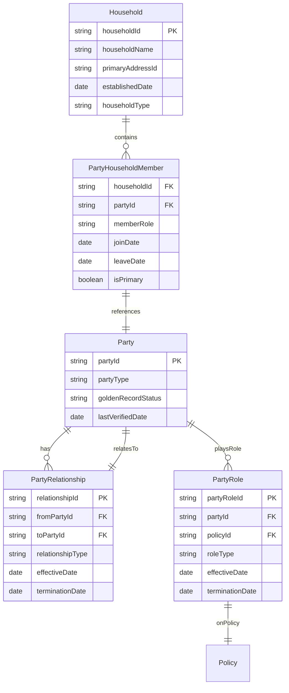

**Relationship Types:**

| Code | Relationship | Inverse |
|------|-------------|---------|
| SPOUSE | Spouse | SPOUSE |
| PARENT | Parent | CHILD |
| CHILD | Child | PARENT |
| SIBLING | Sibling | SIBLING |
| GRANDPARENT | Grandparent | GRANDCHILD |
| GRANDCHILD | Grandchild | GRANDPARENT |
| BUSINESS_PARTNER | Business Partner | BUSINESS_PARTNER |
| EMPLOYER | Employer | EMPLOYEE |
| EMPLOYEE | Employee | EMPLOYER |
| ATTORNEY | Attorney | CLIENT |
| TRUSTEE | Trustee | TRUST_GRANTOR |
| GUARDIAN | Guardian | WARD |
| DOMESTIC_PARTNER | Domestic Partner | DOMESTIC_PARTNER |

### 2.5 Consent and Preference Management

```json
{
  "partyConsent": {
    "partyId": "CUST-00012345",
    "consents": [
      {
        "consentType": "MARKETING_EMAIL",
        "status": "GRANTED",
        "grantDate": "2025-01-10",
        "expiryDate": "2027-01-10",
        "channel": "WEB_PORTAL",
        "source": "Online Enrollment",
        "regulatoryBasis": "OPT_IN"
      },
      {
        "consentType": "MARKETING_PHONE",
        "status": "DENIED",
        "denyDate": "2025-01-10",
        "channel": "WEB_PORTAL",
        "regulatoryBasis": "TCPA"
      },
      {
        "consentType": "E_DELIVERY",
        "status": "GRANTED",
        "grantDate": "2025-01-10",
        "scope": ["POLICY_DOCUMENTS", "BILLING_STATEMENTS", "TAX_FORMS"],
        "deliveryEmail": "john.smith@email.com",
        "regulatoryBasis": "E_SIGN_ACT"
      },
      {
        "consentType": "DATA_SHARING_AFFILIATE",
        "status": "GRANTED",
        "grantDate": "2025-01-10",
        "regulatoryBasis": "GLBA"
      },
      {
        "consentType": "DATA_SHARING_THIRD_PARTY",
        "status": "DENIED",
        "denyDate": "2025-01-10",
        "regulatoryBasis": "CCPA"
      },
      {
        "consentType": "HIPAA_AUTHORIZATION",
        "status": "GRANTED",
        "grantDate": "2025-01-10",
        "expiryDate": "2027-01-10",
        "purpose": "UNDERWRITING",
        "regulatoryBasis": "HIPAA"
      }
    ],
    "communicationPreferences": {
      "preferredChannel": "EMAIL",
      "preferredLanguage": "en-US",
      "doNotContact": false,
      "doNotContactReason": null,
      "bestTimeToCall": "EVENING",
      "timezone": "America/New_York"
    }
  }
}
```

---

## 3. Identity Resolution and Matching

### 3.1 Matching Algorithm Types

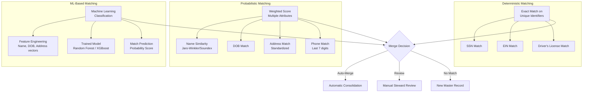

### 3.2 Deterministic Matching Rules

```json
{
  "deterministicRules": [
    {
      "ruleId": "DET-001",
      "name": "SSN Exact Match",
      "description": "Match individuals by exact SSN",
      "conditions": [
        {"field": "govtId", "operator": "EXACT", "weight": null}
      ],
      "confidence": 1.0,
      "action": "AUTO_MERGE",
      "applicableTo": ["INDIVIDUAL"]
    },
    {
      "ruleId": "DET-002",
      "name": "EIN Exact Match",
      "description": "Match organizations by exact EIN",
      "conditions": [
        {"field": "ein", "operator": "EXACT", "weight": null}
      ],
      "confidence": 1.0,
      "action": "AUTO_MERGE",
      "applicableTo": ["ORGANIZATION"]
    },
    {
      "ruleId": "DET-003",
      "name": "Name + DOB + ZIP Exact Match",
      "description": "Match when name, DOB, and ZIP all match exactly",
      "conditions": [
        {"field": "firstName", "operator": "EXACT_CASE_INSENSITIVE"},
        {"field": "lastName", "operator": "EXACT_CASE_INSENSITIVE"},
        {"field": "dateOfBirth", "operator": "EXACT"},
        {"field": "zipCode", "operator": "FIRST_5"}
      ],
      "confidence": 0.98,
      "action": "AUTO_MERGE",
      "applicableTo": ["INDIVIDUAL"]
    }
  ]
}
```

### 3.3 Probabilistic Matching Configuration

```json
{
  "probabilisticRules": {
    "individual": {
      "matchFields": [
        {
          "field": "lastName",
          "algorithm": "JARO_WINKLER",
          "weight": 0.20,
          "mWeight": 0.92,
          "uWeight": 0.005,
          "threshold": 0.85,
          "preprocessing": ["UPPERCASE", "REMOVE_PUNCTUATION", "TRIM"]
        },
        {
          "field": "firstName",
          "algorithm": "JARO_WINKLER",
          "weight": 0.15,
          "mWeight": 0.88,
          "uWeight": 0.02,
          "threshold": 0.80,
          "preprocessing": ["UPPERCASE", "REMOVE_PUNCTUATION", "NICKNAME_NORMALIZE"]
        },
        {
          "field": "dateOfBirth",
          "algorithm": "EXACT_WITH_TRANSPOSITION",
          "weight": 0.25,
          "mWeight": 0.95,
          "uWeight": 0.00027,
          "allowTransposition": true,
          "maxDayDiff": 2
        },
        {
          "field": "addressLine1",
          "algorithm": "ADDRESS_STANDARDIZED_COMPARE",
          "weight": 0.15,
          "mWeight": 0.85,
          "uWeight": 0.01,
          "preprocessing": ["USPS_STANDARDIZE", "REMOVE_UNIT"]
        },
        {
          "field": "zipCode",
          "algorithm": "FIRST_5",
          "weight": 0.10,
          "mWeight": 0.90,
          "uWeight": 0.03
        },
        {
          "field": "phone",
          "algorithm": "LAST_7_DIGITS",
          "weight": 0.10,
          "mWeight": 0.88,
          "uWeight": 0.0001
        },
        {
          "field": "email",
          "algorithm": "EXACT_CASE_INSENSITIVE",
          "weight": 0.05,
          "mWeight": 0.95,
          "uWeight": 0.0001
        }
      ],
      "thresholds": {
        "autoMerge": 0.95,
        "reviewQueue": 0.75,
        "noMatch": 0.50
      },
      "blockingKeys": [
        ["soundex(lastName)", "substring(dateOfBirth, 1, 4)"],
        ["substring(govtId, -4)", "substring(zipCode, 1, 3)"],
        ["soundex(lastName)", "substring(zipCode, 1, 5)"]
      ]
    }
  }
}
```

### 3.4 Nickname Normalization

| Input | Normalized |
|-------|-----------|
| Bob, Bobby, Rob, Robby | Robert |
| Bill, Billy, Will, Willy | William |
| Dick, Rich, Rick | Richard |
| Jack, John, Johnny | John |
| Liz, Beth, Betty, Lizzy | Elizabeth |
| Jim, Jimmy, James | James |
| Mike, Mikey | Michael |
| Pat, Patty, Patricia | Patricia |
| Sue, Suzy, Susan | Susan |
| Tom, Tommy | Thomas |
| Ed, Eddie, Ted, Teddy | Edward |
| Cathy, Kate, Katie | Catherine |
| Chuck, Charlie | Charles |
| Dave, Davy | David |
| Joe, Joey | Joseph |
| Dan, Danny | Daniel |
| Chris, Kris | Christopher |
| Tony | Anthony |
| Sam, Sammy | Samuel |
| Alex, Sandy | Alexander |

### 3.5 Matching Performance Metrics

| Metric | Target | Description |
|--------|--------|-------------|
| Precision | > 99.5% | Percentage of identified matches that are true matches |
| Recall | > 98% | Percentage of true matches identified |
| F1 Score | > 98.5% | Harmonic mean of precision and recall |
| False Positive Rate | < 0.5% | Incorrect matches / total comparisons |
| False Negative Rate | < 2% | Missed matches / total true matches |
| Processing Speed | > 10K records/sec | Matching throughput for batch operations |

---

## 4. Golden Record and Survivorship

### 4.1 Golden Record Concept

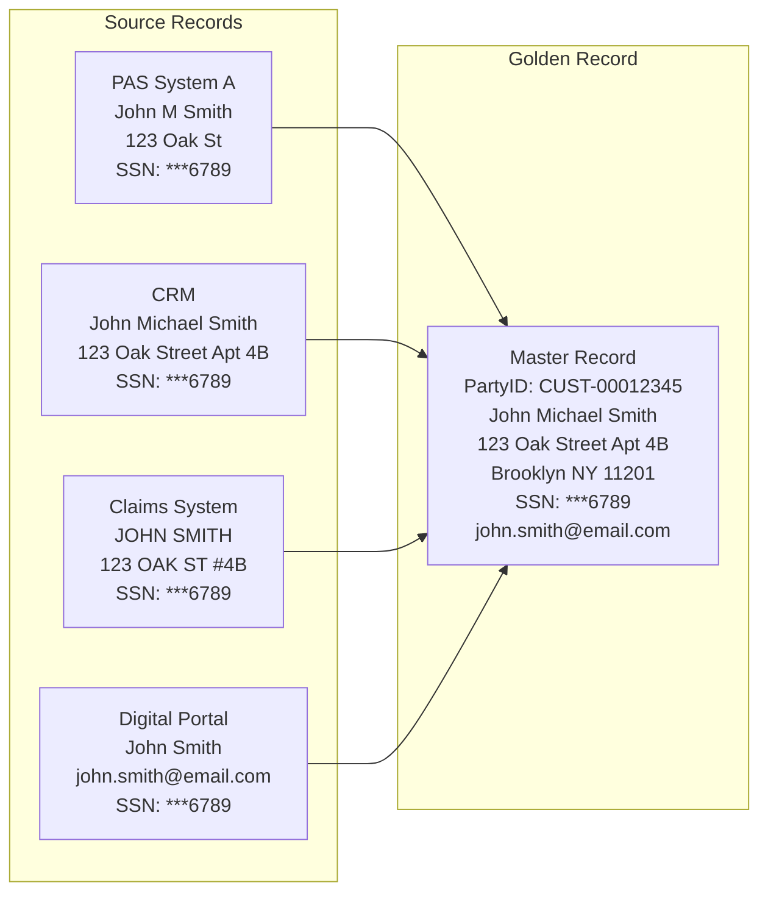

### 4.2 Survivorship Rules

Survivorship rules determine which source system's data is trusted for each attribute when building the golden record.

```json
{
  "survivorshipRules": {
    "individual": {
      "firstName": {
        "strategy": "MOST_COMPLETE",
        "priority": ["PAS_A", "CRM", "CLAIMS", "DIGITAL"],
        "description": "Choose the longest/most complete first name"
      },
      "middleName": {
        "strategy": "MOST_COMPLETE",
        "priority": ["PAS_A", "CRM", "DIGITAL"]
      },
      "lastName": {
        "strategy": "MOST_RECENT",
        "priority": ["PAS_A", "CRM"],
        "description": "Use the most recently updated last name (handles name changes)"
      },
      "dateOfBirth": {
        "strategy": "SOURCE_PRIORITY",
        "priority": ["PAS_A", "CLAIMS", "CRM"],
        "description": "PAS is authoritative for DOB (from application)"
      },
      "governmentId": {
        "strategy": "SOURCE_PRIORITY",
        "priority": ["PAS_A"],
        "description": "SSN from PAS — verified during underwriting"
      },
      "homeAddress": {
        "strategy": "MOST_RECENT_STANDARDIZED",
        "priority": ["DIGITAL", "CRM", "PAS_A"],
        "standardization": "USPS_CASS",
        "description": "Most recently updated, USPS standardized"
      },
      "mobilePhone": {
        "strategy": "MOST_RECENT",
        "priority": ["DIGITAL", "CRM", "PAS_A"]
      },
      "email": {
        "strategy": "MOST_RECENT",
        "priority": ["DIGITAL", "CRM"]
      },
      "occupation": {
        "strategy": "SOURCE_PRIORITY",
        "priority": ["PAS_A", "CRM"],
        "description": "From most recent application or underwriting"
      },
      "annualIncome": {
        "strategy": "MOST_RECENT",
        "priority": ["PAS_A", "CRM"],
        "staleness": "365_DAYS"
      },
      "maritalStatus": {
        "strategy": "MOST_RECENT",
        "priority": ["PAS_A", "CRM", "DIGITAL"]
      }
    },
    "organization": {
      "legalName": {
        "strategy": "SOURCE_PRIORITY",
        "priority": ["SECRETARY_OF_STATE", "PAS_A", "CRM"]
      },
      "ein": {
        "strategy": "SOURCE_PRIORITY",
        "priority": ["IRS_VERIFICATION", "PAS_A"]
      },
      "address": {
        "strategy": "MOST_RECENT_STANDARDIZED",
        "priority": ["CRM", "PAS_A"],
        "standardization": "USPS_CASS"
      }
    }
  }
}
```

### 4.3 Merge/Unmerge Processing

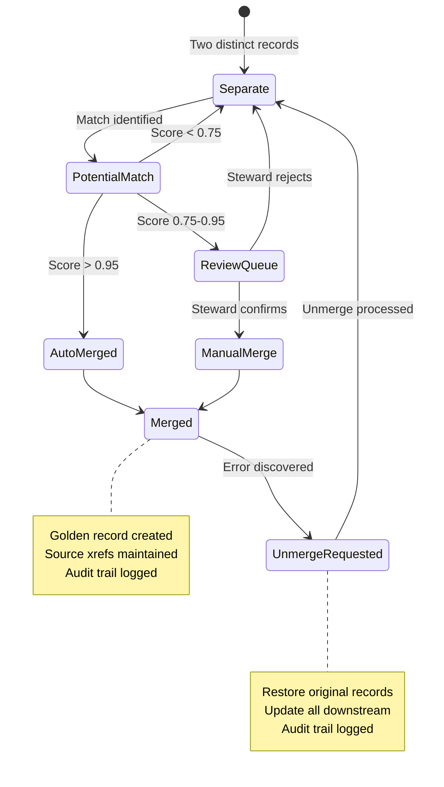

**Merge Processing Steps:**

1. **Pre-Merge Validation**: Verify no conflicting critical data (different SSNs cannot merge).
2. **Survivorship Execution**: Apply survivorship rules to create golden record.
3. **Cross-Reference Creation**: Map all source system IDs to the new master ID.
4. **Downstream Notification**: Publish merge event to all consuming systems.
5. **History Preservation**: Maintain full audit trail of merge action.
6. **Rollback Capability**: Support unmerge within a defined window.

**Unmerge Processing Steps:**

1. **Validation**: Confirm unmerge request is authorized (data steward approval).
2. **Record Reconstruction**: Restore original separate records from history.
3. **Cross-Reference Update**: Reassign source system IDs to correct master IDs.
4. **Downstream Notification**: Publish unmerge event.
5. **Audit Trail**: Log the unmerge action and reason.

---

## 5. Product MDM

### 5.1 Product Catalog Structure

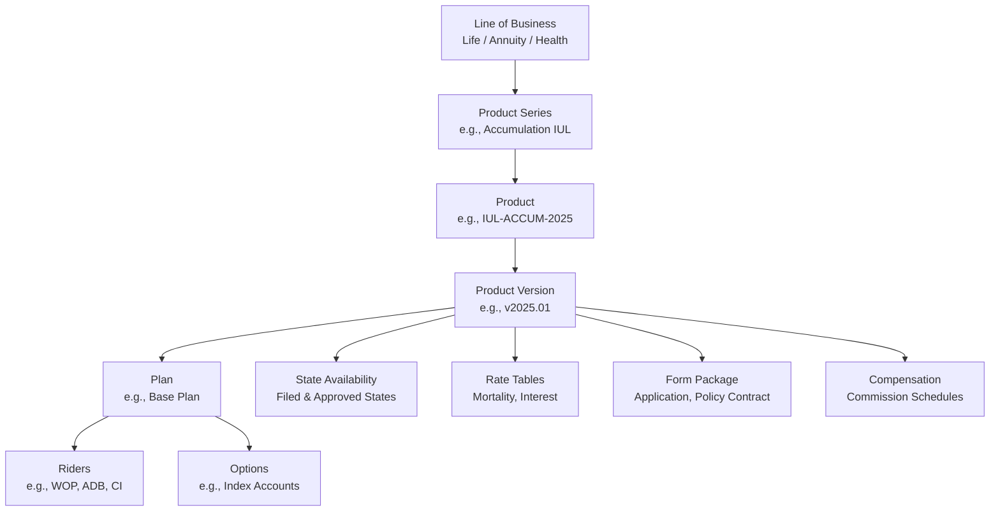

### 5.2 Product Hierarchy Data Model

```mermaid
erDiagram
    LineOfBusiness ||--o{ ProductSeries : contains
    ProductSeries ||--o{ Product : contains
    Product ||--o{ ProductVersion : hasVersions
    ProductVersion ||--o{ Plan : contains
    ProductVersion ||--o{ StateAvailability : filedIn
    ProductVersion ||--o{ RateTable : uses
    ProductVersion ||--o{ FormPackage : requires
    ProductVersion ||--o{ CommissionSchedule : compensatedBy
    Plan ||--o{ PlanFeature : has
    Plan ||--o{ Rider : offersRider
    Plan ||--o{ EligibilityRule : constrainedBy
    Rider ||--o{ RiderFeature : has
    
    LineOfBusiness {
        string lobCode PK
        string lobName
        string regulatoryClassification
    }
    
    ProductSeries {
        string seriesCode PK
        string seriesName
        string lobCode FK
        string marketSegment
        string distributionChannel
    }
    
    Product {
        string productCode PK
        string productName
        string seriesCode FK
        string productType
        date launchDate
        date discontinueDate
        string status
    }
    
    ProductVersion {
        string versionId PK
        string productCode FK
        string versionNumber
        date effectiveDate
        date expiryDate
        string status
        string mortalityTable
        string interestBasis
    }
    
    Plan {
        string planCode PK
        string versionId FK
        string planName
        string planType
        decimal minFaceAmount
        decimal maxFaceAmount
        integer minIssueAge
        integer maxIssueAge
        string qualifiedType
    }
    
    StateAvailability {
        string stateAvailId PK
        string versionId FK
        string stateCode
        date filingDate
        date approvalDate
        string filingStatus
        string serfFilingNumber
    }
    
    Rider {
        string riderCode PK
        string planCode FK
        string riderName
        string riderType
        decimal additionalCost
        string costBasis
        boolean isOptional
    }
    
    EligibilityRule {
        string ruleId PK
        string planCode FK
        string ruleType
        string ruleExpression
        string errorMessage
    }
    
    RateTable {
        string rateTableId PK
        string versionId FK
        string rateType
        string mortalityBasis
        string gender
        string tobaccoClass
        string riskClass
    }
}
```

### 5.3 Product Feature Configuration

```json
{
  "product": {
    "productCode": "IUL-ACCUM-2025",
    "productName": "Accumulation IUL Premier",
    "productType": "INDEXED_UNIVERSAL_LIFE",
    "effectiveDate": "2025-01-01",
    "features": {
      "deathBenefit": {
        "options": ["LEVEL", "INCREASING"],
        "defaultOption": "LEVEL",
        "switchAllowed": true,
        "switchFrequency": "ANNUAL"
      },
      "premiumFlexibility": {
        "minimumPremium": "NO_LAPSE_GUARANTEE",
        "targetPremium": "CALCULATED",
        "maximumPremium": "GUIDELINE_PREMIUM_LIMIT",
        "tamraTestApplied": true
      },
      "indexAccounts": [
        {
          "accountCode": "SP500-CAP",
          "indexName": "S&P 500 (Annual Point-to-Point with Cap)",
          "indexTicker": "SPX",
          "crediting": "ANNUAL_POINT_TO_POINT",
          "cap": {"current": 0.10, "guaranteed": 0.03},
          "floor": 0.00,
          "participationRate": {"current": 1.00, "guaranteed": 1.00},
          "spread": 0.00
        },
        {
          "accountCode": "SP500-PAR",
          "indexName": "S&P 500 (Participation Rate)",
          "indexTicker": "SPX",
          "crediting": "ANNUAL_POINT_TO_POINT",
          "cap": null,
          "floor": 0.00,
          "participationRate": {"current": 0.55, "guaranteed": 0.25},
          "spread": 0.00
        },
        {
          "accountCode": "FIXED",
          "indexName": "Fixed Account",
          "crediting": "FIXED_RATE",
          "currentRate": 0.04,
          "guaranteedMinRate": 0.02
        }
      ],
      "loanProvisions": {
        "fixedLoanRate": 0.06,
        "variableLoanSpread": 0.0025,
        "zeroCostLoanAvailable": true,
        "maxLoanPercentOfCV": 0.90,
        "loanAvailableAfterYear": 1
      },
      "surrenderChargeSchedule": [
        {"year": 1, "percent": 0.10},
        {"year": 2, "percent": 0.10},
        {"year": 3, "percent": 0.09},
        {"year": 4, "percent": 0.08},
        {"year": 5, "percent": 0.07},
        {"year": 6, "percent": 0.06},
        {"year": 7, "percent": 0.05},
        {"year": 8, "percent": 0.04},
        {"year": 9, "percent": 0.03},
        {"year": 10, "percent": 0.02},
        {"year": 11, "percent": 0.00}
      ],
      "noLapseGuarantee": {
        "available": true,
        "duration": "TO_AGE_121",
        "condition": "MINIMUM_PREMIUM_PAID"
      }
    },
    "eligibility": {
      "issueAgeRange": {"min": 0, "max": 85},
      "faceAmountRange": {"min": 50000, "max": 65000000},
      "riskClasses": ["PREFERRED_PLUS", "PREFERRED", "STANDARD_PLUS", "STANDARD", "SUBSTANDARD"],
      "qualifiedTypes": ["NON_QUALIFIED", "TRADITIONAL_IRA", "ROTH_IRA", "SEP_IRA"],
      "restrictedStates": []
    },
    "stateAvailability": {
      "approved": ["AL","AK","AZ","AR","CA","CO","CT","DE","FL","GA","HI","ID","IL","IN","IA","KS","KY","LA","ME","MD","MA","MI","MN","MS","MO","MT","NE","NV","NH","NJ","NM","NY","NC","ND","OH","OK","OR","PA","RI","SC","SD","TN","TX","UT","VT","VA","WA","WV","WI","WY","DC"],
      "pendingFiling": [],
      "notFiled": [],
      "stateVariations": {
        "NY": {
          "maxSurrenderChargePeriod": 10,
          "replacementFormRequired": true,
          "illustrationRegulation": "NY_REG_74"
        },
        "CA": {
          "additionalDisclosureRequired": true,
          "seniorProtectionAgeThreshold": 65
        }
      }
    }
  }
}
```

### 5.4 Product-to-System Mapping

For carriers with multiple administration systems, product MDM must track which system administers each product.

```json
{
  "productSystemMapping": [
    {
      "productCode": "IUL-ACCUM-2025",
      "adminSystem": "MODERN-PAS",
      "adminSystemProductCode": "IULAC25",
      "illustrationSystem": "ILLUS-PRO",
      "illustrationProductCode": "IUL-ACC-2025",
      "billingSystem": "MODERN-PAS",
      "commissionSystem": "COMM-ENGINE",
      "reinsuranceSystem": "REINS-PRO",
      "correspondenceSystem": "DOC-GEN",
      "templatePackage": "IUL-DOC-2025-NY"
    },
    {
      "productCode": "WL-LEGACY-2010",
      "adminSystem": "LEGACY-MAINFRAME",
      "adminSystemProductCode": "WL10",
      "illustrationSystem": "ILLUS-PRO",
      "illustrationProductCode": "WL-LEG-2010",
      "billingSystem": "LEGACY-MAINFRAME",
      "commissionSystem": "LEGACY-MAINFRAME",
      "note": "Legacy product — no new sales, service only"
    }
  ]
}
```

---

## 6. Producer/Agent MDM

### 6.1 Agent/Broker Hierarchy

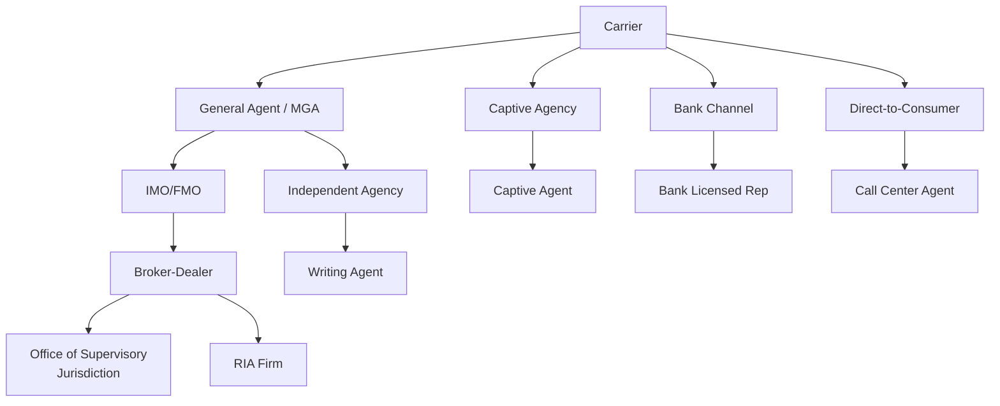

### 6.2 Producer Master Data

```json
{
  "producer": {
    "producerId": "PROD-00567",
    "producerType": "INDIVIDUAL",
    "status": "ACTIVE",
    "person": {
      "firstName": "Robert",
      "lastName": "Johnson",
      "dateOfBirth": "1978-05-20",
      "ssn": "XXX-XX-3333",
      "email": "rjohnson@abcinsurance.com"
    },
    "niprNumber": "12345678",
    "crdNumber": "5678901",
    "hierarchy": {
      "uplineProducerId": "PROD-00123",
      "uplineProducerName": "Sarah Williams (Supervisor)",
      "managingAgencyId": "AGY-001",
      "managingAgencyName": "ABC Financial Group",
      "generalAgentId": "GA-001",
      "generalAgentName": "Northeast General Agency",
      "brokerDealerId": "BD-001",
      "brokerDealerName": "Securities America"
    },
    "licensing": [
      {
        "stateCode": "NY",
        "licenseNumber": "LA-1234567",
        "licenseType": "LIFE_ACCIDENT_HEALTH",
        "status": "ACTIVE",
        "issueDate": "2010-03-15",
        "expiryDate": "2026-03-15",
        "ceCreditsRequired": 15,
        "ceCreditsCompleted": 12,
        "ceDeadline": "2026-03-15"
      },
      {
        "stateCode": "CT",
        "licenseNumber": "CT-987654",
        "licenseType": "LIFE_ACCIDENT_HEALTH",
        "status": "ACTIVE",
        "issueDate": "2012-06-01",
        "expiryDate": "2026-06-01"
      },
      {
        "stateCode": "NJ",
        "licenseNumber": "NJ-456789",
        "licenseType": "LIFE",
        "status": "EXPIRED",
        "issueDate": "2015-01-15",
        "expiryDate": "2025-01-15"
      }
    ],
    "appointments": [
      {
        "carrierId": "ACME",
        "carrierName": "ACME Life Insurance Company",
        "appointmentStatus": "ACTIVE",
        "appointmentDate": "2015-01-01",
        "appointmentType": "BROKER",
        "producerCode": "AGT-NY-00567",
        "productAuthorizations": [
          "WHOLE_LIFE", "TERM", "IUL", "VUL",
          "FIXED_ANNUITY", "VARIABLE_ANNUITY"
        ],
        "commissionScheduleId": "COMM-BROKER-2025"
      }
    ],
    "securities": {
      "registeredRep": true,
      "series6": true,
      "series7": true,
      "series63": true,
      "series65": false,
      "series66": false,
      "crdRegistrationDate": "2010-06-01"
    },
    "compliance": {
      "eoInsurance": {
        "carrierName": "E&O Provider Corp",
        "policyNumber": "EO-2025-001",
        "coverageAmount": 1000000,
        "expiryDate": "2025-12-31",
        "status": "ACTIVE"
      },
      "amlTrainingDate": "2024-11-15",
      "amlTrainingStatus": "COMPLETED",
      "backgroundCheckDate": "2024-12-01",
      "backgroundCheckResult": "CLEAR",
      "sanctionsScreenDate": "2025-01-15",
      "sanctionsScreenResult": "CLEAR"
    },
    "bankingInfo": {
      "commissionAccountRouting": "021000089",
      "commissionAccountNumber": "XXXX7890",
      "commissionAccountType": "CHECKING",
      "taxWithholdingPct": 0.00,
      "form1099Filed": true
    },
    "production": {
      "ytdPremium": 450000.00,
      "ytdCases": 12,
      "priorYearPremium": 1200000.00,
      "priorYearCases": 35,
      "persistencyRate": 0.92,
      "qualificationLevel": "PLATINUM"
    }
  }
}
```

### 6.3 NIPR Integration

The National Insurance Producer Registry (NIPR) provides centralized licensing data.

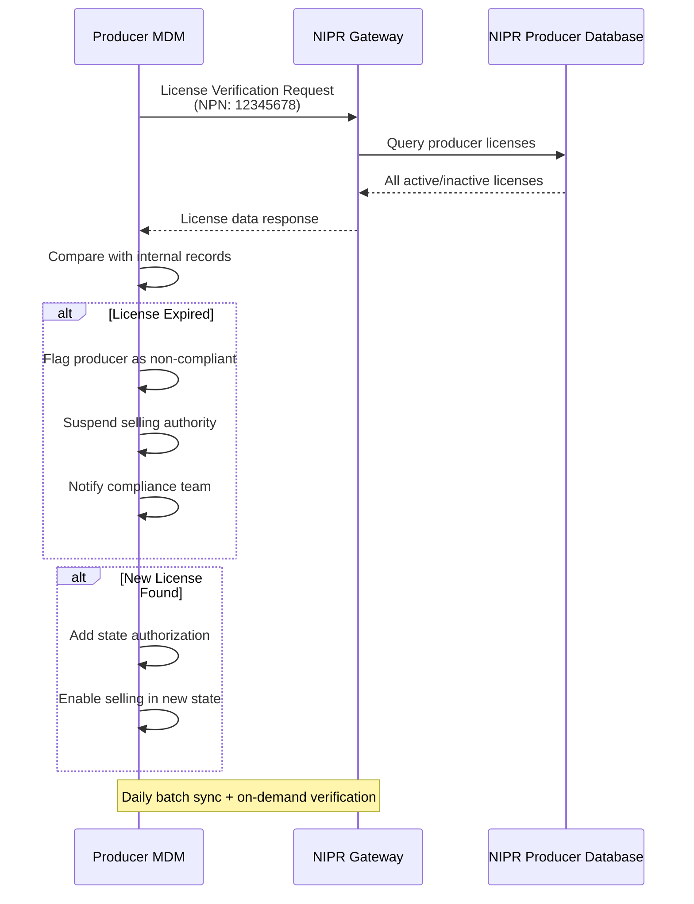

### 6.4 Anti-Money Laundering Producer Screening

```json
{
  "producerAMLScreening": {
    "producerId": "PROD-00567",
    "screeningDate": "2025-01-15",
    "screeningProvider": "LexisNexis Bridger",
    "screeningSources": [
      "OFAC_SDN",
      "OFAC_CONSOLIDATED",
      "FBI_MOST_WANTED",
      "INTERPOL",
      "BIS_DENIED_PERSONS",
      "EU_SANCTIONS",
      "UN_SANCTIONS",
      "STATE_INSURANCE_DEPT_ACTIONS"
    ],
    "results": {
      "totalHits": 0,
      "confirmedMatches": 0,
      "falsePositives": 0,
      "pendingReview": 0,
      "overallResult": "CLEAR"
    },
    "nextScreeningDate": "2025-04-15",
    "screeningFrequency": "QUARTERLY"
  }
}
```

---

## 7. Reference Data Management

### 7.1 Code Table Architecture

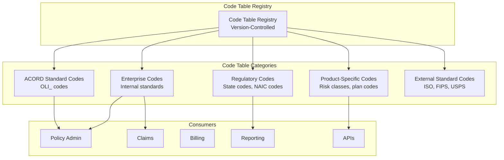

### 7.2 Code Table Data Model

```json
{
  "codeTable": {
    "tableId": "POLICY_STATUS",
    "tableName": "Policy Status Codes",
    "description": "Standard policy lifecycle status codes",
    "category": "ENTERPRISE",
    "version": "2025.01",
    "effectiveDate": "2025-01-01",
    "owner": "Data Governance Office",
    "steward": "Policy Admin Team",
    "codes": [
      {
        "code": "ACTIVE",
        "displayName": "Active",
        "description": "Policy is in force with all premiums current",
        "status": "ACTIVE",
        "effectiveDate": "2020-01-01",
        "sortOrder": 1,
        "isDefault": false,
        "mappings": {
          "ACORD_OLI": {"tc": "1", "description": "Active"},
          "LEGACY_PAS_A": {"code": "A", "description": "Active"},
          "LEGACY_PAS_B": {"code": "ACT", "description": "Active"},
          "EDI_834": {"code": "021", "description": "Addition"},
          "REPORTING": {"code": "IF", "description": "In Force"}
        },
        "validTransitions": ["GRACE_PERIOD", "LAPSED", "SURRENDERED", "DEATH_CLAIM", "MATURED", "PAID_UP"]
      },
      {
        "code": "GRACE_PERIOD",
        "displayName": "Grace Period",
        "description": "Premium overdue, within grace period",
        "status": "ACTIVE",
        "effectiveDate": "2020-01-01",
        "sortOrder": 2,
        "mappings": {
          "ACORD_OLI": {"tc": "30", "description": "Grace Period"},
          "LEGACY_PAS_A": {"code": "G", "description": "Grace"},
          "LEGACY_PAS_B": {"code": "GRC", "description": "Grace Period"}
        },
        "validTransitions": ["ACTIVE", "LAPSED"]
      },
      {
        "code": "LAPSED",
        "displayName": "Lapsed",
        "description": "Policy lapsed due to non-payment of premium",
        "status": "ACTIVE",
        "effectiveDate": "2020-01-01",
        "sortOrder": 3,
        "mappings": {
          "ACORD_OLI": {"tc": "12", "description": "Lapsed"},
          "LEGACY_PAS_A": {"code": "L", "description": "Lapsed"},
          "LEGACY_PAS_B": {"code": "LAP", "description": "Lapsed"}
        },
        "validTransitions": ["ACTIVE", "EXTENDED_TERM", "REDUCED_PAID_UP", "TERMINATED"]
      }
    ]
  }
}
```

### 7.3 Cross-System Code Mapping

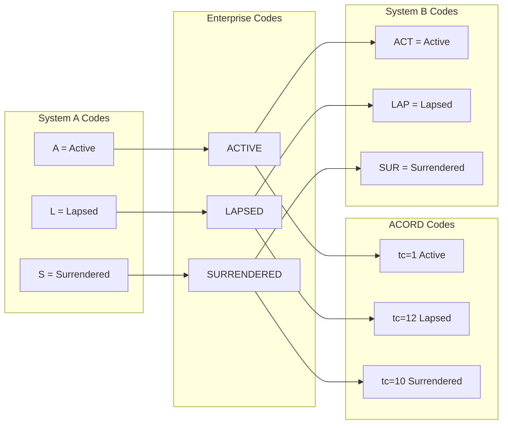

### 7.4 Code Deprecation Management

```json
{
  "codeDeprecation": {
    "tableId": "PAYMENT_METHOD",
    "deprecatedCode": {
      "code": "PAC",
      "displayName": "Pre-Authorized Check",
      "deprecationDate": "2024-01-01",
      "removalDate": "2026-01-01",
      "replacementCode": "EFT",
      "reason": "PAC replaced by modern EFT/ACH processing",
      "migrationGuide": "All PAC records should be converted to EFT during next billing cycle",
      "impactedSystems": ["PAS_A", "BILLING", "CUSTOMER_PORTAL"],
      "impactedRecordCount": 12450,
      "migrationStatus": "IN_PROGRESS",
      "migrationPct": 78.5
    }
  }
}
```

---

## 8. Data Governance

### 8.1 Governance Framework

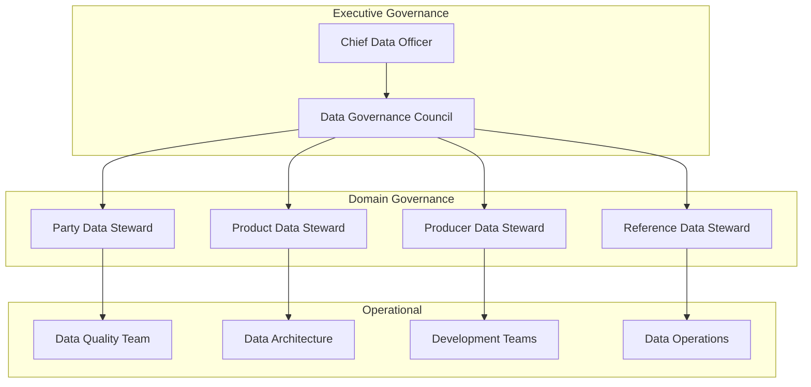

### 8.2 Data Stewardship Roles

| Role | Responsibilities | Typical Owner |
|------|-----------------|---------------|
| **Executive Data Sponsor** | Strategic direction, budget, conflict resolution | CDO or CTO |
| **Data Governance Council** | Policy setting, standards approval, issue escalation | Cross-functional leadership |
| **Domain Data Steward** | Data quality ownership for a domain, rule definition | Business unit manager |
| **Technical Data Steward** | Implementation of quality rules, monitoring | IT lead for domain |
| **Data Custodian** | Database operations, backup, security | DBA/infrastructure team |
| **Data Quality Analyst** | Profiling, monitoring, issue investigation | Data quality team |
| **Data Architect** | Data model design, standards alignment | Enterprise architecture |

### 8.3 Data Quality Metrics Dashboard

```json
{
  "dataQualityScorecard": {
    "domain": "Party/Customer",
    "reportDate": "2025-02-15",
    "overallScore": 94.2,
    "dimensions": {
      "completeness": {
        "score": 96.5,
        "target": 98.0,
        "status": "BELOW_TARGET",
        "metrics": [
          {"field": "dateOfBirth", "completeness": 99.8, "target": 99.9},
          {"field": "email", "completeness": 82.3, "target": 90.0},
          {"field": "mobilePhone", "completeness": 88.5, "target": 92.0},
          {"field": "ssn", "completeness": 99.9, "target": 99.9},
          {"field": "occupation", "completeness": 91.2, "target": 95.0}
        ]
      },
      "accuracy": {
        "score": 97.2,
        "target": 98.0,
        "status": "BELOW_TARGET",
        "metrics": [
          {"field": "address", "cassDpvMatchRate": 94.5, "target": 96.0},
          {"field": "ssn", "verificationRate": 99.7, "target": 99.9},
          {"field": "dateOfBirth", "consistencyRate": 99.5, "target": 99.8}
        ]
      },
      "consistency": {
        "score": 91.8,
        "target": 95.0,
        "status": "BELOW_TARGET",
        "metrics": [
          {"check": "Address match across systems", "rate": 89.3},
          {"check": "Name consistency across systems", "rate": 93.5},
          {"check": "Phone consistency across systems", "rate": 87.2}
        ]
      },
      "timeliness": {
        "score": 93.5,
        "target": 95.0,
        "status": "BELOW_TARGET",
        "metrics": [
          {"check": "Address updated within 30 days of change", "rate": 91.2},
          {"check": "Licensing data current", "rate": 96.8}
        ]
      },
      "uniqueness": {
        "score": 98.8,
        "target": 99.0,
        "status": "APPROACHING_TARGET",
        "metrics": [
          {"check": "Suspected duplicate parties", "count": 1245, "totalParties": 1250000},
          {"check": "Duplicate policies", "count": 23, "totalPolicies": 850000}
        ]
      }
    },
    "trendData": {
      "lastMonth": 93.8,
      "lastQuarter": 92.5,
      "lastYear": 89.2,
      "trend": "IMPROVING"
    }
  }
}
```

### 8.4 Data Lineage

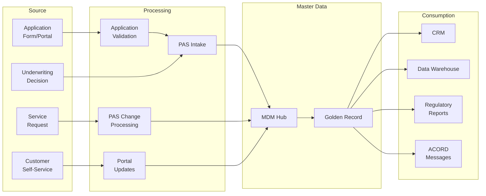

---

## 9. Data Quality

### 9.1 Quality Dimensions

| Dimension | Definition | Insurance Example |
|-----------|-----------|-------------------|
| **Completeness** | All required data elements are populated | SSN present for all insured parties |
| **Accuracy** | Data correctly represents real-world entity | Address matches USPS CASS validation |
| **Consistency** | Same data appears the same across systems | Name spelling identical in PAS and CRM |
| **Timeliness** | Data is current and up-to-date | Address updated within 30 days of move |
| **Uniqueness** | No duplicate records for the same entity | Single golden record per individual |
| **Validity** | Data conforms to defined rules and formats | State code is a valid 2-letter abbreviation |
| **Integrity** | Relationships between data are correct | Beneficiary party ID exists in party table |

### 9.2 Address Standardization Pipeline

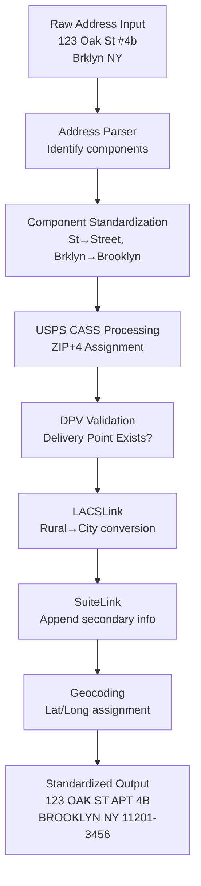

**Address Quality Metrics:**

| Metric | Description | Target |
|--------|-------------|--------|
| CASS Match Rate | % addresses with verified ZIP+4 | > 95% |
| DPV Confirm Rate | % addresses confirmed as deliverable | > 92% |
| Geocode Hit Rate | % addresses successfully geocoded | > 97% |
| NCOA Match Rate | % addresses updated via National Change of Address | Track quarterly |
| Return Mail Rate | % correspondence returned as undeliverable | < 2% |

### 9.3 Name Standardization

```json
{
  "nameStandardization": {
    "input": {
      "fullName": "MR. JOHN M. SMITH JR.",
      "source": "APPLICATION_FORM"
    },
    "parsing": {
      "prefix": "MR",
      "firstName": "JOHN",
      "middleName": "M",
      "lastName": "SMITH",
      "suffix": "JR",
      "confidence": 0.99
    },
    "standardization": {
      "prefix": "Mr",
      "firstName": "John",
      "middleName": "M",
      "lastName": "Smith",
      "suffix": "Jr",
      "transformations": [
        "TITLE_CASE",
        "REMOVE_EXTRA_WHITESPACE",
        "STANDARDIZE_SUFFIX",
        "REMOVE_PUNCTUATION_FROM_MIDDLE"
      ]
    },
    "validation": {
      "nameLength": "VALID",
      "specialCharacters": "NONE",
      "suspiciousPattern": "NONE",
      "knownTestName": false
    }
  }
}
```

### 9.4 Duplicate Detection and Prevention

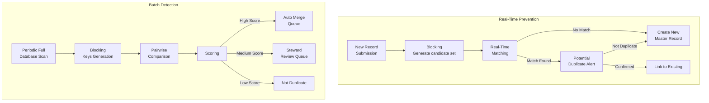

### 9.5 Data Enrichment

| Enrichment Type | Source | Data Added | Insurance Use |
|----------------|--------|-----------|---------------|
| Address Append | USPS, NCOA | ZIP+4, delivery point, geocode | Mail delivery, territory assignment |
| Phone Append | Data providers | Phone numbers, phone type | Contact center, marketing |
| Email Append | Third-party | Email addresses | Digital communication |
| Deceased Check | SSA DMF, LexisNexis | Death date, death indicator | Claims processing, fraud prevention |
| Identity Verification | LexisNexis, Experian | Verification score, ID theft alert | KYC, AML compliance |
| Property Data | CoreLogic, ATTOM | Property value, ownership | Financial underwriting |
| Lifestyle Data | Acxiom, Experian | Household income, lifestyle indicators | Marketing segmentation |
| Pharmacy/Rx Data | MIB, Milliman | Prescription history | Underwriting risk assessment |

---

## 10. MDM Architecture Patterns

### 10.1 Registry Pattern

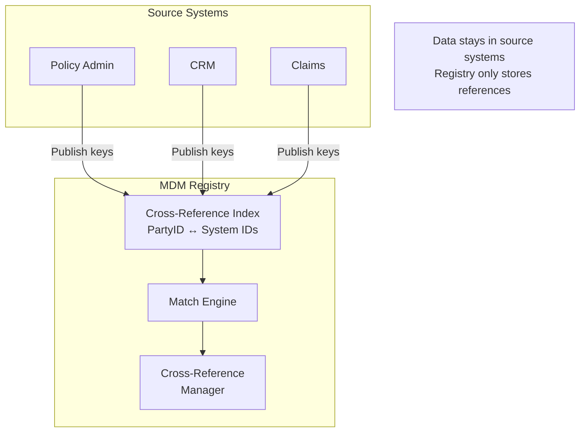

**Pros:** Lightweight, non-invasive, fast implementation.  
**Cons:** No golden record, data quality remains in sources, no centralized data view.  
**Best for:** Quick wins, low budget, minimal data governance maturity.

### 10.2 Repository (Centralized) Pattern

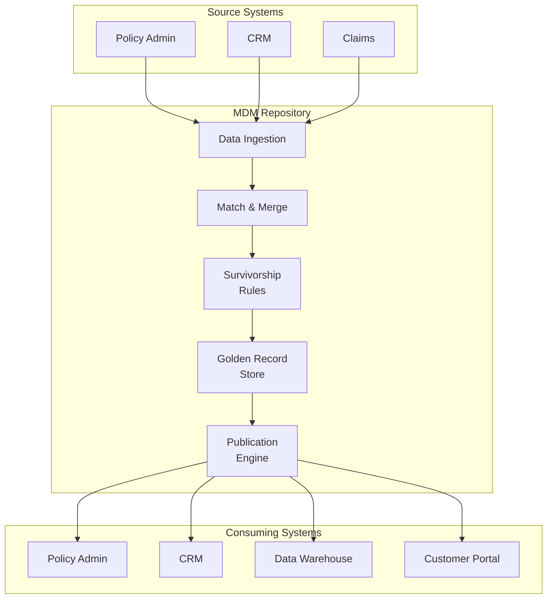

**Pros:** Single source of truth, golden record, centralized data quality.  
**Cons:** High complexity, data latency, requires significant governance.  
**Best for:** Large carriers with mature data governance, Customer 360 initiatives.

### 10.3 Hybrid Pattern

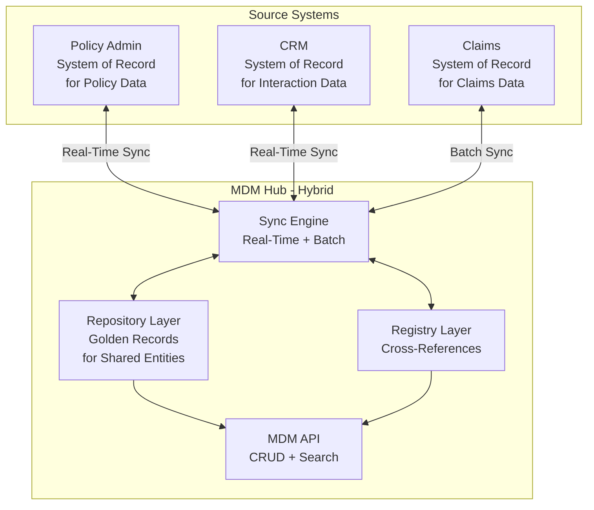

**Pros:** Best of both — golden record for shared entities, source authority for domain-specific data.  
**Cons:** Most complex to implement and maintain.  
**Best for:** Enterprise-scale carriers with mixed legacy and modern systems.

### 10.4 Event-Driven MDM

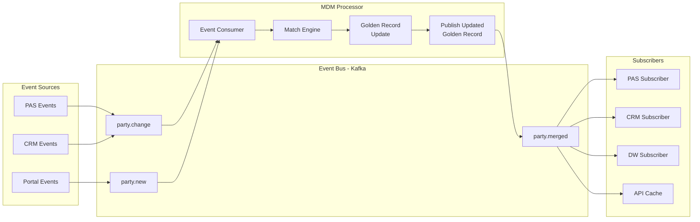

### 10.5 API-First MDM

```yaml
openapi: 3.0.3
info:
  title: Party MDM API
  version: 1.0.0

paths:
  /api/v1/parties:
    post:
      summary: Create or match party
      description: |
        Attempts to match incoming party against existing records.
        If match found, returns existing golden record.
        If no match, creates new golden record.
      requestBody:
        content:
          application/json:
            schema:
              $ref: '#/components/schemas/PartyCreateRequest'
      responses:
        '200':
          description: Matched existing party
          content:
            application/json:
              schema:
                $ref: '#/components/schemas/PartyResponse'
        '201':
          description: New party created
          content:
            application/json:
              schema:
                $ref: '#/components/schemas/PartyResponse'
    get:
      summary: Search parties
      parameters:
        - name: lastName
          in: query
          schema:
            type: string
        - name: firstName
          in: query
          schema:
            type: string
        - name: dateOfBirth
          in: query
          schema:
            type: string
            format: date
        - name: ssn
          in: query
          schema:
            type: string
        - name: phone
          in: query
          schema:
            type: string

  /api/v1/parties/{partyId}:
    get:
      summary: Get golden record by party ID
    put:
      summary: Update party attributes
    delete:
      summary: Soft-delete party (mark inactive)

  /api/v1/parties/{partyId}/cross-references:
    get:
      summary: Get all source system IDs for this party

  /api/v1/parties/{partyId}/merge:
    post:
      summary: Merge two party records
      requestBody:
        content:
          application/json:
            schema:
              type: object
              properties:
                sourcePartyId:
                  type: string
                survivorPartyId:
                  type: string
                reason:
                  type: string

  /api/v1/parties/{partyId}/unmerge:
    post:
      summary: Unmerge previously merged records

  /api/v1/parties/{partyId}/history:
    get:
      summary: Get change history for party

  /api/v1/parties/{partyId}/relationships:
    get:
      summary: Get all relationships for party
    post:
      summary: Create new relationship

components:
  schemas:
    PartyCreateRequest:
      type: object
      properties:
        sourceSystem:
          type: string
        sourceId:
          type: string
        partyType:
          type: string
          enum: [INDIVIDUAL, ORGANIZATION]
        person:
          $ref: '#/components/schemas/PersonInput'
        addresses:
          type: array
          items:
            $ref: '#/components/schemas/AddressInput'
        phones:
          type: array
          items:
            $ref: '#/components/schemas/PhoneInput'

    PartyResponse:
      type: object
      properties:
        partyId:
          type: string
          description: MDM golden record ID
        matchResult:
          type: string
          enum: [NEW, MATCHED, POTENTIAL_MATCH]
        matchConfidence:
          type: number
        goldenRecord:
          $ref: '#/components/schemas/GoldenRecord'
        crossReferences:
          type: array
          items:
            $ref: '#/components/schemas/CrossReference'
```

---

## 11. Customer 360 for Insurance

### 11.1 Customer 360 Aggregation

```mermaid
graph TB
    subgraph Data Sources
        PAS_360[Policy Admin<br>Holdings, Values]
        CLM_360[Claims<br>History, Status]
        BIL_360[Billing<br>Payment History]
        SVC_360[Service<br>Interaction History]
        DIG_360[Digital<br>Engagement Data]
        AGT_360[Agent/Advisor<br>Relationship]
    end
    
    subgraph Customer 360 Hub
        MDM_360[MDM Golden Record<br>Core Party Data]
        AGG[Aggregation Engine]
        CALC[Calculated Metrics]
    end
    
    subgraph Customer 360 View
        PROFILE[Customer Profile]
        HOLDINGS[Policy Holdings]
        CLAIMS_VIEW[Claims History]
        PAYMENTS[Payment History]
        SERVICE[Service History]
        ENGAGEMENT[Digital Engagement]
        LTV[Lifetime Value]
        RISK_VIEW[Risk Profile]
    end
    
    PAS_360 --> AGG
    CLM_360 --> AGG
    BIL_360 --> AGG
    SVC_360 --> AGG
    DIG_360 --> AGG
    AGT_360 --> AGG
    MDM_360 --> AGG
    AGG --> CALC
    CALC --> PROFILE
    CALC --> HOLDINGS
    CALC --> CLAIMS_VIEW
    CALC --> PAYMENTS
    CALC --> SERVICE
    CALC --> ENGAGEMENT
    CALC --> LTV
    CALC --> RISK_VIEW
```

### 11.2 Customer 360 JSON Response

```json
{
  "customer360": {
    "partyId": "CUST-00012345",
    "goldenRecord": {
      "firstName": "John",
      "middleName": "Michael",
      "lastName": "Smith",
      "dateOfBirth": "1990-03-15",
      "age": 35,
      "gender": "MALE",
      "maritalStatus": "MARRIED",
      "email": "john.smith@email.com",
      "phone": "917-555-0456",
      "address": {
        "line1": "123 Oak Street",
        "line2": "Apt 4B",
        "city": "Brooklyn",
        "state": "NY",
        "zip": "11201"
      }
    },
    "householdId": "HH-00005678",
    "householdMembers": [
      {"partyId": "CUST-00012346", "name": "Jane Smith", "relationship": "SPOUSE"},
      {"partyId": "CUST-00012347", "name": "Emily Smith", "relationship": "CHILD", "age": 5},
      {"partyId": "CUST-00012348", "name": "Michael Smith Jr", "relationship": "CHILD", "age": 3}
    ],
    "policyHoldings": {
      "totalPolicies": 3,
      "totalFaceAmount": 1575000.00,
      "totalAnnualPremium": 15780.00,
      "totalCashValue": 48523.67,
      "policies": [
        {
          "policyNumber": "IUL-2025-00012345",
          "productName": "Accumulation IUL Premier",
          "status": "ACTIVE",
          "role": "OWNER_INSURED",
          "faceAmount": 1000000.00,
          "annualPremium": 10200.00,
          "cashValue": 45023.67,
          "issueDate": "2025-01-15"
        },
        {
          "policyNumber": "TL-2023-00045678",
          "productName": "20-Year Level Term",
          "status": "ACTIVE",
          "role": "OWNER_INSURED",
          "faceAmount": 500000.00,
          "annualPremium": 1500.00,
          "issueDate": "2023-06-01"
        },
        {
          "policyNumber": "WL-2020-00012345",
          "productName": "Dividend Whole Life",
          "status": "ACTIVE",
          "role": "INSURED",
          "faceAmount": 75000.00,
          "annualPremium": 4080.00,
          "cashValue": 3500.00,
          "issueDate": "2020-01-15",
          "note": "Owned by spouse Jane Smith"
        }
      ]
    },
    "claimsHistory": {
      "totalClaims": 0,
      "openClaims": 0,
      "closedClaims": 0,
      "totalClaimsPaid": 0.00
    },
    "paymentHistory": {
      "paymentMethod": "EFT",
      "paymentStatus": "CURRENT",
      "missedPaymentsLast12Months": 0,
      "nsfCountLast12Months": 0,
      "totalPremiumPaidYTD": 5340.00,
      "totalPremiumPaidLifetime": 42560.00,
      "lastPaymentDate": "2025-02-15",
      "lastPaymentAmount": 850.00
    },
    "serviceHistory": {
      "totalInteractions": 8,
      "last12MonthInteractions": 3,
      "lastInteraction": {
        "date": "2025-01-10",
        "channel": "WEB_PORTAL",
        "type": "ADDRESS_CHANGE",
        "status": "COMPLETED"
      },
      "openServiceRequests": 0
    },
    "digitalEngagement": {
      "portalRegistered": true,
      "mobileAppRegistered": true,
      "eDeliveryEnrolled": true,
      "lastPortalLogin": "2025-02-14",
      "lastAppLogin": "2025-02-15",
      "portalLoginFrequency": "WEEKLY",
      "preferredChannel": "MOBILE"
    },
    "advisorRelationship": {
      "primaryAdvisor": {
        "producerId": "PROD-00567",
        "name": "Robert Johnson",
        "phone": "212-555-0100",
        "email": "rjohnson@abcfinancial.com"
      },
      "relationshipStartDate": "2020-01-01",
      "lastAdvisorContact": "2024-12-20"
    },
    "lifetimeValue": {
      "totalPremiumLifetime": 42560.00,
      "projectedAnnualPremium": 15780.00,
      "projectedLifetimeValue": 315600.00,
      "customerSince": "2020-01-15",
      "retentionRisk": "LOW",
      "crossSellOpportunity": "ANNUITY_DIA",
      "segment": "HIGH_VALUE_YOUNG_FAMILY"
    },
    "communicationPreferences": {
      "preferredChannel": "EMAIL",
      "preferredLanguage": "en-US",
      "marketingConsent": true,
      "doNotCall": false,
      "eDelivery": true,
      "paperlessStatements": true
    },
    "lastUpdated": "2025-02-15T14:30:00Z",
    "dataQualityScore": 96.5
  }
}
```

---

## 12. Party MDM Data Model

### 12.1 Complete Entity Model (40+ Entities)

```mermaid
erDiagram
    Party ||--o| Person : "is a"
    Party ||--o| Organization : "is a"
    Party ||--o{ PartyIdentification : has
    Party ||--o{ PartyName : has
    Party ||--o{ PartyAddress : has
    Party ||--o{ PartyPhone : has
    Party ||--o{ PartyEmail : has
    Party ||--o{ PartyRelationship : has
    Party ||--o{ PartyRole : playsRole
    Party ||--o{ PartyConsent : has
    Party ||--o{ PartyPreference : has
    Party ||--o{ PartyNote : has
    Party ||--o{ PartyAuditTrail : trackedBy
    Party ||--o{ PartyCrossReference : linkedTo
    Party ||--o{ PartyRiskProfile : assessedBy
    Party ||--o| PartyDigitalProfile : has
    Party ||--o{ PartyDocument : owns
    
    Person ||--o{ PersonEmployment : employed
    Person ||--o{ PersonFinancial : financialProfile
    Person ||--o| PersonHealth : healthProfile
    
    Organization ||--o{ OrgOfficer : hasOfficer
    Organization ||--o{ OrgRegistration : registeredIn
    
    Household ||--o{ HouseholdMember : contains
    HouseholdMember ||--|| Party : references
    
    PartyRelationship ||--|| Party : fromParty
    PartyRelationship ||--|| Party : toParty
    
    PartyRole ||--|| Party : player
    PartyRole ||--o| PolicyRole : isPolicyRole
    PartyRole ||--o| ClaimRole : isClaimRole
    PartyRole ||--o| ProducerRole : isProducerRole
    
    PartyAddress ||--|| AddressStandard : standardizedTo
    
    PartyCrossReference ||--|| SourceSystem : inSystem
```

### 12.2 Core Table Definitions

```sql
-- Party Master Table
CREATE TABLE party (
    party_id            VARCHAR(20)     PRIMARY KEY,
    party_type          VARCHAR(15)     NOT NULL, -- INDIVIDUAL, ORGANIZATION
    golden_record_status VARCHAR(10)    NOT NULL, -- ACTIVE, MERGED, INACTIVE
    created_date        TIMESTAMP       NOT NULL,
    created_by          VARCHAR(50)     NOT NULL,
    last_updated_date   TIMESTAMP       NOT NULL,
    last_updated_by     VARCHAR(50)     NOT NULL,
    data_quality_score  DECIMAL(5,2),
    last_verified_date  DATE,
    merge_survivor_id   VARCHAR(20),
    CONSTRAINT chk_party_type CHECK (party_type IN ('INDIVIDUAL', 'ORGANIZATION'))
);

-- Person (subtype of Party)
CREATE TABLE person (
    party_id            VARCHAR(20)     PRIMARY KEY REFERENCES party(party_id),
    prefix              VARCHAR(10),
    first_name          VARCHAR(50)     NOT NULL,
    middle_name         VARCHAR(50),
    last_name           VARCHAR(50)     NOT NULL,
    suffix              VARCHAR(10),
    maiden_name         VARCHAR(50),
    date_of_birth       DATE            NOT NULL,
    date_of_death       DATE,
    gender              VARCHAR(15),
    marital_status      VARCHAR(20),
    citizenship         VARCHAR(30),
    country_of_birth    VARCHAR(3),
    state_of_birth      VARCHAR(2),
    primary_language    VARCHAR(5)      DEFAULT 'en-US'
);

-- Organization (subtype of Party)
CREATE TABLE organization (
    party_id            VARCHAR(20)     PRIMARY KEY REFERENCES party(party_id),
    legal_name          VARCHAR(200)    NOT NULL,
    dba_name            VARCHAR(200),
    org_type            VARCHAR(30),    -- CORPORATION, LLC, TRUST, ESTATE, etc.
    established_date    DATE,
    state_of_incorp     VARCHAR(2),
    country_of_incorp   VARCHAR(3),
    sic_code            VARCHAR(4),
    naics_code          VARCHAR(6),
    num_employees       INTEGER,
    annual_revenue      DECIMAL(15,2)
);

-- Party Identification (SSN, EIN, ITIN, etc.)
CREATE TABLE party_identification (
    identification_id   VARCHAR(20)     PRIMARY KEY,
    party_id            VARCHAR(20)     NOT NULL REFERENCES party(party_id),
    id_type             VARCHAR(20)     NOT NULL, -- SSN, EIN, ITIN, PASSPORT, DL
    id_value            VARCHAR(50)     NOT NULL, -- Encrypted at rest
    id_country          VARCHAR(3),
    id_state            VARCHAR(2),
    issue_date          DATE,
    expiry_date         DATE,
    verification_status VARCHAR(15),    -- VERIFIED, UNVERIFIED, FAILED
    verification_date   DATE,
    verification_source VARCHAR(50),
    is_primary          BOOLEAN         DEFAULT false
);

-- Party Address
CREATE TABLE party_address (
    address_id          VARCHAR(20)     PRIMARY KEY,
    party_id            VARCHAR(20)     NOT NULL REFERENCES party(party_id),
    address_type        VARCHAR(15)     NOT NULL, -- HOME, BUSINESS, MAILING
    line1               VARCHAR(100)    NOT NULL,
    line2               VARCHAR(100),
    line3               VARCHAR(100),
    city                VARCHAR(50)     NOT NULL,
    state_code          VARCHAR(2),
    zip_code            VARCHAR(10),
    zip_plus4           VARCHAR(4),
    country_code        VARCHAR(3)      DEFAULT 'US',
    county              VARCHAR(50),
    latitude            DECIMAL(10,7),
    longitude           DECIMAL(10,7),
    cass_certified      BOOLEAN         DEFAULT false,
    dpv_confirmed       BOOLEAN         DEFAULT false,
    effective_date      DATE            NOT NULL,
    termination_date    DATE,
    is_primary          BOOLEAN         DEFAULT false,
    source_system       VARCHAR(20),
    last_verified_date  DATE
);

-- Party Phone
CREATE TABLE party_phone (
    phone_id            VARCHAR(20)     PRIMARY KEY,
    party_id            VARCHAR(20)     NOT NULL REFERENCES party(party_id),
    phone_type          VARCHAR(15)     NOT NULL, -- HOME, BUSINESS, MOBILE, FAX
    country_code        VARCHAR(5)      DEFAULT '+1',
    area_code           VARCHAR(5),
    phone_number        VARCHAR(15)     NOT NULL,
    extension           VARCHAR(10),
    is_preferred        BOOLEAN         DEFAULT false,
    is_sms_capable      BOOLEAN,
    do_not_call         BOOLEAN         DEFAULT false,
    effective_date      DATE,
    termination_date    DATE,
    source_system       VARCHAR(20)
);

-- Party Email
CREATE TABLE party_email (
    email_id            VARCHAR(20)     PRIMARY KEY,
    party_id            VARCHAR(20)     NOT NULL REFERENCES party(party_id),
    email_type          VARCHAR(15)     NOT NULL, -- PERSONAL, BUSINESS
    email_address       VARCHAR(100)    NOT NULL,
    is_preferred        BOOLEAN         DEFAULT false,
    is_verified         BOOLEAN         DEFAULT false,
    verification_date   DATE,
    bounce_count        INTEGER         DEFAULT 0,
    effective_date      DATE,
    termination_date    DATE,
    source_system       VARCHAR(20)
);

-- Party Cross-Reference (links to source systems)
CREATE TABLE party_cross_reference (
    xref_id             VARCHAR(20)     PRIMARY KEY,
    party_id            VARCHAR(20)     NOT NULL REFERENCES party(party_id),
    source_system       VARCHAR(30)     NOT NULL,
    source_system_id    VARCHAR(50)     NOT NULL,
    source_record_type  VARCHAR(30),
    link_status         VARCHAR(15)     DEFAULT 'ACTIVE',
    link_date           TIMESTAMP       NOT NULL,
    link_method         VARCHAR(20),    -- AUTO_MATCH, MANUAL, IMPORT
    confidence_score    DECIMAL(5,4),
    UNIQUE(source_system, source_system_id)
);

-- Party Relationship
CREATE TABLE party_relationship (
    relationship_id     VARCHAR(20)     PRIMARY KEY,
    from_party_id       VARCHAR(20)     NOT NULL REFERENCES party(party_id),
    to_party_id         VARCHAR(20)     NOT NULL REFERENCES party(party_id),
    relationship_type   VARCHAR(30)     NOT NULL,
    inverse_type        VARCHAR(30),
    effective_date      DATE            NOT NULL,
    termination_date    DATE,
    source_system       VARCHAR(20),
    CONSTRAINT chk_no_self_rel CHECK (from_party_id != to_party_id)
);

-- Party Consent
CREATE TABLE party_consent (
    consent_id          VARCHAR(20)     PRIMARY KEY,
    party_id            VARCHAR(20)     NOT NULL REFERENCES party(party_id),
    consent_type        VARCHAR(40)     NOT NULL,
    status              VARCHAR(10)     NOT NULL, -- GRANTED, DENIED, WITHDRAWN
    grant_date          TIMESTAMP,
    deny_date           TIMESTAMP,
    withdraw_date       TIMESTAMP,
    expiry_date         TIMESTAMP,
    channel             VARCHAR(20),
    source_system       VARCHAR(20),
    regulatory_basis    VARCHAR(20),
    scope               VARCHAR(200)
);

-- Party Audit Trail
CREATE TABLE party_audit_trail (
    audit_id            VARCHAR(20)     PRIMARY KEY,
    party_id            VARCHAR(20)     NOT NULL REFERENCES party(party_id),
    action_type         VARCHAR(20)     NOT NULL, -- CREATE, UPDATE, MERGE, UNMERGE, DELETE
    action_date         TIMESTAMP       NOT NULL,
    action_by           VARCHAR(50)     NOT NULL,
    field_name          VARCHAR(50),
    old_value           VARCHAR(500),
    new_value           VARCHAR(500),
    source_system       VARCHAR(20),
    change_reason       VARCHAR(200)
);

-- Household
CREATE TABLE household (
    household_id        VARCHAR(20)     PRIMARY KEY,
    household_name      VARCHAR(100),
    primary_address_id  VARCHAR(20),
    established_date    DATE,
    household_type      VARCHAR(20),
    household_income    DECIMAL(15,2),
    household_net_worth DECIMAL(15,2)
);

-- Household Member
CREATE TABLE household_member (
    household_id        VARCHAR(20)     NOT NULL REFERENCES household(household_id),
    party_id            VARCHAR(20)     NOT NULL REFERENCES party(party_id),
    member_role         VARCHAR(20),    -- HEAD, SPOUSE, CHILD, OTHER
    join_date           DATE,
    leave_date          DATE,
    is_primary          BOOLEAN         DEFAULT false,
    PRIMARY KEY (household_id, party_id)
);
```

---

## 13. Product Configuration Data Model

```sql
-- Product Catalog
CREATE TABLE product (
    product_code        VARCHAR(20)     PRIMARY KEY,
    product_name        VARCHAR(100)    NOT NULL,
    product_type        VARCHAR(30)     NOT NULL,
    lob_code            VARCHAR(10)     NOT NULL,
    series_code         VARCHAR(20),
    launch_date         DATE,
    discontinue_date    DATE,
    status              VARCHAR(15)     NOT NULL,
    admin_system        VARCHAR(30)     NOT NULL,
    admin_product_code  VARCHAR(20)
);

-- Product Version
CREATE TABLE product_version (
    version_id          VARCHAR(20)     PRIMARY KEY,
    product_code        VARCHAR(20)     NOT NULL REFERENCES product(product_code),
    version_number      VARCHAR(10)     NOT NULL,
    effective_date      DATE            NOT NULL,
    expiry_date         DATE,
    mortality_table     VARCHAR(30),
    interest_basis      VARCHAR(30),
    status              VARCHAR(15)     NOT NULL
);

-- State Availability
CREATE TABLE state_availability (
    state_avail_id      VARCHAR(20)     PRIMARY KEY,
    version_id          VARCHAR(20)     NOT NULL REFERENCES product_version(version_id),
    state_code          VARCHAR(2)      NOT NULL,
    filing_date         DATE,
    approval_date       DATE,
    filing_status       VARCHAR(20),
    serff_filing_number VARCHAR(30),
    form_set_id         VARCHAR(20),
    rate_set_id         VARCHAR(20),
    UNIQUE(version_id, state_code)
);

-- Product Feature
CREATE TABLE product_feature (
    feature_id          VARCHAR(20)     PRIMARY KEY,
    version_id          VARCHAR(20)     NOT NULL REFERENCES product_version(version_id),
    feature_type        VARCHAR(30)     NOT NULL,
    feature_code        VARCHAR(20)     NOT NULL,
    feature_name        VARCHAR(100),
    is_optional         BOOLEAN         DEFAULT true,
    min_value           DECIMAL(15,2),
    max_value           DECIMAL(15,2),
    default_value       VARCHAR(100),
    config_json         JSONB
);

-- Eligibility Rule
CREATE TABLE eligibility_rule (
    rule_id             VARCHAR(20)     PRIMARY KEY,
    version_id          VARCHAR(20)     NOT NULL REFERENCES product_version(version_id),
    rule_type           VARCHAR(30)     NOT NULL,
    rule_expression     TEXT            NOT NULL,
    error_message       VARCHAR(500),
    severity            VARCHAR(10)     DEFAULT 'ERROR',
    is_active           BOOLEAN         DEFAULT true
);

-- Commission Schedule
CREATE TABLE commission_schedule (
    schedule_id         VARCHAR(20)     PRIMARY KEY,
    product_code        VARCHAR(20)     NOT NULL REFERENCES product(product_code),
    channel             VARCHAR(20)     NOT NULL,
    commission_type     VARCHAR(15)     NOT NULL,
    policy_year         INTEGER,
    rate_percent        DECIMAL(7,4),
    rate_per_thousand   DECIMAL(7,4),
    target_factor       DECIMAL(5,2),
    effective_date      DATE            NOT NULL,
    expiry_date         DATE
);
```

---

## 14. MDM Platform Patterns

### 14.1 Build vs Buy Decision Matrix

| Factor | Build (Custom) | Buy (COTS Platform) |
|--------|---------------|-------------------|
| Initial Cost | Lower upfront | Higher license/implementation |
| Time to Value | 12–18 months | 6–12 months |
| Customization | Unlimited | Constrained by platform |
| Matching Quality | Depends on team expertise | Proven algorithms |
| Maintenance | Full team required | Vendor-supported |
| Scalability | Architecture-dependent | Platform-optimized |
| Integration | Custom connectors | Pre-built connectors |
| Best For | Unique requirements, in-house expertise | Standard MDM needs, faster deployment |

### 14.2 Vendor Landscape

| Category | Platforms | Strengths |
|----------|----------|-----------|
| **Enterprise MDM** | Informatica MDM, IBM InfoSphere, TIBCO EBX | Comprehensive, proven at scale |
| **Cloud-Native MDM** | Reltio, Tamr, Profisee | Modern architecture, ML matching |
| **Data Quality** | Informatica DQ, Trillium, Melissa | Specialized quality/standardization |
| **Insurance-Specific** | Majesco, DXC, EIS | Pre-built insurance data models |
| **Open Source** | Talend MDM, Apache Atlas | Cost-effective, community support |

### 14.3 Technology Stack for Custom MDM

```mermaid
graph TB
    subgraph Application Layer
        API_LAYER[MDM REST API<br>Spring Boot / Node.js]
        UI[Admin UI<br>React / Angular]
        BATCH[Batch Processing<br>Spring Batch / Spark]
    end
    
    subgraph Service Layer
        MATCH_SVC[Match Service<br>ML-based matching]
        MERGE_SVC[Merge Service<br>Survivorship rules]
        XREF_SVC[Cross-Reference Service]
        SEARCH_SVC[Search Service<br>Elasticsearch]
        QUALITY_SVC[Quality Service<br>Validation & Enrichment]
        EVENT_SVC[Event Service<br>Kafka Producer]
    end
    
    subgraph Data Layer
        PG[PostgreSQL<br>Golden Records]
        ES[Elasticsearch<br>Search Index]
        REDIS[Redis<br>Cache]
        KAFKA[Kafka<br>Event Bus]
        S3[S3 / Blob Storage<br>Documents]
    end
    
    API_LAYER --> MATCH_SVC
    API_LAYER --> MERGE_SVC
    API_LAYER --> XREF_SVC
    API_LAYER --> SEARCH_SVC
    UI --> API_LAYER
    BATCH --> MATCH_SVC
    BATCH --> QUALITY_SVC
    
    MATCH_SVC --> PG
    MATCH_SVC --> ES
    MERGE_SVC --> PG
    XREF_SVC --> PG
    SEARCH_SVC --> ES
    QUALITY_SVC --> PG
    EVENT_SVC --> KAFKA
    API_LAYER --> REDIS
```

---

## 15. Integration Patterns

### 15.1 MDM Hub to PAS Integration

```mermaid
sequenceDiagram
    participant PAS as Policy Admin
    participant ESB as Integration Layer
    participant MDM as MDM Hub
    
    Note over PAS,MDM: New Application Received
    
    PAS->>ESB: New party data<br>(from application)
    ESB->>MDM: Create/Match request
    MDM->>MDM: Execute matching
    
    alt New Party
        MDM->>MDM: Create golden record
        MDM-->>ESB: New PartyID + Golden Record
        ESB-->>PAS: PartyID for policy record
    end
    
    alt Existing Party
        MDM->>MDM: Return existing golden record
        MDM-->>ESB: Existing PartyID + Golden Record
        ESB-->>PAS: PartyID (may update PAS party)
    end
    
    alt Potential Duplicate
        MDM->>MDM: Queue for steward review
        MDM-->>ESB: Tentative PartyID + potential matches
        ESB-->>PAS: PartyID (pending confirmation)
    end
```

### 15.2 MDM Hub to CRM Integration

```mermaid
sequenceDiagram
    participant MDM as MDM Hub
    participant KAFKA as Event Bus
    participant CRM as CRM System
    
    Note over MDM,CRM: Party Updated in MDM
    
    MDM->>KAFKA: party.updated event<br>{partyId, changedFields}
    KAFKA->>CRM: Consume event
    CRM->>MDM: GET /api/v1/parties/{partyId}
    MDM-->>CRM: Golden record response
    CRM->>CRM: Update CRM contact record
    CRM->>CRM: Trigger CRM workflows<br>(if address changed, update territory)
```

### 15.3 MDM Synchronization Patterns

| Pattern | Latency | Complexity | Use Case |
|---------|---------|-----------|----------|
| **Real-Time API** | Milliseconds | Medium | Customer portal lookup, application processing |
| **Event-Driven** | Seconds | Medium | Cross-system sync, CRM updates |
| **Batch Sync** | Hours | Low | Data warehouse load, reporting |
| **Change Data Capture** | Minutes | High | Database-level replication |
| **Request/Reply** | Milliseconds | Low | Point lookups, verification |

### 15.4 Integration Data Contract

```json
{
  "integrationContract": {
    "name": "MDM-to-PAS Party Sync",
    "version": "2.0",
    "publisher": "MDM-Hub",
    "subscriber": "PAS-A",
    "eventType": "party.golden-record.updated",
    "transportProtocol": "KAFKA",
    "topicName": "mdm.party.updates",
    "messageFormat": "JSON",
    "schemaRegistryUrl": "https://schema-registry.internal/subjects/party-update-value/versions/latest",
    "sla": {
      "maxLatency": "30_SECONDS",
      "availability": "99.9%",
      "throughput": "1000_EVENTS_PER_SECOND"
    },
    "errorHandling": {
      "retryPolicy": "EXPONENTIAL_BACKOFF",
      "maxRetries": 5,
      "deadLetterTopic": "mdm.party.updates.dlq"
    },
    "payload": {
      "partyId": "required",
      "partyType": "required",
      "changeType": "required (CREATE, UPDATE, MERGE, UNMERGE)",
      "changedFields": "required (array of field names)",
      "goldenRecord": "full golden record object",
      "crossReferences": "array of source system mappings",
      "timestamp": "required (ISO 8601)"
    }
  }
}
```

---

## 16. Practical Guidance for Solution Architects

### 16.1 MDM Implementation Roadmap

```mermaid
gantt
    title MDM Implementation Roadmap
    dateFormat YYYY-Q
    
    section Phase 1 - Foundation
    Data Assessment & Profiling      :2025-Q1, 1Q
    Governance Framework             :2025-Q1, 1Q
    MDM Platform Selection           :2025-Q1, 1Q
    
    section Phase 2 - Party MDM
    Party Data Model Design          :2025-Q2, 1Q
    Match/Merge Rules Development    :2025-Q2, 1Q
    Initial Data Load & Cleansing    :2025-Q3, 1Q
    PAS Integration                  :2025-Q3, 1Q
    CRM Integration                  :2025-Q4, 1Q
    
    section Phase 3 - Product MDM
    Product Catalog Model            :2025-Q4, 1Q
    Product Data Migration           :2026-Q1, 1Q
    Product-to-System Mapping        :2026-Q1, 1Q
    
    section Phase 4 - Producer MDM
    Producer Data Model              :2026-Q2, 1Q
    NIPR Integration                 :2026-Q2, 1Q
    Commission System Integration    :2026-Q3, 1Q
    
    section Phase 5 - Customer 360
    Aggregation Engine               :2026-Q3, 1Q
    Customer 360 API                 :2026-Q4, 1Q
    Dashboard / UI                   :2026-Q4, 1Q
```

### 16.2 Implementation Best Practices

| # | Practice | Detail |
|---|---------|--------|
| 1 | **Start with data profiling** | Profile all source systems before designing match rules. Understand data quality, completeness, and patterns. |
| 2 | **Establish governance first** | Without data stewardship, MDM becomes a data dump. Define stewards before go-live. |
| 3 | **Start with Party MDM** | Party/customer data has the highest cross-system impact and provides the most immediate value. |
| 4 | **Design for bi-directional sync** | MDM is not just a data sink; consuming systems need to receive updates when the golden record changes. |
| 5 | **Automate matching, review exceptions** | Target >95% auto-match rate. Manual review is expensive — invest in tuning match rules. |
| 6 | **Version everything** | Code tables, match rules, survivorship rules, data models — all must be version-controlled. |
| 7 | **Build unmerge capability from day 1** | False positives happen. Unmerge is harder to add later. |
| 8 | **Monitor data quality continuously** | Dashboards, alerts, and trending — not just one-time data cleansing. |
| 9 | **Plan for regulatory data** | SSN/TIN verification, OFAC screening, and KYC are not optional — build compliance in from the start. |
| 10 | **API-first design** | Every MDM capability should be accessible via API. Batch integration is for initial load only. |

### 16.3 Common Pitfalls

1. **Boiling the ocean**: Trying to master all domains simultaneously. Start with party, then expand.
2. **Ignoring data quality**: Loading dirty data into MDM just creates a well-organized mess.
3. **Over-engineering matching**: Complex matching rules that are impossible to maintain or explain.
4. **Insufficient survivorship rules**: Defaulting to "last update wins" without considering source authority.
5. **No change management**: MDM changes how people work. Without organizational change management, adoption fails.
6. **Treating MDM as a project**: MDM is an ongoing program, not a one-time project. Budget for ongoing operations.
7. **Ignoring performance**: Match processing at scale requires careful architecture. A 10M-record match run cannot be synchronous.
8. **Weak cross-reference management**: Losing the mapping between MDM IDs and source system IDs breaks all downstream integration.

### 16.4 Success Metrics

| Metric | Baseline (Pre-MDM) | Target (Post-MDM) |
|--------|--------------------|--------------------|
| Duplicate party rate | 5–15% | < 1% |
| Address deliverability | 85% | > 96% |
| Cross-system data consistency | 60–70% | > 95% |
| Customer inquiry resolution time | 8–12 minutes | < 3 minutes |
| Regulatory data completeness | 85% | > 99% |
| Time to onboard new system | 6–12 months | 2–4 weeks |
| Party data freshness (< 30 days) | 70% | > 95% |
| Auto-match rate | N/A | > 95% |
| False positive rate | N/A | < 0.5% |
| Data steward review backlog | N/A | < 500 records |

### 16.5 MDM in Cloud and Microservices

```mermaid
graph TB
    subgraph Cloud MDM Architecture
        subgraph API Layer
            APIGW[API Gateway<br>Kong / AWS API GW]
            AUTH2[OAuth 2.0 / JWT]
        end
        
        subgraph MDM Microservices
            PARTY_SVC[Party Service]
            MATCH_MS[Match Service]
            MERGE_MS[Merge Service]
            XREF_MS[Cross-Ref Service]
            SEARCH_MS[Search Service]
            QUALITY_MS[Quality Service]
            AUDIT_MS[Audit Service]
        end
        
        subgraph Data Stores
            RDS[Aurora PostgreSQL<br>Golden Records]
            OPENSEARCH[OpenSearch<br>Search Index]
            ELASTICACHE[ElastiCache Redis<br>Cache]
            DYNAMODB[DynamoDB<br>Cross-References]
            S3_STORE[S3<br>Documents, Audit Logs]
        end
        
        subgraph Event Infrastructure
            EVENTBRIDGE[EventBridge<br>Event Router]
            SQS[SQS<br>Processing Queues]
            KINESIS[Kinesis<br>Streaming]
        end
    end
    
    APIGW --> AUTH2
    AUTH2 --> PARTY_SVC
    AUTH2 --> SEARCH_MS
    PARTY_SVC --> MATCH_MS
    PARTY_SVC --> MERGE_MS
    PARTY_SVC --> XREF_MS
    PARTY_SVC --> RDS
    MATCH_MS --> OPENSEARCH
    XREF_MS --> DYNAMODB
    SEARCH_MS --> OPENSEARCH
    QUALITY_MS --> RDS
    AUDIT_MS --> S3_STORE
    PARTY_SVC --> EVENTBRIDGE
    EVENTBRIDGE --> SQS
    EVENTBRIDGE --> KINESIS
```

**Key cloud-native MDM principles:**
- **Stateless services**: All state in managed data stores.
- **Event-driven propagation**: Changes published as events, consumed by subscribers.
- **Horizontal scaling**: Match and search services scale independently.
- **Managed services**: Use cloud-native databases, caches, and message buses.
- **Infrastructure as Code**: All MDM infrastructure defined in Terraform/CloudFormation.
- **CI/CD for match rules**: Match rule changes follow the same deployment pipeline as code.

---

*This article is part of the Life Insurance PAS Architect's Encyclopedia. For related topics, see Article 14 (ACORD Standards), Article 15 (Data Interchange Formats), and Article 16 (ISO 20022 & Financial Messaging).*
