# Article 18: Straight-Through Processing (STP) Design

## Table of Contents

1. [Introduction & Strategic Context](#1-introduction--strategic-context)
2. [STP Definition & Metrics](#2-stp-definition--metrics)
3. [STP-Eligible Transactions Catalog](#3-stp-eligible-transactions-catalog)
4. [STP Design Principles](#4-stp-design-principles)
5. [Rules-Based STP](#5-rules-based-stp)
6. [Exception Handling](#6-exception-handling)
7. [Workflow Orchestration for STP](#7-workflow-orchestration-for-stp)
8. [STP for New Business](#8-stp-for-new-business)
9. [STP for Servicing](#9-stp-for-servicing)
10. [STP for Financial Transactions](#10-stp-for-financial-transactions)
11. [Monitoring & Analytics](#11-monitoring--analytics)
12. [STP Architecture](#12-stp-architecture)
13. [Decision Tables for Transaction Types](#13-decision-tables-for-transaction-types)
14. [Process Flow Diagrams](#14-process-flow-diagrams)
15. [Case Study: Before & After STP](#15-case-study-before--after-stp)
16. [Implementation Roadmap](#16-implementation-roadmap)
17. [Appendix](#17-appendix)

---

## 1. Introduction & Strategic Context

### 1.1 What Is Straight-Through Processing?

Straight-Through Processing (STP) refers to the end-to-end automated handling of a business transaction — from initial receipt through validation, processing, booking, and confirmation — without any manual intervention. In a life insurance Policy Administration System (PAS), STP means that a transaction enters the system, passes through all business rules, compliance checks, and financial calculations, and exits fully processed, with all downstream systems updated, all correspondence generated, and all audit records created — all without a human ever touching a work item.

STP is not merely automation of individual steps. It is the **holistic elimination of human touchpoints** across the entire transaction lifecycle. A transaction achieves STP status only when:

- No manual data entry is required
- No human review or approval is triggered
- No exception queue intervention occurs
- No manual correspondence generation is needed
- All downstream integrations complete programmatically
- All audit and compliance records are auto-generated

### 1.2 The Business Case for STP

The life insurance industry faces relentless margin compression. Administrative expense ratios for US life insurers average 10–14% of premium, while best-in-class carriers achieve 6–8%. The gap is almost entirely attributable to manual processing overhead. STP directly attacks this cost structure.

**Key economic drivers:**

| Driver | Impact |
|--------|--------|
| Labor cost reduction | 60–80% reduction in per-transaction processing cost |
| Speed to market | Policy issuance in minutes vs. days |
| Error reduction | 90%+ decrease in processing errors |
| Customer experience | Real-time confirmations vs. 3–5 day turnaround |
| Scalability | Handle 10x volume without linear staff growth |
| Regulatory compliance | Consistent, auditable rule application |
| Employee satisfaction | Redirect staff from rote processing to complex, value-add work |

### 1.3 STP Maturity Model

```
┌─────────────────────────────────────────────────────────────┐
│ Level 5: Cognitive STP                                      │
│   AI/ML-driven exception resolution, self-healing processes │
├─────────────────────────────────────────────────────────────┤
│ Level 4: Predictive STP                                     │
│   Predictive routing, dynamic rule adjustment, proactive    │
│   exception prevention                                      │
├─────────────────────────────────────────────────────────────┤
│ Level 3: Intelligent STP                                    │
│   Rules-driven auto-processing with sophisticated exception │
│   handling, confidence scoring, automated escalation        │
├─────────────────────────────────────────────────────────────┤
│ Level 2: Basic STP                                          │
│   Simple auto-approve rules, basic validation, manual       │
│   exception handling                                        │
├─────────────────────────────────────────────────────────────┤
│ Level 1: Digitized Manual                                   │
│   Electronic forms, workflow queues, but human-in-loop      │
│   for every transaction                                     │
└─────────────────────────────────────────────────────────────┘
```

Most carriers today operate between Levels 1 and 2. Leading carriers target Level 3, with selective Level 4 capabilities for high-volume, low-complexity transactions.

---

## 2. STP Definition & Metrics

### 2.1 STP Rate Calculation

The STP rate is the primary KPI for measuring automation effectiveness:

```
STP Rate (%) = (Transactions Completed Without Manual Intervention / Total Transactions Submitted) × 100
```

**Important nuances:**

- **Gross STP Rate:** Includes all submitted transactions, including those rejected at initial validation (e.g., missing required fields).
- **Net STP Rate:** Excludes transactions that fail initial data validation (measures the STP effectiveness for "well-formed" transactions).
- **Adjusted STP Rate:** Excludes transactions that, by regulation or business policy, *require* manual review (e.g., transactions above a dollar threshold).

```
Adjusted STP Rate (%) = STP Transactions / (Total Transactions − Mandatory Manual Transactions) × 100
```

### 2.2 Industry Benchmarks by Transaction Type

| Transaction Type | Industry Average STP Rate | Best-in-Class STP Rate | Target (Modern PAS) |
|-----------------|--------------------------|----------------------|---------------------|
| Address change | 75–85% | 95–99% | 98% |
| Beneficiary change (revocable) | 55–65% | 85–92% | 90% |
| Beneficiary change (irrevocable) | 10–20% | 30–40% | 35% |
| Premium payment (recurring EFT) | 90–95% | 99%+ | 99% |
| Premium payment (direct bill) | 70–80% | 90–95% | 93% |
| Fund transfer (variable products) | 60–70% | 85–92% | 90% |
| Systematic withdrawal | 65–75% | 88–94% | 92% |
| Policy loan | 45–55% | 75–85% | 80% |
| Partial withdrawal | 40–50% | 70–80% | 75% |
| Full surrender | 30–40% | 60–70% | 65% |
| New business (term, simple) | 25–35% | 55–70% | 60% |
| New business (UL/VUL complex) | 10–20% | 35–50% | 40% |
| Death claim (expected) | 15–25% | 40–55% | 45% |
| Reinstatement | 20–30% | 45–55% | 50% |
| 1035 exchange | 5–15% | 25–35% | 30% |
| Required minimum distribution | 70–80% | 92–97% | 95% |
| Dollar-cost averaging | 80–90% | 95–99% | 97% |
| Rebalancing | 75–85% | 93–98% | 96% |
| Dividend option change | 65–75% | 88–94% | 92% |

### 2.3 Cost-Per-Transaction Analysis

| Processing Method | Cost Per Transaction | Processing Time | Error Rate |
|-------------------|---------------------|-----------------|------------|
| Fully manual (paper-based) | $18.00–$35.00 | 3–7 business days | 8–15% |
| Semi-automated (workflow + manual review) | $8.00–$15.00 | 1–3 business days | 3–6% |
| Basic STP (auto with exceptions) | $2.00–$5.00 | Minutes–hours | 1–2% |
| Full STP (end-to-end automated) | $0.25–$1.50 | Seconds–minutes | 0.1–0.5% |

**Cost breakdown for a typical servicing transaction (manual vs. STP):**

| Cost Component | Manual Process | STP Process | Savings |
|----------------|---------------|-------------|---------|
| Data entry labor | $4.50 | $0.00 | $4.50 |
| Review/approval labor | $6.00 | $0.00 | $6.00 |
| Quality check | $2.50 | $0.00 | $2.50 |
| Correspondence generation | $1.50 | $0.10 | $1.40 |
| System processing | $0.50 | $0.50 | $0.00 |
| Error rework (amortized) | $3.00 | $0.15 | $2.85 |
| Management overhead | $2.00 | $0.25 | $1.75 |
| **Total** | **$20.00** | **$1.00** | **$19.00** |

### 2.4 ROI Model for STP Investment

**Investment components:**

| Component | Typical Cost Range |
|-----------|--------------------|
| Rules engine licensing | $200K–$1M/year |
| STP orchestration platform | $500K–$2M (build/buy) |
| Integration development | $1M–$5M |
| Rule authoring & testing | $500K–$1.5M |
| Change management & training | $200K–$500K |
| Ongoing maintenance (annual) | $300K–$800K |

**Benefit projection model (illustrative, mid-size carrier with 500K policies):**

```
Year 0 (Investment):
  Platform & integration:           $3,000,000
  Rule development:                 $1,000,000
  Training & change management:       $400,000
  Total investment:                 $4,400,000

Year 1 Benefits:
  Servicing transactions/year:      2,000,000
  STP rate improvement:             30% → 65%
  Additional STP transactions:        700,000
  Savings per STP transaction:          $15.00
  Gross savings:                   $10,500,000
  Less: ongoing costs:              ($800,000)
  Net Year 1 benefit:               $9,700,000

Year 2 Benefits:
  STP rate improvement:             65% → 78%
  Additional STP transactions:        260,000
  Incremental savings:              $3,900,000
  Less: ongoing costs:              ($800,000)
  Net Year 2 benefit:              $12,800,000 (cumulative)

3-Year ROI: 380%+
Payback Period: ~5.5 months
```

### 2.5 STP Rate Decomposition

For detailed analysis, decompose the STP rate by failure reason:

```
Total Transactions: 100%
├── STP Success: 72%
└── Non-STP: 28%
    ├── Data Quality Issues: 8%
    │   ├── Missing required fields: 3%
    │   ├── Invalid data format: 2%
    │   ├── Data inconsistency: 2%
    │   └── Duplicate detection: 1%
    ├── Business Rule Failures: 10%
    │   ├── Eligibility violations: 3%
    │   ├── Limit exceeded: 2%
    │   ├── Timing restrictions: 2%
    │   ├── Authorization missing: 2%
    │   └── Suitability concerns: 1%
    ├── Regulatory Holds: 4%
    │   ├── State-specific requirements: 2%
    │   ├── Replacement regulations: 1%
    │   └── Anti-money laundering: 1%
    ├── Fraud Alerts: 2%
    │   ├── Velocity check failure: 1%
    │   └── Pattern match: 1%
    └── System Errors: 4%
        ├── Downstream timeout: 2%
        ├── Integration failure: 1%
        └── Processing error: 1%
```

---

## 3. STP-Eligible Transactions Catalog

### 3.1 Transaction Classification Framework

Every PAS transaction can be classified along two dimensions for STP feasibility:

1. **Complexity** — the number and sophistication of business rules, the number of systems involved, and the degree of judgment required.
2. **Risk** — the financial, legal, or regulatory exposure if the transaction is processed incorrectly.

```mermaid
quadrantChart
    title STP Feasibility Matrix
    x-axis Low Complexity --> High Complexity
    y-axis Low Risk --> High Risk
    quadrant-1 Manual Review Required
    quadrant-2 STP with Enhanced Monitoring
    quadrant-3 Prime STP Candidates
    quadrant-4 STP with Exception Handling
    Address Change: [0.15, 0.10]
    Phone/Email Update: [0.10, 0.05]
    Beneficiary Change (Rev): [0.35, 0.25]
    Premium Payment (EFT): [0.20, 0.15]
    Fund Transfer: [0.40, 0.30]
    Systematic Withdrawal: [0.45, 0.40]
    Policy Loan: [0.50, 0.45]
    Partial Withdrawal: [0.55, 0.50]
    Full Surrender: [0.65, 0.60]
    New Business (Term): [0.60, 0.55]
    New Business (UL): [0.75, 0.65]
    Death Claim: [0.80, 0.80]
    1035 Exchange: [0.85, 0.75]
    Reinstatement: [0.70, 0.60]
    RMD: [0.35, 0.35]
    DCA: [0.25, 0.15]
    Rebalancing: [0.30, 0.20]
    Dividend Option: [0.30, 0.15]
```

### 3.2 Detailed Transaction STP Profiles

#### 3.2.1 Administrative Changes (High STP Feasibility)

**Address Change**

| Attribute | Detail |
|-----------|--------|
| STP Target | 98% |
| Complexity | Very Low |
| Risk | Very Low |
| Key Validations | USPS address verification, OFAC/sanctions screening, state jurisdiction change implications |
| Downstream Impacts | Billing address, correspondence address, tax jurisdiction, agent of record |
| Auto-Process Criteria | Valid USPS address, no pending claims, no OFAC match, owner-initiated |
| Exception Triggers | PO Box to physical (or reverse), international address, OFAC near-match, state change with regulatory implications |

**Phone/Email Update**

| Attribute | Detail |
|-----------|--------|
| STP Target | 99% |
| Complexity | Very Low |
| Risk | Very Low |
| Key Validations | Format validation, duplicate detection, fraud pattern check |
| Auto-Process Criteria | Valid format, authenticated request, no fraud indicators |
| Exception Triggers | Bulk changes from single source, recently changed contact + financial transaction |

**Beneficiary Change (Revocable)**

| Attribute | Detail |
|-----------|--------|
| STP Target | 90% |
| Complexity | Low–Medium |
| Risk | Low–Medium |
| Key Validations | Owner authorization, beneficiary percentage totals 100%, valid beneficiary types, minor beneficiary custodian designation, trust documentation |
| Auto-Process Criteria | Owner-authenticated, no irrevocable beneficiary on record, no assignment on record, percentages total 100%, all named beneficiaries have required data |
| Exception Triggers | Irrevocable beneficiary exists, policy assigned, trust beneficiary without TIN, minor beneficiary without custodian, OFAC match on beneficiary name |

**Beneficiary Change (Irrevocable)**

| Attribute | Detail |
|-----------|--------|
| STP Target | 35% |
| Complexity | Medium–High |
| Risk | High |
| Key Validations | Irrevocable beneficiary consent (wet or e-signature), all parties authenticated, legal documentation review |
| Auto-Process Criteria | E-signed consent from all irrevocable beneficiaries via authenticated digital channel, no conflicting court orders on file |
| Exception Triggers | Paper consent requiring signature verification, missing consent, court orders, disputed ownership |

#### 3.2.2 Financial Transactions (Medium STP Feasibility)

**Premium Payment (Recurring EFT/ACH)**

| Attribute | Detail |
|-----------|--------|
| STP Target | 99% |
| Complexity | Low |
| Risk | Low |
| Key Validations | Bank account verification, payment amount matches billing, policy in premium-paying status, no billing suspension |
| Auto-Process Criteria | Scheduled payment, matching amount, valid bank account, policy active |
| Exception Triggers | NSF/returned payment, amount mismatch, account change, payment exceeds MEC limit (7702A), policy in grace period |

**Premium Payment (Direct Bill / One-Time)**

| Attribute | Detail |
|-----------|--------|
| STP Target | 93% |
| Complexity | Low–Medium |
| Risk | Low–Medium |
| Key Validations | Amount validation (minimum, maximum, MEC testing for flexible-premium), payment allocation instructions (for UL/VUL), modal premium matching |
| Auto-Process Criteria | Amount within acceptable range, valid payment method, policy active, within MEC guidelines, allocation instructions on file |
| Exception Triggers | Overpayment, payment during grace period requiring reinstatement evaluation, exceeds MEC limit, no allocation instructions for variable product |

**Fund Transfer (Variable Products)**

| Attribute | Detail |
|-----------|--------|
| STP Target | 90% |
| Complexity | Medium |
| Risk | Medium |
| Key Validations | Fund availability, transfer frequency limits (per contract and regulation), minimum balance requirements, dollar/percentage validation, fund eligibility by product |
| Auto-Process Criteria | Valid fund codes, within frequency limits, sufficient balance, within daily transfer limits, owner-authenticated |
| Exception Triggers | Exceeds frequency limit, market-timing detection, fund closed to new investments, insufficient balance, unauthorized request |

**Systematic Withdrawal**

| Attribute | Detail |
|-----------|--------|
| STP Target | 92% |
| Complexity | Medium |
| Risk | Medium |
| Key Validations | Withdrawal eligibility (surrender charge period, contract provisions), minimum balance maintenance, tax withholding requirements, suitability for qualified contracts, 10% early withdrawal penalty assessment |
| Auto-Process Criteria | Past surrender charge period (or within free corridor), sufficient balance, tax withholding election on file, owner age > 59½ (or not subject to penalty), suitability review not required by state |
| Exception Triggers | Within surrender charge period, would reduce below minimum, no tax withholding election, under 59½ with no penalty exception, suitability review required, outstanding loan exceeds basis |

**Dollar-Cost Averaging (DCA)**

| Attribute | Detail |
|-----------|--------|
| STP Target | 97% |
| Complexity | Low |
| Risk | Low |
| Key Validations | Source fund sufficient balance, target funds valid, DCA schedule valid, minimum transfer amounts |
| Auto-Process Criteria | Scheduled DCA, sufficient source balance, valid target funds, within contract limits |
| Exception Triggers | Source fund insufficient, target fund closed, contract suspended, DCA completion (last transfer) |

**Rebalancing**

| Attribute | Detail |
|-----------|--------|
| STP Target | 96% |
| Complexity | Low–Medium |
| Risk | Low |
| Key Validations | Target allocation percentages total 100%, all funds valid, rebalancing frequency within limits |
| Auto-Process Criteria | Scheduled rebalancing, valid target allocation, all funds available, within frequency limits |
| Exception Triggers | Fund closed, allocation doesn't total 100%, would trigger excessive trading rules, market closed |

**Required Minimum Distribution (RMD)**

| Attribute | Detail |
|-----------|--------|
| STP Target | 95% |
| Complexity | Medium |
| Risk | Medium–High |
| Key Validations | Age eligibility (72/73 per SECURE Act), RMD calculation (account value / life expectancy factor), aggregation across contracts (if applicable), tax withholding, prior year distribution tracking |
| Auto-Process Criteria | Age-eligible, calculated RMD amount, tax withholding election on file, sufficient account value, distribution method on file |
| Exception Triggers | First RMD (special rules), beneficiary RMD (different tables), Roth IRA (different rules), insufficient balance, no distribution method election, aggregation disputes |

**Policy Loan**

| Attribute | Detail |
|-----------|--------|
| STP Target | 80% |
| Complexity | Medium |
| Risk | Medium |
| Key Validations | Loan availability (maximum loanable value calculation), loan interest rate determination, collateral assignment check, tax implications (MEC loans, policy with outstanding loans approaching lapse) |
| Auto-Process Criteria | Loan amount within available maximum, no existing assignment, not a MEC (or borrower acknowledged tax consequences), valid disbursement instructions, policy in-force |
| Exception Triggers | Amount exceeds maximum loanable value, policy is MEC, outstanding assignment, policy approaching lapse with existing loans, loan purpose requires documentation |

**Partial Withdrawal**

| Attribute | Detail |
|-----------|--------|
| STP Target | 75% |
| Complexity | Medium–High |
| Risk | Medium–High |
| Key Validations | Withdrawal eligibility (contract provisions, surrender charge), cost basis calculation, gain determination, tax withholding, suitability, minimum balance maintenance, free withdrawal amount calculation |
| Auto-Process Criteria | Amount within free withdrawal corridor (or past surrender charge period), sufficient balance, tax withholding election on file, no suitability flag, valid disbursement instructions |
| Exception Triggers | Surrender charges applicable, exceeds free amount, suitability review required, would reduce below minimum, tax situation complex (loan offset, MEC), outstanding assignment |

**Full Surrender**

| Attribute | Detail |
|-----------|--------|
| STP Target | 65% |
| Complexity | High |
| Risk | High |
| Key Validations | Surrender charge calculation, cost basis/gain determination, tax withholding, outstanding loan payoff, assignment check, irrevocable beneficiary consent, suitability, conservation offer triggers, free-look period check |
| Auto-Process Criteria | Past surrender charge period, no assignment, no irrevocable beneficiary, tax withholding election on file, no conservation flag, not within free-look period, owner-authenticated, suitability verified |
| Exception Triggers | Surrender charges applicable, irrevocable beneficiary, policy assigned, suitability flag, conservation opportunity, within free-look (different process), large dollar amount requiring enhanced verification |

#### 3.2.3 Complex Transactions (Low STP Feasibility)

**New Business Application (Term, Simple)**

| Attribute | Detail |
|-----------|--------|
| STP Target | 60% |
| Complexity | High |
| Risk | High |
| Key Validations | Application completeness, identity verification, MIB check, prescription check (Rx), MVR, APS order evaluation, risk classification, rate determination, suitability, replacement evaluation |
| Auto-Process Criteria | E-application complete, accelerated UW eligible (age/amount within thresholds), all reflexive questions answered favorably, Rx check clean, MIB clean, identity verified, no replacement, state allows e-delivery |
| Exception Triggers | Any medical history disclosure, Rx hit, MIB hit, MVR issue, over age/amount threshold, replacement involved, incomplete application, identity verification failure |

**New Business Application (UL/VUL Complex)**

| Attribute | Detail |
|-----------|--------|
| STP Target | 40% |
| Complexity | Very High |
| Risk | Very High |
| Key Validations | All term validations plus: illustration validation, premium adequacy, fund allocation, suitability (especially for VUL), compliance with state-specific VUL requirements, 7702/MEC testing, large case review |
| Auto-Process Criteria | Same as term plus: illustration matches application, allocation instructions complete, suitability questionnaire passed, within 7702 guidelines, not a large case |
| Exception Triggers | All term exceptions plus: illustration mismatch, premium inadequacy for guarantee, suitability failure, large case threshold, 1035 exchange source, trust ownership complexity |

**Death Claim**

| Attribute | Detail |
|-----------|--------|
| STP Target | 45% |
| Complexity | Very High |
| Risk | Very High |
| Key Validations | Death certificate validation, policy status verification, contestability period check, beneficiary identification, payment calculation (face + riders − loans − premiums due), tax determination, settlement option processing, multiple claimant coordination |
| Auto-Process Criteria | Policy beyond contestability period, single beneficiary with valid identification, certified death certificate received digitally, no suspicious circumstances, no pending ownership disputes, no assignment, standard settlement |
| Exception Triggers | Within contestability period, multiple beneficiaries, missing death certificate, suicide clause period, accidental death rider evaluation, disputed beneficiary, interpleader required, assignment on record, foreign death |

**1035 Exchange**

| Attribute | Detail |
|-----------|--------|
| STP Target | 30% |
| Complexity | Very High |
| Risk | Very High |
| Key Validations | Exchange eligibility (qualified → qualified or nonqualified → nonqualified), cost basis transfer, replacement regulation compliance, suitability analysis, cedent carrier coordination, partial exchange calculations |
| Auto-Process Criteria | Full exchange, standard carriers with established electronic exchange protocols, replacement paperwork complete, suitability verified, no surrender charges on cedent policy (or acknowledged), cedent carrier responds electronically |
| Exception Triggers | Partial exchange (basis allocation), non-standard cedent carrier, replacement issues, suitability concerns, surrender charges not acknowledged, tax complications, state-specific requirements |

**Reinstatement**

| Attribute | Detail |
|-----------|--------|
| STP Target | 50% |
| Complexity | High |
| Risk | High |
| Key Validations | Reinstatement eligibility (within reinstatement period), evidence of insurability (may be required), back premium calculation, lien/loan reconciliation, policy value recalculation |
| Auto-Process Criteria | Within automatic reinstatement period (e.g., 30 days), no evidence of insurability required, back premium paid, no adverse changes in risk |
| Exception Triggers | Beyond auto-reinstatement period, evidence of insurability required, partial reinstatement, policy value insufficient, adverse health change disclosed |

---

## 4. STP Design Principles

### 4.1 Validation-First Design

The validation-first principle mandates that every transaction undergoes comprehensive upfront validation before any processing begins. This prevents partial processing and simplifies exception handling.

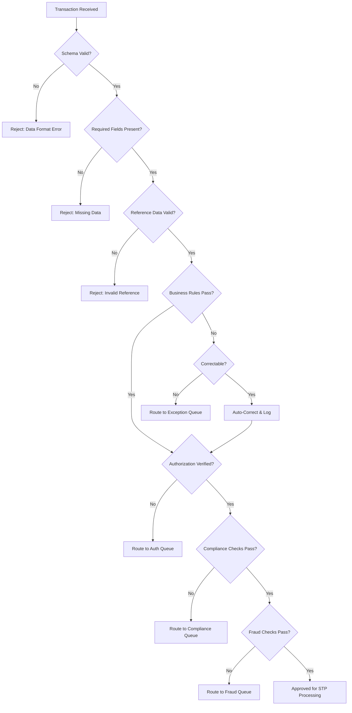

**Validation layers (executed in order):**

| Layer | Purpose | Examples | Failure Action |
|-------|---------|----------|----------------|
| 1. Schema Validation | Structural correctness | JSON/XML schema, data types, field lengths | Reject immediately |
| 2. Completeness Validation | All required fields present | Required fields by transaction type, conditional requirements | Reject with specific missing fields |
| 3. Format Validation | Data format correctness | Date formats, phone formats, SSN format, currency format | Reject or auto-correct |
| 4. Reference Validation | Valid reference data | Policy number exists, fund codes valid, state codes valid | Reject with specific invalid references |
| 5. Cross-Field Validation | Field consistency | Start date before end date, percentages total 100%, amount within range | Reject with inconsistency detail |
| 6. Business Rule Validation | Business logic | Eligibility, limits, timing, authorization | Route to exception or reject |
| 7. Compliance Validation | Regulatory compliance | Suitability, replacement, state rules | Route to compliance queue |
| 8. Fraud Validation | Fraud detection | Velocity checks, pattern matching, anomaly detection | Route to fraud queue |

### 4.2 Exception-by-Rule Design

Rather than coding exception handling into procedural logic, every exception condition should be defined as a declarative rule. This enables:

- Business analysts to manage exception criteria without code changes
- Complete audit trail of why a transaction was pended
- Analytics on exception patterns for continuous improvement
- A/B testing of rule thresholds

**Exception rule template:**

```yaml
exception_rule:
  id: "EXC-FIN-WD-001"
  name: "Large Withdrawal Review"
  description: "Route withdrawals above threshold for manual review"
  category: "Financial"
  subcategory: "Withdrawal"
  conditions:
    - field: "transaction.amount"
      operator: "greater_than"
      value: 100000
    - field: "policy.product_type"
      operator: "in"
      value: ["UL", "VUL", "IUL"]
  action: "route_to_queue"
  queue: "LARGE_FINANCIAL_REVIEW"
  priority: "HIGH"
  sla_hours: 4
  effective_date: "2025-01-01"
  expiration_date: null
  version: 3
  approved_by: "jane.smith@insurer.com"
  approved_date: "2024-12-15"
```

### 4.3 Human-in-the-Loop Patterns

Not every transaction can or should be fully automated. Human-in-the-loop (HITL) patterns provide structured integration of human judgment within otherwise automated flows.

**Pattern 1: Review-and-Release**
The system processes the transaction to completion but holds the final commit pending human review. Used for high-value or unusual transactions.

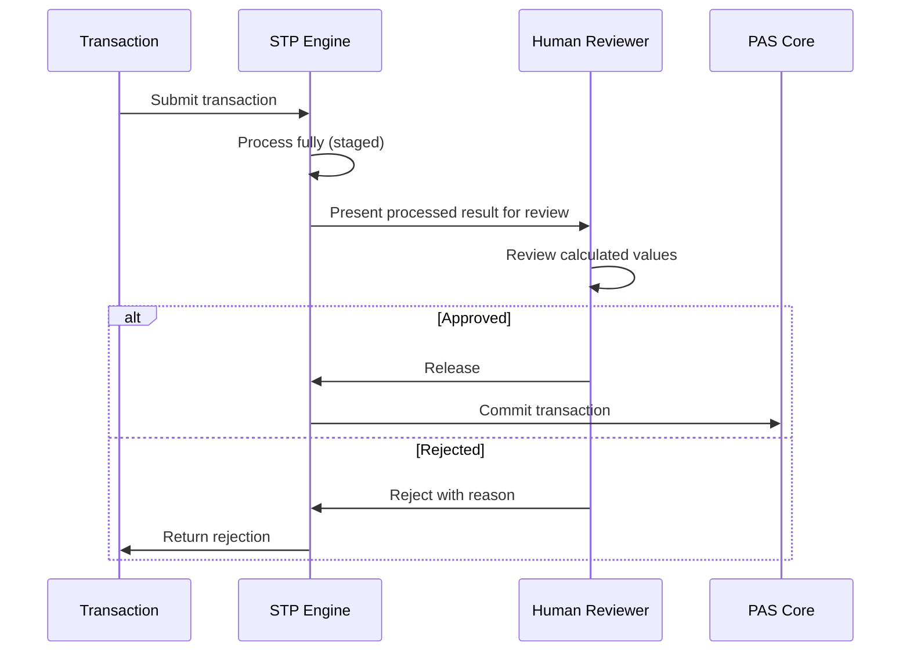

**Pattern 2: Exception-Only Review**
The system processes most transactions automatically. Only those failing specific rules route to humans.

**Pattern 3: Sampling-Based Review**
Random or risk-weighted sample of STP transactions are flagged for post-processing review. Does not delay processing but provides quality assurance.

**Pattern 4: Tiered Approval**
Different approval levels based on transaction characteristics:

| Tier | Criteria | Approval |
|------|----------|----------|
| Tier 1 | Low risk, within standard limits | Fully automated |
| Tier 2 | Medium risk or elevated amounts | Single reviewer |
| Tier 3 | High risk, high value, or exception | Senior reviewer + supervisor |
| Tier 4 | Extraordinary | Committee/executive approval |

### 4.4 Escalation Hierarchies

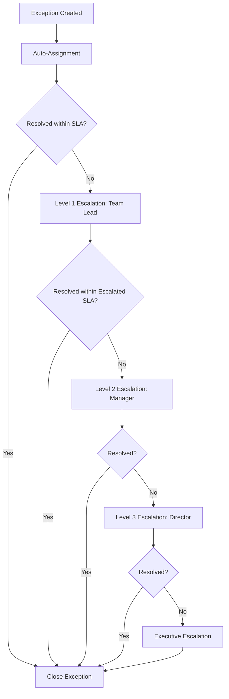

**Escalation time windows:**

| Level | Role | SLA Window | Action |
|-------|------|------------|--------|
| L0 | Auto-resolution attempt | 0–5 minutes | System retry, auto-correct |
| L1 | Processor | 5 min – 4 hours | Standard resolution |
| L2 | Team Lead | 4 – 8 hours | Escalated resolution |
| L3 | Manager | 8 – 24 hours | Management resolution |
| L4 | Director | 24 – 48 hours | Executive resolution |

### 4.5 Confidence Scoring

Confidence scoring assigns a numeric score to each STP-candidate transaction reflecting the system's confidence that the transaction is correct and safe to auto-process.

```
Confidence Score = Σ (Factor_Weight × Factor_Score) / Σ Factor_Weight
```

**Factor scoring model:**

| Factor | Weight | Score Range | Description |
|--------|--------|-------------|-------------|
| Data completeness | 15 | 0–100 | % of optional fields populated |
| Data source reliability | 20 | 0–100 | Channel trust level (authenticated portal = 100, email = 40, paper = 20) |
| Transaction pattern match | 15 | 0–100 | Similarity to historically successful STP transactions |
| Customer risk profile | 20 | 0–100 | Customer trust score based on history |
| Financial magnitude | 15 | 0–100 | Lower amounts score higher |
| Velocity check | 15 | 0–100 | Normal frequency scores higher |

**Threshold-based decisioning:**

| Confidence Score | Action |
|-----------------|--------|
| 90–100 | Auto-approve (STP) |
| 75–89 | Auto-approve with post-processing audit sample |
| 60–74 | Route to expedited review queue |
| 40–59 | Route to standard review queue |
| 0–39 | Route to enhanced review (senior processor) |

### 4.6 Auto-Approve Thresholds

Auto-approve thresholds define the boundary conditions within which a transaction can be automatically processed. These thresholds are set conservatively and adjusted based on operational experience.

**Threshold configuration example:**

```json
{
  "transaction_type": "PARTIAL_WITHDRAWAL",
  "product_types": ["TRAD_UL", "CURR_ASSUMP_UL", "IUL"],
  "auto_approve_thresholds": {
    "max_amount": 50000,
    "max_percentage_of_value": 25,
    "min_remaining_balance": 10000,
    "max_surrender_charge": 0,
    "min_policy_age_years": 1,
    "min_owner_age": 59.5,
    "max_outstanding_loan_percentage": 50,
    "required_tax_withholding_election": true,
    "allowed_channels": ["WEB_PORTAL", "MOBILE_APP", "IVR"],
    "excluded_states": [],
    "max_transactions_per_day": 1,
    "max_transactions_per_month": 2
  },
  "version": "2025.1",
  "effective_date": "2025-01-15",
  "approved_by": "compliance.committee",
  "review_date": "2025-07-15"
}
```

---

## 5. Rules-Based STP

### 5.1 Decision Tables for Auto-Processing

Decision tables provide a structured, transparent, and auditable mechanism for encoding STP logic. Each row represents a rule; columns represent conditions and actions.

**General structure:**

| Rule # | Condition 1 | Condition 2 | ... | Condition N | Action 1 | Action 2 |
|--------|------------|------------|-----|------------|----------|----------|
| R1 | Value | Value | ... | Value | Action | Action |
| R2 | Value | Value | ... | Value | Action | Action |

**Hit policies:**

| Policy | Code | Description | Use Case |
|--------|------|-------------|----------|
| Unique | U | Only one rule matches | Simple, non-overlapping classification |
| First | F | First matching rule applies | Priority-ordered rules |
| Any | A | Any matching rule (all must agree) | Validation rules |
| Priority | P | Highest priority matching rule | Conflicting rules with priority |
| Collect | C | All matching rules fire; results collected | Aggregating multiple actions |
| Output Order | O | Results ordered by output priority | Ranked results |
| Rule Order | R | Results ordered by rule sequence | Sequential processing |

### 5.2 Rule Categories

#### 5.2.1 Eligibility Rules

Determine whether a transaction is allowed for a given policy/product combination.

```
RULE: ELIG-WD-001 — Withdrawal Eligibility
IF:
  policy.status = 'ACTIVE'
  AND policy.product_type IN ('UL', 'VUL', 'IUL', 'VA')
  AND policy.issue_date + surrender_charge_period <= CURRENT_DATE
  AND policy.account_value > minimum_balance
  AND transaction.amount <= policy.account_value - minimum_balance
THEN:
  eligible = TRUE
ELSE:
  eligible = FALSE
  reason_code = DETERMINE_REASON(conditions_failed)
```

#### 5.2.2 Validation Rules

Ensure transaction data meets quality and consistency standards.

```
RULE: VAL-BENE-001 — Beneficiary Change Validation
IF:
  beneficiary_changes IS NOT EMPTY
  AND SUM(beneficiary.percentage) = 100
  AND ALL beneficiaries HAVE (name IS NOT NULL AND relationship IS NOT NULL)
  AND ALL beneficiaries WHERE type = 'TRUST' HAVE (tin IS NOT NULL)
  AND ALL beneficiaries WHERE type = 'MINOR' HAVE (custodian IS NOT NULL)
THEN:
  validation_passed = TRUE
ELSE:
  validation_passed = FALSE
  errors = COLLECT_VALIDATION_ERRORS()
```

#### 5.2.3 Authorization Rules

Verify that the requesting party has authority to execute the transaction.

```
RULE: AUTH-001 — Transaction Authorization
IF:
  requestor.role = 'OWNER'
  AND requestor.authenticated = TRUE
  AND (
    transaction.type NOT IN ('FULL_SURRENDER', 'BENEFICIARY_CHANGE', 'ASSIGNMENT')
    OR irrevocable_beneficiary_exists = FALSE
  )
  AND (
    transaction.amount IS NULL
    OR transaction.amount <= authorization_threshold(requestor.auth_level)
  )
THEN:
  authorized = TRUE
ELSE:
  authorized = FALSE
  required_action = DETERMINE_AUTH_REQUIREMENT()
```

#### 5.2.4 Processing Rules

Define how the transaction should be calculated and booked.

```
RULE: PROC-WD-001 — Withdrawal Processing
WHEN: transaction.type = 'PARTIAL_WITHDRAWAL' AND eligible = TRUE
THEN:
  1. Calculate free_withdrawal_amount = MAX(0, annual_free_amount - ytd_withdrawals)
  2. IF transaction.amount <= free_withdrawal_amount THEN
       surrender_charge = 0
     ELSE
       excess = transaction.amount - free_withdrawal_amount
       surrender_charge = excess * surrender_charge_rate(policy_year)
  3. Calculate gain = FIFO_GAIN(transaction.amount, policy.cost_basis)
  4. Calculate tax_withholding = gain * withholding_rate(owner.tax_election)
  5. net_disbursement = transaction.amount - surrender_charge - tax_withholding
  6. UPDATE policy.account_value -= transaction.amount
  7. UPDATE policy.cost_basis -= (transaction.amount - gain)
  8. CREATE disbursement(net_disbursement, owner.disbursement_method)
  9. CREATE tax_record(gain, tax_withholding)
  10. GENERATE correspondence('WITHDRAWAL_CONFIRMATION')
```

### 5.3 Rule Chaining

Complex transactions often require multiple rules to fire in sequence, with the output of one rule feeding the input of the next.

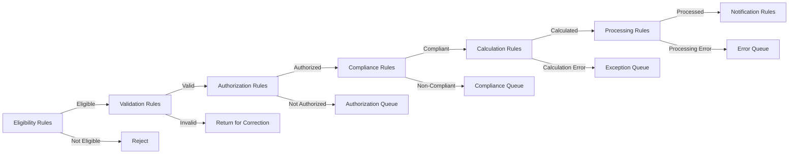

### 5.4 Conflict Resolution

When multiple rules match and produce conflicting outcomes:

**Strategy 1: Priority-Based**
Each rule has an explicit priority. Highest priority wins.

```yaml
rules:
  - id: "WD-APPROVE-001"
    priority: 100
    condition: "amount < 10000 AND policy_age > 5"
    action: "APPROVE"
  - id: "WD-REVIEW-001"
    priority: 200  # Higher priority overrides
    condition: "amount < 10000 AND recent_address_change = TRUE"
    action: "ROUTE_TO_REVIEW"
```

**Strategy 2: Specificity-Based**
More specific rules override more general rules (similar to CSS specificity).

**Strategy 3: Recency-Based**
More recently created/updated rules take precedence (use with caution).

**Strategy 4: Conservative-Wins**
In case of conflict, the more conservative action is taken (e.g., "review" wins over "approve").

### 5.5 Rule Versioning and Deployment

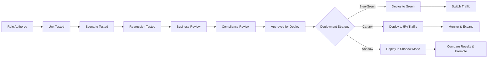

**Rule version management:**

```json
{
  "rule_id": "WD-ELIG-001",
  "versions": [
    {
      "version": "1.0.0",
      "status": "RETIRED",
      "effective_date": "2023-01-01",
      "retirement_date": "2024-06-30",
      "author": "john.doe@insurer.com"
    },
    {
      "version": "2.0.0",
      "status": "ACTIVE",
      "effective_date": "2024-07-01",
      "retirement_date": null,
      "author": "jane.smith@insurer.com",
      "change_description": "Updated free withdrawal threshold from 10% to 15% per product change",
      "approved_by": "compliance.committee",
      "test_results": {
        "unit_tests": "142/142 passed",
        "scenario_tests": "89/89 passed",
        "regression_impact": "3 scenarios affected, all verified"
      }
    },
    {
      "version": "3.0.0",
      "status": "STAGED",
      "effective_date": "2025-04-01",
      "author": "jane.smith@insurer.com",
      "change_description": "Added state-specific withdrawal restrictions for NY and CA"
    }
  ]
}
```

---

## 6. Exception Handling

### 6.1 Exception Types

| Exception Type | Description | Typical % of Exceptions | Resolution Approach |
|---------------|-------------|------------------------|---------------------|
| Data Quality | Missing, invalid, or inconsistent data | 25–35% | Return to source for correction |
| Business Rule Failure | Transaction violates business rules | 30–40% | Manual evaluation, override with authority |
| Regulatory Hold | State/federal regulation requires human review | 10–15% | Compliance review |
| Fraud Alert | Suspicious activity detected | 5–10% | Fraud investigation |
| System Error | Technical failure in processing | 5–10% | Technical resolution, retry |
| Authorization Gap | Missing required consent/signature | 10–15% | Request additional authorization |

### 6.2 Exception Queue Design

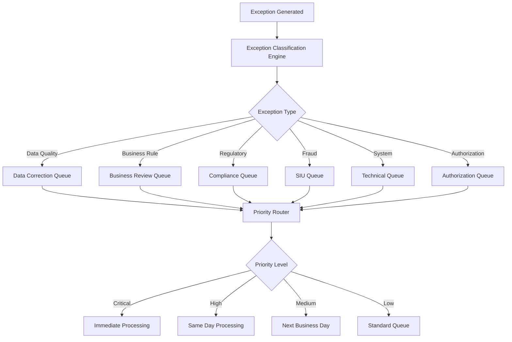

**Queue attributes:**

```json
{
  "queue_definition": {
    "queue_id": "BIZ_REVIEW_FINANCIAL",
    "name": "Business Review - Financial Transactions",
    "description": "Financial transactions requiring business review",
    "exception_types": ["BUSINESS_RULE_FAILURE"],
    "transaction_categories": ["WITHDRAWAL", "SURRENDER", "LOAN", "TRANSFER"],
    "assignment_strategy": "SKILL_BASED_ROUND_ROBIN",
    "required_skills": ["financial_processing", "tax_calculation"],
    "sla": {
      "critical": { "target_hours": 2, "max_hours": 4 },
      "high": { "target_hours": 4, "max_hours": 8 },
      "medium": { "target_hours": 8, "max_hours": 24 },
      "low": { "target_hours": 24, "max_hours": 72 }
    },
    "escalation_rules": [
      {
        "trigger": "sla_warning",
        "threshold_percent": 75,
        "action": "notify_team_lead"
      },
      {
        "trigger": "sla_breach",
        "threshold_percent": 100,
        "action": "escalate_to_manager"
      }
    ],
    "capacity": {
      "processors": 15,
      "max_items_per_processor": 25,
      "overflow_queue": "BIZ_REVIEW_OVERFLOW"
    }
  }
}
```

### 6.3 Priority Routing

Priority is determined by a scoring model:

```
Priority Score = (Urgency × 0.3) + (Impact × 0.3) + (Customer Value × 0.2) + (Age × 0.2)
```

| Factor | Score 1 (Low) | Score 5 (High) |
|--------|---------------|----------------|
| Urgency | No deadline | Regulatory deadline imminent |
| Impact | Informational change | Financial disbursement pending |
| Customer Value | Standard | High-net-worth / VIP |
| Age | Just created | Approaching SLA breach |

### 6.4 Pend Reason Codes

A comprehensive taxonomy of pend reasons enables analytics and continuous improvement:

| Code | Category | Description | Auto-Close Eligible |
|------|----------|-------------|---------------------|
| PND-DQ-001 | Data Quality | Missing owner SSN/TIN | No |
| PND-DQ-002 | Data Quality | Invalid address (USPS undeliverable) | No |
| PND-DQ-003 | Data Quality | Beneficiary percentage doesn't total 100% | No |
| PND-DQ-004 | Data Quality | Invalid fund code | No |
| PND-DQ-005 | Data Quality | Duplicate transaction detected | Yes (after 24h if confirmed duplicate) |
| PND-BR-001 | Business Rule | Amount exceeds auto-approve threshold | No |
| PND-BR-002 | Business Rule | Transaction frequency limit exceeded | Yes (after cooling period) |
| PND-BR-003 | Business Rule | Insufficient balance for requested amount | No |
| PND-BR-004 | Business Rule | Surrender charge period restriction | No |
| PND-BR-005 | Business Rule | MEC limit would be exceeded | No |
| PND-RG-001 | Regulatory | State suitability review required | No |
| PND-RG-002 | Regulatory | Replacement regulation review | No |
| PND-RG-003 | Regulatory | Free-look period restriction | Yes (after free-look expires) |
| PND-RG-004 | Regulatory | Anti-money laundering review | No |
| PND-FR-001 | Fraud | Velocity check failure | No |
| PND-FR-002 | Fraud | Address change + financial transaction pattern | No |
| PND-FR-003 | Fraud | Deceased owner alert | No |
| PND-SE-001 | System | Downstream service unavailable | Yes (auto-retry) |
| PND-SE-002 | System | Calculation engine timeout | Yes (auto-retry) |
| PND-SE-003 | System | Integration error | Yes (auto-retry after fix) |
| PND-AU-001 | Authorization | Irrevocable beneficiary consent missing | No |
| PND-AU-002 | Authorization | Assignment holder consent missing | No |
| PND-AU-003 | Authorization | Owner signature not verified | No |

### 6.5 Auto-Close Rules

Certain exceptions can be automatically resolved after specific conditions are met:

```yaml
auto_close_rules:
  - rule_id: "AC-001"
    pend_code: "PND-SE-001"
    description: "Auto-close downstream service unavailable after successful retry"
    conditions:
      - type: "RETRY_SUCCESS"
        max_retries: 3
        retry_interval_minutes: [5, 15, 60]
    action: "CLOSE_AND_PROCESS"
    
  - rule_id: "AC-002"
    pend_code: "PND-DQ-005"
    description: "Auto-close confirmed duplicate after 24 hours"
    conditions:
      - type: "TIME_ELAPSED"
        hours: 24
      - type: "DUPLICATE_CONFIRMED"
        match_fields: ["policy_number", "transaction_type", "amount", "effective_date"]
    action: "CLOSE_AS_DUPLICATE"
    
  - rule_id: "AC-003"
    pend_code: "PND-BR-002"
    description: "Auto-close frequency limit after cooling period"
    conditions:
      - type: "TIME_ELAPSED"
        hours: 168  # 7 days
      - type: "NO_SUBSEQUENT_SAME_TYPE"
    action: "RESUBMIT_FOR_PROCESSING"
    
  - rule_id: "AC-004"
    pend_code: "PND-RG-003"
    description: "Auto-close free-look restriction after period expires"
    conditions:
      - type: "DATE_REACHED"
        date_expression: "policy.issue_date + product.free_look_days"
    action: "RESUBMIT_FOR_PROCESSING"
```

### 6.6 Exception Resolution Workflows

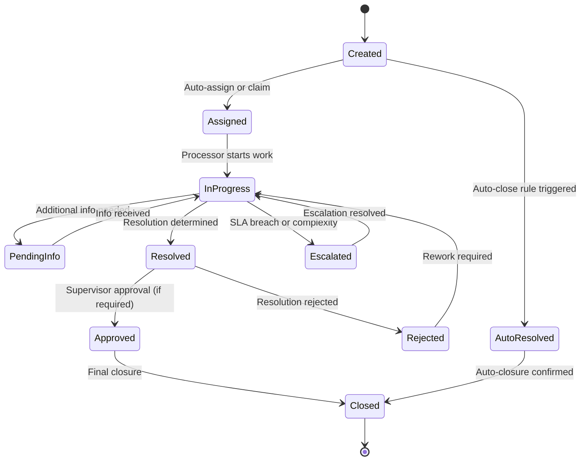

---

## 7. Workflow Orchestration for STP

### 7.1 Saga Pattern for Multi-Step Transactions

Life insurance transactions often span multiple systems and must maintain consistency. The Saga pattern orchestrates a series of local transactions, each with a compensating action in case of failure.

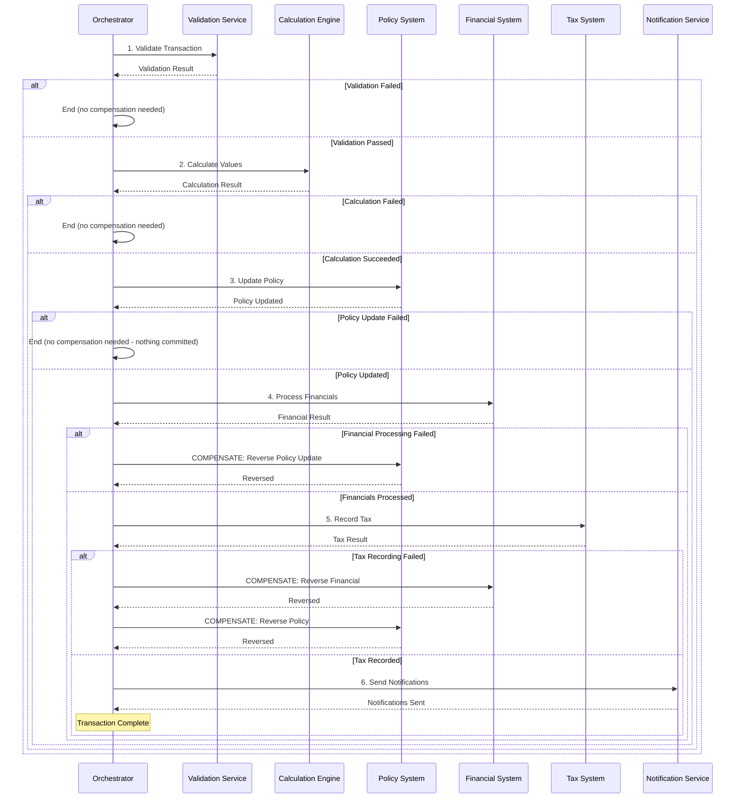

**Saga definition example:**

```yaml
saga:
  name: "partial_withdrawal"
  version: "2.1"
  timeout_minutes: 30
  steps:
    - step: 1
      name: "validate"
      service: "validation-service"
      operation: "validateWithdrawal"
      compensating_action: null  # Nothing to compensate
      timeout_seconds: 10
      retry:
        max_attempts: 2
        backoff: "fixed"
        interval_ms: 1000

    - step: 2
      name: "calculate"
      service: "calculation-engine"
      operation: "calculateWithdrawal"
      compensating_action: null
      timeout_seconds: 30
      retry:
        max_attempts: 3
        backoff: "exponential"
        initial_interval_ms: 500
        max_interval_ms: 5000

    - step: 3
      name: "update_policy"
      service: "policy-service"
      operation: "applyWithdrawal"
      compensating_action: "reverseWithdrawal"
      timeout_seconds: 15
      retry:
        max_attempts: 2
        backoff: "fixed"
        interval_ms: 2000

    - step: 4
      name: "process_financial"
      service: "financial-service"
      operation: "processDisbursement"
      compensating_action: "reverseDisbursement"
      timeout_seconds: 20
      retry:
        max_attempts: 3
        backoff: "exponential"
        initial_interval_ms: 1000

    - step: 5
      name: "record_tax"
      service: "tax-service"
      operation: "recordTaxableEvent"
      compensating_action: "reverseTaxRecord"
      timeout_seconds: 10
      retry:
        max_attempts: 2
        backoff: "fixed"
        interval_ms: 1000

    - step: 6
      name: "notify"
      service: "notification-service"
      operation: "sendConfirmation"
      compensating_action: null  # Notification failure doesn't require compensation
      timeout_seconds: 15
      retry:
        max_attempts: 3
        backoff: "exponential"
        initial_interval_ms: 500
      failure_policy: "WARN_AND_CONTINUE"  # Don't fail saga for notification failure
```

### 7.2 Compensation / Rollback Logic

Compensation must be designed for each step that modifies state:

| Step | Forward Action | Compensating Action | Compensation Notes |
|------|---------------|--------------------|--------------------|
| Update Policy | Reduce account value, update cost basis | Restore account value, restore cost basis | Must use exact reversal values, not recalculation |
| Process Financial | Create disbursement record, initiate payment | Void disbursement, cancel payment (if not yet settled) | Time-sensitive: if payment already sent via ACH, may require recovery process |
| Record Tax | Create 1099 record, update YTD tracking | Remove 1099 record, reverse YTD tracking | Must coordinate with tax reporting cycle |
| Update Commission | Calculate and record commission | Reverse commission, create chargeback | May involve agent notification |

**Compensation ordering:**
Compensating actions execute in reverse order of the forward actions. Each compensation must be idempotent — if a compensation action is retried, it must produce the same result.

### 7.3 Idempotency Design

Every STP operation must be idempotent to handle retries safely:

```
Idempotency Key = SHA-256(policy_number + transaction_type + effective_date + amount + request_timestamp)
```

**Idempotency implementation pattern:**

```
FUNCTION processTransaction(request):
    idempotency_key = generateKey(request)
    
    existing = idempotency_store.get(idempotency_key)
    IF existing IS NOT NULL:
        IF existing.status = 'COMPLETED':
            RETURN existing.result  // Return cached result
        ELIF existing.status = 'IN_PROGRESS':
            IF existing.started_at + timeout < NOW():
                // Stale in-progress, safe to retry
                idempotency_store.update(idempotency_key, status='IN_PROGRESS', started_at=NOW())
            ELSE:
                RETURN STATUS_IN_PROGRESS  // Another instance is processing
        ELIF existing.status = 'FAILED':
            // Previous attempt failed, retry
            idempotency_store.update(idempotency_key, status='IN_PROGRESS', started_at=NOW())
    ELSE:
        idempotency_store.create(idempotency_key, status='IN_PROGRESS', started_at=NOW())
    
    TRY:
        result = executeTransaction(request)
        idempotency_store.update(idempotency_key, status='COMPLETED', result=result)
        RETURN result
    CATCH exception:
        idempotency_store.update(idempotency_key, status='FAILED', error=exception)
        THROW exception
```

### 7.4 Retry Strategies

| Strategy | Description | Use Case |
|----------|-------------|----------|
| Immediate Retry | Retry instantly | Transient network glitch |
| Fixed Interval | Retry at fixed intervals | Service temporarily unavailable |
| Exponential Backoff | Double interval each retry | Overloaded downstream service |
| Exponential with Jitter | Backoff + random offset | Prevent thundering herd |
| Circuit Breaker | Stop retrying after threshold | Prolonged downstream outage |

**Retry configuration:**

```json
{
  "retry_policies": {
    "validation_service": {
      "strategy": "FIXED_INTERVAL",
      "max_attempts": 2,
      "interval_ms": 1000,
      "retryable_errors": ["TIMEOUT", "SERVICE_UNAVAILABLE"]
    },
    "calculation_engine": {
      "strategy": "EXPONENTIAL_BACKOFF",
      "max_attempts": 3,
      "initial_interval_ms": 500,
      "max_interval_ms": 5000,
      "multiplier": 2.0,
      "retryable_errors": ["TIMEOUT", "SERVICE_UNAVAILABLE", "RATE_LIMITED"]
    },
    "financial_service": {
      "strategy": "EXPONENTIAL_WITH_JITTER",
      "max_attempts": 5,
      "initial_interval_ms": 1000,
      "max_interval_ms": 30000,
      "multiplier": 2.0,
      "jitter_factor": 0.25,
      "retryable_errors": ["TIMEOUT", "SERVICE_UNAVAILABLE"]
    },
    "circuit_breaker": {
      "failure_threshold": 5,
      "recovery_timeout_ms": 60000,
      "half_open_max_calls": 3
    }
  }
}
```

### 7.5 Dead Letter Queue Handling

Transactions that exhaust all retry attempts are routed to a Dead Letter Queue (DLQ):

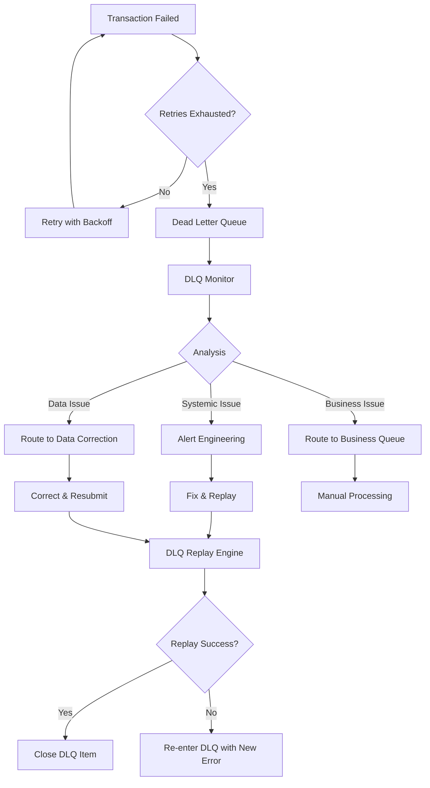

**DLQ item structure:**

```json
{
  "dlq_item": {
    "id": "DLQ-2025-001234",
    "original_transaction_id": "TXN-2025-567890",
    "transaction_type": "PARTIAL_WITHDRAWAL",
    "policy_number": "UL-123456789",
    "created_at": "2025-03-15T14:30:00Z",
    "failed_step": "process_financial",
    "failure_count": 5,
    "last_error": {
      "code": "FIN-TIMEOUT-003",
      "message": "Financial service timeout after 20000ms",
      "stack_trace": "..."
    },
    "retry_history": [
      {"attempt": 1, "timestamp": "2025-03-15T14:30:05Z", "error": "TIMEOUT"},
      {"attempt": 2, "timestamp": "2025-03-15T14:30:10Z", "error": "TIMEOUT"},
      {"attempt": 3, "timestamp": "2025-03-15T14:30:20Z", "error": "TIMEOUT"},
      {"attempt": 4, "timestamp": "2025-03-15T14:30:40Z", "error": "SERVICE_UNAVAILABLE"},
      {"attempt": 5, "timestamp": "2025-03-15T14:31:20Z", "error": "SERVICE_UNAVAILABLE"}
    ],
    "saga_state": {
      "completed_steps": ["validate", "calculate", "update_policy"],
      "pending_compensation": ["update_policy"],
      "failed_step": "process_financial"
    },
    "resolution": null,
    "assigned_to": null,
    "priority": "HIGH"
  }
}
```

---

## 8. STP for New Business

### 8.1 Application Validation Rules

The new business application is the most complex STP scenario due to the number of data elements and the severity of errors.

**Validation rule categories for new business:**

| Category | # of Rules (Typical) | Examples |
|----------|---------------------|----------|
| Applicant Information | 25–40 | Name format, DOB validation, SSN verification, identity check |
| Coverage Details | 30–50 | Face amount within product limits, riders compatible, plan code valid |
| Underwriting Answers | 50–100 | Reflexive question consistency, knock-out condition detection |
| Financial Information | 20–30 | Income validation, net worth, existing coverage, premium source |
| Replacement | 15–25 | Replacement questions, state-specific requirements, comparison |
| Suitability | 20–35 | Product appropriateness, risk tolerance, investment objectives (VUL) |
| Compliance | 25–40 | State filing, age/amount limits, producer licensing, appointment |
| Payment | 10–15 | Payment method, initial premium, mode validation |

### 8.2 Instant Decision Criteria

For accelerated/instant-issue products, the system must determine within seconds whether to issue, refer, or decline:

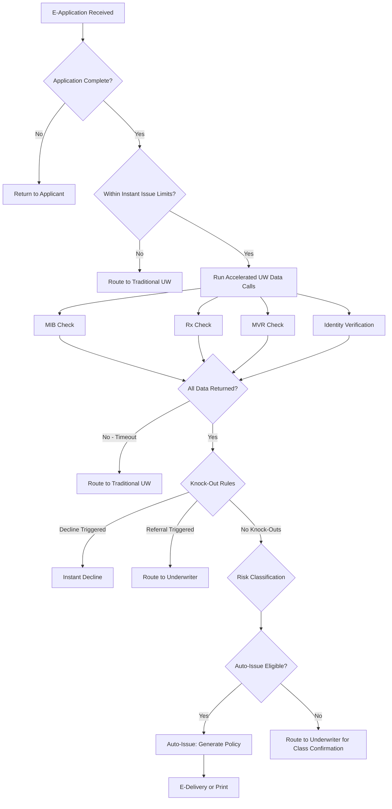

**Instant issue eligibility matrix:**

| Factor | Instant Issue Eligible | Referral Required |
|--------|----------------------|-------------------|
| Age | 18–55 | 56–70 |
| Face Amount (Term) | ≤ $1,000,000 | $1,000,001 – $5,000,000 |
| Face Amount (Perm) | ≤ $500,000 | $500,001 – $2,000,000 |
| BMI Range | 18.5 – 35.0 | 35.1 – 40.0 |
| Tobacco | Non-tobacco only | Tobacco users |
| Health History | No significant disclosures | Any disclosure |
| Rx History | No flagged medications | Flagged medications |
| MIB | No codes | Any codes |
| MVR | Clean record | Minor violations |
| Criminal History | None disclosed | Any disclosure |
| Aviation/Hazardous Activity | None | Any |
| Foreign Travel | No restricted countries | Restricted countries |

### 8.3 Auto-Rate Rules

Once risk classification is determined, auto-rate rules calculate the premium:

```
RULE: RATE-TERM-001 — Term Life Auto-Rating
GIVEN:
  product = 'TERM_20'
  risk_class determined by UW rules
  face_amount validated
  issue_age = YEAR(issue_date) - YEAR(dob) adjusted for nearest/last birthday
  state = policy_state
  tobacco_class = tobacco_status
THEN:
  base_rate = LOOKUP(rate_table, product, risk_class, issue_age, tobacco_class, state)
  modal_premium = base_rate * face_amount / 1000
  IF payment_mode = 'ANNUAL':
    premium = modal_premium
  ELIF payment_mode = 'SEMI_ANNUAL':
    premium = modal_premium * semi_annual_factor
  ELIF payment_mode = 'QUARTERLY':
    premium = modal_premium * quarterly_factor
  ELIF payment_mode = 'MONTHLY_EFT':
    premium = modal_premium * monthly_eft_factor
  
  rider_premiums = SUM(
    FOR EACH rider IN selected_riders:
      LOOKUP(rider_rate_table, rider.code, risk_class, issue_age, rider.amount)
  )
  
  total_premium = premium + rider_premiums
  policy_fee = LOOKUP(fee_table, product, state)
  total_billed = total_premium + policy_fee
```

### 8.4 Auto-Issue Rules

```yaml
auto_issue_rules:
  - rule_id: "AI-001"
    name: "Standard Auto-Issue"
    conditions:
      application_complete: true
      uw_decision: "APPROVE"
      risk_class_confirmed: true
      all_evidence_received: true
      no_outstanding_requirements: true
      initial_premium_collected: true
      replacement_review_complete: true
      suitability_passed: true
      producer_licensed_and_appointed: true
      product_filed_in_state: true
      no_fraud_indicators: true
    actions:
      - action: "GENERATE_POLICY_CONTRACT"
      - action: "CALCULATE_COMMISSION"
      - action: "CREATE_BILLING_SCHEDULE"
      - action: "GENERATE_WELCOME_KIT"
      - action: "TRIGGER_E_DELIVERY"
        condition: "e_delivery_consent = true"
      - action: "TRIGGER_PRINT_AND_MAIL"
        condition: "e_delivery_consent = false"
      - action: "NOTIFY_AGENT"
      - action: "UPDATE_REINSURANCE"
        condition: "face_amount > retention_limit"
```

### 8.5 E-Delivery Triggers

```json
{
  "e_delivery_triggers": {
    "new_business_issue": {
      "documents": [
        "POLICY_CONTRACT",
        "SCHEDULE_PAGE",
        "RIDERS",
        "WELCOME_LETTER",
        "PRIVACY_NOTICE",
        "FREE_LOOK_NOTICE",
        "BUYER_GUIDE"
      ],
      "conditions": {
        "e_delivery_consent": true,
        "valid_email": true,
        "state_allows_e_delivery": true,
        "document_type_e_eligible": true
      },
      "delivery_method": {
        "primary": "SECURE_EMAIL_LINK",
        "fallback": "PRINT_AND_MAIL",
        "fallback_trigger": "DELIVERY_FAILED_OR_UNCLAIMED_10_DAYS"
      },
      "tracking": {
        "sent_confirmation": true,
        "delivery_receipt": true,
        "read_receipt": true,
        "acceptance_tracking": true
      }
    }
  }
}
```

### 8.6 New Business STP Decision Tree

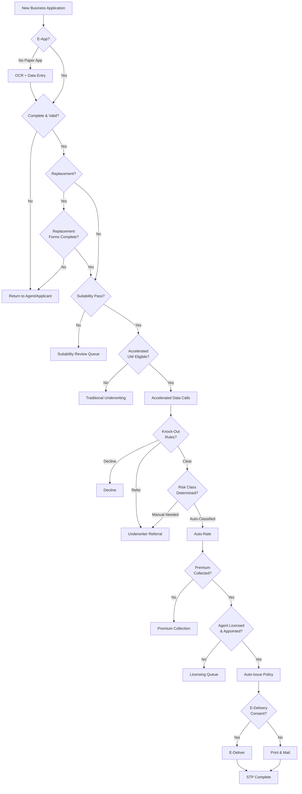

---

## 9. STP for Servicing

### 9.1 Auto-Process Rules by Transaction Type

**General servicing STP rule framework:**

```
FOR EACH servicing_transaction:
  1. VERIFY authentication (channel-appropriate)
  2. VERIFY authorization (owner, authorized representative, POA)
  3. VALIDATE transaction data
  4. CHECK business rules (eligibility, limits, restrictions)
  5. CHECK compliance rules (state-specific, product-specific)
  6. CHECK fraud rules (velocity, pattern, amount)
  7. IF all checks pass → AUTO-PROCESS
  8. ELSE → ROUTE to appropriate exception queue
```

**Transaction-specific auto-process decision tables:**

#### Address Change Decision Table

| Rule | Source Channel | Address Valid (USPS) | OFAC Clear | State Change | Pending Claim | Action |
|------|---------------|---------------------|------------|-------------|---------------|--------|
| 1 | Web Portal | Yes | Yes | No | No | Auto-Process |
| 2 | Web Portal | Yes | Yes | Yes | No | Auto-Process + Update Jurisdiction |
| 3 | Web Portal | Yes | No (Near Match) | - | - | Route to Compliance |
| 4 | Web Portal | No | - | - | - | Return to Owner |
| 5 | Any | - | - | - | Yes | Route to Claims |
| 6 | Paper | Yes | Yes | No | No | Auto-Process |
| 7 | Paper | Yes | Yes | Yes | No | Route to Review (verify signature) |
| 8 | Phone/IVR | Yes | Yes | No | No | Auto-Process (if authenticated) |

#### Fund Transfer Decision Table

| Rule | Product | Auth'd | Within Freq Limit | Balance OK | Fund Valid | Market Open | Timing Flag | Action |
|------|---------|--------|-------------------|-----------|-----------|-------------|-------------|--------|
| 1 | VUL | Yes | Yes | Yes | Yes | Yes | No | Auto-Process |
| 2 | VA | Yes | Yes | Yes | Yes | Yes | No | Auto-Process |
| 3 | Any | No | - | - | - | - | - | Route to Auth Queue |
| 4 | Any | Yes | No | - | - | - | - | Reject (Frequency Limit) |
| 5 | Any | Yes | Yes | No | - | - | - | Reject (Insufficient Balance) |
| 6 | Any | Yes | Yes | Yes | No | - | - | Reject (Invalid Fund) |
| 7 | Any | Yes | Yes | Yes | Yes | No | - | Queue for Next Business Day |
| 8 | Any | Yes | Yes | Yes | Yes | Yes | Yes | Route to Market Timing Review |

### 9.2 Authorization Verification

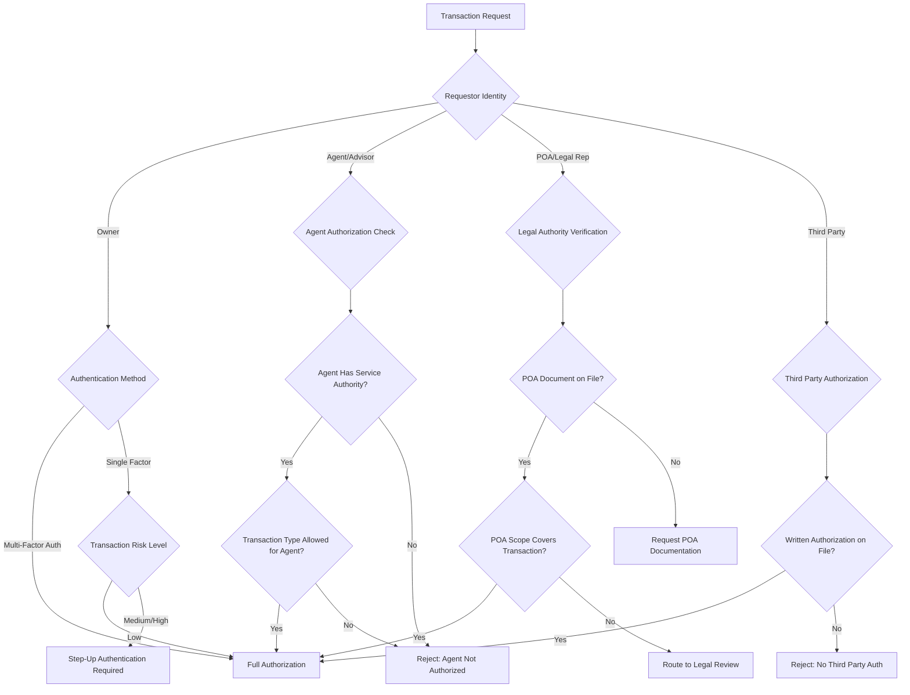

### 9.3 Compliance Checks for Servicing

**Suitability checks for financial transactions:**

| Transaction | Suitability Required? | Criteria |
|-------------|----------------------|----------|
| Fund transfer (VUL) | Yes (in certain states) | Risk tolerance alignment, investment objectives match |
| Withdrawal (qualified) | Conditional | Under 59½ — early withdrawal suitability |
| Surrender | Yes (in certain states) | Replacement consideration, financial impact |
| Annuity exchange | Yes | Comparison analysis, surrender charge impact |
| Loan | Conditional | Impact on policy sustainability |

**Replacement check for exchanges:**

```
RULE: COMPLIANCE-REPL-001
IF:
  transaction.type IN ('SURRENDER', '1035_EXCHANGE', 'REPLACEMENT')
  AND transaction.state IN (states_requiring_replacement_review)
THEN:
  REQUIRE replacement_form_completed
  REQUIRE comparison_statement (if applicable)
  IF state = 'NEW_YORK':
    REQUIRE Regulation 60 comparison
  IF product.type = 'ANNUITY':
    REQUIRE suitability_questionnaire
  IF applicant.age >= 65:
    REQUIRE senior_suitability_review
  ROUTE to compliance_review_queue (if any requirement unmet)
```

---

## 10. STP for Financial Transactions

### 10.1 Premium Allocation

For flexible-premium products (UL, VUL, IUL), incoming premiums must be allocated across investment options:

```
RULE: FIN-ALLOC-001 — Premium Allocation
GIVEN:
  gross_premium received
  product_type IN ('UL', 'VUL', 'IUL')
THEN:
  1. Deduct premium_load = gross_premium × load_percentage(policy_year, premium_band)
  2. net_premium = gross_premium - premium_load
  3. Deduct cost_of_insurance = COI_rate(attained_age, risk_class, net_amount_at_risk) / 12
  4. Deduct rider_charges = SUM(rider_monthly_deduction FOR active riders)
  5. Deduct admin_charge = monthly_admin_charge(product, policy_year)
  6. investable_amount = net_premium - cost_of_insurance - rider_charges - admin_charge
  
  IF policy.allocation_instructions EXISTS:
    FOR EACH fund IN allocation_instructions:
      allocate(fund.code, investable_amount × fund.percentage / 100)
  ELSE:
    allocate(product.default_fund, investable_amount)
  
  7. Perform 7702 test: IF cumulative_premiums > guideline_premium_limit:
       excess = cumulative_premiums - guideline_premium_limit
       ROUTE to MEC_review_queue
```

### 10.2 Fund Transfer Limits

```json
{
  "fund_transfer_limits": {
    "per_transfer": {
      "min_amount": 250,
      "min_percentage": 1,
      "max_percentage": 100
    },
    "frequency": {
      "max_transfers_per_month": 12,
      "max_transfers_per_year": 52,
      "min_days_between_transfers": 1,
      "market_timing_threshold": {
        "same_fund_round_trip_days": 30,
        "max_round_trips_per_quarter": 2
      }
    },
    "balance": {
      "min_remaining_in_source_fund": 500,
      "min_transfer_to_fund": 250
    },
    "fund_specific": {
      "guaranteed_fund": {
        "max_transfer_out_per_year_percentage": 25,
        "transfer_in_max": "unlimited"
      },
      "money_market": {
        "max_balance_percentage": 100,
        "min_holding_period_days": 0
      }
    }
  }
}
```

### 10.3 Withdrawal Eligibility

```
FUNCTION checkWithdrawalEligibility(policy, amount):
    checks = []
    
    // Policy status check
    IF policy.status != 'ACTIVE':
        checks.add(FAIL, "Policy not active")
        RETURN checks
    
    // Minimum balance check
    remaining = policy.account_value - amount
    IF remaining < product.minimum_balance:
        checks.add(FAIL, "Below minimum balance", 
                   {min_balance: product.minimum_balance, remaining: remaining})
    
    // Surrender charge check
    free_amount = calculateFreeWithdrawalAmount(policy)
    IF amount > free_amount:
        sc = calculateSurrenderCharge(policy, amount - free_amount)
        checks.add(WARN, "Surrender charge applies", {charge: sc})
    
    // Loan offset check
    IF policy.outstanding_loan > 0:
        IF amount + policy.outstanding_loan > policy.account_value * 0.90:
            checks.add(FAIL, "Withdrawal + loan exceeds 90% of account value")
    
    // Tax implications
    gain = calculateTaxableGain(policy, amount)
    IF gain > 0:
        IF policy.owner_age < 59.5 AND policy.qualified:
            checks.add(WARN, "10% early withdrawal penalty applies", 
                       {penalty: gain * 0.10})
        
        IF policy.is_mec:
            checks.add(WARN, "MEC: gain taxed first (LIFO)", {taxable: gain})
    
    // Withholding check
    IF NOT policy.tax_withholding_election_on_file:
        checks.add(FAIL, "Tax withholding election required")
    
    RETURN checks
```

### 10.4 Tax Withholding Calculation

```
FUNCTION calculateWithholding(policy, transaction):
    gain = calculateTaxableGain(policy, transaction.amount)
    
    IF policy.qualified:  // IRA, 401k rollover, etc.
        // Entire distribution is generally taxable
        taxable = transaction.amount  // simplified; basis may exist
        
        // Federal withholding
        IF owner.federal_withholding_election = 'OPT_OUT':
            federal = 0
        ELSE:
            federal = taxable * owner.federal_withholding_rate  // default 10% for periodic
        
        // State withholding
        state_rules = getStateWithholdingRules(policy.state)
        IF state_rules.mandatory:
            state = taxable * state_rules.rate
        ELIF owner.state_withholding_election = 'OPT_IN':
            state = taxable * owner.state_withholding_rate
        ELSE:
            state = 0
    
    ELSE:  // Non-qualified
        // Only gain is taxable (FIFO basis recovery for non-MEC)
        IF policy.is_mec:
            taxable = MIN(gain, transaction.amount)  // LIFO for MEC
        ELSE:
            taxable = gain  // Cost basis recovered first
        
        federal = taxable * owner.federal_withholding_rate
        state = calculateStateWithholding(taxable, policy.state, owner)
    
    // Early withdrawal penalty (qualified contracts, under 59½)
    IF policy.qualified AND owner.age < 59.5:
        IF NOT qualifiesForPenaltyException(owner, transaction):
            penalty = taxable * 0.10
        ELSE:
            penalty = 0
    ELSE:
        penalty = 0
    
    RETURN {
        gross_amount: transaction.amount,
        taxable_amount: taxable,
        federal_withholding: federal,
        state_withholding: state,
        early_withdrawal_penalty: penalty,
        net_disbursement: transaction.amount - federal - state
    }
```

### 10.5 Anti-Fraud Velocity Checks

```yaml
velocity_rules:
  - rule_id: "FRAUD-VEL-001"
    name: "Address change before financial transaction"
    description: "Flag financial transactions within 30 days of address change"
    conditions:
      - event: "FINANCIAL_TRANSACTION"
        types: ["WITHDRAWAL", "SURRENDER", "LOAN"]
      - prior_event: "ADDRESS_CHANGE"
        within_days: 30
    action: "ROUTE_TO_FRAUD_REVIEW"
    severity: "HIGH"

  - rule_id: "FRAUD-VEL-002"
    name: "Multiple financial transactions in short period"
    description: "Flag multiple financial transactions in 7 days"
    conditions:
      - event: "FINANCIAL_TRANSACTION"
        count_within_days: 7
        threshold: 3
    action: "ROUTE_TO_FRAUD_REVIEW"
    severity: "MEDIUM"

  - rule_id: "FRAUD-VEL-003"
    name: "Beneficiary change followed by death claim"
    description: "Flag death claims within 180 days of beneficiary change"
    conditions:
      - event: "DEATH_CLAIM"
      - prior_event: "BENEFICIARY_CHANGE"
        within_days: 180
    action: "ROUTE_TO_SIU"
    severity: "CRITICAL"

  - rule_id: "FRAUD-VEL-004"
    name: "Large disbursement to new bank account"
    description: "Flag large disbursements to recently added bank accounts"
    conditions:
      - event: "DISBURSEMENT"
        amount_threshold: 25000
      - prior_event: "BANK_ACCOUNT_CHANGE"
        within_days: 14
    action: "ROUTE_TO_FRAUD_REVIEW"
    severity: "HIGH"

  - rule_id: "FRAUD-VEL-005"
    name: "Contact information change velocity"
    description: "Flag if address, phone, email all changed within 7 days"
    conditions:
      - events_within_days: 7
        required_events: ["ADDRESS_CHANGE", "PHONE_CHANGE", "EMAIL_CHANGE"]
        min_count: 3
    action: "ROUTE_TO_FRAUD_REVIEW"
    severity: "HIGH"

  - rule_id: "FRAUD-VEL-006"
    name: "Policy loan followed by surrender"
    description: "Flag surrender within 90 days of maximum loan"
    conditions:
      - event: "SURRENDER"
      - prior_event: "POLICY_LOAN"
        within_days: 90
        loan_percentage_of_max: 80
    action: "ROUTE_TO_FRAUD_REVIEW"
    severity: "MEDIUM"
```

---

## 11. Monitoring & Analytics

### 11.1 STP Rate Dashboards

**Key dashboard views:**

1. **Executive Summary Dashboard**
   - Overall STP rate (trend, MTD, QTD, YTD)
   - STP rate by transaction type (heatmap)
   - Cost savings (cumulative, monthly)
   - Exception volume and aging

2. **Operational Dashboard**
   - Real-time transaction flow (STP vs. exception)
   - Queue depths and wait times
   - Processor utilization and throughput
   - SLA compliance by queue

3. **Analytics Dashboard**
   - Exception root cause analysis (Pareto chart)
   - Rule effectiveness (hit rates, false positive rates)
   - STP rate trends by product, channel, state
   - Prediction models for STP rate improvement

**Dashboard metrics specification:**

```yaml
dashboard_metrics:
  real_time:
    - metric: "stp_rate_current_hour"
      calculation: "stp_transactions / total_transactions (rolling 60 min)"
      refresh: "every_minute"
      alert_threshold_low: 60
      
    - metric: "exception_queue_depth"
      calculation: "COUNT(open_exceptions) GROUP BY queue"
      refresh: "every_minute"
      alert_threshold_high: 500
      
    - metric: "average_processing_time_stp"
      calculation: "AVG(complete_time - submit_time) WHERE stp = true"
      refresh: "every_5_minutes"
      alert_threshold_high_seconds: 30

  daily:
    - metric: "stp_rate_by_transaction_type"
      dimensions: ["transaction_type", "product", "channel", "state"]
      
    - metric: "exception_resolution_time"
      calculation: "AVG(resolution_time - creation_time) GROUP BY exception_type"
      
    - metric: "cost_savings"
      calculation: "stp_transactions * (manual_cost - stp_cost)"
      
    - metric: "rule_effectiveness"
      dimensions: ["rule_id"]
      measures: ["hit_count", "false_positive_count", "accuracy_rate"]
```

### 11.2 Exception Analysis

**Pareto analysis of exceptions (typical distribution):**

```
Exception Cause                    | % of Exceptions | Cumulative %
----------------------------------|-----------------|-------------
Missing tax withholding election   | 18%             | 18%
Amount exceeds auto-approve limit  | 15%             | 33%
Suitability review required        | 12%             | 45%
Incomplete beneficiary data        | 10%             | 55%
Address validation failure         | 8%              | 63%
Authorization not verified         | 7%              | 70%
Outstanding loan conflict          | 6%              | 76%
Fund transfer frequency limit      | 5%              | 81%
State-specific regulation hold     | 4%              | 85%
System timeout                     | 4%              | 89%
Replacement regulation review      | 3%              | 92%
Fraud velocity alert               | 3%              | 95%
Other                              | 5%              | 100%
```

**Root cause → Action mapping:**

| Root Cause | Action to Improve STP Rate |
|------------|---------------------------|
| Missing tax withholding election | Pre-populate election during enrollment; prompt at login |
| Amount exceeds auto-approve limit | Analyze threshold vs. actual loss experience; adjust if safe |
| Suitability review required | Implement automated suitability scoring; reduce manual states |
| Incomplete beneficiary data | Enhance UI validation; require all fields before submission |
| Address validation failure | Integrate real-time address verification in UI |
| Authorization not verified | Enable step-up authentication; reduce channel restrictions |

### 11.3 Rule Effectiveness Metrics

| Metric | Description | Target |
|--------|-------------|--------|
| Hit Rate | % of transactions evaluated where rule fires | Varies by rule |
| True Positive Rate | % of rule firings that correctly identified an issue | > 85% |
| False Positive Rate | % of rule firings that were incorrect (unnecessary exception) | < 15% |
| Miss Rate | % of issues that should have been caught but weren't | < 2% |
| Processing Time Impact | Additional processing time added by rule evaluation | < 100ms per rule |

### 11.4 Continuous Improvement Cycle

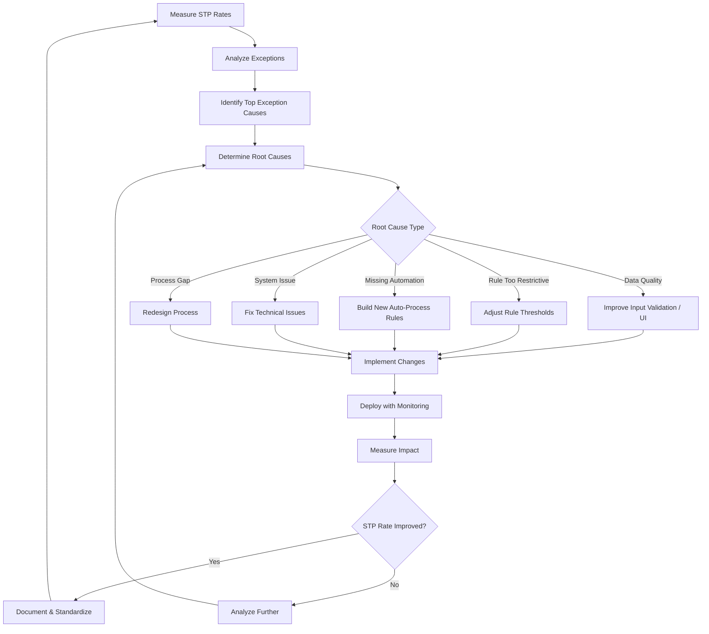

---

## 12. STP Architecture

### 12.1 High-Level Architecture

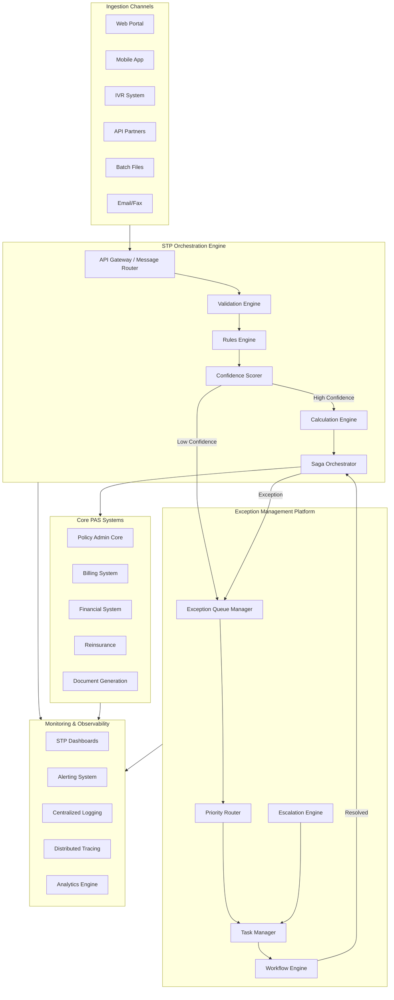

### 12.2 STP Orchestration Engine

**Component responsibilities:**

| Component | Responsibility | Technology Options |
|-----------|---------------|-------------------|
| API Gateway | Request routing, authentication, rate limiting, protocol translation | Kong, AWS API Gateway, Apigee |
| Validation Engine | Multi-layer data validation, schema enforcement | Custom, JSON Schema, Apache Camel validators |
| Rules Engine | Business rule evaluation, decision tables, risk scoring | Drools, IBM ODM, FICO Blaze, InRule |
| Calculation Engine | Financial calculations, tax computations, projections | Custom (high-performance), Wolfram, custom actuarial libs |
| Saga Orchestrator | Multi-step transaction coordination, compensation | Temporal, Camunda, Axon, custom |
| Confidence Scorer | ML-based transaction risk/confidence assessment | Custom ML models, TensorFlow Serving |

### 12.3 Rules Engine Integration

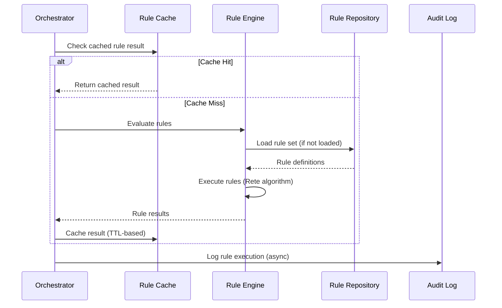

### 12.4 Exception Management Platform

**Data model for exception management:**

```
EXCEPTION
├── exception_id (PK)
├── transaction_id (FK)
├── policy_number
├── exception_type (ENUM)
├── exception_subtype
├── pend_reason_code
├── pend_reason_description
├── priority (CRITICAL/HIGH/MEDIUM/LOW)
├── status (CREATED/ASSIGNED/IN_PROGRESS/PENDING_INFO/RESOLVED/CLOSED)
├── queue_id (FK)
├── assigned_to
├── assigned_at
├── created_at
├── updated_at
├── sla_target_time
├── sla_breach_time
├── resolution_code
├── resolution_notes
├── resolution_by
├── resolution_at
├── escalation_level
├── escalation_history (JSON)
├── related_exceptions (JSON array)
└── audit_trail (JSON array)

EXCEPTION_QUEUE
├── queue_id (PK)
├── queue_name
├── queue_type
├── assignment_strategy
├── required_skills (JSON array)
├── sla_config (JSON)
├── escalation_config (JSON)
├── active_processor_count
├── current_depth
└── avg_resolution_minutes

EXCEPTION_NOTE
├── note_id (PK)
├── exception_id (FK)
├── note_type (SYSTEM/USER/ESCALATION)
├── note_text
├── created_by
├── created_at
└── attachments (JSON array)
```

### 12.5 Monitoring & Observability Stack

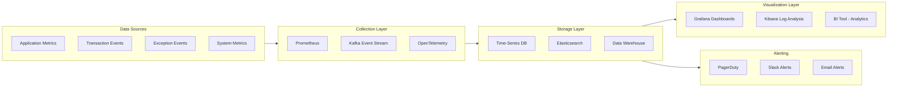

---

## 13. Decision Tables for Transaction Types

### 13.1 Address Change Decision Table

| # | Channel | Owner Auth | USPS Valid | OFAC Clear | State Change | Pending Claim | Decision | Queue |
|---|---------|-----------|-----------|-----------|-------------|---------------|----------|-------|
| 1 | Portal | Yes | Yes | Yes | No | No | **STP** | — |
| 2 | Portal | Yes | Yes | Yes | Yes | No | **STP** + Jurisdiction Update | — |
| 3 | Portal | Yes | Yes | Near Match | — | — | **PEND** | Compliance |
| 4 | Portal | Yes | No | — | — | — | **REJECT** | — |
| 5 | Portal | Yes | Yes | Yes | — | Yes | **PEND** | Claims |
| 6 | Paper | N/A | Yes | Yes | No | No | **STP** (verified sig) | — |
| 7 | Paper | N/A | Yes | Yes | Yes | No | **PEND** | Review |
| 8 | Phone | Yes | Yes | Yes | No | No | **STP** | — |
| 9 | Agent | Yes | Yes | Yes | No | No | **STP** | — |
| 10 | Any | No | — | — | — | — | **REJECT** | — |

### 13.2 Beneficiary Change Decision Table

| # | Ben Type | Irrev Ben Exists | Assignment | Percentages=100 | All Data Complete | OFAC Clear | Owner Auth | Decision | Queue |
|---|---------|-----------------|-----------|-----------------|-------------------|-----------|-----------|----------|-------|
| 1 | Revocable | No | No | Yes | Yes | Yes | Yes | **STP** | — |
| 2 | Revocable | No | No | No | — | — | — | **REJECT** | — |
| 3 | Revocable | No | No | Yes | No | — | — | **REJECT** | — |
| 4 | Revocable | Yes | — | Yes | Yes | Yes | Yes | **PEND** | Irrev Consent |
| 5 | Revocable | No | Yes | Yes | Yes | Yes | Yes | **PEND** | Assignment |
| 6 | Revocable | No | No | Yes | Yes | Near Match | Yes | **PEND** | Compliance |
| 7 | Irrevocable | — | — | Yes | Yes | Yes | Yes + Irrev Consent | **STP** | — |
| 8 | Trust | No | No | Yes | Partial (no TIN) | Yes | Yes | **PEND** | Data |
| 9 | Minor | No | No | Yes | No Custodian | Yes | Yes | **PEND** | Data |

### 13.3 Premium Payment Decision Table

| # | Pay Method | Amount Match | Policy Status | Within MEC | Bank Valid | Prior NSF | Decision | Queue |
|---|-----------|-------------|--------------|-----------|-----------|----------|----------|-------|
| 1 | EFT Sched | Yes | Active | Yes | Yes | No | **STP** | — |
| 2 | EFT Sched | Yes | Active | Yes | Yes | Yes (1 in 12mo) | **STP** + Monitor | — |
| 3 | EFT Sched | Yes | Active | Yes | Yes | Yes (2+ in 12mo) | **PEND** | Review |
| 4 | EFT Sched | Yes | Grace | Yes | Yes | No | **STP** + Grace Clear | — |
| 5 | One-Time | ≤ Modal | Active | Yes | Yes | No | **STP** | — |
| 6 | One-Time | > Modal | Active | Verify | Yes | No | **PEND** | MEC Check |
| 7 | One-Time | Any | Lapsed | N/A | — | — | **PEND** | Reinstatement |
| 8 | Check | = Modal | Active | Yes | N/A | No | **STP** | — |
| 9 | Check | > 2× Modal | Active | Verify | N/A | No | **PEND** | Review |
| 10 | Wire | Any | Active | Verify | N/A | No | **PEND** | Large Payment |

### 13.4 Partial Withdrawal Decision Table

| # | SC Period | Amount ≤ Free | Balance OK | Tax Election | Age ≥ 59½ | Loan < 50% | Auth | Suitability | Decision | Queue |
|---|----------|--------------|-----------|-------------|----------|-----------|-----|------------|----------|-------|
| 1 | Past | Yes | Yes | Yes | Yes | Yes | Yes | Pass | **STP** | — |
| 2 | Past | No | Yes | Yes | Yes | Yes | Yes | Pass | **STP** (w/ SC calc) | — |
| 3 | Current | Yes | Yes | Yes | Yes | Yes | Yes | Pass | **STP** | — |
| 4 | Current | No | Yes | Yes | Yes | Yes | Yes | Pass | **PEND** | SC Review |
| 5 | Any | — | No | — | — | — | — | — | **REJECT** | — |
| 6 | Any | — | Yes | No | — | — | — | — | **PEND** | Tax Election |
| 7 | Any | — | Yes | Yes | No | — | Yes | — | **STP** (w/ penalty) | — |
| 8 | Any | — | Yes | Yes | Yes | No | Yes | Pass | **PEND** | Loan Review |
| 9 | Any | — | Yes | Yes | Yes | Yes | No | — | **PEND** | Auth |
| 10 | Any | — | Yes | Yes | Yes | Yes | Yes | Fail | **PEND** | Suitability |

### 13.5 Full Surrender Decision Table

| # | SC Period | Irrev Ben | Assignment | Tax Election | Suit. Pass | Conservation | Auth | Loan Outstanding | Amount > $100K | Decision | Queue |
|---|----------|----------|-----------|-------------|-----------|-------------|-----|-----------------|---------------|----------|-------|
| 1 | Past | No | No | Yes | Yes | No | Yes | No | No | **STP** | — |
| 2 | Past | No | No | Yes | Yes | No | Yes | Yes | No | **STP** (w/ loan payoff) | — |
| 3 | Past | No | No | Yes | Yes | No | Yes | No | Yes | **PEND** | Large $ Review |
| 4 | Current | — | — | — | — | — | — | — | — | **PEND** | SC Review |
| 5 | Any | Yes | — | — | — | — | — | — | — | **PEND** | Irrev Consent |
| 6 | Any | — | Yes | — | — | — | — | — | — | **PEND** | Assignee Consent |
| 7 | Any | No | No | No | — | — | — | — | — | **PEND** | Tax Election |
| 8 | Any | No | No | Yes | No | — | — | — | — | **PEND** | Suitability |
| 9 | Any | No | No | Yes | Yes | Yes | — | — | — | **PEND** | Conservation |
| 10 | Any | — | — | — | — | — | No | — | — | **PEND** | Auth |

### 13.6 Policy Loan Decision Table

| # | Loan Available | MEC | Assignment | Auth | Amount ≤ Max | Disbursement Valid | Decision | Queue |
|---|---------------|-----|-----------|-----|-------------|-------------------|----------|-------|
| 1 | Yes | No | No | Yes | Yes | Yes | **STP** | — |
| 2 | Yes | Yes | No | Yes | Yes | Yes | **STP** (w/ MEC disclosure) | — |
| 3 | Yes | No | Yes | Yes + Assignee | Yes | Yes | **PEND** | Assignment |
| 4 | Yes | — | — | No | — | — | **PEND** | Auth |
| 5 | Yes | — | — | Yes | No | — | **REJECT** | — |
| 6 | No | — | — | — | — | — | **REJECT** | — |
| 7 | Yes | — | — | Yes | Yes | No | **PEND** | Disbursement Setup |

### 13.7 Fund Transfer Decision Table (Variable Products)

| # | Owner Auth | Funds Valid | Freq OK | Balance OK | Market Open | Timing Flag | Allocation=100% | Decision | Queue |
|---|-----------|-----------|--------|-----------|-------------|-------------|----------------|----------|-------|
| 1 | Yes | Yes | Yes | Yes | Yes | No | Yes | **STP** | — |
| 2 | Yes | Yes | Yes | Yes | No | No | Yes | **QUEUE** | Next Biz Day |
| 3 | Yes | Yes | No | — | — | — | — | **REJECT** | — |
| 4 | Yes | Yes | Yes | No | — | — | — | **REJECT** | — |
| 5 | Yes | No | — | — | — | — | — | **REJECT** | — |
| 6 | No | — | — | — | — | — | — | **PEND** | Auth |
| 7 | Yes | Yes | Yes | Yes | Yes | Yes | Yes | **PEND** | Mkt Timing |
| 8 | Yes | Yes | Yes | Yes | Yes | No | No | **REJECT** | — |

### 13.8 RMD Distribution Decision Table

| # | Age Eligible | Calc Complete | Tax Election | Dist Method | Balance OK | Beneficiary RMD | Decision | Queue |
|---|-------------|-------------|-------------|-------------|-----------|-----------------|----------|-------|
| 1 | Yes | Yes | Yes | On File | Yes | No | **STP** | — |
| 2 | Yes | Yes | Yes | Not Set | Yes | No | **PEND** | Dist Method |
| 3 | Yes | Yes | No | — | — | — | **PEND** | Tax Election |
| 4 | Yes | Yes | Yes | On File | No | No | **PEND** | Balance |
| 5 | No | — | — | — | — | — | **REJECT** | — |
| 6 | N/A | Yes | Yes | On File | Yes | Yes (Inherited) | **STP** (Inherited rules) | — |

### 13.9 Death Claim Decision Table

| # | Contestable | Single Ben | Death Cert | Suspicious | Assignment | Acc. Death Rider | Dispute | Decision | Queue |
|---|-----------|-----------|-----------|-----------|-----------|-----------------|---------|----------|-------|
| 1 | No | Yes | Certified | No | No | No | No | **STP** | — |
| 2 | No | Yes | Certified | No | No | Yes | No | **PEND** | AD&D Eval |
| 3 | No | Multiple | Certified | No | No | No | No | **PEND** | Multi-Ben |
| 4 | Yes | — | — | — | — | — | — | **PEND** | Contest Review |
| 5 | No | — | Not Certified | — | — | — | — | **PEND** | Doc Request |
| 6 | No | — | — | Yes | — | — | — | **PEND** | SIU |
| 7 | No | — | — | — | Yes | — | — | **PEND** | Assignment |
| 8 | No | — | — | — | — | — | Yes | **PEND** | Legal |

### 13.10 1035 Exchange Decision Table

| # | Exchange Type | Repl Forms | Suitability | Cedent Electronic | SC Acknowledged | Tax Basis Received | Decision | Queue |
|---|-------------|-----------|------------|-----------------|----------------|-------------------|----------|-------|
| 1 | Full | Complete | Pass | Yes | Yes | Yes | **STP** | — |
| 2 | Full | Incomplete | — | — | — | — | **PEND** | Repl Forms |
| 3 | Full | Complete | Fail | — | — | — | **PEND** | Suitability |
| 4 | Full | Complete | Pass | No | — | — | **PEND** | Manual Cedent |
| 5 | Full | Complete | Pass | Yes | No | — | **PEND** | SC Disclosure |
| 6 | Full | Complete | Pass | Yes | Yes | No | **PEND** | Tax Basis |
| 7 | Partial | — | — | — | — | — | **PEND** | Complex Calc |

---

## 14. Process Flow Diagrams

### 14.1 End-to-End STP Processing Pipeline

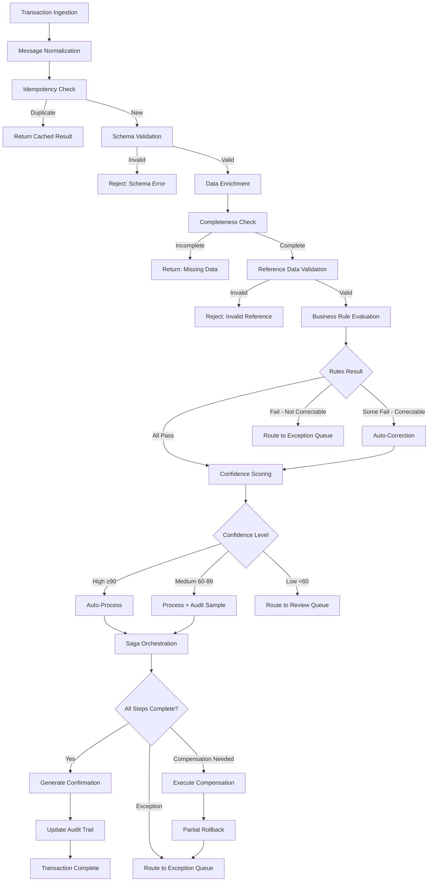

### 14.2 Exception Resolution Flow

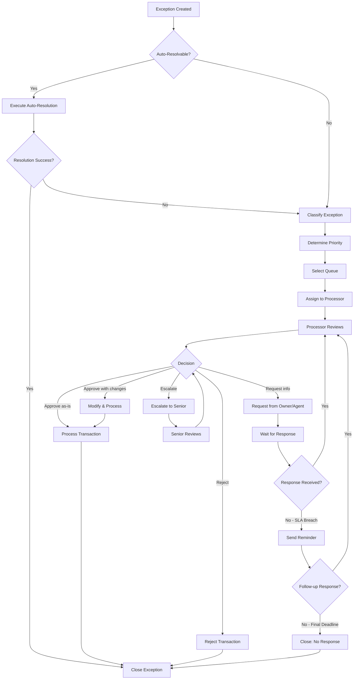

### 14.3 New Business STP Pipeline

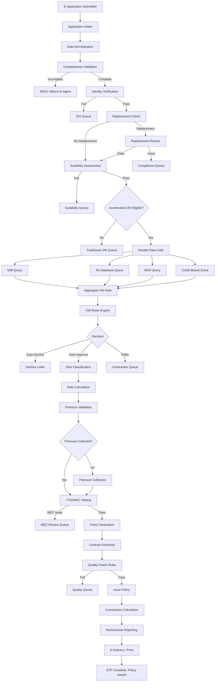

### 14.4 Financial Transaction STP Pipeline

```mermaid
flowchart TD
    A[Financial Transaction Request] --> B[Authentication Verification]
    B -->|Fail| C[Authentication Required]
    B -->|Pass| D[Transaction Validation]
    D -->|Invalid| E[Reject with Details]
    D -->|Valid| F[Eligibility Check]
    F -->|Not Eligible| G[Reject: Eligibility]
    F -->|Eligible| H[Fraud Velocity Checks]
    H -->|Alert| I[Fraud Review Queue]
    H -->|Clear| J[Financial Calculations]
    J --> K[Tax Withholding Calc]
    K --> L[Cost Basis Determination]
    L --> M[Gain/Loss Calculation]
    M --> N{Amount Threshold Check}
    N -->|Over Threshold| O[Large Transaction Review]
    N -->|Within Threshold| P[Policy Update]
    P --> Q[Account Value Adjustment]
    Q --> R[Basis Adjustment]
    R --> S[Disbursement Creation]
    S --> T[Tax Record Creation]
    T --> U[Confirmation Generation]
    U --> V[Agent Notification]
    V --> W[STP Complete]
```

---

## 15. Case Study: Before & After STP

### 15.1 Company Profile

**MidWest Life Insurance Company**
- 750,000 in-force policies
- Products: Term, Whole Life, UL, VUL, IUL, Fixed Annuity, Variable Annuity
- 2.5M servicing transactions per year
- 200 administrative staff
- Legacy PAS: 25-year-old mainframe system with bolt-on web front end

### 15.2 Before STP Implementation (Legacy State)

**Process: Partial Withdrawal**

```
Step 1: Owner calls service center or submits paper form (Day 1)
  └── CSR enters request into CRM
  └── If paper: mail room scans, indexes, routes to processing queue
  └── Average time: 1–3 days for paper to reach processor

Step 2: Processor picks up work item from queue (Day 2–4)
  └── Manually verifies policy is active
  └── Manually checks withdrawal eligibility
  └── Manually calculates free withdrawal amount
  └── Manually calculates surrender charge (if any)
  └── Manually calculates tax withholding
  └── Keys transaction into mainframe
  └── Average time: 25 minutes per transaction

Step 3: Supervisor reviews and approves (Day 3–5)
  └── Reviews calculation accuracy
  └── Verifies authorization
  └── Approves or returns for correction
  └── Average time: 10 minutes per transaction

Step 4: Financial processing (Day 4–6)
  └── Overnight batch processes disbursement
  └── Check printed and mailed, or ACH initiated (next day)
  └── Average time: 1–2 days

Step 5: Confirmation mailed (Day 5–8)
  └── Confirmation letter generated in overnight batch
  └── Printed and mailed next business day
  └── Average time: 2–3 days to reach owner

TOTAL END-TO-END: 5–8 business days
COST PER TRANSACTION: $22.50
ERROR RATE: 12%
```

**Key metrics (before):**

| Metric | Value |
|--------|-------|
| Total servicing transactions/year | 2,500,000 |
| STP rate | 0% (all manual) |
| Average processing time | 5.2 business days |
| Cost per transaction | $22.50 |
| Error rate | 12% |
| Staff (servicing) | 200 FTEs |
| Annual servicing cost | $56,250,000 |
| Customer satisfaction (CSAT) | 62% |
| NPS | -5 |

### 15.3 After STP Implementation (Modernized State)

**Process: Partial Withdrawal (STP Path)**

```
Step 1: Owner logs into secure web portal (Minute 0)
  └── Multi-factor authentication
  └── Selects "Withdrawal" from servicing menu

Step 2: Real-time validation and calculation (Minute 1)
  └── System auto-checks eligibility
  └── Displays available withdrawal amount, free amount, surrender charge
  └── Calculates and displays tax withholding
  └── Shows net disbursement amount
  └── Owner confirms and submits

Step 3: STP processing (Minute 2–3)
  └── Rules engine validates all conditions
  └── Confidence scorer rates transaction at 94 (HIGH)
  └── Saga orchestrator executes:
       ├── Update policy account value ✓
       ├── Create disbursement record ✓
       ├── Record tax event ✓
       ├── Initiate ACH transfer ✓
       └── Generate confirmation ✓

Step 4: Confirmation delivered (Minute 3–5)
  └── Confirmation displayed on screen immediately
  └── Confirmation email sent
  └── PDF available in document portal

Step 5: Funds disbursed (Day 1–2)
  └── ACH processed same day (if before cutoff)
  └── Funds in owner's account within 1–2 business days

TOTAL END-TO-END: 2–5 minutes (processing)
  1–2 days (funds settlement — external)
COST PER TRANSACTION: $0.85
ERROR RATE: 0.3%
```

**Key metrics (after):**

| Metric | Before | After | Improvement |
|--------|--------|-------|-------------|
| STP rate | 0% | 76% | +76 pts |
| Average processing time | 5.2 days | 4 minutes (STP) / 1.2 days (non-STP) | 99%+ (STP) |
| Cost per transaction | $22.50 | $3.20 (blended) | 86% reduction |
| Error rate | 12% | 0.8% (blended) | 93% reduction |
| Staff (servicing) | 200 FTEs | 85 FTEs | 58% reduction |
| Annual servicing cost | $56,250,000 | $8,000,000 | 86% reduction |
| Customer satisfaction | 62% | 89% | +27 pts |
| NPS | -5 | +42 | +47 pts |

### 15.4 Financial Impact Summary

```
Annual Savings:
  Labor reduction (115 FTEs × $75K avg loaded):    $8,625,000
  Error rework reduction:                           $3,200,000
  Postage / print reduction:                        $1,800,000
  Cycle time improvement (interest savings):          $625,000
  Regulatory fine avoidance:                          $400,000
  ──────────────────────────────────────────────────
  Total Annual Savings:                            $14,650,000

Annual Costs:
  Platform maintenance & licensing:                 $1,200,000
  Rule management team (5 FTEs):                      $500,000
  Infrastructure:                                     $300,000
  ──────────────────────────────────────────────────
  Total Annual Costs:                               $2,000,000

Net Annual Benefit:                                $12,650,000

Initial Investment:                                 $6,500,000
Payback Period:                                      6.2 months
3-Year ROI:                                              483%
```

### 15.5 STP Rate Improvement Timeline

```
Month 0:   Project kickoff
Month 3:   Infrastructure deployed
Month 6:   Phase 1 go-live (address changes, contact updates) → STP rate: 15%
Month 9:   Phase 2 (premium payments, fund transfers) → STP rate: 35%
Month 12:  Phase 3 (withdrawals, loans, systematic transactions) → STP rate: 55%
Month 15:  Phase 4 (surrenders, beneficiary changes, dividends) → STP rate: 68%
Month 18:  Phase 5 (new business accelerated UW) → STP rate: 72%
Month 24:  Optimization cycle complete → STP rate: 76%
Month 36:  Continuous improvement → STP rate: 82% (target)
```

---

## 16. Implementation Roadmap

### 16.1 Phase-Based Approach

```mermaid
gantt
    title STP Implementation Roadmap
    dateFormat  YYYY-MM
    section Foundation
    Architecture Design           :a1, 2025-01, 2M
    Platform Selection & Setup    :a2, after a1, 2M
    Core Integration Framework    :a3, after a2, 3M
    section Phase 1 - Quick Wins
    Administrative Changes STP    :b1, after a3, 2M
    Contact Update STP            :b2, after a3, 1M
    Testing & Go-Live             :b3, after b1, 1M
    section Phase 2 - Financial
    Premium Payment STP           :c1, after b3, 2M
    Fund Transfer STP             :c2, after b3, 2M
    DCA/Rebalancing STP           :c3, after c1, 1M
    Testing & Go-Live             :c4, after c2, 1M
    section Phase 3 - Complex Financial
    Withdrawal STP                :d1, after c4, 3M
    Loan STP                      :d2, after c4, 2M
    Surrender STP                 :d3, after d1, 2M
    Testing & Go-Live             :d4, after d3, 1M
    section Phase 4 - New Business
    Accelerated UW Rules          :e1, after d4, 3M
    Auto-Issue Rules              :e2, after e1, 2M
    E-Delivery Integration        :e3, after e2, 1M
    Testing & Go-Live             :e4, after e3, 1M
    section Phase 5 - Optimization
    Rule Tuning                   :f1, after e4, 3M
    ML Confidence Scoring         :f2, after e4, 4M
    Continuous Improvement        :f3, after f1, 6M
```

### 16.2 Key Success Factors

1. **Executive sponsorship** — STP transformation requires investment and organizational change
2. **Business-IT partnership** — Rules must be co-developed with business SMEs
3. **Iterative approach** — Start with high-volume, low-complexity transactions
4. **Data quality** — Invest in upstream data quality to maximize STP rates
5. **Change management** — Retrain displaced staff for exception handling and rule management
6. **Measurement culture** — Track STP rates daily, analyze exceptions weekly, optimize monthly
7. **Rule governance** — Establish clear rule ownership, testing, and deployment processes
8. **Security** — Ensure STP doesn't compromise fraud detection or authorization controls

### 16.3 Common Pitfalls

| Pitfall | Mitigation |
|---------|------------|
| Over-automating high-risk transactions | Start with conservative thresholds; expand based on data |
| Neglecting exception handling design | Design exception flows with equal rigor as STP flows |
| Insufficient rule testing | Mandate scenario testing with production-like data |
| Ignoring state-specific rules | Build state-specific rule variants from day one |
| Underestimating integration complexity | Allocate 40% of effort to integration and testing |
| Not measuring continuously | Implement dashboards and alerting from Phase 1 |
| Treating STP as a project, not a program | Establish ongoing rule optimization team |

---

## 17. Appendix

### 17.1 Glossary

| Term | Definition |
|------|-----------|
| STP | Straight-Through Processing — end-to-end automated transaction processing |
| NIGO | Not In Good Order — application or transaction with errors or missing information |
| Pend | A held transaction awaiting resolution |
| Exception | A transaction that cannot be auto-processed |
| DLQ | Dead Letter Queue — repository for transactions that exhaust retry attempts |
| Saga | A pattern for managing distributed transactions through a sequence of local transactions |
| Rete | An algorithm used by rules engines for efficient pattern matching |
| MEC | Modified Endowment Contract — a life insurance policy that exceeds IRC §7702A premium limits |
| RMD | Required Minimum Distribution — mandatory distributions from qualified retirement accounts |
| DCA | Dollar-Cost Averaging — systematic investment strategy |
| OFAC | Office of Foreign Assets Control — administers economic sanctions programs |
| MIB | Medical Information Bureau — clearinghouse for medical underwriting information |
| Rx | Prescription drug database check |
| MVR | Motor Vehicle Report |
| UW | Underwriting |
| COI | Cost of Insurance |

### 17.2 STP Rate Calculation Worksheet

```
WORKSHEET: Monthly STP Rate Calculation

A. Total transactions submitted:                    _________
B. Transactions rejected at initial validation:     _________
C. Well-formed transactions (A - B):                _________
D. Transactions requiring mandatory manual review:  _________
E. STP-eligible transactions (C - D):               _________
F. Transactions processed via STP:                  _________

Gross STP Rate = F / A × 100 =                     _________%
Net STP Rate = F / C × 100 =                       _________%
Adjusted STP Rate = F / E × 100 =                  _________%

Exception Breakdown:
G. Data quality exceptions:                         _________
H. Business rule exceptions:                        _________
I. Compliance exceptions:                           _________
J. Fraud exceptions:                                _________
K. System exceptions:                               _________
L. Authorization exceptions:                        _________
M. Total exceptions (G+H+I+J+K+L):                 _________

Verify: F + M = E (all eligible transactions are either STP or exception)
```

### 17.3 Sample STP Configuration File

```yaml
stp_configuration:
  version: "2025.1"
  environment: "PRODUCTION"
  effective_date: "2025-01-15"
  
  global_settings:
    default_confidence_threshold: 85
    max_retry_attempts: 3
    idempotency_key_ttl_hours: 72
    dlq_retention_days: 90
    audit_retention_years: 7
    
  channel_trust_levels:
    WEB_PORTAL_MFA: 100
    MOBILE_APP_BIOMETRIC: 95
    WEB_PORTAL_PASSWORD: 80
    IVR_AUTHENTICATED: 70
    API_PARTNER_OAUTH: 85
    AGENT_PORTAL: 75
    PAPER_MAIL: 30
    EMAIL: 20
    FAX: 15
    
  transaction_configurations:
    address_change:
      stp_enabled: true
      confidence_threshold: 80
      max_processing_time_seconds: 30
      validations:
        - usps_address_verification
        - ofac_screening
        - state_jurisdiction_check
      rules:
        - address_change_eligibility
        - address_change_authorization
      post_processing:
        - update_correspondence_address
        - update_billing_address
        - update_tax_jurisdiction
        - notify_agent_of_record
        
    partial_withdrawal:
      stp_enabled: true
      confidence_threshold: 90
      max_processing_time_seconds: 60
      auto_approve_thresholds:
        max_amount: 50000
        max_percentage_of_value: 25
        min_remaining_balance: 10000
      validations:
        - withdrawal_eligibility
        - balance_sufficiency
        - tax_withholding_election
        - suitability_check
        - fraud_velocity_check
      rules:
        - withdrawal_calculation
        - surrender_charge_calculation
        - tax_withholding_calculation
        - cost_basis_determination
      saga:
        steps:
          - validate
          - calculate
          - update_policy
          - process_disbursement
          - record_tax
          - generate_confirmation
        timeout_minutes: 15
        
    new_business:
      stp_enabled: true
      confidence_threshold: 95
      max_processing_time_seconds: 120
      accelerated_uw_criteria:
        max_age: 55
        max_face_amount_term: 1000000
        max_face_amount_permanent: 500000
        allowed_products: ["TERM_10", "TERM_20", "TERM_30"]
      validations:
        - application_completeness
        - identity_verification
        - replacement_check
        - suitability_assessment
        - producer_licensing
      uw_data_calls:
        - mib_check
        - rx_check
        - mvr_check
        - credit_score
      rules:
        - knockout_rules
        - risk_classification
        - rate_calculation
        - auto_issue_eligibility
      post_processing:
        - generate_policy_contract
        - calculate_commission
        - create_billing_schedule
        - reinsurance_reporting
        - e_delivery_or_print
```

### 17.4 References and Further Reading

1. ACORD Standards for Life Insurance Transaction Processing
2. LIMRA/LOMA: "Best Practices in Straight-Through Processing for Life Insurers"
3. McKinsey & Company: "Digital Insurance: The Imperative for STP"
4. Gartner: "Magic Quadrant for Life Insurance Policy Administration Systems"
5. Celent: "Straight-Through Processing in Life Insurance: Benchmarks and Best Practices"
6. SOA (Society of Actuaries): "Technology Section — Automation in Insurance Operations"
7. NAIC Model Laws: Replacement, Suitability, Privacy
8. IRC §7702 and §7702A: Life Insurance Tax Compliance
9. SECURE Act 2.0: RMD Rule Changes
10. UETA and E-SIGN Act: Electronic Delivery Compliance

---

*This article is part of the Life Insurance PAS Architect's Encyclopedia. For related topics, see Article 19 (Business Rules Engines), Article 20 (BPM & Workflow Orchestration), and Article 21 (Correspondence & Document Management).*
