# Article 19: Business Rules Engines in PAS

## Table of Contents

1. [Introduction & Strategic Context](#1-introduction--strategic-context)
2. [Rule Types in PAS](#2-rule-types-in-pas)
3. [Decision Table Design](#3-decision-table-design)
4. [Decision Tree Design](#4-decision-tree-design)
5. [Rule Engine Architecture](#5-rule-engine-architecture)
6. [DMN (Decision Model and Notation)](#6-dmn-decision-model-and-notation)
7. [Product Configuration Rules](#7-product-configuration-rules)
8. [Underwriting Rules Deep Dive](#8-underwriting-rules-deep-dive)
9. [Compliance Rules](#9-compliance-rules)
10. [Rule Lifecycle Management](#10-rule-lifecycle-management)
11. [Vendor Landscape](#11-vendor-landscape)
12. [Sample Rule Implementations](#12-sample-rule-implementations)
13. [Architecture & Deployment Patterns](#13-architecture--deployment-patterns)
14. [Performance Optimization](#14-performance-optimization)
15. [Rule Repository Design](#15-rule-repository-design)
16. [Testing Strategies](#16-testing-strategies)
17. [Appendix](#17-appendix)

---

## 1. Introduction & Strategic Context

### 1.1 Why Business Rules Engines Matter in Life Insurance

Life insurance is one of the most rule-intensive industries in existence. A single policy transaction can require evaluation against hundreds of business rules spanning product design, underwriting guidelines, regulatory compliance, tax law, financial calculations, and operational procedures. These rules change frequently — driven by new product filings, regulatory updates, actuarial adjustments, competitive pressures, and operational improvements.

Historically, these rules were embedded directly in application code — buried in COBOL copybooks, nested in Java if-then-else chains, or scattered across stored procedures. This approach creates several critical problems:

| Problem | Impact |
|---------|--------|
| **Rules buried in code** | Business analysts cannot read, verify, or modify rules without developer involvement |
| **Tight coupling** | Rule changes require code deployments, increasing risk and cycle time |
| **No audit trail** | Regulators cannot easily verify that rules are correctly implemented |
| **Testing difficulty** | Rules interleaved with procedural code are hard to unit test in isolation |
| **Duplication** | The same rule (e.g., "owner must be at least 18") is often implemented redundantly across multiple systems |
| **Version management** | No clear mechanism to manage rule versions, effective dates, or state-specific variants |
| **Knowledge loss** | When the developer who wrote the rule leaves, institutional knowledge goes with them |

A Business Rules Engine (BRE) — also called a Business Rules Management System (BRMS) — externalizes business logic from application code into a managed, declarative rules repository. This separation enables:

- Business analysts to author and maintain rules in near-natural language
- Rules to be deployed independently of application code
- Complete auditability and version history of every rule
- Consistent rule application across all channels and systems
- Rapid response to regulatory and business changes
- Sophisticated rule testing and impact analysis

### 1.2 The Scale of Rules in a Life Insurance PAS

A typical life insurance PAS contains thousands of active business rules:

| Rule Domain | Estimated Rule Count | Change Frequency |
|-------------|---------------------|------------------|
| Product configuration | 2,000–5,000 | Monthly |
| Underwriting | 1,000–3,000 | Quarterly |
| Servicing/transaction | 500–1,500 | Monthly |
| Billing | 300–800 | Quarterly |
| Claims | 200–500 | Semi-annually |
| Compliance/regulatory | 500–2,000 | Continuous (as regulations change) |
| Tax | 200–500 | Annually (tax law changes) |
| Commission | 300–1,000 | Monthly |
| **Total** | **5,000–14,300** | |

### 1.3 Business Rules Engine Value Proposition

```
Without BRE:
  Rule change request → Developer analysis (2 days) → Code change (3 days) → 
  Testing (5 days) → Deployment window (7–14 days) → Production
  Total: 17–24 days

With BRE:
  Rule change request → Business analyst authors rule (1 day) → 
  Rule testing (1 day) → Business review (1 day) → Deploy (same day)
  Total: 3–4 days

Speed improvement: 5–8× faster rule changes
```

---

## 2. Rule Types in PAS

### 2.1 Product Rules

Product rules define what a product is, who can buy it, what it offers, and how it behaves. These rules are foundational — virtually every other rule domain references product rules.

#### 2.1.1 Eligibility Rules

Determine whether an applicant/policy qualifies for a product or feature.

```
RULE: PROD-ELIG-TERM20-001
Name: "Term 20 Issue Age Eligibility"
Product: TERM_20
WHEN:
  applicant.age >= 18 AND applicant.age <= 65
  AND applicant.state IN product.filed_states
  AND face_amount >= product.min_face AND face_amount <= product.max_face
THEN:
  eligible = TRUE

RULE: PROD-ELIG-TERM20-002
Name: "Term 20 Face Amount Bands"
Product: TERM_20
WHEN:
  eligible = TRUE
THEN:
  IF face_amount < 100000:
    face_band = "BAND_1"
    min_premium_rate = rate_table.band1_rate
  ELIF face_amount < 250000:
    face_band = "BAND_2"
    min_premium_rate = rate_table.band2_rate
  ELIF face_amount < 500000:
    face_band = "BAND_3"
  ELIF face_amount < 1000000:
    face_band = "BAND_4"
  ELSE:
    face_band = "BAND_5"
```

#### 2.1.2 Feature Rules

Define available product features based on product type, state, and applicant characteristics.

| Product | Feature | Eligibility Rule |
|---------|---------|-----------------|
| TERM_20 | Conversion Privilege | Available years 1–15; conversion age limit 65; convertible products list |
| UL | No-Lapse Guarantee | Available if guaranteed premium paid; state-filed; NLG rider selected |
| VUL | Dollar-Cost Averaging | Available if account value ≥ $5,000; minimum DCA amount $100; max duration 24 months |
| IUL | Index Account Options | S&P 500 Annual P2P; S&P 500 Monthly Average; Custom Index; availability by state |
| WL | Paid-Up Additions Rider | Available at issue; not available for single-premium WL; min PUA premium $50 |

#### 2.1.3 Limit Rules

```yaml
product_limits:
  TERM_20:
    min_face_amount: 25000
    max_face_amount: 10000000
    min_issue_age: 18
    max_issue_age: 65
    max_issue_age_by_state:
      NY: 60
      CA: 65
    face_amount_increments: 1000
    premium_modes: [ANNUAL, SEMI_ANNUAL, QUARTERLY, MONTHLY_EFT]
    
  UL_FLEX:
    min_face_amount: 50000
    max_face_amount: 25000000
    min_issue_age: 0  # juvenile
    max_issue_age: 80
    min_premium: "Monthly COI + admin charge"
    max_premium: "7702 guideline single premium limit"
    min_partial_withdrawal: 500
    max_partial_withdrawal: "Account value - minimum balance"
    min_balance: 5000
    loan_interest_rate: "Declared rate or Moody's index + spread"
    max_loan_percentage: 90  # of CSV
```

### 2.2 Underwriting Rules

Underwriting rules determine risk classification, evidence requirements, and approval/decline decisions.

| Subcategory | Description | Example Rules |
|-------------|-------------|---------------|
| Risk Classification | Determine risk class (Preferred Plus, Preferred, Standard Plus, Standard, Substandard) | BMI ranges, blood pressure thresholds, cholesterol limits by age |
| Evidence Requirements | What evidence to order based on age/amount matrix | Age ≥50 + Face ≥$500K → require paramedical + blood + urine |
| Knockout Rules | Automatic decline triggers | Active cancer treatment, organ transplant waiting list, age > max for product |
| Referral Rules | Conditions requiring human underwriter review | Family history of early cardiac death, hazardous occupation, foreign residence |
| Rating Rules | Table rating or flat extra determination | Controlled diabetes → Table 2 or +$2.50/1000 flat extra |

### 2.3 Servicing Rules

| Subcategory | Description | Example |
|-------------|-------------|---------|
| Transaction Authorization | Who can request which transactions | Owner can request withdrawal; agent can request address change with authorization |
| Validation Rules | Data completeness and consistency | Beneficiary percentages must total 100%; withdrawal amount cannot exceed available |
| Processing Rules | How to execute transactions | Withdrawal allocation: pro-rata from all funds unless specified |
| Timing Rules | When transactions can occur | Fund transfers: only on business days before market close; no transfers during blackout period |

### 2.4 Billing Rules

```
RULE: BILL-GRACE-001
Name: "Grace Period Determination"
WHEN:
  premium_due_date has passed
  AND payment not received
THEN:
  IF product.type = 'TERM' OR product.type = 'WHOLE_LIFE':
    grace_period = 31 days  # per state minimum
    IF policy.state = 'NY':
      grace_period = 61 days  # NY Insurance Law §3211
  ELIF product.type IN ('UL', 'VUL', 'IUL'):
    grace_period = 61 days  # per contract provision
  ELIF product.type IN ('FIXED_ANNUITY', 'VARIABLE_ANNUITY'):
    grace_period = 31 days

RULE: BILL-MODE-001
Name: "Premium Mode Factors"
WHEN:
  premium_mode selected
THEN:
  mode_factor = LOOKUP(mode_factor_table, product, premium_mode)
  // Typical factors:
  // Annual:       1.000
  // Semi-Annual:  0.520 (4% implicit interest)
  // Quarterly:    0.265 (6% implicit interest)
  // Monthly EFT:  0.0875 (5% implicit interest)
  // Monthly List: 0.0900 (8% implicit interest)

RULE: BILL-APPLY-001
Name: "Payment Application Order"
WHEN:
  payment received for policy
THEN:
  APPLY payment in this order:
    1. Outstanding loan interest (if any)
    2. Past-due premiums (oldest first)
    3. Current premium
    4. Advance premium (subject to 7702 limits)
  IF excess remains AND product allows:
    5. Apply to PUA rider (if elected)
    6. Hold as premium deposit
```

### 2.5 Claims Rules

| Rule Type | Description | Example |
|-----------|-------------|---------|
| Adjudication | Determine claim payability | Death within contestability period → mandatory investigation |
| Benefit Calculation | Calculate payable amount | Face + ADB rider (if accidental) − outstanding loan − past due premium |
| Settlement | Determine settlement options | Lump sum, interest option, fixed period, life income; must offer per contract |
| Exclusions | Identify exclusion conditions | Suicide within exclusion period (typically 2 years); war exclusion; aviation exclusion |

### 2.6 Compliance Rules

Compliance rules encode regulatory requirements from state insurance departments, federal agencies, and industry standards.

```
RULE: COMP-REPLACE-001
Name: "Replacement Regulation Detection"
WHEN:
  new_application = TRUE
  AND (
    applicant has existing_life_insurance = TRUE
    OR applicant has existing_annuity = TRUE
  )
  AND (
    existing_policy will be surrendered, lapsed, converted, or reduced
    OR new_policy will replace existing coverage
  )
THEN:
  replacement_detected = TRUE
  REQUIRE form: REPLACEMENT_NOTICE (state-specific version)
  REQUIRE form: COMPARISON_STATEMENT (if state requires)
  IF state = 'NEW_YORK':
    REQUIRE Regulation 60 comparison
    REQUIRE 60-day free look
  IF state = 'CALIFORNIA':
    REQUIRE Insurance Code §10509.4 compliance
  ROUTE to compliance_review_queue
```

### 2.7 Tax Rules

```
RULE: TAX-1099R-001
Name: "1099-R Generation Rules"
WHEN:
  taxable_distribution occurred during tax_year
THEN:
  IF distribution_type = 'NORMAL' AND owner.age >= 59.5:
    distribution_code = '7'  # Normal distribution
  ELIF distribution_type = 'EARLY' AND owner.age < 59.5:
    distribution_code = '1'  # Early distribution, no known exception
    IF exception_applies:
      distribution_code = '2'  # Early distribution, exception applies
  ELIF distribution_type = 'DEATH':
    distribution_code = '4'  # Death
  ELIF distribution_type = 'DISABILITY':
    distribution_code = '3'  # Disability
  ELIF distribution_type = 'DIRECT_ROLLOVER':
    distribution_code = 'G'  # Direct rollover
  ELIF distribution_type = 'ROTH_CONVERSION':
    distribution_code = '2'  # Roth conversion
    
  GENERATE Form 1099-R with:
    Box 1: Gross distribution amount
    Box 2a: Taxable amount
    Box 2b: Taxable amount not determined (if applicable)
    Box 3: Capital gain (if applicable)
    Box 4: Federal income tax withheld
    Box 5: Employee contributions/designated Roth contributions
    Box 7: Distribution code(s)
```

### 2.8 Commission Rules

```
RULE: COMM-SCHED-001
Name: "Commission Schedule Selection"
WHEN:
  policy issued
THEN:
  commission_schedule = LOOKUP(
    schedule_table,
    product_type,
    distribution_channel,
    premium_mode,
    case_size_band
  )
  
  // Heaped commission (typical Term/WL):
  // Year 1:  50-110% of target premium
  // Year 2:  5-10%
  // Years 3-10: 3-5%
  // Years 11+: 1-2%
  
  // Level commission (typical fee-based):
  // All years: 10-25% of premium

RULE: COMM-HIER-001
Name: "Commission Hierarchy Distribution"
WHEN:
  commission calculated for policy
THEN:
  FOR EACH level IN agent_hierarchy (writing_agent to GA/IMO):
    level.commission = total_commission × level.override_percentage
    VALIDATE: SUM(all_level_commissions) <= total_commission
    
RULE: COMM-CHARGEBACK-001
Name: "Commission Chargeback"
WHEN:
  policy lapsed OR surrendered
  AND within chargeback_period (typically 12-24 months)
  AND chargeback_schedule applies
THEN:
  chargeback_amount = initial_commission × chargeback_percentage(months_in_force)
  // Month 1-6: 100% chargeback
  // Month 7-12: 75% chargeback
  // Month 13-18: 50% chargeback
  // Month 19-24: 25% chargeback
  CREATE chargeback_entry(agent, chargeback_amount)
```

---

## 3. Decision Table Design

### 3.1 Decision Table Structure

A decision table consists of:

1. **Conditions** (input columns): The facts evaluated
2. **Actions** (output columns): The results produced
3. **Rules** (rows): Each row is a complete condition→action mapping
4. **Hit Policy**: How to handle multiple matching rules

```
┌──────────────────────────────────────────────────────────────┐
│ Decision Table: [Name]                       Hit Policy: [U] │
├──────────────┬──────────────┬────────────┬──────────────────┤
│  Condition 1 │  Condition 2 │  Action 1  │  Action 2        │
├──────────────┼──────────────┼────────────┼──────────────────┤
│  value       │  value       │  result    │  result          │
│  value       │  value       │  result    │  result          │
│  value       │  value       │  result    │  result          │
└──────────────┴──────────────┴────────────┴──────────────────┘
```

### 3.2 Hit Policies Detailed

| Hit Policy | Abbrev | Multiple Matches? | Behavior | Best For |
|-----------|--------|-------------------|----------|----------|
| **Unique** | U | No (exactly one rule matches) | Error if more than one matches | Clean, non-overlapping classifications |
| **First** | F | Yes (first match wins) | Rules evaluated top-to-bottom; first match applies | Priority-ordered rules; most specific first |
| **Any** | A | Yes (all matches must agree) | Multiple rules can match but must produce same output; error if conflict | Redundant validation rules |
| **Priority** | P | Yes (highest priority wins) | Each output has a priority; highest priority result returned | When outputs have inherent ordering |
| **Collect** | C | Yes (all matches collected) | All matching rules fire; results aggregated (sum, min, max, count) | Accumulating discounts, charges, flags |
| **Output Order** | O | Yes (ordered by output) | Results sorted by predefined output priority | Ranked recommendations |
| **Rule Order** | R | Yes (ordered by rule) | Results returned in order rules appear in table | Sequential processing |

### 3.3 Decision Table Examples

#### 3.3.1 Underwriting Risk Classification

**Hit Policy: Unique (U)**

| # | Age Range | BMI | Blood Pressure | Cholesterol | Tobacco | Family History | → Risk Class |
|---|-----------|-----|---------------|-------------|---------|---------------|-------------|
| 1 | 18–45 | 18.5–25 | ≤ 130/80 | Total < 200 | Never | No early cardiac | **Preferred Plus** |
| 2 | 18–45 | 18.5–25 | ≤ 140/85 | Total < 220 | Never | No early cardiac | **Preferred** |
| 3 | 18–45 | 25–30 | ≤ 140/90 | Total < 240 | Never | — | **Standard Plus** |
| 4 | 18–45 | 18.5–35 | ≤ 150/95 | Total < 280 | Never | — | **Standard** |
| 5 | 18–45 | — | — | — | Current | — | **Standard Tobacco** |
| 6 | 46–60 | 18.5–27 | ≤ 135/85 | Total < 220 | Never | No early cardiac | **Preferred Plus** |
| 7 | 46–60 | 18.5–27 | ≤ 145/90 | Total < 240 | Never | No early cardiac | **Preferred** |
| 8 | 46–60 | 27–32 | ≤ 145/90 | Total < 260 | Never | — | **Standard Plus** |
| 9 | 46–60 | 18.5–35 | ≤ 155/95 | Total < 300 | Never | — | **Standard** |
| 10 | 46–60 | — | — | — | Current | — | **Standard Tobacco** |
| 11 | 61–70 | 20–30 | ≤ 145/90 | Total < 240 | Never | — | **Preferred** |
| 12 | 61–70 | 18.5–35 | ≤ 160/95 | Total < 300 | Never | — | **Standard** |
| 13 | 61–70 | — | — | — | Current | — | **Standard Tobacco** |
| 14 | — | > 40 | — | — | — | — | **Decline** |
| 15 | — | — | > 180/110 | — | — | — | **Decline** |

#### 3.3.2 Premium Mode Selection

**Hit Policy: Unique (U)**

| # | Product Type | Payment Mode | EFT Enrolled | → Mode Factor | → Billing Frequency | → Policy Fee |
|---|-------------|-------------|-------------|---------------|---------------------|-------------|
| 1 | TERM | Annual | — | 1.000 | Annual | $60 |
| 2 | TERM | Semi-Annual | — | 0.520 | Semi-Annual | $60 |
| 3 | TERM | Quarterly | — | 0.265 | Quarterly | $60 |
| 4 | TERM | Monthly | Yes | 0.0875 | Monthly | $0 (waived) |
| 5 | TERM | Monthly | No | 0.0900 | Monthly | $60 |
| 6 | UL | Annual | — | 1.000 | Annual | $0 (included in COI) |
| 7 | UL | Monthly | Yes | 0.0850 | Monthly | $0 |
| 8 | UL | Monthly | No | 0.0870 | Monthly | $0 |
| 9 | WL | Annual | — | 1.000 | Annual | $0 |
| 10 | WL | Semi-Annual | — | 0.515 | Semi-Annual | $0 |
| 11 | WL | Quarterly | — | 0.260 | Quarterly | $0 |
| 12 | WL | Monthly | Yes | 0.0850 | Monthly | $0 |

#### 3.3.3 Commission Rate Determination

**Hit Policy: First (F)** — most specific rule matches first

| # | Product | Distribution Channel | Case Size | Years 1–2 | Years 3–10 | Renewal (11+) | Trail |
|---|---------|---------------------|-----------|-----------|-----------|---------------|-------|
| 1 | TERM | Captive Agent | Any | 55% | 5% | 2% | — |
| 2 | TERM | Independent Agent | ≥ $500K face | 100% | 8% | 2% | — |
| 3 | TERM | Independent Agent | < $500K face | 80% | 5% | 2% | — |
| 4 | TERM | Direct/Online | Any | 25% | 2% | 1% | — |
| 5 | UL | Captive Agent | Any | 65% (target) | 5% | 2% | — |
| 6 | UL | Independent Agent | ≥ $10K target | 110% (target) | 8% | 3% | — |
| 7 | UL | Independent Agent | < $10K target | 90% (target) | 5% | 2% | — |
| 8 | VUL | RIA/Fee-Based | Any | 3% (AUM) | — | — | 1% AUM |
| 9 | VUL | Wirehouse | Any | 50% (target) | 5% | — | 0.25% AUM |
| 10 | VA | Independent Agent | Any | 6% (premium) | — | — | 1% AUM |

#### 3.3.4 Withdrawal Eligibility

**Hit Policy: First (F)**

| # | Policy Status | Policy Age | Surrender Period | Amount vs. Free | Owner Age | Outstanding Loan | → Eligible | → Restriction |
|---|-------------|-----------|-----------------|----------------|----------|-----------------|-----------|---------------|
| 1 | Not Active | — | — | — | — | — | **No** | Policy not active |
| 2 | Active | < 1 year | — | — | — | — | **No** | Minimum holding period |
| 3 | Active | ≥ 1 year | Active | ≤ Free | Any | ≤ 50% CSV | **Yes** | None |
| 4 | Active | ≥ 1 year | Active | > Free | Any | ≤ 50% CSV | **Yes** | Surrender charge applies |
| 5 | Active | ≥ 1 year | Expired | Any | ≥ 59½ | ≤ 80% CSV | **Yes** | None |
| 6 | Active | ≥ 1 year | Expired | Any | < 59½ | ≤ 80% CSV | **Yes** | 10% penalty may apply |
| 7 | Active | ≥ 1 year | — | — | — | > 80% CSV | **No** | Loan ratio too high |
| 8 | Active | ≥ 1 year | — | Would reduce below min | — | — | **No** | Below minimum balance |

#### 3.3.5 Non-Forfeiture Option Default

**Hit Policy: Unique (U)**

| # | Product Type | State | Non-Forfeiture Options Available | → Default Option |
|---|-------------|-------|--------------------------------|-----------------|
| 1 | Whole Life | Any | Extended Term, Reduced Paid-Up, Cash Surrender | Extended Term |
| 2 | Term | Any | Cash Surrender (if any) | Cash Surrender |
| 3 | UL | Any (except NY) | Continuation under UL provisions | N/A (UL mechanics) |
| 4 | UL | NY | Extended Term, Reduced Paid-Up | Extended Term |
| 5 | Endowment | Any | Extended Term, Reduced Paid-Up, Cash Surrender | Reduced Paid-Up |

---

## 4. Decision Tree Design

### 4.1 Binary Decision Trees

Binary trees split at each node into exactly two branches (yes/no, true/false, above/below threshold).

**Use case: Simplified Impairment Evaluation**

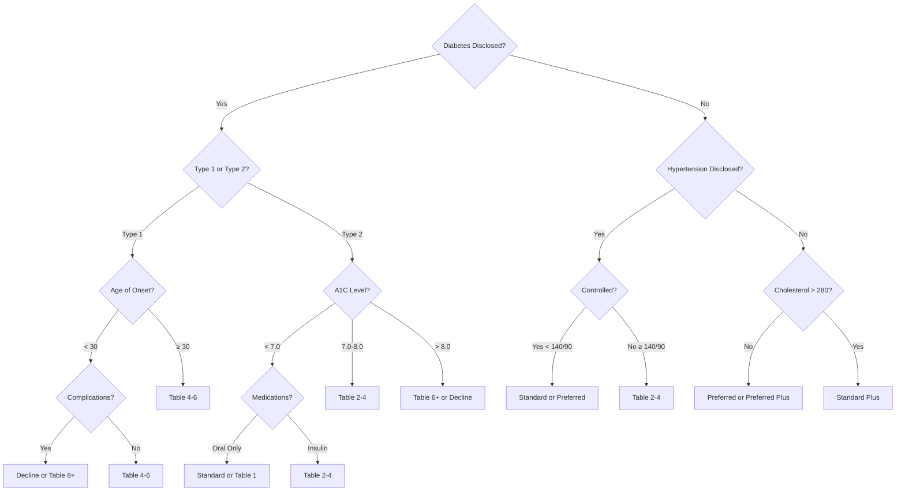

### 4.2 Multi-Branch Decision Trees

Multi-branch trees split into three or more branches at each node.

**Use case: Transaction Routing**

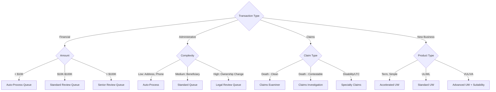

### 4.3 Risk Classification Decision Tree

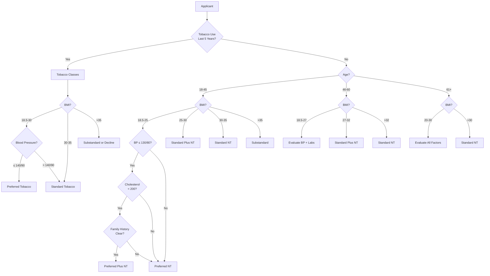

---

## 5. Rule Engine Architecture

### 5.1 Forward Chaining vs. Backward Chaining

| Aspect | Forward Chaining | Backward Chaining |
|--------|-----------------|-------------------|
| **Direction** | Data-driven: starts with facts, derives conclusions | Goal-driven: starts with hypothesis, seeks supporting facts |
| **Process** | 1. Load facts 2. Match rules 3. Fire rules 4. Update facts 5. Repeat | 1. Set goal 2. Find rules that conclude goal 3. Check if conditions met 4. If not, set sub-goals |
| **Best for** | Reactive processing, monitoring, complex event processing | Diagnostic reasoning, eligibility determination, "why" analysis |
| **Insurance use** | Transaction processing, real-time validation, event-driven rules | Underwriting decision support, claims adjudication reasoning |
| **Example** | "This withdrawal triggers a taxable event AND penalty" | "Is this applicant eligible for Preferred Plus?" → check each criterion |

### 5.2 The Rete Algorithm

The Rete algorithm (Latin for "net") is the foundation of most production rule systems. It provides efficient pattern matching when evaluating thousands of rules against a large fact base.

**How Rete works:**

```
1. COMPILE Phase:
   - Parse all rule conditions
   - Build a network of condition nodes (alpha network)
   - Build join nodes for multi-condition rules (beta network)
   - Terminal nodes represent complete rule matches

2. RUNTIME Phase:
   - When a fact enters working memory:
     a. Propagate through alpha network (single-condition filters)
     b. Propagate through beta network (cross-condition joins)
     c. Matched rules added to agenda
   - Select rule from agenda (conflict resolution)
   - Fire rule (execute actions)
   - New facts may trigger additional matches (cycle continues)
```

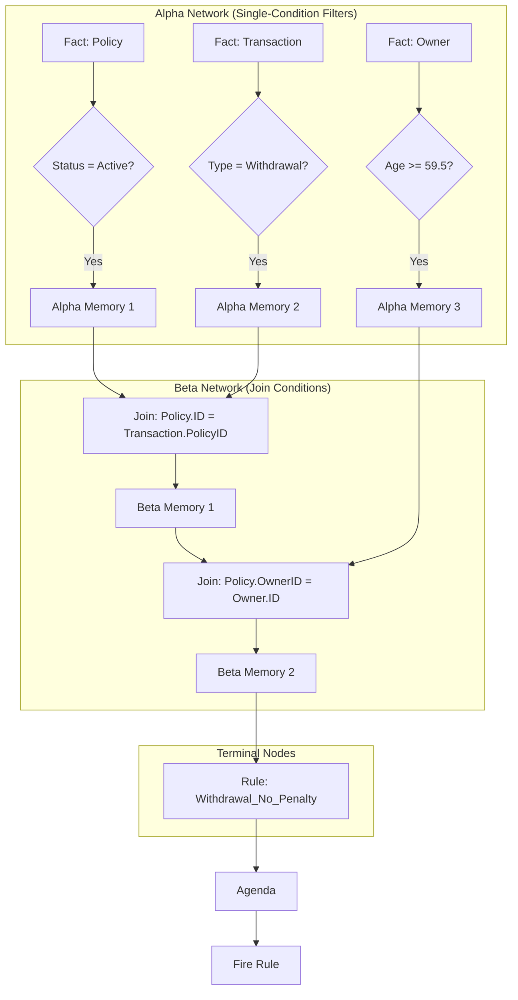

**Rete advantages:**
- Rules are compiled once; matching is incremental
- Only affected rules are re-evaluated when facts change
- Shared condition nodes eliminate redundant evaluations
- Memory-efficient for large rule sets

### 5.3 Stateless vs. Stateful Rule Execution

| Aspect | Stateless | Stateful |
|--------|-----------|----------|
| **Working memory** | Created fresh for each invocation | Persists across invocations |
| **Performance** | Slightly slower startup (no pre-loaded facts) | Faster for incremental updates |
| **Scalability** | Horizontally scalable (no shared state) | Requires session affinity |
| **Use case** | Simple request/response validation | Complex event processing, monitoring |
| **Insurance example** | Validate a transaction, classify a risk | Monitor policy for lapse triggers, track premium patterns |

### 5.4 Rule Engine as Microservice

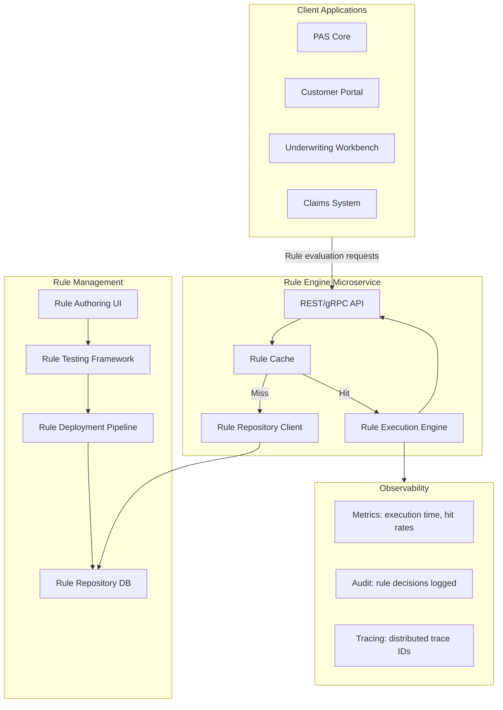

### 5.5 Embedded vs. Remote Rule Execution

| Pattern | Description | Latency | Scalability | Governance |
|---------|-------------|---------|-------------|-----------|
| **Embedded** | Rule engine library within each service | < 1ms | Scales with service | Harder to enforce consistency |
| **Remote (Centralized)** | Dedicated rule service called via API | 5–20ms network overhead | Independent scaling | Centralized governance |
| **Hybrid** | Frequently-used rules embedded; complex rules remote | Depends | Mixed | Best of both |

**Recommendation for PAS:** Use a hybrid approach:
- Embed simple, high-performance validation rules (field format, range checks) in the calling service
- Call a centralized rule service for complex business rules (underwriting, compliance, tax)
- Use event-driven invocation for monitoring rules (fraud detection, compliance triggers)

---

## 6. DMN (Decision Model and Notation)

### 6.1 DMN Standard Overview

DMN (Decision Model and Notation) is an OMG standard that provides a notation for modeling decisions, making business decisions accessible to business stakeholders while being executable by rule engines.

**DMN components:**

| Component | Purpose | Description |
|-----------|---------|-------------|
| Decision Requirements Diagram (DRD) | Visual model | Shows decisions, input data, business knowledge models, and knowledge sources |
| Decision Table | Logic | Tabular rules with conditions and actions |
| FEEL | Expression language | Friendly Enough Expression Language for defining conditions and calculations |
| Literal Expression | Simple logic | Single-line expressions for simple decisions |
| Invocation | Composition | Calling business knowledge models from decisions |
| Context | Structured data | Key-value pairs for structured results |

### 6.2 Decision Requirements Diagram

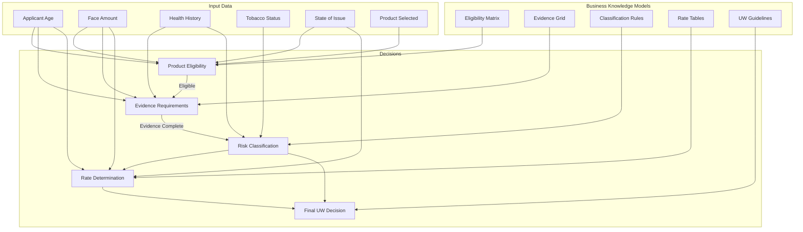

### 6.3 FEEL Expression Language

FEEL (Friendly Enough Expression Language) is designed to be readable by business stakeholders:

**FEEL examples for insurance:**

```
// Age calculation
applicant.age = date today() - applicant.dateOfBirth in years

// BMI calculation  
applicant.bmi = applicant.weightLbs / (applicant.heightInches * applicant.heightInches) * 703

// Premium calculation
annual premium = base rate * face amount / 1000 * mode factor

// Eligibility check
if applicant.age in [18..65] and face amount in [25000..5000000] 
then "Eligible" else "Not Eligible"

// Risk class determination (decision table output reference)
risk class = decision table "Risk Classification" (
  age: applicant.age,
  bmi: applicant.bmi,
  tobacco: applicant.tobaccoStatus,
  bp systolic: applicant.bloodPressure.systolic,
  bp diastolic: applicant.bloodPressure.diastolic,
  cholesterol: applicant.cholesterol.total
)

// Tax withholding
federal withholding = if owner.withholdingElection = "opt out" then 0
                      else taxable amount * owner.withholdingRate

// Commission with tiered schedule
first year commission = 
  if premium <= target premium then premium * schedule.firstYearTargetRate
  else target premium * schedule.firstYearTargetRate + 
       (premium - target premium) * schedule.firstYearExcessRate

// Date-based conditions
within contestability = policy.issueDate + duration("P2Y") > date today()
within free look = policy.deliveryDate + duration("P10D") > date today()
```

### 6.4 DMN Decision Table in Insurance

**DMN-style Decision Table: Evidence Requirements**

```
┌────────────────────────────────────────────────────────────────────────────────┐
│ Decision Table: Evidence Requirements                       Hit Policy: C      │
│ (Collect — all matching rules contribute to requirements)                      │
├──────────┬──────────────┬──────────────────────────────────────────────────────┤
│ Age      │ Face Amount  │ Required Evidence                                    │
├──────────┼──────────────┼──────────────────────────────────────────────────────┤
│ [0..17]  │ Any          │ {Juvenile Application, Parent Consent}               │
│ [18..40] │ [0..250K]    │ {Part 1, Part 2}                                     │
│ [18..40] │ (250K..500K] │ {Part 1, Part 2, Paramedical}                        │
│ [18..40] │ (500K..1M]   │ {Part 1, Part 2, Paramedical, Blood, Urine}          │
│ [18..40] │ (1M..5M]     │ {Part 1, Part 2, Full Physical, Blood, Urine, EKG}   │
│ [18..40] │ > 5M         │ {Part 1, Part 2, Full Physical, Blood, Urine, EKG,   │
│          │              │  Financial Questionnaire, Inspection Report}           │
│ [41..50] │ [0..100K]    │ {Part 1, Part 2}                                     │
│ [41..50] │ (100K..250K] │ {Part 1, Part 2, Paramedical}                        │
│ [41..50] │ (250K..500K] │ {Part 1, Part 2, Paramedical, Blood, Urine}          │
│ [41..50] │ (500K..1M]   │ {Part 1, Part 2, Full Physical, Blood, Urine, EKG}   │
│ [41..50] │ > 1M         │ {Part 1, Part 2, Full Physical, Blood, Urine, EKG,   │
│          │              │  Financial Questionnaire}                              │
│ [51..60] │ [0..100K]    │ {Part 1, Part 2, Paramedical}                        │
│ [51..60] │ (100K..250K] │ {Part 1, Part 2, Paramedical, Blood, Urine}          │
│ [51..60] │ (250K..500K] │ {Part 1, Part 2, Full Physical, Blood, Urine, EKG}   │
│ [51..60] │ > 500K       │ {Part 1, Part 2, Full Physical, Blood, Urine, EKG,   │
│          │              │  Financial Questionnaire, Inspection Report}           │
│ [61..70] │ Any          │ {Part 1, Part 2, Full Physical, Blood, Urine, EKG}   │
│ > 70     │ Any          │ {Part 1, Part 2, Full Physical, Blood, Urine, EKG,   │
│          │              │  Cognitive Assessment}                                 │
└──────────┴──────────────┴──────────────────────────────────────────────────────┘
```

---

## 7. Product Configuration Rules

### 7.1 Rate Tables

Rate tables are the fundamental building blocks of product pricing. They encode actuarially-determined rates that vary by multiple dimensions.

**Rate table structure:**

```json
{
  "rate_table": {
    "table_id": "RT-TERM20-2025-V1",
    "product": "TERM_20",
    "effective_date": "2025-01-01",
    "expiration_date": null,
    "basis": "PER_1000_FACE",
    "rating_dimensions": ["issue_age", "gender", "risk_class", "tobacco_class"],
    "sample_rates": [
      {"issue_age": 25, "gender": "M", "risk_class": "PP", "tobacco": "NT", "rate": 0.45},
      {"issue_age": 25, "gender": "M", "risk_class": "P", "tobacco": "NT", "rate": 0.52},
      {"issue_age": 25, "gender": "M", "risk_class": "SP", "tobacco": "NT", "rate": 0.68},
      {"issue_age": 25, "gender": "M", "risk_class": "S", "tobacco": "NT", "rate": 0.85},
      {"issue_age": 25, "gender": "M", "risk_class": "PT", "tobacco": "T", "rate": 1.25},
      {"issue_age": 25, "gender": "M", "risk_class": "ST", "tobacco": "T", "rate": 1.85},
      {"issue_age": 35, "gender": "M", "risk_class": "PP", "tobacco": "NT", "rate": 0.62},
      {"issue_age": 35, "gender": "M", "risk_class": "P", "tobacco": "NT", "rate": 0.73},
      {"issue_age": 45, "gender": "M", "risk_class": "PP", "tobacco": "NT", "rate": 1.15},
      {"issue_age": 45, "gender": "M", "risk_class": "P", "tobacco": "NT", "rate": 1.38},
      {"issue_age": 55, "gender": "M", "risk_class": "PP", "tobacco": "NT", "rate": 2.85},
      {"issue_age": 55, "gender": "M", "risk_class": "P", "tobacco": "NT", "rate": 3.42}
    ]
  }
}
```

### 7.2 Factor Tables

Factor tables apply multipliers to base rates for various conditions.

```yaml
factor_tables:
  face_amount_band_factors:
    - band: "BAND_1"
      range: "25,000 - 99,999"
      factor: 1.00
    - band: "BAND_2"
      range: "100,000 - 249,999"
      factor: 0.95
    - band: "BAND_3"
      range: "250,000 - 499,999"
      factor: 0.90
    - band: "BAND_4"
      range: "500,000 - 999,999"
      factor: 0.85
    - band: "BAND_5"
      range: "1,000,000+"
      factor: 0.80

  substandard_table_ratings:
    - table: "A (Table 1)"
      extra_mortality: 25%
      factor: 1.25
    - table: "B (Table 2)"
      extra_mortality: 50%
      factor: 1.50
    - table: "C (Table 3)"
      extra_mortality: 75%
      factor: 1.75
    - table: "D (Table 4)"
      extra_mortality: 100%
      factor: 2.00
    - table: "H (Table 8)"
      extra_mortality: 200%
      factor: 3.00
    - table: "P (Table 16)"
      extra_mortality: 400%
      factor: 5.00

  flat_extra_ratings:
    description: "Additional cost per $1,000 per year for temporary or permanent extras"
    example:
      - condition: "Controlled diabetes, age 45"
        flat_extra_per_1000: 2.50
        duration_years: 5
      - condition: "Private pilot, 200+ hours"
        flat_extra_per_1000: 1.50
        duration_years: "permanent"
```

### 7.3 Benefit Formulas

```
// Universal Life COI (Cost of Insurance) Calculation
FUNCTION calculate_monthly_coi(policy):
    net_amount_at_risk = MAX(0, 
        policy.face_amount - policy.account_value  // Option A (level death benefit)
        // or policy.face_amount                   // Option B (increasing death benefit)
    )
    
    coi_rate = LOOKUP(coi_table, 
        policy.product, 
        policy.attained_age, 
        policy.risk_class, 
        policy.tobacco_class,
        policy.gender,
        policy.duration
    )
    
    monthly_coi = (coi_rate / 1000) * (net_amount_at_risk / 12)
    RETURN monthly_coi

// Indexed Universal Life Credit Calculation
FUNCTION calculate_index_credit(policy, segment):
    index_change = (segment.end_index_value - segment.start_index_value) / segment.start_index_value
    
    IF segment.crediting_method = 'ANNUAL_POINT_TO_POINT':
        raw_credit = MAX(segment.floor, MIN(segment.cap, index_change))
    ELIF segment.crediting_method = 'MONTHLY_AVERAGE':
        raw_credit = MAX(segment.floor, MIN(segment.cap, average_monthly_change))
    ELIF segment.crediting_method = 'PARTICIPATION_RATE':
        raw_credit = MAX(segment.floor, index_change * segment.participation_rate)
    
    credit_amount = segment.base_value * raw_credit
    RETURN credit_amount

// Whole Life Dividend Calculation
FUNCTION calculate_dividend(policy):
    mortality_dividend = (tabular_mortality - actual_mortality) * net_amount_at_risk
    interest_dividend = (earned_rate - guaranteed_rate) * policy.reserve
    expense_dividend = (loading - actual_expenses) * policy.premium
    
    total_dividend = mortality_dividend + interest_dividend + expense_dividend
    RETURN MAX(0, total_dividend)  // Dividends cannot be negative
```

### 7.4 Rider Compatibility Rules

```yaml
rider_compatibility:
  WAIVER_OF_PREMIUM:
    compatible_products: [TERM, WHOLE_LIFE, UL, VUL, IUL]
    incompatible_riders: []
    max_issue_age: 60
    conditions:
      - "Issue age must be ≤ 60"
      - "Not available with single premium products"
    
  ACCIDENTAL_DEATH:
    compatible_products: [TERM, WHOLE_LIFE, UL]
    incompatible_riders: []
    max_issue_age: 65
    max_benefit: "Equal to base face amount, max $500,000"
    
  GUARANTEED_INSURABILITY:
    compatible_products: [WHOLE_LIFE, UL]
    incompatible_riders: [SINGLE_PREMIUM]
    max_issue_age: 37
    conditions:
      - "Available only at issue"
      - "Max option amount = base face amount"
      
  CHILD_TERM_RIDER:
    compatible_products: [WHOLE_LIFE, UL, TERM]
    incompatible_riders: []
    max_parent_age: 55
    child_age_range: "15 days to 18 years"
    
  LONG_TERM_CARE_RIDER:
    compatible_products: [UL, IUL, WHOLE_LIFE]
    incompatible_riders: [CHRONIC_ILLNESS]
    max_issue_age: 70
    conditions:
      - "Requires separate LTC underwriting"
      - "Not available in all states"
      - "Subject to LTC partnership requirements where applicable"
      
  NO_LAPSE_GUARANTEE:
    compatible_products: [UL, IUL]
    incompatible_riders: [REDUCED_PREMIUM_OPTION]
    conditions:
      - "NLG premium must be paid on time"
      - "Duration options: to age 90, 95, 100, or 121"
```

### 7.5 State Availability Rules

```json
{
  "state_availability": {
    "TERM_20": {
      "filed_states": ["AL","AK","AZ","AR","CA","CO","CT","DE","FL","GA","HI","ID","IL","IN","IA","KS","KY","LA","ME","MD","MA","MI","MN","MS","MO","MT","NE","NV","NH","NJ","NM","NY","NC","ND","OH","OK","OR","PA","RI","SC","SD","TN","TX","UT","VT","VA","WA","WV","WI","WY","DC"],
      "not_filed_states": [],
      "state_specific_forms": {
        "NY": "TERM20-NY-2025",
        "CA": "TERM20-CA-2025",
        "TX": "TERM20-TX-2025"
      },
      "state_restrictions": {
        "NY": {
          "max_face_amount": 5000000,
          "free_look_days": 30,
          "replacement_regulation": "Reg 60"
        },
        "CA": {
          "max_issue_age": 65,
          "free_look_days": 30
        }
      }
    },
    "VUL_FLEX": {
      "filed_states": ["AL","AZ","CA","CO","CT","FL","GA","IL","IN","MD","MA","MI","MN","MO","NJ","NY","NC","OH","PA","TX","VA","WA"],
      "not_filed_states": ["MT","WY","ND","SD","WV","MS","AR","AK","HI","ME","NH","VT","RI","DE","NE","NV","ID","NM","KS","KY","IA","OK","OR","SC","TN","UT","WI","DC","LA"],
      "state_restrictions": {
        "NY": {
          "suitability_required": true,
          "reg_187_compliance": true,
          "max_management_fee": 0.0250,
          "free_look_days": 20
        }
      }
    }
  }
}
```

### 7.6 Table-Driven Product Design

The goal of table-driven product design is to enable product changes through configuration, not code:

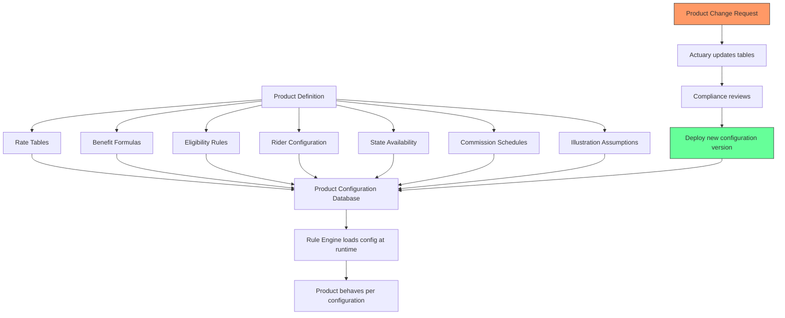

**Advantages of table-driven products:**
- New products launched in weeks, not months
- Actuaries directly manage rate tables
- Compliance reviews configuration, not code
- State-specific variants through configuration overlays
- A/B testing of product features through configuration switches

---

## 8. Underwriting Rules Deep Dive

### 8.1 Knockout Rules (Auto-Decline Triggers)

Knockout rules identify conditions that result in automatic decline, preventing further underwriting effort and expense.

```
KNOCKOUT RULES — Auto-Decline Triggers

KO-001: Active cancer treatment (chemo/radiation within 12 months)
KO-002: Organ transplant waiting list
KO-003: AIDS/HIV positive (varies by jurisdiction and product)
KO-004: Current illegal drug use (disclosed or detected)
KO-005: Currently incarcerated
KO-006: Felony conviction within 5 years (product-specific)
KO-007: BMI > 45
KO-008: Active suicidal ideation or suicide attempt within 2 years
KO-009: Applicant residing in sanctioned/embargoed country
KO-010: Age exceeds product maximum
KO-011: Face amount below product minimum
KO-012: Multiple DUI/DWI within 3 years
KO-013: Terminal illness diagnosis
KO-014: Active substance abuse treatment (unless 5+ years sober)
KO-015: Insulin-dependent diabetes with HbA1c > 10.0
```

**Implementation:**

```
RULE GROUP: KNOCKOUT_RULES
PRIORITY: HIGHEST (evaluate first)
BEHAVIOR: SHORT_CIRCUIT (stop on first match)

RULE: KO-001
WHEN:
  applicant.medicalHistory CONTAINS condition 
  WHERE condition.type = 'CANCER' 
  AND condition.treatment.endDate > (TODAY - 365 days)
  AND condition.treatment.type IN ('CHEMOTHERAPY', 'RADIATION', 'IMMUNOTHERAPY')
THEN:
  decision = 'DECLINE'
  reason = 'Active cancer treatment within 12 months'
  STOP PROCESSING
```

### 8.2 Referral Rules (Case Routing)

Referral rules route cases to human underwriters when algorithmic decisioning is insufficient.

| Rule ID | Condition | Route To | Priority |
|---------|-----------|----------|----------|
| REF-001 | Family history of coronary disease before age 60 in first-degree relative | Medical Underwriter | Medium |
| REF-002 | Hazardous occupation (mining, logging, commercial fishing, etc.) | Occupational UW | Medium |
| REF-003 | Aviation: private pilot with < 200 hours | Aviation UW Specialist | Low |
| REF-004 | Foreign national or extended foreign travel to high-risk countries | International UW | Medium |
| REF-005 | Face amount > $5M | Large Case Unit | High |
| REF-006 | Trust-owned life insurance (TOLI) | Advanced Markets UW | Medium |
| REF-007 | Business insurance (key person, buy-sell) requiring financial justification | Financial UW | Medium |
| REF-008 | Multiple applications from same applicant within 12 months | Senior UW | High |
| REF-009 | Applicant is also agent (self-insurance) | Compliance + UW | Medium |
| REF-010 | Contestability flag on prior application with same carrier | Senior UW | High |

### 8.3 Evidence-Generation Rules

Evidence generation rules determine what medical, financial, and investigative evidence to order based on the applicant's age, face amount, and disclosed history.

**Age/Amount Evidence Matrix:**

| Age Band | Face ≤ $100K | $100K–$250K | $250K–$500K | $500K–$1M | $1M–$5M | > $5M |
|----------|-------------|-------------|-------------|-----------|---------|-------|
| 0–17 | App only | App + Para | App + Para | App + Para + Blood | App + Physical + Blood | N/A (limit) |
| 18–30 | App only | App only | App + Para | App + Para + Blood | App + Physical + Blood + EKG | Full + Financial |
| 31–40 | App only | App + Para | App + Para + Blood | App + Physical + Blood | App + Physical + Blood + EKG | Full + Financial |
| 41–50 | App + Para | App + Para + Blood | App + Physical + Blood | App + Physical + Blood + EKG | Full + Financial | Full + Financial + Inspect |
| 51–60 | App + Para + Blood | App + Physical + Blood | App + Physical + Blood + EKG | Full + Financial | Full + Financial + Inspect | Full + Financial + Inspect |
| 61–70 | App + Physical + Blood | App + Physical + Blood + EKG | Full + Financial | Full + Financial + Inspect | Full + Financial + Inspect | N/A (limit) |
| 71–80 | App + Physical + Blood + EKG | Full | Full + Financial | Full + Financial + Inspect | N/A (limit) | N/A (limit) |

**Legend:**
- App = Application Part 1 + Part 2
- Para = Paramedical exam
- Blood = Blood profile (CBC, CMP, lipid panel, HbA1c, HIV, hepatitis)
- EKG = Resting electrocardiogram
- Physical = Full physician's exam
- Financial = Financial questionnaire
- Inspect = Third-party inspection report
- Full = All of the above

**Reflexive evidence rules (triggered by disclosures):**

```
RULE: EVID-REFLEX-DIABETES
WHEN:
  applicant.disclosed('DIABETES') = TRUE
  OR applicant.rxHistory CONTAINS medication IN diabetesMedications
THEN:
  ADD_EVIDENCE: 'HbA1c test' (if not already required)
  ADD_EVIDENCE: 'Fasting glucose'
  ADD_EVIDENCE: 'APS from treating physician' (if Type 1 or insulin-dependent)
  ADD_EVIDENCE: 'Diabetic questionnaire'

RULE: EVID-REFLEX-CARDIAC
WHEN:
  applicant.disclosed('HEART_CONDITION') = TRUE
  OR applicant.age >= 50 AND face_amount >= 500000
THEN:
  ADD_EVIDENCE: 'Resting EKG' (if not already required)
  IF applicant.disclosed('PRIOR_MI') OR applicant.disclosed('STENT') OR applicant.disclosed('CABG'):
    ADD_EVIDENCE: 'Exercise stress test or nuclear stress test'
    ADD_EVIDENCE: 'APS from cardiologist'
    ADD_EVIDENCE: 'Echocardiogram results'
```

### 8.4 Auto-Issue / Jet-Issue Rules

Auto-issue (jet-issue) rules define when a case can be automatically approved without human underwriter review.

```yaml
auto_issue_rules:
  general_criteria:
    max_age: 55
    max_face_amount:
      term: 1000000
      whole_life: 500000
      ul: 750000
    excluded_products: [VUL, VA]
    
  required_conditions:
    - application_complete: true
    - identity_verified: true
    - no_knockout_triggers: true
    - no_referral_triggers: true
    
  data_call_requirements:
    mib_check:
      result: "NO_CODES"
      # OR only informational codes (not impairment codes)
    rx_check:
      result: "NO_FLAGGED_MEDICATIONS"
      # Allow common medications: statins (if controlled), SSRIs (stable), etc.
      allowed_medications:
        - category: "STATIN"
          condition: "stable_dose_12_months"
        - category: "SSRI"
          condition: "stable_dose_12_months"
        - category: "ACE_INHIBITOR"
          condition: "stable_dose_12_months"
    mvr_check:
      result: "CLEAN_OR_MINOR"
      max_violations_3_years: 2
      excluded_violations: ["DUI", "RECKLESS_DRIVING", "SUSPENDED_LICENSE"]
    credit_score:
      min_score: 650  # If using credit-based insurance score
      
  risk_class_assignment:
    available_classes: [PREFERRED_PLUS, PREFERRED, STANDARD_PLUS, STANDARD]
    # Substandard table ratings require human UW
    
  auto_issue_decision:
    all_criteria_met: "ISSUE"
    any_criteria_failed: "REFER_TO_UNDERWRITER"
```

---

## 9. Compliance Rules

### 9.1 Suitability Determination

Suitability rules ensure that products sold are appropriate for the customer's financial situation and objectives.

```
RULE: COMP-SUIT-ANNUITY-001
Name: "Annuity Suitability Assessment"
Regulation: NAIC Suitability in Annuity Transactions Model Regulation

WHEN:
  product.type IN ('FIXED_ANNUITY', 'VARIABLE_ANNUITY', 'INDEXED_ANNUITY')
THEN:
  REQUIRE assessment of:
    1. Financial status: income, net worth, liquid assets
    2. Tax status and existing tax-advantaged savings
    3. Investment objectives: growth, income, preservation, time horizon
    4. Intended use: retirement, accumulation, income, estate planning
    5. Financial experience: stocks, bonds, mutual funds, annuities, insurance
    6. Existing annuity contracts: surrender charges, benefits, living benefits
    7. Liquidity needs: emergency fund, upcoming expenses
    8. Risk tolerance: conservative, moderate, aggressive
    9. Age: enhanced scrutiny for senior consumers (65+)
    
  EVALUATE:
    IF age >= 65:
      enhanced_suitability = TRUE
      REQUIRE supervisor review
    IF liquidity_ratio < 10%:
      flag = "LOW_LIQUIDITY"
      REQUIRE documentation of how liquidity needs will be met
    IF surrender_period > (100 - age) years:
      flag = "LONG_SURRENDER_PERIOD"
      REQUIRE justification
    IF replacing_existing_annuity:
      REQUIRE comparison of:
        - Surrender charges (existing vs. new)
        - Death benefits (existing vs. new)
        - Living benefits (existing vs. new)
        - Fees and charges (existing vs. new)
        - Investment options (existing vs. new)
```

### 9.2 Replacement Evaluation

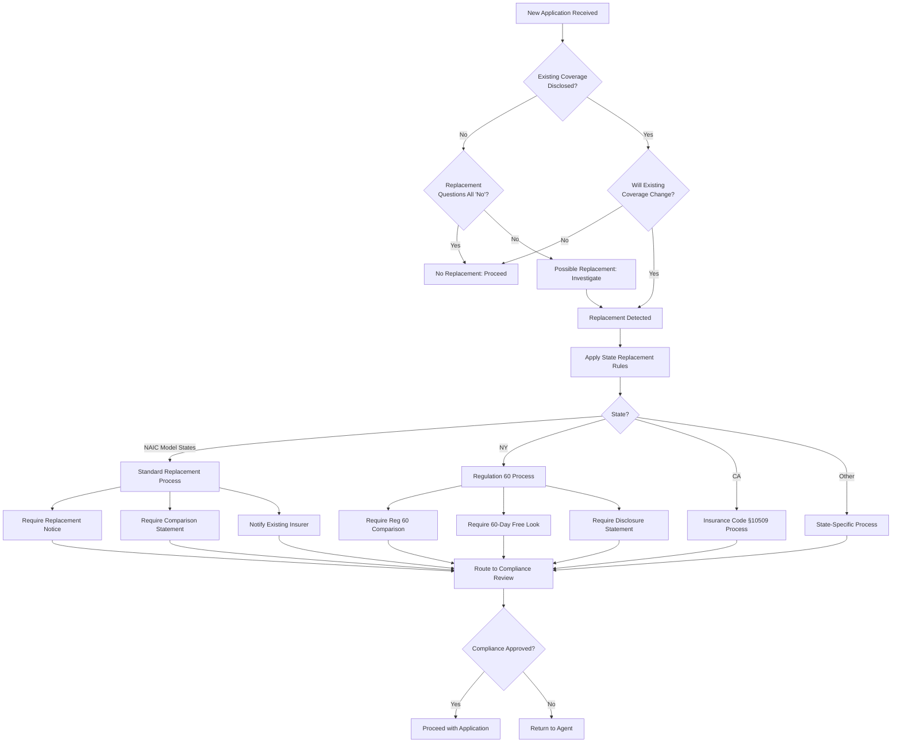

### 9.3 State-Specific Regulation Encoding

```json
{
  "state_compliance_rules": {
    "NY": {
      "free_look_period": {
        "life_insurance": 10,
        "annuity": 20,
        "replacement": 60,
        "senior_65_plus": 60
      },
      "replacement_regulation": "Reg_60",
      "suitability": {
        "regulation": "Reg_187",
        "applies_to": ["LIFE_INSURANCE", "ANNUITIES"],
        "best_interest_standard": true,
        "care_obligation": true,
        "disclosure_obligation": true,
        "conflict_of_interest": true
      },
      "illustration_regulation": "Reg_74",
      "annual_report_required": true,
      "privacy_notice": "ANNUAL",
      "vanishing_premium_prohibition": true,
      "military_protections": {
        "servicemembers_civil_relief_act": true,
        "additional_state_protections": true
      }
    },
    "CA": {
      "free_look_period": {
        "life_insurance": 30,
        "annuity": 30,
        "senior_65_plus": 30
      },
      "replacement_regulation": "Insurance_Code_10509",
      "suitability": {
        "applies_to": ["ANNUITIES"],
        "best_interest_standard": true
      },
      "privacy_notice": "ANNUAL",
      "senior_protections": {
        "age_threshold": 65,
        "required_disclosures": ["surrender_charge_schedule", "liquidity_restrictions"]
      }
    },
    "TX": {
      "free_look_period": {
        "life_insurance": 10,
        "annuity": 20
      },
      "replacement_regulation": "NAIC_Model",
      "suitability": {
        "applies_to": ["ANNUITIES"],
        "best_interest_standard": true
      }
    }
  }
}
```

### 9.4 Regulatory Change Management

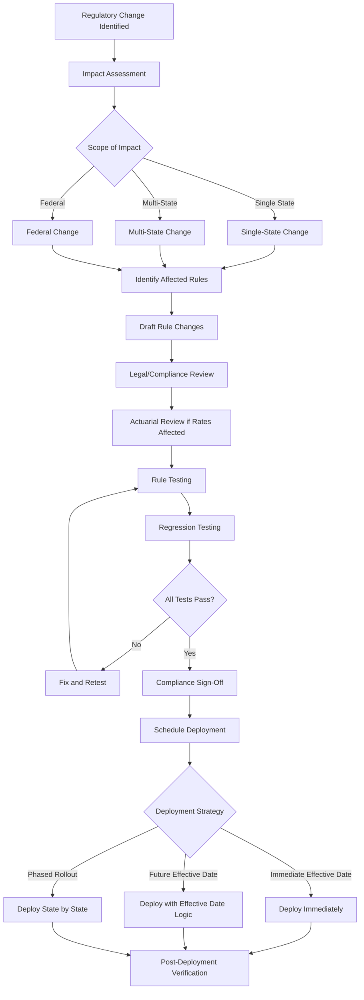

---

## 10. Rule Lifecycle Management

### 10.1 Rule Authoring

**Roles in rule management:**

| Role | Responsibilities | Tools |
|------|-----------------|-------|
| Business Analyst | Author rules in business-friendly format, define test scenarios | Rule authoring UI, decision table editor |
| Subject Matter Expert | Validate rule logic against business intent, review edge cases | Rule review interface |
| Rule Developer | Implement complex rules requiring technical skills, optimize performance | IDE, DRL editor, FEEL editor |
| Compliance Officer | Review rules for regulatory compliance, approve regulatory rules | Rule review interface, audit reports |
| Quality Analyst | Design and execute test suites, verify rule behavior | Testing framework, scenario tool |
| Rule Administrator | Deploy rules, manage versions, monitor production | Deployment tool, monitoring dashboard |

### 10.2 Rule Testing

#### 10.2.1 Unit Testing

Each individual rule tested in isolation with known inputs and expected outputs.

```yaml
test_suite: "UW Risk Classification Unit Tests"
tests:
  - test_id: "UT-RC-001"
    description: "Young healthy male → Preferred Plus"
    inputs:
      age: 30
      gender: "M"
      bmi: 22
      bp_systolic: 120
      bp_diastolic: 75
      cholesterol_total: 185
      tobacco: "NEVER"
      family_history_cardiac: false
    expected_output:
      risk_class: "PREFERRED_PLUS"
    
  - test_id: "UT-RC-002"
    description: "Middle-aged slightly overweight → Standard Plus"
    inputs:
      age: 48
      gender: "M"
      bmi: 28
      bp_systolic: 138
      bp_diastolic: 88
      cholesterol_total: 235
      tobacco: "NEVER"
      family_history_cardiac: false
    expected_output:
      risk_class: "STANDARD_PLUS"
    
  - test_id: "UT-RC-003"
    description: "Current smoker → Standard Tobacco"
    inputs:
      age: 35
      gender: "F"
      bmi: 24
      bp_systolic: 125
      bp_diastolic: 80
      cholesterol_total: 200
      tobacco: "CURRENT"
      family_history_cardiac: false
    expected_output:
      risk_class: "STANDARD_TOBACCO"
```

#### 10.2.2 Scenario Testing

End-to-end scenarios testing complete rule chains.

```yaml
scenario_test: "New Business Application - Standard Term"
steps:
  - step: "Product Eligibility"
    rule_group: "PRODUCT_ELIGIBILITY"
    inputs:
      applicant_age: 35
      state: "IL"
      product: "TERM_20"
      face_amount: 500000
    expected: { eligible: true }
    
  - step: "Evidence Requirements"
    rule_group: "EVIDENCE_REQUIREMENTS"
    inputs_from_prior: true
    additional_inputs:
      health_disclosures: []
    expected: { evidence: ["APPLICATION", "PARAMEDICAL"] }
    
  - step: "Risk Classification"
    rule_group: "RISK_CLASSIFICATION"
    inputs_from_prior: true
    additional_inputs:
      bmi: 24
      bp: "125/80"
      cholesterol: 195
      tobacco: "NEVER"
    expected: { risk_class: "PREFERRED" }
    
  - step: "Rate Calculation"
    rule_group: "RATE_CALCULATION"
    inputs_from_prior: true
    expected:
      annual_premium_range: [450, 550]
      
  - step: "Auto-Issue Decision"
    rule_group: "AUTO_ISSUE"
    inputs_from_prior: true
    additional_inputs:
      mib_result: "NO_CODES"
      rx_result: "CLEAN"
      mvr_result: "CLEAN"
    expected: { decision: "AUTO_ISSUE" }
```

#### 10.2.3 Regression Testing

Run full test suite after every rule change to detect unintended impacts.

```
Regression Test Summary:
─────────────────────────────────
Total scenarios:        1,247
Passed:                 1,241
Failed:                     4
Skipped:                    2

Failed Tests:
  - UT-RC-045: Borderline BMI case (expected STANDARD_PLUS, got STANDARD)
    Root cause: New BMI threshold rule tightened boundary
    Impact assessment: 0.3% of applicant population affected
    Decision: ACCEPT (intentional tightening)
    
  - UT-WD-012: Withdrawal with new state restriction
    Root cause: New CA withdrawal rule applied to existing test case
    Impact assessment: CA withdrawal requests will require suitability review
    Decision: UPDATE TEST (new expected behavior)
    
  - UT-COMM-003: Commission calculation rounding
    Root cause: Rate table update introduced rounding difference
    Impact assessment: < $0.01 per transaction
    Decision: UPDATE TEST (acceptable rounding)
    
  - SCN-NB-015: NY replacement scenario
    Root cause: Reg 60 rule update changed form requirement
    Impact assessment: NY replacements require updated form version
    Decision: VERIFY with compliance team
```

### 10.3 Rule Versioning

```json
{
  "rule_version_history": {
    "rule_id": "COMP-SUIT-ANNUITY-001",
    "rule_name": "Annuity Suitability Assessment",
    "versions": [
      {
        "version": "1.0",
        "status": "RETIRED",
        "effective_date": "2020-01-01",
        "retirement_date": "2022-06-30",
        "regulation_basis": "NAIC Model Regulation 275",
        "changes": "Initial implementation"
      },
      {
        "version": "2.0",
        "status": "RETIRED",
        "effective_date": "2022-07-01",
        "retirement_date": "2024-12-31",
        "regulation_basis": "NAIC Best Interest Model Regulation",
        "changes": "Updated to best interest standard per NAIC model adoption"
      },
      {
        "version": "3.0",
        "status": "ACTIVE",
        "effective_date": "2025-01-01",
        "retirement_date": null,
        "regulation_basis": "State-specific best interest implementations",
        "changes": "Added state-specific variations for NY Reg 187, CA AB-2020",
        "approved_by": "Compliance Committee",
        "test_results": {
          "unit_tests": "48/48 passed",
          "scenario_tests": "125/125 passed",
          "regression": "1247/1247 passed"
        }
      },
      {
        "version": "3.1",
        "status": "STAGED",
        "effective_date": "2025-07-01",
        "changes": "Adding enhanced senior protection rules for FL and TX",
        "test_results": {
          "unit_tests": "52/52 passed",
          "scenario_tests": "IN_PROGRESS",
          "regression": "PENDING"
        }
      }
    ]
  }
}
```

### 10.4 Rule Governance

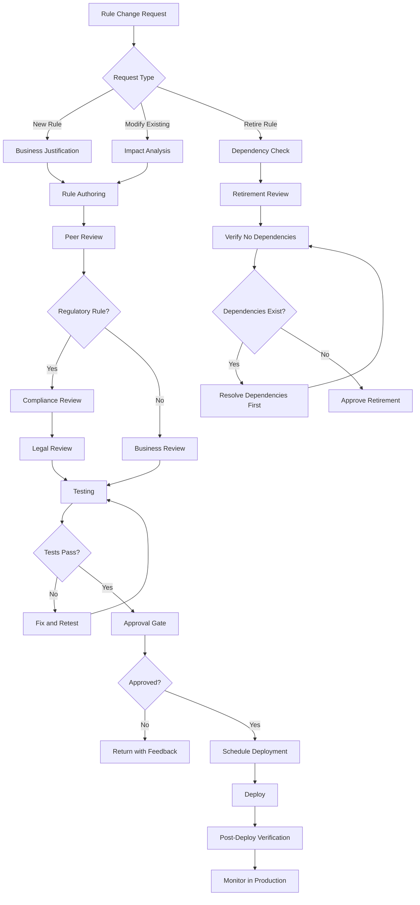

### 10.5 Rule Audit Trail

Every rule action must be logged for regulatory compliance:

```json
{
  "rule_audit_entry": {
    "audit_id": "AUD-2025-001234567",
    "timestamp": "2025-03-15T14:30:22.456Z",
    "transaction_id": "TXN-2025-567890",
    "policy_number": "UL-123456789",
    "rule_set": "WITHDRAWAL_ELIGIBILITY",
    "rule_set_version": "3.2.1",
    "rules_evaluated": [
      {
        "rule_id": "ELIG-WD-001",
        "rule_version": "2.1",
        "conditions_evaluated": [
          {"condition": "policy.status = ACTIVE", "result": true},
          {"condition": "policy.account_value > min_balance", "result": true},
          {"condition": "transaction.amount <= max_withdrawal", "result": true}
        ],
        "rule_fired": true,
        "result": "ELIGIBLE"
      },
      {
        "rule_id": "VAL-WD-TAX-001",
        "rule_version": "1.3",
        "conditions_evaluated": [
          {"condition": "tax_withholding_election on file", "result": true}
        ],
        "rule_fired": true,
        "result": "VALID"
      },
      {
        "rule_id": "FRAUD-VEL-001",
        "rule_version": "1.1",
        "conditions_evaluated": [
          {"condition": "address_change within 30 days", "result": false}
        ],
        "rule_fired": false,
        "result": "NO_ALERT"
      }
    ],
    "final_decision": "APPROVED_FOR_STP",
    "confidence_score": 94,
    "execution_time_ms": 12,
    "rule_engine_version": "DROOLS_8.44.0"
  }
}
```

---

## 11. Vendor Landscape

### 11.1 Drools / Red Hat Decision Manager

| Attribute | Detail |
|-----------|--------|
| **Type** | Open-source (Drools) / Commercial (Red Hat Decision Manager) |
| **Language** | DRL (Drools Rule Language), DMN, Decision Tables (spreadsheets) |
| **Algorithm** | Rete (Phreak — enhanced Rete) |
| **Deployment** | Embedded (Java library), KIE Server (REST API), OpenShift |
| **Strengths** | Open-source foundation, strong community, DMN support, spreadsheet-based tables, Java ecosystem |
| **Weaknesses** | Requires Java expertise, UI for business users less polished than commercial alternatives |
| **Insurance Fit** | Excellent for Java-based PAS, strong for complex rule sets, good for organizations with in-house Java expertise |
| **Pricing** | Open-source (free); Red Hat subscription for enterprise support |

**Sample Drools DRL:**

```drl
package com.insurer.rules.underwriting

import com.insurer.model.Applicant
import com.insurer.model.UnderwritingDecision

rule "Knockout - Active Cancer Treatment"
    salience 1000  // Highest priority
    when
        $app : Applicant(
            medicalHistory contains "CANCER",
            cancerTreatmentEndDate > (today - 365)
        )
    then
        UnderwritingDecision decision = new UnderwritingDecision();
        decision.setResult("DECLINE");
        decision.setReason("Active cancer treatment within 12 months");
        insert(decision);
end

rule "Preferred Plus - Young Healthy Non-Tobacco"
    salience 100
    when
        $app : Applicant(
            age >= 18, age <= 45,
            bmi >= 18.5, bmi <= 25.0,
            bloodPressureSystolic <= 130,
            bloodPressureDiastolic <= 80,
            cholesterolTotal < 200,
            tobaccoStatus == "NEVER",
            familyHistoryCardiac == false
        )
        not UnderwritingDecision(result == "DECLINE")
    then
        UnderwritingDecision decision = new UnderwritingDecision();
        decision.setResult("APPROVE");
        decision.setRiskClass("PREFERRED_PLUS");
        insert(decision);
end
```

### 11.2 IBM Operational Decision Manager (ODM)

| Attribute | Detail |
|-----------|--------|
| **Type** | Commercial |
| **Language** | BAL (Business Action Language), IRL, Decision Tables, Decision Trees |
| **Algorithm** | Sequential, Rete |
| **Deployment** | On-premises, IBM Cloud, containerized |
| **Strengths** | Mature enterprise product, excellent business user authoring, decision governance, strong IBM support |
| **Weaknesses** | Expensive licensing, IBM ecosystem dependency, slower innovation cycle |
| **Insurance Fit** | Excellent for large carriers with IBM infrastructure, strong for regulated environments needing governance |
| **Pricing** | Enterprise licensing ($$$$) |

### 11.3 FICO Blaze Advisor

| Attribute | Detail |
|-----------|--------|
| **Type** | Commercial |
| **Language** | SRL (Structured Rule Language), Decision Trees, Decision Tables, Scorecards |
| **Strengths** | Insurance industry heritage, built-in scorecards, predictive analytics integration, fraud detection integration |
| **Weaknesses** | Older architecture, limited cloud-native features |
| **Insurance Fit** | Strong for underwriting, fraud detection, and credit-based decisions; used extensively in insurance industry |
| **Pricing** | Enterprise licensing ($$$$) |

### 11.4 Pegasystems Decision Management

| Attribute | Detail |
|-----------|--------|
| **Type** | Commercial (part of Pega Platform) |
| **Language** | Visual rule builder, decision tables, decision trees, predictive models |
| **Strengths** | Integrated with Pega BPM, AI/ML integration, customer decision hub, real-time decisioning |
| **Weaknesses** | Expensive, platform lock-in, steep learning curve |
| **Insurance Fit** | Excellent for carriers using Pega for PAS/BPM; strong for next-best-action and customer engagement decisions |
| **Pricing** | Platform licensing ($$$$$) |

### 11.5 InRule

| Attribute | Detail |
|-----------|--------|
| **Type** | Commercial |
| **Language** | Business language rules, decision tables, math expressions |
| **Strengths** | .NET native, business-friendly authoring, fast execution, good rule testing |
| **Weaknesses** | Primarily .NET ecosystem, smaller market presence |
| **Insurance Fit** | Good for .NET-based PAS environments, strong business user adoption |
| **Pricing** | Mid-range ($$) |

### 11.6 Corticon (Progress Software)

| Attribute | Detail |
|-----------|--------|
| **Type** | Commercial |
| **Language** | Decision tables (spreadsheet-like), decision flows |
| **Algorithm** | Decision table optimization (not Rete) |
| **Strengths** | No coding required, completeness/conflict checking, pure decision table approach, fast business user adoption |
| **Weaknesses** | Limited complex event processing, less flexible for highly procedural rules |
| **Insurance Fit** | Excellent for table-driven insurance rules; strong completeness checking ensures no gaps in rule coverage |
| **Pricing** | Mid-range ($$) |

### 11.7 Vendor Comparison Matrix

| Capability | Drools | IBM ODM | FICO Blaze | Pega | InRule | Corticon |
|-----------|--------|---------|------------|------|--------|---------|
| Business User Authoring | ★★★ | ★★★★ | ★★★★ | ★★★★★ | ★★★★ | ★★★★★ |
| Developer Experience | ★★★★★ | ★★★ | ★★★ | ★★★ | ★★★★ | ★★★ |
| DMN Support | ★★★★★ | ★★★★ | ★★ | ★★★ | ★★ | ★★★ |
| Performance | ★★★★★ | ★★★★ | ★★★★ | ★★★★ | ★★★★ | ★★★★ |
| Cloud-Native | ★★★★ | ★★★ | ★★ | ★★★★ | ★★★ | ★★★ |
| Governance | ★★★ | ★★★★★ | ★★★★ | ★★★★★ | ★★★ | ★★★★ |
| Cost | ★★★★★ | ★★ | ★★ | ★ | ★★★ | ★★★ |
| Insurance Domain Fit | ★★★★ | ★★★★ | ★★★★★ | ★★★★★ | ★★★ | ★★★★ |

---

## 12. Sample Rule Implementations

### 12.1 Withdrawal Eligibility (Pseudocode)

```
RULESET: WithdrawalEligibility
VERSION: 3.1

RULE "Policy Must Be Active"
  PRIORITY: 1000
  WHEN:
    policy.status != 'ACTIVE'
  THEN:
    DENY withdrawal
    ADD reason "Policy is not in active status"
    STOP PROCESSING

RULE "Minimum Holding Period"
  PRIORITY: 900
  WHEN:
    policy.issueDate + 365 days > TODAY
    AND product.minimumHoldingPeriodDays > 0
  THEN:
    DENY withdrawal
    ADD reason "Policy within minimum holding period"
    STOP PROCESSING

RULE "Check Minimum Balance"
  PRIORITY: 800
  WHEN:
    policy.accountValue - request.amount < product.minimumBalance
  THEN:
    DENY withdrawal
    ADD reason "Withdrawal would reduce balance below minimum"
    ADD detail "Minimum balance: " + product.minimumBalance
    ADD detail "Available for withdrawal: " + (policy.accountValue - product.minimumBalance)
    STOP PROCESSING

RULE "Calculate Free Withdrawal Amount"
  PRIORITY: 700
  WHEN:
    policy.policyYear <= product.surrenderChargePeriod
  THEN:
    freeAmount = MAX(
      product.freeWithdrawalPercentage * policy.accountValue,
      product.freeWithdrawalPercentage * policy.premiumsPaid
    ) - policy.ytdWithdrawals
    SET freeWithdrawalAvailable = MAX(0, freeAmount)

RULE "Apply Surrender Charge"
  PRIORITY: 600
  WHEN:
    request.amount > freeWithdrawalAvailable
    AND policy.policyYear <= product.surrenderChargePeriod
  THEN:
    excessAmount = request.amount - freeWithdrawalAvailable
    surrenderChargeRate = LOOKUP(product.surrenderChargeSchedule, policy.policyYear)
    surrenderCharge = excessAmount * surrenderChargeRate
    ADD warning "Surrender charge of $" + surrenderCharge + " applies"

RULE "Tax Withholding Required"
  PRIORITY: 500
  WHEN:
    policy.taxWithholdingElection IS NULL
  THEN:
    PEND withdrawal
    ADD reason "Tax withholding election required before processing"

RULE "Early Withdrawal Penalty Warning"
  PRIORITY: 400
  WHEN:
    policy.qualified = TRUE
    AND owner.age < 59.5
    AND NOT qualifiesForPenaltyException(owner)
  THEN:
    ADD warning "10% early withdrawal penalty may apply (owner under age 59½)"

RULE "Suitability Check Required"
  PRIORITY: 300
  WHEN:
    policy.state IN ['NY', 'CA', 'MA']
    AND product.type IN ['VARIABLE_ANNUITY', 'VUL']
  THEN:
    REQUIRE suitabilityReview = PASSED
    IF suitabilityReview != PASSED:
      PEND withdrawal
      ADD reason "Suitability review required for " + policy.state
```

### 12.2 Commission Calculation (Pseudocode)

```
RULESET: CommissionCalculation
VERSION: 2.4

RULE "Select Commission Schedule"
  WHEN:
    policy.issued = TRUE
  THEN:
    schedule = LOOKUP(commissionScheduleTable,
      product: policy.productType,
      channel: agent.distributionChannel,
      tier: agent.productionTier,
      effective_date: policy.issueDate
    )

RULE "Calculate First Year Commission"
  WHEN:
    policy.policyYear = 1
    AND schedule IS NOT NULL
  THEN:
    IF product.premiumType = 'TARGET':
      targetPremium = policy.targetPremium
      excessPremium = MAX(0, policy.annualizedPremium - targetPremium)
      fyCommission = (targetPremium * schedule.fy_target_rate) + 
                     (excessPremium * schedule.fy_excess_rate)
    ELIF product.premiumType = 'LEVEL':
      fyCommission = policy.annualizedPremium * schedule.fy_rate
    ELIF product.premiumType = 'SINGLE':
      fyCommission = policy.premium * schedule.single_premium_rate

RULE "Calculate Renewal Commission"
  WHEN:
    policy.policyYear > 1
    AND policy.policyYear <= schedule.renewal_years
  THEN:
    renewalRate = LOOKUP(schedule.renewal_rates, policy.policyYear)
    renewalCommission = policy.annualizedPremium * renewalRate

RULE "Calculate Trail Commission"
  WHEN:
    product.hasTrailCommission = TRUE
    AND policy.accountValue > 0
  THEN:
    trailCommission = policy.accountValue * schedule.trail_rate / 12  // monthly trail

RULE "Apply Hierarchy Override"
  WHEN:
    agent.hierarchy IS NOT NULL
  THEN:
    FOR EACH level IN agent.hierarchy:
      overrideAmount = baseCommission * level.overrideRate
      CREATE commissionEntry(level.agent, overrideAmount, 'OVERRIDE')

RULE "Chargeback Check"
  WHEN:
    policy.terminated = TRUE
    AND policy.terminationDate < policy.issueDate + schedule.chargebackPeriodMonths months
  THEN:
    monthsInForce = MONTHS_BETWEEN(policy.issueDate, policy.terminationDate)
    chargebackRate = LOOKUP(schedule.chargebackSchedule, monthsInForce)
    chargebackAmount = firstYearCommission * chargebackRate
    CREATE chargebackEntry(agent, chargebackAmount)
```

### 12.3 MEC Testing (IRC §7702A) (Pseudocode)

```
RULESET: MECTesting
VERSION: 1.2

RULE "7-Pay Test"
  DESCRIPTION: "Determine if cumulative premiums exceed the 7-pay limit"
  WHEN:
    premium.received = TRUE
    AND policy.productType IN ('UL', 'VUL', 'IUL', 'WL')
  THEN:
    sevenPayPremium = LOOKUP(sevenPayTable,
      policy.productCode,
      policy.issueAge,
      policy.riskClass,
      policy.faceAmount,
      policy.riders
    )
    
    cumulativePremiums = policy.cumulativePremiumsPaid + premium.amount
    cumulativeLimit = sevenPayPremium * MIN(policy.policyYear, 7)
    
    IF cumulativePremiums > cumulativeLimit:
      TRIGGER mecViolation
      SET policy.mecStatus = 'MEC'
      SET policy.mecDate = premium.effectiveDate
      ADD notification "Policy has become a Modified Endowment Contract"
      ADD notification "Future distributions will be taxed under LIFO rules"
      ADD notification "Loans will be treated as distributions for tax purposes"

RULE "Material Change Reset"
  DESCRIPTION: "Face amount increase resets the 7-pay test"
  WHEN:
    policy.faceAmountIncreased = TRUE
    AND increase.reason IN ('REQUESTED', 'OPTION_B_INCREASE', 'COLA_RIDER')
  THEN:
    recalculate sevenPayPremium for new face amount
    restart 7-pay testing period
    recalculate cumulative premium limit
    
RULE "Premium Refund to Avoid MEC"
  DESCRIPTION: "Allow premium refund within 60 days to avoid MEC"
  WHEN:
    mecViolation detected
    AND TODAY <= premium.effectiveDate + 60 days
  THEN:
    excessAmount = cumulativePremiums - cumulativeLimit
    OFFER refund of excessAmount to avoid MEC status
    IF refund accepted:
      REVERSE mecViolation
      REFUND excessAmount to owner
```

### 12.4 RMD Calculation (Pseudocode)

```
RULESET: RMDCalculation
VERSION: 2.0

RULE "Determine RMD Eligibility"
  WHEN:
    policy.qualified = TRUE
    AND policy.qualifiedType IN ('TRADITIONAL_IRA', '401K_ROLLOVER', '403B', 'SEP_IRA')
    AND owner.age >= rmdStartAge(owner.birthYear)
  THEN:
    rmdRequired = TRUE

FUNCTION rmdStartAge(birthYear):
    IF birthYear <= 1950: RETURN 72
    ELIF birthYear >= 1951 AND birthYear <= 1959: RETURN 73
    ELIF birthYear >= 1960: RETURN 75  // SECURE Act 2.0

RULE "Calculate RMD Amount"
  WHEN:
    rmdRequired = TRUE
  THEN:
    priorYearEndBalance = policy.accountValueAsOf(DECEMBER_31, PRIOR_YEAR)
    distributionPeriod = LOOKUP(uniformLifetimeTable, owner.age)
    
    // Exception: if sole beneficiary is spouse more than 10 years younger
    IF policy.soleBeneficiary.type = 'SPOUSE'
       AND (owner.age - spouse.age) > 10:
      distributionPeriod = LOOKUP(jointLifeExpectancyTable, owner.age, spouse.age)
    
    rmdAmount = priorYearEndBalance / distributionPeriod
    
    // First year special rule
    IF owner.reachedRMDAge THIS_YEAR:
      rmdDeadline = APRIL_1_FOLLOWING_YEAR
    ELSE:
      rmdDeadline = DECEMBER_31_THIS_YEAR

RULE "Inherited IRA RMD"
  WHEN:
    policy.ownerType = 'BENEFICIARY'
    AND policy.originalOwner.deceased = TRUE
  THEN:
    IF beneficiary.type = 'SPOUSE':
      // Spouse can treat as own or use beneficiary rules
      APPLY standard RMD rules OR beneficiary single life table
    ELIF beneficiary.type = 'ELIGIBLE_DESIGNATED':
      // Disabled, chronically ill, minor child, or not more than 10 years younger
      distributionPeriod = LOOKUP(singleLifeExpectancyTable, beneficiary.age)
      REDUCE by 1 each subsequent year
    ELSE:
      // 10-year rule (SECURE Act)
      REQUIRE full distribution by 10th year after death
      IF originalOwner had started RMDs:
        REQUIRE annual RMDs during 10-year period
```

### 12.5 Replacement Detection (Pseudocode)

```
RULESET: ReplacementDetection
VERSION: 1.5

RULE "Direct Replacement Detection"
  WHEN:
    application.replacementQuestion1 = 'YES'
    OR application.replacementQuestion2 = 'YES'
    OR application.existing_policies_disclosed = TRUE
       AND any existing_policy.action IN ('SURRENDER', 'LAPSE', 'REDUCE', 'CONVERT')
  THEN:
    SET replacement = TRUE
    SET replacementType = determineType(existing_policy.action)

RULE "Indirect Replacement Detection"  
  WHEN:
    replacement = FALSE
    AND applicant has existing_policies with carrier
    AND new_application.faceAmount >= existing_total * 0.50
    AND any existing_policy.premium_mode changed to ANNUAL within 6 months
  THEN:
    SET possibleReplacement = TRUE
    ROUTE to compliance for review

RULE "Apply State Replacement Requirements"
  WHEN:
    replacement = TRUE
  THEN:
    requirements = getStateReplacementRequirements(application.state)
    FOR EACH requirement IN requirements:
      IF requirement.type = 'FORM':
        REQUIRE form(requirement.formId)
      IF requirement.type = 'NOTICE':
        GENERATE notice(requirement.noticeType)
      IF requirement.type = 'COMPARISON':
        GENERATE comparison(existing_policy, new_application)
      IF requirement.type = 'NOTIFICATION':
        NOTIFY existing_carrier(requirement.notificationContent)
      IF requirement.type = 'FREE_LOOK':
        SET freeLookDays = requirement.days  // e.g., 60 days for NY replacements
```

---

## 13. Architecture & Deployment Patterns

### 13.1 Rule Engine Deployment Architecture

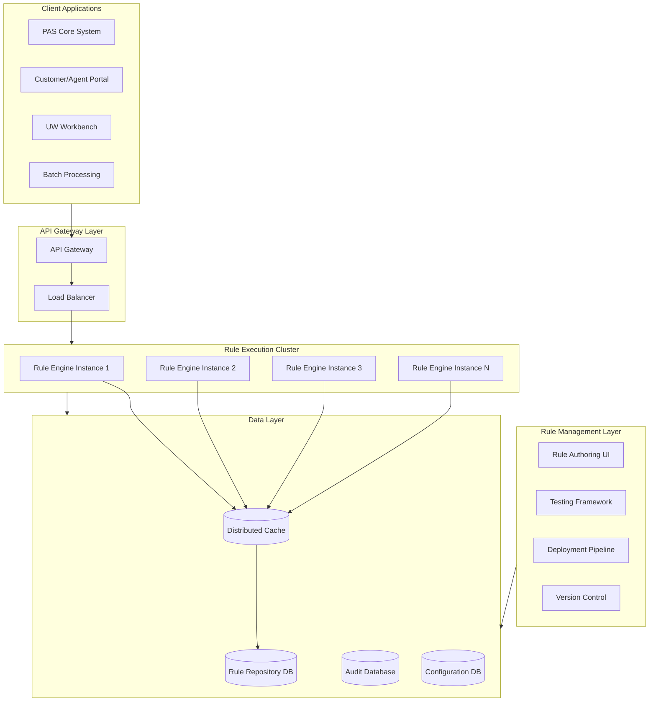

### 13.2 Rule Caching Strategy

```yaml
caching_configuration:
  layers:
    - name: "L1 - In-Process Cache"
      type: "LOCAL_MEMORY"
      scope: "Per rule engine instance"
      ttl_minutes: 60
      max_size_mb: 512
      eviction: "LRU"
      
    - name: "L2 - Distributed Cache"
      type: "REDIS_CLUSTER"
      scope: "Shared across all instances"
      ttl_minutes: 360
      max_size_gb: 8
      eviction: "LRU"
      
    - name: "L3 - Rule Repository"
      type: "DATABASE"
      scope: "Persistent storage"
      
  cache_keys:
    rule_set: "rs:{rule_set_id}:v:{version}"
    decision_table: "dt:{table_id}:v:{version}"
    rate_table: "rt:{table_id}:v:{version}"
    
  invalidation:
    strategy: "PUBLISH_SUBSCRIBE"
    channel: "rule-cache-invalidation"
    on_deployment: "INVALIDATE_AFFECTED_KEYS"
    on_version_change: "INVALIDATE_OLD_VERSION"
```

### 13.3 High-Availability Configuration

```json
{
  "ha_configuration": {
    "deployment_mode": "ACTIVE_ACTIVE",
    "min_instances": 3,
    "max_instances": 12,
    "auto_scaling": {
      "metric": "REQUEST_LATENCY_P95",
      "target_ms": 50,
      "scale_up_threshold_ms": 75,
      "scale_down_threshold_ms": 25,
      "cooldown_seconds": 300
    },
    "health_check": {
      "endpoint": "/health",
      "interval_seconds": 10,
      "timeout_seconds": 5,
      "unhealthy_threshold": 3,
      "healthy_threshold": 2
    },
    "circuit_breaker": {
      "failure_rate_threshold": 50,
      "slow_call_rate_threshold": 80,
      "slow_call_duration_ms": 200,
      "wait_duration_open_ms": 60000,
      "permitted_calls_half_open": 10,
      "sliding_window_size": 100
    },
    "fallback": {
      "strategy": "CACHED_RESULT_OR_DEFAULT",
      "default_behavior": "ROUTE_TO_MANUAL_QUEUE"
    }
  }
}
```

---

## 14. Performance Optimization

### 14.1 Rule Execution Performance Targets

| Metric | Target | Acceptable | Degraded |
|--------|--------|-----------|----------|
| Simple rule evaluation (single table) | < 5ms | < 15ms | > 15ms |
| Complex rule chain (full UW) | < 50ms | < 150ms | > 150ms |
| Decision table lookup | < 2ms | < 10ms | > 10ms |
| Rate table lookup | < 1ms | < 5ms | > 5ms |
| Batch rule evaluation (1000 policies) | < 5s | < 15s | > 15s |
| Rule deployment (hot reload) | < 30s | < 60s | > 60s |

### 14.2 Optimization Techniques

| Technique | Description | Impact |
|-----------|-------------|--------|
| **Rule ordering** | Place most selective (most frequently filtering) conditions first | 20–40% improvement |
| **Indexed conditions** | Create indexes on frequently matched fact attributes | 30–50% improvement |
| **Rule grouping** | Group related rules into agenda groups; only activate relevant groups | 40–60% improvement |
| **Lazy evaluation** | Don't evaluate rules until their group is needed | 20–30% improvement |
| **Compiled rules** | Pre-compile rule conditions to bytecode | 50–70% improvement |
| **Caching** | Cache rule evaluation results for identical inputs | 90%+ for cache hits |
| **Parallel evaluation** | Evaluate independent rule groups in parallel | 30–50% improvement |
| **Pruning** | Remove or disable unused rules | Reduces working memory overhead |

### 14.3 Common Performance Anti-Patterns

| Anti-Pattern | Problem | Solution |
|-------------|---------|----------|
| Evaluating all rules for every request | Unnecessary rule evaluation overhead | Use agenda groups and rule filters |
| Loading entire rule base on every request | Expensive initialization | Use persistent session or rule caching |
| Complex regular expressions in conditions | Slow pattern matching | Pre-process data before rule evaluation |
| Excessive fact insertions | Working memory bloat | Use selective fact insertion |
| Not using `no-loop` | Infinite rule firing loops | Add `no-loop true` to self-modifying rules |
| String concatenation in conditions | Object creation overhead | Use string interning or pre-computed keys |

---

## 15. Rule Repository Design

### 15.1 Data Model

```
RULE_SET
├── rule_set_id (PK)
├── name
├── description
├── domain (PRODUCT, UW, SERVICING, BILLING, CLAIMS, COMPLIANCE, TAX, COMMISSION)
├── status (DRAFT, TESTING, APPROVED, ACTIVE, RETIRED)
├── effective_date
├── expiration_date
├── created_by
├── created_at
├── approved_by
├── approved_at
└── metadata (JSON)

RULE_VERSION
├── version_id (PK)
├── rule_set_id (FK)
├── version_number
├── status (DRAFT, TESTING, APPROVED, ACTIVE, DEPRECATED)
├── definition (TEXT/BLOB — rule content in DRL/DMN/JSON)
├── definition_format (DRL, DMN, JSON, DECISION_TABLE)
├── checksum (SHA-256)
├── created_by
├── created_at
├── change_description
├── test_results (JSON)
└── deployment_history (JSON)

DECISION_TABLE
├── table_id (PK)
├── rule_set_id (FK)
├── name
├── hit_policy (U, F, A, P, C, O, R)
├── input_columns (JSON)
├── output_columns (JSON)
├── rows (JSON)
├── version
└── effective_date

RATE_TABLE
├── table_id (PK)
├── product_id (FK)
├── name
├── dimensions (JSON — e.g., ["age", "gender", "risk_class"])
├── data (JSON or relational — the actual rates)
├── effective_date
├── expiration_date
├── version
├── approved_by
└── actuarial_certification

RULE_DEPENDENCY
├── dependency_id (PK)
├── source_rule_id (FK)
├── target_rule_id (FK)
├── dependency_type (CALLS, REQUIRES, OVERRIDES, SUPPLEMENTS)
└── description

RULE_AUDIT_LOG
├── audit_id (PK)
├── rule_set_id (FK)
├── version_id (FK)
├── action (CREATED, MODIFIED, TESTED, APPROVED, DEPLOYED, RETIRED)
├── performed_by
├── performed_at
├── details (JSON)
└── ip_address
```

### 15.2 Repository API

```yaml
openapi: 3.0.0
info:
  title: Rule Repository API
  version: 2.0.0

paths:
  /api/v2/rulesets:
    get:
      summary: List all rule sets
      parameters:
        - name: domain
          in: query
          schema:
            type: string
            enum: [PRODUCT, UW, SERVICING, BILLING, CLAIMS, COMPLIANCE, TAX, COMMISSION]
        - name: status
          in: query
          schema:
            type: string
            enum: [DRAFT, TESTING, APPROVED, ACTIVE, RETIRED]
      responses:
        200:
          description: List of rule sets

  /api/v2/rulesets/{ruleSetId}/versions:
    get:
      summary: List versions of a rule set
    post:
      summary: Create new version

  /api/v2/rulesets/{ruleSetId}/versions/{versionId}/evaluate:
    post:
      summary: Evaluate rules against provided facts
      requestBody:
        content:
          application/json:
            schema:
              type: object
              properties:
                facts:
                  type: object
                  description: The input facts for rule evaluation
                options:
                  type: object
                  properties:
                    trace: 
                      type: boolean
                      description: Return detailed evaluation trace
                    timeout_ms:
                      type: integer
                      description: Maximum evaluation time
      responses:
        200:
          description: Rule evaluation results

  /api/v2/rulesets/{ruleSetId}/versions/{versionId}/deploy:
    post:
      summary: Deploy a rule version to production
      requestBody:
        content:
          application/json:
            schema:
              type: object
              properties:
                deployment_strategy:
                  type: string
                  enum: [IMMEDIATE, BLUE_GREEN, CANARY, SHADOW]
                canary_percentage:
                  type: integer
                effective_date:
                  type: string
                  format: date
```

---

## 16. Testing Strategies

### 16.1 Testing Pyramid for Rules

```
                    ┌─────────────┐
                    │  Production  │
                    │  Monitoring  │
                    ├─────────────┤
                 ┌──┤  Integration │
                 │  │   Tests     │
                 │  ├─────────────┤
              ┌──┤  │  Scenario   │
              │  │  │   Tests     │
              │  │  ├─────────────┤
           ┌──┤  │  │   Unit      │
           │  │  │  │   Tests     │
           │  │  │  ├─────────────┤
        ┌──┤  │  │  │  Syntax /   │
        │  │  │  │  │  Schema     │
        │  │  │  │  │  Validation │
        └──┴──┴──┴──┴─────────────┘
         Fast/Many         Slow/Few
```

### 16.2 Test Categories

| Category | What It Tests | Who Writes | When Run | Target Coverage |
|----------|--------------|-----------|---------|-----------------|
| Syntax/Schema | Rule syntax correctness, schema compliance | Automated | On every save | 100% |
| Unit | Individual rule logic correctness | Business analyst / Developer | On every change | 100% of rules |
| Scenario | End-to-end rule chains for business scenarios | QA / Business analyst | On every deployment candidate | 200+ scenarios |
| Regression | No unintended impact from changes | Automated | On every deployment | Full suite |
| Integration | Rules work correctly within PAS context | QA | Pre-deployment | Critical paths |
| Performance | Rule evaluation meets latency targets | Performance engineer | Weekly / Pre-deployment | Key rule sets |
| Completeness | No gaps in decision table coverage | Automated analysis | On table changes | 100% coverage |
| Conflict | No conflicting rules | Automated analysis | On rule changes | Zero conflicts |

### 16.3 Completeness and Conflict Analysis

Decision table analysis tools can automatically detect:

**Completeness gaps:**
```
ANALYSIS: Decision Table "Risk Classification"
WARNING: Gap detected for conditions:
  Age: 46-60, BMI: 25-27, Tobacco: NEVER
  → No rule matches this combination
  → Recommended: Add rule for Standard Plus classification

WARNING: Gap detected for conditions:
  Age: >70, BMI: 18.5-20
  → No rule matches this combination
  → Recommended: Add rule or confirm intentional exclusion
```

**Conflict detection:**
```
ANALYSIS: Decision Table "Commission Rate"
CONFLICT: Rules 3 and 7 both match when:
  Product=UL, Channel=Independent, CaseSize=$9,500
  Rule 3 yields: FY=90%
  Rule 7 yields: FY=110%
  → Resolution: Rule 7 has higher priority (case size band takes precedence)
  → Recommendation: Adjust Rule 3 conditions to exclude overlap
```

---

## 17. Appendix

### 17.1 Glossary

| Term | Definition |
|------|-----------|
| BRE | Business Rules Engine — software that evaluates business rules |
| BRMS | Business Rules Management System — BRE plus authoring, testing, versioning, governance |
| DRL | Drools Rule Language — rule definition language for Drools engine |
| DMN | Decision Model and Notation — OMG standard for modeling decisions |
| FEEL | Friendly Enough Expression Language — expression language defined in DMN |
| Rete | Pattern matching algorithm used in production rule systems |
| Working Memory | The set of facts (data) that rules evaluate against |
| Agenda | The queue of rules that have been matched and are ready to fire |
| Salience | Priority value that determines rule firing order (higher fires first) |
| Forward Chaining | Data-driven rule evaluation: facts trigger rules |
| Backward Chaining | Goal-driven rule evaluation: goals seek supporting facts |
| Hit Policy | In a decision table, determines behavior when multiple rows match |
| COI | Cost of Insurance — monthly mortality charge in UL products |
| MEC | Modified Endowment Contract — IRC §7702A violation |
| RMD | Required Minimum Distribution |
| APS | Attending Physician's Statement |

### 17.2 Rule Naming Conventions

```
Pattern: {DOMAIN}-{SUBDOMAIN}-{SEQUENCE}

Domains:
  PROD  = Product rules
  UW    = Underwriting rules
  SVC   = Servicing rules
  BILL  = Billing rules
  CLM   = Claims rules
  COMP  = Compliance rules
  TAX   = Tax rules
  COMM  = Commission rules
  FRAUD = Fraud detection rules

Examples:
  PROD-ELIG-001    Product eligibility rule #1
  UW-KO-003        Underwriting knockout rule #3
  UW-CLASS-012     Underwriting classification rule #12
  SVC-WD-CALC-001  Servicing - withdrawal calculation rule #1
  COMP-REPL-NY-001 Compliance - replacement - NY specific rule #1
  TAX-1099R-005    Tax - 1099-R generation rule #5
  COMM-FY-TERM-001 Commission - first year - term product rule #1
```

### 17.3 Rule Documentation Template

```yaml
rule_documentation:
  rule_id: "UW-CLASS-005"
  name: "Preferred Plus Risk Class - Ages 18-45"
  domain: "UNDERWRITING"
  subdomain: "RISK_CLASSIFICATION"
  version: "2.1"
  
  business_description: |
    Classifies applicants aged 18-45 as Preferred Plus when all
    health indicators are within the best category and no adverse
    history exists. This is the most favorable risk class offered.
  
  regulatory_basis: |
    Based on company's filed underwriting guidelines, approved by
    state insurance departments. Rate tables filed per state.
  
  conditions:
    - "Applicant age 18-45"
    - "BMI 18.5-25.0"
    - "Blood pressure ≤ 130/80"
    - "Total cholesterol < 200"
    - "Never used tobacco"
    - "No family history of early cardiac death"
    - "No adverse medical history"
  
  actions:
    - "Assign risk class: PREFERRED_PLUS"
    - "Use Preferred Plus rate table"
  
  dependencies:
    - "PROD-ELIG-* (product eligibility must pass first)"
    - "UW-KO-* (knockout rules must clear first)"
    - "UW-EVID-* (evidence requirements determine available data)"
  
  test_scenarios:
    - "Healthy 30-year-old male, all optimal values → PP"
    - "Healthy 25-year-old female, BMI 25.5 → NOT PP (BMI over threshold)"
    - "35-year-old, BP 135/82 → NOT PP (BP over threshold)"
  
  change_history:
    - version: "1.0"
      date: "2023-01-01"
      description: "Initial implementation"
    - version: "2.0"
      date: "2024-01-01"
      description: "Adjusted BMI threshold from 26 to 25"
    - version: "2.1"
      date: "2025-01-01"
      description: "Added family history criterion"
  
  owner: "Chief Underwriter"
  last_reviewed: "2025-01-15"
  next_review: "2025-07-15"
```

### 17.4 References

1. OMG Decision Model and Notation (DMN) Specification v1.4
2. Drools Documentation — https://www.drools.org/learn/documentation.html
3. "Production Systems and Business Rules" — Charles Forgy (Rete Algorithm)
4. NAIC Model Laws and Regulations — Suitability, Replacement, Privacy
5. IRC §7702: Definition of Life Insurance
6. IRC §7702A: Modified Endowment Contracts
7. SECURE Act 2.0: RMD Changes
8. "The Decision Model: A Business Logic Framework" — von Halle & Goldberg
9. ACORD Life Standards — Data Models and Transaction Standards
10. SOA Professional Development: Business Rules in Insurance

---

*This article is part of the Life Insurance PAS Architect's Encyclopedia. For related topics, see Article 18 (Straight-Through Processing), Article 20 (BPM & Workflow Orchestration), and Article 21 (Correspondence & Document Management).*
