# Article 20: BPM & Workflow Orchestration

## Table of Contents

1. [Introduction: BPM in Insurance Context](#1-introduction-bpm-in-insurance-context)
2. [BPM Maturity Model for Insurance](#2-bpm-maturity-model-for-insurance)
3. [BPMN 2.0 for Insurance](#3-bpmn-20-for-insurance)
4. [Core Insurance Processes Modeled in BPMN](#4-core-insurance-processes-modeled-in-bpmn)
5. [Case Management (CMMN)](#5-case-management-cmmn)
6. [Task Management](#6-task-management)
7. [Process Orchestration Patterns](#7-process-orchestration-patterns)
8. [Integration Patterns](#8-integration-patterns)
9. [Monitoring & Analytics](#9-monitoring--analytics)
10. [Vendor Landscape](#10-vendor-landscape)
11. [Architecture & Deployment](#11-architecture--deployment)
12. [Process Database Design](#12-process-database-design)
13. [Process Versioning Strategy](#13-process-versioning-strategy)
14. [Microservices + BPM Integration](#14-microservices--bpm-integration)
15. [Process Mining for Insurance](#15-process-mining-for-insurance)
16. [Appendix](#16-appendix)

---

## 1. Introduction: BPM in Insurance Context

### 1.1 Insurance Process Characteristics

Life insurance business processes have distinctive characteristics that make them uniquely challenging and uniquely suited for BPM technology:

| Characteristic | Description | BPM Implication |
|---------------|-------------|-----------------|
| **Long-running** | Processes span days, weeks, months, or even the life of a policy (decades) | Process engine must support durable, persistent process state across very long durations |
| **Document-centric** | Every transaction involves documents — applications, forms, contracts, certificates, medical records, claim forms | Deep integration with document management, OCR, and content services |
| **Multi-party** | Processes involve applicants, agents, underwriters, medical professionals, reinsurers, regulatory bodies, beneficiaries | Complex task routing, role-based access, inter-organizational communication |
| **Regulated** | Every step must comply with state/federal regulations with full audit trail | Process audit logging, compliance checkpoints, regulatory reporting |
| **Exception-heavy** | Up to 30–40% of transactions require exception handling | Sophisticated exception paths, escalation mechanisms, manual intervention points |
| **Event-driven** | Processes are triggered by and respond to external events (payments, claims, market events, age milestones) | Event-based process triggers, signal handling, timer events |
| **Financially impactful** | Processing errors have direct monetary consequences | Compensation/rollback mechanisms, approval hierarchies, financial controls |
| **Time-sensitive** | Many operations have regulatory deadlines (free-look, grace period, claim settlement) | Timer-based escalation, SLA enforcement, deadline management |

### 1.2 The Case for BPM in PAS

Without BPM, insurance processes are typically:
- Hard-coded in application logic (inflexible, expensive to change)
- Managed via email and spreadsheets (no visibility, no control)
- Executed inconsistently across teams and locations
- Difficult to audit and impossible to analyze for optimization

With BPM:
- Processes are **visible** — modeled, documented, and understood by business and IT
- Processes are **measurable** — every step is tracked, timed, and analyzed
- Processes are **adaptable** — changes to process flow don't require code changes
- Processes are **auditable** — complete history of who did what, when, and why
- Processes are **optimizable** — data-driven continuous improvement

### 1.3 BPM vs. Workflow vs. Orchestration

| Concept | Scope | Focus | Example |
|---------|-------|-------|---------|
| **Workflow** | Individual task routing | Who does what next | "Route this application to an underwriter" |
| **BPM** | End-to-end process management | Complete process lifecycle with monitoring, analysis, and optimization | "Manage the entire new business process from application to policy issuance" |
| **Orchestration** | Service coordination | Technical service invocation and sequencing | "Call validation service, then underwriting service, then policy service" |

In a modern PAS, all three are needed and complementary:
- **BPM** manages the overall business process
- **Workflow** handles human task assignment and routing within the process
- **Orchestration** coordinates system-to-system interactions within the process

---

## 2. BPM Maturity Model for Insurance

### 2.1 Five-Level Maturity Model

```
┌──────────────────────────────────────────────────────────────────┐
│ Level 5: Intelligent Process Automation                          │
│   AI-driven process optimization, predictive process management, │
│   autonomous exception resolution, process self-healing          │
├──────────────────────────────────────────────────────────────────┤
│ Level 4: Managed & Optimized                                     │
│   Process mining, continuous improvement, advanced analytics,    │
│   cross-process optimization, real-time process dashboards       │
├──────────────────────────────────────────────────────────────────┤
│ Level 3: Standardized & Automated                                │
│   Standardized BPMN models, automated workflows, STP enabled,   │
│   rules engine integration, exception management                 │
├──────────────────────────────────────────────────────────────────┤
│ Level 2: Defined & Documented                                    │
│   Processes documented but not automated, manual workflows,      │
│   basic work queues, limited process visibility                  │
├──────────────────────────────────────────────────────────────────┤
│ Level 1: Ad Hoc & Tribal Knowledge                               │
│   Processes exist in people's heads, inconsistent execution,     │
│   email-driven workflows, no process metrics                     │
└──────────────────────────────────────────────────────────────────┘
```

### 2.2 Maturity Assessment Criteria

| Dimension | Level 1 | Level 3 | Level 5 |
|-----------|---------|---------|---------|
| Process Documentation | None or outdated | Complete BPMN models | Living models auto-updated from execution |
| Process Execution | Manual, ad hoc | Automated with BPMS | AI-optimized, self-adjusting |
| Task Assignment | Email, verbal | Rules-based routing | ML-based optimal assignment |
| Exception Handling | Informal escalation | Structured exception queues | Predictive exception prevention |
| Process Monitoring | No visibility | Real-time dashboards | Predictive analytics |
| Process Improvement | Reactive complaints | Data-driven optimization | Autonomous optimization |
| Compliance | Manual audit | Automated audit trail | Proactive compliance monitoring |
| Customer Experience | Slow, inconsistent | Fast, standardized | Personalized, predictive |

---

## 3. BPMN 2.0 for Insurance

### 3.1 BPMN Events

Events represent things that happen during a process. They are categorized by position (start, intermediate, end) and type.

#### 3.1.1 Start Events

| Event Type | Symbol | Insurance Use Case |
|-----------|--------|-------------------|
| None Start | ○ | Process manually initiated (e.g., new application created) |
| Message Start | ✉○ | Process triggered by incoming message (e.g., claim notification received) |
| Timer Start | ⏲○ | Process triggered by schedule (e.g., monthly billing cycle) |
| Signal Start | △○ | Process triggered by broadcast signal (e.g., market close triggers NAV calculation) |
| Conditional Start | ☐○ | Process triggered by data condition (e.g., policy anniversary triggers review) |

#### 3.1.2 Intermediate Events

| Event Type | Position | Insurance Use Case |
|-----------|----------|-------------------|
| Timer Catch | Boundary/In-flow | Wait for underwriting evidence (timeout after 30 days) |
| Message Catch | Boundary/In-flow | Wait for lab results, APS, or cedent carrier response |
| Message Throw | In-flow | Send notification to agent, applicant, or reinsurer |
| Signal Throw | In-flow | Broadcast policy issued signal to downstream systems |
| Error Boundary | On activity | Catch processing errors (e.g., calculation failure) |
| Escalation Boundary | On activity | Escalate if task not completed within SLA |
| Compensation Boundary | On activity | Trigger compensation (rollback) for completed activity |
| Conditional Catch | Boundary | React to data change (e.g., policy status change during claim processing) |
| Cancel Boundary | On transaction | Handle process cancellation (e.g., application withdrawn) |

#### 3.1.3 End Events

| Event Type | Insurance Use Case |
|-----------|-------------------|
| None End | Process completes normally (e.g., policy issued) |
| Message End | Send final notification (e.g., claim payment confirmation) |
| Signal End | Broadcast process completion to listening processes |
| Error End | Process ends in error (e.g., underwriting system failure) |
| Terminate End | Force-stop all parallel branches (e.g., application cancelled) |
| Compensation End | Trigger compensation for all completed activities |

### 3.2 BPMN Activities

| Activity Type | Description | Insurance Use Case |
|--------------|-------------|-------------------|
| **User Task** | Human work item | Underwriter reviews application, processor handles exception |
| **Service Task** | Automated system call | Call validation service, query MIB, calculate premium |
| **Script Task** | Inline scripting | Transform data, calculate values, format messages |
| **Business Rule Task** | Invoke rules engine | Evaluate eligibility, classify risk, check compliance |
| **Send Task** | Send message | Send correspondence, notification, or API call |
| **Receive Task** | Wait for message | Wait for payment confirmation, lab results, or approval |
| **Manual Task** | Off-system work | Physical examination, document mailing, in-person meeting |
| **Sub-Process** | Embedded process | Underwriting sub-process within new business process |
| **Call Activity** | Invoke reusable process | Invoke shared compliance check process |
| **Multi-Instance** | Parallel or sequential iteration | Process each beneficiary, evaluate each rider |

### 3.3 BPMN Gateways

| Gateway | Symbol | Description | Insurance Use Case |
|---------|--------|-------------|-------------------|
| **Exclusive (XOR)** | ◇ | One path selected based on condition | Route to auto-issue or manual underwriting |
| **Inclusive (OR)** | ◇ with circle | One or more paths selected | Generate applicable notices (state-specific, product-specific) |
| **Parallel (AND)** | ◇ with + | All paths execute simultaneously | Initiate MIB, Rx, MVR checks in parallel |
| **Event-Based** | ◇ with pentagon | Wait for first of several events | Wait for either payment received OR grace period expired |
| **Complex** | ◇ with * | Custom merge/split logic | Merge when 3 of 5 evidence items received |

### 3.4 Pools and Lanes

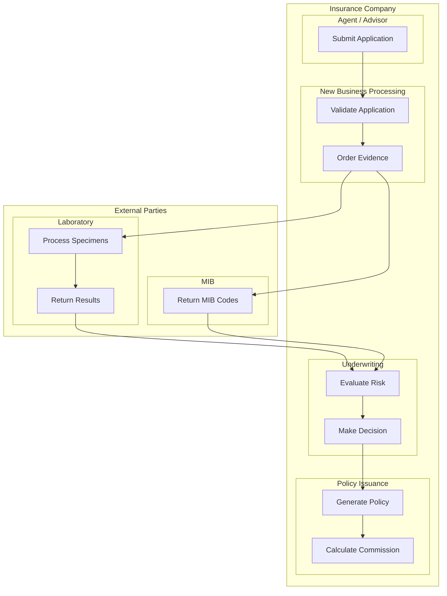

---

## 4. Core Insurance Processes Modeled in BPMN

### 4.1 New Business / Application Processing

This is the most complex process in a life insurance PAS, typically involving 30+ steps.

```mermaid
flowchart TD
    START((Start)) --> RECV[Receive Application]
    RECV --> VALIDATE{Application<br/>Complete?}
    VALIDATE -->|No| NIGO[Return NIGO to Agent]
    NIGO --> WAIT_NIGO[Wait for Corrected App]
    WAIT_NIGO --> VALIDATE
    VALIDATE -->|Yes| IDV[Identity Verification]
    IDV --> IDV_CHK{IDV Pass?}
    IDV_CHK -->|No| IDV_FAIL[IDV Failure Queue]
    IDV_CHK -->|Yes| REPL{Replacement?}
    
    REPL -->|Yes| REPL_PROC[Process Replacement Forms]
    REPL_PROC --> REPL_OK{Replacement<br/>Forms Complete?}
    REPL_OK -->|No| REPL_PEND[Request Missing Forms]
    REPL_PEND --> REPL_OK
    REPL_OK -->|Yes| SUIT
    REPL -->|No| SUIT{Suitability<br/>Assessment}
    
    SUIT --> SUIT_CHK{Suitability Pass?}
    SUIT_CHK -->|No| SUIT_REV[Suitability Review]
    SUIT_REV --> SUIT_DEC{Approved?}
    SUIT_DEC -->|No| DECLINE_SUIT[Decline: Suitability]
    SUIT_DEC -->|Yes| UW_ELIG
    SUIT_CHK -->|Yes| UW_ELIG{Accelerated UW<br/>Eligible?}
    
    UW_ELIG -->|Yes| ACCEL_UW[Accelerated UW Path]
    UW_ELIG -->|No| TRAD_UW[Traditional UW Path]
    
    subgraph AccelUW["Accelerated Underwriting"]
        ACCEL_UW --> PAR_DATA[Parallel Data Calls]
        PAR_DATA --> MIB[MIB Check]
        PAR_DATA --> RX[Rx Check]
        PAR_DATA --> MVR[MVR Check]
        PAR_DATA --> CREDIT[Credit Check]
        MIB --> AGGREGATE[Aggregate Results]
        RX --> AGGREGATE
        MVR --> AGGREGATE
        CREDIT --> AGGREGATE
        AGGREGATE --> ALGO{Algorithmic<br/>Decision}
        ALGO -->|Auto-Approve| CLASSIFY[Risk Classification]
        ALGO -->|Refer| TRAD_UW
        ALGO -->|Decline| AUTO_DECLINE[Auto-Decline]
    end
    
    subgraph TradUW["Traditional Underwriting"]
        TRAD_UW --> EVID[Order Evidence]
        EVID --> PARA[Paramedical]
        EVID --> BLOOD[Blood/Urine]
        EVID --> APS[APS]
        EVID --> INSPECT[Inspection Report]
        PARA --> WAIT_EVID{All Evidence<br/>Received?}
        BLOOD --> WAIT_EVID
        APS --> WAIT_EVID
        INSPECT --> WAIT_EVID
        WAIT_EVID -->|No| FOLLOW_UP[Follow Up on Outstanding]
        FOLLOW_UP --> TIMER_EVID{Timeout<br/>30 Days?}
        TIMER_EVID -->|No| WAIT_EVID
        TIMER_EVID -->|Yes| INCOMPLETE[Incomplete: Close or Extend]
        WAIT_EVID -->|Yes| UW_REVIEW[Underwriter Review]
        UW_REVIEW --> UW_DEC{UW Decision}
        UW_DEC -->|Approve| CLASSIFY
        UW_DEC -->|Decline| MANUAL_DECLINE[Decline with Reason]
        UW_DEC -->|Counter-Offer| COUNTER[Counter-Offer to Applicant]
        COUNTER --> COUNTER_RESP{Accept?}
        COUNTER_RESP -->|Yes| CLASSIFY
        COUNTER_RESP -->|No| WITHDRAWN[Application Withdrawn]
    end
    
    CLASSIFY --> RATE[Calculate Premium]
    RATE --> PREM_CHK{Initial Premium<br/>Received?}
    PREM_CHK -->|No| COLLECT_PREM[Request Initial Premium]
    COLLECT_PREM --> PREM_TIMER{Payment<br/>Timeout?}
    PREM_TIMER -->|No| PREM_CHK
    PREM_TIMER -->|Yes| EXPIRE[Application Expired]
    PREM_CHK -->|Yes| MEC_TEST[7702/MEC Testing]
    MEC_TEST --> MEC_OK{MEC Pass?}
    MEC_OK -->|No| MEC_REVIEW[MEC Review]
    MEC_OK -->|Yes| ISSUE[Issue Policy]
    
    ISSUE --> GEN_CONTRACT[Generate Contract]
    GEN_CONTRACT --> CALC_COMM[Calculate Commission]
    CALC_COMM --> REINS_RPT{Reinsurance<br/>Required?}
    REINS_RPT -->|Yes| REINS[Report to Reinsurer]
    REINS_RPT -->|No| BILL_SETUP
    REINS --> BILL_SETUP[Setup Billing Schedule]
    BILL_SETUP --> DELIVER{E-Delivery<br/>Consent?}
    DELIVER -->|Yes| E_DELIVER[E-Deliver Policy Kit]
    DELIVER -->|No| PRINT[Print & Mail Policy Kit]
    E_DELIVER --> NOTIFY[Notify Agent]
    PRINT --> NOTIFY
    NOTIFY --> FREE_LOOK[Start Free-Look Period]
    FREE_LOOK --> END_NB((Policy In-Force))
    
    AUTO_DECLINE --> DECLINE_LETTER[Generate Decline Letter]
    MANUAL_DECLINE --> DECLINE_LETTER
    DECLINE_SUIT --> DECLINE_LETTER
    DECLINE_LETTER --> REFUND[Refund Premium if Collected]
    REFUND --> END_DECLINE((Application Declined))
```

### 4.2 Underwriting Workflow

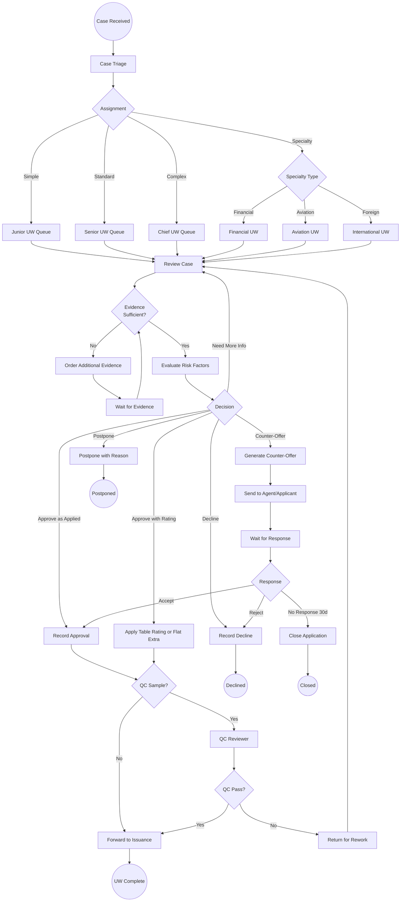

### 4.3 Servicing Request Processing

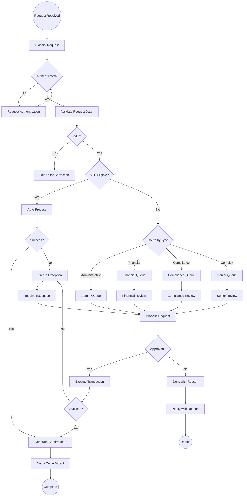

### 4.4 Claims Processing (Death Claim)

```mermaid
flowchart TD
    START((Claim Filed)) --> INTAKE[Claim Intake]
    INTAKE --> REG_CLM[Register Claim]
    REG_CLM --> VERIFY_POL[Verify Policy Status]
    VERIFY_POL --> POL_OK{Policy Active?}
    POL_OK -->|No| INVESTIGATE_STATUS[Investigate Policy Status]
    POL_OK -->|Yes| DOC_CHK{Documents<br/>Complete?}
    
    DOC_CHK -->|No| REQ_DOC[Request Missing Documents]
    REQ_DOC --> DOC_WAIT[Wait for Documents]
    DOC_WAIT --> DOC_TIMER{60-Day<br/>Timeout?}
    DOC_TIMER -->|No| DOC_CHK
    DOC_TIMER -->|Yes| SUSPEND[Suspend Claim]
    DOC_CHK -->|Yes| CONTEST{Within<br/>Contestability?}
    
    CONTEST -->|Yes| CONTEST_INV[Contestability Investigation]
    CONTEST_INV --> CONTEST_DEC{Finding}
    CONTEST_DEC -->|Material Misrep| DENY_CLAIM[Deny Claim]
    CONTEST_DEC -->|No Issue| BENEFIT_CALC
    CONTEST -->|No| FRAUD_CHK{Fraud<br/>Indicators?}
    
    FRAUD_CHK -->|Yes| SIU[Special Investigation Unit]
    SIU --> SIU_DEC{SIU Finding}
    SIU_DEC -->|Fraud Confirmed| DENY_CLAIM
    SIU_DEC -->|No Fraud| BENEFIT_CALC
    FRAUD_CHK -->|No| BENEFIT_CALC[Calculate Benefits]
    
    BENEFIT_CALC --> CALC_FACE[Face Amount]
    BENEFIT_CALC --> CALC_RIDERS[Rider Benefits]
    BENEFIT_CALC --> CALC_DEDUCT[Deductions]
    CALC_FACE --> NET_CALC[Net Benefit Calculation]
    CALC_RIDERS --> NET_CALC
    CALC_DEDUCT --> NET_CALC
    
    NET_CALC --> BEN_IDENT[Identify Beneficiaries]
    BEN_IDENT --> BEN_VERIFY{Beneficiaries<br/>Verified?}
    BEN_VERIFY -->|No| BEN_LOCATE[Locate/Verify Beneficiaries]
    BEN_LOCATE --> BEN_VERIFY
    BEN_VERIFY -->|Yes| SETTLE_OPT[Present Settlement Options]
    
    SETTLE_OPT --> SETTLE_CHK{Settlement<br/>Election Received?}
    SETTLE_CHK -->|No| REMIND[Send Reminder]
    REMIND --> SETTLE_CHK
    SETTLE_CHK -->|Yes| APPROVE_PAY[Approve Payment]
    
    APPROVE_PAY --> PAY_AUTH{Authorization<br/>Level}
    PAY_AUTH -->|< $100K| EXAMINER[Claims Examiner Approves]
    PAY_AUTH -->|$100K-$1M| SUPERVISOR[Supervisor Approves]
    PAY_AUTH -->|> $1M| DIRECTOR[Director Approves]
    
    EXAMINER --> DISBURSE[Process Disbursement]
    SUPERVISOR --> DISBURSE
    DIRECTOR --> DISBURSE
    
    DISBURSE --> TAX[Process Tax Reporting]
    TAX --> CLOSE_POL[Close Policy]
    CLOSE_POL --> REINS_NOTIFY[Notify Reinsurer]
    REINS_NOTIFY --> CONFIRM_BEN[Send Confirmation to Beneficiaries]
    CONFIRM_BEN --> END_CLM((Claim Settled))
    
    DENY_CLAIM --> DENY_LETTER[Generate Denial Letter]
    DENY_LETTER --> APPEAL_PERIOD[Appeal Period - 60 Days]
    APPEAL_PERIOD --> APPEAL{Appeal Filed?}
    APPEAL -->|Yes| APPEAL_REVIEW[Appeal Review]
    APPEAL_REVIEW --> APPEAL_DEC{Appeal Decision}
    APPEAL_DEC -->|Upheld| END_DENY((Claim Denied))
    APPEAL_DEC -->|Overturned| BENEFIT_CALC
    APPEAL -->|No| END_DENY
```

### 4.5 Billing Cycle Process

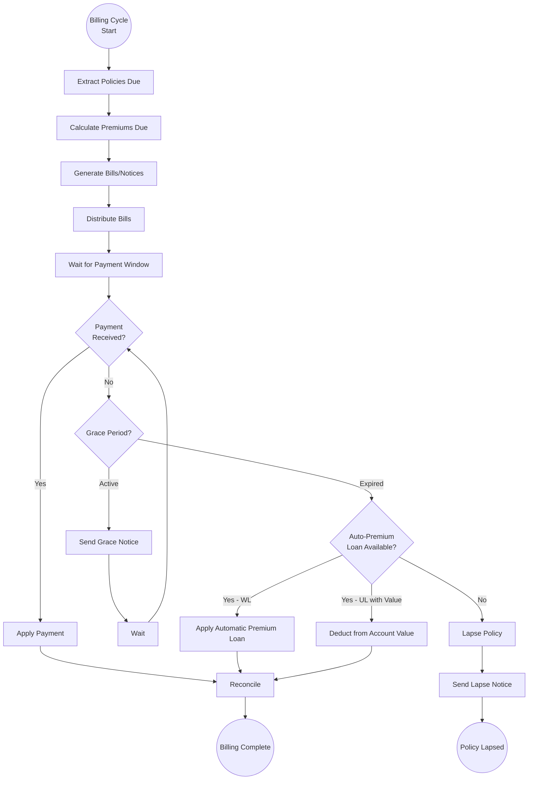

### 4.6 Reinstatement Process

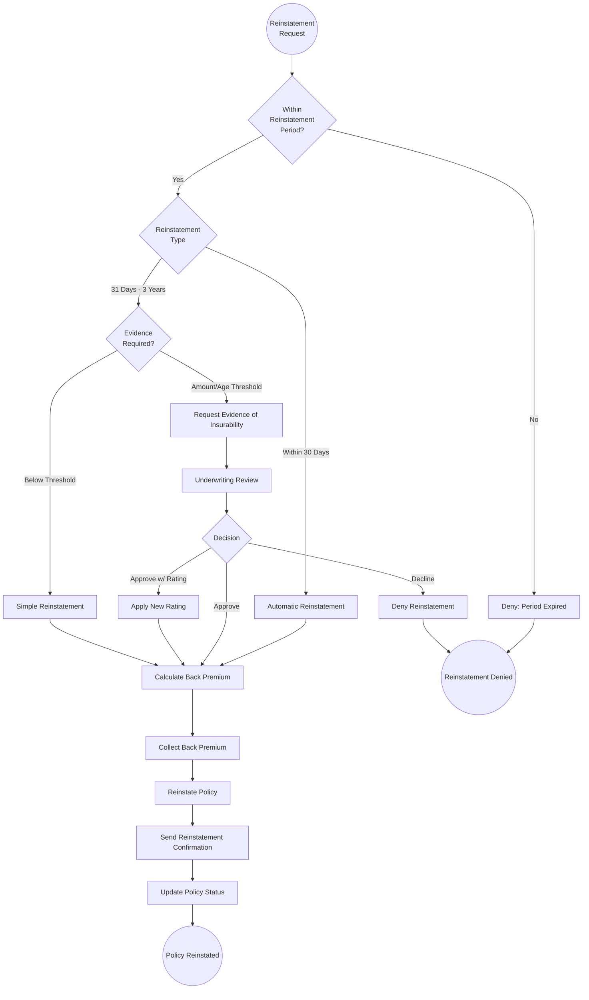

### 4.7 1035 Exchange Process

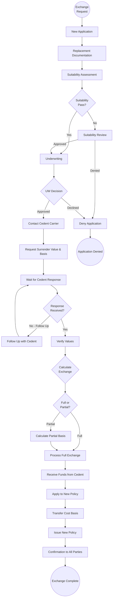

---

## 5. Case Management (CMMN)

### 5.1 When BPMN Is Not Enough

BPMN excels at modeling structured, predictable processes. But many insurance processes are **semi-structured** or **unstructured** — the sequence of activities is not fully known in advance and depends on evolving circumstances.

| Process Type | Structure Level | Best Modeled With | Insurance Example |
|-------------|----------------|-------------------|-------------------|
| Highly Structured | Predictable sequence, few variations | BPMN | Billing cycle, premium collection |
| Semi-Structured | Known tasks but flexible sequence | CMMN + BPMN | Complex underwriting, contested claims |
| Unstructured | Ad hoc, knowledge-worker driven | CMMN | Regulatory investigation, litigation |

### 5.2 CMMN Concepts

| Concept | Description | Insurance Example |
|---------|-------------|-------------------|
| **Case** | A unit of work tracked from creation to resolution | Complex underwriting case, disputed claim |
| **Stage** | A phase within a case containing tasks | Investigation stage, evaluation stage, resolution stage |
| **Task** | A unit of work (human, process, or case) | Review medical records, interview witness |
| **Milestone** | A significant achievement within the case | All evidence received, decision rendered |
| **Sentry** | A guard condition that triggers entry/exit of stages or tasks | "Enter Evaluation stage when all evidence milestones are complete" |
| **Discretionary Task** | A task available to case workers but not required | Request additional investigation, consult specialist |
| **Case File** | The data/documents associated with the case | Application, medical records, financial documents |
| **Planning Table** | Defines which discretionary tasks are available in a stage | Available investigation actions during the investigation stage |

### 5.3 Complex Underwriting Case (CMMN Model)

```
CASE: Complex Underwriting
├── STAGE: Case Intake [REQUIRED]
│   ├── TASK: Register Case (Human)
│   ├── TASK: Assign Underwriter (Process)
│   └── MILESTONE: Case Registered
│
├── STAGE: Evidence Gathering [REQUIRED]
│   ├── TASK: Order Standard Evidence (Process)
│   ├── TASK: Order Medical Records (Process)
│   ├── DISCRETIONARY: Order Additional Labs
│   ├── DISCRETIONARY: Request APS from Specialist
│   ├── DISCRETIONARY: Order Inspection Report
│   ├── DISCRETIONARY: Request Financial Questionnaire
│   ├── TIMER: 30-Day Evidence Deadline
│   └── MILESTONE: Evidence Complete
│       SENTRY: All required evidence received OR deadline reached
│
├── STAGE: Evaluation [REQUIRED]
│   ├── TASK: Review Medical History (Human)
│   ├── TASK: Review Financial Justification (Human)
│   ├── DISCRETIONARY: Consult Chief Medical Officer
│   ├── DISCRETIONARY: Consult Actuarial
│   ├── DISCRETIONARY: Request Reinsurance Facultative Quote
│   ├── TASK: Determine Risk Class (Human)
│   └── MILESTONE: Evaluation Complete
│       SENTRY: Risk class determined
│
├── STAGE: Decision [REQUIRED]
│   ├── TASK: Record Decision (Human)
│   ├── TASK: Document Rationale (Human)
│   ├── DISCRETIONARY: Peer Review
│   ├── TASK: Quality Check (if sampled) (Human)
│   └── MILESTONE: Decision Finalized
│
├── STAGE: Communication [REQUIRED]
│   ├── TASK: Generate Decision Communication (Process)
│   ├── TASK: Notify Agent (Process)
│   ├── DISCRETIONARY: Phone Call to Agent
│   └── MILESTONE: Communication Complete
│
└── CASE FILE:
    ├── Application
    ├── Medical Records
    ├── Lab Results
    ├── Financial Documents
    ├── Inspection Reports
    ├── Reinsurance Quotes
    ├── Underwriter Notes
    └── Decision Documentation
```

### 5.4 Contested Claim (CMMN Model)

```
CASE: Contested Death Claim
├── STAGE: Initial Assessment [REQUIRED]
│   ├── TASK: Review Claim File (Human - Claims Examiner)
│   ├── TASK: Review Policy History (Human)
│   ├── TASK: Identify Contestation Basis (Human)
│   └── MILESTONE: Assessment Complete
│
├── STAGE: Investigation [REQUIRED, but tasks are discretionary]
│   ├── DISCRETIONARY: Request Original Application
│   ├── DISCRETIONARY: Order Medical Records Pre-Application
│   ├── DISCRETIONARY: Interview Agent of Record
│   ├── DISCRETIONARY: Engage Private Investigator
│   ├── DISCRETIONARY: Request Pharmacy Records
│   ├── DISCRETIONARY: Subpoena Records
│   ├── DISCRETIONARY: Engage Forensic Accountant
│   ├── TIMER: Investigation Deadline (state-specific)
│   └── MILESTONE: Investigation Complete
│
├── STAGE: Legal Review [CONDITIONAL]
│   SENTRY: Material misrepresentation found OR beneficiary dispute
│   ├── TASK: Legal Counsel Review (Human - Attorney)
│   ├── DISCRETIONARY: Engage Outside Counsel
│   ├── DISCRETIONARY: Prepare Interpleader
│   └── MILESTONE: Legal Review Complete
│
├── STAGE: Resolution [REQUIRED]
│   ├── TASK: Determine Resolution (Human - Senior Claims)
│   ├── DISCRETIONARY: Negotiate Settlement
│   ├── DISCRETIONARY: Mediation
│   ├── TASK: Obtain Approval (if > authority limit) (Human)
│   └── MILESTONE: Resolution Determined
│
├── STAGE: Execution [REQUIRED]
│   ├── TASK: Process Payment or Denial (Process/Human)
│   ├── TASK: Generate Communication (Process)
│   ├── TASK: Close Claim File (Human)
│   └── MILESTONE: Case Closed
│
└── CASE FILE:
    ├── Original Claim Documents
    ├── Investigation Reports
    ├── Legal Opinions
    ├── Settlement Agreements
    ├── Communication History
    └── Financial Records
```

---

## 6. Task Management

### 6.1 Human Task Lifecycle

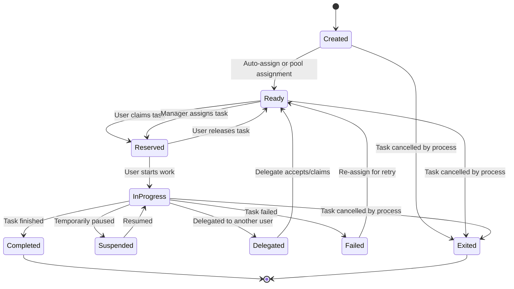

### 6.2 Task Assignment Strategies

| Strategy | Description | Best For |
|----------|-------------|----------|
| **Direct Assignment** | Task assigned to specific named user | Known case owner, specialist tasks |
| **Role-Based** | Task assigned to role group; any member can claim | General processing queues |
| **Skill-Based** | Task routed based on required skills vs. user skills | Specialized processing (UW, compliance) |
| **Round-Robin** | Tasks distributed evenly across available users | Equal workload distribution |
| **Weighted Round-Robin** | Distribution weighted by user capacity/skill level | Mixed skill levels |
| **Load-Based** | Assigned to user with lowest current workload | Preventing bottlenecks |
| **Affinity-Based** | Route to user who handled related tasks for same policy/customer | Continuity of service |
| **Pull-Based** | Users pull from shared queue when ready | Self-managed teams |
| **Priority-Weighted Pull** | High-priority tasks must be pulled first | Ensuring SLA compliance |

### 6.3 Skill-Based Routing Configuration

```json
{
  "skill_routing_config": {
    "skills": [
      {"id": "UW_MEDICAL", "name": "Medical Underwriting", "levels": [1, 2, 3]},
      {"id": "UW_FINANCIAL", "name": "Financial Underwriting", "levels": [1, 2, 3]},
      {"id": "UW_AVIATION", "name": "Aviation Underwriting", "levels": [1, 2]},
      {"id": "COMPLIANCE_STATE", "name": "State Compliance", "levels": [1, 2]},
      {"id": "COMPLIANCE_FED", "name": "Federal Compliance", "levels": [1, 2]},
      {"id": "CLAIMS_LIFE", "name": "Life Claims Processing", "levels": [1, 2, 3]},
      {"id": "CLAIMS_AD_D", "name": "AD&D Claims", "levels": [1, 2]},
      {"id": "FIN_PROCESSING", "name": "Financial Transaction Processing", "levels": [1, 2]},
      {"id": "TAX_CALC", "name": "Tax Calculation", "levels": [1, 2]},
      {"id": "SUITABILITY", "name": "Suitability Review", "levels": [1, 2]}
    ],
    "task_skill_requirements": {
      "UNDERWRITING_REVIEW": {
        "required": [{"skill": "UW_MEDICAL", "min_level": 2}],
        "preferred": [{"skill": "UW_FINANCIAL", "min_level": 1}]
      },
      "LARGE_CASE_UW": {
        "required": [{"skill": "UW_MEDICAL", "min_level": 3}, {"skill": "UW_FINANCIAL", "min_level": 2}]
      },
      "COMPLIANCE_REVIEW": {
        "required": [{"skill": "COMPLIANCE_STATE", "min_level": 1}]
      },
      "DEATH_CLAIM_BASIC": {
        "required": [{"skill": "CLAIMS_LIFE", "min_level": 1}]
      },
      "DEATH_CLAIM_COMPLEX": {
        "required": [{"skill": "CLAIMS_LIFE", "min_level": 3}]
      }
    },
    "user_skills": {
      "user_001": [
        {"skill": "UW_MEDICAL", "level": 2},
        {"skill": "UW_FINANCIAL", "level": 1}
      ],
      "user_002": [
        {"skill": "UW_MEDICAL", "level": 3},
        {"skill": "UW_FINANCIAL", "level": 2},
        {"skill": "UW_AVIATION", "level": 1}
      ]
    }
  }
}
```

### 6.4 Workload Balancing

```yaml
workload_balancing:
  algorithm: "WEIGHTED_CAPACITY"
  
  capacity_model:
    - role: "UNDERWRITER_JUNIOR"
      max_concurrent_tasks: 15
      task_weights:
        SIMPLE_UW: 1
        STANDARD_UW: 2
        COMPLEX_UW: 5  # Effectively limits to 3 complex cases
        
    - role: "UNDERWRITER_SENIOR"
      max_concurrent_tasks: 20
      task_weights:
        SIMPLE_UW: 1
        STANDARD_UW: 1
        COMPLEX_UW: 3
        LARGE_CASE: 5
        
    - role: "CLAIMS_EXAMINER"
      max_concurrent_tasks: 25
      task_weights:
        SIMPLE_CLAIM: 1
        STANDARD_CLAIM: 2
        COMPLEX_CLAIM: 4
        CONTESTED_CLAIM: 8
        
  rebalancing:
    trigger: "EVERY_15_MINUTES"
    rules:
      - condition: "user.utilization > 90%"
        action: "STOP_NEW_ASSIGNMENTS"
      - condition: "user.utilization < 50% AND queue.depth > 0"
        action: "ASSIGN_ADDITIONAL"
      - condition: "task.wait_time > SLA * 0.75"
        action: "ESCALATE_PRIORITY"
```

### 6.5 Task Deadlines & SLA Management

```json
{
  "sla_configuration": {
    "task_slas": {
      "NEW_BUSINESS_VALIDATION": {
        "target_hours": 4,
        "warning_at_percent": 75,
        "breach_at_percent": 100,
        "escalation_chain": ["TEAM_LEAD", "MANAGER", "DIRECTOR"],
        "escalation_intervals_hours": [2, 4, 8]
      },
      "UNDERWRITING_REVIEW": {
        "target_hours": 48,
        "warning_at_percent": 75,
        "breach_at_percent": 100,
        "priority_overrides": {
          "CRITICAL": {"target_hours": 8},
          "HIGH": {"target_hours": 24}
        }
      },
      "CLAIMS_PROCESSING": {
        "target_hours": 72,
        "regulatory_deadline_days": {
          "default": 30,
          "NY": 30,
          "CA": 30,
          "TX": 15,
          "FL": 20
        }
      },
      "EXCEPTION_RESOLUTION": {
        "target_hours": {
          "CRITICAL": 2,
          "HIGH": 8,
          "MEDIUM": 24,
          "LOW": 72
        }
      }
    }
  }
}
```

### 6.6 Work Basket Design

```
WORK BASKET HIERARCHY:
├── Personal Work Basket (assigned to specific user)
│   ├── My Active Tasks (in-progress)
│   ├── My Pending Tasks (waiting for info)
│   └── My Overdue Tasks (past SLA)
│
├── Team Work Basket (shared queue for team)
│   ├── Unassigned Tasks (available to claim)
│   ├── High Priority (CRITICAL + HIGH)
│   ├── Standard Priority (MEDIUM)
│   ├── Low Priority (LOW)
│   └── Approaching SLA (within 25% of deadline)
│
├── Supervisory Basket
│   ├── Escalated Tasks
│   ├── Team Workload Overview
│   ├── SLA Dashboard
│   └── Reassignment Queue
│
└── Specialized Baskets
    ├── Compliance Review
    ├── Fraud Investigation
    ├── Large Case Processing
    └── Senior Consumer Review
```

**Work basket attributes:**

| Attribute | Description |
|-----------|-------------|
| Queue depth | Number of items in basket |
| Average age | Mean time items have been in basket |
| Oldest item | Age of the oldest item |
| SLA status | Green/yellow/red based on SLA compliance |
| Throughput | Items processed per hour/day |
| Staffing | Number of active processors |
| Wait time estimate | Predicted wait time for new items |

---

## 7. Process Orchestration Patterns

### 7.1 Saga Pattern

The Saga pattern manages distributed transactions across microservices by defining a sequence of local transactions with compensating actions.

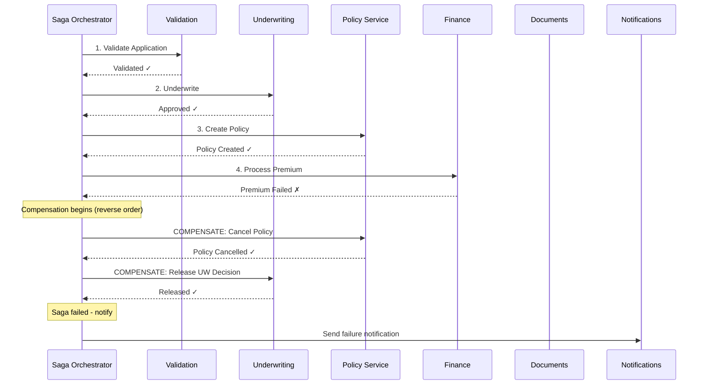

### 7.2 Choreography vs. Orchestration

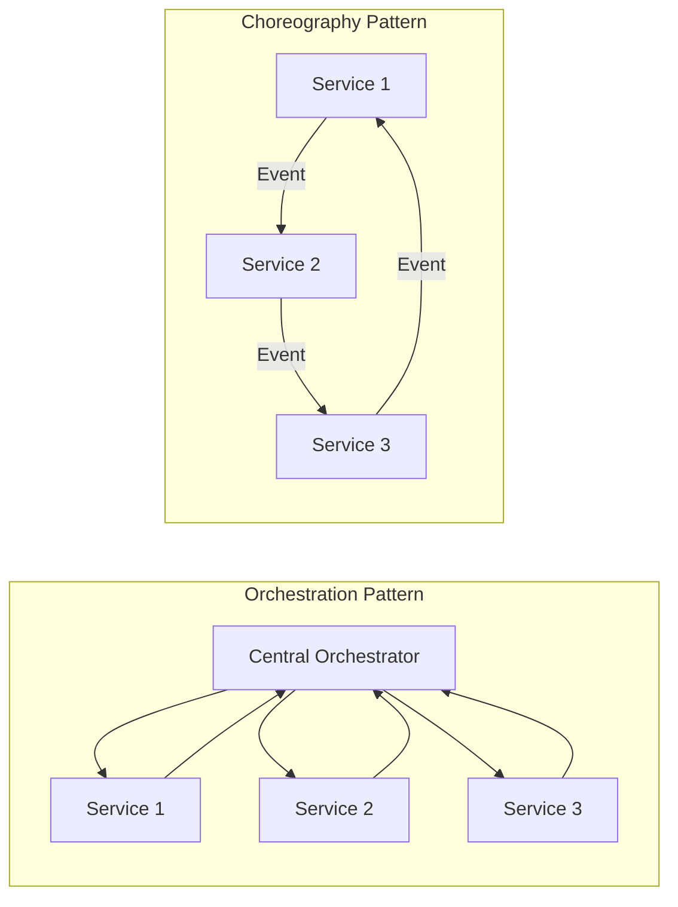

| Aspect | Orchestration | Choreography |
|--------|--------------|--------------|
| **Control** | Central coordinator | Distributed, event-driven |
| **Visibility** | Clear process flow | Emergent behavior |
| **Coupling** | Services coupled to orchestrator | Services loosely coupled |
| **Complexity** | Central complexity, simpler services | Distributed complexity |
| **Error handling** | Centralized compensation | Each service handles own errors |
| **Insurance use** | New business issuance, claims settlement | Real-time event processing, notifications |
| **Recommended for** | Multi-step transactions needing guaranteed consistency | Event-driven, loosely-coupled integrations |

### 7.3 Compensating Transactions

**Compensation registry:**

```yaml
compensation_registry:
  policy_creation:
    forward: "createPolicy"
    compensate: "cancelPolicy"
    idempotent: true
    time_limit: "NONE"  # Can always be compensated
    
  premium_collection:
    forward: "collectPremium"
    compensate: "refundPremium"
    idempotent: true
    time_limit: "72_HOURS"  # After payment settles, different process needed
    
  commission_payment:
    forward: "calculateAndPayCommission"
    compensate: "chargebackCommission"
    idempotent: true
    time_limit: "NONE"
    
  reinsurance_cession:
    forward: "cedeToReinsurer"
    compensate: "cancelCession"
    idempotent: true
    time_limit: "24_HOURS"  # Must cancel before reinsurer processes
    
  document_delivery:
    forward: "deliverDocuments"
    compensate: "sendCancellationNotice"
    idempotent: false  # Cannot un-deliver a document
    time_limit: "NONE"
```

### 7.4 Process Correlation

Process correlation links related process instances and incoming messages to the correct process.

```json
{
  "correlation_config": {
    "correlation_keys": {
      "policy_process": {
        "keys": ["policy_number"],
        "secondary_keys": ["application_number", "customer_id"]
      },
      "claim_process": {
        "keys": ["claim_number"],
        "secondary_keys": ["policy_number", "claimant_id"]
      },
      "exchange_process": {
        "keys": ["exchange_id"],
        "secondary_keys": ["cedent_policy_number", "new_policy_number"]
      }
    },
    "message_correlation": {
      "PREMIUM_RECEIVED": {
        "correlate_by": "policy_number",
        "target_process": "billing_process",
        "target_message": "PaymentReceived"
      },
      "EVIDENCE_RECEIVED": {
        "correlate_by": "application_number",
        "target_process": "underwriting_process",
        "target_message": "EvidenceReceived"
      },
      "CEDENT_RESPONSE": {
        "correlate_by": "exchange_id",
        "target_process": "exchange_process",
        "target_message": "CedentValuesReceived"
      }
    }
  }
}
```

### 7.5 Process Versioning

Running multiple versions of a process simultaneously is common during transitions.

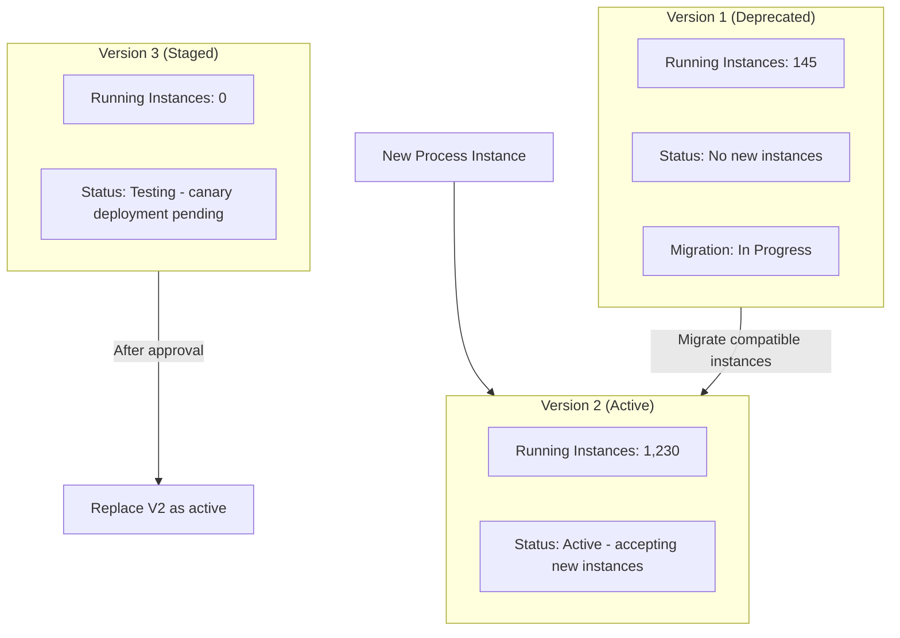

**Version migration strategy:**

```yaml
version_migration:
  from_version: "2.0"
  to_version: "3.0"
  
  migration_rules:
    - condition: "instance.current_activity IN ['START', 'VALIDATE', 'INITIAL_REVIEW']"
      action: "MIGRATE"
      target_activity: "mapped_activity_in_v3"
      
    - condition: "instance.current_activity IN ['UNDERWRITING', 'EVIDENCE_GATHERING']"
      action: "MIGRATE"
      target_activity: "mapped_activity_in_v3"
      data_transformation: "transform_uw_context_v2_to_v3"
      
    - condition: "instance.current_activity IN ['ISSUANCE', 'DELIVERY']"
      action: "COMPLETE_IN_CURRENT_VERSION"
      reason: "Too late in process to safely migrate"
      
    - condition: "instance.has_active_compensation"
      action: "DO_NOT_MIGRATE"
      reason: "Active compensation context incompatible"

  rollback_plan:
    trigger: "error_rate > 5% OR critical_failure"
    action: "HALT_MIGRATION"
    notification: ["process_admin", "development_lead"]
```

### 7.6 Long-Running Process Management

Life insurance processes can span decades (from policy issuance to death claim). This requires special architectural consideration.

| Challenge | Solution |
|-----------|----------|
| Process state persistence | Durable process database with backup and recovery |
| Schema evolution | Process data schema versioning with migration scripts |
| Technology migration | Process state exportable in standard format (BPMN XML) |
| Timer management | Scalable timer service supporting millions of timers (policy anniversaries, grace periods) |
| Resource cleanup | Periodic archival of completed process instances |
| Performance at scale | Partitioning by policy year, product line, or region |

---

## 8. Integration Patterns

### 8.1 Process-to-Service Integration

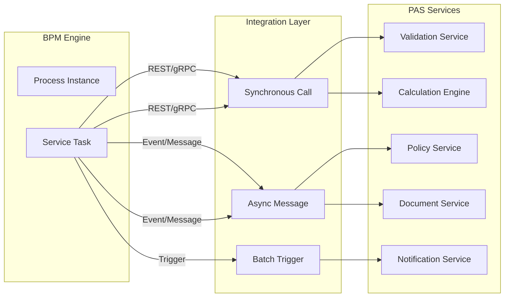

### 8.2 External Task Pattern

The external task pattern decouples the BPM engine from service implementations, allowing services to pull work from the engine.

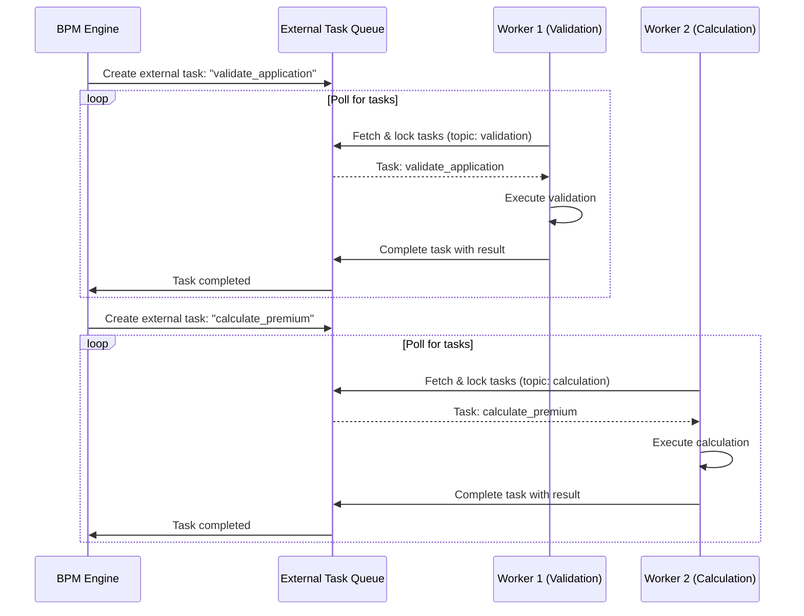

**External task configuration:**

```json
{
  "external_tasks": {
    "validate_application": {
      "topic": "application-validation",
      "lock_duration_ms": 300000,
      "retries": 3,
      "retry_timeout_ms": 60000,
      "priority": 5
    },
    "calculate_premium": {
      "topic": "premium-calculation",
      "lock_duration_ms": 60000,
      "retries": 3,
      "retry_timeout_ms": 30000,
      "priority": 5
    },
    "generate_policy_document": {
      "topic": "document-generation",
      "lock_duration_ms": 600000,
      "retries": 2,
      "retry_timeout_ms": 120000,
      "priority": 3
    },
    "send_notification": {
      "topic": "notifications",
      "lock_duration_ms": 120000,
      "retries": 5,
      "retry_timeout_ms": 30000,
      "priority": 1
    }
  }
}
```

### 8.3 Callback / Webhook Integration

For long-running external operations (e.g., waiting for cedent carrier response in 1035 exchange):

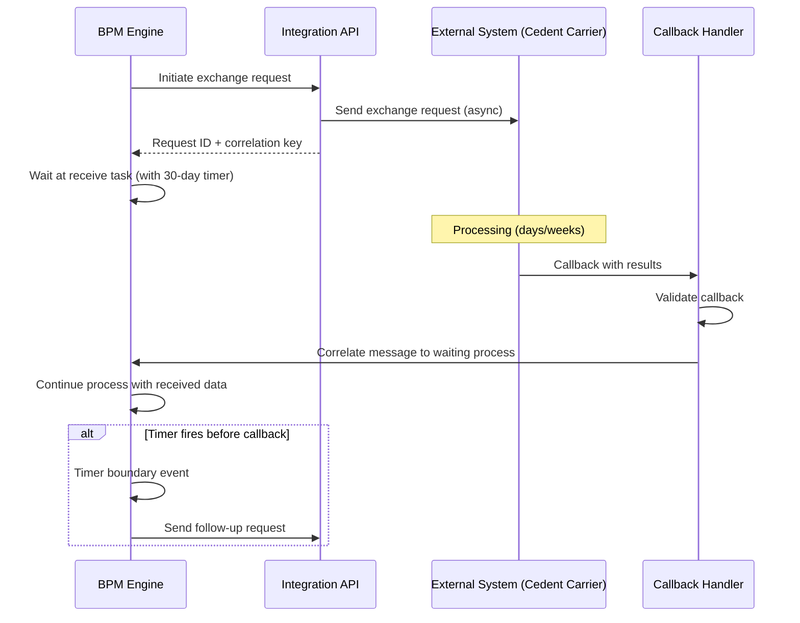

### 8.4 Message Correlation

```yaml
message_definitions:
  - name: "PaymentReceived"
    correlation_key: "policy_number"
    payload_schema:
      policy_number: "string"
      amount: "decimal"
      payment_date: "date"
      payment_method: "string"
      
  - name: "EvidenceReceived"
    correlation_key: "application_number"
    payload_schema:
      application_number: "string"
      evidence_type: "string"
      received_date: "date"
      results: "object"
      
  - name: "CedentResponse"
    correlation_key: "exchange_id"
    payload_schema:
      exchange_id: "string"
      surrender_value: "decimal"
      cost_basis: "decimal"
      response_date: "date"
```

### 8.5 Batch Integration

Many insurance operations are batch-driven:

```yaml
batch_process_triggers:
  daily:
    - name: "Daily Premium Processing"
      schedule: "0 6 * * MON-FRI"  # 6 AM weekdays
      process: "premium_batch_processing"
      input: "pending_premiums_file"
      
    - name: "Daily NAV Processing"
      schedule: "0 18 * * MON-FRI"  # 6 PM weekdays
      process: "nav_update_processing"
      input: "fund_nav_file"
      
    - name: "Daily Disbursement"
      schedule: "0 14 * * MON-FRI"  # 2 PM weekdays
      process: "disbursement_batch"
      input: "approved_disbursements"
      
  monthly:
    - name: "Monthly Billing Cycle"
      schedule: "0 1 1 * *"  # 1 AM on 1st of month
      process: "billing_cycle"
      scope: "all_policies_due_this_month"
      
    - name: "Monthly Cost of Insurance Deduction"
      schedule: "0 2 1 * *"
      process: "coi_deduction"
      scope: "all_ul_vul_iul_policies"
      
    - name: "Monthly Commission Processing"
      schedule: "0 3 15 * *"  # 15th of month
      process: "commission_calculation_and_payment"
      
  annually:
    - name: "Annual Statement Generation"
      schedule: "0 0 15 1 *"  # January 15
      process: "annual_statement_generation"
      scope: "all_in_force_policies"
      
    - name: "1099-R Generation"
      schedule: "0 0 10 1 *"  # January 10
      process: "tax_form_generation"
      scope: "all_taxable_distributions_prior_year"
      
    - name: "RMD Notification"
      schedule: "0 0 1 11 *"  # November 1
      process: "rmd_reminder_generation"
      scope: "qualified_policies_rmd_eligible"
```

---

## 9. Monitoring & Analytics

### 9.1 Process Instance Tracking

Every process instance is tracked from creation to completion:

```json
{
  "process_instance": {
    "instance_id": "PI-2025-001234",
    "process_definition": "new_business_application_v3",
    "process_version": "3.2",
    "business_key": "APP-2025-567890",
    "state": "ACTIVE",
    "start_time": "2025-03-15T09:00:00Z",
    "current_activities": [
      {
        "activity_id": "UNDERWRITING_REVIEW",
        "activity_name": "Underwriter Review",
        "assignee": "jsmith@insurer.com",
        "start_time": "2025-03-17T14:30:00Z",
        "due_time": "2025-03-19T14:30:00Z",
        "sla_status": "ON_TRACK"
      }
    ],
    "completed_activities": [
      {"activity_id": "VALIDATE", "duration_ms": 5200},
      {"activity_id": "IDV", "duration_ms": 3100},
      {"activity_id": "ORDER_EVIDENCE", "duration_ms": 12000},
      {"activity_id": "COLLECT_EVIDENCE", "duration_ms": 345600000}
    ],
    "variables": {
      "application_number": "APP-2025-567890",
      "product": "TERM_20",
      "face_amount": 500000,
      "applicant_age": 35,
      "uw_decision": null,
      "risk_class": null
    },
    "incidents": [],
    "elapsed_time_ms": 432000000
  }
}
```

### 9.2 SLA Dashboards

```yaml
sla_dashboard_metrics:
  real_time:
    - metric: "active_process_instances"
      dimensions: ["process_type", "current_stage"]
      
    - metric: "tasks_approaching_sla"
      threshold: "within_25_percent_of_deadline"
      alert: "YELLOW"
      
    - metric: "tasks_breaching_sla"
      alert: "RED"
      
    - metric: "queue_depth_by_team"
      dimensions: ["team", "task_type"]
      
    - metric: "average_task_wait_time"
      dimensions: ["task_type", "priority"]

  daily:
    - metric: "sla_compliance_rate"
      target: 95
      formula: "tasks_completed_within_sla / total_tasks_completed * 100"
      
    - metric: "average_cycle_time"
      dimensions: ["process_type", "product"]
      
    - metric: "throughput"
      formula: "processes_completed / time_period"
      
    - metric: "first_contact_resolution_rate"
      dimensions: ["transaction_type"]
```

### 9.3 Bottleneck Analysis

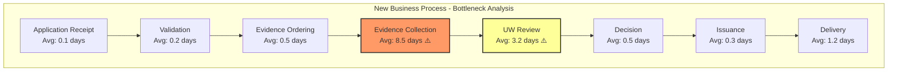

**Bottleneck identification methodology:**

| Metric | Description | Action Threshold |
|--------|-------------|-----------------|
| Activity wait time | Time between task creation and task start | > 2× average |
| Activity processing time | Time between task start and completion | > 1.5× average |
| Queue depth ratio | Items waiting / items being processed | > 3:1 |
| Resource utilization | Time actively working / available time | > 90% |
| Rework rate | Tasks returned for correction / total tasks | > 10% |
| Escalation rate | Tasks escalated / total tasks | > 15% |

### 9.4 Cycle Time Analytics

```
CYCLE TIME BREAKDOWN: New Business Application

                              Avg (days)   Median   P90    P99
Total End-to-End:              14.5         12.0     28.0   45.0
├── Application to Validation:  0.3          0.1      0.5    2.0
├── Validation to Evidence:     0.5          0.3      1.0    3.0
├── Evidence Collection:        8.5          6.0     18.0   30.0
│   ├── Paramedical:           3.0          2.0      5.0    10.0
│   ├── Blood/Urine Results:   5.0          4.0      8.0    15.0
│   ├── APS:                   12.0         10.0     21.0   35.0
│   └── (Parallel execution reduces overall wait)
├── UW Review:                 3.2          2.0      7.0    14.0
│   ├── UW Wait Time:         1.5          1.0      3.0    7.0
│   └── UW Processing Time:   1.7          1.0      4.0    7.0
├── Decision to Issuance:      0.3          0.2      0.5    1.0
├── Issuance:                  0.5          0.3      1.0    2.0
└── Delivery:                  1.2          1.0      2.0    5.0
```

### 9.5 Process Heat Maps

Visualize where time and effort concentrate across the process:

```
PROCESS HEAT MAP: Monthly Activity Distribution

Activity                    | Volume | Avg Time | Total Effort | Heat
─────────────────────────── | ────── | ──────── | ──────────── | ────
New Business Validation     | 5,200  | 15 min   | 1,300 hrs    | ████████░░
Evidence Ordering           | 4,100  | 5 min    | 342 hrs      | ███░░░░░░░
UW Review (Auto)            | 2,800  | 1 min    | 47 hrs       | █░░░░░░░░░
UW Review (Manual)          | 2,400  | 45 min   | 1,800 hrs    | ██████████
Exception Resolution        | 3,500  | 30 min   | 1,750 hrs    | █████████░
Claims Processing           | 800    | 60 min   | 800 hrs      | █████░░░░░
Compliance Review           | 1,200  | 20 min   | 400 hrs      | ████░░░░░░
Financial Processing        | 15,000 | 2 min    | 500 hrs      | ████░░░░░░
Address/Contact Changes     | 8,000  | 1 min    | 133 hrs      | ██░░░░░░░░
```

### 9.6 Operational Efficiency KPIs

| KPI | Definition | Target | Industry Avg |
|-----|-----------|--------|-------------|
| Cycle time (new business) | Application to issue | 10 days | 21 days |
| Cycle time (simple service) | Request to completion | 1 day | 3 days |
| Cycle time (claim) | Notification to settlement | 10 days | 25 days |
| SLA compliance | % completed within SLA | 95% | 80% |
| First-pass yield | % completed without rework | 85% | 70% |
| STP rate (servicing) | % processed without manual touch | 75% | 45% |
| Cost per transaction | Fully loaded cost | $5 | $18 |
| Queue wait time | Average time in queue before assigned | 2 hours | 8 hours |
| Resource utilization | Productive time / available time | 80% | 65% |
| Exception rate | % requiring exception handling | 15% | 30% |

---

## 10. Vendor Landscape

### 10.1 Camunda

| Attribute | Detail |
|-----------|--------|
| **Type** | Open-source core / Commercial platform |
| **Standards** | BPMN 2.0, DMN 1.3, CMMN (v7) |
| **Architecture** | Cloud-native (Camunda 8 with Zeebe), Java-based (Camunda 7) |
| **Strengths** | Developer-friendly, strong open-source community, cloud-native architecture, external task pattern, scalable |
| **Weaknesses** | Less polished business user tooling compared to Pega/Appian; Camunda 8 migration from 7 is substantial |
| **Insurance Fit** | Excellent for microservices-based PAS; strong for orchestration and STP |
| **Pricing** | Open-source (free); Enterprise/cloud subscription ($$) |

### 10.2 IBM Business Automation Workflow (BAW)

| Attribute | Detail |
|-----------|--------|
| **Type** | Commercial |
| **Standards** | BPMN 2.0, BPEL |
| **Architecture** | On-premises, IBM Cloud |
| **Strengths** | Mature enterprise platform, deep integration with IBM stack, case management, content services |
| **Weaknesses** | Expensive, IBM ecosystem dependency, heavier weight |
| **Insurance Fit** | Strong for large carriers with IBM infrastructure; good case management for claims |
| **Pricing** | Enterprise licensing ($$$$) |

### 10.3 Pegasystems

| Attribute | Detail |
|-----------|--------|
| **Type** | Commercial (Low-code platform) |
| **Standards** | Proprietary (BPMN-compatible modeling) |
| **Architecture** | Cloud-native, low-code |
| **Strengths** | Low-code process design, built-in case management, AI-powered decisioning, insurance-specific accelerators |
| **Weaknesses** | Very expensive, platform lock-in, proprietary approach |
| **Insurance Fit** | Excellent — Pega has deep insurance domain expertise and pre-built insurance frameworks |
| **Pricing** | Platform licensing ($$$$$) |

### 10.4 Appian

| Attribute | Detail |
|-----------|--------|
| **Type** | Commercial (Low-code platform) |
| **Standards** | BPMN 2.0 |
| **Architecture** | Cloud-native, low-code |
| **Strengths** | Rapid application development, unified platform (BPM + low-code + RPA), intuitive UI |
| **Weaknesses** | Less deep insurance domain features compared to Pega |
| **Insurance Fit** | Good for carriers wanting rapid process automation with low-code approach |
| **Pricing** | Platform licensing ($$$) |

### 10.5 Flowable

| Attribute | Detail |
|-----------|--------|
| **Type** | Open-source / Commercial |
| **Standards** | BPMN 2.0, DMN, CMMN |
| **Architecture** | Java-based, embeddable, cloud-deployable |
| **Strengths** | Full BPMN/DMN/CMMN support, lightweight, embeddable, good REST API |
| **Weaknesses** | Smaller community than Camunda, less enterprise tooling |
| **Insurance Fit** | Good for embedded process engine within a PAS application |
| **Pricing** | Open-source (free); Enterprise subscription ($$) |

### 10.6 jBPM

| Attribute | Detail |
|-----------|--------|
| **Type** | Open-source (part of Red Hat ecosystem) |
| **Standards** | BPMN 2.0 |
| **Architecture** | Java-based, integrates with Drools, KIE Server |
| **Strengths** | Tight integration with Drools rules engine, part of Red Hat stack |
| **Weaknesses** | Smaller community, being superseded by Kogito |
| **Insurance Fit** | Good for organizations already using Drools for rules |
| **Pricing** | Open-source (free); Red Hat subscription for support |

### 10.7 Vendor Comparison Matrix

| Capability | Camunda | IBM BAW | Pega | Appian | Flowable | jBPM |
|-----------|---------|---------|------|--------|----------|------|
| BPMN 2.0 Support | ★★★★★ | ★★★★ | ★★★★ | ★★★★ | ★★★★★ | ★★★★ |
| CMMN Support | ★★★ (v7) | ★★★★ | ★★★★★ | ★★★ | ★★★★ | ★★★ |
| DMN Support | ★★★★★ | ★★★★ | ★★★ | ★★★ | ★★★★ | ★★★★ |
| Cloud-Native | ★★★★★ | ★★★ | ★★★★ | ★★★★★ | ★★★★ | ★★★ |
| Developer Experience | ★★★★★ | ★★★ | ★★★ | ★★★★ | ★★★★ | ★★★★ |
| Business User Tooling | ★★★ | ★★★★ | ★★★★★ | ★★★★★ | ★★★ | ★★★ |
| Insurance Domain | ★★★ | ★★★★ | ★★★★★ | ★★★ | ★★★ | ★★★ |
| Scalability | ★★★★★ | ★★★★ | ★★★★ | ★★★★ | ★★★★ | ★★★ |
| Cost | ★★★★ | ★★ | ★ | ★★ | ★★★★ | ★★★★★ |

---

## 11. Architecture & Deployment

### 11.1 Process Engine Deployment Architecture

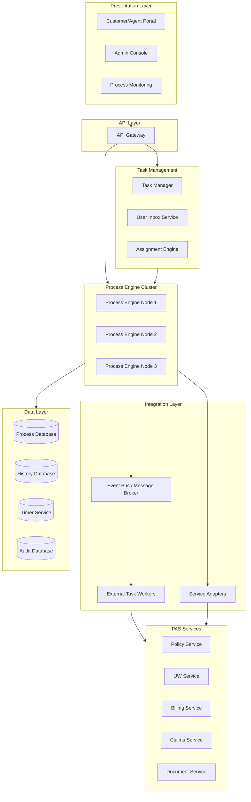

### 11.2 High-Availability Configuration

```yaml
process_engine_ha:
  deployment:
    mode: "ACTIVE_ACTIVE"
    min_replicas: 3
    max_replicas: 12
    
  database:
    type: "PostgreSQL"
    mode: "PRIMARY_REPLICA"
    replicas: 2
    connection_pool:
      min_idle: 10
      max_active: 50
      
  job_executor:
    enabled: true
    max_jobs_per_acquisition: 5
    wait_time_ms: 5000
    max_wait_ms: 60000
    lock_time_ms: 300000
    
  clustering:
    type: "DATABASE_BASED"
    heartbeat_interval_ms: 30000
    
  scaling:
    metric: "ACTIVE_JOBS_PER_NODE"
    target: 100
    scale_up_threshold: 150
    scale_down_threshold: 50
```

---

## 12. Process Database Design

### 12.1 Core Tables

```
PROCESS_DEFINITION
├── definition_id (PK)
├── definition_key (unique business key, e.g., "new_business_v3")
├── name
├── version
├── deployment_id
├── bpmn_xml (BLOB — the BPMN model)
├── status (ACTIVE, SUSPENDED, RETIRED)
├── deployed_at
└── deployed_by

PROCESS_INSTANCE
├── instance_id (PK)
├── definition_id (FK)
├── business_key (e.g., policy number, application number)
├── state (ACTIVE, SUSPENDED, COMPLETED, TERMINATED, FAILED)
├── start_time
├── end_time
├── started_by
├── parent_instance_id (for sub-processes)
├── root_instance_id
├── tenant_id
└── variables (JSONB)

ACTIVITY_INSTANCE
├── activity_instance_id (PK)
├── process_instance_id (FK)
├── activity_id (from BPMN model)
├── activity_name
├── activity_type (USER_TASK, SERVICE_TASK, SUB_PROCESS, etc.)
├── state (ACTIVE, COMPLETED, CANCELLED)
├── assignee
├── start_time
├── end_time
├── duration_ms
├── caller_instance_id (if call activity)
└── tenant_id

TASK
├── task_id (PK)
├── process_instance_id (FK)
├── activity_instance_id (FK)
├── task_definition_key
├── name
├── description
├── assignee
├── candidate_groups (JSON array)
├── candidate_users (JSON array)
├── priority
├── due_date
├── follow_up_date
├── state (CREATED, ASSIGNED, COMPLETED, DELEGATED, CANCELLED)
├── created_at
├── claimed_at
├── completed_at
├── completed_by
├── form_key
├── variables (JSONB)
└── tenant_id

TIMER
├── timer_id (PK)
├── process_instance_id (FK)
├── activity_instance_id (FK)
├── timer_type (DATE, DURATION, CYCLE)
├── timer_expression
├── due_date
├── repeat_count
├── repeat_interval
├── state (ACTIVE, FIRED, CANCELLED)
└── handler_type

EVENT_SUBSCRIPTION
├── subscription_id (PK)
├── process_instance_id (FK)
├── activity_instance_id (FK)
├── event_type (MESSAGE, SIGNAL, CONDITIONAL)
├── event_name
├── correlation_key
├── state (ACTIVE, TRIGGERED, CANCELLED)
└── created_at

PROCESS_VARIABLE
├── variable_id (PK)
├── process_instance_id (FK)
├── name
├── type (STRING, INTEGER, DECIMAL, BOOLEAN, JSON, DATE, BLOB)
├── value_text
├── value_long
├── value_double
├── value_json (JSONB)
├── scope (PROCESS, LOCAL)
└── updated_at

INCIDENT
├── incident_id (PK)
├── process_instance_id (FK)
├── activity_instance_id (FK)
├── incident_type (FAILED_JOB, FAILED_EXTERNAL_TASK, UNRESOLVED_REFERENCE)
├── message
├── stack_trace (TEXT)
├── created_at
├── resolved_at
├── resolved_by
└── cause_incident_id (FK — for chained incidents)

AUDIT_LOG
├── audit_id (PK)
├── process_instance_id (FK)
├── activity_instance_id
├── event_type (PROCESS_START, TASK_ASSIGN, TASK_COMPLETE, VARIABLE_UPDATE, etc.)
├── timestamp
├── user_id
├── details (JSONB)
├── ip_address
└── session_id
```

### 12.2 Indexing Strategy

```sql
-- Critical indexes for process engine performance
CREATE INDEX idx_process_instance_state ON process_instance(state) WHERE state = 'ACTIVE';
CREATE INDEX idx_process_instance_business_key ON process_instance(business_key);
CREATE INDEX idx_process_instance_definition ON process_instance(definition_id, state);

CREATE INDEX idx_task_assignee ON task(assignee) WHERE state IN ('CREATED', 'ASSIGNED');
CREATE INDEX idx_task_candidate_groups ON task USING GIN (candidate_groups);
CREATE INDEX idx_task_due_date ON task(due_date) WHERE state IN ('CREATED', 'ASSIGNED');
CREATE INDEX idx_task_process_instance ON task(process_instance_id);

CREATE INDEX idx_timer_due_date ON timer(due_date) WHERE state = 'ACTIVE';

CREATE INDEX idx_event_subscription ON event_subscription(event_name, correlation_key) WHERE state = 'ACTIVE';

CREATE INDEX idx_audit_process_instance ON audit_log(process_instance_id, timestamp);
CREATE INDEX idx_audit_user ON audit_log(user_id, timestamp);
```

### 12.3 Partitioning Strategy

```sql
-- Partition process_instance by year for performance and archival
CREATE TABLE process_instance (
    instance_id UUID PRIMARY KEY,
    ...
    start_time TIMESTAMP NOT NULL
) PARTITION BY RANGE (start_time);

CREATE TABLE process_instance_2024 PARTITION OF process_instance
    FOR VALUES FROM ('2024-01-01') TO ('2025-01-01');
CREATE TABLE process_instance_2025 PARTITION OF process_instance
    FOR VALUES FROM ('2025-01-01') TO ('2026-01-01');
CREATE TABLE process_instance_2026 PARTITION OF process_instance
    FOR VALUES FROM ('2026-01-01') TO ('2027-01-01');

-- Partition audit_log by month
CREATE TABLE audit_log (
    audit_id UUID PRIMARY KEY,
    ...
    timestamp TIMESTAMP NOT NULL
) PARTITION BY RANGE (timestamp);
```

---

## 13. Process Versioning Strategy

### 13.1 Version Management Policies

```yaml
versioning_policy:
  naming_convention: "{process_key}_v{major}.{minor}"
  
  major_version_triggers:
    - "Structural change to process flow (new/removed activities)"
    - "Change to process interface (different inputs/outputs)"
    - "Change to subprocess contracts"
    - "Regulatory requirement change"
    
  minor_version_triggers:
    - "Task name/description updates"
    - "Timer duration adjustments"
    - "Assignment rule changes"
    - "Form/UI updates"
    - "Variable name changes (non-breaking)"
    
  deployment_rules:
    - "New major versions create new process definition"
    - "Minor versions can be deployed as in-place update (if engine supports)"
    - "Running instances NEVER automatically migrated without explicit command"
    
  coexistence_rules:
    - "Maximum 2 major versions active simultaneously"
    - "Previous version set to 'no new instances' when new version deployed"
    - "Previous version retired when all instances complete (or migrated)"
    - "Retirement grace period: 90 days minimum"
```

### 13.2 Migration Planning

```json
{
  "migration_plan": {
    "source_version": "new_business_v2",
    "target_version": "new_business_v3",
    "created_by": "process_admin",
    "created_at": "2025-03-01",
    
    "activity_mappings": [
      {"source": "validate_application", "target": "validate_application_v2"},
      {"source": "order_evidence", "target": "order_evidence"},
      {"source": "uw_review", "target": "uw_review_enhanced"},
      {"source": "issue_policy", "target": "issue_policy_v2"}
    ],
    
    "variable_transformations": [
      {
        "source_variable": "uw_status",
        "target_variable": "underwriting_status",
        "transformation": "RENAME"
      },
      {
        "source_variable": null,
        "target_variable": "confidence_score",
        "transformation": "ADD",
        "default_value": 0
      }
    ],
    
    "migration_criteria": {
      "eligible_states": ["validate_application", "order_evidence"],
      "ineligible_states": ["uw_review", "issue_policy"],
      "reason": "Instances in UW review or issuance are too far along to safely migrate"
    },
    
    "rollback_plan": {
      "available": true,
      "rollback_window_hours": 48,
      "reverse_mappings": true
    }
  }
}
```

---

## 14. Microservices + BPM Integration

### 14.1 Integration Architecture

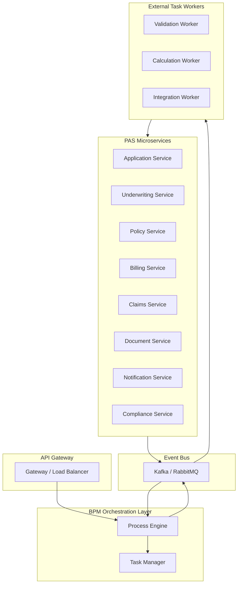

### 14.2 When to Use BPM vs. Direct Service Calls

| Scenario | Use BPM | Use Direct Service Call |
|----------|---------|----------------------|
| Multi-step, long-running process | ✅ | ❌ |
| Human tasks involved | ✅ | ❌ |
| Process visibility needed | ✅ | ❌ |
| Simple request/response | ❌ | ✅ |
| Sub-second latency required | ❌ | ✅ |
| Compensation/rollback needed | ✅ | Depends |
| Regulatory audit trail | ✅ | ❌ |
| Process changes frequently | ✅ | ❌ |
| High-volume, simple operations | ❌ | ✅ |

### 14.3 Anti-Patterns

| Anti-Pattern | Problem | Recommendation |
|-------------|---------|----------------|
| Over-orchestration | Every service call goes through BPM | Use BPM only for processes that benefit from visibility and management |
| Monolithic process | Single massive process definition | Break into sub-processes with clear interfaces |
| Synchronous everything | Process waits for every service call | Use async messaging for non-blocking operations |
| Process as database | Storing excessive data in process variables | Store data in domain services; reference by ID |
| Ignoring compensation | No rollback plan when steps fail | Define compensation for every state-changing step |
| God process | One process handles everything | Decompose by business capability |

---

## 15. Process Mining for Insurance

### 15.1 What Is Process Mining?

Process mining uses event log data from actual system executions to discover, monitor, and improve real processes. Unlike traditional BPM modeling (which describes how processes *should* work), process mining reveals how processes *actually* work.

### 15.2 Process Mining Techniques

| Technique | Purpose | Insurance Application |
|-----------|---------|----------------------|
| **Discovery** | Automatically generate process model from event logs | Discover actual new business process flow including undocumented shortcuts and workarounds |
| **Conformance** | Compare actual execution against designed model | Identify deviations from approved UW process |
| **Enhancement** | Enrich existing model with performance data | Add cycle time, resource utilization, bottleneck data to process model |
| **Predictive** | Predict future process behavior | Predict which applications will lapse during UW, which claims will be contested |

### 15.3 Event Log Structure for Insurance

```json
{
  "event_log_entry": {
    "case_id": "APP-2025-567890",
    "activity": "UW_REVIEW",
    "timestamp": "2025-03-17T14:30:00Z",
    "lifecycle": "COMPLETE",
    "resource": "jsmith@insurer.com",
    "attributes": {
      "product": "TERM_20",
      "face_amount": 500000,
      "risk_class_assigned": "PREFERRED",
      "decision": "APPROVE",
      "duration_minutes": 35,
      "queue_wait_minutes": 120,
      "state": "IL",
      "channel": "AGENT_PORTAL"
    }
  }
}
```

### 15.4 Process Mining Insights for Insurance

| Insight | Discovery Method | Business Value |
|---------|-----------------|----------------|
| Rework loops | Conformance checking | Identify why 15% of UW cases are returned for additional evidence |
| Process variants | Variant analysis | Discover that NY replacement cases take 3× longer due to Reg 60 |
| Resource bottlenecks | Performance analysis | Identify that 2 senior UWs handle 60% of all complex cases |
| Happy path percentage | Path analysis | Only 35% of new business follows the "ideal" path |
| Automation candidates | Frequency × simplicity analysis | Identify that 40% of exception tasks are resolved with the same 5 actions |
| SLA prediction | Predictive analysis | At current step, 80% chance this case will miss its SLA |

---

## 16. Appendix

### 16.1 Glossary

| Term | Definition |
|------|-----------|
| BPMN | Business Process Model and Notation — OMG standard for process modeling |
| CMMN | Case Management Model and Notation — OMG standard for case management |
| DMN | Decision Model and Notation — OMG standard for decision modeling |
| BPM | Business Process Management — discipline of managing organizational processes |
| BPMS | Business Process Management Suite/System — software platform for BPM |
| Saga | Pattern for managing distributed transactions via compensating actions |
| Orchestration | Central coordinator directs service interactions |
| Choreography | Services interact through events without central coordinator |
| External Task | Pattern where workers pull tasks from the process engine |
| Process Mining | Technique using event logs to discover and analyze actual processes |
| SLA | Service Level Agreement — committed response/completion times |
| KPI | Key Performance Indicator — measurable value demonstrating effectiveness |

### 16.2 BPMN Quick Reference

```
EVENTS:
  ○  None Start          ◎  None End
  ✉○ Message Start       ✉◎ Message End
  ⏲○ Timer Start         ✕◎ Terminate End
  △○ Signal Start        △◎ Signal End
  ⚡◎ Error End
  
ACTIVITIES:
  ┌──────┐  User Task (person icon)
  │      │  Service Task (gear icon)
  │      │  Script Task (scroll icon)
  └──────┘  Business Rule Task (table icon)
  
  ┌──────┐
  │ [+]  │  Sub-Process (+ icon)
  └──────┘
  
GATEWAYS:
  ◇   Exclusive (XOR) — one path
  ◇○  Inclusive (OR) — one or more paths
  ◇+  Parallel (AND) — all paths
  ◇⬠  Event-Based — wait for event
  ◇*  Complex — custom logic
  
CONNECTING:
  ──→  Sequence Flow
  - -→ Message Flow
  ···→ Association
```

### 16.3 Process Design Checklist

```
□ Process has clearly defined start and end events
□ All paths lead to an end event (no dead ends)
□ Exception paths are modeled explicitly
□ Timer events handle timeout scenarios
□ Compensation is defined for all state-changing activities
□ Human tasks have clear assignment criteria
□ SLAs are defined for all human tasks
□ Escalation paths are modeled for SLA breaches
□ Process variables are documented
□ Subprocess interfaces are clearly defined
□ Integration points are documented
□ Regulatory compliance checkpoints are included
□ Audit logging covers all decision points
□ Process has been load-tested at expected volumes
□ Monitoring dashboards are configured
□ Process documentation is complete and current
```

### 16.4 References

1. OMG BPMN 2.0 Specification
2. OMG CMMN 1.1 Specification
3. OMG DMN 1.4 Specification
4. "Fundamentals of Business Process Management" — Dumas, La Rosa, Mendling, Reijers
5. Camunda Best Practices — https://camunda.com/best-practices/
6. "Process Mining: Data Science in Action" — Wil van der Aalst
7. LIMRA: "Process Automation in Life Insurance Operations"
8. Gartner: "Magic Quadrant for Intelligent Business Process Management Suites"
9. Forrester: "The Forrester Wave: Digital Process Automation Software"
10. McKinsey: "The Future of Insurance Operations"

---

*This article is part of the Life Insurance PAS Architect's Encyclopedia. For related topics, see Article 18 (Straight-Through Processing), Article 19 (Business Rules Engines), and Article 21 (Correspondence & Document Management).*
