# Article 21: Correspondence & Document Management

## Table of Contents

1. [Introduction & Strategic Context](#1-introduction--strategic-context)
2. [Insurance Correspondence Categories](#2-insurance-correspondence-categories)
3. [Document Composition](#3-document-composition)
4. [Template Management](#4-template-management)
5. [Customer Communications Management (CCM)](#5-customer-communications-management-ccm)
6. [Document Management System (DMS)](#6-document-management-system-dms)
7. [Regulatory Compliance](#7-regulatory-compliance)
8. [E-Delivery](#8-e-delivery)
9. [Content Management](#9-content-management)
10. [Architecture](#10-architecture)
11. [Data Model for Correspondence Tracking](#11-data-model-for-correspondence-tracking)
12. [Integration Patterns](#12-integration-patterns)
13. [Vendor Landscape](#13-vendor-landscape)
14. [Document Lifecycle Management](#14-document-lifecycle-management)
15. [Performance & Scalability](#15-performance--scalability)
16. [Appendix](#16-appendix)

---

## 1. Introduction & Strategic Context

### 1.1 The Role of Documents in Life Insurance

Life insurance is fundamentally a document-centric business. A single policy can generate hundreds of documents over its lifetime — from the initial application through claims settlement. These documents serve as legal contracts, regulatory evidence, financial records, and customer communication touchpoints.

The scale is staggering:

| Document Category | Volume (per 1M policies/year) | Criticality |
|------------------|------------------------------|-------------|
| Policy contracts and endorsements | 100K–300K | Legal contract |
| Annual statements | 1M | Regulatory + customer |
| Premium notices / billing statements | 4M–12M | Financial |
| Tax forms (1099-R, 5498) | 200K–500K | Federal/state tax compliance |
| Regulatory notices (privacy, annual report) | 1M–3M | State regulatory mandate |
| Transaction confirmations | 2M–5M | Customer service |
| Claims correspondence | 50K–200K | Legal + customer |
| Marketing/retention | 500K–2M | Business development |
| **Total annual documents** | **9M–24M** | |

### 1.2 Business Drivers for Modern Document Management

| Driver | Impact |
|--------|--------|
| **Cost reduction** | Print + postage costs $0.75–$2.00 per document; e-delivery costs $0.02–$0.10 |
| **Speed** | Physical mail takes 3–7 days; e-delivery is instant |
| **Compliance** | Regulators require proof of timely notice delivery |
| **Customer experience** | Customers expect digital, self-service, omni-channel |
| **Risk mitigation** | Missing or incorrect documents create legal liability |
| **Operational efficiency** | Automated document generation eliminates manual labor |
| **Environmental** | Paper reduction supports ESG initiatives |

### 1.3 Document Management Challenges in Insurance

| Challenge | Description |
|-----------|-------------|
| **Regulatory complexity** | 50+ state jurisdictions, each with specific notice requirements, timelines, and language |
| **Template proliferation** | Thousands of templates (product × state × language × channel combinations) |
| **Long retention** | Documents must be retained 7+ years (some indefinitely for legal records) |
| **Multi-channel output** | Same content must render across print, email, web, mobile, SMS |
| **Variable data** | Every document is personalized with policy/customer-specific data |
| **Version control** | Templates change regularly; must track which version was sent to whom |
| **Compliance proof** | Must prove when documents were generated, sent, delivered, and viewed |
| **Legacy migration** | Decades of scanned paper documents with inconsistent indexing |

---

## 2. Insurance Correspondence Categories

### 2.1 Policy Documents

These are the core legal documents that define the insurance contract.

| Document | When Generated | Legal Status | Retention |
|----------|---------------|-------------|-----------|
| **Policy Contract** | At issuance | Legal contract | Life of policy + 7 years |
| **Schedule Page / Specifications** | At issuance, on change | Part of contract | Life of policy + 7 years |
| **Rider/Endorsement Pages** | At issuance, on addition | Part of contract | Life of policy + 7 years |
| **Ownership/Assignment Endorsement** | On ownership change | Amendment to contract | Life of policy + 7 years |
| **Beneficiary Endorsement** | On beneficiary change | Amendment to contract | Life of policy + 7 years |
| **Conversion Endorsement** | On term-to-perm conversion | Amendment to contract | Life of policy + 7 years |
| **Illustration** | At point of sale, on request | Sales document (not contract) | 7 years minimum |
| **Certificate of Insurance** | For group/employer certificates | Evidence of coverage | Life of certificate + 7 years |

### 2.2 Regulatory Notices

State and federal regulations mandate specific notices at specific times.

| Notice | Trigger | Regulatory Basis | Timing |
|--------|---------|-----------------|--------|
| **Free-Look Notice** | Policy delivery | State insurance law | At delivery; customer has 10–30 days to return |
| **Annual Privacy Notice** | Policy anniversary (annual) | Gramm-Leach-Bliley Act | Annually (or opt-out if no sharing changes) |
| **Annual Report / Statement** | Calendar year end | State requirements | By March 1 (varies by state) |
| **Premium Due Notice** | Premium billing cycle | State insurance law | 30–45 days before due date |
| **Grace Period Notice** | Premium not received by due date | Contract + state law | At start of grace period |
| **Lapse Warning Notice** | Approaching end of grace period | State insurance law | Before policy lapses (varies: 10–30 days) |
| **Lapse Notice** | Policy lapsed | State insurance law | Promptly after lapse |
| **Reinstatement Notice** | Policy lapsed (reinstatement rights) | State insurance law | With lapse notice |
| **Conversion Notice** | Approaching conversion deadline | Contract provision | 30–90 days before conversion deadline |
| **Maturity Notice** | Policy approaching maturity/endowment | Contract provision | 30–60 days before maturity |
| **RMD Notice** | Owner reaching RMD age (qualified) | IRC §401(a)(9), SECURE Act | By October 1 of year turning RMD age |
| **Cost Basis Information** | On request or on distribution | IRS requirements | Timely |
| **Non-Forfeiture Notice** | At risk of lapse | State insurance law | With premium notice |
| **Adverse UW Decision Notice** | Application declined or rated | Fair Credit Reporting Act, state law | Within 30 days of decision |

### 2.3 Financial Documents

| Document | When Generated | Recipient | Regulatory Deadline |
|----------|---------------|-----------|-------------------|
| **Annual Statement** | Calendar year end | Policy owner | By March 1 |
| **1099-R** | Taxable distribution occurred | IRS + recipient | By January 31 |
| **5498** | IRA contributions | IRS + participant | By May 31 |
| **1099-INT** | Interest credited on policy proceeds | IRS + recipient | By January 31 |
| **1099-LTC** | Long-term care benefits paid | IRS + recipient | By January 31 |
| **Confirmation Statement** | Each financial transaction | Policy owner | Within 3 business days |
| **Premium Receipt** | Premium payment received | Payer | Promptly |
| **Surrender Value Statement** | On request or annually | Policy owner | Within 10 business days of request |
| **Loan Interest Statement** | Annually for policies with loans | Policy owner | By January 31 |

### 2.4 Transactional Correspondence

| Document | Trigger Event | Content |
|----------|--------------|---------|
| **Application Acknowledgment** | Application received | Confirmation of receipt, expected timeline, next steps |
| **Underwriting Status Update** | UW milestone reached | Status update, outstanding requirements |
| **Policy Issuance Welcome Kit** | Policy issued | Contract, schedule, welcome letter, privacy notice, buyer's guide |
| **Change Confirmation** | Servicing change processed | Confirmation of change details, effective date |
| **Beneficiary Change Confirmation** | Beneficiary updated | New beneficiary listing, effective date |
| **Address Change Confirmation** | Address updated | New address confirmed |
| **Fund Transfer Confirmation** | Fund transfer processed | Fund allocation before/after, effective date |
| **Withdrawal/Surrender Confirmation** | Withdrawal/surrender processed | Amount, tax details, remaining values |
| **Loan Confirmation** | Policy loan processed | Loan amount, interest rate, repayment terms |
| **Claim Acknowledgment** | Death claim filed | Confirmation of receipt, required documents, timeline |
| **Claim Settlement Letter** | Claim approved | Payment amount, settlement options, tax implications |
| **Claim Denial Letter** | Claim denied | Denial reason, appeal rights, regulatory information |

### 2.5 Marketing & Retention

| Document | Trigger | Purpose |
|----------|---------|---------|
| **Cross-Sell Letter** | Life event, policy anniversary | Offer additional coverage based on customer profile |
| **Retention Offer** | Surrender/lapse request pending | Conservation offer with incentives to retain policy |
| **Renewal Notice** | Term renewal period approaching | Renewal terms, conversion options, premium changes |
| **Birthday Letter** | Owner/insured birthday | Goodwill touchpoint, potential review trigger |
| **Agent Introduction** | Agent of record change | Introduce new servicing agent |
| **Product Update** | Product enhancement or dividend declaration | Notify of beneficial product changes |

---

## 3. Document Composition

### 3.1 Template-Based Generation

Document composition is the process of merging a template (the structure and static content) with variable data (policy-specific, customer-specific information) to produce a personalized document.

```mermaid
flowchart LR
    subgraph Inputs["Inputs"]
        T[Template]
        D[Variable Data]
        R[Business Rules]
        A[Assets: Logos, Signatures]
    end
    
    subgraph Engine["Composition Engine"]
        MERGE[Data Merge]
        COND[Conditional Logic]
        CALC[Calculations]
        FORMAT[Formatting]
        LAYOUT[Page Layout]
    end
    
    subgraph Output["Outputs"]
        PDF[PDF Document]
        HTML[HTML Email]
        PRINT[Print Stream]
        SMS_OUT[SMS Text]
    end
    
    Inputs --> Engine
    Engine --> Output
```

### 3.2 Variable Data Insertion

Variable data fields are placeholders in templates that are replaced with actual values at generation time.

**Variable data categories:**

| Category | Examples | Source System |
|----------|----------|---------------|
| **Policy data** | Policy number, issue date, face amount, product name, plan code | PAS |
| **Owner data** | Name, address, SSN/TIN, date of birth, phone, email | PAS / CRM |
| **Insured data** | Name, date of birth, gender, risk class, tobacco status | PAS |
| **Agent data** | Agent name, agency, phone, email, license number | Agent management system |
| **Beneficiary data** | Beneficiary names, relationships, percentages, types | PAS |
| **Financial data** | Account value, cash surrender value, death benefit, loan balance, premium | PAS / Financial engine |
| **Tax data** | Cost basis, taxable gain, withholding amounts, distribution codes | Tax engine |
| **Calculated data** | Age, policy duration, anniversary date, next premium due | Calculated at composition time |
| **Date data** | Current date, effective date, expiration date, deadline dates | System / Business rules |
| **Regulatory data** | State-specific disclosures, required language, notice timelines | Compliance database |

**Variable data markup example:**

```xml
<document template="ANNUAL_STATEMENT_2025">
  <section id="header">
    <field name="policy_number" format="mask:XXX-XXXX-{{last4}}" />
    <field name="owner_name" format="title_case" />
    <field name="statement_date" format="MMMM dd, yyyy" />
  </section>
  
  <section id="values_table">
    <field name="beginning_account_value" format="currency" />
    <field name="premiums_paid" format="currency" />
    <field name="cost_of_insurance" format="currency" />
    <field name="admin_charges" format="currency" />
    <field name="rider_charges" format="currency" />
    <field name="interest_credited" format="currency" />
    <field name="withdrawals" format="currency" />
    <field name="ending_account_value" format="currency" />
    <field name="cash_surrender_value" format="currency" />
    <field name="death_benefit" format="currency" />
    <field name="outstanding_loan" format="currency" />
    <field name="loan_interest_rate" format="percentage:2" />
  </section>
  
  <section id="fund_allocation" repeating="true" data="fund_positions">
    <field name="fund_name" />
    <field name="units" format="decimal:4" />
    <field name="unit_value" format="currency:4" />
    <field name="fund_value" format="currency" />
    <field name="percentage_of_total" format="percentage:1" />
  </section>
</document>
```

### 3.3 Conditional Content

Insurance documents frequently require conditional sections based on product type, state, policy status, or other factors.

```yaml
conditional_content_rules:
  annual_statement:
    - condition: "product.type = 'VUL'"
      include_sections: ["fund_allocation", "fund_performance", "prospectus_reference"]
      
    - condition: "product.type = 'IUL'"
      include_sections: ["index_account_summary", "cap_rates", "floor_rates"]
      
    - condition: "product.type = 'WHOLE_LIFE'"
      include_sections: ["dividend_summary", "paid_up_additions", "csv_schedule"]
      
    - condition: "policy.has_loan = true"
      include_sections: ["loan_summary", "loan_interest_due", "loan_impact_warning"]
      
    - condition: "policy.state = 'NY'"
      include_sections: ["ny_specific_disclosure", "ny_consumer_rights"]
      
    - condition: "policy.state = 'CA'"
      include_sections: ["ca_privacy_disclosure"]
      
    - condition: "owner.age >= 65"
      include_sections: ["senior_resources", "senior_contact_information"]
      
    - condition: "policy.in_grace_period = true"
      include_sections: ["grace_period_warning", "payment_instructions"]
      
    - condition: "policy.approaching_lapse = true"
      include_sections: ["lapse_warning", "non_forfeiture_options", "reinstatement_rights"]
```

### 3.4 Dynamic Tables

Dynamic tables are populated from arrays of data — e.g., fund allocation tables, beneficiary listings, transaction history.

```json
{
  "dynamic_table_definition": {
    "table_id": "fund_allocation",
    "title": "Investment Fund Allocation",
    "data_source": "policy.fund_positions",
    "columns": [
      {"id": "fund_name", "header": "Fund Name", "width": "40%", "align": "left"},
      {"id": "units", "header": "Units", "width": "15%", "align": "right", "format": "#,##0.0000"},
      {"id": "unit_value", "header": "Unit Value", "width": "15%", "align": "right", "format": "$#,##0.0000"},
      {"id": "fund_value", "header": "Value", "width": "15%", "align": "right", "format": "$#,##0.00"},
      {"id": "pct", "header": "% of Total", "width": "15%", "align": "right", "format": "#0.0%"}
    ],
    "footer": {
      "type": "SUMMARY_ROW",
      "cells": [
        {"text": "Total", "bold": true},
        {"text": ""},
        {"text": ""},
        {"field": "total_account_value", "format": "$#,##0.00", "bold": true},
        {"text": "100.0%", "bold": true}
      ]
    },
    "sort_by": "fund_value",
    "sort_order": "DESC",
    "max_rows": 30,
    "overflow_behavior": "CONTINUATION_PAGE"
  }
}
```

### 3.5 Calculated Values

Some document fields require calculations at composition time:

```
CALCULATED FIELDS:
  policy_duration_years = YEARS_BETWEEN(policy.issue_date, CURRENT_DATE)
  owner_current_age = YEARS_BETWEEN(owner.date_of_birth, CURRENT_DATE)
  insured_current_age = YEARS_BETWEEN(insured.date_of_birth, CURRENT_DATE)
  next_premium_due_date = NEXT_OCCURRENCE(policy.billing_schedule)
  days_until_lapse = DAYS_BETWEEN(CURRENT_DATE, policy.grace_period_end)
  total_premiums_paid = SUM(policy.premium_history.amount)
  gain_loss = policy.account_value - policy.cost_basis
  gain_loss_percentage = (policy.account_value - policy.cost_basis) / policy.cost_basis * 100
  net_death_benefit = policy.death_benefit - policy.outstanding_loan
  conversion_deadline = policy.issue_date + product.conversion_period_years YEARS
  days_until_conversion_deadline = DAYS_BETWEEN(CURRENT_DATE, conversion_deadline)
  free_withdrawal_amount = MAX(0, product.free_withdrawal_pct * policy.account_value - policy.ytd_withdrawals)
  rmd_amount = policy.prior_year_end_value / LOOKUP(uniform_lifetime_table, owner_current_age)
```

### 3.6 Barcode / QR Code Insertion

Documents include machine-readable codes for automated processing:

| Code Type | Use | Content |
|-----------|-----|---------|
| **Barcode (Code 128)** | Return mail processing | Policy number + document type code |
| **OMR Marks** | Optical mark recognition for mail sorting | Fold marks, mail sort codes |
| **QR Code** | Link to digital portal | URL to policy portal with pre-authenticated session token (time-limited) |
| **Intelligent Mail Barcode** | USPS mail tracking | Routing info for postal delivery tracking |
| **Data Matrix** | High-density data encoding | Encrypted policy identifier for document authentication |

---

## 4. Template Management

### 4.1 Template Lifecycle

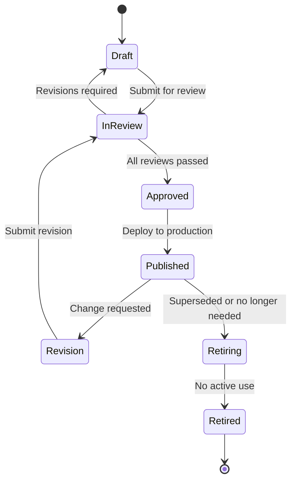

### 4.2 Template Version Control

```json
{
  "template_metadata": {
    "template_id": "TPL-ANNUAL-STMT-UL",
    "template_name": "Annual Statement — Universal Life",
    "product_types": ["UL", "CURR_ASSUMP_UL", "GUL"],
    "document_type": "ANNUAL_STATEMENT",
    "current_version": "2025.1",
    "versions": [
      {
        "version": "2023.1",
        "status": "RETIRED",
        "effective_date": "2023-01-01",
        "retirement_date": "2024-01-31",
        "used_for_statements": "2022 tax year"
      },
      {
        "version": "2024.1",
        "status": "RETIRED",
        "effective_date": "2024-01-01",
        "retirement_date": "2025-01-31",
        "used_for_statements": "2023 tax year",
        "changes": "Updated for SECURE Act 2.0 RMD changes"
      },
      {
        "version": "2025.1",
        "status": "PUBLISHED",
        "effective_date": "2025-01-01",
        "changes": "Added IUL index account section, updated privacy language for CA",
        "state_variants": {
          "NY": "TPL-ANNUAL-STMT-UL-NY-2025.1",
          "CA": "TPL-ANNUAL-STMT-UL-CA-2025.1"
        },
        "language_variants": {
          "en": "TPL-ANNUAL-STMT-UL-EN-2025.1",
          "es": "TPL-ANNUAL-STMT-UL-ES-2025.1"
        },
        "reviewed_by": "Legal Department",
        "reviewed_date": "2024-11-15",
        "approved_by": "Compliance Committee",
        "approved_date": "2024-12-01"
      }
    ]
  }
}
```

### 4.3 State-Specific Variants

State-specific variants are the most challenging aspect of template management. A single document type can have 50+ variants.

**State variant management strategies:**

| Strategy | Description | Pros | Cons |
|----------|-------------|------|------|
| **Separate templates per state** | Full copy of template for each state | Complete state control | Maintenance nightmare; changes require 50+ updates |
| **Base + overlay** | Base template with state-specific overlays | Base changes propagate automatically | Overlay logic can become complex |
| **Conditional sections** | Single template with conditional state blocks | Single template to maintain | Template becomes very complex |
| **Component assembly** | Modular sections assembled per state rules | Highly reusable components | Complex assembly logic |

**Recommended: Component assembly with conditional logic**

```yaml
template_assembly:
  annual_statement:
    base_components:
      - header_with_logo
      - policy_summary_section
      - values_table
      - transaction_summary
      - footer_with_contact
    
    conditional_components:
      - component: fund_allocation_table
        condition: "product.type IN ('VUL', 'VA')"
      - component: index_account_summary
        condition: "product.type = 'IUL'"
      - component: dividend_summary
        condition: "product.type = 'WL' AND policy.dividend_option IS NOT NULL"
      - component: loan_summary
        condition: "policy.outstanding_loan > 0"
    
    state_specific_components:
      NY:
        - ny_regulation_disclosure
        - ny_consumer_assistance_info
      CA:
        - ca_privacy_rights_notice
        - ca_earthquake_authority_notice  # if applicable
      TX:
        - tx_consumer_bill_of_rights
      FL:
        - fl_consumer_protection_notice

    language_components:
      es:
        replace_all_text: true
        translation_source: "TPL-ANNUAL-STMT-ES"
        fallback: "en"
```

### 4.4 Template Testing / Preview

```json
{
  "template_test_suite": {
    "template_id": "TPL-ANNUAL-STMT-UL-2025.1",
    "test_cases": [
      {
        "test_id": "TC-001",
        "description": "Standard UL policy, NY, English",
        "test_data": {
          "policy_number": "UL-TEST-001",
          "product": "UL",
          "state": "NY",
          "language": "en",
          "owner_name": "John Q. Testowner",
          "account_value": 125000.00,
          "death_benefit": 500000.00,
          "outstanding_loan": 0,
          "fund_positions": []
        },
        "expected_sections": ["header", "values_table", "ny_disclosure", "footer"],
        "unexpected_sections": ["fund_allocation", "loan_summary"],
        "visual_review_required": true
      },
      {
        "test_id": "TC-002",
        "description": "VUL policy with funds, CA, Spanish",
        "test_data": {
          "policy_number": "VUL-TEST-002",
          "product": "VUL",
          "state": "CA",
          "language": "es",
          "owner_name": "Maria Garcia",
          "account_value": 250000.00,
          "fund_positions": [
            {"fund_name": "Growth Fund", "units": 1500.0000, "unit_value": 85.5000, "fund_value": 128250.00},
            {"fund_name": "Bond Fund", "units": 2000.0000, "unit_value": 60.8750, "fund_value": 121750.00}
          ]
        },
        "expected_sections": ["header", "values_table", "fund_allocation", "ca_privacy", "footer"],
        "expected_language": "es"
      },
      {
        "test_id": "TC-003",
        "description": "Policy with loan and approaching lapse",
        "test_data": {
          "policy_number": "UL-TEST-003",
          "product": "UL",
          "state": "IL",
          "outstanding_loan": 45000.00,
          "account_value": 52000.00,
          "approaching_lapse": true
        },
        "expected_sections": ["loan_summary", "lapse_warning", "non_forfeiture_options"]
      }
    ]
  }
}
```

---

## 5. Customer Communications Management (CCM)

### 5.1 Multi-Channel Output

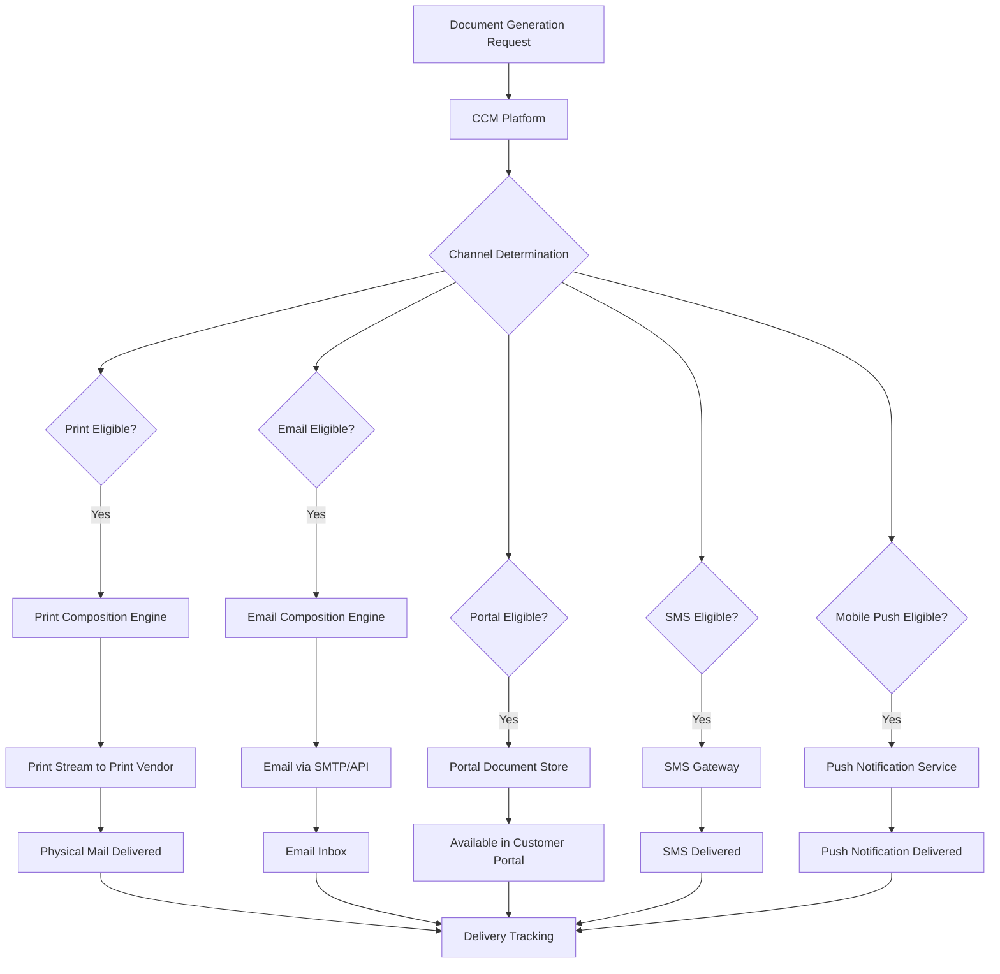

### 5.2 Channel Preference Management

```json
{
  "channel_preferences": {
    "policy_number": "UL-123456789",
    "owner_id": "OWN-987654",
    "preferences": {
      "policy_documents": {
        "preferred_channel": "E_DELIVERY",
        "fallback_channel": "PRINT_MAIL",
        "consent_date": "2024-05-15",
        "consent_method": "WEB_PORTAL",
        "email_address": "john.doe@email.com"
      },
      "financial_statements": {
        "preferred_channel": "E_DELIVERY",
        "fallback_channel": "PRINT_MAIL",
        "consent_date": "2024-05-15"
      },
      "tax_documents": {
        "preferred_channel": "PRINT_MAIL",
        "note": "Owner prefers paper for tax documents"
      },
      "regulatory_notices": {
        "preferred_channel": "E_DELIVERY",
        "regulatory_override": {
          "certified_mail_required": ["LAPSE_NOTICE", "CANCELLATION_NOTICE"],
          "states_requiring_mail": ["NY_REG_60_NOTICES"]
        }
      },
      "transaction_confirmations": {
        "preferred_channel": "EMAIL",
        "secondary_channel": "PORTAL",
        "sms_notification": true
      },
      "marketing": {
        "preferred_channel": "EMAIL",
        "opt_out": false,
        "frequency_cap": "MONTHLY"
      }
    },
    "global_settings": {
      "language": "en",
      "accessibility": "STANDARD",
      "large_print": false,
      "braille": false
    }
  }
}
```

### 5.3 Communication Consent Tracking

```yaml
consent_tracking:
  consent_types:
    - type: "E_DELIVERY"
      description: "Electronic delivery of policy documents"
      legal_basis: "UETA / E-SIGN Act"
      requires:
        - "Affirmative consent"
        - "Disclosure of hardware/software requirements"
        - "Right to withdraw consent"
        - "Right to paper copy upon request"
      consent_record:
        consent_date: "2024-05-15"
        consent_method: "WEB_PORTAL_CLICK_THROUGH"
        ip_address: "192.168.1.100"
        user_agent: "Mozilla/5.0..."
        consent_text_version: "EDEL-CONSENT-V3"
        
    - type: "MARKETING_EMAIL"
      description: "Marketing communications via email"
      legal_basis: "CAN-SPAM Act"
      requires:
        - "Opt-in or existing business relationship"
        - "Easy opt-out mechanism"
        - "Physical mailing address in email"
      
    - type: "SMS_NOTIFICATIONS"
      description: "SMS/text message notifications"
      legal_basis: "TCPA"
      requires:
        - "Express written consent"
        - "Clear disclosure of message frequency"
        - "STOP mechanism"
        
    - type: "PHONE_CONTACT"
      description: "Telephone contact for marketing"
      legal_basis: "TCPA / Do Not Call Registry"
      requires:
        - "Express consent or existing business relationship"
        - "DNC registry check"
```

### 5.4 Delivery Confirmation & Tracking

```json
{
  "delivery_tracking": {
    "communication_id": "COMM-2025-001234",
    "document_type": "ANNUAL_STATEMENT",
    "policy_number": "UL-123456789",
    "generated_at": "2025-02-15T08:00:00Z",
    "channels": [
      {
        "channel": "EMAIL",
        "status": "DELIVERED",
        "sent_at": "2025-02-15T08:05:00Z",
        "delivered_at": "2025-02-15T08:06:12Z",
        "opened_at": "2025-02-15T14:22:00Z",
        "recipient": "john.doe@email.com",
        "delivery_receipt": true,
        "read_receipt": true,
        "link_clicked": true,
        "link_clicked_at": "2025-02-15T14:23:15Z"
      },
      {
        "channel": "PORTAL",
        "status": "AVAILABLE",
        "posted_at": "2025-02-15T08:05:00Z",
        "viewed_at": "2025-02-15T14:25:00Z",
        "downloaded_at": "2025-02-15T14:26:00Z"
      }
    ],
    "audit_trail": [
      {"event": "GENERATED", "timestamp": "2025-02-15T08:00:00Z", "system": "CCM_ENGINE"},
      {"event": "EMAIL_QUEUED", "timestamp": "2025-02-15T08:04:00Z", "system": "EMAIL_SERVICE"},
      {"event": "EMAIL_SENT", "timestamp": "2025-02-15T08:05:00Z", "system": "SMTP_GATEWAY"},
      {"event": "EMAIL_DELIVERED", "timestamp": "2025-02-15T08:06:12Z", "system": "SMTP_GATEWAY"},
      {"event": "PORTAL_POSTED", "timestamp": "2025-02-15T08:05:00Z", "system": "PORTAL_SERVICE"},
      {"event": "EMAIL_OPENED", "timestamp": "2025-02-15T14:22:00Z", "system": "TRACKING_PIXEL"},
      {"event": "PORTAL_VIEWED", "timestamp": "2025-02-15T14:25:00Z", "system": "PORTAL_SERVICE"}
    ]
  }
}
```

### 5.5 Bounce / Return Handling

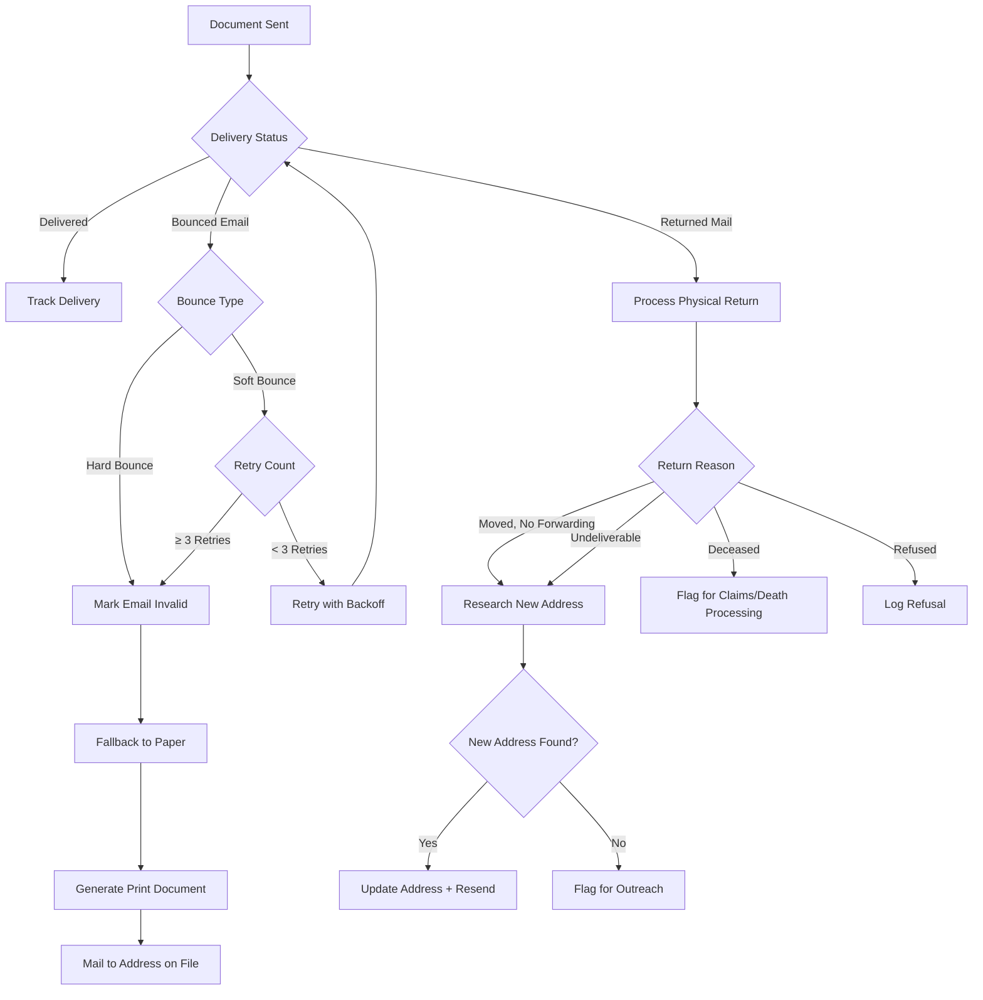

---

## 6. Document Management System (DMS)

### 6.1 Document Ingestion

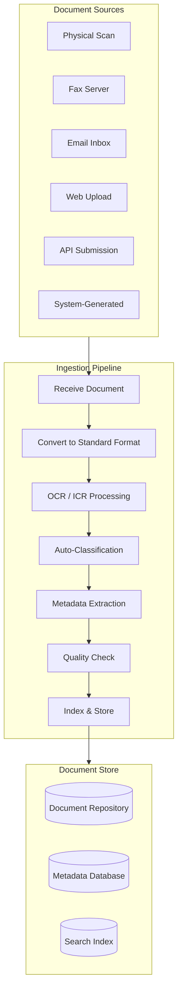

### 6.2 Document Classification

**Auto-classification using ML:**

| Document Type | Classification Method | Accuracy Target |
|--------------|----------------------|-----------------|
| Application | Form ID recognition + layout analysis | 98%+ |
| Death Certificate | Title recognition + structured fields | 95%+ |
| Lab Results | Letterhead recognition + content analysis | 93%+ |
| APS (Attending Physician Statement) | Letterhead + medical terminology | 90%+ |
| Bank Statement | Layout pattern + financial terminology | 95%+ |
| Government ID | Template matching + security features | 97%+ |
| Generic Correspondence | NLP text analysis | 85%+ |
| Legal Documents | Legal terminology + format recognition | 90%+ |

**Classification taxonomy:**

```yaml
document_taxonomy:
  level_1_categories:
    - APPLICATION:
        - NEW_APPLICATION
        - SUPPLEMENTAL_APPLICATION
        - AMENDMENT
        - REPLACEMENT_FORMS
    - UNDERWRITING:
        - MEDICAL_RECORDS
        - LAB_RESULTS
        - PRESCRIPTION_HISTORY
        - MVR
        - INSPECTION_REPORT
        - FINANCIAL_QUESTIONNAIRE
        - MIB_REPORT
    - POLICY:
        - POLICY_CONTRACT
        - ENDORSEMENT
        - RIDER
        - SCHEDULE_PAGE
        - ILLUSTRATION
    - SERVICING:
        - CHANGE_REQUEST_FORM
        - BENEFICIARY_FORM
        - WITHDRAWAL_REQUEST
        - LOAN_REQUEST
        - ASSIGNMENT_FORM
    - CLAIMS:
        - CLAIM_FORM
        - DEATH_CERTIFICATE
        - PROOF_OF_DEATH
        - AUTOPSY_REPORT
        - POLICE_REPORT
        - SETTLEMENT_ELECTION
    - CORRESPONDENCE:
        - INCOMING_LETTER
        - OUTGOING_LETTER
        - EMAIL_CORRESPONDENCE
    - LEGAL:
        - POWER_OF_ATTORNEY
        - COURT_ORDER
        - TRUST_DOCUMENT
        - DIVORCE_DECREE
    - FINANCIAL:
        - BANK_STATEMENT
        - TAX_RETURN
        - PAYMENT_RECEIPT
    - IDENTIFICATION:
        - DRIVERS_LICENSE
        - PASSPORT
        - SSN_CARD
        - BIRTH_CERTIFICATE
```

### 6.3 Metadata Extraction (OCR/ICR)

```json
{
  "extracted_metadata": {
    "document_id": "DOC-2025-001234",
    "source": "SCAN",
    "scan_date": "2025-03-15",
    "classification": {
      "type": "DEATH_CERTIFICATE",
      "confidence": 0.97,
      "model_version": "DC-CLASSIFY-V3"
    },
    "extracted_fields": {
      "decedent_name": {"value": "John Smith", "confidence": 0.99},
      "date_of_death": {"value": "2025-03-10", "confidence": 0.98},
      "place_of_death": {"value": "Springfield, IL", "confidence": 0.95},
      "cause_of_death": {"value": "Acute myocardial infarction", "confidence": 0.92},
      "manner_of_death": {"value": "Natural", "confidence": 0.97},
      "certifier_name": {"value": "Dr. Jane Doe", "confidence": 0.94},
      "certificate_number": {"value": "2025-IL-12345", "confidence": 0.99},
      "date_filed": {"value": "2025-03-12", "confidence": 0.96},
      "ssn": {"value": "***-**-6789", "confidence": 0.93, "masked": true}
    },
    "quality_metrics": {
      "image_resolution_dpi": 300,
      "skew_angle": 0.5,
      "overall_ocr_confidence": 0.95,
      "completeness": 0.90
    },
    "linked_entities": {
      "policy_numbers": ["WL-456789012"],
      "claim_numbers": ["CLM-2025-00567"]
    }
  }
}
```

### 6.4 Document Indexing

Every document in the DMS is indexed by multiple attributes for rapid retrieval:

| Index Field | Type | Source | Searchable |
|------------|------|--------|-----------|
| Document ID | System-generated UUID | DMS | Yes |
| Policy Number | Extracted or manual | OCR / Manual | Yes |
| Document Type | Classified | ML / Manual | Yes |
| Document Subtype | Classified | ML / Manual | Yes |
| Document Date | Extracted or manual | OCR / Manual | Yes |
| Received Date | System timestamp | DMS | Yes |
| Source | Ingestion channel | DMS | Yes |
| Owner Name | Policy data | PAS lookup | Yes |
| Insured Name | Policy data | PAS lookup | Yes |
| Agent Code | Policy data | PAS lookup | Yes |
| Status | System managed | DMS | Yes |
| Content (full-text) | OCR text | OCR engine | Yes (full-text search) |
| File Format | System detected | DMS | Yes |
| File Size | System measured | DMS | Yes |
| Page Count | System counted | DMS | Yes |
| Retention Category | Business rules | Rule engine | Yes |
| Destruction Date | Calculated | Retention rules | Yes |
| Legal Hold | Manual / automatic | Legal system | Yes |
| Confidentiality | Classified | Business rules | Yes |

### 6.5 Document Retention Policies

```yaml
retention_policies:
  policy_documents:
    category: "LEGAL_CONTRACT"
    retention_period: "LIFE_OF_POLICY + 10 YEARS"
    destruction_method: "SECURE_SHRED"
    legal_hold_eligible: true
    
  underwriting_evidence:
    category: "UNDERWRITING"
    retention_period: "CONTESTABILITY_PERIOD + 7 YEARS"
    notes: "Must retain through contestability; extended retention for litigation"
    destruction_method: "SECURE_SHRED"
    legal_hold_eligible: true
    
  claims_documents:
    category: "CLAIMS"
    retention_period: "CLAIM_SETTLEMENT + 10 YEARS"
    notes: "Extended for contested claims or litigation"
    destruction_method: "SECURE_SHRED"
    legal_hold_eligible: true
    
  financial_records:
    category: "FINANCIAL"
    retention_period: "7 YEARS"
    regulatory_basis: "IRS record retention requirements"
    destruction_method: "SECURE_SHRED"
    
  correspondence:
    category: "CORRESPONDENCE"
    subcategories:
      regulatory_notices:
        retention_period: "7 YEARS"
        regulatory_basis: "State insurance regulations"
      transaction_confirmations:
        retention_period: "7 YEARS"
      marketing:
        retention_period: "3 YEARS"
        
  tax_documents:
    category: "TAX"
    retention_period: "7 YEARS"
    regulatory_basis: "IRS record retention"
    
  identification_documents:
    category: "PII"
    retention_period: "POLICY_TERMINATION + 7 YEARS"
    special_handling: "ENCRYPTED_STORAGE"
    destruction_method: "SECURE_WIPE"
    gdpr_eligible: true

retention_schedules:
  state_overrides:
    NY:
      policy_documents: "LIFE_OF_POLICY + 15 YEARS"
      claims_documents: "CLAIM_SETTLEMENT + 15 YEARS"
    CA:
      general_minimum: "5 YEARS from creation"
    TX:
      general_minimum: "5 YEARS from creation"

  legal_hold:
    description: "Suspends destruction for documents subject to litigation or regulatory investigation"
    trigger: "Legal department places hold by policy/claim/date range"
    scope: "All documents matching hold criteria"
    duration: "Until hold is explicitly released by legal"
    audit: "All hold placements and releases logged"

  destruction_schedule:
    frequency: "QUARTERLY"
    review_process:
      - "Generate destruction candidates list"
      - "Legal review for active holds"
      - "Compliance review for regulatory requirements"
      - "Management approval"
      - "Execute destruction"
      - "Generate destruction certificate"
      - "Audit log entry"
```

---

## 7. Regulatory Compliance

### 7.1 Required Notice Timelines

| Notice Type | When to Send | Method Required | Proof Required |
|-------------|-------------|----------------|---------------|
| Premium Due Notice | 30–45 days before due date | Mail or electronic (if consented) | Date sent, method |
| Grace Period Notice | On first day of grace period | Mail (some states require certified) | Date sent, certified receipt (if required) |
| Lapse Notice | Within 30 days of lapse | Mail (certified in some states) | Date sent, method, certified receipt |
| Free-Look Notice | At policy delivery | Included with policy delivery | Delivery confirmation |
| Annual Privacy Notice | Annually (if sharing practices changed) | Mail or electronic | Date sent |
| Annual Statement | By March 1 for prior calendar year | Mail or electronic | Date sent |
| Conversion Notice | 30–90 days before conversion deadline | Mail | Date sent |
| Adverse UW Decision | Within 30 days of decision | Mail | Date sent, content |
| 1099-R | By January 31 | Mail or electronic | Date sent, filing with IRS |
| RMD Notice | By October 1 of year reaching RMD age | Mail or electronic | Date sent |
| Replacement Notice | At time of application | With application materials | Signed acknowledgment |

### 7.2 State-Specific Notice Requirements Matrix

| State | Premium Notice | Grace Notice | Lapse Notice | Free-Look | Annual Statement | Special Requirements |
|-------|---------------|-------------|-------------|-----------|-----------------|---------------------|
| NY | 15 days before | Required, specific language | 30 days after, certified option | 10 days (life), 20 days (VA) | Required | Reg 60 replacement notices; Reg 74 illustration requirements |
| CA | 30 days before | Required | 30 days after | 30 days | Required | Senior consumer protections (65+); CA CCPA privacy |
| TX | 30 days before | Required | 15 days after | 10 days | Required | Consumer Bill of Rights |
| FL | 30 days before | Required | 20 days after | 14 days | Required | Enhanced protections for seniors |
| IL | 30 days before | Required | 30 days after | 10 days | Required | — |
| PA | 30 days before | Required | 30 days after | 10 days | Required | — |
| OH | 30 days before | Required | 30 days after | 10 days | Required | — |
| NJ | 30 days before | Required | 30 days after | 10 days (life), 20 days (annuity) | Required | — |

### 7.3 Delivery Method Requirements

```yaml
delivery_requirements:
  general:
    acceptable_methods:
      - US_MAIL_FIRST_CLASS
      - CERTIFIED_MAIL
      - ELECTRONIC_DELIVERY (with UETA/E-SIGN consent)
      
  notices_requiring_certified_mail:
    states:
      NY:
        - "POLICY_CANCELLATION"
        - "LAPSE_NOTICE (contested cases)"
      CA:
        - "POLICY_CANCELLATION"
      general:
        - "LEGAL_HOLD_NOTIFICATION"
        - "FRAUD_INVESTIGATION_NOTICE"
        
  notices_not_eligible_for_e_delivery:
    - "COURT_ORDERED_NOTICES"
    - "SOME_STATE_REGULATORY_NOTICES (varies by state)"
    
  proof_of_delivery_requirements:
    standard_mail:
      proof: "Mail date + mail manifest"
      presumption: "Received 5 business days after mailing"
    certified_mail:
      proof: "Certified mail receipt + return receipt (green card)"
      presumption: "Received on signed date"
    electronic:
      proof: "Email delivery receipt + read receipt or portal access log"
      presumption: "Received on delivery confirmation timestamp"
```

---

## 8. E-Delivery

### 8.1 Electronic Delivery Consent

E-delivery of insurance documents must comply with the Uniform Electronic Transactions Act (UETA) and the federal Electronic Signatures in Global and National Commerce Act (E-SIGN).

**Consent requirements:**

```json
{
  "e_delivery_consent_requirements": {
    "pre_consent_disclosure": {
      "required_elements": [
        "Description of documents that will be delivered electronically",
        "Hardware and software requirements to access documents",
        "Right to receive paper copies (and any associated fees)",
        "Right to withdraw consent at any time",
        "How to update contact information for electronic delivery",
        "Procedures for withdrawing consent"
      ],
      "format": "Clear, conspicuous, and presented before consent is obtained"
    },
    "consent_capture": {
      "method": "AFFIRMATIVE_ACTION",
      "acceptable_methods": [
        "Checkbox with explicit consent language",
        "Electronic signature on consent form",
        "Recorded verbal consent (phone channel)"
      ],
      "not_acceptable": [
        "Pre-checked boxes",
        "Implied consent from inaction",
        "Bundled consent (must be separate from other consents)"
      ]
    },
    "post_consent": {
      "confirmation": "Send confirmation of e-delivery enrollment",
      "test_delivery": "Send test document to verify delivery capability",
      "paper_fallback": "If e-delivery fails, fall back to paper within 5 business days"
    }
  }
}
```

### 8.2 E-Delivery Platform Architecture

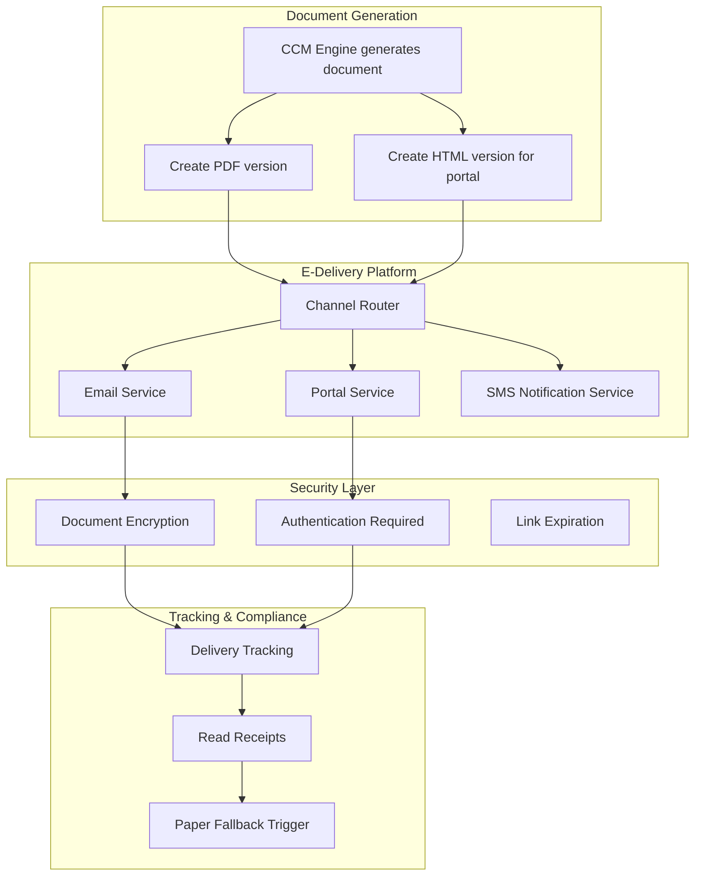

### 8.3 Digital Signatures

```yaml
digital_signature_config:
  supported_standards:
    - "UETA (Uniform Electronic Transactions Act)"
    - "E-SIGN (Electronic Signatures in Global and National Commerce Act)"
    - "eIDAS (for international)"
    
  signature_methods:
    - method: "CLICK_TO_SIGN"
      legal_weight: "STANDARD"
      use_cases: ["Beneficiary change", "Address change", "Fund transfer authorization"]
      
    - method: "TYPED_SIGNATURE"
      legal_weight: "STANDARD"
      use_cases: ["Application consent", "E-delivery consent"]
      
    - method: "DRAWN_SIGNATURE"
      legal_weight: "ENHANCED"
      use_cases: ["Application signature", "Trust documents"]
      
    - method: "CERTIFICATE_BASED"
      legal_weight: "HIGHEST"
      use_cases: ["High-value transactions", "Irrevocable beneficiary consent"]
      
  audit_trail_per_signature:
    - signer_identity (name, email, IP address)
    - authentication_method (password, MFA, KBA)
    - timestamp (with timezone)
    - document_hash (SHA-256 of signed document)
    - signing_ceremony_id
    - geolocation (if available)
    - device_fingerprint
    - consent_to_electronic_signature
```

### 8.4 Paper Fulfillment Fallback

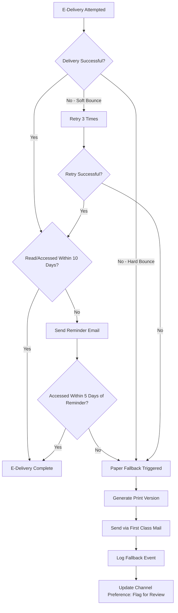

---

## 9. Content Management

### 9.1 Clause Library

A clause library stores pre-approved text blocks that can be assembled into documents.

```json
{
  "clause_library": {
    "clause_id": "CL-PRIVACY-GLBA-2025",
    "name": "Gramm-Leach-Bliley Privacy Notice",
    "category": "REGULATORY",
    "subcategory": "PRIVACY",
    "jurisdictions": ["FEDERAL"],
    "effective_date": "2025-01-01",
    "status": "APPROVED",
    "content": {
      "en": "We collect nonpublic personal information about you from the following sources: information we receive from you on applications or other forms; information about your transactions with us, our affiliates, or others; and information we receive from consumer reporting agencies. We do not disclose any nonpublic personal information about our customers or former customers to anyone, except as permitted by law...",
      "es": "Recopilamos información personal no pública sobre usted de las siguientes fuentes: información que recibimos de usted en solicitudes u otros formularios..."
    },
    "approved_by": "Legal Department",
    "approved_date": "2024-11-01",
    "review_schedule": "ANNUAL",
    "next_review_date": "2025-11-01",
    "usage": [
      "TPL-ANNUAL-STMT-*",
      "TPL-PRIVACY-NOTICE-*",
      "TPL-WELCOME-KIT-*"
    ],
    "state_overrides": {
      "CA": {
        "clause_id": "CL-PRIVACY-CCPA-CA-2025",
        "additional_text": "California residents: Under the California Consumer Privacy Act (CCPA), you have additional rights regarding your personal information..."
      },
      "VT": {
        "clause_id": "CL-PRIVACY-VT-2025",
        "additional_text": "Vermont residents: We will not share your nonpublic personal information with nonaffiliated third parties other than as permitted by Vermont law..."
      }
    }
  }
}
```

### 9.2 Approved Language Management

```yaml
approved_language_governance:
  process:
    - step: "Draft"
      responsible: "Marketing / Operations"
      deliverable: "Proposed language"
      
    - step: "Legal Review"
      responsible: "Legal Department"
      deliverable: "Legal-approved language"
      sla_days: 10
      
    - step: "Compliance Review"
      responsible: "Compliance Department"
      deliverable: "Compliance-approved language"
      sla_days: 5
      
    - step: "Regulatory Review"
      responsible: "Regulatory Affairs"
      deliverable: "State-specific approved language"
      sla_days: 15
      condition: "If language appears in filed documents or regulated notices"
      
    - step: "Final Approval"
      responsible: "Chief Compliance Officer"
      deliverable: "Approved for use"
      
    - step: "Publish to Clause Library"
      responsible: "Content Administrator"
      deliverable: "Clause available in library with metadata"

  change_control:
    trigger_new_review:
      - "Regulatory change"
      - "Legal precedent change"
      - "Product change affecting disclosure"
      - "Annual review cycle"
    
    emergency_change:
      approval: "CCO + General Counsel"
      sla_hours: 24
      post_change_review: "Full review within 30 days"
```

### 9.3 Content Localization

```json
{
  "localization_config": {
    "supported_languages": [
      {"code": "en", "name": "English", "status": "PRIMARY"},
      {"code": "es", "name": "Spanish", "status": "SUPPORTED"},
      {"code": "zh", "name": "Chinese (Simplified)", "status": "LIMITED"},
      {"code": "ko", "name": "Korean", "status": "LIMITED"},
      {"code": "vi", "name": "Vietnamese", "status": "LIMITED"}
    ],
    "translation_requirements": {
      "regulatory_notices": {
        "languages_required": ["en", "es"],
        "states_requiring_spanish": ["CA", "TX", "FL", "NM", "AZ", "NY", "NJ", "IL"],
        "certification_required": true,
        "back_translation_required": true
      },
      "policy_documents": {
        "primary_language": "en",
        "translation_available_on_request": true,
        "disclaimer": "In case of conflict between English and translated versions, the English version shall prevail"
      },
      "marketing": {
        "languages": ["en", "es", "zh", "ko", "vi"],
        "market_driven": true
      }
    },
    "translation_workflow": {
      "steps": [
        "Content authored in English",
        "Professional translation by certified translator",
        "Back-translation by independent translator",
        "Comparison review by bilingual SME",
        "Legal/compliance review of translation",
        "Desktop publishing / formatting review",
        "Final approval and publish"
      ]
    }
  }
}
```

---

## 10. Architecture

### 10.1 End-to-End Document Architecture

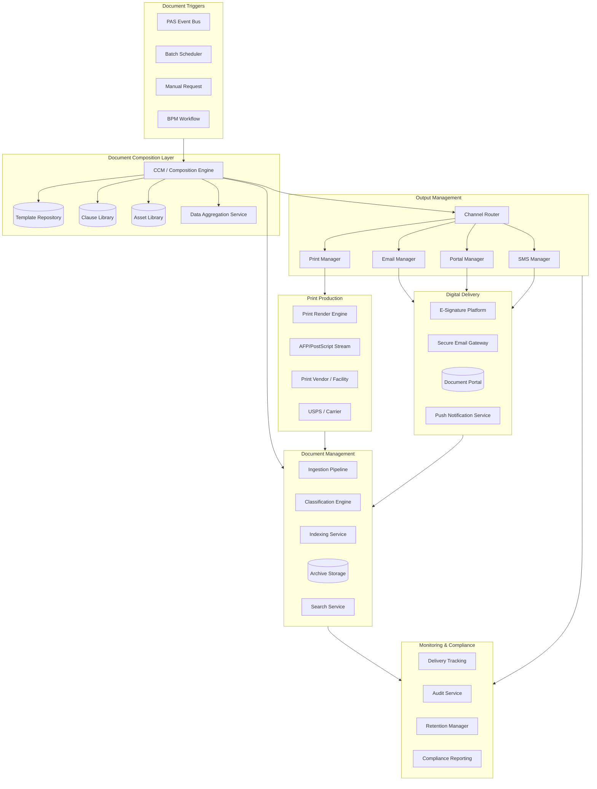

### 10.2 Component Responsibilities

| Component | Responsibility | Technology Options |
|-----------|---------------|-------------------|
| **CCM Engine** | Template-based document composition with variable data | OpenText Exstream, Smart Communications, Messagepoint, Quadient Inspire |
| **Template Repository** | Store, version, manage templates | CCM-native, Git-based, CMS |
| **Clause Library** | Manage reusable content blocks | CMS, custom database |
| **Data Aggregation** | Collect data from PAS + ancillary systems for document merge | Custom ETL, API orchestration |
| **Channel Router** | Determine delivery channel per recipient preferences and regulatory rules | Custom rules engine, CCM-native |
| **Print Manager** | Generate print-ready output (AFP, PostScript, PDF) | CCM-native, Solimar, Crawford Technologies |
| **Email Manager** | Secure email delivery with tracking | SendGrid, Amazon SES, custom SMTP |
| **Portal Manager** | Post documents to customer/agent portal | Custom, Hyland, Alfresco |
| **DMS** | Ingest, classify, index, store, search documents | Hyland OnBase, OpenText Content Server, Alfresco, M-Files |
| **Archive Storage** | Long-term immutable document storage | AWS S3 Glacier, Azure Archive, tape (for very old archives) |
| **Search Service** | Full-text and metadata search across document repository | Elasticsearch, Solr, DMS-native search |

### 10.3 Content Services Platform Architecture

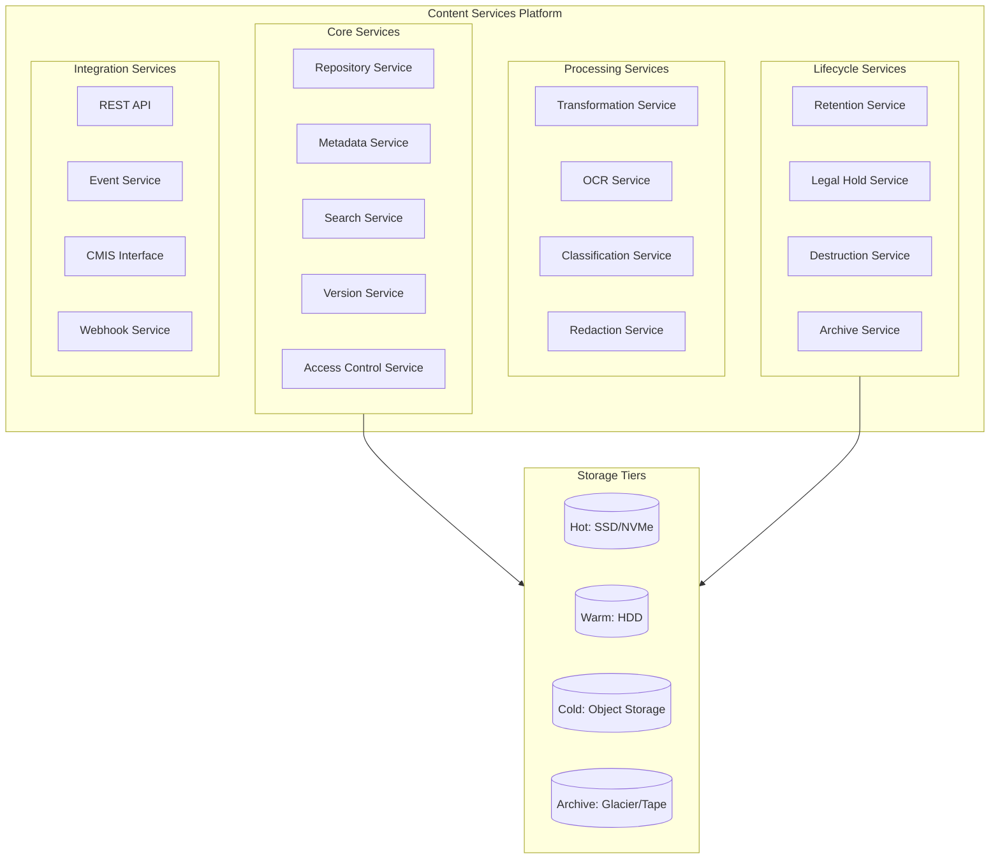

---

## 11. Data Model for Correspondence Tracking

### 11.1 Entity Relationship Diagram

```
CORRESPONDENCE (Central entity)
├── correspondence_id (PK)
├── policy_number (FK)
├── document_type_code (FK → DOCUMENT_TYPE)
├── template_id (FK → TEMPLATE)
├── template_version
├── generated_date
├── effective_date
├── status (GENERATED, QUEUED, SENT, DELIVERED, VIEWED, RETURNED, FAILED)
├── priority (STANDARD, HIGH, URGENT)
├── batch_id (FK → BATCH_RUN, nullable)
├── trigger_event (event that caused generation)
├── trigger_transaction_id
├── language_code
├── page_count
├── created_by (system or user)
└── metadata (JSONB)

DOCUMENT_TYPE
├── document_type_code (PK)
├── name
├── category (POLICY, REGULATORY, FINANCIAL, TRANSACTIONAL, MARKETING)
├── regulatory_flag (boolean)
├── retention_category (FK → RETENTION_POLICY)
├── e_delivery_eligible (boolean)
├── state_variants_exist (boolean)
└── description

TEMPLATE
├── template_id (PK)
├── template_name
├── document_type_code (FK)
├── version
├── status (DRAFT, REVIEW, APPROVED, PUBLISHED, RETIRED)
├── effective_date
├── expiration_date
├── content (BLOB or reference to template file)
├── language_code
├── state_code (nullable — for state-specific variants)
├── product_codes (JSON array)
├── approved_by
├── approved_date
└── last_modified

DELIVERY_ATTEMPT
├── attempt_id (PK)
├── correspondence_id (FK)
├── channel (PRINT, EMAIL, PORTAL, SMS, PUSH)
├── attempt_number
├── status (QUEUED, SENT, DELIVERED, OPENED, BOUNCED, RETURNED, FAILED)
├── sent_at
├── delivered_at
├── opened_at
├── recipient_address (email or physical)
├── tracking_number (for physical mail)
├── error_message (nullable)
└── metadata (JSONB — delivery-specific details)

DELIVERY_PREFERENCE
├── preference_id (PK)
├── policy_number (FK)
├── owner_id (FK)
├── document_category
├── preferred_channel
├── fallback_channel
├── email_address
├── consent_date
├── consent_method
├── opt_out_date (nullable)
└── last_verified_date

BATCH_RUN
├── batch_id (PK)
├── batch_type (ANNUAL_STATEMENT, TAX_FORMS, BILLING, etc.)
├── run_date
├── total_documents
├── successful_documents
├── failed_documents
├── start_time
├── end_time
├── status (RUNNING, COMPLETED, FAILED, PARTIAL)
└── initiated_by

DOCUMENT_CONTENT
├── content_id (PK)
├── correspondence_id (FK)
├── content_type (PDF, HTML, TEXT, AFP)
├── storage_location (S3 path, file system path)
├── file_size_bytes
├── checksum (SHA-256)
├── encrypted (boolean)
├── created_at
└── archived_at (nullable)

CLAUSE
├── clause_id (PK)
├── clause_name
├── category
├── content (TEXT)
├── language_code
├── state_code (nullable)
├── version
├── status (DRAFT, APPROVED, ACTIVE, RETIRED)
├── effective_date
├── approved_by
├── approved_date
└── usage_count

TEMPLATE_CLAUSE (Many-to-Many)
├── template_id (FK)
├── clause_id (FK)
├── section_order
├── mandatory (boolean)
└── condition (nullable — conditional inclusion rule)

RETURN_MAIL
├── return_id (PK)
├── correspondence_id (FK)
├── return_date
├── return_reason (MOVED_NO_FORWARDING, DECEASED, REFUSED, UNDELIVERABLE, OTHER)
├── new_address_found (boolean)
├── new_address (nullable)
├── action_taken (RESENT, ADDRESS_UPDATED, FLAGGED_FOR_RESEARCH)
├── processed_by
└── processed_date

E_DELIVERY_CONSENT
├── consent_id (PK)
├── owner_id (FK)
├── consent_type (E_DELIVERY, MARKETING_EMAIL, SMS)
├── consent_status (ACTIVE, WITHDRAWN)
├── consent_date
├── consent_method (WEB_PORTAL, PAPER_FORM, PHONE)
├── consent_text_version
├── withdrawal_date (nullable)
├── withdrawal_method (nullable)
├── ip_address
└── user_agent

LEGAL_HOLD
├── hold_id (PK)
├── hold_name
├── hold_reason
├── scope_type (POLICY, CLAIM, DATE_RANGE, DOCUMENT_TYPE)
├── scope_value
├── placed_by
├── placed_date
├── released_by (nullable)
├── released_date (nullable)
├── status (ACTIVE, RELEASED)
└── related_case_number

DOCUMENT_ARCHIVE
├── archive_id (PK)
├── correspondence_id (FK)
├── archived_date
├── archive_storage_tier (HOT, WARM, COLD, DEEP_ARCHIVE)
├── archive_location
├── retrieval_time_sla
├── destruction_eligible_date
├── destroyed (boolean)
├── destroyed_date (nullable)
├── destruction_certificate_id (nullable)
└── legal_hold_id (FK, nullable)
```

### 11.2 Key Queries

```sql
-- Find all correspondence for a policy
SELECT c.*, da.channel, da.status as delivery_status
FROM correspondence c
LEFT JOIN delivery_attempt da ON c.correspondence_id = da.correspondence_id
WHERE c.policy_number = 'UL-123456789'
ORDER BY c.generated_date DESC;

-- Find undelivered regulatory notices
SELECT c.correspondence_id, c.policy_number, c.document_type_code, 
       da.channel, da.status, da.sent_at
FROM correspondence c
JOIN document_type dt ON c.document_type_code = dt.document_type_code
JOIN delivery_attempt da ON c.correspondence_id = da.correspondence_id
WHERE dt.regulatory_flag = true
AND da.status IN ('BOUNCED', 'RETURNED', 'FAILED')
AND c.generated_date >= CURRENT_DATE - INTERVAL '90 days';

-- Annual statement batch progress
SELECT br.batch_id, br.batch_type, br.total_documents,
       br.successful_documents, br.failed_documents,
       ROUND(br.successful_documents::decimal / br.total_documents * 100, 1) as success_rate
FROM batch_run br
WHERE br.batch_type = 'ANNUAL_STATEMENT'
AND br.run_date >= '2025-01-01';

-- Documents approaching destruction date with no legal hold
SELECT da.archive_id, c.policy_number, c.document_type_code,
       da.destruction_eligible_date
FROM document_archive da
JOIN correspondence c ON da.correspondence_id = c.correspondence_id
WHERE da.destruction_eligible_date <= CURRENT_DATE + INTERVAL '30 days'
AND da.destroyed = false
AND da.legal_hold_id IS NULL
ORDER BY da.destruction_eligible_date;
```

---

## 12. Integration Patterns

### 12.1 PAS-to-CCM Event Triggers

```yaml
pas_ccm_event_triggers:
  policy_events:
    - event: "POLICY_ISSUED"
      documents:
        - template: "WELCOME_KIT"
          priority: "HIGH"
          delivery: "PER_PREFERENCE"
        - template: "AGENT_COMMISSION_STATEMENT"
          delivery: "AGENT_PORTAL"
          
    - event: "POLICY_ANNIVERSARY"
      documents:
        - template: "ANNUAL_STATEMENT"
          priority: "STANDARD"
          delivery: "PER_PREFERENCE"
          batch_eligible: true
          
    - event: "POLICY_LAPSED"
      documents:
        - template: "LAPSE_NOTICE"
          priority: "URGENT"
          delivery: "MAIL_REQUIRED"
          regulatory: true
          
  financial_events:
    - event: "WITHDRAWAL_PROCESSED"
      documents:
        - template: "WITHDRAWAL_CONFIRMATION"
          priority: "HIGH"
          delivery: "PER_PREFERENCE"
        - template: "TAX_WITHHOLDING_NOTICE"
          condition: "withholding_amount > 0"
          
    - event: "LOAN_PROCESSED"
      documents:
        - template: "LOAN_CONFIRMATION"
          priority: "HIGH"
          delivery: "PER_PREFERENCE"
          
    - event: "DEATH_CLAIM_APPROVED"
      documents:
        - template: "CLAIM_SETTLEMENT_LETTER"
          priority: "URGENT"
          delivery: "MAIL_AND_PORTAL"
          
  tax_events:
    - event: "TAX_YEAR_CLOSED"
      documents:
        - template: "1099_R"
          condition: "taxable_distributions > threshold"
          priority: "HIGH"
          delivery: "PER_PREFERENCE"
          regulatory_deadline: "JANUARY_31"
          batch_eligible: true
```

### 12.2 Document-to-DMS Indexing

```json
{
  "dms_indexing_rules": {
    "auto_index_fields": {
      "all_documents": [
        {"field": "policy_number", "source": "document_metadata"},
        {"field": "document_type", "source": "document_metadata"},
        {"field": "generated_date", "source": "system_timestamp"},
        {"field": "template_version", "source": "template_metadata"}
      ],
      "incoming_documents": [
        {"field": "received_date", "source": "system_timestamp"},
        {"field": "source_channel", "source": "ingestion_metadata"},
        {"field": "classification", "source": "ml_classifier"},
        {"field": "ocr_confidence", "source": "ocr_engine"}
      ]
    },
    "full_text_indexing": {
      "enabled": true,
      "engine": "elasticsearch",
      "languages": ["en", "es"],
      "exclude_document_types": ["IDENTIFICATION"],
      "pii_masking": {
        "ssn_pattern": "\\d{3}-\\d{2}-\\d{4}",
        "replacement": "***-**-XXXX"
      }
    },
    "cross_reference_indexing": {
      "link_related_documents": true,
      "relationship_types": [
        {"from": "APPLICATION", "to": "POLICY_CONTRACT", "relationship": "RESULTED_IN"},
        {"from": "CLAIM_FORM", "to": "DEATH_CERTIFICATE", "relationship": "SUPPORTED_BY"},
        {"from": "CHANGE_REQUEST", "to": "CONFIRMATION", "relationship": "CONFIRMED_BY"}
      ]
    }
  }
}
```

### 12.3 DMS-to-Workflow Integration

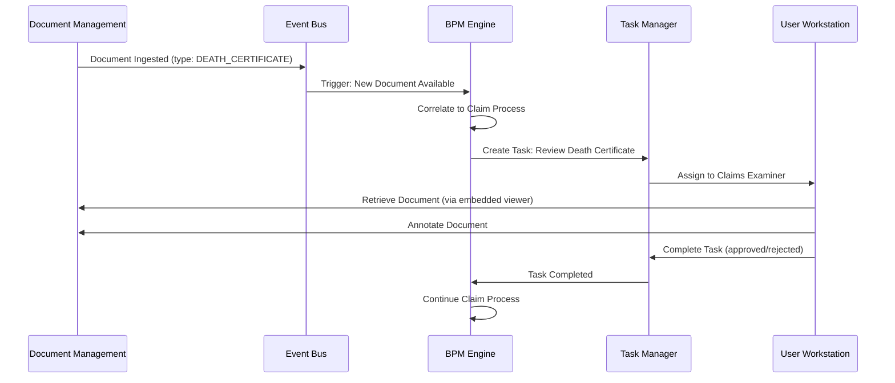

---

## 13. Vendor Landscape

### 13.1 OpenText Exstream

| Attribute | Detail |
|-----------|--------|
| **Type** | Enterprise CCM Platform |
| **Strengths** | High-volume document composition, strong insurance domain, excellent print stream generation, multi-channel output |
| **Weaknesses** | Complex implementation, expensive licensing, steep learning curve |
| **Insurance Fit** | Excellent — widely used by top-tier life insurers; handles billions of pages annually |
| **Pricing** | Enterprise ($$$$) |

### 13.2 Smart Communications (SmartCOMM)

| Attribute | Detail |
|-----------|--------|
| **Type** | Cloud-native CCM Platform |
| **Strengths** | Modern cloud architecture, template-driven, strong API integration, good business user tools |
| **Weaknesses** | Newer platform, less proven at extreme scale compared to Exstream |
| **Insurance Fit** | Strong — designed for regulated industries; good for carriers modernizing from legacy CCM |
| **Pricing** | SaaS subscription ($$$) |

### 13.3 Messagepoint

| Attribute | Detail |
|-----------|--------|
| **Type** | Content management for CCM |
| **Strengths** | Content-centric approach, excellent content management and governance, integrates with multiple CCM engines |
| **Weaknesses** | Not a full CCM platform (requires composition engine) |
| **Insurance Fit** | Excellent for managing the content layer; pairs well with Exstream or other composition engines |
| **Pricing** | Mid-range ($$) |

### 13.4 Hyland (OnBase)

| Attribute | Detail |
|-----------|--------|
| **Type** | Enterprise Content Services / DMS |
| **Strengths** | Strong document management, workflow, capture, case management; deep insurance vertical |
| **Weaknesses** | Less strong in document composition (relies on CCM partners) |
| **Insurance Fit** | Excellent for DMS / content services; widely used in insurance for policy file management |
| **Pricing** | Enterprise ($$$) |

### 13.5 Alfresco (Hyland)

| Attribute | Detail |
|-----------|--------|
| **Type** | Open-source / Enterprise Content Services |
| **Strengths** | Open-source flexibility, good API, strong developer ecosystem, cloud-deployable |
| **Weaknesses** | Requires more implementation effort than turnkey solutions |
| **Insurance Fit** | Good for carriers wanting open-source content services; strong for API-first architectures |
| **Pricing** | Open-source (free); Enterprise subscription ($$) |

### 13.6 Vendor Comparison Matrix

| Capability | OpenText Exstream | Smart Communications | Messagepoint | Hyland OnBase | Alfresco |
|-----------|------------------|---------------------|-------------|---------------|----------|
| Document Composition | ★★★★★ | ★★★★ | ★★★ (content only) | ★★★ | ★★ |
| Template Management | ★★★★ | ★★★★★ | ★★★★★ | ★★★ | ★★★ |
| Content Management | ★★★ | ★★★ | ★★★★★ | ★★★★ | ★★★★ |
| Document Management | ★★★ | ★★ | ★★ | ★★★★★ | ★★★★ |
| Multi-Channel Output | ★★★★★ | ★★★★ | ★★★ | ★★★ | ★★★ |
| Print Production | ★★★★★ | ★★★ | ★★ | ★★★ | ★★ |
| Cloud-Native | ★★★ | ★★★★★ | ★★★★ | ★★★ | ★★★★ |
| Insurance Domain | ★★★★★ | ★★★★ | ★★★★ | ★★★★★ | ★★★ |
| Business User Tooling | ★★★ | ★★★★ | ★★★★★ | ★★★ | ★★★ |
| Cost | ★★ | ★★★ | ★★★ | ★★★ | ★★★★ |

---

## 14. Document Lifecycle Management

### 14.1 Complete Document Lifecycle

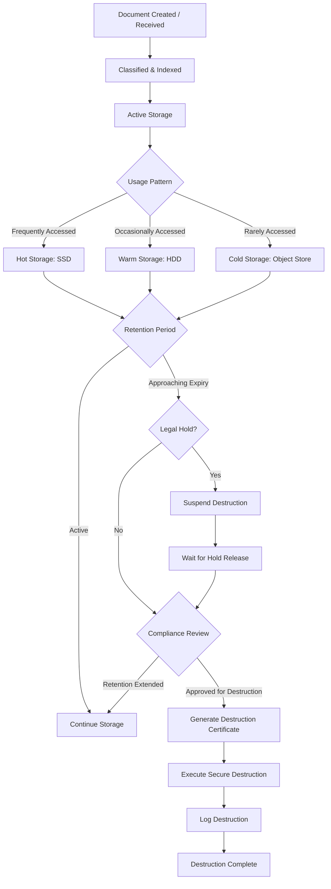

### 14.2 Storage Tier Management

```yaml
storage_tiers:
  hot:
    technology: "SSD / NVMe"
    access_time: "< 10ms"
    cost_per_gb_month: "$0.25"
    criteria: "Documents < 90 days old OR actively referenced in open process"
    
  warm:
    technology: "HDD / SAN"
    access_time: "< 100ms"
    cost_per_gb_month: "$0.10"
    criteria: "Documents 90 days - 2 years old"
    
  cold:
    technology: "Object Storage (S3/Azure Blob)"
    access_time: "< 1 second"
    cost_per_gb_month: "$0.02"
    criteria: "Documents 2 - 7 years old"
    
  deep_archive:
    technology: "Glacier / Archive Tier"
    access_time: "Hours to retrieve"
    cost_per_gb_month: "$0.004"
    criteria: "Documents > 7 years old with extended retention"
    
  migration_rules:
    - trigger: "document_age > 90 days AND no_active_reference"
      from: "hot"
      to: "warm"
      
    - trigger: "document_age > 2 years AND no_access_180_days"
      from: "warm"
      to: "cold"
      
    - trigger: "document_age > 7 years"
      from: "cold"
      to: "deep_archive"
```

---

## 15. Performance & Scalability

### 15.1 Document Generation Performance Targets

| Scenario | Target | Acceptable |
|----------|--------|-----------|
| Single document generation (on-demand) | < 3 seconds | < 10 seconds |
| Batch: Annual statements (1M policies) | < 8 hours | < 24 hours |
| Batch: Tax forms (500K 1099-Rs) | < 4 hours | < 12 hours |
| Batch: Monthly billing (500K notices) | < 4 hours | < 8 hours |
| Document retrieval (DMS) | < 2 seconds | < 5 seconds |
| Full-text search | < 3 seconds | < 10 seconds |
| Document ingestion (single) | < 5 seconds | < 15 seconds |
| Document classification (ML) | < 2 seconds | < 5 seconds |

### 15.2 Batch Processing Architecture

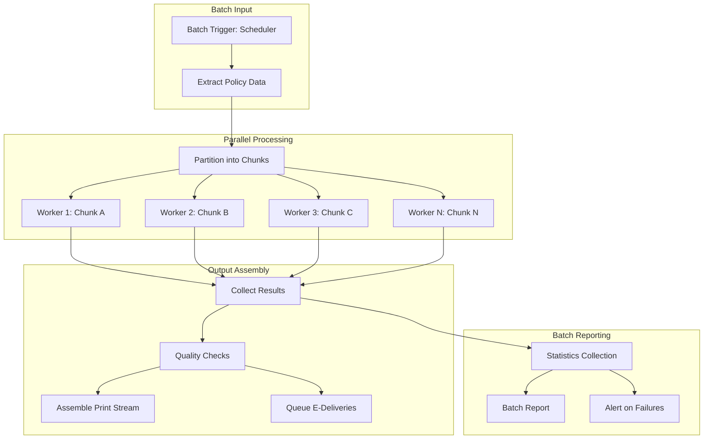

### 15.3 Scalability Considerations

| Component | Scaling Strategy | Max Throughput Target |
|-----------|-----------------|---------------------|
| CCM Engine | Horizontal scaling (add composition workers) | 10,000 documents/minute |
| Template Cache | In-memory distributed cache (Redis) | Sub-millisecond template retrieval |
| DMS Ingestion | Parallel ingestion workers, queue-based | 5,000 documents/minute |
| OCR/Classification | GPU-accelerated ML workers | 1,000 documents/minute |
| Document Storage | Object storage with CDN for hot content | Petabytes |
| Search Index | Elasticsearch cluster with sharding | Billions of documents |
| Print Production | Multiple print streams, parallel rendering | 100,000 pages/hour |

---

## 16. Appendix

### 16.1 Glossary

| Term | Definition |
|------|-----------|
| CCM | Customer Communications Management — platform for creating, managing, and delivering customer communications |
| DMS | Document Management System — system for storing, managing, and tracking electronic documents |
| ECM | Enterprise Content Management — broader term encompassing DMS, records management, workflow |
| CSP | Content Services Platform — Gartner's updated term for ECM |
| OCR | Optical Character Recognition — converting scanned text images to machine-readable text |
| ICR | Intelligent Character Recognition — advanced OCR that handles handwriting |
| AFP | Advanced Function Presentation — IBM print stream format for high-volume print |
| UETA | Uniform Electronic Transactions Act — state law enabling electronic transactions |
| E-SIGN | Electronic Signatures in Global and National Commerce Act — federal law for e-signatures |
| CMIS | Content Management Interoperability Services — OASIS standard for content repository access |
| GLBA | Gramm-Leach-Bliley Act — federal law requiring financial privacy notices |
| CCPA | California Consumer Privacy Act — CA data privacy law |
| PII | Personally Identifiable Information |
| NIGO | Not In Good Order — document or transaction with errors or missing information |
| OMR | Optical Mark Recognition — detecting marks on printed forms |

### 16.2 Document Type Code Reference

| Code | Document Type | Category | Regulatory | E-Delivery Eligible |
|------|-------------|----------|-----------|-------------------|
| POL-CONTRACT | Policy Contract | Policy | No | Yes (with consent) |
| POL-SCHED | Schedule/Specifications Page | Policy | No | Yes |
| POL-RIDER | Rider/Endorsement | Policy | No | Yes |
| POL-ILLUST | Policy Illustration | Policy | Yes (in some states) | Yes |
| REG-FREELOOK | Free-Look Notice | Regulatory | Yes | State-dependent |
| REG-PRIVACY | Annual Privacy Notice | Regulatory | Yes (GLBA) | Yes |
| REG-ANNUAL | Annual Report/Statement | Regulatory | Yes | Yes |
| REG-PREM-DUE | Premium Due Notice | Regulatory | Yes | Yes |
| REG-GRACE | Grace Period Notice | Regulatory | Yes | State-dependent |
| REG-LAPSE | Lapse Notice | Regulatory | Yes | State-dependent |
| REG-CONVERT | Conversion Notice | Regulatory | No (contractual) | Yes |
| FIN-ANNUAL-STMT | Annual Statement | Financial | Yes | Yes |
| FIN-1099R | Form 1099-R | Tax | Yes (IRS) | Yes (with consent) |
| FIN-5498 | Form 5498 | Tax | Yes (IRS) | Yes (with consent) |
| FIN-CONFIRM | Transaction Confirmation | Financial | No | Yes |
| TXN-CHANGE-CONF | Change Confirmation | Transactional | No | Yes |
| TXN-WD-CONF | Withdrawal Confirmation | Transactional | No | Yes |
| TXN-LOAN-CONF | Loan Confirmation | Transactional | No | Yes |
| CLM-ACK | Claim Acknowledgment | Claims | No | Yes |
| CLM-SETTLE | Claim Settlement Letter | Claims | No | Mail preferred |
| CLM-DENY | Claim Denial Letter | Claims | Yes | Mail required |
| MKT-CROSS | Cross-Sell Letter | Marketing | No | Per preference |
| MKT-RETAIN | Retention Offer | Marketing | No | Per preference |

### 16.3 Sample Print Stream Configuration

```json
{
  "print_configuration": {
    "batch_id": "ANNUAL-STMT-2025",
    "print_vendor": "XYZ Print Services",
    "specifications": {
      "paper": {
        "size": "8.5x11 inches",
        "weight": "24 lb bond",
        "color": "WHITE"
      },
      "printing": {
        "method": "LASER",
        "color_mode": "FULL_COLOR",
        "duplex": true,
        "resolution_dpi": 600
      },
      "envelope": {
        "size": "#10 (4.125 x 9.5 inches)",
        "window": "SINGLE_WINDOW",
        "window_position": "STANDARD",
        "return_address": true,
        "barcode": "INTELLIGENT_MAIL"
      },
      "inserts": [
        {
          "name": "Privacy Notice",
          "condition": "annual_privacy_required = true",
          "pages": 2,
          "stock": "SAME_AS_LETTER"
        },
        {
          "name": "State-Specific Insert",
          "condition": "state IN (NY, CA, TX)",
          "pages": 1,
          "stock": "SAME_AS_LETTER"
        }
      ],
      "finishing": {
        "fold": "C_FOLD",
        "insertion_order": ["LETTER", "PRIVACY_NOTICE", "STATE_INSERT"],
        "postage": "FIRST_CLASS_PRESORT",
        "tracking": "INTELLIGENT_MAIL_BARCODE"
      }
    },
    "sla": {
      "file_delivery_to_vendor": "2025-02-10",
      "print_completion": "2025-02-15",
      "mail_date": "2025-02-17",
      "delivery_confirmation": "2025-02-24"
    }
  }
}
```

### 16.4 References

1. AIIM (Association for Intelligent Information Management) — Content Services Best Practices
2. Gartner: "Magic Quadrant for Content Services Platforms"
3. Forrester: "The Forrester Wave: Customer Communications Management"
4. UETA — Uniform Electronic Transactions Act (state law)
5. E-SIGN Act — 15 U.S.C. §§ 7001–7031
6. Gramm-Leach-Bliley Act — Privacy Notice Requirements
7. NAIC Model Laws — Notice and Filing Requirements
8. IRS Publication 1220 — Electronic Filing Requirements for 1099s
9. USPS Intelligent Mail Barcode Technical Specifications
10. ACORD Forms and Standards for Insurance Document Exchange
11. OpenText Exstream Documentation
12. Smart Communications Platform Guide
13. Hyland OnBase Insurance Solution Reference Architecture

---

*This article is part of the Life Insurance PAS Architect's Encyclopedia. For related topics, see Article 18 (Straight-Through Processing), Article 19 (Business Rules Engines), and Article 20 (BPM & Workflow Orchestration).*
