# Article 23: Event-Driven Architecture & CQRS for Policy Administration Systems

## Table of Contents

1. [Introduction](#1-introduction)
2. [Domain Events in Insurance](#2-domain-events-in-insurance)
3. [Event Sourcing for PAS](#3-event-sourcing-for-pas)
4. [CQRS Pattern](#4-cqrs-pattern)
5. [Event-Driven Microservices](#5-event-driven-microservices)
6. [Message Broker Architecture](#6-message-broker-architecture)
7. [Saga Pattern Deep Dive](#7-saga-pattern-deep-dive)
8. [Event-Driven Integration](#8-event-driven-integration)
9. [Eventual Consistency Patterns](#9-eventual-consistency-patterns)
10. [Complete Event Catalog](#10-complete-event-catalog)
11. [Architecture Diagrams](#11-architecture-diagrams)
12. [Code Examples](#12-code-examples)
13. [Testing Event-Driven Systems](#13-testing-event-driven-systems)
14. [Operational Considerations](#14-operational-considerations)
15. [Migration Strategy](#15-migration-strategy)

---

## 1. Introduction

Life insurance policy administration is inherently event-driven. A policy's lifecycle—from application through claim settlement—is a sequence of discrete events that change state over decades. Event-Driven Architecture (EDA) and Command Query Responsibility Segregation (CQRS) are natural fits for this domain, enabling temporal queries, auditability, scalability, and loose coupling across a complex enterprise ecosystem.

### 1.1 Why Event-Driven Architecture for PAS?

| Challenge | Traditional Approach | EDA Solution |
|-----------|---------------------|--------------|
| **30+ year policy history** | Mutable records, lost history | Event sourcing preserves complete history |
| **Multi-system integration** | Point-to-point, batch files | Events broadcast to all interested systems |
| **Regulatory audit** | Separate audit tables, incomplete | Events ARE the audit trail |
| **Temporal queries** | Difficult to reconstruct past state | Replay events to any point in time |
| **Scalability** | Read/write contention | CQRS separates read and write workloads |
| **Complex workflows** | Tightly coupled transactions | Sagas with compensating actions |
| **Real-time notifications** | Polling, batch updates | Event-driven push |

### 1.2 Conceptual Overview

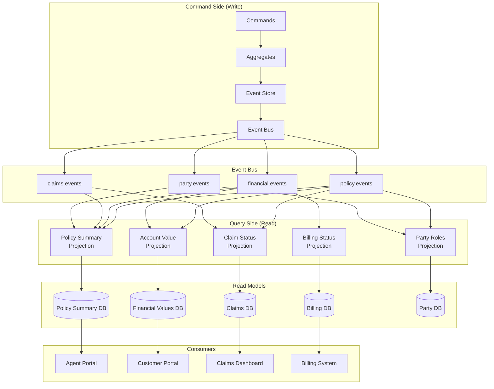
```mermaid
graph TB
    subgraph "Command Side (Write)"
        CMD[Commands] --> AGG[Aggregates]
        AGG --> ES[Event Store]
        ES --> EB[Event Bus]
    end

    subgraph "Event Bus"
        EB --> T1[policy.events]
        EB --> T2[financial.events]
        EB --> T3[claims.events]
        EB --> T4[party.events]
    end

    subgraph "Query Side (Read)"
        T1 & T2 & T3 & T4 --> P1[Policy Summary<br/>Projection]
        T1 & T2 --> P2[Account Value<br/>Projection]
        T1 & T3 --> P3[Claim Status<br/>Projection]
        T2 --> P4[Billing Status<br/>Projection]
        T1 & T4 --> P5[Party Roles<br/>Projection]
    end

    subgraph "Read Models"
        P1 --> RM1[(Policy Summary DB)]
        P2 --> RM2[(Financial Values DB)]
        P3 --> RM3[(Claims DB)]
        P4 --> RM4[(Billing DB)]
        P5 --> RM5[(Party DB)]
    end

    subgraph "Consumers"
        RM1 --> Q1[Agent Portal]
        RM2 --> Q2[Customer Portal]
        RM3 --> Q3[Claims Dashboard]
        RM4 --> Q4[Billing System]
    end
```

---

## 2. Domain Events in Insurance

### 2.1 Event Storming for PAS

Event storming is a collaborative workshop technique to discover domain events. For a life insurance PAS, the process maps out:


```mermaid
graph LR
    subgraph "New Business Flow"
        NB1[Application<br/>Received] --> NB2[Application<br/>Validated]
        NB2 --> NB3[Underwriting<br/>Ordered]
        NB3 --> NB4[Evidence<br/>Received]
        NB4 --> NB5[Underwriting<br/>Decision Made]
        NB5 --> NB6[Policy<br/>Approved]
        NB6 --> NB7[Policy<br/>Issued]
        NB7 --> NB8[Welcome Kit<br/>Sent]
    end

    subgraph "Servicing Flow"
        S1[Change<br/>Requested] --> S2[Change<br/>Validated]
        S2 --> S3[Change<br/>Approved]
        S3 --> S4[Change<br/>Applied]
        S4 --> S5[Confirmation<br/>Sent]
    end

    subgraph "Financial Flow"
        F1[Premium<br/>Due] --> F2[Premium<br/>Received]
        F2 --> F3[Premium<br/>Applied]
        F3 --> F4[COI<br/>Deducted]
        F4 --> F5[Interest<br/>Credited]
    end

    subgraph "Claim Flow"
        C1[Claim<br/>Submitted] --> C2[Claim<br/>Assigned]
        C2 --> C3[Evidence<br/>Reviewed]
        C3 --> C4[Claim<br/>Adjudicated]
        C4 --> C5[Payout<br/>Authorized]
        C5 --> C6[Payout<br/>Issued]
    end
```

### 2.2 Bounded Context Mapping for PAS

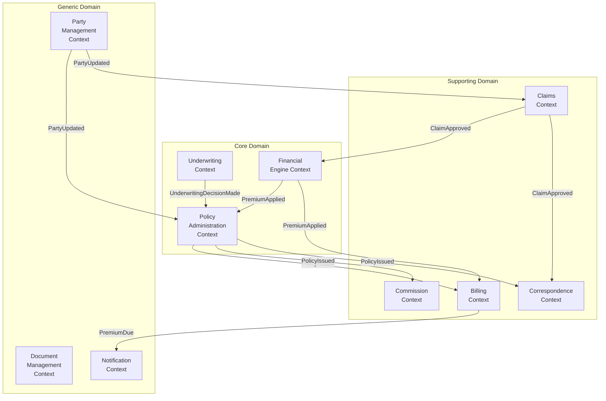
```mermaid
graph TB
    subgraph "Core Domain"
        BC1[Policy<br/>Administration<br/>Context]
        BC2[Underwriting<br/>Context]
        BC3[Financial<br/>Engine Context]
    end

    subgraph "Supporting Domain"
        BC4[Billing<br/>Context]
        BC5[Claims<br/>Context]
        BC6[Correspondence<br/>Context]
        BC7[Commission<br/>Context]
    end

    subgraph "Generic Domain"
        BC8[Document<br/>Management<br/>Context]
        BC9[Party<br/>Management<br/>Context]
        BC10[Notification<br/>Context]
    end

    BC1 -->|PolicyIssued| BC4
    BC1 -->|PolicyIssued| BC7
    BC1 -->|PolicyIssued| BC6
    BC2 -->|UnderwritingDecisionMade| BC1
    BC3 -->|PremiumApplied| BC1
    BC3 -->|PremiumApplied| BC4
    BC4 -->|PremiumDue| BC10
    BC5 -->|ClaimApproved| BC3
    BC5 -->|ClaimApproved| BC6
    BC9 -->|PartyUpdated| BC1
    BC9 -->|PartyUpdated| BC5
```

#### Context Relationships

| Upstream Context | Downstream Context | Relationship | Event Flow |
|-----------------|-------------------|--------------|------------|
| Policy Admin | Billing | Customer-Supplier | PolicyIssued, CoverageChanged |
| Policy Admin | Correspondence | Customer-Supplier | PolicyIssued, ChangeCompleted |
| Policy Admin | Commission | Customer-Supplier | PolicyIssued, PremiumApplied |
| Underwriting | Policy Admin | Conformist | UnderwritingDecisionMade |
| Financial Engine | Policy Admin | Partnership | PremiumApplied, InterestCredited |
| Financial Engine | Billing | Partnership | PaymentReconciled |
| Claims | Financial Engine | Customer-Supplier | PayoutAuthorized |
| Claims | Correspondence | Customer-Supplier | ClaimStatusChanged |
| Party Mgmt | Policy Admin | Shared Kernel | PartyUpdated |
| Party Mgmt | Claims | Shared Kernel | PartyUpdated |

### 2.3 Aggregate Design

#### Policy Aggregate

The Policy aggregate is the central aggregate in PAS, encompassing:

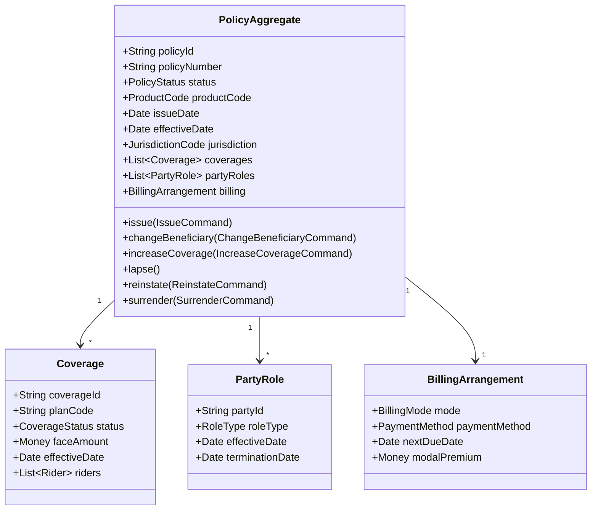
```mermaid
classDiagram
    class PolicyAggregate {
        +String policyId
        +String policyNumber
        +PolicyStatus status
        +ProductCode productCode
        +Date issueDate
        +Date effectiveDate
        +JurisdictionCode jurisdiction
        +List~Coverage~ coverages
        +List~PartyRole~ partyRoles
        +BillingArrangement billing
        +issue(IssueCommand)
        +changeBeneficiary(ChangeBeneficiaryCommand)
        +increaseCoverage(IncreaseCoverageCommand)
        +lapse()
        +reinstate(ReinstateCommand)
        +surrender(SurrenderCommand)
    }

    class Coverage {
        +String coverageId
        +String planCode
        +CoverageStatus status
        +Money faceAmount
        +Date effectiveDate
        +List~Rider~ riders
    }

    class PartyRole {
        +String partyId
        +RoleType roleType
        +Date effectiveDate
        +Date terminationDate
    }

    class BillingArrangement {
        +BillingMode mode
        +PaymentMethod paymentMethod
        +Date nextDueDate
        +Money modalPremium
    }

    PolicyAggregate "1" --> "*" Coverage
    PolicyAggregate "1" --> "*" PartyRole
    PolicyAggregate "1" --> "1" BillingArrangement
```

#### Financial Aggregate (per Policy)

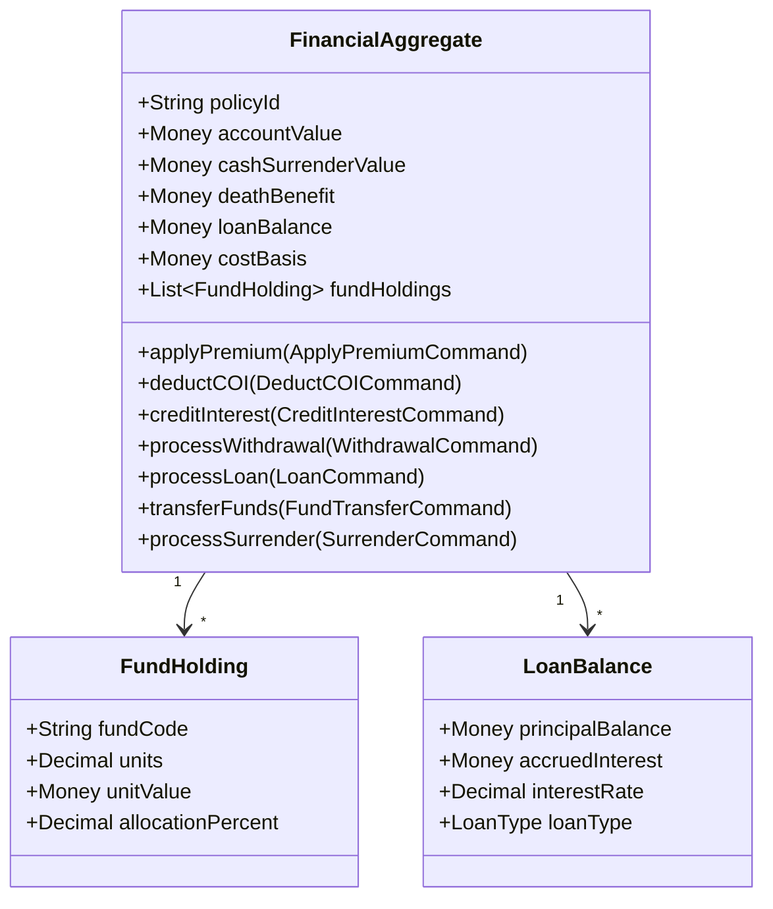
```mermaid
classDiagram
    class FinancialAggregate {
        +String policyId
        +Money accountValue
        +Money cashSurrenderValue
        +Money deathBenefit
        +Money loanBalance
        +Money costBasis
        +List~FundHolding~ fundHoldings
        +applyPremium(ApplyPremiumCommand)
        +deductCOI(DeductCOICommand)
        +creditInterest(CreditInterestCommand)
        +processWithdrawal(WithdrawalCommand)
        +processLoan(LoanCommand)
        +transferFunds(FundTransferCommand)
        +processSurrender(SurrenderCommand)
    }

    class FundHolding {
        +String fundCode
        +Decimal units
        +Money unitValue
        +Decimal allocationPercent
    }

    class LoanBalance {
        +Money principalBalance
        +Money accruedInterest
        +Decimal interestRate
        +LoanType loanType
    }

    FinancialAggregate "1" --> "*" FundHolding
    FinancialAggregate "1" --> "*" LoanBalance
```

#### Party Aggregate

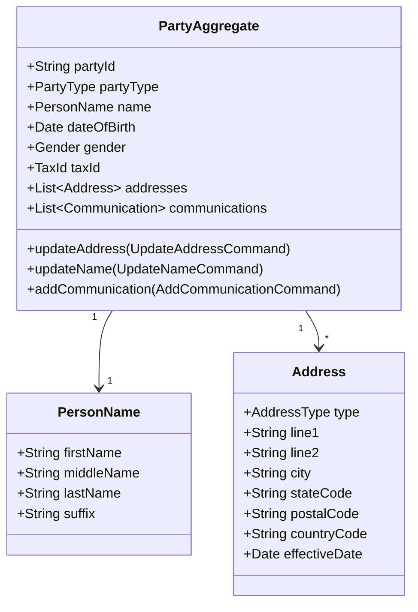
```mermaid
classDiagram
    class PartyAggregate {
        +String partyId
        +PartyType partyType
        +PersonName name
        +Date dateOfBirth
        +Gender gender
        +TaxId taxId
        +List~Address~ addresses
        +List~Communication~ communications
        +updateAddress(UpdateAddressCommand)
        +updateName(UpdateNameCommand)
        +addCommunication(AddCommunicationCommand)
    }

    class PersonName {
        +String firstName
        +String middleName
        +String lastName
        +String suffix
    }

    class Address {
        +AddressType type
        +String line1
        +String line2
        +String city
        +String stateCode
        +String postalCode
        +String countryCode
        +Date effectiveDate
    }

    PartyAggregate "1" --> "1" PersonName
    PartyAggregate "1" --> "*" Address
```

### 2.4 Domain Event Catalog — Life/Annuity

The complete catalog of domain events for a life insurance PAS:

#### New Business Events

| Event | Description | Key Data |
|-------|-------------|----------|
| `ApplicationReceived` | New application submitted | applicationId, productCode, applicant, producer |
| `ApplicationValidated` | Application passes data validation | applicationId, validationResults |
| `ApplicationRejected` | Application fails validation | applicationId, rejectionReasons |
| `UnderwritingOrdered` | UW requirements ordered | applicationId, requirements[] |
| `EvidenceReceived` | UW evidence received (APS, labs) | applicationId, evidenceType, source |
| `UnderwritingDecisionMade` | UW decision rendered | applicationId, decision, riskClass, rating |
| `ApplicationApproved` | Application approved for issuance | applicationId, approvedTerms |
| `ApplicationDeclined` | Application declined | applicationId, declineReason |
| `ApplicationWithdrawn` | Application withdrawn | applicationId, withdrawnBy, reason |
| `PolicyIssued` | Policy issued | policyId, policyNumber, terms, effectiveDate |
| `PolicyDelivered` | Policy delivered to owner | policyId, deliveryMethod, deliveredDate |
| `FreeExaminationExpired` | Free-look period ended | policyId, expirationDate |

#### Policy Servicing Events

| Event | Description | Key Data |
|-------|-------------|----------|
| `ChangeRequestSubmitted` | Service request received | changeRequestId, policyId, changeType |
| `ChangeRequestApproved` | Change approved (may require UW) | changeRequestId, approvedBy |
| `ChangeRequestRejected` | Change rejected | changeRequestId, rejectionReason |
| `BeneficiaryChanged` | Beneficiary designation updated | policyId, oldBeneficiaries, newBeneficiaries |
| `OwnershipChanged` | Policy ownership transferred | policyId, oldOwner, newOwner, transferType |
| `AssignmentRecorded` | Assignment recorded on policy | policyId, assignee, assignmentType |
| `AddressChanged` | Party address updated | partyId, oldAddress, newAddress |
| `NameChanged` | Party name updated | partyId, oldName, newName |
| `CoverageIncreased` | Face amount increased | policyId, coverageId, oldAmount, newAmount |
| `CoverageDecreased` | Face amount reduced | policyId, coverageId, oldAmount, newAmount |
| `RiderAdded` | Rider added to policy | policyId, riderId, riderCode |
| `RiderRemoved` | Rider terminated | policyId, riderId, terminationDate |
| `PremiumModeChanged` | Billing frequency changed | policyId, oldMode, newMode |
| `DividendOptionChanged` | Dividend option updated | policyId, oldOption, newOption |
| `FundAllocationChanged` | Investment allocation updated | policyId, oldAllocation, newAllocation |

#### Financial Events

| Event | Description | Key Data |
|-------|-------------|----------|
| `PremiumReceived` | Premium payment received | paymentId, policyId, amount, paymentMethod |
| `PremiumApplied` | Premium posted to policy | policyId, amount, fundAllocations[] |
| `PremiumRefunded` | Premium refunded | policyId, refundAmount, reason |
| `COIDeducted` | Cost of insurance deducted | policyId, coiAmount, coverageCharges[] |
| `ExpenseChargeDeducted` | Policy expense charges deducted | policyId, chargeAmount, chargeType |
| `InterestCredited` | Interest credited to policy | policyId, interestAmount, rate, creditDate |
| `DividendDeclared` | Dividend declared | policyId, dividendAmount, dividendOption |
| `DividendApplied` | Dividend applied per option | policyId, dividendAmount, applicationMethod |
| `WithdrawalProcessed` | Partial withdrawal completed | policyId, grossAmount, netAmount, taxWithholding |
| `SystematicWithdrawalScheduled` | Recurring withdrawal set up | policyId, amount, frequency, startDate |
| `LoanDisbursed` | Policy loan disbursed | policyId, loanAmount, interestRate |
| `LoanRepaymentReceived` | Loan repayment received | policyId, repaymentAmount, principalApplied |
| `LoanInterestCapitalized` | Loan interest added to balance | policyId, interestAmount, newBalance |
| `FundTransferExecuted` | Inter-fund transfer completed | policyId, transfers[], valuationDate |
| `FundRebalanced` | Portfolio rebalanced | policyId, newAllocations[] |
| `DollarCostAveragingExecuted` | DCA transfer completed | policyId, fromFund, toFund, amount |
| `SurrenderProcessed` | Full surrender completed | policyId, surrenderValue, surrenderCharge |
| `MaturityBenefitPaid` | Maturity benefit paid | policyId, maturityAmount, payee |
| `AnnuityPaymentIssued` | Annuity payout disbursed | policyId, paymentAmount, paymentNumber |
| `RequiredMinDistributionProcessed` | RMD processed | policyId, rmdAmount, taxYear |
| `Section1035ExchangeCompleted` | 1035 exchange completed | sourcePolicyId, targetPolicyId, amount |

#### Policy Status Events

| Event | Description | Key Data |
|-------|-------------|----------|
| `GracePeriodStarted` | Grace period initiated | policyId, gracePeriodEnd, amountDue |
| `GracePeriodExpired` | Grace period expired | policyId, expirationDate |
| `PolicyLapsed` | Policy entered lapsed status | policyId, lapseDate, lapseReason |
| `PolicyReinstated` | Lapsed policy reinstated | policyId, reinstateDate, backPremium |
| `PolicyPaidUp` | Policy entered paid-up status | policyId, paidUpDate, reducedFaceAmount |
| `PolicyExtendedTerm` | Policy converted to extended term | policyId, termEndDate, termFaceAmount |
| `PolicySurrendered` | Policy surrendered | policyId, surrenderDate, surrenderValue |
| `PolicyMatured` | Policy reached maturity | policyId, maturityDate, maturityValue |
| `PolicyTerminated` | Policy terminated | policyId, terminationDate, reason |
| `DeathNotificationReceived` | Death of insured reported | policyId, dateOfDeath, reportedBy |
| `PolicyConvertedFromTerm` | Term policy converted to perm | oldPolicyId, newPolicyId, conversionDate |
| `ReducedPaidUpElected` | RPU nonforfeiture option elected | policyId, rpuFaceAmount, rpuDate |

#### Claims Events

| Event | Description | Key Data |
|-------|-------------|----------|
| `ClaimSubmitted` | New claim submitted | claimId, policyId, claimType, dateOfEvent |
| `ClaimAssigned` | Claim assigned to examiner | claimId, examinerId |
| `ClaimDocumentReceived` | Supporting document received | claimId, documentType, documentId |
| `ClaimInformationRequested` | Additional info requested | claimId, requestedItems[] |
| `ClaimUnderReview` | Claim being reviewed | claimId, reviewType |
| `ClaimApproved` | Claim approved for payment | claimId, approvedAmount, payees[] |
| `ClaimDenied` | Claim denied | claimId, denialReason, appealDeadline |
| `ClaimAppealed` | Claim denial appealed | claimId, appealReason |
| `PayoutAuthorized` | Payout authorized for disbursement | claimId, payoutAmount, payees[] |
| `PayoutIssued` | Payout check/ACH issued | claimId, payoutId, amount, method |
| `ClaimClosed` | Claim closed | claimId, closedDate, resolution |
| `ClaimReopened` | Closed claim reopened | claimId, reopenReason |

#### Compliance / Regulatory Events

| Event | Description | Key Data |
|-------|-------------|----------|
| `SuitabilityReviewCompleted` | Suitability review done | applicationId, result, reviewer |
| `RegulatoryFilingGenerated` | State filing generated | filingType, jurisdictionCode, filingDate |
| `TaxReportGenerated` | Tax form generated (1099-R, etc.) | policyId, formType, taxYear |
| `AMLAlertRaised` | Anti-money laundering flag | transactionId, alertType, severity |
| `PrivacyConsentRecorded` | Data consent recorded | partyId, consentType, consentDate |

---

## 3. Event Sourcing for PAS

### 3.1 Event Store Design

The event store is the system of record. Every state change to a policy is captured as an immutable event.

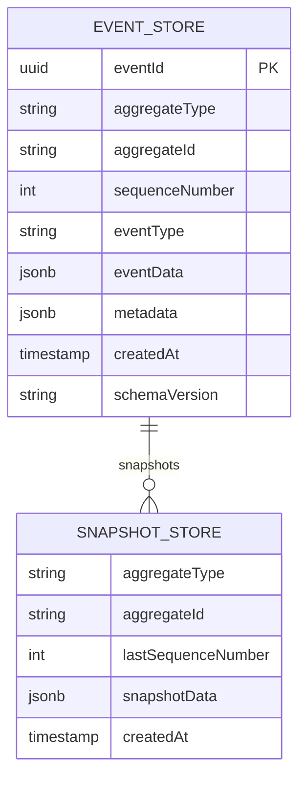
```mermaid
erDiagram
    EVENT_STORE {
        uuid eventId PK
        string aggregateType
        string aggregateId
        int sequenceNumber
        string eventType
        jsonb eventData
        jsonb metadata
        timestamp createdAt
        string schemaVersion
    }

    SNAPSHOT_STORE {
        string aggregateType
        string aggregateId
        int lastSequenceNumber
        jsonb snapshotData
        timestamp createdAt
    }

    EVENT_STORE ||--o{ SNAPSHOT_STORE : snapshots
```

#### Event Store Table Schema (PostgreSQL)

```sql
CREATE TABLE event_store (
    event_id        UUID PRIMARY KEY DEFAULT gen_random_uuid(),
    aggregate_type  VARCHAR(100) NOT NULL,
    aggregate_id    VARCHAR(100) NOT NULL,
    sequence_number BIGINT NOT NULL,
    event_type      VARCHAR(200) NOT NULL,
    event_data      JSONB NOT NULL,
    metadata        JSONB NOT NULL DEFAULT '{}',
    schema_version  VARCHAR(20) NOT NULL DEFAULT '1.0',
    created_at      TIMESTAMPTZ NOT NULL DEFAULT NOW(),

    UNIQUE (aggregate_type, aggregate_id, sequence_number)
);

CREATE INDEX idx_event_store_aggregate
    ON event_store (aggregate_type, aggregate_id, sequence_number);

CREATE INDEX idx_event_store_type
    ON event_store (event_type, created_at);

CREATE INDEX idx_event_store_created
    ON event_store (created_at);

CREATE TABLE snapshot_store (
    aggregate_type      VARCHAR(100) NOT NULL,
    aggregate_id        VARCHAR(100) NOT NULL,
    last_sequence_number BIGINT NOT NULL,
    snapshot_data       JSONB NOT NULL,
    created_at          TIMESTAMPTZ NOT NULL DEFAULT NOW(),

    PRIMARY KEY (aggregate_type, aggregate_id)
);
```

### 3.2 Event Serialization

```json
{
  "eventId": "evt-2026-01-15-001",
  "aggregateType": "Policy",
  "aggregateId": "POL-12345678",
  "sequenceNumber": 47,
  "eventType": "PremiumApplied",
  "schemaVersion": "2.0",
  "eventData": {
    "paymentId": "PAY-001",
    "amount": {
      "value": 450.00,
      "currency": "USD"
    },
    "effectiveDate": "2026-02-01",
    "fundAllocations": [
      { "fundCode": "GROWTH-01", "amount": 225.00 },
      { "fundCode": "BOND-01", "amount": 225.00 }
    ]
  },
  "metadata": {
    "correlationId": "corr-abc123",
    "causationId": "cmd-pay-001",
    "userId": "user-agent-001",
    "source": "billing-service",
    "timestamp": "2026-02-01T00:05:00Z",
    "traceId": "trace-xyz789"
  },
  "createdAt": "2026-02-01T00:05:00.123Z"
}
```

### 3.3 Snapshot Strategies

For long-lived policies with decades of events, snapshots are essential for performance.

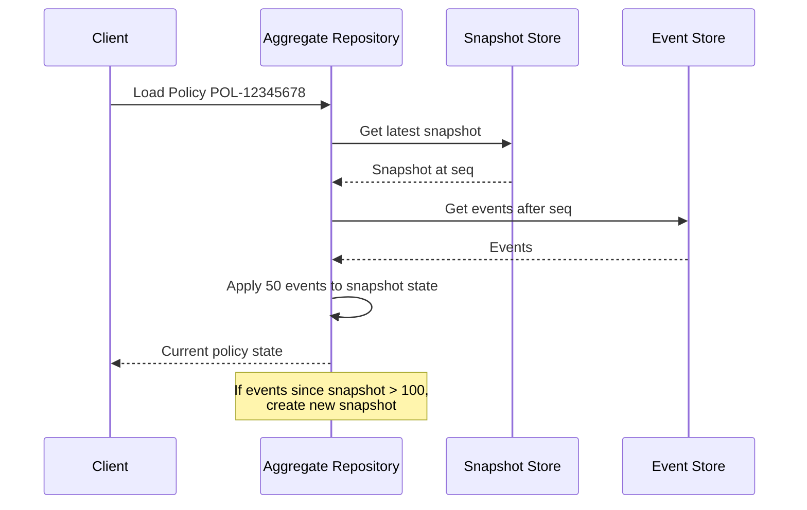
```mermaid
sequenceDiagram
    participant Client
    participant AggRepo as Aggregate Repository
    participant Snap as Snapshot Store
    participant ES as Event Store

    Client->>AggRepo: Load Policy POL-12345678
    AggRepo->>Snap: Get latest snapshot
    Snap-->>AggRepo: Snapshot at seq #400<br/>(Policy state as of 2025-06-01)
    AggRepo->>ES: Get events after seq #400
    ES-->>AggRepo: Events #401 through #450
    AggRepo->>AggRepo: Apply 50 events to snapshot state
    AggRepo-->>Client: Current policy state

    Note over AggRepo: If events since snapshot > 100,<br/>create new snapshot
```

#### Snapshot Strategy Options

| Strategy | Trigger | Pro | Con |
|----------|---------|-----|-----|
| **Every N events** | Every 100 events | Simple, predictable | May snapshot unnecessarily |
| **Time-based** | Every 24 hours | Regular cadence | May miss high-activity policies |
| **On-demand** | When load time > threshold | Adaptive | Requires monitoring |
| **Hybrid** | Every 50 events OR daily | Balanced | More complex logic |

#### Snapshot Creation

```typescript
class PolicyAggregateRepository {
  private static SNAPSHOT_THRESHOLD = 100;

  async load(policyId: string): Promise<PolicyAggregate> {
    const snapshot = await this.snapshotStore.getLatest('Policy', policyId);
    const fromSequence = snapshot ? snapshot.lastSequenceNumber + 1 : 0;
    const events = await this.eventStore.getEvents('Policy', policyId, fromSequence);

    let aggregate: PolicyAggregate;
    if (snapshot) {
      aggregate = PolicyAggregate.fromSnapshot(snapshot.snapshotData);
    } else {
      aggregate = new PolicyAggregate(policyId);
    }

    for (const event of events) {
      aggregate.apply(event);
    }

    if (events.length > PolicyAggregateRepository.SNAPSHOT_THRESHOLD) {
      await this.createSnapshot(aggregate);
    }

    return aggregate;
  }

  private async createSnapshot(aggregate: PolicyAggregate): Promise<void> {
    await this.snapshotStore.save({
      aggregateType: 'Policy',
      aggregateId: aggregate.policyId,
      lastSequenceNumber: aggregate.version,
      snapshotData: aggregate.toSnapshot(),
    });
  }
}
```

### 3.4 Event Replay and Temporal Queries

One of the most powerful capabilities of event sourcing for insurance—reconstructing policy state at any point in time.

```typescript
async function getPolicyStateAsOf(
  policyId: string,
  asOfDate: Date
): Promise<PolicyAggregate> {
  const events = await eventStore.getEvents('Policy', policyId);

  const aggregate = new PolicyAggregate(policyId);
  for (const event of events) {
    if (new Date(event.metadata.timestamp) > asOfDate) {
      break;
    }
    aggregate.apply(event);
  }

  return aggregate;
}

// "What was the death benefit on 2024-06-15?"
const pastState = await getPolicyStateAsOf('POL-12345678', new Date('2024-06-15'));
console.log(`Death benefit as of 2024-06-15: ${pastState.deathBenefit}`);
```

#### Use Cases for Temporal Queries

- **Regulatory Reporting**: "What was the policy's status on December 31st for year-end reserves?"
- **Claim Investigation**: "What were the beneficiaries on the date of death?"
- **Dispute Resolution**: "What was the face amount when the owner says they requested a decrease?"
- **Reinsurance Reporting**: "What was the net amount at risk on the reporting date?"
- **Tax Reporting**: "What was the cost basis as of the withdrawal date?"

### 3.5 Event Versioning and Upcasting

As the system evolves, event schemas change. Upcasting transforms old events to the current schema format.

```typescript
interface EventUpcaster {
  eventType: string;
  fromVersion: string;
  toVersion: string;
  upcast(oldEvent: any): any;
}

const premiumAppliedV1ToV2: EventUpcaster = {
  eventType: 'PremiumApplied',
  fromVersion: '1.0',
  toVersion: '2.0',
  upcast(oldEvent) {
    return {
      ...oldEvent,
      eventData: {
        ...oldEvent.eventData,
        fundAllocations: oldEvent.eventData.fundAllocations || [
          {
            fundCode: 'GENERAL',
            amount: oldEvent.eventData.amount.value,
          },
        ],
        paymentMethod: oldEvent.eventData.paymentMethod || 'Unknown',
      },
      schemaVersion: '2.0',
    };
  },
};

class EventUpcasterChain {
  private upcasters: Map<string, EventUpcaster[]> = new Map();

  register(upcaster: EventUpcaster): void {
    const key = `${upcaster.eventType}:${upcaster.fromVersion}`;
    const chain = this.upcasters.get(key) || [];
    chain.push(upcaster);
    this.upcasters.set(key, chain);
  }

  upcast(event: StoredEvent): StoredEvent {
    let current = event;
    let key = `${current.eventType}:${current.schemaVersion}`;

    while (this.upcasters.has(key)) {
      const upcaster = this.upcasters.get(key)![0];
      current = upcaster.upcast(current);
      key = `${current.eventType}:${current.schemaVersion}`;
    }

    return current;
  }
}
```

### 3.6 Performance for Long-Lived Aggregates

Policies can have 30+ years of events. Key optimizations:

| Optimization | Description | When to Use |
|-------------|-------------|-------------|
| **Snapshots** | Periodic state snapshots | All production aggregates |
| **Partitioned Event Store** | Partition by aggregate ID hash | > 100M events |
| **Hot/Warm/Cold Tiering** | Recent events in fast storage | Cost optimization |
| **Event Archival** | Archive events older than snapshot + buffer | Storage management |
| **Lazy Loading** | Load sub-aggregates on demand | Complex aggregates |
| **Projection Pre-computation** | Pre-build common queries | High-read workloads |

---

## 4. CQRS Pattern

### 4.1 Command Model (Write Side)

The command model handles all policy transactions (state-changing operations).

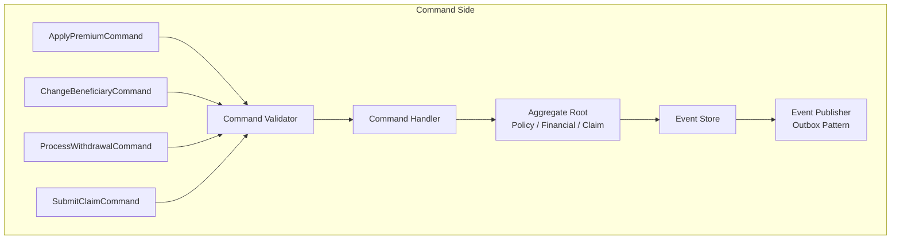
```mermaid
graph TB
    subgraph "Command Side"
        CMD1[ApplyPremiumCommand] --> V1[Command Validator]
        CMD2[ChangeBeneficiaryCommand] --> V1
        CMD3[ProcessWithdrawalCommand] --> V1
        CMD4[SubmitClaimCommand] --> V1

        V1 --> CH[Command Handler]
        CH --> AGG[Aggregate Root<br/>Policy / Financial / Claim]
        AGG --> ES[Event Store]
        ES --> EB[Event Publisher<br/>Outbox Pattern]
    end
```

#### Command Handler Example

```typescript
class ApplyPremiumCommandHandler {
  constructor(
    private policyRepo: PolicyAggregateRepository,
    private financialRepo: FinancialAggregateRepository,
  ) {}

  async handle(command: ApplyPremiumCommand): Promise<void> {
    const policy = await this.policyRepo.load(command.policyId);

    policy.validatePremiumPayment(command.amount, command.effectiveDate);

    const financial = await this.financialRepo.load(command.policyId);

    const events = financial.applyPremium({
      paymentId: command.paymentId,
      amount: command.amount,
      effectiveDate: command.effectiveDate,
      fundAllocations: command.fundAllocations,
    });

    await this.financialRepo.save(financial, events);
  }
}
```

#### Command Validation Rules

```typescript
class PolicyCommandValidator {
  validatePremiumPayment(policy: PolicyAggregate, command: ApplyPremiumCommand): ValidationResult {
    const errors: ValidationError[] = [];

    if (policy.status === PolicyStatus.Lapsed) {
      errors.push({
        code: 'POLICY_LAPSED',
        message: 'Cannot apply premium to lapsed policy. Reinstatement required.',
        field: 'policyStatus',
      });
    }

    if (policy.status === PolicyStatus.Surrendered) {
      errors.push({
        code: 'POLICY_SURRENDERED',
        message: 'Cannot apply premium to surrendered policy.',
        field: 'policyStatus',
      });
    }

    if (command.amount.value <= 0) {
      errors.push({
        code: 'INVALID_AMOUNT',
        message: 'Premium amount must be positive.',
        field: 'amount',
      });
    }

    const maxPremium = policy.calculateMaximumPremium();
    if (command.amount.value > maxPremium.value) {
      errors.push({
        code: 'EXCEEDS_MEC_LIMIT',
        message: `Premium exceeds 7-pay test limit of ${maxPremium.value}.`,
        field: 'amount',
      });
    }

    return new ValidationResult(errors);
  }
}
```

### 4.2 Query Model (Read Side)

The query model builds optimized read models (projections) from events.

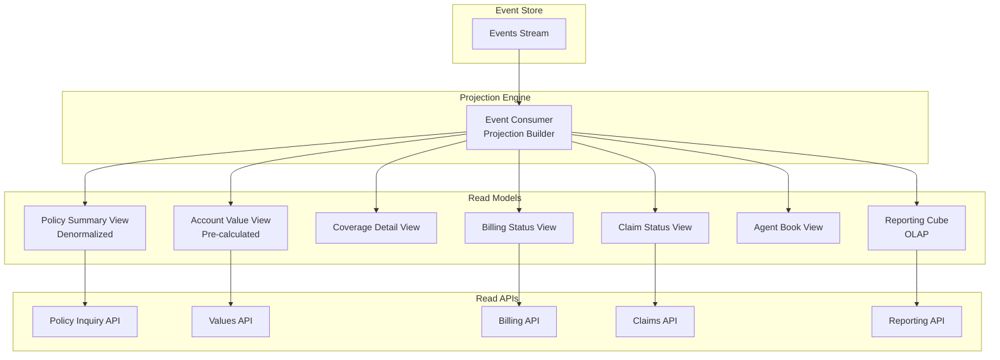
```mermaid
graph TB
    subgraph "Event Store"
        ES[Events Stream]
    end

    subgraph "Projection Engine"
        PE[Event Consumer<br/>Projection Builder]
    end

    subgraph "Read Models"
        RM1[Policy Summary View<br/>Denormalized]
        RM2[Account Value View<br/>Pre-calculated]
        RM3[Coverage Detail View]
        RM4[Billing Status View]
        RM5[Claim Status View]
        RM6[Agent Book View]
        RM7[Reporting Cube<br/>OLAP]
    end

    subgraph "Read APIs"
        API1[Policy Inquiry API]
        API2[Values API]
        API3[Billing API]
        API4[Claims API]
        API5[Reporting API]
    end

    ES --> PE
    PE --> RM1 & RM2 & RM3 & RM4 & RM5 & RM6 & RM7
    RM1 --> API1
    RM2 --> API2
    RM4 --> API3
    RM5 --> API4
    RM7 --> API5
```

### 4.3 Projection Design

#### Policy Summary Projection

```typescript
class PolicySummaryProjection {
  async handle(event: DomainEvent): Promise<void> {
    switch (event.eventType) {
      case 'PolicyIssued':
        await this.onPolicyIssued(event);
        break;
      case 'PremiumApplied':
        await this.onPremiumApplied(event);
        break;
      case 'BeneficiaryChanged':
        await this.onBeneficiaryChanged(event);
        break;
      case 'PolicyLapsed':
        await this.onPolicyLapsed(event);
        break;
      case 'PolicyReinstated':
        await this.onPolicyReinstated(event);
        break;
      case 'CoverageIncreased':
      case 'CoverageDecreased':
        await this.onCoverageChanged(event);
        break;
    }
  }

  private async onPolicyIssued(event: PolicyIssuedEvent): Promise<void> {
    await this.db.policySummary.insert({
      policyId: event.data.policyId,
      policyNumber: event.data.policyNumber,
      productCode: event.data.productCode,
      productName: event.data.productName,
      status: 'Active',
      issueDate: event.data.issueDate,
      effectiveDate: event.data.effectiveDate,
      totalFaceAmount: event.data.totalFaceAmount,
      ownerPartyId: event.data.ownerPartyId,
      ownerName: event.data.ownerName,
      insuredPartyId: event.data.insuredPartyId,
      insuredName: event.data.insuredName,
      producerCode: event.data.producerCode,
      jurisdictionCode: event.data.jurisdictionCode,
      lastEventTimestamp: event.metadata.timestamp,
      lastEventType: event.eventType,
    });
  }

  private async onPolicyLapsed(event: PolicyLapsedEvent): Promise<void> {
    await this.db.policySummary.update(
      { policyId: event.data.policyId },
      {
        status: 'Lapsed',
        lapseDate: event.data.lapseDate,
        lastEventTimestamp: event.metadata.timestamp,
        lastEventType: event.eventType,
      }
    );
  }

  private async onPremiumApplied(event: PremiumAppliedEvent): Promise<void> {
    await this.db.policySummary.update(
      { policyId: event.data.policyId },
      {
        lastPremiumDate: event.data.effectiveDate,
        lastPremiumAmount: event.data.amount,
        lastEventTimestamp: event.metadata.timestamp,
        lastEventType: event.eventType,
      }
    );
  }
}
```

#### Account Value Projection

```typescript
class AccountValueProjection {
  async handle(event: DomainEvent): Promise<void> {
    switch (event.eventType) {
      case 'PremiumApplied':
        await this.addToAccountValue(event);
        break;
      case 'COIDeducted':
        await this.subtractFromAccountValue(event);
        break;
      case 'InterestCredited':
        await this.addToAccountValue(event);
        break;
      case 'WithdrawalProcessed':
        await this.processWithdrawal(event);
        break;
      case 'LoanDisbursed':
        await this.processLoan(event);
        break;
      case 'FundTransferExecuted':
        await this.processFundTransfer(event);
        break;
    }
  }

  private async processWithdrawal(event: WithdrawalProcessedEvent): Promise<void> {
    const currentValues = await this.db.accountValues.findOne({
      policyId: event.data.policyId,
    });

    const newAccountValue = currentValues.accountValue - event.data.grossAmount;
    const newCostBasis = this.calculateNewCostBasis(
      currentValues.costBasis,
      currentValues.accountValue,
      event.data.grossAmount
    );

    await this.db.accountValues.update(
      { policyId: event.data.policyId },
      {
        accountValue: newAccountValue,
        costBasis: newCostBasis,
        lastWithdrawalDate: event.data.effectiveDate,
        lastWithdrawalAmount: event.data.grossAmount,
        updatedAt: event.metadata.timestamp,
      }
    );

    for (const fund of event.data.fundSources) {
      await this.db.fundValues.update(
        { policyId: event.data.policyId, fundCode: fund.fundCode },
        {
          $inc: {
            units: -fund.unitsRedeemed,
            totalValue: -fund.amount,
          },
        }
      );
    }
  }
}
```

### 4.4 Projection Rebuild Strategies

When a projection has a bug or a new projection is needed, events are replayed to build the read model from scratch.

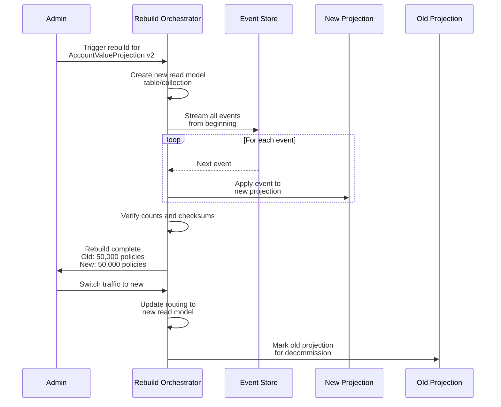
```mermaid
sequenceDiagram
    participant Admin
    participant RB as Rebuild Orchestrator
    participant ES as Event Store
    participant NP as New Projection
    participant OP as Old Projection

    Admin->>RB: Trigger rebuild for<br/>AccountValueProjection v2
    RB->>RB: Create new read model<br/>table/collection
    RB->>ES: Stream all events<br/>from beginning
    loop For each event
        ES-->>RB: Next event
        RB->>NP: Apply event to<br/>new projection
    end
    RB->>RB: Verify counts and checksums
    RB->>Admin: Rebuild complete<br/>Old: 50,000 policies<br/>New: 50,000 policies
    Admin->>RB: Switch traffic to new
    RB->>RB: Update routing to<br/>new read model
    RB->>OP: Mark old projection<br/>for decommission
```

#### Rebuild Considerations

| Concern | Solution |
|---------|----------|
| **Duration** | Parallel processing, partition by aggregate ID |
| **Live traffic** | Blue-green: build new alongside old, switch when ready |
| **Verification** | Checksum comparison, spot-check random policies |
| **Ordering** | Events must be processed in order per aggregate |
| **Idempotency** | Projections must handle duplicate events |
| **Backpressure** | Rate-limit event replay to avoid overwhelming downstream |

---

## 5. Event-Driven Microservices

### 5.1 Service Decomposition for PAS

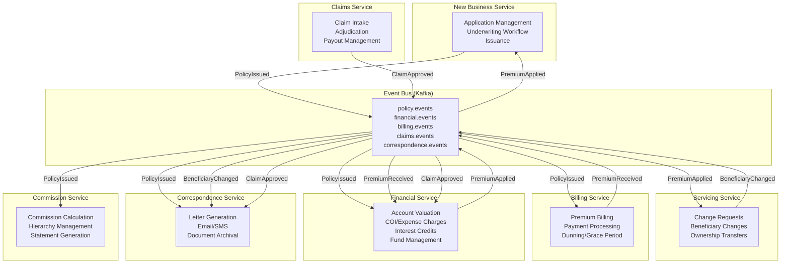
```mermaid
graph TB
    subgraph "New Business Service"
        NB[Application Management<br/>Underwriting Workflow<br/>Issuance]
    end

    subgraph "Servicing Service"
        SV[Change Requests<br/>Beneficiary Changes<br/>Ownership Transfers]
    end

    subgraph "Billing Service"
        BL[Premium Billing<br/>Payment Processing<br/>Dunning/Grace Period]
    end

    subgraph "Financial Service"
        FN[Account Valuation<br/>COI/Expense Charges<br/>Interest Credits<br/>Fund Management]
    end

    subgraph "Claims Service"
        CL[Claim Intake<br/>Adjudication<br/>Payout Management]
    end

    subgraph "Correspondence Service"
        CO[Letter Generation<br/>Email/SMS<br/>Document Archival]
    end

    subgraph "Commission Service"
        CM[Commission Calculation<br/>Hierarchy Management<br/>Statement Generation]
    end

    subgraph "Event Bus (Kafka)"
        EB[policy.events<br/>financial.events<br/>billing.events<br/>claims.events<br/>correspondence.events]
    end

    NB -->|PolicyIssued| EB
    EB -->|PolicyIssued| BL & FN & CO & CM
    BL -->|PremiumReceived| EB
    EB -->|PremiumReceived| FN
    FN -->|PremiumApplied| EB
    EB -->|PremiumApplied| NB & SV
    SV -->|BeneficiaryChanged| EB
    EB -->|BeneficiaryChanged| CO
    CL -->|ClaimApproved| EB
    EB -->|ClaimApproved| FN & CO
```

### 5.2 Event-Based Communication Patterns

#### Choreography (Decentralized)

Each service reacts to events without a central coordinator:

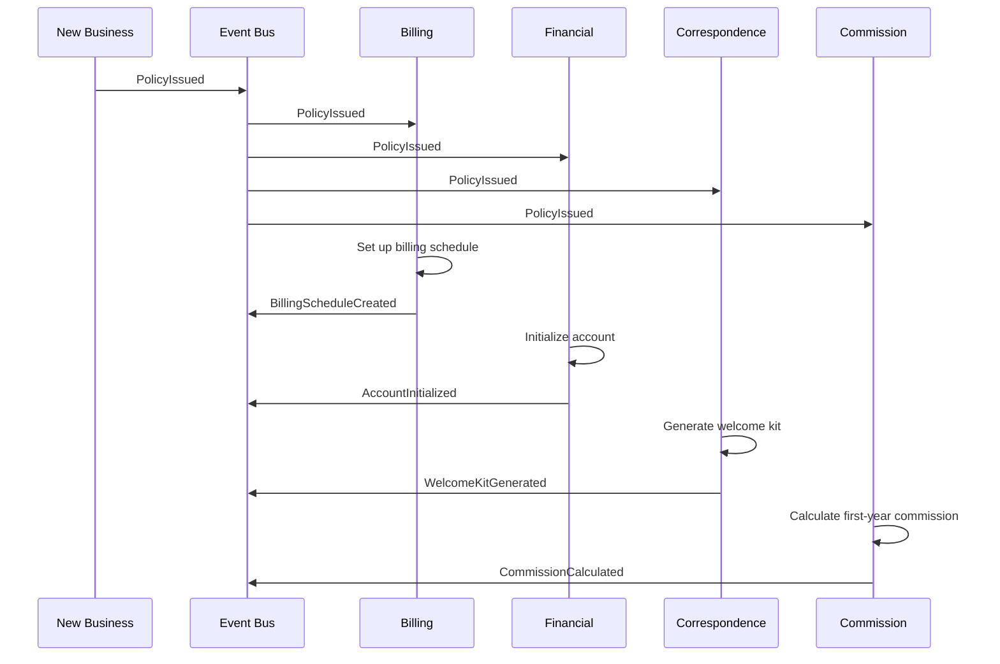
```mermaid
sequenceDiagram
    participant NB as New Business
    participant EB as Event Bus
    participant BL as Billing
    participant FN as Financial
    participant CO as Correspondence
    participant CM as Commission

    NB->>EB: PolicyIssued
    EB->>BL: PolicyIssued
    EB->>FN: PolicyIssued
    EB->>CO: PolicyIssued
    EB->>CM: PolicyIssued

    BL->>BL: Set up billing schedule
    BL->>EB: BillingScheduleCreated

    FN->>FN: Initialize account
    FN->>EB: AccountInitialized

    CO->>CO: Generate welcome kit
    CO->>EB: WelcomeKitGenerated

    CM->>CM: Calculate first-year commission
    CM->>EB: CommissionCalculated
```

#### Orchestration (Centralized)

A saga orchestrator coordinates the workflow:

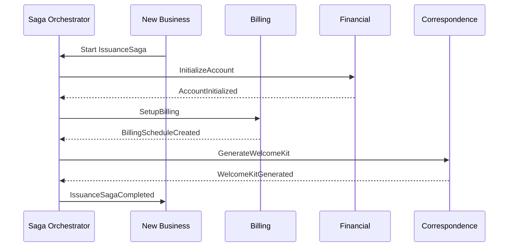
```mermaid
sequenceDiagram
    participant SO as Saga Orchestrator
    participant NB as New Business
    participant BL as Billing
    participant FN as Financial
    participant CO as Correspondence

    NB->>SO: Start IssuanceSaga
    SO->>FN: InitializeAccount
    FN-->>SO: AccountInitialized
    SO->>BL: SetupBilling
    BL-->>SO: BillingScheduleCreated
    SO->>CO: GenerateWelcomeKit
    CO-->>SO: WelcomeKitGenerated
    SO->>NB: IssuanceSagaCompleted
```

### 5.3 Choreography vs Orchestration Decision Matrix

| Factor | Choreography | Orchestration | PAS Recommendation |
|--------|-------------|---------------|-------------------|
| **Coupling** | Loose — services independent | Tighter — orchestrator knows steps | Choreography for cross-domain |
| **Visibility** | Hard to trace | Central workflow visibility | Orchestration for business-critical |
| **Complexity** | Simple for few steps | Better for many steps | Orchestration for 5+ step workflows |
| **Error handling** | Distributed, harder | Centralized compensation | Orchestration for financial transactions |
| **Scalability** | Excellent | Orchestrator can bottleneck | Choreography for high-volume |
| **Testing** | Integration tests needed | Unit-testable orchestrator | Orchestration for regulatory workflows |

**Recommendation**: Use choreography for notification/reporting (PolicyIssued → generate welcome kit), use orchestration for transactional workflows (new business saga, claim settlement saga).

---

## 6. Message Broker Architecture

### 6.1 Apache Kafka for Insurance

#### Topic Design

```
# Domain-oriented topics
insurance.policy.events          # All policy lifecycle events
insurance.financial.events       # All financial transaction events
insurance.claims.events          # All claims events
insurance.billing.events         # All billing events
insurance.party.events           # All party/demographic events
insurance.correspondence.events  # Correspondence generation events
insurance.commission.events      # Commission events

# Alternatively: event-type-oriented topics (higher granularity)
insurance.policy.issued
insurance.policy.lapsed
insurance.policy.reinstated
insurance.premium.received
insurance.premium.applied
insurance.claim.submitted
insurance.claim.approved
insurance.payout.issued
```

#### Partitioning Strategy

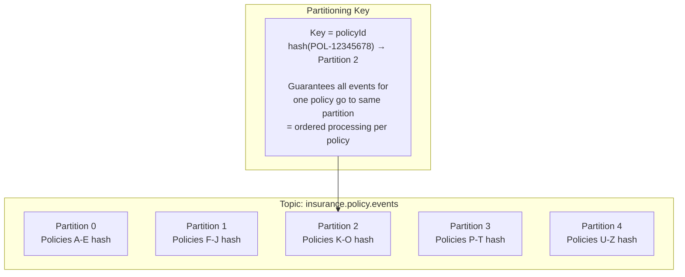
```mermaid
graph TB
    subgraph "Topic: insurance.policy.events"
        P0[Partition 0<br/>Policies A-E hash]
        P1[Partition 1<br/>Policies F-J hash]
        P2[Partition 2<br/>Policies K-O hash]
        P3[Partition 3<br/>Policies P-T hash]
        P4[Partition 4<br/>Policies U-Z hash]
    end

    subgraph "Partitioning Key"
        PK["Key = policyId<br/>hash(POL-12345678) → Partition 2<br/><br/>Guarantees all events for<br/>one policy go to same partition<br/>= ordered processing per policy"]
    end

    PK --> P2
```

**Why partition by policyId?**
- Events for the same policy are always in the same partition.
- Events are processed in order within a partition.
- Different policies can be processed in parallel across partitions.

#### Consumer Group Strategies

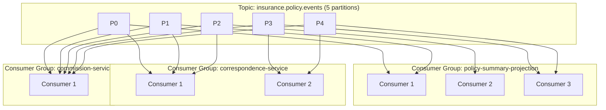
```mermaid
graph TB
    subgraph "Topic: insurance.policy.events (5 partitions)"
        P0[P0] 
        P1[P1]
        P2[P2]
        P3[P3]
        P4[P4]
    end

    subgraph "Consumer Group: policy-summary-projection"
        C1[Consumer 1] 
        C2[Consumer 2]
        C3[Consumer 3]
    end

    subgraph "Consumer Group: correspondence-service"
        D1[Consumer 1]
        D2[Consumer 2]
    end

    subgraph "Consumer Group: commission-service"
        E1[Consumer 1]
    end

    P0 --> C1
    P1 --> C1
    P2 --> C2
    P3 --> C3
    P4 --> C3

    P0 --> D1
    P1 --> D1
    P2 --> D1
    P3 --> D2
    P4 --> D2

    P0 & P1 & P2 & P3 & P4 --> E1
```

#### Exactly-Once Semantics

```java
// Kafka producer with idempotency + transactions
Properties props = new Properties();
props.put("bootstrap.servers", "kafka:9092");
props.put("enable.idempotence", true);
props.put("transactional.id", "policy-service-txn");
props.put("acks", "all");

KafkaProducer<String, String> producer = new KafkaProducer<>(props);
producer.initTransactions();

try {
    producer.beginTransaction();
    
    producer.send(new ProducerRecord<>(
        "insurance.policy.events",
        event.getPolicyId(),
        serialize(event)
    ));
    
    producer.commitTransaction();
} catch (Exception e) {
    producer.abortTransaction();
    throw e;
}
```

### 6.2 Schema Registry

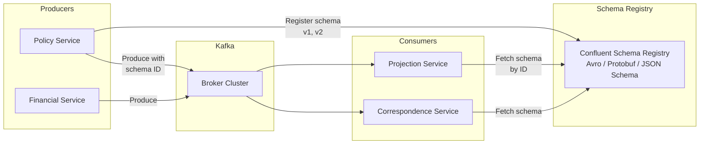
```mermaid
graph LR
    subgraph "Producers"
        P1[Policy Service]
        P2[Financial Service]
    end

    subgraph "Schema Registry"
        SR[Confluent Schema Registry<br/>Avro / Protobuf / JSON Schema]
    end

    subgraph "Kafka"
        K[Broker Cluster]
    end

    subgraph "Consumers"
        C1[Projection Service]
        C2[Correspondence Service]
    end

    P1 -->|Register schema<br/>v1, v2| SR
    P1 -->|Produce with<br/>schema ID| K
    P2 -->|Produce| K
    K --> C1 & C2
    C1 -->|Fetch schema<br/>by ID| SR
    C2 -->|Fetch schema| SR
```

#### Schema Compatibility Modes

| Mode | Allowed Changes | Use Case |
|------|----------------|----------|
| **BACKWARD** | Add optional fields, remove fields | Consumers upgraded first |
| **FORWARD** | Add fields, remove optional fields | Producers upgraded first |
| **FULL** | Add/remove optional fields only | Both directions safe |
| **NONE** | Any change | Development only |

**Recommendation for PAS**: Use FULL compatibility for domain events — only add optional fields, never remove or rename.

### 6.3 Cloud-Native Alternatives

| Platform | Service | Strengths | PAS Use Case |
|----------|---------|-----------|-------------|
| **AWS** | EventBridge + SNS/SQS | Serverless, rule-based routing | Event routing, lightweight workloads |
| **AWS** | MSK (Managed Kafka) | Kafka compatibility, managed | Full event streaming |
| **Azure** | Event Grid + Service Bus | Native Azure integration | Azure-native PAS |
| **Azure** | Event Hubs | Kafka protocol compatible | High-throughput events |
| **GCP** | Pub/Sub | Global, exactly-once | GCP-native PAS |
| **GCP** | Confluent Cloud on GCP | Full Kafka + schema registry | Enterprise Kafka |

---

## 7. Saga Pattern Deep Dive

### 7.1 New Business Issuance Saga

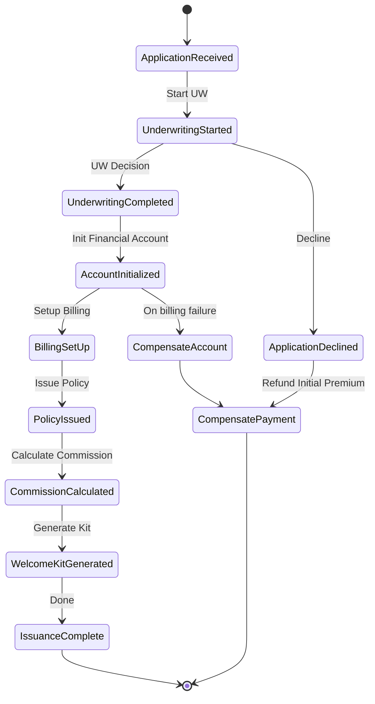
```mermaid
stateDiagram-v2
    [*] --> ApplicationReceived
    ApplicationReceived --> UnderwritingStarted : Start UW
    UnderwritingStarted --> UnderwritingCompleted : UW Decision
    UnderwritingStarted --> ApplicationDeclined : Decline
    UnderwritingCompleted --> AccountInitialized : Init Financial Account
    AccountInitialized --> BillingSetUp : Setup Billing
    BillingSetUp --> PolicyIssued : Issue Policy
    PolicyIssued --> CommissionCalculated : Calculate Commission
    CommissionCalculated --> WelcomeKitGenerated : Generate Kit
    WelcomeKitGenerated --> IssuanceComplete : Done
    IssuanceComplete --> [*]

    ApplicationDeclined --> CompensatePayment : Refund Initial Premium
    CompensatePayment --> [*]

    AccountInitialized --> CompensateAccount : On billing failure
    CompensateAccount --> CompensatePayment
```

#### Saga State Machine

```typescript
interface IssuanceSagaState {
  sagaId: string;
  applicationId: string;
  status: SagaStatus;
  currentStep: string;
  completedSteps: string[];
  failedStep?: string;
  failureReason?: string;
  data: {
    policyId?: string;
    accountId?: string;
    billingScheduleId?: string;
    commissionBatchId?: string;
  };
  createdAt: Date;
  updatedAt: Date;
}

enum SagaStatus {
  Started = 'Started',
  InProgress = 'InProgress',
  Completed = 'Completed',
  Compensating = 'Compensating',
  Failed = 'Failed',
}
```

### 7.2 Claim Settlement Saga

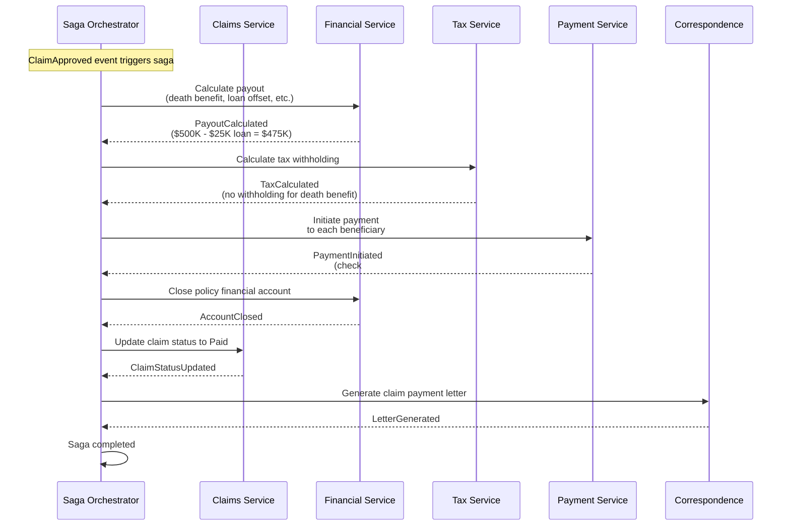
```mermaid
sequenceDiagram
    participant SO as Saga Orchestrator
    participant CL as Claims Service
    participant FN as Financial Service
    participant TX as Tax Service
    participant PY as Payment Service
    participant CO as Correspondence

    Note over SO: ClaimApproved event triggers saga
    SO->>FN: Calculate payout<br/>(death benefit, loan offset, etc.)
    FN-->>SO: PayoutCalculated<br/>($500K - $25K loan = $475K)

    SO->>TX: Calculate tax withholding
    TX-->>SO: TaxCalculated<br/>(no withholding for death benefit)

    SO->>PY: Initiate payment<br/>to each beneficiary
    PY-->>SO: PaymentInitiated<br/>(check #12345 for $475K)

    SO->>FN: Close policy financial account
    FN-->>SO: AccountClosed

    SO->>CL: Update claim status to Paid
    CL-->>SO: ClaimStatusUpdated

    SO->>CO: Generate claim payment letter
    CO-->>SO: LetterGenerated

    SO->>SO: Saga completed
```

### 7.3 1035 Exchange Saga

A 1035 exchange (tax-free replacement of one insurance/annuity contract with another) involves two carriers and must be atomic:

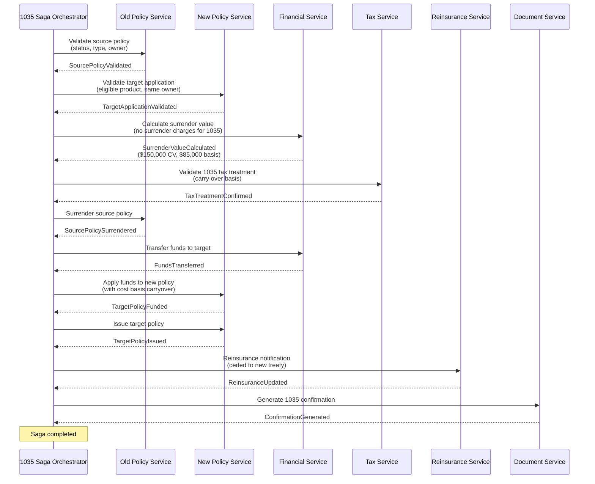
```mermaid
sequenceDiagram
    participant SO as 1035 Saga Orchestrator
    participant OLD as Old Policy Service
    participant NEW as New Policy Service
    participant FN as Financial Service
    participant TX as Tax Service
    participant RE as Reinsurance Service
    participant DOC as Document Service

    SO->>OLD: Validate source policy<br/>(status, type, owner)
    OLD-->>SO: SourcePolicyValidated

    SO->>NEW: Validate target application<br/>(eligible product, same owner)
    NEW-->>SO: TargetApplicationValidated

    SO->>FN: Calculate surrender value<br/>(no surrender charges for 1035)
    FN-->>SO: SurrenderValueCalculated<br/>($150,000 CV, $85,000 basis)

    SO->>TX: Validate 1035 tax treatment<br/>(carry over basis)
    TX-->>SO: TaxTreatmentConfirmed

    SO->>OLD: Surrender source policy
    OLD-->>SO: SourcePolicySurrendered

    SO->>FN: Transfer funds to target
    FN-->>SO: FundsTransferred

    SO->>NEW: Apply funds to new policy<br/>(with cost basis carryover)
    NEW-->>SO: TargetPolicyFunded

    SO->>NEW: Issue target policy
    NEW-->>SO: TargetPolicyIssued

    SO->>RE: Reinsurance notification<br/>(ceded to new treaty)
    RE-->>SO: ReinsuranceUpdated

    SO->>DOC: Generate 1035 confirmation
    DOC-->>SO: ConfirmationGenerated

    Note over SO: Saga completed
```

### 7.4 Compensating Transactions

| Saga Step | Forward Action | Compensating Action |
|-----------|---------------|-------------------|
| **Apply Premium** | Post premium to account | Reverse premium posting |
| **Issue Policy** | Create policy record | Void policy issuance |
| **Setup Billing** | Create billing schedule | Cancel billing schedule |
| **Calculate Commission** | Accrue commission | Reverse commission accrual (chargeback) |
| **Surrender Policy** | Close policy, release funds | Reinstate policy (if within window) |
| **Transfer Funds** | Move between funds | Reverse transfer (at current unit values) |
| **Payout Claim** | Issue payment | Stop payment / request return |
| **Generate Correspondence** | Send letter/email | Send correction letter |

### 7.5 Saga Timeout and Retry

```typescript
class SagaTimeoutManager {
  private timeouts: Map<string, SagaTimeout> = new Map();

  registerTimeout(sagaId: string, step: string, timeoutMs: number): void {
    this.timeouts.set(`${sagaId}:${step}`, {
      sagaId,
      step,
      deadline: Date.now() + timeoutMs,
      retryCount: 0,
      maxRetries: 3,
    });
  }

  async checkTimeouts(): Promise<void> {
    for (const [key, timeout] of this.timeouts) {
      if (Date.now() > timeout.deadline) {
        if (timeout.retryCount < timeout.maxRetries) {
          await this.retrySagaStep(timeout);
          timeout.retryCount++;
          timeout.deadline = Date.now() + this.getBackoffMs(timeout.retryCount);
        } else {
          await this.startCompensation(timeout.sagaId, timeout.step);
          this.timeouts.delete(key);
        }
      }
    }
  }

  private getBackoffMs(retryCount: number): number {
    return Math.min(1000 * Math.pow(2, retryCount), 60000);
  }
}
```

#### Timeout Configuration by Saga Type

| Saga | Step Timeout | Total Timeout | Retry Strategy |
|------|-------------|---------------|----------------|
| **New Business Issuance** | 30s per step | 5 minutes | 3 retries, exponential backoff |
| **Claim Settlement** | 60s per step | 15 minutes | 3 retries, human escalation |
| **1035 Exchange** | 120s per step | 30 minutes | 2 retries, human review |
| **Premium Application** | 10s per step | 1 minute | 5 retries, immediate retry |
| **Fund Transfer** | 15s per step | 2 minutes | 3 retries, exponential backoff |

### 7.6 Saga Observability

```mermaid
graph TB
    subgraph "Saga Dashboard"
        D1[Active Sagas by Type]
        D2[Failed Sagas<br/>Requiring Attention]
        D3[Compensation<br/>in Progress]
        D4[Average Duration<br/>by Saga Type]
        D5[Step Failure<br/>Heatmap]
    end

    subgraph "Monitoring"
        M1[Saga Started<br/>metric: saga_started_total]
        M2[Saga Completed<br/>metric: saga_completed_total]
        M3[Saga Failed<br/>metric: saga_failed_total]
        M4[Saga Duration<br/>metric: saga_duration_seconds]
        M5[Step Duration<br/>metric: saga_step_duration_seconds]
    end

    subgraph "Alerting"
        A1[Saga stuck > 5 min]
        A2[Compensation failure]
        A3[Saga failure rate > 1%]
    end

    M1 & M2 & M3 & M4 & M5 --> D1 & D2 & D3 & D4 & D5
    M3 --> A1 & A2 & A3
```

---

## 8. Event-Driven Integration

### 8.1 Event Mesh for Multi-System Enterprise

```mermaid
graph TB
    subgraph "Core PAS"
        PAS[Policy Admin<br/>System]
    end

    subgraph "Event Mesh"
        EM[Enterprise Event Mesh<br/>Kafka / Solace / AWS EventBridge]
    end

    subgraph "Enterprise Systems"
        CRM[CRM<br/>Salesforce]
        DW[Data Warehouse<br/>Snowflake]
        RI[Reinsurance<br/>System]
        AC[Accounting<br/>System]
        COM[Compliance<br/>System]
        DOC[Document<br/>Management]
        PORT[Customer<br/>Portal]
        AGENT[Agent<br/>Portal]
    end

    PAS --> EM
    EM --> CRM
    EM --> DW
    EM --> RI
    EM --> AC
    EM --> COM
    EM --> DOC
    EM --> PORT
    EM --> AGENT
    CRM --> EM
    PORT --> EM
```

### 8.2 Legacy System Event Generation (CDC)

For legacy PAS systems that don't natively emit events, Change Data Capture (CDC) extracts events from database changes.

```mermaid
graph LR
    subgraph "Legacy PAS"
        DB[(Legacy DB<br/>Oracle / DB2)]
        TL[Transaction Log]
    end

    subgraph "CDC Platform"
        DZ[Debezium<br/>CDC Connector]
        TR[Event Transformer<br/>DB changes → Domain Events]
    end

    subgraph "Event Infrastructure"
        K[Kafka]
    end

    subgraph "Modern Services"
        S1[Modern PAS Modules]
        S2[Analytics]
        S3[Customer Portal]
    end

    DB --> TL --> DZ --> TR --> K
    K --> S1 & S2 & S3
```

#### CDC Configuration (Debezium for Oracle)

```json
{
  "name": "legacy-pas-cdc",
  "config": {
    "connector.class": "io.debezium.connector.oracle.OracleConnector",
    "database.hostname": "legacy-pas-db.internal",
    "database.port": "1521",
    "database.user": "cdc_reader",
    "database.dbname": "PASDB",
    "database.server.name": "legacy-pas",
    "table.include.list": "PAS.POLICY,PAS.COVERAGE,PAS.PARTY,PAS.TRANSACTION,PAS.CLAIM",
    "transforms": "route",
    "transforms.route.type": "org.apache.kafka.connect.transforms.RegexRouter",
    "transforms.route.regex": "legacy-pas\\.PAS\\.(.*)",
    "transforms.route.replacement": "insurance.legacy.$1.changes"
  }
}
```

#### CDC-to-Domain Event Transformer

```typescript
class LegacyCDCTransformer {
  transform(cdcEvent: DebeziumEvent): DomainEvent | null {
    const tableName = cdcEvent.source.table;
    const operation = cdcEvent.op;

    switch (tableName) {
      case 'POLICY':
        return this.transformPolicyChange(cdcEvent);
      case 'TRANSACTION':
        return this.transformTransaction(cdcEvent);
      case 'CLAIM':
        return this.transformClaimChange(cdcEvent);
      default:
        return null;
    }
  }

  private transformPolicyChange(cdc: DebeziumEvent): DomainEvent | null {
    const before = cdc.before;
    const after = cdc.after;

    if (cdc.op === 'c' && after.STATUS === 'ACTIVE') {
      return {
        eventType: 'PolicyIssued',
        aggregateId: after.POLICY_ID,
        eventData: {
          policyId: after.POLICY_ID,
          policyNumber: after.POLICY_NUMBER,
          productCode: after.PRODUCT_CODE,
          issueDate: after.ISSUE_DATE,
          status: 'Active',
        },
        metadata: {
          source: 'legacy-cdc',
          timestamp: new Date().toISOString(),
        },
      };
    }

    if (before?.STATUS === 'ACTIVE' && after.STATUS === 'LAPSED') {
      return {
        eventType: 'PolicyLapsed',
        aggregateId: after.POLICY_ID,
        eventData: {
          policyId: after.POLICY_ID,
          lapseDate: after.LAPSE_DATE,
          lapseReason: after.LAPSE_REASON,
        },
        metadata: {
          source: 'legacy-cdc',
          timestamp: new Date().toISOString(),
        },
      };
    }

    return null;
  }
}
```

### 8.3 Event-Driven Correspondence Generation

```mermaid
sequenceDiagram
    participant EB as Event Bus
    participant CG as Correspondence<br/>Generator
    participant TE as Template Engine
    participant DS as Document Store
    participant NS as Notification Service
    participant PR as Print Service

    EB->>CG: PolicyIssued event
    CG->>CG: Determine required<br/>correspondence<br/>(Welcome Kit, ID Card, Schedule)
    CG->>TE: Render welcome letter<br/>with policy data
    TE-->>CG: Rendered PDF
    CG->>DS: Archive document
    CG->>NS: Send email notification<br/>with attachment
    CG->>PR: Queue for print<br/>(if physical delivery)
    CG->>EB: WelcomeKitGenerated
```

### 8.4 Event-Driven Compliance Monitoring

```mermaid
graph TB
    subgraph "Event Stream"
        E1[PremiumReceived]
        E2[WithdrawalProcessed]
        E3[LoanDisbursed]
        E4[FundTransferExecuted]
        E5[OwnershipChanged]
    end

    subgraph "Compliance Engine"
        AML[AML/KYC Rules<br/>Large transaction detection<br/>Structuring detection]
        MEC[MEC Monitoring<br/>7-pay test tracking<br/>TAMRA compliance]
        SUIT[Suitability Rules<br/>Age-appropriate products<br/>Risk tolerance alignment]
        REG[Regulatory Rules<br/>State-specific requirements<br/>DOL fiduciary]
    end

    subgraph "Actions"
        AL[Alert Generation]
        RP[Regulatory Report]
        HLD[Transaction Hold]
        NF[Notification to<br/>Compliance Officer]
    end

    E1 & E2 & E3 --> AML
    E1 --> MEC
    E1 & E4 --> SUIT
    E5 --> REG

    AML --> AL & HLD
    MEC --> AL & NF
    SUIT --> RP
    REG --> RP & NF
```

---

## 9. Eventual Consistency Patterns

### 9.1 Read-Your-Own-Writes

After a user submits a change, they expect to see it immediately — even though the read model may not yet be updated.

```mermaid
sequenceDiagram
    participant UI as Agent Portal
    participant CMD as Command API
    participant ES as Event Store
    participant EB as Event Bus
    participant PROJ as Projection
    participant QRY as Query API

    UI->>CMD: Change beneficiary
    CMD->>ES: Store events
    CMD-->>UI: 202 Accepted<br/>eventId: evt-123<br/>expectedVersion: 48
    ES->>EB: Publish event

    Note over UI: UI polls with consistency token
    UI->>QRY: GET /policy/POL-123<br/>If-Event-Processed: evt-123

    alt Projection caught up
        QRY-->>UI: 200 OK (updated data)
    else Projection behind
        QRY-->>UI: 202 Accepted<br/>Retry-After: 1
        Note over UI: Retry after 1 second
    end

    EB->>PROJ: Process event
    PROJ->>PROJ: Update read model

    UI->>QRY: GET /policy/POL-123<br/>If-Event-Processed: evt-123
    QRY-->>UI: 200 OK (updated data)
```

### 9.2 Causal Consistency

Ensure events are processed in causal order across services:

```typescript
interface EventMetadata {
  eventId: string;
  timestamp: string;
  correlationId: string;
  causationId: string;
  aggregateId: string;
  sequenceNumber: number;
  vectorClock?: Record<string, number>;
}

// A BeneficiaryChanged event caused by a ChangeRequestApproved event
const beneficiaryChanged: DomainEvent = {
  eventType: 'BeneficiaryChanged',
  metadata: {
    eventId: 'evt-003',
    correlationId: 'corr-001',
    causationId: 'evt-002',   // caused by ChangeRequestApproved
    sequenceNumber: 48,
  },
};
```

### 9.3 Idempotent Event Handlers

Every event handler must safely handle duplicate events:

```typescript
class IdempotentEventHandler {
  private processedEvents: Set<string> = new Set();

  async handle(event: DomainEvent): Promise<void> {
    if (await this.isAlreadyProcessed(event.metadata.eventId)) {
      console.log(`Skipping duplicate event: ${event.metadata.eventId}`);
      return;
    }

    await this.processEvent(event);
    await this.markAsProcessed(event.metadata.eventId);
  }

  private async isAlreadyProcessed(eventId: string): Promise<boolean> {
    return this.db.processedEvents.exists({ eventId });
  }

  private async markAsProcessed(eventId: string): Promise<void> {
    await this.db.processedEvents.insert({
      eventId,
      processedAt: new Date(),
    });
  }
}
```

### 9.4 Deduplication Strategies

| Strategy | How It Works | Pro | Con |
|----------|-------------|-----|-----|
| **Event ID tracking** | Store processed event IDs | Simple, reliable | Storage overhead |
| **Idempotency keys** | Client-supplied unique key | Client controls | Requires client participation |
| **Natural idempotency** | Operations are naturally idempotent (SET vs INCREMENT) | No extra storage | Not always possible |
| **Inbox pattern** | Dedicated inbox table, process exactly once | Transactional guarantee | Complexity |
| **Deduplication window** | Track IDs for last N hours | Bounded storage | May miss old duplicates |

### 9.5 Conflict Resolution

When eventual consistency leads to conflicting states:

| Conflict Type | Resolution Strategy | Example |
|--------------|-------------------|---------|
| **Last-writer-wins** | Latest timestamp prevails | Address updates |
| **Business rule** | Domain-specific merge | Beneficiary: reject if percentages conflict |
| **Manual resolution** | Queue for human review | Ownership disputes |
| **Merge** | Combine non-conflicting changes | Add rider + change address simultaneously |

---

## 10. Complete Event Catalog

### 10.1 Event Schema Standards

Every event follows this base schema:

```json
{
  "$schema": "http://json-schema.org/draft-07/schema#",
  "title": "InsuranceDomainEvent",
  "type": "object",
  "required": ["eventId", "eventType", "schemaVersion", "aggregateType", "aggregateId", "timestamp", "data"],
  "properties": {
    "eventId": {
      "type": "string",
      "format": "uuid",
      "description": "Globally unique event identifier"
    },
    "eventType": {
      "type": "string",
      "description": "Fully qualified event type name"
    },
    "schemaVersion": {
      "type": "string",
      "description": "Semantic version of the event schema"
    },
    "aggregateType": {
      "type": "string",
      "enum": ["Policy", "Financial", "Claim", "Party", "Billing"]
    },
    "aggregateId": {
      "type": "string",
      "description": "Identifier of the aggregate that produced this event"
    },
    "timestamp": {
      "type": "string",
      "format": "date-time",
      "description": "When the event occurred"
    },
    "metadata": {
      "type": "object",
      "properties": {
        "correlationId": { "type": "string" },
        "causationId": { "type": "string" },
        "userId": { "type": "string" },
        "source": { "type": "string" },
        "traceId": { "type": "string" }
      }
    },
    "data": {
      "type": "object",
      "description": "Event-specific payload"
    }
  }
}
```

### 10.2 Selected Event Schemas (JSON)

#### PolicyIssued

```json
{
  "eventId": "evt-2026-02-01-001",
  "eventType": "PolicyIssued",
  "schemaVersion": "2.0",
  "aggregateType": "Policy",
  "aggregateId": "POL-12345678",
  "timestamp": "2026-02-01T00:15:00Z",
  "metadata": {
    "correlationId": "corr-app-001",
    "causationId": "cmd-issue-001",
    "userId": "system-issuance",
    "source": "new-business-service"
  },
  "data": {
    "policyId": "POL-12345678",
    "policyNumber": "A1234567",
    "productCode": "UL-100",
    "productName": "Universal Life 100",
    "issueDate": "2026-02-01",
    "effectiveDate": "2026-02-01",
    "maturityDate": "2076-02-01",
    "jurisdictionCode": "NY",
    "totalFaceAmount": { "value": 500000.00, "currency": "USD" },
    "ownerPartyId": "PTY-001",
    "ownerName": "John A. Smith",
    "insuredPartyId": "PTY-001",
    "insuredName": "John A. Smith",
    "insuredAge": 35,
    "insuredGender": "Male",
    "riskClass": "PreferredNonSmoker",
    "producerCode": "AGT-001234",
    "applicationId": "APP-001",
    "initialPremium": { "value": 5400.00, "currency": "USD" },
    "premiumMode": "Monthly",
    "coverages": [
      {
        "coverageId": "COV-001",
        "planCode": "UL-BASE",
        "faceAmount": { "value": 500000.00, "currency": "USD" },
        "status": "Active"
      }
    ]
  }
}
```

#### PremiumApplied

```json
{
  "eventId": "evt-2026-02-01-002",
  "eventType": "PremiumApplied",
  "schemaVersion": "2.0",
  "aggregateType": "Financial",
  "aggregateId": "POL-12345678",
  "timestamp": "2026-02-01T00:20:00Z",
  "metadata": {
    "correlationId": "corr-pay-001",
    "causationId": "evt-premium-received-001",
    "source": "financial-service"
  },
  "data": {
    "policyId": "POL-12345678",
    "paymentId": "PAY-001",
    "amount": { "value": 450.00, "currency": "USD" },
    "effectiveDate": "2026-02-01",
    "paymentType": "ScheduledPremium",
    "fundAllocations": [
      { "fundCode": "GROWTH-01", "units": 4.4554, "amount": 225.00 },
      { "fundCode": "BOND-01", "units": 8.4112, "amount": 225.00 }
    ],
    "postTransactionAccountValue": { "value": 125882.67, "currency": "USD" }
  }
}
```

#### WithdrawalProcessed

```json
{
  "eventId": "evt-2026-03-15-001",
  "eventType": "WithdrawalProcessed",
  "schemaVersion": "2.0",
  "aggregateType": "Financial",
  "aggregateId": "POL-12345678",
  "timestamp": "2026-03-15T10:00:00Z",
  "metadata": {
    "correlationId": "corr-wdr-001",
    "causationId": "cmd-withdrawal-001",
    "userId": "owner-PTY-001",
    "source": "financial-service"
  },
  "data": {
    "policyId": "POL-12345678",
    "withdrawalId": "WDR-001",
    "withdrawalType": "Partial",
    "grossAmount": { "value": 15000.00, "currency": "USD" },
    "surrenderCharge": { "value": 0.00, "currency": "USD" },
    "federalWithholding": { "value": 1500.00, "currency": "USD" },
    "stateWithholding": { "value": 750.00, "currency": "USD" },
    "netDisbursement": { "value": 12750.00, "currency": "USD" },
    "taxableAmount": { "value": 8200.00, "currency": "USD" },
    "costBasisUsed": { "value": 6800.00, "currency": "USD" },
    "fundSources": [
      { "fundCode": "GROWTH-01", "unitsRedeemed": 296.0591, "amount": 15000.00 }
    ],
    "disbursementMethod": "ACH",
    "postTransactionAccountValue": { "value": 110882.67, "currency": "USD" }
  }
}
```

#### ClaimSubmitted

```json
{
  "eventId": "evt-2026-04-01-001",
  "eventType": "ClaimSubmitted",
  "schemaVersion": "2.0",
  "aggregateType": "Claim",
  "aggregateId": "CLM-001",
  "timestamp": "2026-04-01T09:30:00Z",
  "metadata": {
    "correlationId": "corr-clm-001",
    "source": "claims-service"
  },
  "data": {
    "claimId": "CLM-001",
    "claimNumber": "C-2026-00001",
    "policyId": "POL-12345678",
    "claimType": "Death",
    "dateOfEvent": "2026-03-25",
    "causeOfEvent": "Natural Causes",
    "claimantPartyId": "PTY-SPOUSE",
    "claimantName": "Jane Smith",
    "claimantRelationship": "Spouse",
    "estimatedBenefitAmount": { "value": 500000.00, "currency": "USD" },
    "contestabilityStatus": "BeyondContestability",
    "assignedExaminerId": "EXM-Johnson"
  }
}
```

#### BeneficiaryChanged

```json
{
  "eventId": "evt-2026-02-15-001",
  "eventType": "BeneficiaryChanged",
  "schemaVersion": "2.0",
  "aggregateType": "Policy",
  "aggregateId": "POL-12345678",
  "timestamp": "2026-02-15T14:00:00Z",
  "metadata": {
    "correlationId": "corr-chg-001",
    "causationId": "cmd-change-bene-001",
    "userId": "agent-AGT-001234",
    "source": "servicing-service"
  },
  "data": {
    "policyId": "POL-12345678",
    "changeRequestId": "CHG-001",
    "effectiveDate": "2026-02-15",
    "previousBeneficiaries": [
      {
        "designationType": "Primary",
        "partyId": "PTY-SPOUSE-OLD",
        "name": "Mary Smith",
        "relationship": "Spouse",
        "percentage": 100.0
      }
    ],
    "newBeneficiaries": [
      {
        "designationType": "Primary",
        "partyId": "PTY-CHILD-1",
        "name": "Sarah Smith",
        "relationship": "Child",
        "percentage": 60.0
      },
      {
        "designationType": "Primary",
        "partyId": "PTY-CHILD-2",
        "name": "Michael Smith",
        "relationship": "Child",
        "percentage": 40.0
      }
    ]
  }
}
```

#### FundTransferExecuted

```json
{
  "eventId": "evt-2026-03-01-001",
  "eventType": "FundTransferExecuted",
  "schemaVersion": "2.0",
  "aggregateType": "Financial",
  "aggregateId": "POL-12345678",
  "timestamp": "2026-03-01T16:00:00Z",
  "data": {
    "policyId": "POL-12345678",
    "transferId": "XFR-001",
    "transferType": "Transfer",
    "valuationDate": "2026-03-01",
    "transfers": [
      {
        "fromFund": "GROWTH-01",
        "toFund": "BOND-01",
        "unitsRedeemed": 197.0443,
        "redemptionUnitValue": { "value": 50.75, "currency": "USD" },
        "unitsPurchased": 373.8318,
        "purchaseUnitValue": { "value": 26.75, "currency": "USD" },
        "amount": { "value": 10000.00, "currency": "USD" }
      }
    ],
    "remainingTransfersThisYear": 11,
    "annualTransferLimit": 12
  }
}
```

---

## 11. Architecture Diagrams

### 11.1 Full Event-Driven PAS Architecture

```mermaid
graph TB
    subgraph "Channels"
        CH1[Agent Portal]
        CH2[Customer Portal]
        CH3[Mobile App]
        CH4[Partner API]
    end

    subgraph "API Layer"
        GW[API Gateway]
        CMD_API[Command API<br/>Write Operations]
        QRY_API[Query API<br/>Read Operations]
    end

    subgraph "Command Services"
        NBS[New Business<br/>Service]
        SVS[Servicing<br/>Service]
        BLS[Billing<br/>Service]
        FNS[Financial<br/>Service]
        CLS[Claims<br/>Service]
    end

    subgraph "Event Infrastructure"
        ES[(Event Store<br/>PostgreSQL)]
        OB[Outbox<br/>Processor]
        KF[Apache Kafka<br/>Event Bus]
        SR[Schema Registry]
    end

    subgraph "Saga Orchestration"
        SO[Saga<br/>Orchestrator]
        SS[(Saga State<br/>Store)]
    end

    subgraph "Projection Services"
        PS[Policy Summary<br/>Projection]
        AV[Account Value<br/>Projection]
        CS[Claim Status<br/>Projection]
        BS[Billing Status<br/>Projection]
        AB[Agent Book<br/>Projection]
    end

    subgraph "Read Models"
        RM1[(Policy Read DB<br/>PostgreSQL)]
        RM2[(Financial Read DB<br/>PostgreSQL)]
        RM3[(Claims Read DB<br/>PostgreSQL)]
        RM4[(Search Index<br/>Elasticsearch)]
        RM5[(Cache<br/>Redis)]
    end

    subgraph "Integration"
        CDC[Legacy CDC<br/>Debezium]
        WH[Webhook<br/>Delivery]
        NT[Notification<br/>Service]
        CO[Correspondence<br/>Generator]
    end

    CH1 & CH2 & CH3 & CH4 --> GW
    GW --> CMD_API & QRY_API
    CMD_API --> NBS & SVS & BLS & FNS & CLS
    NBS & SVS & BLS & FNS & CLS --> ES
    ES --> OB --> KF
    KF --> SR
    KF --> PS & AV & CS & BS & AB
    KF --> SO
    SO --> SS
    SO --> NBS & SVS & BLS & FNS & CLS
    PS --> RM1
    AV --> RM2
    CS --> RM3
    PS & AV & CS --> RM4
    PS & AV --> RM5
    QRY_API --> RM1 & RM2 & RM3 & RM4 & RM5
    KF --> CDC & WH & NT & CO
```

### 11.2 Kafka Topic Topology

```mermaid
graph TB
    subgraph "Kafka Cluster"
        subgraph "Policy Topics"
            T1[insurance.policy.events<br/>12 partitions<br/>Retention: 90 days]
            T1DLQ[insurance.policy.events.dlq<br/>Dead Letter Queue]
        end

        subgraph "Financial Topics"
            T2[insurance.financial.events<br/>12 partitions<br/>Retention: 90 days]
            T2DLQ[insurance.financial.events.dlq]
        end

        subgraph "Claims Topics"
            T3[insurance.claims.events<br/>6 partitions<br/>Retention: 90 days]
        end

        subgraph "Billing Topics"
            T4[insurance.billing.events<br/>6 partitions<br/>Retention: 30 days]
        end

        subgraph "Integration Topics"
            T5[insurance.correspondence.commands<br/>6 partitions]
            T6[insurance.notifications.commands<br/>6 partitions]
            T7[insurance.legacy.cdc.changes<br/>12 partitions]
        end

        subgraph "Saga Topics"
            T8[insurance.saga.commands<br/>6 partitions]
            T9[insurance.saga.replies<br/>6 partitions]
        end
    end
```

---

## 12. Code Examples

### 12.1 Event Handler Implementation (TypeScript)

```typescript
interface DomainEvent {
  eventId: string;
  eventType: string;
  aggregateType: string;
  aggregateId: string;
  timestamp: string;
  metadata: EventMetadata;
  data: Record<string, any>;
}

interface EventMetadata {
  correlationId: string;
  causationId: string;
  userId?: string;
  source: string;
  traceId?: string;
}

abstract class EventHandler<T extends DomainEvent = DomainEvent> {
  abstract eventType: string;

  async process(event: T): Promise<void> {
    const span = tracer.startSpan(`handle:${this.eventType}`);
    try {
      if (await this.isDuplicate(event)) {
        span.addEvent('duplicate_event_skipped');
        return;
      }

      await this.handle(event);
      await this.markProcessed(event);

      span.setStatus({ code: SpanStatusCode.OK });
    } catch (error) {
      span.setStatus({ code: SpanStatusCode.ERROR, message: error.message });
      throw error;
    } finally {
      span.end();
    }
  }

  protected abstract handle(event: T): Promise<void>;

  private async isDuplicate(event: T): Promise<boolean> {
    return this.processedEventStore.exists(event.eventId);
  }

  private async markProcessed(event: T): Promise<void> {
    await this.processedEventStore.insert({
      eventId: event.eventId,
      eventType: event.eventType,
      processedAt: new Date(),
    });
  }
}

class PolicyIssuedHandler extends EventHandler {
  eventType = 'PolicyIssued';

  protected async handle(event: DomainEvent): Promise<void> {
    const data = event.data;

    await this.db.transaction(async (tx) => {
      await tx.policySummary.insert({
        policyId: data.policyId,
        policyNumber: data.policyNumber,
        productCode: data.productCode,
        productName: data.productName,
        status: 'Active',
        issueDate: data.issueDate,
        effectiveDate: data.effectiveDate,
        totalFaceAmount: data.totalFaceAmount.value,
        ownerPartyId: data.ownerPartyId,
        ownerName: data.ownerName,
        insuredPartyId: data.insuredPartyId,
        insuredName: data.insuredName,
        producerCode: data.producerCode,
        jurisdictionCode: data.jurisdictionCode,
      });

      await tx.searchIndex.index({
        id: data.policyId,
        policyNumber: data.policyNumber,
        ownerName: data.ownerName,
        insuredName: data.insuredName,
        productName: data.productName,
        status: 'Active',
      });
    });
  }
}
```

### 12.2 Projection Builder (Java)

```java
@Component
public class AccountValueProjectionBuilder {

    @Autowired
    private AccountValueRepository accountValueRepo;

    @KafkaListener(
        topics = "insurance.financial.events",
        groupId = "account-value-projection",
        containerFactory = "kafkaListenerContainerFactory"
    )
    public void handleFinancialEvent(ConsumerRecord<String, String> record) {
        DomainEvent event = deserialize(record.value());

        switch (event.getEventType()) {
            case "PremiumApplied":
                handlePremiumApplied(event);
                break;
            case "COIDeducted":
                handleCOIDeducted(event);
                break;
            case "InterestCredited":
                handleInterestCredited(event);
                break;
            case "WithdrawalProcessed":
                handleWithdrawalProcessed(event);
                break;
            case "LoanDisbursed":
                handleLoanDisbursed(event);
                break;
            case "FundTransferExecuted":
                handleFundTransferExecuted(event);
                break;
        }
    }

    private void handlePremiumApplied(DomainEvent event) {
        String policyId = event.getData().get("policyId").asText();
        BigDecimal amount = event.getData().get("amount").get("value").decimalValue();

        accountValueRepo.findByPolicyId(policyId).ifPresentOrElse(
            av -> {
                av.setAccountValue(av.getAccountValue().add(amount));
                av.setLastPremiumDate(LocalDate.parse(
                    event.getData().get("effectiveDate").asText()));
                av.setUpdatedAt(Instant.now());

                JsonNode allocations = event.getData().get("fundAllocations");
                for (JsonNode alloc : allocations) {
                    String fundCode = alloc.get("fundCode").asText();
                    BigDecimal units = alloc.get("units").decimalValue();
                    BigDecimal fundAmount = alloc.get("amount").decimalValue();

                    FundValue fv = av.getFundValue(fundCode);
                    fv.setUnits(fv.getUnits().add(units));
                    fv.setTotalValue(fv.getTotalValue().add(fundAmount));
                }

                accountValueRepo.save(av);
            },
            () -> {
                AccountValue newAv = new AccountValue();
                newAv.setPolicyId(policyId);
                newAv.setAccountValue(amount);
                accountValueRepo.save(newAv);
            }
        );
    }
}
```

### 12.3 Saga Orchestrator (TypeScript)

```typescript
class NewBusinessIssuanceSaga {
  private state: IssuanceSagaState;

  constructor(private sagaStore: SagaStateStore, private eventBus: EventBus) {}

  async start(applicationId: string, applicationData: any): Promise<void> {
    this.state = {
      sagaId: generateId(),
      applicationId,
      status: SagaStatus.Started,
      currentStep: 'VALIDATE_APPLICATION',
      completedSteps: [],
      data: {},
      createdAt: new Date(),
      updatedAt: new Date(),
    };
    await this.sagaStore.save(this.state);
    await this.executeStep('VALIDATE_APPLICATION');
  }

  async handleStepResponse(step: string, result: any): Promise<void> {
    this.state = await this.sagaStore.load(this.state.sagaId);

    if (result.success) {
      this.state.completedSteps.push(step);
      this.state.data = { ...this.state.data, ...result.data };

      const nextStep = this.getNextStep(step);
      if (nextStep) {
        this.state.currentStep = nextStep;
        await this.sagaStore.save(this.state);
        await this.executeStep(nextStep);
      } else {
        this.state.status = SagaStatus.Completed;
        await this.sagaStore.save(this.state);
        await this.eventBus.publish({
          eventType: 'IssuanceSagaCompleted',
          data: { sagaId: this.state.sagaId, policyId: this.state.data.policyId },
        });
      }
    } else {
      this.state.status = SagaStatus.Compensating;
      this.state.failedStep = step;
      this.state.failureReason = result.error;
      await this.sagaStore.save(this.state);
      await this.compensate();
    }
  }

  private async executeStep(step: string): Promise<void> {
    switch (step) {
      case 'VALIDATE_APPLICATION':
        await this.eventBus.publish({
          eventType: 'ValidateApplicationCommand',
          data: { applicationId: this.state.applicationId },
        });
        break;
      case 'INITIALIZE_ACCOUNT':
        await this.eventBus.publish({
          eventType: 'InitializeAccountCommand',
          data: {
            policyId: this.state.data.policyId,
            productCode: this.state.data.productCode,
          },
        });
        break;
      case 'SETUP_BILLING':
        await this.eventBus.publish({
          eventType: 'SetupBillingCommand',
          data: {
            policyId: this.state.data.policyId,
            premiumMode: this.state.data.premiumMode,
            modalPremium: this.state.data.modalPremium,
          },
        });
        break;
      case 'ISSUE_POLICY':
        await this.eventBus.publish({
          eventType: 'IssuePolicyCommand',
          data: {
            applicationId: this.state.applicationId,
            policyId: this.state.data.policyId,
          },
        });
        break;
      case 'CALCULATE_COMMISSION':
        await this.eventBus.publish({
          eventType: 'CalculateCommissionCommand',
          data: {
            policyId: this.state.data.policyId,
            producerCode: this.state.data.producerCode,
            premium: this.state.data.initialPremium,
          },
        });
        break;
      case 'GENERATE_WELCOME_KIT':
        await this.eventBus.publish({
          eventType: 'GenerateWelcomeKitCommand',
          data: { policyId: this.state.data.policyId },
        });
        break;
    }
  }

  private getNextStep(currentStep: string): string | null {
    const steps = [
      'VALIDATE_APPLICATION',
      'INITIALIZE_ACCOUNT',
      'SETUP_BILLING',
      'ISSUE_POLICY',
      'CALCULATE_COMMISSION',
      'GENERATE_WELCOME_KIT',
    ];
    const idx = steps.indexOf(currentStep);
    return idx < steps.length - 1 ? steps[idx + 1] : null;
  }

  private async compensate(): Promise<void> {
    const compensationSteps = [...this.state.completedSteps].reverse();

    for (const step of compensationSteps) {
      switch (step) {
        case 'CALCULATE_COMMISSION':
          await this.eventBus.publish({
            eventType: 'ReverseCommissionCommand',
            data: { commissionBatchId: this.state.data.commissionBatchId },
          });
          break;
        case 'ISSUE_POLICY':
          await this.eventBus.publish({
            eventType: 'VoidPolicyCommand',
            data: { policyId: this.state.data.policyId },
          });
          break;
        case 'SETUP_BILLING':
          await this.eventBus.publish({
            eventType: 'CancelBillingCommand',
            data: { billingScheduleId: this.state.data.billingScheduleId },
          });
          break;
        case 'INITIALIZE_ACCOUNT':
          await this.eventBus.publish({
            eventType: 'CloseAccountCommand',
            data: { accountId: this.state.data.accountId },
          });
          break;
      }
    }

    this.state.status = SagaStatus.Failed;
    await this.sagaStore.save(this.state);
  }
}
```

---

## 13. Testing Event-Driven Systems

### 13.1 Event Handler Unit Testing

```typescript
describe('PolicyIssuedHandler', () => {
  let handler: PolicyIssuedHandler;
  let mockDb: MockDatabase;

  beforeEach(() => {
    mockDb = new MockDatabase();
    handler = new PolicyIssuedHandler(mockDb);
  });

  it('should create policy summary on PolicyIssued', async () => {
    const event = createPolicyIssuedEvent({
      policyId: 'POL-001',
      policyNumber: 'A1234567',
      productCode: 'UL-100',
      status: 'Active',
    });

    await handler.handle(event);

    const summary = await mockDb.policySummary.findOne({ policyId: 'POL-001' });
    expect(summary).toBeDefined();
    expect(summary.policyNumber).toBe('A1234567');
    expect(summary.status).toBe('Active');
  });

  it('should be idempotent — handle duplicate events', async () => {
    const event = createPolicyIssuedEvent({ policyId: 'POL-001' });

    await handler.process(event);
    await handler.process(event);

    const count = await mockDb.policySummary.count({ policyId: 'POL-001' });
    expect(count).toBe(1);
  });
});
```

### 13.2 Saga Testing

```typescript
describe('NewBusinessIssuanceSaga', () => {
  let saga: NewBusinessIssuanceSaga;
  let mockEventBus: MockEventBus;
  let mockSagaStore: MockSagaStore;

  beforeEach(() => {
    mockEventBus = new MockEventBus();
    mockSagaStore = new MockSagaStore();
    saga = new NewBusinessIssuanceSaga(mockSagaStore, mockEventBus);
  });

  it('should complete all steps in order', async () => {
    await saga.start('APP-001', testApplicationData);
    expect(mockEventBus.lastPublished.eventType).toBe('ValidateApplicationCommand');

    await saga.handleStepResponse('VALIDATE_APPLICATION', {
      success: true,
      data: { policyId: 'POL-001' },
    });
    expect(mockEventBus.lastPublished.eventType).toBe('InitializeAccountCommand');

    await saga.handleStepResponse('INITIALIZE_ACCOUNT', {
      success: true,
      data: { accountId: 'ACC-001' },
    });
    expect(mockEventBus.lastPublished.eventType).toBe('SetupBillingCommand');
  });

  it('should compensate on failure', async () => {
    await saga.start('APP-001', testApplicationData);

    await saga.handleStepResponse('VALIDATE_APPLICATION', { success: true, data: { policyId: 'POL-001' } });
    await saga.handleStepResponse('INITIALIZE_ACCOUNT', { success: true, data: { accountId: 'ACC-001' } });
    await saga.handleStepResponse('SETUP_BILLING', { success: false, error: 'Billing setup failed' });

    const publishedEvents = mockEventBus.allPublished;
    const compensationEvents = publishedEvents.filter(e =>
      ['CancelBillingCommand', 'CloseAccountCommand'].includes(e.eventType)
    );
    expect(compensationEvents.length).toBeGreaterThanOrEqual(1);

    const state = await mockSagaStore.load(saga.sagaId);
    expect(state.status).toBe(SagaStatus.Failed);
  });
});
```

### 13.3 End-to-End Event Flow Testing

```typescript
describe('Premium Payment E2E Flow', () => {
  it('should process premium and update all projections', async () => {
    const policyId = 'POL-TEST-E2E';

    await commandApi.post('/payments', {
      policyId,
      amount: { value: 450.00, currency: 'USD' },
      paymentType: 'ScheduledPremium',
    });

    await waitForEventProcessing(5000);

    const summary = await queryApi.get(`/policies/${policyId}`);
    expect(summary.data.lastPremiumDate).toBeDefined();

    const values = await queryApi.get(`/policies/${policyId}/values`);
    expect(values.data.accountValue.amount).toBeGreaterThan(0);

    const billing = await queryApi.get(`/policies/${policyId}/billing`);
    expect(billing.data.lastPaymentDate).toBeDefined();
  });
});
```

---

## 14. Operational Considerations

### 14.1 Event Store Operations

| Operation | Frequency | Impact | Mitigation |
|-----------|-----------|--------|------------|
| **Compaction** | Weekly | Removes superseded snapshots | Schedule during low-traffic |
| **Archival** | Monthly | Move old events to cold storage | Keep snapshots accessible |
| **Backup** | Daily | Event store is system of record | Point-in-time recovery |
| **Schema migration** | Per release | New event versions | Rolling upcasters |
| **Replay** | On-demand | Rebuild projections | Throttle replay speed |

### 14.2 Monitoring Checklist

- **Consumer lag**: Events waiting to be processed per consumer group.
- **Processing rate**: Events per second per consumer.
- **Error rate**: Failed event handlers.
- **Dead letter queue depth**: Events that couldn't be processed.
- **Projection staleness**: Time since last projection update.
- **Saga duration**: Sagas exceeding expected completion time.
- **Event store growth**: Database size and query performance.

### 14.3 Disaster Recovery

```mermaid
graph TB
    subgraph "Primary Region"
        ES1[(Event Store<br/>Primary)]
        K1[Kafka Cluster<br/>Primary]
        RM1[(Read Models)]
    end

    subgraph "DR Region"
        ES2[(Event Store<br/>Replica)]
        K2[Kafka Cluster<br/>Mirror]
        RM2[(Read Models<br/>Rebuilt from events)]
    end

    ES1 -->|Synchronous Replication| ES2
    K1 -->|MirrorMaker 2| K2
    Note over RM2: Read models can be rebuilt<br/>from event store + event replay
```

---

## 15. Migration Strategy

### 15.1 Strangler Fig Pattern for Event-Driven Migration

```mermaid
graph TB
    subgraph "Phase 1: CDC from Legacy"
        L1[Legacy PAS] --> CDC1[CDC Connector]
        CDC1 --> K1[Kafka]
        K1 --> NEW1[New Read Models]
    end

    subgraph "Phase 2: Dual Write"
        L2[Legacy PAS] --> CDC2[CDC]
        CMD2[New Command Service] --> ES2[Event Store]
        CDC2 --> K2[Kafka]
        ES2 --> K2
        K2 --> NEW2[New Projections]
    end

    subgraph "Phase 3: Event-Sourced"
        CMD3[Command Services] --> ES3[Event Store]
        ES3 --> K3[Kafka]
        K3 --> PROJ3[Projections]
        PROJ3 --> RM3[Read Models]
    end
```

### 15.2 Migration Phases

| Phase | Duration | Description |
|-------|----------|-------------|
| **1. Shadow Mode** | 3-6 months | CDC generates events from legacy; new projections built but not served to users |
| **2. Read Migration** | 3-6 months | Queries served from new read models; writes still go to legacy |
| **3. Write Migration** | 6-12 months | New command services handle writes; events sourced; legacy receives events |
| **4. Cutover** | 1-3 months | Legacy decommissioned; full event-sourced architecture |

---

## Summary

Event-Driven Architecture and CQRS provide a natural fit for life insurance policy administration:

1. **Events are the source of truth**: Every policy state change is captured as an immutable event, providing a complete audit trail and temporal query capability.
2. **CQRS optimizes for different workloads**: Write operations (policy transactions) and read operations (policy inquiry) can scale independently with different data models.
3. **Sagas manage distributed transactions**: Complex insurance workflows (issuance, claim settlement, 1035 exchanges) use saga patterns with compensating actions.
4. **Event-driven integration** decouples systems: CRM, billing, correspondence, compliance, and reinsurance systems react to events without tight coupling.
5. **Eventual consistency** is managed through patterns: Read-your-own-writes, idempotent handlers, and deduplication ensure correctness.
6. **Legacy migration** is achievable incrementally: CDC bridges legacy systems into the event-driven architecture.

The investment in event-driven architecture pays dividends over the decades-long lifecycle of insurance policies, providing the flexibility, auditability, and scalability that modern PAS platforms demand.
