# Article 24: RPA & Intelligent Automation for Policy Administration Systems

## Table of Contents

1. [Introduction](#1-introduction)
2. [RPA in Insurance Context](#2-rpa-in-insurance-context)
3. [RPA Use Cases in PAS](#3-rpa-use-cases-in-pas)
4. [Attended vs Unattended Bots](#4-attended-vs-unattended-bots)
5. [OCR/ICR for Insurance Documents](#5-ocricr-for-insurance-documents)
6. [NLP for Insurance](#6-nlp-for-insurance)
7. [Intelligent Document Processing (IDP)](#7-intelligent-document-processing-idp)
8. [Process Mining](#8-process-mining)
9. [Hyperautomation Platform](#9-hyperautomation-platform)
10. [Bot Architecture](#10-bot-architecture)
11. [Vendor Landscape](#11-vendor-landscape)
12. [ROI Calculation](#12-roi-calculation)
13. [Automation Assessment Matrix](#13-automation-assessment-matrix)
14. [Architecture Reference](#14-architecture-reference)
15. [Governance & Change Management](#15-governance--change-management)
16. [Future Directions](#16-future-directions)

---

## 1. Introduction

Life insurance policy administration involves hundreds of repetitive, rule-based processes—from data entry and document handling to compliance checks and reporting. Robotic Process Automation (RPA) and Intelligent Automation (IA) technologies offer a powerful approach to reducing manual effort, improving accuracy, and accelerating processing times across the policy lifecycle.

### 1.1 The Automation Imperative

| Industry Pressure | Impact on PAS | Automation Response |
|------------------|--------------|-------------------|
| **Cost reduction** | Operational expense per policy | Automate high-volume, repetitive tasks |
| **Speed expectations** | Days-to-minutes processing | Straight-through processing via bots |
| **Talent shortage** | Difficulty hiring PAS specialists | Augment workforce with digital workers |
| **Regulatory burden** | Increasing compliance requirements | Automated monitoring and reporting |
| **Legacy constraints** | No API access to older systems | RPA bridges UI-based legacy systems |
| **Customer experience** | Real-time service expectations | Instant automated responses |

### 1.2 Automation Maturity Model for Insurance

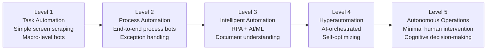
```mermaid
graph LR
    L1[Level 1<br/>Task Automation<br/>Simple screen scraping<br/>Macro-level bots] --> L2[Level 2<br/>Process Automation<br/>End-to-end process bots<br/>Exception handling] --> L3[Level 3<br/>Intelligent Automation<br/>RPA + AI/ML<br/>Document understanding] --> L4[Level 4<br/>Hyperautomation<br/>AI-orchestrated<br/>Self-optimizing] --> L5[Level 5<br/>Autonomous Operations<br/>Minimal human intervention<br/>Cognitive decision-making]
```

| Maturity Level | Characteristics | Typical Carrier Stage |
|---------------|----------------|----------------------|
| **Level 1: Task** | Individual task bots, no orchestration, limited exception handling | POC / pilot phase |
| **Level 2: Process** | End-to-end process bots, basic exception routing, centralized bot management | Early adopter (1-2 years) |
| **Level 3: Intelligent** | AI-augmented RPA, document understanding, NLP for unstructured data | Advancing (2-4 years) |
| **Level 4: Hyper** | AI orchestration across RPA + BPM + low-code, process mining feedback loops | Leading (4-6 years) |
| **Level 5: Autonomous** | Self-healing bots, cognitive decision-making, minimal human intervention | Aspirational |

### 1.3 Automation Landscape Overview

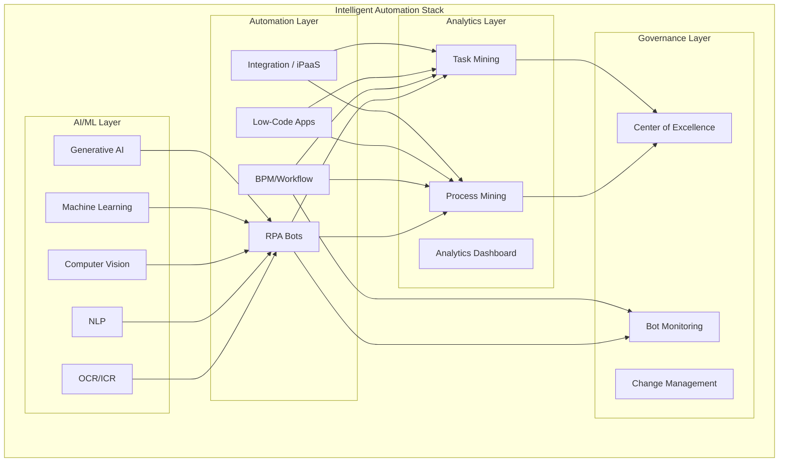
```mermaid
graph TB
    subgraph "Intelligent Automation Stack"
        subgraph "AI/ML Layer"
            AI1[OCR/ICR]
            AI2[NLP]
            AI3[Computer Vision]
            AI4[Machine Learning]
            AI5[Generative AI]
        end

        subgraph "Automation Layer"
            A1[RPA Bots]
            A2[BPM/Workflow]
            A3[Low-Code Apps]
            A4[Integration / iPaaS]
        end

        subgraph "Analytics Layer"
            AN1[Process Mining]
            AN2[Task Mining]
            AN3[Analytics Dashboard]
        end

        subgraph "Governance Layer"
            G1[Center of Excellence]
            G2[Bot Monitoring]
            G3[Change Management]
        end
    end

    AI1 & AI2 & AI3 & AI4 & AI5 --> A1
    A1 & A2 & A3 & A4 --> AN1 & AN2
    AN1 & AN2 --> G1
    A1 & A2 --> G2
```

---

## 2. RPA in Insurance Context

### 2.1 Process Candidate Assessment Framework

Not every process should be automated with RPA. Use this framework to evaluate candidates:

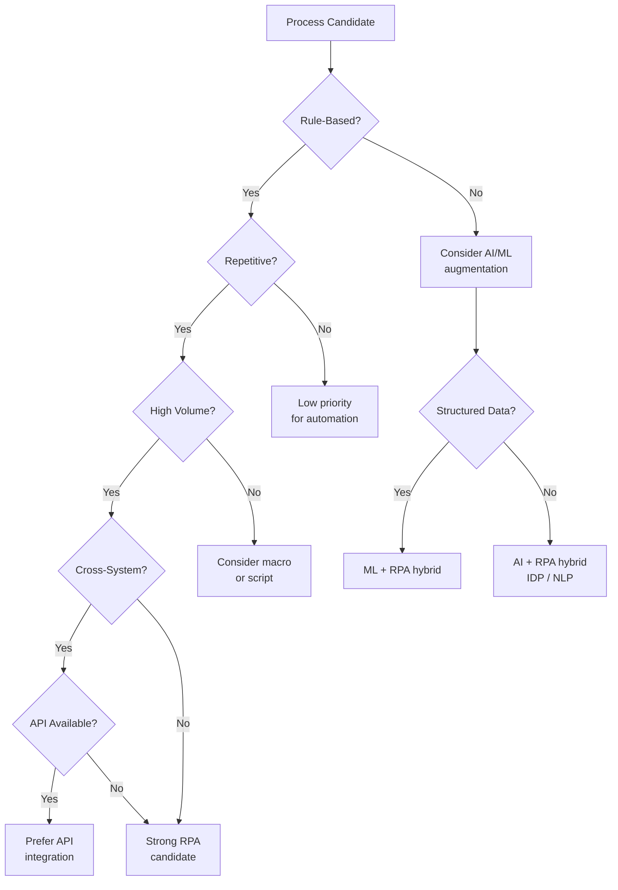
```mermaid
graph TB
    A[Process Candidate] --> B{Rule-Based?}
    B -->|Yes| C{Repetitive?}
    B -->|No| D[Consider AI/ML<br/>augmentation]
    C -->|Yes| E{High Volume?}
    C -->|No| F[Low priority<br/>for automation]
    E -->|Yes| G{Cross-System?}
    E -->|No| H[Consider macro<br/>or script]
    G -->|Yes| I{API Available?}
    G -->|No| J[Strong RPA<br/>candidate]
    I -->|Yes| K[Prefer API<br/>integration]
    I -->|No| J
    D --> L{Structured Data?}
    L -->|Yes| M[ML + RPA hybrid]
    L -->|No| N[AI + RPA hybrid<br/>IDP / NLP]
```

#### Scoring Matrix

| Criterion | Weight | Score (1-5) | Description |
|-----------|--------|-------------|-------------|
| **Rule-based** | 25% | | Process follows deterministic rules |
| **Volume** | 20% | | Number of transactions per period |
| **Repetitiveness** | 15% | | Same steps repeated consistently |
| **Error-prone** | 15% | | Current manual error rate |
| **System touchpoints** | 10% | | Number of systems accessed |
| **Standardization** | 10% | | Process consistency across cases |
| **Business impact** | 5% | | Revenue/compliance/CX impact |

**Scoring Guide:**
- **4.0+**: Immediate automation candidate
- **3.0-3.9**: Good candidate, plan for next quarter
- **2.0-2.9**: May benefit from partial automation
- **Below 2.0**: Not suitable for RPA; consider other approaches

### 2.2 RPA vs API Integration Decision Framework

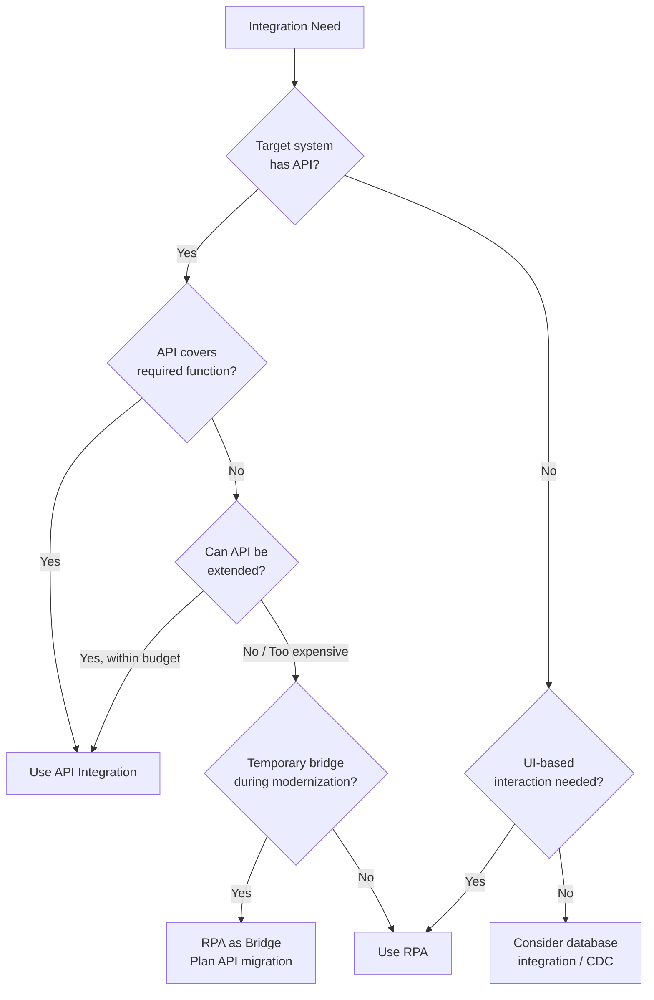
```mermaid
graph TB
    A[Integration Need] --> B{Target system<br/>has API?}
    B -->|Yes| C{API covers<br/>required function?}
    B -->|No| D{UI-based<br/>interaction needed?}
    C -->|Yes| E[Use API Integration]
    C -->|No| F{Can API be<br/>extended?}
    D -->|Yes| G[Use RPA]
    D -->|No| H[Consider database<br/>integration / CDC]
    F -->|Yes, within budget| E
    F -->|No / Too expensive| I{Temporary bridge<br/>during modernization?}
    I -->|Yes| J[RPA as Bridge<br/>Plan API migration]
    I -->|No| G
```

| Factor | Favor API | Favor RPA |
|--------|----------|-----------|
| **Reliability** | API is contract-based, stable | UI changes can break bots |
| **Speed** | Milliseconds | Seconds to minutes |
| **Scalability** | Horizontal scaling | Limited by UI sessions |
| **Cost** | API development cost | Bot licensing + maintenance |
| **Legacy systems** | Often no API available | Works with any UI |
| **Time to value** | Weeks-months for API | Days-weeks for bot |
| **Modernization** | Long-term solution | Bridge solution |

### 2.3 RPA as Bridge During Modernization

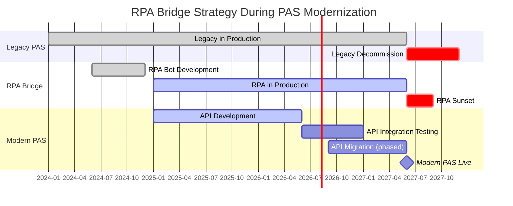
```mermaid
gantt
    title RPA Bridge Strategy During PAS Modernization
    dateFormat YYYY-MM
    axisFormat %Y-%m

    section Legacy PAS
    Legacy in Production       :done, 2024-01, 2027-06
    Legacy Decommission        :crit, 2027-06, 2027-12

    section RPA Bridge
    RPA Bot Development        :done, 2024-06, 2024-12
    RPA in Production          :active, 2025-01, 2027-06
    RPA Sunset                 :crit, 2027-06, 2027-09

    section Modern PAS
    API Development            :active, 2025-01, 2026-06
    API Integration Testing    :2026-06, 2027-01
    API Migration (phased)     :2026-09, 2027-06
    Modern PAS Live            :milestone, 2027-06, 0d
```

---

## 3. RPA Use Cases in PAS

### 3.1 New Business Data Entry

**Scenario**: Paper applications received via mail/fax need to be entered into the PAS.

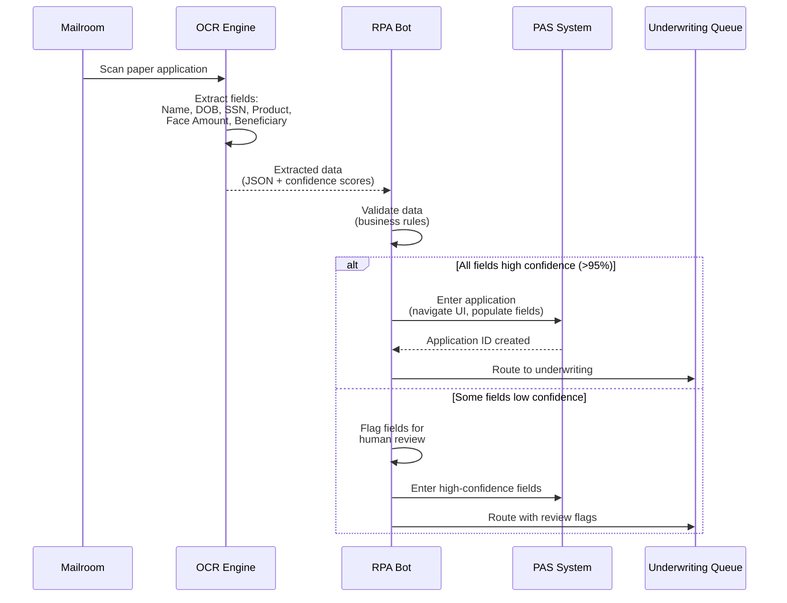
```mermaid
sequenceDiagram
    participant MAIL as Mailroom
    participant OCR as OCR Engine
    participant BOT as RPA Bot
    participant PAS as PAS System
    participant UW as Underwriting Queue

    MAIL->>OCR: Scan paper application
    OCR->>OCR: Extract fields:<br/>Name, DOB, SSN, Product,<br/>Face Amount, Beneficiary
    OCR-->>BOT: Extracted data<br/>(JSON + confidence scores)
    BOT->>BOT: Validate data<br/>(business rules)

    alt All fields high confidence (>95%)
        BOT->>PAS: Enter application<br/>(navigate UI, populate fields)
        PAS-->>BOT: Application ID created
        BOT->>UW: Route to underwriting
    else Some fields low confidence
        BOT->>BOT: Flag fields for<br/>human review
        BOT->>PAS: Enter high-confidence fields
        BOT->>UW: Route with review flags
    end
```

**Bot Steps:**
1. Retrieve scanned image from document queue.
2. Call OCR service to extract structured data.
3. Validate extracted data against business rules (product eligibility, face amount ranges, jurisdiction).
4. Log into PAS application.
5. Navigate to New Application screen.
6. Populate applicant demographics, product selection, coverage details, beneficiary information.
7. Attach scanned document to application record.
8. Submit application and capture application ID.
9. Route to underwriting queue.
10. Update tracking spreadsheet/system.

**Metrics:**
- Average processing time: 3-5 minutes per application (vs. 15-20 minutes manual).
- Accuracy: 99.2% for high-confidence OCR fields.
- Volume: 200-500 applications per day per bot.

### 3.2 NIGO (Not In Good Order) Follow-Up

**Scenario**: Applications missing required information need systematic follow-up.

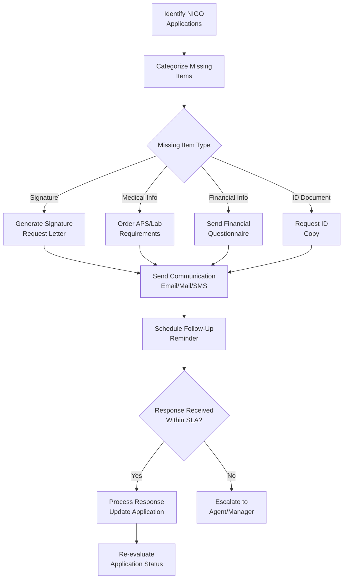
```mermaid
flowchart TB
    A[Identify NIGO<br/>Applications] --> B[Categorize Missing<br/>Items]
    B --> C{Missing Item Type}
    C -->|Signature| D[Generate Signature<br/>Request Letter]
    C -->|Medical Info| E[Order APS/Lab<br/>Requirements]
    C -->|Financial Info| F[Send Financial<br/>Questionnaire]
    C -->|ID Document| G[Request ID<br/>Copy]
    D & E & F & G --> H[Send Communication<br/>Email/Mail/SMS]
    H --> I[Schedule Follow-Up<br/>Reminder]
    I --> J{Response Received<br/>Within SLA?}
    J -->|Yes| K[Process Response<br/>Update Application]
    J -->|No| L[Escalate to<br/>Agent/Manager]
    K --> M[Re-evaluate<br/>Application Status]
```

**Bot Steps:**
1. Query PAS for applications in NIGO status > X days.
2. For each NIGO application, identify missing requirements.
3. Generate appropriate follow-up communication (email template, letter).
4. Send communication to applicant/agent.
5. Log follow-up in PAS activity notes.
6. Schedule follow-up check in 7 days.
7. If no response after 3 follow-ups, escalate to supervisor.

### 3.3 Policy Change Processing

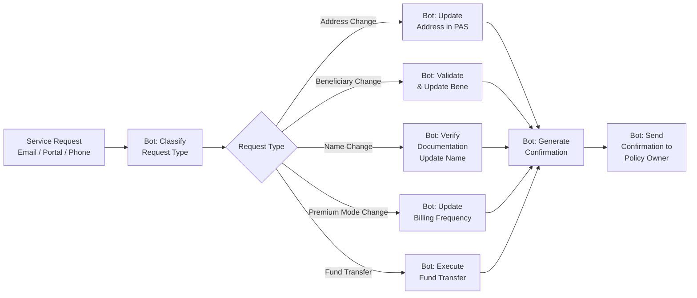
```mermaid
flowchart LR
    A[Service Request<br/>Email / Portal / Phone] --> B[Bot: Classify<br/>Request Type]
    B --> C{Request Type}
    C -->|Address Change| D[Bot: Update<br/>Address in PAS]
    C -->|Beneficiary Change| E[Bot: Validate<br/>& Update Bene]
    C -->|Name Change| F[Bot: Verify<br/>Documentation<br/>Update Name]
    C -->|Premium Mode Change| G[Bot: Update<br/>Billing Frequency]
    C -->|Fund Transfer| H[Bot: Execute<br/>Fund Transfer]
    D & E & F & G & H --> I[Bot: Generate<br/>Confirmation]
    I --> J[Bot: Send<br/>Confirmation to<br/>Policy Owner]
```

### 3.4 Premium Reconciliation

**Scenario**: Daily reconciliation of premium payments received vs. applied in PAS.

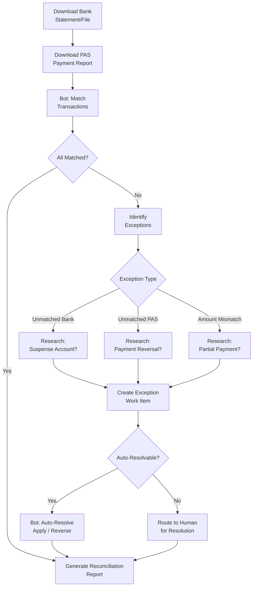
```mermaid
flowchart TB
    A[Download Bank<br/>Statement/File] --> B[Download PAS<br/>Payment Report]
    B --> C[Bot: Match<br/>Transactions]
    C --> D{All Matched?}
    D -->|Yes| E[Generate Reconciliation<br/>Report]
    D -->|No| F[Identify<br/>Exceptions]
    F --> G{Exception Type}
    G -->|Unmatched Bank| H[Research:<br/>Suspense Account?]
    G -->|Unmatched PAS| I[Research:<br/>Payment Reversal?]
    G -->|Amount Mismatch| J[Research:<br/>Partial Payment?]
    H & I & J --> K[Create Exception<br/>Work Item]
    K --> L{Auto-Resolvable?}
    L -->|Yes| M[Bot: Auto-Resolve<br/>Apply / Reverse]
    L -->|No| N[Route to Human<br/>for Resolution]
    M & N --> E
```

**Bot Steps:**
1. Log into banking portal; download daily transaction report (CSV/PDF).
2. Log into PAS; download daily payment applied report.
3. Match transactions by policy number, amount, and date (fuzzy matching for slight variations).
4. For matched items: mark as reconciled.
5. For unmatched items: classify exception type and attempt auto-resolution.
6. Generate reconciliation summary report.
7. Email report to finance team.

### 3.5 Commission Reconciliation

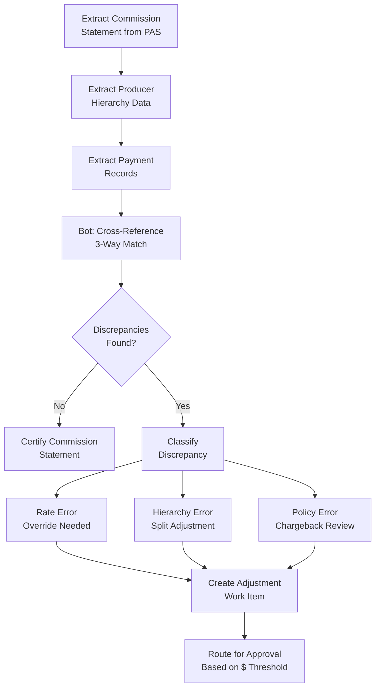
```mermaid
flowchart TB
    A[Extract Commission<br/>Statement from PAS] --> B[Extract Producer<br/>Hierarchy Data]
    B --> C[Extract Payment<br/>Records]
    C --> D[Bot: Cross-Reference<br/>3-Way Match]
    D --> E{Discrepancies<br/>Found?}
    E -->|No| F[Certify Commission<br/>Statement]
    E -->|Yes| G[Classify<br/>Discrepancy]
    G --> H[Rate Error<br/>Override Needed]
    G --> I[Hierarchy Error<br/>Split Adjustment]
    G --> J[Policy Error<br/>Chargeback Review]
    H & I & J --> K[Create Adjustment<br/>Work Item]
    K --> L[Route for Approval<br/>Based on $ Threshold]
```

### 3.6 Regulatory Report Generation

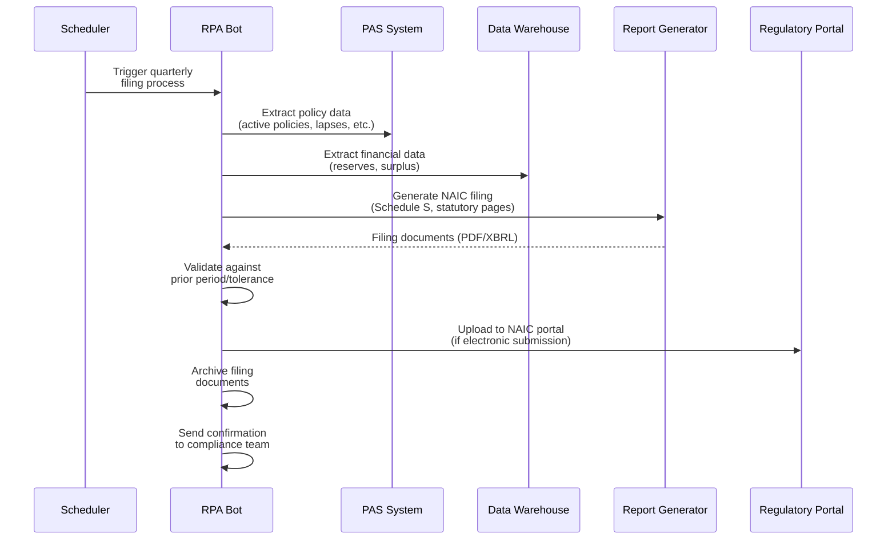
```mermaid
sequenceDiagram
    participant SCH as Scheduler
    participant BOT as RPA Bot
    participant PAS as PAS System
    participant DW as Data Warehouse
    participant RPT as Report Generator
    participant REG as Regulatory Portal

    SCH->>BOT: Trigger quarterly<br/>filing process
    BOT->>PAS: Extract policy data<br/>(active policies, lapses, etc.)
    BOT->>DW: Extract financial data<br/>(reserves, surplus)
    BOT->>RPT: Generate NAIC filing<br/>(Schedule S, statutory pages)
    RPT-->>BOT: Filing documents (PDF/XBRL)
    BOT->>BOT: Validate against<br/>prior period/tolerance
    BOT->>REG: Upload to NAIC portal<br/>(if electronic submission)
    BOT->>BOT: Archive filing<br/>documents
    BOT->>BOT: Send confirmation<br/>to compliance team
```

### 3.7 Correspondence Management

| Process | Bot Action | Volume | Time Savings |
|---------|-----------|--------|-------------|
| **Incoming mail classification** | Scan, classify, route to correct queue | 500+ / day | 4 FTE |
| **Return mail processing** | Update address status, trigger search | 100+ / day | 1 FTE |
| **Outgoing letter generation** | Merge data, generate PDF, queue for print | 1000+ / day | 3 FTE |
| **Email triage** | Classify incoming emails, auto-respond or route | 300+ / day | 2 FTE |
| **Fax processing** | Convert to digital, classify, route | 200+ / day | 1.5 FTE |

### 3.8 Underwriting Evidence Gathering

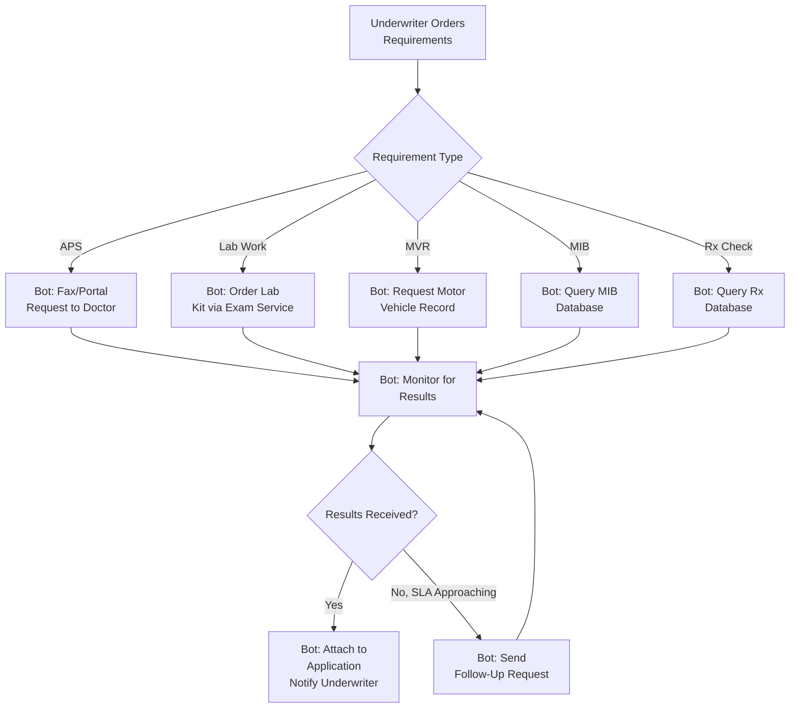
```mermaid
flowchart TB
    A[Underwriter Orders<br/>Requirements] --> B{Requirement Type}
    B -->|APS| C[Bot: Fax/Portal<br/>Request to Doctor]
    B -->|Lab Work| D[Bot: Order Lab<br/>Kit via Exam Service]
    B -->|MVR| E[Bot: Request Motor<br/>Vehicle Record]
    B -->|MIB| F[Bot: Query MIB<br/>Database]
    B -->|Rx Check| G[Bot: Query Rx<br/>Database]
    C & D & E & F & G --> H[Bot: Monitor for<br/>Results]
    H --> I{Results Received?}
    I -->|Yes| J[Bot: Attach to<br/>Application<br/>Notify Underwriter]
    I -->|No, SLA Approaching| K[Bot: Send<br/>Follow-Up Request]
    K --> H
```

### 3.9 Claim Documentation Gathering

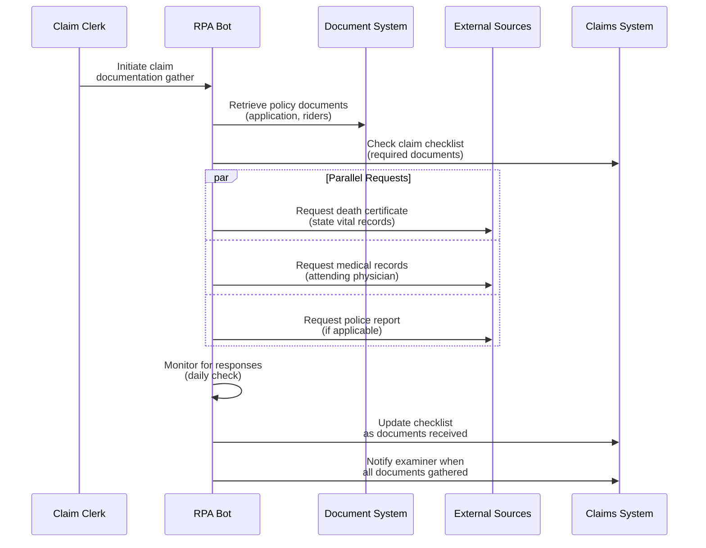
```mermaid
sequenceDiagram
    participant CLK as Claim Clerk
    participant BOT as RPA Bot
    participant DOC as Document System
    participant EXT as External Sources
    participant CL as Claims System

    CLK->>BOT: Initiate claim<br/>documentation gather
    BOT->>DOC: Retrieve policy documents<br/>(application, riders)
    BOT->>CL: Check claim checklist<br/>(required documents)

    par Parallel Requests
        BOT->>EXT: Request death certificate<br/>(state vital records)
    and
        BOT->>EXT: Request medical records<br/>(attending physician)
    and
        BOT->>EXT: Request police report<br/>(if applicable)
    end

    BOT->>BOT: Monitor for responses<br/>(daily check)
    BOT->>CL: Update checklist<br/>as documents received
    BOT->>CL: Notify examiner when<br/>all documents gathered
```

### 3.10 Compliance Monitoring

| Compliance Area | Bot Function | Frequency |
|----------------|-------------|-----------|
| **Suitability review** | Verify suitability documentation exists for all new business | Daily |
| **License verification** | Check agent licenses are active for transaction jurisdiction | Per transaction |
| **AML monitoring** | Flag large cash transactions (>$10K), structuring patterns | Real-time |
| **Replacement detection** | Identify potential replacement transactions, generate forms | Per application |
| **Privacy compliance** | Verify consent forms, data retention compliance | Monthly |
| **State filing deadlines** | Monitor upcoming filing deadlines, trigger report generation | Weekly |
| **Abandoned property** | Identify policies meeting abandoned property criteria | Quarterly |
| **Market conduct** | Sample transactions for compliance review | Monthly |

---

## 4. Attended vs Unattended Bots

### 4.1 Use Case Mapping

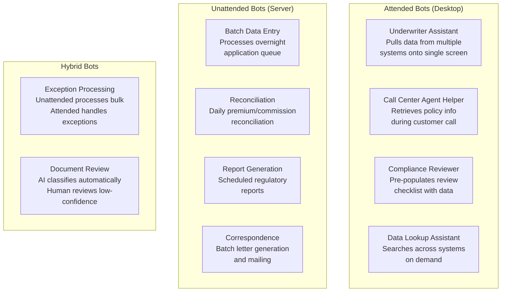
```mermaid
graph TB
    subgraph "Attended Bots (Desktop)"
        AT1[Underwriter Assistant<br/>Pulls data from multiple<br/>systems onto single screen]
        AT2[Call Center Agent Helper<br/>Retrieves policy info<br/>during customer call]
        AT3[Compliance Reviewer<br/>Pre-populates review<br/>checklist with data]
        AT4[Data Lookup Assistant<br/>Searches across systems<br/>on demand]
    end

    subgraph "Unattended Bots (Server)"
        UN1[Batch Data Entry<br/>Processes overnight<br/>application queue]
        UN2[Reconciliation<br/>Daily premium/commission<br/>reconciliation]
        UN3[Report Generation<br/>Scheduled regulatory<br/>reports]
        UN4[Correspondence<br/>Batch letter generation<br/>and mailing]
    end

    subgraph "Hybrid Bots"
        HY1[Exception Processing<br/>Unattended processes bulk<br/>Attended handles exceptions]
        HY2[Document Review<br/>AI classifies automatically<br/>Human reviews low-confidence]
    end
```

### 4.2 Attended Bot: Underwriter Desktop Assistant

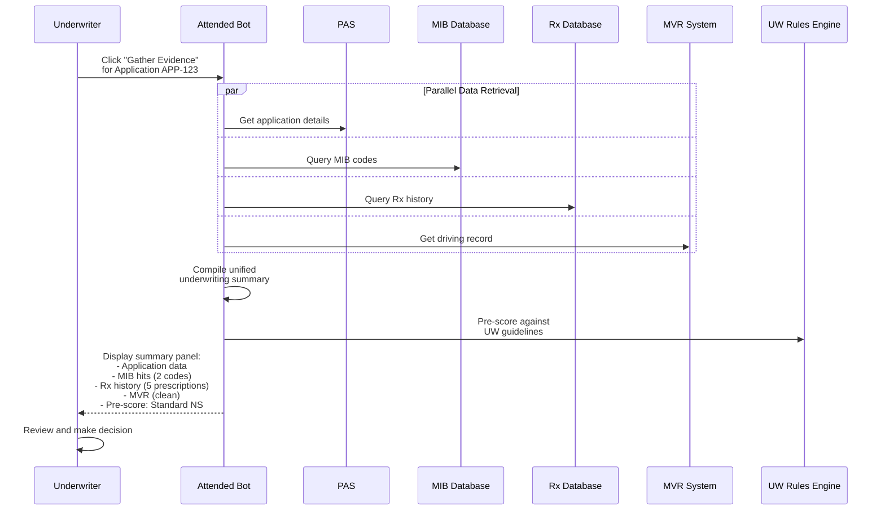
```mermaid
sequenceDiagram
    participant UW as Underwriter
    participant BOT as Attended Bot
    participant PAS as PAS
    participant MIB as MIB Database
    participant RX as Rx Database
    participant MVR as MVR System
    participant RULES as UW Rules Engine

    UW->>BOT: Click "Gather Evidence"<br/>for Application APP-123
    par Parallel Data Retrieval
        BOT->>PAS: Get application details
    and
        BOT->>MIB: Query MIB codes
    and
        BOT->>RX: Query Rx history
    and
        BOT->>MVR: Get driving record
    end
    BOT->>BOT: Compile unified<br/>underwriting summary
    BOT->>RULES: Pre-score against<br/>UW guidelines
    BOT-->>UW: Display summary panel:<br/>- Application data<br/>- MIB hits (2 codes)<br/>- Rx history (5 prescriptions)<br/>- MVR (clean)<br/>- Pre-score: Standard NS
    UW->>UW: Review and make decision
```

### 4.3 Unattended Bot: Overnight Batch Processing

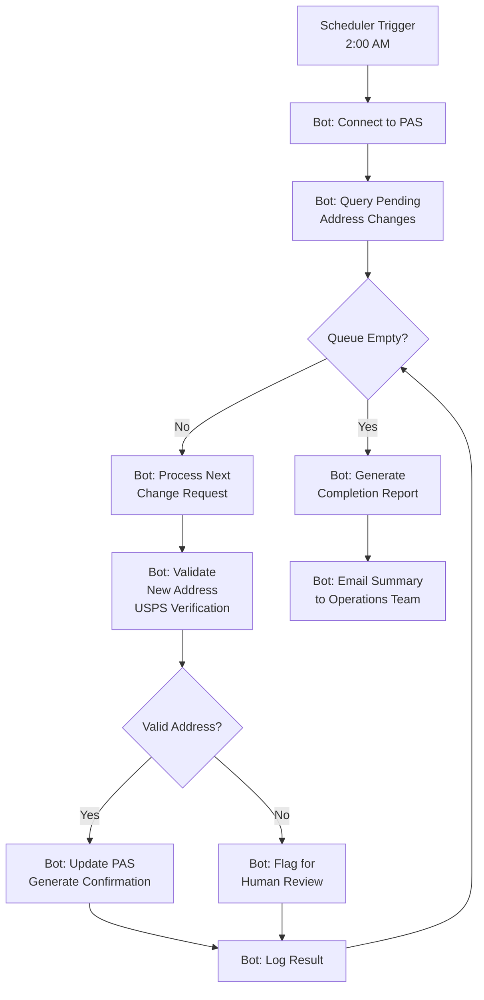
```mermaid
flowchart TB
    A[Scheduler Trigger<br/>2:00 AM] --> B[Bot: Connect to PAS]
    B --> C[Bot: Query Pending<br/>Address Changes]
    C --> D{Queue Empty?}
    D -->|Yes| E[Bot: Generate<br/>Completion Report]
    D -->|No| F[Bot: Process Next<br/>Change Request]
    F --> G[Bot: Validate<br/>New Address<br/>USPS Verification]
    G --> H{Valid Address?}
    H -->|Yes| I[Bot: Update PAS<br/>Generate Confirmation]
    H -->|No| J[Bot: Flag for<br/>Human Review]
    I --> K[Bot: Log Result]
    J --> K
    K --> D
    E --> L[Bot: Email Summary<br/>to Operations Team]
```

### 4.4 Comparison Matrix

| Aspect | Attended | Unattended | Hybrid |
|--------|---------|-----------|--------|
| **Trigger** | User-initiated | Scheduled / event-driven | Mixed |
| **Runs on** | User's desktop | Server/VM | Both |
| **User interaction** | Continuous | None during execution | Exception-only |
| **License cost** | Per desktop | Per bot instance | Both |
| **Best for** | Decision support, real-time assistance | Batch processing, reconciliation | Exception handling |
| **Scalability** | Limited by desktops | Horizontal scaling | Moderate |
| **Error handling** | User intervenes | Auto-retry + queue | Auto-retry + user for exceptions |

---

## 5. OCR/ICR for Insurance Documents

### 5.1 Document Types and Extraction Challenges

| Document Type | Key Fields | Challenge Level | Approach |
|--------------|------------|----------------|----------|
| **Application form** | Name, DOB, SSN, product, coverage, beneficiary | Medium | Template-based + AI |
| **Medical records (APS)** | Diagnoses, medications, procedures, vitals | Very High | NLP + medical NER |
| **Death certificate** | Name, DOB, DOD, cause of death, certifier | Medium | Template-based (state-specific) |
| **Check/draft** | Amount, payee, date, routing/account | Low | Specialized check OCR |
| **Driver's license/ID** | Name, DOB, address, ID number, photo | Low | Specialized ID OCR |
| **Tax forms (1099, W-9)** | TIN, name, amounts | Low | Template-based |
| **Handwritten notes** | Free-form text | Very High | ICR + NLP |
| **Correspondence** | Intent, policy number, request details | High | NLP classification |
| **Lab results** | Test names, values, reference ranges | High | Structured + NLP |

### 5.2 Template-Based vs AI-Based OCR

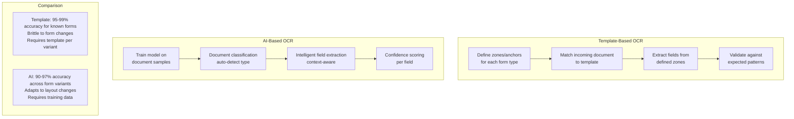
```mermaid
graph TB
    subgraph "Template-Based OCR"
        T1[Define zones/anchors<br/>for each form type] --> T2[Match incoming document<br/>to template] --> T3[Extract fields from<br/>defined zones] --> T4[Validate against<br/>expected patterns]
    end

    subgraph "AI-Based OCR"
        A1[Train model on<br/>document samples] --> A2[Document classification<br/>auto-detect type] --> A3[Intelligent field extraction<br/>context-aware] --> A4[Confidence scoring<br/>per field]
    end

    subgraph "Comparison"
        C1["Template: 95-99% accuracy for known forms<br/>Brittle to form changes<br/>Requires template per variant"]
        C2["AI: 90-97% accuracy across form variants<br/>Adapts to layout changes<br/>Requires training data"]
    end
```

### 5.3 OCR Pipeline Architecture

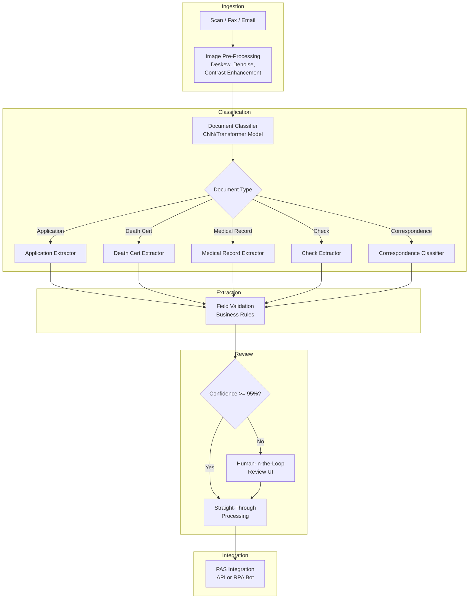
```mermaid
graph TB
    subgraph "Ingestion"
        I1[Scan / Fax / Email] --> I2[Image Pre-Processing<br/>Deskew, Denoise,<br/>Contrast Enhancement]
    end

    subgraph "Classification"
        I2 --> C1[Document Classifier<br/>CNN/Transformer Model]
        C1 --> C2{Document Type}
        C2 -->|Application| E1[Application Extractor]
        C2 -->|Death Cert| E2[Death Cert Extractor]
        C2 -->|Medical Record| E3[Medical Record Extractor]
        C2 -->|Check| E4[Check Extractor]
        C2 -->|Correspondence| E5[Correspondence Classifier]
    end

    subgraph "Extraction"
        E1 --> V1[Field Validation<br/>Business Rules]
        E2 --> V1
        E3 --> V1
        E4 --> V1
        E5 --> V1
    end

    subgraph "Review"
        V1 --> R1{Confidence >= 95%?}
        R1 -->|Yes| STP[Straight-Through<br/>Processing]
        R1 -->|No| HIL[Human-in-the-Loop<br/>Review UI]
        HIL --> STP
    end

    subgraph "Integration"
        STP --> INT[PAS Integration<br/>API or RPA Bot]
    end
```

### 5.4 Handwriting Recognition (ICR)

Insurance processes frequently encounter handwritten data:

- **Application forms**: Agent-completed paper applications.
- **Beneficiary forms**: Handwritten names and percentages.
- **Claim forms**: Claimant descriptions.
- **Medical records**: Physician notes.

**ICR Approach:**
1. **Segmentation**: Isolate handwritten regions from printed text.
2. **Recognition**: CNN/RNN models trained on insurance-specific handwriting.
3. **Context**: Use NLP to validate recognized text against expected content.
4. **Confidence**: Score each character/word; flag low-confidence for human review.

| Handwriting Type | Recognition Accuracy | Approach |
|-----------------|---------------------|----------|
| **Block print (forms)** | 85-95% | Standard ICR + form field context |
| **Cursive (signatures)** | N/A (verification only) | Signature verification model |
| **Mixed print/cursive** | 75-90% | Advanced ICR + NLP post-processing |
| **Physician handwriting** | 60-80% | Specialized medical ICR + medical NLP |

### 5.5 Confidence Scoring and Human Review

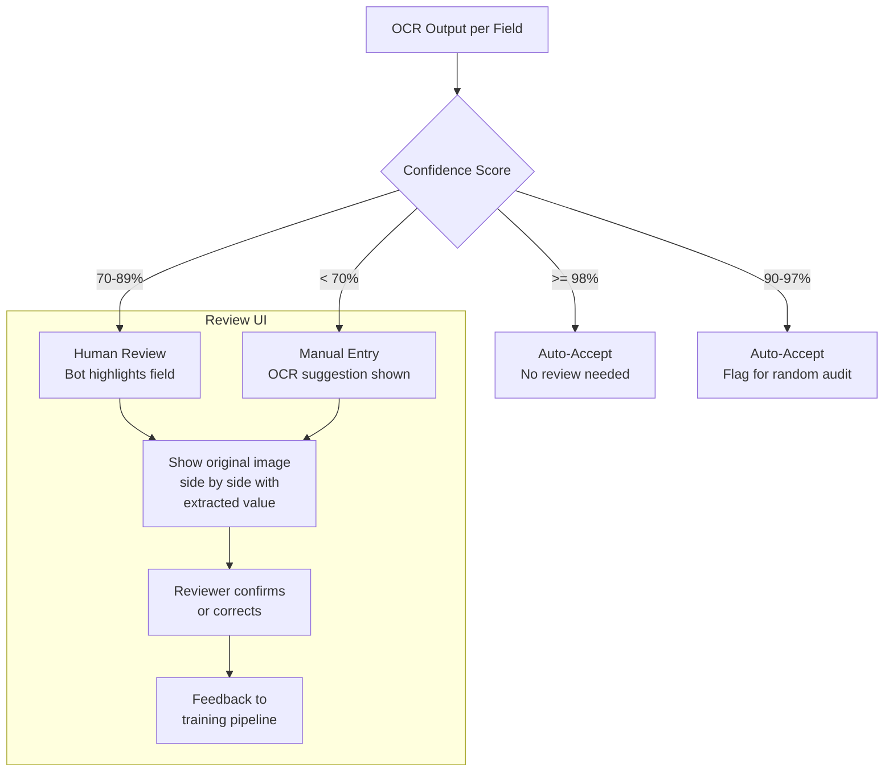
```mermaid
graph TB
    A[OCR Output per Field] --> B{Confidence Score}
    B -->|>= 98%| C[Auto-Accept<br/>No review needed]
    B -->|90-97%| D[Auto-Accept<br/>Flag for random audit]
    B -->|70-89%| E[Human Review<br/>Bot highlights field]
    B -->|< 70%| F[Manual Entry<br/>OCR suggestion shown]

    subgraph "Review UI"
        E --> G[Show original image<br/>side by side with<br/>extracted value]
        F --> G
        G --> H[Reviewer confirms<br/>or corrects]
        H --> I[Feedback to<br/>training pipeline]
    end
```

---

## 6. NLP for Insurance

### 6.1 Correspondence Classification and Routing

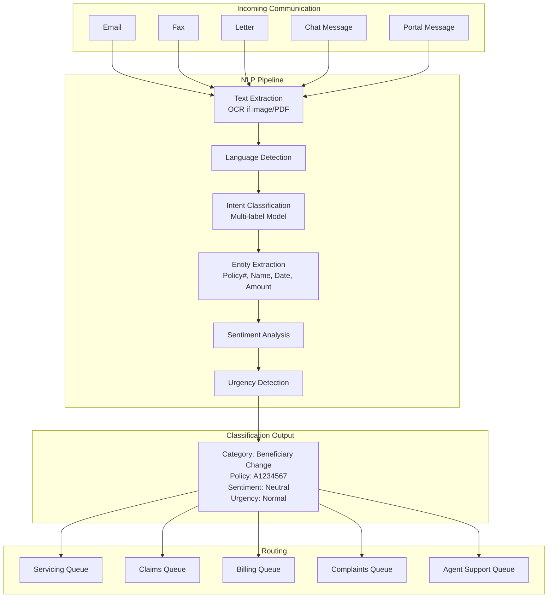
```mermaid
graph TB
    subgraph "Incoming Communication"
        I1[Email]
        I2[Fax]
        I3[Letter]
        I4[Chat Message]
        I5[Portal Message]
    end

    subgraph "NLP Pipeline"
        N1[Text Extraction<br/>OCR if image/PDF]
        N2[Language Detection]
        N3[Intent Classification<br/>Multi-label Model]
        N4[Entity Extraction<br/>Policy#, Name, Date, Amount]
        N5[Sentiment Analysis]
        N6[Urgency Detection]
    end

    subgraph "Classification Output"
        C1[Category: Beneficiary Change<br/>Policy: A1234567<br/>Sentiment: Neutral<br/>Urgency: Normal]
    end

    subgraph "Routing"
        R1[Servicing Queue]
        R2[Claims Queue]
        R3[Billing Queue]
        R4[Complaints Queue]
        R5[Agent Support Queue]
    end

    I1 & I2 & I3 & I4 & I5 --> N1 --> N2 --> N3 --> N4 --> N5 --> N6
    N6 --> C1
    C1 --> R1 & R2 & R3 & R4 & R5
```

**Classification Categories:**

| Category | Sub-Categories | Routing |
|----------|---------------|---------|
| **Service Request** | Address change, name change, beneficiary change, mode change | Servicing Queue |
| **Billing Inquiry** | Payment status, payment history, premium amount, billing method | Billing Queue |
| **Financial Request** | Withdrawal, loan, surrender, fund transfer | Financial Queue |
| **Claim Related** | New claim, claim status, claim documentation | Claims Queue |
| **Complaint** | Service complaint, billing complaint, agent complaint | Complaints Queue (SLA: 24hr) |
| **General Inquiry** | Policy status, values, coverage details | Customer Service |
| **Agent Request** | Commission inquiry, licensing, appointment | Agent Support |
| **Legal/Compliance** | Subpoena, garnishment, tax levy, power of attorney | Legal Queue |

### 6.2 Sentiment Analysis for Customer Communications

```json
{
  "communication": {
    "id": "COM-001",
    "channel": "email",
    "subject": "Extremely frustrated with claim delay",
    "body": "I have been waiting for 3 months for my father's death claim...",
    "analysis": {
      "sentiment": "Very Negative",
      "sentimentScore": -0.87,
      "emotions": ["frustration", "anger", "sadness"],
      "urgency": "High",
      "escalationRecommended": true,
      "suggestedAction": "Immediate callback from claims supervisor",
      "extractedEntities": {
        "claimType": "Death",
        "waitTime": "3 months",
        "relationship": "Father"
      }
    }
  }
}
```

### 6.3 Medical Record Summarization

```mermaid
graph TB
    A[Medical Records<br/>APS - 50+ pages] --> B[OCR/Text Extraction]
    B --> C[Medical NLP Pipeline]

    subgraph "Medical NLP"
        C --> D[Section Segmentation<br/>History, Medications,<br/>Labs, Assessments]
        D --> E[Medical NER<br/>Diagnoses, Meds,<br/>Procedures, Vitals]
        E --> F[Temporal Extraction<br/>Dates, Duration,<br/>Frequency]
        F --> G[Negation Detection<br/>No diabetes, denies smoking]
        G --> H[Severity Assessment]
    end

    H --> I[Structured Summary]

    subgraph "Output"
        I --> J["Summary:<br/>• Diagnosis: Hypertension (controlled, 5yr)<br/>• Diagnosis: Hyperlipidemia (mild, 3yr)<br/>• Medications: Lisinopril 10mg, Atorvastatin 20mg<br/>• Lab: A1C 5.8 (normal), Cholesterol 210<br/>• BMI: 27.2 (overweight)<br/>• No diabetes, no heart disease<br/>• Non-smoker (quit 2020)"]
    end
```

### 6.4 Chatbot / Virtual Assistant for Policyholder Service

```mermaid
stateDiagram-v2
    [*] --> Greeting
    Greeting --> IntentRecognition : User speaks/types
    IntentRecognition --> Authentication : Needs policy access

    Authentication --> PolicyInquiry : "What's my policy status?"
    Authentication --> BillingInquiry : "When is my next payment?"
    Authentication --> ValueInquiry : "What is my cash value?"
    Authentication --> ChangeRequest : "I need to update my address"
    Authentication --> ClaimStatus : "What's the status of my claim?"

    PolicyInquiry --> Response : Fetch from API
    BillingInquiry --> Response : Fetch from API
    ValueInquiry --> Response : Fetch from API
    ChangeRequest --> CollectInfo : Gather new address
    ClaimStatus --> Response : Fetch from API

    CollectInfo --> Confirmation : Verify change
    Confirmation --> ProcessChange : User confirms
    ProcessChange --> Response : API call to PAS

    Response --> FollowUp : "Anything else?"
    FollowUp --> IntentRecognition : Yes
    FollowUp --> [*] : No / Goodbye

    IntentRecognition --> AgentHandoff : Complex/emotional query
    AgentHandoff --> [*] : Transfer to human
```

**Self-Service Capabilities:**

| Capability | Automation Level | Deflection Rate |
|-----------|-----------------|-----------------|
| **Policy status inquiry** | Fully automated | 85% |
| **Premium due date/amount** | Fully automated | 90% |
| **Cash value inquiry** | Fully automated | 85% |
| **Address change** | Fully automated | 75% |
| **Payment confirmation** | Fully automated | 80% |
| **Claim status** | Fully automated | 70% |
| **Beneficiary change** | Semi-automated (needs forms) | 40% |
| **Loan request** | Semi-automated (needs approval) | 50% |
| **Complaint** | Always routes to human | 0% |
| **Complex financial inquiry** | Routes to specialist | 10% |

### 6.5 Email Triage and Auto-Response

```typescript
interface EmailTriageResult {
  category: string;
  subCategory: string;
  confidence: number;
  extractedEntities: {
    policyNumber?: string;
    claimNumber?: string;
    partyName?: string;
    requestType?: string;
    amount?: number;
  };
  sentiment: string;
  urgency: 'Low' | 'Normal' | 'High' | 'Critical';
  suggestedResponse?: string;
  autoRespondEligible: boolean;
  routingQueue: string;
}

// Auto-response templates
const autoResponses = {
  'billing.payment-confirmation': `
    Dear {{policyOwnerName}},

    Thank you for your payment of {{amount}} received on {{date}}
    for policy {{policyNumber}}.

    Your next payment of {{nextPremiumAmount}} is due on {{nextPremiumDate}}.

    Thank you for your continued trust.
  `,
  'inquiry.policy-status': `
    Dear {{policyOwnerName}},

    Your policy {{policyNumber}} is currently in {{status}} status.
    {{#if activeCoverages}}
    Active coverages:
    {{#each activeCoverages}}
    - {{planName}}: {{faceAmount}}
    {{/each}}
    {{/if}}

    For detailed information, please log into your online account
    or contact us at 1-800-XXX-XXXX.
  `,
};
```

---

## 7. Intelligent Document Processing (IDP)

### 7.1 End-to-End IDP Pipeline

```mermaid
graph TB
    subgraph "1. Ingestion"
        I1[Multi-Channel Input<br/>Email, Fax, Scan, Portal]
        I2[Format Normalization<br/>PDF → Image → Text]
        I3[Quality Assessment<br/>Resolution, Skew, Noise]
        I4[Enhancement<br/>Deskew, Denoise, Sharpen]
    end

    subgraph "2. Classification"
        C1[Page-Level Classification<br/>CNN/Transformer]
        C2[Document Assembly<br/>Group related pages]
        C3[Sub-Classification<br/>Application Type,<br/>State-Specific Form]
    end

    subgraph "3. Extraction"
        E1[Template Matching<br/>Known form layouts]
        E2[AI Extraction<br/>Key-Value Pair Detection]
        E3[Table Extraction<br/>Structured tabular data]
        E4[Handwriting Recognition<br/>ICR for handwritten fields]
        E5[Signature Detection<br/>Presence verification]
    end

    subgraph "4. Validation"
        V1[Format Validation<br/>Regex patterns, dates, SSN]
        V2[Cross-Field Validation<br/>Age vs DOB, state vs zip]
        V3[Business Rule Validation<br/>Product eligibility, limits]
        V4[External Validation<br/>USPS address, identity]
    end

    subgraph "5. Review"
        R1[Confidence-Based Routing<br/>Auto-approve vs Human Review]
        R2[Review UI<br/>Side-by-side comparison]
        R3[Correction Capture<br/>Feedback for model training]
    end

    subgraph "6. Integration"
        INT1[PAS Data Entry<br/>API or RPA]
        INT2[Document Archival<br/>Content Management]
        INT3[Workflow Trigger<br/>Start process flow]
    end

    I1 --> I2 --> I3 --> I4
    I4 --> C1 --> C2 --> C3
    C3 --> E1 & E2 & E3 & E4 & E5
    E1 & E2 & E3 & E4 & E5 --> V1 --> V2 --> V3 --> V4
    V4 --> R1 --> R2 --> R3
    R1 -->|High Confidence| INT1
    R3 --> INT1
    INT1 --> INT2 & INT3
```

### 7.2 Training Data Management

| Data Concern | Approach | Details |
|-------------|----------|---------|
| **Initial training set** | 500-1000 labeled documents per type | Manually annotated by SMEs |
| **Active learning** | Model selects uncertain samples | Reduces labeling effort by 60-70% |
| **Data augmentation** | Rotate, crop, add noise to images | 3-5x training data expansion |
| **Synthetic data** | Generate fake forms with real layouts | Pre-training on synthetic, fine-tune on real |
| **Privacy** | Redact PII in training data | Replace SSN, names with synthetic values |
| **Version control** | Track dataset versions | DVC (Data Version Control) |
| **Quality assurance** | Inter-annotator agreement | >95% agreement required |

### 7.3 Model Improvement Cycle

```mermaid
graph TB
    A[Production IDP<br/>Processing Documents] --> B[Monitor Metrics<br/>Accuracy, Confidence<br/>Human Review Rate]
    B --> C{Performance<br/>Degraded?}
    C -->|No| A
    C -->|Yes| D[Collect Corrections<br/>from Human Review]
    D --> E[Analyze Error Patterns<br/>New form variant?<br/>Quality issue?]
    E --> F[Augment Training Data<br/>with corrections]
    F --> G[Retrain Model<br/>Incremental or Full]
    G --> H[A/B Test<br/>Champion vs Challenger]
    H --> I{Challenger Better?}
    I -->|Yes| J[Promote Challenger<br/>to Production]
    I -->|No| K[Iterate on Model]
    J --> A
    K --> F
```

### 7.4 Human-in-the-Loop Review Interface

The review interface must be designed for efficiency:

**Key Features:**
1. **Side-by-side view**: Original document image beside extracted data.
2. **Field highlighting**: Click on extracted value → highlights the source region in document.
3. **Confidence indicators**: Color-coded confidence (green > 95%, yellow 70-95%, red < 70%).
4. **Keyboard shortcuts**: Tab through fields, Enter to accept, type to correct.
5. **Batch review**: Process multiple documents in a queue.
6. **Quality metrics**: Track reviewer accuracy and speed.

```
┌─────────────────────────────────────────────────────────────┐
│                    Document Review Interface                  │
├─────────────────────────┬───────────────────────────────────┤
│                         │  Extracted Data                    │
│   [Original Document]   │                                   │
│   ┌─────────────────┐   │  First Name: [John     ] ✓ 98%   │
│   │                 │   │  Last Name:  [Smith    ] ✓ 99%   │
│   │   Application   │   │  DOB:        [03/15/85 ] ✓ 96%   │
│   │   Form Image    │   │  SSN:        [***-**-67] ⚠ 82%   │
│   │                 │   │  Product:    [UL-100   ] ✓ 99%   │
│   │   ┌──────────┐  │   │  Face Amt:   [500,000  ] ✓ 97%   │
│   │   │Highlight │  │   │  State:      [NY       ] ✓ 99%   │
│   │   └──────────┘  │   │                                   │
│   │                 │   │  [Accept All] [Submit]             │
│   └─────────────────┘   │                                   │
├─────────────────────────┴───────────────────────────────────┤
│  Queue: 23 remaining  |  Completed: 47  |  Avg: 45 sec     │
└─────────────────────────────────────────────────────────────┘
```

---

## 8. Process Mining

### 8.1 Event Log Extraction from PAS

Process mining requires event logs with three mandatory elements: Case ID, Activity, Timestamp.

```mermaid
graph LR
    subgraph "PAS Data Sources"
        S1[Activity/Audit Tables]
        S2[Transaction Logs]
        S3[Workflow History]
        S4[System Logs]
    end

    subgraph "Event Log Builder"
        ETL[ETL Pipeline<br/>Extract → Transform → Load]
    end

    subgraph "Event Log"
        EL["| CaseID | Activity | Timestamp | Resource |
        | APP-001 | Application Received | 2026-01-15 09:00 | System |
        | APP-001 | Data Validation | 2026-01-15 09:05 | Bot-01 |
        | APP-001 | UW Requirements Ordered | 2026-01-15 10:00 | UW-Smith |
        | APP-001 | APS Received | 2026-01-28 14:00 | System |
        | APP-001 | UW Review | 2026-01-29 11:00 | UW-Smith |
        | APP-001 | Approved | 2026-01-29 14:00 | UW-Smith |
        | APP-001 | Policy Issued | 2026-01-30 00:00 | System |"]
    end

    S1 & S2 & S3 & S4 --> ETL --> EL
```

### 8.2 Process Discovery

```mermaid
graph TB
    subgraph "Discovered New Business Process"
        A[Application<br/>Received] --> B[Data Validation]
        B -->|90%| C[UW Requirements<br/>Ordered]
        B -->|10%| D[NIGO - Missing<br/>Information]
        D -->|After follow-up| B
        C --> E{Evidence<br/>Received?}
        E -->|Direct| F[UW Review]
        E -->|85%: Within 14 days| F
        E -->|15%: Follow-up needed| G[Evidence<br/>Follow-Up]
        G --> E
        F --> H{Decision}
        H -->|70%| I[Approved]
        H -->|20%| J[Rated/Modified]
        H -->|10%| K[Declined]
        I --> L[Policy Issued]
        J --> M[Counter-Offer<br/>Sent]
        M --> N{Accepted?}
        N -->|Yes| L
        N -->|No| O[Application<br/>Withdrawn]
    end
```

### 8.3 Conformance Checking

Identify deviations from the intended process:

| Deviation Type | Example | Frequency | Impact |
|---------------|---------|-----------|--------|
| **Skipped step** | UW review bypassed for high-risk case | 2% | Compliance risk |
| **Wrong order** | Policy issued before payment received | 0.5% | Financial risk |
| **Extra step** | Unnecessary re-underwriting | 5% | Efficiency loss |
| **Loop** | Multiple NIGO follow-ups (>3) | 8% | Delay |
| **Timeout** | Application pending > 30 days | 12% | Customer experience |
| **Resource mismatch** | Junior UW handling complex case | 3% | Quality risk |

### 8.4 Performance Analysis

```mermaid
graph TB
    subgraph "Process Performance Dashboard"
        M1["Avg Cycle Time: 18 days<br/>Target: 15 days"]
        M2["STP Rate: 32%<br/>Target: 50%"]
        M3["NIGO Rate: 22%<br/>Target: 10%"]
        M4["Touch Count: 8.5<br/>Target: 5"]
    end

    subgraph "Bottleneck Analysis"
        B1["#1 Bottleneck: APS Receipt<br/>Avg Wait: 12 days"]
        B2["#2 Bottleneck: UW Queue<br/>Avg Wait: 3 days"]
        B3["#3 Bottleneck: NIGO Resolution<br/>Avg Wait: 5 days"]
    end

    subgraph "Automation Opportunities"
        A1["APS: Electronic ordering<br/>via bot → saves 4 days"]
        A2["UW Queue: Auto-decision<br/>for simple cases → saves 2 days"]
        A3["NIGO: Auto-follow-up<br/>bot → saves 2 days"]
    end

    M1 & M2 & M3 & M4 --> B1 & B2 & B3
    B1 --> A1
    B2 --> A2
    B3 --> A3
```

### 8.5 Continuous Process Monitoring

```mermaid
graph TB
    A[PAS Transaction Logs] --> B[Real-Time Event Stream]
    B --> C[Process Mining Engine<br/>Celonis / Minit / QPR]
    C --> D[Live Process Map]
    C --> E[KPI Dashboard]
    C --> F[Anomaly Detection]
    C --> G[SLA Monitoring]

    F --> H[Alert: Process Deviation]
    G --> I[Alert: SLA Breach Risk]
    E --> J[Monthly Report to Ops]
```

---

## 9. Hyperautomation Platform

### 9.1 Combining RPA + AI/ML + BPM + Low-Code

```mermaid
graph TB
    subgraph "Hyperautomation Platform"
        subgraph "Orchestration Layer"
            BPM[BPM Engine<br/>Process Orchestration]
            LC[Low-Code Platform<br/>UI & Logic Builder]
        end

        subgraph "Execution Layer"
            RPA[RPA Bots<br/>Screen Automation]
            API[API Integrations<br/>Direct System Access]
            ML[ML Models<br/>Decision & Prediction]
        end

        subgraph "Intelligence Layer"
            OCR[OCR / IDP<br/>Document Understanding]
            NLP[NLP Engine<br/>Text Understanding]
            CV[Computer Vision<br/>Image Analysis]
            PM[Process Mining<br/>Continuous Optimization]
        end

        subgraph "Infrastructure"
            BOT_FARM[Bot Farm<br/>Scalable Bot Execution]
            ML_INFRA[ML Infrastructure<br/>Model Serving]
            DATA[Data Platform<br/>Feature Store]
        end
    end

    BPM --> RPA & API & ML
    LC --> BPM
    RPA --> OCR & NLP
    ML --> OCR & NLP & CV
    PM --> BPM
    RPA --> BOT_FARM
    ML --> ML_INFRA
    OCR & NLP & CV --> DATA
```

### 9.2 Digital Worker Concept

A "digital worker" combines multiple automation technologies into a role-equivalent entity:

```mermaid
graph TB
    subgraph "Digital Worker: Claims Processor"
        DW[Digital Worker Identity<br/>DW-CLAIMS-001]

        subgraph "Capabilities"
            C1[RPA: Navigate claims system]
            C2[OCR: Extract death certificate data]
            C3[NLP: Summarize medical records]
            C4[ML: Fraud score calculation]
            C5[API: Policy inquiry, payment initiation]
            C6[BPM: Follow claims workflow]
        end

        subgraph "Work Queue"
            W1[New Claims Queue]
            W2[Documentation Review Queue]
            W3[Payment Authorization Queue]
        end

        subgraph "Handoff Points"
            H1[Complex claims → Human examiner]
            H2[Fraud alerts → SIU team]
            H3[Large payouts → Manager approval]
        end
    end

    W1 & W2 & W3 --> DW
    DW --> C1 & C2 & C3 & C4 & C5 & C6
    DW --> H1 & H2 & H3
```

### 9.3 Center of Excellence (CoE) Organization

```mermaid
graph TB
    subgraph "Automation CoE"
        subgraph "Leadership"
            L1[CoE Director]
            L2[Business Relationship<br/>Manager]
        end

        subgraph "Development"
            D1[RPA Developers]
            D2[AI/ML Engineers]
            D3[BPM Designers]
            D4[Solution Architects]
        end

        subgraph "Operations"
            O1[Bot Operations<br/>Manager]
            O2[Infrastructure<br/>Team]
            O3[Monitoring &<br/>Support]
        end

        subgraph "Governance"
            G1[Process Analysts]
            G2[Quality Assurance]
            G3[Change Management]
            G4[Security/Compliance]
        end
    end

    L1 --> D1 & D2 & D3 & D4
    L1 --> O1 & O2 & O3
    L1 --> G1 & G2 & G3 & G4
    L2 --> G1
```

#### CoE Staffing Model

| Role | Count (per 50 bots) | Responsibility |
|------|---------------------|----------------|
| **CoE Director** | 1 | Strategy, roadmap, budget |
| **Business Analyst** | 2-3 | Process assessment, requirements |
| **RPA Developer** | 4-6 | Bot design, development, testing |
| **AI/ML Engineer** | 2-3 | OCR models, NLP, ML models |
| **Solution Architect** | 1-2 | Architecture, integration design |
| **Bot Ops / Support** | 2-3 | Monitoring, incident response, maintenance |
| **QA Analyst** | 1-2 | Testing, quality assurance |
| **Change Manager** | 1 | Stakeholder management, training |

---

## 10. Bot Architecture

### 10.1 Deployment Models

```mermaid
graph TB
    subgraph "On-Premises Deployment"
        OP1[Bot Orchestrator<br/>On-Prem Server]
        OP2[Bot Runners<br/>Dedicated VMs]
        OP3[Credential Vault<br/>On-Prem]
        OP4[PAS System<br/>On-Prem]
    end

    subgraph "Cloud Deployment"
        CL1[Bot Orchestrator<br/>Cloud SaaS]
        CL2[Bot Runners<br/>Cloud VMs / Containers]
        CL3[Credential Vault<br/>Cloud KMS]
        CL4[PAS System<br/>Cloud or Hybrid]
    end

    subgraph "Hybrid Deployment"
        HY1[Bot Orchestrator<br/>Cloud SaaS]
        HY2[Bot Runners<br/>On-Prem VMs<br/>Near PAS System]
        HY3[Credential Vault<br/>On-Prem]
        HY4[PAS System<br/>On-Prem]
    end
```

| Model | Pro | Con | Best For |
|-------|-----|-----|----------|
| **On-Premises** | Full control, data stays local | Infrastructure overhead | Regulated environments, legacy PAS |
| **Cloud** | Elastic scaling, managed infrastructure | Data in cloud, latency to on-prem PAS | Cloud-native PAS, low-latency needs |
| **Hybrid** | Orchestration in cloud, execution near PAS | Complex networking | Most insurance carriers |

### 10.2 Bot Orchestration Architecture

```mermaid
graph TB
    subgraph "Orchestration Layer"
        ORCH[Bot Orchestrator<br/>UiPath Orchestrator /<br/>AA Control Room]
        SCH[Scheduler]
        QUE[Work Queue Manager]
        MON[Monitoring Dashboard]
    end

    subgraph "Bot Farm"
        subgraph "Pool: New Business"
            NB1[Bot NB-01]
            NB2[Bot NB-02]
            NB3[Bot NB-03]
        end

        subgraph "Pool: Servicing"
            SV1[Bot SV-01]
            SV2[Bot SV-02]
        end

        subgraph "Pool: Claims"
            CL1[Bot CL-01]
        end

        subgraph "Pool: Finance"
            FN1[Bot FN-01]
            FN2[Bot FN-02]
        end
    end

    subgraph "Target Systems"
        PAS[PAS Application]
        CRM[CRM System]
        DOC[Document System]
        BANK[Banking Portal]
    end

    ORCH --> NB1 & NB2 & NB3 & SV1 & SV2 & CL1 & FN1 & FN2
    SCH --> ORCH
    QUE --> ORCH
    MON --> ORCH
    NB1 & NB2 & NB3 --> PAS
    SV1 & SV2 --> PAS & CRM
    CL1 --> PAS & DOC
    FN1 & FN2 --> PAS & BANK
```

### 10.3 Credential Management

```mermaid
sequenceDiagram
    participant BOT as RPA Bot
    participant ORCH as Orchestrator
    participant VAULT as Credential Vault<br/>(CyberArk / HashiCorp)
    participant PAS as PAS System

    BOT->>ORCH: Request credentials<br/>for PAS login
    ORCH->>VAULT: Fetch credentials<br/>(service account: svc-rpa-pas)
    VAULT->>VAULT: Verify bot identity<br/>& authorization
    VAULT-->>ORCH: Username + Password<br/>(time-limited)
    ORCH-->>BOT: Encrypted credentials
    BOT->>PAS: Login with credentials
    PAS-->>BOT: Session established

    Note over VAULT: Password rotated<br/>every 24 hours
    Note over BOT: Credentials cleared<br/>from memory after use
```

**Credential Security Requirements:**

| Requirement | Implementation |
|-------------|---------------|
| **No hardcoded credentials** | All credentials from vault |
| **Least privilege** | Bot accounts have minimum required access |
| **Rotation** | Passwords rotated every 24 hours |
| **Audit** | All credential access logged |
| **Separation** | Different accounts per bot pool |
| **MFA bypass** | Service accounts exempted from MFA (with compensating controls) |
| **Session management** | Automatic logout after task completion |
| **IP restriction** | Bot service accounts restricted to bot farm IPs |

### 10.4 Bot Monitoring and Alerting

```mermaid
graph TB
    subgraph "Monitoring Metrics"
        M1[Bot Availability<br/>% of scheduled time running]
        M2[Task Success Rate<br/>% tasks completed without error]
        M3[Processing Time<br/>Average time per transaction]
        M4[Queue Depth<br/>Items waiting for processing]
        M5[Exception Rate<br/>% requiring human intervention]
        M6[Business Errors<br/>Domain validation failures]
    end

    subgraph "Alert Thresholds"
        A1["CRITICAL: Bot down > 15 min"]
        A2["WARNING: Success rate < 95%"]
        A3["WARNING: Queue depth > 100"]
        A4["CRITICAL: Exception rate > 10%"]
        A5["INFO: Processing time > 2x baseline"]
    end

    subgraph "Response Actions"
        R1[Auto-Restart Bot]
        R2[Notify Bot Ops Team]
        R3[Scale Up Bot Pool]
        R4[Route to Backup Process]
        R5[Page On-Call Engineer]
    end

    M1 --> A1 --> R1 & R5
    M2 --> A2 --> R2
    M4 --> A3 --> R3
    M5 --> A4 --> R4 & R2
    M3 --> A5 --> R2
```

### 10.5 Bot Version Management

```mermaid
graph TB
    subgraph "Development"
        DEV[Development<br/>Environment]
        UT[Unit Testing]
    end

    subgraph "Testing"
        UAT[UAT Environment<br/>Mirror of Production]
        IT[Integration Testing<br/>with PAS sandbox]
        RT[Regression Testing<br/>Automated test suite]
    end

    subgraph "Production"
        STG[Staging<br/>Pre-production]
        PROD[Production<br/>Bot Farm]
    end

    DEV --> UT --> UAT --> IT --> RT --> STG --> PROD

    subgraph "Version Control"
        GIT[Git Repository<br/>Bot Packages]
        REL[Release Pipeline<br/>CI/CD]
    end

    GIT --> REL --> DEV
    REL --> UAT
    REL --> STG
    REL --> PROD
```

### 10.6 Disaster Recovery

| DR Scenario | Recovery Strategy | RTO | RPO |
|------------|-------------------|-----|-----|
| **Bot failure** | Auto-restart, failover to standby bot | 5 min | 0 (queue-based) |
| **Bot farm outage** | Switch to DR bot farm | 30 min | 0 (queue-based) |
| **Orchestrator failure** | Redundant orchestrator (HA) | 15 min | 0 |
| **Credential vault outage** | Cached session (limited), manual override | 1 hour | N/A |
| **Target system outage** | Queue work items, process when available | N/A (depends on target) | 0 |

---

## 11. Vendor Landscape

### 11.1 RPA Platform Comparison

| Feature | UiPath | Automation Anywhere | Blue Prism | Microsoft Power Automate |
|---------|--------|-------------------|------------|------------------------|
| **Market Position** | Leader | Leader | Strong Performer | Challenger (growing) |
| **Ease of Use** | Very High (visual designer) | High | Medium (developer-focused) | Very High (citizen developer) |
| **AI/ML Integration** | Strong (AI Center) | Strong (IQ Bot) | Moderate | Growing (AI Builder) |
| **Cloud Offering** | UiPath Automation Cloud | AA Cloud | Blue Prism Cloud | Power Platform (cloud-native) |
| **Enterprise Scale** | Excellent | Excellent | Excellent | Good (improving) |
| **Pricing Model** | Per bot + orchestrator | Per bot + platform | Per bot + platform | Per user + per flow |
| **Attended Bots** | Strong | Strong | Limited | Strong (desktop flows) |
| **Document AI** | UiPath Document Understanding | IQ Bot | Decipher | AI Builder |
| **Process Mining** | UiPath Process Mining | Process Discovery | Signavio integration | Process Advisor |
| **Insurance-Specific** | Insurance templates available | Insurance accelerators | Financial services focus | General purpose |

### 11.2 IDP Platform Comparison

| Feature | ABBYY Vantage | Kofax | UiPath Doc Understanding | Automation Anywhere IQ Bot |
|---------|--------------|-------|------------------------|---------------------------|
| **OCR Accuracy** | Excellent (industry-leading) | Very Good | Good | Good |
| **Document Classification** | AI-driven, trainable | Template + AI | AI-driven | AI-driven |
| **Handwriting (ICR)** | Strong | Strong | Moderate | Moderate |
| **Pre-built Models** | Insurance forms, tax forms | Financial documents | General purpose | General purpose |
| **Training Effort** | Low (pre-trained) | Medium | Medium | Medium-High |
| **Integration** | API-first, RPA connectors | Kofax ecosystem | Native UiPath | Native AA |
| **Pricing** | Per page processed | Per seat / per page | Per page + bot license | Per page + bot license |

### 11.3 Process Mining Vendors

| Vendor | Strengths | Insurance Relevance |
|--------|-----------|-------------------|
| **Celonis** | Market leader, deep SAP integration, process mining + execution | Claims process optimization, underwriting throughput |
| **Minit (Microsoft)** | Azure integration, Power Platform | Microsoft-house carriers |
| **QPR ProcessAnalyzer** | Predictive process mining | SLA prediction for claims/servicing |
| **UiPath Process Mining** | Native RPA integration | Discover automation opportunities |
| **ARIS Process Mining** | Enterprise architecture integration | Large carriers with ARIS adoption |

---

## 12. ROI Calculation

### 12.1 FTE Savings Model

```mermaid
graph TB
    subgraph "Before Automation"
        B1["Process: New Business Data Entry<br/>Volume: 500 apps/day<br/>Time per app: 15 min<br/>FTEs required: 15.6"]
    end

    subgraph "After Automation"
        A1["Bot handles: 80% straight-through<br/>Human handles: 20% exceptions<br/>Bot time per app: 3 min<br/>Human time per exception: 12 min"]
        A2["Bot capacity: 400 apps/day (3 bots)<br/>Human capacity: 100 apps/day (3.1 FTEs)<br/>Total FTEs: 3.1 + 0.5 (bot ops) = 3.6"]
    end

    subgraph "Savings"
        S1["FTE Reduction: 15.6 → 3.6 = 12 FTEs<br/>Annual Savings: 12 × $65,000 = $780,000<br/>Bot License Cost: 3 × $15,000 = $45,000<br/>Development Cost: $150,000 (one-time)<br/>Net Year-1 Savings: $585,000<br/>Net Annual Savings: $735,000"]
    end

    B1 --> A1 --> A2 --> S1
```

### 12.2 Comprehensive ROI Framework

| Benefit Category | Metric | Measurement |
|-----------------|--------|-------------|
| **Labor savings** | FTE reduction | Hours saved × loaded cost/hour |
| **Error reduction** | Error rate improvement | Rework cost avoided |
| **Cycle time** | Processing speed improvement | Revenue acceleration, customer satisfaction |
| **Compliance** | Regulatory violation avoidance | Fine avoidance, audit cost reduction |
| **Customer experience** | NPS improvement | Retention improvement value |
| **Scalability** | Handle volume spikes | Avoided overtime / temp staffing |
| **Employee satisfaction** | Turnover reduction | Recruitment / training cost avoided |

| Cost Category | Type | Typical Range |
|--------------|------|---------------|
| **Platform license** | Annual | $10K-$30K per bot |
| **Development** | One-time | $50K-$200K per process |
| **Infrastructure** | Annual | $5K-$15K per bot (on-prem VMs) |
| **Maintenance** | Annual | 15-25% of development cost |
| **CoE staffing** | Annual | $500K-$1.5M (depends on scale) |
| **AI/ML models** | One-time + Annual | $50K-$300K development + $20K-$50K maintenance |
| **Change management** | One-time | $20K-$50K per process |

### 12.3 Typical ROI by Use Case

| Use Case | Development Cost | Annual Savings | Payback Period | 3-Year ROI |
|----------|-----------------|---------------|----------------|------------|
| **New Business Data Entry** | $150K | $735K | 2.4 months | 1370% |
| **Premium Reconciliation** | $80K | $320K | 3 months | 1100% |
| **NIGO Follow-Up** | $60K | $195K | 3.7 months | 875% |
| **Address Change Processing** | $40K | $130K | 3.7 months | 875% |
| **Commission Reconciliation** | $100K | $260K | 4.6 months | 680% |
| **Regulatory Report Generation** | $120K | $180K | 8 months | 350% |
| **Claim Documentation Gathering** | $90K | $215K | 5 months | 616% |
| **Correspondence Generation** | $70K | $280K | 3 months | 1100% |

---

## 13. Automation Assessment Matrix

### 13.1 Comprehensive PAS Process Assessment

| # | Process | Rule-Based (1-5) | Volume (1-5) | Repetitive (1-5) | Error-Prone (1-5) | Cross-System (1-5) | Complexity (1-5) | **Weighted Score** | **Recommendation** |
|---|---------|:-:|:-:|:-:|:-:|:-:|:-:|:-:|---|
| 1 | New business data entry | 5 | 5 | 5 | 4 | 3 | 3 | **4.3** | Immediate RPA + OCR |
| 2 | NIGO follow-up | 5 | 4 | 5 | 3 | 2 | 2 | **3.8** | RPA bot |
| 3 | Address change processing | 5 | 5 | 5 | 2 | 2 | 1 | **3.9** | RPA (simple) or API |
| 4 | Beneficiary change | 4 | 4 | 4 | 4 | 2 | 3 | **3.6** | RPA with validation |
| 5 | Premium reconciliation | 5 | 5 | 5 | 5 | 4 | 3 | **4.5** | Immediate RPA |
| 6 | Commission reconciliation | 5 | 4 | 5 | 4 | 4 | 4 | **4.3** | Immediate RPA |
| 7 | Policy change processing | 4 | 4 | 4 | 3 | 3 | 3 | **3.6** | RPA |
| 8 | Claim documentation gather | 4 | 3 | 4 | 3 | 5 | 3 | **3.6** | RPA + API hybrid |
| 9 | Regulatory report generation | 5 | 2 | 5 | 4 | 4 | 4 | **3.9** | Scheduled RPA |
| 10 | Correspondence generation | 5 | 5 | 5 | 3 | 3 | 2 | **4.1** | RPA + template engine |
| 11 | Return mail processing | 5 | 4 | 5 | 2 | 2 | 2 | **3.7** | RPA |
| 12 | Fund transfer processing | 5 | 3 | 5 | 3 | 2 | 2 | **3.6** | RPA or API |
| 13 | License verification | 5 | 5 | 5 | 3 | 3 | 2 | **4.1** | RPA + external API |
| 14 | UW evidence ordering | 4 | 4 | 4 | 3 | 5 | 3 | **3.8** | RPA + API |
| 15 | Medical record summarization | 2 | 3 | 3 | 4 | 2 | 5 | **3.0** | NLP + Human review |
| 16 | Fraud detection screening | 3 | 4 | 3 | 5 | 3 | 5 | **3.6** | ML model + human |
| 17 | Email triage & routing | 3 | 5 | 4 | 4 | 2 | 3 | **3.6** | NLP + RPA |
| 18 | Policy surrender processing | 5 | 2 | 5 | 4 | 3 | 3 | **3.6** | RPA |
| 19 | Tax form generation (1099-R) | 5 | 3 | 5 | 5 | 3 | 3 | **4.0** | RPA |
| 20 | AML screening | 4 | 4 | 4 | 5 | 3 | 4 | **3.9** | ML + RPA hybrid |
| 21 | Abandoned property check | 5 | 2 | 5 | 3 | 2 | 3 | **3.4** | Scheduled RPA |
| 22 | Billing statement generation | 5 | 5 | 5 | 2 | 2 | 2 | **3.9** | RPA or batch job |

### 13.2 Priority Roadmap

```mermaid
gantt
    title Automation Implementation Roadmap
    dateFormat YYYY-Q
    axisFormat %Y-Q%q

    section Wave 1 (Quick Wins)
    Premium reconciliation           :done, w1a, 2026-Q1, 2026-Q2
    Address change processing        :done, w1b, 2026-Q1, 2026-Q2
    Correspondence generation        :done, w1c, 2026-Q1, 2026-Q2

    section Wave 2 (High Impact)
    New business data entry (OCR+RPA) :active, w2a, 2026-Q2, 2026-Q3
    Commission reconciliation         :active, w2b, 2026-Q2, 2026-Q3
    NIGO follow-up                    :w2c, 2026-Q2, 2026-Q3

    section Wave 3 (Complex)
    Claim documentation gathering     :w3a, 2026-Q3, 2026-Q4
    UW evidence ordering              :w3b, 2026-Q3, 2026-Q4
    Regulatory report generation      :w3c, 2026-Q3, 2026-Q4

    section Wave 4 (AI-Augmented)
    Medical record summarization      :w4a, 2026-Q4, 2027-Q1
    Email triage (NLP)                :w4b, 2026-Q4, 2027-Q1
    Fraud screening (ML)              :w4c, 2026-Q4, 2027-Q2

    section Wave 5 (Optimization)
    Process mining feedback loop      :w5a, 2027-Q1, 2027-Q2
    Chatbot / virtual assistant       :w5b, 2027-Q1, 2027-Q3
    AML monitoring (ML)               :w5c, 2027-Q2, 2027-Q3
```

---

## 14. Architecture Reference

### 14.1 RPA Platform Integration with PAS

```mermaid
graph TB
    subgraph "Orchestration"
        ORCH[Bot Orchestrator<br/>Scheduling, Queue Mgmt,<br/>Monitoring, Analytics]
    end

    subgraph "Bot Execution Layer"
        subgraph "API-First Path (Preferred)"
            API_BOT[API Integration Bot]
            API_GW[PAS API Gateway]
        end

        subgraph "UI Automation Path (Legacy)"
            UI_BOT[Screen Scraping Bot]
            CITRIX[Citrix / VDI Session]
        end

        subgraph "Database Path (Read-Only)"
            DB_BOT[Database Query Bot]
            DB_RO[(PAS Read Replica)]
        end
    end

    subgraph "AI Services"
        OCR_SVC[OCR/IDP Service]
        NLP_SVC[NLP Service]
        ML_SVC[ML Scoring Service]
    end

    subgraph "Target PAS"
        PAS_UI[PAS Web UI]
        PAS_API[PAS REST API]
        PAS_DB[(PAS Database)]
    end

    subgraph "Support Systems"
        VAULT[Credential Vault]
        QUEUE[(Work Queue<br/>Database / Message Broker)]
        DMS[Document Management]
        EMAIL[Email Server]
    end

    ORCH --> API_BOT & UI_BOT & DB_BOT
    API_BOT --> API_GW --> PAS_API
    UI_BOT --> CITRIX --> PAS_UI
    DB_BOT --> DB_RO
    PAS_DB --> DB_RO

    API_BOT & UI_BOT --> OCR_SVC & NLP_SVC & ML_SVC
    API_BOT & UI_BOT & DB_BOT --> VAULT
    API_BOT & UI_BOT & DB_BOT --> QUEUE
    API_BOT & UI_BOT --> DMS & EMAIL
```

### 14.2 API-First vs Screen-Scraping Decision

| Factor | API Integration | Screen Scraping (RPA) |
|--------|----------------|---------------------|
| **Reliability** | Very High (contract-based) | Medium (UI changes break bots) |
| **Speed** | Milliseconds | Seconds per screen interaction |
| **Maintenance** | Low | High (UI changes require updates) |
| **Cost** | API development cost | Bot development + licensing |
| **Scalability** | Horizontal API scaling | Limited by UI sessions |
| **Audit trail** | API logs | Bot execution logs + screenshots |
| **When to choose** | Modern PAS with APIs | Legacy PAS with no API access |

### 14.3 Bot Lifecycle Management

```mermaid
stateDiagram-v2
    [*] --> Ideation
    Ideation --> Assessment : Process identified
    Assessment --> Design : Score >= 3.5
    Assessment --> Rejected : Score < 3.0
    Design --> Development : Architecture approved
    Development --> Testing : Code complete
    Testing --> UAT : Tests passed
    UAT --> Production : Business sign-off
    Production --> Monitoring : Deployed
    Monitoring --> Maintenance : Issue detected
    Maintenance --> Testing : Fix developed
    Monitoring --> Optimization : Performance review
    Optimization --> Development : Enhancement needed
    Monitoring --> Retirement : Process changed/migrated
    Retirement --> [*]
```

---

## 15. Governance & Change Management

### 15.1 Automation Governance Framework

| Governance Area | Policy | Responsibility |
|----------------|--------|---------------|
| **Process Selection** | CoE approves all automation candidates | Business Analyst + CoE Director |
| **Security** | All bots use vault credentials, least privilege | Security Team + Bot Ops |
| **Change Control** | Bot changes go through CI/CD pipeline | Development Team |
| **Testing** | Automated regression tests required | QA Team |
| **Monitoring** | 24/7 monitoring with alerting | Bot Ops Team |
| **Compliance** | Bots comply with SOX, privacy regulations | Compliance + CoE |
| **Data Privacy** | No PII in bot logs, RBAC for bot access | Security + Privacy Officer |
| **Audit** | Quarterly bot audit, annual penetration testing | Internal Audit |
| **Retirement** | Decommission plan when API available | CoE Director |

### 15.2 Change Management for Workforce

```mermaid
graph TB
    subgraph "Change Management Strategy"
        CM1[Communication Plan<br/>Why automation, what it means<br/>for employees]
        CM2[Reskilling Program<br/>Train staff on bot oversight,<br/>exception handling, analytics]
        CM3[Role Redefinition<br/>From data entry to bot supervisor,<br/>quality reviewer, analyst]
        CM4[Quick Wins Showcase<br/>Demonstrate bot freeing up<br/>staff for value-added work]
        CM5[Feedback Loop<br/>Regular check-ins with<br/>affected teams]
    end
```

### 15.3 Risk Management

| Risk | Likelihood | Impact | Mitigation |
|------|-----------|--------|------------|
| **Bot failure during critical process** | Medium | High | Redundant bots, fallback to manual |
| **UI change breaks bots** | High | Medium | Element identification strategies, change monitoring |
| **Credential compromise** | Low | Critical | Vault, rotation, MFA, IP restriction |
| **Regulatory non-compliance** | Low | Critical | Compliance review for each bot, audit trail |
| **Over-reliance on bots** | Medium | Medium | Maintain manual process documentation |
| **Vendor lock-in** | Medium | Medium | Abstract bot logic, document workflows |
| **Data privacy breach** | Low | Critical | No PII in logs, encrypt in transit/rest |

---

## 16. Future Directions

### 16.1 Generative AI Impact on Insurance Automation

| Area | Current Automation | Generative AI Enhancement |
|------|-------------------|--------------------------|
| **Correspondence** | Template-based generation | Dynamic, personalized letter generation |
| **Email responses** | Rule-based auto-reply | Context-aware, natural language responses |
| **Medical records** | Structured extraction | Comprehensive narrative summarization |
| **Underwriting** | Rule-based decisions | AI-assisted judgment with explanation |
| **Claims** | Checklist-based processing | Intelligent triage with reasoning |
| **Code/Bot development** | Manual development | AI-assisted bot creation and maintenance |
| **Process documentation** | Manual documentation | Auto-generated process documentation |

### 16.2 Autonomous Insurance Operations Vision

```mermaid
graph TB
    subgraph "2026-2027: Intelligent Automation"
        IA1[RPA + AI/ML for<br/>document processing]
        IA2[NLP for correspondence<br/>and classification]
        IA3[Process mining for<br/>optimization]
    end

    subgraph "2027-2028: Cognitive Automation"
        CA1[GenAI for dynamic<br/>content generation]
        CA2[Multi-modal AI<br/>document + image + text]
        CA3[Autonomous decision-making<br/>with human oversight]
    end

    subgraph "2029+: Autonomous Operations"
        AO1[Self-healing bots<br/>auto-adapt to changes]
        AO2[Autonomous underwriting<br/>with explainable AI]
        AO3[Proactive customer service<br/>anticipate needs]
    end

    IA1 & IA2 & IA3 --> CA1 & CA2 & CA3 --> AO1 & AO2 & AO3
```

---

## Summary

RPA and Intelligent Automation are transforming life insurance policy administration:

1. **Start with assessment**: Use the scoring framework to prioritize automation candidates—focus on high-volume, rule-based, cross-system processes first.
2. **RPA as a bridge**: Use RPA to automate legacy systems during modernization, with a plan to migrate to API integration.
3. **Add intelligence progressively**: Layer OCR/IDP for document processing, NLP for unstructured text, and ML for decision augmentation.
4. **Build a CoE**: Centralized governance, development, and operations ensure sustainable automation at scale.
5. **Measure ROI**: Track FTE savings, error reduction, cycle time improvement, and customer satisfaction impact.
6. **Process mining feedback**: Use process mining to continuously identify new automation opportunities and optimize existing bots.
7. **Plan for the future**: Generative AI will transform correspondence, summarization, and decision support—architect for extensibility.

The most successful insurance carriers treat automation not as a technology project but as an operational transformation program, combining technology, process redesign, and workforce evolution.
