# Article 25: AI/ML in Policy Administration Systems

## Table of Contents

1. [Introduction](#1-introduction)
2. [AI/ML Use Case Taxonomy for PAS](#2-aiml-use-case-taxonomy-for-pas)
3. [Predictive Underwriting](#3-predictive-underwriting)
4. [Automated Underwriting Decisions](#4-automated-underwriting-decisions)
5. [Fraud Detection](#5-fraud-detection)
6. [NLP Applications](#6-nlp-applications)
7. [Computer Vision](#7-computer-vision)
8. [Customer Analytics](#8-customer-analytics)
9. [Operational Intelligence](#9-operational-intelligence)
10. [MLOps for Insurance](#10-mlops-for-insurance)
11. [Ethical AI & Regulatory Compliance](#11-ethical-ai--regulatory-compliance)
12. [Architecture Reference](#12-architecture-reference)
13. [Complete ML Pipeline Examples](#13-complete-ml-pipeline-examples)
14. [Model Governance Framework](#14-model-governance-framework)
15. [Future Directions](#15-future-directions)

---

## 1. Introduction

Artificial Intelligence and Machine Learning are reshaping every aspect of life insurance policy administration—from how risks are assessed and policies underwritten, to how claims are adjudicated and fraud is detected. This article provides an exhaustive treatment of AI/ML applications within a PAS context, covering model design, deployment architectures, regulatory requirements, and operational governance.

### 1.1 The AI Opportunity in Insurance

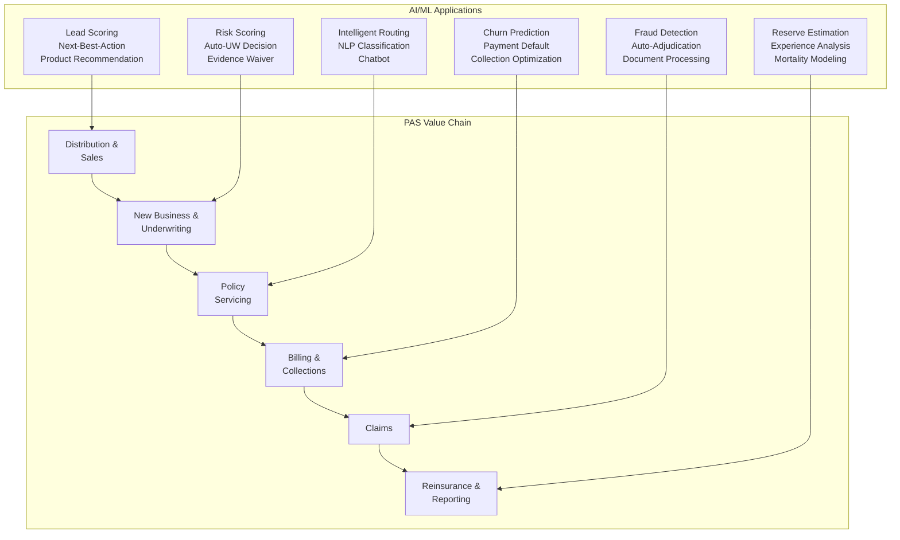

### 1.2 AI Maturity Stages in Insurance

| Stage | Characteristics | Typical Carriers | Examples |
|-------|----------------|-----------------|---------|
| **1. Descriptive** | BI dashboards, historical reporting | Most carriers | Claims trend reports |
| **2. Diagnostic** | Root cause analysis, data mining | Many carriers | Why lapse rates increased |
| **3. Predictive** | ML models for prediction | Advanced carriers | Lapse probability scoring |
| **4. Prescriptive** | Optimization, recommendations | Leading carriers | Optimal retention offer |
| **5. Autonomous** | AI-driven decisions with oversight | Emerging | Auto-underwriting with AI |

---

## 2. AI/ML Use Case Taxonomy for PAS

### 2.1 Complete Use Case Map

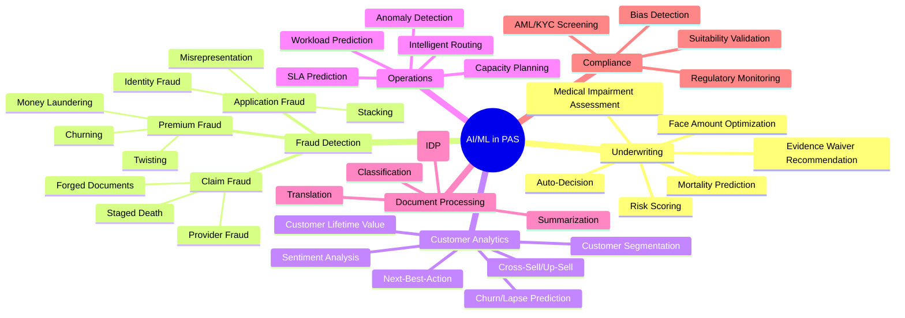

### 2.2 Use Case Prioritization Matrix

| Use Case | Business Impact (1-5) | Feasibility (1-5) | Data Readiness (1-5) | Regulatory Risk (1-5, lower=safer) | **Priority Score** |
|----------|:---:|:---:|:---:|:---:|:---:|
| Predictive underwriting | 5 | 4 | 4 | 3 | **4.0** |
| Fraud detection (claims) | 5 | 4 | 3 | 2 | **3.5** |
| Document classification | 4 | 5 | 5 | 1 | **3.75** |
| Lapse prediction | 4 | 4 | 4 | 2 | **3.5** |
| Medical record summarization | 4 | 3 | 3 | 2 | **3.0** |
| Next-best-action | 4 | 3 | 3 | 3 | **3.25** |
| Intelligent routing | 3 | 5 | 4 | 1 | **3.25** |
| Auto-underwriting decision | 5 | 3 | 3 | 4 | **3.75** |
| Application fraud detection | 5 | 3 | 3 | 2 | **3.25** |
| Chatbot / virtual assistant | 3 | 4 | 3 | 2 | **3.0** |

---

## 3. Predictive Underwriting

### 3.1 Feature Engineering

The quality of an underwriting model depends heavily on feature engineering—transforming raw data into predictive signals.

```mermaid
graph TB
    subgraph "Data Sources"
        DS1[Application Data<br/>Age, Gender, Tobacco,<br/>Occupation, Income]
        DS2[Electronic Health Records<br/>Diagnoses, Procedures,<br/>Medications, Lab Results]
        DS3[Prescription History<br/>Rx fill data (Milliman,<br/>ExamOne)]
        DS4[Credit/Financial Data<br/>Credit-based score<br/>(where permitted)]
        DS5[Demographics<br/>Zip code, education,<br/>marital status]
        DS6[Behavioral Data<br/>Wearables, fitness,<br/>driving data]
        DS7[MIB Data<br/>Prior applications,<br/>insurance history]
        DS8[MVR Data<br/>Driving record,<br/>violations]
    end

    subgraph "Feature Engineering"
        FE1[Raw Features<br/>Direct from sources]
        FE2[Derived Features<br/>Calculated combinations]
        FE3[Temporal Features<br/>Trends over time]
        FE4[Interaction Features<br/>Cross-source signals]
        FE5[Encoding<br/>Categorical, text, embedding]
    end

    subgraph "Feature Categories"
        FC1["Demographics: age_at_application, gender_code,<br/>bmi_calculated, tobacco_indicator"]
        FC2["Medical: diagnosis_count_3yr, rx_risk_score,<br/>chronic_condition_count, last_hospitalization_days"]
        FC3["Financial: credit_based_score, income_to_face_ratio,<br/>net_worth_category"]
        FC4["Behavioral: exercise_frequency, avg_daily_steps,<br/>sleep_quality_score"]
        FC5["Application: replacement_indicator, face_amount_band,<br/>product_type, beneficiary_relationship"]
    end

    DS1 & DS2 & DS3 & DS4 & DS5 & DS6 & DS7 & DS8 --> FE1
    FE1 --> FE2 & FE3 & FE4 & FE5
    FE2 & FE3 & FE4 & FE5 --> FC1 & FC2 & FC3 & FC4 & FC5
```

#### Key Feature Categories

**Demographic Features:**
| Feature | Source | Engineering | Predictive Signal |
|---------|--------|-------------|-------------------|
| `age_at_application` | Application | `application_date - dob` | Primary mortality factor |
| `gender_code` | Application | Binary encoding | Mortality differential |
| `bmi_calculated` | Application | `weight / height²` | Health risk indicator |
| `tobacco_indicator` | Application + Rx | Binary + Rx corroboration | Major mortality factor |
| `occupation_risk_class` | Application | Map occupation → risk class | Occupational hazard |
| `zip_code_mortality_index` | Demographics | CDC life expectancy by zip | Area mortality |

**Medical Features:**
| Feature | Source | Engineering | Predictive Signal |
|---------|--------|-------------|-------------------|
| `diagnosis_count_3yr` | EHR | Count distinct ICD-10 in 3 years | Overall health burden |
| `chronic_condition_flags` | EHR | Binary flags for diabetes, HTN, etc. | Specific risk factors |
| `rx_risk_score` | Prescription | Proprietary Rx scoring model | Medication-implied conditions |
| `rx_opioid_indicator` | Prescription | Flag opioid prescriptions | Substance abuse risk |
| `hospitalization_count_5yr` | EHR | Count inpatient admissions | Severity indicator |
| `er_visit_count_2yr` | EHR | Count ER visits | Acute health events |
| `lab_a1c_last` | EHR | Latest A1C value | Diabetes control |
| `lab_cholesterol_ratio` | EHR | Total/HDL ratio | Cardiovascular risk |

**Financial/Behavioral Features:**
| Feature | Source | Engineering | Predictive Signal |
|---------|--------|-------------|-------------------|
| `credit_based_insurance_score` | Credit bureau | Permissible insurance score | Financial stability |
| `income_to_face_ratio` | Application | `face_amount / annual_income` | Over-insurance risk |
| `prior_application_count` | MIB | Count prior apps in 2 years | Adverse selection signal |
| `replacement_indicator` | Application | Binary: replacing existing policy | Churning risk |
| `avg_daily_steps` | Wearable | 90-day average | Fitness level |

### 3.2 Model Types for Underwriting

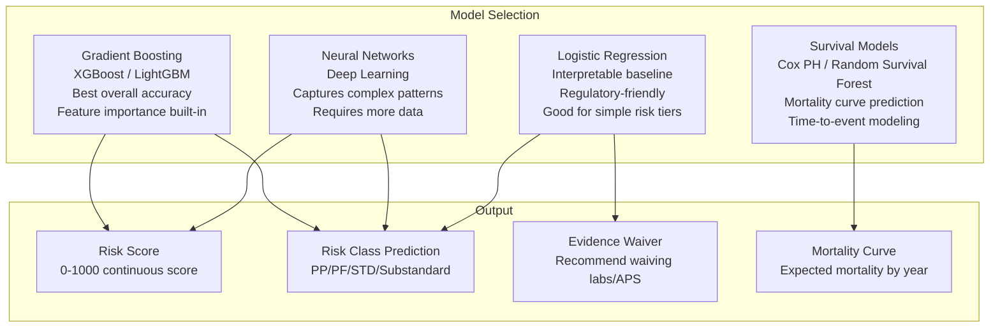

#### Model Comparison

| Model | Accuracy (AUC) | Interpretability | Training Data Required | Training Time | Best For |
|-------|:-:|:-:|:-:|:-:|---|
| **XGBoost/LightGBM** | 0.85-0.92 | Medium (SHAP) | 50K+ applications | Hours | Primary risk scoring |
| **Deep Neural Network** | 0.87-0.93 | Low (requires explainability layer) | 100K+ applications | Hours-Days | Complex multi-modal inputs |
| **Random Survival Forest** | 0.80-0.88 | Medium | 20K+ with mortality follow-up | Hours | Mortality prediction |
| **Cox Proportional Hazards** | 0.75-0.85 | High (coefficients) | 10K+ with mortality follow-up | Minutes | Regulatory reporting, transparent models |
| **Logistic Regression** | 0.72-0.80 | Very High | 5K+ applications | Minutes | Evidence waiver, baseline model |

### 3.3 Model Output Design

```json
{
  "applicationId": "APP-001",
  "modelVersion": "uw-risk-score-v3.2.1",
  "scoringTimestamp": "2026-01-15T10:30:00Z",
  "riskScore": {
    "value": 742,
    "percentile": 68,
    "confidence": 0.89
  },
  "predictedRiskClass": {
    "primary": "Standard NonSmoker",
    "probability": 0.62,
    "alternatives": [
      { "class": "Preferred NonSmoker", "probability": 0.22 },
      { "class": "Standard Plus NonSmoker", "probability": 0.12 },
      { "class": "Substandard Table 2", "probability": 0.04 }
    ]
  },
  "evidenceRecommendation": {
    "labsRequired": false,
    "apsRequired": false,
    "paramedRequired": true,
    "rationale": "Face amount $500K, age 42, no adverse Rx or EHR signals — labs waivable per model confidence threshold."
  },
  "keyRiskFactors": [
    {
      "factor": "BMI",
      "value": "28.5",
      "impact": "Moderate negative",
      "shapValue": -0.15
    },
    {
      "factor": "Rx History",
      "value": "Lisinopril (HTN controlled)",
      "impact": "Minor negative",
      "shapValue": -0.08
    },
    {
      "factor": "No Tobacco",
      "value": "True",
      "impact": "Strong positive",
      "shapValue": 0.25
    },
    {
      "factor": "Exercise Data",
      "value": "8,500 avg steps/day",
      "impact": "Moderate positive",
      "shapValue": 0.12
    }
  ],
  "mortalityEstimate": {
    "expectedMortalityRatio": 1.15,
    "confidenceInterval": [0.95, 1.40],
    "comparisonBasis": "2017 VBT"
  }
}
```

### 3.4 Calibration and Discrimination Metrics

| Metric | Description | Target | Measurement |
|--------|-------------|--------|-------------|
| **AUC (C-statistic)** | Area under ROC curve; ability to rank risks | > 0.85 | Binary classification of mortality within 15 years |
| **Gini Coefficient** | `2 × AUC - 1`; ranking power | > 0.70 | Same as AUC base |
| **Calibration** | Predicted probability matches actual frequency | Hosmer-Lemeshow p > 0.05 | Decile-level predicted vs actual |
| **A/E Ratio** | Actual-to-expected mortality by predicted class | 0.90-1.10 per class | Monitor quarterly |
| **Lift** | Improvement over random ordering | > 3x in top decile | Compared to traditional UW |
| **KS Statistic** | Max separation between classes | > 0.50 | Distribution comparison |
| **Brier Score** | Mean squared error of probability estimates | < 0.05 | Probability calibration |

### 3.5 Integration with Rules Engine

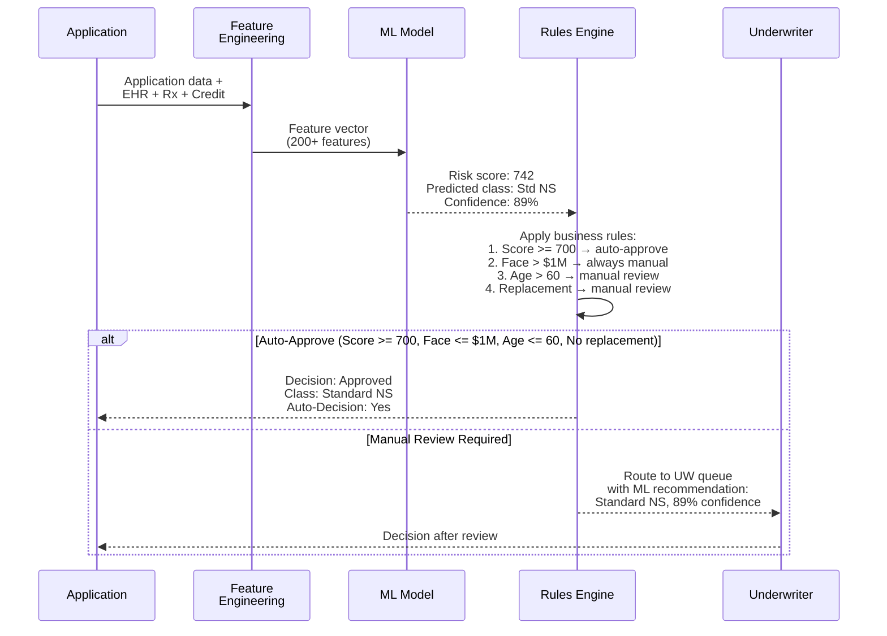

---

## 4. Automated Underwriting Decisions

### 4.1 Confidence-Based Decision Framework

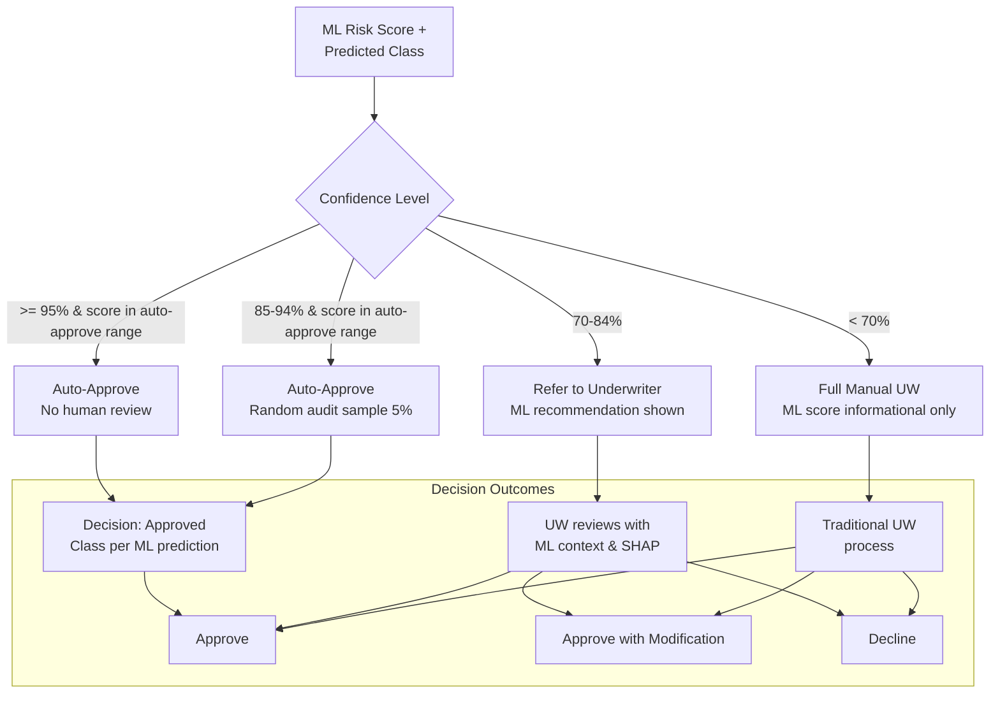

### 4.2 Auto-Approve Criteria

| Criterion | Threshold | Rationale |
|-----------|-----------|-----------|
| ML confidence | >= 85% | High model certainty |
| Risk score | 600-900 (standard range) | Within normal risk bounds |
| Face amount | <= $500K (age < 50), <= $250K (age 50-60) | Financial exposure limit |
| Product type | Term, UL, Whole Life (not VUL, not annuity > $1M) | Product complexity |
| Applicant age | 18-60 | Age range with best model accuracy |
| Replacement | Not a replacement | Replacement requires suitability review |
| Jurisdiction | All except NY (stricter rules) | Regulatory requirements |
| MIB | No adverse codes | No prior adverse history |
| Rx | No critical Rx flags | No dangerous medication patterns |

### 4.3 Model Risk Management (SR 11-7)

Federal Reserve SR 11-7 guidance requires rigorous model risk management:

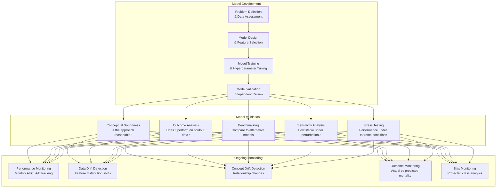

### 4.4 Champion-Challenger Testing

```mermaid
graph TB
    subgraph "Traffic Split"
        TS[Incoming Applications<br/>100%]
        TS -->|90%| CH[Champion Model<br/>v3.1 (Production)]
        TS -->|10%| CL[Challenger Model<br/>v3.2 (Shadow)]
    end

    subgraph "Execution"
        CH --> CH_D[Champion Decision<br/>Used for actual UW]
        CL --> CL_D[Challenger Decision<br/>Logged but NOT used]
    end

    subgraph "Comparison"
        CH_D --> COMP[Compare Metrics:<br/>AUC, calibration, A/E,<br/>auto-approve rate, fairness]
        CL_D --> COMP
    end

    subgraph "Promotion Decision"
        COMP --> PRO{Challenger<br/>significantly better?}
        PRO -->|Yes, > 30 days| PROMOTE[Promote Challenger<br/>to Champion]
        PRO -->|No| KEEP[Keep Champion<br/>Iterate Challenger]
    end
```

### 4.5 Shadow Mode Deployment

Before any model makes real decisions, it runs in shadow mode:

```
Phase 1 (4 weeks): Shadow mode
├── Model scores all applications in real-time
├── Decisions are logged but NOT acted upon
├── Human underwriters make all decisions
├── Compare: ML decision vs UW decision
├── Measure: agreement rate, accuracy, speed
└── Output: Model performance report

Phase 2 (4 weeks): Assisted mode
├── Model provides recommendation to underwriter
├── Underwriter can accept, modify, or override
├── Track: acceptance rate, override reasons
└── Output: Override analysis report

Phase 3 (ongoing): Auto-decision mode
├── Model auto-decides for qualifying applications
├── Random audit sample (5-10%)
├── Human reviews all non-qualifying applications
├── Continuous monitoring dashboard
└── Output: Monthly model performance report
```

### 4.6 Human Override Tracking

```json
{
  "overrideRecord": {
    "applicationId": "APP-001",
    "mlDecision": {
      "class": "Standard NonSmoker",
      "confidence": 0.91,
      "riskScore": 742
    },
    "uwDecision": {
      "class": "Substandard Table 2",
      "underwriter": "UW-Johnson",
      "overrideReason": "Recent cardiac event not captured in EHR data; APS reveals MI 6 months ago",
      "overrideCategory": "MISSING_MEDICAL_DATA",
      "timestamp": "2026-01-15T14:30:00Z"
    },
    "feedbackLoop": {
      "addedToRetrainingSet": true,
      "featureGap": "cardiac_event_recency not in feature set — add as feature",
      "modelImprovementTicket": "ML-TICKET-456"
    }
  }
}
```

### 4.7 Bias Testing (Protected Classes)

| Protected Class | Test | Threshold | Action if Failed |
|----------------|------|-----------|-----------------|
| **Race/Ethnicity** | Disparate impact ratio | > 0.80 (4/5 rule) | Model adjustment, feature removal |
| **Gender** | Equal approval rates | Statistical significance | Separate models or recalibration |
| **Age** | No disproportionate decline | Actuarially justified differentials only | Review age-related features |
| **Disability** | Reasonable accommodation | ADA compliance | Review health-related features |
| **Zip Code (proxy for race)** | Geographic fairness analysis | No redlining patterns | Remove or decorrelate zip features |
| **Income** | No disparate impact on protected classes | Cross-tabulation analysis | Feature impact assessment |

### 4.8 Regulatory Compliance

| Regulation | Jurisdiction | Requirement | AI/ML Impact |
|-----------|-------------|-------------|-------------|
| **NAIC Model Bulletin on AI/ML** | All US states | Transparency, fairness, accountability | Model documentation, bias testing |
| **Colorado SB 21-169** | Colorado | Prevent unfair discrimination in insurance | Disparate impact testing required |
| **EU AI Act** | EU | Risk-based regulation of AI systems | High-risk classification for insurance UW |
| **FCRA** | US Federal | Fair credit reporting requirements | If using credit data, FCRA compliance |
| **HIPAA** | US Federal | Protected health information | De-identification, minimum necessary |
| **State UW Guidelines** | Per state | Some states limit automated decisions | Human review requirements |

---

## 5. Fraud Detection

### 5.1 Fraud Taxonomy

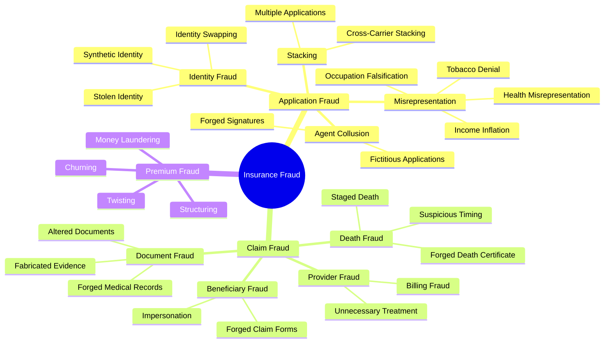

### 5.2 Application Fraud Detection

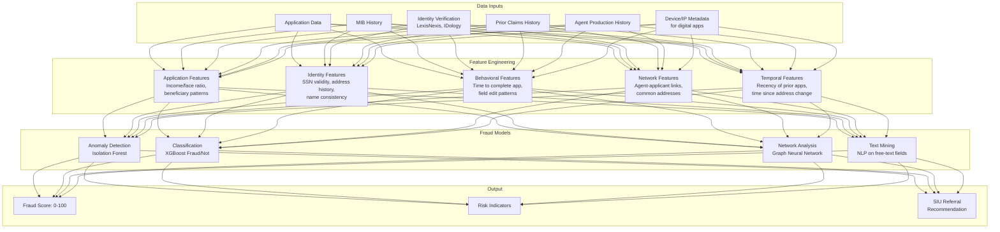

#### Application Fraud Indicators

| Indicator | Feature | Signal |
|-----------|---------|--------|
| **Income inflation** | `face_amount / declared_income > 20x` | Abnormally high coverage for income |
| **Rapid app completion** | `time_to_complete < 3 minutes` (digital) | Pre-filled by someone other than applicant |
| **SSN anomaly** | SSN issued state != declared state | Potential synthetic/stolen identity |
| **Address mismatch** | Application address != credit/utility address | Identity fraud |
| **Beneficiary unusual** | Non-family beneficiary, 100% to one person | Potential STOLI |
| **Multiple recent apps** | `prior_apps_90days > 2` | Stacking |
| **Agent pattern** | Agent has > 5% fraud rate historically | Agent collusion risk |
| **Replacement pattern** | Multiple replacements from same agent | Churning/twisting |

### 5.3 Claim Fraud Detection

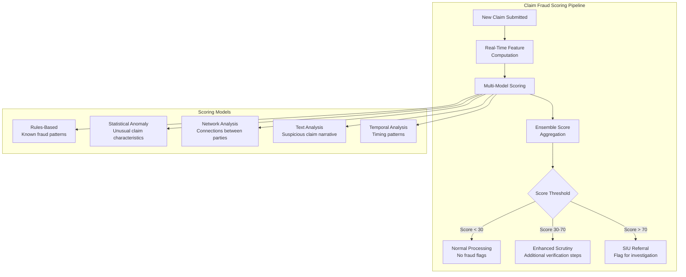

#### Claim Fraud Indicators

| Indicator | Model Type | Signal |
|-----------|-----------|--------|
| **Early death claim** | Rules + Statistical | Death within contestability period (2 years) |
| **Large face amount** | Statistical | Face amount > 90th percentile for demographics |
| **Recent beneficiary change** | Temporal | Beneficiary changed within 6 months of death |
| **Cause of death mismatch** | NLP + Rules | Cause doesn't match medical history |
| **Multiple claims from same address** | Network | Multiple unrelated claimants at same address |
| **Document inconsistencies** | Computer Vision | Altered dates, mismatched fonts on death certificate |
| **Physician pattern** | Network | Same physician on multiple suspicious claims |
| **Suspicious narrative** | NLP | Vague, inconsistent claim description |

### 5.4 Fraud Detection Model Architecture

```json
{
  "claimId": "CLM-001",
  "fraudAssessment": {
    "overallScore": 78,
    "riskLevel": "High",
    "modelVersion": "fraud-claim-v2.1.0",
    "scoringTimestamp": "2026-04-01T09:30:00Z",
    "indicators": [
      {
        "indicator": "EARLY_CLAIM",
        "severity": "High",
        "details": "Death claim filed 14 months after policy issue date",
        "score": 85
      },
      {
        "indicator": "RECENT_BENE_CHANGE",
        "severity": "Medium",
        "details": "Beneficiary changed from spouse to unrelated individual 4 months before death",
        "score": 72
      },
      {
        "indicator": "HIGH_FACE_AMOUNT",
        "severity": "Medium",
        "details": "Face amount $2M is in 95th percentile for demographics",
        "score": 65
      },
      {
        "indicator": "NETWORK_LINK",
        "severity": "Low",
        "details": "Claimant address matches another pending claim",
        "score": 45
      }
    ],
    "recommendation": "REFER_TO_SIU",
    "rationale": "Multiple high-severity indicators suggest potential fraud. Early death claim combined with recent beneficiary change to non-family member warrants investigation.",
    "investigationPriority": "P1"
  }
}
```

### 5.5 Network Analysis for Fraud Rings

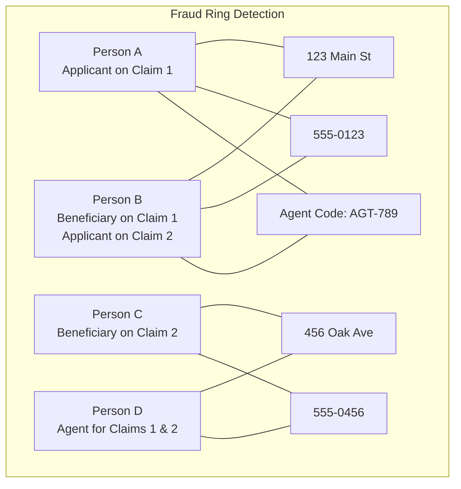

Graph neural networks can detect these patterns:
- Shared addresses between unrelated parties.
- Common phone numbers or email addresses.
- Same agent involved in multiple suspicious claims.
- Circular beneficiary designations.
- Common medical providers.

---

## 6. NLP Applications

### 6.1 Medical Record Summarization

```mermaid
graph TB
    subgraph "Medical NLP Pipeline"
        A[Raw Medical Records<br/>APS, Lab Reports, Narratives] --> B[Text Extraction<br/>OCR if image-based]
        B --> C[Section Segmentation<br/>History, Medications, Labs,<br/>Assessment, Plan]
        C --> D[Medical Named Entity<br/>Recognition (NER)<br/>Diagnoses, Meds,<br/>Procedures, Vitals]
        D --> E[Relation Extraction<br/>Medication→Condition,<br/>Procedure→Diagnosis]
        E --> F[Temporal Extraction<br/>When diagnosed,<br/>duration, frequency]
        F --> G[Negation Detection<br/>"no diabetes",<br/>"denies chest pain"]
        G --> H[Normalization<br/>Map to ICD-10, SNOMED,<br/>RxNorm]
        H --> I[Summary Generation<br/>Structured + Narrative]
    end

    subgraph "Output"
        I --> J["Structured Summary (JSON)<br/>+ Narrative Summary (Text)<br/>+ Risk Flags"]
    end
```

#### NER Model for Insurance Medical Records

| Entity Type | Examples | Model | Accuracy (F1) |
|------------|---------|-------|:-:|
| **Diagnosis** | Hypertension, Type 2 Diabetes, COPD | BioBERT fine-tuned | 0.92 |
| **Medication** | Lisinopril 10mg, Metformin 500mg BID | RxNorm lookup + NER | 0.95 |
| **Procedure** | Coronary bypass, colonoscopy, MRI | NER + CPT mapping | 0.89 |
| **Lab Result** | A1C 6.5, Cholesterol 220, PSA 2.1 | Rule-based + NER | 0.93 |
| **Vital Sign** | BP 130/85, BMI 28.5, HR 72 | Rule-based | 0.97 |
| **Temporal** | Diagnosed 2020, started medication 3 months ago | SUTime + custom | 0.85 |
| **Negation** | No diabetes, denies tobacco, negative for cancer | NegEx algorithm | 0.94 |

### 6.2 Correspondence Understanding

```typescript
interface CorrespondenceAnalysis {
  documentId: string;
  channel: 'email' | 'letter' | 'fax' | 'chat';
  nlpResults: {
    intent: {
      primary: string;         // e.g., "BENEFICIARY_CHANGE_REQUEST"
      confidence: number;      // 0.95
      secondary: string[];     // ["ADDRESS_UPDATE"]
    };
    entities: {
      policyNumber?: string;   // Extracted: "A1234567"
      partyName?: string;      // "John Smith"
      requestedDate?: string;  // "February 1, 2026"
      amount?: number;         // $50,000
    };
    sentiment: {
      score: number;           // -0.87 (very negative)
      label: string;           // "Very Negative"
      emotions: string[];      // ["frustration", "anger"]
    };
    urgency: 'Low' | 'Normal' | 'High' | 'Critical';
    language: string;          // "en"
    summaryText: string;       // "Policyholder requests beneficiary change from spouse to children..."
    suggestedActions: string[];// ["Create beneficiary change request", "Send acknowledgment"]
    routingQueue: string;      // "servicing-beneficiary"
    autoRespondEligible: boolean; // false (complex request)
  };
}
```

### 6.3 Chatbot Architecture for Policyholder Self-Service

```mermaid
graph TB
    subgraph "User Interface"
        UI1[Web Chat Widget]
        UI2[Mobile App Chat]
        UI3[Voice (IVR/Alexa)]
        UI4[SMS]
    end

    subgraph "NLU Engine"
        NLU[Natural Language<br/>Understanding<br/>Intent + Entity Extraction]
    end

    subgraph "Dialog Management"
        DM[Dialog Manager<br/>Conversation State<br/>Slot Filling<br/>Context Management]
    end

    subgraph "Fulfillment"
        F1[Policy API<br/>Inquiry, Values]
        F2[Billing API<br/>Payment Status]
        F3[Change Request API<br/>Address, Beneficiary]
        F4[Document API<br/>Statement Retrieval]
        F5[FAQ Knowledge Base<br/>General Questions]
    end

    subgraph "Escalation"
        E1[Live Agent Handoff<br/>With Conversation Context]
    end

    UI1 & UI2 & UI3 & UI4 --> NLU
    NLU --> DM
    DM --> F1 & F2 & F3 & F4 & F5
    DM --> E1
```

#### Intent Model for Insurance Chatbot

| Intent | Example Utterance | Confidence Threshold | Fulfillment |
|--------|------------------|:---:|---|
| `policy.status` | "What's the status of my policy?" | 0.80 | API: GET /policies/{id} |
| `policy.values` | "How much is my cash value?" | 0.85 | API: GET /policies/{id}/values |
| `billing.next_payment` | "When is my next premium due?" | 0.80 | API: GET /policies/{id}/billing |
| `billing.make_payment` | "I want to pay my premium" | 0.85 | API: POST /policies/{id}/payments |
| `change.address` | "I moved to a new address" | 0.80 | Slot-fill → API |
| `change.beneficiary` | "I need to change my beneficiary" | 0.85 | Explain process + send forms |
| `claim.status` | "What's happening with my claim?" | 0.85 | API: GET /claims/{id} |
| `document.request` | "Can I get a copy of my policy?" | 0.80 | API: GET /policies/{id}/documents |
| `loan.request` | "I'd like to borrow from my policy" | 0.85 | Explain + initiate workflow |
| `general.faq` | "What is cash surrender value?" | 0.75 | Knowledge base search |
| `escalate.agent` | "I want to talk to a person" | 0.70 | Immediate handoff |

### 6.4 Policy Document Semantic Search

```mermaid
graph TB
    subgraph "Document Ingestion"
        D1[Policy Documents<br/>Contracts, Riders,<br/>Endorsements]
        D2[Text Extraction<br/>PDF → Text]
        D3[Chunking<br/>Section-level splits]
        D4[Embedding Generation<br/>Sentence Transformer]
        D5[Vector Store<br/>Pinecone / Weaviate / pgvector]
    end

    subgraph "Query Processing"
        Q1[User Query:<br/>"What is the suicide<br/>exclusion period?"]
        Q2[Query Embedding]
        Q3[Semantic Search<br/>Cosine Similarity]
        Q4[Retrieval<br/>Top-K relevant chunks]
        Q5[Answer Generation<br/>LLM with context]
    end

    D1 --> D2 --> D3 --> D4 --> D5
    Q1 --> Q2 --> Q3
    D5 --> Q3
    Q3 --> Q4 --> Q5
```

---

## 7. Computer Vision

### 7.1 Document Classification

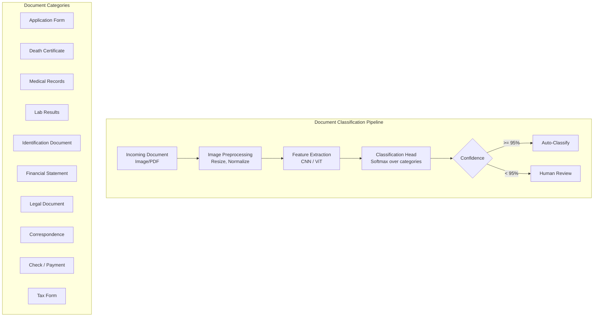

| Document Type | Model | Accuracy | Training Samples |
|--------------|-------|:---:|:---:|
| Application form | ResNet-50 fine-tuned | 98.5% | 5,000+ |
| Death certificate | ResNet-50 fine-tuned | 97.2% | 3,000+ |
| Medical records | LayoutLM | 94.8% | 10,000+ |
| ID document | Specialized ID model | 99.1% | 8,000+ |
| Check | Specialized check model | 99.5% | 15,000+ |
| Correspondence | LayoutLM + NLP | 93.5% | 7,000+ |

### 7.2 Form Field Extraction

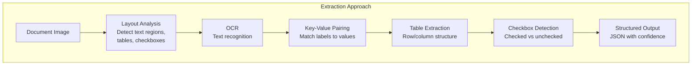

### 7.3 Signature Verification

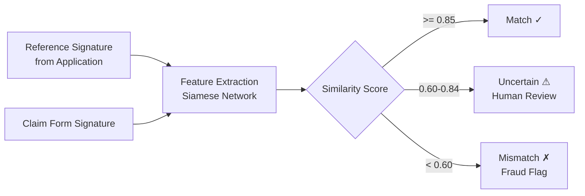

### 7.4 ID Document Verification

| Verification Step | Technology | Purpose |
|------------------|-----------|---------|
| **Document authenticity** | Hologram detection, microprint analysis | Detect forged IDs |
| **Data extraction** | OCR + MRZ reading | Extract name, DOB, ID number |
| **Face matching** | Face comparison CNN | Match ID photo to selfie/application photo |
| **Liveness detection** | Anti-spoofing model | Ensure live person, not photo of photo |
| **Data cross-reference** | Database lookup | Verify against government databases |

### 7.5 Check Processing

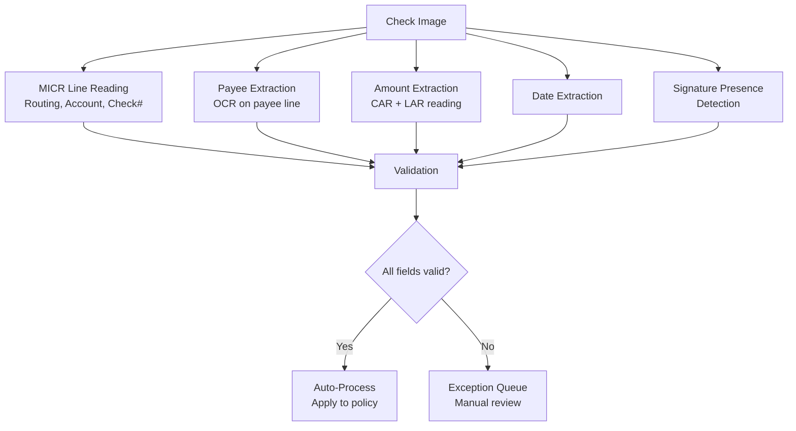

---

## 8. Customer Analytics

### 8.1 Lapse/Churn Prediction

```mermaid
graph TB
    subgraph "Lapse Prediction Model"
        subgraph "Features"
            F1[Payment History<br/>Late payments, grace periods,<br/>NSF history]
            F2[Policy Characteristics<br/>Duration, product type,<br/>face amount, premium burden]
            F3[Customer Profile<br/>Age, income, life events,<br/>number of policies]
            F4[Engagement<br/>Portal logins, call frequency,<br/>email opens]
            F5[Market Conditions<br/>Interest rates, competing<br/>product rates]
            F6[Agent Relationship<br/>Agent contact frequency,<br/>agent retention rate]
        end

        subgraph "Model"
            M1[Gradient Boosting<br/>Classifier<br/>Predict: P(lapse in 90 days)]
        end

        subgraph "Output"
            O1["Lapse Score: 0.73<br/>Risk Level: High<br/>Primary Driver: 3 late payments<br/>Recommended Action: Agent outreach"]
        end
    end

    F1 & F2 & F3 & F4 & F5 & F6 --> M1 --> O1
```

#### Lapse Prediction Features

| Feature Category | Features | Data Source |
|-----------------|----------|-------------|
| **Payment behavior** | late_payment_count_12m, avg_days_past_due, nsf_count, payment_method_changes | Billing system |
| **Policy economics** | premium_to_income_ratio, surrender_charge_percent, csv_to_premium_ratio | PAS + Application |
| **Engagement** | portal_login_count_90d, call_count_90d, email_open_rate, last_contact_days | CRM + Portal |
| **Life events** | address_change_recency, beneficiary_change_recency, divorce_indicator | PAS + Public records |
| **Tenure** | policy_duration_months, months_since_issue, in_first_year, past_free_look | PAS |
| **Product** | product_type, riders_count, cash_value_positive, loan_utilization_pct | PAS |

### 8.2 Next-Best-Action (NBA)

```mermaid
graph TB
    subgraph "NBA Engine"
        A[Customer Context<br/>Policy portfolio, life stage,<br/>recent interactions] --> B[Candidate Actions]

        subgraph "Candidate Actions"
            B1[Retention Offer<br/>Premium discount / benefit]
            B2[Cross-Sell<br/>Additional coverage]
            B3[Up-Sell<br/>Increase face amount]
            B4[Service Reminder<br/>Beneficiary review, etc.]
            B5[Engagement<br/>Financial wellness content]
        end

        B --> B1 & B2 & B3 & B4 & B5

        subgraph "Scoring"
            S1[Response Probability<br/>P(customer acts on offer)]
            S2[Revenue Impact<br/>Expected revenue per action]
            S3[Retention Impact<br/>P(retain) with vs without]
            S4[Regulatory Check<br/>Suitability, do-not-contact]
        end

        B1 & B2 & B3 & B4 & B5 --> S1 & S2 & S3 & S4

        S1 & S2 & S3 & S4 --> C[Rank & Select<br/>Top action for customer]
        C --> D["NBA: Offer 10% premium<br/>credit for 6 months<br/>P(accept) = 0.42<br/>Expected CLV impact: +$12,400"]
    end
```

### 8.3 Customer Lifetime Value (CLV)

```python
# Simplified CLV calculation for life insurance
def calculate_clv(policy):
    """
    CLV = Sum of future cash flows discounted to present value
    Components:
      + Expected future premiums
      + Expected cross-sell revenue
      - Expected claims payout (probability-weighted)
      - Expected servicing cost
      - Expected lapse probability (reduces future premiums)
    """
    clv = 0
    for year in range(1, max_projection_years + 1):
        # Probability policy is still in-force
        survival_prob = predict_survival(policy, year)

        # Expected premium revenue
        premium_revenue = policy.annual_premium * survival_prob

        # Expected cross-sell revenue
        cross_sell_revenue = predict_cross_sell_revenue(policy, year) * survival_prob

        # Expected claims cost
        mortality_rate = get_mortality_rate(policy.insured_age + year, policy.risk_class)
        expected_claims = policy.face_amount * mortality_rate * survival_prob

        # Servicing cost
        servicing_cost = ANNUAL_SERVICING_COST * survival_prob

        # Net cash flow for year
        net_cf = premium_revenue + cross_sell_revenue - expected_claims - servicing_cost

        # Discount to present value
        clv += net_cf / (1 + DISCOUNT_RATE) ** year

    return clv
```

### 8.4 Customer Segmentation

| Segment | Characteristics | Size | Strategy |
|---------|----------------|:---:|---------|
| **High-Value Loyal** | High CLV, long tenure, multiple products, no lapse risk | 15% | White-glove service, exclusive products |
| **Growth Potential** | Young, single product, high income, low coverage | 20% | Cross-sell life + DI + annuity |
| **At-Risk Valuable** | High CLV, recent late payments, declining engagement | 10% | Proactive retention, premium review |
| **Cost-Conscious** | Price-sensitive, term life, comparison shoppers | 25% | Competitive pricing, digital self-service |
| **Service-Intensive** | Frequent calls, complaints, high servicing cost | 10% | Improve self-service, reduce friction |
| **Dormant** | No engagement, paid-up or auto-pay, no interaction | 20% | Re-engagement campaigns, review prompts |

---

## 9. Operational Intelligence

### 9.1 Intelligent Routing

```mermaid
graph TB
    subgraph "Work Item Routing"
        A[Incoming Work Item<br/>Change Request, Claim,<br/>Correspondence] --> B[ML Classification<br/>Complexity, type, urgency]
        B --> C[Skill Matching<br/>Required expertise vs<br/>available staff skills]
        C --> D[Workload Balancing<br/>Current queue depth<br/>per processor]
        D --> E[SLA Prediction<br/>Will this meet SLA<br/>given current capacity?]
        E --> F{SLA at risk?}
        F -->|No| G[Assign to optimal<br/>processor]
        F -->|Yes| H[Escalate or<br/>redistribute workload]
    end
```

### 9.2 Workload Prediction

```mermaid
graph TB
    subgraph "Workload Forecasting Model"
        I1[Historical Volumes<br/>by type, day, season]
        I2[Calendar Events<br/>Holidays, month-end,<br/>tax deadlines]
        I3[Marketing Campaigns<br/>Planned promotions]
        I4[External Factors<br/>Market events, regulatory<br/>deadlines]

        I1 & I2 & I3 & I4 --> M[Time Series Model<br/>Prophet / LSTM]

        M --> O["Forecast: Next 30 days<br/>Day 1: 450 new business apps<br/>Day 2: 380 new business apps<br/>...<br/>Day 15 (month-end): 680 apps<br/>Day 30: 420 apps<br/><br/>Staffing recommendation:<br/>Week 1: 12 processors needed<br/>Week 2: 10 processors needed<br/>Week 3: 15 processors needed"]
    end
```

### 9.3 Anomaly Detection for Operations

| Anomaly Type | Detection Method | Example |
|-------------|-----------------|---------|
| **Volume spike** | Statistical control chart | New business apps 3x normal on Tuesday |
| **Processing delay** | Time-series anomaly | Average UW cycle time increased 50% |
| **Error rate spike** | Binomial control chart | NIGO rate jumped from 15% to 30% |
| **System performance** | Response time monitoring | PAS API latency exceeded p99 threshold |
| **Unusual transaction** | Isolation forest | $5M withdrawal from a $500K policy |
| **Agent behavior** | Pattern detection | Agent submitting 10x normal applications |

---

## 10. MLOps for Insurance

### 10.1 Model Development Lifecycle

```mermaid
graph TB
    subgraph "1. Problem Definition"
        PD[Business Problem<br/>Model Scope<br/>Success Metrics<br/>Regulatory Requirements]
    end

    subgraph "2. Data Engineering"
        DE1[Data Discovery<br/>Available data sources]
        DE2[Data Pipeline<br/>ETL, feature engineering]
        DE3[Data Quality<br/>Completeness, accuracy,<br/>bias assessment]
        DE4[Feature Store<br/>Versioned features]
    end

    subgraph "3. Model Development"
        MD1[Exploratory Analysis<br/>Feature importance,<br/>correlation]
        MD2[Model Selection<br/>Algorithm comparison]
        MD3[Training<br/>Cross-validation,<br/>hyperparameter tuning]
        MD4[Evaluation<br/>Holdout test, fairness]
    end

    subgraph "4. Model Validation"
        MV1[Independent Validation<br/>Separate team]
        MV2[Bias Testing<br/>Protected classes]
        MV3[Stress Testing<br/>Edge cases, adversarial]
        MV4[Documentation<br/>Model card, risk assessment]
    end

    subgraph "5. Deployment"
        DP1[Model Registry<br/>Version control]
        DP2[Serving Infrastructure<br/>Batch or real-time]
        DP3[A/B Testing<br/>Champion-challenger]
        DP4[Monitoring Setup<br/>Dashboards, alerts]
    end

    subgraph "6. Monitoring"
        MO1[Performance Monitoring<br/>AUC, calibration]
        MO2[Data Drift Detection<br/>Feature distributions]
        MO3[Concept Drift<br/>Target relationship change]
        MO4[Fairness Monitoring<br/>Ongoing bias checks]
    end

    PD --> DE1 --> DE2 --> DE3 --> DE4
    DE4 --> MD1 --> MD2 --> MD3 --> MD4
    MD4 --> MV1 --> MV2 --> MV3 --> MV4
    MV4 --> DP1 --> DP2 --> DP3 --> DP4
    DP4 --> MO1 --> MO2 --> MO3 --> MO4
    MO4 -->|Retrain trigger| MD1
```

### 10.2 Feature Store Design

```mermaid
graph TB
    subgraph "Data Sources"
        S1[PAS Database]
        S2[CRM System]
        S3[EHR / Rx Data]
        S4[Payment System]
        S5[External Data<br/>Credit, MVR]
    end

    subgraph "Feature Pipelines"
        P1[Batch Pipeline<br/>Spark / dbt<br/>Daily/Weekly]
        P2[Streaming Pipeline<br/>Kafka + Flink<br/>Real-time]
    end

    subgraph "Feature Store"
        FS[Feature Store<br/>Feast / Tecton / SageMaker]
        OFF[Offline Store<br/>Historical features<br/>for training]
        ON[Online Store<br/>Low-latency features<br/>for inference]
        REG[Feature Registry<br/>Metadata, lineage,<br/>ownership, documentation]
    end

    subgraph "Consumers"
        C1[Model Training<br/>Historical features]
        C2[Real-Time Inference<br/>Online features]
        C3[Batch Inference<br/>Offline features]
    end

    S1 & S2 & S3 & S4 & S5 --> P1 & P2
    P1 --> OFF
    P2 --> ON
    OFF & ON --> FS
    FS --> REG
    OFF --> C1 & C3
    ON --> C2
```

#### Feature Store Schema Example

```yaml
feature_views:
  - name: policy_features
    entities: [policy_id]
    ttl: 24h
    features:
      - name: policy_duration_months
        dtype: INT64
        description: "Months since policy issue date"
      - name: total_premiums_paid
        dtype: FLOAT64
        description: "Cumulative premiums paid to date"
      - name: late_payment_count_12m
        dtype: INT64
        description: "Number of late payments in last 12 months"
      - name: current_account_value
        dtype: FLOAT64
        description: "Current account value"
      - name: loan_utilization_pct
        dtype: FLOAT64
        description: "Loan balance / max loanable value"

  - name: party_features
    entities: [party_id]
    ttl: 24h
    features:
      - name: age_current
        dtype: INT64
      - name: policy_count
        dtype: INT64
      - name: total_face_amount
        dtype: FLOAT64
      - name: address_change_count_2yr
        dtype: INT64
      - name: call_count_90d
        dtype: INT64
      - name: portal_login_count_90d
        dtype: INT64
```

### 10.3 Model Registry

```mermaid
graph TB
    subgraph "Model Registry (MLflow / SageMaker)"
        MR[Model Registry]

        subgraph "Model: UW Risk Score"
            V1["v3.1.0 (Champion)<br/>AUC: 0.89<br/>Deployed: 2025-11-01<br/>Status: Production"]
            V2["v3.2.0 (Challenger)<br/>AUC: 0.91<br/>Deployed: 2026-01-15<br/>Status: Staging (10% traffic)"]
            V3["v3.3.0-dev<br/>AUC: 0.92 (validation)<br/>Status: Development"]
        end

        subgraph "Model: Lapse Prediction"
            L1["v2.0.0 (Champion)<br/>AUC: 0.82<br/>Status: Production"]
        end

        subgraph "Model: Fraud Detection"
            F1["v1.5.0 (Champion)<br/>AUC: 0.87<br/>Status: Production"]
        end
    end

    subgraph "Artifacts per Version"
        A1[Trained Model Binary]
        A2[Training Data Version]
        A3[Feature List]
        A4[Hyperparameters]
        A5[Evaluation Metrics]
        A6[Model Card / Documentation]
        A7[Bias Report]
        A8[Validation Report]
    end

    V1 --> A1 & A2 & A3 & A4 & A5 & A6 & A7 & A8
```

### 10.4 Model Deployment Patterns

#### Batch Inference

```mermaid
graph LR
    A[Scheduler<br/>Daily 2 AM] --> B[Load Model<br/>from Registry]
    B --> C[Load Features<br/>from Offline Store]
    C --> D[Batch Scoring<br/>All active policies]
    D --> E[Write Scores<br/>to Score Store]
    E --> F[Trigger Actions<br/>Based on scores]
```

**Use cases**: Lapse prediction scoring (daily), cross-sell propensity scoring (weekly), reserve estimation (monthly).

#### Real-Time Inference

```mermaid
graph LR
    A[API Request<br/>Score Application] --> B[Model Serving<br/>Container]
    B --> C[Load Features<br/>from Online Store]
    C --> D[Inference<br/>< 100ms]
    D --> E[Return Score<br/>to Caller]
```

**Use cases**: Underwriting risk scoring (per application), fraud scoring (per claim submission), chatbot intent classification (per message).

### 10.5 Model Monitoring

```mermaid
graph TB
    subgraph "Monitoring Dashboard"
        subgraph "Performance Metrics"
            PM1["AUC Over Time<br/>Current: 0.89<br/>30-day avg: 0.88<br/>Threshold: 0.85"]
            PM2["Calibration<br/>Expected vs Actual<br/>by decile"]
            PM3["Prediction Distribution<br/>Histogram of scores"]
        end

        subgraph "Data Drift"
            DD1["Feature Drift<br/>PSI per feature<br/>Alert if PSI > 0.25"]
            DD2["Population Shift<br/>Demographics of scored<br/>population vs training"]
        end

        subgraph "Concept Drift"
            CD1["A/E Ratio<br/>Actual outcomes vs<br/>predicted by cohort"]
            CD2["SHAP Value Drift<br/>Feature importance<br/>changes over time"]
        end

        subgraph "Operational"
            OP1["Inference Latency<br/>p50: 45ms, p99: 120ms"]
            OP2["Error Rate<br/>0.02% inference failures"]
            OP3["Volume<br/>12,500 scores/day"]
        end
    end
```

#### Data Drift Detection

```python
from scipy.stats import wasserstein_distance, ks_2samp
import numpy as np

def detect_feature_drift(training_distribution, production_distribution, threshold=0.1):
    """
    Population Stability Index (PSI) for drift detection.
    PSI < 0.1: No significant drift
    0.1 <= PSI < 0.25: Moderate drift (investigate)
    PSI >= 0.25: Significant drift (retrain)
    """
    psi = calculate_psi(training_distribution, production_distribution)

    ks_stat, ks_pvalue = ks_2samp(training_distribution, production_distribution)

    return {
        'psi': psi,
        'ks_statistic': ks_stat,
        'ks_pvalue': ks_pvalue,
        'drift_detected': psi >= threshold,
        'severity': 'none' if psi < 0.1 else 'moderate' if psi < 0.25 else 'significant'
    }

def calculate_psi(expected, actual, buckets=10):
    breakpoints = np.percentile(expected, np.arange(0, 110, 100/buckets))
    expected_percents = np.histogram(expected, breakpoints)[0] / len(expected)
    actual_percents = np.histogram(actual, breakpoints)[0] / len(actual)

    expected_percents = np.clip(expected_percents, 0.0001, None)
    actual_percents = np.clip(actual_percents, 0.0001, None)

    psi = np.sum((actual_percents - expected_percents) * np.log(actual_percents / expected_percents))
    return psi
```

### 10.6 Model Retraining Triggers

| Trigger | Condition | Action |
|---------|-----------|--------|
| **Scheduled** | Quarterly | Retrain with latest data |
| **Performance degradation** | AUC drops > 3% from baseline | Alert + initiate retraining |
| **Data drift** | PSI > 0.25 on key features | Alert + investigate + retrain |
| **Concept drift** | A/E ratio outside 0.85-1.15 for 3 months | Alert + retrain with recent outcomes |
| **New data source** | New features available (e.g., wearable data) | Experimental retraining |
| **Regulatory change** | New bias testing requirements | Revalidation + possible retrain |
| **Business change** | New product launch, market shift | Retrain for new population |

### 10.7 Explainability (SHAP, LIME)

```python
import shap

explainer = shap.TreeExplainer(model)
shap_values = explainer.shap_values(X_test)

# Global feature importance
shap.summary_plot(shap_values, X_test, feature_names=feature_names)

# Individual explanation for a specific application
application_idx = 0
shap.force_plot(
    explainer.expected_value,
    shap_values[application_idx],
    X_test.iloc[application_idx],
    feature_names=feature_names
)
```

#### SHAP Output for Underwriting Decision

```json
{
  "applicationId": "APP-001",
  "modelPrediction": {
    "riskClass": "Standard NonSmoker",
    "riskScore": 742,
    "baseValue": 700
  },
  "shapExplanation": {
    "baselineScore": 700,
    "featureContributions": [
      { "feature": "no_tobacco", "value": true, "contribution": +42, "direction": "positive" },
      { "feature": "exercise_score", "value": 8500, "contribution": +28, "direction": "positive" },
      { "feature": "bmi", "value": 28.5, "contribution": -18, "direction": "negative" },
      { "feature": "rx_risk_score", "value": 2.1, "contribution": -12, "direction": "negative" },
      { "feature": "age", "value": 42, "contribution": -8, "direction": "negative" },
      { "feature": "income_coverage_ratio", "value": 5.2, "contribution": +6, "direction": "positive" },
      { "feature": "credit_score", "value": 740, "contribution": +4, "direction": "positive" }
    ],
    "finalScore": 742,
    "narrativeExplanation": "The model assigns Standard NonSmoker primarily due to non-tobacco status (+42) and good exercise data (+28). The slightly elevated BMI (-18) and controlled hypertension medication (-12) partially offset these positive factors."
  }
}
```

---

## 11. Ethical AI & Regulatory Compliance

### 11.1 Fairness Framework

```mermaid
graph TB
    subgraph "Fairness Assessment Pipeline"
        A[Model Output] --> B[Segment by<br/>Protected Classes]
        B --> C[Calculate Fairness Metrics]

        subgraph "Metrics"
            C --> M1[Demographic Parity<br/>Equal approval rates]
            C --> M2[Equalized Odds<br/>Equal TPR and FPR]
            C --> M3[Disparate Impact Ratio<br/>Four-Fifths Rule]
            C --> M4[Individual Fairness<br/>Similar inputs → similar outputs]
            C --> M5[Counterfactual Fairness<br/>Change protected attr → same outcome?]
        end

        M1 & M2 & M3 & M4 & M5 --> D{Fairness Threshold Met?}
        D -->|Yes| E[Approve for Deployment]
        D -->|No| F[Remediation Required]
        F --> G[Feature Removal]
        F --> H[Re-weighting]
        F --> I[Adversarial Debiasing]
        F --> J[Post-Processing Calibration]
        G & H & I & J --> A
    end
```

### 11.2 Disparate Impact Testing

```python
def disparate_impact_analysis(predictions, protected_attribute, favorable_outcome=1):
    """
    Calculate disparate impact ratio per EEOC four-fifths rule.
    Ratio >= 0.80 indicates no disparate impact.
    """
    groups = predictions.groupby(protected_attribute)

    results = {}
    approval_rates = {}

    for group_name, group_data in groups:
        approval_rate = (group_data['prediction'] == favorable_outcome).mean()
        approval_rates[group_name] = approval_rate

    reference_group = max(approval_rates, key=approval_rates.get)
    reference_rate = approval_rates[reference_group]

    for group_name, rate in approval_rates.items():
        di_ratio = rate / reference_rate if reference_rate > 0 else 0
        results[group_name] = {
            'approval_rate': rate,
            'disparate_impact_ratio': di_ratio,
            'passes_four_fifths': di_ratio >= 0.80,
            'sample_size': len(groups.get_group(group_name))
        }

    return {
        'reference_group': reference_group,
        'reference_approval_rate': reference_rate,
        'group_analysis': results,
        'overall_passes': all(r['passes_four_fifths'] for r in results.values())
    }
```

#### Sample Fairness Report

| Protected Class | Group | Approval Rate | DI Ratio | Passes 4/5 Rule |
|----------------|-------|:---:|:---:|:---:|
| **Race** | White (reference) | 82% | 1.00 | ✓ |
| | Black | 71% | 0.87 | ✓ |
| | Hispanic | 74% | 0.90 | ✓ |
| | Asian | 85% | 1.04 | ✓ |
| **Gender** | Male (reference) | 79% | 1.00 | ✓ |
| | Female | 81% | 1.03 | ✓ |
| **Age Band** | 30-39 (reference) | 84% | 1.00 | ✓ |
| | 40-49 | 80% | 0.95 | ✓ |
| | 50-59 | 72% | 0.86 | ✓ |
| | 60+ | 65% | 0.77 | ⚠ Investigate |

### 11.3 Transparency Requirements

| Requirement | Implementation | Audience |
|-------------|---------------|----------|
| **Model card** | Standardized documentation of model purpose, performance, limitations | Internal / Regulators |
| **Decision explanation** | SHAP values per decision, natural language rationale | Underwriters / Consumers |
| **Appeal process** | Human review path for automated decisions | Consumers |
| **Audit trail** | Log every model input, output, version, and decision | Regulators / Internal Audit |
| **Methodology disclosure** | High-level description of model approach | State regulators on request |
| **Data usage notice** | What data is collected and how it's used | Consumers (privacy notice) |

### 11.4 Right to Explanation

When a consumer is adversely affected by an AI decision (e.g., application declined or rated), they have a right to understand why:

```json
{
  "decisionExplanation": {
    "applicationId": "APP-002",
    "decision": "Rated - Substandard Table 4",
    "primaryFactors": [
      "Medical history indicates diagnosis of Type 2 Diabetes (A1C: 8.2, poorly controlled)",
      "Body Mass Index of 34.5 indicates Class I Obesity",
      "Prescription history includes insulin and multiple oral hypoglycemics"
    ],
    "dataSourcesUsed": [
      "Application data provided by you",
      "Electronic health records (with your authorization)",
      "Prescription drug database (with your authorization)"
    ],
    "whatYouCanDo": [
      "Request a re-evaluation if medical conditions improve",
      "Provide additional medical evidence from your physician",
      "Appeal this decision within 60 days",
      "Contact us at 1-800-XXX-XXXX for questions"
    ],
    "notUsed": [
      "Race, ethnicity, or national origin were NOT used in this decision",
      "Religion, sexual orientation were NOT used in this decision"
    ]
  }
}
```

### 11.5 Algorithmic Auditing

| Audit Activity | Frequency | Auditor | Deliverable |
|---------------|-----------|---------|-------------|
| **Fairness assessment** | Quarterly | Data science team | Fairness metrics report |
| **Performance validation** | Quarterly | Independent validation team | Model performance report |
| **Bias testing** | Semi-annually | External auditor | Bias audit report |
| **Regulatory compliance review** | Annually | Compliance + Legal | Compliance attestation |
| **Penetration testing** | Annually | Security team | Adversarial robustness report |
| **Full model audit** | Every 2 years or major change | External audit firm | Comprehensive audit report |

### 11.6 Governance Framework

```mermaid
graph TB
    subgraph "AI Governance Structure"
        subgraph "Board Level"
            B1[Board Risk Committee<br/>AI strategy oversight]
        end

        subgraph "Executive Level"
            E1[Chief Data / AI Officer<br/>AI program ownership]
            E2[Model Risk Committee<br/>Model approval authority]
        end

        subgraph "Operational Level"
            O1[Model Development Team<br/>Build and train models]
            O2[Model Validation Team<br/>Independent validation]
            O3[Model Operations Team<br/>Deploy and monitor]
            O4[AI Ethics Board<br/>Fairness and ethics review]
        end

        subgraph "Control Functions"
            C1[Internal Audit<br/>Periodic audits]
            C2[Compliance<br/>Regulatory alignment]
            C3[Legal<br/>Privacy, liability]
        end
    end

    B1 --> E1 & E2
    E1 --> O1 & O2 & O3 & O4
    E2 --> O2
    C1 & C2 & C3 --> E2
```

---

## 12. Architecture Reference

### 12.1 ML Platform Design

```mermaid
graph TB
    subgraph "Data Layer"
        DL1[(PAS Data Lake<br/>S3 / ADLS)]
        DL2[(Feature Store<br/>Feast / Tecton)]
        DL3[(Model Registry<br/>MLflow)]
    end

    subgraph "Development Environment"
        DE1[Jupyter Notebooks<br/>SageMaker Studio]
        DE2[Experiment Tracking<br/>MLflow / W&B]
        DE3[Training Infrastructure<br/>GPU Clusters / SageMaker]
    end

    subgraph "CI/CD Pipeline"
        CI1[Code Repository<br/>Git]
        CI2[Automated Testing<br/>Unit + Integration]
        CI3[Model Validation<br/>Automated checks]
        CI4[Deployment Pipeline<br/>Blue/Green / Canary]
    end

    subgraph "Serving Infrastructure"
        SI1[Real-Time Serving<br/>SageMaker Endpoint /<br/>KServe / TF Serving]
        SI2[Batch Inference<br/>Spark / SageMaker Batch]
        SI3[Edge Inference<br/>Mobile / Browser]
    end

    subgraph "Monitoring"
        MO1[Model Performance<br/>Dashboard]
        MO2[Data Drift<br/>Monitoring]
        MO3[Alerting<br/>PagerDuty / Slack]
    end

    subgraph "Integration"
        INT1[PAS API<br/>Policy/Claims Services]
        INT2[Underwriting<br/>Workbench]
        INT3[Agent Portal]
    end

    DL1 --> DE1
    DE1 --> DE2 --> DE3
    DE3 --> DL3
    DL3 --> CI1 --> CI2 --> CI3 --> CI4
    CI4 --> SI1 & SI2
    DL2 --> SI1 & SI2
    SI1 & SI2 --> MO1 & MO2 --> MO3
    SI1 --> INT1 & INT2 & INT3
    SI2 --> INT1
```

### 12.2 Inference Pipeline

```mermaid
sequenceDiagram
    participant APP as Application API
    participant GW as API Gateway
    participant FE as Feature Engine
    participant FS as Feature Store (Online)
    participant MS as Model Serving
    participant MR as Model Registry
    participant LOG as Logging / Monitoring

    APP->>GW: POST /score/underwriting<br/>{applicationId: "APP-001"}
    GW->>FE: Enrich with features
    FE->>FS: Get online features<br/>for party + policy
    FS-->>FE: Feature vector<br/>(200 features)
    FE->>MS: Inference request<br/>(feature vector)
    MS->>MR: Load model (cached)
    MR-->>MS: Model v3.2.0
    MS->>MS: Predict
    MS-->>FE: Prediction +<br/>SHAP values
    FE-->>GW: Score response
    GW-->>APP: Risk score: 742<br/>Class: Standard NS

    MS->>LOG: Log prediction<br/>(features, output,<br/>model version, latency)
```

### 12.3 Monitoring Dashboard Architecture

```mermaid
graph TB
    subgraph "Data Collection"
        DC1[Prediction Logs<br/>Every inference]
        DC2[Outcome Data<br/>Actual results<br/>(delayed feedback)]
        DC3[Feature Values<br/>At inference time]
    end

    subgraph "Processing"
        P1[Metrics Calculator<br/>AUC, calibration,<br/>fairness, drift]
        P2[Alert Engine<br/>Threshold checks]
    end

    subgraph "Dashboard"
        D1["Model Health<br/>🟢 UW Risk Score v3.2<br/>🟢 Lapse Prediction v2.0<br/>🟡 Fraud Detection v1.5"]
        D2[Performance Trends<br/>AUC, A/E over time]
        D3[Drift Analysis<br/>PSI by feature]
        D4[Fairness Metrics<br/>DI ratio by group]
        D5[Operational<br/>Latency, volume, errors]
    end

    DC1 & DC2 & DC3 --> P1 --> P2
    P1 --> D1 & D2 & D3 & D4 & D5
    P2 --> D1
```

---

## 13. Complete ML Pipeline Examples

### 13.1 Underwriting Risk Scoring Pipeline

```python
# Simplified end-to-end pipeline for underwriting risk scoring

import pandas as pd
import numpy as np
from sklearn.model_selection import train_test_split, cross_val_score
from sklearn.metrics import roc_auc_score, classification_report
import lightgbm as lgb
import shap
import mlflow

class UnderwritingRiskScoringPipeline:
    """
    End-to-end ML pipeline for life insurance underwriting risk scoring.
    Predicts risk class (Preferred+, Preferred, Standard, Substandard, Decline)
    based on application data, medical records, and external data sources.
    """

    def __init__(self, config):
        self.config = config
        self.model = None
        self.feature_names = None

    def prepare_features(self, raw_data):
        """Feature engineering from raw application + medical + external data."""
        features = pd.DataFrame()

        # Demographic features
        features['age_at_application'] = raw_data['application_date'] - raw_data['date_of_birth']
        features['gender_male'] = (raw_data['gender'] == 'Male').astype(int)
        features['bmi'] = raw_data['weight_lbs'] / (raw_data['height_inches'] ** 2) * 703
        features['tobacco_indicator'] = raw_data['tobacco_use'].astype(int)

        # Medical features from EHR
        features['diagnosis_count_3yr'] = raw_data['ehr_diagnosis_count_3yr']
        features['chronic_condition_count'] = raw_data['ehr_chronic_conditions']
        features['hospitalization_count_5yr'] = raw_data['ehr_hospitalizations_5yr']
        features['er_visit_count_2yr'] = raw_data['ehr_er_visits_2yr']

        # Rx features
        features['rx_risk_score'] = raw_data['rx_risk_score']
        features['rx_medication_count'] = raw_data['rx_active_medications']
        features['rx_opioid_flag'] = raw_data['rx_opioid_indicator'].astype(int)
        features['rx_cardiac_flag'] = raw_data['rx_cardiac_indicator'].astype(int)
        features['rx_diabetes_flag'] = raw_data['rx_diabetes_indicator'].astype(int)

        # Lab features (if available)
        features['lab_a1c'] = raw_data.get('lab_a1c', np.nan)
        features['lab_cholesterol_total'] = raw_data.get('lab_cholesterol', np.nan)
        features['lab_creatinine'] = raw_data.get('lab_creatinine', np.nan)

        # Financial features
        features['credit_insurance_score'] = raw_data['credit_score']
        features['income_to_face_ratio'] = raw_data['face_amount'] / raw_data['annual_income'].clip(1)
        features['net_worth_category'] = raw_data['net_worth_band']

        # Behavioral features
        features['avg_daily_steps'] = raw_data.get('wearable_avg_steps', np.nan)

        # Application features
        features['face_amount_band'] = pd.cut(raw_data['face_amount'],
            bins=[0, 100000, 250000, 500000, 1000000, float('inf')],
            labels=[1, 2, 3, 4, 5]).astype(int)
        features['replacement_indicator'] = raw_data['is_replacement'].astype(int)
        features['prior_app_count_2yr'] = raw_data['mib_prior_apps_2yr']

        self.feature_names = features.columns.tolist()
        return features

    def train(self, features, labels):
        """Train the risk scoring model with cross-validation."""
        X_train, X_test, y_train, y_test = train_test_split(
            features, labels, test_size=0.2, random_state=42, stratify=labels
        )

        with mlflow.start_run():
            params = {
                'objective': 'multiclass',
                'num_class': 5,
                'metric': 'multi_logloss',
                'num_leaves': 63,
                'learning_rate': 0.05,
                'feature_fraction': 0.8,
                'bagging_fraction': 0.8,
                'bagging_freq': 5,
                'verbose': -1,
                'n_estimators': 500,
                'early_stopping_rounds': 50,
            }

            self.model = lgb.LGBMClassifier(**params)
            self.model.fit(
                X_train, y_train,
                eval_set=[(X_test, y_test)],
            )

            # Evaluate
            y_pred_proba = self.model.predict_proba(X_test)
            auc = roc_auc_score(y_test, y_pred_proba, multi_class='ovr')

            # Log to MLflow
            mlflow.log_params(params)
            mlflow.log_metric('auc_ovr', auc)
            mlflow.lightgbm.log_model(self.model, 'model')

            # SHAP values for explainability
            explainer = shap.TreeExplainer(self.model)
            shap_values = explainer.shap_values(X_test)

            # Bias testing
            bias_report = self.run_bias_testing(X_test, y_pred_proba, y_test)
            mlflow.log_dict(bias_report, 'bias_report.json')

            return {
                'auc': auc,
                'classification_report': classification_report(y_test, self.model.predict(X_test)),
                'feature_importance': dict(zip(self.feature_names,
                    self.model.feature_importances_)),
                'bias_report': bias_report,
            }

    def predict(self, features):
        """Score a single application."""
        probabilities = self.model.predict_proba(features.values.reshape(1, -1))[0]
        predicted_class = self.model.predict(features.values.reshape(1, -1))[0]

        risk_classes = ['PreferredPlus', 'Preferred', 'Standard', 'Substandard', 'Decline']

        explainer = shap.TreeExplainer(self.model)
        shap_values = explainer.shap_values(features.values.reshape(1, -1))

        return {
            'predicted_class': risk_classes[predicted_class],
            'confidence': float(probabilities[predicted_class]),
            'class_probabilities': dict(zip(risk_classes, probabilities.tolist())),
            'risk_score': self._probability_to_score(probabilities),
            'shap_explanation': self._format_shap(shap_values, features),
        }

    def _probability_to_score(self, probabilities):
        """Convert class probabilities to a 0-1000 risk score."""
        weights = [1000, 800, 600, 400, 200]
        score = sum(p * w for p, w in zip(probabilities, weights))
        return int(score)

    def _format_shap(self, shap_values, features):
        contributions = []
        for i, feature_name in enumerate(self.feature_names):
            contributions.append({
                'feature': feature_name,
                'value': float(features.iloc[i]) if not pd.isna(features.iloc[i]) else None,
                'contribution': float(shap_values[0][0][i]),
            })
        contributions.sort(key=lambda x: abs(x['contribution']), reverse=True)
        return contributions[:10]

    def run_bias_testing(self, X_test, y_pred_proba, y_true):
        """Run disparate impact analysis on protected classes."""
        # Implementation of fairness metrics
        return {"status": "passed", "details": "All groups pass 4/5 rule"}
```

### 13.2 Fraud Detection Pipeline

```python
class ClaimFraudDetectionPipeline:
    """
    Multi-model ensemble for claim fraud detection.
    Combines anomaly detection, classification, and network analysis.
    """

    def __init__(self):
        self.anomaly_model = None
        self.classification_model = None
        self.network_model = None

    def score_claim(self, claim_data, policy_data, party_data, network_data):
        """Score a single claim for fraud probability."""

        features = self._engineer_features(claim_data, policy_data, party_data)

        # Model 1: Anomaly detection (Isolation Forest)
        anomaly_score = self.anomaly_model.decision_function(features.values.reshape(1, -1))[0]
        anomaly_score_normalized = self._normalize_anomaly_score(anomaly_score)

        # Model 2: Supervised classification (XGBoost)
        fraud_probability = self.classification_model.predict_proba(
            features.values.reshape(1, -1)
        )[0][1]

        # Model 3: Network-based fraud score
        network_score = self._calculate_network_score(network_data)

        # Model 4: Rule-based red flags
        rule_flags = self._apply_fraud_rules(claim_data, policy_data)

        # Ensemble: weighted combination
        ensemble_score = (
            0.30 * fraud_probability +
            0.25 * anomaly_score_normalized +
            0.20 * network_score +
            0.25 * rule_flags['score']
        ) * 100  # Scale to 0-100

        return {
            'claim_id': claim_data['claim_id'],
            'overall_fraud_score': round(ensemble_score, 1),
            'risk_level': self._risk_level(ensemble_score),
            'component_scores': {
                'classification': round(fraud_probability * 100, 1),
                'anomaly': round(anomaly_score_normalized * 100, 1),
                'network': round(network_score * 100, 1),
                'rules': round(rule_flags['score'] * 100, 1),
            },
            'indicators': rule_flags['indicators'],
            'recommendation': 'REFER_TO_SIU' if ensemble_score > 70 else
                             'ENHANCED_REVIEW' if ensemble_score > 40 else
                             'NORMAL_PROCESSING',
        }

    def _engineer_features(self, claim_data, policy_data, party_data):
        features = {}

        # Timing features
        features['months_since_issue'] = (
            pd.Timestamp(claim_data['date_of_event']) -
            pd.Timestamp(policy_data['issue_date'])
        ).days / 30

        features['days_to_report'] = (
            pd.Timestamp(claim_data['notification_date']) -
            pd.Timestamp(claim_data['date_of_event'])
        ).days

        features['in_contestability'] = int(features['months_since_issue'] <= 24)

        # Financial features
        features['face_amount'] = policy_data['face_amount']
        features['face_amount_percentile'] = self._calculate_percentile(
            policy_data['face_amount'], policy_data['age'], policy_data['gender']
        )
        features['premium_to_benefit_ratio'] = (
            policy_data['total_premiums_paid'] / policy_data['face_amount']
        )

        # Beneficiary features
        features['recent_bene_change'] = int(policy_data.get('last_bene_change_days', 999) < 180)
        features['non_family_beneficiary'] = int(
            claim_data.get('beneficiary_relationship') not in
            ['Spouse', 'Child', 'Parent', 'Sibling']
        )

        # Policy features
        features['replacement_policy'] = int(policy_data.get('is_replacement', False))
        features['recent_coverage_increase'] = int(
            policy_data.get('last_coverage_change_days', 999) < 365
        )

        return pd.Series(features)

    def _apply_fraud_rules(self, claim_data, policy_data):
        indicators = []
        score = 0.0

        if policy_data.get('months_since_issue', 999) <= 24:
            indicators.append({
                'rule': 'CONTESTABILITY_PERIOD',
                'severity': 'High',
                'description': 'Claim within 2-year contestability period'
            })
            score += 0.3

        if policy_data.get('last_bene_change_days', 999) < 180:
            indicators.append({
                'rule': 'RECENT_BENE_CHANGE',
                'severity': 'High',
                'description': 'Beneficiary changed within 6 months of event'
            })
            score += 0.25

        if policy_data.get('face_amount', 0) > 1000000:
            indicators.append({
                'rule': 'HIGH_FACE_AMOUNT',
                'severity': 'Medium',
                'description': 'Face amount exceeds $1M'
            })
            score += 0.15

        return {'score': min(score, 1.0), 'indicators': indicators}

    def _risk_level(self, score):
        if score >= 70: return 'High'
        if score >= 40: return 'Medium'
        return 'Low'
```

---

## 14. Model Governance Framework

### 14.1 Model Inventory

| Model ID | Name | Domain | Type | Status | Owner | Last Validated | Next Review |
|----------|------|--------|------|--------|-------|:-:|:-:|
| ML-001 | UW Risk Score | Underwriting | LightGBM (classification) | Production | Data Science - UW | 2025-12 | 2026-06 |
| ML-002 | Lapse Prediction | Customer Analytics | XGBoost (binary) | Production | Data Science - CX | 2025-11 | 2026-05 |
| ML-003 | Claim Fraud | Claims | Ensemble (anomaly + classification) | Production | Data Science - Claims | 2025-10 | 2026-04 |
| ML-004 | App Fraud | New Business | Isolation Forest + XGBoost | Production | Data Science - Fraud | 2025-12 | 2026-06 |
| ML-005 | Doc Classification | Operations | CNN (ResNet-50) | Production | ML Engineering | 2026-01 | 2026-07 |
| ML-006 | Medical NER | Underwriting | BioBERT (fine-tuned) | Production | NLP Team | 2025-11 | 2026-05 |
| ML-007 | NBA Engine | Marketing | Multi-arm bandit + XGBoost | Staging | Data Science - CX | 2026-01 | — |
| ML-008 | Chatbot NLU | Service | Transformer (BERT) | Production | NLP Team | 2025-12 | 2026-06 |

### 14.2 Model Risk Tiering

| Tier | Criteria | Governance Requirements | Examples |
|------|----------|------------------------|---------|
| **Tier 1 (Critical)** | Makes or significantly influences financial/coverage decisions | Full independent validation, quarterly monitoring, annual external audit, board reporting | UW risk scoring, auto-decision, fraud detection |
| **Tier 2 (Important)** | Influences operational decisions, customer experience | Independent validation, quarterly monitoring, internal audit | Lapse prediction, NBA, intelligent routing |
| **Tier 3 (Standard)** | Supports processes, no direct decision authority | Team validation, semi-annual monitoring | Document classification, chatbot NLU, workload prediction |

### 14.3 Model Documentation (Model Card)

```markdown
# Model Card: Underwriting Risk Score v3.2.0

## Model Details
- **Model ID**: ML-001
- **Version**: 3.2.0
- **Type**: LightGBM Multi-Class Classifier
- **Owner**: Data Science - Underwriting Team
- **Date Trained**: 2025-11-15
- **Training Data**: 250,000 applications (2019-2025)

## Intended Use
- **Primary Use**: Predict underwriting risk class for new life insurance applications
- **Intended Users**: Underwriting rules engine, underwriter workbench
- **Out of Scope**: Not for use in claim adjudication or customer pricing

## Performance Metrics
- **AUC (OVR)**: 0.91
- **Accuracy**: 78%
- **Calibration**: Hosmer-Lemeshow p=0.32 (well calibrated)

## Fairness Assessment
- **Disparate Impact**: All protected groups pass 4/5 rule
- **Last Tested**: 2025-12-01

## Limitations
- Performance degrades for ages >70 (limited training data)
- Wearable data features have 40% missing values
- Not validated for products launched after 2025

## Risks
- Over-reliance without human review could lead to adverse selection
- Data drift from new medical data sources could degrade performance
```

---

## 15. Future Directions

### 15.1 Emerging AI Technologies for Insurance

| Technology | Application | Timeline | Impact |
|-----------|------------|----------|--------|
| **Large Language Models (LLMs)** | Policy document Q&A, correspondence generation, medical summarization | Now | High — transforms document processing |
| **Multimodal AI** | Combined document + image + text understanding | 2026-2027 | High — unified document processing |
| **Federated Learning** | Cross-carrier model training without data sharing | 2027-2028 | Medium — industry-wide fraud detection |
| **Reinforcement Learning** | Dynamic pricing, optimal retention strategies | 2027-2029 | Medium — adaptive decision-making |
| **Causal AI** | Understanding why customers lapse, not just predicting it | 2027-2029 | High — actionable insights |
| **Quantum ML** | Portfolio optimization, complex risk modeling | 2030+ | Unknown — experimental |

### 15.2 LLM Applications in PAS

```mermaid
graph TB
    subgraph "LLM Use Cases"
        L1[Policy Document Q&A<br/>RAG over policy contracts<br/>and riders]
        L2[Medical Record Summary<br/>Structured + narrative<br/>summary generation]
        L3[Correspondence Generation<br/>Personalized, compliant<br/>customer letters]
        L4[Underwriter Assistant<br/>Case summarization,<br/>recommendation rationale]
        L5[Code Generation<br/>Rules engine configuration,<br/>test case generation]
        L6[Regulatory Analysis<br/>Impact assessment of<br/>new regulations]
    end

    subgraph "Guardrails"
        G1[Factuality Checks<br/>Verify against source data]
        G2[Compliance Filter<br/>No prohibited language]
        G3[PII Protection<br/>Mask sensitive data]
        G4[Human Review<br/>Required for external comms]
    end

    L1 & L2 & L3 & L4 & L5 & L6 --> G1 & G2 & G3 & G4
```

### 15.3 AI-Driven Architecture Evolution

```mermaid
graph TB
    subgraph "Current State (2026)"
        CS1[Rule-Based + ML Hybrid]
        CS2[Point Solutions<br/>Separate models per use case]
        CS3[Batch + Real-Time Inference]
        CS4[Human-in-the-Loop<br/>for most decisions]
    end

    subgraph "Near Future (2027-2028)"
        NF1[AI Orchestration Layer<br/>AI decides which AI to use]
        NF2[Unified AI Platform<br/>Shared features, models, governance]
        NF3[Event-Driven AI<br/>Models triggered by events]
        NF4[Autonomous + Exception<br/>AI handles routine, humans handle complex]
    end

    subgraph "Long Term (2029+)"
        LT1[Agentic AI<br/>AI agents that plan<br/>and execute multi-step tasks]
        LT2[Continuous Learning<br/>Models adapt in real-time<br/>from production feedback]
        LT3[Explainable by Default<br/>Every AI decision comes<br/>with natural language rationale]
        LT4[Cross-Carrier Intelligence<br/>Federated/privacy-preserving<br/>industry-wide models]
    end

    CS1 --> NF1
    CS2 --> NF2
    CS3 --> NF3
    CS4 --> NF4
    NF1 --> LT1
    NF2 --> LT2
    NF3 --> LT3
    NF4 --> LT4
```

---

## Summary

AI/ML is transforming life insurance policy administration across every domain:

1. **Predictive Underwriting**: Feature engineering from application, medical, Rx, credit, and behavioral data enables models with AUC > 0.85, reducing underwriting time from weeks to minutes for qualifying applications.

2. **Automated Decisions**: Confidence-based frameworks allow auto-approval of 30-50% of applications, with robust champion-challenger testing, shadow mode deployment, and human override tracking.

3. **Fraud Detection**: Multi-model ensembles combining anomaly detection, supervised classification, network analysis, and rules-based indicators identify fraud patterns across application, claim, and premium fraud.

4. **NLP Applications**: Medical record summarization, correspondence understanding, chatbot self-service, and policy document semantic search unlock value from unstructured text.

5. **Computer Vision**: Document classification, form field extraction, signature verification, and ID document verification automate document-intensive processes.

6. **MLOps**: Feature stores, model registries, automated monitoring, drift detection, and retraining pipelines ensure models remain accurate and compliant in production.

7. **Ethical AI**: Disparate impact testing, SHAP explainability, right-to-explanation compliance, and governance frameworks address fairness and regulatory requirements (NAIC Model Bulletin, Colorado SB 21-169, EU AI Act).

8. **Future**: Large Language Models, multimodal AI, and agentic AI will continue to expand the scope of automation, while federated learning and causal AI will enable industry-wide intelligence and actionable insights.

The key to success is treating AI/ML as a governed capability—not a science experiment—with rigorous model risk management, continuous monitoring, and a clear ethical framework aligned with insurance regulatory expectations.
