# Article 26: Commission Processing & Compensation

## Executive Summary

Commission processing is the financial backbone connecting insurance carriers to their distribution channels. A robust commission engine must handle dozens of commission types across thousands of products, support multi-level distribution hierarchies with millions of producers, calculate chargebacks with sub-penny precision, produce tax-compliant 1099 filings, and integrate seamlessly with general ledger and regulatory reporting systems. This article provides an exhaustive treatment of every facet of commission management within a Life Insurance Policy Administration System (PAS).

---

## Table of Contents

1. [Commission Types](#1-commission-types)
2. [Commission Schedules & Rate Tables](#2-commission-schedules--rate-tables)
3. [Distribution Hierarchy](#3-distribution-hierarchy)
4. [Commission Lifecycle](#4-commission-lifecycle)
5. [Chargeback Processing](#5-chargeback-processing)
6. [Advance Commissions](#6-advance-commissions)
7. [Commission Accounting](#7-commission-accounting)
8. [Tax Reporting](#8-tax-reporting)
9. [Regulatory Framework](#9-regulatory-framework)
10. [Producer Licensing & Appointment](#10-producer-licensing--appointment)
11. [Commission Statements](#11-commission-statements)
12. [Entity-Relationship Diagram](#12-entity-relationship-diagram)
13. [Sample Commission Calculations](#13-sample-commission-calculations)
14. [Architecture & System Design](#14-architecture--system-design)
15. [API Contracts & Sample Payloads](#15-api-contracts--sample-payloads)
16. [Glossary](#16-glossary)

---

## 1. Commission Types

### 1.1 First-Year Commissions (FYC)

First-year commissions are the largest single component of producer compensation. They are paid on premiums received during the first policy year (or sometimes the first 12 months from the policy issue date, depending on the product).

**Calculation Mechanics:**

```
FYC = Target Premium × FYC Rate (for target portion)
    + Excess Premium × Excess FYC Rate (for excess portion)
```

For Universal Life (UL) products, the target/excess split is critical:

| Premium Band        | FYC Rate | Example Premium | Commission |
|---------------------|----------|-----------------|------------|
| Up to Target        | 55%      | $5,000          | $2,750.00  |
| Excess over Target  | 2%       | $15,000         | $300.00    |
| **Total**           |          | **$20,000**     | **$3,050.00** |

For Term products, commissions are typically a flat percentage of the annualized premium:

```
FYC = Annualized Premium × FYC Rate
    = $1,200 × 90%
    = $1,080.00
```

For Whole Life products, commissions may be calculated on the total premium less policy fee:

```
Commissionable Premium = Gross Premium - Policy Fee
FYC = Commissionable Premium × FYC Rate
    = ($3,500 - $60) × 55%
    = $3,440 × 55%
    = $1,892.00
```

**Key Configuration Parameters:**

| Parameter                    | Description                                     |
|------------------------------|-------------------------------------------------|
| `fyc_rate`                   | Percentage applied to first-year premium         |
| `fyc_excess_rate`            | Rate for premium above target                   |
| `target_premium_basis`       | How target is determined (guideline, 7-pay, etc.)|
| `commissionable_premium_def` | What's included (base, rider, policy fee)        |
| `payment_mode_factor`        | Adjustment for non-annual modes                 |
| `fyc_period_months`          | Duration (usually 12 months)                    |

### 1.2 Renewal Commissions

Renewal commissions are paid on premiums received after the first policy year. They typically decrease over time according to a schedule.

**Typical Renewal Schedule (Traditional Whole Life):**

| Policy Year | Renewal Rate |
|-------------|-------------|
| 2           | 5.0%        |
| 3           | 5.0%        |
| 4           | 5.0%        |
| 5           | 5.0%        |
| 6           | 3.0%        |
| 7           | 3.0%        |
| 8           | 3.0%        |
| 9           | 3.0%        |
| 10          | 3.0%        |
| 11+         | 2.0%        |

**Calculation:**

```
Renewal Commission = Premium Received × Renewal Rate for Policy Year
                   = $3,500 × 5.0%  (Year 2)
                   = $175.00
```

**Renewal Commission Variations:**

- **Flat Renewal**: Same rate for all renewal years (e.g., 2% for years 2+)
- **Graded Renewal**: Decreasing rates over time (as shown above)
- **Limited Renewal**: Commissions stop after a certain year (e.g., 10 years)
- **Lifetime Renewal**: Commissions paid as long as the policy is in force
- **Service-Based Renewal**: Only paid if the writing agent is still the agent of record

### 1.3 Trail Commissions (Asset-Based)

Trail commissions are common for variable and index products where commission is based on the asset value (account value or separate account balance) rather than premiums.

**Calculation:**

```
Daily Trail Rate = Annual Trail Rate / 365
Daily Trail = Account Value × Daily Trail Rate
Monthly Trail = Sum of Daily Trail over the month

Example:
  Annual Trail Rate = 0.25%
  Daily Trail Rate  = 0.25% / 365 = 0.000685%
  Account Value     = $250,000
  Daily Trail       = $250,000 × 0.00000685 = $1.7123
  Monthly Trail (30 days) = $1.7123 × 30 = $51.37
```

**Trail Commission Tiers:**

| Account Value Band    | Annual Trail Rate |
|-----------------------|-------------------|
| $0 – $500,000        | 0.25%             |
| $500,001 – $1,000,000| 0.20%             |
| $1,000,001+          | 0.15%             |

### 1.4 Persistency Bonuses

Persistency bonuses reward agents for policies that remain in force beyond specified duration thresholds.

**Calculation Mechanics:**

```
Persistency Rate = Policies In-Force at 13 Months / Policies Issued
Bonus = FYC Earned in Qualifying Period × Bonus Rate (if persistency ≥ threshold)

Example:
  Policies Issued (Jan–Dec 2024): 100
  Policies In-Force at 13 months:  92
  Persistency Rate: 92%
  Threshold: 90%
  Bonus Rate: 3% of FYC
  Qualifying FYC: $150,000
  Persistency Bonus = $150,000 × 3% = $4,500.00
```

**Persistency Bonus Tiers:**

| Persistency Rate | Bonus Rate |
|------------------|------------|
| < 85%            | 0%         |
| 85% – 89.99%    | 1%         |
| 90% – 94.99%    | 3%         |
| 95%+             | 5%         |

### 1.5 Override Commissions

Override commissions are paid to supervisory levels in the distribution hierarchy based on the production of their downline agents.

**Calculation:**

```
Override = Downline Agent's Commissionable Premium × Override Rate

Example (General Agent Override):
  Agent writes policy: Premium = $5,000
  Agent FYC Rate: 55% → Agent FYC = $2,750
  GA Override Rate: 10%
  GA Override = $5,000 × 10% = $500.00

  OR (more commonly):
  GA Override Rate: 10% of FYC
  GA Override = $2,750 × 10% = $275.00
```

**Override Structures:**

| Hierarchy Level | Override Basis       | Typical Rate Range |
|-----------------|---------------------|--------------------|
| Unit Manager    | % of agent FYC      | 5–10%              |
| General Agent   | % of commissionable premium | 8–15%     |
| MGA             | % of commissionable premium | 3–5%      |
| IMO/BGA         | % of commissionable premium | 1–3%      |

### 1.6 Production Bonuses

Production bonuses are earned when an agent or agency meets volume targets within a measurement period.

**Calculation Example:**

```
Measurement Period: Calendar Quarter (Q1 2025)
Target Premium Volume: $500,000

Achieved Premium: $620,000 (124% of target)

Bonus Schedule:
  100–110% of target → 2% of FYC
  111–125% of target → 4% of FYC
  126%+ of target    → 6% of FYC

FYC in Q1: $280,000
Production Bonus = $280,000 × 4% = $11,200.00
```

### 1.7 Service Fees

Service fees compensate producers for ongoing policy servicing activities.

**Types of Service Fees:**

| Fee Type             | Trigger                      | Amount       |
|----------------------|------------------------------|--------------|
| Annual Service Fee   | Policy anniversary           | $25–$75/year |
| Conservation Fee     | Policy saved from lapse      | $50–$200     |
| Policy Change Fee    | Rider addition, beneficiary  | $15–$25      |
| In-Force Illustration| Illustration generated       | $10–$20      |

### 1.8 Marketing Allowances

Marketing allowances are payments to agencies or distribution organizations to offset marketing and operational costs.

**Types:**

- **Co-op Advertising**: Carrier reimburses 50% of approved advertising expenses
- **Seminar Reimbursement**: Fixed amount per approved seminar (e.g., $500)
- **Lead Generation Subsidy**: Per-lead payment for qualified leads
- **Technology Subsidy**: Contribution toward CRM or quoting tools

### 1.9 Contingent Commissions

Contingent commissions (profit-sharing commissions) are based on the profitability or loss experience of the block of business produced by an agency.

**Calculation:**

```
Profit = Earned Premium - Incurred Claims - Expenses - Carrier Retention
Contingent Commission = Profit × Sharing Percentage

Example:
  Earned Premium:    $2,000,000
  Incurred Claims:   $1,200,000
  Expenses:            $200,000
  Carrier Retention:   $200,000
  Profit:              $400,000
  Sharing %:           25%
  Contingent Commission = $400,000 × 25% = $100,000.00
```

---

## 2. Commission Schedules & Rate Tables

### 2.1 Product-Level Commission Schedules

Each product in the PAS has an associated commission schedule that defines rates by year, premium band, and distribution channel.

**Schedule Structure:**

```json
{
  "schedule_id": "SCHED-WL-2025-A",
  "product_code": "WL-100",
  "effective_date": "2025-01-01",
  "expiration_date": null,
  "distribution_channel": "CAREER_AGENT",
  "commission_basis": "COMMISSIONABLE_PREMIUM",
  "rates": [
    {
      "policy_year": 1,
      "premium_band_low": 0,
      "premium_band_high": 999999999,
      "rate": 0.55,
      "rate_type": "PERCENT_OF_PREMIUM"
    },
    {
      "policy_year": 2,
      "premium_band_low": 0,
      "premium_band_high": 999999999,
      "rate": 0.05,
      "rate_type": "PERCENT_OF_PREMIUM"
    },
    {
      "policy_year": 3,
      "premium_band_low": 0,
      "premium_band_high": 999999999,
      "rate": 0.05,
      "rate_type": "PERCENT_OF_PREMIUM"
    }
  ]
}
```

### 2.2 Plan-Level Variations

Different plans under the same product may have distinct commission schedules:

| Product   | Plan            | FYC Rate | Renewal (Yr 2–5) | Renewal (Yr 6+) |
|-----------|-----------------|----------|-------------------|------------------|
| WL-100    | Standard        | 55%      | 5%                | 2%               |
| WL-100    | Preferred       | 50%      | 5%                | 2%               |
| WL-100    | Modified Pay-20 | 40%      | 4%                | 2%               |
| WL-100    | Single Pay      | 10%      | 0%                | 0%               |

### 2.3 Rider Commissions

Riders typically have their own commission rates, often lower than the base plan:

| Rider                     | FYC Rate | Renewal Rate | Commission Basis        |
|---------------------------|----------|-------------|-------------------------|
| Waiver of Premium (WP)    | 20%      | 5%          | Rider premium           |
| Accidental Death (ADB)    | 30%      | 5%          | Rider premium           |
| Term Rider                | 50%      | 5%          | Rider premium           |
| COLA Rider                | 55%      | 5%          | Incremental premium     |
| Long-Term Care Rider      | 25%      | 3%          | Rider charge            |
| Guaranteed Insurability   | 30%      | 5%          | Rider premium           |
| Chronic Illness Rider     | 0%       | 0%          | No commission           |
| Return of Premium Rider   | 40%      | 4%          | Rider premium           |

### 2.4 Band-Based Rates

Commission rates can vary by premium or face amount band.

**Face Amount Bands (Term Product):**

| Face Amount Band       | FYC Rate |
|------------------------|----------|
| $100,000 – $249,999    | 95%      |
| $250,000 – $499,999    | 90%      |
| $500,000 – $999,999    | 85%      |
| $1,000,000 – $4,999,999| 75%      |
| $5,000,000+            | 65%      |

**Premium Bands (UL Product):**

| Premium Band       | FYC Rate |
|--------------------|----------|
| Up to Target       | 55%      |
| 100–200% of Target | 5%       |
| Over 200% of Target| 2%       |

**AUM Bands (Variable Annuity Trail):**

| AUM Band                | Annual Trail |
|-------------------------|-------------|
| $0 – $250,000           | 0.25%       |
| $250,001 – $1,000,000   | 0.20%       |
| $1,000,001 – $5,000,000 | 0.15%       |
| $5,000,001+             | 0.10%       |

### 2.5 State-Specific Commission Limits

Certain states impose limits on commission rates, particularly for specific products:

| State        | Product Type  | Commission Limit               |
|-------------|---------------|--------------------------------|
| New York     | All Life      | Regulation 194 limits apply    |
| California   | Variable      | FINRA suitability requirements |
| New York     | Annuity       | Best interest standard (Reg 187)|
| Florida      | Long-Term Care| Commission parity requirements |

### 2.6 Commission Rate Table Data Model

```sql
CREATE TABLE commission_rate_table (
    rate_table_id        BIGINT PRIMARY KEY,
    schedule_id          BIGINT NOT NULL,
    product_code         VARCHAR(20) NOT NULL,
    plan_code            VARCHAR(20),
    rider_code           VARCHAR(20),
    distribution_channel VARCHAR(30) NOT NULL,
    state_code           CHAR(2),
    policy_year_from     INT NOT NULL,
    policy_year_to       INT NOT NULL,
    premium_band_low     DECIMAL(15,2) DEFAULT 0,
    premium_band_high    DECIMAL(15,2) DEFAULT 999999999,
    face_band_low        DECIMAL(15,2) DEFAULT 0,
    face_band_high       DECIMAL(15,2) DEFAULT 999999999,
    commission_rate      DECIMAL(7,5) NOT NULL,
    commission_type      VARCHAR(20) NOT NULL,
    rate_basis           VARCHAR(30) NOT NULL,
    effective_date       DATE NOT NULL,
    expiration_date      DATE,
    created_by           VARCHAR(50),
    created_date         TIMESTAMP DEFAULT CURRENT_TIMESTAMP,
    modified_by          VARCHAR(50),
    modified_date        TIMESTAMP,
    CONSTRAINT fk_schedule FOREIGN KEY (schedule_id)
        REFERENCES commission_schedule(schedule_id)
);

CREATE INDEX idx_rate_table_lookup ON commission_rate_table (
    product_code, plan_code, distribution_channel, 
    effective_date, policy_year_from
);
```

---

## 3. Distribution Hierarchy

### 3.1 Hierarchy Structure

The distribution hierarchy defines the organizational relationships among producers and determines how override commissions flow.

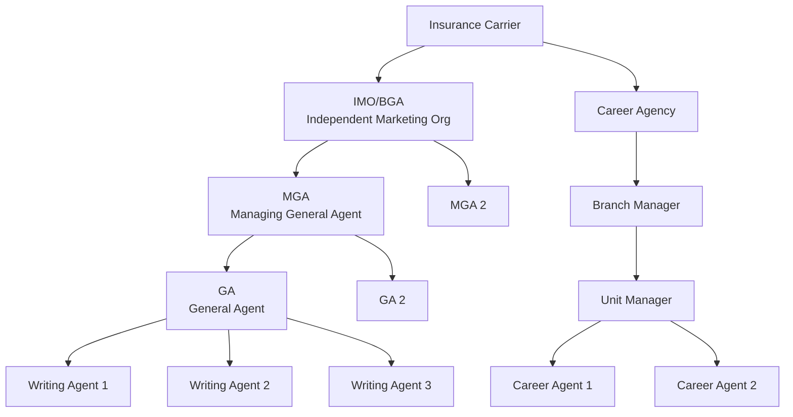

### 3.2 Writing Agent & Split Commissions

A policy can have multiple writing agents who share the commission based on defined splits.

**Split Commission Example:**

```
Policy Premium: $5,000
FYC Rate: 55%
Total FYC: $2,750.00

Split:
  Agent A (Primary):  60% → $2,750 × 60% = $1,650.00
  Agent B (Secondary): 40% → $2,750 × 40% = $1,100.00
```

**Split Rules:**
- All splits must total 100%
- Maximum of 5 writing agents per policy (configurable)
- Splits can differ between FYC and renewals
- Splits are defined at policy inception (can be changed with agent-of-record change)

### 3.3 Override Commission Flow

```
Policy Premium = $5,000
Agent FYC Rate = 55%
Agent FYC = $2,750.00

Override Flow:
  Unit Manager:  5% of FYC = $137.50
  Branch Manager: 3% of FYC = $82.50
  GA:            10% of commissionable premium = $500.00
  MGA:            3% of commissionable premium = $150.00
  IMO:            1% of commissionable premium = $50.00

Total Carrier Commission Cost = $2,750 + $137.50 + $82.50 + $500 + $150 + $50
                              = $3,670.00
Effective Total Commission Rate = $3,670 / $5,000 = 73.4%
```

### 3.4 Hierarchy Maintenance

**Key Operations:**

| Operation                | Description                                              |
|--------------------------|----------------------------------------------------------|
| Add Agent to Hierarchy   | Assign agent to a parent in the hierarchy                |
| Move Agent               | Transfer agent from one parent to another                |
| Promote Agent            | Elevate agent to a higher level (e.g., agent → manager)  |
| Terminate Agent          | Remove agent from hierarchy (with effective date)         |
| Agent of Record Change   | Transfer policy servicing from one agent to another       |
| Hierarchy Split          | Split an agency into two separate hierarchies             |
| Hierarchy Merge          | Combine two agencies into a single hierarchy              |

### 3.5 Hierarchy Effective Dating

All hierarchy relationships must be effective-dated to support:

- Retroactive changes (backdating agent moves)
- Future-dated changes (scheduled transfers)
- Point-in-time commission calculations
- Historical audit trails

```sql
CREATE TABLE producer_hierarchy (
    hierarchy_id         BIGINT PRIMARY KEY,
    producer_id          BIGINT NOT NULL,
    parent_producer_id   BIGINT,
    hierarchy_level      VARCHAR(20) NOT NULL,
    hierarchy_type       VARCHAR(30) NOT NULL,
    effective_date       DATE NOT NULL,
    expiration_date      DATE,
    status               VARCHAR(10) NOT NULL,
    commission_split_pct DECIMAL(5,2),
    override_rate        DECIMAL(7,5),
    created_by           VARCHAR(50),
    created_date         TIMESTAMP DEFAULT CURRENT_TIMESTAMP,
    CONSTRAINT fk_producer FOREIGN KEY (producer_id)
        REFERENCES producer(producer_id),
    CONSTRAINT fk_parent FOREIGN KEY (parent_producer_id)
        REFERENCES producer(producer_id)
);
```

### 3.6 Retroactive Hierarchy Changes

When a hierarchy change is backdated, the system must:

1. Identify all transactions in the affected date range
2. Reverse commissions paid under the old hierarchy
3. Recalculate commissions under the new hierarchy
4. Generate adjusting commission transactions
5. Update commission statements
6. Post adjusting journal entries

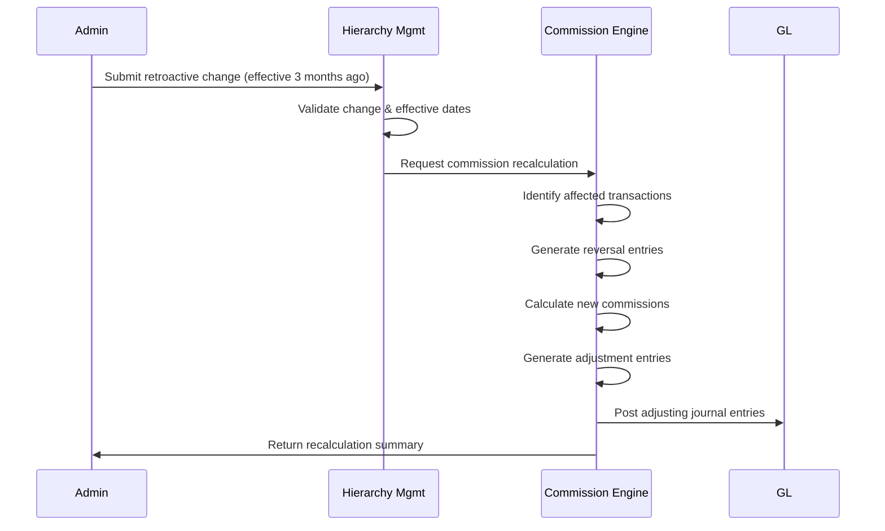

---

## 4. Commission Lifecycle

### 4.1 New Business Commission (First-Year)

The commission lifecycle begins when a policy is issued and premium is received.

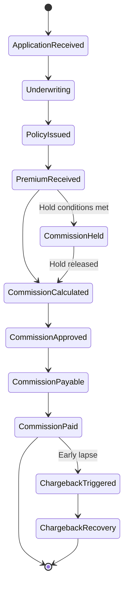

**Commission Trigger Events:**

| Event                  | Commission Action                    |
|------------------------|--------------------------------------|
| Policy issued + paid   | Calculate and pay FYC                |
| Premium received       | Calculate commission on premium       |
| Policy anniversary     | Calculate renewal commission          |
| Free-look cancellation | Full chargeback of FYC               |
| Lapse (year 1)         | Chargeback based on months in force  |
| Surrender (year 1)     | Chargeback based on months in force  |
| Death claim            | No chargeback (typically)            |
| Agent termination      | Redirect future commissions          |
| AOR change             | Redirect future commissions          |

### 4.2 Levelized vs Heaped Commissions

**Heaped Commission (Traditional):**

High first-year commission, lower renewals:

| Year | Rate  | Premium | Commission |
|------|-------|---------|------------|
| 1    | 55%   | $5,000  | $2,750     |
| 2    | 5%    | $5,000  | $250       |
| 3    | 5%    | $5,000  | $250       |
| 4    | 5%    | $5,000  | $250       |
| 5    | 5%    | $5,000  | $250       |
| **Total** | | | **$3,750** |

**Levelized Commission:**

More even distribution across years:

| Year | Rate  | Premium | Commission |
|------|-------|---------|------------|
| 1    | 25%   | $5,000  | $1,250     |
| 2    | 25%   | $5,000  | $1,250     |
| 3    | 15%   | $5,000  | $750       |
| 4    | 10%   | $5,000  | $500       |
| 5    | 5%    | $5,000  | $250       |
| **Total** | | | **$4,000** |

Levelized commissions reduce chargeback risk and align agent incentives with policy persistency.

### 4.3 Bonus Calculation Cycles

**Quarterly Production Bonus:**

```
Measurement Period: Q1 (Jan 1 – Mar 31)
Calculation Date: April 15
Payment Date: April 30

Steps:
1. Aggregate FYC by producer for Q1
2. Look up producer's target from their contract
3. Calculate achievement percentage
4. Apply bonus rate from bonus schedule
5. Generate bonus commission transaction
6. Include in next commission payment cycle
```

**Annual Persistency Bonus:**

```
Measurement Period: Jan 1 – Dec 31
Snapshot Date: January 31 (next year)
Calculation Date: February 15
Payment Date: February 28

Steps:
1. Identify all policies issued during measurement period
2. Check 13-month persistency for each policy
3. Calculate persistency rate (in-force / issued)
4. Apply persistency bonus rate based on tier
5. Calculate bonus as percentage of qualifying FYC
6. Generate bonus commission transaction
```

### 4.4 Trail / Asset-Based Commission Processing

```
Daily Processing:
1. Receive end-of-day account values for all variable/index policies
2. For each policy with active trail commission:
   a. Look up trail rate based on AUM band
   b. Calculate daily trail = Account Value × (Annual Rate / 365)
   c. Accrue daily trail amount
3. At month-end:
   a. Sum daily accruals to monthly trail amount
   b. Generate trail commission transaction per producer
   c. Include in monthly commission payment

Monthly Trail Calculation Example:
  Day 1:  AV = $250,000 → Trail = $250,000 × 0.25% / 365 = $1.71
  Day 2:  AV = $251,200 → Trail = $251,200 × 0.25% / 365 = $1.72
  ...
  Day 30: AV = $255,000 → Trail = $255,000 × 0.25% / 365 = $1.75
  Monthly Total ≈ $51.50
```

---

## 5. Chargeback Processing

### 5.1 Chargeback Triggers

| Trigger Event             | Chargeback Window | Chargeback Type    |
|---------------------------|-------------------|--------------------|
| Free-look cancellation    | 10–30 days        | Full chargeback    |
| Policy not taken          | Pre-delivery      | Full chargeback    |
| Lapse (non-payment)       | 0–12 months       | Pro-rata           |
| Surrender                 | 0–12 months       | Pro-rata           |
| 1035 Exchange (outgoing)  | 0–12 months       | Pro-rata           |
| Rescission                | Any time           | Full chargeback    |
| Decrease in face amount   | 0–12 months       | Pro-rata on decrease|
| Flat extra removal        | 0–12 months       | Pro-rata on charge |

### 5.2 Chargeback Calculation Methods

**Full Chargeback (Free-Look):**

```
Original FYC Paid: $2,750.00
Chargeback Amount:  $2,750.00 (100%)
```

**Pro-Rata Chargeback (Lapse at Month 7):**

```
Original FYC Paid: $2,750.00
Months In Force: 7
Chargeback Months: 12 - 7 = 5

Method 1: Simple Pro-Rata
  Chargeback = FYC × (Remaining Months / 12)
             = $2,750 × (5/12)
             = $1,145.83

Method 2: Earned Schedule
  Earned by Month 7: 70% (per vesting schedule)
  Chargeback = FYC × (1 - 70%)
             = $2,750 × 30%
             = $825.00
```

**Vesting Schedule Example:**

| Month | Cumulative Earned % |
|-------|---------------------|
| 1     | 8.33%               |
| 2     | 16.67%              |
| 3     | 25.00%              |
| 4     | 33.33%              |
| 5     | 41.67%              |
| 6     | 50.00%              |
| 7     | 58.33%              |
| 8     | 66.67%              |
| 9     | 75.00%              |
| 10    | 83.33%              |
| 11    | 91.67%              |
| 12    | 100.00%             |

### 5.3 Chargeback Recovery

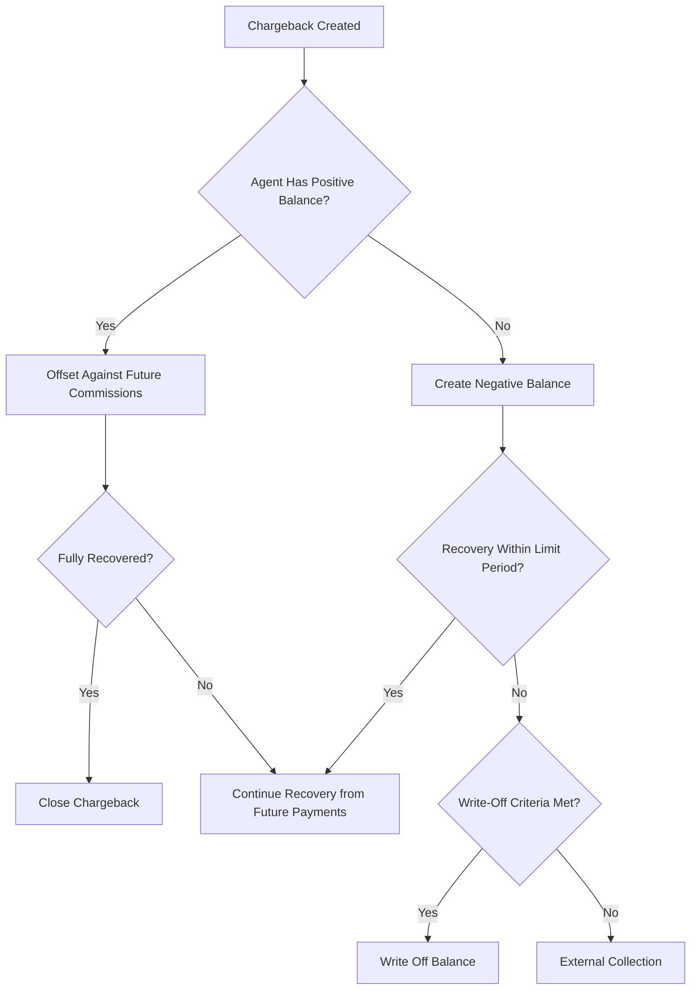

**Recovery Parameters:**

| Parameter                   | Description                              | Typical Value |
|-----------------------------|------------------------------------------|---------------|
| Max recovery % per payment  | Limit on deduction from each payment     | 50–100%       |
| Recovery aging threshold    | Days before escalation                   | 180 days      |
| Write-off threshold         | Amount below which balance is written off| $25.00        |
| Write-off aging             | Days after which balance is written off  | 365 days      |
| Collection referral trigger | Balance threshold for external collection| $500.00       |

### 5.4 Chargeback Cascade

When a chargeback occurs, it must cascade through the entire hierarchy:

```
Original Commission Flow:
  Writing Agent: $2,750.00 (FYC)
  Unit Manager:    $137.50 (Override)
  GA:              $500.00 (Override)
  MGA:             $150.00 (Override)
  IMO:              $50.00 (Override)

Policy Lapses at Month 6 (50% chargeback):
  Writing Agent Chargeback: -$1,375.00
  Unit Manager Chargeback:    -$68.75
  GA Chargeback:             -$250.00
  MGA Chargeback:             -$75.00
  IMO Chargeback:             -$25.00
  
  Total Chargeback: -$1,793.75
```

### 5.5 Negative Balance Management

```sql
CREATE TABLE producer_balance (
    balance_id       BIGINT PRIMARY KEY,
    producer_id      BIGINT NOT NULL,
    company_code     VARCHAR(10) NOT NULL,
    balance_type     VARCHAR(20) NOT NULL,
    current_balance  DECIMAL(15,2) NOT NULL DEFAULT 0,
    aging_bucket_30  DECIMAL(15,2) DEFAULT 0,
    aging_bucket_60  DECIMAL(15,2) DEFAULT 0,
    aging_bucket_90  DECIMAL(15,2) DEFAULT 0,
    aging_bucket_180 DECIMAL(15,2) DEFAULT 0,
    aging_bucket_365 DECIMAL(15,2) DEFAULT 0,
    last_activity_date DATE,
    write_off_date   DATE,
    status           VARCHAR(10) NOT NULL,
    CONSTRAINT fk_balance_producer FOREIGN KEY (producer_id)
        REFERENCES producer(producer_id)
);
```

---

## 6. Advance Commissions

### 6.1 Advance vs As-Earned

**As-Earned Model:**
Commission is paid as premium is received. If premium is paid monthly, the agent receives 1/12 of the annual commission each month.

**Advance Model:**
The full first-year commission is advanced at policy issue, regardless of when premiums are actually received.

```
Policy: WL-100, Annual Premium $5,000, FYC Rate 55%
Total FYC: $2,750.00

As-Earned (Monthly Mode):
  Month 1: $5,000/12 × 55% = $229.17
  Month 2: $229.17
  ... (12 months)
  Total Year 1: $2,750.00

Advanced:
  At Issue: $2,750.00 (full advance)
  Earned-out period: 12 months
```

### 6.2 Advance Financing

Some carriers or distribution organizations provide advance financing where the carrier advances future commission earnings:

```
Advance Amount:     $2,750.00
Advance Date:       January 15, 2025
Financing Rate:     5% per annum
Monthly Interest:   $2,750 × 5% / 12 = $11.46

If policy lapses before earned-out:
  Amount Advanced:    $2,750.00
  Amount Earned:      $1,375.00 (6 months)
  Unearned Balance:   $1,375.00
  Accrued Interest:   $68.75
  Total Recovery Due: $1,443.75
```

### 6.3 Earned-Out Tracking

```sql
CREATE TABLE advance_tracking (
    advance_id        BIGINT PRIMARY KEY,
    policy_number     VARCHAR(20) NOT NULL,
    producer_id       BIGINT NOT NULL,
    advance_amount    DECIMAL(15,2) NOT NULL,
    advance_date      DATE NOT NULL,
    earned_amount     DECIMAL(15,2) DEFAULT 0,
    unearned_balance  DECIMAL(15,2) NOT NULL,
    interest_accrued  DECIMAL(15,2) DEFAULT 0,
    earned_out_date   DATE,
    status            VARCHAR(15) NOT NULL,
    financing_rate    DECIMAL(7,5),
    write_off_amount  DECIMAL(15,2) DEFAULT 0,
    write_off_date    DATE,
    CONSTRAINT fk_advance_policy FOREIGN KEY (policy_number)
        REFERENCES policy(policy_number),
    CONSTRAINT fk_advance_producer FOREIGN KEY (producer_id)
        REFERENCES producer(producer_id)
);
```

### 6.4 Advance Qualification Rules

| Criteria                    | Requirement              |
|-----------------------------|--------------------------|
| Producer contract status    | Active, in good standing |
| Producer tenure             | Minimum 6 months         |
| Negative balance            | No outstanding balances  |
| Product eligibility         | Not all products qualify |
| Persistency requirement     | 85%+ 13-month persistency|
| Advance limit               | $50,000 per producer     |

---

## 7. Commission Accounting

### 7.1 Accrual vs Cash Basis

**Cash Basis:**
Commission expense is recognized when the payment is made to the producer.

```
Journal Entry (Cash Basis - Commission Payment):
  DR  Commission Expense           $2,750.00
    CR  Cash / Bank Account                    $2,750.00
```

**Accrual Basis:**
Commission expense is accrued when the obligation is incurred (policy issued / premium received), regardless of payment date.

```
Journal Entry (Accrual - Commission Accrued):
  DR  Commission Expense           $2,750.00
    CR  Commission Payable                     $2,750.00

Journal Entry (Accrual - Commission Paid):
  DR  Commission Payable           $2,750.00
    CR  Cash / Bank Account                    $2,750.00
```

### 7.2 Deferred Acquisition Cost (DAC)

Under GAAP, first-year commissions are not fully expensed in the first year. Instead, they are capitalized as a Deferred Acquisition Cost (DAC) asset and amortized over the expected life of the policies.

**DAC Capitalization:**

```
Journal Entry (DAC Setup):
  DR  Deferred Acquisition Cost (Asset)  $2,750.00
    CR  Commission Expense                         $2,750.00

(Net effect: Commission Expense = $0 at inception)
```

**DAC Amortization (FAS 60 - Traditional Products):**

```
Amortization Method: In proportion to premiums received over the premium-paying period
Expected Premium-Paying Period: 20 years

Year 1 Premium / PV of Future Premiums = Amortization Factor
If amortization factor = 7.5%:
  Year 1 DAC Amortization = $2,750 × 7.5% = $206.25

Journal Entry:
  DR  DAC Amortization Expense       $206.25
    CR  Deferred Acquisition Cost              $206.25
```

**DAC Amortization (FAS 97 - Universal Life Type):**

```
Amortization Method: In proportion to estimated gross profits (EGPs)
EGP in Year 1 / PV of Future EGPs = Amortization Factor

Journal Entry (same structure):
  DR  DAC Amortization Expense       $xxx.xx
    CR  Deferred Acquisition Cost              $xxx.xx
```

### 7.3 LDTI Impact on Commission Accounting

Under ASU 2018-12 (Long-Duration Targeted Improvements / LDTI):

- DAC is amortized on a **constant-level basis** over the expected term of the contracts
- No interest accrual on DAC
- No loss recognition testing for DAC
- DAC is grouped at the cohort level (issue-year grouping)

**LDTI DAC Amortization:**

```
Total DAC for 2025 Cohort: $10,000,000
Expected Contract Duration: 20 years
Annual Amortization = $10,000,000 / 20 = $500,000 per year

Adjusted for decrements:
  Beginning Balance:    $10,000,000
  Contracts In Force:   5,000
  Expected Remaining:   4,850 (after lapses/claims)
  
  Amortization = $10,000,000 × (150 / 5,000) = $300,000
  (for terminated contracts)
  
  Remaining Balance: $9,700,000
  Annual Amortization: $9,700,000 / 19 remaining years = $510,526
```

### 7.4 IFRS 17 Impact

Under IFRS 17, acquisition costs are:
- Included in the fulfillment cash flows
- Allocated to groups of insurance contracts (cohorts)
- Recognized as part of the Contractual Service Margin (CSM)
- Released to profit or loss as the CSM is released (coverage units)

### 7.5 Complete Commission Accounting Journal Entries

**Scenario: New Whole Life Policy**

```
Event 1: Policy Issued, Annual Premium $5,000 Received
  FYC = $5,000 × 55% = $2,750

  Statutory Accounting (SAP):
    DR  Commission Expense (FYC)         $2,750.00
      CR  Commission Payable                       $2,750.00

  GAAP Accounting:
    DR  Deferred Acquisition Cost        $2,750.00
      CR  Commission Payable                       $2,750.00

Event 2: Commission Paid to Agent
  SAP:
    DR  Commission Payable               $2,750.00
      CR  Cash                                     $2,750.00

  GAAP:
    DR  Commission Payable               $2,750.00
      CR  Cash                                     $2,750.00

Event 3: Override Commission Calculated
  GA Override = $5,000 × 10% = $500

  SAP:
    DR  Commission Expense (Override)      $500.00
      CR  Commission Payable                         $500.00

Event 4: Month-End DAC Amortization (GAAP)
    DR  DAC Amortization Expense           $20.63
      CR  Deferred Acquisition Cost                  $20.63

Event 5: Year-End Renewal Commission (Year 2)
  Renewal = $5,000 × 5% = $250

  SAP:
    DR  Commission Expense (Renewal)       $250.00
      CR  Commission Payable                         $250.00

  GAAP:
    DR  Commission Expense (Renewal)       $250.00
      CR  Commission Payable                         $250.00

Event 6: Chargeback (Policy lapsed at month 8)
  Chargeback = $2,750 × (4/12) = $916.67

  SAP:
    DR  Commission Payable (or Receivable) $916.67
      CR  Commission Expense                         $916.67

  GAAP:
    DR  Commission Payable (or Receivable) $916.67
      CR  Deferred Acquisition Cost                  $916.67
```

---

## 8. Tax Reporting

### 8.1 1099-MISC / 1099-NEC Generation

Since the 2020 tax year, non-employee compensation (commissions) is reported on Form 1099-NEC rather than 1099-MISC.

**Reporting Thresholds:**

| Form      | Box  | Description                    | Threshold |
|-----------|------|--------------------------------|-----------|
| 1099-NEC  | 1    | Non-employee compensation      | $600      |
| 1099-MISC | 3    | Other income                   | $600      |
| 1099-MISC | 10   | Gross proceeds to attorney     | $600      |

### 8.2 Annual 1099 Processing Workflow

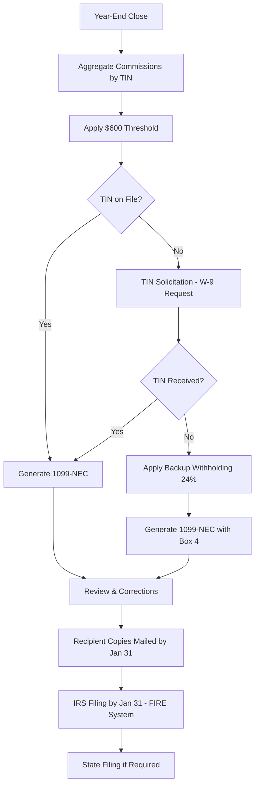

### 8.3 TIN Solicitation (W-9)

```
W-9 Solicitation Timeline:
  1. Initial Request: At producer onboarding
  2. First B-Notice: IRS notification of TIN mismatch (within 15 business days)
  3. Second B-Notice: Requires certified TIN (W-9 with notarization)
  4. Backup Withholding: Begins if no valid TIN after second notice

Backup Withholding Rate: 24% (as of current tax law)

Example:
  Commission Payment: $5,000
  Backup Withholding (no valid TIN): $5,000 × 24% = $1,200.00
  Net Payment to Producer: $3,800.00
```

### 8.4 1099-NEC Data Structure

```json
{
  "form_type": "1099-NEC",
  "tax_year": 2025,
  "payer": {
    "tin": "XX-XXXXXXX",
    "name": "ABC Life Insurance Company",
    "address": "123 Insurance Blvd, Hartford, CT 06101"
  },
  "recipient": {
    "tin": "XXX-XX-XXXX",
    "tin_type": "SSN",
    "name": "John A. Smith",
    "address": "456 Agent Lane, Chicago, IL 60601"
  },
  "amounts": {
    "box1_nonemployee_compensation": 85432.50,
    "box4_federal_income_tax_withheld": 0.00
  },
  "state_reporting": [
    {
      "state_code": "IL",
      "state_id": "XXXX-XXXX",
      "state_income": 85432.50,
      "state_tax_withheld": 0.00
    }
  ],
  "corrections": {
    "is_corrected": false,
    "original_form_id": null
  }
}
```

### 8.5 FIRE System Electronic Filing

The Filing Information Returns Electronically (FIRE) system is the IRS electronic filing system for information returns.

**File Format (Fixed-Length Records):**

| Record Type | Description                | Length |
|-------------|----------------------------|--------|
| T Record    | Transmitter                | 750    |
| A Record    | Payer                      | 750    |
| B Record    | Payee (one per recipient)  | 750    |
| C Record    | End of Payer               | 750    |
| F Record    | End of Transmission        | 750    |

### 8.6 Corrected 1099 Processing

| Correction Type | Scenario                                | Action                     |
|----------------|------------------------------------------|----------------------------|
| Type 1         | Wrong amount, wrong code                 | File corrected return       |
| Type 2         | Wrong TIN, wrong name                   | File two returns (zero + correct) |
| Void           | Return should not have been filed        | File void return            |

---

## 9. Regulatory Framework

### 9.1 State Commission Disclosure Rules

Many states require disclosure of agent compensation to the applicant, especially for annuity and life products sold to seniors.

**Key Regulations:**

| Regulation                        | Scope                    | Requirement                                |
|-----------------------------------|--------------------------|--------------------------------------------|
| NAIC Suitability Model (#275)     | Annuity sales            | Reasonable basis for recommendation         |
| NAIC Best Interest (#275 updated) | Annuity sales            | Act in consumer's best interest             |
| NY Reg 187                        | Life & Annuity (NY)      | Best interest standard                      |
| DOL Fiduciary Rule                | Qualified plan assets    | Fiduciary duty (various iterations)         |
| SEC Reg BI                        | Securities (VA, VUL)     | Best interest obligation                    |

### 9.2 Anti-Rebating

Most states prohibit rebating — returning a portion of the agent's commission to the policyholder.

**Exceptions:**

- California (permits rebating for commercial insurance)
- Florida (permits rebating under certain conditions)
- Alaska (no anti-rebating law)

### 9.3 Inducement Regulations

| Regulation Area         | Description                                              |
|------------------------|----------------------------------------------------------|
| Gifts                  | Limited to $100 per client per year (FINRA Rule 3220)    |
| Non-cash compensation  | Must be based on total production, not specific products  |
| Training incentives    | Must be educational, not tied to specific sales           |
| Contests/trips         | Must be disclosed and based on total production          |

### 9.4 Compensation Transparency

Under emerging best-interest regulations, carriers must:

- Document the compensation structure for each product
- Disclose compensation conflicts of interest
- Provide compensation comparisons across similar products
- Maintain records of compensation influence on recommendations

---

## 10. Producer Licensing & Appointment

### 10.1 License Verification (NIPR)

The National Insurance Producer Registry (NIPR) provides real-time license verification:

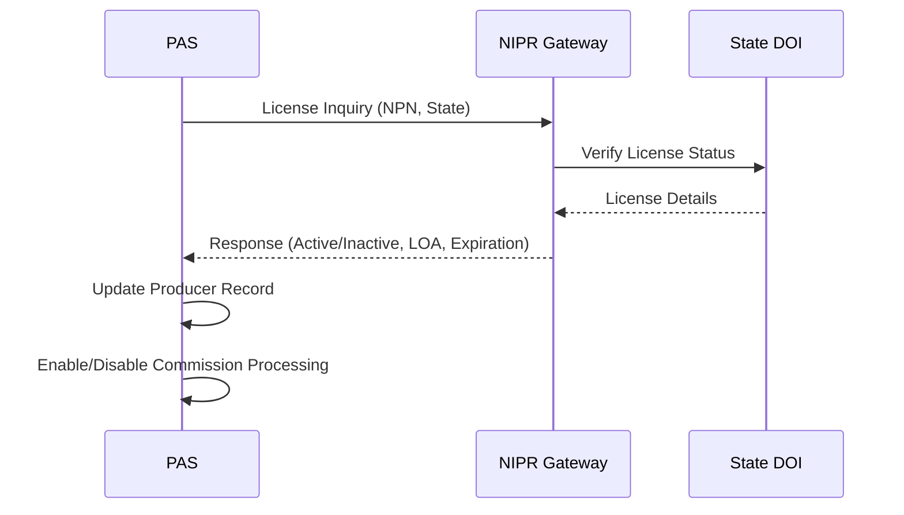

**NIPR License Response Data:**

```json
{
  "npn": "12345678",
  "producer_name": "John A. Smith",
  "licenses": [
    {
      "state": "IL",
      "license_number": "IL-2024-12345",
      "status": "ACTIVE",
      "license_type": "PRODUCER",
      "lines_of_authority": [
        {
          "loa": "LIFE",
          "status": "ACTIVE",
          "effective_date": "2020-01-15",
          "expiration_date": "2026-01-15"
        },
        {
          "loa": "VARIABLE",
          "status": "ACTIVE",
          "effective_date": "2020-01-15",
          "expiration_date": "2026-01-15"
        }
      ],
      "continuing_education": {
        "ce_due_date": "2026-01-15",
        "ce_credits_required": 24,
        "ce_credits_completed": 18
      }
    }
  ]
}
```

### 10.2 Appointment Processing

Before a producer can sell a carrier's products in a state, they must be appointed by the carrier in that state.

**Appointment Workflow:**

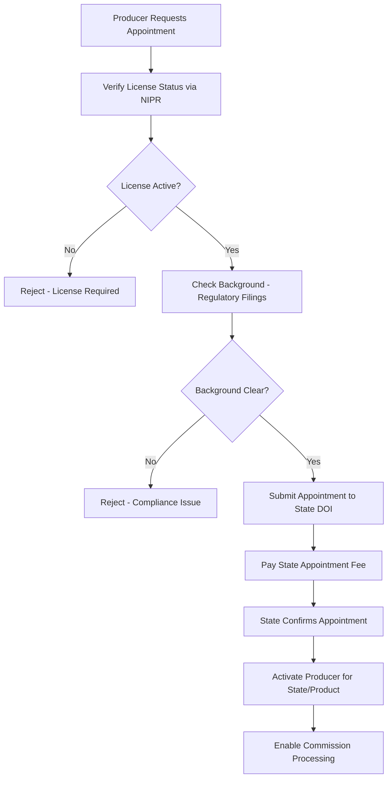

**State Appointment Fees:**

| State | Initial Fee | Renewal Fee | Renewal Period |
|-------|-------------|-------------|----------------|
| IL    | $20         | $20         | Biennial       |
| NY    | $40         | $40         | Biennial       |
| CA    | $25         | $25         | Biennial       |
| TX    | $50         | $50         | Biennial       |
| FL    | $60         | $60         | Biennial       |

### 10.3 Appointment Status Tracking

```sql
CREATE TABLE producer_appointment (
    appointment_id       BIGINT PRIMARY KEY,
    producer_id          BIGINT NOT NULL,
    company_code         VARCHAR(10) NOT NULL,
    state_code           CHAR(2) NOT NULL,
    appointment_type     VARCHAR(20) NOT NULL,
    appointment_status   VARCHAR(15) NOT NULL,
    effective_date       DATE NOT NULL,
    termination_date     DATE,
    termination_reason   VARCHAR(50),
    state_fee_amount     DECIMAL(8,2),
    state_fee_paid_date  DATE,
    lines_of_authority   VARCHAR(100),
    nipr_confirmation    VARCHAR(30),
    last_verified_date   DATE,
    CONSTRAINT fk_appt_producer FOREIGN KEY (producer_id)
        REFERENCES producer(producer_id)
);
```

### 10.4 Compliance Monitoring

```
Compliance Rules Engine:
  Rule 1: No commission on policy sold in state where producer not appointed
  Rule 2: No commission on product type not covered by producer's LOA
  Rule 3: Hold commission if producer's license is expired
  Rule 4: Hold commission if CE requirements not met (where applicable)
  Rule 5: Verify anti-money laundering (AML) training is current
  Rule 6: Verify E&O insurance is in force (if required by contract)
  Rule 7: Verify FINRA registration for variable product sales
```

---

## 11. Commission Statements

### 11.1 Producer Commission Statement

Commission statements are the primary communication to producers about their compensation.

**Statement Components:**

| Section                | Content                                                    |
|------------------------|------------------------------------------------------------|
| Header                 | Producer name, NPN, statement period, payment date          |
| New Business           | New policies, premiums, FYC by policy                       |
| Renewals               | Renewal commissions by policy                               |
| Trail Commissions      | Asset-based commissions by policy/fund                     |
| Bonuses                | Persistency, production, and other bonuses                  |
| Overrides              | Override commissions from downline production               |
| Chargebacks            | Commission reversals with policy detail                     |
| Adjustments            | Manual adjustments, corrections                             |
| Summary                | Gross commission, deductions, net payment                   |
| Year-to-Date           | YTD totals by commission type                               |
| Tax Withholding        | Backup withholding, state tax (if applicable)               |

**Statement Summary Example:**

```
═══════════════════════════════════════════════════════════════════
  COMMISSION STATEMENT
  Producer: John A. Smith (NPN: 12345678)
  Statement Period: March 1-31, 2025
  Payment Date: April 15, 2025
═══════════════════════════════════════════════════════════════════

  SUMMARY
  ─────────────────────────────────────────────────────────────
  First-Year Commissions (FYC)          $12,450.00
  Renewal Commissions                    $3,275.50
  Trail Commissions                        $892.30
  Override Commissions                   $2,150.00
  Persistency Bonus                      $1,500.00
  ─────────────────────────────────────────────────────────────
  Gross Commissions                     $20,267.80
  
  DEDUCTIONS
  ─────────────────────────────────────────────────────────────
  Chargeback Recovery                   ($1,375.00)
  Advance Recovery                        ($500.00)
  E&O Insurance Premium                   ($125.00)
  ─────────────────────────────────────────────────────────────
  Total Deductions                      ($2,000.00)

  ═════════════════════════════════════════════════════════════
  NET PAYMENT                           $18,267.80
  ═════════════════════════════════════════════════════════════

  YEAR-TO-DATE
  ─────────────────────────────────────────────────────────────
  YTD Gross Commissions                 $58,432.50
  YTD Deductions                        ($5,125.00)
  YTD Net Payments                      $53,307.50
═══════════════════════════════════════════════════════════════════
```

### 11.2 Detail Views

**FYC Detail:**

```
FIRST-YEAR COMMISSIONS
Policy Number  Insured Name     Product  Premium    Rate    Commission
─────────────────────────────────────────────────────────────────────
POL-2025-001   Williams, Mary   WL-100   $5,000.00  55.00%  $2,750.00
POL-2025-002   Johnson, Robert  T-20     $1,800.00  90.00%  $1,620.00
POL-2025-003   Davis, Sarah     UL-200   $8,000.00  55.00%  $4,400.00 *
POL-2025-003   Davis, Sarah     UL-200   $12,000.00  2.00%    $240.00 **
POL-2025-004   Chen, Michael    WL-100   $3,200.00  55.00%  $1,760.00
POL-2025-005   Brown, Lisa      VUL-300  $6,000.00  28.00%  $1,680.00
─────────────────────────────────────────────────────────────────────
                                                    Total: $12,450.00
* Target premium portion  ** Excess premium portion
```

### 11.3 Business In-Force Reports

```
BOOK OF BUSINESS SUMMARY
As of March 31, 2025

Product Type    Policies  Total Face Amount  Total Premium    Annual Trail
──────────────────────────────────────────────────────────────────────────
Whole Life         145    $28,500,000        $725,000         $0
Term Life          312    $156,000,000       $468,000         $0
Universal Life      87    $43,500,000        $696,000         $0
Variable UL         63    $31,500,000        $504,000         $12,600
Variable Annuity    28    N/A (AUM: $7.2M)   $0               $18,000
──────────────────────────────────────────────────────────────────────────
Total              635    $259,500,000+      $2,393,000       $30,600

13-Month Persistency: 93.2%
25-Month Persistency: 88.7%
```

### 11.4 Persistency Reports

```
PERSISTENCY REPORT
Measurement Period: Policies Issued Jan–Dec 2024
As of: February 28, 2025 (13-Month Snapshot)

Product      Issued  In-Force  Lapsed  Surrendered  Not-Taken  Persistency
───────────────────────────────────────────────────────────────────────────
Whole Life     25      24        0         0           1          96.0%
Term Life      55      50        3         0           2          90.9%
Universal Life 18      16        1         1           0          88.9%
Variable UL    12      11        0         1           0          91.7%
───────────────────────────────────────────────────────────────────────────
Overall       110     101        4         2           3          91.8%
```

---

## 12. Entity-Relationship Diagram

### 12.1 Complete Commission ERD

```mermaid
erDiagram
    PRODUCER {
        bigint producer_id PK
        varchar npn
        varchar first_name
        varchar last_name
        varchar tin
        varchar tin_type
        varchar entity_type
        varchar status
        date effective_date
        date termination_date
        varchar email
        varchar phone
    }
    
    PRODUCER_CONTRACT {
        bigint contract_id PK
        bigint producer_id FK
        varchar company_code
        varchar contract_type
        varchar contract_level
        varchar commission_schedule_id
        date effective_date
        date expiration_date
        varchar advance_eligible
        decimal advance_limit
        varchar status
    }
    
    PRODUCER_HIERARCHY {
        bigint hierarchy_id PK
        bigint producer_id FK
        bigint parent_producer_id FK
        varchar hierarchy_level
        varchar hierarchy_type
        date effective_date
        date expiration_date
        varchar status
    }
    
    PRODUCER_APPOINTMENT {
        bigint appointment_id PK
        bigint producer_id FK
        varchar company_code
        char state_code
        varchar appointment_type
        varchar appointment_status
        date effective_date
        date termination_date
        varchar lines_of_authority
    }
    
    PRODUCER_LICENSE {
        bigint license_id PK
        bigint producer_id FK
        char state_code
        varchar license_number
        varchar license_type
        varchar status
        date effective_date
        date expiration_date
    }
    
    COMMISSION_SCHEDULE {
        bigint schedule_id PK
        varchar schedule_name
        varchar product_code
        varchar distribution_channel
        date effective_date
        date expiration_date
        varchar status
    }
    
    COMMISSION_RATE_TABLE {
        bigint rate_table_id PK
        bigint schedule_id FK
        varchar product_code
        varchar plan_code
        varchar rider_code
        int policy_year_from
        int policy_year_to
        decimal premium_band_low
        decimal premium_band_high
        decimal commission_rate
        varchar commission_type
        varchar rate_basis
    }
    
    OVERRIDE_RATE_TABLE {
        bigint override_rate_id PK
        bigint schedule_id FK
        varchar hierarchy_level
        varchar override_basis
        decimal override_rate
        date effective_date
        date expiration_date
    }
    
    POLICY_COMMISSION_ASSIGNMENT {
        bigint assignment_id PK
        varchar policy_number FK
        bigint producer_id FK
        varchar role
        decimal split_percentage
        date effective_date
        date expiration_date
    }
    
    COMMISSION_TRANSACTION {
        bigint transaction_id PK
        varchar policy_number FK
        bigint producer_id FK
        varchar transaction_type
        varchar commission_type
        decimal commission_amount
        decimal commissionable_premium
        decimal commission_rate
        int policy_year
        date transaction_date
        date earned_date
        varchar status
        bigint related_transaction_id
    }
    
    COMMISSION_PAYMENT {
        bigint payment_id PK
        bigint producer_id FK
        date payment_date
        varchar payment_method
        decimal gross_amount
        decimal deductions
        decimal net_amount
        varchar payment_status
        varchar check_number
        varchar eft_trace
    }
    
    COMMISSION_PAYMENT_DETAIL {
        bigint detail_id PK
        bigint payment_id FK
        bigint transaction_id FK
        decimal amount
    }
    
    CHARGEBACK {
        bigint chargeback_id PK
        varchar policy_number FK
        bigint producer_id FK
        bigint original_transaction_id FK
        varchar trigger_event
        decimal chargeback_amount
        decimal recovered_amount
        decimal outstanding_balance
        date chargeback_date
        varchar status
    }
    
    ADVANCE_TRACKING {
        bigint advance_id PK
        varchar policy_number FK
        bigint producer_id FK
        decimal advance_amount
        decimal earned_amount
        decimal unearned_balance
        date advance_date
        date earned_out_date
        varchar status
    }
    
    PRODUCER_BALANCE {
        bigint balance_id PK
        bigint producer_id FK
        varchar balance_type
        decimal current_balance
        date last_activity_date
        varchar status
    }
    
    BONUS_PROGRAM {
        bigint program_id PK
        varchar program_name
        varchar bonus_type
        varchar measurement_period
        date period_start
        date period_end
        varchar calculation_method
        varchar status
    }
    
    BONUS_TIER {
        bigint tier_id PK
        bigint program_id FK
        decimal threshold_low
        decimal threshold_high
        varchar threshold_metric
        decimal bonus_rate
        varchar bonus_basis
    }
    
    BONUS_QUALIFICATION {
        bigint qualification_id PK
        bigint program_id FK
        bigint producer_id FK
        decimal measured_value
        decimal achievement_pct
        bigint tier_id FK
        decimal bonus_amount
        varchar status
    }
    
    TAX_REPORTING {
        bigint tax_report_id PK
        bigint producer_id FK
        int tax_year
        varchar form_type
        decimal reportable_amount
        decimal withheld_amount
        varchar filing_status
        date filed_date
        varchar correction_type
    }
    
    COMMISSION_HOLD {
        bigint hold_id PK
        bigint producer_id FK
        varchar policy_number
        varchar hold_reason
        date hold_date
        date release_date
        varchar status
        varchar released_by
    }
    
    COMMISSION_ADJUSTMENT {
        bigint adjustment_id PK
        bigint producer_id FK
        varchar policy_number
        varchar adjustment_reason
        decimal adjustment_amount
        date adjustment_date
        varchar approved_by
        varchar status
    }
    
    COMMISSION_GL_POSTING {
        bigint posting_id PK
        bigint transaction_id FK
        varchar account_number
        varchar debit_credit
        decimal amount
        date posting_date
        varchar accounting_basis
        varchar gl_batch_id
    }
    
    COMMISSION_STATEMENT {
        bigint statement_id PK
        bigint producer_id FK
        date statement_date
        date period_start
        date period_end
        decimal gross_commission
        decimal deductions
        decimal net_payment
        varchar delivery_method
        date delivered_date
    }
    
    PRODUCER_W9 {
        bigint w9_id PK
        bigint producer_id FK
        varchar tin
        varchar tin_type
        varchar certification_status
        date received_date
        date b_notice_1_date
        date b_notice_2_date
        varchar backup_withholding
    }
    
    PRODUCER ||--o{ PRODUCER_CONTRACT : has
    PRODUCER ||--o{ PRODUCER_HIERARCHY : participates_in
    PRODUCER ||--o{ PRODUCER_APPOINTMENT : holds
    PRODUCER ||--o{ PRODUCER_LICENSE : holds
    PRODUCER ||--o{ POLICY_COMMISSION_ASSIGNMENT : assigned_to
    PRODUCER ||--o{ COMMISSION_TRANSACTION : earns
    PRODUCER ||--o{ COMMISSION_PAYMENT : receives
    PRODUCER ||--o{ CHARGEBACK : owes
    PRODUCER ||--o{ ADVANCE_TRACKING : has
    PRODUCER ||--o{ PRODUCER_BALANCE : has
    PRODUCER ||--o{ BONUS_QUALIFICATION : qualifies_for
    PRODUCER ||--o{ TAX_REPORTING : reported_on
    PRODUCER ||--o{ COMMISSION_HOLD : has
    PRODUCER ||--o{ COMMISSION_ADJUSTMENT : has
    PRODUCER ||--o{ COMMISSION_STATEMENT : receives
    PRODUCER ||--o{ PRODUCER_W9 : submits
    COMMISSION_SCHEDULE ||--o{ COMMISSION_RATE_TABLE : contains
    COMMISSION_SCHEDULE ||--o{ OVERRIDE_RATE_TABLE : contains
    PRODUCER_CONTRACT ||--|| COMMISSION_SCHEDULE : uses
    COMMISSION_TRANSACTION ||--o{ COMMISSION_PAYMENT_DETAIL : included_in
    COMMISSION_PAYMENT ||--o{ COMMISSION_PAYMENT_DETAIL : contains
    COMMISSION_TRANSACTION ||--o{ COMMISSION_GL_POSTING : generates
    BONUS_PROGRAM ||--o{ BONUS_TIER : has
    BONUS_PROGRAM ||--o{ BONUS_QUALIFICATION : evaluates
```

### 12.2 Entity Count Summary

| Entity                        | Purpose                                    |
|-------------------------------|--------------------------------------------|
| PRODUCER                      | Core producer/agent record                 |
| PRODUCER_CONTRACT             | Producer's contract with carrier           |
| PRODUCER_HIERARCHY            | Distribution hierarchy relationships        |
| PRODUCER_APPOINTMENT          | State appointment records                  |
| PRODUCER_LICENSE              | State license records                      |
| COMMISSION_SCHEDULE           | Commission schedule definitions            |
| COMMISSION_RATE_TABLE         | Rate details by year/band                  |
| OVERRIDE_RATE_TABLE           | Override rates by hierarchy level           |
| POLICY_COMMISSION_ASSIGNMENT  | Agent-policy assignments & splits          |
| COMMISSION_TRANSACTION        | Individual commission calculations          |
| COMMISSION_PAYMENT            | Payment header (per producer per cycle)    |
| COMMISSION_PAYMENT_DETAIL     | Payment line items                         |
| CHARGEBACK                    | Chargeback records                         |
| ADVANCE_TRACKING              | Advance commission tracking                |
| PRODUCER_BALANCE              | Running balance per producer               |
| BONUS_PROGRAM                 | Bonus program definitions                  |
| BONUS_TIER                    | Bonus qualification tiers                  |
| BONUS_QUALIFICATION           | Producer bonus qualification results       |
| TAX_REPORTING                 | 1099 filing records                        |
| COMMISSION_HOLD               | Commission hold records                    |
| COMMISSION_ADJUSTMENT         | Manual commission adjustments              |
| COMMISSION_GL_POSTING         | GL posting details                         |
| COMMISSION_STATEMENT          | Statement header records                   |
| PRODUCER_W9                   | W-9 / TIN certification                   |

**Total Entities: 24**

---

## 13. Sample Commission Calculations

### 13.1 Whole Life Policy — Complete Calculation

```
Product: WL-100 (Whole Life)
Face Amount: $500,000
Annual Premium: $8,500
Policy Fee: $60
Commissionable Premium: $8,440 ($8,500 - $60)
Rider: Waiver of Premium — $120/year

Writing Agent: Agent A (60% split)
Writing Agent: Agent B (40% split)
GA Override: 10% of commissionable premium
MGA Override: 3% of commissionable premium

FIRST-YEAR COMMISSION CALCULATION:

  Base FYC:
    Agent A: $8,440 × 55% × 60% = $2,785.20
    Agent B: $8,440 × 55% × 40% = $1,856.80
    Total Base FYC: $4,642.00

  Rider FYC (Waiver of Premium):
    Agent A: $120 × 20% × 60% = $14.40
    Agent B: $120 × 20% × 40% = $9.60
    Total Rider FYC: $24.00

  Total FYC:
    Agent A: $2,785.20 + $14.40 = $2,799.60
    Agent B: $1,856.80 + $9.60  = $1,866.40
    Total: $4,666.00

  Override Commissions:
    GA Override:  ($8,440 + $120) × 10% = $856.00
    MGA Override: ($8,440 + $120) × 3%  = $256.80
    Total Overrides: $1,112.80

  TOTAL YEAR 1 COMMISSION COST: $4,666.00 + $1,112.80 = $5,778.80
  Effective Commission Rate: $5,778.80 / $8,560 = 67.5%

RENEWAL COMMISSION (Year 2):
  Agent A: $8,440 × 5% × 60% = $253.20
  Agent B: $8,440 × 5% × 40% = $168.80
  Rider Renewal:
    Agent A: $120 × 5% × 60% = $3.60
    Agent B: $120 × 5% × 40% = $2.40
  GA Override: $8,560 × 3%   = $256.80
  MGA Override: $8,560 × 1%  = $85.60
  Total Year 2: $770.40
```

### 13.2 Universal Life — Target/Excess Split

```
Product: UL-200 (Universal Life)
Face Amount: $1,000,000
Target Premium: $12,000
Actual Premium Paid: $30,000
Excess Premium: $18,000

Writing Agent: Agent C (100% split)
GA Override: 8% on target, 1% on excess

FYC CALCULATION:

  Target Portion:
    FYC = $12,000 × 55% = $6,600.00

  Excess Portion:
    FYC = $18,000 × 2% = $360.00

  Total FYC: $6,960.00

  GA Override:
    On Target: $12,000 × 8% = $960.00
    On Excess: $18,000 × 1% = $180.00
    Total Override: $1,140.00

  TOTAL YEAR 1: $8,100.00
  Effective Rate on Total Premium: 27.0%
  Effective Rate on Target Premium: 55.0% + 8.0% = 63.0%
```

### 13.3 Variable Annuity — Trail Commission

```
Product: VA-500 (Variable Annuity)
Initial Premium: $250,000
Front-End Load: 0% (B-share)
Annual Trail: 0.25%

Trail Commission Calculation:

Year 1: Average Account Value = $255,000
  Annual Trail = $255,000 × 0.25% = $637.50
  Monthly Trail = $637.50 / 12 = $53.13

Year 2: Average Account Value = $275,000
  Annual Trail = $275,000 × 0.25% = $687.50

Year 3: Average Account Value = $290,000
  Annual Trail = $290,000 × 0.25% = $725.00

Cumulative 3-Year Trail: $2,050.00

If B-share with CDSC:
  Year 1: 7% CDSC, Commission = $250,000 × 5% = $12,500 (upfront)
  Year 2: 6% CDSC
  Year 3: 5% CDSC
  ...
  Year 7: 1% CDSC
  Year 8+: 0% CDSC (converts to A-share equivalent)
```

### 13.4 Term Life — Band-Based Commission

```
Product: T-20 (20-Year Level Term)
Face Amount: $2,000,000
Annual Premium: $3,200
Face Amount Band: $1,000,000 - $4,999,999 → FYC Rate = 75%

FYC = $3,200 × 75% = $2,400.00

Renewal Schedule:
  Years 2-5:  $3,200 × 5% = $160.00/year
  Years 6-10: $3,200 × 3% = $96.00/year
  Years 11+:  $3,200 × 2% = $64.00/year

Total Commission over 20 years:
  Year 1:  $2,400
  Year 2-5: $640 ($160 × 4)
  Year 6-10: $480 ($96 × 5)
  Year 11-20: $640 ($64 × 10)
  TOTAL: $4,160

Effective Commission / Total Premium:
  $4,160 / ($3,200 × 20) = 6.5%
```

### 13.5 Chargeback Scenario — Complete Walkthrough

```
Original Transaction:
  Policy: POL-2025-100
  Product: WL-100
  Annual Premium: $5,000
  FYC: $2,750 (55%)
  Payment Date: January 15, 2025
  
  Agent FYC: $2,750.00
  GA Override: $500.00
  MGA Override: $150.00

Policy Lapses: July 20, 2025 (Month 6)

Chargeback Calculation (Pro-rata with vesting):
  Months in force: 6
  Vesting at 6 months: 50%
  Unearned: 50%

  Agent Chargeback:  $2,750 × 50% = $1,375.00
  GA Chargeback:       $500 × 50% = $250.00
  MGA Chargeback:      $150 × 50% = $75.00

Agent A Balance Before Chargeback: $3,200.00
After Chargeback: $3,200.00 - $1,375.00 = $1,825.00
→ Fully recovered from current balance

GA Balance Before: $1,200.00
After Chargeback: $1,200.00 - $250.00 = $950.00
→ Fully recovered

MGA Balance Before: $50.00
After Chargeback: $50.00 - $75.00 = -$25.00
→ Negative balance of $25.00 to be recovered from future commissions
```

---

## 14. Architecture & System Design

### 14.1 High-Level Commission System Architecture

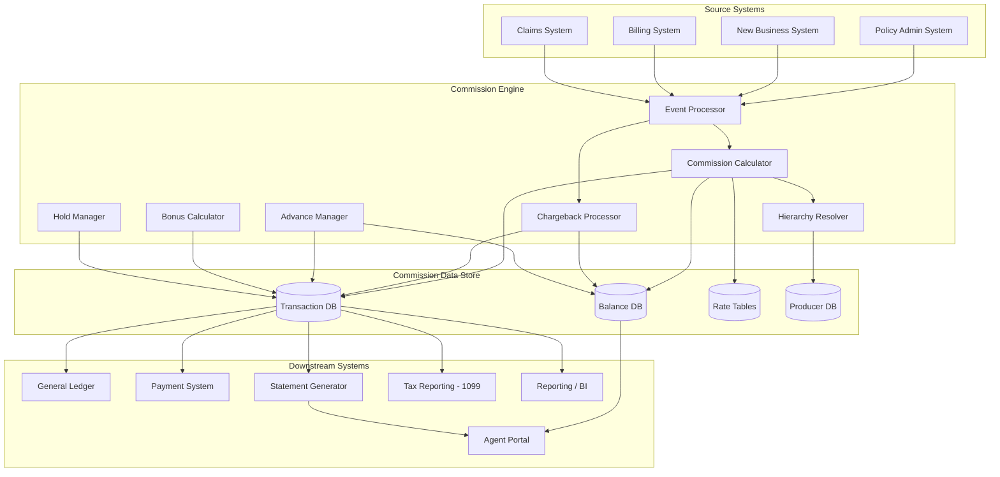

### 14.2 Commission Calculation Engine

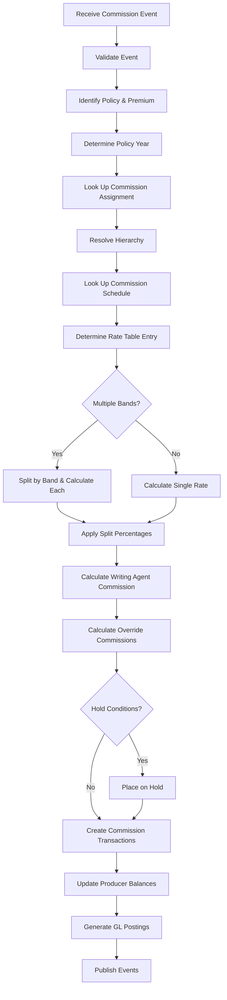

### 14.3 Hierarchy Resolution Algorithm

```python
def resolve_hierarchy(policy_number, transaction_date):
    """
    Resolves the complete commission hierarchy for a policy
    as of the transaction date.
    """
    assignments = get_policy_assignments(policy_number, transaction_date)
    
    result = []
    
    for assignment in assignments:
        agent = assignment.producer
        chain = []
        
        current = agent
        while current is not None:
            hierarchy_record = get_hierarchy_record(
                producer_id=current.producer_id,
                as_of_date=transaction_date
            )
            
            if hierarchy_record is None:
                break
            
            override_rate = get_override_rate(
                schedule_id=current.contract.commission_schedule_id,
                hierarchy_level=hierarchy_record.hierarchy_level,
                effective_date=transaction_date
            )
            
            chain.append({
                'producer': current,
                'level': hierarchy_record.hierarchy_level,
                'override_rate': override_rate,
                'split_pct': assignment.split_percentage if current == agent else 1.0
            })
            
            current = get_producer(hierarchy_record.parent_producer_id)
        
        result.append({
            'writing_agent': agent,
            'split_pct': assignment.split_percentage,
            'hierarchy_chain': chain
        })
    
    return result
```

### 14.4 Statement Generation Architecture

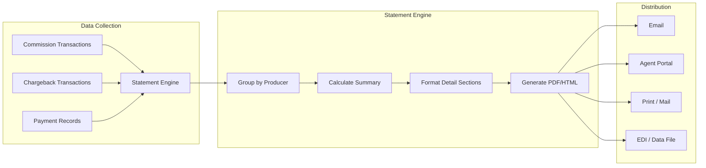

### 14.5 Tax Reporting Batch Architecture

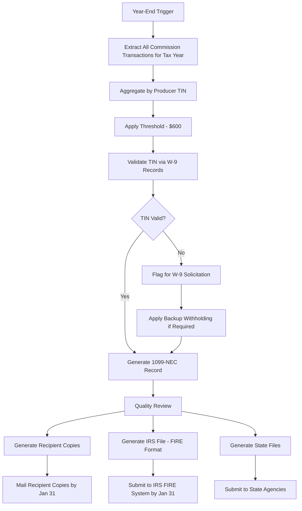

### 14.6 Technology Stack Recommendation

| Component                | Technology Options                         |
|--------------------------|--------------------------------------------|
| Commission Engine        | Java/Spring Boot, .NET Core                |
| Rules Engine             | Drools, InRule, custom DSL                 |
| Database                 | PostgreSQL, Oracle, SQL Server              |
| Event Streaming          | Apache Kafka, AWS Kinesis                  |
| Batch Processing         | Spring Batch, Apache Airflow               |
| API Layer                | REST, GraphQL                              |
| Agent Portal             | React, Angular                             |
| Reporting                | Tableau, Power BI, SSRS                    |
| Statement Generation     | JasperReports, BIRT, custom PDF            |
| Tax Filing               | Custom FIRE format generator               |
| Cache                    | Redis (for rate table caching)             |
| Search                   | Elasticsearch (for producer search)        |

### 14.7 Performance Considerations

| Metric                    | Target                     |
|---------------------------|----------------------------|
| Commission calculation    | < 50ms per policy event    |
| Monthly batch processing  | < 4 hours for 1M policies  |
| Statement generation      | < 2 hours for 50K producers|
| 1099 generation           | < 1 hour for 100K forms    |
| Hierarchy resolution      | < 10ms per lookup          |
| Rate table lookup         | < 5ms per lookup           |

### 14.8 Scalability Patterns

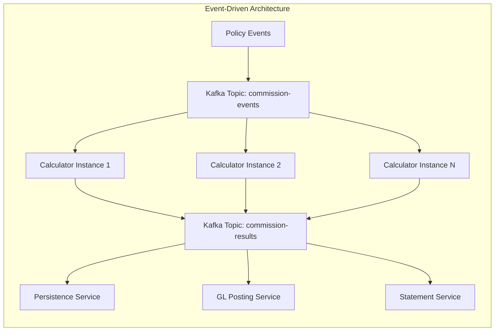

---

## 15. API Contracts & Sample Payloads

### 15.1 Commission Calculation Request

```json
{
  "event_type": "PREMIUM_RECEIVED",
  "event_id": "EVT-2025-000123456",
  "event_timestamp": "2025-03-15T14:30:00Z",
  "policy": {
    "policy_number": "POL-2025-001",
    "product_code": "WL-100",
    "plan_code": "STANDARD",
    "issue_date": "2025-01-15",
    "issue_state": "IL",
    "face_amount": 500000.00,
    "policy_status": "ACTIVE"
  },
  "premium": {
    "premium_amount": 8500.00,
    "premium_type": "PLANNED",
    "premium_mode": "ANNUAL",
    "annualized_premium": 8500.00,
    "commissionable_premium": 8440.00,
    "target_premium": 8440.00,
    "excess_premium": 0.00,
    "payment_date": "2025-03-15",
    "policy_year": 1,
    "premium_due_date": "2025-03-15"
  },
  "riders": [
    {
      "rider_code": "WP",
      "rider_premium": 120.00,
      "rider_status": "ACTIVE"
    }
  ],
  "agents": [
    {
      "producer_id": "PROD-001",
      "role": "WRITING_AGENT",
      "split_percentage": 60.00
    },
    {
      "producer_id": "PROD-002",
      "role": "WRITING_AGENT",
      "split_percentage": 40.00
    }
  ]
}
```

### 15.2 Commission Calculation Response

```json
{
  "calculation_id": "CALC-2025-000123456",
  "event_id": "EVT-2025-000123456",
  "policy_number": "POL-2025-001",
  "calculation_date": "2025-03-15T14:30:05Z",
  "transactions": [
    {
      "transaction_id": "TXN-2025-000000001",
      "producer_id": "PROD-001",
      "producer_name": "Agent A",
      "commission_type": "FYC",
      "commission_basis": "BASE_PREMIUM",
      "commissionable_amount": 8440.00,
      "commission_rate": 0.55,
      "split_percentage": 60.00,
      "gross_commission": 2785.20,
      "holds": [],
      "status": "APPROVED"
    },
    {
      "transaction_id": "TXN-2025-000000002",
      "producer_id": "PROD-002",
      "producer_name": "Agent B",
      "commission_type": "FYC",
      "commission_basis": "BASE_PREMIUM",
      "commissionable_amount": 8440.00,
      "commission_rate": 0.55,
      "split_percentage": 40.00,
      "gross_commission": 1856.80,
      "holds": [],
      "status": "APPROVED"
    },
    {
      "transaction_id": "TXN-2025-000000003",
      "producer_id": "PROD-001",
      "producer_name": "Agent A",
      "commission_type": "FYC",
      "commission_basis": "RIDER_PREMIUM",
      "rider_code": "WP",
      "commissionable_amount": 120.00,
      "commission_rate": 0.20,
      "split_percentage": 60.00,
      "gross_commission": 14.40,
      "holds": [],
      "status": "APPROVED"
    },
    {
      "transaction_id": "TXN-2025-000000004",
      "producer_id": "PROD-002",
      "producer_name": "Agent B",
      "commission_type": "FYC",
      "commission_basis": "RIDER_PREMIUM",
      "rider_code": "WP",
      "commissionable_amount": 120.00,
      "commission_rate": 0.20,
      "split_percentage": 40.00,
      "gross_commission": 9.60,
      "holds": [],
      "status": "APPROVED"
    },
    {
      "transaction_id": "TXN-2025-000000005",
      "producer_id": "PROD-GA-001",
      "producer_name": "General Agency ABC",
      "commission_type": "OVERRIDE",
      "commission_basis": "COMMISSIONABLE_PREMIUM",
      "commissionable_amount": 8560.00,
      "commission_rate": 0.10,
      "split_percentage": 100.00,
      "gross_commission": 856.00,
      "holds": [],
      "status": "APPROVED"
    },
    {
      "transaction_id": "TXN-2025-000000006",
      "producer_id": "PROD-MGA-001",
      "producer_name": "MGA Holdings LLC",
      "commission_type": "OVERRIDE",
      "commission_basis": "COMMISSIONABLE_PREMIUM",
      "commissionable_amount": 8560.00,
      "commission_rate": 0.03,
      "split_percentage": 100.00,
      "gross_commission": 256.80,
      "holds": [],
      "status": "APPROVED"
    }
  ],
  "gl_postings": [
    {
      "account": "4100-00-WL100-IL",
      "description": "Commission Expense - FYC",
      "debit": 4666.00,
      "credit": 0.00
    },
    {
      "account": "4110-00-WL100-IL",
      "description": "Commission Expense - Override",
      "debit": 1112.80,
      "credit": 0.00
    },
    {
      "account": "2100-00",
      "description": "Commission Payable",
      "debit": 0.00,
      "credit": 5778.80
    }
  ],
  "total_commission": 5778.80
}
```

### 15.3 Chargeback Event Payload

```json
{
  "event_type": "POLICY_LAPSED",
  "event_id": "EVT-2025-000789012",
  "event_timestamp": "2025-07-20T10:00:00Z",
  "policy": {
    "policy_number": "POL-2025-001",
    "product_code": "WL-100",
    "issue_date": "2025-01-15",
    "lapse_date": "2025-07-20",
    "months_in_force": 6
  },
  "chargeback": {
    "chargeback_method": "PRO_RATA_VESTING",
    "vesting_at_termination": 0.50,
    "chargeback_percentage": 0.50,
    "affected_transactions": [
      {
        "original_transaction_id": "TXN-2025-000000001",
        "producer_id": "PROD-001",
        "original_amount": 2785.20,
        "chargeback_amount": 1392.60
      },
      {
        "original_transaction_id": "TXN-2025-000000002",
        "producer_id": "PROD-002",
        "original_amount": 1856.80,
        "chargeback_amount": 928.40
      },
      {
        "original_transaction_id": "TXN-2025-000000003",
        "producer_id": "PROD-001",
        "original_amount": 14.40,
        "chargeback_amount": 7.20
      },
      {
        "original_transaction_id": "TXN-2025-000000004",
        "producer_id": "PROD-002",
        "original_amount": 9.60,
        "chargeback_amount": 4.80
      },
      {
        "original_transaction_id": "TXN-2025-000000005",
        "producer_id": "PROD-GA-001",
        "original_amount": 856.00,
        "chargeback_amount": 428.00
      },
      {
        "original_transaction_id": "TXN-2025-000000006",
        "producer_id": "PROD-MGA-001",
        "original_amount": 256.80,
        "chargeback_amount": 128.40
      }
    ],
    "total_chargeback": 2889.40
  }
}
```

### 15.4 Commission Payment Payload

```json
{
  "payment_id": "PAY-2025-000045678",
  "producer_id": "PROD-001",
  "producer_name": "John A. Smith",
  "payment_date": "2025-04-15",
  "payment_method": "EFT",
  "bank_info": {
    "routing_number": "XXXXXXXXX",
    "account_number": "XXXXXXXX",
    "account_type": "CHECKING"
  },
  "gross_amount": 20267.80,
  "deductions": [
    {
      "deduction_type": "CHARGEBACK_RECOVERY",
      "amount": 1375.00,
      "reference": "CHG-2025-000012"
    },
    {
      "deduction_type": "ADVANCE_RECOVERY",
      "amount": 500.00,
      "reference": "ADV-2025-000003"
    },
    {
      "deduction_type": "EO_PREMIUM",
      "amount": 125.00,
      "reference": "EO-2025-Q1"
    }
  ],
  "total_deductions": 2000.00,
  "net_payment": 18267.80,
  "transactions_included": 47,
  "statement_id": "STMT-2025-000045678"
}
```

---

## 16. Glossary

| Term                       | Definition                                                                 |
|----------------------------|---------------------------------------------------------------------------|
| **FYC**                    | First-Year Commission — commission on first-year premiums                  |
| **Renewal Commission**     | Commission paid on premiums in policy years 2+                            |
| **Trail Commission**       | Asset-based ongoing commission, common for variable products              |
| **Override**               | Commission paid to supervisory levels based on downline production        |
| **Chargeback**             | Recovery of unearned commission due to early policy termination           |
| **Advance**                | Pre-payment of future commission earnings                                 |
| **DAC**                    | Deferred Acquisition Cost — capitalized acquisition expenses under GAAP   |
| **NPN**                    | National Producer Number — unique producer identifier                     |
| **NIPR**                   | National Insurance Producer Registry                                      |
| **AOR Change**             | Agent of Record Change — transfer of policy servicing rights              |
| **Persistency**            | Measure of policy retention over time                                     |
| **Commissionable Premium** | Portion of premium on which commission is calculated                      |
| **Target Premium**         | Reference premium level for UL products determining commission rates      |
| **Excess Premium**         | Premium paid above the target premium level                               |
| **1099-NEC**               | IRS form for reporting non-employee compensation                          |
| **FIRE System**            | IRS Filing Information Returns Electronically system                      |
| **Backup Withholding**     | Mandatory tax withholding when valid TIN is not on file (24%)             |
| **B-Notice**               | IRS notification of TIN mismatch requiring W-9 re-solicitation           |
| **Heaped Commission**      | Front-loaded commission with high first-year and low renewal rates        |
| **Levelized Commission**   | More evenly distributed commission across policy years                    |
| **Vesting Schedule**       | Schedule defining the earned percentage of commission over time           |
| **Split Commission**       | Division of commission among multiple writing agents                      |
| **IMO/BGA**                | Independent Marketing Organization / Brokerage General Agency            |
| **MGA**                    | Managing General Agent                                                    |
| **GA**                     | General Agent                                                             |
| **LDTI**                   | Long-Duration Targeted Improvements (ASU 2018-12)                        |
| **CSM**                    | Contractual Service Margin (IFRS 17)                                     |

---

## Appendix A: Commission Processing Batch Schedule

| Batch Job                    | Frequency     | Typical Window | Dependencies           |
|------------------------------|---------------|----------------|------------------------|
| Daily Commission Calculation | Daily         | 2:00–4:00 AM   | Premium posting complete|
| Trail Commission Accrual     | Daily         | 4:00–5:00 AM   | NAV feed received       |
| Chargeback Processing        | Daily         | 5:00–6:00 AM   | Lapse/surrender posting |
| Advance Earned-Out Update    | Daily         | 6:00–6:30 AM   | Premium posting complete|
| Commission Hold Review       | Weekly        | Saturday AM     | Compliance data refresh |
| Override Calculation         | Monthly       | 1st business day| All daily runs complete |
| Bonus Calculation            | Quarterly     | 15th of quarter | Period-end close        |
| Statement Generation         | Monthly       | 10th of month  | Payment processing done |
| 1099 Generation              | Annual        | January 10–20  | Year-end close complete |
| Hierarchy Audit              | Monthly       | Last business day| NIPR feed received     |
| Balance Aging Update         | Monthly       | 1st business day| Month-end close         |

## Appendix B: Commission Audit Checklist

- [ ] Verify commission rates match current rate tables
- [ ] Validate hierarchy relationships as of transaction date
- [ ] Confirm producer appointment and license are active for policy state
- [ ] Verify split percentages total 100% for all writing agents
- [ ] Confirm target/excess premium calculations are correct
- [ ] Validate chargeback calculations match vesting schedule
- [ ] Verify advance balances are properly tracked
- [ ] Confirm 1099 amounts match YTD commission totals
- [ ] Validate GL postings balance (debits = credits)
- [ ] Verify state-specific commission limits are enforced
- [ ] Confirm bonus calculations use correct measurement period
- [ ] Validate persistency calculations match in-force records

## Appendix C: Common Commission Calculation Errors

| Error                           | Root Cause                                      | Resolution                        |
|---------------------------------|-------------------------------------------------|-----------------------------------|
| Wrong commission rate           | Stale rate table cache                          | Refresh cache, recalculate        |
| Missing override                | Hierarchy not effective-dated properly           | Correct hierarchy, recalculate    |
| Double commission               | Duplicate premium event                         | Deduplicate, reverse duplicate    |
| Wrong policy year               | Issue date vs effective date mismatch            | Standardize policy year logic     |
| Missing rider commission        | Rider not in commission assignment               | Add rider to assignment           |
| Incorrect chargeback            | Wrong vesting schedule applied                   | Apply correct schedule, adjust    |
| Tax reporting discrepancy       | Commission adjustments after year-end            | Issue corrected 1099              |
| Split percentage > 100%         | Data entry error                                | Correct and recalculate           |
| Negative payment                | Chargebacks exceed earnings                      | Apply max recovery percentage     |
| Commission on non-comm product  | Product flagged incorrectly                      | Correct product setup             |

---

*Article 26 — Commission Processing & Compensation — Life Insurance PAS Encyclopedia*
*Version 1.0 — April 2025*
