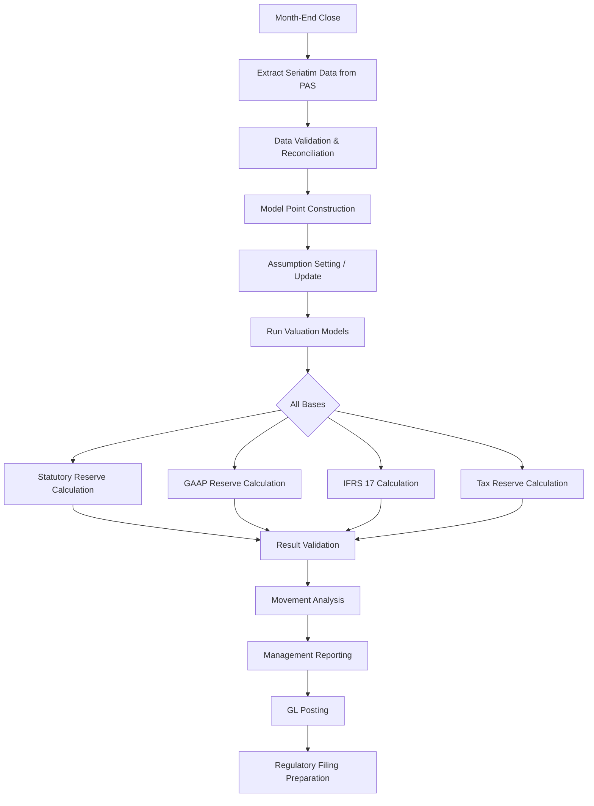
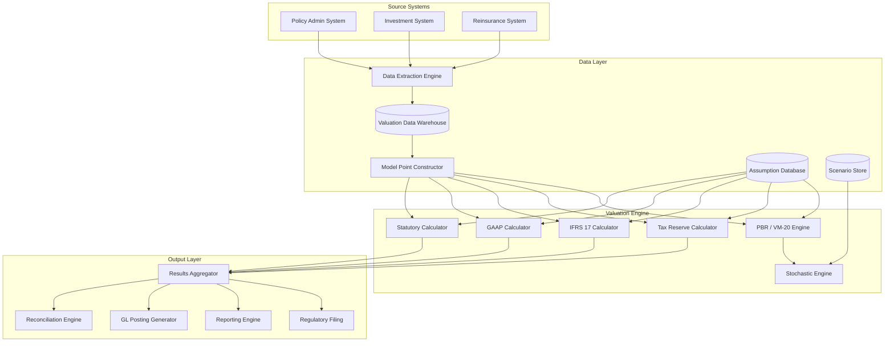
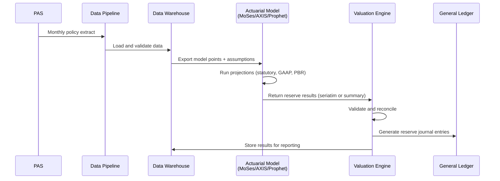
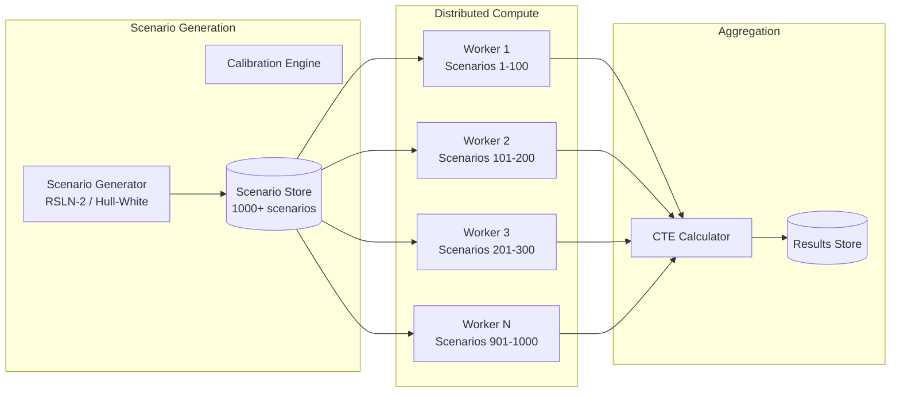
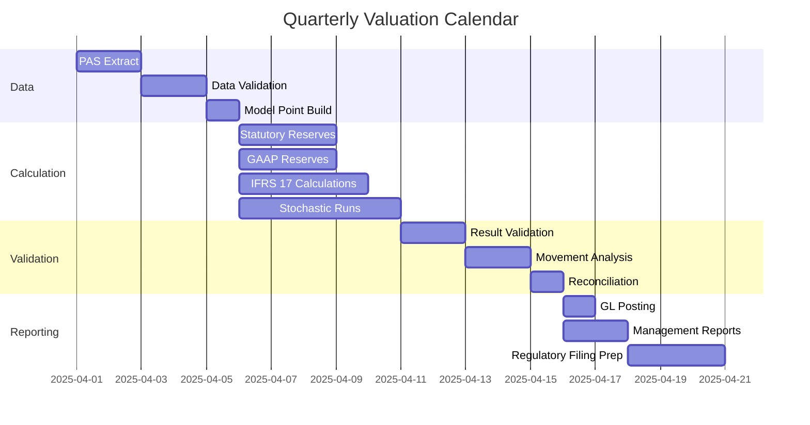

# Article 27: Policy Valuation & Reserves

## Executive Summary

Policy valuation and reserve calculation sit at the intersection of actuarial science, regulatory compliance, and systems architecture. A modern Life Insurance Policy Administration System must compute reserves under multiple accounting frameworks simultaneously — Statutory (SAP), GAAP (FAS 60/97/120, LDTI), and international (IFRS 17) — while supporting principle-based reserving (PBR/VM-20) and complex variable product guarantees (AG 43/C3 Phase II). This article provides an exhaustive treatment of every dimension of policy valuation, from mortality tables and discount rates through stochastic modeling and actuarial reporting, with detailed data models, worked calculations, and architecture guidance.

---

## Table of Contents

1. [Statutory Reserves](#1-statutory-reserves)
2. [Cash Value Calculation](#2-cash-value-calculation)
3. [UL Secondary Guarantees](#3-ul-secondary-guarantees)
4. [Variable Product Reserves](#4-variable-product-reserves)
5. [Principle-Based Reserving (PBR / VM-20)](#5-principle-based-reserving-pbr--vm-20)
6. [GAAP Reserves](#6-gaap-reserves)
7. [IFRS 17 / LDTI](#7-ifrs-17--ldti)
8. [Actuarial Valuation Process](#8-actuarial-valuation-process)
9. [Reserve Data Requirements](#9-reserve-data-requirements)
10. [Data Model for Valuation](#10-data-model-for-valuation)
11. [Sample Reserve Calculations](#11-sample-reserve-calculations)
12. [Architecture & System Design](#12-architecture--system-design)
13. [Reporting & Regulatory Filing](#13-reporting--regulatory-filing)
14. [Glossary](#14-glossary)

---

## 1. Statutory Reserves

### 1.1 Overview of Statutory Reserve Methods

Statutory reserves are the minimum reserves required by state insurance regulators. They are calculated using prescribed assumptions (mortality tables, interest rates) rather than the company's own experience.

**Governing Standards:**
- Standard Valuation Law (SVL)
- NAIC Valuation Manual (VM-20, VM-21, VM-22, etc.)
- State-specific regulations

### 1.2 Net Level Premium Reserve (NLP)

The net level premium reserve is the most fundamental reserve calculation. It represents the present value of future benefits minus the present value of future net premiums.

**Formula:**

```
tV = A(x+t) - NLP × ä(x+t)

Where:
  tV     = Reserve at duration t
  A(x+t) = Present value of future benefits for a life aged x+t
  NLP    = Net level premium
  ä(x+t) = Present value of a life annuity-due for a life aged x+t
```

**Net Level Premium Calculation:**

```
NLP = A(x) / ä(x)

Where:
  A(x) = Present value of a whole life insurance benefit at issue age x
  ä(x) = Present value of a whole life annuity-due at issue age x
```

**Prospective Reserve Formula (expanded):**

```
tV = Σ [v^(k+1) × (k)p(x+t) × q(x+t+k)] - NLP × Σ [v^k × (k)p(x+t)]
     k=0 to ω-(x+t)-1                        k=0 to ω-(x+t)-1

Where:
  v        = 1/(1+i), discount factor
  i        = valuation interest rate
  (k)p(x)  = probability of surviving k years from age x
  q(x)     = probability of dying within 1 year at age x
  ω        = limiting age of mortality table
```

### 1.3 Commissioner's Reserve Valuation Method (CRVM)

CRVM is a modified reserve method that allows a first-year expense allowance, resulting in lower reserves in the first policy year compared to NLP.

**CRVM Mechanics:**

```
Modified Net Premium (Year 1):
  α = NLP + (1-tV_NLP_1)/ä(x:1) - if positive expense allowance
  
  More precisely:
  α = A(x) / ä(x:n) (for n-pay policy)
  
  First Year Modified Premium:
  P_mod_1 = min(NLP, α)
  
  Renewal Modified Premium:
  P_mod_r = (A(x) - P_mod_1) / (ä(x) - 1)  [for whole life]

CRVM Reserve:
  Year 1: tV_CRVM = A(x+1) - P_mod_r × ä(x+1)  [typically lower than NLP]
  Year 2+: tV_CRVM = A(x+t) - P_mod_r × ä(x+t)  [converges to NLP over time]
```

**CRVM Expense Allowance Limits:**

| Type                     | Maximum First-Year Expense Allowance                     |
|--------------------------|----------------------------------------------------------|
| Whole Life               | 1 year term cost + 125% of NLP, capped at commissionable |
| Term Life                | Similar formula with term-specific adjustments            |
| Single Premium           | No modification allowed (reserve = single premium value)  |
| Limited Pay (n-pay)      | Proportional to payment period                           |

### 1.4 Commissioner's 20-Year Select and Ultimate Method

An alternative modified method that provides even more first-year relief:

```
Modified Premium = NLP calculated using select and ultimate mortality
  for the first 20 years, ultimate mortality thereafter.

The "select" period reflects lower mortality for recently-underwritten lives.
```

### 1.5 Mortality Table Requirements

**Current Valuation Mortality Tables:**

| Table                | Effective For | Application                    |
|----------------------|---------------|--------------------------------|
| 2001 CSO             | Issues 2004+  | Older in-force policies         |
| 2001 CSO (select)    | Issues 2004+  | Used with select mortality      |
| 2017 CSO             | Issues 2020+  | Current minimum standard        |
| 2017 CSO (preferred) | Issues 2020+  | Preferred risk class            |
| 2012 IAM             | Annuities     | Individual Annuity Mortality    |

**2017 CSO Table Structure:**

```
Sample mortality rates (Male, Age-Nearest-Birthday, Non-Smoker, Ultimate):

Age    q(x)
25     0.00040
30     0.00047
35     0.00058
40     0.00082
45     0.00128
50     0.00210
55     0.00362
60     0.00614
65     0.01044
70     0.01746
75     0.02930
80     0.05045
85     0.08830
90     0.15396
95     0.26104
100    0.40000
```

### 1.6 Valuation Interest Rate Requirements

**Maximum Valuation Interest Rates (Standard Valuation Law):**

The maximum valuation interest rate is determined by formula based on Moody's Corporate Bond Yield Average:

```
For life insurance:
  i_max = 0.03 + W × (R - 0.03)
  
  Where:
    W = weighting factor (varies by guarantee duration)
    R = reference interest rate (Moody's average)
    
  Typical current maximum rates:
    Whole Life (guarantee > 20 years): 3.50% – 4.00%
    Term Life (guarantee 10-20 years): 4.00% – 4.50%
    SPIA (guarantee < 10 years):       4.50% – 5.00%
```

### 1.7 Deficiency Reserves

Deficiency reserves are required when the gross premium charged is less than the valuation net premium.

```
Deficiency Reserve = max(0, Valuation Net Premium - Gross Premium) × ä(x+t)

Example:
  Gross Annual Premium:       $800
  Valuation Net Premium (NLP): $950
  Deficiency per Year:         $150
  ä(x+t) for remaining period: 12.5

  Deficiency Reserve = $150 × 12.5 = $1,875
  
  Total Statutory Reserve = Basic Reserve + Deficiency Reserve
                          = $8,500 + $1,875
                          = $10,375
```

### 1.8 Excess Interest Reserves

For products crediting interest above the valuation rate, excess interest reserves may be required:

```
If Credited Rate > Valuation Rate:
  The valuation must recognize the obligation to credit excess interest
  on guaranteed or contractually committed interest credits.
  
  Excess Interest Reserve = PV(future excess interest credits)
  
  Example:
    Account Value: $100,000
    Guaranteed Minimum Rate: 3.0%
    Valuation Rate: 4.0%
    No excess interest reserve needed (guaranteed < valuation)
    
    But if:
    Guaranteed Minimum Rate: 4.5%
    Valuation Rate: 4.0%
    Excess Interest Reserve = PV of 0.5% annual excess over remaining guarantee period
```

---

## 2. Cash Value Calculation

### 2.1 Traditional Products (Whole Life)

Cash values for traditional products are defined in the policy contract and typically equal the reserve less a surrender charge.

**Cash Value Derivation:**

```
Cash Surrender Value (CSV) = Gross Cash Value - Surrender Charge

Gross Cash Value = max(
  Guaranteed Cash Value (per policy schedule),
  Net Level Premium Reserve - Surrender Charge,
  Nonforfeiture Value (Standard Nonforfeiture Law minimum)
)

Standard Nonforfeiture Law Minimum:
  CV_min = PV(future benefits) - PV(future adjusted premiums)
  
  Adjusted Premium = valuation net premium + expense allowance
  (Expense allowance limited by SVL formula)
```

**Sample Cash Value Schedule (Whole Life, Male Age 35, $100,000 Face):**

| Policy Year | Guaranteed CV | Guaranteed CV per $1,000 | Cumulative Premium |
|-------------|---------------|--------------------------|-------------------|
| 1           | $0            | $0.00                    | $1,850            |
| 2           | $500          | $5.00                    | $3,700            |
| 3           | $1,650        | $16.50                   | $5,550            |
| 5           | $4,200        | $42.00                   | $9,250            |
| 10          | $12,500       | $125.00                  | $18,500           |
| 15          | $22,800       | $228.00                  | $27,750           |
| 20          | $35,200       | $352.00                  | $37,000           |
| Age 65      | $52,000       | $520.00                  | $55,500           |

### 2.2 Universal Life (UL) Account Value

For UL products, the cash value is based on the account value, which is a running accumulation:

```
Account Value (end of month m) = 
  Account Value (end of month m-1)
  + Premium Received (month m)
  - Cost of Insurance (month m)
  - Expense Charges (month m)
  - Rider Charges (month m)
  + Interest Credited (month m)

Where:
  Cost of Insurance = (Face Amount - Account Value) × COI Rate / 12
    (for Option A / Level Death Benefit)
  
  OR:
  
  Cost of Insurance = Face Amount × COI Rate / 12
    (for Option B / Increasing Death Benefit)

  Interest Credited = Account Value × Credited Rate / 12
```

**Monthly UL Projection Example:**

```
Month 0: Account Value = $0.00
  + Premium:           $500.00
  - Expense Charge:     $7.50 (per-premium charge)
  - Monthly Admin:      $10.00
  - COI (Age 40 NS):   $12.50 [$250,000 NAR × $0.60/1000/12]
  + Interest:           $1.18 [$471.18 × 3.0%/12]
  = Month 1 AV:        $471.18

Month 1: Account Value = $471.18
  + Premium:           $500.00
  - Expense Charge:     $7.50
  - Monthly Admin:      $10.00
  - COI:               $12.37
  + Interest:          $2.35
  = Month 2 AV:       $943.66

... (continues monthly)
```

### 2.3 Cash Surrender Value for UL

```
Cash Surrender Value = Account Value - Surrender Charge

Surrender Charge Schedule (typical):
  Year 1:  100% of Target Premium
  Year 2:   90% of Target Premium
  Year 3:   80% of Target Premium
  Year 4:   70% of Target Premium
  Year 5:   60% of Target Premium
  Year 6:   50% of Target Premium
  Year 7:   40% of Target Premium
  Year 8:   30% of Target Premium
  Year 9:   20% of Target Premium
  Year 10:  10% of Target Premium
  Year 11+:  0%

Example:
  Account Value:     $15,000
  Target Premium:     $6,000
  Policy Year:        3
  Surrender Charge:   $6,000 × 80% = $4,800
  CSV:                $15,000 - $4,800 = $10,200
```

### 2.4 Guaranteed vs Non-Guaranteed Values

| Element                  | Guaranteed                               | Non-Guaranteed (Current)               |
|--------------------------|------------------------------------------|----------------------------------------|
| Interest / Credited Rate | Minimum guaranteed rate (e.g., 2%)       | Current declared rate (e.g., 4.2%)     |
| COI Rates                | Maximum guaranteed COI rates             | Current COI rates (lower)              |
| Expense Charges          | Maximum guaranteed charges               | Current charges (may be waived)        |
| Surrender Charge         | Per policy schedule (guaranteed)         | Same (surrender charges are guaranteed)|
| Dividends (Par WL)       | None guaranteed                          | Current dividend scale                 |

### 2.5 Interpolation Between Durations

For mid-year transactions, cash values must be interpolated:

```
Interpolation Methods:

Linear Interpolation:
  CV(t + f) = CV(t) × (1 - f) + CV(t+1) × f
  
  Where:
    t = completed policy years
    f = fraction of year elapsed (e.g., 0.5 for mid-year)
    
  Example:
    CV at Year 5:  $4,200
    CV at Year 6:  $5,400
    CV at Year 5.5: $4,200 × 0.5 + $5,400 × 0.5 = $4,800

Actuarial Interpolation (with interest):
  CV(t + f) = CV(t) × (1 + i)^f × (1 - f) + CV(t+1) × v^(1-f) × f
  
  This accounts for the time value of money during the year.
```

### 2.6 Loan Impact on Cash Surrender Value

```
CSV = Account Value (or Gross Cash Value) - Surrender Charge - Loan Balance

Loan Balance = Loan Principal + Accrued Loan Interest - Loan Repayments

Example:
  Account Value:        $50,000
  Surrender Charge:      $2,000
  Outstanding Loan:     $10,000
  Accrued Loan Interest: $400
  
  CSV = $50,000 - $2,000 - $10,000 - $400 = $37,600
  
  Net Death Benefit = Face Amount - Loan Balance
                    = $250,000 - $10,400 = $239,600
```

---

## 3. UL Secondary Guarantees

### 3.1 Shadow Account Mechanism

Many UL products contain a secondary guarantee (no-lapse guarantee) that keeps the policy in force even if the actual account value reaches zero, provided the policyholder has met specified premium requirements.

```
Shadow Account Value (SAV) tracks separately from the real Account Value:

SAV(m) = SAV(m-1) + Premium(m) - Shadow Charges(m) + Shadow Interest(m)

Shadow Charges and Shadow Interest use a DIFFERENT set of assumptions
than the actual policy mechanics:
  - Shadow COI rates (often lower than actual guaranteed COI)
  - Shadow interest rate (often higher than actual guaranteed rate)
  - Shadow expense charges (often lower than actual)

No-Lapse Guarantee Test:
  IF SAV > 0, policy stays in force regardless of actual AV
  IF SAV ≤ 0 AND AV ≤ 0, policy lapses
```

### 3.2 No-Lapse Guarantee Reserve Requirements

**Actuarial Guideline XXXVIII (AG 38):**

AG 38 prescribes the minimum reserve for UL policies with secondary guarantees, using a seriatim reserve approach.

```
AG 38 Reserve Components:

Component 1: Basic reserve using CRVM methodology
Component 2: Additional reserve for the secondary guarantee

The additional reserve is calculated as:

  Additional Reserve = max(0, Reserve_SG - Reserve_Basic)

Where:
  Reserve_SG = Present value of future guaranteed benefits
             (reflecting the secondary guarantee keeps the policy in force)
             - Present value of future premiums
             (using the shadow account premium pattern)
             
  Reserve_Basic = Standard CRVM reserve assuming no secondary guarantee

AG 38 Level of Stringency (depends on product design):
  Level 1: Minimal additional reserve (well-funded shadow account)
  Level 2: Moderate additional reserve
  Level 3: Significant additional reserve (aggressive shadow account)
```

### 3.3 PBR Implications for Secondary Guarantees

Under VM-20, secondary guarantee reserves are calculated as the greater of:

```
PBR Reserve = max(
  Net Premium Reserve,
  Deterministic Reserve,
  Stochastic Reserve
)

For UL with secondary guarantees:
  The deterministic and stochastic reserves model the continuation
  of the policy under the secondary guarantee even when AV = 0,
  requiring the company to hold reserves for the no-lapse guarantee
  benefit.
```

---

## 4. Variable Product Reserves

### 4.1 Separate Account Reserves

Variable products (VUL, VA) have assets held in separate accounts that are legally insulated from the general account.

```
Separate Account Reserve = Sum of all policyholder account values
  in the separate account (unit value × units owned)

General Account Reserve = Reserves for guaranteed benefits
  (GMDB, GMWB, GMIB, GMAB) that exceed separate account values
```

### 4.2 Guaranteed Minimum Benefit Reserves

**Types of Guaranteed Minimum Benefits:**

| Guarantee Type | Description                                              | Risk to Carrier                |
|---------------|----------------------------------------------------------|--------------------------------|
| GMDB          | Guaranteed Minimum Death Benefit                          | Death benefit floor            |
| GMWB          | Guaranteed Minimum Withdrawal Benefit                     | Lifetime income guarantee      |
| GMIB          | Guaranteed Minimum Income Benefit                         | Annuitization guarantee        |
| GMAB          | Guaranteed Minimum Accumulation Benefit                   | Account value floor at maturity|

**GMDB Types and Calculations:**

```
Return of Premium GMDB:
  GMDB = max(Account Value, Total Premiums Paid - Withdrawals)
  Net Amount at Risk = max(0, GMDB - Account Value)

Ratchet (Annual Step-Up) GMDB:
  GMDB = max(Account Value, Highest Anniversary AV, Total Premiums)
  Net Amount at Risk = max(0, GMDB - Account Value)

Roll-Up GMDB:
  GMDB = max(Account Value, Premiums × (1 + roll-up rate)^t)
  Net Amount at Risk = max(0, GMDB - Account Value)

Example (Ratchet GMDB):
  Total Premiums Paid:    $200,000
  Year 1 Anniversary AV:  $215,000  ← New ratchet level
  Year 2 Anniversary AV:  $195,000  (no new ratchet)
  Year 3 Anniversary AV:  $230,000  ← New ratchet level
  Year 4 Anniversary AV:  $180,000  (no new ratchet)
  
  Current GMDB = max($180,000, $230,000) = $230,000
  Net Amount at Risk = $230,000 - $180,000 = $50,000
  
  Reserve must cover the $50,000 NAR plus future expected NAR
```

### 4.3 Stochastic Modeling for Variable Products

Reserves for variable product guarantees require stochastic modeling — running thousands of scenarios of future market returns.

**Scenario Generation:**

```
Calibration Requirements (C3 Phase II / AG 43):
  - Equity scenarios must be calibrated to market-observable option prices
  - Interest rate scenarios must be consistent with the current yield curve
  - Typically 1,000–10,000 scenarios are used
  
Scenario Structure:
  Each scenario contains:
  - Monthly equity returns for each fund (correlated across funds)
  - Monthly interest rates (short-term and long-term)
  - Duration: 30+ years (to contract maturity)

Equity Return Model (Regime-Switching Lognormal - RSLN-2):
  The American Academy of Actuaries prescribes the RSLN-2 model:
  
  Regime 1 (Normal): μ₁ = 0.01, σ₁ = 0.03 (monthly)
  Regime 2 (Volatile): μ₂ = -0.005, σ₂ = 0.06 (monthly)
  
  Transition probabilities:
  P(1→2) = 0.04 (normal to volatile)
  P(2→1) = 0.20 (volatile to normal)
```

### 4.4 Conditional Tail Expectation (CTE)

The CTE is the key risk metric for variable product reserves:

```
CTE(X) = Average of the worst (100-X)% of scenarios

For AG 43 / C3 Phase II:
  Standard Scenario Reserve (AG 43): CTE(70)
  C3 Phase II (RBC): CTE(90) for risk-based capital
  
Calculation:
  1. Run N scenarios (e.g., 1,000)
  2. For each scenario, calculate the present value of guaranteed 
     benefit payments minus present value of fees/charges
  3. Sort results from highest (worst) to lowest (best)
  4. CTE(70) = Average of the worst 300 scenarios (top 30%)
  5. CTE(90) = Average of the worst 100 scenarios (top 10%)

Example (simplified with 10 scenarios):
  Scenario PV Results (sorted worst to best):
  1: $15,000
  2: $12,000
  3: $8,000
  4: $5,000
  5: $3,000
  6: $1,000
  7: -$2,000 (fees exceed benefits)
  8: -$5,000
  9: -$8,000
  10: -$10,000

  CTE(70) = Average of worst 3: ($15,000 + $12,000 + $8,000) / 3 = $11,667
  CTE(90) = Worst 1: $15,000
```

### 4.5 AG 43 Reserve Calculation

```
AG 43 Total Reserve = max(
  Standard Scenario Amount,
  Conditional Tail Expectation Amount
)

Standard Scenario Amount:
  Uses a single prescribed scenario (market drop followed by recovery)
  - Year 1: Equity -20%, Bond +2%
  - Year 2: Equity -10%, Bond +3%
  - Year 3+: Equity +5%, Bond +4% (recovery)
  
  Calculate PV of guaranteed benefits in this scenario

CTE Amount:
  CTE(70) of the stochastic scenarios minus the CTE(70) of 
  available assets to fund the guarantees

AG 43 Reserve = max(Standard Scenario, CTE Amount) 
              - Separate Account Value (held separately)
  
The general account portion is the additional reserve for guarantees.
```

---

## 5. Principle-Based Reserving (PBR / VM-20)

### 5.1 VM-20 Framework

VM-20 applies to life insurance products and calculates the minimum reserve as:

```
VM-20 Reserve = max(
  Net Premium Reserve (NPR),
  Deterministic Reserve (DR),
  Stochastic Reserve (SR)
)

With an additional stochastic exclusion test and a deterministic exclusion test
that may allow companies to skip the stochastic or deterministic calculations.
```

### 5.2 Net Premium Reserve (NPR)

The NPR is a formulaic reserve similar to the traditional CRVM but using the 2017 CSO table:

```
NPR = PV(future benefits) - PV(future net premiums)

Using:
  Mortality: 2017 CSO (valuation table)
  Interest: Prescribed valuation interest rate
  Lapse: 0% assumed (conservative)
  
NPR is the floor — the reserve cannot be less than the NPR.
```

### 5.3 Deterministic Reserve (DR)

The deterministic reserve uses company experience assumptions under a single deterministic scenario:

```
DR = PV(future benefits + expenses) - PV(future premiums)

Using:
  Mortality: Company experience with prescribed margins
  Lapse: Company experience with prescribed margins  
  Expense: Company experience with prescribed margins
  Interest: Prescribed yield curves (Treasury + spread)
  Reinvestment: Prescribed reinvestment strategy

Mortality Margin Example:
  Company Best Estimate: q(x) = 0.001
  Prescribed Margin: +6% of best estimate
  Valuation Mortality: q(x) = 0.001 × 1.06 = 0.00106
  
Lapse Margin:
  Company Best Estimate Lapse: 5%
  Margin: direction that increases reserve
  If higher lapse increases reserve: Lapse = 5% × 1.10 = 5.5%
  If lower lapse increases reserve: Lapse = 5% × 0.90 = 4.5%
```

### 5.4 Stochastic Reserve (SR)

```
SR = CTE(70) of stochastic scenarios

Process:
1. Generate 1,000+ economic scenarios (interest rates, equity returns)
2. For each scenario, project policy cash flows:
   - Premium income
   - Benefit payments (death, surrender, maturity)
   - Expense payments
   - Investment income on assets backing reserves
3. Calculate the accumulated statutory surplus for each scenario
4. Determine the starting assets needed so that CTE(70) of ending
   surplus ≥ 0 (i.e., the company remains solvent in the worst 30%)
5. SR = Starting assets required = Reserve

Stochastic Exclusion Test:
  If the product does not have significant interest rate risk or equity risk,
  companies may demonstrate through a certification that:
  
  Stochastic Reserve ≈ Deterministic Reserve
  
  And therefore skip the full stochastic calculation.
  
  Test: If DR < NPR × 1.05 AND product has no equity features,
        stochastic calculation may be excluded.
```

### 5.5 VM-20 Experience Assumptions

| Assumption     | Source                              | Margin Direction                    |
|---------------|-------------------------------------|-------------------------------------|
| Mortality      | Company experience (credibility-weighted)| Increase (higher mortality → higher reserve) |
| Lapse          | Company experience                  | Directional (whichever increases reserve)    |
| Premium        | Company experience / contractual    | Lower premiums → higher reserve              |
| Expense        | Company actual expenses             | Higher expense → higher reserve              |
| Investment     | Company portfolio / prescribed      | Lower yield → higher reserve                 |

### 5.6 Asset Modeling for VM-20

```
Starting Assets = Estimated reserve at beginning of projection

Asset Portfolio:
  - Model actual assets or a representative portfolio
  - Include bond types (government, corporate, MBS)
  - Model credit defaults with prescribed default rates
  - Reinvestment strategy must follow prescribed rules

Prescribed Default Rates (VM-20 Table G):
  Rating    Annual Default   Recovery
  AAA       0.05%            50%
  AA        0.10%            45%
  A         0.15%            40%
  BBB       0.40%            35%
  BB        1.50%            30%
  B         4.00%            25%

Discount Rates:
  DR scenario: Net asset earned rate
  SR scenarios: Scenario-specific reinvestment rates
  NPR: Prescribed valuation rate
```

### 5.7 PBR Grading and Transition

```
Transition Rules (for policies issued during transition period):
  
  For policies subject to VM-20 (issued 2020+):
    Year 1: Reserve = max(NPR, DR, SR)
    Full PBR reserve from year 1

  For pre-PBR policies (issued before 2020):
    Continue using pre-PBR methods (CRVM) for existing business
    
  Companies had a 3-year transition period (2017-2019) where
  they could elect to use PBR early.
```

---

## 6. GAAP Reserves

### 6.1 FAS 60 — Traditional Products

FAS 60 (ASC 944-40) applies to traditional long-duration contracts (whole life, term, participating).

```
FAS 60 Benefit Reserve = PV(future benefits + maintenance expenses)
                       - PV(future net premiums)

Using:
  Mortality: Best estimate at issue (locked in)
  Interest: Best estimate at issue (locked in)
  Lapse: Best estimate at issue (locked in)
  Provision for adverse deviation (PAD): Included in assumptions
  
Lock-in Principle:
  Assumptions are set at contract inception and NOT updated
  unless loss recognition testing indicates a premium deficiency.
```

**Loss Recognition Testing:**

```
At each reporting date:
  1. Recalculate PV of future benefits using current best estimate assumptions
  2. Compare to PV of future gross premiums + existing reserve + DAC balance
  
  If PV(future benefits + expenses) > PV(future gross premiums) + Reserve + DAC:
    Premium deficiency exists
    1. First, write down DAC (reduce to zero if necessary)
    2. If still deficient, increase reserve (unlock assumptions)
```

### 6.2 FAS 97 — Universal Life Type Products

FAS 97 (ASC 944-20) applies to UL, VUL, and other products with policyholder account values.

```
FAS 97 Reserve = Account Value (policyholder balance)

No separate GAAP reserve calculation needed beyond the account value,
because the account value IS the obligation.

However, additional liabilities may be required for:
  - Guaranteed minimum death benefits (GMDB) in excess of account value
  - No-lapse guarantees (SOP 03-1 / ASC 944-40-25)
  - Persistent low interest rate scenarios affecting UL profitability

SOP 03-1 Additional Liability:
  For UL with secondary guarantees:
  Additional Liability = PV(excess benefit payments) × benefit ratio
  
  Benefit Ratio = PV(excess benefits) / PV(assessments)
  Assessment Base = COI charges, expense charges, surrender charges
```

### 6.3 FAS 120 — Participating Contracts

FAS 120 applies to participating whole life contracts:

```
FAS 120 Reserve = Net level premium reserve (similar to FAS 60)
  using dividend fund interest rate as the discount rate

The key difference is that dividends are treated as a reduction
in the policyholder's benefit, not an expense.
```

### 6.4 DAC Amortization Under GAAP (Pre-LDTI)

**FAS 60 DAC Amortization:**

```
DAC Amortization Ratio = Premium_t / PV(Total Expected Premiums at issue)

DAC Expense in Year t = DAC Balance × Amortization Ratio

Locked-in assumptions: Uses original assumptions unless loss recognition triggers unlock.
```

**FAS 97 DAC Amortization:**

```
DAC Amortization Ratio = EGP_t / PV(Total Expected EGPs at issue)

Where EGP (Estimated Gross Profit) includes:
  + COI margin (excess of COI charges over actual mortality cost)
  + Expense margin (excess of expense charges over actual expenses)
  + Surrender charge income
  + Investment margin (excess of earned rate over credited rate)
  - Death benefit claims cost (in excess of account value)

DAC is subject to retrospective "true-up" (unlocking) when actual
experience differs from expected.
```

### 6.5 Shadow DAC / VOBA

```
Shadow DAC Adjustment:
  When unrealized gains/losses exist in the investment portfolio,
  a "shadow" DAC adjustment is recorded in OCI (Other Comprehensive Income):
  
  Shadow DAC = Recalculate DAC as if unrealized gains/losses were realized
  Adjustment = Shadow DAC - Actual DAC → recorded in OCI

VOBA (Value of Business Acquired):
  When a block of insurance business is acquired, VOBA represents
  the fair value of the in-force policies.
  
  VOBA = Fair Value of Insurance Contracts - Statutory Reserve
  
  VOBA is amortized similarly to DAC.
```

---

## 7. IFRS 17 / LDTI

### 7.1 IFRS 17 — Building Block Approach (BBA)

IFRS 17 is the international standard for insurance contract accounting, effective January 1, 2023.

```
BBA Insurance Contract Liability = 
  Present Value of Future Cash Flows (best estimate)
  + Risk Adjustment for Non-Financial Risk
  + Contractual Service Margin (CSM)

Components:
  PV of Future Cash Flows:
    = PV(future benefit payments + expenses)
    - PV(future premium receipts)
    Discounted at current market-consistent rates
    
  Risk Adjustment:
    Compensation for bearing uncertainty in cash flows
    Typically calculated using confidence level, cost of capital,
    or quantile methods (e.g., 75th percentile)
    
  CSM:
    Represents unearned profit
    Determined at initial recognition as the plug that makes
    the total = 0 at inception (no day-one gain)
    Released to profit or loss over the coverage period
```

**CSM Calculation at Inception:**

```
At policy issue:
  PV(future premiums)       =  $50,000
  PV(future benefits)       = -$35,000
  PV(future expenses)       =  -$5,000
  Risk Adjustment           =  -$3,000
  ─────────────────────────────────────
  Sum before CSM            =  $7,000  (profit to be deferred)
  CSM = -$7,000 (to bring total liability to $0)
  
  Total Liability at Inception = $0 (no day-one gain allowed)
  
  CSM is released over the coverage period based on coverage units.
```

### 7.2 Premium Allocation Approach (PAA)

PAA is a simplified approach available for short-duration contracts (typically term ≤ 1 year):

```
PAA Liability = Unearned Premium - DAC + Provision for Incurred Claims

Similar to current unearned premium accounting for short-duration contracts.
Eligible when coverage period ≤ 1 year, or when results approximate BBA.
```

### 7.3 Variable Fee Approach (VFA)

VFA applies to contracts with direct participation features (participating, unit-linked):

```
VFA adjusts the CSM for:
  - Changes in the fair value of underlying items
  - Changes in the company's share of underlying items
  
CSM under VFA absorbs more financial risk changes than BBA.

Variable Fee = Company's share of change in fair value of underlying items
  - Typically the difference between investment return and crediting rate
  
VFA CSM Adjustment:
  CSM(t+1) = CSM(t) 
    + Interest accretion on CSM
    + Variable fee adjustment
    - CSM release (coverage units)
    + Changes in non-financial assumptions
```

### 7.4 LDTI (US GAAP — ASU 2018-12)

LDTI represents the US GAAP targeted improvements for long-duration contracts:

**Key Changes from Pre-LDTI:**

| Element                    | Pre-LDTI                        | LDTI                                 |
|----------------------------|---------------------------------|--------------------------------------|
| Assumption updates         | Locked-in at issue              | Updated at least annually            |
| Discount rate              | Investment yield (locked)       | Upper-medium grade fixed income rate |
| Cash flow assumptions      | Include PAD                     | Best estimate (no PAD)               |
| DAC amortization           | EGP/Premium-based               | Constant-level basis                 |
| Market risk benefits       | Various approaches               | Fair value measurement               |
| Liability presentation     | Single line                     | Separate components                  |

**LDTI Liability for Future Policy Benefits (LFPB):**

```
LFPB uses a net premium ratio approach:

Net Premium Ratio = PV(future benefits + expenses, current assumptions)
                    / PV(future gross premiums, current assumptions)

Net Premium = Gross Premium × Net Premium Ratio

LFPB = PV(future benefits) - PV(future net premiums)
       All discounted at the upper-medium grade fixed income rate

The discount rate effect is recognized in OCI, not P&L.
```

**LDTI Market Risk Benefits (MRBs):**

```
MRBs include GMDB, GMWB, GMIB, GMAB features.
Under LDTI, MRBs are measured at FAIR VALUE.

Fair Value of MRB = PV(expected guarantee payments)
  - PV(expected fees/charges for the guarantee)
  + Risk margin (non-performance risk of the insurer)

Changes in fair value are recognized in:
  - P&L: Changes due to instrument-specific credit risk
  - P&L: All other changes (market conditions, assumptions)
  
  Actually, changes due to instrument-specific credit risk → OCI
  All other changes → P&L
```

### 7.5 Grouping / Cohort Requirements

**IFRS 17 Grouping:**

```
Level 1: Portfolio (similar risks, managed together)
Level 2: Within portfolio, separate into:
  - Onerous contracts at inception
  - Contracts with no significant possibility of becoming onerous
  - Remaining contracts
Level 3: Within each group, annual cohorts (no more than 1 year apart)

This results in a large number of groups that must be tracked separately.
```

**LDTI Grouping:**

```
Cohorts: Issue-year groupings by product type
Less granular than IFRS 17 but still requires:
  - Separate tracking by issue year
  - Separate net premium ratio by cohort
  - Separate DAC balance by cohort
```

### 7.6 Transition Approaches

```
IFRS 17 Transition (Jan 1, 2023):

Full Retrospective Approach:
  Apply IFRS 17 as if it had always been in effect
  Recalculate CSM from inception of each contract group
  
Modified Retrospective Approach:
  Use reasonable approximations where full retrospective is impractical
  
Fair Value Approach:
  Measure CSM as the difference between fair value and fulfillment cash flows
  at transition date

LDTI Transition:
  Modified retrospective for LFPB
  Retrospective for DAC (using simplified amortization)
  Fair value for MRBs at transition date
  Transition effects recognized in retained earnings/AOCI
```

---

## 8. Actuarial Valuation Process

### 8.1 Monthly/Quarterly Valuation Cycle



### 8.2 Model Point Extraction

The PAS must extract detailed policy-level data for valuation:

```
Extraction Requirements:
  - All in-force policies as of valuation date
  - All policies that terminated during the period
  - All new policies issued during the period
  - Policy-level detail (seriatim) or compressed model points
  
Data Volume:
  Typical company: 500,000 – 5,000,000 in-force policies
  Fields per policy: 50-100 data elements
  Extraction file size: 1-10 GB per valuation run
```

### 8.3 Assumption Setting

```
Assumption Categories:

1. Mortality:
   - Base table (2017 CSO, company experience table)
   - Select period (recently underwritten vs ultimate)
   - Improvement factors (future mortality improvement)
   - Margins (statutory: prescribed; GAAP: best estimate; PBR: per VM-20)
   
2. Lapse/Surrender:
   - Duration-based (high early, declining over time)
   - Product-specific (term: spike at end of level period)
   - Interest-rate sensitive (dynamic lapse for annuities)
   - Shock lapse (at end of surrender charge period)
   
   Typical Lapse Assumptions (UL):
     Year 1: 10%
     Year 2: 8%
     Year 3: 6%
     Year 4-10: 4%
     Year 11+ (post-surrender): 8% (shock) then 4%

3. Premium Persistency (for flexible-premium products):
   - % paying minimum vs target vs excess
   - Premium cessation rates
   
4. Expense:
   - Per-policy maintenance expense
   - % of premium expense
   - Inflation factor
   
5. Investment Yield:
   - Portfolio earned rate
   - New money rate
   - Reinvestment strategy
   
6. Credited Rate (for interest-sensitive products):
   - Credited rate strategy relative to earned rate
   - Credited rate floor (guaranteed minimum)
```

### 8.4 Model Runs and Result Validation

```
Validation Steps:

1. Policy Count Reconciliation:
   BOY In-Force + New Issues - Deaths - Surrenders - Lapses - Maturities 
   = EOY In-Force
   
   PAS Count must match Valuation System Count

2. Premium Reconciliation:
   Total Premium in PAS = Total Premium in Valuation Extract

3. Reserve Movement Analysis:
   BOY Reserve
   + Reserve on New Business
   + Interest on Reserve
   + Change due to Mortality/Morbidity
   - Reserve Released (Deaths, Surrenders, Lapses)
   +/- Assumption Changes
   +/- Experience Variance
   = EOY Reserve

4. Reasonableness Checks:
   - Average reserve per policy (compare to prior periods)
   - Reserve / Premium ratio (compare to expected)
   - Reserve / Face Amount ratio (compare to expected)
   - Large policy review (top 100 by reserve)
```

---

## 9. Reserve Data Requirements

### 9.1 Seriatim Data Elements (Policy-Level)

| # | Field Name                  | Description                                    | Type          |
|---|-----------------------------|-------------------------------------------------|---------------|
| 1 | policy_number               | Unique policy identifier                        | VARCHAR(20)   |
| 2 | product_code                | Product identifier                              | VARCHAR(20)   |
| 3 | plan_code                   | Plan/option identifier                          | VARCHAR(20)   |
| 4 | issue_date                  | Policy issue date                               | DATE          |
| 5 | issue_age                   | Insured's age at issue                          | INT           |
| 6 | current_age                 | Insured's current age                           | INT           |
| 7 | gender                      | Male/Female/Unisex                              | CHAR(1)       |
| 8 | smoker_status               | Smoker/Non-Smoker/Preferred                     | VARCHAR(10)   |
| 9 | risk_class                  | Underwriting risk class                         | VARCHAR(20)   |
| 10| face_amount                 | Current face amount                             | DECIMAL(15,2) |
| 11| original_face_amount        | Face amount at issue                            | DECIMAL(15,2) |
| 12| death_benefit_option        | Option A (level) or Option B (increasing)       | CHAR(1)       |
| 13| premium_mode                | Annual/Semi/Quarterly/Monthly                   | VARCHAR(10)   |
| 14| gross_premium               | Current gross premium                           | DECIMAL(15,2) |
| 15| annualized_premium          | Annualized premium                              | DECIMAL(15,2) |
| 16| modal_premium               | Premium per payment mode                        | DECIMAL(15,2) |
| 17| target_premium              | Target premium (UL)                             | DECIMAL(15,2) |
| 18| policy_status               | Active/Paid-Up/Extended Term/RPU                | VARCHAR(15)   |
| 19| policy_duration             | Years since issue                               | INT           |
| 20| policy_month                | Months since issue                              | INT           |
| 21| account_value               | Current account value (UL/VUL)                  | DECIMAL(15,2) |
| 22| cash_surrender_value        | Current CSV                                     | DECIMAL(15,2) |
| 23| surrender_charge            | Current surrender charge                        | DECIMAL(15,2) |
| 24| loan_balance                | Outstanding loan principal                      | DECIMAL(15,2) |
| 25| loan_interest_accrued       | Accrued loan interest                           | DECIMAL(15,2) |
| 26| credited_rate               | Current credited interest rate                  | DECIMAL(7,5)  |
| 27| guaranteed_min_rate         | Guaranteed minimum credited rate                | DECIMAL(7,5)  |
| 28| coi_table                   | COI mortality table in use                      | VARCHAR(20)   |
| 29| valuation_mortality_table   | Statutory valuation mortality table              | VARCHAR(20)   |
| 30| valuation_interest_rate     | Statutory valuation interest rate                | DECIMAL(7,5)  |
| 31| issue_state                 | State of issue                                  | CHAR(2)       |
| 32| residence_state             | Current state of residence                      | CHAR(2)       |
| 33| premium_paying_period       | Years of premium payment                        | INT           |
| 34| maturity_date               | Policy maturity date                            | DATE          |
| 35| benefit_period               | Benefit period (term)                           | INT           |
| 36| riders                      | List of active riders                           | VARCHAR(200)  |
| 37| waiver_status               | Waiver of premium active?                       | VARCHAR(10)   |
| 38| substandard_rating          | Table rating or flat extra                      | VARCHAR(20)   |
| 39| flat_extra_amount           | Flat extra per $1,000                           | DECIMAL(7,2)  |
| 40| flat_extra_duration         | Remaining years of flat extra                   | INT           |
| 41| dividend_option             | PUA/Cash/Reduce Premium/Accumulate              | VARCHAR(20)   |
| 42| paid_up_additions           | Current PUA value                               | DECIMAL(15,2) |
| 43| extended_term_date          | ETI expiry date (if applicable)                 | DATE          |
| 44| reduced_paid_up_amount      | RPU face amount (if applicable)                 | DECIMAL(15,2) |
| 45| reinsurance_code            | Reinsurance treaty identifier                   | VARCHAR(20)   |
| 46| reinsured_amount            | Reinsured portion of face amount                | DECIMAL(15,2) |
| 47| separate_account_value      | Value in separate account (VUL/VA)              | DECIMAL(15,2) |
| 48| fixed_account_value         | Value in fixed account                          | DECIMAL(15,2) |
| 49| gmdb_base                   | GMDB guaranteed minimum                         | DECIMAL(15,2) |
| 50| gmdb_type                   | Return of premium / Ratchet / Roll-up           | VARCHAR(20)   |
| 51| nlg_shadow_account_value    | No-lapse guarantee shadow account value         | DECIMAL(15,2) |
| 52| nlg_status                  | No-lapse guarantee status (active/expired)      | VARCHAR(10)   |
| 53| statutory_reserve           | Current statutory reserve                       | DECIMAL(15,2) |
| 54| gaap_reserve                | Current GAAP reserve                            | DECIMAL(15,2) |
| 55| tax_reserve                 | Current tax reserve                             | DECIMAL(15,2) |

### 9.2 Assumption Tables

```sql
CREATE TABLE mortality_assumption (
    assumption_id    BIGINT PRIMARY KEY,
    table_name       VARCHAR(50) NOT NULL,
    basis            VARCHAR(10) NOT NULL,
    gender           CHAR(1) NOT NULL,
    smoker_status    VARCHAR(10) NOT NULL,
    risk_class       VARCHAR(20),
    select_period    INT DEFAULT 0,
    age              INT NOT NULL,
    duration         INT,
    qx               DECIMAL(10,8) NOT NULL,
    effective_date   DATE NOT NULL,
    expiration_date  DATE
);

CREATE TABLE lapse_assumption (
    assumption_id    BIGINT PRIMARY KEY,
    product_group    VARCHAR(20) NOT NULL,
    basis            VARCHAR(10) NOT NULL,
    policy_year      INT NOT NULL,
    lapse_rate       DECIMAL(7,5) NOT NULL,
    premium_mode     VARCHAR(10),
    distribution_channel VARCHAR(20),
    effective_date   DATE NOT NULL,
    expiration_date  DATE
);

CREATE TABLE interest_rate_scenario (
    scenario_id      BIGINT PRIMARY KEY,
    scenario_set     VARCHAR(30) NOT NULL,
    scenario_number  INT NOT NULL,
    projection_month INT NOT NULL,
    short_rate       DECIMAL(7,5) NOT NULL,
    long_rate        DECIMAL(7,5) NOT NULL,
    equity_return    DECIMAL(7,5),
    bond_return      DECIMAL(7,5)
);
```

---

## 10. Data Model for Valuation

### 10.1 Complete Valuation ERD

```mermaid
erDiagram
    POLICY_VALUATION_EXTRACT {
        bigint extract_id PK
        varchar policy_number FK
        date valuation_date
        varchar product_code
        varchar plan_code
        date issue_date
        int issue_age
        int current_age
        char gender
        varchar smoker_status
        decimal face_amount
        decimal account_value
        decimal cash_surrender_value
        decimal loan_balance
        decimal gross_premium
        varchar policy_status
        int policy_duration
        varchar death_benefit_option
    }
    
    VALUATION_RUN {
        bigint run_id PK
        date valuation_date
        varchar accounting_basis
        varchar run_type
        varchar status
        timestamp start_time
        timestamp end_time
        int policy_count
        varchar run_by
    }
    
    RESERVE_RESULT {
        bigint result_id PK
        bigint run_id FK
        varchar policy_number
        varchar accounting_basis
        varchar reserve_method
        decimal gross_reserve
        decimal net_reserve
        decimal deficiency_reserve
        decimal total_reserve
        decimal prior_period_reserve
        decimal reserve_change
    }
    
    RESERVE_SUMMARY {
        bigint summary_id PK
        bigint run_id FK
        varchar product_code
        varchar accounting_basis
        int policy_count
        decimal total_face_amount
        decimal total_premium
        decimal total_account_value
        decimal total_reserve
        decimal average_reserve_per_policy
    }
    
    MORTALITY_TABLE {
        bigint table_id PK
        varchar table_name
        varchar table_type
        char gender
        varchar smoker_status
        int age
        int duration
        decimal qx
        date effective_date
    }
    
    INTEREST_RATE_ASSUMPTION {
        bigint assumption_id PK
        varchar scenario_name
        varchar rate_type
        int projection_year
        decimal rate_value
        date effective_date
    }
    
    LAPSE_ASSUMPTION {
        bigint assumption_id PK
        varchar product_group
        int policy_year
        decimal lapse_rate
        varchar basis
        date effective_date
    }
    
    EXPENSE_ASSUMPTION {
        bigint assumption_id PK
        varchar product_group
        varchar expense_type
        decimal amount
        decimal inflation_rate
        varchar basis
        date effective_date
    }
    
    SCENARIO_SET {
        bigint set_id PK
        varchar set_name
        varchar set_type
        int num_scenarios
        varchar generator_model
        date generation_date
        varchar calibration_status
    }
    
    ECONOMIC_SCENARIO {
        bigint scenario_id PK
        bigint set_id FK
        int scenario_number
        int projection_month
        decimal treasury_1yr
        decimal treasury_10yr
        decimal equity_return
        decimal credit_spread
    }
    
    CTE_RESULT {
        bigint cte_result_id PK
        bigint run_id FK
        varchar product_group
        varchar cte_level
        decimal cte_value
        int scenarios_used
        decimal worst_scenario_value
        decimal best_scenario_value
    }
    
    DAC_BALANCE {
        bigint dac_id PK
        varchar cohort_id
        varchar product_code
        int issue_year
        varchar accounting_basis
        date valuation_date
        decimal beginning_balance
        decimal additions
        decimal amortization
        decimal write_off
        decimal ending_balance
    }
    
    CSM_BALANCE {
        bigint csm_id PK
        varchar group_id
        varchar product_code
        int issue_year
        date valuation_date
        decimal beginning_balance
        decimal new_business
        decimal interest_accretion
        decimal experience_adjustment
        decimal assumption_changes
        decimal release_to_pl
        decimal ending_balance
    }
    
    RESERVE_GL_POSTING {
        bigint posting_id PK
        bigint run_id FK
        varchar account_number
        varchar accounting_basis
        varchar debit_credit
        decimal amount
        date posting_date
        varchar description
    }
    
    VALUATION_RECONCILIATION {
        bigint recon_id PK
        bigint run_id FK
        varchar reconciliation_type
        decimal pas_value
        decimal valuation_value
        decimal difference
        varchar status
        varchar resolution
    }

    RESERVE_MOVEMENT {
        bigint movement_id PK
        bigint run_id FK
        varchar product_code
        varchar accounting_basis
        decimal boy_reserve
        decimal new_business_reserve
        decimal interest_on_reserve
        decimal reserve_release_death
        decimal reserve_release_surrender
        decimal reserve_release_lapse
        decimal assumption_change_impact
        decimal experience_variance
        decimal eoy_reserve
    }

    POLICY_VALUATION_EXTRACT ||--o{ RESERVE_RESULT : produces
    VALUATION_RUN ||--o{ RESERVE_RESULT : contains
    VALUATION_RUN ||--o{ RESERVE_SUMMARY : contains
    VALUATION_RUN ||--o{ CTE_RESULT : contains
    VALUATION_RUN ||--o{ RESERVE_GL_POSTING : generates
    VALUATION_RUN ||--o{ VALUATION_RECONCILIATION : includes
    VALUATION_RUN ||--o{ RESERVE_MOVEMENT : produces
    SCENARIO_SET ||--o{ ECONOMIC_SCENARIO : contains
```



### 10.2 Entity Count: 17 Core Entities

---

## 11. Sample Reserve Calculations

### 11.1 Term Life — Net Level Premium Reserve

```
Product: 20-Year Level Term
Face Amount: $500,000
Issue Age: 40, Male, Non-Smoker
Valuation Table: 2017 CSO Male Non-Smoker Ultimate
Valuation Interest Rate: 3.5%

Step 1: Calculate Net Level Premium (NLP)

  A(40:20) = Σ [v^(t+1) × (t)p(40) × q(40+t)] for t=0 to 19
  
  Using 2017 CSO mortality and 3.5% interest:
  A(40:20) = 0.02143 (per $1 of benefit)
  
  ä(40:20) = Σ [v^t × (t)p(40)] for t=0 to 19
  ä(40:20) = 14.2537
  
  NLP = A(40:20) / ä(40:20) = 0.02143 / 14.2537 = 0.001503
  NLP per year = $500,000 × 0.001503 = $751.65

Step 2: Calculate Reserve at Duration 10

  A(50:10) = 0.01852 (10-year term from age 50)
  ä(50:10) = 8.3162
  
  10V = $500,000 × [A(50:10) - NLP_rate × ä(50:10)]
      = $500,000 × [0.01852 - 0.001503 × 8.3162]
      = $500,000 × [0.01852 - 0.01250]
      = $500,000 × 0.00602
      = $3,012.50

Statutory Reserve at Duration 10: $3,012.50
```

### 11.2 Whole Life — CRVM Reserve

```
Product: Whole Life
Face Amount: $100,000
Issue Age: 35, Male, Non-Smoker
Valuation Table: 2017 CSO
Valuation Interest Rate: 3.50%

Step 1: Calculate NLP
  A(35) = 0.10234 (whole life insurance at age 35)
  ä(35) = 19.8741
  NLP = 0.10234 / 19.8741 = 0.005150
  Annual NLP = $100,000 × 0.005150 = $515.00

Step 2: CRVM Modification
  First-year expense allowance = 
    min(A(35:1) + 0.0125 × ä(35:20), actual first-year expense)
  A(35:1) = v × q(35) = 0.9662 × 0.00058 = 0.000560
  0.0125 × ä(35:20) = 0.0125 × 14.5892 = 0.182365
  
  First year modified premium:
  P₁ = NLP (no modification if NLP < first-year expense)
  
  For CRVM, the modified net premium renewal:
  β = [A(35) - P₁_mod × v × p(35)] / [ä(35) - 1]
  (calculated so that reserve = 0 at duration 0)

Step 3: Reserve at Duration 10 (CRVM)
  A(45) = 0.17832
  ä(45) = 16.4523
  
  10V_CRVM = $100,000 × [A(45) - β × ä(45)]
  
  After full calculation:
  10V_CRVM ≈ $8,245.00

Step 4: Compare to NLP Reserve
  10V_NLP = $100,000 × [A(45) - NLP_rate × ä(45)]
          = $100,000 × [0.17832 - 0.005150 × 16.4523]
          = $100,000 × [0.17832 - 0.08473]
          = $100,000 × 0.09359
          = $9,359.00

  CRVM reserve ($8,245) < NLP reserve ($9,359)
  The difference narrows over time and converges.
```

### 11.3 Universal Life — Account Value and Reserve

```
Product: Universal Life
Face Amount: $250,000
Death Benefit Option: A (Level)
Target Premium: $3,600/year ($300/month)
Issue Age: 45, Male, Non-Smoker

Monthly Account Value Projection (Year 1):

Month  Beg AV     Premium  Expense  Admin  COI      Interest  End AV
1      $0.00      $300.00  ($4.50)  ($10)  ($16.25) $0.67     $269.92
2      $269.92    $300.00  ($4.50)  ($10)  ($15.99) $1.35     $540.78
3      $540.78    $300.00  ($4.50)  ($10)  ($15.73) $2.03     $812.58
...
12     $2,967.45  $300.00  ($4.50)  ($10)  ($13.42) $8.12     $3,247.65

End of Year 1 Account Value: $3,247.65

Statutory Reserve Calculation:
  CRVM Reserve using 2017 CSO and 3.5% interest
  Minimum Reserve = max(CSV, CRVM Reserve)
  
  CSV = AV - Surrender Charge
      = $3,247.65 - $3,600 (100% of target in year 1)
      = -$352.35 → floor at $0
  
  CRVM Reserve (calculated) = $1,250.00
  
  Statutory Reserve = max($0, $1,250.00) = $1,250.00
  
  Note: For UL, the reserve is the greater of CSV and the 
  CRVM reserve calculated using guaranteed assumptions.
```

### 11.4 Variable Annuity with GMDB — Stochastic Reserve

```
Product: Variable Annuity with Return of Premium GMDB
Initial Premium: $200,000
Current Account Value: $175,000 (after market decline)
GMDB Base: $200,000 (return of premium)
Net Amount at Risk: $25,000
Annuitant Age: 65, Male

AG 43 Reserve Calculation (simplified):

Standard Scenario:
  Year 1: AV = $175,000 × 0.80 = $140,000 (20% decline)
  Year 2: AV = $140,000 × 0.90 = $126,000 (10% decline)
  Year 3+: AV = $126,000 × 1.05^n (recovery)
  
  Expected Death Claims in Standard Scenario:
  Year 1: q(65) × max(0, $200,000 - $140,000) = 0.01044 × $60,000 = $626
  Year 2: q(66) × max(0, $200,000 - $126,000) = 0.01144 × $74,000 = $847
  ... (continuing for life of contract)
  
  PV of Standard Scenario Claims = $8,500 (illustrative)
  PV of Standard Scenario Fees   = $12,000 (M&E charges)
  
  Standard Scenario Amount = max(0, $8,500 - $12,000) = $0

CTE(70) Calculation:
  1,000 scenarios run
  Worst 300 scenarios averaged:
  
  Average PV of guarantee cost in worst 30% = $15,000
  Average PV of fees in worst 30%           = $10,000
  
  CTE(70) = max(0, $15,000 - $10,000) = $5,000

AG 43 Reserve = max(Standard Scenario Amount, CTE(70))
              = max($0, $5,000)
              = $5,000

Total Reserve = Separate Account (AV) + General Account (AG 43)
              = $175,000 + $5,000
              = $180,000
```

---

## 12. Architecture & System Design

### 12.1 Valuation System Architecture



### 12.2 Actuarial Model Integration



### 12.3 Stochastic Processing Architecture



### 12.4 Technology Considerations

| Component              | Technology Options                                |
|------------------------|---------------------------------------------------|
| Actuarial Models       | MoSes (WTW), AXIS (Moody's), Prophet (FIS), GGY AXIS |
| Stochastic Engine      | Custom C++/Python, Conning GEMS, Barrie & Hibbert |
| Data Warehouse         | Snowflake, Databricks, Oracle, SQL Server         |
| ETL Pipeline           | Apache Spark, Informatica, SSIS, dbt             |
| Compute Infrastructure | AWS Batch, Azure HPC, on-prem grid (TIBCO)      |
| Reporting              | Tableau, Power BI, QlikView, custom dashboards   |
| Scenario Generation    | Academy interest rate generator, custom equity models |

### 12.5 Performance Benchmarks

| Process                         | Volume                  | Target Duration |
|---------------------------------|-------------------------|-----------------|
| Data extraction from PAS        | 1M policies             | < 2 hours       |
| Model point construction        | 1M policies → 50K MPs   | < 1 hour        |
| Statutory reserve (seriatim)    | 1M policies             | < 4 hours       |
| GAAP reserve                    | 1M policies             | < 4 hours       |
| Stochastic (1000 scenarios)     | 50K model points        | < 8 hours       |
| IFRS 17 (BBA)                   | 1M policies             | < 6 hours       |
| Results aggregation             | All bases               | < 1 hour        |
| GL posting                      | All entries              | < 30 minutes    |

### 12.6 Data Mart for Valuation Reporting

```sql
CREATE TABLE fact_reserve (
    reserve_key          BIGINT PRIMARY KEY,
    valuation_date_key   INT NOT NULL,
    product_key          INT NOT NULL,
    issue_year_key       INT NOT NULL,
    state_key            INT NOT NULL,
    accounting_basis_key INT NOT NULL,
    reserve_method_key   INT NOT NULL,
    policy_count         INT NOT NULL,
    total_face_amount    DECIMAL(18,2),
    total_premium        DECIMAL(18,2),
    total_account_value  DECIMAL(18,2),
    total_reserve        DECIMAL(18,2),
    total_csv            DECIMAL(18,2),
    total_deficiency     DECIMAL(18,2),
    total_dac            DECIMAL(18,2),
    total_csm            DECIMAL(18,2),
    FOREIGN KEY (valuation_date_key) REFERENCES dim_date(date_key),
    FOREIGN KEY (product_key) REFERENCES dim_product(product_key)
);

CREATE TABLE dim_accounting_basis (
    accounting_basis_key INT PRIMARY KEY,
    basis_code           VARCHAR(10) NOT NULL,
    basis_name           VARCHAR(50) NOT NULL,
    regulatory_body      VARCHAR(50),
    standard_reference   VARCHAR(50)
);

INSERT INTO dim_accounting_basis VALUES
(1, 'SAP',    'Statutory Accounting Principles', 'NAIC',  'SVL/VM-20'),
(2, 'GAAP',   'US GAAP',                         'FASB',  'ASC 944'),
(3, 'LDTI',   'US GAAP - LDTI',                  'FASB',  'ASU 2018-12'),
(4, 'IFRS17', 'IFRS 17',                          'IASB',  'IFRS 17'),
(5, 'TAX',    'Tax Reserve',                       'IRS',   'Section 807');
```

---

## 13. Reporting & Regulatory Filing

### 13.1 NAIC Annual Statement Exhibits

| Exhibit/Schedule       | Content                                           |
|------------------------|---------------------------------------------------|
| Exhibit 5              | Aggregate Reserve for Life Contracts               |
| Exhibit 6              | Aggregate Reserve for Accident & Health             |
| Exhibit 7              | Deposit-Type Contracts                              |
| Exhibit 8              | Claims Liability                                    |
| Schedule S             | Reinsurance                                         |
| Actuarial Opinion      | Appointed Actuary's opinion on reserves             |
| Actuarial Memorandum   | Supporting documentation for reserve methods         |
| PBR Actuarial Report   | VM-31 documentation for PBR reserves                |

### 13.2 VM-31 PBR Actuarial Report

```
Required VM-31 Disclosures:
  1. Executive Summary
  2. Policies and Risks covered
  3. Data and Assumptions:
     a. Mortality assumptions and credibility
     b. Lapse assumptions
     c. Premium assumptions
     d. Expense assumptions
     e. Investment assumptions
     f. Reinsurance assumptions
  4. Methods:
     a. NPR methodology
     b. DR methodology
     c. SR methodology (if applicable)
  5. Results:
     a. NPR, DR, SR by product group
     b. Comparison and binding reserve
     c. Exclusion test results
  6. Sensitivity Testing
  7. Reliances
```

### 13.3 Quarterly Reporting Cadence



---

## 14. Glossary

| Term                     | Definition                                                                |
|--------------------------|---------------------------------------------------------------------------|
| **CSO**                  | Commissioners Standard Ordinary — prescribed mortality table              |
| **CRVM**                 | Commissioner's Reserve Valuation Method — modified reserve approach       |
| **NLP**                  | Net Level Premium — reserve calculation basis                             |
| **PBR**                  | Principle-Based Reserving — experience-based reserve methodology          |
| **VM-20**                | Valuation Manual section 20 — requirements for life PBR                   |
| **VM-21**                | Valuation Manual section 21 — requirements for variable annuities        |
| **AG 38**                | Actuarial Guideline XXXVIII — UL secondary guarantee reserves            |
| **AG 43**                | Actuarial Guideline XLIII — VA guarantee reserves                        |
| **CTE**                  | Conditional Tail Expectation — risk metric for stochastic reserves       |
| **GMDB**                 | Guaranteed Minimum Death Benefit                                          |
| **GMWB**                 | Guaranteed Minimum Withdrawal Benefit                                     |
| **GMIB**                 | Guaranteed Minimum Income Benefit                                         |
| **GMAB**                 | Guaranteed Minimum Accumulation Benefit                                   |
| **CSM**                  | Contractual Service Margin (IFRS 17)                                     |
| **BBA**                  | Building Block Approach (IFRS 17)                                        |
| **VFA**                  | Variable Fee Approach (IFRS 17)                                          |
| **PAA**                  | Premium Allocation Approach (IFRS 17)                                    |
| **LDTI**                 | Long-Duration Targeted Improvements (ASU 2018-12)                        |
| **LFPB**                 | Liability for Future Policy Benefits (LDTI)                              |
| **MRB**                  | Market Risk Benefits (LDTI)                                              |
| **DAC**                  | Deferred Acquisition Cost                                                |
| **VOBA**                 | Value of Business Acquired                                               |
| **FAS 60**               | ASC 944-40 — traditional long-duration contracts                         |
| **FAS 97**               | ASC 944-20 — universal-life type contracts                               |
| **SVL**                  | Standard Valuation Law                                                   |
| **NAR**                  | Net Amount at Risk — difference between benefit and reserve/AV            |
| **COI**                  | Cost of Insurance — mortality charge in UL products                      |
| **RSLN-2**               | Regime-Switching Lognormal model for equity scenarios                    |
| **Seriatim**             | Policy-by-policy (as opposed to model points)                            |
| **Model Point**          | Compressed representation of similar policies                            |

---

*Article 27 — Policy Valuation & Reserves — Life Insurance PAS Encyclopedia*
*Version 1.0 — April 2025*
