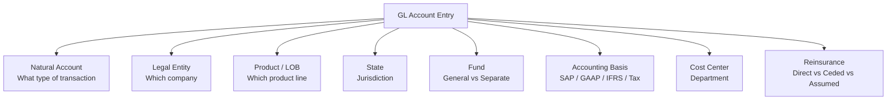
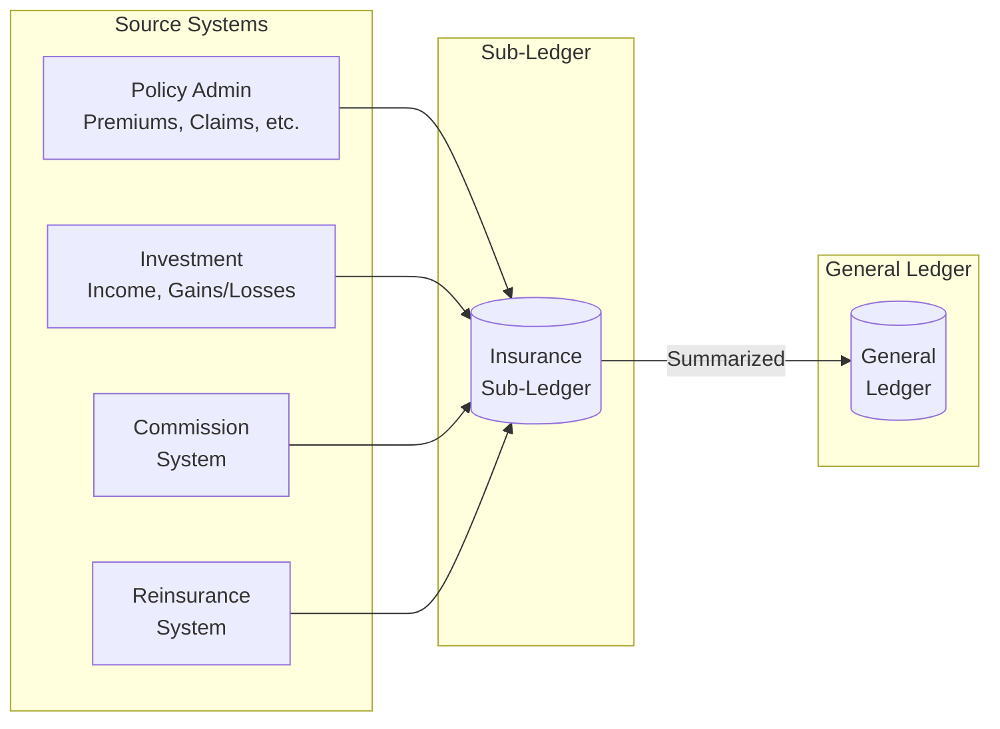
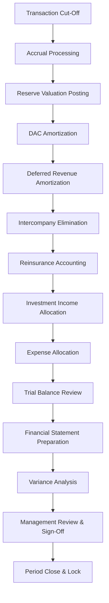
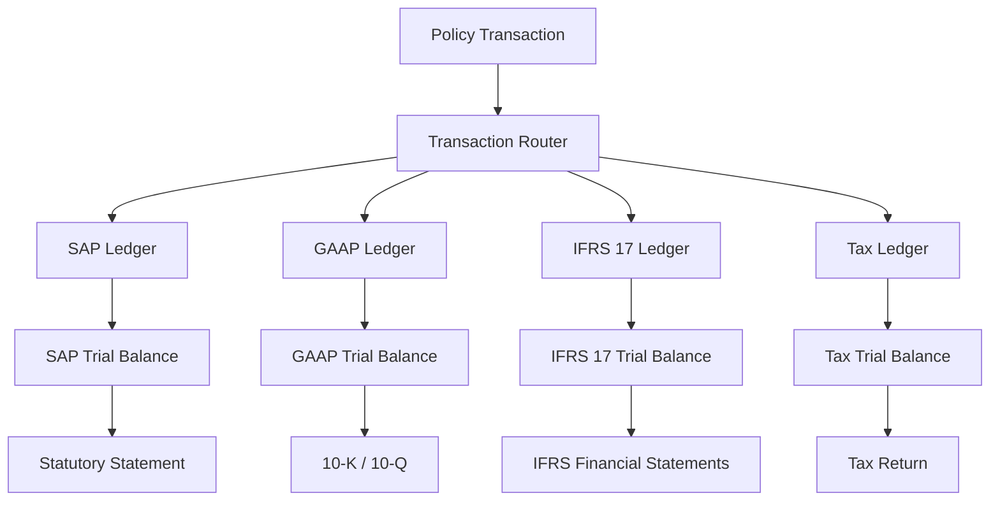
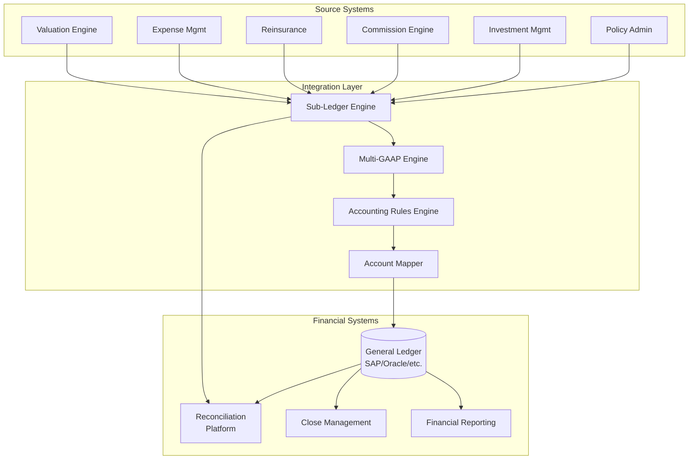
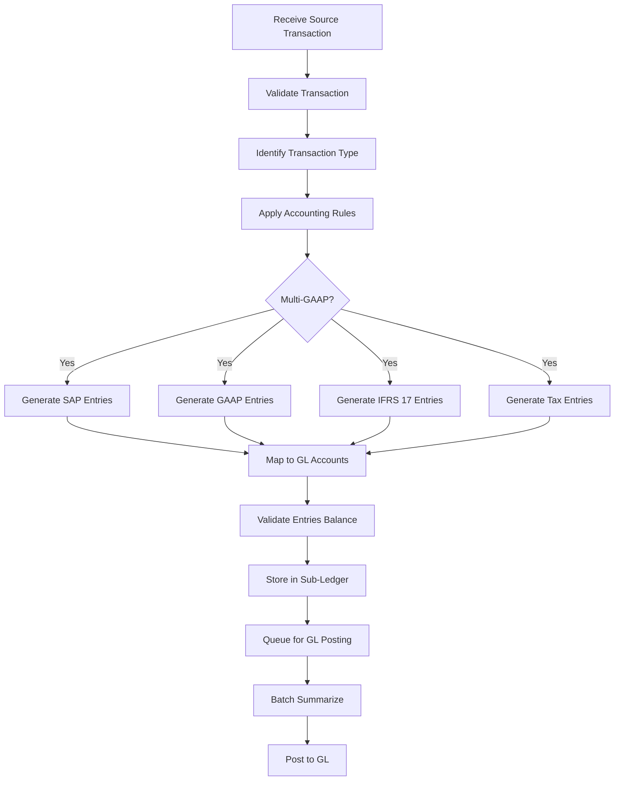
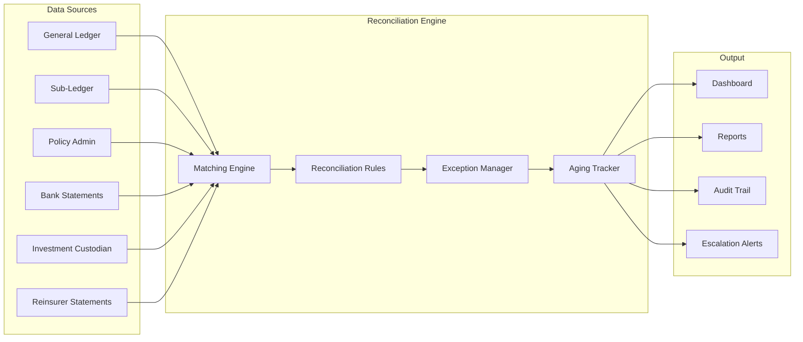
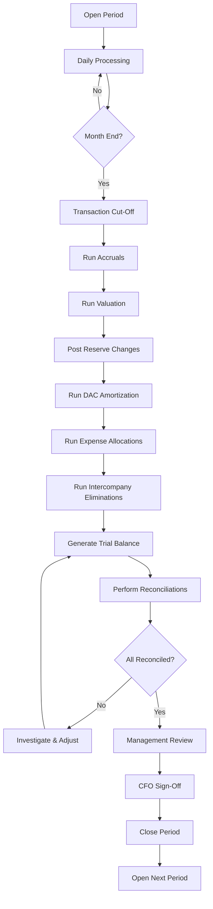
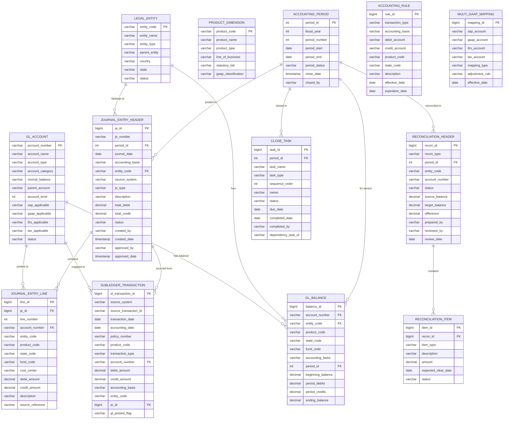

# Article 28: General Ledger Integration & Accounting

## Executive Summary

General ledger integration is the bridge between the policy-level operational world and the financial reporting world. A life insurance company's accounting is uniquely complex — it must maintain parallel books under Statutory Accounting Principles (SAP), US GAAP (including LDTI), and IFRS 17, each with fundamentally different recognition, measurement, and presentation rules. This article provides an exhaustive treatment of chart of accounts design, sub-ledger architecture, journal entry patterns for every major insurance transaction, monthly close processes, regulatory filings, multi-GAAP processing, tax accounting, and reconciliation frameworks. It is designed as a complete reference for solution architects building or integrating general ledger systems within a Life Insurance Policy Administration System ecosystem.

---

## Table of Contents

1. [Insurance Accounting Overview](#1-insurance-accounting-overview)
2. [Chart of Accounts](#2-chart-of-accounts)
3. [Sub-Ledger Architecture](#3-sub-ledger-architecture)
4. [Journal Entry Patterns](#4-journal-entry-patterns)
5. [Monthly/Quarterly Close Process](#5-monthlyquarterly-close-process)
6. [Statutory Annual Statement](#6-statutory-annual-statement)
7. [GAAP/IFRS Reporting](#7-gaapifrs-reporting)
8. [Multi-GAAP Processing](#8-multi-gaap-processing)
9. [Tax Accounting](#9-tax-accounting)
10. [Reconciliation](#10-reconciliation)
11. [Chart of Accounts Example](#11-chart-of-accounts-example)
12. [Journal Entry Templates](#12-journal-entry-templates)
13. [Architecture & System Design](#13-architecture--system-design)
14. [Data Model](#14-data-model)
15. [Glossary](#15-glossary)

---

## 1. Insurance Accounting Overview

### 1.1 Statutory Accounting Principles (SAP)

SAP is prescribed by the National Association of Insurance Commissioners (NAIC) through the Accounting Practices and Procedures Manual (AP&P Manual) and codified in NAIC Statements of Statutory Accounting Principles (SSAPs).

**Key SAP Characteristics:**

| Characteristic         | SAP Treatment                                                |
|------------------------|--------------------------------------------------------------|
| Primary objective      | Solvency — ability to pay policyholder claims                |
| Asset recognition      | Only "admitted" assets recognized on balance sheet            |
| Non-admitted assets    | Written off (furniture, equipment >50%, past-due receivables) |
| Reserve method         | Prescribed methods (CRVM, VM-20)                             |
| Acquisition costs      | Expensed immediately (no DAC)                                |
| Bond valuation         | Amortized cost (NAIC designation 1-2)                        |
| Equity valuation       | Fair value through surplus                                    |
| Income recognition     | Conservative — premium = earned when due                      |
| Reinsurance             | Immediate credit for ceded reserves                           |

### 1.2 US GAAP

US GAAP for insurance follows ASC 944 (Financial Services — Insurance), as amended by ASU 2018-12 (LDTI).

**Key GAAP Characteristics:**

| Characteristic         | GAAP Treatment                                               |
|------------------------|--------------------------------------------------------------|
| Primary objective      | Fair presentation of economic reality                        |
| Asset recognition      | All assets recognized (no admitted/non-admitted)             |
| Acquisition costs      | Capitalized as DAC and amortized                             |
| Reserve method         | Best estimate with margin (FAS 60) or account value (FAS 97)|
| Bond valuation         | AFS at fair value, HTM at amortized cost                     |
| Income recognition     | Revenue recognition per contract type                        |
| Reinsurance             | Asset/liability approach (no netting against reserves)       |

### 1.3 IFRS 17

IFRS 17 replaces IFRS 4 for insurance contract accounting internationally.

**Key IFRS 17 Characteristics:**

| Characteristic         | IFRS 17 Treatment                                            |
|------------------------|--------------------------------------------------------------|
| Primary objective      | Transparency and comparability                               |
| Measurement model      | Building Block Approach (BBA), VFA, or PAA                   |
| Unearned profit         | Contractual Service Margin (CSM)                             |
| Risk adjustment        | Explicit risk adjustment for non-financial risk              |
| Discount rate          | Market-consistent rate                                       |
| Revenue recognition    | Insurance revenue (not premiums) recognized as service provided|
| Acquisition costs      | Included in fulfillment cash flows (allocated to groups)     |

### 1.4 Key Differences Summary

| Item                    | SAP                  | GAAP                  | IFRS 17               |
|-------------------------|----------------------|-----------------------|------------------------|
| Balance Sheet Focus     | Solvency             | Economic value        | Economic value         |
| Reserves                | Prescribed           | Best estimate + PAD   | Fulfillment CFs + RA + CSM |
| DAC                     | No                   | Yes (simplified under LDTI) | In fulfillment CFs |
| Bond Valuation          | Amortized cost       | Fair value/amortized  | Fair value (FVOCI/FVTPL) |
| Revenue                 | Gross premium        | Net premium/Fee income| Insurance revenue      |
| Expense Recognition     | All FYC expensed Y1  | DAC amortized         | In fulfillment CFs     |
| Surplus/Equity Impact   | Conservative          | Moderate              | CSM smoothing          |
| Reinsurance             | Net of ceded          | Gross (separate A/L)  | Separate from direct   |

---

## 2. Chart of Accounts

### 2.1 Insurance-Specific Account Structure

Life insurance companies use a multi-dimensional chart of accounts to support reporting across multiple regulatory and management dimensions.

**Primary Account Segments:**

```
Account Number Structure:
  AAAA-BB-CCCC-DD-EE-FFF

Where:
  AAAA = Natural Account (4 digits)
  BB   = Legal Entity / Company Code (2 digits)
  CCCC = Product / Line of Business (4 digits)
  DD   = State (2 digits)
  EE   = Fund / Account Type (2 digits)
  FFF  = Cost Center / Department (3 digits)
```

### 2.2 Natural Account Numbering Convention

**Asset Accounts (1000–1999):**

| Range       | Category                          |
|-------------|-----------------------------------|
| 1000–1099   | Cash and Short-Term Investments   |
| 1100–1199   | Bonds                             |
| 1200–1299   | Stocks                            |
| 1300–1399   | Mortgage Loans                    |
| 1400–1499   | Real Estate                       |
| 1500–1599   | Policy Loans                      |
| 1600–1699   | Premiums Receivable               |
| 1700–1799   | Reinsurance Receivable            |
| 1800–1849   | Deferred Acquisition Costs (GAAP) |
| 1850–1899   | Other Assets                      |
| 1900–1999   | Separate Account Assets           |

**Liability Accounts (2000–2999):**

| Range       | Category                          |
|-------------|-----------------------------------|
| 2000–2099   | Aggregate Reserve — Life          |
| 2100–2199   | Aggregate Reserve — A&H           |
| 2200–2249   | Deposit-Type Contract Funds       |
| 2250–2299   | Contract Claims — Life            |
| 2300–2349   | Provision for Policyholder Dividends |
| 2350–2399   | Premiums Received in Advance      |
| 2400–2449   | Commission Payable                |
| 2450–2499   | General Expenses Payable          |
| 2500–2549   | Taxes Payable                     |
| 2550–2599   | Reinsurance Payable               |
| 2600–2649   | Borrowed Money                    |
| 2650–2699   | Interest Maintenance Reserve (IMR)|
| 2700–2749   | Asset Valuation Reserve (AVR)     |
| 2800–2899   | IFRS 17 CSM                       |
| 2900–2999   | Separate Account Liabilities      |

**Capital and Surplus (3000–3999):**

| Range       | Category                          |
|-------------|-----------------------------------|
| 3000–3099   | Common Capital Stock              |
| 3100–3199   | Preferred Stock                   |
| 3200–3299   | Paid-In Surplus                   |
| 3300–3399   | Retained Earnings / Unassigned Surplus |
| 3400–3499   | AOCI (GAAP) / Unrealized Gains    |
| 3500–3599   | Treasury Stock                    |

**Revenue Accounts (4000–4999):**

| Range       | Category                          |
|-------------|-----------------------------------|
| 4000–4099   | Life Premium Income               |
| 4100–4199   | A&H Premium Income                |
| 4200–4299   | Annuity Considerations            |
| 4300–4399   | Deposit-Type Contract Funds Received |
| 4400–4499   | Net Investment Income             |
| 4500–4549   | Realized Capital Gains / Losses   |
| 4550–4599   | Fee Income (M&E, Admin, Surrender) |
| 4600–4699   | Reinsurance Ceded Premium (contra)|
| 4700–4799   | Miscellaneous Income              |
| 4800–4899   | IFRS 17 Insurance Revenue         |

**Benefit and Expense Accounts (5000–8999):**

| Range       | Category                          |
|-------------|-----------------------------------|
| 5000–5099   | Death Benefits                    |
| 5100–5199   | Matured Endowments                |
| 5200–5249   | Surrender Benefits                |
| 5250–5299   | Interest on Policy Funds          |
| 5300–5399   | Policyholder Dividends            |
| 5400–5499   | Increase in Aggregate Reserves    |
| 5500–5599   | Commission Expense                |
| 5600–5699   | General Insurance Expense         |
| 5700–5799   | Taxes, Licenses, and Fees         |
| 5800–5899   | Reinsurance Ceded Benefits (contra)|
| 5900–5999   | DAC Amortization (GAAP)           |
| 6000–6099   | IFRS 17 Insurance Service Expense |

### 2.3 Dimensional Analysis



### 2.4 Multi-GAAP Account Mapping

Some accounts exist only under certain bases:

| Account                        | SAP | GAAP | IFRS 17 | Tax |
|--------------------------------|-----|------|---------|-----|
| DAC (1800)                     | —   | Yes  | —       | —   |
| Admitted Asset Adjustment      | Yes | —    | —       | —   |
| CSM Liability (2800)           | —   | —    | Yes     | —   |
| Asset Valuation Reserve (2700) | Yes | —    | —       | —   |
| Interest Maintenance Reserve (2650) | Yes | — | —    | —   |
| Shadow DAC (AOCI impact)       | —   | Yes  | —       | —   |
| Market Risk Benefit Liability  | —   | Yes  | —       | —   |
| Risk Adjustment Liability      | —   | —    | Yes     | —   |

---

## 3. Sub-Ledger Architecture

### 3.1 Sub-Ledger Concept

The sub-ledger contains policy-level transaction details that are summarized before posting to the general ledger.



### 3.2 Sub-Ledger Transaction Structure

```sql
CREATE TABLE insurance_subledger (
    transaction_id       BIGINT PRIMARY KEY,
    source_system        VARCHAR(20) NOT NULL,
    source_transaction_id VARCHAR(50) NOT NULL,
    transaction_date     DATE NOT NULL,
    accounting_date      DATE NOT NULL,
    policy_number        VARCHAR(20),
    product_code         VARCHAR(20),
    plan_code            VARCHAR(20),
    state_code           CHAR(2),
    transaction_type     VARCHAR(30) NOT NULL,
    transaction_subtype  VARCHAR(30),
    account_number       VARCHAR(30) NOT NULL,
    debit_amount         DECIMAL(15,2) DEFAULT 0,
    credit_amount        DECIMAL(15,2) DEFAULT 0,
    accounting_basis     VARCHAR(10) NOT NULL,
    legal_entity         VARCHAR(10) NOT NULL,
    fund_code            VARCHAR(10),
    cost_center          VARCHAR(10),
    reinsurance_flag     CHAR(1) DEFAULT 'D',
    description          VARCHAR(200),
    gl_batch_id          VARCHAR(30),
    gl_posted_flag       CHAR(1) DEFAULT 'N',
    gl_posted_date       TIMESTAMP,
    created_date         TIMESTAMP DEFAULT CURRENT_TIMESTAMP,
    created_by           VARCHAR(50)
);

CREATE INDEX idx_sl_accounting_date ON insurance_subledger(accounting_date);
CREATE INDEX idx_sl_policy ON insurance_subledger(policy_number);
CREATE INDEX idx_sl_gl_batch ON insurance_subledger(gl_batch_id);
```

### 3.3 Sub-Ledger to GL Summarization

```
Summarization Rules:
  1. Group by: Account Number + Legal Entity + Accounting Date + Accounting Basis
  2. Sum debits and credits within each group
  3. Generate one GL journal entry per group
  4. Maintain mapping back to sub-ledger detail for drill-down

Example:
  Sub-Ledger (500 premium transactions):
    Account 4000-01-TERM-IL, Debit = $0, Credit = $750,000 (total premiums)
    Account 1000-01-CASH-IL, Debit = $750,000, Credit = $0

  GL Entry:
    JE-2025-03-001:
    DR  1000-01-CASH-IL     $750,000
      CR  4000-01-TERM-IL              $750,000
    Description: "March 2025 - Term Premium Income - IL"
```

### 3.4 Reconciliation Between Sub-Ledger and GL

```
Daily Reconciliation:
  1. Sum all sub-ledger entries posted to GL for the day
  2. Compare to GL day's activity
  3. Identify any discrepancies
  
Monthly Reconciliation:
  1. Total sub-ledger balance by account
  2. Total GL balance by account
  3. Reconcile differences:
     - Timing (entries not yet posted)
     - Manual GL entries (not from sub-ledger)
     - Rounding differences
     - Allocation entries (not policy-level)
```

### 3.5 Audit Trail

Every sub-ledger entry must maintain a complete audit trail:

```
Audit Trail Chain:
  Policy Transaction (PAS) 
    → Sub-Ledger Entry 
      → GL Batch 
        → GL Journal Entry 
          → Trial Balance Line
            → Financial Statement Line

Full traceability from financial statement to individual policy transaction.
```

---

## 4. Journal Entry Patterns

### 4.1 Premium Received

**Scenario: Term Life Annual Premium $1,200 received in Illinois**

```
SAP Journal Entry:
  DR  Cash                                    $1,200.00
    CR  Life Premium Income                              $1,080.00
    CR  State Premium Tax Payable (IL 0.5%)                  $6.00
    CR  Federal Premium Tax (DAC Tax 7.7%)                  $92.40
    CR  Reinsurance Premium Ceded                           $21.60

  (Note: Under SAP, premium is 100% earned when due)

GAAP Journal Entry:
  DR  Cash                                    $1,200.00
    CR  Life Premium Income                              $1,200.00
  
  DR  DAC (Acquisition Cost Capitalization)     $660.00
    CR  Commission Expense                                 $660.00
  
  DR  Reinsurance Ceded Premium                   $21.60
    CR  Reinsurance Payable                                 $21.60
```

### 4.2 Policy Issued (Reserve Establishment)

**Scenario: Whole Life policy issued, Face $500,000, Initial Reserve $500**

```
SAP Journal Entry:
  DR  Increase in Aggregate Reserve — Life      $500.00
    CR  Aggregate Reserve for Life Policies                $500.00

GAAP (FAS 60) Journal Entry:
  DR  Benefit Reserve Expense                   $500.00
    CR  Liability for Future Policy Benefits               $500.00
  
  DR  Deferred Acquisition Cost               $2,750.00
    CR  Commission Expense                               $2,750.00

IFRS 17 (BBA) Journal Entry:
  DR  Insurance Contract Liability (Fulfillment CFs)  $500.00
  DR  Insurance Contract Liability (Risk Adj)          $150.00
    CR  Insurance Contract Liability (CSM)                 $650.00
    (CSM = plug to ensure no day-one gain)
```

### 4.3 Death Claim

**Scenario: Death benefit $500,000, Reserve released $85,000, Loan $20,000**

```
SAP Journal Entry:
  DR  Death Benefits Paid                    $480,000.00
  DR  Policy Loan — Offset                    $20,000.00
    CR  Cash (net benefit paid)                          $480,000.00
    CR  Policy Loans Receivable                           $20,000.00
  
  DR  Aggregate Reserve for Life Policies     $85,000.00
    CR  Decrease in Aggregate Reserve                     $85,000.00
  
  Reinsurance Recovery:
  DR  Reinsurance Receivable                  $50,000.00
    CR  Reinsurance Benefit Recovered                     $50,000.00

GAAP Journal Entry:
  DR  Policyholder Benefits — Death          $480,000.00
  DR  Policy Loan Write-Off                   $20,000.00
    CR  Cash                                             $480,000.00
    CR  Policy Loans Receivable                           $20,000.00
  
  DR  Liability for Future Policy Benefits    $85,000.00
    CR  Change in Reserves                                $85,000.00
  
  DR  DAC Amortization                           proportional write-off
    CR  DAC                                               proportional
```

### 4.4 Surrender

**Scenario: UL Surrender — Account Value $45,000, Surrender Charge $3,000, Loan $10,000**

```
Net Surrender Payout = AV - Surrender Charge - Loan = $45,000 - $3,000 - $10,000 = $32,000

SAP Journal Entry:
  DR  Surrender Benefits Paid                $32,000.00
  DR  Policy Loan — Offset                   $10,000.00
    CR  Cash                                             $32,000.00
    CR  Policy Loans Receivable                          $10,000.00
  
  DR  Aggregate Reserve for Life Policies    $45,000.00
    CR  Decrease in Aggregate Reserve                    $42,000.00
    CR  Surrender Charge Income                           $3,000.00

GAAP Journal Entry:
  DR  Surrender Benefits                     $32,000.00
  DR  Policy Loan Write-Off                  $10,000.00
    CR  Cash                                             $32,000.00
    CR  Policy Loans Receivable                          $10,000.00
  
  DR  Policyholder Account Balance Liability $45,000.00
    CR  Surrender Benefits                               $42,000.00
    CR  Surrender Charge Revenue                          $3,000.00
```

### 4.5 Commission Payment

**Scenario: FYC $2,750, Override $500**

```
SAP Journal Entry:
  DR  Commission Expense — FYC               $2,750.00
  DR  Commission Expense — Override            $500.00
    CR  Commission Payable                               $3,250.00

  (When paid):
  DR  Commission Payable                     $3,250.00
    CR  Cash                                             $3,250.00

GAAP Journal Entry:
  DR  Deferred Acquisition Cost              $2,750.00
  DR  Commission Expense — Override            $500.00
    CR  Commission Payable                               $3,250.00
```

### 4.6 Interest Credited (UL Product)

**Scenario: Monthly interest credited on UL account value of $100,000 at 4.2% annual**

```
Monthly Interest = $100,000 × 4.2% / 12 = $350.00

SAP Journal Entry:
  DR  Interest Credited to Policyholders       $350.00
    CR  Aggregate Reserve for Life Policies               $350.00

GAAP Journal Entry:
  DR  Interest Credited Expense                $350.00
    CR  Policyholder Account Balance                      $350.00
```

### 4.7 Fund Transfer (Variable Product)

**Scenario: Policyholder transfers $25,000 from Equity Fund to Bond Fund**

```
Journal Entry (both SAP and GAAP):
  DR  Separate Account — Bond Fund Sub-Account    $25,000.00
    CR  Separate Account — Equity Fund Sub-Account            $25,000.00

No P&L impact — balance sheet reclassification within separate account.
```

### 4.8 Policy Loan

**Scenario: Policy loan of $15,000 taken against WL policy**

```
SAP Journal Entry:
  DR  Policy Loans Receivable                $15,000.00
    CR  Cash                                             $15,000.00

Loan Interest Accrual (quarterly, 5% loan rate):
  DR  Accrued Loan Interest Receivable          $187.50
    CR  Net Investment Income — Policy Loans               $187.50

  ($15,000 × 5% / 4 = $187.50)
```

### 4.9 Dividend Declaration (Participating Policies)

**Scenario: Annual dividend of $500 declared, policyholder elects PUA**

```
SAP Journal Entry (Dividend Declaration):
  DR  Policyholder Dividends Expense           $500.00
    CR  Dividends Payable                                  $500.00

When Applied as PUA:
  DR  Dividends Payable                        $500.00
    CR  Aggregate Reserve — PUA                            $500.00
  
When Paid in Cash:
  DR  Dividends Payable                        $500.00
    CR  Cash                                               $500.00

When Left to Accumulate at Interest:
  DR  Dividends Payable                        $500.00
    CR  Dividend Accumulations Liability                   $500.00
```

### 4.10 Reinsurance Transaction

**Scenario: YRT (yearly renewable term) reinsurance, ceded amount $450,000**

```
Ceded Premium Entry:
  DR  Reinsurance Premium Ceded (contra revenue)  $810.00
    CR  Reinsurance Payable                                  $810.00

Ceded Reserve Entry:
  DR  Reinsurance Receivable (ceded reserve)    $4,500.00
    CR  Ceded Reserve Liability (contra)                   $4,500.00

Ceded Claim Entry (on death):
  DR  Reinsurance Receivable                  $450,000.00
    CR  Reinsurance Benefit Recovered (contra expense)   $450,000.00
```

---

## 5. Monthly/Quarterly Close Process

### 5.1 Close Process Overview



### 5.2 Transaction Cut-Off

```
Cut-Off Rules:
  1. All premium transactions through the last business day are included
  2. Claims: reported through month-end, even if not paid
  3. Commission: calculated on all eligible premium through cut-off
  4. Investment income: accrued through month-end
  5. Reinsurance: all ceded activity through month-end

Cut-Off Date: Last business day of the month
Processing Window: Business day 1–3 of following month
Close Date: Typically business day 8–10 of following month
```

### 5.3 Accrual Processing

```
Key Accruals:

1. Premium Accrual:
   - Earned but not yet received premiums (receivable)
   - Received but not yet earned premiums (advance premium)
   
2. Investment Income Accrual:
   - Bond coupon income earned but not received
   - Mortgage loan interest earned but not received
   - Policy loan interest earned but not received
   
3. Expense Accruals:
   - Commission payable (calculated but not paid)
   - Claim reserves (IBNR — incurred but not reported)
   - Operating expenses (invoiced but not paid)
   
4. Reserve Accruals:
   - Monthly change in statutory reserves
   - Monthly change in GAAP reserves
   - DAC amortization for the month
```

### 5.4 Reserve Valuation Posting

```
Reserve Change Journal Entry (Monthly):

Beginning of Month Reserve:   $500,000,000
End of Month Reserve:         $505,000,000
Reserve Increase:              $5,000,000

SAP Entry:
  DR  Increase in Aggregate Reserve          $5,000,000
    CR  Aggregate Reserve for Life Policies              $5,000,000

Components of Reserve Change:
  New business reserve:        +$2,000,000
  Interest on reserves:        +$1,500,000
  Change due to mortality:       +$500,000
  Reserve release (deaths):    -$1,000,000
  Reserve release (surrenders):-$1,500,000
  Reserve release (lapses):      -$500,000
  Assumption changes:          +$4,000,000
  Net Change:                  +$5,000,000
```

### 5.5 DAC Amortization (GAAP/LDTI)

```
Pre-LDTI (FAS 60 — Traditional):
  Amortization in proportion to premiums
  
  DAC Beginning Balance:  $50,000,000
  Amortization Factor:    Premium_month / PV(Expected Total Premiums)
  Monthly Amortization:   $50,000,000 × 0.5% = $250,000

  DR  DAC Amortization Expense               $250,000
    CR  Deferred Acquisition Cost                        $250,000

LDTI (Constant-Level Basis):
  DAC Beginning Balance:  $50,000,000
  Expected Contract Duration: 20 years
  Approximate Annual Amortization: $50,000,000 / 20 = $2,500,000
  Monthly Amortization: $2,500,000 / 12 = $208,333

  Adjusted for actual decrements:
  DR  DAC Amortization Expense               $215,000
    CR  Deferred Acquisition Cost                        $215,000
```

### 5.6 Intercompany Elimination

```
When a holding company has multiple insurance subsidiaries:

Company A issues policy, Company B provides reinsurance:
  Company A Books:
    DR  Reinsurance Premium Ceded     $10,000
      CR  Reinsurance Payable                   $10,000
  
  Company B Books:
    DR  Reinsurance Receivable        $10,000
      CR  Assumed Premium Income                $10,000
  
  Consolidated Elimination:
    DR  Assumed Premium Income        $10,000
      CR  Reinsurance Premium Ceded             $10,000
    DR  Reinsurance Payable           $10,000
      CR  Reinsurance Receivable                $10,000
```

### 5.7 Investment Income Allocation

```
Investment income must be allocated to product lines and funds:

Total Net Investment Income: $10,000,000

Allocation Method: Mean Reserve and Liabilities
  
  Product Line    Mean Reserve    % of Total    Allocated Income
  ──────────────────────────────────────────────────────────────
  Whole Life      $2,000,000,000  40.0%         $4,000,000
  Term Life         $500,000,000  10.0%         $1,000,000
  Universal Life  $1,500,000,000  30.0%         $3,000,000
  Annuity         $1,000,000,000  20.0%         $2,000,000
  ──────────────────────────────────────────────────────────────
  Total           $5,000,000,000  100.0%        $10,000,000
```

### 5.8 Expense Allocation

```
Operating expenses are allocated to product lines:

Allocation Bases:
  - Salaries: Time studies or headcount
  - Rent: Square footage by department
  - IT costs: Usage metrics (CPU time, transactions)
  - Policy maintenance: Per-policy count
  - Underwriting: Per-application count
  
Example:
  Total Operating Expenses: $5,000,000
  
  Expense Type     Basis           WL      Term    UL      Annuity
  ────────────────────────────────────────────────────────────────
  Maintenance      Policy count    35%     40%     15%     10%
  Underwriting     Applications    20%     50%     20%     10%
  Claims           Claim count     30%     25%     25%     20%
  IT               Transactions    25%     35%     25%     15%
```

### 5.9 Variance Analysis

```
Key Variance Categories:

1. Premium Variance:
   Actual Premium vs. Budget/Forecast
   By: Product, State, Distribution Channel

2. Claim Variance:
   Actual Claims vs. Expected (mortality/morbidity)
   By: Product, Cause of Death, Duration

3. Expense Variance:
   Actual Expenses vs. Budget
   By: Cost Center, Expense Type

4. Investment Variance:
   Actual Yield vs. Expected Yield
   Book Yield vs. Market Yield

5. Reserve Variance:
   Actual Reserve Change vs. Expected
   Analyze: New business, interest, mortality, lapse, assumption changes
```

---

## 6. Statutory Annual Statement

### 6.1 NAIC Annual Statement Structure

The NAIC Annual Statement (also called the "blue book" or "statutory blank") is the primary regulatory filing for insurance companies.

**Major Sections:**

| Section              | Content                                          |
|----------------------|--------------------------------------------------|
| Assets               | Admitted assets (bonds, stocks, loans, etc.)     |
| Liabilities          | Reserves, claims, taxes, other obligations       |
| Capital and Surplus  | Paid-in surplus, unassigned surplus              |
| Summary of Operations| Income statement equivalent                       |
| Cash Flow            | Cash flow statement                              |
| General Interrogatories | Company structure, operations questions        |

### 6.2 Key Exhibits and Schedules

**Exhibit of Life Insurance:**

```
Line  Item                                    Amount
────────────────────────────────────────────────────
1     Direct premiums                          $XXX,XXX,XXX
2     Reinsurance assumed                       $XX,XXX,XXX
3     Reinsurance ceded                        ($XX,XXX,XXX)
4     Net premiums                             $XXX,XXX,XXX
5     Death benefits                           ($XX,XXX,XXX)
6     Matured endowments                        ($X,XXX,XXX)
7     Surrender benefits                       ($XX,XXX,XXX)
8     Interest on policy funds                 ($XX,XXX,XXX)
9     Increase in aggregate reserves           ($XX,XXX,XXX)
10    Commissions                              ($XX,XXX,XXX)
11    General expenses                         ($XX,XXX,XXX)
12    Taxes, licenses, fees                     ($X,XXX,XXX)
13    Net gain from operations                  $XX,XXX,XXX
```

**Schedule S — Reinsurance:**

```
Part 1: Ceded
  By Reinsurer:
    Treaty ID, Reinsurer Name, Reserve Credit, Premium Ceded

Part 2: Assumed
  By Cedant:
    Treaty ID, Cedant Name, Reserve Assumed, Premium Assumed

Part 3: Unauthorized Reinsurance
  Credit for unauthorized reinsurer (collateral required)
```

**Schedule D — Investments (Bonds):**

```
Part 1: Bonds Owned
  CUSIP, Description, Par Value, Book Value, Market Value,
  NAIC Designation, Maturity Date, Coupon Rate

Part 2: Bonds Acquired
Part 3: Bonds Disposed
Part 4: Bond Valuation
Part 5: Stock Holdings
```

### 6.3 Analysis of Operations by Line of Business

```
                        Individual  Individual   Group      Group
                        Life        Annuity      Life       Annuity
────────────────────────────────────────────────────────────────────
Premiums               $100M       $150M        $50M       $200M
Net Investment Inc.     $40M        $60M         $15M       $80M
────────────────────────────────────────────────────────────────────
Death Benefits          ($30M)      ($5M)        ($15M)     ($10M)
Surrender Benefits      ($10M)      ($50M)       ($2M)      ($30M)
Interest Credited       ($15M)      ($40M)       ($5M)      ($60M)
Increase in Reserves    ($20M)      ($30M)       ($10M)     ($50M)
Commissions             ($15M)      ($20M)       ($5M)      ($15M)
General Expenses        ($10M)      ($15M)       ($5M)      ($20M)
Taxes                   ($5M)       ($8M)        ($2M)      ($10M)
────────────────────────────────────────────────────────────────────
Net Gain                $35M        $42M         $21M       $85M
```

### 6.4 Electronic Filing Requirements

```
NAIC Filing Requirements:
  Annual Statement: Filed by March 1 (following year)
  Quarterly Statements: Filed by May 15, August 15, November 15
  
  Format: XBRL (eXtensible Business Reporting Language)
  Filing System: NAIC Financial Data Repository
  
  Supporting Files:
  - Actuarial Opinion (signed by Appointed Actuary)
  - Actuarial Memorandum
  - Management Discussion & Analysis
  - Risk-Based Capital Report
  - PBR Actuarial Report (VM-31)
```

---

## 7. GAAP/IFRS Reporting

### 7.1 GAAP Income Statement Presentation (Post-LDTI)

```
ABC LIFE INSURANCE COMPANY
CONSOLIDATED STATEMENT OF OPERATIONS
For the Year Ended December 31, 2025

REVENUES
  Premiums                                           $350,000,000
  Fee income                                          $75,000,000
  Net investment income                              $200,000,000
  Net realized investment gains                       $10,000,000
  ──────────────────────────────────────────────────────────────
  Total revenues                                     $635,000,000

BENEFITS AND EXPENSES
  Policyholder benefits and claims                   $250,000,000
  Interest credited to policyholder accounts          $80,000,000
  Change in liability for future policy benefits      $30,000,000
  Change in market risk benefits                     ($5,000,000)
  DAC amortization                                    $25,000,000
  Other operating expenses                            $90,000,000
  Commission expense                                  $60,000,000
  ──────────────────────────────────────────────────────────────
  Total benefits and expenses                        $530,000,000

INCOME BEFORE TAX                                    $105,000,000
  Income tax expense                                  $22,050,000
  ──────────────────────────────────────────────────────────────
NET INCOME                                            $82,950,000

OTHER COMPREHENSIVE INCOME
  Unrealized gains on AFS securities                  $15,000,000
  Change in discount rate on LFPB (LDTI)             ($8,000,000)
  Change in instrument-specific credit risk (MRB)    ($2,000,000)
  ──────────────────────────────────────────────────────────────
TOTAL COMPREHENSIVE INCOME                            $87,950,000
```

### 7.2 GAAP Balance Sheet Presentation (Post-LDTI)

```
ABC LIFE INSURANCE COMPANY
CONSOLIDATED BALANCE SHEET
As of December 31, 2025

ASSETS
  Investments:
    Fixed maturity securities (AFS, at fair value)  $3,500,000,000
    Equity securities (at fair value)                 $200,000,000
    Mortgage loans                                    $500,000,000
    Policy loans                                      $150,000,000
    Other invested assets                             $100,000,000
  Cash and cash equivalents                           $250,000,000
  Premiums receivable                                  $50,000,000
  Reinsurance recoverable                             $300,000,000
  Deferred acquisition costs                          $400,000,000
  Separate account assets                           $2,000,000,000
  Other assets                                        $150,000,000
  ──────────────────────────────────────────────────────────────
  TOTAL ASSETS                                      $7,600,000,000

LIABILITIES
  Liability for future policy benefits              $2,500,000,000
  Policyholder account balances                     $1,200,000,000
  Market risk benefits (liability)                     $50,000,000
  Policyholder dividends payable                       $30,000,000
  Claims payable                                       $40,000,000
  Reinsurance payable                                  $80,000,000
  Separate account liabilities                      $2,000,000,000
  Deferred tax liability                              $100,000,000
  Other liabilities                                   $150,000,000
  ──────────────────────────────────────────────────────────────
  TOTAL LIABILITIES                                 $6,150,000,000

EQUITY
  Common stock                                         $50,000,000
  Additional paid-in capital                          $300,000,000
  Retained earnings                                   $950,000,000
  AOCI                                                $150,000,000
  ──────────────────────────────────────────────────────────────
  TOTAL EQUITY                                      $1,450,000,000
  
  TOTAL LIABILITIES AND EQUITY                      $7,600,000,000
```

### 7.3 LDTI-Specific Disclosures

```
Required LDTI Disclosures:

1. Liability for Future Policy Benefits (LFPB):
   - Rollforward of LFPB balance
   - Net premium ratio
   - Weighted-average duration
   - Discount rate impact (in AOCI)
   - Undiscounted and discounted expected future cash flows
   
2. Policyholder Account Balances:
   - Rollforward of account balance
   - Weighted-average crediting rates
   - Guaranteed minimum crediting rates
   - Cash surrender value vs. account balance
   
3. Market Risk Benefits:
   - Rollforward of MRB balance
   - Net amount at risk
   - Instrument-specific credit risk (in OCI)
   - Weighted-average attained age
   
4. DAC:
   - Rollforward of DAC balance by product
   - Amortization methodology
   - Expected remaining term
   
5. Separate Account:
   - Account value by fund type
   - Guarantee feature descriptions
```

### 7.4 IFRS 17 Income Statement Presentation

```
IFRS 17 INCOME STATEMENT (Insurance Revenue Approach)

Insurance Revenue                                    $400,000,000
  (Decomposed into: claims expected, expenses expected,
   risk adjustment release, CSM release, loss component release)

Insurance Service Expenses                          ($320,000,000)
  Claims incurred                                   ($250,000,000)
  Other insurance service expenses                   ($70,000,000)

Insurance Service Result                              $80,000,000

Insurance Finance Income (Expense)                   ($20,000,000)
  Interest accretion on insurance liabilities        ($25,000,000)
  Change in discount rates (in P&L or OCI)             $5,000,000

Investment Income                                    $200,000,000

Net Financial Result                                 $180,000,000

PROFIT BEFORE TAX                                    $260,000,000
```

---

## 8. Multi-GAAP Processing

### 8.1 Parallel Ledger Architecture



### 8.2 Multi-GAAP Transaction Routing

```
For each source transaction, the system must determine:
1. Which accounting bases apply (SAP, GAAP, IFRS, Tax)
2. What the journal entry looks like under each basis
3. Whether any basis-specific entries are needed

Example: Premium Received $1,000

SAP:
  DR Cash $1,000 / CR Premium Income $1,000
  DR Commission Expense $550 / CR Commission Payable $550
  DR Increase in Reserves $200 / CR Reserve Liability $200

GAAP (LDTI):
  DR Cash $1,000 / CR Premium Income $1,000
  DR DAC $550 / CR Commission Payable $550
  DR Benefit Expense $200 / CR LFPB $200

IFRS 17 (BBA):
  DR Cash $1,000 / CR Insurance Contract Liability $1,000
  (Premium goes directly against the liability — 
   insurance revenue is recognized differently, not by premium receipt)

Tax:
  DR Cash $1,000 / CR Premium Income $1,000
  DR Commission Expense $550 / CR Commission Payable $550
  DR Reserve Increase $200 / CR Tax Reserve Liability $200
```

### 8.3 Reconciliation Between Bases

```
SAP to GAAP Reconciliation:

SAP Net Income:                               $100,000,000

Adjustments:
  + DAC capitalization (new business)          +$25,000,000
  - DAC amortization                           -$20,000,000
  + Non-admitted asset restoration              +$5,000,000
  - Reserve method difference (GAAP > SAP)     -$8,000,000
  + IMR/AVR reversal                            +$3,000,000
  +/- Bond valuation (AFS vs amortized cost)   +$12,000,000
  - Deferred tax adjustment                     -$4,000,000
  +/- Reinsurance presentation                  $0 (same net)
  +/- Other GAAP adjustments                   -$3,000,000
  ──────────────────────────────────────────────────────────
GAAP Net Income:                              $110,000,000
```

---

## 9. Tax Accounting

### 9.1 Federal Income Tax for Life Insurance Companies

Life insurance companies are taxed under Subchapter L of the Internal Revenue Code (Sections 801–818).

**Key Tax Provisions:**

| Provision                    | IRC Section | Description                                   |
|------------------------------|-------------|-----------------------------------------------|
| Definition of life co.       | §816        | Must have >50% of reserves for life insurance |
| Life insurance reserves      | §807        | Tax-deductible reserve increase                |
| DAC Tax                      | §848        | Capitalization of specified policy acquisition costs |
| Policyholder surplus account | §815        | (Repealed for most purposes)                  |
| Small company deduction      | §806        | 60% of tentative LICTI for small companies     |
| Proration                    | §812        | Proration of dividends-received deduction      |
| Company share / policyholders' share | §812 | Split of income between company and policyholders |

### 9.2 DAC Tax (Section 848)

```
Section 848 requires capitalization of specified policy acquisition costs:

Specified Policy Acquisition Costs = Net Premiums × DAC Tax Rate

DAC Tax Rates:
  Annuity contracts:        1.75%
  Group life insurance:     2.05%
  Other life insurance:     7.70%

Example:
  Net Life Premiums:    $200,000,000
  DAC Tax Rate:         7.70%
  Capitalized Amount:   $200,000,000 × 7.70% = $15,400,000
  
  Amortized over 120 months (10 years) using straight-line:
  Annual Amortization: $15,400,000 / 10 = $1,540,000

Journal Entry:
  DR  Deferred Tax Asset (DAC Tax)    $15,400,000
    CR  Tax Expense Reduction                    $15,400,000
  
  Annual Amortization:
  DR  Tax Expense                      $1,540,000
    CR  Deferred Tax Asset (DAC Tax)              $1,540,000
```

### 9.3 Tax Reserve Computation

```
Tax Reserves are calculated differently from both SAP and GAAP:

For contracts issued before 2018:
  Tax Reserve = Greater of:
    a) Net surrender value
    b) Federally prescribed reserve
    c) Amount determined under 1984 DEFRA rules
    
  Federally Prescribed Reserve = CRVM reserve using:
    - Tax mortality (prevailing CSO table)
    - Tax interest (greater of prevailing rate or applicable federal rate)
    
  Tax Reserve Cap: SAP reserve (cannot exceed statutory reserve)

For contracts issued 2018+:
  Tax Reserve = SAP reserve methodology using prescribed tables
  (Tax Cuts and Jobs Act simplified the tax reserve calculation)
```

### 9.4 Life Insurance Company Taxable Income (LICTI)

```
Calculation of LICTI:

Gross Income:
  + Gross premiums                            $500,000,000
  + Net investment income                     $200,000,000
  + Net realized capital gains                 $10,000,000
  + Other income                                $5,000,000
  ─────────────────────────────────────────────────────────
  Total Gross Income:                         $715,000,000

Deductions:
  - Death benefits                           ($150,000,000)
  - Surrender benefits                        ($80,000,000)
  - Increase in reserves                      ($50,000,000)
  - Policyholder dividends                    ($20,000,000)
  - Operating expenses                       ($100,000,000)
  - Commissions                               ($60,000,000)
  - State premium taxes                        ($5,000,000)
  - DAC Tax amortization                      ($12,000,000)
  - Reinsurance ceded                         ($30,000,000)
  ─────────────────────────────────────────────────────────
  Total Deductions:                          ($507,000,000)

LICTI:                                        $208,000,000
  
Federal Tax (21%):                             $43,680,000
```

---

## 10. Reconciliation

### 10.1 Bank Reconciliation

```
Cash per Bank Statement:              $50,000,000
  + Deposits in transit:                $2,000,000
  - Outstanding checks:               ($3,500,000)
  +/- Bank errors:                             $0
  ──────────────────────────────────────────────
Adjusted Bank Balance:                 $48,500,000

Cash per GL:                           $49,000,000
  - Unrecorded bank charges:             ($25,000)
  + Unrecorded interest:                   $5,000
  - NSF checks:                         ($480,000)
  ──────────────────────────────────────────────
Adjusted Book Balance:                 $48,500,000  ✓ Reconciled
```

### 10.2 Investment Reconciliation

```
Reconciliation Points:
  1. Investment system balance vs. GL balance (by asset class)
  2. Custodian holdings vs. investment system
  3. Accrued income per investment system vs. GL
  4. Realized gains/losses per investment system vs. GL

Bond Portfolio Reconciliation:
  Investment System Par Value:     $3,000,000,000
  Investment System Book Value:    $2,985,000,000
  Investment System Market Value:  $3,050,000,000
  
  GL Bond Account Balance:         $2,985,000,000  ✓ Matches book value
  GL Unrealized Gain (AOCI):         $65,000,000  ✓ = Market - Book
```

### 10.3 Reinsurance Reconciliation

```
Reconciliation Between Cedant and Reinsurer:

Ceded Premiums per Cedant Books:     $30,000,000
Ceded Premiums per Reinsurer:        $29,850,000
Difference:                             $150,000

Investigation:
  - 3 policies coded with wrong treaty       $80,000
  - Timing: December premiums not processed  $70,000
  Total explained:                          $150,000  ✓

Ceded Reserves per Cedant:          $200,000,000
Ceded Reserves per Reinsurer:       $198,500,000
Difference:                           $1,500,000

Root Cause: Different valuation dates (cedant = Dec 31, reinsurer = Dec 28)
```

### 10.4 Reserve Reconciliation

```
Reserve Reconciliation (Statutory):

PAS Reserve (sum of seriatim policy reserves):  $2,500,000,000
Valuation System Reserve:                        $2,500,000,000  ✓

GL Reserve Balance:                              $2,500,000,000  ✓

Movement Reconciliation:
  BOY Reserve:                    $2,400,000,000
  + New business reserve:            $80,000,000
  + Interest on reserves:            $96,000,000
  + Net mortality/morbidity:          $4,000,000
  - Deaths reserve release:         ($50,000,000)
  - Surrenders reserve release:     ($40,000,000)
  - Lapses reserve release:         ($20,000,000)
  + Assumption changes:              $30,000,000
  ──────────────────────────────────────────────
  EOY Reserve:                    $2,500,000,000  ✓
```

### 10.5 Premium Reconciliation

```
PAS Premium Collected:              $500,000,000
GL Premium Income:                  $500,000,000  ✓

By Product:
  Whole Life:     $150M  ✓
  Term:           $120M  ✓
  UL:             $130M  ✓
  Annuity:        $100M  ✓
  Total:          $500M  ✓

By State:
  (Verified top 10 states, representing 80% of premium)
```

### 10.6 Policy Count Reconciliation

```
BOY In-Force:           1,000,000
+ New Issues:              85,000
- Deaths:                  (8,000)
- Surrenders:             (25,000)
- Lapses:                 (42,000)
- Maturities:              (2,000)
- Conversions Out:         (3,000)
+ Conversions In:           3,000
+ Reinstatements:           2,000
──────────────────────────────────
EOY In-Force:           1,010,000

PAS Count:              1,010,000  ✓
Valuation Count:        1,010,000  ✓
```

---

## 11. Chart of Accounts Example

### 11.1 Complete Life Insurance Chart of Accounts

```
ACCOUNT   DESCRIPTION                                    TYPE
────────────────────────────────────────────────────────────────

ASSETS
1000      Cash and Equivalents                           Asset
1010      Cash — Operating Account                       Asset
1020      Cash — Claims Account                          Asset
1030      Cash — Commission Account                      Asset
1050      Short-Term Investments                         Asset
1100      Bonds — US Government                          Asset
1110      Bonds — State & Municipal                      Asset
1120      Bonds — Corporate — Investment Grade           Asset
1130      Bonds — Corporate — Below Investment Grade     Asset
1140      Bonds — MBS / ABS                              Asset
1150      Bond Accrued Interest Receivable               Asset
1160      Bond Amortization (Premium/Discount)           Asset
1200      Common Stocks                                  Asset
1210      Preferred Stocks                               Asset
1300      Mortgage Loans — Commercial                    Asset
1310      Mortgage Loans — Residential                   Asset
1400      Real Estate — Occupied                         Asset
1410      Real Estate — Investment                       Asset
1500      Policy Loans                                   Asset
1510      Policy Loan Interest Receivable                Asset
1600      Premiums Due and Uncollected                   Asset
1610      Deferred Premiums                              Asset
1620      Premiums in Course of Collection               Asset
1700      Reinsurance Recoverable on Paid Claims         Asset
1710      Reinsurance Recoverable on Unpaid Claims       Asset
1720      Ceded Reserve Credit                           Asset
1730      Reinsurance Receivable — Current               Asset
1800      Deferred Acquisition Costs (GAAP only)         Asset
1810      DAC — Whole Life                               Asset
1820      DAC — Term Life                                Asset
1830      DAC — Universal Life                           Asset
1840      DAC — Annuity                                  Asset
1850      Value of Business Acquired (VOBA)              Asset
1860      Goodwill                                       Asset
1870      Software and Technology                        Asset
1880      Furniture and Equipment                        Asset
1890      Due from Affiliates                            Asset
1900      Separate Account Assets                        Asset

LIABILITIES
2000      Aggregate Reserve — Life (Ordinary)            Liability
2010      Reserve — Whole Life                           Liability
2020      Reserve — Term Life                            Liability
2030      Reserve — Universal Life                       Liability
2040      Reserve — Variable Universal Life              Liability
2050      Reserve — Indexed Universal Life               Liability
2060      Reserve — Annuity (Immediate)                  Liability
2070      Reserve — Annuity (Deferred)                   Liability
2080      Reserve — Variable Annuity (General Acct)      Liability
2090      Reserve — Supplementary Contracts              Liability
2100      Aggregate Reserve — A&H                        Liability
2200      Deposit-Type Contract Funds                    Liability
2250      Claim Liability — Life                         Liability
2260      Claim Liability — A&H                          Liability
2270      Claim Reserve — IBNR                           Liability
2300      Policyholder Dividend Accumulations            Liability
2310      Provision for Policyholder Dividends           Liability
2320      Dividend Payable                               Liability
2350      Premiums Received in Advance                   Liability
2400      Commission Payable                             Liability
2410      Commission Payable — FYC                       Liability
2420      Commission Payable — Renewal                   Liability
2430      Commission Payable — Override                  Liability
2440      Commission Payable — Bonus                     Liability
2450      General Expenses Payable                       Liability
2460      Accrued Salaries and Benefits                  Liability
2500      Federal Income Tax Payable                     Liability
2510      State Premium Tax Payable                      Liability
2520      Deferred Tax Liability                         Liability
2530      Guaranty Fund Assessment Payable               Liability
2550      Reinsurance Payable                            Liability
2600      Borrowed Money                                 Liability
2610      Surplus Notes                                  Liability
2650      Interest Maintenance Reserve (SAP)             Liability
2700      Asset Valuation Reserve (SAP)                  Liability
2800      IFRS 17 — CSM Liability                        Liability
2810      IFRS 17 — Risk Adjustment                      Liability
2820      IFRS 17 — Fulfillment Cash Flows               Liability
2850      LDTI — Market Risk Benefit Liability           Liability
2900      Separate Account Liabilities                   Liability

CAPITAL AND SURPLUS
3000      Common Capital Stock                           Equity
3100      Preferred Stock                                Equity
3200      Gross Paid-In and Contributed Surplus          Equity
3300      Unassigned Surplus (SAP)                       Equity
3310      Retained Earnings (GAAP)                       Equity
3400      AOCI — Unrealized Investment Gains             Equity
3410      AOCI — LDTI Discount Rate Effect               Equity
3420      AOCI — MRB Credit Risk                         Equity
3430      AOCI — Pension Adjustments                     Equity
3500      Treasury Stock                                 Equity

REVENUE
4000      Life Premium — First Year                      Revenue
4010      Life Premium — Renewal                         Revenue
4020      Life Premium — Single Premium                  Revenue
4050      Annuity Considerations                         Revenue
4060      Deposit-Type Funds Received                    Revenue
4100      A&H Premium                                    Revenue
4200      Reinsurance Assumed Premium                    Revenue
4300      Reinsurance Ceded Premium (contra)             Revenue
4400      Net Investment Income — Bonds                  Revenue
4410      Net Investment Income — Stocks                 Revenue
4420      Net Investment Income — Mortgage Loans         Revenue
4430      Net Investment Income — Policy Loans           Revenue
4440      Net Investment Income — Other                  Revenue
4450      Amortization of IMR                            Revenue
4500      Realized Capital Gains                         Revenue
4510      Realized Capital Losses                        Revenue
4550      Fee Income — M&E Charges                       Revenue
4560      Fee Income — Admin Charges                     Revenue
4570      Fee Income — Surrender Charges                 Revenue
4580      Fee Income — COI Charges                       Revenue
4600      IFRS 17 Insurance Revenue                      Revenue
4700      Miscellaneous Income                           Revenue

BENEFITS AND EXPENSES
5000      Death Benefits — Life                          Expense
5010      Death Benefits — AD&D                          Expense
5050      Matured Endowments                             Expense
5100      Annuity Benefits                               Expense
5150      Disability Benefits                            Expense
5200      Surrender Benefits — Life                      Expense
5210      Surrender Benefits — Annuity                   Expense
5250      Interest Credited — UL                         Expense
5260      Interest Credited — Annuity                    Expense
5270      Index Credits — IUL                            Expense
5300      Policyholder Dividends                         Expense
5350      Increase in Aggregate Reserve — Life           Expense
5360      Increase in Aggregate Reserve — Annuity        Expense
5370      Increase in Aggregate Reserve — A&H            Expense
5400      Reinsurance Ceded Benefits (contra)            Expense
5500      Commission Expense — FYC                       Expense
5510      Commission Expense — Renewal                   Expense
5520      Commission Expense — Override                  Expense
5530      Commission Expense — Trail                     Expense
5540      Commission Expense — Bonus                     Expense
5600      Salaries and Employee Benefits                 Expense
5610      Rent and Occupancy                             Expense
5620      Technology and Equipment                       Expense
5630      Professional Services (Legal, Audit)           Expense
5640      Printing and Postage                           Expense
5650      Travel and Entertainment                       Expense
5660      Advertising and Marketing                      Expense
5670      Depreciation and Amortization                  Expense
5700      State Premium Taxes                            Expense
5710      Federal Income Taxes                           Expense
5720      Guaranty Fund Assessments                      Expense
5730      State Licenses and Fees                        Expense
5800      Reinsurance Expense Allowance (contra)         Expense
5900      DAC Amortization                               Expense
5910      VOBA Amortization                              Expense
6000      IFRS 17 Insurance Service Expense              Expense
6010      IFRS 17 Insurance Finance Expense              Expense
```

---

## 12. Journal Entry Templates

### 12.1 Complete Templates for 15+ Transaction Types

**Template 1: First-Year Premium Receipt**
```
DR  1010  Cash — Operating                    $X,XXX.XX
  CR  4000  Life Premium — First Year                    $X,XXX.XX
  (CR  2350  Premiums Received in Advance     if paid ahead)
```

**Template 2: Renewal Premium Receipt**
```
DR  1010  Cash — Operating                    $X,XXX.XX
  CR  4010  Life Premium — Renewal                       $X,XXX.XX
```

**Template 3: Policy Issue — Reserve Establishment**
```
DR  5350  Increase in Aggregate Reserve       $X,XXX.XX
  CR  2010  Reserve — [Product Type]                     $X,XXX.XX
```

**Template 4: Death Claim Payment**
```
DR  5000  Death Benefits — Life             $XXX,XXX.XX
  CR  1010  Cash — Claims Account                      $XXX,XXX.XX
DR  2010  Reserve — [Product Type]          $XXX,XXX.XX
  CR  5350  Decrease in Aggregate Reserve              $XXX,XXX.XX
```

**Template 5: Surrender Payment**
```
DR  5200  Surrender Benefits — Life          $XX,XXX.XX
  CR  1010  Cash — Operating                            $XX,XXX.XX
DR  2010  Reserve — [Product Type]           $XX,XXX.XX
  CR  5350  Decrease in Aggregate Reserve               $XX,XXX.XX
  CR  4570  Fee Income — Surrender Charges               $X,XXX.XX
```

**Template 6: Commission — FYC**
```
DR  5500  Commission Expense — FYC            $X,XXX.XX
  CR  2410  Commission Payable — FYC                     $X,XXX.XX
```

**Template 7: Commission Payment**
```
DR  2400  Commission Payable                  $X,XXX.XX
  CR  1030  Cash — Commission Account                    $X,XXX.XX
```

**Template 8: Interest Credited (UL)**
```
DR  5250  Interest Credited — UL                $XXX.XX
  CR  2030  Reserve — Universal Life                       $XXX.XX
```

**Template 9: Policy Loan Issuance**
```
DR  1500  Policy Loans                       $XX,XXX.XX
  CR  1010  Cash — Operating                            $XX,XXX.XX
```

**Template 10: Policy Loan Interest Accrual**
```
DR  1510  Policy Loan Interest Receivable       $XXX.XX
  CR  4430  Net Investment Income — Policy Loans           $XXX.XX
```

**Template 11: Dividend Declaration (Cash)**
```
DR  5300  Policyholder Dividends                $XXX.XX
  CR  2320  Dividend Payable                               $XXX.XX

(When paid):
DR  2320  Dividend Payable                      $XXX.XX
  CR  1010  Cash — Operating                               $XXX.XX
```

**Template 12: Reinsurance Ceded Premium**
```
DR  4300  Reinsurance Ceded Premium (contra)  $XX,XXX.XX
  CR  2550  Reinsurance Payable                         $XX,XXX.XX
```

**Template 13: Reinsurance Claim Recovery**
```
DR  1700  Reinsurance Recoverable           $XXX,XXX.XX
  CR  5400  Reinsurance Ceded Benefits (contra)        $XXX,XXX.XX
```

**Template 14: Bond Interest Income Accrual**
```
DR  1150  Bond Accrued Interest Receivable    $XX,XXX.XX
  CR  4400  Net Investment Income — Bonds               $XX,XXX.XX
```

**Template 15: DAC Capitalization (GAAP)**
```
DR  1810  DAC — Whole Life                    $X,XXX.XX
  CR  5500  Commission Expense — FYC (reversal)          $X,XXX.XX
```

**Template 16: DAC Amortization (GAAP)**
```
DR  5900  DAC Amortization                    $X,XXX.XX
  CR  1810  DAC — Whole Life                              $X,XXX.XX
```

**Template 17: State Premium Tax Accrual**
```
DR  5700  State Premium Taxes                 $XX,XXX.XX
  CR  2510  State Premium Tax Payable                    $XX,XXX.XX
```

**Template 18: IMR Transfer (SAP — Bond Sale)**
```
DR  4500  Realized Capital Gains             $XXX,XXX.XX
  CR  2650  Interest Maintenance Reserve                $XXX,XXX.XX
(Interest-related realized gains go to IMR, not income)
```

---

## 13. Architecture & System Design

### 13.1 GL Integration Architecture



### 13.2 Sub-Ledger Engine Design



### 13.3 Reconciliation Platform Architecture



### 13.4 Close Management Workflow



### 13.5 Technology Stack

| Component            | Technology Options                           |
|----------------------|----------------------------------------------|
| General Ledger       | Oracle Financials, SAP S/4HANA, Workday, PeopleSoft |
| Sub-Ledger           | Custom built, Oracle Insurance, Sapiens      |
| Multi-GAAP Engine    | Custom, Aptitude IFRS 17 Engine, Moody's AXIS|
| Reconciliation       | BlackLine, Trintech, ReconArt, custom        |
| Close Management     | BlackLine, FloQast, custom                   |
| Reporting            | Oracle FCCS, SAP BPC, Workiva, Tableau       |
| Data Integration     | Informatica, MuleSoft, custom ETL            |
| Audit Trail          | Embedded in sub-ledger + GL                  |

### 13.6 Performance Requirements

| Process                      | Volume                   | Target SLA      |
|------------------------------|--------------------------|-----------------|
| Daily transaction posting    | 500K transactions/day    | < 2 hours       |
| Sub-ledger to GL summary     | 500K → 5K GL entries     | < 30 minutes    |
| Month-end reserve posting    | 1M policy reserves       | < 4 hours       |
| Multi-GAAP generation        | 4 bases × 5K entries     | < 1 hour        |
| Monthly reconciliation       | 20 reconciliation types  | < 2 days        |
| Trial balance generation     | All accounts             | < 15 minutes    |
| Financial close (total)      | Complete close cycle      | < 10 business days |

---

## 14. Data Model

### 14.1 GL Integration ERD



---

## 15. Glossary

| Term                        | Definition                                                                |
|-----------------------------|---------------------------------------------------------------------------|
| **SAP**                     | Statutory Accounting Principles — NAIC-prescribed accounting for insurers |
| **GAAP**                    | Generally Accepted Accounting Principles — US financial reporting         |
| **IFRS 17**                 | International Financial Reporting Standard for insurance contracts        |
| **LDTI**                    | Long-Duration Targeted Improvements (ASU 2018-12)                        |
| **Sub-Ledger**              | Detail-level transaction record summarized to the general ledger         |
| **DAC**                     | Deferred Acquisition Cost — capitalized first-year expenses under GAAP   |
| **CSM**                     | Contractual Service Margin — deferred profit under IFRS 17               |
| **IMR**                     | Interest Maintenance Reserve — SAP reserve for interest-related gains    |
| **AVR**                     | Asset Valuation Reserve — SAP reserve for credit-related investment risk  |
| **AOCI**                    | Accumulated Other Comprehensive Income                                    |
| **LFPB**                    | Liability for Future Policy Benefits (LDTI)                              |
| **MRB**                     | Market Risk Benefit (LDTI)                                                |
| **Trial Balance**           | List of all GL account balances for a period                             |
| **Intercompany Elimination**| Removal of transactions between affiliated entities in consolidation     |
| **NAIC**                    | National Association of Insurance Commissioners                           |
| **SSAP**                    | Statement of Statutory Accounting Principles                              |
| **FIRE System**             | IRS electronic filing system for information returns                     |
| **Section 848**             | IRC section requiring DAC tax capitalization                             |
| **LICTI**                   | Life Insurance Company Taxable Income                                     |
| **SVL**                     | Standard Valuation Law                                                    |

---

*Article 28 — General Ledger Integration & Accounting — Life Insurance PAS Encyclopedia*
*Version 1.0 — April 2025*
