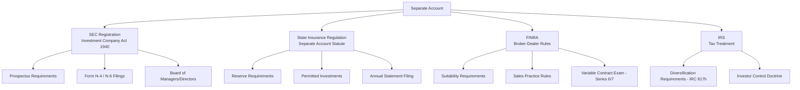
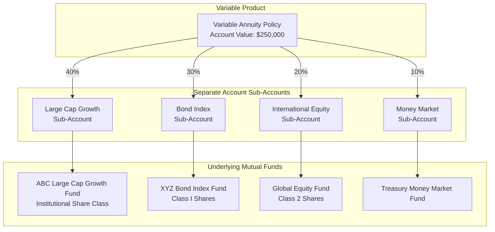
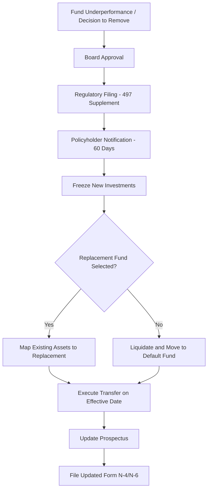
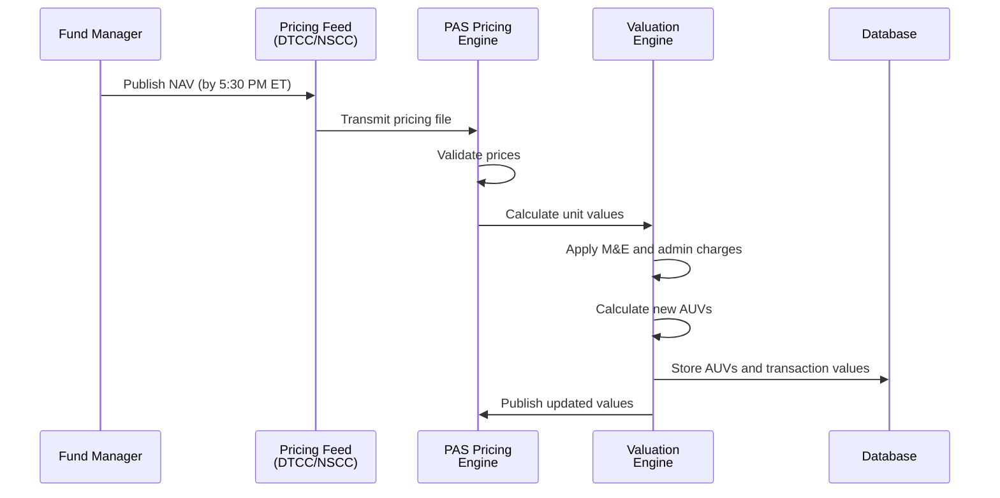
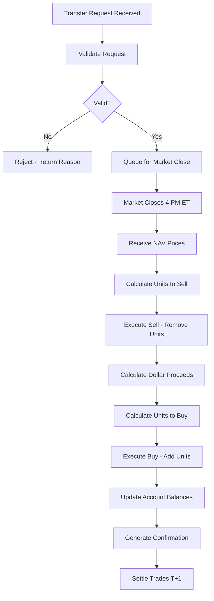
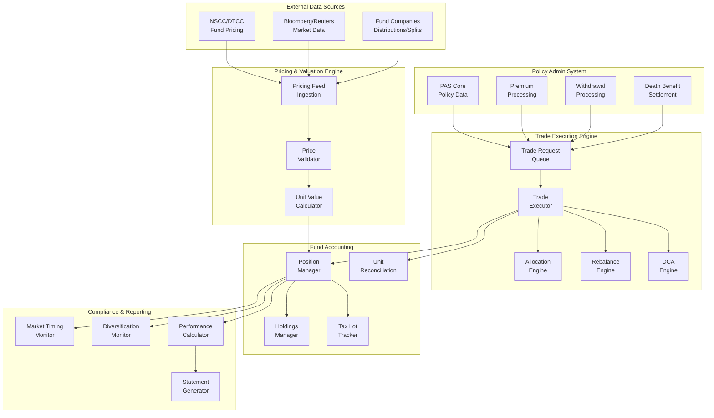
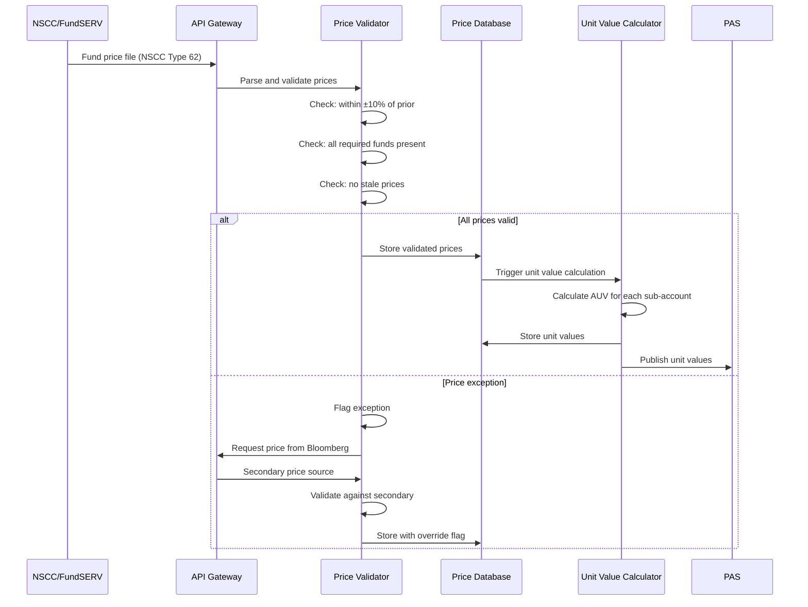
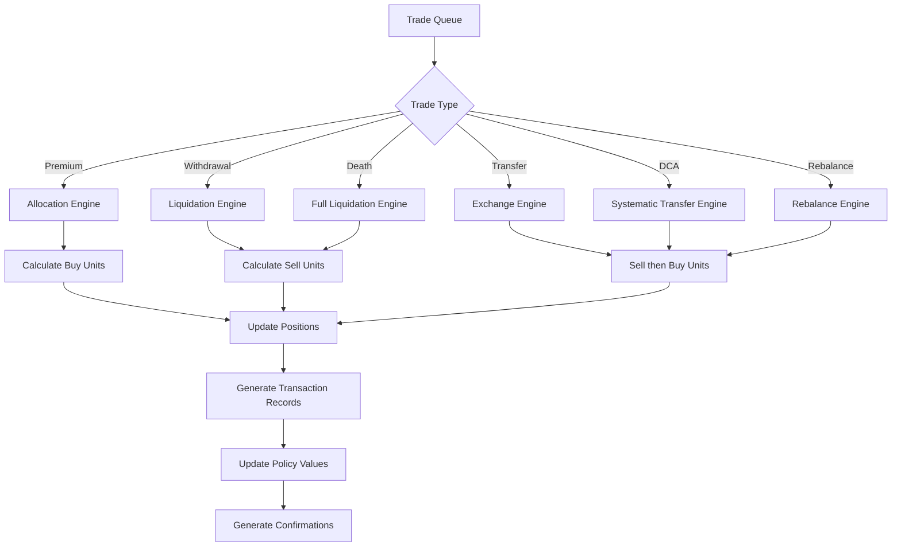
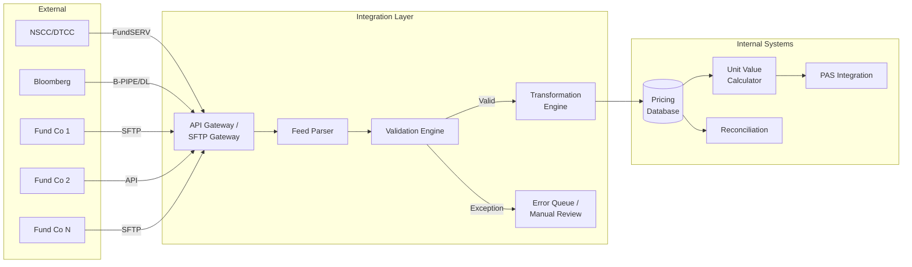

# Article 29: Investment Accounting for Variable Products

## Executive Summary

Variable insurance products — Variable Universal Life (VUL), Variable Annuities (VA), and Variable Life — occupy a unique intersection of insurance, securities, and investment management regulation. The separate account structure that underpins these products requires a fully integrated fund accounting engine capable of daily NAV computation, unit value management, fund transfer execution, and rigorous compliance with SEC, FINRA, and state insurance regulatory requirements. This article provides an exhaustive treatment of every dimension of investment accounting for variable products within a Life Insurance Policy Administration System (PAS), from the legal structure of separate accounts through daily valuation mechanics, fund transfer processing, tax lot tracking, and policyholder reporting.

---

## Table of Contents

1. [Separate Account Structure](#1-separate-account-structure)
2. [Fund Architecture](#2-fund-architecture)
3. [Unit Value Calculation](#3-unit-value-calculation)
4. [Daily Valuation Process](#4-daily-valuation-process)
5. [Fund Transfer Processing](#5-fund-transfer-processing)
6. [Dollar-Cost Averaging (DCA)](#6-dollar-cost-averaging-dca)
7. [Automatic Rebalancing](#7-automatic-rebalancing)
8. [Mortality & Expense (M&E) Charges](#8-mortality--expense-me-charges)
9. [Investment Income Allocation](#9-investment-income-allocation)
10. [Policyholder Reporting](#10-policyholder-reporting)
11. [Tax Lot Tracking](#11-tax-lot-tracking)
12. [Data Model](#12-data-model)
13. [Sample Daily Valuation Walkthrough](#13-sample-daily-valuation-walkthrough)
14. [Architecture & System Design](#14-architecture--system-design)
15. [Integration: External Data Feeds](#15-integration-external-data-feeds)
16. [Glossary](#16-glossary)

---

## 1. Separate Account Structure

### 1.1 Legal Structure

A separate account is a legally distinct pool of assets maintained by an insurance company that is segregated from the insurer's general account. The key legal characteristic is that separate account assets are insulated from the claims of the insurer's general creditors.

**Key Legal Properties:**

| Property                   | Description                                                    |
|----------------------------|----------------------------------------------------------------|
| Asset insulation           | Not available to general creditors of the insurer              |
| Policyholder ownership     | Assets are held for the exclusive benefit of variable contract holders |
| Pass-through taxation      | Investment gains/losses pass through to policyholder (for tax-qualified) |
| Multiple sub-accounts      | One separate account may contain multiple investment options    |
| General account backing    | Guaranteed benefits are backed by the general account           |
| SEC registration           | Separate account is registered as a unit investment trust or open-end management investment company |

### 1.2 Regulatory Framework



### 1.3 SEC Registration

**Registration Options:**

| Registration Type          | Form   | Applies To                          |
|----------------------------|--------|-------------------------------------|
| Unit Investment Trust (UIT)| N-4    | Variable annuity separate accounts  |
| Open-End Mgmt Company     | N-6    | Variable life separate accounts     |
| Underlying Funds           | N-1A   | Mutual funds used as sub-accounts   |

### 1.4 Prospectus Requirements

```
Variable Product Prospectus Must Include:
  1. Description of the separate account and sub-accounts
  2. Investment objectives and strategies for each sub-account
  3. Fee table (M&E charges, admin fees, fund expenses, surrender charges)
  4. Risk factors
  5. Tax consequences
  6. Death benefit description and guarantees
  7. Living benefit descriptions (GMWB, GMIB, etc.)
  8. Financial statements of the separate account
  9. Condensed financial information (unit value history)
  10. Performance data (average annual total returns)

Update Requirements:
  - Annual prospectus update (within 16 months of effective date)
  - 497 filing for material changes between updates
  - SAI (Statement of Additional Information) available upon request
```

### 1.5 Separate Account vs. General Account

```
                        General Account         Separate Account
────────────────────────────────────────────────────────────────
Investment Risk     Borne by insurer         Borne by policyholder
Regulatory Basis    Insurance regulation     Insurance + Securities
Asset Types         Bonds, mortgages         Mutual fund units
Valuation Freq.     Monthly/Quarterly        Daily
Creditor Access     Available to creditors   Insulated from creditors
Return to PH        Declared credited rate   Market performance
Income Tax          Company taxed            Pass-through (qualified)
Reporting           SAP/GAAP                 SAP/GAAP + SEC
Guarantee Reserve   N/A for separate acct    General account funded
```

---

## 2. Fund Architecture

### 2.1 Fund-of-Funds Structure

Most variable product separate accounts use a "fund-of-funds" structure where the separate account sub-accounts invest in shares of underlying registered mutual funds.



### 2.2 Sub-Account to Underlying Fund Mapping

```json
{
  "separate_account_id": "SA-2025-001",
  "sub_accounts": [
    {
      "sub_account_id": "SA-LCG-001",
      "sub_account_name": "Large Cap Growth",
      "underlying_fund": {
        "fund_id": "FUND-ABC-LCG",
        "fund_name": "ABC Large Cap Growth Fund",
        "share_class": "INSTITUTIONAL",
        "ticker": "ABCLX",
        "cusip": "000123456",
        "fund_family": "ABC Investment Management",
        "expense_ratio": 0.0065,
        "inception_date": "2010-03-15"
      },
      "status": "OPEN",
      "available_for_new_allocations": true,
      "minimum_allocation_pct": 0,
      "maximum_allocation_pct": 100,
      "asset_class": "DOMESTIC_EQUITY",
      "risk_category": "AGGRESSIVE_GROWTH",
      "morningstar_category": "Large Growth"
    },
    {
      "sub_account_id": "SA-BI-001",
      "sub_account_name": "Bond Index",
      "underlying_fund": {
        "fund_id": "FUND-XYZ-BI",
        "fund_name": "XYZ Total Bond Index Fund",
        "share_class": "CLASS_I",
        "ticker": "XYZBX",
        "cusip": "000789012",
        "fund_family": "XYZ Capital",
        "expense_ratio": 0.0020,
        "inception_date": "2008-07-01"
      },
      "status": "OPEN",
      "available_for_new_allocations": true,
      "asset_class": "FIXED_INCOME",
      "risk_category": "MODERATE"
    }
  ]
}
```

### 2.3 Fund Selection and Deselection

**Fund Selection Process:**

```
Selection Criteria:
  1. Investment performance (3, 5, 10-year returns)
  2. Risk-adjusted returns (Sharpe ratio, alpha)
  3. Fund family reputation and stability
  4. Expense ratio competitiveness
  5. Asset class coverage (fill gaps in lineup)
  6. SEC diversification compliance (IRC 817(h))
  7. Revenue sharing arrangements (12b-1 fees, sub-TA fees)
  8. Operational capabilities (daily pricing, NSCC connectivity)
```

**Fund Deselection / Removal Process:**



### 2.4 Fund Closure and Merger

```
Scenarios:
  1. Underlying Fund Merger:
     Fund A merges into Fund B
     → Sub-account units automatically converted to new fund
     → Unit value continuity maintained
     → Policyholder notification required
     
  2. Underlying Fund Liquidation:
     Fund ceases operations
     → Proceeds moved to designated replacement sub-account
     → Policyholder notification and right to redirect
     
  3. Substitute Fund Processing:
     Insurer replaces underlying fund with equivalent
     → SEC relief may be required (substitution order)
     → Policyholder notification
     → Historical unit values maintained in old sub-account
     → New unit value series begins for replacement
```

### 2.5 IRC 817(h) Diversification Requirements

```
Each sub-account must meet diversification tests:

Quarterly Test:
  No more than 55% in any single issuer
  No more than 70% in any two issuers
  No more than 80% in any three issuers
  No more than 90% in any four issuers

Look-Through Provision:
  If the sub-account invests in a regulated investment company (mutual fund),
  the diversification test is applied at the underlying fund level,
  not the sub-account level.

Investor Control Doctrine:
  Policyholders cannot have enough control over investment decisions
  to be treated as direct owners of the underlying assets.
  
  Safe harbors:
  - At least 20 sub-account options (with sufficiently different strategies)
  - No right to direct investment in specific securities
  - Insurer maintains legal ownership and control
```

---

## 3. Unit Value Calculation

### 3.1 Accumulation Unit Value (AUV)

During the accumulation phase, policyholder account values are tracked in accumulation units.

**Formula:**

```
AUV(t) = AUV(t-1) × (1 + Net Investment Return(t))

Where:
  Net Investment Return = (Gross Fund Return - Daily M&E - Daily Admin Fee)

Gross Fund Return = (Fund NAV(t) / Fund NAV(t-1)) - 1

Daily M&E = Annual M&E Rate / 365
Daily Admin = Annual Admin Fee / 365

Example:
  AUV(yesterday) = $12.345678
  Fund NAV(yesterday) = $25.50
  Fund NAV(today) = $25.75
  Annual M&E Rate = 1.25%
  Annual Admin Fee = 0.15%
  
  Gross Return = ($25.75 / $25.50) - 1 = 0.980392% (daily)
  Daily M&E = 1.25% / 365 = 0.003425%
  Daily Admin = 0.15% / 365 = 0.000411%
  Net Return = 0.980392% - 0.003425% - 0.000411% = 0.976556%
  
  AUV(today) = $12.345678 × (1 + 0.00976556) = $12.466230
```

### 3.2 Annuity Unit Value

During the payout (annuitization) phase of a variable annuity, annuity units are used:

**Formula:**

```
Annuity Unit Value(t) = AUV(t) / (1 + AIR)^(t/365)

Where:
  AIR = Assumed Investment Rate (typically 3.5% or 5%)
  t = days since annuitization

Monthly Annuity Payment = Number of Annuity Units × Annuity Unit Value

Example:
  Number of Annuity Units: 100
  AUV(today): $15.00
  AIR: 3.5%
  Days since annuitization: 365

  Annuity Unit Value = $15.00 / (1.035)^(365/365) = $15.00 / 1.035 = $14.4928
  Monthly Payment = 100 × $14.4928 = $1,449.28

  If fund earns more than AIR, payments increase.
  If fund earns less than AIR, payments decrease.
```

### 3.3 Unit Precision and Rounding

```
Precision Requirements:
  Unit Value:  6 decimal places ($12.345678)
  Units Owned: 6 decimal places (1,234.567890 units)
  NAV:         2 decimal places ($25.75)
  
Rounding Rules:
  Unit values: Round to 6 decimals (half-up)
  Dollar amounts: Round to 2 decimals (half-up)
  Units: Truncate to 6 decimals (floor) for sales
         Round up to 6 decimals (ceiling) for purchases
  
  This asymmetry protects the policyholder:
  When buying units (premium allocation), round UP the unit count
  When selling units (charge deductions), round DOWN the unit count
```

### 3.4 Unit Reconciliation

```
Daily Unit Reconciliation:

Total Units Outstanding = Σ (all policyholder unit balances)

Must equal:
  BOD Units Outstanding
  + Units purchased (premium allocations)
  + Units purchased (dividend reinvestment)
  - Units sold (charge deductions)
  - Units sold (withdrawals)
  - Units sold (death benefit)
  - Units sold (transfers out)
  + Units purchased (transfers in)
  = EOD Units Outstanding

Dollar Reconciliation:
  Total Sub-Account Value = Total Units × Current AUV
  Must reconcile to underlying fund shares × fund NAV
  
  Tolerance: $0.01 per policy (rounding tolerance)
```

---

## 4. Daily Valuation Process

### 4.1 Market Data Receipt



### 4.2 NAV Calculation Timeline

```
Market Close:          4:00 PM ET
Fund NAV Calculation:  4:00 – 5:30 PM ET
NAV Transmission:      5:30 – 6:00 PM ET (via NSCC/FundSERV)
Price Validation:      6:00 – 6:30 PM ET
Unit Value Calculation: 6:30 – 7:00 PM ET
Transaction Processing: 7:00 – 10:00 PM ET
  - Premium allocations
  - Charge deductions
  - Withdrawals
  - Transfers
  - Death benefit settlements
Reconciliation:        10:00 – 11:00 PM ET
Results Available:     11:00 PM ET (for next business day)
```

### 4.3 Trade Date vs. Settlement Date

```
Trade Date Accounting:
  The transaction is recorded and units are priced as of the trade date.
  
  Trade Date = Date the order is received in good order
  Settlement Date = Trade Date + 1 or 2 business days (T+1 or T+2)

Rules:
  - Orders received before market close (4:00 PM ET) → priced at that day's NAV
  - Orders received after market close → priced at next day's NAV
  - This is the "forward pricing" requirement under Rule 22c-1

Example:
  Order received: March 15, 2025 at 2:30 PM ET → Trade Date = March 15
  NAV used: March 15 closing NAV
  Settlement: March 17 (T+2)
  
  Order received: March 15, 2025 at 4:30 PM ET → Trade Date = March 16
  NAV used: March 16 closing NAV
  Settlement: March 18 (T+2)
```

### 4.4 Late Trade Handling

```
Late trades occur when:
  1. Trade order arrives after the processing cutoff
  2. System failure delays processing
  3. Manual override needed

Handling Rules:
  - If trade was received in good order before 4 PM ET but processed late:
    → Must be priced at the day it was received (not the processing day)
    → Requires retroactive unit value adjustment
    
  - If trade was received after 4 PM ET:
    → Must be priced at next business day NAV
    → Cannot be backdated
```

### 4.5 Pricing Error Correction (NAV Error)

```
NAV Error Detection:
  - Fund company reports corrected NAV
  - Insurance company discovers pricing discrepancy
  - Regulatory examination identifies error

Materiality Threshold:
  SEC guidance: 1 cent per share for mutual funds
  Insurance application: proportional impact on unit value

Correction Process:
  1. Identify affected trading days
  2. Recalculate unit values for all affected days
  3. Determine impact on each policyholder
  4. If policyholder was disadvantaged by > $X (typically $10-$25):
     a. Credit additional units to make policyholder whole
     b. Adjust account value
  5. File notification with SEC if material
  6. Document all corrections and rationale

Example:
  Fund NAV was reported as $25.75, corrected to $25.50
  AUV was calculated as $12.4662, should have been $12.4540
  
  Policyholder has 10,000 units:
    Overstated value: 10,000 × $12.4662 = $124,662
    Correct value:    10,000 × $12.4540 = $124,540
    Overstatement:    $122
    
  If policyholder redeemed during the error period:
    → Received too much → typically not recovered from policyholder
    → Insurer absorbs the loss
    
  If policyholder purchased during error period:
    → Received too few units → credit additional units
```

### 4.6 Swing Pricing

```
Swing pricing adjusts the NAV to protect existing shareholders from
the dilution effect of large fund flows:

Swing NAV = Base NAV ± Swing Factor

If net flows exceed threshold:
  Net Inflow  → NAV swung upward (new investors pay more)
  Net Outflow → NAV swung downward (redeeming investors get less)

Typical Swing Factor: 0.5% – 2.0% of NAV

Impact on Separate Account:
  The sub-account unit value reflects the swing-adjusted NAV.
  This is transparent to the policyholder in the unit value calculation.
```

---

## 5. Fund Transfer Processing

### 5.1 Transfer Request Types

| Transfer Type       | Description                                          |
|---------------------|------------------------------------------------------|
| Exchange            | Move value between sub-accounts (one-time)           |
| Systematic Transfer | Recurring transfer on a schedule                     |
| Rebalancing         | Restore target allocation percentages                |
| DCA Transfer        | Dollar-cost averaging from fixed account to variable |
| Forced Transfer     | Due to fund closure/merger/substitution              |
| Market Timing       | Frequent trading (restricted)                        |

### 5.2 Transfer Request Capture

```json
{
  "transfer_request_id": "XFER-2025-000045",
  "policy_number": "VA-2025-100001",
  "request_date": "2025-03-15",
  "request_time": "14:30:00",
  "request_type": "EXCHANGE",
  "requestor": "POLICYHOLDER",
  "transfer_details": [
    {
      "direction": "SELL",
      "sub_account_id": "SA-LCG-001",
      "amount_type": "PERCENTAGE",
      "amount_value": 50.00,
      "description": "Sell 50% of Large Cap Growth"
    },
    {
      "direction": "BUY",
      "sub_account_id": "SA-BI-001",
      "amount_type": "DOLLAR",
      "amount_value": null,
      "description": "Buy Bond Index with proceeds"
    }
  ],
  "effective_date": "2025-03-15",
  "status": "PENDING_VALIDATION"
}
```

### 5.3 Transfer Validation Rules

```
Validation Checks:

1. Frequency Limit:
   - Maximum 12 transfers per policy year (typical)
   - Maximum 1 transfer per sub-account per 30 days (market timing)
   - Configurable by product and sub-account

2. Minimum Amounts:
   - Minimum transfer amount: $250 or 5% of sub-account value
   - Minimum remaining balance: $100 per sub-account after transfer
   
3. Market Timing Detection:
   - Round-trip detection (sell then buy same fund within X days)
   - Excessive trading frequency (>4 transfers per quarter)
   - Pattern detection (consistently trading in same direction)
   
4. Sub-Account Availability:
   - Verify sub-account is open for transfers
   - Check for temporary trading suspension (fund halt)
   
5. Settlement Validation:
   - Ensure no pending unsettled trades in the sub-account
   - Verify sufficient settled balance for sale

6. Allocation Validation:
   - Transfer allocation must total 100% (for target allocation type)
   - Cannot create negative position
```

### 5.4 Transfer Execution



**Execution Calculation:**

```
Transfer: Move $50,000 from Large Cap Growth to Bond Index

Step 1: Calculate Units to Sell
  Large Cap Growth AUV: $15.234567
  Units to Sell = $50,000 / $15.234567 = 3,282.038756 units
  (Truncated to 6 decimals: 3,282.038756)

Step 2: Calculate Sell Proceeds
  Proceeds = 3,282.038756 × $15.234567 = $50,000.00
  (May have rounding difference of pennies)

Step 3: Calculate Units to Buy
  Bond Index AUV: $10.876543
  Units to Buy = $50,000.00 / $10.876543 = 4,597.126834 units
  (Rounded up to 6 decimals: 4,597.126834)

Step 4: Update Positions
  Large Cap Growth: Previous units - 3,282.038756
  Bond Index: Previous units + 4,597.126834
```

### 5.5 Transfer Confirmation

```
══════════════════════════════════════════════════════════════
  FUND TRANSFER CONFIRMATION
  
  Policy Number: VA-2025-100001
  Transfer Date:  March 15, 2025
  Request Type:   Exchange
══════════════════════════════════════════════════════════════

  FROM:  Large Cap Growth Sub-Account
         Units Sold:       3,282.038756
         Unit Value:       $15.234567
         Amount:           $50,000.00

  TO:    Bond Index Sub-Account
         Units Purchased:  4,597.126834
         Unit Value:       $10.876543
         Amount:           $50,000.00

══════════════════════════════════════════════════════════════
  UPDATED ACCOUNT SUMMARY
  
  Sub-Account         Units          Unit Value    Value
  ──────────────────────────────────────────────────────────
  Large Cap Growth    4,217.961244   $15.234567    $64,265.43
  Bond Index          9,597.126834   $10.876543    $104,375.29
  International Eq.   3,500.000000   $11.500000    $40,250.00
  Money Market        5,000.000000   $10.023456    $50,117.28
  ──────────────────────────────────────────────────────────
  Total Account Value                              $259,008.00
══════════════════════════════════════════════════════════════
```

### 5.6 Market Timing Prevention

```
Market Timing Policy Framework:

Detection Rules:
  Rule 1: More than 2 round-trip transactions in any sub-account 
          within a 60-day rolling window
  Rule 2: Transfer amount exceeds $25,000 AND reversal within 30 days
  Rule 3: Aggregate transfer volume exceeds $250,000 within a calendar quarter

Enforcement Actions:
  Level 1 (Warning):  Letter to policyholder about market timing policy
  Level 2 (Restriction): Limit to 1 transfer per quarter for 12 months
  Level 3 (Block):    Prohibit electronic/phone transfers; mail only
  Level 4 (Forced):   Move to money market; restrict to balanced funds

Monitoring:
  Daily report of high-frequency traders
  Weekly review of transfer patterns
  Quarterly compliance report to Board
```

---

## 6. Dollar-Cost Averaging (DCA)

### 6.1 DCA Program Setup

```json
{
  "dca_program_id": "DCA-2025-001234",
  "policy_number": "VA-2025-100001",
  "status": "ACTIVE",
  "setup_date": "2025-01-15",
  "source_fund": {
    "sub_account_id": "SA-MM-001",
    "sub_account_name": "Money Market",
    "initial_balance": 100000.00
  },
  "target_funds": [
    {
      "sub_account_id": "SA-LCG-001",
      "sub_account_name": "Large Cap Growth",
      "allocation_pct": 40
    },
    {
      "sub_account_id": "SA-BI-001",
      "sub_account_name": "Bond Index",
      "allocation_pct": 35
    },
    {
      "sub_account_id": "SA-INT-001",
      "sub_account_name": "International Equity",
      "allocation_pct": 25
    }
  ],
  "transfer_frequency": "MONTHLY",
  "transfer_day": 15,
  "transfer_amount": 10000.00,
  "number_of_transfers": 10,
  "transfers_completed": 2,
  "transfers_remaining": 8,
  "next_transfer_date": "2025-04-15",
  "termination_rules": {
    "auto_terminate_on_completion": true,
    "terminate_on_source_exhaustion": true,
    "minimum_source_balance": 500.00
  }
}
```

### 6.2 DCA Transfer Calculation

```
Monthly DCA Transfer: $10,000

Allocation:
  Large Cap Growth:   $10,000 × 40% = $4,000
  Bond Index:         $10,000 × 35% = $3,500
  International Eq.:  $10,000 × 25% = $2,500

Execution (March 15, 2025):
  
  SOURCE - Money Market:
    AUV: $10.023456
    Units Sold: $10,000 / $10.023456 = 997.659832 units
    Proceeds: $10,000.00
    
  TARGET - Large Cap Growth:
    AUV: $15.234567
    Units Purchased: $4,000 / $15.234567 = 262.563101 units
    
  TARGET - Bond Index:
    AUV: $10.876543
    Units Purchased: $3,500 / $10.876543 = 321.798878 units
    
  TARGET - International Equity:
    AUV: $11.500000
    Units Purchased: $2,500 / $11.500000 = 217.391304 units

After 10 months, all $100,000 is transferred from Money Market
to the three target funds at varying prices (dollar-cost averaged).
```

### 6.3 DCA Termination Rules

| Condition                        | Action                              |
|----------------------------------|-------------------------------------|
| All scheduled transfers complete | Automatically terminate program     |
| Source fund balance insufficient | Partial transfer + notification     |
| Source fund balance = $0         | Terminate program                   |
| Policyholder requests stop       | Terminate on request date           |
| Policy surrendered               | Terminate immediately               |
| Fund closure (source or target)  | Terminate + notification            |
| Market timing violation          | May suspend DCA                     |

### 6.4 DCA Interaction with Market Timing

```
Special DCA Rules:
  - Systematic DCA transfers are generally exempt from market timing limits
  - However, manual DCA modifications (changing target funds) may count
  - Increasing DCA amount by >100% may trigger review
  - DCA from variable to variable (not from fixed/MM) may be restricted

Compliance Note:
  Carriers must document that DCA transfers are truly systematic 
  (pre-established program) and not being used to circumvent 
  market timing restrictions.
```

---

## 7. Automatic Rebalancing

### 7.1 Target Allocation Definition

```json
{
  "rebalance_program_id": "REB-2025-005678",
  "policy_number": "VA-2025-100001",
  "status": "ACTIVE",
  "target_allocation": [
    {
      "sub_account_id": "SA-LCG-001",
      "sub_account_name": "Large Cap Growth",
      "target_pct": 40.00
    },
    {
      "sub_account_id": "SA-BI-001",
      "sub_account_name": "Bond Index",
      "target_pct": 30.00
    },
    {
      "sub_account_id": "SA-INT-001",
      "sub_account_name": "International Equity",
      "target_pct": 20.00
    },
    {
      "sub_account_id": "SA-MM-001",
      "sub_account_name": "Money Market",
      "target_pct": 10.00
    }
  ],
  "rebalance_frequency": "QUARTERLY",
  "tolerance_band_pct": 5.00,
  "next_rebalance_date": "2025-04-01",
  "rebalance_method": "PERCENTAGE_OF_ACCOUNT"
}
```

### 7.2 Rebalancing Execution

```
Current Allocation (before rebalancing):
  
  Sub-Account         Value        Current %   Target %   Drift
  ──────────────────────────────────────────────────────────────
  Large Cap Growth    $120,000     48.0%       40.0%      +8.0%
  Bond Index          $65,000      26.0%       30.0%      -4.0%
  International Eq.   $45,000      18.0%       20.0%      -2.0%
  Money Market        $20,000       8.0%       10.0%      -2.0%
  ──────────────────────────────────────────────────────────────
  Total               $250,000     100.0%      100.0%

Rebalancing Trades:
  Target Values:
    Large Cap Growth:   $250,000 × 40% = $100,000  → SELL $20,000
    Bond Index:         $250,000 × 30% = $75,000   → BUY  $10,000
    International Eq.:  $250,000 × 20% = $50,000   → BUY  $5,000
    Money Market:       $250,000 × 10% = $25,000   → BUY  $5,000

After Rebalancing:
  Sub-Account         Value        Current %   Target %
  ──────────────────────────────────────────────────────
  Large Cap Growth    $100,000     40.0%       40.0%   ✓
  Bond Index          $75,000      30.0%       30.0%   ✓
  International Eq.   $50,000      20.0%       20.0%   ✓
  Money Market        $25,000      10.0%       10.0%   ✓
```

### 7.3 Tolerance Bands

```
Tolerance Band Logic:
  Rebalancing is triggered ONLY if drift exceeds the tolerance:
  
  If tolerance = 5%:
    Large Cap target = 40%, trigger range = 35% – 45%
    If actual is 43% → within tolerance, no rebalance
    If actual is 48% → outside tolerance, trigger rebalance
    
  Tolerance Types:
    Absolute: ±5 percentage points from target
    Relative: ±12.5% of target (e.g., 40% ± 5% = 35%–45%)
    
  If tolerance-based:
    Only execute rebalance if at least one sub-account breaches tolerance
    When triggered, rebalance ALL sub-accounts to target
```

### 7.4 Tax Implications for Non-Qualified Contracts

```
For non-qualified (after-tax) variable annuities:
  - Rebalancing inside the annuity contract does NOT trigger a taxable event
  - Tax deferral is maintained on all investment gains
  - This is a key advantage of variable annuities over taxable accounts

For non-qualified variable life:
  - Similar tax-deferred treatment inside the contract
  - No taxable event on internal rebalancing

Tax impact only occurs on:
  - Partial withdrawal (gain portion is taxable)
  - Full surrender (gain portion is taxable)
  - Death benefit (varies by product type)
  - 1035 exchange (tax-free if done properly)
```

---

## 8. Mortality & Expense (M&E) Charges

### 8.1 Daily M&E Deduction Calculation

M&E charges are the primary revenue source for the insurance company from variable products.

```
Daily M&E Charge = Sub-Account Value × (Annual M&E Rate / 365)

Components of M&E:
  Mortality Risk Charge:  Covers the cost of GMDB and other death benefit guarantees
  Expense Risk Charge:    Covers the risk that expenses exceed charges
  Administration Charge:  Covers ongoing administrative costs
  
  Combined M&E may range from 0.50% to 1.90% annually

Example:
  Sub-Account Value: $250,000
  Annual M&E Rate: 1.25% (125 basis points)
  Daily M&E: $250,000 × 1.25% / 365 = $8.5616

  The M&E is deducted through the unit value calculation:
  AUV(today) = AUV(yesterday) × (1 + Gross Return - Daily M&E Rate - Daily Admin Rate)
  
  This means M&E is NOT directly deducted from the account value.
  It is embedded in the unit value, reducing the unit value relative
  to the underlying fund's gross performance.
```

### 8.2 M&E Rate Tiers

Some products offer lower M&E for higher account values:

| Account Value Band    | Base M&E | Admin Fee | Total Annual Charge |
|-----------------------|----------|-----------|---------------------|
| $0 – $100,000        | 1.25%    | 0.15%     | 1.40%               |
| $100,001 – $500,000  | 1.10%    | 0.15%     | 1.25%               |
| $500,001 – $1,000,000| 0.95%    | 0.10%     | 1.05%               |
| $1,000,001+          | 0.80%    | 0.10%     | 0.90%               |

### 8.3 Enhanced Death Benefit M&E

Products with enhanced death benefits (ratchet, roll-up) charge additional M&E:

```
Base M&E:                      1.25%
Enhanced GMDB Charge:          +0.25% (for ratchet GMDB)
GMWB Living Benefit Charge:    +0.75% (for lifetime withdrawal guarantee)
Total M&E + Benefit Charges:    2.25%

Daily Charge = Account Value × 2.25% / 365 = $15.4110 (on $250K)
```

### 8.4 Revenue Sharing

```
Revenue Flow from Variable Product:

Policyholder pays (embedded in unit value):
  M&E Charge:     1.25%  → To insurance company (general account)
  Admin Charge:    0.15%  → To insurance company
  Fund Expense:    0.65%  → To fund manager
  
Of the Fund Expense:
  Management Fee:  0.45%  → To fund manager
  12b-1 Fee:       0.15%  → Shared with insurance company / distributor
  Sub-TA Fee:      0.05%  → To insurance company (for recordkeeping)
  
Total cost to policyholder: 2.05% (all-in annual cost)
Total revenue to insurer:   1.25% + 0.15% + 0.15% + 0.05% = 1.60%
Total revenue to fund mgr:  0.65% - 0.20% (shared) = 0.45%
```

---

## 9. Investment Income Allocation

### 9.1 Dividend Income

```
When an underlying fund declares a dividend:

Fund Dividend: $0.25 per share
Shares held by sub-account: 500,000
Total Dividend: $0.25 × 500,000 = $125,000

Reinvestment:
  The dividend is automatically reinvested in additional fund shares
  Fund NAV on ex-date: $25.00
  Additional shares: $125,000 / $25.00 = 5,000 shares
  
Impact on Unit Value:
  The unit value is NOT directly affected by the dividend because:
  1. The fund NAV drops by the dividend amount on ex-date
  2. The reinvested shares offset the NAV drop
  3. Net effect on sub-account value = $0
  
  However, if the AUV is calculated using "price + reinvestment":
  Gross Return = (NAV_today + Dividend_per_share) / NAV_yesterday - 1
  This captures the total return including the dividend.
```

### 9.2 Capital Gains Distribution

```
When an underlying fund declares a capital gains distribution:

Short-Term Capital Gain: $0.10 per share
Long-Term Capital Gain:  $0.50 per share
Total Distribution:      $0.60 per share

Shares held: 500,000
Total Distribution: $0.60 × 500,000 = $300,000

Reinvestment: Same as dividends — reinvested in additional shares

Tax Treatment:
  Inside qualified annuity (IRA, 401k): Tax-deferred
  Inside non-qualified annuity: Tax-deferred (all gains taxed as ordinary on withdrawal)
  Inside variable life: Tax-free (if policy remains in force)
```

### 9.3 Income Allocation to Individual Contracts

```
Income is allocated to individual contracts through the unit value mechanism:

Total Sub-Account Units Outstanding: 1,000,000 units
Sub-Account Total Value: $15,000,000
AUV: $15.000000

Policyholder A: 10,000 units = $150,000 (1% of total)
Policyholder B: 50,000 units = $750,000 (5% of total)

When fund earns income:
  The AUV increases proportionally for all unit holders
  Each policyholder's share of income = their % of units × total income
  
  If total daily net return = 0.05% (after M&E):
  AUV(new) = $15.000000 × 1.0005 = $15.007500
  
  PH A value: 10,000 × $15.007500 = $150,075.00 (gained $75)
  PH B value: 50,000 × $15.007500 = $750,375.00 (gained $375)
```

### 9.4 Reinvestment Processing

```
Reinvestment is handled at the sub-account level, not the individual policy level:

Daily Process:
  1. Receive fund distribution notice (dividend, capital gain)
  2. Calculate total distribution for sub-account
  3. Reinvest at fund NAV (purchase additional fund shares)
  4. Adjust total fund shares held by sub-account
  5. Calculate new AUV reflecting total return
  6. Individual policies do NOT receive additional units
     (their existing units simply increase in value via AUV)

This is different from a retail mutual fund account where
the investor receives additional shares on reinvestment.
In a separate account, the reinvestment is captured in the
unit value, not in additional units.
```

---

## 10. Policyholder Reporting

### 10.1 Fund Performance Reporting

```
FUND PERFORMANCE REPORT — As of March 31, 2025

Sub-Account                1 Month   3 Month   YTD      1 Year   3 Year*  5 Year*
────────────────────────────────────────────────────────────────────────────────────
Large Cap Growth           +2.15%    +5.43%    +5.43%   +18.72%  +12.45%  +15.23%
Bond Index                 -0.30%    +1.20%    +1.20%   +4.50%   +2.85%   +3.12%
International Equity       +1.85%    +4.20%    +4.20%   +14.30%  +8.90%   +10.45%
Money Market               +0.35%    +1.10%    +1.10%   +4.50%   +3.20%   +2.05%
────────────────────────────────────────────────────────────────────────────────────
* Annualized returns

Returns shown are NET of all charges (M&E, admin, fund expenses).
Past performance does not guarantee future results.
```

### 10.2 Benchmark Comparison

```
BENCHMARK COMPARISON — Trailing 1 Year (as of 3/31/2025)

Sub-Account           Return    Benchmark                  Benchmark Return   Difference
──────────────────────────────────────────────────────────────────────────────────────────
Large Cap Growth      +18.72%   S&P 500                    +20.15%            -1.43%
Bond Index            +4.50%    Bloomberg US Aggregate     +5.10%             -0.60%
International Equity  +14.30%   MSCI EAFE                  +15.80%            -1.50%
Money Market          +4.50%    Lipper Money Market Avg    +4.55%             -0.05%

Note: Underperformance relative to benchmark is primarily due to M&E and 
administrative charges (1.40% annually) deducted from the sub-account returns.
Underlying fund performance before insurance charges closely tracks benchmarks.
```

### 10.3 Quarterly/Annual Statement

```
═══════════════════════════════════════════════════════════════════════
  VARIABLE ANNUITY QUARTERLY STATEMENT
  
  Policy Number:    VA-2025-100001
  Owner:            Jane M. Doe
  Annuitant:        Jane M. Doe
  Statement Period: January 1 – March 31, 2025
═══════════════════════════════════════════════════════════════════════

  ACCOUNT SUMMARY
  ─────────────────────────────────────────────────────────────────
  Beginning Account Value (01/01/2025):          $235,000.00
  
  Premiums:                                        $5,000.00
  Transfers In:                                        $0.00
  Transfers Out:                                       $0.00
  Withdrawals:                                         $0.00
  Benefit Charges (GMWB):                           ($441.38)
  Investment Gain/Loss:                            $14,441.38
  
  Ending Account Value (03/31/2025):             $254,000.00
  ─────────────────────────────────────────────────────────────────

  ACCOUNT DETAIL BY SUB-ACCOUNT
  ─────────────────────────────────────────────────────────────────
                      Beg Value   Premiums  Inv G/L  End Value   %
  Large Cap Growth    $94,000     $2,000    $6,520   $102,520   40.4%
  Bond Index          $70,500     $1,500    $936     $72,936    28.7%
  International Eq.   $47,000     $1,000    $3,225   $51,225    20.2%
  Money Market        $23,500     $500      $760     $24,760    9.7%
  Fixed Account       $0          $0        $0       $2,559     1.0%
  ─────────────────────────────────────────────────────────────────
  Total               $235,000    $5,000    $11,441  $254,000   100%

  GUARANTEE INFORMATION
  ─────────────────────────────────────────────────────────────────
  Death Benefit Type:     Return of Premium (Ratchet)
  Current GMDB Base:      $255,000 (highest anniversary value)
  
  GMWB Benefit Base:      $250,000
  Annual Withdrawal Rate: 5%
  Maximum Annual WD:      $12,500
  Remaining Lifetime WD:  $237,500
  ─────────────────────────────────────────────────────────────────

  UNIT VALUE HISTORY
  ─────────────────────────────────────────────────────────────────
  Sub-Account          12/31/24    03/31/25   Change
  Large Cap Growth     $14.023456  $14.738219  +5.10%
  Bond Index           $10.654321  $10.796543  +1.33%
  International Eq.    $11.234567  $11.709876  +4.23%
  Money Market         $10.012345  $10.045678  +0.33%
═══════════════════════════════════════════════════════════════════════
```

### 10.4 Semi-Annual / Annual Report

```
Required by SEC:
  - Semi-annual report (unaudited)
  - Annual report (audited)
  
Content:
  - Letter from the Board of Managers
  - Financial statements of the separate account
  - Schedule of investments (holdings by fund)
  - Notes to financial statements
  - Expense information
  - Report of independent registered public accounting firm (annual)
  
Distribution:
  - Mailed to all contract owners
  - Posted online (with e-delivery consent)
  - Filed with SEC
```

### 10.5 Prospectus Updates

```
Annual Prospectus Update Cycle:

1. Fund companies provide updated data (performance, expenses, holdings)
2. Insurance company actuaries update fee tables and benefit illustrations
3. Legal review of disclosure language
4. File updated prospectus with SEC (Form N-4/N-6)
5. Distribute to existing policyholders (or notice of availability)
6. Use new prospectus for all new sales after effective date

Timeline:
  Fund fiscal year end:  December 31
  Updated prospectus due: April 30 (within 16 months)
  Filing date:           February – March
  Effective date:        May 1 (typical)
```

---

## 11. Tax Lot Tracking

### 11.1 Cost Basis Methods

For non-qualified variable annuity contracts, the IRS requires tracking of investment basis:

```
Cost Basis for Non-Qualified Variable Annuity:
  Basis = Total premiums paid - Tax-free portion of withdrawals
  
  Gain = Account Value - Basis
  
  Withdrawal Taxation (LIFO for annuities):
    All gains are withdrawn first (taxable as ordinary income)
    Then basis is withdrawn (tax-free)
    
  Example:
    Total Premiums Paid:  $200,000
    Current Account Value: $280,000
    Gain:                  $80,000
    
    If $50,000 withdrawal:
      $50,000 is ALL gain (LIFO) → taxable as ordinary income
      Remaining gain: $30,000
      Remaining basis: $200,000
      
    If $100,000 withdrawal:
      First $80,000 is gain → taxable as ordinary income
      Remaining $20,000 is return of basis → tax-free
```

### 11.2 Average Cost Method

```
For separate account fund shares:
  Insurance companies typically use the AVERAGE COST method
  for the fund shares held in the separate account.
  
  Average Cost = Total Cost of All Shares / Total Shares

  This is not directly visible to the policyholder because:
  1. The policyholder owns UNITS, not fund shares
  2. The sub-account holds fund shares on behalf of all unit holders
  3. The policyholder's tax basis is based on premiums, not fund costs

Fund-Level Tax Lot Tracking:
  Needed for the separate account's own financial reporting
  Not for policyholder tax purposes (which use premium-based basis)
```

### 11.3 Unrealized Gain/Loss Tracking

```
Separate Account Unrealized Gains:
  
  Fund Shares Held:    500,000 shares
  Average Cost Basis:  $22.50 per share = $11,250,000
  Current NAV:         $25.75 per share = $12,875,000
  
  Unrealized Gain:     $1,625,000

This unrealized gain belongs to the policyholders (through their units)
and is NOT recognized on the insurance company's income statement.

For SAP reporting: Separate account assets = separate account liabilities
  (self-balancing — no impact on insurer surplus)
  
For GAAP reporting: Same treatment — separate account is self-balancing
  except for guaranteed benefits in excess of account value
```

### 11.4 1099 Reporting for Variable Products

```
1099-R Reporting (Distributions from annuity contracts):
  
  When a withdrawal occurs from a non-qualified variable annuity:
  
  Box 1: Gross Distribution            $50,000
  Box 2a: Taxable Amount               $50,000 (if all gain)
  Box 2b: Taxable amount not determined □
  Box 3: Capital gains                  $0 (annuities use ordinary income)
  Box 4: Federal tax withheld           $5,000 (10% default withholding)
  Box 5: Employee contributions         $0 (for non-ERISA)
  Box 7: Distribution Code             7 (Normal distribution)
                                        or 1 (Early distribution, no exception)
                                        + 10% early withdrawal penalty if <59½

1099-R for Variable Life (partial surrender):
  Box 1: Gross Distribution            $20,000
  Box 2a: Taxable Amount               $5,000 (gain = distribution - basis portion)
  Box 7: Distribution Code             7 (Normal)
  
  Note: For life insurance, FIFO applies (basis first, then gain)
  Unlike annuities where LIFO applies (gain first)
```

---

## 12. Data Model

### 12.1 Complete Fund/Investment Accounting ERD

```mermaid
erDiagram
    SEPARATE_ACCOUNT {
        bigint separate_account_id PK
        varchar account_name
        varchar registration_type
        varchar sec_file_number
        date inception_date
        varchar status
        varchar legal_entity
    }
    
    SUB_ACCOUNT {
        bigint sub_account_id PK
        bigint separate_account_id FK
        varchar sub_account_name
        varchar sub_account_code
        varchar asset_class
        varchar risk_category
        varchar status
        date inception_date
        date closed_date
        decimal annual_me_rate
        decimal annual_admin_rate
    }
    
    UNDERLYING_FUND {
        bigint fund_id PK
        varchar fund_name
        varchar fund_family
        varchar ticker_symbol
        varchar cusip
        varchar share_class
        decimal gross_expense_ratio
        decimal net_expense_ratio
        decimal twelve_b1_fee
        decimal sub_ta_fee
        date inception_date
        varchar status
    }
    
    SUB_ACCOUNT_FUND_MAPPING {
        bigint mapping_id PK
        bigint sub_account_id FK
        bigint fund_id FK
        date effective_date
        date expiration_date
        varchar status
    }
    
    DAILY_FUND_PRICE {
        bigint price_id PK
        bigint fund_id FK
        date price_date
        decimal nav_per_share
        decimal total_return_factor
        decimal dividend_per_share
        decimal cap_gain_st_per_share
        decimal cap_gain_lt_per_share
        varchar price_source
        timestamp received_time
        varchar status
    }
    
    ACCUMULATION_UNIT_VALUE {
        bigint auv_id PK
        bigint sub_account_id FK
        date valuation_date
        decimal unit_value
        decimal gross_return
        decimal net_return
        decimal daily_me_charge
        decimal daily_admin_charge
        decimal daily_fund_expense
        varchar status
    }
    
    ANNUITY_UNIT_VALUE {
        bigint annuity_uv_id PK
        bigint sub_account_id FK
        date valuation_date
        decimal assumed_investment_rate
        decimal annuity_unit_value
        varchar status
    }
    
    POLICY_FUND_POSITION {
        bigint position_id PK
        varchar policy_number FK
        bigint sub_account_id FK
        decimal units_owned
        decimal position_value
        date last_valued_date
        decimal cost_basis
        varchar status
    }
    
    FUND_TRANSACTION {
        bigint transaction_id PK
        varchar policy_number FK
        bigint sub_account_id FK
        varchar transaction_type
        date trade_date
        date settlement_date
        decimal units
        decimal unit_value
        decimal amount
        varchar transaction_source
        bigint related_transaction_id
        varchar status
    }
    
    FUND_TRANSFER_REQUEST {
        bigint request_id PK
        varchar policy_number FK
        date request_date
        varchar transfer_type
        varchar status
        varchar rejection_reason
    }
    
    FUND_TRANSFER_DETAIL {
        bigint detail_id PK
        bigint request_id FK
        bigint source_sub_account_id FK
        bigint target_sub_account_id FK
        varchar amount_type
        decimal amount_value
        decimal units_sold
        decimal units_purchased
        decimal dollar_amount
    }
    
    DCA_PROGRAM {
        bigint dca_id PK
        varchar policy_number FK
        bigint source_sub_account_id FK
        varchar frequency
        int transfer_day
        decimal transfer_amount
        int total_transfers
        int completed_transfers
        date next_transfer_date
        varchar status
    }
    
    DCA_TARGET {
        bigint dca_target_id PK
        bigint dca_id FK
        bigint target_sub_account_id FK
        decimal allocation_pct
    }
    
    REBALANCE_PROGRAM {
        bigint rebalance_id PK
        varchar policy_number FK
        varchar frequency
        decimal tolerance_pct
        date next_rebalance_date
        varchar status
    }
    
    REBALANCE_TARGET {
        bigint target_id PK
        bigint rebalance_id FK
        bigint sub_account_id FK
        decimal target_pct
    }
    
    ME_CHARGE_SCHEDULE {
        bigint schedule_id PK
        varchar product_code
        varchar charge_type
        decimal account_value_low
        decimal account_value_high
        decimal annual_rate
        date effective_date
        date expiration_date
    }
    
    BENEFIT_CHARGE_SCHEDULE {
        bigint schedule_id PK
        varchar product_code
        varchar benefit_type
        decimal annual_rate
        varchar charge_basis
        date effective_date
        date expiration_date
    }
    
    SUB_ACCOUNT_HOLDING {
        bigint holding_id PK
        bigint sub_account_id FK
        bigint fund_id FK
        date holding_date
        decimal shares_held
        decimal nav_per_share
        decimal total_value
        decimal cost_basis
        decimal unrealized_gain_loss
    }
    
    UNIT_RECONCILIATION {
        bigint recon_id PK
        bigint sub_account_id FK
        date recon_date
        decimal total_units_outstanding
        decimal total_position_value
        decimal fund_holding_value
        decimal difference
        varchar status
    }
    
    MARKET_TIMING_LOG {
        bigint log_id PK
        varchar policy_number FK
        bigint sub_account_id FK
        date trade_date
        varchar trade_direction
        decimal trade_amount
        int rolling_trade_count
        varchar violation_flag
        varchar action_taken
    }
    
    PRICING_ERROR_LOG {
        bigint error_id PK
        bigint fund_id FK
        date error_date
        decimal reported_nav
        decimal corrected_nav
        decimal impact_amount
        int affected_policies
        varchar correction_status
        date correction_date
    }
    
    FUND_DISTRIBUTION {
        bigint distribution_id PK
        bigint fund_id FK
        date record_date
        date ex_date
        date pay_date
        decimal dividend_per_share
        decimal st_cap_gain_per_share
        decimal lt_cap_gain_per_share
        decimal return_of_capital_per_share
        decimal reinvest_nav
        decimal reinvest_shares
    }
    
    POLICYHOLDER_TAX_LOT {
        bigint tax_lot_id PK
        varchar policy_number FK
        decimal total_premiums_paid
        decimal total_withdrawals
        decimal cost_basis
        decimal gain_loss
        varchar tax_status
    }
    
    FUND_PERFORMANCE {
        bigint perf_id PK
        bigint sub_account_id FK
        date as_of_date
        decimal return_1m
        decimal return_3m
        decimal return_ytd
        decimal return_1y
        decimal return_3y_ann
        decimal return_5y_ann
        decimal return_10y_ann
        decimal return_since_inception
    }

    SEPARATE_ACCOUNT ||--o{ SUB_ACCOUNT : contains
    SUB_ACCOUNT ||--o{ SUB_ACCOUNT_FUND_MAPPING : maps_to
    UNDERLYING_FUND ||--o{ SUB_ACCOUNT_FUND_MAPPING : mapped_from
    UNDERLYING_FUND ||--o{ DAILY_FUND_PRICE : has_prices
    UNDERLYING_FUND ||--o{ FUND_DISTRIBUTION : declares
    SUB_ACCOUNT ||--o{ ACCUMULATION_UNIT_VALUE : valued_at
    SUB_ACCOUNT ||--o{ ANNUITY_UNIT_VALUE : valued_at
    SUB_ACCOUNT ||--o{ POLICY_FUND_POSITION : holds
    SUB_ACCOUNT ||--o{ FUND_TRANSACTION : transacts
    SUB_ACCOUNT ||--o{ SUB_ACCOUNT_HOLDING : holds_fund_shares
    SUB_ACCOUNT ||--o{ UNIT_RECONCILIATION : reconciled
    SUB_ACCOUNT ||--o{ FUND_PERFORMANCE : tracks
    FUND_TRANSFER_REQUEST ||--o{ FUND_TRANSFER_DETAIL : contains
    DCA_PROGRAM ||--o{ DCA_TARGET : targets
    REBALANCE_PROGRAM ||--o{ REBALANCE_TARGET : targets
```



### 12.2 Entity Summary (27 Entities)

| Entity                      | Purpose                                         |
|-----------------------------|------------------------------------------------|
| SEPARATE_ACCOUNT            | Legal separate account record                   |
| SUB_ACCOUNT                 | Investment option within separate account        |
| UNDERLYING_FUND             | Mutual fund details                              |
| SUB_ACCOUNT_FUND_MAPPING    | Links sub-account to underlying fund             |
| DAILY_FUND_PRICE            | Daily NAV and distribution data                  |
| ACCUMULATION_UNIT_VALUE     | Daily AUV per sub-account                        |
| ANNUITY_UNIT_VALUE          | Daily annuity UV per sub-account                 |
| POLICY_FUND_POSITION        | Policyholder unit balance per sub-account        |
| FUND_TRANSACTION            | Individual buy/sell transactions                 |
| FUND_TRANSFER_REQUEST       | Transfer request header                          |
| FUND_TRANSFER_DETAIL        | Transfer request line items                      |
| DCA_PROGRAM                 | Dollar-cost averaging program definition         |
| DCA_TARGET                  | DCA target fund allocations                      |
| REBALANCE_PROGRAM           | Automatic rebalancing program                    |
| REBALANCE_TARGET            | Rebalance target allocations                     |
| ME_CHARGE_SCHEDULE          | M&E charge rate schedules                        |
| BENEFIT_CHARGE_SCHEDULE     | Optional benefit charge schedules                |
| SUB_ACCOUNT_HOLDING         | Fund shares held by each sub-account             |
| UNIT_RECONCILIATION         | Daily unit and dollar reconciliation             |
| MARKET_TIMING_LOG           | Market timing detection and enforcement          |
| PRICING_ERROR_LOG           | NAV error tracking and correction                |
| FUND_DISTRIBUTION           | Fund dividend and capital gain distributions     |
| POLICYHOLDER_TAX_LOT        | Cost basis tracking for non-qualified contracts  |
| FUND_PERFORMANCE            | Performance return data by sub-account           |

---

## 13. Sample Daily Valuation Walkthrough

### 13.1 Complete Day-in-the-Life Walkthrough

```
═══════════════════════════════════════════════════════════════
  DAILY VALUATION — March 15, 2025
═══════════════════════════════════════════════════════════════

STEP 1: Market Close (4:00 PM ET)
─────────────────────────────────────────────────────────────
  All pending trade orders received before 4:00 PM are captured.
  
  Orders received today:
    New Premium Allocation:     15 policies, $75,000 total
    Withdrawals:                5 policies, $120,000 total
    Transfers:                  8 requests
    DCA Transfers:              25 systematic transfers
    Rebalancing:                12 policies (quarterly trigger)
    Death Benefit Settlement:   1 policy, $450,000

STEP 2: Receive NAV Prices (5:30 PM ET)
─────────────────────────────────────────────────────────────
  Source: NSCC/DTCC Pricing Feed
  
  Fund                    Yesterday NAV   Today NAV    Return
  ─────────────────────────────────────────────────────────────
  ABC Large Cap Growth    $25.50          $25.75       +0.9804%
  XYZ Bond Index          $10.85          $10.82       -0.2765%
  Global Equity Fund      $18.30          $18.55       +1.3661%
  Treasury Money Market   $1.0000         $1.0001      +0.0100%
  
  All prices validated: ✓ Within ±10% of prior day
                        ✓ No stale prices
                        ✓ All required funds received

STEP 3: Calculate Unit Values (6:30 PM ET)
─────────────────────────────────────────────────────────────
  
  Large Cap Growth Sub-Account:
    Yesterday AUV:           $15.234567
    Gross Return:            +0.9804%
    Daily M&E:               1.25% / 365 = -0.003425%
    Daily Admin:             0.15% / 365 = -0.000411%
    Net Return:              +0.976564%
    Today AUV:               $15.234567 × 1.00976564 = $15.383317
    
  Bond Index Sub-Account:
    Yesterday AUV:           $10.876543
    Gross Return:            -0.2765%
    Daily M&E:               -0.003425%
    Daily Admin:             -0.000411%
    Net Return:              -0.280336%
    Today AUV:               $10.876543 × (1 - 0.00280336) = $10.846159
    
  International Equity Sub-Account:
    Yesterday AUV:           $11.500000
    Gross Return:            +1.3661%
    Daily M&E:               -0.003425%
    Daily Admin:             -0.000411%
    Net Return:              +1.362264%
    Today AUV:               $11.500000 × 1.01362264 = $11.656660
    
  Money Market Sub-Account:
    Yesterday AUV:           $10.023456
    Gross Return:            +0.0100%
    Daily M&E:               -0.003425%
    Daily Admin:             -0.000411%
    Net Return:              +0.006164%
    Today AUV:               $10.023456 × 1.00006164 = $10.024074

STEP 4: Process Transactions (7:00 PM ET)
─────────────────────────────────────────────────────────────

  4a. Premium Allocations (15 policies, $75,000):
  
    Policy VA-100001: $5,000 premium
      Allocation: 40% LCG, 30% BI, 20% IE, 10% MM
      
      LCG: $2,000 / $15.383317 = 130.012456 units added
      BI:  $1,500 / $10.846159 = 138.299543 units added
      IE:  $1,000 / $11.656660 = 85.790123 units added
      MM:    $500 / $10.024074 = 49.879876 units added
      
    ... (14 more policies processed similarly)

  4b. Withdrawal Processing (5 policies, $120,000):
  
    Policy VA-200015: $30,000 withdrawal
      Pro-rata from all sub-accounts based on current allocation
      
      LCG (40%): $12,000 / $15.383317 = 780.074523 units sold
      BI  (30%):  $9,000 / $10.846159 = 829.771234 units sold
      IE  (20%):  $6,000 / $11.656660 = 514.741234 units sold
      MM  (10%):  $3,000 / $10.024074 = 299.279234 units sold

  4c. Transfer Processing (8 requests):
    (See Section 5 for detailed transfer execution)

  4d. DCA Transfers (25 systematic):
    (See Section 6 for DCA execution)

  4e. Rebalancing (12 policies):
    (See Section 7 for rebalancing execution)

  4f. Death Benefit Settlement (1 policy):
    Policy VA-300022: Death benefit = max(AV, GMDB base)
      Account Value: $380,000
      GMDB Base (Ratchet): $400,000
      Death Benefit: $400,000
      
      Liquidate all sub-account positions:
      LCG: 9,876.543210 units × $15.383317 = $151,917.89
      BI:  12,345.678900 units × $10.846159 = $133,888.77
      IE:  5,432.109876 units × $11.656660 = $63,329.34
      MM:  3,086.420000 units × $10.024074 = $30,934.27
      Total AV: $380,070.27

      General account pays difference: $400,000 - $380,070 = $19,930

STEP 5: Reconciliation (10:00 PM ET)
─────────────────────────────────────────────────────────────
  
  Large Cap Growth Sub-Account:
    Total units outstanding: 1,523,456.789012
    × AUV $15.383317 = $23,432,876.54
    
    Fund shares held: 912,345.678
    × Fund NAV $25.75 = $23,492,901.21
    
    Difference: $60,024.67
    (Explained by: M&E accrual, unsettled trades, rounding)
    Status: WITHIN TOLERANCE ✓

STEP 6: Publish Results (11:00 PM ET)
─────────────────────────────────────────────────────────────
  - Updated unit values published to PAS
  - Updated policy positions stored
  - Transaction confirmations generated
  - Compliance reports generated
  - Agent portal data refreshed
  - Online policyholder portal updated
═══════════════════════════════════════════════════════════════
```

---

## 14. Architecture & System Design

### 14.1 High-Level System Architecture



### 14.2 Pricing Feed Integration



### 14.3 Trade Execution Engine



### 14.4 Technology Stack

| Component              | Technology Options                                    |
|------------------------|-------------------------------------------------------|
| Pricing Engine         | Custom Java/C++, FactSet, Bloomberg TOMS              |
| Unit Value Calculator  | Custom (high precision decimal arithmetic)             |
| Trade Execution        | Custom, FIS/Sungard                                    |
| Position Management    | Custom, DST Systems, SS&C                              |
| Fund Accounting        | SS&C GFAS, SEI, InvestOne                              |
| Pricing Feed (NSCC)    | NSCC FundSERV, Fund/SERV                               |
| Market Data            | Bloomberg B-PIPE, Reuters Eikon, ICE Data Services    |
| Reconciliation         | Custom, Redi2, SmartStream                             |
| Compliance             | Custom rules engine, NICE Actimize                     |
| Statement Generation   | Custom PDF, JasperReports, OpenText                    |
| Database               | Oracle, PostgreSQL (with NUMERIC precision)            |
| Cache                  | Redis (for frequently accessed NAVs and unit values)   |
| Message Queue          | Apache Kafka (for trade event processing)              |

### 14.5 Performance Requirements

| Process                      | Volume                   | Target SLA           |
|------------------------------|--------------------------|----------------------|
| Price feed ingestion         | 200 fund prices/day      | < 5 minutes          |
| Unit value calculation       | 50 sub-accounts          | < 10 minutes         |
| Trade execution (batch)      | 50,000 trades/night      | < 3 hours            |
| Position update              | 200,000 positions        | < 1 hour             |
| Unit reconciliation          | 50 sub-accounts          | < 30 minutes         |
| Statement generation         | 100,000 statements/qtr   | < 8 hours            |
| Market timing check          | 50,000 trades            | Real-time + daily    |

### 14.6 High Availability and Disaster Recovery

```
Availability Requirements:
  Daily valuation: 99.99% (cannot miss a valuation day)
  Trade execution: 99.99% (SEC compliance requires same-day processing)
  
DR Strategy:
  RPO (Recovery Point Objective): 0 (no data loss — synchronous replication)
  RTO (Recovery Time Objective): 2 hours
  
  Critical: NAV prices must be received and processed every business day.
  If primary system fails, secondary must take over before midnight ET.
  
  Backup pricing sources:
    Primary: NSCC/FundSERV
    Secondary: Bloomberg
    Tertiary: Direct from fund company websites
```

---

## 15. Integration: External Data Feeds

### 15.1 NSCC/DTCC Integration

```
NSCC Services Used:

1. Fund/SERV:
   - Purchase/Redemption order submission
   - Trade confirmation receipt
   - Settlement processing
   
2. Networking:
   - Price and rate transmission (NAVs, distributions)
   - Commission/trail payments
   - Account maintenance
   
3. ACATS (Automated Customer Account Transfer):
   - Transfer of variable annuity contracts between carriers
   - 1035 exchange processing

Data Format: NSCC standard fixed-length record formats
Connectivity: Dedicated NSCC gateway or through a service bureau (e.g., DTCC)
Frequency: Daily (business days)
```

**NSCC Price Record (Type 62) Structure:**

```
Field                    Position    Length    Description
────────────────────────────────────────────────────────────
Record Type              1-2         2        "62"
Fund CUSIP               3-11        9        Fund identifier
Price Date               12-19       8        YYYYMMDD
NAV Per Share            20-30       11       9999999.9999
Offer Price              31-41       11       9999999.9999
Dividend Rate            42-52       11       Per share
ST Cap Gain              53-63       11       Per share
LT Cap Gain              64-74       11       Per share
Record Date              75-82       8        YYYYMMDD
Ex-Date                  83-90       8        YYYYMMDD
Payable Date             91-98       8        YYYYMMDD
Reinvest Date            99-106      8        YYYYMMDD
Reinvest Price           107-117     11       NAV for reinvestment
```

### 15.2 Bloomberg / Reuters Integration

```
Bloomberg Data Points Used:

  B-PIPE (Bloomberg Professional Service):
    - Real-time equity/bond prices (for intraday monitoring)
    - Fund NAVs (backup to NSCC)
    - Index levels (benchmarks for performance reporting)
    - Yield curves (for fixed account crediting rates)
    
  Bloomberg Data License:
    - End-of-day pricing
    - Fund holdings (for diversification monitoring)
    - Fund characteristics (expense ratios, inception dates)
    - Corporate actions (splits, mergers)

Reuters (Refinitiv) Data Points:
    - Real-time and delayed pricing
    - Lipper fund data (for peer comparison)
    - Regulatory reference data
```

### 15.3 Fund Company Data Feeds

```
Direct Fund Company Data:

1. Daily NAV Feed:
   Backup pricing source if NSCC unavailable
   Usually via SFTP or API
   
2. Distribution Notices:
   Advance notice of dividend/capital gain declarations
   Record date, ex-date, pay date, reinvestment NAV
   
3. Holdings Reports:
   Quarterly holdings for prospectus/SAI
   Used for IRC 817(h) diversification testing
   
4. Fund Fact Sheets / Performance Data:
   Monthly/quarterly performance data
   Used for policyholder statements and prospectus updates
   
5. Expense Ratio Updates:
   Annual expense ratio changes
   Impact unit value calculations
   
6. Corporate Actions:
   Fund mergers, liquidations, name changes
   Share class conversions
   Ticker/CUSIP changes
```

### 15.4 Integration Architecture



---

## 16. Glossary

| Term                       | Definition                                                                |
|----------------------------|---------------------------------------------------------------------------|
| **AUV**                    | Accumulation Unit Value — daily value of one accumulation unit            |
| **NAV**                    | Net Asset Value — per-share value of a mutual fund                       |
| **Separate Account**       | Legally insulated asset pool for variable product investments            |
| **Sub-Account**            | Individual investment option within a separate account                   |
| **M&E Charge**             | Mortality and Expense risk charge — primary insurer revenue from VA/VUL  |
| **Unit**                   | Measure of policyholder ownership in a sub-account                       |
| **DCA**                    | Dollar-Cost Averaging — systematic investment program                    |
| **NSCC**                   | National Securities Clearing Corporation — trade settlement              |
| **DTCC**                   | Depository Trust & Clearing Corporation — parent of NSCC                 |
| **FundSERV**               | NSCC service for mutual fund transactions                                |
| **12b-1 Fee**              | Distribution/marketing fee charged by mutual fund                        |
| **Sub-TA Fee**             | Sub-transfer agent fee paid to insurance company for recordkeeping       |
| **IRC 817(h)**             | Tax code diversification requirements for variable products              |
| **Forward Pricing**        | SEC rule requiring trades at next-computed NAV                           |
| **AIR**                    | Assumed Investment Rate — used for annuity unit value calculations       |
| **GMDB**                   | Guaranteed Minimum Death Benefit                                          |
| **GMWB**                   | Guaranteed Minimum Withdrawal Benefit                                     |
| **ACATS**                  | Automated Customer Account Transfer Service                              |
| **1035 Exchange**          | Tax-free exchange between insurance/annuity contracts                    |
| **Ratchet**                | Death benefit guarantee that steps up on each anniversary                |
| **Roll-Up**                | Death benefit guarantee that grows at a specified rate                   |
| **Swing Pricing**          | NAV adjustment to protect against dilution from large flows              |
| **Market Timing**          | Frequent trading to exploit fund pricing inefficiencies (restricted)     |
| **FIFO**                   | First-In First-Out — life insurance withdrawal order (basis first)       |
| **LIFO**                   | Last-In First-Out — annuity withdrawal order (gain first)                |
| **Prospectus**             | SEC-required disclosure document for variable products                   |
| **SAI**                    | Statement of Additional Information — supplement to prospectus           |
| **Form N-4**               | SEC registration form for variable annuity separate accounts             |
| **Form N-6**               | SEC registration form for variable life separate accounts                |
| **Series 6/7**             | FINRA exam required to sell variable products                            |

---

## Appendix A: Daily Valuation Batch Schedule

| Step | Process                        | Start Time | Duration | Dependencies               |
|------|--------------------------------|------------|----------|----------------------------|
| 1    | Market Close                   | 4:00 PM    | —        | —                          |
| 2    | Price Feed Ingestion           | 5:30 PM    | 15 min   | Fund companies publish NAV |
| 3    | Price Validation               | 5:45 PM    | 15 min   | Step 2                     |
| 4    | Unit Value Calculation         | 6:00 PM    | 30 min   | Step 3                     |
| 5    | Premium Allocation             | 6:30 PM    | 45 min   | Step 4                     |
| 6    | Withdrawal Processing          | 7:15 PM    | 30 min   | Step 4                     |
| 7    | Transfer Execution             | 7:45 PM    | 45 min   | Step 4                     |
| 8    | DCA Processing                 | 8:30 PM    | 30 min   | Step 4                     |
| 9    | Rebalancing                    | 9:00 PM    | 30 min   | Step 4                     |
| 10   | Position Updates               | 9:30 PM    | 30 min   | Steps 5-9                  |
| 11   | Unit Reconciliation            | 10:00 PM   | 30 min   | Step 10                    |
| 12   | Compliance Checks              | 10:30 PM   | 15 min   | Step 10                    |
| 13   | Confirmation Generation        | 10:45 PM   | 15 min   | Step 10                    |
| 14   | Results Publication            | 11:00 PM   | —        | Step 11                    |

## Appendix B: Regulatory Compliance Checklist

- [ ] Daily forward pricing compliance (Rule 22c-1)
- [ ] IRC 817(h) diversification testing (quarterly)
- [ ] Market timing monitoring (daily)
- [ ] Prospectus expense disclosure (annual update)
- [ ] Semi-annual and annual report distribution
- [ ] Form N-4/N-6 annual update filing
- [ ] FINRA suitability documentation
- [ ] State separate account filings
- [ ] NAV error correction within materiality thresholds
- [ ] Investor control doctrine compliance
- [ ] Fund substitution SEC orders (when applicable)
- [ ] Revenue sharing disclosure (form CRS)

---

*Article 29 — Investment Accounting for Variable Products — Life Insurance PAS Encyclopedia*
*Version 1.0 — April 2025*
