# Article 30: Death Claim Processing

## Life Insurance Policy Administration System — Architect's Encyclopedia

---

## Table of Contents

1. [Executive Overview](#1-executive-overview)
2. [Claim Notification](#2-claim-notification)
3. [Documentation Requirements](#3-documentation-requirements)
4. [Contestability Review](#4-contestability-review)
5. [Beneficiary Verification](#5-beneficiary-verification)
6. [Claim Investigation](#6-claim-investigation)
7. [Claim Adjudication](#7-claim-adjudication)
8. [Settlement Options](#8-settlement-options)
9. [Regulatory Requirements](#9-regulatory-requirements)
10. [Tax Implications](#10-tax-implications)
11. [Special Situations](#11-special-situations)
12. [Entity-Relationship Model](#12-entity-relationship-model)
13. [ACORD TXLife 151 Message Specification](#13-acord-txlife-151-message-specification)
14. [BPMN Process Flow](#14-bpmn-process-flow)
15. [STP Rules for Auto-Adjudication](#15-stp-rules-for-auto-adjudication)
16. [Architecture](#16-architecture)
17. [Sample Payloads & Calculations](#17-sample-payloads--calculations)
18. [Appendices](#18-appendices)

---

## 1. Executive Overview

Death claim processing is the defining moment of a life insurance contract — it is the fulfillment of the fundamental promise made to the policyholder. From a policy administration system (PAS) perspective, death claim processing represents one of the most complex, regulation-heavy, and emotionally sensitive workflows. A modern PAS must orchestrate dozens of discrete activities spanning notification intake, document management, fraud detection, beneficiary adjudication, benefit calculation, tax withholding, payment disbursement, and regulatory reporting — all under strict state-mandated timelines that typically range from 30 to 60 days.

### 1.1 Business Context

The life insurance industry in the United States pays approximately $80 billion annually in death benefits across individual and group policies. Each claim involves:

- **Multiple stakeholders**: beneficiaries, agents, funeral directors, physicians, legal counsel, state regulators, the IRS, and potentially the courts.
- **Strict regulatory timelines**: Most states mandate payment or a valid basis for delay within 30–60 days of receiving proof of loss.
- **Complex calculations**: The net death benefit requires aggregation of base face amount, rider benefits, outstanding policy loans, due premiums, dividend accumulations, paid-up additions, and interest from date of death.
- **Fraud prevention**: The NICB estimates insurance fraud costs $80 billion annually across all lines; life insurance SIU units must balance thorough investigation with prompt payment obligations.
- **Tax compliance**: IRC Section 101 exclusions, transfer-for-value rules, estate taxation, and 1099 reporting requirements.

### 1.2 Key Metrics for Death Claim Operations

| Metric | Industry Target | Best-in-Class |
|---|---|---|
| Average days to pay (clean claim) | ≤ 15 days | 5–7 days |
| Average days to pay (investigated) | ≤ 45 days | 30 days |
| STP rate (auto-adjudicated) | 30–40% | 55–65% |
| Claim accuracy rate | 99.0% | 99.8% |
| Beneficiary satisfaction (NPS) | +30 | +60 |
| Cost per claim processed | $250 | $80 |

### 1.3 Scope of This Article

This article provides an exhaustive treatment of the death claim processing domain from the solution architect's perspective. It covers business rules, data models, integration patterns, regulatory requirements, and technology architecture necessary to build or modernize a death claim processing capability within a life insurance PAS.

---

## 2. Claim Notification

### 2.1 Notification Sources

Death claim notifications originate from multiple channels and sources, each requiring distinct intake processing:

#### 2.1.1 Beneficiary-Initiated Notification

The most common notification path. The named beneficiary (or their representative) contacts the insurance company to report the death of the insured.

**Key data captured at intake:**
- Caller identity (name, relationship to insured, contact information)
- Policy number(s) — may not be known; search by insured's name/SSN/DOB
- Date of death (or approximate date if exact date unknown)
- Cause of death (preliminary — may not be available)
- Place of death (city, state, country)
- Funeral home information (name, address, contact)
- Whether death certificate is available
- Whether insured had additional policies with the carrier

#### 2.1.2 Agent/Broker-Initiated Notification

Servicing agents often learn of the insured's death through community relationships before the beneficiary contacts the carrier. Agent portals provide structured claim initiation forms.

**Agent-captured information includes:**
- Agent code and agency
- All known policy numbers on the insured's life
- Beneficiary contact information (if different from on-file)
- Preliminary circumstances of death
- Agent's own observations or knowledge of the insured's health history

#### 2.1.3 Funeral Home Notification

Some carriers maintain partnerships with funeral home networks (e.g., through CLAIMCHECK® or similar services) that enable direct electronic notification.

**Integration specifications:**
- Real-time API-based notification
- Includes funeral home identifier, insured demographics, date and cause of death
- May include preliminary death certificate data
- Assignment of benefits processing (funeral expense direct payment)

#### 2.1.4 Social Security Death Master File (SSDMF/DMF)

The Social Security Administration maintains the Death Master File, and carriers are required (by many states and the NAIC Model Regulation) to proactively cross-match their in-force policy database against the DMF.

**DMF Processing:**
- File format: Fixed-width text file with SSN, name, date of birth, date of death, state of issuance
- Matching frequency: Monthly (at minimum; weekly preferred for compliance)
- Match logic: SSN exact match → name/DOB confirmation → date of death extraction
- False positive handling: Fuzzy name matching with confidence scoring
- Regulatory mandate: NAIC Unclaimed Life Insurance Benefits Model Act (#580) requires periodic DMF cross-matching

```json
{
  "dmfRecord": {
    "ssn": "123-45-6789",
    "lastName": "SMITH",
    "firstName": "JOHN",
    "middleInitial": "A",
    "dateOfBirth": "1945-03-15",
    "dateOfDeath": "2025-11-22",
    "stateOfIssuance": "NY",
    "zipLastResidence": "10001",
    "verificationCode": "V"
  }
}
```

#### 2.1.5 LexisNexis Accurint® Death Records

LexisNexis provides an enhanced death records database that aggregates data from multiple sources including:
- Social Security Administration records
- State vital statistics offices
- Obituary data
- Funeral home records
- Hospital/hospice records

**LexisNexis integration:**
- Real-time API for on-demand verification
- Batch file matching for proactive identification
- Higher match rates than DMF alone (captures deaths not reported to SSA)
- Confidence scoring (0–100) for match quality

#### 2.1.6 Group Life / Employer Notification

For group life insurance, the employer (plan administrator) typically initiates the claim. Notifications arrive through:
- Employer portal (electronic submission)
- ANSI 834 enrollment/maintenance transaction with death termination code
- Paper form from employer HR
- TPA (Third-Party Administrator) electronic submission

### 2.2 Notification Channels

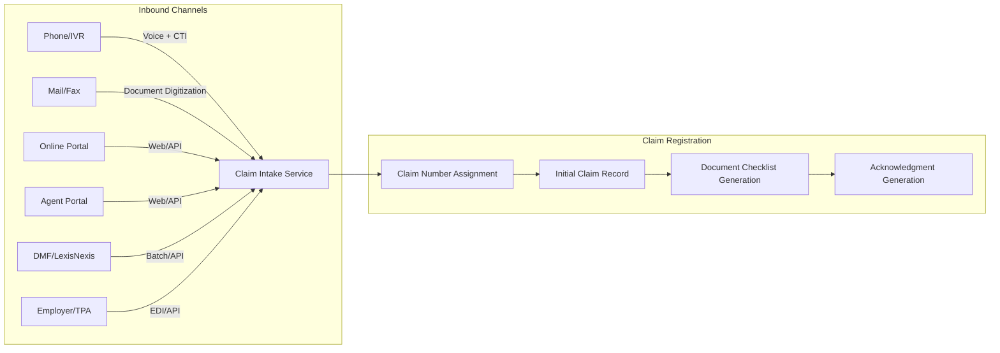

#### 2.2.1 Phone / Interactive Voice Response (IVR)

**IVR Flow:**
1. Caller dials claims service number
2. IVR authenticates caller (policy number + last 4 SSN or DOB)
3. IVR collects preliminary claim information:
   - Insured's full name
   - Date of death
   - Policy number (if known)
   - Caller's relationship to insured
4. IVR routes to live claims representative
5. Representative completes intake in claims workstation
6. System generates claim number and mails claim kit

**CTI (Computer Telephony Integration):**
- Automatic screen-pop with policy information when ANI matches contact database
- Call recording for compliance and quality assurance
- Average handle time target: 12–15 minutes for initial claim notification

#### 2.2.2 Mail / Fax

**Processing workflow:**
1. Mailroom receives physical correspondence
2. Documents scanned and digitized (OCR/ICR)
3. Intelligent document classification identifies death claim correspondence
4. Auto-extraction of key data fields (policy number, insured name, date of death)
5. Work item created in claims workflow
6. Claims processor reviews and completes intake

**Document classification model (typical categories):**
- Death certificate (certified copy)
- Claim form (claimant statement)
- Physician's statement
- Cover letter / correspondence
- Legal documentation (trust, probate)
- Proof of identity

#### 2.2.3 Online Portal (Self-Service)

Modern carriers provide online claim initiation through policyholder/beneficiary portals.

**Portal capabilities:**
- Policy lookup (by number, SSN, or insured name + DOB)
- Structured claim intake form
- Document upload (death certificate, claim forms, ID)
- Real-time claim status tracking
- Secure messaging with claims team
- Settlement option election
- Payment preference selection (ACH, check, wire)

**Technical requirements:**
- Identity verification / authentication (knowledge-based or document-based)
- SSL/TLS encryption for all data in transit
- PII/PHI handling compliant with state privacy laws and HIPAA
- Document upload: PDF, JPEG, PNG; max file size 25 MB per document
- Session timeout: 15 minutes of inactivity
- Mobile-responsive design

#### 2.2.4 Agent Portal

**Agent-specific features:**
- Claim initiation on behalf of beneficiary
- View all policies on insured's life within carrier's book
- Upload documents collected from beneficiary
- Track claim status and pending requirements
- Commission impact visibility (chargebacks, override adjustments)

### 2.3 Initial Claim Registration

Upon receipt of a death notification through any channel, the system performs the following registration steps:

#### 2.3.1 Policy Identification

```
INPUT: Insured identifiers (SSN, name, DOB, policy number)
PROCESS:
  1. If policy number provided → Validate policy exists and is in-force or within grace period
  2. If no policy number → Search by SSN (exact match)
  3. If no SSN → Search by name + DOB (fuzzy matching with Soundex/metaphone)
  4. Cross-reference all active policies on insured's life (including riders, supplemental benefits)
  5. Identify group certificates if employer information available
OUTPUT: List of all policies/certificates requiring death claim processing
```

#### 2.3.2 Claim Number Assignment

**Numbering scheme:**

| Component | Length | Description |
|---|---|---|
| Year | 4 | Calendar year of claim registration |
| Line of Business | 2 | IL (Individual Life), GL (Group Life), AN (Annuity) |
| Sequence | 7 | Auto-incrementing within year + LOB |
| Check digit | 1 | Luhn algorithm for validation |

**Example:** `2025-IL-0003847-2`

**Multi-policy claims:** When multiple policies exist on the same insured, a master claim number is created with sub-claim numbers for each policy:
- Master: `2025-IL-0003847-2`
- Sub-claim 1: `2025-IL-0003847-2-001` (Whole Life Policy #WL-1234567)
- Sub-claim 2: `2025-IL-0003847-2-002` (Term Life Policy #TM-9876543)

#### 2.3.3 Claim Record Initialization

The initial claim record captures:

```json
{
  "claimNumber": "2025-IL-0003847-2",
  "claimType": "DEATH",
  "claimStatus": "REPORTED",
  "claimSubStatus": "AWAITING_DOCUMENTATION",
  "reportedDate": "2025-12-01T14:30:00Z",
  "reportedBy": {
    "name": "Jane Smith",
    "relationship": "SPOUSE",
    "phone": "555-123-4567",
    "email": "jane.smith@email.com",
    "address": {
      "line1": "123 Main Street",
      "city": "Hartford",
      "state": "CT",
      "zip": "06101"
    }
  },
  "insured": {
    "policyPartyId": "PP-001234",
    "fullName": "John A. Smith",
    "ssn": "***-**-6789",
    "dateOfBirth": "1945-03-15",
    "dateOfDeath": "2025-11-22",
    "placeOfDeath": {
      "city": "Hartford",
      "state": "CT",
      "country": "US"
    },
    "causeOfDeath": "PENDING_DEATH_CERTIFICATE"
  },
  "policies": [
    {
      "policyNumber": "WL-1234567",
      "productType": "WHOLE_LIFE",
      "faceAmount": 500000.00,
      "issueDate": "2010-06-15",
      "policyStatus": "IN_FORCE"
    }
  ],
  "notificationChannel": "PHONE",
  "assignedExaminer": null,
  "priority": "STANDARD",
  "slaDeadline": "2025-12-31T23:59:59Z"
}
```

### 2.4 Acknowledgment Letter Generation

Within 24 hours of claim registration (many states require acknowledgment within 15 business days, but best practice is 24 hours):

**Acknowledgment package includes:**
1. **Cover letter** — Expresses condolences, confirms receipt of death notification, provides claim number, lists required documentation, names assigned claims contact with direct phone/email
2. **Claim forms** — Pre-printed or dynamically generated based on policy type:
   - Claimant's statement (demographics, beneficiary information, payment election)
   - Attending physician's statement (APS)
   - Authorization for release of medical records (HIPAA compliant)
3. **Documentation checklist** — Specific to claim circumstances:
   - Certified death certificate
   - Proof of claimant identity
   - Proof of relationship (if required)
   - Trust documentation (if trust is beneficiary)
4. **Claim instructions** — How to submit documents, expected timelines, contact information

**Dynamic generation rules:**
- If policy is within contestability period → Include additional investigation consent forms
- If accidental death benefit rider exists → Include supplemental accident questionnaire
- If beneficiary is a minor → Include UTMA custodian documentation requirements
- If beneficiary is a trust → Include trust certification requirements
- If insured died outside the US → Include foreign death documentation requirements

---

## 3. Documentation Requirements

### 3.1 Certified Death Certificate

The certified death certificate is the cornerstone document for every death claim. Understanding its structure is critical for automated processing.

#### 3.1.1 U.S. Standard Certificate of Death

The National Center for Health Statistics (NCHS) defines the U.S. Standard Certificate of Death, which all states follow (with minor variations):

**Part I — Cause of Death:**
| Line | Description | Example |
|---|---|---|
| a | Immediate cause | Pulmonary embolism |
| b | Sequentially due to | Deep vein thrombosis |
| c | Sequentially due to | Immobilization following hip fracture |
| d | Sequentially due to | Osteoporosis |

**Part II — Other Significant Conditions:**
Contributing conditions not directly related to the causal sequence (e.g., diabetes mellitus, hypertension).

**Manner of Death:**
- Natural
- Accident
- Suicide
- Homicide
- Pending investigation
- Could not be determined

**Key fields for claims processing:**

| Field | Claims Relevance |
|---|---|
| Decedent's legal name | Identity verification |
| SSN | Policy matching |
| Date of death | Benefit calculation, contestability |
| Time of death | Simultaneous death determination |
| Place of death | Jurisdictional rules |
| Cause of death (Part I & II) | Contestability review, exclusion evaluation, AD&D |
| Manner of death | Suicide exclusion, AD&D evaluation |
| Autopsy performed? | Investigation indicator |
| Were findings available? | May delay adjudication |
| Tobacco use | Contestability (smoking misrepresentation) |
| Certifier | Physician vs. medical examiner/coroner |

#### 3.1.2 Death Certificate Processing Automation

**OCR/ICR extraction targets:**

```yaml
deathCertificateExtraction:
  fields:
    - name: decedentName
      location: "Section 1"
      confidence_threshold: 0.95
    - name: ssn
      location: "Section 4"
      confidence_threshold: 0.99
    - name: dateOfDeath
      location: "Section 29"
      confidence_threshold: 0.98
    - name: causeOfDeath
      location: "Part I"
      confidence_threshold: 0.90
    - name: mannerOfDeath
      location: "Section 37"
      confidence_threshold: 0.95
    - name: certifierType
      location: "Section 45"
      confidence_threshold: 0.93
    - name: autopsy
      location: "Section 33"
      confidence_threshold: 0.95
  validation:
    - rule: "dateOfDeath <= today"
    - rule: "dateOfDeath >= dateOfBirth"
    - rule: "ssn matches policy insured SSN"
    - rule: "name fuzzy-matches policy insured name (Jaro-Winkler >= 0.88)"
```

#### 3.1.3 Foreign Death Certificates

When the insured dies outside the United States:
- Consular Report of Death Abroad (issued by U.S. embassy/consulate)
- Foreign death certificate with certified English translation
- Apostille or authentication (per Hague Convention or bilateral treaty)
- State Department verification may be required for some jurisdictions
- Additional documentation: passport copy, travel records, local police report (if applicable)

### 3.2 Claim Forms

#### 3.2.1 Claimant Statement Form

The claimant statement is the beneficiary's formal claim submission, capturing:

| Section | Fields |
|---|---|
| Claimant Information | Full name, SSN/TIN, DOB, address, phone, email, relationship to insured |
| Insured Information | Full name, SSN, DOB, date of death, place of death |
| Policy Information | Policy number(s), employer name (for group) |
| Death Information | Cause of death, attending physician, hospital/facility |
| Other Insurance | Other life insurance policies on insured's life |
| Settlement Election | Lump sum, settlement option selection, payment method (check/ACH) |
| Banking Information | Bank name, routing number, account number (for ACH) |
| Tax Withholding | Federal/state withholding election |
| Certification | Signature, date, notarization (if required by state) |

#### 3.2.2 Attending Physician's Statement (APS)

Required when:
- Policy is within contestability period
- Cause of death is unclear or incomplete on death certificate
- Accidental death benefit claim
- Waiver of premium claim (disability prior to death)
- Carrier requires medical details for underwriting review

**APS captures:**
- Physician identifying information (name, NPI, address)
- Date first consulted for terminal illness/condition
- History of present illness leading to death
- All diagnoses (primary and secondary)
- Treatment history
- Hospitalization dates
- Whether insured was a tobacco user
- Whether insured had any known pre-existing conditions not disclosed
- Physician's certification and signature

#### 3.2.3 HIPAA Authorization

The Health Insurance Portability and Accountability Act (HIPAA) requires a valid authorization for the release of protected health information (PHI) of the deceased insured.

**Authorization must include:**
- Description of information to be disclosed
- Name/designation of persons authorized to make disclosure
- Name/designation of persons to whom disclosure may be made
- Purpose of the disclosure
- Expiration date or event
- Signature of personal representative with authority over the decedent's PHI
- Description of representative's authority (executor, administrator, next of kin)

**HIPAA considerations:**
- PHI of deceased individuals remains protected for 50 years after death
- Personal representative has same rights as the decedent regarding PHI
- State laws may impose additional restrictions

### 3.3 Proof of Identity for Beneficiary

**Acceptable documents:**
- Government-issued photo ID (driver's license, passport, state ID)
- Two forms of non-photo ID (Social Security card + utility bill)
- Notarized affidavit of identity (for remote/mail claims)
- Digital identity verification (knowledge-based authentication through third-party service)

**Verification matrix:**

| Payment Amount | In-Person | By Mail | Online |
|---|---|---|---|
| < $10,000 | Photo ID | Copy of photo ID | KBA + document upload |
| $10,000 – $100,000 | Photo ID | Notarized copy of ID | KBA + document upload + callback |
| > $100,000 | Photo ID + secondary ID | Notarized copy + medallion guarantee | KBA + video verification |

### 3.4 Proof of Relationship

Required when:
- Beneficiary designation is by class (e.g., "children of the insured")
- Claimant's relationship to insured is questioned
- Claimant claims to be beneficiary not listed on policy records

**Acceptable documents:**
- Marriage certificate (spouse)
- Birth certificate (child, parent)
- Adoption decree (adopted child)
- Court order (legal guardian)
- Domestic partnership registration
- DNA test results (rare, usually court-ordered)

### 3.5 Trust Documentation

When the beneficiary is a trust:
- Trust agreement (or trust certification/abstract per state law)
- Verification that trust was in existence at time of insured's death
- Identification and verification of current trustee(s)
- Trustee's tax identification number (EIN)
- Trustee's proof of identity and authority
- Successor trustee documentation (if original trustee is deceased/incapacitated)

### 3.6 Estate Documentation

When the estate is the beneficiary (either by designation or when no named beneficiary survives):

| Document | Purpose |
|---|---|
| Letters Testamentary | Appoints executor under a will |
| Letters of Administration | Appoints administrator when no will exists |
| Small Estate Affidavit | For estates below state threshold (varies: $25K–$200K) |
| Court Order | Specific direction for payment |
| Death Certificate of Predeceased Beneficiaries | Establishes estate as payee |

**Small estate thresholds (selected states):**
| State | Threshold | Document |
|---|---|---|
| California | $184,500 | Small Estate Affidavit |
| New York | $30,000 | Voluntary Administration |
| Texas | $75,000 | Small Estate Affidavit |
| Florida | $75,000 | Summary Administration |
| Illinois | $100,000 | Small Estate Affidavit |

### 3.7 Document Management Integration

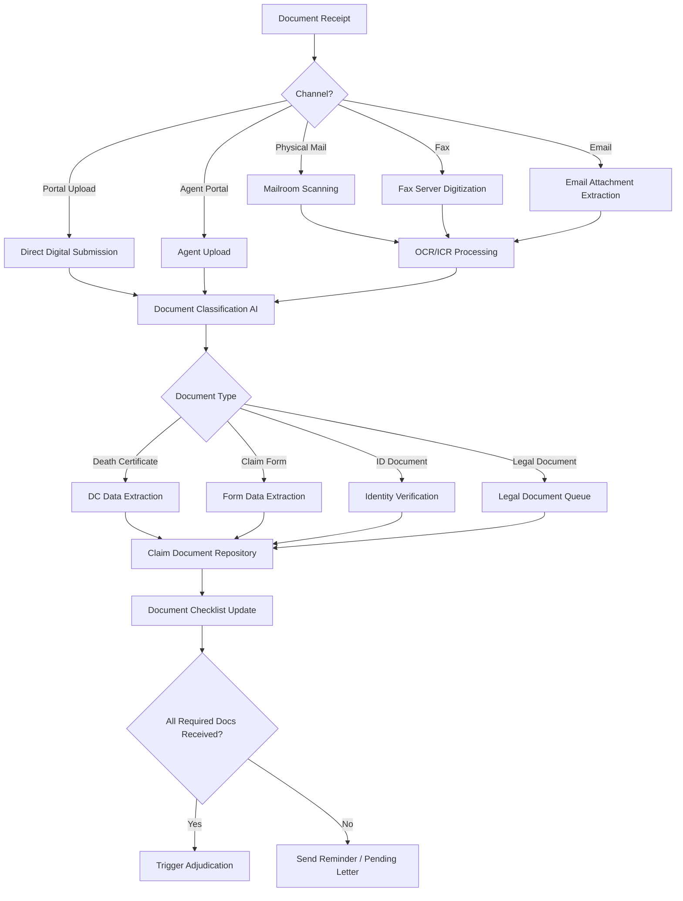

---

## 4. Contestability Review

### 4.1 The Contestability Period

The contestability clause is a standard provision in life insurance policies (required by most state insurance codes) that gives the insurer the right to investigate and potentially void the policy during the first two years after issuance.

#### 4.1.1 Legal Foundation

- **Standard provision:** "After the policy has been in force during the lifetime of the insured for two years from its date of issue, it shall be incontestable except for nonpayment of premiums."
- **Purpose:** Balances the insurer's need to investigate fraud against the policyholder's expectation of certainty.
- **Clock start:** Date of issue (or reinstatement date, if policy was reinstated).
- **Clock end:** Two years from issue/reinstatement date, measured during the insured's lifetime.

#### 4.1.2 Contestability Determination Logic

```
FUNCTION isContestable(policy, dateOfDeath):
    effectiveDate = max(policy.issueDate, policy.lastReinstatementDate)
    contestEndDate = effectiveDate + 2 years
    
    IF dateOfDeath < contestEndDate:
        RETURN CONTESTABLE
    ELSE:
        RETURN INCONTESTABLE
    
    // Special consideration: Face amount increases
    IF policy.hasRiderIncrease OR policy.hasCOI_increase:
        FOR EACH increase IN policy.faceAmountHistory:
            IF increase.effectiveDate + 2 years > dateOfDeath:
                RETURN PARTIALLY_CONTESTABLE  // Only the increase is contestable
```

#### 4.1.3 State Variations

| State | Period | Special Rules |
|---|---|---|
| Most states | 2 years | Standard |
| Missouri | 2 years | Fraud exception survives contestability period |
| Florida | 2 years | Material misrepresentation standard |
| Colorado | 2 years | Fraud standard (higher burden on insurer) |
| North Dakota | 2 years | Includes accidental death |
| Alaska | 2 years | No fraud exception |
| Various | 1–2 years | Some states allow shorter periods for group |

### 4.2 Material Misrepresentation Investigation

When a policy is within the contestability period, the claims team initiates a full investigation:

#### 4.2.1 Investigation Steps

1. **Application review** — Obtain original application (or eApp data) and all underwriting documentation
2. **Medical records request** — APS from treating physicians, hospital records, pharmacy records (Rx history via Milliman IntelliScript® or similar)
3. **MIB check** — Query Medical Information Bureau for coded medical conditions from prior insurance applications
4. **Attending physician statement** — Direct from doctor who certified death
5. **Motor vehicle records** — If DUI/driving history relevant
6. **Criminal history** — If relevant to application questions
7. **Financial records** — If financial justification for coverage amount is questioned
8. **Third-party investigation** — Field investigation by vendor (if warranted)

#### 4.2.2 Misrepresentation Analysis Matrix

| Application Question | Actual Finding | Material? | Action |
|---|---|---|---|
| "Have you used tobacco?" answered No | Pharmacy records show nicotine patches, death certificate shows tobacco use | Yes | Likely rescission or re-rate |
| "Any heart disease?" answered No | Medical records show prior MI, stent placement | Yes | Likely rescission |
| Height/weight underreported by 5 lbs | Actual weight 5 lbs higher than stated | No | Immaterial, pay claim |
| "Any DUI in past 5 years?" answered No | DMV shows DUI 3 years prior | Yes | If impacted risk class, may rescind |
| "Family history of cancer?" answered No | No contradictory evidence found | N/A | No misrepresentation |

#### 4.2.3 Materiality Standard

A misrepresentation is **material** if:
- The insurer would not have issued the policy on the same terms had the truth been known
- The true information would have resulted in a different underwriting decision (decline, rate-up, exclusion rider, or different face amount)

**Test:** Re-underwrite with the true information using the carrier's underwriting guidelines as of the application date.

### 4.3 Rescission vs. Denial

| Characteristic | Rescission | Denial |
|---|---|---|
| Definition | Voiding the policy ab initio (from inception) | Refusal to pay a valid claim |
| Basis | Material misrepresentation in the application | Policy exclusion or claim condition not met |
| Contestability required | Yes (within 2-year period) | Not necessarily |
| Premium treatment | Premiums refunded (without interest, less claims paid) | No premium refund |
| Policy status | Void — as if never existed | Policy remains valid; claim denied |
| Legal burden | Insurer must prove misrepresentation was material | Insurer must prove exclusion applies |

### 4.4 Suicide Exclusion

#### 4.4.1 Standard Suicide Clause

"If the insured dies by suicide, while sane or insane, within two years from the date of issue, the amount payable shall be limited to the premiums paid."

#### 4.4.2 Suicide Determination Process

1. Review death certificate manner of death
2. If "Suicide" — apply exclusion calculation
3. If "Pending investigation" — hold claim pending medical examiner/coroner final determination
4. If "Could not be determined" — most states require benefit of the doubt to beneficiary
5. Calculate limited benefit: Sum of all premiums paid (net of any dividends received)

#### 4.4.3 State Variations on Suicide

| State | Period | Notes |
|---|---|---|
| Most states | 2 years | Standard |
| Colorado | 1 year | Shorter exclusion period |
| Missouri | 2 years | Includes reinstatement date restart |
| North Dakota | 2 years | Standard with reinstatement restart |

#### 4.4.4 Suicide Exclusion Calculation

```
FUNCTION calculateSuicideBenefit(policy, dateOfDeath):
    suicideExclusionEnd = policy.issueDate + 2 years  // or reinstatement date
    
    IF dateOfDeath >= suicideExclusionEnd:
        RETURN policy.deathBenefit  // Full benefit — exclusion expired
    
    // Within exclusion period — return premiums only
    totalPremiumsPaid = SUM(policy.premiumPayments[].amount)
    dividendsReceived = SUM(policy.dividends[].amount)
    
    RETURN totalPremiumsPaid - dividendsReceived  // Premium refund
```

---

## 5. Beneficiary Verification

### 5.1 Beneficiary Hierarchy

The PAS must implement a rigorous beneficiary determination process following a strict hierarchy:

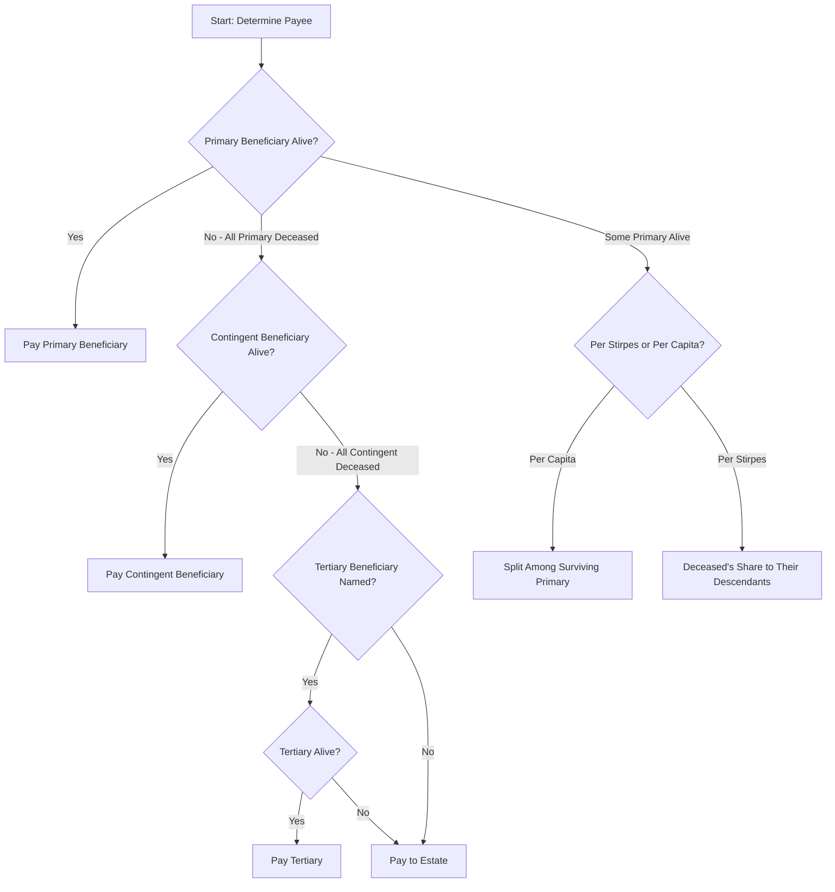

### 5.2 Primary vs. Contingent Determination

**Processing rules:**
1. **All primary beneficiaries alive:** Pay to primary per designated shares (equal if no shares specified)
2. **Some primary beneficiaries alive:** 
   - Per capita: Redistribute deceased's share equally among survivors
   - Per stirpes: Deceased's share passes to their descendants (children, grandchildren)
3. **No primary beneficiaries alive:** Pay to contingent beneficiary(ies)
4. **No contingent beneficiaries alive:** Pay to estate (or per policy's default beneficiary provision)

### 5.3 Simultaneous Death — Uniform Simultaneous Death Act (USDA)

When the insured and beneficiary die simultaneously (or within a very short time of each other, e.g., in a common accident):

#### 5.3.1 USDA Rules

- If there is **no sufficient evidence** that the beneficiary survived the insured, the beneficiary is deemed to have predeceased the insured
- The death benefit is paid to the contingent beneficiary or the insured's estate
- **120-hour rule** (Uniform Probate Code, adopted by many states): The beneficiary must survive the insured by at least 120 hours (5 days)

#### 5.3.2 Common Disaster Provision

Many policies include a common disaster clause:
> "If the beneficiary dies within 30 days of the insured's death, the beneficiary will be deemed to have predeceased the insured."

**Processing logic:**

```
FUNCTION checkSimultaneousDeath(insured, beneficiary):
    IF beneficiary.dateOfDeath IS NULL:
        RETURN SURVIVED  // Beneficiary is alive
    
    // Check policy-specific common disaster period
    commonDisasterDays = policy.commonDisasterProvision ?? 30
    
    daysBetweenDeaths = beneficiary.dateOfDeath - insured.dateOfDeath
    
    IF daysBetweenDeaths < 0:
        RETURN PREDECEASED  // Beneficiary died before insured
    ELIF daysBetweenDeaths <= commonDisasterDays:
        RETURN DEEMED_PREDECEASED  // Within common disaster period
    ELSE:
        RETURN SURVIVED  // Beneficiary survived beyond common disaster period
        // Note: Benefit becomes part of BENEFICIARY's estate
```

### 5.4 Per Stirpes vs. Per Capita Distribution

#### 5.4.1 Per Stirpes ("by the root")

Each branch of the family receives an equal share, regardless of the number of individuals in that branch.

**Example:**
- Insured has 3 children: Alice, Bob, Charlie
- Beneficiary designation: "Children, per stirpes"
- Bob predeceased the insured, leaving 2 children (Bob Jr., Betty)
- Distribution:
  - Alice: 1/3
  - Bob Jr.: 1/6 (half of Bob's 1/3)
  - Betty: 1/6 (half of Bob's 1/3)
  - Charlie: 1/3

#### 5.4.2 Per Capita ("by the head")

Each surviving individual at the same generational level receives an equal share.

**Example (same scenario):**
- Distribution:
  - Alice: 1/2
  - Charlie: 1/2
  - Bob Jr.: $0 (Bob's share does not pass down)
  - Betty: $0

#### 5.4.3 Per Capita at Each Generation (Modern Default)

Shares are first divided at the first generation with surviving members, then pooled and redivided at the next generation.

### 5.5 Irrevocable Beneficiary Rights

When a beneficiary has been designated as **irrevocable**:
- The beneficiary has a vested interest in the policy proceeds
- The policyholder cannot change the beneficiary without the irrevocable beneficiary's written consent
- At claim time: The irrevocable beneficiary has a contractual right to the proceeds
- Divorce does not automatically revoke an irrevocable beneficiary designation (varies by state)

**Processing rule:** Verify irrevocable beneficiary status in policy records; if irrevocable, pay regardless of any subsequent (unauthorized) changes.

### 5.6 Trust Beneficiary Verification

**Steps:**
1. Confirm trust exists and is valid (has not been revoked)
2. Obtain trust certification (or full trust agreement if required)
3. Verify trustee identity and authority
4. Obtain trustee's TIN (for tax reporting)
5. Verify trust name matches beneficiary designation exactly
6. If trust name has changed, obtain documentation of name change
7. Pay to "[Trust Name], [Trustee Name] as Trustee"

### 5.7 Minor Beneficiary Processing

When a beneficiary is under the age of majority (18 in most states):
- **Cannot pay directly to a minor** (minor cannot give valid receipt)
- Options:
  1. **UTMA/UGMA custodianship** — Appoint a custodian under the Uniform Transfers to Minors Act
  2. **Court-appointed guardian** — Guardian of the estate can receive funds
  3. **Facility of payment clause** — Some policies allow payment to a person caring for the minor (typically up to a dollar limit, e.g., $5,000–$25,000)
  4. **Retained asset account** — Hold funds in interest-bearing account until minor reaches majority
  5. **Court deposit** — Pay into court registry for minor's benefit

### 5.8 Estate as Beneficiary

When proceeds are payable to the insured's estate:
- Requires Letters Testamentary (with will) or Letters of Administration (without will)
- Pay to the named executor/administrator
- Subject to probate (may delay payment)
- Death benefits become part of the probate estate (subject to creditors' claims)
- Estate tax implications differ from named beneficiary payment
- Small estate affidavit may suffice for amounts below state threshold

---

## 6. Claim Investigation

### 6.1 Special Investigation Unit (SIU) Referral Triggers

The claims system must implement automated SIU referral rules based on red flags:

#### 6.1.1 Automated Referral Triggers

| Trigger | Risk Score Weight | Description |
|---|---|---|
| Policy within contestability period | +30 | Highest risk period for misrepresentation |
| Death within first policy year | +25 | Especially high risk |
| Large face amount (> $1M) | +15 | Financial motivation for fraud |
| Recent face amount increase | +20 | May indicate planned fraud |
| Accidental death | +10 | Higher fraud incidence |
| Homicide | +35 | Mandatory SIU review |
| Beneficiary is not a family member | +15 | Insurable interest concern |
| Recent beneficiary change | +20 | May indicate coercion or fraud |
| Multiple policies across carriers | +10 | Stacking indicator |
| Death outside the US | +10 | Harder to verify |
| Insured age < 40 with natural death | +10 | Statistical anomaly flag |
| Manner of death: undetermined | +20 | Needs investigation |
| Policy purchased through high-risk channel | +10 | Direct mail, telemarketing |
| Prior claim on same insured (reinstated policy) | +15 | Pattern concern |

**SIU referral threshold:** Score ≥ 40 → automatic SIU referral

#### 6.1.2 SIU Referral Workflow

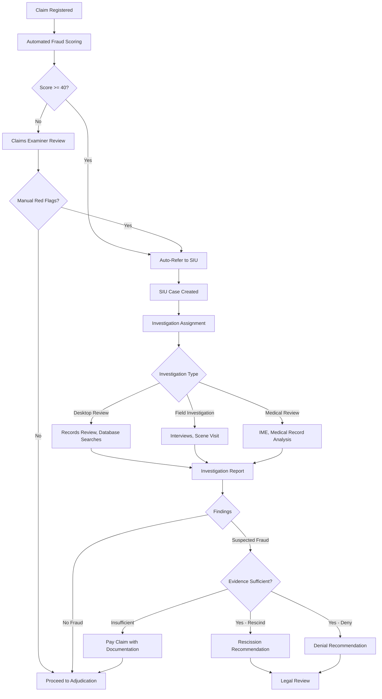

### 6.2 Fraud Indicators

#### 6.2.1 Application Fraud Indicators
- Application completed by someone other than the insured
- Inconsistencies between application and medical records
- Rapid succession of policies with increasing face amounts
- Agent with history of suspicious claims
- Application backdating or falsified signatures

#### 6.2.2 Death Fraud Indicators
- Staged death (particularly in foreign jurisdictions)
- Body not recovered
- Death in a country with unreliable vital statistics
- Inconsistencies in death documentation
- Beneficiary provides conflicting accounts
- Life insurance proceeds are the primary financial motivation

#### 6.2.3 Beneficiary Fraud Indicators
- Beneficiary has criminal record
- Beneficiary changed shortly before death
- Stranger-Originated Life Insurance (STOLI) patterns
- Beneficiary refuses to cooperate with investigation
- Multiple claims by same beneficiary across carriers

### 6.3 Investigation Tools and Databases

| Tool/Database | Purpose | Access Method |
|---|---|---|
| MIB (Medical Information Bureau) | Prior insurance application medical history | Batch/real-time query |
| LexisNexis | Comprehensive background, address history, asset search | API |
| NICB (National Insurance Crime Bureau) | Insurance fraud database | Batch query |
| Rx History (Milliman IntelliScript) | Prescription drug history | API |
| CLUE (Comprehensive Loss Underwriting Exchange) | Prior insurance claims | API |
| DMV Records | Driving history | State-by-state API |
| Criminal Records | Criminal background | LexisNexis/state databases |
| Social Media | Open-source intelligence | Manual/automated |
| Financial Databases | Asset/income verification | API |

### 6.4 Accidental Death Investigation

For accidental death benefit (AD&D rider) claims:

1. **Police/incident report** — Obtain official law enforcement report
2. **Autopsy/coroner report** — Full toxicology and pathology
3. **Witness statements** — If available
4. **Scene investigation** — Photographs, measurements (for vehicle accidents)
5. **Toxicology results** — Blood alcohol, drug screen
6. **Medical examiner determination** — Accidental vs. other manner of death
7. **Activity analysis** — Was the insured engaged in an excluded activity?

### 6.5 Criminal Investigation Coordination

When the death involves suspected criminal activity (homicide):
- **Slayer rule** — A person who feloniously causes the death of the insured is barred from receiving death benefits
- **Claims hold** — Claim payout is suspended pending criminal proceedings
- **Law enforcement coordination** — Share information per legal requirements (subpoena, court order)
- **Interpleader** — May file interpleader action to deposit funds with the court when there are competing claims
- **Timeline impact** — Criminal proceedings may extend claim resolution by months or years

---

## 7. Claim Adjudication

### 7.1 Benefit Calculation

The net death benefit payable requires a complex calculation incorporating multiple components:

#### 7.1.1 Death Benefit Formula

```
Net Death Benefit = 
    Base Face Amount
  + Accidental Death Benefit (if applicable)
  + Paid-Up Additions (participating policies)
  + Dividend Accumulations (participating policies)
  + Terminal Dividend (if applicable)
  + One-Year Term Dividend Additions
  + Policy Earnings Allocation (UL/VUL — pro-rata to date of death)
  - Outstanding Policy Loans (principal + accrued interest)
  - Unearned Premium (if prepaid beyond date of death, credit; if due, deduct)
  + Interest on Death Benefit (from date of death to date of payment)
  - Advance Claim Payments (if any interim payments made)
  + Additional Insurance Rider Benefits
  - Any Assignments (if collateral assignment, pay assignee first)
```

#### 7.1.2 Detailed Calculation Example

**Policy Details:**
- Product: Whole Life with PUA Rider and AD&D Rider
- Base Face Amount: $500,000
- Issue Date: 2015-06-01
- Date of Death: 2025-11-22
- Annual Premium: $8,500 (paid through 2025-12-31)
- Paid-Up Additions Value: $45,200
- Dividend Accumulations: $12,800
- Outstanding Loan: $35,000 (principal) + $2,450 (accrued interest)
- Accidental Death: Yes (auto accident — AD&D rider = $500,000)
- Unearned Premium: 39 days (Nov 22 to Dec 31) = $8,500 × (39/365) = $907.53

```
Base Face Amount                    $500,000.00
+ Accidental Death Benefit          $500,000.00
+ Paid-Up Additions                  $45,200.00
+ Dividend Accumulations             $12,800.00
- Outstanding Loan Principal        ($35,000.00)
- Accrued Loan Interest              ($2,450.00)
+ Unearned Premium Refund               $907.53
                                   ____________
= Gross Death Benefit             $1,021,457.53
+ Interest from DOD to Payment       $4,172.29
  (45 days × $1,021,457.53 × 3.0% / 365)
                                   ____________
= Total Payment                  $1,025,629.82
```

#### 7.1.3 Interest on Death Benefit

Most states require carriers to pay interest on the death benefit from the date of death to the date of payment:

| State | Interest Rate | Start Date | Notes |
|---|---|---|---|
| New York | Policy rate or state rate | Date of death | NY Ins. Law § 3214 |
| California | 10% simple | 30 days after proof | CAL INS CODE § 10172.5 |
| Texas | 18% | 60 days after due proof | TX INS CODE § 542 |
| Florida | 12% | 60 days after due proof | FL STAT § 627.4615 |
| Most states | Varies (3%–10%) | Date of death or proof | State-specific |

### 7.2 Accidental Death Benefit Evaluation

#### 7.2.1 AD&D Rider Evaluation Checklist

```
FUNCTION evaluateADBRider(claim, policy):
    rider = policy.getActiveRider("ACCIDENTAL_DEATH")
    IF rider IS NULL: RETURN { eligible: false, reason: "No AD&D rider" }
    
    // Step 1: Manner of death must be "Accident"
    IF deathCertificate.mannerOfDeath != "ACCIDENT":
        RETURN { eligible: false, reason: "Manner of death not accidental" }
    
    // Step 2: Death must occur within policy's time limit of the accident
    accidentDate = claim.accidentDetails.accidentDate
    daysBetween = claim.dateOfDeath - accidentDate
    IF daysBetween > rider.deathWithinDays (typically 90 or 365):
        RETURN { eligible: false, reason: "Death beyond time limit from accident" }
    
    // Step 3: Evaluate exclusions
    exclusions = [
        "SUICIDE", "SELF_INFLICTED_INJURY",
        "WAR_ACT", "MILITARY_SERVICE",
        "ILLEGAL_DRUG_USE", "DUI",
        "AVIATION_NON_COMMERCIAL", "COMMISSION_OF_FELONY",
        "HAZARDOUS_ACTIVITY",
        "MEDICAL_TREATMENT_COMPLICATION" // (some policies)
    ]
    FOR EACH exclusion IN exclusions:
        IF isExclusionApplicable(claim, exclusion):
            RETURN { eligible: false, reason: "Exclusion: " + exclusion }
    
    // Step 4: Calculate benefit amount
    benefitAmount = rider.faceAmount  // May be 1x, 2x, or specific amount
    RETURN { eligible: true, amount: benefitAmount }
```

#### 7.2.2 Common AD&D Exclusions

| Exclusion | Description |
|---|---|
| Suicide or self-inflicted injury | Even if accidental in appearance |
| Intoxication | BAC above state legal limit |
| Illegal drug use | Under influence of non-prescribed controlled substance |
| War or act of war | Declared or undeclared |
| Aviation (private) | As pilot or crew of non-commercial aircraft |
| Commission of felony | Death while committing or attempting a felony |
| Hazardous activities | Skydiving, rock climbing, racing (per policy terms) |
| Disease or illness | Death from illness, even if precipitated by accident |
| Medical treatment | Death from medical/surgical treatment (some policies) |

### 7.3 Waiver of Premium Claim Review

If the insured had a disability prior to death and a Waiver of Premium (WP) rider:

1. **Determine WP eligibility:** Was there a qualifying disability before death?
2. **Calculate retroactive premium waiver:** Premiums from disability onset to death may be waived/refunded
3. **Premium refund calculation:** Refund premiums paid during the waiver-eligible period
4. **Impact on death benefit:** No impact on death benefit amount; refund is additional payment

### 7.4 Contestability Determination in Adjudication

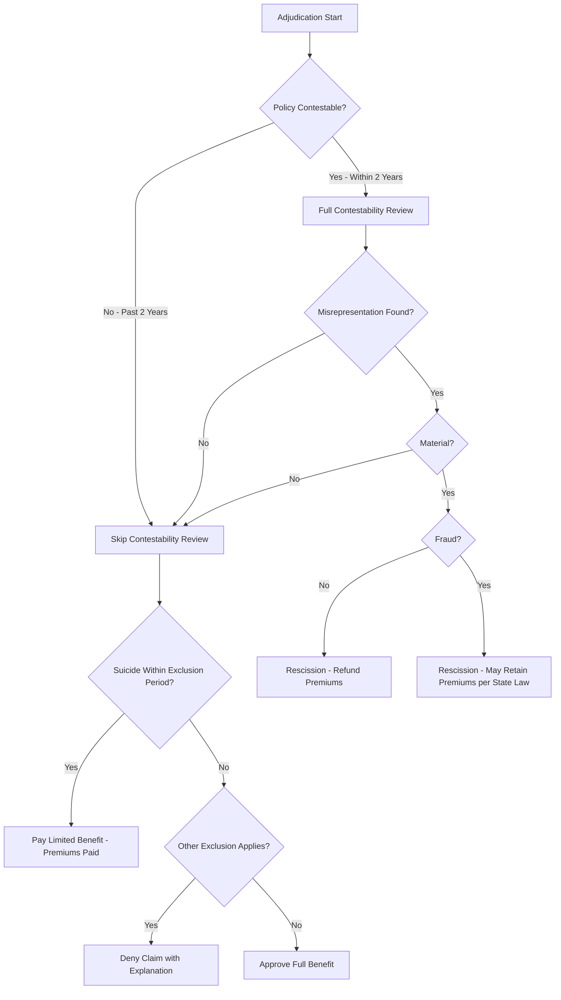

### 7.5 Exclusion Evaluation

**Standard policy exclusions evaluation matrix:**

| Exclusion | Trigger | Evidence Required | Typical Outcome |
|---|---|---|---|
| Suicide (within 2 years) | Death certificate: suicide | DC + investigation | Limited benefit (premiums returned) |
| War/military action | Death during armed conflict | Military records, DC | Exclusion applies (no benefit or limited) |
| Aviation | Private pilot/crew | FAA records, NTSB report | AD&D excluded; base benefit may still pay |
| Felony | Death during felony | Police report, court records | Varies by policy and state |
| Illegal drugs | Drug overdose/intoxication | Toxicology, DC | Varies — often not excluded for base benefit |
| Hazardous activity | Specified activities | Incident report | AD&D excluded typically |

---

## 8. Settlement Options

### 8.1 Overview of Settlement Options

When a death benefit is payable, the beneficiary typically has the right to elect from several settlement options (also called "modes of settlement"):

### 8.2 Option 1: Lump Sum (Cash)

- **Description:** Entire death benefit paid in a single payment
- **Most common election:** ~85% of beneficiaries choose lump sum
- **Payment methods:** Check, ACH/EFT, wire transfer
- **Tax treatment:** Death benefit excluded from income under IRC §101(a)(1); interest component is taxable
- **Timeline:** Paid within regulatory deadline (30–60 days of proof of loss)

### 8.3 Option 2: Interest Retention (Leave Proceeds on Deposit)

- **Description:** Death benefit remains with the insurer; only interest is paid to beneficiary (monthly, quarterly, semi-annually, or annually)
- **Interest rate:** Guaranteed minimum (e.g., 2%) plus current excess (e.g., additional 1.5%)
- **Withdrawal:** Beneficiary may withdraw any or all of the principal at any time
- **Tax treatment:** Interest is taxable income (1099-INT); principal withdrawals are non-taxable
- **Death of beneficiary:** Remaining principal paid to beneficiary's estate or secondary payee

### 8.4 Option 3: Fixed Period (Installment for a Definite Period)

- **Description:** Death benefit + guaranteed interest paid in equal installments over a specified number of years (e.g., 5, 10, 15, 20 years)
- **Calculation:**

```
Monthly Payment = PV × [i(1+i)^n] / [(1+i)^n - 1]
Where:
  PV = Death benefit amount
  i  = Monthly guaranteed interest rate
  n  = Number of monthly payments

Example: $500,000 over 10 years at 3% guaranteed
  i = 0.03/12 = 0.0025
  n = 120
  Monthly = $500,000 × [0.0025(1.0025)^120] / [(1.0025)^120 - 1]
         = $500,000 × 0.009656 = $4,828.04
```

- **Death of beneficiary during period:** Commuted value of remaining payments paid to estate
- **Tax treatment:** Each payment has a taxable (interest) and non-taxable (principal) component

### 8.5 Option 4: Fixed Amount (Installment of a Definite Amount)

- **Description:** Beneficiary chooses a fixed dollar amount per month; payments continue until the proceeds (plus interest) are exhausted
- **Duration:** Depends on the payment amount and interest rate
- **Tax treatment:** Same as Fixed Period — interest component is taxable
- **Flexibility:** Beneficiary can change the payment amount

### 8.6 Option 5: Life Income

Several life income sub-options:

| Sub-Option | Description | Payments Cease |
|---|---|---|
| Straight Life | Highest periodic payment; no refund feature | At beneficiary's death |
| Life with Period Certain (10/20 yr) | Guaranteed payments for at least the certain period | Later of death or end of certain period |
| Refund Life | If beneficiary dies before receiving total principal, difference paid to estate | At beneficiary's death or when full principal returned |
| Joint & Survivor | Payments continue to survivor | At death of last survivor |

**Life income calculation factors:**
- Based on beneficiary's age (and gender, where permitted) at settlement
- Mortality table (typically a settlement option annuity table)
- Guaranteed interest rate
- Certain period length (if applicable)

### 8.7 Retained Asset Account (RAA)

- **Description:** Insurer establishes an interest-bearing checking-type account in the beneficiary's name
- **Balance:** Death benefit amount
- **Interest:** Credited monthly (competitive rate)
- **Access:** Beneficiary writes checks or transfers funds at will
- **FDIC:** Typically NOT FDIC insured (insurance company obligation, not bank deposit)
- **Controversy:** Some states have regulated RAAs due to concerns about lack of disclosure
- **Tax:** Interest is taxable (1099-INT)

### 8.8 Structured Settlement

For large claims or when requested by the beneficiary:
- Periodic payments structured to meet specific financial goals
- May involve purchase of a single premium immediate annuity (SPIA)
- Tax treatment follows the underlying instrument rules
- Often used in conjunction with financial planning for beneficiary

### 8.9 Settlement Option Election Workflow

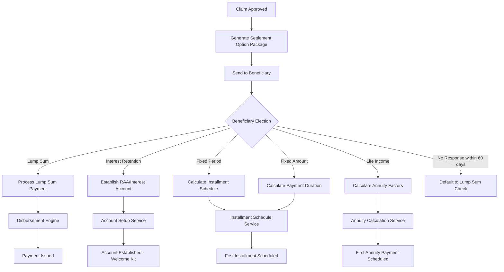

---

## 9. Regulatory Requirements

### 9.1 Prompt Payment Laws

Every state has unfair claims settlement practices statutes that impose timelines on death claim processing:

#### 9.1.1 State-by-State Timeline Requirements

| State | Acknowledge Claim | Pay/Deny After Proof | Interest/Penalty |
|---|---|---|---|
| New York | 15 business days | 30 days | Policy rate + penalty |
| California | 15 days | 30 days | 10% annual interest |
| Texas | 15 days | 5 business days (after agreement) | 18% + attorney fees |
| Florida | 14 days | 60 days | 12% annual interest |
| Illinois | — | 30 days | 9% annual interest |
| Pennsylvania | 10 business days | 30 days | Interest per regulation |
| Ohio | — | 30 days | Interest per regulation |
| Georgia | 15 days | 60 days | Bad faith penalties |
| New Jersey | — | 30 days | Interest per regulation |
| Massachusetts | — | 30 days | 1.5% monthly interest |

#### 9.1.2 SLA Tracking in PAS

The PAS must track and enforce regulatory timelines:

```json
{
  "claimSLA": {
    "claimNumber": "2025-IL-0003847-2",
    "state": "NY",
    "acknowledgeBy": "2025-12-22",
    "acknowledgeSent": "2025-12-01",
    "proofOfLossReceivedDate": "2025-12-10",
    "payOrDenyBy": "2026-01-09",
    "daysSinceProof": 22,
    "slaStatus": "ON_TRACK",
    "pendingReasons": [],
    "extensionRequested": false,
    "regulatoryAlerts": []
  }
}
```

### 9.2 Unclaimed Death Benefits (NAIC Model Regulation)

#### 9.2.1 Background

The NAIC Model Unclaimed Life Insurance Benefits Act (#580) requires insurers to:
1. Cross-match in-force policies and retained asset accounts against the DMF
2. Upon finding a match, initiate a good-faith effort to locate and pay beneficiaries
3. Report unclaimed benefits to the state as unclaimed property after the dormancy period

#### 9.2.2 DMF Matching Requirements

| Requirement | Detail |
|---|---|
| Matching frequency | At least semi-annually (monthly recommended) |
| Databases matched | In-force policies, retained asset accounts, annuities |
| Match criteria | SSN + name/DOB confirmation |
| Action upon match | Initiate claims process within 90 days |
| Beneficiary search | Good-faith effort using available resources |
| Escheatment | If no beneficiary found, escheat to state of insured's last known address |

#### 9.2.3 Due Diligence Steps (Pre-Escheatment)

1. Search company records for beneficiary address
2. Send notification letters (certified mail) to last known address
3. Check USPS National Change of Address (NCOA) database
4. Use LexisNexis or similar service to locate beneficiary
5. Attempt phone contact
6. Check company's other lines of business for updated contact information
7. Document all search efforts for regulatory examination

### 9.3 Multi-State Settlement Requirements

When the insured, beneficiary, and policy issuance state differ:

| Factor | Governs |
|---|---|
| Policy issuance state | Contestability rules, policy provisions |
| Insured's state of residence at death | Death certificate issuance, probate |
| Beneficiary's state of residence | Payment regulations, escheatment |
| State where claim filed | Unfair claims practices act |

### 9.4 Death Benefit Verification Audits

State insurance departments conduct periodic audits (market conduct examinations) of death claim practices:

**Audit focus areas:**
- Timely acknowledgment of claims
- Timely payment or denial
- Proper interest calculations
- DMF matching compliance
- Escheatment compliance
- Proper documentation retention
- Fair claims handling practices
- Complaint handling

### 9.5 Penalties for Late Payment

| State | Penalty Type | Amount |
|---|---|---|
| New York | Interest + regulatory penalty | Variable |
| California | Interest | 10% per annum |
| Texas | Penalty + interest + attorney fees | 18% + 2× attorney fees |
| Florida | Interest | 12% per annum |
| Massachusetts | Interest | 1.5% per month |
| Georgia | Bad faith | Up to 50% of claim + attorney fees |

---

## 10. Tax Implications

### 10.1 IRC Section 101 — Death Benefit Exclusion

#### 10.1.1 General Rule

Under IRC §101(a)(1), "gross income does not include amounts received under a life insurance contract, if such amounts are paid by reason of the death of the insured."

**Key implications:**
- Death benefits are generally income-tax-free to the beneficiary
- Applies to individual, group, and employer-owned policies (with modifications)
- No dollar limit on the exclusion
- Applies regardless of who paid the premiums

#### 10.1.2 Exceptions to the Exclusion

| Exception | IRC Section | Description |
|---|---|---|
| Transfer for value | §101(a)(2) | Policy transferred for valuable consideration — death benefit taxable (minus basis) |
| Employer-owned (COLI) | §101(j) | Must meet notice/consent requirements or death benefit is taxable |
| Interest component | §101(d) | Interest paid beyond the death benefit is taxable |
| Settlement option interest | §101(d) | Installment payments: interest portion is taxable |
| Accelerated death benefit | §101(g) | Excludable if terminally/chronically ill; otherwise taxable |

### 10.2 Transfer for Value Rule

The transfer-for-value rule is one of the most critical tax traps in life insurance:

**Rule:** If a life insurance policy is transferred for valuable consideration, the death benefit (in excess of the transferee's cost basis) is taxable to the transferee.

**Exceptions (transfers that do NOT trigger the rule):**
1. Transfer to the insured
2. Transfer to a partner of the insured
3. Transfer to a partnership in which the insured is a partner
4. Transfer to a corporation in which the insured is a shareholder or officer
5. Transfer where the transferee's basis is determined by reference to the transferor's basis (e.g., tax-free reorganization)

**PAS implications:** Track policy ownership changes and flag any transfer that may trigger the transfer-for-value rule.

### 10.3 Estate Tax Inclusion

#### 10.3.1 IRC §2042 — Proceeds Included in Gross Estate

Life insurance proceeds are included in the insured's gross estate for federal estate tax purposes if:
1. **Payable to the estate** — Proceeds payable to or for the benefit of the insured's estate
2. **Incidents of ownership** — The insured possessed any "incidents of ownership" at death:
   - Right to change beneficiary
   - Right to surrender or cancel
   - Right to borrow against the policy
   - Right to assign the policy
   - Reversionary interest exceeding 5% of policy value

#### 10.3.2 Three-Year Rule (IRC §2035)

If the insured transferred the policy (gifted it) within three years of death, the death benefit is pulled back into the gross estate.

#### 10.3.3 Estate Tax Rates (2025)

| Taxable Estate | Rate |
|---|---|
| Exclusion amount | $13.61M (2024, indexed) |
| Rate above exclusion | 40% |

### 10.4 Generation-Skipping Transfer Tax (GSTT)

If the death benefit passes to a "skip person" (e.g., grandchild when child is alive):
- GSTT may apply at a flat 40% rate
- GSTT exemption amount equals the estate tax exemption
- Particularly relevant for dynasty trusts that are beneficiaries of life insurance

### 10.5 Interest on Death Benefits

**Important distinction:**
- The death benefit itself = tax-free (IRC §101)
- Interest paid on the death benefit (from date of death to payment date) = taxable income
- Interest paid under settlement options = taxable income

**Reporting requirements:**
- Carrier must issue **1099-INT** for interest paid
- Applies to both lump sum interest and settlement option interest
- Minimum reporting threshold: $10

### 10.6 1099-R for Settlement Options

When death benefits are paid under a settlement option (other than lump sum):
- Each payment consists of a tax-free portion (prorated death benefit) and taxable portion (interest/gain)
- **1099-R** issued annually with:
  - Box 1: Gross distribution
  - Box 2a: Taxable amount (interest portion)
  - Box 3: Capital gain (if applicable)
  - Box 7: Distribution code "4" (death)

### 10.7 Tax Withholding at Claim Payment

| Payment Type | Federal Withholding | State Withholding |
|---|---|---|
| Lump sum death benefit | No (tax-free) | No |
| Interest on death benefit | Voluntary (W-4P) | Per state rules |
| Settlement option payments | Voluntary (W-4P) | Per state rules |
| Taxable death benefit (transfer for value) | Voluntary | Per state rules |
| ERISA group life (> $50K) | N/A at claim; employer reports imputed income | N/A |

---

## 11. Special Situations

### 11.1 Multiple Policies on Same Insured

**Processing requirements:**
- Master claim created with sub-claims for each policy
- Single investigation covers all policies
- Each policy adjudicated independently (different issue dates = different contestability status)
- Consolidated payment where possible (single check/ACH for all policies to same beneficiary)
- Separate 1099s if tax treatment differs

### 11.2 War Exclusion

**Standard clause:** "No benefit shall be payable for death resulting from war, declared or undeclared, or any act incident thereto."

**Processing:**
- Rare in modern policies (most issued post-WWII do not include)
- When present, requires determination of whether death was "incident to" war
- Military service alone ≠ war exclusion (unless in active combat zone)
- SGLI (Servicemembers' Group Life Insurance) has no war exclusion
- State-specific rules may limit enforceability

### 11.3 Aviation Exclusion

**Standard clause:** "No accidental death benefit shall be payable if death resulted from air travel, except as a fare-paying passenger on a scheduled commercial airline."

**Processing:**
- Typically applies to AD&D rider, not base death benefit
- Excludes: private pilot, student pilot, crew member, military aviation
- Includes (covered): commercial airline passenger, charter with professional pilot (some policies)
- FAA records and NTSB reports used for verification

### 11.4 Felony Exclusion

**Slayer rule application:**
- Beneficiary who feloniously kills the insured cannot receive the death benefit
- Proceeds pass as if the slayer predeceased the insured
- Criminal conviction is conclusive; some states allow civil standard (preponderance)
- PAS must track pending criminal proceedings and hold payment

### 11.5 Living Benefits Acceleration

If a living benefits (accelerated death benefit) rider was exercised before death:

```
Remaining Death Benefit = Original Face Amount - Accelerated Amount - Actuarial Discount
Claim Payment = Remaining Death Benefit + other components per standard formula
```

**Processing considerations:**
- Verify amount previously accelerated
- Calculate remaining death benefit
- Apply standard death benefit formula to remaining amount
- Interest calculation from date of death applies to remaining benefit only

### 11.6 Viatical Settlement

If the policy was sold to a viatical settlement provider:
- The viatical company is the policy owner and beneficiary
- Death benefit paid to the viatical company
- Beneficiary verification: confirm assignment is valid and on file
- No additional investigation typically required (claim is expected)
- Transfer-for-value implications reviewed at claim time

### 11.7 Assignment Issues at Death

#### 11.7.1 Collateral Assignment
- Death benefit paid first to the assignee (lender) up to the amount of the outstanding debt
- Remaining balance paid to the named beneficiary
- Requires coordination with the lending institution
- Assignee must provide payoff amount as of date of death

#### 11.7.2 Absolute Assignment
- New owner is the claimant
- Original policyholder has no rights
- Transfer-for-value analysis required

### 11.8 ERISA Claims (Group Life)

For employer-sponsored group life insurance subject to ERISA:
- ERISA preempts state insurance law for claims procedures
- Claims must follow DOL claims procedure regulations (29 CFR 2560.503-1)
- Initial claim determination: 90 days (+ 90-day extension with notice)
- Appeal determination: 60 days (+ 60-day extension)
- Full and fair review required on appeal
- Mandatory external review (if applicable under plan)
- Beneficiary designation follows plan document, not state law
- Federal court jurisdiction for denied claims

### 11.9 Interpleader Actions

When there are competing claimants for the death benefit:

**Common scenarios:**
- Ex-spouse vs. current spouse (beneficiary designation dispute)
- Multiple parties claiming to be the rightful beneficiary
- Trust vs. estate
- Slayer rule situation (pending criminal proceedings)

**Interpleader process:**
1. Carrier files interpleader action in court
2. Deposits death benefit with the court
3. Court determines rightful payee
4. Carrier is discharged from further liability
5. Court awards attorney fees from the death benefit proceeds

---

## 12. Entity-Relationship Model

### 12.1 Death Claim ERD

```mermaid
erDiagram
    CLAIM {
        string claimId PK
        string claimNumber
        string claimType
        string claimStatus
        string claimSubStatus
        date reportedDate
        date proofOfLossDate
        date adjudicationDate
        date paymentDate
        string assignedExaminer
        string priority
        string notificationSource
        string notificationChannel
    }
    
    CLAIM_POLICY {
        string claimPolicyId PK
        string claimId FK
        string policyNumber FK
        decimal baseFaceAmount
        decimal netDeathBenefit
        decimal loanOffset
        decimal premiumDue
        decimal interestFromDOD
        string contestabilityStatus
        string adjudicationResult
    }
    
    POLICY {
        string policyNumber PK
        string productCode
        date issueDate
        date lastReinstatementDate
        string policyStatus
        decimal faceAmount
        decimal cashValue
        decimal loanBalance
    }
    
    INSURED {
        string insuredId PK
        string fullName
        string ssn
        date dateOfBirth
        date dateOfDeath
        string placeOfDeath
        string causeOfDeath
        string mannerOfDeath
    }
    
    BENEFICIARY {
        string beneficiaryId PK
        string policyNumber FK
        string designation
        string fullName
        string ssn
        string relationship
        decimal sharePercent
        string beneficiaryType
        string status
        boolean isIrrevocable
    }
    
    CLAIMANT {
        string claimantId PK
        string claimId FK
        string beneficiaryId FK
        string fullName
        string ssn
        string relationship
        string contactPhone
        string contactEmail
        string address
        string identityVerificationStatus
    }
    
    DEATH_CERTIFICATE {
        string certificateId PK
        string claimId FK
        string certificateNumber
        string issuingJurisdiction
        date dateOfDeath
        string causeOfDeathPartI
        string causeOfDeathPartII
        string mannerOfDeath
        boolean autopsyPerformed
        string certifierType
        string certifierName
        date dateCertified
        boolean isCertifiedCopy
    }
    
    CLAIM_DOCUMENT {
        string documentId PK
        string claimId FK
        string documentType
        string documentSubType
        string fileName
        string storageUrl
        date receivedDate
        string receiptChannel
        string ocrStatus
        string verificationStatus
    }
    
    CLAIM_INVESTIGATION {
        string investigationId PK
        string claimId FK
        string investigationType
        string investigationStatus
        string assignedInvestigator
        date openedDate
        date closedDate
        string findings
        string recommendation
    }
    
    CONTESTABILITY_REVIEW {
        string reviewId PK
        string claimId FK
        string policyNumber FK
        boolean isContestable
        date contestabilityEndDate
        string reviewStatus
        string misrepresentationFound
        string materialityDetermination
        string recommendation
    }
    
    BENEFIT_CALCULATION {
        string calculationId PK
        string claimPolicyId FK
        decimal baseFaceAmount
        decimal accidentalDeathBenefit
        decimal paidUpAdditions
        decimal dividendAccumulations
        decimal terminalDividend
        decimal outstandingLoanPrincipal
        decimal accruedLoanInterest
        decimal premiumAdjustment
        decimal interestFromDOD
        decimal grossDeathBenefit
        decimal netPayableAmount
        date calculationDate
        string calculatedBy
    }
    
    SETTLEMENT_OPTION {
        string settlementId PK
        string claimId FK
        string claimantId FK
        string optionType
        decimal principalAmount
        decimal interestRate
        integer periodYears
        decimal monthlyPayment
        date electionDate
        date effectiveDate
        string accountNumber
    }
    
    CLAIM_PAYMENT {
        string paymentId PK
        string claimId FK
        string claimantId FK
        string paymentMethod
        decimal paymentAmount
        decimal taxWithheld
        string payeeName
        string bankRoutingNumber
        string bankAccountNumber
        string checkNumber
        date paymentDate
        string paymentStatus
        string disbursementId FK
    }
    
    CLAIM_NOTE {
        string noteId PK
        string claimId FK
        string noteType
        string noteText
        string createdBy
        date createdDate
    }
    
    CLAIM_CORRESPONDENCE {
        string correspondenceId PK
        string claimId FK
        string correspondenceType
        string templateId
        string recipientName
        string recipientAddress
        date generatedDate
        date sentDate
        string deliveryMethod
        string documentId FK
    }
    
    SIU_REFERRAL {
        string referralId PK
        string claimId FK
        integer fraudScore
        string referralReason
        string referralStatus
        string assignedSIUAnalyst
        date referralDate
        date closedDate
        string outcome
    }
    
    EXCLUSION_EVALUATION {
        string evaluationId PK
        string claimPolicyId FK
        string exclusionType
        string evaluationResult
        string evidence
        string evaluatedBy
        date evaluationDate
    }
    
    CLAIM_SLA {
        string slaId PK
        string claimId FK
        string state
        date acknowledgeDeadline
        date payDenyDeadline
        string slaStatus
        boolean extensionRequested
        date extensionGrantedUntil
    }
    
    TAX_REPORTING {
        string taxReportId PK
        string claimId FK
        string claimantId FK
        string formType
        integer taxYear
        string tin
        decimal grossDistribution
        decimal taxableAmount
        string distributionCode
        decimal federalWithheld
        decimal stateWithheld
        string filingStatus
    }
    
    ASSIGNMENT {
        string assignmentId PK
        string policyNumber FK
        string assignmentType
        string assigneeName
        string assigneeAddress
        decimal assignmentAmount
        date effectiveDate
        string status
    }
    
    RIDER_BENEFIT {
        string riderBenefitId PK
        string claimPolicyId FK
        string riderType
        decimal riderFaceAmount
        boolean isEligible
        string eligibilityReason
        decimal benefitAmount
        date evaluationDate
    }
    
    CLAIM_AUDIT_LOG {
        string auditId PK
        string claimId FK
        string action
        string fieldChanged
        string oldValue
        string newValue
        string performedBy
        date performedDate
        string ipAddress
    }
    
    INTERPLEADER {
        string interpleaderId PK
        string claimId FK
        string courtName
        string caseNumber
        date filingDate
        decimal depositedAmount
        string status
        string outcome
        date resolutionDate
    }
    
    CLAIM ||--o{ CLAIM_POLICY : "covers"
    CLAIM_POLICY ||--|| POLICY : "references"
    CLAIM ||--|| INSURED : "for"
    POLICY ||--o{ BENEFICIARY : "has"
    CLAIM ||--o{ CLAIMANT : "filed by"
    CLAIMANT ||--o| BENEFICIARY : "is"
    CLAIM ||--|| DEATH_CERTIFICATE : "evidenced by"
    CLAIM ||--o{ CLAIM_DOCUMENT : "has"
    CLAIM ||--o{ CLAIM_INVESTIGATION : "investigated"
    CLAIM ||--o{ CONTESTABILITY_REVIEW : "reviewed"
    CLAIM_POLICY ||--|| BENEFIT_CALCULATION : "calculated"
    CLAIM ||--o{ SETTLEMENT_OPTION : "settled via"
    CLAIM ||--o{ CLAIM_PAYMENT : "paid"
    CLAIM ||--o{ CLAIM_NOTE : "noted"
    CLAIM ||--o{ CLAIM_CORRESPONDENCE : "corresponded"
    CLAIM ||--o| SIU_REFERRAL : "referred"
    CLAIM_POLICY ||--o{ EXCLUSION_EVALUATION : "evaluated"
    CLAIM ||--|| CLAIM_SLA : "tracked"
    CLAIM ||--o{ TAX_REPORTING : "reported"
    POLICY ||--o| ASSIGNMENT : "assigned"
    CLAIM_POLICY ||--o{ RIDER_BENEFIT : "includes"
    CLAIM ||--o{ CLAIM_AUDIT_LOG : "audited"
    CLAIM ||--o| INTERPLEADER : "interpleaded"
```

### 12.2 Key Entity Descriptions

| Entity | Description | Typical Volume |
|---|---|---|
| CLAIM | Master claim record linking all artifacts | 1 per insured death |
| CLAIM_POLICY | Junction between claim and each policy on the insured | 1–5 per claim |
| BENEFICIARY | Designated recipients per policy | 1–10 per policy |
| CLAIMANT | Person(s) filing the claim | 1–5 per claim |
| DEATH_CERTIFICATE | Digitized death certificate data | 1 per claim |
| CLAIM_DOCUMENT | All documents associated with the claim | 5–50 per claim |
| CLAIM_INVESTIGATION | Investigation records (contestability, SIU) | 0–3 per claim |
| BENEFIT_CALCULATION | Detailed benefit computation | 1 per claim-policy |
| SETTLEMENT_OPTION | Beneficiary's settlement election | 1 per claimant |
| CLAIM_PAYMENT | Payment transaction record | 1–10 per claim |
| TAX_REPORTING | 1099-INT/1099-R records | 1–N per claim per year |

---

## 13. ACORD TXLife 151 Message Specification

### 13.1 Overview

The ACORD TXLife standard defines XML message structures for life insurance transactions. Transaction code **151** is the **Death Claim Submission** message.

### 13.2 TXLife 151 Message Structure

```xml
<?xml version="1.0" encoding="UTF-8"?>
<TXLife xmlns="http://ACORD.org/Standards/Life/2"
        xmlns:xsi="http://www.w3.org/2001/XMLSchema-instance"
        version="2.44">
  <UserAuthRequest>
    <VendorApp>
      <VendorName>ClaimSystem</VendorName>
      <AppName>DeathClaimProcessor</AppName>
      <AppVer>3.0</AppVer>
    </VendorApp>
  </UserAuthRequest>
  
  <TXLifeRequest PrimaryObjectID="Holding_1">
    <TransRefGUID>a1b2c3d4-e5f6-7890-abcd-ef1234567890</TransRefGUID>
    <TransType tc="151">Death Claim</TransType>
    <TransExeDate>2025-12-01</TransExeDate>
    <TransExeTime>14:30:00</TransExeTime>
    <TransMode tc="2">Original</TransMode>
    
    <OLifE>
      <!-- Holding: Policy Information -->
      <Holding id="Holding_1">
        <HoldingTypeCode tc="2">Policy</HoldingTypeCode>
        <Policy>
          <PolNumber>WL-1234567</PolNumber>
          <ProductCode>WL-ELITE-100</ProductCode>
          <CarrierCode>ABC</CarrierCode>
          <PlanName>Elite Whole Life 100</PlanName>
          <PolicyStatus tc="1">Active</PolicyStatus>
          <IssueDate>2015-06-01</IssueDate>
          <EffDate>2015-06-01</EffDate>
          <FaceAmt>500000.00</FaceAmt>
          
          <Life>
            <FaceAmt>500000.00</FaceAmt>
            <Coverage id="Coverage_Base">
              <IndicatorCode tc="1">Base</IndicatorCode>
              <CurrentAmt>500000.00</CurrentAmt>
            </Coverage>
            <Coverage id="Coverage_ADB">
              <IndicatorCode tc="6">Accidental Death</IndicatorCode>
              <CurrentAmt>500000.00</CurrentAmt>
            </Coverage>
          </Life>
          
          <ApplicationInfo>
            <SignedDate>2015-05-15</SignedDate>
          </ApplicationInfo>
        </Policy>
        
        <Banking id="Banking_Loan">
          <BankingTypeCode tc="3">Policy Loan</BankingTypeCode>
          <LoanAmt>35000.00</LoanAmt>
          <AccruedInterestAmt>2450.00</AccruedInterestAmt>
          <IntRate>5.0</IntRate>
        </Banking>
      </Holding>
      
      <!-- Party: Insured -->
      <Party id="Party_Insured">
        <PartyTypeCode tc="1">Person</PartyTypeCode>
        <FullName>John A. Smith</FullName>
        <GovtID>123456789</GovtID>
        <GovtIDTC tc="1">SSN</GovtIDTC>
        <Person>
          <FirstName>John</FirstName>
          <MiddleName>Arthur</MiddleName>
          <LastName>Smith</LastName>
          <Gender tc="1">Male</Gender>
          <BirthDate>1945-03-15</BirthDate>
          <DeathDate>2025-11-22</DeathDate>
        </Person>
        <Address>
          <AddressTypeCode tc="2">Residence</AddressTypeCode>
          <Line1>123 Main Street</Line1>
          <City>Hartford</City>
          <AddressStateTC tc="7">CT</AddressStateTC>
          <Zip>06101</Zip>
        </Address>
      </Party>
      
      <!-- Party: Beneficiary/Claimant -->
      <Party id="Party_Beneficiary">
        <PartyTypeCode tc="1">Person</PartyTypeCode>
        <FullName>Jane M. Smith</FullName>
        <GovtID>987654321</GovtID>
        <GovtIDTC tc="1">SSN</GovtIDTC>
        <Person>
          <FirstName>Jane</FirstName>
          <MiddleName>Marie</MiddleName>
          <LastName>Smith</LastName>
          <Gender tc="2">Female</Gender>
          <BirthDate>1948-07-22</BirthDate>
        </Person>
        <Phone>
          <PhoneTypeCode tc="1">Home</PhoneTypeCode>
          <AreaCode>555</AreaCode>
          <DialNumber>1234567</DialNumber>
        </Phone>
        <EMailAddress>
          <AddrLine>jane.smith@email.com</AddrLine>
        </EMailAddress>
        <Address>
          <AddressTypeCode tc="2">Residence</AddressTypeCode>
          <Line1>123 Main Street</Line1>
          <City>Hartford</City>
          <AddressStateTC tc="7">CT</AddressStateTC>
          <Zip>06101</Zip>
        </Address>
      </Party>
      
      <!-- Relation: Insured to Policy -->
      <Relation id="Rel_1"
                OriginatingObjectID="Party_Insured"
                RelatedObjectID="Holding_1">
        <OriginatingObjectType tc="6">Party</OriginatingObjectType>
        <RelatedObjectType tc="4">Holding</RelatedObjectType>
        <RelationRoleCode tc="32">Insured</RelationRoleCode>
      </Relation>
      
      <!-- Relation: Beneficiary to Policy -->
      <Relation id="Rel_2"
                OriginatingObjectID="Party_Beneficiary"
                RelatedObjectID="Holding_1">
        <OriginatingObjectType tc="6">Party</OriginatingObjectType>
        <RelatedObjectType tc="4">Holding</RelatedObjectType>
        <RelationRoleCode tc="34">Primary Beneficiary</RelationRoleCode>
        <InterestPercent>100.00</InterestPercent>
      </Relation>
      
      <!-- Relation: Beneficiary is Spouse of Insured -->
      <Relation id="Rel_3"
                OriginatingObjectID="Party_Beneficiary"
                RelatedObjectID="Party_Insured">
        <OriginatingObjectType tc="6">Party</OriginatingObjectType>
        <RelatedObjectType tc="6">Party</RelatedObjectType>
        <RelationRoleCode tc="1">Spouse</RelationRoleCode>
      </Relation>
      
      <!-- Claim Information -->
      <Holding id="Holding_Claim">
        <HoldingTypeCode tc="5">Claim</HoldingTypeCode>
        <Claim>
          <ClaimNumber>2025-IL-0003847-2</ClaimNumber>
          <ClaimTypeCode tc="1">Death</ClaimTypeCode>
          <ClaimStatusCode tc="1">Open</ClaimStatusCode>
          <ReportedDate>2025-12-01</ReportedDate>
          <LossDate>2025-11-22</LossDate>
          <CauseOfLossCode tc="1">Natural Causes</CauseOfLossCode>
          <DeathCertificate>
            <CertificateNumber>CT-2025-123456</CertificateNumber>
            <IssuingAuthority>CT Dept of Public Health</IssuingAuthority>
            <MannerOfDeath tc="1">Natural</MannerOfDeath>
            <ImmediateCauseOfDeath>Myocardial Infarction</ImmediateCauseOfDeath>
            <AutopsyInd tc="0">False</AutopsyInd>
          </DeathCertificate>
        </Claim>
      </Holding>
    </OLifE>
  </TXLifeRequest>
</TXLife>
```

### 13.3 Key TXLife Transaction Codes for Death Claims

| Transaction Code | Description |
|---|---|
| 151 | Death Claim Submission |
| 152 | Death Claim Status Inquiry |
| 153 | Death Claim Status Response |
| 501 | Claim Payment Notification |
| 511 | Claim Denial Notification |

### 13.4 Response Message (TXLife 153)

```xml
<TXLifeResponse>
  <TransRefGUID>a1b2c3d4-e5f6-7890-abcd-ef1234567890</TransRefGUID>
  <TransType tc="153">Death Claim Status Response</TransType>
  <TransResult>
    <ResultCode tc="1">Success</ResultCode>
    <ResultInfo>
      <ResultInfoCode tc="0">OK</ResultInfoCode>
      <ResultInfoDesc>Claim received and registered</ResultInfoDesc>
    </ResultInfo>
  </TransResult>
  <OLifE>
    <Holding id="Holding_Claim">
      <Claim>
        <ClaimNumber>2025-IL-0003847-2</ClaimNumber>
        <ClaimStatusCode tc="2">Under Review</ClaimStatusCode>
        <EstimatedCompletionDate>2026-01-15</EstimatedCompletionDate>
        <PendingRequirements>
          <Requirement>
            <RequirementCode tc="1">Certified Death Certificate</RequirementCode>
            <RequirementStatus tc="2">Received</RequirementStatus>
          </Requirement>
          <Requirement>
            <RequirementCode tc="5">Claimant Statement</RequirementCode>
            <RequirementStatus tc="1">Outstanding</RequirementStatus>
          </Requirement>
        </PendingRequirements>
      </Claim>
    </Holding>
  </OLifE>
</TXLifeResponse>
```

---

## 14. BPMN Process Flow

### 14.1 End-to-End Death Claim Process

```mermaid
flowchart TD
    START([Claim Notification Received]) --> A1[Register Claim]
    A1 --> A2[Assign Claim Number]
    A2 --> A3[Identify All Policies on Insured]
    A3 --> A4[Create Claim-Policy Records]
    A4 --> A5[Generate Document Checklist]
    A5 --> A6[Send Acknowledgment Package]
    
    A6 --> B1{All Required Documents Received?}
    B1 -->|No| B2[Send Reminder / Pending Notice]
    B2 --> B3[Wait for Documents]
    B3 --> B1
    B1 -->|Yes| B4[Mark Proof of Loss Complete]
    
    B4 --> C1[Validate Death Certificate]
    C1 --> C2[Verify Insured Identity - SSN/Name/DOB Match]
    C2 --> C3{Identity Confirmed?}
    C3 -->|No| C4[Request Additional Documentation]
    C4 --> C1
    C3 -->|Yes| C5[Extract Death Certificate Data]
    
    C5 --> D1{Policy Within Contestability Period?}
    D1 -->|Yes| D2[Initiate Contestability Investigation]
    D2 --> D3[Order Medical Records - APS]
    D3 --> D4[Query MIB]
    D4 --> D5[Review Application vs Records]
    D5 --> D6{Material Misrepresentation?}
    D6 -->|Yes| D7[Legal Review for Rescission]
    D7 --> D8{Rescind?}
    D8 -->|Yes| D9[Issue Rescission Letter + Premium Refund]
    D9 --> END_RESCISSION([Claim Closed - Rescinded])
    D8 -->|No| D10[Proceed to Adjudication]
    D6 -->|No| D10
    D1 -->|No| D10
    
    D10 --> E1[Run Fraud Scoring Model]
    E1 --> E2{SIU Referral Score >= 40?}
    E2 -->|Yes| E3[Refer to SIU]
    E3 --> E4[SIU Investigation]
    E4 --> E5{SIU Outcome}
    E5 -->|Clear| E6[Proceed to Adjudication]
    E5 -->|Deny| E7[Claim Denial Processing]
    E7 --> END_DENY([Claim Closed - Denied])
    E2 -->|No| E6
    
    E6 --> F1{Suicide Within Exclusion Period?}
    F1 -->|Yes| F2[Calculate Limited Benefit - Premiums Paid]
    F1 -->|No| F3[Evaluate Other Exclusions]
    F3 --> F4{Any Exclusion Applies?}
    F4 -->|Yes - Base| F5[Process Exclusion Denial]
    F5 --> END_DENY
    F4 -->|Yes - Rider Only| F6[Deny Rider Benefit Only]
    F4 -->|No| F7[Approve Full Benefit]
    
    F2 --> G1[Verify Beneficiaries]
    F6 --> G1
    F7 --> G1
    
    G1 --> G2{All Primary Bene Alive?}
    G2 -->|Yes| G3[Determine Shares per Designation]
    G2 -->|Some Deceased| G4{Per Stirpes or Per Capita?}
    G4 -->|Per Stirpes| G5[Calculate Descendant Shares]
    G4 -->|Per Capita| G6[Redistribute Among Survivors]
    G2 -->|All Deceased| G7{Contingent Bene Alive?}
    G7 -->|Yes| G8[Pay Contingent Beneficiary]
    G7 -->|No| G9[Pay to Estate]
    
    G3 --> H1[Calculate Net Death Benefit]
    G5 --> H1
    G6 --> H1
    G8 --> H1
    G9 --> H1
    
    H1 --> H2[Base Face Amount]
    H2 --> H3[+ Rider Benefits]
    H3 --> H4[+ PUA / Dividend Accumulations]
    H4 --> H5[- Outstanding Loans + Interest]
    H5 --> H6[+/- Premium Adjustment]
    H6 --> H7[+ Interest from DOD]
    H7 --> H8[= Net Death Benefit]
    
    H8 --> I1{Assignment on Policy?}
    I1 -->|Collateral| I2[Pay Assignee First]
    I2 --> I3[Pay Remainder to Beneficiary]
    I1 -->|Absolute| I4[Pay Assignee/Owner]
    I1 -->|None| I5[Full Payment to Beneficiary]
    
    I3 --> J1[Settlement Option Election]
    I4 --> J1
    I5 --> J1
    
    J1 --> J2{Election Made?}
    J2 -->|Lump Sum| J3[Process Lump Sum Payment]
    J2 -->|Settlement Option| J4[Establish Settlement Account]
    J2 -->|No Election - Default| J3
    
    J3 --> K1[Determine Tax Withholding]
    J4 --> K1
    K1 --> K2[Generate Payment Authorization]
    K2 --> K3[Disbursement Engine]
    K3 --> K4[Issue Payment]
    
    K4 --> L1[Generate Claim Closure Letter]
    L1 --> L2[Update Policy Status to Terminated - Death]
    L2 --> L3[Archive Claim File]
    L3 --> L4[Generate Tax Reporting Records]
    L4 --> L5[Update Commission Records]
    L5 --> END_PAID([Claim Closed - Paid])
```

### 14.2 Activity Descriptions

| # | Activity | System/Manual | SLA |
|---|---|---|---|
| A1 | Register Claim | System (auto) | Immediate |
| A2 | Assign Claim Number | System (auto) | Immediate |
| A3 | Identify All Policies | System (search) | < 1 min |
| A4 | Create Claim-Policy Records | System (auto) | Immediate |
| A5 | Generate Document Checklist | System (rules-based) | < 1 min |
| A6 | Send Acknowledgment | System (auto-generate) | Same day |
| B1 | Check Document Completeness | System (checklist) | Real-time |
| B4 | Mark Proof of Loss Complete | System (auto) | Immediate |
| C1 | Validate Death Certificate | System (OCR) + Manual review | 1 business day |
| C2 | Verify Insured Identity | System (auto-match) | < 1 min |
| D2 | Initiate Contestability Investigation | Manual (examiner) | 1 business day |
| D3 | Order Medical Records | System (APS ordering) | 15–30 days |
| D5 | Review Application vs Records | Manual (medical director) | 3–5 business days |
| E1 | Run Fraud Scoring | System (auto) | < 1 min |
| E4 | SIU Investigation | Manual (SIU analyst) | 15–60 days |
| F3 | Evaluate Exclusions | System (rules) + Manual | 1–2 business days |
| G1 | Verify Beneficiaries | Manual (examiner) | 2–5 business days |
| H1 | Calculate Death Benefit | System (calculation engine) | < 1 min |
| J1 | Settlement Option Election | Manual (beneficiary) | 5–30 days |
| K3 | Disbursement Processing | System (auto) | 1–3 business days |
| L2 | Update Policy Status | System (auto) | Immediate |

---

## 15. STP Rules for Auto-Adjudication

### 15.1 STP (Straight-Through Processing) Criteria

Auto-adjudication enables clean claims to be processed without manual intervention, significantly reducing cycle time and cost.

#### 15.1.1 STP Eligibility Rules

All of the following must be TRUE for auto-adjudication:

```yaml
stpEligibilityRules:
  policyRules:
    - rule: "policy.status IN ('IN_FORCE', 'GRACE_PERIOD')"
      description: "Policy must be active"
    - rule: "policy.issueDate + 2 years < claim.dateOfDeath"
      description: "Policy must be past contestability period"
    - rule: "policy.hasNoAssignment OR policy.assignmentType == 'COLLATERAL'"
      description: "No absolute assignment"
    - rule: "policy.faceAmount <= 500000"
      description: "Face amount within auto-adjudication limit"
    
  deathCertificateRules:
    - rule: "dc.isCertifiedCopy == true"
      description: "Must be certified copy"
    - rule: "dc.mannerOfDeath == 'NATURAL'"
      description: "Natural death only for STP"
    - rule: "dc.ssn MATCHES policy.insured.ssn"
      description: "SSN exact match"
    - rule: "dc.name FUZZY_MATCH policy.insured.name >= 0.90"
      description: "Name match confidence"
    - rule: "dc.dateOfDeath BETWEEN policy.issueDate AND today()"
      description: "Valid date of death"
    
  beneficiaryRules:
    - rule: "beneficiary.count == 1 OR (all shares sum to 100%)"
      description: "Clear beneficiary designation"
    - rule: "beneficiary.type == 'INDIVIDUAL' (not TRUST or ESTATE)"
      description: "Individual beneficiary for STP"
    - rule: "beneficiary.isAlive == true"
      description: "Primary beneficiary alive"
    - rule: "beneficiary.identityVerified == true"
      description: "Identity confirmed"
    - rule: "beneficiary.age >= 18"
      description: "Beneficiary is adult"
    
  documentRules:
    - rule: "allRequiredDocumentsReceived == true"
      description: "Complete documentation"
    - rule: "claimForm.signatureVerified == true"
      description: "Signed claim form"
    
  fraudRules:
    - rule: "fraudScore < 25"
      description: "Low fraud risk"
    - rule: "noSIUReferral == true"
      description: "No SIU referral"
    - rule: "noOpenInvestigation == true"
      description: "No pending investigation"
    
  financialRules:
    - rule: "policy.hasNoOutstandingLoan OR loan.balance < 0.5 * policy.faceAmount"
      description: "Loan within acceptable range"
    - rule: "policy.noPremiumDue OR premiumDue < policy.annualPremium"
      description: "Premium due within one year"
    
  regulatoryRules:
    - rule: "noOFACHit == true"
      description: "OFAC screening clear"
    - rule: "noLitigation == true"
      description: "No pending legal action"
    - rule: "noInterpleader == true"
      description: "No competing claims"
```

#### 15.1.2 STP Processing Flow

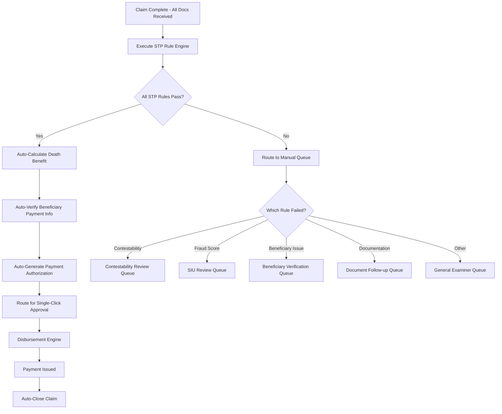

### 15.2 STP Performance Targets

| Metric | Target |
|---|---|
| STP eligibility rate | 45–55% of all death claims |
| STP processing time | < 24 hours from proof of loss complete |
| STP accuracy rate | 99.95% (near-zero errors) |
| False STP rejection rate | < 5% (claims routed to manual that could have been auto) |
| STP cost per claim | < $25 (vs. $250+ for manual) |

---

## 16. Architecture

### 16.1 Claims Microservice Architecture

```mermaid
flowchart TB
    subgraph "API Gateway"
        GW[API Gateway / Load Balancer]
    end
    
    subgraph "Claims Domain Services"
        CS[Claim Registration Service]
        CV[Claim Validation Service]
        CA[Claim Adjudication Service]
        CB[Benefit Calculation Engine]
        CI[Claims Investigation Service]
        CSO[Settlement Option Service]
    end
    
    subgraph "Shared Domain Services"
        PS[Policy Service]
        BEN[Beneficiary Service]
        DOC[Document Management Service]
        PAY[Disbursement Service]
        TAX[Tax Calculation Service]
        CORR[Correspondence Service]
        OFAC[OFAC Screening Service]
        AUD[Audit Service]
    end
    
    subgraph "External Integrations"
        DMF[SSDMF / LexisNexis]
        MIB[MIB Database]
        ACH[ACH / Banking]
        IRS[IRS e-File / FIRE]
        STATE[State Regulators]
        VENDOR[Investigation Vendors]
    end
    
    subgraph "Data Stores"
        CQRS[(Claims Command DB)]
        CQRSQ[(Claims Query DB)]
        DOCDB[(Document Store)]
        ES[(Event Store)]
        CACHE[(Redis Cache)]
    end
    
    subgraph "Infrastructure"
        MQ[Message Broker - Kafka]
        WF[Workflow Engine - Camunda/Temporal]
        RE[Rules Engine - Drools/OPA]
        ML[Fraud ML Model]
    end
    
    GW --> CS
    GW --> CV
    GW --> CA
    
    CS --> MQ
    CV --> MQ
    CA --> MQ
    
    MQ --> CI
    MQ --> CB
    MQ --> CSO
    MQ --> PAY
    MQ --> TAX
    MQ --> CORR
    MQ --> AUD
    
    CS --> CQRS
    CA --> CQRS
    CB --> CQRS
    
    CS --> WF
    CA --> WF
    CI --> WF
    
    CA --> RE
    CB --> RE
    
    CI --> ML
    CI --> MIB
    CI --> DMF
    CI --> VENDOR
    
    DOC --> DOCDB
    CS --> DOC
    
    PAY --> ACH
    PAY --> OFAC
    
    TAX --> IRS
    
    CORR --> STATE
    
    CS --> ES
    CA --> ES
    CB --> ES
    PAY --> ES
    
    CS --> CACHE
    CA --> CACHE
```

### 16.2 Service Descriptions

| Service | Responsibility | Technology Stack |
|---|---|---|
| Claim Registration Service | Intake, validation, claim number assignment | Java/Spring Boot, PostgreSQL |
| Claim Validation Service | Document completeness, identity verification | Java/Spring Boot, AI/ML (OCR) |
| Claim Adjudication Service | Contestability, exclusions, approval/denial | Java/Spring Boot, Drools |
| Benefit Calculation Engine | Net death benefit computation | Java, high-precision math library |
| Claims Investigation Service | SIU workflow, vendor coordination | Java/Spring Boot, Camunda |
| Settlement Option Service | Settlement calculations, account setup | Java/Spring Boot |
| Document Management Service | Scan, classify, store, retrieve documents | Java, S3/Azure Blob, Tesseract OCR |
| Disbursement Service | Payment processing across all methods | Java/Spring Boot, NACHA |
| Tax Calculation Service | Withholding, 1099 generation | Java/Spring Boot |
| Correspondence Service | Letter generation, multi-channel delivery | Java, template engine (Freemarker) |
| OFAC Screening Service | Sanctions list screening | Java/Spring Boot, Dow Jones/LexisNexis API |
| Audit Service | Immutable audit trail | Java/Spring Boot, Event Store |

### 16.3 Event-Driven Architecture

**Domain Events for Death Claim Processing:**

```json
{
  "events": [
    {
      "eventType": "ClaimRegistered",
      "data": { "claimNumber": "...", "policyNumbers": [...], "dateOfDeath": "..." }
    },
    {
      "eventType": "DocumentReceived",
      "data": { "claimNumber": "...", "documentType": "DEATH_CERTIFICATE", "documentId": "..." }
    },
    {
      "eventType": "ProofOfLossComplete",
      "data": { "claimNumber": "...", "completionDate": "..." }
    },
    {
      "eventType": "ContestabilityReviewCompleted",
      "data": { "claimNumber": "...", "result": "PASS", "findings": "..." }
    },
    {
      "eventType": "FraudScoreCalculated",
      "data": { "claimNumber": "...", "score": 15, "referToSIU": false }
    },
    {
      "eventType": "SIUReferralCreated",
      "data": { "claimNumber": "...", "referralId": "...", "triggers": [...] }
    },
    {
      "eventType": "BeneficiaryVerified",
      "data": { "claimNumber": "...", "beneficiaryId": "...", "verificationResult": "CONFIRMED" }
    },
    {
      "eventType": "BenefitCalculated",
      "data": { "claimNumber": "...", "netBenefit": 1025629.82, "components": {...} }
    },
    {
      "eventType": "ClaimApproved",
      "data": { "claimNumber": "...", "approvedAmount": 1025629.82, "approvedBy": "..." }
    },
    {
      "eventType": "SettlementElected",
      "data": { "claimNumber": "...", "optionType": "LUMP_SUM", "beneficiaryId": "..." }
    },
    {
      "eventType": "PaymentAuthorized",
      "data": { "claimNumber": "...", "paymentId": "...", "amount": 1025629.82 }
    },
    {
      "eventType": "PaymentIssued",
      "data": { "claimNumber": "...", "paymentId": "...", "method": "ACH", "transactionId": "..." }
    },
    {
      "eventType": "ClaimClosed",
      "data": { "claimNumber": "...", "closureReason": "PAID", "totalPaid": 1025629.82 }
    }
  ]
}
```

### 16.4 Integration Architecture

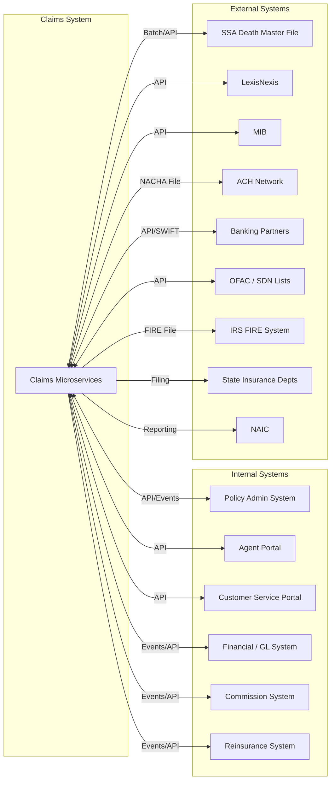

### 16.5 Deployment Architecture

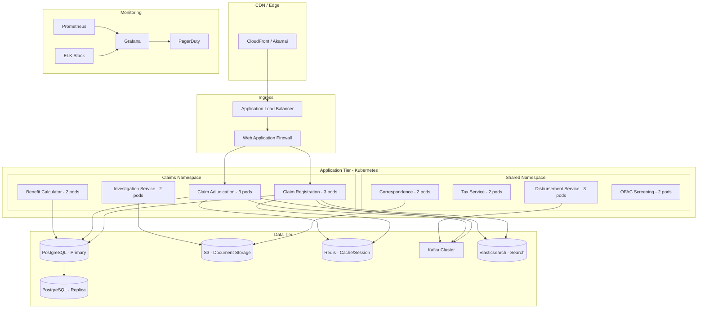

---

## 17. Sample Payloads & Calculations

### 17.1 Complete Death Claim Calculation — Whole Life Policy

**Scenario:** John Smith, age 80, died November 22, 2025. Whole Life policy with PUA rider and AD&D rider.

| Component | Amount | Notes |
|---|---|---|
| Base Face Amount | $500,000.00 | Per policy schedule |
| Paid-Up Additions Death Benefit | $45,200.00 | PUA rider benefit |
| Dividend Accumulations | $12,800.00 | Accumulated dividends on deposit |
| Terminal Dividend | $3,200.00 | Declared at death |
| **Subtotal — Life Benefits** | **$561,200.00** | |
| Accidental Death Benefit | $500,000.00 | AD&D rider — confirmed accident |
| **Subtotal — All Benefits** | **$1,061,200.00** | |
| Less: Outstanding Loan Principal | ($35,000.00) | Policy loan balance |
| Less: Accrued Loan Interest | ($2,450.00) | 5% on $35K, 6 months |
| Less: Overdue Premium | $0.00 | Paid through 12/31/2025 |
| Plus: Unearned Premium Refund | $907.53 | 39 days ($8,500 × 39/365) |
| **Net Death Benefit** | **$1,024,657.53** | |
| Plus: Interest from DOD to Payment | $5,080.91 | 60 days at 3.0% annual |
| **Total Payment** | **$1,029,738.44** | |

### 17.2 Complete Death Claim Calculation — Universal Life Policy

**Scenario:** Mary Johnson, age 62, died October 15, 2025. UL policy with Option B (increasing death benefit).

| Component | Amount | Notes |
|---|---|---|
| Option B Death Benefit | Face + Account Value | |
| Base Face Amount | $250,000.00 | Specified amount |
| Account Value as of 10/15/2025 | $87,500.00 | Includes monthly crediting to DOD |
| COI and Charges (pro-rata to DOD) | ($125.00) | Monthly deductions prorated |
| **Death Benefit (Option B)** | **$337,375.00** | Face + AV |
| Corridor Test (IRC §7702) | PASS | DB/AV ratio within corridor |
| Less: Outstanding Loan Principal | ($15,000.00) | |
| Less: Accrued Loan Interest | ($375.00) | Variable rate 5%, 6 months |
| **Net Death Benefit** | **$322,000.00** | |
| Plus: Interest from DOD to Payment | $1,327.67 | 50 days at 3.0% |
| **Total Payment** | **$323,327.67** | |

### 17.3 Suicide Exclusion Calculation

**Scenario:** Policy issued January 15, 2024. Insured died by suicide December 1, 2025 (within 2-year exclusion).

| Component | Amount | Notes |
|---|---|---|
| Premiums Paid | $14,280.00 | 23 monthly premiums × $620.87 |
| Less: Dividends Received | ($0.00) | Term policy — no dividends |
| **Limited Benefit (Premiums Returned)** | **$14,280.00** | |

### 17.4 API Payload — Claim Registration Request

```json
{
  "requestHeader": {
    "requestId": "uuid-123456",
    "timestamp": "2025-12-01T14:30:00Z",
    "sourceSystem": "CLAIMS_PORTAL",
    "userId": "CSR-12345"
  },
  "claimRegistration": {
    "claimType": "DEATH",
    "notificationSource": "BENEFICIARY",
    "notificationChannel": "PHONE",
    "insured": {
      "policyNumbers": ["WL-1234567", "TM-9876543"],
      "searchCriteria": {
        "ssn": "123-45-6789",
        "lastName": "Smith",
        "firstName": "John",
        "dateOfBirth": "1945-03-15"
      },
      "dateOfDeath": "2025-11-22",
      "placeOfDeath": {
        "city": "Hartford",
        "state": "CT",
        "country": "US",
        "facility": "Hartford Hospital"
      },
      "causeOfDeath": "Myocardial Infarction",
      "mannerOfDeath": "NATURAL"
    },
    "reporter": {
      "firstName": "Jane",
      "lastName": "Smith",
      "relationship": "SPOUSE",
      "phone": {
        "type": "MOBILE",
        "number": "555-123-4567"
      },
      "email": "jane.smith@email.com",
      "address": {
        "line1": "123 Main Street",
        "city": "Hartford",
        "state": "CT",
        "zip": "06101"
      },
      "preferredContactMethod": "EMAIL"
    },
    "funeralHome": {
      "name": "Hartford Memorial Funeral Home",
      "phone": "555-987-6543",
      "address": {
        "line1": "456 Oak Avenue",
        "city": "Hartford",
        "state": "CT",
        "zip": "06102"
      },
      "directorName": "Robert Williams"
    },
    "additionalNotes": "Spouse called to report death. Insured passed at Hartford Hospital. Death certificate expected within 1 week."
  }
}
```

### 17.5 API Payload — Claim Registration Response

```json
{
  "responseHeader": {
    "requestId": "uuid-123456",
    "timestamp": "2025-12-01T14:30:05Z",
    "status": "SUCCESS"
  },
  "claimRegistrationResult": {
    "masterClaimNumber": "2025-IL-0003847-2",
    "subClaims": [
      {
        "subClaimNumber": "2025-IL-0003847-2-001",
        "policyNumber": "WL-1234567",
        "productType": "WHOLE_LIFE",
        "faceAmount": 500000.00,
        "policyStatus": "IN_FORCE",
        "contestable": false,
        "riders": ["PUA", "ADB", "WP"]
      },
      {
        "subClaimNumber": "2025-IL-0003847-2-002",
        "policyNumber": "TM-9876543",
        "productType": "TERM_20",
        "faceAmount": 250000.00,
        "policyStatus": "IN_FORCE",
        "contestable": false,
        "riders": []
      }
    ],
    "claimStatus": "REPORTED",
    "assignedExaminer": {
      "name": "Sarah Johnson",
      "phone": "800-555-0100 ext 4567",
      "email": "sarah.johnson@carrier.com"
    },
    "requiredDocuments": [
      {
        "documentType": "CERTIFIED_DEATH_CERTIFICATE",
        "status": "OUTSTANDING",
        "description": "Original or certified copy of death certificate"
      },
      {
        "documentType": "CLAIMANT_STATEMENT",
        "status": "OUTSTANDING",
        "description": "Completed and signed claimant statement form"
      },
      {
        "documentType": "PROOF_OF_IDENTITY",
        "status": "OUTSTANDING",
        "description": "Government-issued photo ID for beneficiary"
      },
      {
        "documentType": "ACCIDENT_QUESTIONNAIRE",
        "status": "OUTSTANDING",
        "description": "Required for Accidental Death Benefit evaluation (if applicable)"
      }
    ],
    "slaDeadlines": {
      "acknowledgmentDeadline": "2025-12-22",
      "paymentDeadline": "TBD - awaiting proof of loss"
    },
    "acknowledgmentSent": true,
    "acknowledgmentMethod": "EMAIL",
    "claimKit": {
      "mailedDate": "2025-12-01",
      "mailedTo": "Jane Smith, 123 Main Street, Hartford, CT 06101",
      "contents": ["Cover letter", "Claimant Statement Form", "HIPAA Authorization", "Document Checklist"]
    }
  }
}
```

### 17.6 API Payload — Benefit Calculation Result

```json
{
  "benefitCalculation": {
    "claimNumber": "2025-IL-0003847-2-001",
    "policyNumber": "WL-1234567",
    "calculationDate": "2025-12-20",
    "calculationVersion": 1,
    "insured": {
      "name": "John A. Smith",
      "dateOfDeath": "2025-11-22",
      "ageAtDeath": 80
    },
    "components": {
      "baseFaceAmount": {
        "amount": 500000.00,
        "source": "POLICY_SCHEDULE"
      },
      "paidUpAdditions": {
        "amount": 45200.00,
        "source": "PUA_RIDER_CALCULATION"
      },
      "dividendAccumulations": {
        "amount": 12800.00,
        "source": "DIVIDEND_ACCOUNT"
      },
      "terminalDividend": {
        "amount": 3200.00,
        "source": "DIVIDEND_SCALE_2025"
      },
      "accidentalDeathBenefit": {
        "amount": 500000.00,
        "source": "ADB_RIDER",
        "eligible": true,
        "evaluationNotes": "Manner of death: Accident (motor vehicle). No exclusions apply."
      },
      "outstandingLoan": {
        "principal": -35000.00,
        "accruedInterest": -2450.00,
        "totalDeduction": -37450.00,
        "source": "LOAN_ACCOUNT"
      },
      "premiumAdjustment": {
        "amount": 907.53,
        "type": "UNEARNED_PREMIUM_REFUND",
        "calculation": "8500 * (39/365) = 907.53",
        "source": "PREMIUM_BILLING"
      },
      "interestFromDOD": {
        "amount": 5080.91,
        "rate": 0.03,
        "fromDate": "2025-11-22",
        "toDate": "2026-01-21",
        "days": 60,
        "principal": 1024657.53,
        "calculation": "1024657.53 * 0.03 * (60/365) = 5080.91",
        "isTaxable": true
      }
    },
    "summary": {
      "grossLifeBenefits": 561200.00,
      "riderBenefits": 500000.00,
      "totalGrossBenefit": 1061200.00,
      "totalDeductions": -36542.47,
      "netDeathBenefit": 1024657.53,
      "interestFromDOD": 5080.91,
      "totalPayable": 1029738.44
    },
    "beneficiaryAllocation": [
      {
        "beneficiaryId": "BEN-001",
        "name": "Jane M. Smith",
        "relationship": "SPOUSE",
        "sharePercent": 100.00,
        "allocatedAmount": 1029738.44,
        "taxableInterest": 5080.91
      }
    ],
    "taxReporting": {
      "form1099INT": {
        "required": true,
        "taxableInterest": 5080.91,
        "recipientTIN": "***-**-4321",
        "recipientName": "Jane M. Smith"
      },
      "form1099R": {
        "required": false,
        "reason": "Lump sum death benefit — tax-free under IRC 101(a)(1)"
      }
    }
  }
}
```

---

## 18. Appendices

### Appendix A: Death Claim Status Codes

| Status | Sub-Status | Description |
|---|---|---|
| REPORTED | AWAITING_DOCUMENTATION | Claim registered, claim kit sent |
| REPORTED | DOCUMENTATION_PARTIAL | Some documents received, awaiting others |
| IN_REVIEW | PROOF_OF_LOSS_COMPLETE | All required documents received |
| IN_REVIEW | CONTESTABILITY_INVESTIGATION | Under contestability review |
| IN_REVIEW | SIU_INVESTIGATION | Referred to Special Investigation Unit |
| IN_REVIEW | BENEFICIARY_VERIFICATION | Verifying beneficiary eligibility |
| IN_REVIEW | MEDICAL_REVIEW | Under medical director review |
| IN_REVIEW | LEGAL_REVIEW | Referred to legal department |
| ADJUDICATED | APPROVED | Claim approved for payment |
| ADJUDICATED | DENIED | Claim denied (with reason code) |
| ADJUDICATED | RESCINDED | Policy rescinded during contestability |
| ADJUDICATED | PARTIAL_APPROVAL | Some benefits approved, others denied |
| PENDING_PAYMENT | AWAITING_SETTLEMENT_ELECTION | Approved, waiting for beneficiary election |
| PENDING_PAYMENT | PAYMENT_PROCESSING | Payment being processed |
| CLOSED | PAID | Claim fully paid and closed |
| CLOSED | DENIED_FINAL | Denial upheld after appeal |
| CLOSED | RESCINDED_FINAL | Rescission upheld |
| CLOSED | LITIGATED | Resolved through litigation |
| REOPENED | APPEAL | Beneficiary appealed denial |
| REOPENED | ADDITIONAL_INFO | New information received after closure |
| SUSPENDED | INTERPLEADER | Filed with court due to competing claims |
| SUSPENDED | CRIMINAL_INVESTIGATION | Awaiting criminal proceeding outcome |

### Appendix B: Claim Denial Reason Codes

| Code | Description | Appeal Right |
|---|---|---|
| D001 | Policy lapsed — no coverage at date of death | Yes |
| D002 | Material misrepresentation — rescission | Yes |
| D003 | Suicide within exclusion period (limited benefit paid) | Yes |
| D004 | War exclusion | Yes |
| D005 | Aviation exclusion (AD&D rider only) | Yes |
| D006 | Felony exclusion | Yes |
| D007 | No insurable interest at policy inception | Yes |
| D008 | Policy void — fraud in the inducement | Yes |
| D009 | Slayer rule — beneficiary caused death | N/A (court) |
| D010 | Policy not in force — free look cancellation | No |

### Appendix C: Regulatory Compliance Checklist

| Requirement | Regulation | PAS Implementation |
|---|---|---|
| Timely acknowledgment | State unfair claims practices | SLA tracking engine |
| Timely payment/denial | State prompt payment laws | SLA tracking + alerts |
| Interest on late payment | State-specific rates | Interest calculation service |
| DMF cross-matching | NAIC Model #580 | Batch matching service |
| Unclaimed benefits | State escheatment laws | Escheatment management module |
| OFAC screening | US Treasury regulations | Real-time screening service |
| 1099 reporting | IRS regulations | Tax reporting service |
| ERISA compliance | 29 CFR 2560.503-1 | ERISA claims workflow |
| HIPAA compliance | 45 CFR Parts 160, 164 | PHI access controls |
| Anti-money laundering | BSA / FinCEN | SAR filing integration |

### Appendix D: Glossary of Terms

| Term | Definition |
|---|---|
| AD&D | Accidental Death and Dismemberment |
| APS | Attending Physician's Statement |
| CLUE | Comprehensive Loss Underwriting Exchange |
| DMF | Death Master File (Social Security Administration) |
| ERISA | Employee Retirement Income Security Act |
| HIPAA | Health Insurance Portability and Accountability Act |
| IRC | Internal Revenue Code |
| MIB | Medical Information Bureau |
| NAIC | National Association of Insurance Commissioners |
| NICB | National Insurance Crime Bureau |
| OFAC | Office of Foreign Assets Control |
| PAS | Policy Administration System |
| PUA | Paid-Up Additions |
| SAR | Suspicious Activity Report |
| SDN | Specially Designated Nationals |
| SIU | Special Investigation Unit |
| SSDMF | Social Security Death Master File |
| STP | Straight-Through Processing |
| STOLI | Stranger-Originated Life Insurance |
| TXLife | ACORD Transaction Life message standard |
| UL | Universal Life |
| USDA | Uniform Simultaneous Death Act |
| UTMA | Uniform Transfers to Minors Act |
| VUL | Variable Universal Life |
| WP | Waiver of Premium |

### Appendix E: References

1. ACORD TXLife Standard, Version 2.44 — www.acord.org
2. NAIC Model Unclaimed Life Insurance Benefits Act (#580)
3. IRC Section 101 — Certain Death Benefits
4. IRC Section 2042 — Proceeds of Life Insurance
5. Uniform Simultaneous Death Act (1993)
6. Uniform Probate Code — 120 Hour Survival Rule
7. 29 CFR 2560.503-1 — ERISA Claims Procedure
8. HIPAA Privacy Rule — 45 CFR Parts 160, 164
9. NACHA Operating Rules — ACH Disbursements
10. OFAC Compliance Guidelines — US Treasury

---

*Article 30 of the Life Insurance PAS Architect's Encyclopedia*
*Version 1.0 — April 2026*
