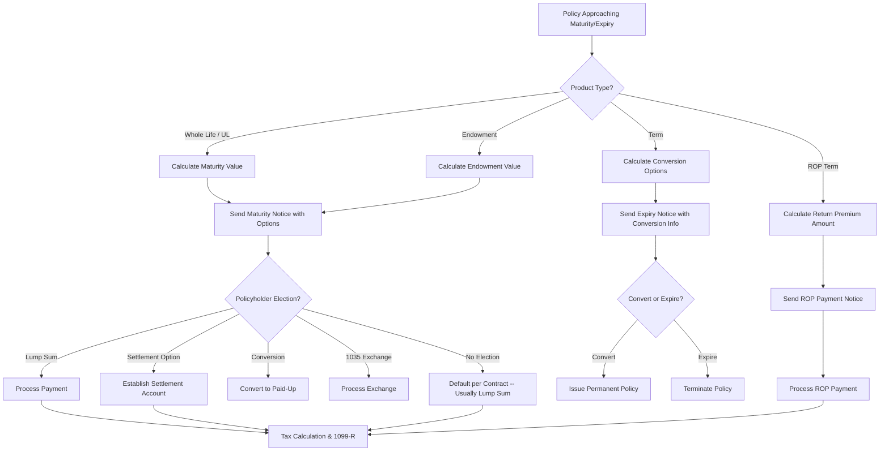
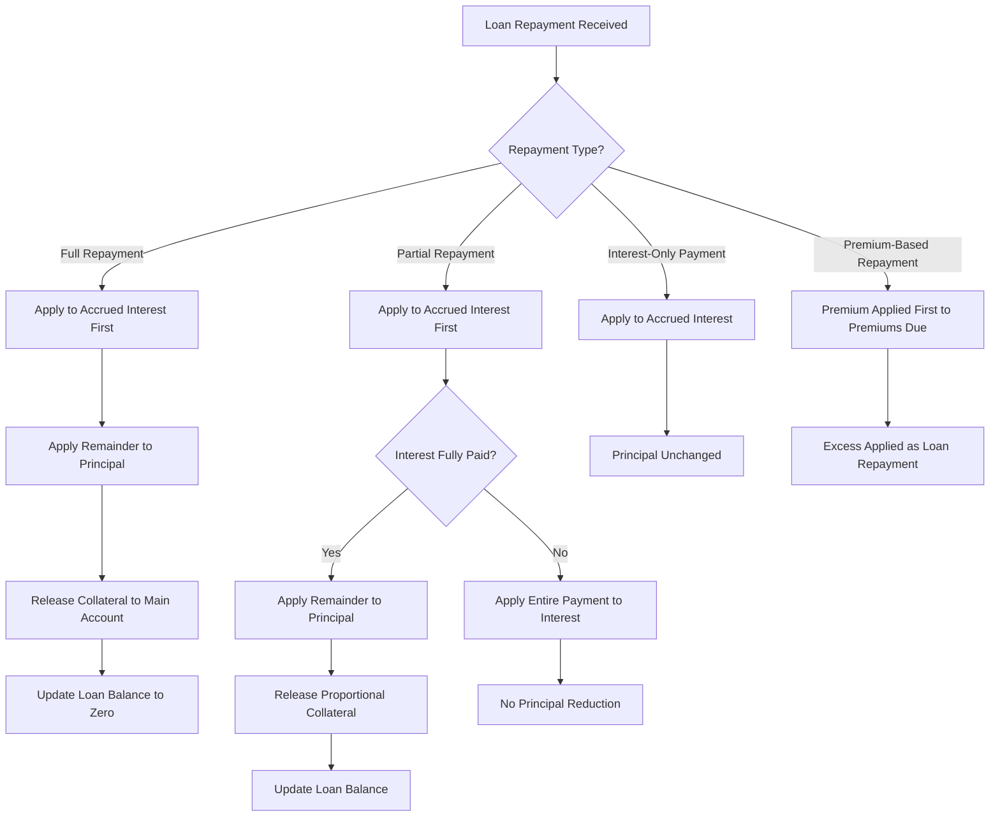
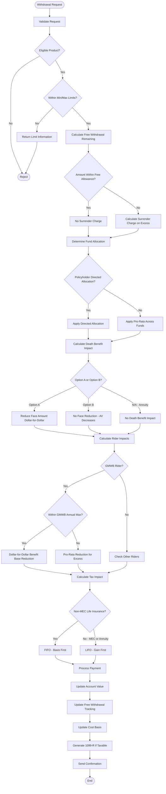
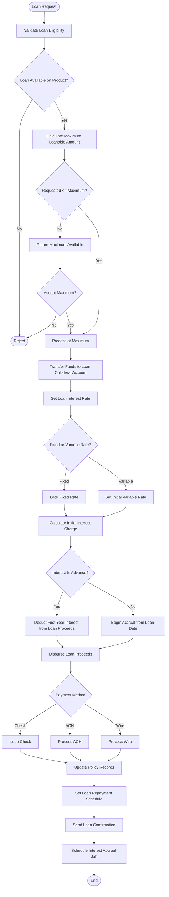
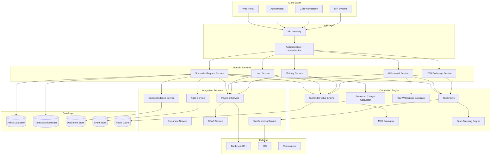
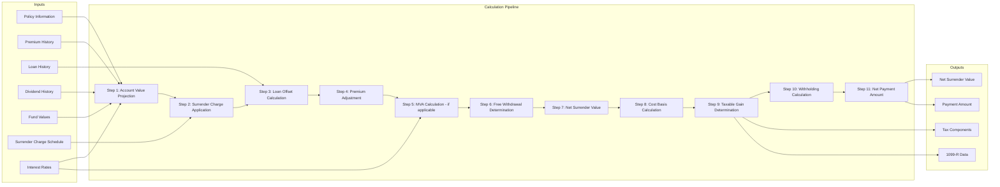
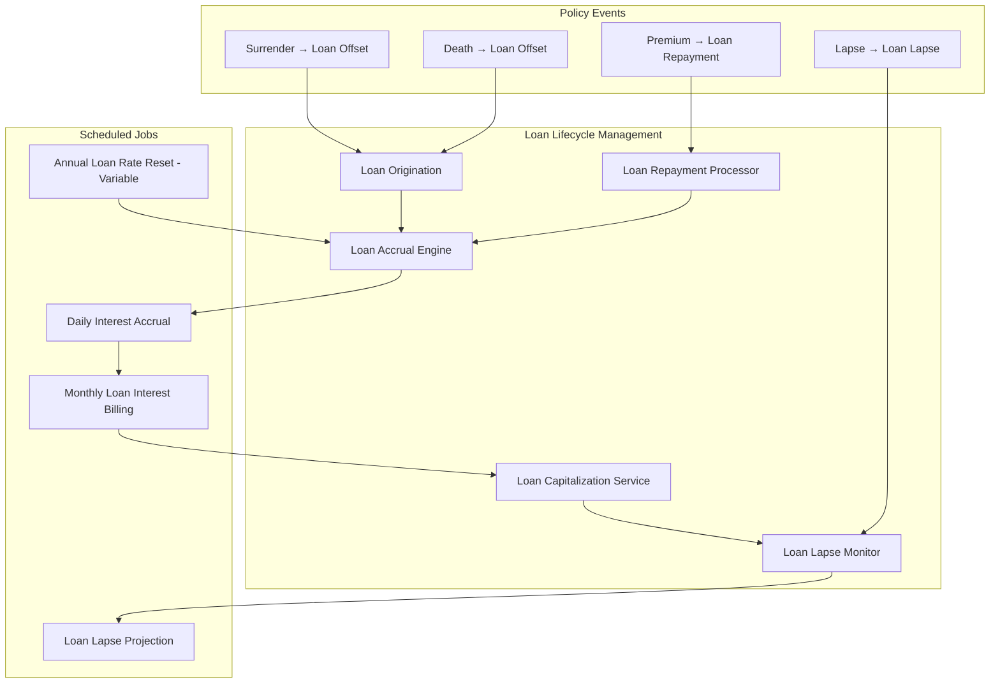
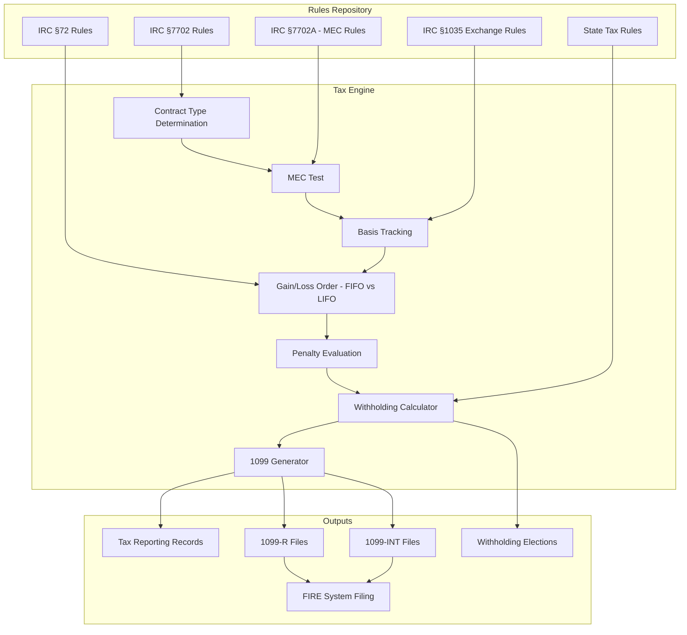

# Article 31: Maturity, Surrender & Partial Withdrawal

## Life Insurance Policy Administration System — Architect's Encyclopedia

---

## Table of Contents

1. [Executive Overview](#1-executive-overview)
2. [Policy Maturity](#2-policy-maturity)
3. [Full Surrender](#3-full-surrender)
4. [Surrender Charges](#4-surrender-charges)
5. [Partial Withdrawal](#5-partial-withdrawal)
6. [Policy Loan Processing](#6-policy-loan-processing)
7. [Tax Treatment](#7-tax-treatment)
8. [1035 Exchange Impact](#8-1035-exchange-impact)
9. [Settlement Options](#9-settlement-options)
10. [Calculation Walkthroughs](#10-calculation-walkthroughs)
11. [Entity-Relationship Model](#11-entity-relationship-model)
12. [BPMN Process Flows](#12-bpmn-process-flows)
13. [Architecture](#13-architecture)
14. [Sample Payloads](#14-sample-payloads)
15. [Appendices](#15-appendices)

---

## 1. Executive Overview

Maturity, surrender, and partial withdrawal transactions represent the primary liquidity events for permanent life insurance and annuity policyholders. These transactions are among the most calculation-intensive activities within a Policy Administration System (PAS), involving surrender charge schedules, cost basis tracking, tax withholding, policy loan offsets, and multi-layered regulatory compliance.

### 1.1 Business Context

| Transaction Type | Annual Volume (Industry) | Average Processing Time | Key Complexity |
|---|---|---|---|
| Policy Maturity | ~200,000 | 15–30 days | Advance notification, settlement options |
| Full Surrender | ~2.5 million | 5–15 days | Surrender charges, tax calculation |
| Partial Withdrawal | ~4 million | 3–7 days | Death benefit impact, fund allocation |
| Policy Loans | ~3 million | 1–5 days | Loan interest, crediting impact |
| 1035 Exchanges | ~500,000 | 30–90 days | Carrier coordination, basis transfer |

### 1.2 Key Architectural Challenges

1. **Calculation precision** — Surrender values must be accurate to the penny across complex product structures
2. **Real-time processing** — Policyholders expect same-day or next-day disbursement
3. **Tax compliance** — Correct 1099-R generation with proper distribution codes is critical
4. **Regulatory variability** — State-specific free-look rules, minimum surrender values (Standard Nonforfeiture Law), and withdrawal rights
5. **Product diversity** — Whole life, universal life, variable universal life, indexed universal life, fixed annuity, variable annuity, and indexed annuity each have unique surrender/withdrawal mechanics

### 1.3 Key Metrics

| Metric | Industry Average | Best-in-Class |
|---|---|---|
| Surrender processing STP rate | 40% | 70% |
| Average days to payment | 7 days | 2 days |
| Calculation accuracy | 99.5% | 99.99% |
| 1099-R accuracy rate | 98% | 99.9% |
| Customer satisfaction (NPS) | +10 | +40 |

---

## 2. Policy Maturity

### 2.1 Maturity Age Concepts

Policy maturity occurs when the insured reaches the maturity age specified in the policy contract. At maturity, the policy endows — the cash value equals the face amount, and the carrier must pay the maturity value.

#### 2.1.1 Maturity Ages by Product and Mortality Table

| Mortality Table | Maturity Age | Products Using |
|---|---|---|
| 1958 CSO | Age 100 | Policies issued pre-1980 |
| 1980 CSO | Age 100 | Policies issued 1980–2000 |
| 2001 CSO | Age 121 | Policies issued 2001–2017 |
| 2017 CSO | Age 121 | Policies issued 2017+ |
| Custom (some UL) | Age 95 | Older UL products |
| Endowment | Various (55, 60, 65) | Endowment products |
| Term | N/A (expires, not matures) | Term life |

#### 2.1.2 Maturity Date Calculation

```
FUNCTION calculateMaturityDate(policy):
    maturityAge = policy.product.maturityAge  // e.g., 100 or 121
    
    // Standard maturity — on policy anniversary nearest to maturity age
    maturityAnniversaryDate = policy.issueDate + (maturityAge - policy.issueAge) years
    
    // Some products mature on the exact birthday
    IF policy.product.maturityBasis == "EXACT_BIRTHDAY":
        maturityDate = insured.dateOfBirth + maturityAge years
    ELIF policy.product.maturityBasis == "POLICY_ANNIVERSARY":
        maturityDate = maturityAnniversaryDate
    ELIF policy.product.maturityBasis == "MONTHLY_ANNIVERSARY":
        maturityDate = nearest monthly anniversary to exact birthday + maturityAge
    
    RETURN maturityDate
```

### 2.2 Maturity Notification

Carriers must notify policyholders well in advance of maturity:

| Notification | Timing | Content |
|---|---|---|
| Advance notice | 6–12 months before maturity | Maturity date, estimated value, options |
| Reminder notice | 90 days before maturity | Updated value, election form, deadlines |
| Final notice | 30 days before maturity | Final value, settlement option election deadline |
| Post-maturity notice | Day of maturity (if no election) | Confirm default option, payment details |

**Notification content:**
- Maturity date
- Estimated maturity value (face amount for endowed policies)
- Available settlement options (lump sum, settlement options, conversion)
- Tax implications of maturity
- Instructions for election
- Deadline for election
- Contact information

### 2.3 Maturity Options

| Option | Description | Tax Treatment |
|---|---|---|
| Lump sum cash payment | Full maturity value paid in single payment | Gain taxable (proceeds – cost basis) |
| Settlement option (interest only) | Leave proceeds on deposit, receive interest | Interest taxable; principal withdrawals adjust basis |
| Settlement option (fixed period) | Equal payments over specified years | Each payment has taxable and non-taxable portion |
| Settlement option (life income) | Annuitized payments for life | Exclusion ratio applies |
| Conversion to paid-up policy | Exchange for paid-up coverage (no premiums) | No current tax event (IRC §1035) |
| Extended term insurance | Use maturity value to purchase term | No current tax event |
| Rollover to new product | 1035 exchange into new policy/annuity | Tax-deferred exchange |

### 2.4 Maturity Value Calculation

#### 2.4.1 Whole Life Maturity

At maturity (typically age 100 or 121), the cash value equals the face amount:

```
Maturity Value = Face Amount (base)
              + Paid-Up Additions Cash Value
              + Dividend Accumulations
              + Terminal Dividend (if any)
              - Outstanding Loan Principal
              - Accrued Loan Interest
```

#### 2.4.2 Universal Life Maturity

```
Maturity Value = Account Value (on maturity date)
              = Account Value (prior month)
              + Premium Credited (if any)
              + Interest Credited (daily/monthly to maturity date)
              - Monthly Deductions (COI + expense charges, pro-rata)
              - Outstanding Loan Balance (if applicable)
```

**Critical UL maturity issue:** Many older UL policies issued at "age 95 maturity" have insufficient account value at maturity due to increasing COI charges. The PAS must:
1. Track projected maturity values
2. Alert policyholders years in advance if account value is projected to be insufficient
3. Process maturity with potentially reduced value

#### 2.4.3 Endowment Maturity

```
Endowment Maturity Value = Face Amount (guaranteed endowment value)
                         + Accumulated Dividends (if participating)
                         + Paid-Up Additions Value
                         - Outstanding Loans
```

### 2.5 Term Policy Expiry

Term life insurance does not mature — it expires at the end of the term period:
- **No cash value** (except for rare return-of-premium term products)
- **Notification requirements:** Advance notice of expiration, conversion rights information
- **Conversion options:** Right to convert to permanent insurance without evidence of insurability (typically expires at a specified age, e.g., 65 or 70)
- **Return of Premium (ROP) Term:** If the insured survives the term, the sum of premiums paid is returned



---

## 3. Full Surrender

### 3.1 Surrender Request Processing

#### 3.1.1 Request Channels

| Channel | Requirements | Processing Time |
|---|---|---|
| Written request (mail/fax) | Original signature (or acceptable electronic) | 5–10 business days |
| Online portal | Authentication + electronic signature | 1–3 business days |
| Phone with verification | Knowledge-based authentication, recorded consent | 3–5 business days |
| Agent-assisted | Agent-verified identity, signed forms | 3–7 business days |

#### 3.1.2 Surrender Eligibility Verification

Before processing a surrender, the PAS must validate:

```yaml
surrenderEligibilityChecks:
  - check: "policy.status IN ('IN_FORCE', 'REDUCED_PAID_UP', 'PREMIUM_WAIVER')"
    failAction: "REJECT — Policy not eligible for surrender"
  
  - check: "policy.surrenderValue > 0"
    failAction: "REJECT — No surrender value available"
  
  - check: "policy.hasNoActiveBenefitClaim"
    failAction: "HOLD — Pending claim must be resolved first"
  
  - check: "policy.irrevocableBeneficiary == false OR irrevocableBeneficiaryConsent == true"
    failAction: "REJECT — Irrevocable beneficiary consent required"
  
  - check: "policy.collateralAssignment == false OR assigneeRelease == true"
    failAction: "REJECT — Assignment release required from assignee"
  
  - check: "policy.hasPendingLoanRepayment == false"
    failAction: "HOLD — Pending loan transaction must complete"
  
  - check: "requestor.isOwner == true OR requestor.hasPowerOfAttorney == true"
    failAction: "REJECT — Only owner or authorized representative can surrender"
  
  - check: "policy.inFreeLookPeriod == false OR specialFreeLookProcessing == true"
    failAction: "ROUTE — Free-look surrender processing path"
  
  - check: "policy.qualifiedPlan == false OR qualifiedPlanDistributionEligible == true"
    failAction: "REJECT — Qualified plan distribution restrictions apply"
  
  - check: "policy.jurisdiction != 'NY' OR nySpecialHandling == true"
    failAction: "ROUTE — New York requires special surrender processing"
```

### 3.2 Surrender Value Calculation

#### 3.2.1 Master Surrender Formula

```
Net Surrender Value = 
    Gross Cash Value
  - Surrender Charges
  - Outstanding Loan Principal
  - Accrued Loan Interest  
  - Due/Overdue Premiums
  + Dividend Accumulations (if participating)
  + Paid-Up Addition Values (if PUA rider)
  + Advance Premium (refund of any prepaid premium)
  + Any Refundable Premium (pro-rata for current period)
  + Experience Rating Refund (group/corporate policies)
  - Market Value Adjustment (MVA, for some fixed annuities/products)
  + One-Year Term Dividend Addition (if applicable)
  + Terminal Dividend (if applicable)
```

#### 3.2.2 Gross Cash Value by Product Type

**Whole Life:**
```
Gross Cash Value = Guaranteed Cash Value (per policy schedule for current duration)
                 + Terminal Dividend Value
                 = Based on policy reserves minus surrender charge (if any)
```

**Universal Life:**
```
Gross Cash Value = Account Value
                 = Sum of all segments/buckets
                 = For each segment: (Premium allocated + Interest credited - COI deducted - Expense charges)
```

**Variable Universal Life:**
```
Gross Cash Value = Sum of subaccount market values (as of valuation date)
                 + Fixed account value
                 + Loan collateral account
```

**Indexed Universal Life:**
```
Gross Cash Value = Sum of indexed segment values (using current index credits or guaranteed minimums)
                 + Fixed account value
                 + Accumulated index credits
```

**Fixed Annuity:**
```
Gross Cash Value = Purchase payment(s)
                 + Guaranteed interest credits
                 + Excess interest credits
                 - Prior withdrawals
                 - Rider charges
```

**Variable Annuity:**
```
Gross Cash Value = Sum of subaccount market values
                 + Fixed account value
                 - Applicable M&E charges (pro-rated)
                 - Administrative charges
```

### 3.3 Free-Look Surrender

During the free-look period (typically 10–30 days from policy delivery, varies by state):

| State | Free-Look Period | Refund Amount |
|---|---|---|
| Most states | 10 days | Full premium refund |
| California | 30 days (annuities, age 60+) | Full premium refund |
| New York | 10 days (life), 45 days (annuity replacement) | Premium or account value (if greater) |
| Florida | 14 days | Full premium refund |
| Some states (VUL/VA) | 10–30 days | Account value (may be less than premium) |

**Free-look refund calculation:**
```
IF policy.product.isVariableProduct:
    // Variable products — refund account value (market risk on policyholder)
    freeLookRefund = accountValue
ELSE:
    // Fixed products — refund full premium
    freeLookRefund = totalPremiumsPaid
```

### 3.4 State-Specific Surrender Requirements

| State | Requirement |
|---|---|
| New York | Requires written request; carrier must respond within 30 days; minimum cash value per §4220 |
| California | 30-day free look for seniors (age 60+); 10-day for others |
| Texas | Must provide surrender value within 60 days of request |
| All states | Standard Nonforfeiture Law — minimum guaranteed surrender values |

### 3.5 Standard Nonforfeiture Law

The Standard Nonforfeiture Law (adopted in all states) requires that life insurance policies provide minimum guaranteed cash surrender values after the policy has been in force for a specified period (typically 2–3 years for whole life):

**Key requirements:**
- Minimum cash values must be based on specified mortality tables and interest rates
- Cash values must be available as a nonforfeiture benefit if premiums are discontinued
- Three nonforfeiture options must be available:
  1. **Cash surrender value** — Lump sum payment
  2. **Reduced paid-up insurance** — Reduced face amount, no more premiums
  3. **Extended term insurance** — Same face amount for a limited period

```
Minimum Cash Value = Present Value of Future Benefits (at nonforfeiture rate)
                   - Present Value of Future Adjusted Premiums
                   - Per-policy amount (allowed deduction)
```

---

## 4. Surrender Charges

### 4.1 Surrender Charge Schedules

#### 4.1.1 Declining Schedule (Most Common)

Surrender charges typically decline over 7–15 years:

**Example — Universal Life:**

| Policy Year | Surrender Charge % | On $100K Face |
|---|---|---|
| 1 | 100% of target premium | $4,500 |
| 2 | 90% | $4,050 |
| 3 | 80% | $3,600 |
| 4 | 70% | $3,150 |
| 5 | 60% | $2,700 |
| 6 | 50% | $2,250 |
| 7 | 40% | $1,800 |
| 8 | 30% | $1,350 |
| 9 | 20% | $900 |
| 10 | 10% | $450 |
| 11+ | 0% | $0 |

#### 4.1.2 Surrender Charge Types

| Type | Basis | Description |
|---|---|---|
| Premium-based | % of target/total premiums | Charge = % × specified premium amount |
| Account-value-based | % of account value | Charge = % × current account value |
| Face-amount-based | $ per $1,000 of face | Charge = rate × (face / 1,000) |
| CDSC (Contingent Deferred Sales Charge) | % of withdrawal | Common for annuities; applies to withdrawals |
| Flat schedule | Fixed dollar amount by year | Declining fixed dollar amounts |

#### 4.1.3 Multiple Surrender Charge Layers

Some products (especially those with premium flexibility) apply surrender charges on each premium payment separately:

```
Total Surrender Charge = Σ (each premium payment × applicable charge % based on age of that premium)

Example:
  Premium 1 ($10,000 in Year 1): Surrender in Year 3 → $10,000 × 80% = $8,000
  Premium 2 ($5,000 in Year 2): Surrender in Year 3 → $5,000 × 90% = $4,500
  Premium 3 ($5,000 in Year 3): Surrender in Year 3 → $5,000 × 100% = $5,000
  Total Surrender Charge = $17,500
```

### 4.2 Free Withdrawal Amount

Most UL and annuity products allow a certain amount to be withdrawn each year without surrender charges:

#### 4.2.1 Common Free Withdrawal Provisions

| Product Type | Free Withdrawal Provision |
|---|---|
| Universal Life | 10% of account value per year |
| Fixed Annuity | 10% of purchase payment or account value per year |
| Variable Annuity | 10% of account value or cumulative premiums |
| Indexed Annuity | 10% of account value; may be limited during index term |
| Some products | Interest only (accumulated interest is always free) |
| Nursing home waiver | 100% free if in nursing home > 90 days |
| Terminal illness waiver | 100% free if diagnosed with terminal illness |

#### 4.2.2 Free Withdrawal Calculation

```
FUNCTION calculateFreeWithdrawalAmount(policy, requestDate):
    freeAmountType = policy.product.freeWithdrawalType
    
    IF freeAmountType == "PERCENT_OF_AV":
        annualFreeAmount = policy.accountValue * policy.product.freeWithdrawalPct
    ELIF freeAmountType == "PERCENT_OF_PREMIUM":
        annualFreeAmount = policy.cumulativePremiums * policy.product.freeWithdrawalPct
    ELIF freeAmountType == "INTEREST_ONLY":
        annualFreeAmount = policy.accumulatedInterest
    
    // Reduce by any free withdrawals already taken this policy year
    ytdFreeWithdrawals = SUM(policy.withdrawals
        .filter(w => w.date >= policy.currentAnniversary && w.isFreeWithdrawal)
        .map(w => w.freeAmount))
    
    remainingFreeAmount = MAX(0, annualFreeAmount - ytdFreeWithdrawals)
    
    RETURN remainingFreeAmount
```

### 4.3 Surrender Charge Waiver Provisions

| Waiver Trigger | Typical Provision | Documentation Required |
|---|---|---|
| Death of owner/annuitant | Full waiver | Death certificate |
| Terminal illness | Full waiver | Physician certification (12-month life expectancy) |
| Disability | Full waiver (after 90 days) | Physician certification + SSA disability |
| Nursing home confinement | Full waiver (after 90–180 days) | Nursing home admission records |
| Unemployment | Partial waiver (some products) | State unemployment verification |
| Annuitization | Full waiver (after minimum holding period) | Annuitization election |
| RMD withdrawals | Waiver for RMD amount | Qualified plan + age 72/73+ |
| Systematic withdrawals | May waive for specific systematic programs | Enrollment in program |

### 4.4 CDSC Calculation for Annuities

Contingent Deferred Sales Charges (CDSC) for annuities use a FIFO method on premium payments:

```
FUNCTION calculateCDSC(annuity, withdrawalAmount):
    // Determine free withdrawal amount
    freeAmount = calculateFreeWithdrawalAmount(annuity)
    excessAmount = MAX(0, withdrawalAmount - freeAmount)
    
    IF excessAmount == 0:
        RETURN 0  // No CDSC — within free amount
    
    // Apply CDSC using FIFO on premium payments
    remainingExcess = excessAmount
    totalCDSC = 0
    
    // Sort premiums by date (FIFO)
    FOR EACH premium IN annuity.premiums ORDER BY paymentDate ASC:
        IF remainingExcess <= 0: BREAK
        
        availableFromThisPremium = premium.amount - premium.priorWithdrawals
        chargeableAmount = MIN(remainingExcess, availableFromThisPremium)
        
        premiumAge = YEARS_BETWEEN(premium.paymentDate, today())
        cdscRate = getCDSCRate(annuity.product, premiumAge)
        
        cdscForThisPremium = chargeableAmount * cdscRate
        totalCDSC += cdscForThisPremium
        
        remainingExcess -= chargeableAmount
        premium.priorWithdrawals += chargeableAmount
    
    RETURN totalCDSC
```

### 4.5 Market Value Adjustment (MVA)

Applies to fixed annuities and some universal life products with market value adjusted features:

```
MVA Factor = ((1 + originalRate) / (1 + currentRate + spread)) ^ remainingYears - 1

Example:
  Original guaranteed rate: 4.0%
  Current rate for same duration: 5.5%
  Spread: 0.25%
  Remaining surrender charge period: 5 years
  
  MVA Factor = (1.04 / (1.055 + 0.0025))^5 - 1
             = (1.04 / 1.0575)^5 - 1
             = (0.9835)^5 - 1
             = 0.9203 - 1
             = -0.0797  (negative = downward adjustment)
  
  Account Value: $100,000
  MVA Adjustment: $100,000 × (-0.0797) = -$7,970
  Adjusted Surrender Value: $100,000 - $7,970 = $92,030
```

### 4.6 Real-Dollar Surrender Charge

Some products specify surrender charges as fixed dollar amounts that reduce over time:

| Year | Surrender Charge per $1,000 Face |
|---|---|
| 1 | $52.00 |
| 2 | $48.00 |
| 3 | $44.00 |
| 4 | $38.00 |
| 5 | $30.00 |
| 6 | $22.00 |
| 7 | $14.00 |
| 8 | $6.00 |
| 9+ | $0.00 |

---

## 5. Partial Withdrawal

### 5.1 Withdrawal Eligibility Rules

```yaml
partialWithdrawalEligibility:
  productEligibility:
    - "Product must allow partial withdrawals (UL, VUL, IUL, annuities)"
    - "Whole life typically does NOT allow partial withdrawals (use loans instead)"
    - "Variable annuities during accumulation phase"
  
  minimumWithdrawalAmount:
    - universalLife: "$250 or $500 (product-specific)"
    - fixedAnnuity: "$500 or $1,000"
    - variableAnnuity: "$250 or $500"
  
  maximumWithdrawalAmount:
    - rule: "Account value - minimum required account value - surrender charges on excess"
    - minimumAccountValuePostWithdrawal:
        universalLife: "$500 to $2,000 (product-specific)"
        annuity: "$2,000 to $5,000"
    - note: "If withdrawal would reduce AV below minimum, must full surrender instead"
  
  frequencyLimits:
    - "Maximum 4 partial withdrawals per policy year (some products)"
    - "Minimum 30 days between withdrawals (some products)"
  
  contractualRestrictions:
    - "No withdrawals during surrender charge period (some older products)"
    - "No withdrawals from indexed segments before segment maturity (IUL)"
    - "No withdrawals if policy is in grace period or lapsed"
    - "No withdrawals if irrevocable beneficiary has not consented"
```

### 5.2 Withdrawal Impact on Death Benefit

#### 5.2.1 Option A (Level Death Benefit) UL

Under Option A, the death benefit is the greater of the face amount or the account value times the §7702 corridor factor. A partial withdrawal **reduces the face amount dollar-for-dollar**:

```
Before Withdrawal:
  Face Amount: $500,000
  Account Value: $85,000
  Death Benefit: $500,000 (face amount, since AV × corridor < face)

Withdrawal: $20,000

After Withdrawal:
  Face Amount: $480,000  ($500,000 - $20,000)
  Account Value: $65,000  ($85,000 - $20,000)
  Death Benefit: $480,000
```

#### 5.2.2 Option B (Increasing Death Benefit) UL

Under Option B, the death benefit is the face amount PLUS the account value. A partial withdrawal **does NOT reduce the face amount** — only the account value decreases:

```
Before Withdrawal:
  Face Amount: $500,000
  Account Value: $85,000
  Death Benefit: $585,000 (face + AV)

Withdrawal: $20,000

After Withdrawal:
  Face Amount: $500,000 (unchanged)
  Account Value: $65,000 ($85,000 - $20,000)
  Death Benefit: $565,000 ($500,000 + $65,000)
```

### 5.3 Withdrawal Impact on Rider Benefit Bases

This is a critical and complex area for products with living benefit riders:

#### 5.3.1 GMWB (Guaranteed Minimum Withdrawal Benefit)

| Withdrawal Type | Impact on Benefit Base |
|---|---|
| Within annual maximum (e.g., 5% of benefit base) | Dollar-for-dollar reduction |
| Excess withdrawal (above annual maximum) | Pro-rata reduction |

**Pro-rata reduction formula for excess withdrawal:**
```
Pro-rata Factor = 1 - (Excess Withdrawal Amount / Account Value Before Withdrawal)
New Benefit Base = Old Benefit Base × Pro-rata Factor

Example:
  Benefit Base: $200,000
  Account Value: $150,000
  Annual Maximum Withdrawal: $10,000 (5% of $200K)
  Actual Withdrawal: $25,000
  Excess Amount: $15,000 ($25K - $10K)
  
  Pro-rata Factor = 1 - ($15,000 / $150,000) = 1 - 0.10 = 0.90
  
  Dollar-for-dollar reduction (for the first $10K):
  Benefit Base after: $200,000 - $10,000 = $190,000
  
  Pro-rata reduction (for the excess $15K):
  New Benefit Base: $190,000 × 0.90 = $171,000
```

#### 5.3.2 GMDB (Guaranteed Minimum Death Benefit)

| GMDB Type | Withdrawal Impact |
|---|---|
| Return of premium | Reduce by withdrawal amount |
| Highest anniversary value | Pro-rata reduction (withdrawal / AV) |
| Roll-up (e.g., 5% compound) | Pro-rata reduction |

### 5.4 Withdrawal from Specific Funds/Segments

#### 5.4.1 Variable Products (VUL, VA)

Policyholders can typically direct withdrawals from specific subaccounts:
- **Pro-rata across all subaccounts** (default)
- **Specific fund liquidation** (policyholder-directed)
- **LIFO from most recent allocation** (some products)
- **Fixed account last** (some products restrict fixed account withdrawals)

#### 5.4.2 Indexed Products (IUL, FIA)

Indexed segment withdrawal rules:
- **Indexed segments before maturity:** May forfeit index credits earned during the segment term; cash out at guaranteed minimum rate or interim value
- **Fixed account segments:** Withdraw at accumulated value
- **Segment selection priority:** Product-specific (may require pro-rata, or allow policyholder selection)

### 5.5 Cost Basis Allocation for Partial Withdrawals

#### 5.5.1 Non-Qualified Life Insurance (FIFO)

Under IRC §72(e), withdrawals from non-MEC life insurance policies are treated as **basis-first (FIFO)**:

```
IF withdrawalAmount <= costBasis:
    taxableGain = 0
    remainingBasis = costBasis - withdrawalAmount
ELSE:
    taxableGain = withdrawalAmount - costBasis
    remainingBasis = 0
```

#### 5.5.2 Modified Endowment Contract (MEC) — LIFO

If the policy is a MEC under IRC §7702A, withdrawals are treated as **gain-first (LIFO)**:

```
gain = cashValue - costBasis
IF withdrawalAmount <= gain:
    taxableAmount = withdrawalAmount
ELSE:
    taxableAmount = gain
    
// Plus 10% penalty if owner is under 59½
IF owner.age < 59.5:
    penalty = taxableAmount * 0.10
```

#### 5.5.3 Non-Qualified Annuity — LIFO

Annuity withdrawals are always LIFO (gain first):

```
gain = accountValue - investmentInContract
taxableAmount = MIN(withdrawalAmount, gain)

// 10% early distribution penalty if before age 59½
IF owner.age < 59.5 AND noExceptionApplies:
    penalty = taxableAmount * 0.10
```

#### 5.5.4 Qualified Contracts — Fully Taxable

For qualified annuities (IRA, 401k rollover, 403b):
```
taxableAmount = withdrawalAmount (100% taxable — all pre-tax money)

// 10% penalty if before 59½ (with exceptions)
// RMD at age 72/73 (SECURE Act / SECURE 2.0)
```

---

## 6. Policy Loan Processing

### 6.1 Loan Availability by Product

| Product | Loan Available? | Max Loanable | Notes |
|---|---|---|---|
| Whole Life | Yes | ~90% of CSV | Most common loan usage |
| Universal Life | Yes | ~90% of AV minus surrender charges | Product-specific |
| Variable UL | Yes | ~75% of AV | Lower due to market volatility |
| Indexed UL | Yes | ~75–90% of AV | Product-specific restrictions |
| Term Life | No | N/A | No cash value |
| Fixed Annuity (NQ) | Sometimes | ~75% of AV | Less common than life policies |
| Variable Annuity | Sometimes | ~75% of AV | DOL restrictions for qualified |
| IRA/Qualified | No | N/A | Prohibited transaction under IRC §4975 |

### 6.2 Maximum Loanable Amount Calculation

```
FUNCTION calculateMaxLoanableAmount(policy):
    IF policy.productType IN ("WHOLE_LIFE", "ENDOWMENT"):
        maxLoan = policy.cashSurrenderValue * 0.90
    ELIF policy.productType IN ("UNIVERSAL_LIFE", "IUL"):
        maxLoan = (policy.accountValue - policy.surrenderCharge) * 0.90
    ELIF policy.productType == "VUL":
        maxLoan = (policy.accountValue - policy.surrenderCharge) * 0.75
    
    // Reduce by existing loans
    availableLoan = maxLoan - policy.outstandingLoanBalance - policy.accruedLoanInterest
    
    // Must maintain minimum account value
    minimumAV = policy.product.minimumAccountValue  // e.g., $500
    availableLoan = MIN(availableLoan, policy.accountValue - minimumAV - policy.outstandingLoanBalance)
    
    RETURN MAX(0, availableLoan)
```

### 6.3 Loan Interest Types

| Type | Description | Common Rates | Products |
|---|---|---|---|
| Fixed rate | Set rate for the life of the loan | 5%–8% | Traditional whole life |
| Variable rate | Tied to Moody's index or similar | Moody's + 1%, adjusted annually | UL, newer WL |
| Hybrid | Fixed for first X years, then variable | 5% fixed years 1–10, variable after | Some UL |
| Preferred/Wash loan | Loan rate = crediting rate | 4% (net zero cost) | After 10+ years on some WL |
| Zero-cost loan (Net zero) | Loan rate = crediting rate on loaned portion | Net 0% | Participating WL with direct recognition |

### 6.4 Loan Interest Accrual

#### 6.4.1 In Advance (Most Common for Whole Life)

Loan interest is charged at the beginning of each loan year:
```
Annual Loan Interest = Outstanding Loan Balance × Annual Loan Interest Rate
If not paid, interest is added to the loan balance (capitalized)
New Loan Balance = Prior Balance + Unpaid Interest
```

#### 6.4.2 In Arrears (Common for UL)

Loan interest accrues daily and is charged at the end of each monthly or annual period:
```
Daily Loan Interest = Outstanding Loan Balance × (Annual Rate / 365)
Monthly Accrued Interest = Σ(daily interest for the month)
```

### 6.5 Loan Impact on Policy Crediting

#### 6.5.1 Direct Recognition (Participating Whole Life)

- Dividend calculation reflects the loan: borrowed funds earn a different (usually lower) rate
- Net effect: policy dividends decrease while loan is outstanding
- Creates an economic cost to borrowing

#### 6.5.2 Non-Direct Recognition (Some Participating WL, Most UL)

- Dividends/crediting are calculated as if no loan exists
- Loaned and non-loaned portions earn the same crediting rate
- More favorable for the policyholder

#### 6.5.3 UL Loan Collateral Account

In most UL products, when a loan is taken:
1. The loaned amount is moved from the main account to a **loan collateral account**
2. The collateral account earns a **declared collateral rate** (often lower than the main account rate)
3. The main account continues to earn the declared crediting rate on the non-loaned portion
4. Net cost of loan = Loan interest rate - Collateral crediting rate

### 6.6 Loan Repayment Processing



### 6.7 Loan Offset at Surrender

When a policy is surrendered with an outstanding loan:
```
Net Surrender Value = Gross Cash Value
                    - Surrender Charges
                    - Outstanding Loan Principal
                    - Accrued Loan Interest
                    
Tax Treatment:
  Gross taxable amount = Gross Cash Value - Cost Basis
  (Loan offset is treated as a distribution for tax purposes)
  The 1099-R reports the GROSS amount, not net of loan
```

### 6.8 Loan Lapse (Policy Termination Due to Loan)

If loan + accrued interest ≥ cash value:
1. Policy enters grace period (typically 61 days)
2. Notice sent to policyholder with premium/repayment amount needed to keep policy in force
3. If no payment received → policy lapses
4. Tax consequences: Gain = (Cash Value at lapse + Outstanding Loan) - Cost Basis → 1099-R issued

---

## 7. Tax Treatment

### 7.1 Gain Calculation for Surrender

```
FUNCTION calculateTaxableGain(policy, grossProceeds):
    // Cost basis = premiums paid - tax-free dividends - tax-free withdrawals
    costBasis = policy.totalPremiumsPaid
              - policy.taxFreeDividendsReceived
              - policy.priorTaxFreeWithdrawals
              + policy.priorTaxableIncome  // Add back any prior income reported
              - policy.excludedCostOfInsurance  // For some qualified policies
    
    // Gross proceeds for tax purposes includes loan offset
    grossProceeds = grossCashValuePaid + outstandingLoanOffset
    
    taxableGain = MAX(0, grossProceeds - costBasis)
    
    RETURN {
        grossProceeds: grossProceeds,
        costBasis: costBasis,
        taxableGain: taxableGain,
        isModifiedEndowmentContract: policy.isMEC,
        earlyDistributionPenalty: calculateEarlyPenalty(policy, taxableGain)
    }
```

### 7.2 Cost Basis Determination

| Component | Treatment |
|---|---|
| Premiums paid by owner | Add to basis |
| Employer-paid premiums (PS 58/Table 2001 costs) | Add to basis |
| Tax-free dividends received | Subtract from basis |
| Policy loan interest (if deductible — rare post-1986) | No impact |
| Prior tax-free partial withdrawals | Subtract from basis |
| 1035 exchange — carryover basis | Basis from prior policy carries over |
| Cost of term rider | Add to basis (if separate charge) |
| Cost of insurance (§264) — business-owned | May not be deductible; adds to basis |

### 7.3 1099-R Generation

#### 7.3.1 Distribution Codes

| Code | Description | When Used |
|---|---|---|
| 1 | Early distribution, no known exception | Surrender/withdrawal before 59½, non-qualified |
| 2 | Early distribution, exception applies | Under 59½ with exception (disability, etc.) |
| 3 | Disability | Distribution due to disability |
| 4 | Death | Death benefit (if taxable portion exists) |
| 6 | 1035 exchange | Section 1035 tax-free exchange |
| 7 | Normal distribution | Surrender/withdrawal at 59½ or older |
| D | Excess contributions + earnings from 403(b) | Qualified plan specific |
| G | Direct rollover to qualified plan/IRA | Rollover |
| J | Early distribution from Roth IRA | Roth IRA before 59½ |

#### 7.3.2 1099-R Field Mapping

```json
{
  "form1099R": {
    "payerInfo": {
      "name": "ABC Life Insurance Company",
      "ein": "12-3456789",
      "address": "100 Insurance Way, Hartford, CT 06101",
      "phone": "800-555-0100"
    },
    "recipientInfo": {
      "name": "John A. Smith",
      "tin": "***-**-6789",
      "address": "123 Main Street, Hartford, CT 06101"
    },
    "box1_grossDistribution": 125000.00,
    "box2a_taxableAmount": 45000.00,
    "box2b_taxableAmountNotDetermined": false,
    "box2b_totalDistribution": true,
    "box3_capitalGain": 0.00,
    "box4_federalTaxWithheld": 4500.00,
    "box5_employeeContributions": 80000.00,
    "box6_netUnrealizedAppreciation": 0.00,
    "box7_distributionCode": "7",
    "box7_iraSepSimple": false,
    "box8_otherPercent": 0.00,
    "box9a_recipientPercentOfTotal": 100.00,
    "box10_stateDistribution": 125000.00,
    "box11_stateTaxWithheld": 2250.00,
    "box12_statePayerNumber": "CT-98765",
    "box13_localDistribution": 0.00,
    "box14_localTaxWithheld": 0.00
  }
}
```

### 7.4 LIFO Treatment for Annuity Withdrawals

All non-qualified annuity withdrawals are taxed on a **Last-In-First-Out (LIFO)** basis — gains come out first:

```
Investment in Contract = Total premiums paid - prior exclusion amounts
Gain = Account Value - Investment in Contract

Withdrawal of $30,000:
  Account Value: $200,000
  Investment in Contract: $120,000
  Gain: $80,000
  
  Since $30,000 < $80,000 (gain):
    Taxable amount: $30,000 (100% taxable)
    Tax-free amount: $0
    Remaining gain: $50,000
    Investment in Contract: $120,000 (unchanged)
```

### 7.5 10% Early Distribution Penalty

Under IRC §72(q) (annuities) and §72(t) (qualified plans):

**Penalty applies when:**
- Distribution before age 59½
- Non-qualified annuity gains or MEC distributions
- Qualified plan distributions (IRA, 401k, etc.)

**Exceptions to the 10% penalty:**

| Exception | IRC Section | Applies To |
|---|---|---|
| Death | §72(q)(2)(A) | All |
| Disability | §72(q)(2)(B) | All |
| Substantially equal periodic payments (SEPP/72t) | §72(q)(2)(D) | All |
| Immediate annuity (payments within 1 year of purchase) | §72(q)(2)(C) | Annuities |
| Divorce (QDRO) | §72(t)(2)(C) | Qualified plans only |
| Medical expenses (>7.5% AGI) | §72(t)(2)(B) | Qualified plans only |
| First-time homebuyer ($10K) | §72(t)(2)(F) | IRA only |
| Higher education expenses | §72(t)(2)(E) | IRA only |
| Unemployment health insurance | §72(t)(2)(D) | IRA only |

### 7.6 Federal/State Withholding Rules

#### 7.6.1 Federal Withholding

| Distribution Type | Default Withholding | Can Elect Out? |
|---|---|---|
| Non-periodic (lump sum surrender) | 10% | Yes (W-4P/W-4R) |
| Periodic payments (settlement options) | Per tax tables (married, 3 exemptions) | Yes (W-4P) |
| Eligible rollover distribution | 20% mandatory | No (unless direct rollover) |
| Non-resident alien | 30% (or treaty rate) | No (W-8BEN for treaty) |

#### 7.6.2 State Withholding

States fall into several categories:

| Category | States | Rule |
|---|---|---|
| Mandatory (follow federal) | AR, CA, CT, DC, DE, IA, KS, MA, ME, MI, MN, NC, OK, OR, VT, VA | If federal withheld, state must also withhold |
| Mandatory (own rules) | GA, MD, MS, NE, NY | State-specific mandatory withholding rates |
| Voluntary | AZ, CO, ID, IL, IN, KY, LA, MO, MT, NJ, NM, ND, OH, PA, RI, SC, UT, WI, WV | Withhold only if elected by recipient |
| No state income tax | AK, FL, NV, NH, SD, TN, TX, WA, WY | No withholding |

---

## 8. 1035 Exchange Impact

### 8.1 IRC §1035 Overview

Section 1035 of the Internal Revenue Code allows tax-free exchanges of certain insurance products:

| From | To | Allowed? |
|---|---|---|
| Life insurance → Life insurance | Yes | |
| Life insurance → Annuity | Yes | |
| Annuity → Annuity | Yes | |
| Annuity → Life insurance | **No** | |
| Endowment → Annuity | Yes | |
| Endowment → Life insurance | **No** (unless same/less value) | |
| Long-term care → Long-term care | Yes | |

### 8.2 Outgoing 1035 Exchange Processing

The outgoing carrier (surrendering the old contract) must:

1. **Receive 1035 exchange request** — Signed by the policy owner
2. **Validate exchange eligibility**:
   - Same owner on old and new contracts
   - Same insured on old and new contracts (for life-to-life)
   - Exchange qualifies under IRC §1035
3. **Process as surrender without tax event**:
   - Calculate surrender value (same as regular surrender)
   - Apply surrender charges (if any — these still apply!)
   - Offset outstanding loans
4. **Absolute assignment to receiving carrier**:
   - Assign ownership of the proceeds to the new carrier
   - Do NOT issue payment to the policyholder (would disqualify the 1035)
5. **Transfer cost basis information**:
   - Provide cost basis to receiving carrier
   - Report on 1099-R with distribution code "6" (1035 exchange)
6. **Issue payment directly to receiving carrier**

#### 8.2.1 1035 Exchange Timing Rules

- Proceeds must go directly from old carrier to new carrier (or via an intermediary in the policyholder's name made payable to the new carrier)
- No constructive receipt by the policyholder
- Partial 1035 exchanges: Allowed under Rev. Proc. 2008-24, but complex
- Boot (taxable portion): If exchange includes cash or other property, the boot is taxable

### 8.3 1035 Exchange Data Payload

```json
{
  "outgoing1035Exchange": {
    "exchangeId": "1035-2025-001234",
    "originatingPolicy": {
      "policyNumber": "WL-1234567",
      "productType": "WHOLE_LIFE",
      "owner": {
        "name": "John A. Smith",
        "ssn": "***-**-6789",
        "dateOfBirth": "1960-05-15"
      },
      "insured": {
        "name": "John A. Smith",
        "ssn": "***-**-6789",
        "dateOfBirth": "1960-05-15"
      }
    },
    "receivingCarrier": {
      "name": "XYZ Life Insurance Company",
      "naic": "12345",
      "newPolicyNumber": "XYZ-9876543",
      "productType": "INDEXED_UNIVERSAL_LIFE"
    },
    "financials": {
      "grossCashValue": 185000.00,
      "surrenderCharge": 0.00,
      "outstandingLoan": 25000.00,
      "accruedLoanInterest": 1250.00,
      "netProceeds": 158750.00,
      "costBasis": 120000.00,
      "unrealizedGain": 65000.00,
      "isMEC": false
    },
    "taxReporting": {
      "form1099R": {
        "box1_grossDistribution": 185000.00,
        "box2a_taxableAmount": 0.00,
        "box5_employeeContributions": 120000.00,
        "box7_distributionCode": "6"
      }
    },
    "paymentDetails": {
      "payableTo": "XYZ Life Insurance Company",
      "paymentMethod": "WIRE",
      "amount": 158750.00,
      "referenceNumber": "XYZ-EXCHANGE-2025-001"
    },
    "basisTransferLetter": {
      "totalCostBasis": 120000.00,
      "mecStatus": false,
      "7payPremium": 15000.00,
      "cumulativePremiums": 120000.00,
      "priorExchangeBasis": 0.00
    }
  }
}
```

---

## 9. Settlement Options

### 9.1 Cash/Check

- **Standard processing:** Check mailed to owner's address on file
- **Expedited check:** Overnight delivery available (fee may apply)
- **Cashier's check:** For large amounts (> $100K) upon request
- **Timeframe:** 3–7 business days from approval

### 9.2 ACH/EFT (Electronic Funds Transfer)

- **Setup:** Requires banking information (routing + account number)
- **Verification:** Pre-note or micro-deposit verification (1–3 business days)
- **Settlement:** 1–2 business days from initiation
- **NACHA file generation:** Batch processing (typically daily cutoff at 3 PM ET)
- **Return handling:** ACH returns (R01 insufficient funds for premium refunds; R02 account closed for disbursements)

### 9.3 Wire Transfer

- **Fedwire:** Same-day settlement; used for large disbursements (> $100K)
- **International (SWIFT):** 1–3 business days; requires intermediary bank information
- **Fees:** Typically $25–$50 per wire (may be waived for large amounts)
- **Cutoff:** 4 PM ET for same-day Fedwire

### 9.4 Retained Asset Account

- Interest-bearing account established in policyholder's name
- Policyholder writes checks against the balance
- Interest credited monthly
- Not FDIC insured (backed by insurer's general account)
- Some states require explicit opt-in

### 9.5 Installment Payout

- Carrier calculates periodic payments based on surrender value and interest rate
- Payments typically monthly over 5, 10, 15, or 20 years
- Each payment has taxable (interest) and non-taxable (basis recovery) components
- Commuted (lump sum) value available upon request

### 9.6 Rollover to IRA (Qualified Contracts)

For qualified annuities (IRA, 403(b)):
- **Direct rollover:** Proceeds transferred directly to receiving IRA custodian
- **No withholding** on direct rollover
- **60-day rollover:** If check issued to owner, 20% mandatory withholding; owner has 60 days to complete rollover
- **Reporting:** 1099-R with code "G" (direct rollover) or "1"/"7" with rollover indicated

---

## 10. Calculation Walkthroughs

### 10.1 Full Surrender — Whole Life Policy

**Policy details:**
- Product: Whole Life 100
- Issue Date: March 1, 2010
- Surrender Date: April 15, 2025 (Policy Year 16, Month 2)
- Face Amount: $250,000
- Annual Premium: $4,200 (paid through March 1, 2025)
- Guaranteed Cash Value (Year 15): $62,400
- Guaranteed Cash Value (Year 16): $66,800
- Paid-Up Additions Cash Value: $18,750
- Dividend Accumulations: $8,200
- Terminal Dividend: $1,100
- Outstanding Loan: $20,000 (at 5% annual, interest due March 1 — accrued 45 days)
- Cost Basis: $63,000 (15 years × $4,200)

**Step 1: Interpolate cash value to surrender date**
```
CV at Year 15 (March 1, 2025): $62,400
CV at Year 16 (March 1, 2026): $66,800
Interpolation: 45 days into Year 16 → 45/365 = 0.1233
Interpolated CV = $62,400 + ($66,800 - $62,400) × 0.1233
                = $62,400 + $542.52
                = $62,942.52
```

**Step 2: Calculate gross cash value**
```
Base Guaranteed CSV:        $62,942.52
+ Paid-Up Additions:        $18,750.00
+ Dividend Accumulations:    $8,200.00
+ Terminal Dividend:          $1,100.00
= Gross Cash Value:         $90,992.52
```

**Step 3: Calculate deductions**
```
Outstanding Loan Principal:  $20,000.00
Accrued Loan Interest:      $20,000 × 5% × (45/365) = $123.29
= Total Loan Deduction:     $20,123.29

Surrender Charge:            $0.00  (beyond surrender charge period)
Premium Due:                 $0.00  (paid through anniversary)
```

**Step 4: Net surrender value**
```
Gross Cash Value:            $90,992.52
- Total Loan Deduction:     ($20,123.29)
= Net Surrender Payment:    $70,869.23
```

**Step 5: Tax calculation**
```
Gross Proceeds (for tax):   $90,992.52  (includes loan offset)
Cost Basis:                  $63,000.00
Taxable Gain:               $27,992.52

1099-R:
  Box 1 (Gross Distribution): $90,992.52
  Box 2a (Taxable Amount):    $27,992.52
  Box 5 (Employee Contributions): $63,000.00
  Box 7 (Distribution Code):  "7" (owner age > 59½)
```

### 10.2 Full Surrender — Universal Life Policy

**Policy details:**
- Product: UL with Level Death Benefit (Option A)
- Issue Date: July 1, 2018
- Surrender Date: April 15, 2025 (Policy Year 7, Month 10)
- Face Amount: $500,000
- Account Value (April 1, 2025): $42,800
- Monthly COI Deduction (April): $156.00
- Monthly Expense Charge: $12.50
- Current Crediting Rate: 4.25% annual
- Surrender Charge Schedule: Year 7 = 40% of target premium ($2,000 target → $800)
- Outstanding Loan: $0
- Total Premiums Paid: $42,000
- Cost Basis: $42,000

**Step 1: Project account value to surrender date**
```
AV on April 1:              $42,800.00
+ Interest credit (15 days): $42,800 × (4.25%/365) × 15 = $74.73
- COI (pro-rated 15 days):  $156 × (15/30) = ($78.00)
- Expense charge (pro-rated): $12.50 × (15/30) = ($6.25)
= AV on April 15:           $42,790.48
```

**Step 2: Calculate surrender charge**
```
Surrender Charge (Year 7):   40% of target premium
Target Premium:              $2,000
Surrender Charge:            $800.00
```

**Step 3: Net surrender value**
```
Account Value:               $42,790.48
- Surrender Charge:          ($800.00)
= Net Surrender Value:       $41,990.48
```

**Step 4: Tax calculation**
```
Gross Proceeds:              $42,790.48  (AV before surrender charge for tax)
Cost Basis:                  $42,000.00
Taxable Gain:                $790.48

Note: Surrender charge reduces the net payment but does NOT reduce the 
taxable amount. Controversy exists — some treat it differently.
Most carriers report gross AV as proceeds on 1099-R.

1099-R:
  Box 1 (Gross Distribution): $42,790.48
  Box 2a (Taxable Amount):    $790.48
  Box 5 (Employee Contributions): $42,000.00
  Box 7 (Distribution Code):  "1" (owner age < 59½)
  
10% Early Distribution Penalty: Only if MEC. Not applicable for non-MEC life insurance.
```

### 10.3 Partial Withdrawal — Indexed Universal Life

**Policy details:**
- Product: IUL with Option A Death Benefit and GMWB Rider
- Face Amount: $350,000
- Account Value: $95,000
- Cost Basis: $70,000
- GMWB Benefit Base: $100,000
- GMWB Annual Maximum Withdrawal: $5,000 (5% of benefit base)
- Free Withdrawal Amount (10% of AV): $9,500
- Withdrawal Requested: $15,000
- Surrender Charge (Year 5): $1,200 on excess over free amount
- Policy is NOT a MEC
- Owner age: 52

**Step 1: Free withdrawal and surrender charge calculation**
```
Free Withdrawal Amount:      $9,500
Requested Withdrawal:        $15,000
Excess over Free Amount:     $5,500

Surrender Charge on Excess:  $5,500 × applicable rate
(Assume: Excess is $5,500; surrender charge rate at year 5 is 10%)
Surrender Charge:            $550.00

Net Payment to Policyholder: $15,000 - $550 = $14,450
(Or: $15,000 gross withdrawal deducted from AV; $550 surrender charge also deducted)
```

**Step 2: Death benefit impact (Option A)**
```
Face Amount Before:          $350,000
Withdrawal (gross):          $15,000
Face Amount After:           $335,000

Account Value After:         $95,000 - $15,000 - $550 = $79,450
```

**Step 3: GMWB rider impact**
```
GMWB Annual Max:             $5,000
Withdrawal:                  $15,000
Excess over GMWB Max:        $10,000

Dollar-for-dollar reduction (first $5K):
  Benefit Base: $100,000 - $5,000 = $95,000

Pro-rata reduction (excess $10K):
  Account Value before excess = $95,000 - $5,000 = $90,000
  (Note: Using AV after dollar-for-dollar withdrawal)
  Pro-rata factor = 1 - ($10,000 / $90,000) = 0.8889
  New Benefit Base = $95,000 × 0.8889 = $84,444.44
```

**Step 4: Tax calculation (non-MEC, FIFO)**
```
Withdrawal: $15,000
Cost Basis: $70,000

Since $15,000 < $70,000 (cost basis):
  Taxable Amount: $0 (entire withdrawal is return of basis)
  Remaining Cost Basis: $70,000 - $15,000 = $55,000

No 1099-R required (non-taxable distribution from non-MEC)
However, many carriers still report on 1099-R with $0 in Box 2a.
```

### 10.4 Policy Loan — Whole Life with Offset at Surrender

**Policy details:**
- Cash Value: $150,000
- Outstanding Loan: $60,000 (taken 3 years ago at 5%)
- Accrued Interest on Loan: $3,000
- Cost Basis: $100,000
- Surrender requested

**Calculation:**
```
Gross Cash Value:            $150,000
- Outstanding Loan:          ($60,000)
- Accrued Loan Interest:     ($3,000)
= Net Surrender Payment:     $87,000

Tax Calculation:
  Gross Proceeds (for tax):  $150,000 (includes loan offset)
  Cost Basis:                $100,000
  Taxable Gain:              $50,000

1099-R:
  Box 1: $150,000  (gross distribution)
  Box 2a: $50,000  (taxable amount)
  Box 5: $100,000  (investment/basis)
  
Note: Policyholder receives $87,000 check but is taxed on $50,000.
The $63,000 loan offset is reported as part of the gross distribution.
```

---

## 11. Entity-Relationship Model

### 11.1 Surrender/Withdrawal/Loan ERD

```mermaid
erDiagram
    POLICY {
        string policyNumber PK
        string productCode
        string policyStatus
        date issueDate
        decimal faceAmount
        decimal accountValue
        decimal cashSurrenderValue
        decimal costBasis
        boolean isMEC
        string deathBenefitOption
    }
    
    SURRENDER_REQUEST {
        string requestId PK
        string policyNumber FK
        string requestType
        string requestStatus
        date requestDate
        date processedDate
        string requestChannel
        string requestedBy
        decimal requestedAmount
        string surrenderReason
    }
    
    SURRENDER_CALCULATION {
        string calculationId PK
        string requestId FK
        decimal grossCashValue
        decimal guaranteedCV
        decimal nonGuaranteedCV
        decimal paidUpAdditionsValue
        decimal dividendAccumulations
        decimal terminalDividend
        decimal surrenderCharge
        decimal outstandingLoan
        decimal accruedLoanInterest
        decimal premiumDue
        decimal premiumRefund
        decimal marketValueAdjustment
        decimal netSurrenderValue
        decimal costBasis
        decimal taxableGain
        date calculationDate
        string calculationVersion
    }
    
    PARTIAL_WITHDRAWAL {
        string withdrawalId PK
        string policyNumber FK
        string requestId FK
        decimal requestedAmount
        decimal freeAmount
        decimal excessAmount
        decimal surrenderChargeOnExcess
        decimal netPayment
        string fundAllocation
        decimal preFaceAmount
        decimal postFaceAmount
        decimal preAccountValue
        decimal postAccountValue
        decimal costBasisReduction
        decimal taxableAmount
        date processedDate
    }
    
    WITHDRAWAL_FUND_DETAIL {
        string detailId PK
        string withdrawalId FK
        string fundCode
        string fundName
        decimal amountWithdrawn
        decimal unitsRedeemed
        decimal navPerUnit
        date valuationDate
    }
    
    RIDER_IMPACT {
        string impactId PK
        string withdrawalId FK
        string riderCode
        string riderType
        decimal preBenefitBase
        decimal postBenefitBase
        string reductionMethod
        decimal reductionAmount
        decimal proRataFactor
    }
    
    POLICY_LOAN {
        string loanId PK
        string policyNumber FK
        string loanType
        string loanStatus
        decimal loanAmount
        decimal interestRate
        string interestRateType
        string interestAccrualMethod
        decimal accruedInterest
        decimal totalLoanBalance
        date loanDate
        date lastInterestDate
    }
    
    LOAN_TRANSACTION {
        string transactionId PK
        string loanId FK
        string transactionType
        decimal amount
        decimal principalComponent
        decimal interestComponent
        date transactionDate
        string source
    }
    
    LOAN_INTEREST_HISTORY {
        string historyId PK
        string loanId FK
        date accrualDate
        decimal openingBalance
        decimal interestRate
        decimal dailyInterest
        decimal accruedAmount
        boolean capitalized
    }
    
    SURRENDER_CHARGE_SCHEDULE {
        string scheduleId PK
        string productCode FK
        integer policyYear
        string chargeType
        decimal chargeRate
        decimal chargeAmount
        string basisType
    }
    
    FREE_WITHDRAWAL_TRACKING {
        string trackingId PK
        string policyNumber FK
        integer policyYear
        decimal annualFreeAmount
        decimal usedFreeAmount
        decimal remainingFreeAmount
        date lastUpdated
    }
    
    TAX_CALCULATION {
        string taxCalcId PK
        string requestId FK
        decimal grossProceeds
        decimal costBasis
        decimal taxableGain
        boolean isMEC
        boolean earlyDistribution
        decimal earlyPenalty
        string distributionCode
        decimal federalWithholding
        decimal stateWithholding
        string taxYear
    }
    
    TAX_WITHHOLDING_ELECTION {
        string electionId PK
        string policyNumber FK
        string requestId FK
        boolean federalWithholdElected
        decimal federalWithholdRate
        boolean stateWithholdElected
        decimal stateWithholdRate
        string state
        date electionDate
    }
    
    FORM_1099R {
        string formId PK
        string requestId FK
        string policyNumber FK
        integer taxYear
        string recipientTIN
        string recipientName
        decimal box1GrossDistribution
        decimal box2aTaxableAmount
        boolean box2bNotDetermined
        boolean box2bTotalDistribution
        decimal box3CapitalGain
        decimal box4FederalWithheld
        decimal box5EmployeeContrib
        string box7DistCode
        boolean box7IraSep
        decimal box10StateDistribution
        decimal box11StateWithheld
        string correctionCode
        date generatedDate
        string filingStatus
    }
    
    EXCHANGE_1035 {
        string exchangeId PK
        string policyNumber FK
        string receivingCarrier
        string receivingPolicyNumber
        string exchangeStatus
        decimal surrenderValue
        decimal costBasisTransferred
        boolean mecStatus
        date requestDate
        date processedDate
        date fundsTransferDate
    }
    
    MATURITY_RECORD {
        string maturityId PK
        string policyNumber FK
        date maturityDate
        decimal maturityValue
        string maturityOption
        string notificationStatus
        date firstNoticeDate
        date secondNoticeDate
        date finalNoticeDate
        string electedOption
        date electionDate
        string processingStatus
    }
    
    DISBURSEMENT {
        string disbursementId PK
        string requestId FK
        string paymentMethod
        string payeeName
        decimal paymentAmount
        decimal taxWithheld
        decimal netPayment
        string bankRouting
        string bankAccount
        string checkNumber
        string wireReference
        date paymentDate
        string paymentStatus
    }
    
    POLICY ||--o{ SURRENDER_REQUEST : "has"
    SURRENDER_REQUEST ||--|| SURRENDER_CALCULATION : "calculated"
    POLICY ||--o{ PARTIAL_WITHDRAWAL : "has"
    PARTIAL_WITHDRAWAL ||--o{ WITHDRAWAL_FUND_DETAIL : "from"
    PARTIAL_WITHDRAWAL ||--o{ RIDER_IMPACT : "impacts"
    POLICY ||--o{ POLICY_LOAN : "has"
    POLICY_LOAN ||--o{ LOAN_TRANSACTION : "has"
    POLICY_LOAN ||--o{ LOAN_INTEREST_HISTORY : "tracks"
    POLICY ||--|| SURRENDER_CHARGE_SCHEDULE : "uses"
    POLICY ||--o{ FREE_WITHDRAWAL_TRACKING : "tracks"
    SURRENDER_REQUEST ||--|| TAX_CALCULATION : "generates"
    PARTIAL_WITHDRAWAL ||--o| TAX_CALCULATION : "generates"
    POLICY ||--o{ TAX_WITHHOLDING_ELECTION : "has"
    SURRENDER_REQUEST ||--o| FORM_1099R : "reports"
    PARTIAL_WITHDRAWAL ||--o| FORM_1099R : "reports"
    POLICY ||--o| EXCHANGE_1035 : "exchanged"
    POLICY ||--o| MATURITY_RECORD : "matures"
    SURRENDER_REQUEST ||--|| DISBURSEMENT : "paid"
    PARTIAL_WITHDRAWAL ||--|| DISBURSEMENT : "paid"
```



---

## 12. BPMN Process Flows

### 12.1 Full Surrender Process

```mermaid
flowchart TD
    START([Surrender Request Received]) --> A1[Authenticate Requestor]
    A1 --> A2{Owner or Authorized Rep?}
    A2 -->|No| A3[Reject - Unauthorized]
    A3 --> END_REJECT([End - Rejected])
    A2 -->|Yes| A4[Validate Policy Eligibility]
    
    A4 --> B1{Policy Eligible?}
    B1 -->|No| B2[Return Ineligibility Reason]
    B2 --> END_REJECT
    B1 -->|Yes| B3{Irrevocable Beneficiary?}
    B3 -->|Yes| B4[Request Beneficiary Consent]
    B4 --> B5{Consent Received?}
    B5 -->|No| B6[Cannot Process - Inform Owner]
    B6 --> END_REJECT
    B5 -->|Yes| B7[Proceed]
    B3 -->|No| B7
    
    B7 --> C1{Collateral Assignment?}
    C1 -->|Yes| C2[Request Assignee Release/Payoff]
    C2 --> C3{Release Received?}
    C3 -->|No| C4[Hold - Awaiting Release]
    C4 --> C2
    C3 -->|Yes| C5[Note Assignment Payoff Amount]
    C1 -->|No| C6[No Assignment Impact]
    
    C5 --> D1[Calculate Surrender Value]
    C6 --> D1
    D1 --> D2[Calculate Account Value to Date]
    D2 --> D3[Apply Surrender Charge Schedule]
    D3 --> D4[Offset Outstanding Loans]
    D4 --> D5[Apply Premium Adjustments]
    D5 --> D6[Calculate Net Surrender Value]
    
    D6 --> E1{Free-Look Period?}
    E1 -->|Yes| E2[Process Free-Look Refund]
    E2 --> E3[Full Premium Refund]
    E1 -->|No| E4[Standard Surrender Processing]
    
    E3 --> F1[Calculate Tax Impact]
    E4 --> F1
    F1 --> F2[Determine Cost Basis]
    F2 --> F3[Calculate Taxable Gain]
    F3 --> F4[Apply Withholding Election]
    F4 --> F5{Withholding Elected?}
    F5 -->|Yes| F6[Calculate Federal + State Withholding]
    F5 -->|No| F7[No Withholding]
    
    F6 --> G1[Generate Payment Authorization]
    F7 --> G1
    G1 --> G2{Amount > Approval Threshold?}
    G2 -->|Yes| G3[Route for Manager Approval]
    G3 --> G4{Approved?}
    G4 -->|No| G5[Return to Examiner]
    G5 --> G1
    G4 -->|Yes| G6[Proceed to Disbursement]
    G2 -->|No| G6
    
    G6 --> H1[OFAC Screening]
    H1 --> H2{OFAC Clear?}
    H2 -->|No| H3[OFAC Hold - Compliance Review]
    H3 --> H4{Cleared?}
    H4 -->|Yes| H5[Proceed]
    H4 -->|No| H6[Block Payment - File SAR]
    H6 --> END_BLOCKED([End - Blocked])
    H2 -->|Yes| H5
    
    H5 --> I1{Payment Method}
    I1 -->|Check| I2[Print and Mail Check]
    I1 -->|ACH| I3[Generate NACHA File]
    I1 -->|Wire| I4[Initiate Wire Transfer]
    
    I2 --> J1[Update Policy Status - Surrendered]
    I3 --> J1
    I4 --> J1
    J1 --> J2[Generate 1099-R Record]
    J2 --> J3[Send Confirmation Letter]
    J3 --> J4[Archive Transaction Records]
    J4 --> J5[Update Commission Records]
    J5 --> J6[Notify Reinsurance]
    J6 --> END_COMPLETE([End - Surrender Complete])
```



### 12.2 Partial Withdrawal Process



### 12.3 Policy Loan Process



---

## 13. Architecture

### 13.1 Surrender Processing Architecture



### 13.2 Calculation Engine Detail

The surrender/withdrawal calculation engine is the computational core:



### 13.3 Loan Management Service Architecture



### 13.4 Tax Calculation Service



---

## 14. Sample Payloads

### 14.1 Surrender Request API

```json
{
  "surrenderRequest": {
    "requestId": "SR-2025-045678",
    "policyNumber": "WL-1234567",
    "requestType": "FULL_SURRENDER",
    "requestDate": "2025-04-15",
    "requestChannel": "ONLINE_PORTAL",
    "requestedBy": {
      "partyId": "OWNER-001",
      "name": "John A. Smith",
      "authenticationType": "MFA",
      "electronicSignature": true,
      "signatureTimestamp": "2025-04-15T10:30:00Z"
    },
    "paymentPreference": {
      "method": "ACH",
      "bankName": "First National Bank",
      "routingNumber": "021000021",
      "accountNumber": "****5678",
      "accountType": "CHECKING"
    },
    "taxWithholdingElection": {
      "federalWithholding": true,
      "federalRate": 10.0,
      "stateWithholding": true,
      "state": "CT",
      "stateRate": 6.99
    },
    "surrenderReason": "FINANCIAL_NEED",
    "acknowledgments": {
      "understandsSurrenderCharges": true,
      "understandsTaxConsequences": true,
      "understandsLossOfCoverage": true,
      "understandsIrrevocability": true
    }
  }
}
```

### 14.2 Surrender Calculation Response

```json
{
  "surrenderCalculation": {
    "requestId": "SR-2025-045678",
    "policyNumber": "WL-1234567",
    "calculationDate": "2025-04-15",
    "calculationVersion": 1,
    "valueComponents": {
      "guaranteedCashValue": 62942.52,
      "paidUpAdditions": 18750.00,
      "dividendAccumulations": 8200.00,
      "terminalDividend": 1100.00,
      "grossCashValue": 90992.52,
      "surrenderCharge": 0.00,
      "outstandingLoanPrincipal": 20000.00,
      "accruedLoanInterest": 123.29,
      "totalLoanDeduction": 20123.29,
      "premiumDue": 0.00,
      "premiumRefund": 0.00,
      "netSurrenderValue": 70869.23
    },
    "taxCalculation": {
      "grossProceeds": 90992.52,
      "costBasis": 63000.00,
      "taxableGain": 27992.52,
      "isMEC": false,
      "earlyDistributionPenalty": 0.00,
      "distributionCode": "7",
      "federalWithholding": 2799.25,
      "stateWithholding": 1956.68,
      "totalWithholding": 4755.93
    },
    "paymentSummary": {
      "netSurrenderValue": 70869.23,
      "lessFederalWithholding": -2799.25,
      "lessStateWithholding": -1956.68,
      "netPaymentAmount": 66113.30,
      "paymentMethod": "ACH",
      "estimatedPaymentDate": "2025-04-17"
    },
    "form1099R": {
      "box1": 90992.52,
      "box2a": 27992.52,
      "box4": 2799.25,
      "box5": 63000.00,
      "box7": "7",
      "box11": 1956.68
    }
  }
}
```

### 14.3 Partial Withdrawal Request

```json
{
  "withdrawalRequest": {
    "requestId": "PW-2025-098765",
    "policyNumber": "IUL-5678901",
    "requestType": "PARTIAL_WITHDRAWAL",
    "requestDate": "2025-04-15",
    "requestedAmount": 15000.00,
    "fundAllocation": {
      "type": "PRO_RATA",
      "specific": null
    },
    "paymentPreference": {
      "method": "CHECK",
      "mailTo": "POLICY_ADDRESS"
    },
    "taxWithholdingElection": {
      "federalWithholding": false,
      "stateWithholding": false
    }
  }
}
```

### 14.4 Loan Disbursement Request

```json
{
  "loanRequest": {
    "requestId": "LN-2025-112233",
    "policyNumber": "WL-1234567",
    "requestType": "NEW_LOAN",
    "requestDate": "2025-04-15",
    "requestedAmount": 25000.00,
    "maximumLoanable": 58500.00,
    "interestRateType": "FIXED",
    "interestRate": 5.00,
    "interestAccrual": "IN_ADVANCE",
    "paymentPreference": {
      "method": "ACH",
      "routingNumber": "021000021",
      "accountNumber": "****5678"
    }
  }
}
```

---

## 15. Appendices

### Appendix A: Transaction Status Codes

| Status | Description | Applies To |
|---|---|---|
| REQUESTED | Transaction submitted, not yet validated | All |
| VALIDATED | Passed eligibility checks | All |
| PENDING_CONSENT | Awaiting irrevocable beneficiary/assignee consent | Surrender |
| PENDING_APPROVAL | Awaiting manager/compliance approval | High-value transactions |
| CALCULATING | Calculation in progress | All |
| CALCULATED | Values computed, pending disbursement | All |
| OFAC_SCREENING | Sanctions screening in progress | All |
| OFAC_HOLD | OFAC hit detected, under review | All |
| APPROVED | Approved for payment | All |
| DISBURSING | Payment in process | All |
| COMPLETED | Fully processed and paid | All |
| REJECTED | Not eligible for processing | All |
| CANCELLED | Cancelled by requestor | All |
| REVERSED | Transaction reversed (error correction) | All |

### Appendix B: Product-Specific Rules Matrix

| Rule | Whole Life | UL | VUL | IUL | Fixed Annuity | Variable Annuity |
|---|---|---|---|---|---|---|
| Partial withdrawal | No (use loan) | Yes | Yes | Yes | Yes | Yes |
| Policy loan | Yes | Yes | Yes | Yes | Sometimes | Sometimes |
| Surrender charge | Rare (first 10–20 years) | Yes (7–15 years) | Yes (7–15 years) | Yes (10–15 years) | Yes (5–10 years) | Yes (5–8 years) |
| Free withdrawal | N/A | 10% AV | 10% AV | 10% AV | 10% premium/AV | 10% AV |
| MVA | No | No | No | Sometimes | Yes (MVA products) | No |
| CDSC | No | No | No | No | Yes | Yes |
| Dividend accumulations | Yes (participating) | No | No | No | No | No |
| PUA | Yes (with rider) | No | No | No | No | No |
| Fund allocation | N/A | N/A | Yes (subaccounts) | Yes (segments) | N/A | Yes (subaccounts) |

### Appendix C: Withholding Rate Reference

| State | Mandatory/Voluntary | Rate |
|---|---|---|
| Arkansas | Mandatory (if federal withheld) | 3.0%–5.9% |
| California | Mandatory (if federal withheld) | 10% of federal |
| Connecticut | Mandatory (if federal withheld) | 6.99% |
| Georgia | Mandatory | 2%–5.75% |
| Maryland | Mandatory | 5.75% (plus local) |
| Massachusetts | Mandatory (if federal withheld) | 5.0% |
| Michigan | Mandatory (if federal withheld) | 4.25% |
| New York | Mandatory | 4%–10.9% |
| Virginia | Mandatory (if federal withheld) | 4.0% |
| Arizona | Voluntary | 2.5% (or more by election) |
| Colorado | Voluntary | 4.4% |
| Illinois | Voluntary | 4.95% |
| Ohio | Voluntary | Per tables |
| Pennsylvania | Voluntary | 3.07% |

### Appendix D: Glossary

| Term | Definition |
|---|---|
| AV | Account Value — the policyholder's accumulation in UL/VUL/IUL/annuity |
| CDSC | Contingent Deferred Sales Charge — surrender charge for annuities |
| COI | Cost of Insurance — monthly mortality charge in UL products |
| CSV | Cash Surrender Value — value available upon policy surrender |
| MEC | Modified Endowment Contract — life insurance failing the 7-pay test |
| MVA | Market Value Adjustment — fair value adjustment in fixed annuities |
| NACHA | National Automated Clearing House Association |
| NQ | Non-Qualified — not part of a qualified retirement plan |
| PUA | Paid-Up Additions — additional coverage purchased with dividends |
| RMD | Required Minimum Distribution — mandatory withdrawals from qualified plans |
| SEPP | Substantially Equal Periodic Payments (IRC §72(t)) |
| STP | Straight-Through Processing |
| WP | Waiver of Premium |

### Appendix E: References

1. IRC §72 — Annuities; Certain Proceeds of Endowment and Life Insurance Contracts
2. IRC §1035 — Certain Exchanges of Insurance Policies
3. IRC §7702 — Life Insurance Contract Defined
4. IRC §7702A — Modified Endowment Contract Defined
5. Standard Nonforfeiture Law for Life Insurance (NAIC Model #808)
6. NACHA Operating Rules and Guidelines
7. IRS Publication 575 — Pension and Annuity Income
8. IRS Form 1099-R Instructions
9. ACORD TXLife Standard
10. State-by-state insurance code references (surrender value requirements)

---

*Article 31 of the Life Insurance PAS Architect's Encyclopedia*
*Version 1.0 — April 2026*
