# Article 32: Annuity Claim & Payout Processing

## Life Insurance Policy Administration System — Architect's Encyclopedia

---

## Table of Contents

1. [Executive Overview](#1-executive-overview)
2. [Annuity Death Benefit Claims](#2-annuity-death-benefit-claims)
3. [GMDB Claim Processing](#3-gmdb-claim-processing)
4. [Non-Spouse Beneficiary Options](#4-non-spouse-beneficiary-options)
5. [Spousal Continuation](#5-spousal-continuation)
6. [Annuity Payout Claims (Death During Payout Phase)](#6-annuity-payout-claims)
7. [Living Benefit Exercise](#7-living-benefit-exercise)
8. [Qualified Contract Distributions](#8-qualified-contract-distributions)
9. [Tax Processing](#9-tax-processing)
10. [Data Model](#10-data-model)
11. [BPMN Process Flows](#11-bpmn-process-flows)
12. [Calculation Examples](#12-calculation-examples)
13. [Architecture](#13-architecture)
14. [Sample Payloads](#14-sample-payloads)
15. [Appendices](#15-appendices)

---

## 1. Executive Overview

Annuity claim and payout processing represents one of the most mathematically complex and regulation-heavy domains within life insurance policy administration. Unlike traditional life insurance death claims, annuity claims involve nuanced distinctions between owner death and annuitant death, guaranteed minimum death benefit (GMDB) calculations, required distribution rules under the SECURE Act and SECURE 2.0 Act, living benefit guarantees (GMWB, GMIB, GMAB), and complex tax treatment that varies dramatically based on the contract qualification status (qualified vs. non-qualified), beneficiary type (spouse vs. non-spouse), and distribution method.

### 1.1 Business Context

The U.S. annuity market holds approximately $3.3 trillion in assets, with variable annuities (~$1.8 trillion) and fixed/indexed annuities (~$1.5 trillion) constituting the major product categories. Annual death benefit claims on annuity contracts total approximately $20–25 billion, while living benefit exercises (GMWB, GMIB) represent another $15–20 billion in annual distributions.

### 1.2 Key Complexity Drivers

| Domain | Complexity Factor |
|---|---|
| Death processing | Owner death vs. annuitant death creates different outcomes |
| GMDB | Multiple GMDB types with different calculation methodologies |
| SECURE Act | Fundamentally changed inherited annuity distribution rules |
| Tax treatment | No step-up in basis for inherited annuities (unlike other assets) |
| Living benefits | GMWB, GMIB, GMAB each with unique exercise mechanics |
| RMD | Required Minimum Distributions with aggregation rules |
| Qualified vs NQ | Completely different tax treatment |
| Spousal continuation | Unique privileges including deferral and continuation rights |

### 1.3 Key Metrics

| Metric | Industry Target | Best-in-Class |
|---|---|---|
| Annuity death claim processing time | ≤ 20 days | 7–10 days |
| GMDB excess benefit accuracy | 99.5% | 99.99% |
| RMD calculation accuracy | 99.9% | 99.99% |
| Living benefit exercise STP rate | 35% | 60% |
| 1099-R accuracy | 99.0% | 99.9% |
| Beneficiary distribution compliance | 100% | 100% |

---

## 2. Annuity Death Benefit Claims

### 2.1 Owner Death vs. Annuitant Death

The annuity contract has two key roles — **owner** and **annuitant** — that may be the same or different persons. The processing of a death event depends critically on which role the deceased held:

#### 2.1.1 Owner = Annuitant (Most Common — ~85% of Individual Annuities)

When the owner and annuitant are the same person and that person dies:
- The annuity contract terminates
- The death benefit is payable to the named beneficiary
- GMDB applies if rider is present
- Required distribution rules govern payout timing

#### 2.1.2 Owner Dies, Annuitant Survives

When the owner dies but the annuitant is still living:
- The contract does NOT necessarily terminate (depends on contract provisions)
- **Spousal continuation:** If beneficiary is spouse, spouse may become the new owner
- **Non-spouse beneficiary:** Contract may continue with new owner or must be distributed
- GMDB may or may not apply (some apply only on annuitant's death)
- The surviving annuitant's status determines payout options

#### 2.1.3 Annuitant Dies, Owner Survives

When the annuitant dies but the owner is still alive:
- Death benefit may be payable (if triggered by annuitant death per contract)
- Owner may have the right to name a new annuitant (if contract allows)
- GMDB provisions typically triggered by annuitant death
- Tax treatment depends on the contract terms

#### 2.1.4 Decision Matrix

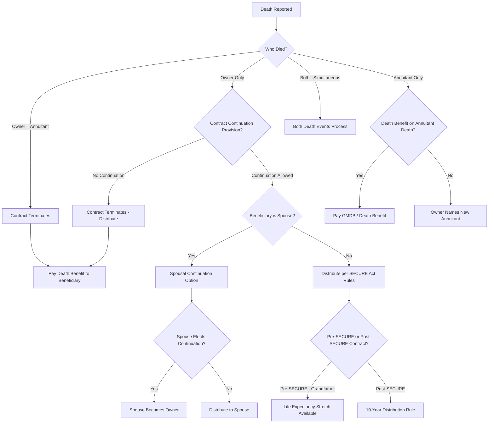

### 2.2 Contract Continuation Provisions

#### 2.2.1 Spousal Continuation (IRC §72(s))

The surviving spouse of a deceased owner has the unique right to continue the annuity contract as the new owner. This is the most tax-advantaged option:

**Requirements:**
- Beneficiary must be the decedent's legal spouse
- Must be the sole beneficiary (or at least the primary beneficiary)
- Contract provisions must permit continuation
- Election must be made within a specified period (typically 60–90 days)

**Benefits of spousal continuation:**
- Contract continues in force — no taxable event
- Cost basis carries over
- New death benefit guarantee may reset (product-specific)
- Spouse can name new beneficiaries
- Spouse can make additional contributions (if contract permits)
- GMDB/living benefits may continue or reset (varies by contract)

#### 2.2.2 Beneficiary Continuation (SECURE Act)

Under the SECURE Act (effective for deaths after 12/31/2019), certain non-spouse beneficiaries of qualified annuities may continue the contract subject to the 10-year rule:

- Contract may remain in force
- But must be fully distributed by end of 10th calendar year after death
- Annual RMDs may or may not be required during the 10-year period (depends on whether owner died before or after required beginning date)

### 2.3 Notification and Documentation

#### 2.3.1 Required Documentation

| Document | Required For |
|---|---|
| Certified death certificate | All annuity death claims |
| Claim form / beneficiary statement | All claims |
| Proof of identity (beneficiary) | All claims |
| Marriage certificate | Spousal continuation election |
| Trust documentation | Trust beneficiary |
| Letters testamentary/administration | Estate beneficiary |
| IRS Form W-4P/W-4R | Tax withholding election |
| Beneficiary distribution election form | Non-lump-sum elections |
| Spousal continuation election form | Spouse electing continuation |

#### 2.3.2 Claim Registration

```json
{
  "annuityDeathClaim": {
    "claimNumber": "AC-2025-001234",
    "contractNumber": "VA-9876543",
    "productType": "VARIABLE_ANNUITY",
    "qualificationStatus": "NON_QUALIFIED",
    "deceasedRole": "OWNER_AND_ANNUITANT",
    "deceased": {
      "name": "Robert J. Miller",
      "ssn": "***-**-4567",
      "dateOfBirth": "1950-08-20",
      "dateOfDeath": "2025-10-15",
      "age": 75
    },
    "contractPhase": "ACCUMULATION",
    "accountValueOnDOD": 285000.00,
    "costBasis": 200000.00,
    "gmdbRider": {
      "type": "HIGHEST_ANNIVERSARY_VALUE",
      "benefitBase": 320000.00,
      "applicableGMDB": 320000.00
    },
    "beneficiaries": [
      {
        "name": "Susan M. Miller",
        "relationship": "SPOUSE",
        "designation": "PRIMARY",
        "sharePercent": 100.00,
        "ssn": "***-**-7890",
        "dateOfBirth": "1952-03-10"
      }
    ],
    "reportedDate": "2025-10-20",
    "reportedBy": "Beneficiary"
  }
}
```

---

## 3. GMDB Claim Processing

### 3.1 GMDB Types

Guaranteed Minimum Death Benefits (GMDBs) are riders on variable annuities (and some indexed annuities) that guarantee a minimum death benefit regardless of market performance:

#### 3.1.1 Return of Premium (ROP) GMDB

**Guarantee:** Death benefit will be at least equal to the total premiums paid, less prior withdrawals.

```
GMDB (ROP) = MAX(Account Value, Total Premiums - Withdrawals)

Example:
  Total Premiums Paid: $200,000
  Prior Withdrawals: $30,000
  Account Value at DOD: $155,000
  
  GMDB = MAX($155,000, $200,000 - $30,000) = MAX($155,000, $170,000) = $170,000
  Excess GMDB Benefit: $170,000 - $155,000 = $15,000
```

#### 3.1.2 Highest Anniversary Value (HAV/HWM) GMDB

**Guarantee:** Death benefit is the highest contract value on any policy anniversary, adjusted for subsequent premiums and withdrawals.

```
GMDB (HAV) = MAX(Account Value, Highest Anniversary Value adjusted for P&W)

Tracking logic:
  On each anniversary:
    anniversaryValue = accountValue on anniversary date
    IF anniversaryValue > currentHighWaterMark:
      currentHighWaterMark = anniversaryValue
    
  Adjustments:
    + premiums paid after the HWM date
    - withdrawals taken after the HWM date (pro-rata)

Example:
  Issue: $200,000 premium
  Year 1 Anniversary: AV = $220,000 (new HWM)
  Year 2 Anniversary: AV = $240,000 (new HWM)
  Year 3 Anniversary: AV = $210,000 (no change)
  Year 4: Withdrawal of $20,000
    Pro-rata reduction: $20,000 / $210,000 = 9.52%
    Adjusted HWM: $240,000 × (1 - 0.0952) = $217,143
  Year 5 (DOD): AV = $195,000
  
  GMDB = MAX($195,000, $217,143) = $217,143
  Excess: $22,143
```

#### 3.1.3 Roll-Up GMDB

**Guarantee:** Death benefit grows at a guaranteed compound rate (typically 5% or 6%) regardless of market performance, up to a maximum age or doubling cap.

```
GMDB (Roll-Up) = MAX(Account Value, Roll-Up Value)

Roll-Up Value = Initial Premium × (1 + rollUpRate)^years - withdrawal adjustments

Constraints:
  - Roll-up typically stops at age 80 or after the benefit base doubles
  - Roll-up typically applies to the initial premium only (not additional premiums)
  - Withdrawals reduce the roll-up value pro-rata

Example:
  Initial Premium: $200,000 at age 65
  Roll-Up Rate: 5% compound
  No withdrawals
  
  Year 1: $200,000 × 1.05 = $210,000
  Year 2: $210,000 × 1.05 = $220,500
  Year 5: $200,000 × 1.05^5 = $255,256
  Year 10 (age 75): $200,000 × 1.05^10 = $325,779
  
  DOD at age 75: AV = $280,000
  GMDB = MAX($280,000, $325,779) = $325,779
  Excess: $45,779
```

#### 3.1.4 Combination GMDB

**Guarantee:** The greater of two or more GMDB calculations (e.g., MAX of ROP and HAV).

```
GMDB (Combo) = MAX(Account Value, ROP Value, HAV Value, Roll-Up Value)
```

### 3.2 GMDB Benefit Base Tracking

The PAS must maintain detailed tracking of GMDB benefit bases throughout the life of the contract:

```json
{
  "gmdbTracking": {
    "contractNumber": "VA-9876543",
    "gmdbType": "HIGHEST_ANNIVERSARY_VALUE",
    "events": [
      {
        "date": "2015-01-15",
        "eventType": "INITIAL_PREMIUM",
        "amount": 200000.00,
        "accountValue": 200000.00,
        "benefitBase": 200000.00,
        "highWaterMark": 200000.00
      },
      {
        "date": "2016-01-15",
        "eventType": "ANNIVERSARY_REVIEW",
        "amount": null,
        "accountValue": 220000.00,
        "benefitBase": 220000.00,
        "highWaterMark": 220000.00
      },
      {
        "date": "2017-01-15",
        "eventType": "ANNIVERSARY_REVIEW",
        "amount": null,
        "accountValue": 260000.00,
        "benefitBase": 260000.00,
        "highWaterMark": 260000.00
      },
      {
        "date": "2018-06-01",
        "eventType": "ADDITIONAL_PREMIUM",
        "amount": 50000.00,
        "accountValue": 285000.00,
        "benefitBase": 310000.00,
        "highWaterMark": 310000.00
      },
      {
        "date": "2020-01-15",
        "eventType": "ANNIVERSARY_REVIEW",
        "amount": null,
        "accountValue": 340000.00,
        "benefitBase": 340000.00,
        "highWaterMark": 340000.00
      },
      {
        "date": "2022-06-15",
        "eventType": "WITHDRAWAL",
        "amount": -40000.00,
        "accountValue": 280000.00,
        "benefitBase": 297143.00,
        "highWaterMark": 297143.00,
        "proRataFactor": 0.8750,
        "note": "Pro-rata: 40000/320000 = 12.5% reduction to HWM of 340K"
      },
      {
        "date": "2025-10-15",
        "eventType": "DEATH",
        "amount": null,
        "accountValue": 285000.00,
        "benefitBase": 297143.00,
        "applicableGMDB": 297143.00,
        "excessBenefit": 12143.00
      }
    ]
  }
}
```

### 3.3 GMDB Claim Calculation Process

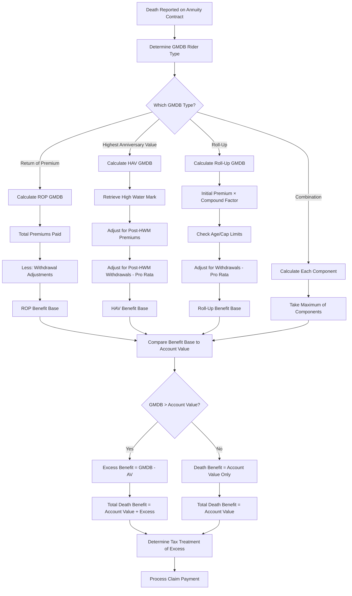

### 3.4 GMDB Claim Documentation

In addition to standard death claim documentation, GMDB claims require:

| Document/Data | Purpose |
|---|---|
| GMDB rider specification | Confirm rider type, terms, and conditions |
| Benefit base history | Audit trail of benefit base changes |
| Anniversary value records | Historical account values on each anniversary |
| Premium payment history | Total premiums paid for ROP calculation |
| Withdrawal history | All prior withdrawals with dates and amounts |
| Fund allocation on DOD | Subaccount values for account value verification |
| Market valuation confirmation | Close-of-business values on date of death |
| Pro-rata reduction history | Documentation of benefit base adjustments |

### 3.5 State-Specific GMDB Filing Deadlines

| State | Claim Filing Deadline | Notes |
|---|---|---|
| Most states | No specific deadline | General statute of limitations (3–6 years) |
| New York | Reasonable time (per contract) | 1 year recommended |
| California | Reasonable time | Prompt payment law applies |
| Texas | 90 days after notice of loss (standard) | Per contract terms |

---

## 4. Non-Spouse Beneficiary Options

### 4.1 SECURE Act Impact (Deaths After 12/31/2019)

The Setting Every Community Up for Retirement Enhancement (SECURE) Act of 2019, as amended by SECURE 2.0 (2022), fundamentally changed distribution options for inherited annuities:

#### 4.1.1 Pre-SECURE Rules (Grandfathered Contracts — Deaths Before 1/1/2020)

| Option | Description | Requirements |
|---|---|---|
| Life expectancy stretch | Annual RMDs based on beneficiary's life expectancy | Begin by 12/31 of year after death |
| 5-year rule | Full distribution by 12/31 of 5th year after death | No annual minimums required |
| Lump sum | Immediate full distribution | Taxable in year received |
| Annuitization | Annuitize over beneficiary's life | Must begin within 1 year of death |

#### 4.1.2 Post-SECURE Rules (Deaths After 12/31/2019)

| Beneficiary Category | Rule | Notes |
|---|---|---|
| **Eligible Designated Beneficiary (EDB)** | Life expectancy stretch available | See EDB categories below |
| **Non-eligible Designated Beneficiary** | 10-year rule | Must fully distribute by end of 10th year after death |
| **Non-designated Beneficiary (entity)** | 5-year rule (or ghost life expectancy if after RBD) | Trusts, estates, charities |

#### 4.1.3 Eligible Designated Beneficiaries (EDBs)

Only these categories qualify for the life expectancy stretch under SECURE:

1. **Surviving spouse** — Always an EDB
2. **Minor child of the deceased** — Until age 21 (then 10-year rule applies)
3. **Disabled individual** — Per IRC §72(m)(7) definition
4. **Chronically ill individual** — Per IRC §7702B(c)(2) definition
5. **Not more than 10 years younger** — Beneficiary within 10 years of the decedent's age

### 4.2 10-Year Distribution Rule

For non-eligible designated beneficiaries:

```
FUNCTION calculateTenYearDistribution(contract, deathDate, beneficiary):
    tenYearDeadline = December 31 of (deathDate.year + 10)
    
    // IRS Notice 2022-53 and Proposed Regulations
    IF decedent died on or after Required Beginning Date:
        // Annual RMDs ARE required during the 10-year period
        // Plus: full distribution by end of year 10
        annualRMDs = true
        rmdDivisor = beneficiary.singleLifeExpectancy(yearAfterDeath) - (currentYear - (yearOfDeath + 1))
    ELSE:
        // Decedent died BEFORE RBD
        // No annual RMDs required — just distribute by year 10
        annualRMDs = false
    
    RETURN {
        deadline: tenYearDeadline,
        annualRMDsRequired: annualRMDs,
        currentYearRMD: calculateRMD(contract, divisor),
        remainingBalance: contract.accountValue
    }
```

### 4.3 Life Expectancy Stretch (EDBs Only)

```
FUNCTION calculateLifeExpectancyRMD(contract, beneficiary, year):
    // Use Single Life Table (IRS Table I)
    initialDivisor = singleLifeTable.getDivisor(beneficiary.age in year after death)
    
    // Reduce divisor by 1 for each subsequent year
    yearsElapsed = year - (deathYear + 1)
    currentDivisor = initialDivisor - yearsElapsed
    
    IF currentDivisor <= 0:
        // Must distribute entire remaining balance
        RETURN contract.accountValue
    
    rmd = contract.accountValueAsOfPriorYearEnd / currentDivisor
    
    RETURN rmd
```

### 4.4 Non-Spouse Beneficiary Distribution Options

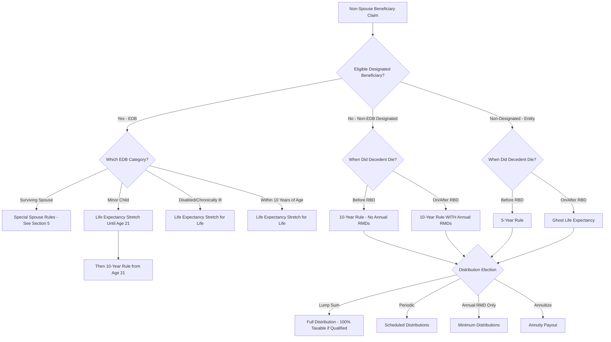

### 4.5 Inherited Annuity Processing

When a non-spouse beneficiary inherits an annuity and does not take an immediate lump sum:

**Inherited annuity setup:**
1. Original contract is re-registered in the beneficiary's name as an inherited annuity
2. New account established: "Jane Smith, Beneficiary of Robert Miller, deceased 10/15/2025"
3. TIN changes to beneficiary's SSN
4. No new premiums allowed
5. Distribution tracking begins
6. RMD/10-year rule tracking established
7. Original cost basis carries over (no step-up for annuities)
8. Rider benefits typically terminate upon death (except remaining death benefit guarantee)

---

## 5. Spousal Continuation

### 5.1 Spousal Continuation Election

The surviving spouse has the most flexible options for inherited annuities:

| Option | Description | Tax Impact | Timing |
|---|---|---|---|
| Continue as own | Spouse becomes new owner; contract continues | No current tax | Must elect within 60–90 days |
| Lump sum | Full distribution | Gain taxable in current year | Within 5 years (NQ) or per RMD rules (Q) |
| Annuitize | Begin annuity payments | Exclusion ratio applies | Within 1 year typically |
| 10-year distribution | Spread distribution over 10 years | Taxable as distributed | Begin within year of death |
| Life expectancy | Annual RMDs based on spouse's life | Taxable as distributed | Begin by later of 12/31 year after death or 12/31 year decedent would have reached 73 |

### 5.2 Continuation Processing

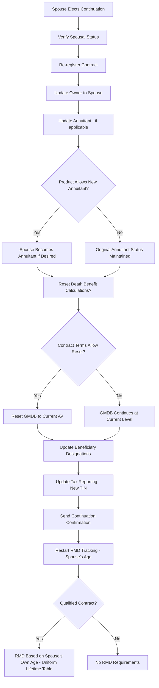

### 5.3 Step-Up in Cost Basis Considerations

**Critical point:** Unlike most inherited assets, annuities do NOT receive a step-up in cost basis at death.

```
Original cost basis: $200,000
Account value at death: $350,000
Gain: $150,000

After spousal continuation:
  Cost basis: $200,000 (unchanged — NO step-up)
  Account value: $350,000
  Unrealized gain: $150,000 (still taxable when eventually distributed)
```

### 5.4 Rider Continuation

| Rider | Continues? | Reset? | Notes |
|---|---|---|---|
| GMDB | Product-specific | May reset to current AV | Some products terminate GMDB on continuation |
| GMWB | Product-specific | Typically continues at current level | Benefit base usually does not reset |
| GMIB | Product-specific | Typically continues | Waiting period may restart |
| GMAB | Usually terminates | N/A | Tied to original maturity date |
| Enhanced death benefit | Terminates | N/A | New standard death benefit applies |
| Earnings enhancement | Terminates | N/A | Typically a one-time death event rider |

---

## 6. Annuity Payout Claims

### 6.1 Death During Annuity Payout Phase

When the annuitant dies during the payout (annuitization) phase, the outcome depends on the payout option elected:

#### 6.1.1 Life Only (Straight Life)

- **Payments cease immediately upon death**
- No remaining payments to beneficiary
- No refund of un-annuitized balance
- Highest periodic payment (compensates for no residual)

#### 6.1.2 Life with Period Certain (10-Year, 15-Year, 20-Year)

```
IF annuitant dies within certain period:
    Remaining certain period payments continue to beneficiary
    Payments = original annuity payment amount
    Duration = remaining certain period months/years
    
    Example:
      Life with 20-year certain
      Annuitization date: January 1, 2020
      Annual payment: $15,000
      Death date: March 15, 2030
      
      Years elapsed: 10 years, 2.5 months
      Remaining certain period: 9 years, 9.5 months
      Remaining payments to beneficiary: ~117 monthly payments
      
      Commutation option:
        PV of remaining payments at contract rate
        Beneficiary may elect lump sum commuted value

ELIF annuitant dies after certain period:
    Payments cease — no further benefit
```

#### 6.1.3 Refund Life Annuity

Two sub-types:

**Installment Refund:**
- Payments continue to beneficiary until the total of all payments equals the premium paid for the annuity
- If annuitant received less than the purchase price before death, remaining payments continue

**Cash Refund:**
- Upon death, the difference between the purchase price and total payments received is paid as a lump sum to the beneficiary

```
FUNCTION calculateRefundBenefit(annuity, dateOfDeath):
    totalPaymentsReceived = SUM(all annuity payments from start to DOD)
    purchasePrice = annuity.annuitizationValue  // Amount applied to purchase annuity
    
    IF totalPaymentsReceived >= purchasePrice:
        refundAmount = 0  // No refund — annuitant received full value
    ELSE:
        refundAmount = purchasePrice - totalPaymentsReceived
    
    IF annuity.refundType == "CASH_REFUND":
        RETURN { type: "LUMP_SUM", amount: refundAmount }
    ELIF annuity.refundType == "INSTALLMENT_REFUND":
        remainingPayments = CEIL(refundAmount / annuity.periodicPayment)
        RETURN { type: "INSTALLMENTS", amount: annuity.periodicPayment, count: remainingPayments }
```

#### 6.1.4 Joint and Survivor Annuity

```
IF primary annuitant dies:
    Payment reduces to survivor percentage (50%, 66.67%, 75%, or 100%)
    Payments continue for the survivor's lifetime
    
    Example:
      Joint & 50% Survivor
      Primary payment: $2,000/month
      Primary dies
      Survivor payment: $1,000/month (50% of $2,000)
      Duration: Survivor's lifetime

IF both annuitants die simultaneously:
    If period certain remains → payments to beneficiary
    If no period certain → payments cease
```

### 6.2 Commutation of Remaining Payments

Beneficiaries inheriting remaining certain period or refund payments may elect a lump sum commutation:

```
FUNCTION calculateCommutedValue(remainingPayments, paymentAmount, discountRate):
    PV = 0
    FOR i = 1 TO remainingPayments:
        PV += paymentAmount / (1 + discountRate/12)^i  // Monthly discounting
    
    RETURN PV

Example:
  Remaining payments: 120 (10 years monthly)
  Monthly payment: $1,500
  Discount rate: 3.0% annual
  
  PV = $1,500 × [(1 - (1.0025)^-120) / 0.0025]
     = $1,500 × 103.5618
     = $155,342.68
```

### 6.3 Payout Phase Death Claim Workflow

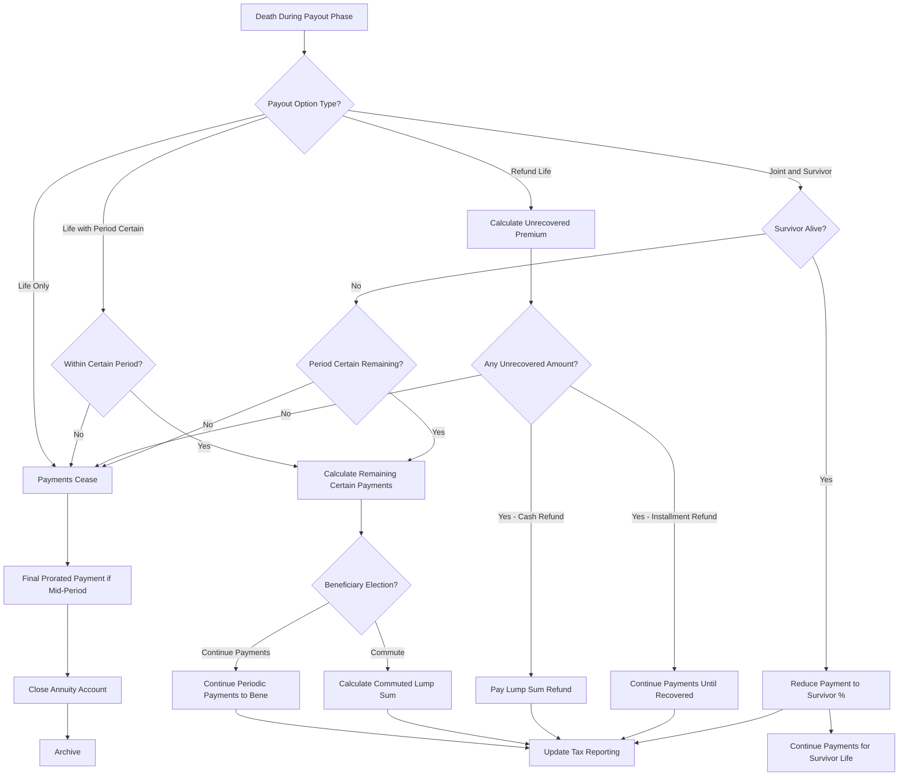

---

## 7. Living Benefit Exercise

### 7.1 GMWB (Guaranteed Minimum Withdrawal Benefit)

The GMWB guarantees the owner can withdraw a specified percentage of the benefit base annually for life (or for a certain period), regardless of account value performance.

#### 7.1.1 GMWB Key Parameters

| Parameter | Typical Value | Description |
|---|---|---|
| Benefit Base | = Initial premium (may include roll-up) | The basis for calculating annual withdrawal amount |
| Withdrawal Rate | 4%–6% (age-dependent) | Annual percentage that can be withdrawn |
| Annual Maximum Withdrawal | Benefit Base × Withdrawal Rate | Dollar amount available per year |
| Roll-Up Rate | 5%–7% compound (during deferral) | Growth rate applied to benefit base before first withdrawal |
| Roll-Up Duration | 10–15 years max | Maximum period for roll-up |
| Step-Up Feature | Annual or triennial | Benefit base may step up to higher AV on anniversary |
| Excess Withdrawal | Above annual max | Reduces benefit base pro-rata (penalty) |

#### 7.1.2 GMWB Withdrawal Processing

```
FUNCTION processGMWBWithdrawal(contract, withdrawalAmount):
    gmwb = contract.gmwbRider
    annualMax = gmwb.benefitBase * gmwb.withdrawalRate
    ytdWithdrawals = gmwb.yearToDateWithdrawals
    
    remainingMax = annualMax - ytdWithdrawals
    
    IF withdrawalAmount <= remainingMax:
        // Within annual maximum — dollar-for-dollar reduction
        gmwb.benefitBase -= withdrawalAmount
        contract.accountValue -= withdrawalAmount
        excessAmount = 0
        taxableAmount = calculateTax(contract, withdrawalAmount)
    ELSE:
        // Excess withdrawal — pro-rata reduction to benefit base
        withinMaxPortion = remainingMax
        excessPortion = withdrawalAmount - remainingMax
        
        // Dollar-for-dollar for within-max portion
        gmwb.benefitBase -= withinMaxPortion
        
        // Pro-rata for excess portion
        avAfterWithinMax = contract.accountValue - withinMaxPortion
        proRataFactor = 1 - (excessPortion / avAfterWithinMax)
        gmwb.benefitBase *= proRataFactor
        
        contract.accountValue -= withdrawalAmount
        taxableAmount = calculateTax(contract, withdrawalAmount)
    
    // Check if account value is depleted
    IF contract.accountValue <= 0:
        // GMWB guarantee kicks in — continue payments from general account
        contract.accountValue = 0
        gmwb.inBenefitStatus = true
        // Future payments are guaranteed by the insurer
    
    gmwb.yearToDateWithdrawals += withdrawalAmount
    
    RETURN {
        grossWithdrawal: withdrawalAmount,
        netPayment: withdrawalAmount - taxes,
        newBenefitBase: gmwb.benefitBase,
        newAccountValue: contract.accountValue,
        inBenefitStatus: gmwb.inBenefitStatus,
        excessAmount: excessAmount,
        taxableAmount: taxableAmount
    }
```

#### 7.1.3 GMWB Annual Maximum Calculation

```
Withdrawal Rate Schedule (typical):
  Age at first withdrawal    Rate
  55–59                      4.0%
  60–64                      4.5%
  65–69                      5.0%
  70–74                      5.5%
  75+                        6.0%
  Joint life                 Subtract 0.5% from above

Example:
  Benefit Base: $300,000
  Owner age at first withdrawal: 67
  Withdrawal Rate: 5.0%
  Annual Maximum: $300,000 × 5.0% = $15,000 per year
  Monthly Maximum: $1,250 per month
```

### 7.2 GMIB (Guaranteed Minimum Income Benefit)

The GMIB guarantees a minimum annuitization factor, ensuring the contract can be annuitized at a guaranteed rate regardless of then-current market rates.

#### 7.2.1 GMIB Exercise Process

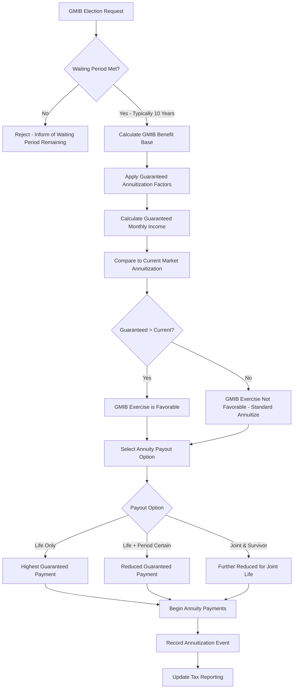

#### 7.2.2 GMIB Calculation Example

```
GMIB Benefit Base (with 5% roll-up for 10 years):
  Initial Premium: $250,000
  Roll-Up: 5% compound for 10 years
  Benefit Base = $250,000 × (1.05)^10 = $407,224

Guaranteed Annuitization Factor (per $1,000 of benefit base):
  Age 75, Life Only: $7.50 per month per $1,000
  
Guaranteed Monthly Income:
  = ($407,224 / $1,000) × $7.50 = $3,054.18/month

Compare to current market rates:
  Current Factor: $5.80 per month per $1,000
  Market-rate income (on AV of $280,000): ($280,000 / $1,000) × $5.80 = $1,624/month
  
GMIB is MORE favorable: $3,054/month vs. $1,624/month
Owner should exercise GMIB.
```

### 7.3 GMAB (Guaranteed Minimum Accumulation Benefit)

The GMAB guarantees that after a specified holding period (typically 10 years), the account value will be at least equal to a guaranteed amount (usually initial premium).

#### 7.3.1 GMAB Maturity Processing

```
FUNCTION processGMABMaturity(contract):
    gmab = contract.gmabRider
    
    IF today() < gmab.maturityDate:
        RETURN ERROR("GMAB has not matured")
    
    guaranteedAmount = gmab.guaranteedAmount  // Usually = initial premium
    currentAV = contract.accountValue
    
    IF currentAV < guaranteedAmount:
        // GMAB guarantee triggers — top up the account
        topUpAmount = guaranteedAmount - currentAV
        contract.accountValue += topUpAmount
        
        RETURN {
            triggered: true,
            guaranteedAmount: guaranteedAmount,
            accountValueBefore: currentAV,
            topUpAmount: topUpAmount,
            accountValueAfter: guaranteedAmount,
            source: "GENERAL_ACCOUNT"
        }
    ELSE:
        // No top-up needed — AV exceeds guarantee
        RETURN {
            triggered: false,
            guaranteedAmount: guaranteedAmount,
            accountValue: currentAV,
            topUpAmount: 0
        }
```

#### 7.3.2 GMAB Example

```
Initial Premium: $200,000
GMAB Guarantee: 100% of premium after 10 years
Maturity Date: January 15, 2025

Scenario A (market decline):
  Account Value on maturity: $175,000
  Guarantee: $200,000
  Top-up: $25,000
  New Account Value: $200,000

Scenario B (market growth):
  Account Value on maturity: $280,000
  Guarantee: $200,000
  Top-up: $0
  Account Value: $280,000 (no change)
```

---

## 8. Qualified Contract Distributions

### 8.1 RMD (Required Minimum Distribution) Calculation

For qualified annuities (IRA, 403(b), qualified plan), RMDs must begin by the Required Beginning Date (RBD).

#### 8.1.1 Required Beginning Date

| Scenario | RBD |
|---|---|
| Owner born before 7/1/1949 | April 1 of year after reaching age 70½ |
| Owner born 7/1/1949 – 12/31/1950 | April 1 of year after reaching age 72 |
| Owner born after 12/31/1950 | April 1 of year after reaching age 73 |
| Owner born after 12/31/1959 (SECURE 2.0) | April 1 of year after reaching age 75 |
| Roth IRA | No RMD for original owner (pre-2024) |
| Inherited IRA (non-spouse) | December 31 of year after death |

#### 8.1.2 RMD Calculation

```
FUNCTION calculateRMD(contract, year):
    // Account value as of December 31 of prior year
    priorYearEndValue = contract.accountValueAsOf(December_31, year - 1)
    
    // Determine applicable life expectancy table
    IF contract.isInherited:
        table = SINGLE_LIFE_TABLE  // Table I
        divisor = getInheritedDivisor(contract, year)
    ELIF contract.owner.hasSpouseBene AND spouseAgeDiffMoreThan10:
        table = JOINT_LIFE_TABLE  // Table II
        divisor = jointLifeTable.getDivisor(owner.age, spouse.age, year)
    ELSE:
        table = UNIFORM_LIFETIME_TABLE  // Table III
        divisor = uniformLifetimeTable.getDivisor(owner.age in year)
    
    rmd = priorYearEndValue / divisor
    
    RETURN {
        year: year,
        priorYearEndValue: priorYearEndValue,
        divisor: divisor,
        table: table,
        rmdAmount: rmd,
        deadline: isFirstRMD ? "April 1" : "December 31"
    }
```

#### 8.1.3 Uniform Lifetime Table (Table III) — Selected Ages

| Age | Divisor | Age | Divisor |
|---|---|---|---|
| 72 | 27.4 | 82 | 18.5 |
| 73 | 26.5 | 85 | 16.0 |
| 74 | 25.5 | 88 | 13.7 |
| 75 | 24.6 | 90 | 12.2 |
| 76 | 23.7 | 95 | 8.9 |
| 77 | 22.9 | 100 | 6.4 |
| 78 | 22.0 | 105 | 4.6 |
| 79 | 21.1 | 110 | 3.1 |
| 80 | 20.2 | 115 | 2.1 |

### 8.2 RMD Tracking and Compliance

```json
{
  "rmdTracking": {
    "contractNumber": "IRA-5678901",
    "ownerName": "Robert J. Miller",
    "ownerAge": 76,
    "requiredBeginningDate": "2023-04-01",
    "currentYear": 2025,
    "priorYearEndValue": 285000.00,
    "uniformLifetimeDivisor": 23.7,
    "rmdAmount": 12025.32,
    "rmdDeadline": "2025-12-31",
    "ytdDistributions": 8000.00,
    "remainingRMD": 4025.32,
    "autoRMDEnrolled": true,
    "autoRMDSchedule": "MONTHLY",
    "autoRMDMonthlyAmount": 1002.11,
    "rmdHistory": [
      { "year": 2023, "required": 10754.72, "distributed": 10754.72, "onTime": true },
      { "year": 2024, "required": 11428.57, "distributed": 12000.00, "onTime": true },
      { "year": 2025, "required": 12025.32, "distributed": 8000.00, "status": "IN_PROGRESS" }
    ]
  }
}
```

### 8.3 Missed RMD Processing

| Situation | Penalty | Correction |
|---|---|---|
| Missed RMD (pre-SECURE 2.0) | 50% excise tax on shortfall | IRS Form 5329, reasonable cause letter |
| Missed RMD (SECURE 2.0, effective 2023) | 25% excise tax on shortfall | Reduced to 10% if corrected within 2 years |
| Self-corrected within correction window | 10% excise tax | Take missed RMD + file amended Form 5329 |

### 8.4 Aggregation Rules

For IRA annuities, RMD aggregation rules allow flexibility:

- **IRA aggregation:** RMD can be satisfied from ANY IRA owned by the individual (not just the annuity contract)
- **403(b) aggregation:** Similar — RMDs from multiple 403(b) contracts can be aggregated
- **401(k)/qualified plans:** No aggregation — each plan must satisfy its own RMD
- **PAS implication:** Track whether the contract has elected to satisfy its RMD from another account

### 8.5 Roth IRA Distribution Rules

| Scenario | Rule | Tax Treatment |
|---|---|---|
| Owner's own Roth IRA | No RMDs during owner's lifetime | Qualified distributions tax-free |
| Inherited Roth IRA (spouse continues) | No RMDs (same as own) | Tax-free if 5-year rule met |
| Inherited Roth IRA (non-spouse, post-SECURE) | 10-year rule applies | Tax-free if 5-year holding met |
| Inherited Roth IRA (non-spouse, pre-SECURE) | Life expectancy stretch | Tax-free if 5-year holding met |

---

## 9. Tax Processing

### 9.1 Cost Basis Allocation for Death Benefits

#### 9.1.1 Non-Qualified Annuity Death Benefit

```
FUNCTION calculateDeathBenefitTax(contract, beneficiary):
    accountValue = contract.accountValueAtDeath
    gmdbExcess = MAX(0, contract.gmdbBenefitBase - accountValue)
    totalDeathBenefit = accountValue + gmdbExcess
    
    costBasis = contract.investmentInContract  // Premiums paid - prior tax-free amounts
    taxableGain = totalDeathBenefit - costBasis
    
    // IMPORTANT: No step-up in basis for annuities!
    // Even though it's a death benefit, the gain is taxable to the beneficiary
    
    RETURN {
        totalDeathBenefit: totalDeathBenefit,
        costBasis: costBasis,
        taxableGain: taxableGain,
        taxFreeReturn: MIN(totalDeathBenefit, costBasis),
        note: "No IRC 101 exclusion for annuity death benefits — gain is ordinary income to beneficiary"
    }
```

#### 9.1.2 Qualified Annuity Death Benefit

For qualified annuities (Traditional IRA, 401k rollover):
```
Entire death benefit is taxable as ordinary income to the beneficiary
(because all contributions were pre-tax)

Exception: Roth IRA/Roth 401k — death benefit is tax-free if 5-year holding period met
Exception: After-tax contributions in qualified plans — non-taxable portion calculated using Form 8606
```

### 9.2 Inherited Annuity — No Step-Up

This is a critically important and commonly misunderstood rule:

| Asset Type | Step-Up at Death? | Authority |
|---|---|---|
| Stocks, bonds, real estate | Yes — stepped up to FMV | IRC §1014 |
| Life insurance death benefit | Tax-free under IRC §101 | IRC §101 |
| Annuity | **NO step-up** | IRC §1014(b)(9)(A) |
| IRA/Qualified plan | **NO step-up** (all taxable) | N/A — pre-tax money |

### 9.3 Withholding Requirements

| Distribution Type | Federal Withholding | Can Opt Out? |
|---|---|---|
| NQ annuity death benefit — lump sum | 10% default (non-periodic) | Yes (W-4R) |
| NQ annuity death benefit — periodic | Per tax tables (W-4P) | Yes |
| Qualified annuity — eligible rollover | **20% mandatory** | No (unless direct rollover) |
| Qualified annuity — non-eligible rollover | 10% default | Yes (W-4R) |
| Qualified annuity — periodic payments | Per tax tables (W-4P) | Yes |
| NQ annuity — living benefit withdrawal | 10% default | Yes |
| Roth IRA — qualified distribution | $0 (tax-free) | N/A |

### 9.4 1099-R Generation

#### 9.4.1 Distribution Code Reference for Annuities

| Code | Description | Common Usage |
|---|---|---|
| 1 | Early distribution, no exception | NQ withdrawal before 59½ |
| 2 | Early distribution, exception applies | Disability, SEPP |
| 3 | Disability | Distribution due to disability |
| 4 | Death | Death benefit to beneficiary |
| 6 | 1035 exchange | Tax-free exchange |
| 7 | Normal distribution | Age 59½+ distribution |
| D | Excess contributions + earnings (403b) | 403b-specific |
| G | Direct rollover | Rollover to IRA/plan |
| H | Direct rollover to Roth IRA | Roth conversion rollover |
| T | Roth IRA distribution (exceptions apply) | Roth distributions |
| Q | Qualified Roth distribution | Tax-free Roth |

#### 9.4.2 1099-R for Annuity Death Benefit

```json
{
  "form1099R_AnnuityDeath": {
    "recipientName": "Susan M. Miller, Beneficiary",
    "recipientTIN": "***-**-7890",
    "box1_grossDistribution": 320000.00,
    "box2a_taxableAmount": 120000.00,
    "box2b_taxableAmountNotDetermined": false,
    "box2b_totalDistribution": true,
    "box3_capitalGain": 0.00,
    "box4_federalTaxWithheld": 12000.00,
    "box5_employeeContributions": 200000.00,
    "box7_distributionCode": "4",
    "box7_iraSepSimple": false,
    "box9b_totalEmployeeContrib": 200000.00,
    "notes": [
      "Code 4 = Death distribution",
      "Box 5 = Original cost basis (investment in contract)",
      "Box 2a = Gain ($320K - $200K = $120K)",
      "No step-up in basis for annuity death benefits"
    ]
  }
}
```

### 9.5 Exclusion Ratio for Annuitized Payments

When death benefits or inherited annuities are annuitized, an exclusion ratio determines the tax-free portion of each payment:

```
Exclusion Ratio = Investment in Contract / Expected Return

Investment in Contract = Original cost basis (adjusted for prior distributions)
Expected Return = Annual Payment × Expected Number of Payments (per IRS tables)

Tax-Free Portion of Each Payment = Payment × Exclusion Ratio
Taxable Portion = Payment - Tax-Free Portion

Example:
  Investment in Contract: $200,000
  Monthly Payment: $1,800
  Expected Return (IRS Table V, age 72): $1,800 × 12 × 16.0 = $345,600
  
  Exclusion Ratio = $200,000 / $345,600 = 57.87%
  
  Tax-Free per Payment: $1,800 × 57.87% = $1,041.66
  Taxable per Payment: $1,800 - $1,041.66 = $758.34
  
  After Investment in Contract is fully recovered:
  100% of each payment becomes taxable
```

---

## 10. Data Model

### 10.1 Annuity Claim ERD

```mermaid
erDiagram
    ANNUITY_CONTRACT {
        string contractNumber PK
        string productCode
        string productType
        string qualificationStatus
        string contractPhase
        string contractStatus
        date issueDate
        date annuitizationDate
        decimal accountValue
        decimal costBasis
        decimal investmentInContract
        string ownerId FK
        string annuitantId FK
    }
    
    ANNUITY_CLAIM {
        string claimId PK
        string contractNumber FK
        string claimType
        string claimStatus
        date reportedDate
        date dateOfDeath
        string deceasedRole
        string deceasedId FK
        string assignedExaminer
        date proofOfLossDate
        date adjudicationDate
    }
    
    GMDB_RIDER {
        string riderId PK
        string contractNumber FK
        string gmdbType
        decimal benefitBase
        decimal highWaterMark
        decimal rollUpRate
        date rollUpStartDate
        date rollUpEndDate
        integer rollUpMaxAge
        decimal riderCharge
        boolean isActive
    }
    
    GMDB_HISTORY {
        string historyId PK
        string riderId FK
        date eventDate
        string eventType
        decimal accountValue
        decimal benefitBase
        decimal adjustment
        decimal proRataFactor
        string notes
    }
    
    GMDB_CALCULATION {
        string calculationId PK
        string claimId FK
        string riderId FK
        string gmdbType
        decimal accountValueAtDeath
        decimal gmdbBenefitBase
        decimal applicableGMDB
        decimal excessBenefit
        date calculationDate
        string calculationDetails
    }
    
    GMWB_RIDER {
        string riderId PK
        string contractNumber FK
        decimal benefitBase
        decimal withdrawalRate
        decimal annualMaximum
        decimal ytdWithdrawals
        decimal rollUpRate
        date firstWithdrawalDate
        boolean inBenefitStatus
        decimal lifetimeWithdrawals
    }
    
    GMWB_WITHDRAWAL {
        string withdrawalId PK
        string riderId FK
        date withdrawalDate
        decimal requestedAmount
        decimal withinMaxAmount
        decimal excessAmount
        decimal preBenefitBase
        decimal postBenefitBase
        decimal proRataFactor
        decimal accountValueBefore
        decimal accountValueAfter
    }
    
    GMIB_RIDER {
        string riderId PK
        string contractNumber FK
        decimal benefitBase
        decimal rollUpRate
        integer waitingPeriodYears
        date exercisableDate
        string annuitizationFactors
        boolean isExercised
        date exerciseDate
    }
    
    GMAB_RIDER {
        string riderId PK
        string contractNumber FK
        decimal guaranteedAmount
        date maturityDate
        boolean triggered
        decimal topUpAmount
        date processedDate
    }
    
    BENEFICIARY_OPTION {
        string optionId PK
        string claimId FK
        string beneficiaryId FK
        string beneficiaryCategory
        string distributionRule
        string electedOption
        date electionDate
        decimal distributionAmount
        string distributionFrequency
        date distributionDeadline
    }
    
    INHERITED_ANNUITY {
        string inheritedId PK
        string originalContractNumber FK
        string newContractNumber
        string beneficiaryId FK
        string beneficiaryRelationship
        string distributionRule
        date deathDate
        decimal inheritedValue
        decimal inheritedBasis
        decimal tenYearDeadline
        boolean annualRMDRequired
    }
    
    SPOUSAL_CONTINUATION {
        string continuationId PK
        string claimId FK
        string contractNumber FK
        string spouseId FK
        date electionDate
        string continuationType
        decimal accountValueAtContinuation
        decimal costBasisCarryover
        boolean gmdbReset
        decimal newGMDBBase
    }
    
    PAYOUT_CLAIM {
        string payoutClaimId PK
        string contractNumber FK
        string payoutOptionType
        date annuitizationDate
        decimal periodicPayment
        string paymentFrequency
        integer certainPeriodMonths
        integer certainPeriodRemaining
        decimal purchasePrice
        decimal totalPaymentsReceived
        decimal commutedValue
        string survivorId FK
        decimal survivorPercent
    }
    
    RMD_TRACKING {
        string rmdId PK
        string contractNumber FK
        integer taxYear
        decimal priorYearEndValue
        decimal divisor
        string tableUsed
        decimal rmdAmount
        decimal ytdDistributions
        decimal rmdRemaining
        date deadline
        boolean satisfied
        boolean aggregatedElsewhere
    }
    
    ANNUITY_TAX {
        string taxId PK
        string claimId FK
        string contractNumber FK
        string distributionType
        decimal grossDistribution
        decimal taxableAmount
        decimal costBasisUsed
        string distributionCode
        decimal federalWithheld
        decimal stateWithheld
        decimal earlyPenalty
        boolean eligibleRollover
        string form1099RId FK
    }
    
    ANNUITY_PAYMENT {
        string paymentId PK
        string claimId FK
        string beneficiaryId FK
        string paymentType
        decimal grossAmount
        decimal taxableAmount
        decimal federalWithheld
        decimal stateWithheld
        decimal netPayment
        string paymentMethod
        date paymentDate
        string paymentStatus
    }
    
    ANNUITY_SUBACCOUNT {
        string subaccountId PK
        string contractNumber FK
        string fundCode
        string fundName
        decimal units
        decimal nav
        decimal marketValue
        date valuationDate
    }
    
    ANNUITY_CONTRACT ||--o{ ANNUITY_CLAIM : "has"
    ANNUITY_CONTRACT ||--o| GMDB_RIDER : "has"
    ANNUITY_CONTRACT ||--o| GMWB_RIDER : "has"
    ANNUITY_CONTRACT ||--o| GMIB_RIDER : "has"
    ANNUITY_CONTRACT ||--o| GMAB_RIDER : "has"
    GMDB_RIDER ||--o{ GMDB_HISTORY : "tracked"
    ANNUITY_CLAIM ||--|| GMDB_CALCULATION : "calculated"
    GMWB_RIDER ||--o{ GMWB_WITHDRAWAL : "has"
    ANNUITY_CLAIM ||--o{ BENEFICIARY_OPTION : "options"
    ANNUITY_CLAIM ||--o{ INHERITED_ANNUITY : "creates"
    ANNUITY_CLAIM ||--o| SPOUSAL_CONTINUATION : "continued"
    ANNUITY_CONTRACT ||--o| PAYOUT_CLAIM : "payout"
    ANNUITY_CONTRACT ||--o{ RMD_TRACKING : "tracks"
    ANNUITY_CLAIM ||--o{ ANNUITY_TAX : "taxed"
    ANNUITY_CLAIM ||--o{ ANNUITY_PAYMENT : "paid"
    ANNUITY_CONTRACT ||--o{ ANNUITY_SUBACCOUNT : "holds"
```

---

## 11. BPMN Process Flows

### 11.1 Annuity Death Claim — End to End

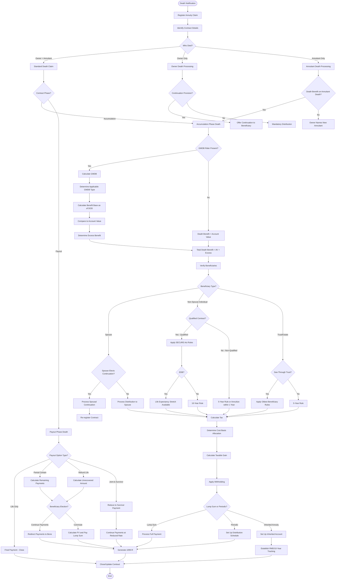

### 11.2 GMWB Withdrawal Process

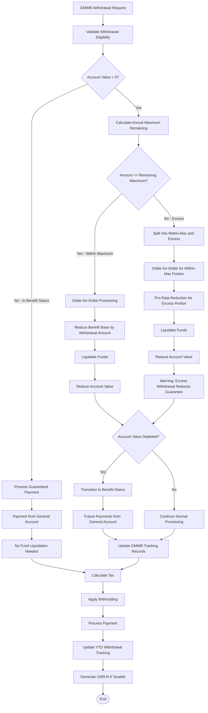

---

## 12. Calculation Examples

### 12.1 GMDB — Highest Anniversary Value with Withdrawal

**Contract details:**
- Issue Date: January 15, 2015
- Initial Premium: $250,000
- Additional Premium (Year 3): $50,000
- GMDB Type: Highest Anniversary Value
- Date of Death: October 15, 2025
- Death-date Account Value: $265,000

**Benefit base tracking:**

| Date | Event | AV | HWM | Adjusted HWM |
|---|---|---|---|---|
| 1/15/2015 | Initial premium | $250,000 | $250,000 | $250,000 |
| 1/15/2016 | Anniversary | $268,000 | $268,000 | $268,000 |
| 1/15/2017 | Anniversary | $295,000 | $295,000 | $295,000 |
| 3/1/2017 | Additional premium $50K | $345,000 | $345,000 | $345,000 |
| 1/15/2018 | Anniversary | $370,000 | $370,000 | $370,000 |
| 1/15/2019 | Anniversary | $340,000 | — | $370,000 |
| 1/15/2020 | Anniversary | $365,000 | — | $370,000 |
| 6/15/2020 | Withdrawal $30,000 | $332,000 | — | Adjusted |
| | Pro-rata: $30K/$362K = 8.29% | | | $370K × 0.9171 = $339,327 |
| 1/15/2021 | Anniversary | $355,000 | $355,000 | $355,000 (new HWM) |
| 1/15/2022 | Anniversary | $338,000 | — | $355,000 |
| 7/1/2023 | Withdrawal $40,000 | $290,000 | — | Adjusted |
| | Pro-rata: $40K/$330K = 12.12% | | | $355K × 0.8788 = $311,974 |
| 1/15/2024 | Anniversary | $305,000 | — | $311,974 |
| 1/15/2025 | Anniversary | $280,000 | — | $311,974 |
| 10/15/2025 | Death | $265,000 | — | $311,974 |

**GMDB Calculation:**
```
Applicable GMDB = MAX(Account Value, Adjusted HWM)
                = MAX($265,000, $311,974)
                = $311,974

Excess Benefit = $311,974 - $265,000 = $46,974

Total Death Benefit: $311,974
  Account Value portion: $265,000 (from subaccounts)
  Excess GMDB portion: $46,974 (from insurer's general account)
```

**Tax calculation:**
```
Cost Basis: $250,000 + $50,000 - $30,000 - $40,000 = $230,000
(Premiums less prior non-taxable withdrawal amounts)

Total Death Benefit: $311,974
Taxable Amount: $311,974 - $230,000 = $81,974

1099-R:
  Box 1: $311,974
  Box 2a: $81,974
  Box 5: $230,000
  Box 7: "4" (death)
```

### 12.2 RMD Calculation for Inherited Annuity

**Scenario:** Robert died October 15, 2025 at age 75. His son Michael (age 48) is the sole beneficiary of his Traditional IRA annuity.

**SECURE Act applies (death after 12/31/2019):**
- Michael is a non-eligible designated beneficiary (not spouse, disabled, chronically ill, minor, or within 10 years of age)
- 10-year rule applies
- Robert died after his RBD (age 73) → annual RMDs ARE required during the 10-year period

**Distribution schedule:**

| Year | Account Value (12/31 prior year) | Divisor | RMD | Deadline |
|---|---|---|---|---|
| 2026 | $285,000 (DOD value) | 36.6 (Michael's single life at 49) | $7,787 | 12/31/2026 |
| 2027 | $280,000 (est.) | 35.6 | $7,865 | 12/31/2027 |
| 2028 | $275,000 (est.) | 34.6 | $7,948 | 12/31/2028 |
| ... | ... | Declining by 1 each year | ... | ... |
| 2035 | Remaining balance | N/A | **Full distribution** | **12/31/2035** |

### 12.3 GMWB Exercise — Account Value Depletion

**Contract details:**
- Benefit Base: $300,000
- Withdrawal Rate: 5% (owner age 67)
- Annual Maximum: $15,000
- Account Value: $8,000 (nearly depleted due to poor market performance)
- Owner requests full annual withdrawal of $15,000

**Processing:**
```
Annual Maximum: $15,000
Account Value: $8,000
Shortfall: $7,000

Step 1: Liquidate remaining account value → $8,000
Step 2: Pay shortfall from general account → $7,000
Step 3: Total payment to owner → $15,000
Step 4: Account Value → $0
Step 5: Contract enters "benefit status"
Step 6: All future payments ($15,000/year) funded by general account

Tax treatment:
  Account value portion ($8,000): Taxable under normal annuity rules
  General account portion ($7,000): Also taxable as ordinary income
  Total taxable: $15,000 (if entire cost basis previously recovered)
```

### 12.4 Spousal Continuation with GMDB Reset

**Contract details:**
- Owner/Annuitant: Robert (deceased)
- Spouse/Beneficiary: Susan (age 73)
- Account Value at Death: $265,000
- GMDB (HAV): $311,974
- Cost Basis: $230,000

**Susan elects spousal continuation:**
```
Step 1: GMDB excess benefit NOT paid (continuation preserves the guarantee)
Step 2: Susan becomes new owner
Step 3: Account Value: $265,000 (unchanged)
Step 4: Cost Basis: $230,000 (carries over — no step-up)

GMDB Reset (per contract terms):
  New GMDB Benefit Base: $265,000 (reset to current AV)
  Note: Susan "loses" the $46,974 excess that would have been payable
  BUT she gains continued tax deferral and ability to remain invested

If contract terms allow GMDB to continue at higher level:
  GMDB Benefit Base: $311,974 (continues from Robert's tracking)
  This is more favorable for Susan

Tax impact: NONE — no taxable event on continuation
```

---

## 13. Architecture

### 13.1 Annuity Claim Processing Architecture

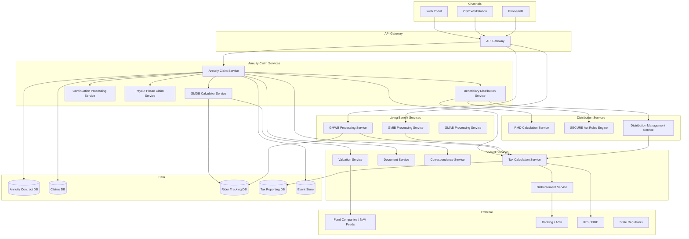

### 13.2 GMDB Calculation Engine

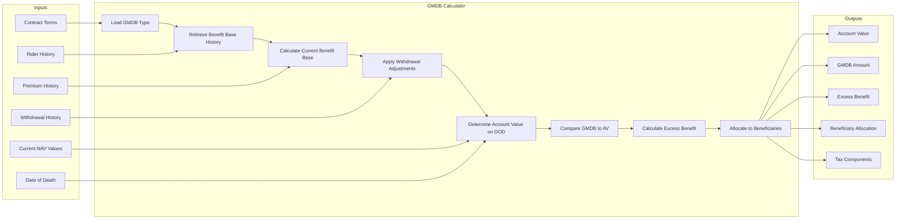

### 13.3 Distribution Management Service

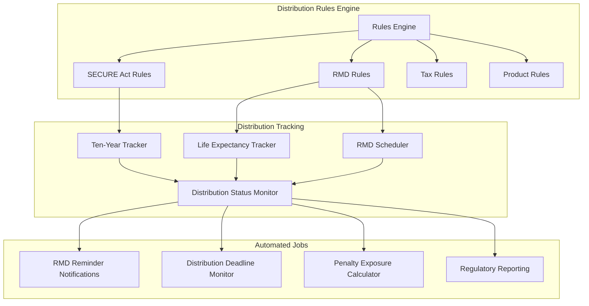

---

## 14. Sample Payloads

### 14.1 Annuity Death Claim — Processing Request

```json
{
  "annuityDeathClaimRequest": {
    "claimId": "AC-2025-001234",
    "contractNumber": "VA-9876543",
    "requestDate": "2025-10-20",
    "deceasedInfo": {
      "name": "Robert J. Miller",
      "role": "OWNER_AND_ANNUITANT",
      "dateOfDeath": "2025-10-15",
      "deathCertificateReceived": true
    },
    "contractSnapshot": {
      "productType": "VARIABLE_ANNUITY",
      "qualificationStatus": "TRADITIONAL_IRA",
      "contractPhase": "ACCUMULATION",
      "issueDate": "2015-01-15",
      "accountValue": {
        "total": 265000.00,
        "subaccounts": [
          { "fund": "Growth Fund A", "units": 5200.00, "nav": 28.50, "value": 148200.00 },
          { "fund": "Bond Fund B", "units": 3800.00, "nav": 18.90, "value": 71820.00 },
          { "fund": "Fixed Account", "value": 44980.00 }
        ],
        "valuationDate": "2025-10-15"
      },
      "investmentInContract": 300000.00,
      "gmdbRider": {
        "type": "HIGHEST_ANNIVERSARY_VALUE",
        "benefitBase": 311974.00,
        "excessOverAV": 46974.00
      }
    },
    "beneficiaryInfo": {
      "primary": [
        {
          "name": "Susan M. Miller",
          "relationship": "SPOUSE",
          "ssn": "***-**-7890",
          "dateOfBirth": "1952-03-10",
          "share": 100.00
        }
      ]
    }
  }
}
```

### 14.2 Beneficiary Distribution Election Response

```json
{
  "distributionElection": {
    "claimId": "AC-2025-001234",
    "beneficiaryId": "BENE-001",
    "beneficiaryName": "Susan M. Miller",
    "beneficiaryCategory": "SURVIVING_SPOUSE",
    "availableOptions": [
      {
        "option": "SPOUSAL_CONTINUATION",
        "description": "Continue contract as new owner — no current tax event",
        "taxImpact": "DEFERRED",
        "gmdbImpact": "Reset to current AV ($265,000) or continuation of current base ($311,974) per contract terms",
        "deadline": "2025-12-20"
      },
      {
        "option": "LUMP_SUM",
        "description": "Full distribution of $311,974 (GMDB value)",
        "grossAmount": 311974.00,
        "costBasis": 0.00,
        "taxableAmount": 311974.00,
        "federalWithholding20pct": 62394.80,
        "estimatedNetPayment": 249579.20,
        "note": "Qualified contract — 100% taxable. 20% mandatory federal withholding (eligible rollover distribution)."
      },
      {
        "option": "LIFE_EXPECTANCY_STRETCH",
        "description": "Annual RMDs based on spouse's own life expectancy — available since spouse is EDB",
        "firstRMDYear": 2026,
        "estimatedFirstRMD": 12142.00,
        "divisor": 25.5,
        "deadline": "Annual by 12/31"
      },
      {
        "option": "DIRECT_ROLLOVER",
        "description": "Roll over to Susan's own IRA — no current tax event",
        "rolloverAmount": 311974.00,
        "taxImpact": "DEFERRED",
        "note": "No withholding on direct rollover"
      },
      {
        "option": "TEN_YEAR_DISTRIBUTION",
        "description": "Distribute over 10 years (not required for spouse, but available)",
        "deadline": "2035-12-31",
        "note": "Annual distributions over 10 years, flexible amounts"
      }
    ],
    "selectedOption": "SPOUSAL_CONTINUATION",
    "electionDate": "2025-11-15"
  }
}
```

### 14.3 GMWB Exercise Request

```json
{
  "gmwbWithdrawalRequest": {
    "contractNumber": "VA-5555555",
    "riderId": "GMWB-001",
    "requestDate": "2025-06-15",
    "requestedAmount": 12000.00,
    "gmwbSnapshot": {
      "benefitBase": 280000.00,
      "withdrawalRate": 0.05,
      "annualMaximum": 14000.00,
      "ytdWithdrawals": 0.00,
      "remainingAnnualMax": 14000.00,
      "accountValue": 195000.00,
      "inBenefitStatus": false
    },
    "calculationResult": {
      "withinMaxAmount": 12000.00,
      "excessAmount": 0.00,
      "benefitBaseReduction": 12000.00,
      "newBenefitBase": 268000.00,
      "newAccountValue": 183000.00,
      "newAnnualMaximum": 13400.00,
      "taxableAmount": 12000.00,
      "costBasisUsed": 0.00,
      "earlyDistributionPenalty": 0.00
    },
    "paymentPreference": {
      "method": "ACH",
      "routingNumber": "021000021",
      "accountNumber": "****5678"
    }
  }
}
```

---

## 15. Appendices

### Appendix A: SECURE Act / SECURE 2.0 Key Provisions for Annuities

| Provision | SECURE Act (2019) | SECURE 2.0 (2022) |
|---|---|---|
| RMD age | 72 | 73 (2023), 75 (2033) |
| Stretch IRA elimination | 10-year rule for most non-spouse beneficiaries | Clarified annual RMD requirement during 10-year period |
| Roth employer plans | N/A | No RMD for Roth 401k/403b (2024+) |
| Missed RMD penalty | 50% | Reduced to 25% (10% if corrected timely) |
| Annuity in qualified plan | Allowed portability | Enhanced portability |
| QLAC (Qualified Longevity Annuity Contract) | $135K limit | Removed dollar limit; 25% of account balance |

### Appendix B: IRS Life Expectancy Tables (Selected)

**Single Life Table (Table I) — for inherited annuities:**

| Age | Divisor | Age | Divisor |
|---|---|---|---|
| 30 | 55.3 | 60 | 27.1 |
| 35 | 50.5 | 65 | 22.9 |
| 40 | 45.7 | 70 | 19.0 |
| 45 | 41.0 | 75 | 15.2 |
| 50 | 36.2 | 80 | 11.7 |
| 55 | 31.6 | 85 | 8.6 |

### Appendix C: Annuity Claim Status Codes

| Status | Description |
|---|---|
| REPORTED | Death notification received |
| DOCUMENTATION_PENDING | Awaiting required documents |
| PROOF_OF_LOSS_COMPLETE | All documents received |
| GMDB_CALCULATION | Calculating GMDB benefit |
| BENEFICIARY_VERIFICATION | Verifying beneficiary identity and eligibility |
| DISTRIBUTION_ELECTION_PENDING | Awaiting beneficiary distribution election |
| CONTINUATION_PROCESSING | Processing spousal continuation |
| APPROVED | Claim approved for payment/distribution |
| PAYMENT_PROCESSING | Payment in process |
| INHERITED_SETUP | Setting up inherited annuity account |
| CLOSED_PAID | Fully distributed and closed |
| CLOSED_CONTINUED | Contract continued by spouse |

### Appendix D: Glossary

| Term | Definition |
|---|---|
| CDSC | Contingent Deferred Sales Charge |
| EDB | Eligible Designated Beneficiary (SECURE Act) |
| GMAB | Guaranteed Minimum Accumulation Benefit |
| GMDB | Guaranteed Minimum Death Benefit |
| GMIB | Guaranteed Minimum Income Benefit |
| GMWB | Guaranteed Minimum Withdrawal Benefit |
| HAV / HWM | Highest Anniversary Value / High Water Mark |
| NQ | Non-Qualified (not in a retirement plan) |
| QLAC | Qualified Longevity Annuity Contract |
| RBD | Required Beginning Date |
| RMD | Required Minimum Distribution |
| ROP | Return of Premium |
| SECURE Act | Setting Every Community Up for Retirement Enhancement Act |
| SPIA | Single Premium Immediate Annuity |

### Appendix E: References

1. IRC §72 — Annuities; Certain Proceeds of Endowment and Life Insurance Contracts
2. IRC §72(s) — Required Distributions from Annuity Contracts
3. SECURE Act of 2019 (P.L. 116-94)
4. SECURE 2.0 Act of 2022 (P.L. 117-328)
5. IRS Notice 2022-53 — Proposed Regulations on Required Minimum Distributions
6. IRS Publication 575 — Pension and Annuity Income
7. IRS Publication 590-B — Distributions from Individual Retirement Arrangements
8. NAIC Annuity Disclosure Model Regulation (#245)
9. NAIC Suitability in Annuity Transactions Model Regulation (#275)
10. ACORD TXLife Standard — Annuity Transactions

---

*Article 32 of the Life Insurance PAS Architect's Encyclopedia*
*Version 1.0 — April 2026*
