# Article 33: Disbursement Engine & Payment Processing

## Life Insurance Policy Administration System — Architect's Encyclopedia

---

## Table of Contents

1. [Executive Overview](#1-executive-overview)
2. [Disbursement Types](#2-disbursement-types)
3. [Payment Methods](#3-payment-methods)
4. [Payment Authorization](#4-payment-authorization)
5. [OFAC/Sanctions Screening](#5-ofacsanctions-screening)
6. [Escheatment & Unclaimed Property](#6-escheatment--unclaimed-property)
7. [Tax Withholding](#7-tax-withholding)
8. [Payment Reconciliation](#8-payment-reconciliation)
9. [Payment Error Handling](#9-payment-error-handling)
10. [1099 Reporting Integration](#10-1099-reporting-integration)
11. [Positive Pay](#11-positive-pay)
12. [Entity-Relationship Model](#12-entity-relationship-model)
13. [NACHA File Format](#13-nacha-file-format)
14. [Architecture](#14-architecture)
15. [STP Rules](#15-stp-rules)
16. [Sample Payloads](#16-sample-payloads)
17. [Appendices](#17-appendices)

---

## 1. Executive Overview

The disbursement engine is the financial execution layer of the life insurance policy administration system. It orchestrates all outbound monetary transactions — from death benefit payments and surrender proceeds to commission checks and premium refunds. A modern disbursement engine must support multiple payment channels (check, ACH, wire, real-time payments), enforce rigorous compliance controls (OFAC screening, escheatment, tax withholding), maintain complete audit trails, and operate with near-zero error tolerance.

### 1.1 Business Context

A mid-to-large life insurance carrier processes between 500,000 and 5 million disbursements annually, totaling $10 billion to $100+ billion in outbound payments. The disbursement engine is a mission-critical system with zero tolerance for:

- **Payment to the wrong party** (fraud, compliance failure)
- **Incorrect payment amounts** (calculation error, reputational risk)
- **Sanctions violations** (OFAC, AML — criminal penalties)
- **Tax reporting errors** (IRS penalties, corrected 1099s)
- **Delayed payments** (state prompt payment penalties, customer dissatisfaction)

### 1.2 Key Metrics

| Metric | Industry Average | Best-in-Class |
|---|---|---|
| Disbursement accuracy rate | 99.5% | 99.99% |
| Average days to payment (death claim) | 10–15 days | 3–5 days |
| STP rate (auto-disbursement) | 45% | 75% |
| OFAC screening false positive rate | 5–10% | 1–3% |
| Check escheatment rate | 3–5% | < 1% |
| Payment reconciliation cycle | T+3 | T+1 |
| 1099 accuracy rate | 98% | 99.9% |
| Cost per disbursement | $8–15 | $2–5 |

### 1.3 Scope

This article provides an exhaustive treatment of the disbursement engine from the solution architect's perspective, covering payment orchestration, compliance integration, reconciliation, tax reporting, and the technology architecture necessary to build a robust, scalable, and compliant disbursement capability.

---

## 2. Disbursement Types

### 2.1 Comprehensive Disbursement Taxonomy

```mermaid
flowchart TB
    A[Disbursement Engine] --> B[Claims Payments]
    A --> C[Policy Transaction Payments]
    A --> D[Periodic Payments]
    A --> E[Agent/Commission Payments]
    A --> F[Refund Payments]
    
    B --> B1[Death Benefit]
    B --> B2[Accidental Death Benefit]
    B --> B3[Annuity Death Benefit]
    B --> B4[GMDB Excess Payment]
    B --> B5[Dismemberment Benefit]
    B --> B6[Waiver of Premium Refund]
    
    C --> C1[Surrender Proceeds]
    C --> C2[Partial Withdrawal]
    C --> C3[Policy Loan Disbursement]
    C --> C4[Maturity Proceeds]
    C --> C5[1035 Exchange Transfer]
    C --> C6[Accelerated Death Benefit]
    
    D --> D1[Settlement Option Payments]
    D --> D2[Annuity Payout Payments]
    D --> D3[GMWB Guarantee Payments]
    D --> D4[RMD Distributions]
    D --> D5[Systematic Withdrawal Payments]
    D --> D6[Dividend Payments]
    
    E --> E1[Agent Commission]
    E --> E2[Override Commission]
    E --> E3[Bonus/Incentive Payments]
    E --> E4[Trail Commission]
    E --> E5[Persistency Bonus]
    
    F --> F1[Premium Refund]
    F --> F2[Overpayment Refund]
    F --> F3[Free-Look Refund]
    F --> F4[Experience Rating Refund]
```

### 2.2 Disbursement Type Properties

| Disbursement Type | Typical Amount Range | Urgency | Tax Reporting | OFAC Required | Approval Level |
|---|---|---|---|---|---|
| Death Benefit | $10K – $10M | High | 1099-INT (interest) | Yes | Tiered |
| Surrender Proceeds | $1K – $5M | Medium | 1099-R | Yes | Tiered |
| Partial Withdrawal | $250 – $500K | Medium | 1099-R (if taxable) | Yes | Standard |
| Policy Loan | $500 – $500K | Medium | None | Yes | Standard |
| Annuity Payout | $100 – $50K/month | Scheduled | 1099-R | Yes (initial) | Batch |
| Commission | $10 – $500K | Scheduled | 1099-MISC/1099-NEC | Yes (initial) | Batch |
| Premium Refund | $10 – $50K | Low | Possible 1099-R | Yes | Standard |
| Maturity Proceeds | $10K – $5M | Medium | 1099-R | Yes | Tiered |
| Dividend Payment | $1 – $50K | Low | 1099-DIV (if taxable) | No | Batch |
| GMWB Payment | $100 – $25K | Scheduled | 1099-R | Yes (initial) | Batch |

### 2.3 Disbursement Lifecycle States

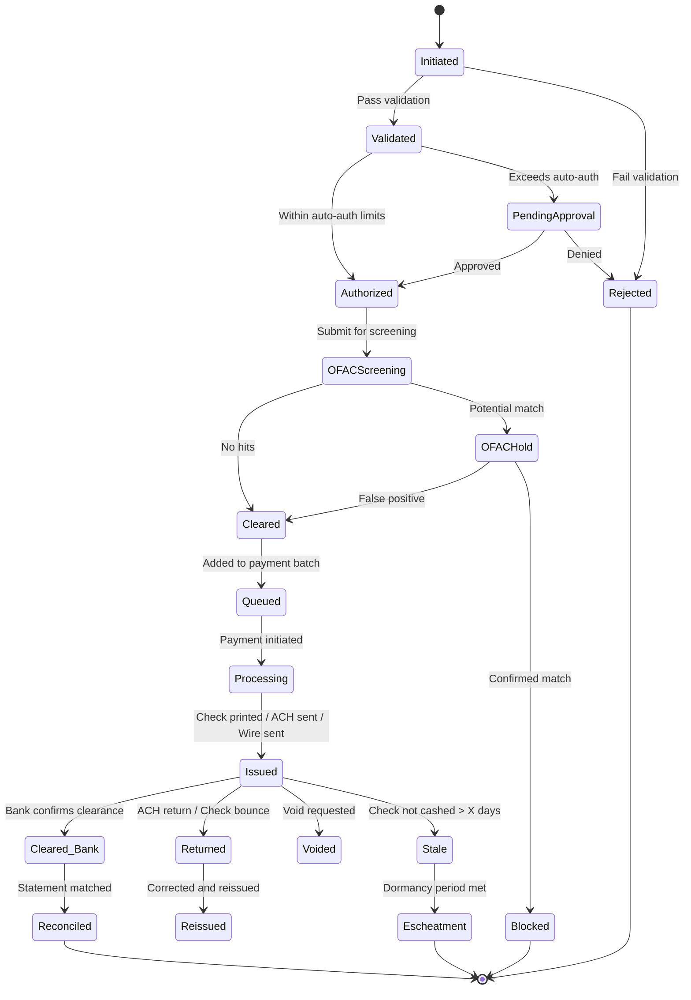

---

## 3. Payment Methods

### 3.1 Check Payments

#### 3.1.1 Check Printing and Mailing

**Check production workflow:**
1. **Daily cutoff:** Approved disbursements queued by 3:00 PM ET
2. **Batch assembly:** Checks grouped by priority and delivery method
3. **Check generation:** Laser printing on MICR-encoded check stock
4. **Enclosure:** Explanatory letter, 1099 information (if applicable), return envelope
5. **Postage:** Metered postage application
6. **Mailing:** USPS First Class (standard) or Overnight (expedited)
7. **Positive pay file:** Transmitted to bank simultaneously

**Check stock management:**

| Element | Description |
|---|---|
| MICR line | Routing number, account number, check number (magnetic ink) |
| Security features | Watermark, void pantograph, microprinting, color-shifting ink |
| Check stock inventory | Secure storage, sequential numbering, audit trail |
| Authorized signatures | Pre-printed facsimile or digital signature |
| Dual signature | Required for amounts > threshold (e.g., $50,000 or $100,000) |

#### 3.1.2 Check Reconciliation

```
Daily Bank Reconciliation Process:
1. Receive paid check file from bank (daily)
2. Match each paid check (by check number + amount) to issued check register
3. Mark matched checks as "CLEARED"
4. Investigate exceptions:
   a. Paid checks not in issue register → Potential fraud
   b. Amount mismatch → Error investigation
   c. Duplicate check numbers → Fraud or system error
5. Report outstanding checks (issued but not yet cleared)
```

#### 3.1.3 Stale-Dated Check Processing

| Period | Action |
|---|---|
| 90 days outstanding | First follow-up letter to payee |
| 180 days outstanding | Second follow-up letter (certified mail) |
| 365 days outstanding | Check voided in system; reissue upon request |
| Dormancy period (state-specific: 1–5 years) | Escheatment processing initiated |

#### 3.1.4 Stop Payment Processing

```json
{
  "stopPaymentRequest": {
    "checkNumber": "12345678",
    "originalAmount": 50000.00,
    "payeeName": "Jane Smith",
    "issueDate": "2025-06-15",
    "reason": "CHECK_LOST_IN_MAIL",
    "requestedBy": "Payee",
    "requestDate": "2025-07-01",
    "actions": [
      { "action": "SUBMIT_STOP_TO_BANK", "status": "COMPLETED", "date": "2025-07-01" },
      { "action": "VOID_ORIGINAL_CHECK", "status": "COMPLETED", "date": "2025-07-01" },
      { "action": "ISSUE_REPLACEMENT", "status": "PENDING", "newCheckNumber": "12345999" },
      { "action": "INDEMNITY_BOND", "required": true, "status": "AWAITING_SIGNED_BOND" }
    ],
    "bankStopPaymentFee": 25.00,
    "feeAbsorbed": true
  }
}
```

### 3.2 ACH/EFT Payments

#### 3.2.1 NACHA File Processing

The National Automated Clearing House Association (NACHA) governs ACH transactions. Insurance disbursements use the following SEC (Standard Entry Class) codes:

| SEC Code | Description | Use Case |
|---|---|---|
| PPD | Prearranged Payment and Deposit | Individual consumer payments (death benefits, surrenders) |
| CCD | Corporate Credit or Debit | Business-to-business (commission, reinsurance) |
| CTX | Corporate Trade Exchange | B2B with addenda records |
| WEB | Internet-Initiated Entry | Online portal-initiated payments |
| TEL | Telephone-Initiated Entry | Phone-initiated payments |

**ACH processing timeline:**

| Event | Timing |
|---|---|
| Origination cutoff | 3:00 PM ET (carrier's bank cutoff) |
| File transmission to ODFI | Same day |
| ODFI transmits to ACH operator | Same day or next morning |
| ACH operator sorts and distributes | Next business day |
| RDFI posts to receiver's account | Settlement date (T+1 for same-day, T+2 for standard) |
| Return window | 2 business days (unauthorized: 60 days) |

#### 3.2.2 ACH Return Handling

| Return Code | Description | Action |
|---|---|---|
| R01 | Insufficient funds | N/A for credits (insurance disbursements) |
| R02 | Account closed | Contact payee for updated banking info |
| R03 | No account / unable to locate | Contact payee for correct info |
| R04 | Invalid account number | Verify and correct |
| R05 | Unauthorized debit | N/A for credits |
| R06 | Returned per ODFI request | Investigate |
| R07 | Authorization revoked | Contact payee |
| R08 | Payment stopped | Contact payee |
| R10 | Customer advises not authorized | Investigate — possible fraud |
| R16 | Account frozen | Compliance hold — investigate |
| R20 | Non-transaction account | Request checking/savings account |
| R29 | Corporate customer advises not authorized | Investigate |

**ACH return processing workflow:**

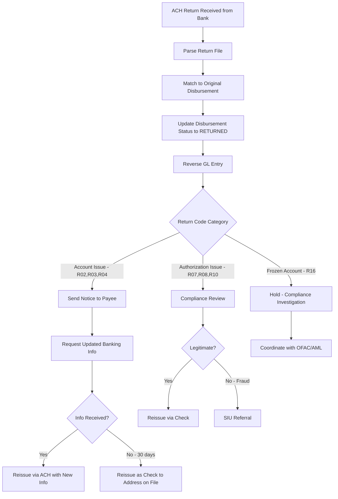

#### 3.2.3 Pre-Notification (Pre-Note)

Before sending the first ACH credit to a new account:

```
Pre-note process:
1. Send $0.00 prenote transaction to verify routing/account
2. Wait 3 business days for return
3. If no return → Account verified, proceed with live transaction
4. If return received → Notify payee, request corrected info

Alternative: Micro-deposit verification
1. Send two small credits (e.g., $0.12 and $0.34)
2. Payee verifies amounts through portal
3. Account confirmed upon correct verification
```

### 3.3 Wire Transfer

#### 3.3.1 Fedwire (Domestic)

| Characteristic | Detail |
|---|---|
| Operator | Federal Reserve Banks |
| Settlement | Real-time, irrevocable |
| Availability | 9:00 PM ET (prior day) to 7:00 PM ET |
| Cost | $10–$30 per wire (carrier's bank fee) |
| Threshold | Typically used for amounts > $100,000 |
| Initiation | Manual or automated via banking platform API |

**Wire transfer data requirements:**
```json
{
  "wireTransfer": {
    "senderInfo": {
      "bankName": "Carrier's Bank, N.A.",
      "routingNumber": "021000089",
      "accountNumber": "****1234",
      "reference": "CLAIM-2025-001234"
    },
    "receiverInfo": {
      "bankName": "Beneficiary's Bank",
      "routingNumber": "021000021",
      "accountNumber": "****5678",
      "beneficiaryName": "Jane Smith",
      "beneficiaryAddress": "123 Main Street, Hartford, CT 06101"
    },
    "amount": 1025629.82,
    "purpose": "Life Insurance Death Benefit - Policy WL-1234567",
    "valueDate": "2025-12-20",
    "priority": "NORMAL"
  }
}
```

#### 3.3.2 SWIFT (International)

For beneficiaries with foreign bank accounts:

| Field | Description |
|---|---|
| MT103 | Single Customer Credit Transfer message |
| SWIFT BIC | Beneficiary's bank identifier (8 or 11 characters) |
| IBAN | International Bank Account Number |
| Intermediary bank | Required if beneficiary's bank has no direct correspondent |
| Currency | Usually USD; foreign currency requires FX conversion |
| Charges | OUR (sender pays all), SHA (shared), BEN (receiver pays) |

### 3.4 Real-Time Payments

#### 3.4.1 FedNow

Launched in 2023, FedNow enables instant payments 24/7/365:

| Characteristic | Detail |
|---|---|
| Settlement | Instant (seconds) |
| Availability | 24/7/365 |
| Maximum amount | $500,000 (default; banks may set higher) |
| Cost | Lower than wire; higher than ACH |
| Use case | Urgent claim payments, same-day surrender proceeds |
| Status | Adoption growing; not yet universal |

#### 3.4.2 RTP (Real-Time Payments — The Clearing House)

| Characteristic | Detail |
|---|---|
| Operator | The Clearing House |
| Settlement | Real-time, irrevocable |
| Maximum amount | $1,000,000 |
| Availability | 24/7/365 |
| Adoption | Over 300 financial institutions |
| Request for Payment (RfP) | Can request payment from payee's bank |

### 3.5 Retained Asset Account (RAA)

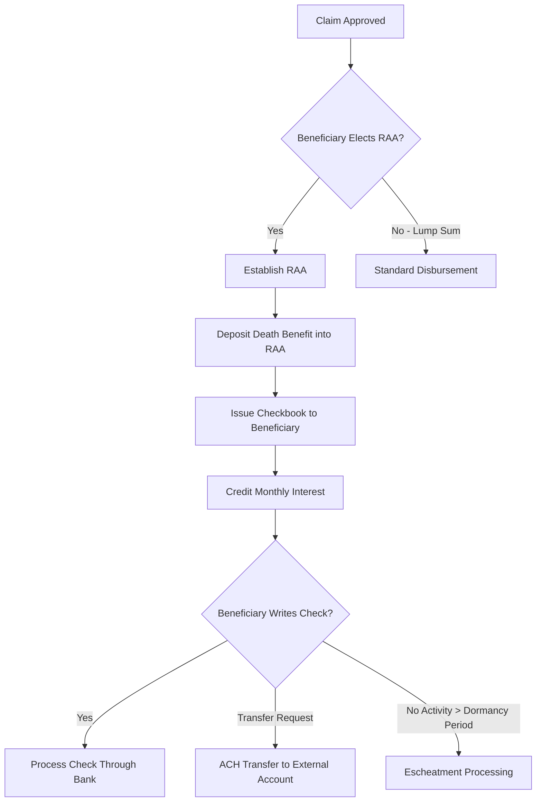

**RAA characteristics:**

| Feature | Detail |
|---|---|
| Account type | Interest-bearing draft account |
| Interest rate | Competitive (e.g., 2.0%–3.5%) |
| FDIC insured | No — backed by insurer's general account |
| State insurance guarantee | Varies by state (may have limits) |
| Minimum balance | None (can be drawn to zero) |
| Monthly statement | Yes |
| Check clearing | Through bank partner |
| Tax reporting | 1099-INT for interest earned |
| Escheatment | Subject to state unclaimed property laws |

### 3.6 Debit Card / Prepaid Card

Some carriers offer claim payments via prepaid debit cards:

| Feature | Detail |
|---|---|
| Card network | Visa or Mastercard branded |
| Activation | Card arrives pre-loaded; activation required |
| ATM withdrawal | Available (fees may apply) |
| Retail purchase | Available |
| Bank transfer | Available (to external account) |
| Fee structure | Carrier-paid initial load; monthly fees possible |
| Tax reporting | 1099-INT for any interest; card load not separately reported |
| Anti-fraud | PIN, CVV, chip, address verification |

### 3.7 Payment Method Selection Matrix

| Criteria | Check | ACH | Wire | FedNow/RTP | RAA |
|---|---|---|---|---|---|
| Speed | 5–10 days | 1–2 days | Same day | Instant | Immediate access |
| Cost to carrier | $5–$10 | $0.25–$1.00 | $15–$30 | $0.50–$2.00 | Ongoing interest |
| Amount limit | Unlimited | Varies by bank | Unlimited | $500K–$1M | No limit |
| Payee setup | Minimal | Banking info required | Banking info required | Banking info required | Automatic |
| Fraud risk | Highest (forgery, theft) | Moderate | Low | Low | Low |
| Reconciliation | Complex | Moderate | Simple | Simple | Moderate |
| Escheatment risk | High (stale checks) | None | None | None | Moderate |

---

## 4. Payment Authorization

### 4.1 Disbursement Approval Workflows

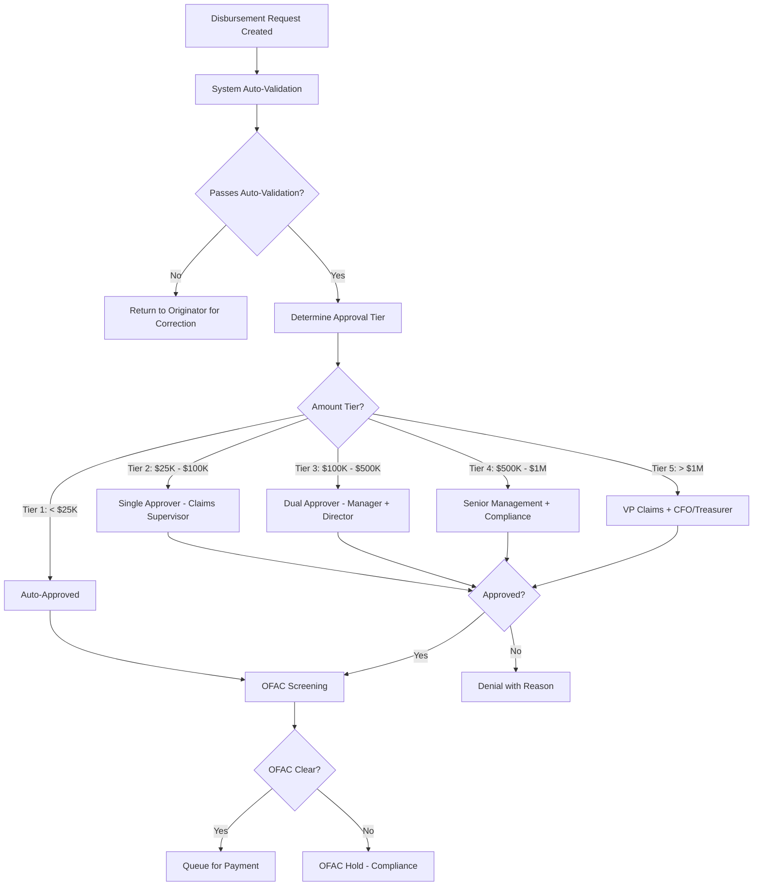

### 4.2 Approval Thresholds

| Tier | Amount Range | Required Approvers | SLA |
|---|---|---|---|
| 1 | $0 – $24,999 | System auto-approval | Immediate |
| 2 | $25,000 – $99,999 | Claims Supervisor (1 approver) | 4 hours |
| 3 | $100,000 – $499,999 | Claims Manager + Director (2 approvers) | 24 hours |
| 4 | $500,000 – $999,999 | Sr. Director + Compliance Officer | 48 hours |
| 5 | $1,000,000+ | VP Claims + CFO or Treasurer | 72 hours |

### 4.3 Segregation of Duties

| Function | Cannot Also Perform |
|---|---|
| Claim adjudication | Payment authorization for same claim |
| Payment authorization | Check signing / wire release |
| Check printing | Check mailing |
| ACH file creation | ACH file release to bank |
| Wire initiation | Wire approval |
| Beneficiary setup | Payment processing to that beneficiary |

### 4.4 Disbursement Fraud Prevention

| Control | Description |
|---|---|
| Dual authorization | Two independent approvals for high-value payments |
| IP address monitoring | Flag payments initiated from unusual locations |
| Velocity checks | Flag multiple disbursements to same payee in short period |
| Pattern analysis | ML model detecting anomalous payment patterns |
| Beneficiary change + immediate claim | Flag claims where beneficiary changed within 90 days |
| Payee verification | Verify payee name matches beneficiary on file |
| Banking info validation | Verify bank routing number via Federal Reserve database |
| Callback verification | Phone verification for wire transfers > $250K |

---

## 5. OFAC/Sanctions Screening

### 5.1 OFAC Overview

The Office of Foreign Assets Control (OFAC) administers economic and trade sanctions. All U.S. financial institutions (including insurance companies) must screen every disbursement against OFAC sanctions lists before releasing payment.

### 5.2 Sanctions Lists

| List | Administered By | Description |
|---|---|---|
| SDN (Specially Designated Nationals) | OFAC | Individuals and entities owned/controlled by sanctioned countries |
| Sectoral Sanctions (SSI) | OFAC | Specific sectors of sanctioned economies |
| Non-SDN Lists | OFAC | Various sub-lists (Foreign Sanctions Evaders, etc.) |
| EU Consolidated List | European Commission | EU sanctions (relevant for international operations) |
| UN Consolidated List | United Nations | UN Security Council sanctions |
| HM Treasury List | UK Government | UK sanctions |
| PEP Lists | Various | Politically Exposed Persons |

### 5.3 Screening Process

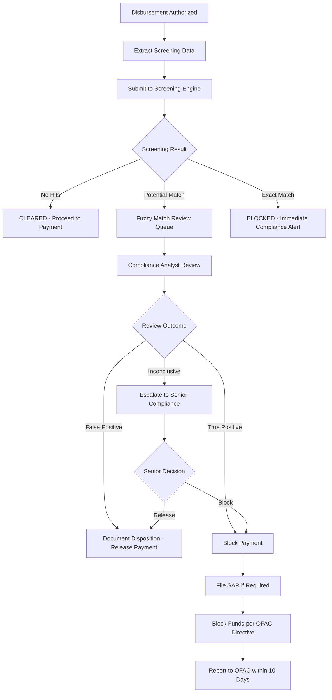

### 5.4 Screening Data Elements

| Element | Source | Screening Against |
|---|---|---|
| Payee full name | Beneficiary/payee record | SDN names, aliases |
| Payee SSN/TIN/EIN | Policy/claim records | SDN identifiers |
| Payee address | Address on file | SDN addresses, sanctioned countries |
| Payee date of birth | Party records | SDN DOB |
| Payee country | Address/nationality | Sanctioned countries |
| Bank routing/SWIFT | Banking information | Sanctioned financial institutions |
| Intermediary bank | Wire instructions | Sanctioned institutions |

### 5.5 Fuzzy Matching Algorithms

| Algorithm | Description | Use Case |
|---|---|---|
| Soundex | Phonetic matching (English) | Basic name matching |
| Metaphone/Double Metaphone | Improved phonetic | Better multi-language support |
| Jaro-Winkler | String similarity (0–1 score) | Name comparison with confidence |
| Levenshtein Distance | Edit distance between strings | Typo detection |
| OFAC-specific algorithms | Name transposition, nick-name matching | Regulatory best practice |

**Matching thresholds:**

| Match Score | Action |
|---|---|
| ≥ 95% | Auto-block — exact or near-exact match |
| 80–94% | Manual review required |
| 60–79% | Low-confidence — auto-release with logging |
| < 60% | No match — auto-release |

### 5.6 SAR (Suspicious Activity Report) Filing

When a transaction is suspicious (whether or not OFAC-related):

| Requirement | Detail |
|---|---|
| Filing threshold | $5,000+ (insurance companies) |
| Filing deadline | 30 days after initial detection (60 days if no suspect identified) |
| Filed with | FinCEN (Financial Crimes Enforcement Network) |
| Format | BSA E-Filing system |
| Retention | 5 years from filing date |
| Confidentiality | Filing must NOT be disclosed to the subject |

### 5.7 Screening Service Integration

```json
{
  "ofacScreeningRequest": {
    "screeningId": "OFAC-2025-098765",
    "disbursementId": "DISB-2025-045678",
    "screeningType": "DISBURSEMENT",
    "subjects": [
      {
        "role": "PAYEE",
        "fullName": "Jane Marie Smith",
        "alternateNames": ["Jane M. Smith", "Jane Smith"],
        "dateOfBirth": "1948-07-22",
        "ssn": "987-65-4321",
        "address": {
          "line1": "123 Main Street",
          "city": "Hartford",
          "state": "CT",
          "country": "US",
          "postalCode": "06101"
        },
        "nationality": "US"
      }
    ],
    "financialInstitution": {
      "bankName": "First National Bank",
      "routingNumber": "021000021",
      "swiftCode": null,
      "country": "US"
    },
    "transactionAmount": 1025629.82,
    "transactionCurrency": "USD",
    "requestTimestamp": "2025-12-20T10:30:00Z"
  }
}
```

```json
{
  "ofacScreeningResponse": {
    "screeningId": "OFAC-2025-098765",
    "overallResult": "CLEARED",
    "listsScreened": ["SDN", "SSI", "FSE", "NS-PLC", "CAPTA", "EU_CONSOLIDATED"],
    "matchResults": [],
    "confidenceScore": 0.00,
    "screenedTimestamp": "2025-12-20T10:30:02Z",
    "listVersionDate": "2025-12-19",
    "disposition": "AUTO_CLEARED",
    "analystReview": false
  }
}
```

---

## 6. Escheatment & Unclaimed Property

### 6.1 Overview

Escheatment (also called "unclaimed property") is the legal process by which unclaimed financial assets are transferred to the state. Insurance companies are among the largest holders of unclaimed property, and compliance with state escheatment laws is a critical function of the disbursement engine.

### 6.2 State Unclaimed Property Laws

Every state has enacted unclaimed property legislation (modeled on the Uniform Unclaimed Property Act):

#### 6.2.1 Dormancy Periods

| Property Type | Typical Dormancy Period | Range Across States |
|---|---|---|
| Life insurance death benefits | 3 years | 2–5 years |
| Annuity benefits | 3 years | 2–5 years |
| Premium refunds | 3 years | 1–5 years |
| Uncashed checks (general) | 3 years | 1–5 years |
| Retained asset accounts | 3 years | 2–5 years |
| Agent commission checks | 1–3 years | 1–5 years |
| Maturity proceeds | 3 years | 2–5 years |
| Dividend accumulations | 3 years | 3–5 years |

#### 6.2.2 Selected State Dormancy Periods

| State | Life Insurance | Annuity | Checks | Reporting Deadline |
|---|---|---|---|---|
| New York | 3 years | 3 years | 3 years | March 10 |
| California | 3 years | 3 years | 3 years | November 1 |
| Texas | 3 years | 3 years | 3 years | November 1 |
| Florida | 5 years | 5 years | 5 years | May 1 |
| Illinois | 3 years | 3 years | 3 years | November 1 |
| Pennsylvania | 3 years | 3 years | 3 years | April 15 |
| Delaware | 5 years | 5 years | 5 years | March 1 |
| Ohio | 3 years | 3 years | 3 years | November 1 |

### 6.3 Due Diligence Requirements

Before escheating property, carriers must perform due diligence to locate the rightful owner:

#### 6.3.1 Due Diligence Timeline

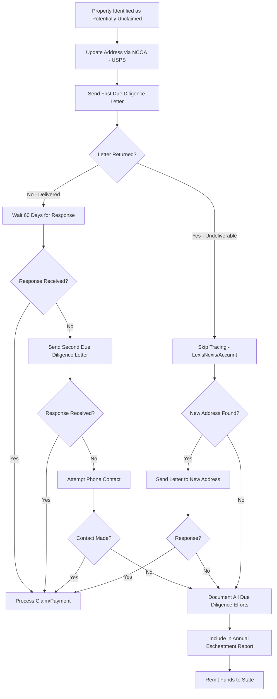

#### 6.3.2 Due Diligence Methods

| Method | Timing | Cost | Description |
|---|---|---|---|
| NCOA (National Change of Address) | First step | Low | USPS address update database |
| First class mail with return service | 60–90 days before reporting | Low | Notification to last known address |
| Certified mail | Required by some states | Moderate | Documented delivery attempt |
| Phone contact | After letter attempts | Low | Outbound call to last known phone |
| LexisNexis/Accurint | When letters returned | Moderate | Advanced skip-tracing |
| Email | If available | Low | Electronic notification |
| Check company records | First step | Low | Other policies, claims, correspondence |
| State insurance department | If applicable | None | Some states maintain locator databases |

### 6.4 Escheatment Filing

#### 6.4.1 Reporting Format

Most states accept reports in the NAUPA (National Association of Unclaimed Property Administrators) electronic format:

```
NAUPA Record Layout (abbreviated):
  Field 1:  Record Type (01=Header, 02=Detail, 03=Summary)
  Field 2:  Holder Tax ID
  Field 3:  Holder Name
  Field 4:  Owner Last Name
  Field 5:  Owner First Name
  Field 6:  Owner SSN/TIN
  Field 7:  Owner Last Known Address
  Field 8:  Property Type Code
  Field 9:  Amount
  Field 10: Date of Last Activity
  Field 11: Relationship Code
  Field 12: State of Last Known Address
```

#### 6.4.2 Property Type Codes (Insurance-Specific)

| Code | Description |
|---|---|
| LC01 | Individual life insurance — death benefit |
| LC02 | Group life insurance — death benefit |
| LC03 | Endowment — matured |
| LC04 | Annuity — death benefit |
| LC05 | Premium refund |
| LC06 | Retained asset account |
| LC07 | Uncashed dividend check |
| LC08 | Commission check |
| LC09 | Surrender proceeds |

### 6.5 NAIC Unclaimed Death Benefits Regulation

The NAIC Model Act (#580) specifically addresses unclaimed life insurance benefits:

**Key requirements:**
1. Regular DMF matching (at least annually, preferably monthly)
2. Upon identifying a potential match, initiate search for beneficiary
3. If beneficiary found → process claim
4. If beneficiary not found after due diligence → escheat to state
5. Must compare ALL in-force policies, retained asset accounts, and annuities
6. Multi-state filing: State of owner's last known address has priority; if unknown, state of insurer's domicile

### 6.6 Escheatment Processing Architecture

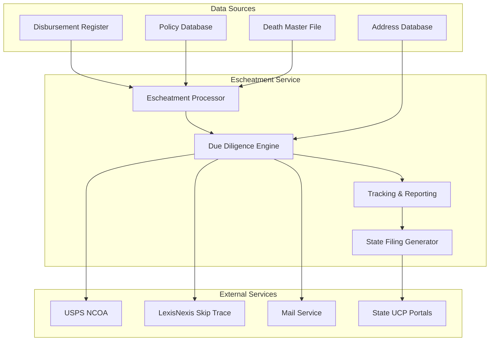

---

## 7. Tax Withholding

### 7.1 Federal Income Tax Withholding

#### 7.1.1 Withholding Categories

| Distribution Type | Default Withholding | Election Form | Can Opt Out? |
|---|---|---|---|
| Eligible rollover distribution | 20% mandatory | N/A | No (must direct rollover) |
| Non-periodic payment (lump sum) | 10% default | W-4R | Yes |
| Periodic payment (installment/annuity) | Per tax tables | W-4P | Yes |
| Non-resident alien | 30% (or treaty rate) | W-8BEN | No (treaty may reduce) |
| Tax-free death benefit | $0 | N/A | N/A |

#### 7.1.2 W-4R Processing (Non-Periodic)

The 2022 redesigned W-4R allows payees to elect any withholding rate from 0% to 100%:

```json
{
  "w4rElection": {
    "payeeName": "Jane Smith",
    "payeeTIN": "***-**-4321",
    "distributionType": "NON_PERIODIC",
    "requestedWithholdingRate": 15.0,
    "effectiveDate": "2025-12-20",
    "estimatedDistribution": 70869.23,
    "estimatedWithholding": 10630.38,
    "signatureDate": "2025-12-18",
    "signatureMethod": "ELECTRONIC"
  }
}
```

#### 7.1.3 Mandatory 20% Withholding (Eligible Rollover Distributions)

For qualified plan distributions that are eligible for rollover but not directly rolled over:

```
Eligible Rollover Distribution:
  - Any distribution from a qualified plan (401k, 403b, IRA, etc.)
  - EXCEPT: RMDs, hardship, loans treated as distributions, 
    substantially equal periodic payments, corrective distributions

Mandatory 20% withholding:
  Gross distribution: $100,000
  Mandatory federal withholding: $20,000
  Net payment to payee: $80,000
  
  Note: Payee can still roll over the full $100,000 within 60 days
  by contributing $20,000 from other funds (and receiving a refund
  of the $20,000 withholding when filing their tax return)
```

### 7.2 State Income Tax Withholding

#### 7.2.1 State Withholding Categories

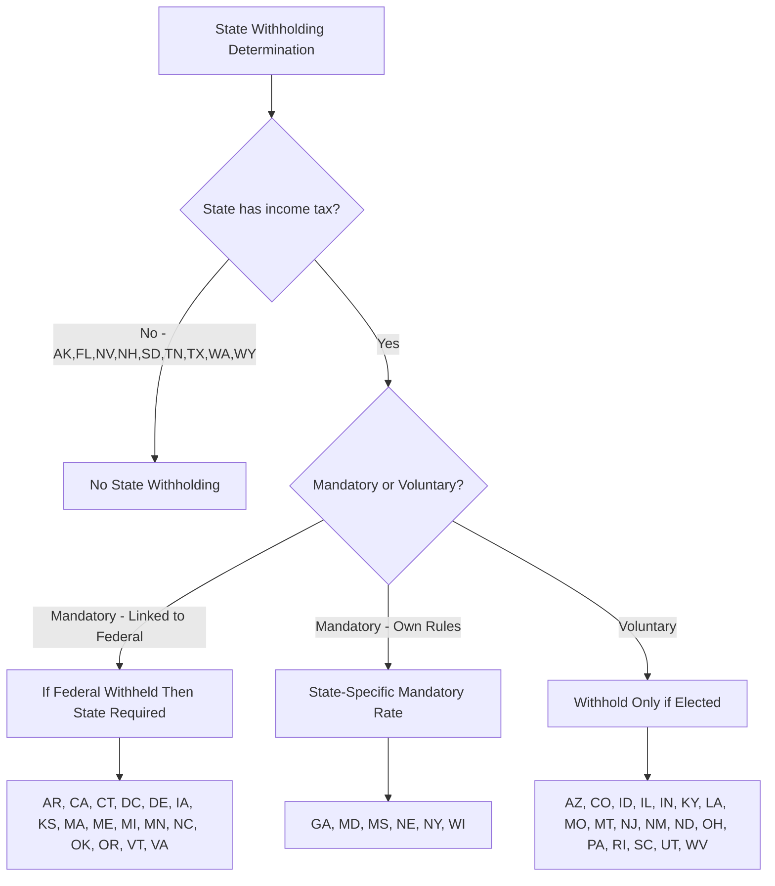

#### 7.2.2 State Withholding Rate Reference

| State | Category | Default Rate | W-4 Variant |
|---|---|---|---|
| California | Mandatory (if fed) | 10% of federal amount | DE-4P |
| Connecticut | Mandatory (if fed) | 6.99% | CT-W4P |
| Georgia | Mandatory | 2.0%–5.75% | G-4P |
| Maryland | Mandatory | 5.75% (plus local 1.75%–3.2%) | MW507P |
| Massachusetts | Mandatory (if fed) | 5.0% | M-4P |
| Michigan | Mandatory (if fed) | 4.25% | MI-W4P |
| New York | Mandatory | 4.0%–10.9% (per tables) | IT-2104-P |
| Virginia | Mandatory (if fed) | 4.0% | VA-4P |
| Arizona | Voluntary | 2.5% default (elections: 0.8%–5.1%) | A-4P |
| Colorado | Voluntary | 4.4% | DR 0104 |
| Illinois | Voluntary | 4.95% | IL-W-4 |
| Ohio | Voluntary | Per tables | IT-4P |
| Pennsylvania | Voluntary | 3.07% | REV-419 |

### 7.3 Backup Withholding

When the payee fails to provide a valid TIN (or the IRS notifies of an incorrect TIN):

| Requirement | Detail |
|---|---|
| Rate | 24% (federal) |
| Trigger | Missing or incorrect TIN, "B" notice from IRS |
| Override | Payee provides correct TIN with W-9 |
| Reporting | Backup withholding reported on 1099 |

### 7.4 Non-Resident Alien Withholding

| Default Rate | 30% |
|---|---|
| Treaty rate | Varies by country (0%–30%) |
| Form required | W-8BEN (individuals), W-8BEN-E (entities) |
| FATCA | Additional reporting requirements |
| CRS | Common Reporting Standard for foreign accounts |
| QI status | Qualified Intermediary may certify treaty benefits |

### 7.5 Withholding Calculation Engine

```
FUNCTION calculateWithholding(disbursement):
    // Federal withholding
    IF disbursement.isTaxFreeDeathBenefit:
        federalWithholding = 0
    ELIF disbursement.isEligibleRollover AND NOT disbursement.isDirectRollover:
        federalWithholding = disbursement.taxableAmount * 0.20  // Mandatory
    ELIF disbursement.isNonPeriodic:
        IF payee.w4rElection EXISTS:
            federalWithholding = disbursement.taxableAmount * payee.w4rElection.rate
        ELSE:
            federalWithholding = disbursement.taxableAmount * 0.10  // Default
    ELIF disbursement.isPeriodic:
        federalWithholding = calculatePeriodicWithholding(
            disbursement.taxableAmount, payee.w4pElection)
    ELIF payee.isNonResidentAlien:
        treatyRate = getTreatyRate(payee.countryOfResidence, disbursement.incomeType)
        federalWithholding = disbursement.taxableAmount * treatyRate
    
    // Backup withholding check
    IF payee.isMissingTIN OR payee.hasIRSBNotice:
        federalWithholding = MAX(federalWithholding, disbursement.taxableAmount * 0.24)
    
    // State withholding
    stateWithholding = calculateStateWithholding(
        payee.state, disbursement.taxableAmount, federalWithholding, payee.stateW4)
    
    netPayment = disbursement.grossAmount - federalWithholding - stateWithholding
    
    RETURN {
        grossAmount: disbursement.grossAmount,
        taxableAmount: disbursement.taxableAmount,
        federalWithholding: federalWithholding,
        stateWithholding: stateWithholding,
        netPayment: netPayment
    }
```

---

## 8. Payment Reconciliation

### 8.1 Reconciliation Overview

Payment reconciliation ensures that every disbursement recorded in the PAS matches the actual movement of funds through the banking system.

### 8.2 Reconciliation by Payment Type

#### 8.2.1 Check Reconciliation

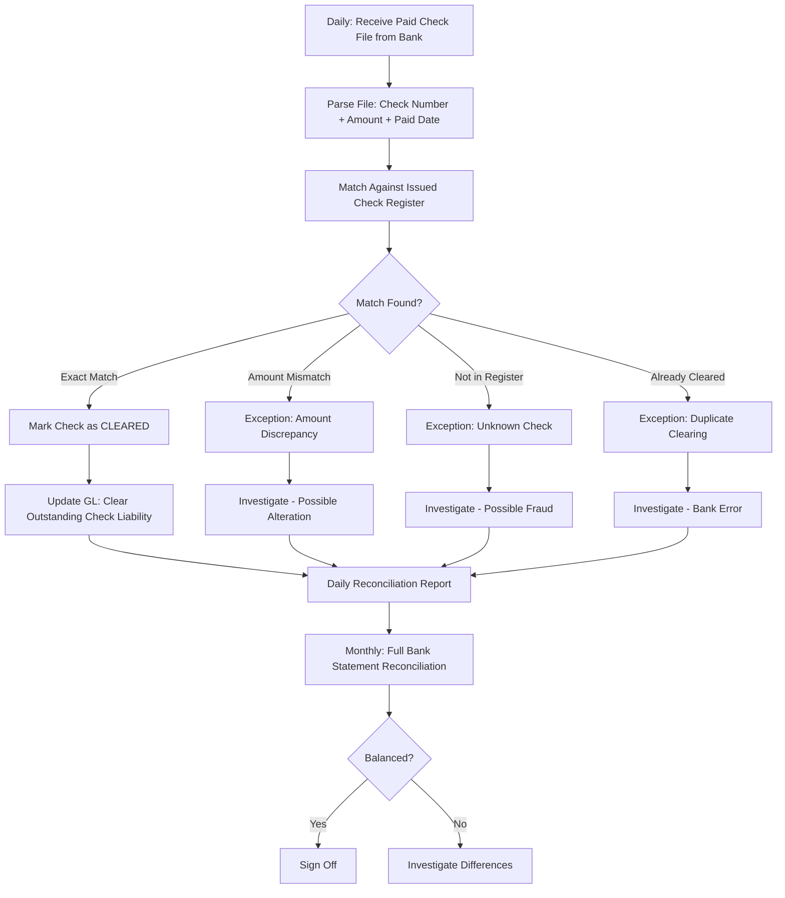

#### 8.2.2 ACH Reconciliation

| Step | Timing | Description |
|---|---|---|
| Origination confirmation | Same day | Confirm NACHA file accepted by bank |
| Settlement confirmation | T+1 or T+2 | Confirm funds debited from carrier's account |
| Return file processing | T+2 to T+60 | Process any ACH returns |
| Monthly reconciliation | Month-end | Match all ACH originations to bank statement debits |

#### 8.2.3 Wire Reconciliation

| Step | Timing | Description |
|---|---|---|
| Wire confirmation | Same day | Fedwire confirmation number received |
| Debit confirmation | Same day | Funds debited from carrier's account |
| Beneficiary confirmation | T+1 | Confirmation of credit to beneficiary (if available) |
| Monthly reconciliation | Month-end | Match all wires to bank statement |

### 8.3 Outstanding Payment Register

```json
{
  "outstandingPaymentRegister": {
    "asOfDate": "2025-12-31",
    "summary": {
      "totalOutstandingChecks": 1234,
      "totalOutstandingAmount": 15678432.50,
      "checksOutstanding30Days": 890,
      "checksOutstanding60Days": 234,
      "checksOutstanding90Days": 78,
      "checksOutstanding180Days": 25,
      "checksOutstandingOver1Year": 7
    },
    "agingBuckets": [
      { "bucket": "0-30 days", "count": 890, "amount": 12500000.00 },
      { "bucket": "31-60 days", "count": 234, "amount": 2100000.00 },
      { "bucket": "61-90 days", "count": 78, "amount": 750000.00 },
      { "bucket": "91-180 days", "count": 25, "amount": 278432.50 },
      { "bucket": "181-365 days", "count": 5, "amount": 40000.00 },
      { "bucket": "> 365 days", "count": 2, "amount": 10000.00 }
    ]
  }
}
```

### 8.4 Bank Statement Reconciliation

```
Monthly Bank Reconciliation:

Book Balance (PAS disbursement account):        $XX,XXX,XXX.XX
+ Deposits in transit                          $X,XXX,XXX.XX
- Outstanding checks (not yet cleared)        ($X,XXX,XXX.XX)
- Outstanding ACH credits (in transit)        ($XXX,XXX.XX)
+/- Other adjustments                         $XX,XXX.XX
= Adjusted Book Balance:                       $XX,XXX,XXX.XX

Bank Balance (per bank statement):              $XX,XXX,XXX.XX
+ Deposits not yet credited by bank            $XX,XXX.XX
- Bank charges not yet recorded                ($XX,XXX.XX)
+/- Other bank adjustments                     $XX,XXX.XX
= Adjusted Bank Balance:                        $XX,XXX,XXX.XX

Difference:                                     $0.00 (must be zero)
```

---

## 9. Payment Error Handling

### 9.1 Error Types and Resolution

| Error Type | Detection Method | Resolution |
|---|---|---|
| Wrong amount | Post-payment audit, payee complaint | Supplemental payment or recovery |
| Wrong payee | Post-payment audit, beneficiary complaint | Recovery + correct payment |
| Duplicate payment | Duplicate detection algorithm | Recovery of duplicate |
| Payment to deceased | DMF cross-match after payment | Estate recovery |
| Incorrect banking info | ACH return | Contact payee for correct info, reissue |
| Check forgery | Bank investigation, positive pay reject | Indemnity claim, reissue |
| Overpayment (calculation error) | Post-payment audit | Recovery letter, offset against future payments |
| Underpayment | Payee complaint, audit | Supplemental payment |

### 9.2 Payment Reversal Processing

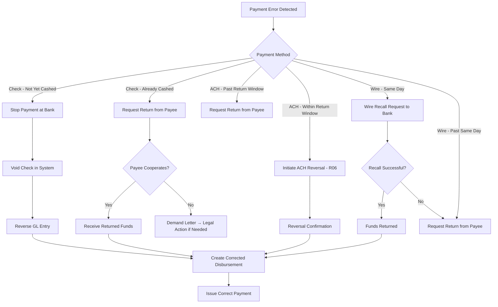

### 9.3 Duplicate Payment Detection

```yaml
duplicateDetectionRules:
  - rule: "Same payee TIN + same amount within 30 days"
    action: "HOLD_FOR_REVIEW"
    exception: "Recurring periodic payments"
  
  - rule: "Same policy number + same transaction type within 24 hours"
    action: "BLOCK"
    exception: "None"
  
  - rule: "Same claim number + any payment within 7 days"
    action: "HOLD_FOR_REVIEW"
    exception: "Multi-beneficiary payments"
  
  - rule: "Same bank account + total > 2x expected within 30 days"
    action: "FLAG_FOR_AUDIT"
    exception: "Known legitimate scenarios"
```

### 9.4 Escheatment Reversal (Heir Claim)

When a rightful owner claims previously escheated property:

1. Owner files claim with the state unclaimed property office
2. State verifies identity and entitlement
3. State requests the insurer to confirm the property was escheated
4. If state pays directly: No further action by insurer
5. If state directs insurer to pay: Insurer processes payment and reclaims from state
6. Accounting entry reverses the escheatment and records the payment

---

## 10. 1099 Reporting Integration

### 10.1 Payment-to-1099 Mapping

| Payment Type | 1099 Form | Box | Distribution Code |
|---|---|---|---|
| Death benefit (life insurance) | 1099-INT | Box 1 (interest only) | N/A |
| Death benefit (annuity — NQ) | 1099-R | Box 1, 2a | 4 |
| Death benefit (annuity — IRA) | 1099-R | Box 1, 2a | 4 |
| Surrender (life) | 1099-R | Box 1, 2a | 7 (or 1 if early) |
| Surrender (annuity — NQ) | 1099-R | Box 1, 2a | 7 (or 1 if early) |
| Partial withdrawal | 1099-R | Box 1, 2a | 7 (or 1) |
| Policy loan (MEC only) | 1099-R | Box 1, 2a | 7 (or 1) |
| Annuity payout | 1099-R | Box 1, 2a | 7 |
| GMWB withdrawal | 1099-R | Box 1, 2a | 7 (or 1) |
| RMD | 1099-R | Box 1, 2a | 7 |
| 1035 exchange | 1099-R | Box 1 (2a = 0) | 6 |
| Interest on death benefit | 1099-INT | Box 1 | N/A |
| Dividend (taxable) | 1099-DIV | Box 1a | N/A |
| Settlement option interest | 1099-INT | Box 1 | N/A |
| Retained asset account interest | 1099-INT | Box 1 | N/A |
| Commission | 1099-NEC | Box 1 | N/A |

### 10.2 Annual Payment Accumulation

The 1099 reporting service accumulates all payments by TIN throughout the year:

```json
{
  "annual1099Accumulation": {
    "taxYear": 2025,
    "recipientTIN": "***-**-4321",
    "recipientName": "Jane Smith",
    "forms": [
      {
        "formType": "1099-R",
        "accumulatedPayments": [
          {
            "policyNumber": "WL-1234567",
            "totalGross": 90992.52,
            "totalTaxable": 27992.52,
            "totalFederalWithheld": 4199.00,
            "totalStateWithheld": 1957.00,
            "distributionCode": "7"
          }
        ]
      },
      {
        "formType": "1099-INT",
        "accumulatedInterest": [
          {
            "source": "Death Benefit Interest",
            "totalInterest": 5080.91
          }
        ]
      }
    ]
  }
}
```

### 10.3 1099 Generation and Filing

#### 10.3.1 Timeline

| Date | Activity |
|---|---|
| January 1–15 | Finalize prior year payment accumulations |
| January 15–25 | Generate 1099 forms |
| January 31 | Mail 1099s to recipients (or make available online) |
| February 28 | Paper file with IRS (if < 250 forms per type) |
| March 31 | Electronic file with IRS via FIRE system |
| Throughout year | Process corrected 1099s as errors discovered |

#### 10.3.2 FIRE System (Filing Information Returns Electronically)

```
FIRE File Specifications:
  - File format: Fixed-width text
  - Transmitter identification: TCC (Transmitter Control Code) from IRS
  - Record types:
    "T" - Transmitter record
    "A" - Payer record
    "B" - Payee record (one per 1099)
    "C" - End of payer record
    "F" - End of transmission
  - Submission: Upload to IRS FIRE system (fire.irs.gov)
  - Acknowledgment: Received within 24–48 hours
  - Error correction: Corrected file submission if errors
```

### 10.4 Corrected 1099 Processing

| Scenario | Action |
|---|---|
| Wrong TIN | Issue corrected 1099 with correct TIN; file correction with IRS |
| Wrong amount | Issue corrected 1099 with correct amount; file correction |
| Wrong distribution code | Issue corrected 1099 with correct code; file correction |
| Missing 1099 (not issued) | Issue original 1099; file with IRS |
| Duplicate 1099 | Issue voided 1099 for duplicate; file void with IRS |

**Corrected 1099 identification:**
- Check the "CORRECTED" box on the form
- Include both the incorrect information (to identify the original) and correct information
- File the correction electronically via FIRE

---

## 11. Positive Pay

### 11.1 Overview

Positive Pay is a bank fraud prevention service that matches checks presented for payment against a list of checks issued by the company.

### 11.2 Positive Pay Process

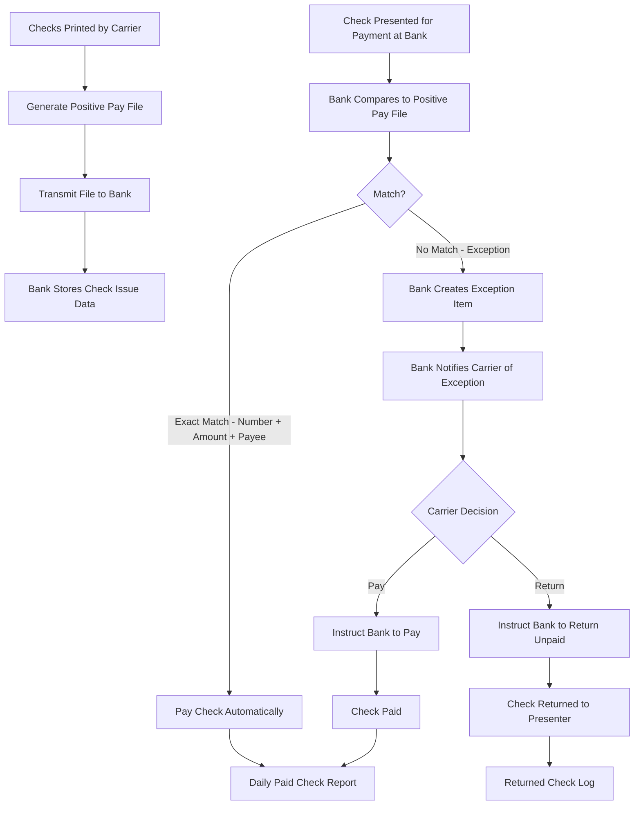

### 11.3 Positive Pay File Format

```
Positive Pay File (typical bank format):
  Record Type: "I" (Issue), "V" (Void), "S" (Stop)
  
  Fields:
    Account Number:     [10 chars]
    Check Number:       [10 chars]
    Issue Date:         [MMDDYYYY]
    Amount:             [10 chars, implied decimal]
    Payee Name:         [40 chars]
    Record Type:        [1 char: I/V/S]

Example:
  1234567890,0012345678,12202025,0001025630,JANE SMITH                              ,I
  1234567890,0012345679,12202025,0000070869,JOHN DOE                                ,I
  1234567890,0012340001,06152025,0000000000,VOIDED CHECK                            ,V
```

### 11.4 Exception Item Handling

| Exception Type | Description | Typical Decision |
|---|---|---|
| Check not in file | Check presented but not in positive pay file | Usually return (possible fraud) |
| Amount mismatch | Check amount differs from issued amount | Return (possible alteration) |
| Payee mismatch | Payee name different from file | Review — may be endorsement issue |
| Stale date | Check older than valid period | Return or pay per policy |
| Voided check | Check was voided but still presented | Return |
| Duplicate presentment | Check already cleared | Return |

---

## 12. Entity-Relationship Model

### 12.1 Disbursement ERD

```mermaid
erDiagram
    DISBURSEMENT {
        string disbursementId PK
        string disbursementType
        string disbursementStatus
        string sourceTransactionId FK
        string sourceTransactionType
        string policyNumber FK
        string claimNumber FK
        decimal grossAmount
        decimal taxableAmount
        decimal federalWithholding
        decimal stateWithholding
        decimal netPaymentAmount
        string payeeId FK
        string paymentMethod
        date requestDate
        date approvedDate
        date paymentDate
        string batchId
    }
    
    PAYEE {
        string payeeId PK
        string payeeType
        string fullName
        string tin
        string tinType
        string address1
        string address2
        string city
        string state
        string zip
        string country
        string email
        string phone
    }
    
    BANKING_INFO {
        string bankingId PK
        string payeeId FK
        string bankName
        string routingNumber
        string accountNumber
        string accountType
        boolean prenoteVerified
        date prenoteDate
        string swiftCode
        string iban
        string status
    }
    
    PAYMENT_AUTHORIZATION {
        string authorizationId PK
        string disbursementId FK
        string authorizationStatus
        integer approvalTier
        string requiredApprovers
        date requestedDate
        date completedDate
    }
    
    APPROVAL_RECORD {
        string approvalId PK
        string authorizationId FK
        string approverUserId
        string approverName
        string approverRole
        string decision
        string comments
        date decisionDate
    }
    
    OFAC_SCREENING {
        string screeningId PK
        string disbursementId FK
        string screeningStatus
        string overallResult
        string listsScreened
        decimal matchScore
        string analystId
        string disposition
        date screenedDate
        date resolvedDate
    }
    
    OFAC_HIT {
        string hitId PK
        string screeningId FK
        string listName
        string matchedName
        string matchedId
        decimal confidenceScore
        string matchType
        string resolution
    }
    
    CHECK_REGISTER {
        string checkId PK
        string disbursementId FK
        string checkNumber
        string bankAccount
        decimal amount
        string payeeName
        date issueDate
        date clearedDate
        date voidDate
        date staleDate
        string checkStatus
        string positivePayStatus
    }
    
    ACH_TRANSACTION {
        string achId PK
        string disbursementId FK
        string secCode
        string traceNumber
        string batchNumber
        string fileId
        decimal amount
        string receiverName
        string routingNumber
        string accountNumber
        string accountType
        date effectiveDate
        date settlementDate
        string returnCode
        date returnDate
        string achStatus
    }
    
    WIRE_TRANSACTION {
        string wireId PK
        string disbursementId FK
        string wireType
        string confirmationNumber
        decimal amount
        string beneficiaryName
        string beneficiaryBank
        string beneficiaryRoutingSwift
        string beneficiaryAccount
        string intermediaryBank
        string intermediarySwift
        date initiatedDate
        date settledDate
        string wireStatus
    }
    
    NACHA_FILE {
        string fileId PK
        date fileDate
        string fileName
        integer totalEntries
        decimal totalDebitAmount
        decimal totalCreditAmount
        string fileStatus
        date transmittedDate
        string acknowledgmentStatus
    }
    
    PAYMENT_RECONCILIATION {
        string reconciliationId PK
        string disbursementId FK
        string reconciliationType
        date bankStatementDate
        decimal bankAmount
        decimal bookAmount
        decimal variance
        string varianceReason
        string reconciliationStatus
        string reconciledBy
        date reconciledDate
    }
    
    ESCHEATMENT_RECORD {
        string escheatmentId PK
        string disbursementId FK
        string propertyType
        string propertyTypeCode
        string ownerName
        string ownerTin
        string ownerLastAddress
        string ownerState
        decimal amount
        date dormancyStartDate
        date dormancyEndDate
        string dueDiligenceStatus
        date firstNoticeSent
        date secondNoticeSent
        date reportedToState
        string reportingState
        string stateReportingId
        date remittedDate
        string escheatmentStatus
    }
    
    TAX_WITHHOLDING {
        string withholdingId PK
        string disbursementId FK
        string withholdingType
        decimal grossAmount
        decimal taxableAmount
        decimal federalRate
        decimal federalAmount
        string federalElectionForm
        string stateCode
        decimal stateRate
        decimal stateAmount
        string stateElectionForm
        decimal backupWithholding
        decimal totalWithheld
    }
    
    TAX_REPORTING_1099 {
        string reportId PK
        string formType
        integer taxYear
        string recipientTin
        string recipientName
        string payerEin
        string payerName
        decimal box1Amount
        decimal box2aAmount
        decimal box4Amount
        string box7Code
        decimal box10Amount
        decimal box11Amount
        boolean isCorrected
        string correctionType
        string filingStatus
        date generatedDate
        date mailedDate
        date electronicFiledDate
    }
    
    POSITIVE_PAY_FILE {
        string fileId PK
        date fileDate
        integer totalRecords
        decimal totalAmount
        string fileStatus
        date transmittedDate
    }
    
    POSITIVE_PAY_EXCEPTION {
        string exceptionId PK
        string fileId FK
        string checkNumber
        string exceptionType
        decimal presentedAmount
        decimal issuedAmount
        string presentedPayee
        string issuedPayee
        string decision
        string decidedBy
        date decisionDate
    }
    
    PAYMENT_ERROR {
        string errorId PK
        string disbursementId FK
        string errorType
        string errorDescription
        string detectedBy
        date detectedDate
        string resolutionAction
        string resolutionStatus
        string resolvedBy
        date resolvedDate
        string correctedDisbursementId FK
    }
    
    DISBURSEMENT_AUDIT {
        string auditId PK
        string disbursementId FK
        string action
        string detail
        string performedBy
        date performedDate
        string ipAddress
        string systemId
    }
    
    DISBURSEMENT ||--|| PAYEE : "paid to"
    PAYEE ||--o{ BANKING_INFO : "has"
    DISBURSEMENT ||--|| PAYMENT_AUTHORIZATION : "authorized"
    PAYMENT_AUTHORIZATION ||--o{ APPROVAL_RECORD : "has"
    DISBURSEMENT ||--|| OFAC_SCREENING : "screened"
    OFAC_SCREENING ||--o{ OFAC_HIT : "has"
    DISBURSEMENT ||--o| CHECK_REGISTER : "paid via"
    DISBURSEMENT ||--o| ACH_TRANSACTION : "paid via"
    DISBURSEMENT ||--o| WIRE_TRANSACTION : "paid via"
    ACH_TRANSACTION ||--|| NACHA_FILE : "in"
    DISBURSEMENT ||--o| PAYMENT_RECONCILIATION : "reconciled"
    DISBURSEMENT ||--o| ESCHEATMENT_RECORD : "escheated"
    DISBURSEMENT ||--|| TAX_WITHHOLDING : "withheld"
    DISBURSEMENT ||--o| TAX_REPORTING_1099 : "reported"
    CHECK_REGISTER ||--o| POSITIVE_PAY_FILE : "in"
    POSITIVE_PAY_FILE ||--o{ POSITIVE_PAY_EXCEPTION : "has"
    DISBURSEMENT ||--o{ PAYMENT_ERROR : "errors"
    DISBURSEMENT ||--o{ DISBURSEMENT_AUDIT : "audited"
```

---

## 13. NACHA File Format

### 13.1 NACHA File Structure

A NACHA (ACH) file consists of the following record hierarchy:

```
File Header Record (1)
  └── Batch Header Record (1 per batch)
        └── Entry Detail Record (1 per payment)
              └── Addenda Record (optional, 0+ per entry)
        └── Batch Control Record (1 per batch)
File Control Record (1)
```

### 13.2 NACHA File Example — Insurance Disbursements

```
101 021000089 1234567890251220250830A094101CARRIERS BANK NA        ABC LIFE INSURANCE CO  REF00001
5220ABC LIFE INSURANCE CO                   1234567890PPDCLAIMPYMT251220   1021000890000001
62202100002112345678901234   0001025630JANE SMITH              0121000890000001
62202100002198765432109876   0000070869JOHN A DOE              0121000890000002
62202100002154321098765432   0000015000SUSAN MILLER            0121000890000003
820000000300063000063000000000000000001111499ABC LIFE INSURANCE CO   1234567890021000890000001
9000001000001000000030006300006300000000000000001111499
```

### 13.3 Record Layout Details

#### File Header (Record Type "1")

| Position | Length | Field | Example |
|---|---|---|---|
| 1 | 1 | Record Type | 1 |
| 2-3 | 2 | Priority Code | 01 |
| 4-13 | 10 | Immediate Destination (bank routing) | 021000089 |
| 14-23 | 10 | Immediate Origin (company ID) | 1234567890 |
| 24-29 | 6 | File Creation Date (YYMMDD) | 251220 |
| 30-33 | 4 | File Creation Time (HHMM) | 0830 |
| 34 | 1 | File ID Modifier | A |
| 35-37 | 3 | Record Size | 094 |
| 38-39 | 2 | Blocking Factor | 10 |
| 40 | 1 | Format Code | 1 |
| 41-63 | 23 | Immediate Destination Name | CARRIERS BANK NA |
| 64-86 | 23 | Immediate Origin Name | ABC LIFE INSURANCE CO |
| 87-94 | 8 | Reference Code | REF00001 |

#### Batch Header (Record Type "5")

| Position | Length | Field | Example |
|---|---|---|---|
| 1 | 1 | Record Type | 5 |
| 2-4 | 3 | Service Class Code (220=Credits) | 220 |
| 5-20 | 16 | Company Name | ABC LIFE INSURANCE CO |
| 21-40 | 20 | Company Discretionary Data | (blank) |
| 41-50 | 10 | Company Identification | 1234567890 |
| 51-53 | 3 | Standard Entry Class (PPD) | PPD |
| 54-63 | 10 | Company Entry Description | CLAIMPYMT |
| 64-69 | 6 | Company Descriptive Date | 251220 |
| 70-75 | 6 | Effective Entry Date | (blank for immediate) |
| 76-78 | 3 | Settlement Date (Julian) | (blank — filled by ACH operator) |
| 79 | 1 | Originator Status Code | 1 |
| 80-87 | 8 | Originating DFI ID | 02100089 |
| 88-94 | 7 | Batch Number | 0000001 |

#### Entry Detail (Record Type "6")

| Position | Length | Field | Example |
|---|---|---|---|
| 1 | 1 | Record Type | 6 |
| 2-3 | 2 | Transaction Code (22=Checking credit) | 22 |
| 4-11 | 8 | Receiving DFI ID | 02100002 |
| 12 | 1 | Check Digit | 1 |
| 13-29 | 17 | DFI Account Number | 12345678901234 |
| 30-39 | 10 | Amount (cents) | 0001025630 ($10,256.30) |
| 40-54 | 15 | Individual ID Number | (SSN or policy number) |
| 55-76 | 22 | Individual Name | JANE SMITH |
| 77-78 | 2 | Discretionary Data | 01 |
| 79 | 1 | Addenda Record Indicator | 0 |
| 80-94 | 15 | Trace Number | 210008900000001 |

### 13.4 ACH Transaction Codes

| Code | Description | Account Type |
|---|---|---|
| 22 | Checking credit (deposit) | Checking |
| 23 | Checking credit prenote | Checking |
| 27 | Checking debit (withdrawal) | Checking |
| 32 | Savings credit (deposit) | Savings |
| 33 | Savings credit prenote | Savings |
| 37 | Savings debit (withdrawal) | Savings |

---

## 14. Architecture

### 14.1 Disbursement Engine Architecture

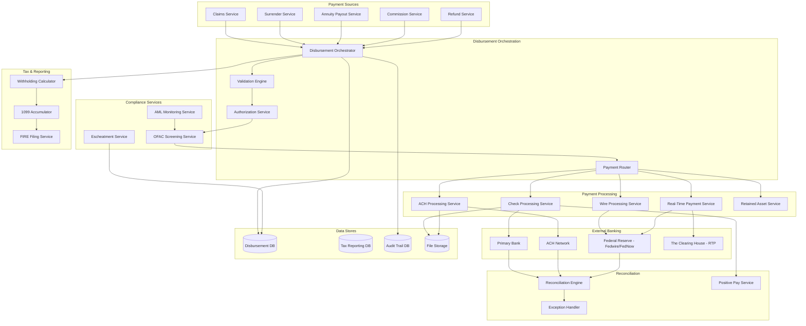

### 14.2 Service Descriptions

| Service | Responsibility | Technology |
|---|---|---|
| Disbursement Orchestrator | Central coordinator for all disbursement flows | Java/Spring Boot, Temporal/Camunda |
| Validation Engine | Validates disbursement requests against business rules | Java, Drools rules engine |
| Authorization Service | Manages approval workflows and thresholds | Java/Spring Boot, workflow engine |
| Payment Router | Determines optimal payment method based on rules | Java/Spring Boot |
| OFAC Screening Service | Real-time sanctions screening | Java + vendor API (Dow Jones, LexisNexis) |
| Check Processing Service | Check generation, positive pay file, reconciliation | Java, check printing integration |
| ACH Processing Service | NACHA file generation, return processing | Java, NACHA library |
| Wire Processing Service | Fedwire/SWIFT initiation and confirmation | Java, banking API |
| Real-Time Payment Service | FedNow/RTP processing | Java, banking API |
| Withholding Calculator | Federal/state tax withholding computation | Java, tax rules engine |
| 1099 Accumulator | Annual payment accumulation by TIN | Java, batch processing |
| Reconciliation Engine | Bank statement matching, exception detection | Java, batch processing |
| Escheatment Service | Dormancy tracking, due diligence, state filing | Java, NAUPA file generation |
| Positive Pay Service | Check fraud prevention file generation | Java, bank file format |

### 14.3 Event-Driven Payment Architecture

```json
{
  "disbursementEvents": [
    {
      "eventType": "DisbursementRequested",
      "data": { "disbursementId": "...", "sourceType": "DEATH_CLAIM", "amount": 1025629.82 }
    },
    {
      "eventType": "DisbursementValidated",
      "data": { "disbursementId": "...", "validationResult": "PASSED" }
    },
    {
      "eventType": "DisbursementAuthorized",
      "data": { "disbursementId": "...", "approvedBy": "...", "tier": 5 }
    },
    {
      "eventType": "OFACScreeningCompleted",
      "data": { "disbursementId": "...", "result": "CLEARED" }
    },
    {
      "eventType": "PaymentInitiated",
      "data": { "disbursementId": "...", "method": "WIRE", "confirmationId": "..." }
    },
    {
      "eventType": "PaymentSettled",
      "data": { "disbursementId": "...", "settledAmount": 1025629.82, "settledDate": "..." }
    },
    {
      "eventType": "PaymentReconciled",
      "data": { "disbursementId": "...", "bankStatementDate": "...", "matched": true }
    },
    {
      "eventType": "TaxReportingRecorded",
      "data": { "disbursementId": "...", "formType": "1099-INT", "amount": 5080.91 }
    }
  ]
}
```

### 14.4 Deployment Architecture

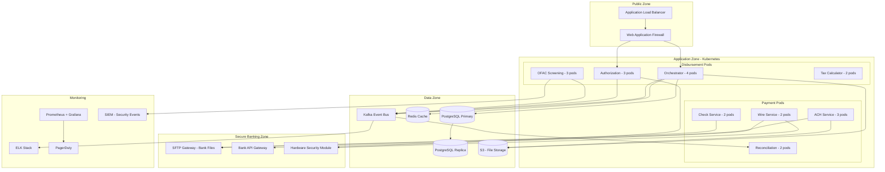

---

## 15. STP Rules

### 15.1 Automated Disbursement Processing Rules

```yaml
stpDisbursementRules:
  autoApprovalRules:
    - rule: "disbursement.amount <= 25000"
      description: "Tier 1 auto-approval"
    - rule: "disbursement.source == 'STP_ADJUDICATED_CLAIM'"
      description: "Claim was auto-adjudicated"
    - rule: "payee.identityVerified == true"
      description: "Payee identity confirmed"
    - rule: "payee.bankingInfoVerified == true"
      description: "Banking info pre-noted or micro-deposit verified"
  
  autoOFACClearRules:
    - rule: "ofacScreening.matchScore < 60"
      description: "Low confidence — auto-clear"
    - rule: "payee.priorScreeningClearance.age < 90 days"
      description: "Recently cleared payee"
  
  autoPaymentMethodRouting:
    - rule: "payee.hasBankingInfo AND disbursement.amount < 500000"
      method: "ACH"
    - rule: "payee.hasBankingInfo AND disbursement.amount >= 500000"
      method: "WIRE"
    - rule: "NOT payee.hasBankingInfo"
      method: "CHECK"
    - rule: "disbursement.isRecurring AND payee.hasBankingInfo"
      method: "ACH"
    - rule: "disbursement.urgency == 'SAME_DAY' AND payee.hasBankingInfo"
      method: "WIRE_OR_RTP"
  
  autoReconciliationRules:
    - rule: "bankAmount == bookAmount AND checkNumber matches"
      action: "AUTO_RECONCILE"
    - rule: "ABS(bankAmount - bookAmount) < 0.01"
      action: "AUTO_RECONCILE_WITH_ROUNDING_NOTE"
    - rule: "ABS(bankAmount - bookAmount) >= 0.01"
      action: "EXCEPTION_QUEUE"
```

### 15.2 STP Performance Expectations

| Process | STP Target | Manual Fallback SLA |
|---|---|---|
| Payment authorization (Tier 1) | 100% auto | N/A |
| OFAC screening (no hits) | 97%+ auto-clear | 4-hour analyst review |
| Payment method routing | 100% auto | N/A |
| NACHA file generation | 100% auto | Manual batch if system failure |
| Check printing | 95% auto | Manual printing queue |
| Reconciliation (exact match) | 90% auto | 24-hour exception review |
| 1099 generation | 98% auto | Manual review for edge cases |

---

## 16. Sample Payloads

### 16.1 Disbursement Request (Internal API)

```json
{
  "disbursementRequest": {
    "requestId": "DISB-REQ-2025-001234",
    "sourceSystem": "CLAIMS",
    "sourceTransactionId": "CLM-2025-IL-0003847-2",
    "sourceTransactionType": "DEATH_CLAIM",
    "requestDate": "2025-12-20T10:00:00Z",
    "policyNumber": "WL-1234567",
    "payee": {
      "payeeId": "PAY-001",
      "fullName": "Jane Marie Smith",
      "tin": "987654321",
      "tinType": "SSN",
      "address": {
        "line1": "123 Main Street",
        "city": "Hartford",
        "state": "CT",
        "zip": "06101",
        "country": "US"
      },
      "email": "jane.smith@email.com",
      "phone": "555-123-4567"
    },
    "paymentDetails": {
      "grossAmount": 1029738.44,
      "deathBenefitAmount": 1024657.53,
      "interestAmount": 5080.91,
      "taxableAmount": 5080.91,
      "federalWithholding": 0.00,
      "stateWithholding": 0.00,
      "netPaymentAmount": 1029738.44,
      "currency": "USD"
    },
    "paymentPreference": {
      "method": "WIRE",
      "bankName": "First National Bank",
      "routingNumber": "021000021",
      "accountNumber": "****5678",
      "accountType": "CHECKING"
    },
    "taxReporting": {
      "form1099INT": {
        "required": true,
        "interestAmount": 5080.91
      },
      "form1099R": {
        "required": false
      }
    },
    "priority": "HIGH",
    "slaDeadline": "2025-12-22T17:00:00Z"
  }
}
```

### 16.2 Disbursement Processing Response

```json
{
  "disbursementResponse": {
    "requestId": "DISB-REQ-2025-001234",
    "disbursementId": "DISB-2025-045678",
    "status": "AUTHORIZED",
    "processingSteps": [
      {
        "step": "VALIDATION",
        "status": "PASSED",
        "timestamp": "2025-12-20T10:00:05Z",
        "details": "All validation rules passed"
      },
      {
        "step": "AUTHORIZATION",
        "status": "APPROVED",
        "timestamp": "2025-12-20T14:30:00Z",
        "details": "Tier 5 approval: VP Claims + CFO",
        "approvers": [
          { "name": "John Director", "role": "VP_CLAIMS", "decision": "APPROVED" },
          { "name": "Mary Executive", "role": "CFO", "decision": "APPROVED" }
        ]
      },
      {
        "step": "OFAC_SCREENING",
        "status": "CLEARED",
        "timestamp": "2025-12-20T14:30:10Z",
        "details": "No matches found across SDN, SSI, FSE lists"
      },
      {
        "step": "PAYMENT_ROUTING",
        "status": "ROUTED",
        "timestamp": "2025-12-20T14:30:12Z",
        "details": "Routed to WIRE service (amount > $500K)"
      },
      {
        "step": "WIRE_INITIATION",
        "status": "INITIATED",
        "timestamp": "2025-12-20T15:00:00Z",
        "details": "Fedwire initiated",
        "wireConfirmation": "FW2025122000001234"
      }
    ],
    "paymentSummary": {
      "method": "WIRE",
      "amount": 1029738.44,
      "confirmationNumber": "FW2025122000001234",
      "expectedSettlement": "2025-12-20",
      "status": "INITIATED"
    }
  }
}
```

### 16.3 Batch Commission Disbursement

```json
{
  "commissionBatch": {
    "batchId": "COMM-BATCH-2025-12-15",
    "batchDate": "2025-12-15",
    "paymentMethod": "ACH",
    "totalPayments": 1250,
    "totalAmount": 2845678.50,
    "nachaFileId": "NACHA-2025-12-15-001",
    "payments": [
      {
        "agentCode": "AGT-001234",
        "agentName": "Robert Agent",
        "tin": "***-**-1234",
        "grossCommission": 12500.00,
        "overrides": 3200.00,
        "chargebacks": -450.00,
        "netPayment": 15250.00,
        "routingNumber": "021000021",
        "accountNumber": "****9876",
        "form1099NEC": true
      },
      {
        "agentCode": "AGT-005678",
        "agentName": "Patricia Broker",
        "tin": "***-**-5678",
        "grossCommission": 8750.00,
        "overrides": 0.00,
        "chargebacks": 0.00,
        "netPayment": 8750.00,
        "routingNumber": "061000052",
        "accountNumber": "****4321",
        "form1099NEC": true
      }
    ]
  }
}
```

### 16.4 Escheatment Report Record

```json
{
  "escheatmentReport": {
    "reportingYear": 2025,
    "reportingState": "CT",
    "holderName": "ABC Life Insurance Company",
    "holderEIN": "12-3456789",
    "reportFilingDate": "2025-11-01",
    "totalProperties": 45,
    "totalAmount": 287654.32,
    "properties": [
      {
        "propertyId": "ESC-2025-001",
        "propertyTypeCode": "LC01",
        "description": "Life insurance death benefit",
        "ownerName": "Estate of James Wilson",
        "ownerSSN": "***-**-2345",
        "ownerLastAddress": "456 Oak Lane, New Haven, CT 06511",
        "amount": 75000.00,
        "dateOfLastActivity": "2022-03-15",
        "dormancyDate": "2025-03-15",
        "dueDiligenceCompleted": true,
        "firstNoticeDate": "2025-01-15",
        "secondNoticeDate": "2025-03-01"
      }
    ]
  }
}
```

---

## 17. Appendices

### Appendix A: Disbursement Status Codes

| Status | Description |
|---|---|
| INITIATED | Disbursement request created |
| VALIDATED | Passed all validation checks |
| PENDING_APPROVAL | Awaiting authorization |
| AUTHORIZED | All required approvals obtained |
| OFAC_SCREENING | Sanctions screening in progress |
| OFAC_HOLD | Potential OFAC match — under review |
| OFAC_BLOCKED | Confirmed OFAC match — payment blocked |
| QUEUED | In payment batch queue |
| PROCESSING | Payment being executed |
| ISSUED | Check printed, ACH originated, or wire sent |
| SETTLED | Bank confirms funds transferred |
| RECONCILED | Matched to bank statement |
| RETURNED | ACH returned or check returned |
| VOIDED | Payment voided (check stopped, reversed) |
| STALE | Check not cashed within validity period |
| ESCHEAT_PENDING | Dormancy period met — due diligence in progress |
| ESCHEATED | Funds remitted to state |
| REISSUED | Replacement payment issued |
| ERROR | Payment error detected |
| CANCELLED | Cancelled before issuance |

### Appendix B: NACHA Return Code Reference (Complete)

| Code | Description | Timeframe |
|---|---|---|
| R01 | Insufficient funds | 2 business days |
| R02 | Account closed | 2 business days |
| R03 | No account / unable to locate | 2 business days |
| R04 | Invalid account number structure | 2 business days |
| R05 | Unauthorized debit entry | 2 business days |
| R06 | Returned per ODFI request | 2 business days |
| R07 | Authorization revoked by customer | 2 business days |
| R08 | Payment stopped | 2 business days |
| R09 | Uncollected funds | 2 business days |
| R10 | Customer advises not authorized | 60 calendar days |
| R11 | Check truncation entry return | 2 business days |
| R12 | Account sold to another DFI | 2 business days |
| R13 | Invalid ACH routing number | 2 business days |
| R14 | Representative payee deceased | 2 business days |
| R15 | Beneficiary or account holder deceased | 2 business days |
| R16 | Account frozen | 2 business days |
| R17 | File record edit criteria | 2 business days |
| R20 | Non-transaction account | 2 business days |
| R21 | Invalid company identification | 2 business days |
| R22 | Invalid individual ID number | 2 business days |
| R23 | Credit entry refused by receiver | 2 business days |
| R24 | Duplicate entry | 2 business days |
| R29 | Corporate customer advises not authorized | 2 business days |
| R31 | Permissible return entry (CCD/CTX) | 2 business days |
| R51 | Item related to RCK entry | 2 business days |

### Appendix C: OFAC Compliance Checklist

| Requirement | Implementation |
|---|---|
| Screen all disbursements before payment | Real-time API call to screening service |
| Screen against current SDN list | List updated within 24 hours of OFAC publication |
| Screen payee name, aliases, address | Multi-field matching with fuzzy algorithms |
| Document all screening results | Immutable audit log of every screening |
| Review potential matches within 24 hours | SLA-tracked compliance workflow |
| Block confirmed matches immediately | Auto-block + compliance notification |
| File blocking report within 10 days | Automated OFAC reporting |
| Retain records for 5 years | Document retention policy |
| Annual OFAC training for staff | Training tracking system |
| Independent audit of OFAC program | Annual compliance audit |

### Appendix D: Glossary

| Term | Definition |
|---|---|
| ACH | Automated Clearing House |
| AML | Anti-Money Laundering |
| BSA | Bank Secrecy Act |
| CDSC | Contingent Deferred Sales Charge |
| CRS | Common Reporting Standard (international) |
| FATCA | Foreign Account Tax Compliance Act |
| FedNow | Federal Reserve instant payment service |
| FinCEN | Financial Crimes Enforcement Network |
| FIRE | Filing Information Returns Electronically (IRS) |
| NACHA | National Automated Clearing House Association |
| NAUPA | National Association of Unclaimed Property Administrators |
| NCOA | National Change of Address (USPS) |
| ODFI | Originating Depository Financial Institution |
| OFAC | Office of Foreign Assets Control |
| PEP | Politically Exposed Person |
| RAA | Retained Asset Account |
| RDFI | Receiving Depository Financial Institution |
| RTP | Real-Time Payments (The Clearing House) |
| SAR | Suspicious Activity Report |
| SDN | Specially Designated Nationals |
| SEC Code | Standard Entry Class Code (NACHA) |
| SFTP | Secure File Transfer Protocol |
| STP | Straight-Through Processing |
| SWIFT | Society for Worldwide Interbank Financial Telecommunication |

### Appendix E: References

1. NACHA Operating Rules and Guidelines (current year edition)
2. OFAC Compliance Guidelines — U.S. Department of the Treasury
3. FinCEN SAR Filing Requirements — 31 CFR Part 1020
4. Uniform Unclaimed Property Act (2016 Revision)
5. NAIC Unclaimed Life Insurance Benefits Model Act (#580)
6. IRS Publication 1220 — Specifications for Electronic Filing of Forms 1099
7. IRS Form 1099-R Instructions
8. IRS Form 1099-INT Instructions
9. Federal Reserve FedNow Service Operating Guidelines
10. The Clearing House RTP Operating Rules
11. Fedwire Funds Service Operating Circular 6
12. SWIFT Standards — MT103 Customer Credit Transfer
13. Positive Pay Standards (Bank-specific implementations)
14. State unclaimed property statutes (state-by-state reference)

---

*Article 33 of the Life Insurance PAS Architect's Encyclopedia*
*Version 1.0 — April 2026*
