# Article 34: State Insurance Regulation & Filing

## PAS Architect's Encyclopedia — Life Insurance Policy Administration Systems

---

## Table of Contents

1. [Introduction](#1-introduction)
2. [U.S. Insurance Regulatory Framework](#2-us-insurance-regulatory-framework)
3. [State Insurance Departments](#3-state-insurance-departments)
4. [Product Filing — SERFF](#4-product-filing--serff)
5. [Interstate Insurance Product Regulation Commission (IIPRC/Compact)](#5-interstate-insurance-product-regulation-commission-iiprccompact)
6. [Form Filing](#6-form-filing)
7. [Rate Filing](#7-rate-filing)
8. [State Variation Management in PAS](#8-state-variation-management-in-pas)
9. [Market Conduct](#9-market-conduct)
10. [Producer Regulation](#10-producer-regulation)
11. [Consumer Protection](#11-consumer-protection)
12. [State Variation Matrix](#12-state-variation-matrix)
13. [SERFF Filing Workflow — BPMN](#13-serff-filing-workflow--bpmn)
14. [Architecture](#14-architecture)
15. [Data Model for Regulatory Filing Tracking](#15-data-model-for-regulatory-filing-tracking)
16. [Implementation Guidance for Solution Architects](#16-implementation-guidance-for-solution-architects)
17. [Glossary](#17-glossary)
18. [References](#18-references)

---

## 1. Introduction

The United States operates the most complex insurance regulatory framework in the world: a system of **fifty-six separate jurisdictions** (50 states, the District of Columbia, and five U.S. territories) each with its own insurance code, department, commissioner, and enforcement apparatus. For a Policy Administration System (PAS) architect, state insurance regulation is not an afterthought — it is the single largest driver of system complexity, configuration surface area, and ongoing operational cost.

This article provides an exhaustive treatment of the state regulatory ecosystem, its impact on PAS design, the electronic filing infrastructure (SERFF), product filing workflows, form and rate filing requirements, market conduct examination preparedness, producer regulation, consumer protection mandates, and the architectural patterns required to manage fifty-plus jurisdictions in a single platform.

### 1.1 Why This Matters for PAS

| Dimension | Impact |
|-----------|--------|
| **Product Configuration** | Every product must be filed and approved in each state where it is sold; state-specific riders, endorsements, and exclusions proliferate |
| **Business Rules** | Grace periods, non-forfeiture options, free-look periods, replacement notice requirements, and claim settlement timelines vary by state |
| **Document Generation** | Policy contracts, disclosure notices, and illustrations must meet state-specific readability, content, and delivery requirements |
| **Tax & Withholding** | State income tax withholding rules vary; some states mandate withholding on annuity distributions, others do not |
| **Agent Management** | Licensing, appointment, compensation, CE tracking, and suitability requirements differ across jurisdictions |
| **Reporting** | Annual/quarterly statutory filings, market conduct data calls, and complaint reporting each follow state-specific formats and deadlines |

### 1.2 Scope

This article covers the **life insurance and annuity** product lines. While many regulatory principles apply across all lines, property/casualty, health, and title insurance are outside scope unless specifically noted.

---

## 2. U.S. Insurance Regulatory Framework

### 2.1 Historical Foundation: Paul v. Virginia to McCarran-Ferguson

The state-based regulatory model traces to the 1869 Supreme Court decision in **Paul v. Virginia** (75 U.S. 168), which held that "issuing a policy of insurance is not a transaction of commerce" and therefore not subject to federal regulation under the Commerce Clause.

This changed temporarily with **United States v. South-Eastern Underwriters Association** (1944), where the Supreme Court ruled that insurance *was* interstate commerce and subject to the Sherman Antitrust Act. Congress responded within a year.

### 2.2 McCarran-Ferguson Act (15 U.S.C. §§ 1011-1015)

Enacted March 9, 1945, McCarran-Ferguson:

1. **Declares** that the continued regulation and taxation of insurance by the states is in the public interest
2. **Preserves** state regulatory authority by providing that no federal law shall be construed to supersede state insurance regulation unless the federal law specifically relates to the business of insurance
3. **Creates a limited antitrust exemption** for the business of insurance to the extent regulated by state law (this exemption does **not** extend to boycott, coercion, or intimidation)

**PAS Impact:** McCarran-Ferguson is the reason every PAS must be designed for multi-state variation management. There is no single "federal insurance license" — every insurer must be licensed (admitted) or authorized (surplus lines) in each state where it does business.

### 2.3 Dodd-Frank Wall Street Reform and Consumer Protection Act (2010)

Title V of Dodd-Frank created the **Federal Insurance Office (FIO)** within the U.S. Department of the Treasury. FIO's mandate:

| Authority | Description |
|-----------|-------------|
| **Monitor** | Monitor the insurance industry, including identifying issues that could contribute to systemic risk |
| **Advise** | Advise the Secretary of the Treasury on insurance matters |
| **Coordinate** | Coordinate federal efforts on international insurance matters |
| **Consult** | Consult with states regarding insurance matters of national importance |
| **Preempt** (limited) | Recommend to Congress whether federal regulation is needed; can preempt state laws that are inconsistent with covered agreements (international insurance agreements) |

FIO does **not** have direct regulatory authority over insurers. It has no rate/form approval power, no examination authority, and no enforcement capability. However, its covered agreement authority (per 31 U.S.C. § 314) can preempt state laws in narrow circumstances, particularly regarding reinsurance collateral requirements.

### 2.4 Dual Regulation of Variable Products

Variable life insurance (VUL) and variable annuity (VA) products are subject to **dual regulation**:

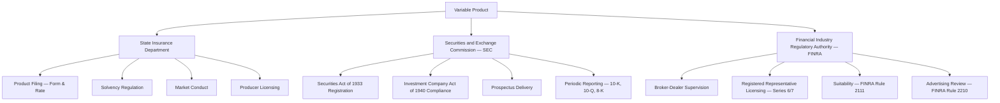

| Regulator | Registration | Sales | Ongoing |
|-----------|-------------|-------|---------|
| **State Insurance Dept** | Form/rate filing | Producer license, suitability, replacement | Market conduct, complaints, examination |
| **SEC** | S-1/S-6 registration, prospectus | Prospectus delivery | 10-K/10-Q reporting, N-PORT |
| **FINRA** | Broker-dealer membership | Series 6/7 license, suitability, advertising review | Supervision, examination |

**PAS Impact:** Variable products require the PAS to track both insurance and securities-related compliance data: prospectus versions, sub-account registration status, FINRA advertising review numbers, and dual suitability documentation.

### 2.5 Federal Regulatory Exceptions

Certain insurance products fall partially or wholly under federal regulation:

| Product/Activity | Federal Authority | Basis |
|-----------------|-------------------|-------|
| Crop insurance | Federal Crop Insurance Corporation (FCIC) / USDA | Federal Crop Insurance Act |
| Flood insurance | FEMA / NFIP | National Flood Insurance Act |
| ERISA group plans | DOL / IRS | ERISA preemption of state insurance regulation |
| Federal employee insurance | OPM | FEGLI Act, FEHBA |
| Military insurance | SGLI / VGLI | Servicemembers' Group Life Insurance Act |

---

## 3. State Insurance Departments

### 3.1 Organizational Structure

Each of the 56 U.S. insurance jurisdictions maintains a department (or division or bureau) of insurance headed by a commissioner (or superintendent or director). The organizational structure varies:

| Component | Description |
|-----------|-------------|
| **Commissioner/Director** | Appointed by governor (majority of states) or elected (11 states: CA, DE, GA, KS, LA, MS, MT, NC, ND, OK, WA) |
| **Life/Health Division** | Responsible for product filing review, actuarial review, financial analysis |
| **Market Regulation Division** | Conducts market conduct examinations, handles consumer complaints |
| **Financial Examination Division** | Conducts financial condition examinations (per NAIC accreditation) |
| **Producer Licensing Division** | Manages licensing, appointments, CE tracking |
| **Legal Division** | Enforcement actions, consent orders, regulatory interpretation |
| **Consumer Services Division** | Consumer complaint intake, mediation, information |
| **Fraud Division** | Investigation of insurance fraud (present in most but not all states) |

### 3.2 Examination Authority

State insurance departments exercise two primary forms of examination:

#### 3.2.1 Financial Condition Examination

- **Frequency:** At least every 5 years for domestic insurers (NAIC accreditation standard)
- **Scope:** Solvency, reserves, capital, investments, reinsurance, corporate governance
- **Standards:** NAIC Financial Condition Examiners Handbook
- **Output:** Examination report filed with state; public document

#### 3.2.2 Market Conduct Examination

- **Frequency:** Risk-based; triggered by complaints, data analysis, or referral
- **Scope:** Underwriting, rating, claims, marketing, producer licensing, complaint handling
- **Standards:** NAIC Market Regulation Handbook
- **Output:** Market conduct examination report; corrective action plan if deficiencies found

### 3.3 Rate and Form Approval Authority

States exercise varying levels of control over insurance products through rate and form approval:

| Approval Type | Description | States (Life/Annuity examples) |
|--------------|-------------|-------------------------------|
| **Prior Approval** | Forms/rates must be approved before use | NY, TX, FL, NJ, PA, OH |
| **File and Use** | File with department; may use after filing unless disapproved | CA (rates), IL, MI |
| **Use and File** | May use immediately; must file within specified period | WI, CO |
| **Informational Filing** | File for informational purposes only; no approval required | Limited applicability |
| **No Filing Required** | Certain product types exempt from filing | Varies by state and product type |
| **Flex Rating** | Prior approval required only if rate change exceeds threshold | More common in health; some states apply to annuity |

### 3.4 Consumer Complaint Handling

Every state department maintains a complaint-handling function:

- **Intake:** Telephone, mail, online submission, walk-in
- **Assignment:** Complaints assigned to analysts based on line of business
- **Investigation:** Department contacts insurer for response; insurer typically has 15-30 days
- **Resolution:** Complaint closed with finding (justified/not justified/compromise)
- **Tracking:** NAIC Complaint Database System (CDS) aggregates complaints nationwide; complaint index ratios published
- **Enforcement:** Patterns of complaints can trigger market conduct examinations

**PAS Impact:** The PAS must support rapid complaint response by providing complete policy history, transaction records, correspondence, and agent information on demand. Many carriers implement a "regulatory inquiry" workflow that auto-assembles the policy dossier.

---

## 4. Product Filing — SERFF

### 4.1 SERFF Overview

The **System for Electronic Rate and Form Filing (SERFF)** is the NAIC's web-based platform for filing insurance products with state regulators. SERFF is used by:

- **Insurers** (filers) to submit rate, form, and rule filings
- **State insurance departments** (reviewers) to review, object, approve, or disapprove filings

SERFF handles approximately **350,000+ filings per year** across all lines of business.

### 4.2 SERFF Filing Process

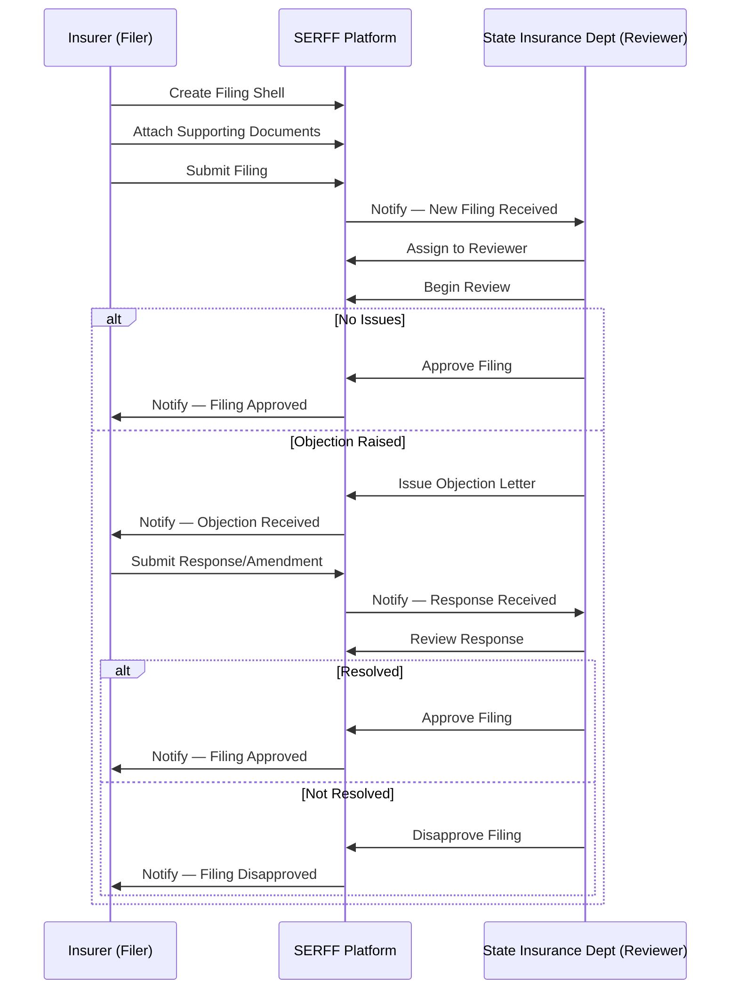

### 4.3 Filing Types

| Filing Type | Description | Examples |
|------------|-------------|---------|
| **Form Filing** | New or revised policy forms, riders, endorsements, applications | Whole life policy form, term conversion rider, disability waiver endorsement |
| **Rate Filing** | Proposed rates, rate changes, rate methodologies | Premium rate schedules, cost of insurance rates, annuity payout rates |
| **Rule Filing** | Underwriting rules, rating algorithms, classification systems | Preferred risk criteria, smoker/non-smoker classification |
| **Advertising Filing** | Marketing materials requiring pre-approval (certain states) | Brochures, direct mail, web content |
| **Certification Filing** | Actuarial certifications, compliance attestations | Nonforfeiture compliance certification, reserve opinion |

### 4.4 Filing Components in SERFF

Every SERFF filing consists of:

| Component | Required | Description |
|-----------|----------|-------------|
| **General Information** | Yes | Company name, NAIC code, filing type, TOI (type of insurance), sub-TOI, state, effective date requested |
| **Filing Description** | Yes | Narrative description of filing purpose, changes from prior filing |
| **Product Name** | Yes | Commercial product name |
| **Form Schedule** | Yes (form filings) | List of all forms included with form numbers, edition dates, actions (new, revised, replaced) |
| **Rate/Rule Schedule** | Yes (rate filings) | Rate tables, rating algorithms, actuarial justification |
| **Supporting Documents** | Varies | Actuarial memorandum, readability certificate, comparison of changes (redline), compliance checklist |
| **Correspondence** | System-generated | Objection letters, responses, approval/disapproval notices |

### 4.5 Filing Status Tracking

SERFF filings progress through defined statuses:

| Status | Description |
|--------|-------------|
| **Draft** | Filing created but not yet submitted |
| **Submitted** | Filing transmitted to state; received by SERFF |
| **Pending Review** | Filing in state reviewer queue |
| **Under Review** | State reviewer has opened and is actively reviewing |
| **Objection** | State has issued one or more objections; awaiting filer response |
| **Response Submitted** | Filer has responded to objections |
| **Approved** | State has approved the filing; forms may be used |
| **Disapproved** | State has formally disapproved the filing |
| **Withdrawn** | Filer has voluntarily withdrawn the filing |
| **Closed — Not Filed** | Filing closed without formal action (administrative) |
| **Deemed Approved** | Filing automatically approved due to state inaction within statutory review period (file-and-use states) |

### 4.6 SERFF Type of Insurance (TOI) Codes for Life/Annuity

| TOI Code | Description |
|----------|-------------|
| **LI** | Life Insurance |
| **LI-01** | Individual Life — Whole Life |
| **LI-02** | Individual Life — Term |
| **LI-03** | Individual Life — Universal Life |
| **LI-04** | Individual Life — Variable Life |
| **LI-05** | Individual Life — Variable Universal Life |
| **LI-06** | Group Life |
| **AN** | Annuity |
| **AN-01** | Individual Fixed Annuity |
| **AN-02** | Individual Variable Annuity |
| **AN-03** | Individual Fixed Indexed Annuity |
| **AN-04** | Group Annuity |
| **CR** | Credit Life/Disability |

### 4.7 Prior Approval vs. File-and-Use vs. Use-and-File

| Regime | Description | Timing | State Response |
|--------|-------------|--------|----------------|
| **Prior Approval** | Must receive explicit state approval before using forms/rates | File → Wait → Approval → Use | State must approve or disapprove within statutory period (typically 30-90 days) |
| **File and Use** | May use after filing unless state objects within deemer period | File → Deemer Period → Use (if no objection) | State may object within deemer period (typically 30-60 days) |
| **Use and File** | May use immediately upon filing | Use → File within statutory period | State may subsequently disapprove and require withdrawal |

**PAS Impact:** The PAS product configuration system must track filing status by state. A product may be "approved and active" in 35 states, "pending filing" in 10 states, and "not filed" in 5 states simultaneously. The state availability matrix must be tightly integrated with the new business and underwriting workflows.

---

## 5. Interstate Insurance Product Regulation Commission (IIPRC/Compact)

### 5.1 Overview

The **Interstate Insurance Product Regulation Compact** (Insurance Compact) is an interstate agreement among member states and territories that establishes a central point of filing for certain insurance products. As of 2024, **47 states, plus DC and Puerto Rico** are Compact members.

### 5.2 Eligible Products

| Product Category | Compact Eligible | Notes |
|-----------------|-----------------|-------|
| Individual life insurance | Yes | Term, whole, UL, VUL |
| Individual annuities | Yes | Fixed, variable, indexed |
| Long-term care | Yes | Stand-alone LTC |
| Disability income | Yes | Individual DI |
| Group life/annuity | No | Not currently within Compact scope |
| Credit insurance | No | Not currently within Compact scope |

### 5.3 Compact Advantages

| Advantage | Description |
|-----------|-------------|
| **Single Filing** | One filing reviewed once against uniform standards; approval valid in all member states |
| **Speed to Market** | 60-day review cycle (vs. 6-12+ months for individual state filings) |
| **Uniform Standards** | Published product standards reduce ambiguity |
| **Cost Reduction** | Single filing fee vs. 50+ individual state filing fees |
| **Mix-and-Match** | Can file through Compact for member states and individually for non-member states |

### 5.4 Compact Uniform Standards

The Compact has adopted uniform standards for:

- Individual term life insurance
- Individual whole life insurance
- Individual universal life insurance
- Individual variable life/VUL (investment component still SEC-regulated)
- Individual single premium life
- Individual deferred annuity (fixed, variable, indexed)
- Individual immediate/payout annuity
- Individual long-term care
- Individual disability income
- Advertising
- Riders and endorsements

### 5.5 Compact Filing Process

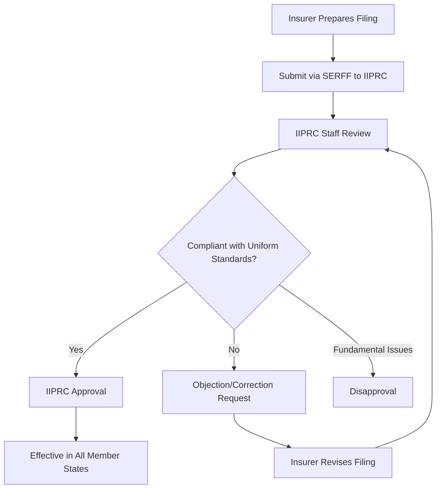

### 5.6 Opt-Out Mechanism

Member states may opt out of specific Compact standards within a 90-day comment period. If a state opts out, the insurer must file individually in that state. The PAS must track opt-out states per product standard.

---

## 6. Form Filing

### 6.1 Policy Form Review Requirements

State insurance departments review policy forms for:

| Requirement | Description | Regulatory Basis |
|------------|-------------|-----------------|
| **Compliance with Insurance Code** | Form must contain all provisions required by state law and must not contain prohibited provisions | State insurance code, e.g., NY Ins. Law § 3203 |
| **Readability** | Form must meet minimum readability scores and formatting requirements | State readability statutes |
| **Non-deception** | Form must not be misleading, deceptive, or unfairly discriminatory | Unfair Trade Practices Act, state equivalents |
| **Actuarial Soundness** | Benefits promised must be supported by adequate rates and reserves | Standard Valuation Law, Nonforfeiture Law |
| **Standard Provisions** | Certain provisions must be included verbatim or in substance | Model Standard Provisions Law |

### 6.2 Readability Requirements

Most states require life insurance policy forms to meet readability standards:

| Readability Measure | Common Requirement | States Using |
|---------------------|-------------------|--------------|
| **Flesch-Kincaid Reading Ease** | Score ≥ 40 (some states require ≥ 45 or ≥ 50) | Majority of states |
| **Flesch-Kincaid Grade Level** | ≤ 10th grade (some states specify 8th grade) | Varies |
| **Format Requirements** | Minimum font size (10pt), minimum margins, table of contents for policies > 3000 words, clear section headings, defined terms highlighted | Most states |

**Readability Certification Example:**

A typical readability certificate filed with SERFF attests:

> "I hereby certify that the [policy form number] scores [X] on the Flesch Reading Ease test, based on the methodology prescribed by [state statute]. The form meets the formatting requirements of [state statute/regulation] including minimum type size of [X] points, minimum margins of [X] inches, and inclusion of a table of contents."

### 6.3 Standard (Required) Form Provisions

State insurance codes mandate that certain provisions be included in every life insurance policy. These derive from the NAIC Standard Provisions Model Law:

| Provision | Description | Typical Requirement |
|-----------|-------------|-------------------|
| **Grace Period** | Period after premium due date during which policy remains in force | 30 days (individual life); 31 days (most states) |
| **Incontestability** | Period after which insurer cannot contest policy based on misrepresentation | 2 years from issue (1 year in some states for material misrepresentation) |
| **Entire Contract** | Policy and attached application constitute entire contract | Required in all states |
| **Misstatement of Age/Sex** | Benefits adjusted rather than policy voided if age/sex misstated | Required; equitable adjustment formula prescribed |
| **Annual Dividends** | Participating policies must provide for annual dividend determination | Required for par policies |
| **Nonforfeiture Values** | Cash values, extended term, reduced paid-up | Per Standard Nonforfeiture Law |
| **Policy Loans** | Policyowner may borrow against cash value | Required for cash value policies |
| **Reinstatement** | Right to reinstate lapsed policy within specified period | Typically 3 years; evidence of insurability required |
| **Assignment** | Right to assign policy | Must be recognized; insurer not responsible for validity |
| **Settlement Options** | Options for receiving death benefit or cash surrender | Must be described; specific options may be required |
| **Beneficiary Change** | Right to change beneficiary (unless irrevocable) | Must be described |

### 6.4 Variable (Optional) Form Provisions

These provisions may be included at the insurer's option but are subject to regulatory review:

| Provision | Description | Filing Consideration |
|-----------|-------------|---------------------|
| **Accidental Death Benefit** | Additional benefit for accidental death | Rider form required; definition of "accident" reviewed closely |
| **Waiver of Premium** | Premium waived during disability | Definition of disability, elimination period, benefit period subject to review |
| **Accelerated Death Benefit** | Portion of death benefit paid while insured is living with qualifying condition | Must comply with Accelerated Benefits Model Regulation; tax treatment disclosure required |
| **Return of Premium Rider** | Refund of premiums at specified point | Actuarial justification; premium adequacy |
| **Long-Term Care Rider** | LTC benefits as rider to life/annuity policy | Subject to LTC regulation; may require separate LTC filing |
| **Guaranteed Insurability** | Right to purchase additional coverage without evidence | Option dates, maximum amounts, conditions |

### 6.5 State-Specific Endorsements

Many states require state-specific endorsements to be attached to the base policy form. These endorsements modify or supplement the base form to comply with that state's unique requirements:

| State | Common State-Specific Endorsement | Purpose |
|-------|----------------------------------|---------|
| **New York** | NY Amendment Endorsement | Modifies provisions to comply with NY Insurance Law §§ 3203-3222 |
| **Florida** | FL Domestic Violence Endorsement | Prohibits unfair discrimination based on domestic violence |
| **Connecticut** | CT Free-Look Endorsement | Extends free-look period to 10 days (if base form specifies less) |
| **Texas** | TX Grace Period Endorsement | Modifies grace period to 31 days |
| **California** | CA Notice of Cancellation Endorsement | Requires specific cancellation notice language |
| **Montana** | MT Gender-Neutral Endorsement | Removes gender-based pricing references |

### 6.6 Form Revision Management

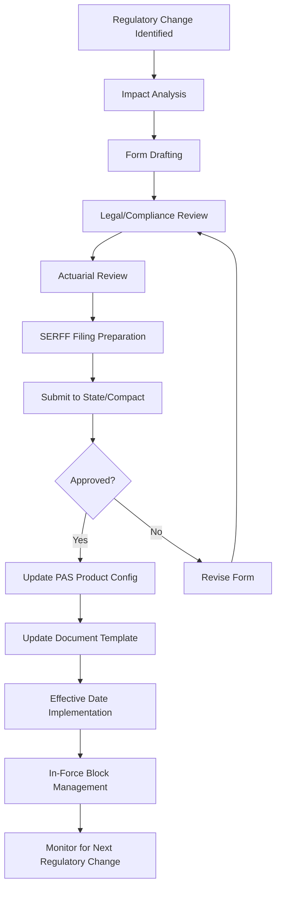

**PAS Impact:** The PAS document management subsystem must maintain complete form version history with effective dates by state. At any point in time, the system must be able to produce the correct version of any form for any state. Form versions must be immutable once issued — a policy issued on a given date uses the form version effective on that date, regardless of subsequent form changes.

---

## 7. Rate Filing

### 7.1 Pricing Justification

Rate filings for life insurance and annuity products require actuarial justification:

| Component | Description |
|-----------|-------------|
| **Actuarial Memorandum** | Comprehensive document describing pricing methodology, assumptions, and results |
| **Mortality Assumptions** | Base mortality table (e.g., 2017 CSO), mortality improvement factors, company experience modifications |
| **Interest Rate Assumptions** | Credited rates, guaranteed minimum rates, investment income assumptions |
| **Expense Assumptions** | Per-policy, per-unit, and percentage-of-premium expense loads |
| **Lapse Assumptions** | Assumed lapse rates by policy year |
| **Profit Margin** | Target return metrics (ROE, IRR, profit margin) |
| **Sensitivity Analysis** | Impact of adverse deviation in key assumptions |
| **Loss Ratio Demonstration** | For certain products, demonstration of anticipated loss ratio ≥ minimum threshold |

### 7.2 Loss Ratio Demonstrations

While loss ratios are more commonly associated with health insurance (MLR), some life/annuity products require loss ratio justification:

| Product | Loss Ratio Requirement | Basis |
|---------|----------------------|-------|
| Credit life insurance | 60% minimum anticipated loss ratio (many states) | NAIC Credit Insurance Model Act |
| Credit disability insurance | 60% minimum (varies by state) | State credit insurance laws |
| Preneed funeral insurance | Varies by state | Preneed insurance statutes |
| Group life/annuity | Expected to be reasonable in relation to premiums | State group insurance statutes |

### 7.3 Rate Change Limitations

| Constraint | Description | States |
|-----------|-------------|--------|
| **Guaranteed Premiums** | For level premium products (whole life, level term), premiums are guaranteed and cannot be changed after issue | All states (contractual guarantee) |
| **Non-guaranteed Elements** | COI rates, expense charges, and credited interest rates in UL/VUL may be changed but are subject to maximum guaranteed rates | All states; maximums per contract |
| **Rate Increase Limitations** | Some states limit the frequency or magnitude of rate increases for certain products | Primarily LTC (rate increase justification), credit insurance |
| **Prior Approval of Changes** | In prior-approval states, any change to filed rates requires new filing | Prior approval states |

### 7.4 Gender-Neutral Pricing Requirements

| State | Requirement | Effective |
|-------|------------|-----------|
| **Montana** | Unisex rating required for all individual life and annuity products | 1985 (Montana Human Rights Act) |
| **Massachusetts** | Gender-neutral auto/health; life insurance gender distinction permitted but monitored | Partial |
| **Hawaii** | Gender-neutral requirements for certain insurance lines | Partial |
| **EU Member States** (reference) | Unisex pricing required (Association Belge des Consommateurs Test-Achats, CJEU 2011) | 2012 |

**Montana PAS Impact:** For Montana, the PAS must apply unisex (blended) mortality and annuity tables. This requires either separate Montana-specific rate tables or a blending algorithm that combines male/female rates at assumed gender distributions. Montana policies issued with unisex rates must be identified and tracked for valuation purposes.

### 7.5 State-Specific Rate Restrictions

| State | Restriction | Impact |
|-------|------------|--------|
| **New York** | Regulation 194 — Life Insurance and Annuity Cost Disclosure | Detailed cost disclosure at point of sale |
| **California** | Proposition 103 implications (primarily P&C, but regulatory framework applies) | Prior approval framework |
| **Texas** | Form and rate filing through Texas Department of Insurance; specific requirements for indexed products | Indexed crediting methodology must be filed and approved |
| **Florida** | Specific illustrations regulation; rate filing requirements for annuity products | Enhanced illustration requirements |
| **Connecticut** | Special requirements for variable products | Additional suitability and disclosure requirements |

---

## 8. State Variation Management in PAS

### 8.1 State Rules Engine Design

The state rules engine is one of the most critical components in a life insurance PAS. It must externalize state-specific business rules from application code into a configurable, versionable, auditable rule repository.

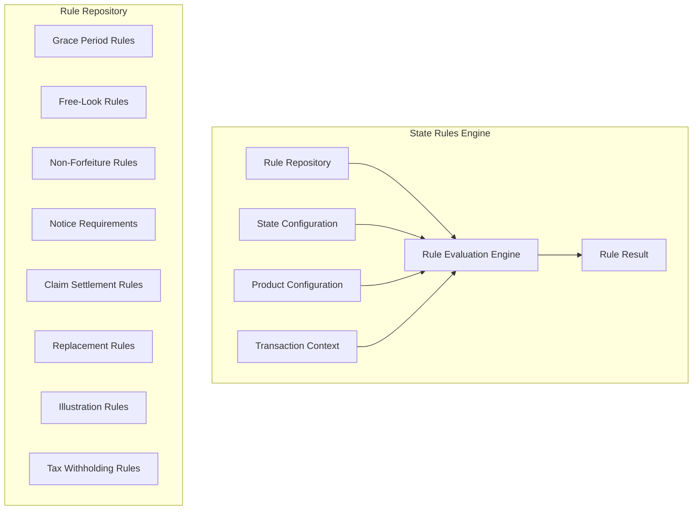

#### 8.1.1 Rule Engine Design Patterns

| Pattern | Description | Pros | Cons |
|---------|-------------|------|------|
| **Decision Table** | State-specific rules encoded as decision tables keyed by state, product, and rule type | Easy to understand, easy to audit, easy to maintain | Can become very large; complex multi-condition rules harder to express |
| **Rule Engine (e.g., Drools, OpenL Tablets)** | Full rule engine with forward/backward chaining, conflict resolution | Powerful, handles complex interdependencies | Steeper learning curve; harder to audit; performance considerations |
| **Configuration-Driven** | State parameters stored in database configuration tables; code reads parameters | Simple, database-backed, easily queryable | Code must handle all parameter combinations; less flexible for complex logic |
| **State Overlay Pattern** | Default rules defined at base level; state-specific overrides layered on top | Minimizes redundancy; easy to add new states | Overlay resolution can be complex; debugging requires understanding full hierarchy |
| **Domain-Specific Language (DSL)** | State rules expressed in a business-readable DSL | Business analysts can author/review rules | DSL design and maintenance effort; parsing/compilation complexity |

#### 8.1.2 Recommended Architecture: State Overlay Pattern

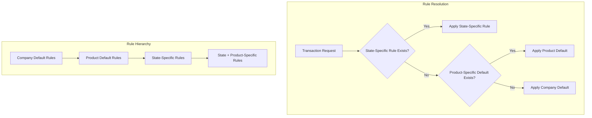

### 8.2 State-Specific Product Configuration

| Configuration Element | Description | Example Variation |
|----------------------|-------------|-------------------|
| **State Availability** | Whether product is approved for sale in state | Product X: approved in 48 states, not approved in NY, CT |
| **Minimum Issue Age** | Minimum age for policy issuance | Standard: 0; NY: 0 for life, 18 for annuity |
| **Maximum Issue Age** | Maximum age for policy issuance | Standard: 80; varies by state and product |
| **Minimum Face Amount** | Minimum policy face amount | Standard: $25,000; varies |
| **Maximum Face Amount** | Maximum without additional filing | Standard: $10M; some states require notification above certain amounts |
| **Available Riders** | Which riders are approved in each state | ADB rider: 48 states; LTC rider: 40 states |
| **Premium Modes** | Available premium payment frequencies | Most states: annual/semi/quarterly/monthly; some restrict EFT timing |

### 8.3 State Availability Matrix

The state availability matrix is a critical PAS configuration artifact:

```
Product: Elite Whole Life 2024
┌─────────┬──────────┬──────────┬───────────┬───────────┬──────────────┐
│ State   │ Status   │ Filing # │ Eff Date  │ Form #    │ Rate Table   │
├─────────┼──────────┼──────────┼───────────┼───────────┼──────────────┤
│ AL      │ Approved │ AL-2024-1│ 2024-01-01│ WL-2024-AL│ RT-WL-2024   │
│ AK      │ Approved │ AK-2024-1│ 2024-01-15│ WL-2024   │ RT-WL-2024   │
│ AZ      │ Approved │ AZ-2024-1│ 2024-02-01│ WL-2024   │ RT-WL-2024   │
│ ...     │ ...      │ ...      │ ...       │ ...       │ ...          │
│ NY      │ Pending  │ NY-2024-1│ TBD       │ WL-2024-NY│ RT-WL-2024-NY│
│ ...     │ ...      │ ...      │ ...       │ ...       │ ...          │
│ WY      │ Not Filed│ N/A      │ N/A       │ WL-2024   │ RT-WL-2024   │
└─────────┴──────────┴──────────┴───────────┴───────────┴──────────────┘
```

### 8.4 State-Specific Grace Periods

| State | Individual Life Grace Period | Individual Annuity Grace Period | Regulatory Citation |
|-------|------------------------------|-------------------------------|-------------------|
| **Default (NAIC)** | 31 days | 31 days | Model Standard Provisions |
| **New York** | 61 days | 61 days | NY Ins. Law § 3211(a)(2) |
| **California** | 60 days (after first year) | 30 days | CA Ins. Code § 10113.71 |
| **Texas** | 31 days | 31 days | TX Ins. Code § 1104.002 |
| **Connecticut** | 31 days | 31 days | CT Gen. Stat. § 38a-472 |
| **New Jersey** | 31 days | 31 days | NJ Stat. § 17B:25-5 |
| **Illinois** | 31 days | 31 days | 215 ILCS 5/224 |
| **Florida** | 30 days | 30 days | FL Stat. § 627.453 |
| **Pennsylvania** | 31 days | 31 days | 40 Pa. Stat. § 510.2 |
| **Ohio** | 31 days | 31 days | OH Rev. Code § 3915.07 |

### 8.5 State-Specific Non-Forfeiture Requirements

Non-forfeiture values must meet the requirements of each state's Standard Nonforfeiture Law (adopted from NAIC Model #808):

| Parameter | Standard | Key State Variations |
|-----------|----------|---------------------|
| **Minimum Cash Value** | Per NAIC Model #808; based on mortality table (2017 CSO) and maximum interest rate (currently 4.00% for whole life) | Some states have adopted updated mortality tables at different times |
| **Non-Forfeiture Options** | Cash surrender, extended term, reduced paid-up (default if no election) | NY requires automatic premium loan as additional option |
| **Effective Date of Values** | End of third policy year (or earlier if policy's cash value warrants) | Some states require earlier availability |

### 8.6 State-Specific Free-Look Periods

| State | Life Insurance Free-Look | Annuity Free-Look | Replacement Free-Look | Citation |
|-------|-------------------------|-------------------|----------------------|----------|
| **Default** | 10 days | 10 days | 30 days | NAIC Model |
| **New York** | 10 days | 60 days (individual) | 60 days | 11 NYCRR 51 |
| **California** | 30 days (age 60+) | 30 days (age 60+) | 30 days | CA Ins. Code § 10127.10 |
| **Florida** | 14 days | 21 days | 30 days | FL Stat. § 627.473 |
| **Texas** | 10 days | 20 days | 30 days | TX Ins. Code § 1108 |
| **Idaho** | 20 days | 20 days | 30 days | ID Code § 41-1924 |
| **Connecticut** | 10 days | 10 days | 30 days | CT Gen. Stat. § 38a-477a |
| **Minnesota** | 10 days | 10 days | 30 days | MN Stat. § 72A.51 |

### 8.7 State-Specific Claim Settlement Timelines

States impose maximum timelines for claim settlement under Unfair Claims Settlement Practices statutes:

| Requirement | Typical Timeframe | Strict States | Citation |
|------------|-------------------|---------------|----------|
| **Acknowledge claim** | 15 days from receipt | 10 days (FL, TX) | Unfair Claims Practices Acts |
| **Begin investigation** | 15 days from notification | Immediate (some states) | State-specific |
| **Accept/deny claim** | 30-45 days from receipt of proof | 15 days (some states); 30 days (NAIC model) | State-specific |
| **Pay claim after acceptance** | 30 days | 5 days (CA); 10 days (TX) | State-specific |
| **Interest on late payment** | Statutory interest rate | 10% (NJ); statutory rate + 2% (CT) | State-specific |

---

## 9. Market Conduct

### 9.1 Market Conduct Examinations

Market conduct examinations evaluate an insurer's treatment of policyholders, claimants, and applicants. Unlike financial examinations (which assess solvency), market conduct examinations assess **marketplace behavior**.

### 9.2 Types of Market Conduct Actions

| Type | Description | Trigger |
|------|-------------|---------|
| **Comprehensive Exam** | Full-scope review of all market conduct areas | Scheduled (zone rotation) or risk-based prioritization |
| **Targeted Exam** | Focused on specific area of concern | Complaint patterns, data analysis, referral from other state |
| **Market Analysis** | Statistical analysis of market data before committing to examination | NAIC Market Analysis procedures (MAPWG) |
| **Market Conduct Annual Statement (MCAS)** | Standardized data submission by insurers | Annual filing requirement |
| **Desk Exam** | Review of documents/data without on-site examination | Lower-risk concerns; follow-up to prior exam |

### 9.3 Examination Scope

| Area | What Examiners Review | PAS Data Required |
|------|----------------------|-------------------|
| **Underwriting** | Application handling, risk classification, declination rates, approval/decline timelines, anti-selection practices | Applications, underwriting decisions, classification data, declination reasons |
| **Rating** | Premium accuracy, rate application, discount/surcharge accuracy, classification accuracy | Premium calculations, rating factors applied, rate tables used |
| **Claims** | Claim handling timelines, denial rates and reasons, settlement practices, payment accuracy | Claim records, timelines, denial letters, payment records |
| **Marketing** | Advertising compliance, agent supervision, replacement handling, suitability documentation | Marketing materials, agent records, replacement forms, suitability documentation |
| **Producer Licensing** | Agent licensing verification, appointment currency, CE compliance | Agent records, appointment dates, license verification logs |
| **Complaint Handling** | Complaint response timelines, resolution rates, escalation procedures | Complaint records, response correspondence, resolution outcomes |
| **Policy Forms** | Use of approved forms, form version accuracy, mandatory notices | Policy documents, form version history, notice delivery records |

### 9.4 NAIC Market Analysis Procedures

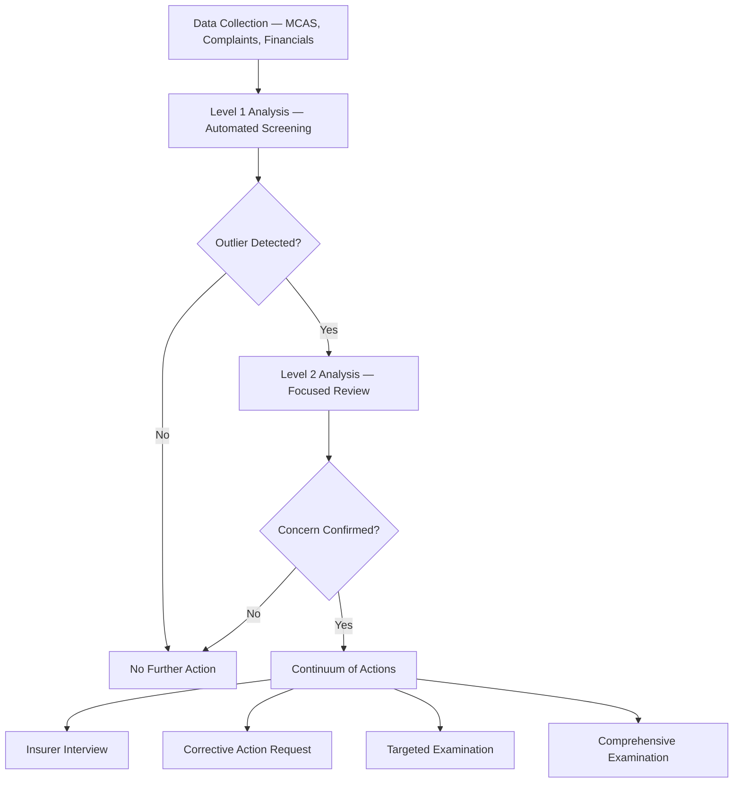

### 9.5 Corrective Action Plans

When a market conduct examination identifies deficiencies, the state typically requires a **Corrective Action Plan (CAP)**:

| Component | Description |
|-----------|-------------|
| **Findings Summary** | Specific findings from examination |
| **Remediation Steps** | Detailed steps to correct each finding |
| **Timeline** | Completion dates for each remediation step |
| **Responsible Parties** | Named individuals accountable |
| **Monitoring** | How insurer will monitor ongoing compliance |
| **Reporting** | Periodic reports to regulator on progress |

### 9.6 Consent Orders, Fines, and Penalties

| Action | Description | Typical Range |
|--------|-------------|---------------|
| **Consent Order** | Formal agreement between insurer and regulator specifying corrective actions and penalties | Varies widely |
| **Monetary Fine** | Penalty per violation or aggregate | $100 - $50,000 per violation (varies by state) |
| **Restitution** | Insurer required to refund overcharges or pay additional benefits to affected policyholders | Based on actual harm |
| **License Suspension/Revocation** | Severe cases only | Rare for market conduct; more common for fraud |
| **Cease and Desist** | Order to stop specific practice immediately | Immediate effect |

**PAS Impact:** The PAS must be designed for **examinability** — the ability to produce complete, accurate data on demand in response to regulatory examination. This requires:

1. **Comprehensive audit trails** for all policy transactions
2. **Configurable data extraction** capabilities for examination requests
3. **Timeline tracking** for all policyholder interactions (application, underwriting, claims, correspondence)
4. **Document retention** per state requirements (typically 5-7 years after policy termination)
5. **Complaint tracking** integrated with policy records

---

## 10. Producer Regulation

### 10.1 State Licensing Requirements

| Requirement | Description | Typical Standard |
|------------|-------------|------------------|
| **License Type** | Life, Accident & Health, Variable Products | State-specific license lines |
| **Examination** | Must pass state licensing examination | Prometric/PSI testing; state-specific content |
| **Pre-Licensing Education** | Education hours before examination | 20-40 hours (varies by state) |
| **Background Check** | Fingerprint-based criminal background check | Required in most states |
| **Resident License** | Must hold license in home state | Required; basis for non-resident licenses |
| **Non-Resident License** | License to sell in states other than home state | Reciprocity via NAIC Producer Licensing Model Act |
| **NIPR** | National Insurance Producer Registry — central licensing portal | Streamlines multi-state licensing |

### 10.2 Continuing Education (CE)

| State Category | CE Hours | Cycle Length | Ethics Requirement | Special Topics |
|---------------|----------|-------------|-------------------|----------------|
| **Typical** | 24 hours | 2 years (biennial) | 3 hours ethics | None |
| **High** | 30 hours | 2 years | 3-4 hours ethics | FL: 5 hr flood; CA: 8 hr annuity |
| **Low** | 20 hours | 2 years | 2-3 hours ethics | None |
| **Exempt** | N/A | N/A | N/A | Attorneys in some states |

### 10.3 Appointment Requirements

| Requirement | Description |
|------------|-------------|
| **Appointment** | Formal authorization by insurer for agent to act on its behalf in a specific state |
| **Appointment Timeline** | Must be filed within 15-30 days of first transaction (varies by state) |
| **Appointment Fee** | State-imposed fee per appointment (typically $5-$25 per line per state) |
| **Termination Reporting** | Must file termination within 30 days; must report if for-cause termination |
| **NIPR Filing** | Appointments filed electronically through NIPR |

### 10.4 Compensation Disclosure

| Requirement | Description | Applicable States |
|------------|-------------|-------------------|
| **Commission Disclosure** | Certain states require disclosure of agent compensation to applicant | NY (Regulation 194), CA (selected situations) |
| **Fee Disclosure** | If fee-based advisor, fee arrangement must be disclosed | Most states (fee-based advisor licensing) |
| **Annuity Compensation Disclosure** | Specific disclosure requirements for annuity transactions | NAIC Best Interest Model + state adoptions |

### 10.5 Anti-Rebating

The NAIC Unfair Trade Practices Act (#880) and most state insurance codes prohibit **rebating** — the practice of giving a policyholder an inducement to purchase that is not specified in the policy contract.

| State | Rebating Position | Notes |
|-------|-------------------|-------|
| **Majority** | Prohibited per NAIC model | Traditional anti-rebating |
| **California** | Relaxed — allows certain non-cash gifts ≤ $100 | CA AB 2064 (2021) |
| **Florida** | Relaxed — allows certain value-added services | FL SB 1184 (2020) |
| **Ohio** | Relaxed — allows value-added products/services | OH HB 339 (2020) |
| **West Virginia** | Relaxed | SB 636 |

### 10.6 Suitability Obligations

| Standard | Description | Applicability |
|----------|-------------|--------------|
| **NAIC Suitability in Annuity Transactions (#275)** | Suitability determination required before recommending annuity | Annuity sales in states adopting model |
| **NAIC Best Interest Standard (revised #275)** | Enhanced standard: care, disclosure, conflict of interest, documentation | States adopting revised model (majority as of 2024) |
| **FINRA Rule 2111** | Suitability for securities transactions | Variable annuity/VUL (securities products) |
| **SEC Regulation Best Interest (Reg BI)** | Best interest standard for broker-dealers | Variable annuity/VUL when sold by registered rep |
| **DOL Fiduciary Rule** | Fiduciary standard for ERISA plans and IRA transactions | IRA annuities, qualified plan recommendations |

**PAS Impact:** The PAS must capture, store, and report suitability data:
- Customer profile (age, income, net worth, tax status, investment objective, risk tolerance, time horizon, liquidity needs, existing coverage)
- Product recommendation rationale
- Supervisor review and approval
- Suitability determination outcome
- Documentation retention (typically 5+ years)

---

## 11. Consumer Protection

### 11.1 Policy Delivery Requirements

| Requirement | Description | Typical Standard |
|------------|-------------|------------------|
| **Delivery to Applicant** | Policy must be delivered to applicant (not just agent) | In person or by mail; electronic delivery if consented |
| **Delivery Receipt** | Signed delivery receipt required | Most states require; triggers free-look period |
| **E-Delivery** | Electronic delivery permitted with consent | UETA/ESIGN compliant consent; most states now permit |
| **Delivery Timeline** | Policy must be delivered within specified period | Varies; typically "reasonable time" or 60 days from issue |

### 11.2 Replacement Regulations (NAIC Model #613)

The Life Insurance and Annuities Replacement Model Regulation establishes procedures when a new life insurance or annuity policy will replace an existing policy:

| Requirement | Description |
|------------|-------------|
| **Definition of Replacement** | Transaction where existing life/annuity is lapsed, forfeited, surrendered, converted, reduced, or reissued with reduced benefits in connection with the purchase of a new policy |
| **Applicant Notice** | Agent must provide "Important Notice: Replacement of Life Insurance or Annuities" |
| **Comparison Form** | Agent must complete replacement form comparing existing and proposed coverage |
| **Insurer Duties (Replacing Insurer)** | Must notify existing insurer within specified period; must maintain replacement records |
| **Insurer Duties (Existing Insurer)** | Must provide policy information to help applicant make informed decision; conservation efforts permitted |
| **Free-Look Extension** | Extended free-look period (typically 30 days) for replacement transactions |
| **Record Retention** | Replacement records must be maintained for specified period (typically 5+ years) |

**State Variations:**

| State | Replacement Variation |
|-------|----------------------|
| **New York** | Regulation 60 (11 NYCRR 51) — most stringent replacement regulation; requires detailed comparison including premiums, death benefits, cash values, and policy loans for 20-year projection |
| **California** | Additional disclosure requirements; specific comparison format |
| **Florida** | Specific replacement form; extended free-look |
| **Texas** | Follows NAIC model with modifications |

### 11.3 Illustration Regulations (NAIC Model #582)

The Life Insurance Illustrations Model Regulation governs the use of illustrations in the sale of life insurance:

| Requirement | Description |
|------------|-------------|
| **Basic Illustration** | Must show guaranteed and non-guaranteed elements; must include narrative summary |
| **Illustration Actuary** | Must certify that illustrations are self-supporting and based on actual company experience |
| **Disciplined Current Scale** | Non-guaranteed elements must be based on actual recent experience |
| **Lapse-Supported** | Illustrations based on lapse-supported pricing must be identified |
| **Annual Illustration Statement** | In-force illustration provided annually on request |
| **Ledger Format** | Prescribed columnar format showing year-by-year guaranteed and illustrated values |

### 11.4 Disclosure Requirements

| Disclosure | Timing | Content | Regulatory Basis |
|-----------|--------|---------|-----------------|
| **Buyer's Guide** | At or before application | General information about life insurance; how to compare policies | NAIC Life Insurance Buyer's Guide |
| **Policy Summary** | At delivery | Premium, death benefit, cash value, dividend information | NAIC Model Solicitation Regulation |
| **Illustration** | At or before application | Year-by-year projection of values | NAIC #582 |
| **Replacement Notice** | At application (if replacement) | Notice regarding replacement transaction | NAIC #613 |
| **Annuity Disclosure** | At or before application | Product description, surrender charges, fees, market value adjustment | NAIC Annuity Disclosure Model (#245) |
| **Privacy Notice** | At policy delivery and annually | GLBA privacy notice | Gramm-Leach-Bliley Act |

### 11.5 Complaint Handling Requirements

| Requirement | Typical Standard |
|------------|------------------|
| **Acknowledgment** | Within 5-15 business days of receipt |
| **Investigation** | Complete within 30 days (15 days in some states) |
| **Written Response** | Detailed written response to complainant |
| **Regulatory Reporting** | Complaints reported via NAIC Complaint Database System |
| **Internal Escalation** | Complaints trending on specific products/practices escalated to management |
| **Record Retention** | Complaint files maintained per state retention requirements |

### 11.6 Unfair Trade Practices

The NAIC Unfair Trade Practices Act (#880) prohibits:

| Practice | Description |
|----------|-------------|
| **Misrepresentation** | Making false or misleading statements about policy terms, benefits, or dividends |
| **False Advertising** | Publishing misleading advertisements |
| **Defamation** | Making false statements about competitors |
| **Boycott, Coercion, Intimidation** | Unreasonable restraints on competition |
| **Unfair Discrimination** | Discrimination in rates or benefits not based on actuarially justified criteria |
| **Rebating** | Offering inducements not specified in the policy |
| **Unfair Claims Practices** | Systematic failure to handle claims promptly and fairly |
| **Twisting** | Inducing policyholder to replace existing coverage through misrepresentation |
| **Churning** | Excessive replacement activity, particularly with existing policyholders |

---

## 12. State Variation Matrix

### 12.1 Comprehensive State Variation Matrix — Life Insurance

The following matrix captures key regulatory parameters across all 50 states plus DC. This is the core reference table that drives PAS state configuration.

| # | Requirement | AL | AK | AZ | AR | CA | CO | CT | DE | DC | FL | GA | HI | ID | IL | IN | IA | KS | KY | LA | ME | MD | MA | MI | MN | MS | MO | MT | NE | NV | NH | NJ | NM | NY | NC | ND | OH | OK | OR | PA | RI | SC | SD | TN | TX | UT | VT | VA | WA | WV | WI | WY |
|---|-------------|----|----|----|----|----|----|----|----|----|----|----|----|----|----|----|----|----|----|----|----|----|----|----|----|----|----|----|----|----|----|----|----|----|----|----|----|----|----|----|----|----|----|----|----|----|----|----|----|----|----|----|----|
| 1 | **Filing Type** | PA | PA | FU | PA | FU | UF | PA | PA | PA | PA | PA | PA | FU | FU | PA | PA | PA | PA | PA | PA | PA | PA | FU | PA | PA | PA | PA | PA | PA | PA | PA | PA | PA | PA | PA | PA | PA | FU | PA | PA | PA | PA | PA | PA | PA | PA | PA | PA | PA | FU | PA |
| 2 | **Grace Period (Life)** | 31 | 31 | 31 | 31 | 60 | 31 | 31 | 31 | 31 | 30 | 31 | 31 | 31 | 31 | 31 | 31 | 31 | 31 | 31 | 31 | 31 | 31 | 30 | 31 | 31 | 31 | 31 | 31 | 31 | 31 | 31 | 31 | 61 | 31 | 31 | 31 | 31 | 31 | 31 | 31 | 31 | 31 | 31 | 31 | 31 | 31 | 31 | 31 | 31 | 31 | 31 |
| 3 | **Free-Look (Life)** | 10 | 10 | 10 | 10 | 30† | 10 | 10 | 10 | 10 | 14 | 10 | 10 | 20 | 10 | 10 | 10 | 10 | 10 | 10 | 10 | 10 | 10 | 10 | 10 | 10 | 10 | 10 | 10 | 10 | 10 | 10 | 10 | 10 | 10 | 10 | 10 | 10 | 10 | 10 | 10 | 10 | 10 | 10 | 10 | 10 | 10 | 10 | 10 | 10 | 10 | 10 |
| 4 | **Free-Look (Annuity)** | 10 | 10 | 10 | 10 | 30† | 10 | 10 | 10 | 10 | 21 | 10 | 10 | 20 | 10 | 10 | 10 | 10 | 10 | 10 | 10 | 10 | 10 | 10 | 10 | 10 | 10 | 10 | 10 | 10 | 10 | 10 | 60 | 10 | 10 | 10 | 10 | 10 | 10 | 10 | 10 | 10 | 10 | 20 | 10 | 10 | 10 | 10 | 10 | 10 | 10 |
| 5 | **Replacement Extended Free-Look** | 30 | 30 | 30 | 30 | 30 | 30 | 30 | 30 | 30 | 30 | 30 | 30 | 30 | 30 | 30 | 30 | 30 | 30 | 30 | 30 | 30 | 30 | 30 | 30 | 30 | 30 | 30 | 30 | 30 | 30 | 30 | 30 | 60 | 30 | 30 | 30 | 30 | 30 | 30 | 30 | 30 | 30 | 30 | 30 | 30 | 30 | 30 | 30 | 30 | 30 | 30 |
| 6 | **Incontestability** | 2yr | 2yr | 2yr | 2yr | 2yr | 2yr | 2yr | 2yr | 2yr | 2yr | 2yr | 2yr | 2yr | 2yr | 2yr | 2yr | 2yr | 2yr | 2yr | 2yr | 2yr | 2yr | 2yr | 2yr | 2yr | 2yr | 2yr | 2yr | 2yr | 2yr | 2yr | 2yr | 2yr | 2yr | 2yr | 2yr | 2yr | 2yr | 2yr | 2yr | 2yr | 2yr | 2yr | 2yr | 2yr | 2yr | 2yr | 2yr | 2yr | 2yr | 2yr |
| 7 | **Unisex Rating Required** | N | N | N | N | N | N | N | N | N | N | N | N | N | N | N | N | N | N | N | N | N | N | N | N | N | N | **Y** | N | N | N | N | N | N | N | N | N | N | N | N | N | N | N | N | N | N | N | N | N | N | N | N |
| 8 | **Claim Ack (days)** | 15 | 15 | 15 | 15 | 15 | 15 | 15 | 15 | 15 | 10 | 15 | 15 | 15 | 15 | 15 | 15 | 15 | 15 | 15 | 15 | 15 | 15 | 15 | 15 | 15 | 15 | 15 | 15 | 15 | 15 | 15 | 15 | 15 | 15 | 15 | 15 | 15 | 15 | 15 | 15 | 15 | 15 | 15 | 10 | 15 | 15 | 15 | 15 | 15 | 15 | 15 |
| 9 | **Claim Decision (days)** | 30 | 30 | 30 | 30 | 30 | 30 | 30 | 30 | 30 | 30 | 30 | 30 | 30 | 30 | 30 | 30 | 30 | 30 | 30 | 30 | 30 | 30 | 30 | 30 | 30 | 30 | 30 | 30 | 30 | 30 | 30 | 30 | 30 | 30 | 30 | 30 | 30 | 30 | 30 | 30 | 30 | 30 | 30 | 15 | 30 | 30 | 30 | 30 | 30 | 30 | 30 |
| 10 | **Claim Pay (days)** | 30 | 30 | 30 | 30 | 5 | 30 | 30 | 30 | 30 | 30 | 30 | 30 | 30 | 30 | 30 | 30 | 30 | 30 | 30 | 30 | 30 | 30 | 30 | 30 | 30 | 30 | 30 | 30 | 30 | 30 | 30 | 30 | 30 | 30 | 30 | 30 | 30 | 30 | 30 | 30 | 30 | 30 | 30 | 10 | 30 | 30 | 30 | 30 | 30 | 30 | 30 |

**Legend:** PA = Prior Approval, FU = File and Use, UF = Use and File. † = Age 60+. Days = calendar days unless noted.

> **Note for PAS Architects:** This matrix must be maintained as a living configuration in the PAS rules engine. State legislative sessions (typically January-June) may change any parameter. Subscribe to NAIC StateNet and individual state department bulletins for change notifications.

### 12.2 Additional State Variation Parameters

| # | Requirement | Key Variations |
|---|-------------|----------------|
| 11 | **Reinstatement Period** | 3 years (most states); 2 years (some); NY requires reinstatement after lapse if premium tendered within 1 year |
| 12 | **Suicide Exclusion** | 2 years (most states); 1 year (CO, MO, ND) |
| 13 | **Minimum Death Benefit** | Varies; some states prohibit certain minimum face amounts |
| 14 | **Policy Loan Interest Rate** | Maximum 8% fixed or Moody's rate (variable); some states cap at lower rate |
| 15 | **Automatic Premium Loan** | Available as non-forfeiture option; NY requires as mandatory option |
| 16 | **Assignment Restrictions** | Generally unrestricted; some states require insurer consent for absolute assignment |
| 17 | **Beneficiary Change Restrictions** | Community property states may require spousal consent |
| 18 | **Electronic Delivery** | Permitted with consent in most states; some require specific consent language |
| 19 | **E-Signature** | UETA adopted in all states except NY (which has ESRA); federal ESIGN Act baseline |
| 20 | **Unclaimed Property** | Dormancy period varies: 3-5 years; some states require death master file (DMF) cross-check |
| 21 | **Retained Asset Account** | Prohibited in some states (e.g., per NYS); regulated as separate product in others |
| 22 | **Accelerated Death Benefits** | Mandated offering in some states; tax disclosure required in all |
| 23 | **Long-Term Care Rider** | Subject to LTC regulation in most states; some require separate filing |
| 24 | **Genetic Information** | GINA (federal); many states prohibit use of genetic testing results in life insurance underwriting |
| 25 | **Domestic Violence** | Many states prohibit underwriting based on domestic violence status |

---

## 13. SERFF Filing Workflow — BPMN

### 13.1 Complete SERFF Filing Workflow

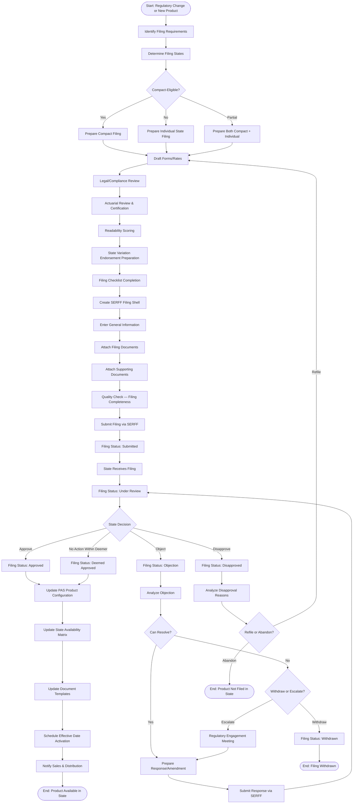

### 13.2 Parallel Multi-State Filing Process

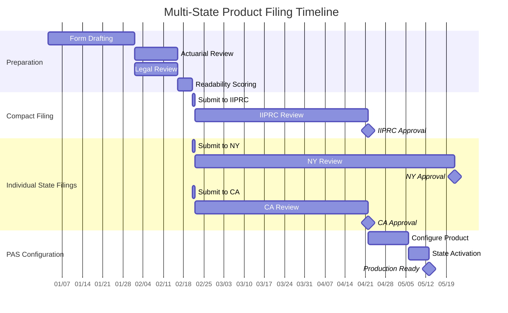

---

## 14. Architecture

### 14.1 State Rules Engine Architecture

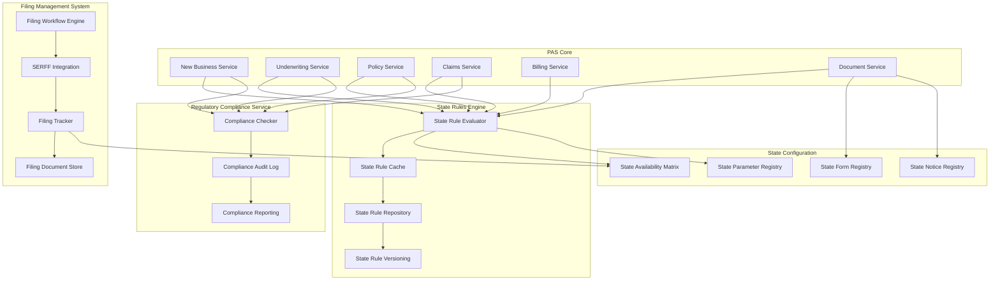

### 14.2 Detailed Component Design

#### 14.2.1 State Rule Evaluator

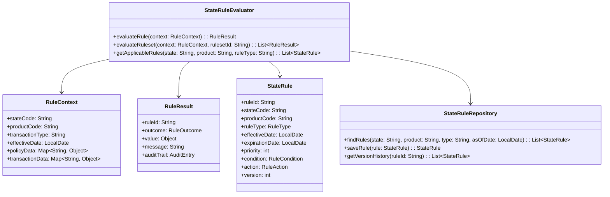

#### 14.2.2 Filing Management System

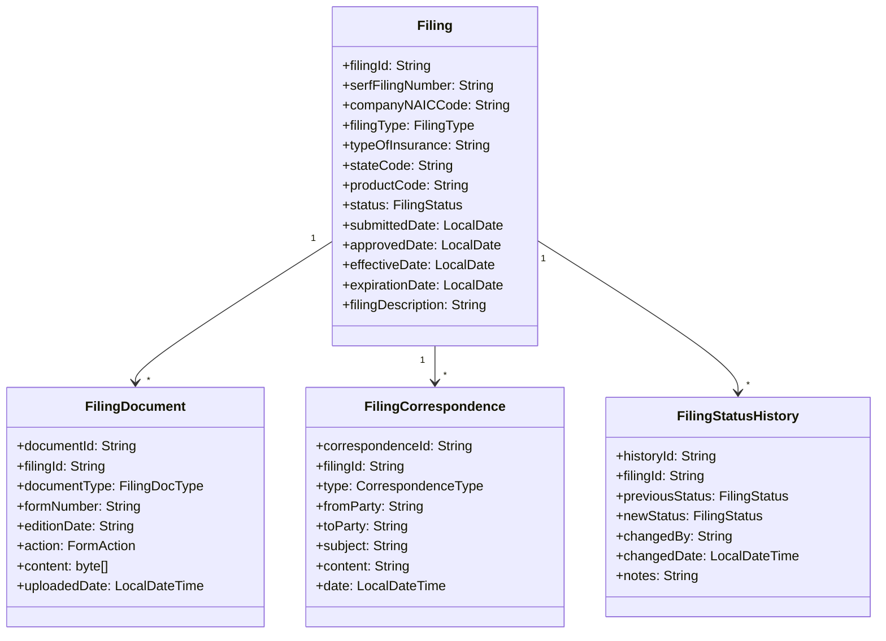

### 14.3 Integration Architecture

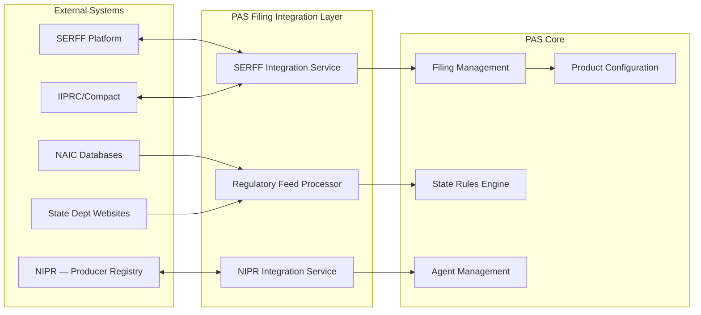

### 14.4 State Configuration Database Schema

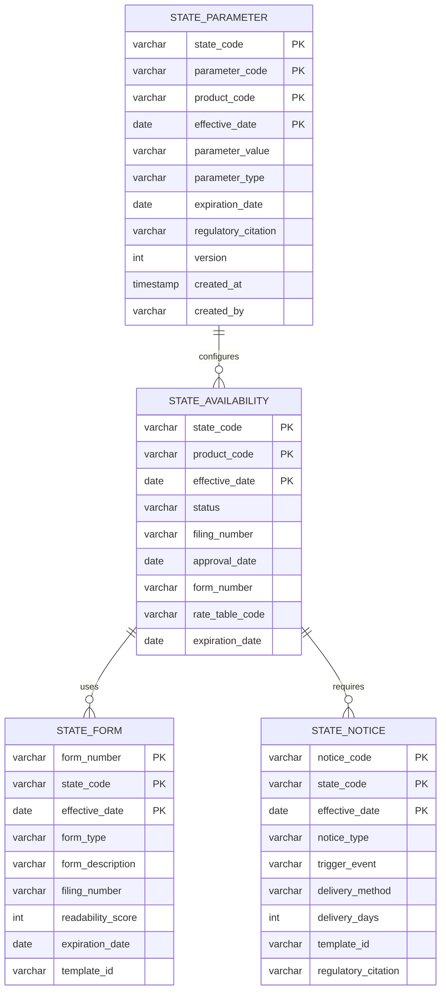

---

## 15. Data Model for Regulatory Filing Tracking

### 15.1 Complete Entity-Relationship Diagram

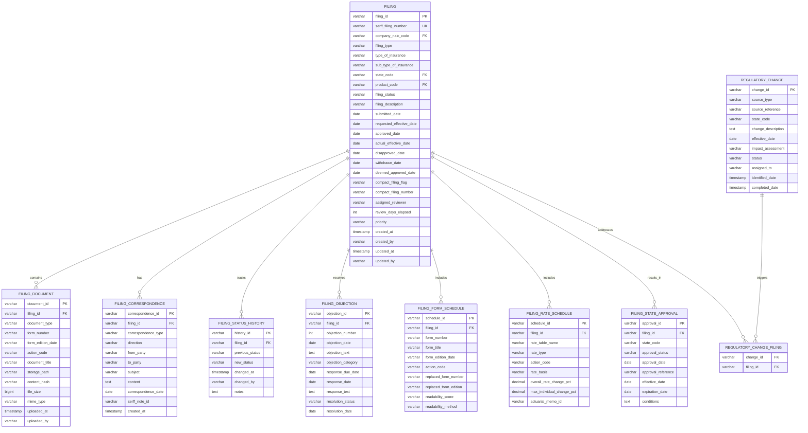

### 15.2 Key Data Dictionary

| Entity | Field | Type | Description |
|--------|-------|------|-------------|
| FILING | filing_id | VARCHAR(36) | UUID primary key |
| FILING | serff_filing_number | VARCHAR(30) | SERFF-assigned filing tracking number |
| FILING | filing_type | VARCHAR(20) | FORM, RATE, RULE, ADVERTISING, CERTIFICATION |
| FILING | filing_status | VARCHAR(20) | DRAFT, SUBMITTED, PENDING_REVIEW, UNDER_REVIEW, OBJECTION, APPROVED, DISAPPROVED, WITHDRAWN, DEEMED_APPROVED |
| FILING | type_of_insurance | VARCHAR(10) | SERFF TOI code (e.g., LI-01, AN-03) |
| FILING | compact_filing_flag | CHAR(1) | Y/N — indicates whether filed through Compact |
| FILING_DOCUMENT | action_code | VARCHAR(10) | NEW, REVISED, REPLACED, WITHDRAWN |
| FILING_OBJECTION | objection_category | VARCHAR(30) | FORM_LANGUAGE, READABILITY, ACTUARIAL, COMPLIANCE, BENEFIT_ADEQUACY |
| FILING_FORM_SCHEDULE | readability_method | VARCHAR(20) | FLESCH_EASE, FLESCH_KINCAID, DALE_CHALL |
| FILING_STATE_APPROVAL | approval_status | VARCHAR(20) | APPROVED, CONDITIONALLY_APPROVED, DISAPPROVED, DEEMED |

---

## 16. Implementation Guidance for Solution Architects

### 16.1 Key Design Principles

1. **Externalize State Rules:** Never hard-code state-specific logic in application code. All state variations must be configurable, versionable, and auditable.

2. **Version Everything:** State rules, form templates, rate tables, and notices must be versioned with effective dates. The system must be able to reconstruct the correct state configuration as of any historical date.

3. **Design for the Strictest State:** When designing base functionality, use the most restrictive state requirements as the baseline (typically New York). Other states' configurations relax requirements from this baseline.

4. **Automate Filing Tracking:** Integrate with SERFF for filing status tracking. The state availability matrix should be automatically updated when filings are approved.

5. **Build for Examinability:** Design data models and APIs to support regulatory examination data extraction. Pre-build common examination response queries.

6. **Maintain Regulatory Change Pipeline:** Establish a continuous process for monitoring regulatory changes, assessing PAS impact, and implementing updates.

### 16.2 Common Implementation Pitfalls

| Pitfall | Description | Mitigation |
|---------|-------------|------------|
| **Hard-coded State Logic** | State rules embedded in application code; changes require code releases | Externalize all state rules to configuration; use rules engine |
| **Missing Effective Dates** | State configuration without temporal dimension; cannot reconstruct historical state | All state configuration elements must have effective/expiration dates |
| **Monolithic State Configuration** | All state rules in a single table/file; difficult to manage and version | Decompose by rule category; use layered override pattern |
| **No Audit Trail** | State configuration changes not tracked | Full audit trail for all configuration changes |
| **Incomplete State Coverage** | System designed for "most states" with exceptions handled as one-offs | Comprehensive state variation analysis during design; no exceptions |
| **Filing/Product Disconnect** | Filing management system not integrated with product configuration | Filing approval should directly trigger product configuration update |

### 16.3 Technology Recommendations

| Capability | Recommended Technology | Rationale |
|-----------|----------------------|-----------|
| **State Rules Engine** | OpenL Tablets, Drools, or custom decision table engine | Business-analyst-friendly rule authoring; version control; audit trail |
| **State Configuration Store** | Relational database (PostgreSQL, Oracle) with temporal tables | ACID compliance; temporal query support; referential integrity |
| **Filing Management** | Custom application with SERFF API integration | SERFF has limited API; most integration is document-based |
| **Document Management** | Enterprise CMS (Alfresco, Documentum) or cloud (S3 + metadata) | Version control; search; access control; retention management |
| **Form Generation** | Template engine (Apache FOP, Windward, Thunderhead) with state-specific templates | Dynamic form generation with state-specific content injection |
| **Regulatory Monitoring** | NAIC StateNet subscription + manual monitoring + regulatory intelligence vendor | Continuous awareness of regulatory changes |

### 16.4 Testing Strategy

| Test Type | Scope | Approach |
|-----------|-------|----------|
| **State Configuration Validation** | Verify all state parameters against regulatory sources | Automated comparison of PAS configuration vs. regulatory requirements database |
| **State Permutation Testing** | Test every product in every state | Automated test generation for all product × state combinations |
| **Boundary Testing** | Grace periods, free-look periods, settlement timelines | Test at boundary dates (day before, day of, day after) |
| **Form Version Testing** | Correct form version selected for state and date | Issue policies at different dates; verify form version |
| **Regression Testing** | State configuration changes don't break existing policies | In-force policy validation after state configuration updates |
| **Regulatory Scenario Testing** | Examination response capability | Simulate examination data requests; verify completeness and accuracy |

### 16.5 Operational Processes

| Process | Frequency | Owner | PAS Support Required |
|---------|-----------|-------|---------------------|
| **Regulatory Change Monitoring** | Continuous | Compliance | Regulatory change tracking module |
| **Filing Preparation & Submission** | Per product/state | Product Development | Filing management system |
| **Filing Status Tracking** | Weekly review | Compliance | SERFF integration dashboard |
| **State Availability Update** | Per filing approval | Product Operations | State availability matrix update |
| **State Rule Configuration Update** | Per regulatory change | IT / Business Configuration | Rule repository update with version control |
| **Market Conduct Exam Preparation** | Per examination notice | Compliance / IT | Data extraction and report generation |
| **Complaint Response** | Per complaint | Customer Service / Compliance | Policy dossier assembly |
| **Producer Licensing Verification** | Continuous (at point of sale) | Distribution | NIPR integration; real-time license verification |

---

## 17. Glossary

| Term | Definition |
|------|-----------|
| **Admitted Insurer** | An insurer licensed to do business in a state |
| **Compact (IIPRC)** | Interstate Insurance Product Regulation Commission — multi-state filing mechanism |
| **COI** | Cost of Insurance — mortality charge in universal life products |
| **CSO** | Commissioners Standard Ordinary mortality table (current: 2017 CSO) |
| **Deemer Provision** | Statutory provision that deems a filing approved if the state does not act within a specified period |
| **Domestic Insurer** | An insurer domiciled (incorporated) in the state |
| **E-Delivery** | Electronic delivery of policy documents with policyholder consent |
| **FIO** | Federal Insurance Office within U.S. Department of the Treasury |
| **FINRA** | Financial Industry Regulatory Authority — self-regulatory organization for broker-dealers |
| **Flesch-Kincaid** | Readability test used to assess policy form readability |
| **Foreign Insurer** | An insurer domiciled in another U.S. state |
| **Form Filing** | SERFF filing of policy forms, riders, and endorsements for regulatory approval |
| **Grace Period** | Period after premium due date during which coverage continues |
| **IIPRC** | Interstate Insurance Product Regulation Commission |
| **Incontestability** | Period after which insurer cannot contest policy validity |
| **Market Conduct** | Regulatory examination of insurer's treatment of policyholders |
| **McCarran-Ferguson** | Federal law preserving state regulation of insurance |
| **MCAS** | Market Conduct Annual Statement |
| **NAIC** | National Association of Insurance Commissioners |
| **NIPR** | National Insurance Producer Registry |
| **Non-forfeiture** | Guaranteed values available to policyholder upon lapse or surrender |
| **PAS** | Policy Administration System |
| **Prior Approval** | Regulatory regime requiring state approval before product use |
| **Rate Filing** | SERFF filing of premium rates for regulatory approval |
| **Replacement** | Transaction where new policy replaces existing policy |
| **SERFF** | System for Electronic Rate and Form Filing |
| **State Overlay** | Design pattern where state-specific rules override default rules |
| **Surplus Lines** | Insurance placed with non-admitted insurer for risks that cannot be placed in admitted market |
| **TOI** | Type of Insurance — SERFF classification code |
| **Unisex Rating** | Gender-neutral premium pricing (required in Montana) |

---

## 18. References

### 18.1 Regulatory Sources

1. **McCarran-Ferguson Act**, 15 U.S.C. §§ 1011-1015 (1945)
2. **Dodd-Frank Wall Street Reform and Consumer Protection Act**, Pub. L. 111-203 (2010), Title V — Federal Insurance Office
3. **NAIC Model Laws, Regulations, and Guidelines** — available at naic.org
4. **NAIC Standard Nonforfeiture Law for Life Insurance**, Model #808
5. **NAIC Life Insurance Illustrations Model Regulation**, Model #582
6. **NAIC Life Insurance and Annuities Replacement Model Regulation**, Model #613
7. **NAIC Unfair Trade Practices Act**, Model #880
8. **NAIC Suitability in Annuity Transactions Model Regulation**, Model #275
9. **NAIC Insurance Compact** — inscompact.org
10. **SERFF** — serff.com

### 18.2 State Insurance Codes (Selected)

1. **New York Insurance Law** — Articles 32 (Life Insurance), 42 (Annuities), 43 (Variable Contracts)
2. **California Insurance Code** — Division 2, Part 2 (Life and Disability Insurance)
3. **Texas Insurance Code** — Title 7 (Life Insurance and Annuities)
4. **Florida Statutes** — Title XXXVII (Insurance), Chapter 627
5. **Pennsylvania Insurance Law** — Title 40

### 18.3 Industry Resources

1. ACLI (American Council of Life Insurers) — acli.com
2. LIMRA — limra.com
3. SOA (Society of Actuaries) — soa.org
4. NAIC StateNet — Regulatory tracking service
5. Wolters Kluwer — Regulatory intelligence

---

*Article 34 of the PAS Architect's Encyclopedia. Last updated: 2026. This article is for educational and architectural reference purposes. Consult current regulatory sources and legal counsel for compliance decisions.*
