# Article 35: NAIC & Federal Regulatory Framework

## PAS Architect's Encyclopedia — Life Insurance Policy Administration Systems

---

## Table of Contents

1. [Introduction](#1-introduction)
2. [NAIC Overview](#2-naic-overview)
3. [Key NAIC Model Laws for Life/Annuity](#3-key-naic-model-laws-for-lifeannuity)
4. [Principle-Based Reserving (PBR)](#4-principle-based-reserving-pbr)
5. [Risk-Based Capital (RBC)](#5-risk-based-capital-rbc)
6. [Own Risk and Solvency Assessment (ORSA)](#6-own-risk-and-solvency-assessment-orsa)
7. [Federal Regulatory Overlay](#7-federal-regulatory-overlay)
8. [Anti-Money Laundering (AML)](#8-anti-money-laundering-aml)
9. [Data Privacy](#9-data-privacy)
10. [Accounting Standards — NAIC SAP](#10-accounting-standards--naic-sap)
11. [Regulatory Compliance Matrix](#11-regulatory-compliance-matrix)
12. [Architecture](#12-architecture)
13. [Implementation Guidance](#13-implementation-guidance)
14. [Glossary](#14-glossary)
15. [References](#15-references)

---

## 1. Introduction

While the U.S. insurance industry is regulated at the state level (as preserved by the McCarran-Ferguson Act), two critical supra-state forces shape the regulatory environment: the **National Association of Insurance Commissioners (NAIC)** and a patchwork of **federal laws** that overlay state regulation in specific domains.

For PAS architects, the NAIC framework defines the model laws that most states adopt (with variations), creating the baseline regulatory requirements that drive PAS design. Federal regulation — SEC, FINRA, DOL, IRS, FinCEN, and privacy frameworks — adds additional compliance dimensions that must be woven into the PAS architecture.

This article provides an exhaustive treatment of the NAIC structure, its key model laws affecting life insurance and annuity PAS, the Principle-Based Reserving (PBR) framework, Risk-Based Capital (RBC), Own Risk and Solvency Assessment (ORSA), federal regulatory overlays including securities regulation, retirement plan regulation, anti-money laundering, data privacy, and statutory accounting standards.

### 1.1 Scope and Audience

This article is intended for solution architects designing or modernizing life insurance and annuity policy administration systems. It covers the regulatory frameworks that drive PAS data requirements, calculation engines, reporting capabilities, and compliance controls.

---

## 2. NAIC Overview

### 2.1 What is the NAIC?

The **National Association of Insurance Commissioners (NAIC)** is a voluntary organization of the chief insurance regulatory officials of the 50 states, the District of Columbia, and five U.S. territories. Founded in 1871, the NAIC:

- Develops **model laws, regulations, and guidelines** that states may adopt
- Maintains **accreditation standards** for state insurance departments
- Operates **financial regulatory tools** (IRIS ratios, Risk-Based Capital)
- Provides **technology platforms** (SERFF, OPTins, SBS, i-SITE+)
- Facilitates **interstate coordination** through committee structure
- Collects and publishes **industry data** (statutory filings, complaints, market data)

### 2.2 NAIC Organizational Structure

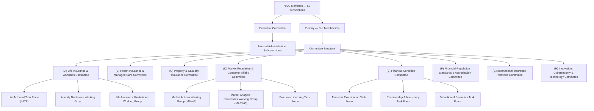

### 2.3 NAIC Model Law Development Process

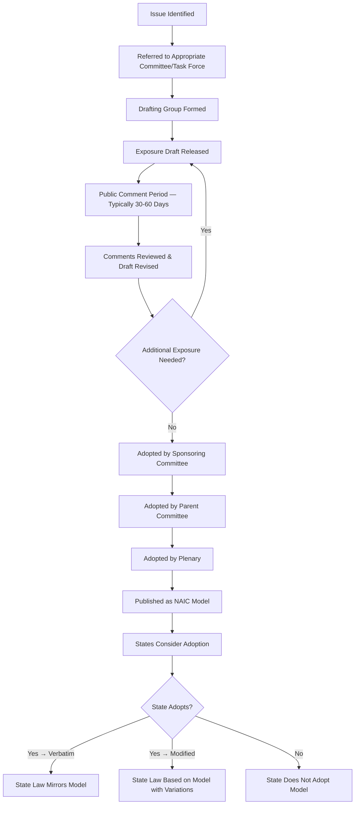

### 2.4 NAIC Accreditation Program

The NAIC **Financial Regulation Standards and Accreditation Program** establishes minimum standards that state insurance departments must meet. Accreditation is reviewed every 5 years.

| Standard Category | Requirements |
|-------------------|-------------|
| **Laws and Regulations** | State must have adopted key NAIC model laws (Standard Valuation Law, Risk-Based Capital, Holding Company Act, etc.) |
| **Regulatory Practices** | State must conduct financial examinations per NAIC handbook; must have adequate staffing; must participate in NAIC database systems |
| **Organizational and Personnel** | Adequate staff qualifications; commissioner independence; budget sufficiency |

**PAS Impact:** NAIC accreditation standards ensure that state regulatory requirements converge toward NAIC models. PAS architects can use NAIC models as the baseline design, with state-specific overlays for variations.

### 2.5 IRIS Ratios

The **Insurance Regulatory Information System (IRIS)** comprises financial ratios calculated from annual statutory filings. IRIS flags insurers whose ratios fall outside normal ranges for priority attention:

| IRIS Ratio # | Name | Normal Range | What It Measures |
|-------------|------|-------------|-----------------|
| 1 | Net Change in Capital & Surplus | -10% to +50% | Overall financial stability |
| 2 | Gross Change in Capital & Surplus | -10% to +50% | Including unrealized gains/losses |
| 3 | Net Income to Total Income | 0% to 100% | Profitability |
| 4 | Adequacy of Investment Income | ≥ 100% of needed investment income | Investment earnings sufficiency |
| 5 | Non-Admitted to Admitted Assets | ≤ 10% | Asset quality |
| 6 | Total Real Estate + Mortgages to Cash & Invested Assets | ≤ 20% | Real estate concentration |
| 7 | Total Affiliated Investments to Capital & Surplus | ≤ 100% | Affiliate exposure |
| 8 | Surplus Relief | ≤ 5% | Reinsurance surplus impact |
| 9 | Change in Reserving Ratio | -20% to +20% | Reserve adequacy trend |
| 10 | Change in Asset Mix | Various ranges | Investment strategy stability |
| 11 | Change in Premium | -10% to +50% | Growth rate |
| 12 | Change in Product Mix | -5% to +5% | Business mix stability |

---

## 3. Key NAIC Model Laws for Life/Annuity

### 3.1 Standard Nonforfeiture Law for Life Insurance (Model #808)

#### 3.1.1 Purpose and Scope

Model #808 ensures that cash value life insurance policies provide **minimum guaranteed nonforfeiture values** — values that belong to the policyholder upon lapse or surrender, regardless of the insurer's financial performance.

#### 3.1.2 Key Requirements

| Requirement | Description |
|------------|-------------|
| **Minimum Cash Surrender Values** | Calculated based on mortality table (currently 2017 CSO), maximum nonforfeiture interest rate (currently 4.00%), and adjusted premium methodology |
| **Nonforfeiture Options** | Cash surrender value, reduced paid-up insurance, extended term insurance |
| **Default Option** | If policyholder does not elect an option, extended term insurance is the default (some states specify reduced paid-up) |
| **Availability Timing** | Cash values must be available no later than end of 3rd policy year (or end of 1st year if required by cash value test) |
| **Adjusted Premium Method** | Minimum values calculated using adjusted premiums that account for acquisition costs (per statutory formula) |

#### 3.1.3 Nonforfeiture Calculation — Adjusted Premium Method

The adjusted premium method calculates minimum cash surrender values as follows:

```
Minimum CSV(t) = PV(future benefits at time t) - PV(future adjusted premiums at time t)

Where:
  Adjusted Premium = (Net Level Premium) + (First Year Allowance amortized over premium-paying period)
  First Year Allowance = lesser of:
    (a) $40 per $1,000 + 25% of lesser of adjusted premium and $40/$1,000
    (b) 10 × Adjusted Premium
  
  Net Level Premium = based on 2017 CSO mortality and nonforfeiture interest rate
  Nonforfeiture Interest Rate = currently 4.00% (125% of calendar year statutory valuation interest rate, rounded to nearest 0.25%)
```

#### 3.1.4 PAS Impact — Nonforfeiture Engine

The PAS nonforfeiture calculation engine must:

1. **Store mortality tables**: Multiple CSO tables (1958, 1980, 2001, 2017) for different issue eras
2. **Track nonforfeiture interest rates**: Rate changes over time; different rates for different issue years
3. **Calculate adjusted premiums**: Per statutory formula for each policy
4. **Generate nonforfeiture value schedules**: Cash value, reduced paid-up, and extended term for each policy year
5. **Apply state variations**: Different states may have different nonforfeiture interest rate floors or timing requirements
6. **Support multiple bases**: Pre-PBR policies use formula reserves; PBR policies may use different nonforfeiture framework

### 3.2 Standard Nonforfeiture Law for Individual Deferred Annuities (Model #805)

#### 3.2.1 Key Requirements

| Requirement | Description |
|------------|-------------|
| **Minimum Nonforfeiture Amount** | At least 87.5% of accumulation value less surrender charge, or 65% of premiums accumulated at nonforfeiture rate minus prior withdrawals |
| **Nonforfeiture Interest Rate** | 1.00% - 3.00% (varies by product type and state adoption date) |
| **Surrender Charge Limits** | Surrender charges must not exceed those that would produce values below the minimum nonforfeiture amount |
| **Partial Withdrawal** | Must be available; may be subject to surrender charge |
| **Death Benefit Minimum** | Minimum death benefit equal to nonforfeiture amount (no surrender charge applied at death in most states) |

#### 3.2.2 PAS Impact

The PAS annuity valuation engine must:

- Track the **nonforfeiture rate** applicable to each contract (varies by issue date and state)
- Calculate **minimum guaranteed values** at each point in time
- Ensure **surrender charges** never reduce values below the nonforfeiture floor
- Apply the correct minimum death benefit calculation
- Handle **market value adjustments (MVA)** in conjunction with nonforfeiture minimums

### 3.3 Standard Valuation Law (Model #820)

#### 3.3.1 Overview

The Standard Valuation Law prescribes how life insurers calculate **statutory reserves** — the liabilities recognized on the statutory balance sheet to ensure future policy obligations can be met.

#### 3.3.2 Pre-PBR vs. PBR

| Aspect | Pre-PBR (Formulaic) | PBR (Principle-Based) |
|--------|---------------------|----------------------|
| **Approach** | Prescribed formulas using mandated mortality tables and interest rates | Company-specific modeling using actuarial judgment within guardrails |
| **Mortality** | Commissioners Standard Ordinary (CSO) table prescribed | Company experience + industry tables; mortality improvement |
| **Interest** | Prescribed maximum valuation rate (per Model #820 formula) | Company investment strategy; scenario testing |
| **Flexibility** | Very limited; one-size-fits-all | Significant; reflects company-specific risk profile |
| **Reserve Level** | Often overstated (conservative) | More risk-reflective; potentially lower for well-managed portfolios |
| **Data Requirements** | Minimal — seriatim policy data plus prescribed factors | Extensive — detailed experience data, asset data, assumption documentation |
| **Effective** | Pre-2017 issues (or until state adopts PBR) | Mandatory for most products as of January 1, 2020 |

### 3.4 Life Insurance Illustrations Model Regulation (Model #582)

#### 3.4.1 Purpose

Prevents misleading use of non-guaranteed policy illustrations in the sale of life insurance by establishing standards for illustration format, content, and actuarial certification.

#### 3.4.2 Key Requirements

| Requirement | Description | PAS Impact |
|------------|-------------|-----------|
| **Basic Illustration** | Must be provided at or before application; shows guaranteed and illustrated (non-guaranteed) elements | PAS illustration engine must generate compliant illustrations |
| **Supplemental Illustration** | Additional illustrations permitted but must include basic illustration | Must be identified as supplemental |
| **Narrative Summary** | Plain-language description of policy mechanics, guarantees, and non-guaranteed elements | Template-driven document generation |
| **Numeric Summary** | Columnar presentation at specified durations (years 1, 5, 10, 20, and at ages 55, 65, 70) | Calculation engine for projected values |
| **Illustration Actuary** | Appointed actuary must certify that illustrated scale is self-supporting and based on actual experience | Certification tracking in filing system |
| **Disciplined Current Scale** | Non-guaranteed elements must reflect actual recent experience factors | Illustrated scale must be updated when experience changes |
| **Lapse-Supported Identification** | If illustration relies on lapse assumptions for self-support, must be disclosed | Lapse-support testing in illustration engine |
| **Annual Report** | In-force illustration report provided annually on request | Annual illustration generation for in-force block |

#### 3.4.3 Illustration Data Flow

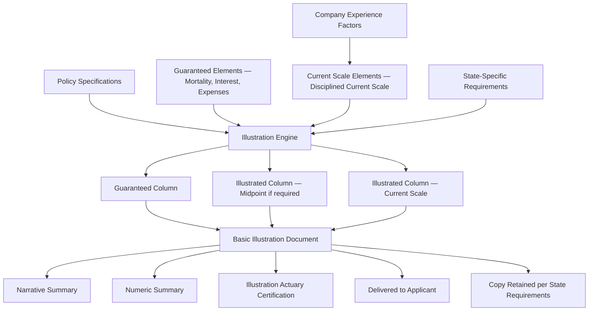

### 3.5 Life Insurance and Annuities Replacement Model Regulation (Model #613)

#### 3.5.1 Core Requirements

| Component | Requirement | PAS Support |
|-----------|------------|-------------|
| **Replacement Detection** | Agent must determine if transaction involves replacement of existing coverage | Application data collection; replacement questionnaire |
| **Replacement Notice** | "Important Notice: Replacement of Life Insurance or Annuities" provided to applicant | Notice template generation; delivery tracking |
| **Comparison Information** | Comparison of existing and proposed coverage | Illustration comparison engine |
| **Replacing Insurer Duties** | Notify existing insurer; retain records; ensure suitability | Automated notification; record retention |
| **Existing Insurer Duties** | Provide policy information; conservation letter (optional) | Conservation workflow; policy information report |
| **Extended Free-Look** | 30-day (typically) free-look for replacement transactions | Free-look period override for replacement |

#### 3.5.2 Replacement Workflow in PAS

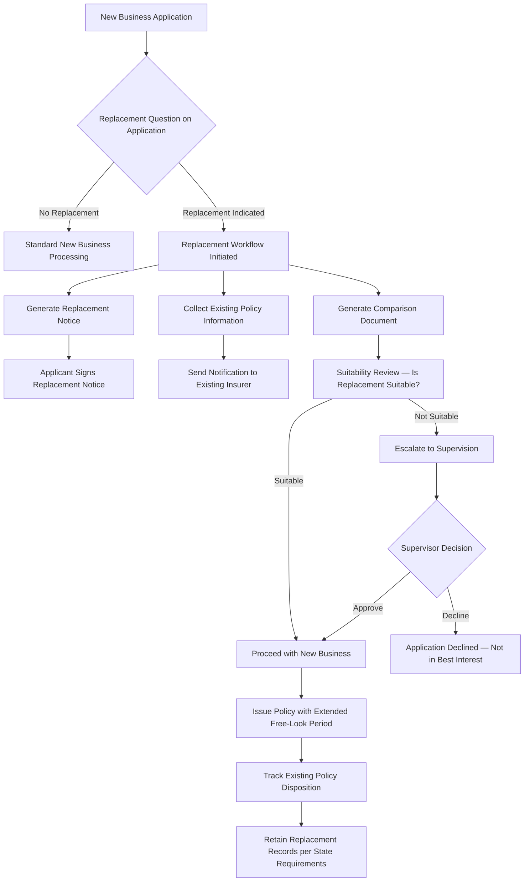

### 3.6 Suitability in Annuity Transactions Model Regulation (Model #275)

#### 3.6.1 Evolution to Best Interest

The NAIC revised Model #275 in 2020 to establish a **best interest standard** for annuity recommendations, replacing the previous suitability-only standard:

| Obligation | Description |
|-----------|-------------|
| **Care** | Must exercise reasonable diligence, care, and skill in making recommendation |
| **Disclosure** | Must disclose role, compensation, conflicts of interest |
| **Conflict of Interest** | Must identify, avoid, or mitigate material conflicts |
| **Documentation** | Must document the basis for recommendation |

#### 3.6.2 Suitability Data Requirements

The PAS must capture and store the following customer profile information:

| Category | Data Elements |
|----------|--------------|
| **Demographics** | Age, marital status, dependents, retirement status |
| **Financial** | Annual income, net worth (liquid and illiquid), tax bracket, existing insurance/annuity holdings |
| **Objectives** | Investment objective (growth, income, preservation), time horizon, intended use of product |
| **Risk** | Risk tolerance (conservative, moderate, aggressive), experience with financial products |
| **Liquidity** | Liquidity needs, emergency fund adequacy, other liquid assets |
| **Insurance** | Existing life insurance coverage, existing annuity holdings, other financial products |
| **Special** | Financial sophistication, turning 65 and Medicare considerations, estate planning needs |

### 3.7 Unfair Trade Practices Act (Model #880)

#### 3.7.1 Prohibited Practices

| Practice | Definition | PAS Controls |
|----------|-----------|-------------|
| **Misrepresentation** | False or misleading statements about policies | Approved marketing material library; agent scripts |
| **False Advertising** | Deceptive advertising | Advertising review workflow; SERFF advertising filing |
| **Defamation** | False statements about competitors | Agent training tracking |
| **Unfair Discrimination** | Rate or coverage discrimination not actuarially justified | Rating engine audit; underwriting decision audit |
| **Rebating** | Unauthorized inducements | Commission calculation controls; gift tracking |
| **Twisting** | Misrepresentation to induce replacement | Replacement detection; suitability documentation |
| **Churning** | Excessive policy replacement using existing values | Policy replacement pattern monitoring |
| **Unfair Claim Practices** | Systematic claim handling failures | Claim timeline tracking; SLA monitoring |

### 3.8 Insurance Holding Company System Regulatory Act (Model #440)

| Requirement | Description | PAS Impact |
|------------|-------------|-----------|
| **Registration** | Insurers that are members of holding company systems must register with domiciliary state | Corporate structure tracking |
| **Affiliated Transactions** | Transactions between affiliates must be fair and reasonable; material transactions require prior approval | Intercompany transaction tracking |
| **Enterprise Risk Report** | Annual filing identifying enterprise risks | Risk reporting data from PAS |
| **Supervisory Colleges** | Regulators may participate in group-wide supervision | Multi-entity data aggregation |

### 3.9 Risk-Based Capital for Life (Model #312)

Covered in detail in Section 5 below.

---

## 4. Principle-Based Reserving (PBR)

### 4.1 Overview

Principle-Based Reserving (PBR) replaced the traditional formulaic approach to statutory reserves with a principles-based methodology that uses company-specific experience data and actuarial judgment, bounded by guardrails.

PBR became operative January 1, 2017, with mandatory application for most life insurance products by January 1, 2020 (with transition provisions).

### 4.2 Valuation Manual (VM) Structure

| VM Section | Title | Content |
|-----------|-------|---------|
| **VM-01** | Definitions for Terms in Requirements | Defined terms used throughout VM |
| **VM-02** | Minimum Nonforfeiture Mortality and Interest | Mortality/interest for nonforfeiture calculations |
| **VM-05** | Supplemental Guidance | Supplemental guidance and Q&A |
| **VM-20** | Requirements for Principle-Based Life Insurance Reserves | PBR for life insurance products |
| **VM-21** | Requirements for Principle-Based Variable Annuity Reserves | PBR for variable annuities |
| **VM-22** | Statutory Maximum Valuation Interest Rates for Income Annuities | Fixed annuity valuation interest rates |
| **VM-25** | Health Insurance Reserves | Health insurance reserve requirements |
| **VM-26** | Credit Life and Disability Insurance Reserves | Credit insurance reserves |
| **VM-30** | Actuarial Opinion and Memorandum Requirements | Annual opinion requirements |
| **VM-31** | PBR Actuarial Report Requirements | PBR-specific actuarial documentation |
| **VM-50** | Experience Reporting Requirements | Industry experience data collection |
| **VM-51** | Experience Reporting Formats | Data formats for VM-50 submissions |
| **VM-A** | Appendix A — Requirements | Reserves that use formulaic methods |
| **VM-C** | Appendix C — Actuarial Guidelines | Actuarial guidelines incorporated by reference |
| **VM-G** | Corporate Governance Requirements | Governance for PBR implementation |
| **VM-M** | Mortality Tables | Prescribed mortality tables and construction methodology |

### 4.3 VM-20: Life Insurance PBR

#### 4.3.1 Three-Component Reserve

VM-20 requires life insurance reserves to be the **maximum** of three components:

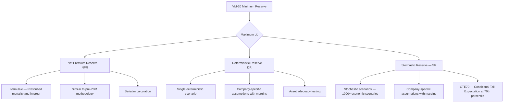

#### 4.3.2 Key Assumptions

| Assumption | Description | Source |
|-----------|-------------|--------|
| **Mortality** | Company experience + industry table + improvement | VM-20 §9.C; VM-M for mortality tables |
| **Lapse** | Company experience; dynamic lapse for interest-sensitive products | VM-20 §9.D; company-specific analysis |
| **Premium Persistency** | Likelihood of premium payment for flexible premium products | VM-20 §9.D; company-specific analysis |
| **Expenses** | Fully allocated expenses (maintenance, investment) | VM-20 §9.E; company expense study |
| **Interest/Discount** | Net asset earned rates; reinvestment rates | VM-20 §7 (Asset segments); scenario-specific for SR |
| **Economic Scenarios** | American Academy of Actuaries Economic Scenario Generator | 10,000 scenarios for SR (subset of 1,000 commonly used) |
| **Reinsurance** | Credit for reinsurance per VM-20 §8 | Reinsurance agreements; counterparty risk assessment |

#### 4.3.3 Exclusion Tests

VM-20 provides **exclusion tests** that allow companies to bypass the stochastic reserve (SR) and/or deterministic reserve (DR) calculations if the product's risk profile does not warrant them:

| Test | Purpose | If Passed |
|------|---------|-----------|
| **Stochastic Exclusion Test (SET)** | Determines if interest rate risk is significant enough to require SR | May use NPR floor instead of SR |
| **Deterministic Exclusion Test (DET)** | Determines if NPR is sufficient without DR | May use NPR only |
| **Certification Method** | Company actuary certifies that product meets exclusion criteria | Streamlined documentation |

#### 4.3.4 PAS Impact — VM-20 Data Requirements

| Data Category | Specific Requirements | PAS Source |
|--------------|----------------------|-----------|
| **Seriatim Policy Data** | Face amount, premium, issue age, sex, risk class, plan code, issue date, policy status | Policy master file |
| **Cash Flows** | Premium, death benefit, surrender value, expense, commission | Policy calculation engine |
| **Mortality Experience** | Claims, exposure by risk class, age, duration, sex | Claim system + policy system |
| **Lapse Experience** | Lapse counts and amounts by duration, risk class, interest rate environment | Policy status change history |
| **Expense Data** | Per-policy, per-unit, percentage-of-premium expenses | Expense allocation system |
| **Asset Data** | Investment portfolio, asset cash flows, credit quality, duration | Investment accounting system |
| **Reinsurance Data** | Ceded amounts, treaty terms, counterparty ratings | Reinsurance administration system |

### 4.4 VM-21: Variable Annuity PBR

#### 4.4.1 Overview

VM-21 establishes reserve requirements for variable annuity products, including those with guaranteed living benefits (GLBs) and guaranteed death benefits (GMDBs).

#### 4.4.2 Reserve Components

| Component | Description |
|-----------|-------------|
| **Standard Scenario Amount** | Deterministic scenario using prescribed assumptions |
| **Conditional Tail Expectation Amount (CTE)** | CTE(70) of the greatest present value of accumulated deficiencies across stochastic scenarios |
| **Aggregate Reserve** | Greater of Standard Scenario Amount and CTE Amount, adjusted for starting assets |

#### 4.4.3 Guaranteed Benefit Types

| Benefit Type | Abbreviation | Description | Reserve Complexity |
|-------------|-------------|-------------|-------------------|
| Guaranteed Minimum Death Benefit | GMDB | Death benefit ≥ specified minimum (return of premium, ratchet, roll-up) | Moderate |
| Guaranteed Minimum Accumulation Benefit | GMAB | Account value guaranteed at specified minimum at end of accumulation period | Moderate |
| Guaranteed Minimum Income Benefit | GMIB | Guaranteed annuitization base at specified minimum | High |
| Guaranteed Minimum Withdrawal Benefit | GMWB | Guaranteed withdrawals regardless of account value | Very High |
| Guaranteed Lifetime Withdrawal Benefit | GLWB | GMWB for lifetime | Very High |

#### 4.4.4 PAS Impact

Variable annuity PAS must provide:
- Sub-account value tracking (daily NAV)
- Guaranteed benefit base tracking (separate from account value)
- Step-up/ratchet logic for each guarantee type
- Rider charge deduction
- Benefit utilization tracking (withdrawals, annuitizations)
- Detailed data feeds for actuarial valuation models (monthly or daily)

### 4.5 VM-22: Fixed Annuity Reserves

VM-22 establishes valuation interest rates for income annuity reserves (payout annuities, structured settlements). Key considerations:

| Parameter | Description |
|-----------|-------------|
| **Valuation Rate** | Statutory maximum interest rate for reserve calculation; based on Moody's Corporate Bond Yield Average |
| **Mortality** | 2012 IAM Basic Table with Projection Scale G2 (or successor) for annuitant mortality |
| **Annuity Reserve** | Present value of future annuity payments using prescribed mortality and interest |

### 4.6 VM-31: PBR Actuarial Report

VM-31 requires an annual **PBR Actuarial Report** that documents:

| Section | Content |
|---------|---------|
| **Executive Summary** | Overview of PBR results, key assumptions, changes from prior year |
| **Methodology** | Description of valuation methodology for each product group |
| **Assumptions** | Detailed documentation of each assumption (mortality, lapse, expense, interest) with justification |
| **Experience Analysis** | Summary of experience studies supporting assumptions |
| **Margin Documentation** | Description of margins added to assumptions and rationale |
| **Sensitivity Testing** | Results of sensitivity tests on key assumptions |
| **Exclusion Test Results** | Documentation of exclusion test results (if applicable) |
| **Reinsurance** | Description of reinsurance arrangements and their reserve impact |
| **Certifications** | Required actuarial certifications |

**PAS Impact:** The PAS must produce the detailed seriatim data and experience analysis data needed to support VM-31 documentation. This includes historical experience data for mortality, lapse, and expense studies.

### 4.7 VM-50: Experience Reporting

VM-50 requires companies to submit **individual policy experience data** to the SOA for industry experience analysis:

| Report | Data Elements | Frequency |
|--------|--------------|-----------|
| **Mortality Experience** | Policy demographics, death claims, exposure | Annual |
| **Lapse Experience** | Policy demographics, lapse events, partial surrenders | Annual |
| **Policy-Level Data** | Seriatim records with face amount, premium, status, risk class, underwriting method | Annual |

**PAS Impact:** VM-50 submission requires the PAS to generate detailed seriatim policy data extracts in prescribed formats. This is a significant data engineering requirement.

---

## 5. Risk-Based Capital (RBC)

### 5.1 Overview

Risk-Based Capital (RBC) is the NAIC framework for determining the minimum amount of capital an insurer must hold based on the risks inherent in its operations. The RBC formula produces an **RBC ratio** that regulators use to identify insurers that may be undercapitalized.

### 5.2 RBC Components

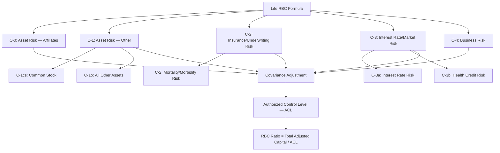

### 5.3 RBC Risk Categories — Detailed

| Category | Symbol | Risk Type | Description | Key Drivers for Life Insurers |
|----------|--------|-----------|-------------|------------------------------|
| Asset Risk — Affiliates | C-0 | Credit/Market | Risk of default or decline in value of affiliated investments | Holding company structure; affiliated asset holdings |
| Asset Risk — Other | C-1 | Credit/Market | Risk of default or decline in value of non-affiliated investments | Bond portfolio credit quality; stock holdings; mortgage quality |
| Insurance Risk | C-2 | Underwriting | Risk that mortality/morbidity experience is worse than expected | Policy reserves; net amount at risk; product mix |
| Interest Rate Risk | C-3a | Market | Risk that interest rate changes cause asset-liability mismatch | Duration mismatch; option risk in products; annuity guaranteed rates |
| Health Credit Risk | C-3b | Credit | Risk of health claim volatility | Health insurance reserves |
| Business Risk | C-4a | Operational | Risk of adverse business experience (e.g., expense overruns) | Premium volume; guarantee fund assessments |
| Business Risk | C-4b | Operational | Additional risk from rapid growth | Excessive growth in premiums |

### 5.4 Covariance Formula

The covariance formula recognizes that not all risks are perfectly correlated:

```
RBC (ACL) = C-0 + √(C-1² + C-2² + C-3a² + C-3b² + C-4a² + C-4b²)

Note: C-0 is outside the square root because affiliated asset risk is 100% correlated with all other risks
```

### 5.5 Action Level Ratios

| Action Level | RBC Ratio (TAC/ACL) | Regulatory Action |
|-------------|---------------------|-------------------|
| **No Action** | ≥ 200% | No regulatory action required |
| **Company Action Level (CAL)** | 150% - 200% | Company must submit RBC plan to commissioner |
| **Regulatory Action Level (RAL)** | 100% - 150% | Commissioner may issue corrective order |
| **Authorized Control Level (ACL)** | 70% - 100% | Commissioner may place insurer under regulatory control |
| **Mandatory Control Level (MCL)** | < 70% | Commissioner **must** place insurer under regulatory control |

### 5.6 PAS Data Requirements for RBC

| RBC Component | Data from PAS | Data from Other Systems |
|--------------|---------------|------------------------|
| **C-1 (Asset Risk)** | N/A | Investment accounting system; asset classification |
| **C-2 (Insurance Risk)** | Net amount at risk by product/category; reserve amounts; claim experience | Actuarial valuation system |
| **C-3a (Interest Rate)** | Policy features (guaranteed rates, surrender charges, loan rates); policy count and reserves by product | Asset-liability management system |
| **C-4 (Business Risk)** | Premium volume by line; policy count | Financial reporting system |

---

## 6. Own Risk and Solvency Assessment (ORSA)

### 6.1 Overview

ORSA requires insurers (above specified thresholds) to conduct an internal assessment of their risk profile and capital adequacy. Adopted via the NAIC Risk Management and Own Risk and Solvency Assessment Model Act (#505).

### 6.2 Applicability Thresholds

| Threshold | Requirement |
|-----------|------------|
| **Individual Insurer** | Annual premium > $500 million OR Group annual premium > $1 billion |
| **Insurance Group** | Any insurer in a group where the group's total premium > $1 billion |
| **Exemptions** | Insurers below threshold; run-off companies; certain special-purpose vehicles |

### 6.3 ORSA Components

```mermaid
graph TD
    A[ORSA Process] --> B[Section 1: Description of Risk Management Framework]
    A --> C[Section 2: Insurer's Assessment of Risk Exposure]
    A --> D[Section 3: Group Risk Capital and Prospective Solvency Assessment]

    B --> B1[Governance Structure]
    B --> B2[Risk Appetite and Tolerances]
    B --> B3[Risk Identification Process]
    B --> B4[Risk Management Policies]
    B --> B5[Risk Culture]

    C --> C1[Credit Risk]
    C --> C2[Market Risk]
    C --> C3[Liquidity Risk]
    C --> C4[Underwriting Risk]
    C --> C5[Operational Risk]
    C --> C6[Strategic Risk]
    C --> C7[Reputational Risk]
    C --> C8[Legal/Regulatory Risk]

    D --> D1[Capital Adequacy Assessment]
    D --> D2[Stress Testing]
    D --> D3[Scenario Analysis]
    D --> D4[Reverse Stress Testing]
    D --> D5[Prospective Capital Needs]
```

### 6.4 ORSA Stress Testing and Scenario Analysis

| Scenario Type | Description | Examples |
|--------------|-------------|---------|
| **Base Scenario** | Expected conditions | Current economic environment continues |
| **Adverse Scenario** | Moderately stressed conditions | Recession; 200 bps rate increase; moderate pandemic |
| **Severe Scenario** | Severely stressed conditions | Deep recession; credit crisis; severe pandemic; 1-in-100-year event |
| **Reverse Stress Test** | Identify scenarios that cause insolvency | What combination of events would deplete capital below MCL? |

### 6.5 ORSA Summary Report

The ORSA Summary Report is filed **confidentially** with the domiciliary state commissioner:

| Section | Content |
|---------|---------|
| **Executive Summary** | Overview of ERM framework, key risks, capital position |
| **Risk Management Framework** | Governance, risk appetite, risk identification, risk policies |
| **Risk Assessment** | Quantification of each material risk category |
| **Stress Testing Results** | Results of stress tests and scenario analyses |
| **Capital Adequacy** | Assessment of capital adequacy under base and stressed scenarios |
| **Prospective Assessment** | Forward-looking (3-5 year) assessment of risk and capital |
| **Group Assessment** | For insurance groups: group-level risk and capital assessment |

### 6.6 PAS Data Requirements for ORSA

| ORSA Component | PAS Data Required |
|----------------|-------------------|
| **Underwriting Risk** | In-force policy data (face amounts, premiums, risk classes); claim experience; mortality/morbidity trends |
| **Lapse Risk** | Lapse experience by duration, product, interest rate environment |
| **Liquidity Risk** | Projected policy cash flows (premiums, claims, surrenders); guaranteed minimum rates |
| **Operational Risk** | System availability metrics; processing error rates; transaction volumes |
| **Stress Testing** | Ability to model mass lapse, pandemic mortality, interest rate shock impacts on in-force block |

---

## 7. Federal Regulatory Overlay

### 7.1 SEC Regulation of Variable Products

#### 7.1.1 Registration Requirements

| Product | SEC Registration | Filing Form | Description |
|---------|-----------------|-------------|-------------|
| Variable Annuity | Required | S-1 or S-6 | Registration under Securities Act of 1933 |
| Variable Life Insurance | Required | S-6 | Registration under Securities Act of 1933 |
| Separate Account | Required | N-3, N-4, or N-6 | Registration under Investment Company Act of 1940 |
| Fixed Indexed Annuity | Generally exempt | N/A | Harkin Amendment exemption (SEC Rule 151A vacated) |
| Fixed Annuity | Exempt | N/A | Not a security |

#### 7.1.2 Prospectus Requirements

| Requirement | Description |
|------------|-------------|
| **Initial Prospectus** | Must be delivered to purchaser at or before the time of the contract's issuance |
| **Annual Update** | Prospectus must be updated annually (supplement or sticker) |
| **Summary Prospectus** | SEC permits use of a summary prospectus (SEC Rule 498) |
| **Electronic Delivery** | Permitted with consent per SEC guidance |
| **Content** | Risk factors, fee tables, investment options, guaranteed benefits, tax information, financial statements |

#### 7.1.3 Ongoing SEC Reporting

| Report | Frequency | Content |
|--------|-----------|---------|
| **10-K** | Annual | Audited financial statements, business description, risk factors |
| **10-Q** | Quarterly | Unaudited financial statements, management discussion |
| **8-K** | Event-driven | Material events (acquisitions, management changes, etc.) |
| **N-PORT** | Monthly (filed quarterly) | Portfolio holdings for registered investment company |
| **N-CEN** | Annual | Census-type information about registered investment company |

#### 7.1.4 PAS Impact

The PAS for variable products must:

- Track **prospectus versions** and delivery dates per contract
- Maintain **sub-account investment option** inventory with registration status
- Support **fee disclosure** calculations consistent with prospectus
- Generate **data feeds** for SEC financial reporting
- Manage **prospectus delivery** compliance (initial delivery, annual updates)

### 7.2 FINRA Supervision of VA/VUL Sales

| FINRA Requirement | Description | PAS Support |
|-------------------|-------------|-------------|
| **FINRA Rule 2111 — Suitability** | Customer-specific, quantitative, reasonable-basis suitability | Suitability data capture; supervisor review workflow |
| **FINRA Rule 2330 — VA/VUL Transactions** | Specific suitability for variable insurance products; principal review | Principal review workflow; 7-day review period tracking |
| **FINRA Rule 2210 — Communications** | Advertising and correspondence review | Advertising approval workflow; FINRA filing tracking |
| **FINRA Rule 3110 — Supervision** | Broker-dealer supervision requirements | Supervisory review documentation; exception reporting |
| **FINRA Rule 4512 — Customer Account Information** | Maintain customer account records | Customer profile maintenance; update tracking |

### 7.3 DOL Fiduciary Rule

#### 7.3.1 Background

The Department of Labor (DOL) has repeatedly attempted to expand the definition of "fiduciary" for ERISA retirement plans and IRAs. Key milestones:

| Year | Development | Status |
|------|-------------|--------|
| 2016 | DOL Fiduciary Rule issued | Vacated by 5th Circuit Court in 2018 |
| 2020 | PTE 2020-02 (Prohibited Transaction Exemption) | Effective February 2021 |
| 2024 | Revised DOL Fiduciary Rule | Finalized April 2024; legal challenges ongoing |

#### 7.3.2 PTE 2020-02 Requirements

| Requirement | Description | PAS Impact |
|------------|-------------|-----------|
| **Impartial Conduct Standards** | Best interest, reasonable compensation, no misleading statements | Suitability documentation; compensation tracking |
| **Disclosure** | Written description of services, conflicts, compensation | Disclosure document generation |
| **Documentation** | Specific reason for recommendation | Recommendation reason capture |
| **Retrospective Review** | Annual compliance review | Compliance reporting from PAS data |
| **Policies and Procedures** | Written P&P to ensure compliance | Documented in compliance management system |

### 7.4 SECURE Act / SECURE 2.0 Act

#### 7.4.1 SECURE Act (2019) Provisions Affecting PAS

| Provision | Description | PAS Impact |
|-----------|-------------|-----------|
| **RMD Age Change** | RMD start age increased from 70½ to 72 | Update RMD calculation logic |
| **Lifetime Income Disclosure** | Requires lifetime income illustration on benefit statements | Annuity projection calculation |
| **Portability of Lifetime Income** | Allows plan participants to take annuity contract to another plan or IRA upon plan termination | 1035 exchange / rollover processing |
| **Inherited IRA Rules** | 10-year distribution requirement for most non-spouse beneficiaries | Beneficiary distribution tracking; code assignment |

#### 7.4.2 SECURE 2.0 Act (2022) Provisions Affecting PAS

| Provision | Description | PAS Impact | Effective |
|-----------|-------------|-----------|-----------|
| **RMD Age Change** | Increased to 73 (2023), then 75 (2033) | Update RMD calculation with age-based logic | 2023/2033 |
| **Roth Catch-Up Contributions** | Employees earning > $145K must make catch-up contributions as Roth | Roth tracking; contribution type classification | 2026 |
| **Roth Employer Contributions** | Employers may make Roth matching/nonelective contributions | Roth contribution tracking | 2023 |
| **Reduced RMD Penalty** | Penalty reduced from 50% to 25% (10% if corrected timely) | RMD monitoring; correction processing | 2023 |
| **Emergency Withdrawals** | $1,000 penalty-free for emergency expenses | New distribution code; hardship verification | 2024 |
| **Domestic Abuse Withdrawals** | Penalty-free withdrawal for domestic abuse victims | New distribution code | 2024 |
| **Student Loan Matching** | Employer match on student loan payments | Not directly PAS; may affect contribution tracking | 2024 |
| **Automatic Enrollment** | New 401(k)/403(b) plans must auto-enroll | Group annuity enrollment processing | 2025 |

### 7.5 CARES Act (2020) Provisions

| Provision | Description | PAS Impact |
|-----------|-------------|-----------|
| **Coronavirus-Related Distributions (CRDs)** | Up to $100K penalty-free distribution from qualified plans/IRAs | Special distribution code; tax spread option over 3 years |
| **RMD Waiver (2020)** | RMDs waived for 2020 | RMD calculation bypass for 2020 |
| **Increased Plan Loans** | Loan limit increased to $100K or 100% of vested balance | Loan calculation adjustment |
| **Loan Repayment Extension** | Loan repayment extended by 1 year | Loan repayment schedule modification |

---

## 8. Anti-Money Laundering (AML)

### 8.1 BSA/AML Framework for Insurance

| Regulation | Description | Insurance Applicability |
|-----------|-------------|----------------------|
| **Bank Secrecy Act (BSA)** | Requires AML program, recordkeeping, reporting | Applies to insurance companies (31 CFR 1025) |
| **USA PATRIOT Act** | Enhanced BSA requirements; CIP, 314(a)/(b) sharing | Applies to insurance companies |
| **FinCEN — 31 CFR 1025** | AML program rule for insurance companies | Covered products: permanent life, annuities, other investment products |
| **NAIC Model #355** | Insurance fraud reporting model | State adoption varies |

### 8.2 Covered Products

| Product | AML Coverage | Rationale |
|---------|-------------|-----------|
| Permanent life insurance (whole life, UL, VUL) | **Covered** | Cash value accumulation creates money laundering risk |
| Annuities (fixed, variable, indexed) | **Covered** | Investment accumulation and distribution |
| Term life insurance | **Generally not covered** | No cash value accumulation; minimal ML risk |
| Group life/annuity | **Partially covered** | Less risk due to employer intermediary |

### 8.3 AML Program Requirements

| Component | Requirement | Implementation |
|-----------|------------|----------------|
| **Compliance Officer** | Designated BSA/AML compliance officer | Named individual with authority |
| **Internal Policies** | Written AML policies and procedures | Documented, board-approved |
| **Independent Testing** | Annual independent audit/test of AML program | External or independent internal audit |
| **Training** | Ongoing AML training for relevant personnel | Annual training; role-specific content |
| **CIP** | Customer Identification Program (see Section 8.4) | Identity verification at application |
| **CDD** | Customer Due Diligence (see Section 8.5) | Risk-based customer assessment |
| **SAR Filing** | Suspicious Activity Report filing | 30-day filing requirement |
| **Recordkeeping** | 5-year retention of CIP/CDD records | Document management system |

### 8.4 Customer Identification Program (CIP)

Detailed in Article 37 — AML/KYC & Fraud Prevention.

### 8.5 Customer Due Diligence (CDD)

Detailed in Article 37 — AML/KYC & Fraud Prevention.

---

## 9. Data Privacy

### 9.1 NAIC Insurance Data Security Model Law (Model #668)

| Requirement | Description |
|------------|-------------|
| **Information Security Program** | Comprehensive written program for protecting nonpublic information |
| **Risk Assessment** | Regular risk assessments of information systems |
| **Security Controls** | Administrative, technical, and physical safeguards |
| **Oversight** | Board of directors oversight of cybersecurity |
| **Third-Party Management** | Due diligence on third-party service providers |
| **Incident Response Plan** | Written plan for responding to cybersecurity events |
| **Notification** | Notify commissioner within 72 hours of cybersecurity event |
| **Annual Certification** | Annual certification of compliance to commissioner |

**Adoption Status:** As of 2024, approximately 25+ states have adopted Model #668 or substantially similar legislation.

### 9.2 State Privacy Laws

| Law | Jurisdiction | Key Requirements | PAS Impact |
|----|-------------|-----------------|-----------|
| **CCPA/CPRA** | California | Consumer right to know, delete, opt-out of sale; data minimization; right to correct | Data inventory; consent management; deletion capability; access API |
| **NYDFS 23 NYCRR 500** | New York | Cybersecurity program; CISO; penetration testing; encryption; MFA; incident reporting | Security controls; encryption at rest/in transit; access controls; audit trail |
| **CDPA** | Virginia | Consumer rights similar to CCPA; data protection assessment | Similar to CCPA; assessment documentation |
| **CPA** | Colorado | Consumer rights; universal opt-out mechanism | Consent management; opt-out processing |
| **CTDPA** | Connecticut | Consumer rights; data protection assessment | Similar to CCPA |
| **SHIELD Act** | New York | Reasonable safeguards for private information; expanded breach notification | Security controls; breach detection and notification |

### 9.3 HIPAA

| Applicability | Description |
|---------------|-------------|
| **When Applicable** | Life insurers that receive protected health information (PHI) during underwriting |
| **Covered Entity** | Life insurers are generally NOT covered entities under HIPAA; however, PHI received from covered entities must be handled per Business Associate Agreements |
| **Requirements** | Privacy Rule (use and disclosure limitations); Security Rule (administrative, physical, technical safeguards) |
| **PAS Impact** | Medical underwriting data must be segregated, encrypted, access-controlled, and retained/disposed per HIPAA requirements |

### 9.4 GLBA (Gramm-Leach-Bliley Act)

| Requirement | Description |
|------------|-------------|
| **Privacy Notice** | Annual privacy notice to customers describing information sharing practices |
| **Opt-Out** | Must provide opportunity to opt out of sharing with non-affiliated third parties |
| **Safeguards Rule** | Comprehensive information security program |
| **Pretexting Protection** | Protection against pretexting (obtaining customer information through false pretenses) |
| **PAS Impact** | Privacy preference tracking; consent management; information sharing controls |

### 9.5 Data Breach Notification

All 50 states plus DC have data breach notification laws. Key parameters vary:

| Parameter | Range Across States |
|-----------|-------------------|
| **Notification Timeline** | 30 days (FL) to 90 days (many states); some states: "most expedient time possible" |
| **Notification to Regulator** | Required in most states; some only if > threshold number of individuals affected |
| **Notification to AG** | Required in many states |
| **Definition of Personal Information** | Varies; expanding to include biometric data, health information, etc. |
| **Encryption Safe Harbor** | Most states: no notification required if data was encrypted and key not compromised |

---

## 10. Accounting Standards — NAIC SAP

### 10.1 Overview of Statutory Accounting

Insurance companies report financial results on two bases:

| Basis | Authority | Purpose | Key Principles |
|-------|-----------|---------|----------------|
| **Statutory Accounting Principles (SAP)** | NAIC (Accounting Practices and Procedures Manual) | Solvency assessment; policyholder protection | Conservative; liquidation-based; surplus protection |
| **Generally Accepted Accounting Principles (GAAP)** | FASB (ASC 944 — Insurance) | Investor reporting; financial performance | Matching; going-concern basis; fair value elements |

### 10.2 Statements of Statutory Accounting Principles (SSAPs) for Life/Annuity

| SSAP # | Title | Description | PAS Data Impact |
|--------|-------|-------------|----------------|
| **SSAP 50** | Classifications and Definitions of Insurance or Managed Care Contracts | Defines contract classification (insurance vs. investment) | Product classification affects accounting treatment |
| **SSAP 51** | Life Contracts | Accounting for traditional life insurance contracts (whole life, term) | Premium recognition; reserve calculation; benefit accrual |
| **SSAP 51R** | Life Contracts — Revised | Revised guidance for life contracts; updated for PBR | PBR reserve data; assumption documentation |
| **SSAP 52** | Deposit-Type Contracts | Accounting for contracts that do not transfer insurance risk (certain annuities, GICs) | Premium vs. deposit classification; account value tracking |
| **SSAP 54** | Individual and Group Accident, Health, and Disability Insurance | Accounting for accident/health/disability contracts | LTC rider accounting; disability benefit accounting |
| **SSAP 55** | Unpaid Claims, Losses, and Loss Adjustment Expenses | Accounting for claims liabilities | Claim reserve data; IBNR estimation |
| **SSAP 56** | Separate Accounts | Accounting for variable product separate accounts | Separate account asset/liability tracking |
| **SSAP 61R** | Life, Deposit-Type, and Accident and Health Reinsurance | Accounting for reinsurance of life/annuity contracts | Reinsurance data; reserve credit calculation |

### 10.3 Key SAP vs. GAAP Differences for Life Insurance

| Item | SAP Treatment | GAAP Treatment (ASC 944) |
|------|---------------|--------------------------|
| **Policy Acquisition Costs** | Expensed immediately (no DAC) | Deferred and amortized (DAC) — per ASU 2018-12 (LDTI) |
| **Policy Reserves** | Conservative statutory formula or PBR (VM-20) | Best estimate with provision for risk; GAAP LDTI methodology |
| **Invested Assets** | Amortized cost (bonds); market value varies by category | Fair value or amortized cost per ASC 320/321 |
| **Non-Admitted Assets** | Certain assets "non-admitted" (excluded from surplus) | All assets recognized |
| **Reinsurance** | Reserve credit methodology | Right of offset; recoverability assessment |
| **Premium Revenue** | Varies by product type | Per ASC 944 revenue recognition |
| **Surplus Notes** | Equity-like treatment (with commissioner approval) | Debt treatment |

### 10.4 Statutory Annual Statement

| Statement | Content | PAS Data Contribution |
|-----------|---------|----------------------|
| **General Interrogatories** | Company information, ownership, management | Corporate data |
| **Assets Page** | Summary of all admitted assets | Investment portfolio data |
| **Liabilities Page** | Summary of all liabilities including reserves | Policy reserve data |
| **Summary of Operations** | Income, benefits, expenses | Premium income, claim payments, expense data |
| **Capital and Surplus Account** | Changes in surplus | N/A (financial reporting) |
| **Exhibit 5 — Aggregate Reserve for Life Contracts** | Detailed reserve information by valuation basis | Seriatim reserve data |
| **Exhibit 6 — Aggregate Reserve for Accident and Health Contracts** | A&H reserve detail | A&H reserve data |
| **Exhibit 7 — Deposit-Type Contracts** | Deposit fund detail | Annuity deposit fund data |
| **Schedule S — Reinsurance** | Reinsurance detail | Ceded/assumed reserve data |
| **Actuarial Opinion** | Appointed actuary opinion on reserves | Reserve adequacy data |
| **Actuarial Memorandum** | Detailed support for actuarial opinion | Seriatim policy data; experience data |

### 10.5 PAS Data Requirements for Statutory Reporting

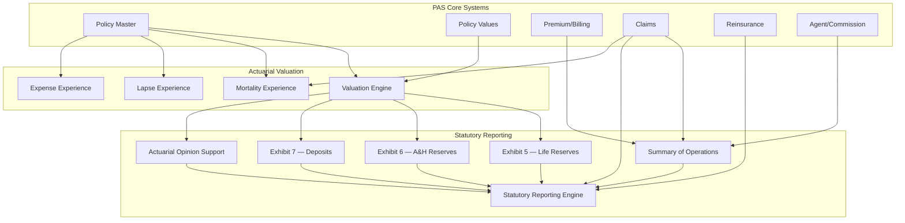

---

## 11. Regulatory Compliance Matrix

### 11.1 PAS Function to Regulatory Requirement Mapping

| PAS Function | NAIC Model Laws | Federal Regulations | State Regulations | Key Compliance Controls |
|-------------|----------------|--------------------|--------------------|------------------------|
| **New Business / Application** | #275 (Suitability), #613 (Replacement), #582 (Illustrations), #880 (Unfair Practices) | SEC prospectus delivery (VA/VUL), FINRA 2330 (VA suitability), DOL PTE 2020-02 (IRA) | State form/rate approval, state suitability, state replacement | Suitability documentation, replacement detection, illustration compliance, form version control |
| **Underwriting** | #880 (Unfair Discrimination) | GINA (genetic info), ADA | State unfair discrimination, state genetic testing prohibitions | Risk classification audit, prohibited factor screening, anti-discrimination controls |
| **Policy Issuance** | Standard Provisions Model, #808 (Nonforfeiture), #582 (Illustration) | SEC prospectus (VA/VUL), ESIGN/UETA | State form approval, readability, delivery requirements, free-look | Form version by state, readability scoring, delivery tracking, free-look monitoring |
| **Premium / Billing** | Standard Provisions (grace period) | IRS §7702 (definition of life insurance), §7702A (MEC testing) | State grace period, state premium tax | Grace period by state, 7702/MEC compliance, premium tax reporting |
| **Policy Values** | #808 (Nonforfeiture), #820 (Valuation) | IRS cost basis tracking, §72 taxation | State nonforfeiture requirements, state-specific valuation | Nonforfeiture calculation, cash value adequacy, cost basis tracking |
| **Loans** | Standard Provisions (policy loan) | IRS §72(e) (loans as distributions for MECs) | State loan interest rate caps | Loan interest calculation, MEC loan distribution treatment |
| **Withdrawals / Surrenders** | #808 (Nonforfeiture) | IRS §72 (taxation), 10% penalty (§72(q)/(t)), withholding | State surrender requirements | Tax calculation, withholding, 1099-R generation, surrender charge compliance |
| **Death Claims** | Standard Provisions, Unfair Claims Practices | IRS §101 (death benefit exclusion), estate tax | State claim settlement timelines, state unclaimed property | Claim timeline tracking, tax reporting, escheatment |
| **Annuity Payments** | #805 (Annuity Nonforfeiture) | IRS §72 (annuity taxation), RMD rules, withholding | State annuity regulations | Exclusion ratio, RMD calculation, withholding, 1099-R |
| **1035 Exchanges** | #613 (Replacement) | IRS §1035 (tax-free exchange) | State replacement requirements | Basis carryover, replacement detection, suitability |
| **Agent / Producer** | NAIC Producer Licensing Model, #880 | FINRA (variable products), DOL (fiduciary) | State licensing, CE, appointment | License verification, appointment tracking, CE monitoring |
| **Document Management** | #582 (Illustrations), #613 (Replacement) | SEC prospectus management | State form version control | Document version control, delivery tracking, retention |
| **Reporting** | MCAS, IRIS, RBC, ORSA | SEC 10-K/10-Q (VA/VUL), IRS 1099/5498, FinCEN SAR | State annual statement, state complaints | Statutory reporting, tax reporting, complaint reporting |
| **Data Security** | #668 (Insurance Data Security) | GLBA, HIPAA (if applicable), SOX (if public) | State privacy laws (CCPA, NYDFS 500, etc.) | Encryption, access control, audit trail, breach notification |
| **AML/KYC** | NAIC AML model | BSA, USA PATRIOT Act, FinCEN 31 CFR 1025 | State AML requirements | CIP, CDD, transaction monitoring, SAR filing |

### 11.2 Compliance Control Matrix by Regulation

| Regulation | Control Type | Control Description | PAS Component |
|-----------|-------------|-------------------|---------------|
| **Model #808 (Nonforfeiture)** | Preventive | Ensure cash values meet statutory minimums | Nonforfeiture calculation engine |
| **Model #808** | Detective | Periodic validation of in-force values vs. statutory minimums | Batch validation job |
| **Model #582 (Illustrations)** | Preventive | Illustration must pass self-support test | Illustration engine compliance check |
| **Model #582** | Detective | Annual review of illustrated vs. actual performance | In-force illustration comparison report |
| **Model #613 (Replacement)** | Preventive | Replacement detection at application | Application workflow replacement question |
| **Model #613** | Detective | Replacement pattern monitoring by agent | Agent activity monitoring dashboard |
| **Model #275 (Suitability/BI)** | Preventive | Suitability determination before recommendation | Suitability workflow; supervisor review |
| **Model #275** | Detective | Retrospective suitability review | Annual best interest compliance review |
| **IRS §7702** | Preventive | MEC testing at premium receipt; CVAT/GPT testing | §7702 compliance engine |
| **IRS §7702** | Detective | Annual re-testing for material changes | Annual compliance batch |
| **BSA/AML** | Preventive | CIP at application; OFAC screening | Identity verification service; screening service |
| **BSA/AML** | Detective | Transaction monitoring; SAR filing | Transaction monitoring engine; case management |
| **GLBA** | Preventive | Privacy notice delivery; opt-out processing | Notice delivery service; preference management |
| **Model #668** | Preventive | Encryption, access controls, MFA | Security infrastructure |
| **Model #668** | Detective | Incident detection; breach response | SIEM; incident response workflow |

---

## 12. Architecture

### 12.1 Regulatory Reporting Engine

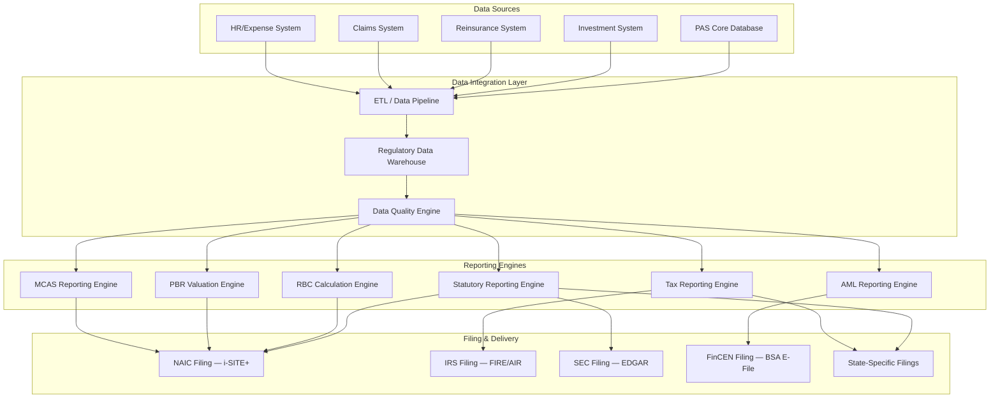

### 12.2 Compliance Monitoring Architecture

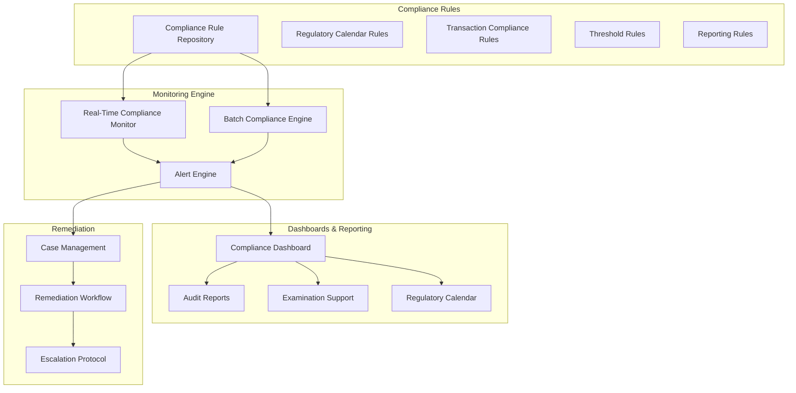

### 12.3 Audit Trail Design

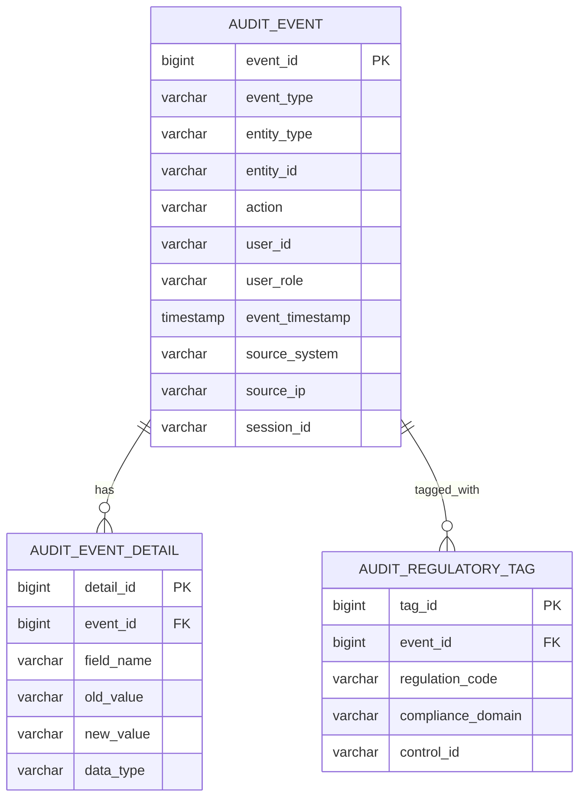

The audit trail must:

1. **Capture every data change** — all creates, updates, and deletes on policy-related data
2. **Be immutable** — audit records cannot be modified or deleted (append-only)
3. **Include before/after values** — for all changed fields
4. **Tag by regulation** — allow filtering by regulatory domain (AML, privacy, suitability, etc.)
5. **Support temporal queries** — reconstruct state of any entity at any point in time
6. **Meet retention requirements** — longest retention period across all applicable regulations (typically 7+ years after policy termination)

---

## 13. Implementation Guidance

### 13.1 Regulatory Compliance Architecture Principles

| Principle | Description | Rationale |
|-----------|-------------|-----------|
| **Regulation as Configuration** | Regulatory requirements should be externalized as configurable rules, not hard-coded | Regulations change; PAS must adapt without code changes |
| **Compliance by Design** | Build compliance controls into transaction processing, not as after-the-fact checks | Prevents non-compliant transactions from entering the system |
| **Defense in Depth** | Multiple layers of compliance controls (preventive + detective + corrective) | No single control is 100% effective |
| **Auditability** | Every compliance-relevant action must be logged with sufficient detail for regulatory examination | Regulatory examination readiness |
| **Data Lineage** | Trace every reported number back to source transaction data | Regulatory credibility; error identification |
| **Regulatory Calendar Management** | Centralized tracking of all regulatory filing deadlines | Prevent missed filings; coordinate cross-functional efforts |

### 13.2 Key Integration Points

| Integration | Direction | Protocol | Frequency | Data |
|------------|-----------|----------|-----------|------|
| **NAIC i-SITE+** | Outbound | XBRL/XML upload | Quarterly/Annual | Statutory statements |
| **IRS FIRE/AIR** | Outbound | Fixed-format file upload | Annual | 1099-R, 5498 |
| **SEC EDGAR** | Outbound | XBRL/HTML filing | Quarterly/Annual | 10-K, 10-Q (VA/VUL) |
| **FinCEN BSA E-File** | Outbound | XML upload | As needed | SARs, CTRs |
| **SERFF** | Bidirectional | Web portal (limited API) | As needed | Product filings |
| **NIPR** | Bidirectional | Web services | Real-time | Producer licensing |
| **State Departments** | Outbound | Various (state-specific) | Varies | State-specific filings |

### 13.3 Regulatory Change Management Process

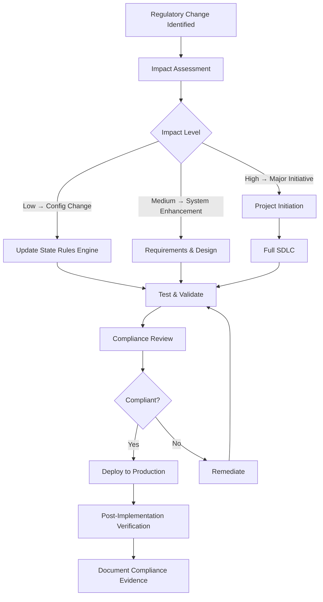

### 13.4 Regulatory Examination Preparedness

| Preparation Area | Actions | PAS Support |
|-----------------|---------|-------------|
| **Data Extraction** | Pre-build standard examination data extracts | Configurable data extraction API; standard report templates |
| **Transaction History** | Ability to produce complete history for any policy | Comprehensive audit trail; transaction log |
| **Document Retrieval** | Rapid retrieval of any policy document | Document management system with full-text search |
| **Timeline Construction** | Timeline of all events for a policy | Event timeline report |
| **Statistical Analysis** | Produce statistical reports on underwriting, claims, complaints | Analytics/BI layer with pre-built examination dashboards |
| **Sample Management** | Support examination sample selection and tracking | Sample tracking module; random selection capability |

---

## 14. Glossary

| Term | Definition |
|------|-----------|
| **ACL** | Authorized Control Level — the RBC level below which the commissioner may take control |
| **AML** | Anti-Money Laundering |
| **BSA** | Bank Secrecy Act |
| **CAL** | Company Action Level — the RBC level triggering company's obligation to submit corrective plan |
| **CDD** | Customer Due Diligence |
| **CIP** | Customer Identification Program |
| **CTE** | Conditional Tail Expectation — average of worst X% of outcomes |
| **DAC** | Deferred Acquisition Costs (GAAP concept; does not exist under SAP) |
| **DOL** | Department of Labor |
| **EDGAR** | Electronic Data Gathering, Analysis, and Retrieval (SEC filing system) |
| **ERM** | Enterprise Risk Management |
| **FINRA** | Financial Industry Regulatory Authority |
| **FIO** | Federal Insurance Office |
| **GAAP** | Generally Accepted Accounting Principles |
| **GLBA** | Gramm-Leach-Bliley Act |
| **GINA** | Genetic Information Nondiscrimination Act |
| **HIPAA** | Health Insurance Portability and Accountability Act |
| **IIPRC** | Interstate Insurance Product Regulation Commission |
| **IRIS** | Insurance Regulatory Information System |
| **LDTI** | Long-Duration Targeted Improvements (ASU 2018-12) |
| **MCAS** | Market Conduct Annual Statement |
| **MCL** | Mandatory Control Level — the RBC level triggering mandatory commissioner control |
| **MEC** | Modified Endowment Contract |
| **NAIC** | National Association of Insurance Commissioners |
| **NPR** | Net Premium Reserve (VM-20 component) |
| **ORSA** | Own Risk and Solvency Assessment |
| **PBR** | Principle-Based Reserving |
| **PTE** | Prohibited Transaction Exemption (DOL) |
| **RAL** | Regulatory Action Level |
| **RBC** | Risk-Based Capital |
| **SAP** | Statutory Accounting Principles |
| **SAR** | Suspicious Activity Report |
| **SEC** | Securities and Exchange Commission |
| **SERFF** | System for Electronic Rate and Form Filing |
| **SSAP** | Statement of Statutory Accounting Principles |
| **TAC** | Total Adjusted Capital |
| **VM** | Valuation Manual |

---

## 15. References

### 15.1 NAIC Publications

1. **NAIC Accounting Practices and Procedures Manual** — Statutory accounting guidance
2. **NAIC Valuation Manual** — PBR requirements (VM-20, VM-21, VM-22, VM-30, VM-31, VM-50)
3. **NAIC Risk-Based Capital Instructions — Life** — RBC calculation methodology
4. **NAIC Own Risk and Solvency Assessment (ORSA) Guidance Manual**
5. **NAIC Financial Condition Examiners Handbook**
6. **NAIC Market Regulation Handbook**
7. **NAIC Model Laws, Regulations, and Guidelines** — Available at naic.org

### 15.2 NAIC Model Laws Referenced

| Model # | Title |
|---------|-------|
| #245 | Annuity Disclosure Model Regulation |
| #275 | Suitability in Annuity Transactions Model Regulation |
| #312 | Risk-Based Capital (RBC) for Insurers Model Act |
| #440 | Insurance Holding Company System Regulatory Act |
| #505 | Risk Management and Own Risk and Solvency Assessment Model Act |
| #582 | Life Insurance Illustrations Model Regulation |
| #613 | Life Insurance and Annuities Replacement Model Regulation |
| #668 | Insurance Data Security Model Law |
| #805 | Standard Nonforfeiture Law for Individual Deferred Annuities |
| #808 | Standard Nonforfeiture Law for Life Insurance |
| #820 | Standard Valuation Law |
| #880 | Unfair Trade Practices Act |

### 15.3 Federal Laws and Regulations

1. **Securities Act of 1933** — 15 U.S.C. §§ 77a-77aa
2. **Investment Company Act of 1940** — 15 U.S.C. §§ 80a-1 to 80a-64
3. **Bank Secrecy Act** — 31 U.S.C. § 5311 et seq.; 31 CFR Chapter X
4. **USA PATRIOT Act** — Pub. L. 107-56 (2001)
5. **ERISA** — 29 U.S.C. §§ 1001-1461
6. **SECURE Act** — Pub. L. 116-94 (2019), Division O
7. **SECURE 2.0 Act** — Pub. L. 117-328 (2022), Division T
8. **CARES Act** — Pub. L. 116-136 (2020)
9. **Gramm-Leach-Bliley Act** — Pub. L. 106-102 (1999)
10. **Dodd-Frank Act** — Pub. L. 111-203 (2010), Title V

### 15.4 Industry Standards

1. **SOA (Society of Actuaries)** — Experience studies, mortality tables, research
2. **AAA (American Academy of Actuaries)** — Practice notes, economic scenario generator
3. **ACLI (American Council of Life Insurers)** — Industry advocacy, data, research

---

*Article 35 of the PAS Architect's Encyclopedia. Last updated: 2026. This article is for educational and architectural reference purposes. Consult current regulatory sources, actuarial advisors, and legal counsel for compliance decisions.*
