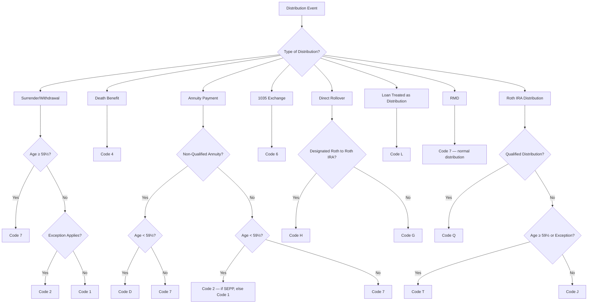
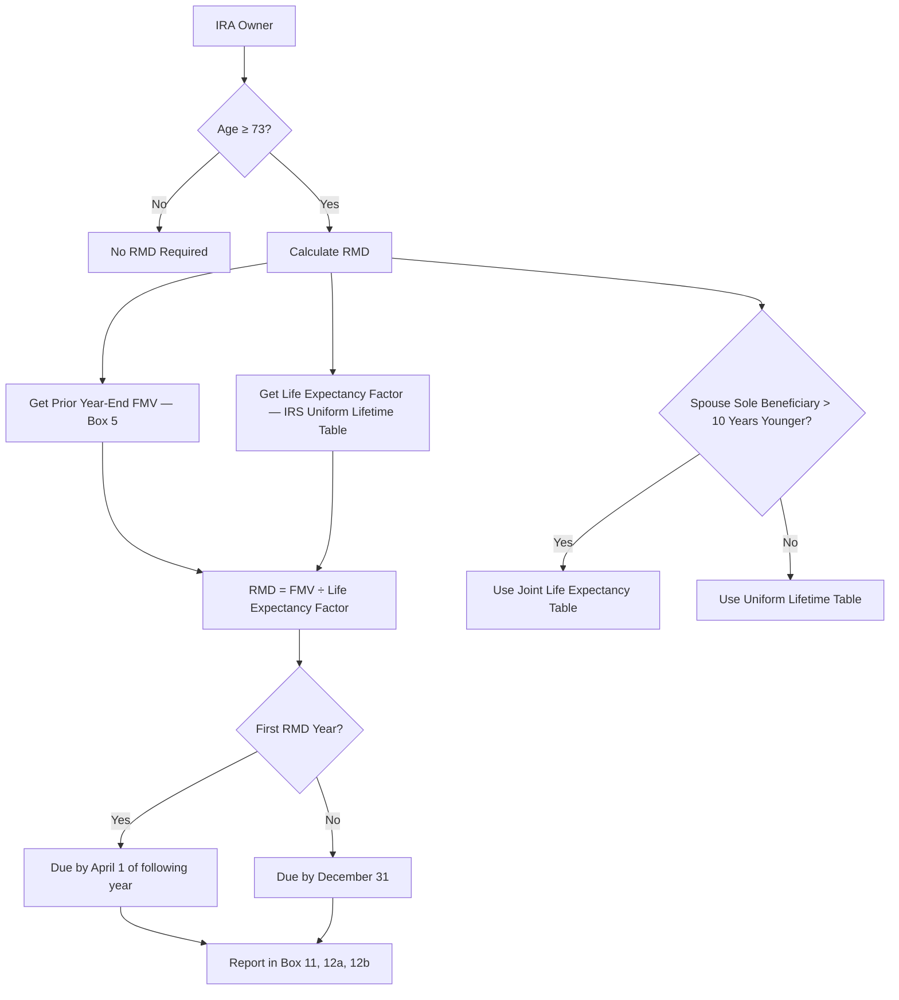
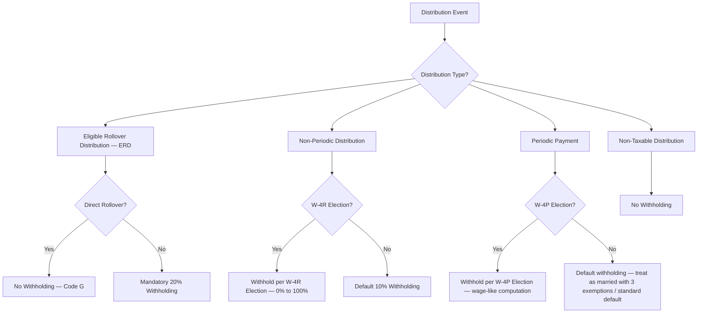
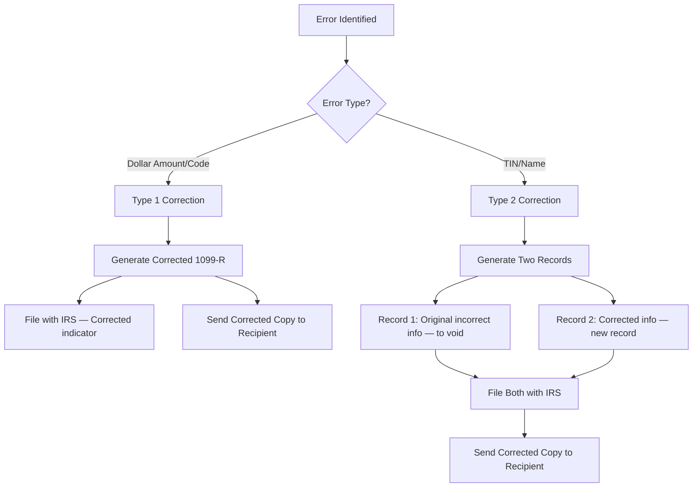
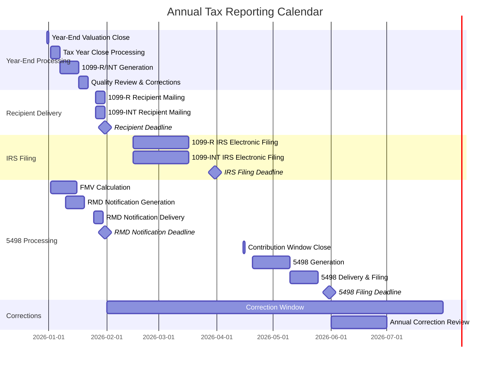
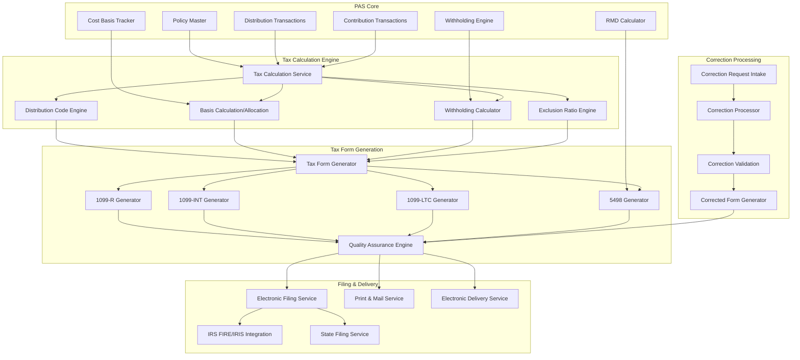
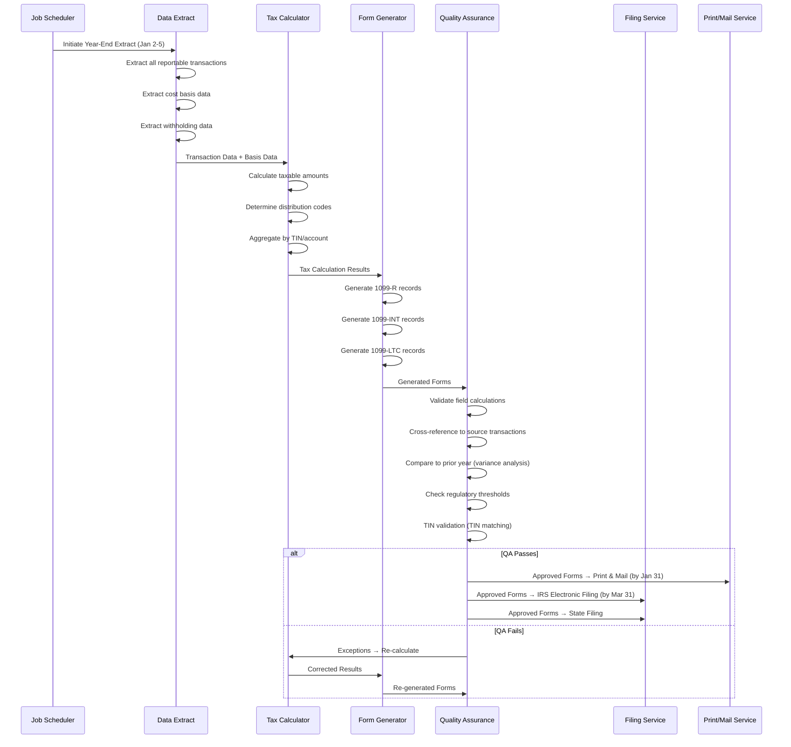

# Article 36: Tax Reporting — 1099-R, 1099-INT, 5498

## PAS Architect's Encyclopedia — Life Insurance Policy Administration Systems

---

## Table of Contents

1. [Introduction](#1-introduction)
2. [IRS Form 1099-R — Distributions](#2-irs-form-1099-r--distributions)
3. [Distribution Codes (Box 7)](#3-distribution-codes-box-7)
4. [1099-R Generation Logic](#4-1099-r-generation-logic)
5. [IRS Form 5498 — IRA Contribution Information](#5-irs-form-5498--ira-contribution-information)
6. [IRS Form 1099-INT — Interest Income](#6-irs-form-1099-int--interest-income)
7. [IRS Form 1099-LTC — Long-Term Care Benefits](#7-irs-form-1099-ltc--long-term-care-benefits)
8. [Cost Basis Tracking](#8-cost-basis-tracking)
9. [Withholding Management](#9-withholding-management)
10. [Filing Requirements](#10-filing-requirements)
11. [Tax Reporting Calendar](#11-tax-reporting-calendar)
12. [State Tax Reporting](#12-state-tax-reporting)
13. [Data Model for Tax Reporting](#13-data-model-for-tax-reporting)
14. [Sample 1099-R Records](#14-sample-1099-r-records)
15. [Architecture](#15-architecture)
16. [IRS Electronic Filing Format Specifications](#16-irs-electronic-filing-format-specifications)
17. [Implementation Guidance](#17-implementation-guidance)
18. [Glossary](#18-glossary)
19. [References](#19-references)

---

## 1. Introduction

Tax reporting is one of the most operationally critical and error-sensitive functions of a life insurance and annuity PAS. The IRS requires insurers to report distributions, contributions, and interest income to both the payee and the IRS. Errors in tax reporting result in IRS penalties, customer complaints, and reputational damage.

This article provides an exhaustive reference for PAS architects covering the full lifecycle of tax reporting: form specifications, distribution code logic, cost basis calculations, withholding management, electronic filing, state reporting, and the architecture required to implement a robust tax reporting subsystem.

### 1.1 Applicable Tax Forms

| Form | Purpose | Applicable Products | Filing Deadline (to IRS) | Recipient Copy Deadline |
|------|---------|-------------------|-------------------------|------------------------|
| **1099-R** | Distributions from pensions, annuities, retirement/profit-sharing plans, IRAs, insurance contracts | Life insurance (taxable events), annuities (all distributions), qualified plan distributions | March 31 (electronic) | January 31 |
| **5498** | IRA contribution information | IRA annuities, IRA life insurance | May 31 | May 31 |
| **1099-INT** | Interest income | Retained asset accounts, policy dividends left to accumulate interest, settlement option interest | March 31 (electronic) | January 31 |
| **1099-LTC** | Long-term care and accelerated death benefits | LTC policies, accelerated death benefit riders, LTC riders on life policies | March 31 (electronic) | January 31 |

### 1.2 Regulatory Authority

- **Internal Revenue Code (IRC)**: Sections 72, 101, 402, 403, 408, 408A, 1035, 3405, 6041, 6047, 6050S
- **Treasury Regulations**: 26 CFR §§ 1.72, 1.1035, 31.3405, 1.6047
- **IRS Publications**: Publication 575 (Pension and Annuity Income), Publication 590-A/B (IRAs), Publication 939 (General Rule for Pensions/Annuities)
- **IRS Instructions**: Instructions for Forms 1099-R and 5498, Instructions for Form 1099-INT
- **Revenue Procedures**: Rev. Proc. 2024-XX (electronic filing requirements)
- **IRS Notice 2024-XX**: Various technical guidance

---

## 2. IRS Form 1099-R — Distributions

### 2.1 Purpose and Applicability

Form 1099-R is used to report distributions of $10 or more from:
- Pensions and annuities
- Profit-sharing and retirement plans
- IRAs (traditional, Roth, SEP, SIMPLE)
- Insurance contracts (if taxable)
- Charitable gift annuities

**Filing Threshold:** $10 or more in distributions during the calendar year (aggregated by TIN and account type).

### 2.2 Box-by-Box Field Specification

| Box | Field Name | Description | Rules / Guidance |
|-----|-----------|-------------|-----------------|
| **Box 1** | Gross Distribution | Total amount distributed before income tax or other deductions | Includes all distributions: cash, FMV of property, amounts withheld for tax. For life insurance, includes taxable gain on surrender. For annuities, includes total annuity payment. |
| **Box 2a** | Taxable Amount | The taxable portion of the distribution | For fully taxable distributions, equals Box 1. For partially taxable (return of basis), equals Box 1 minus excludable amount. For nontaxable distributions (Roth qualified, return of after-tax contributions), may be $0. |
| **Box 2b** | Taxable Amount Not Determined / Total Distribution | Two checkboxes: (1) Taxable amount not determined (2) Total distribution | Check "taxable amount not determined" if payer cannot determine taxable amount (e.g., basis information not available). Check "total distribution" if entire account balance is distributed. |
| **Box 3** | Capital Gain (included in Box 2a) | Portion eligible for capital gains treatment | Applies only to participants who were in plan before 1974 and qualifying lump-sum distributions. Rare in life/annuity context. |
| **Box 4** | Federal Income Tax Withheld | Amount of federal income tax withheld from distribution | Per IRC §3405; includes mandatory 20% for eligible rollover distributions, voluntary withholding for periodic/non-periodic payments |
| **Box 5** | Employee Contributions/Designated Roth Contributions or Insurance Premiums | Employee's after-tax contributions, designated Roth contributions, or insurance premiums | For life insurance: PS-58/Table 2001 costs (cost of current life insurance protection). For annuities: after-tax contributions (investment in the contract). |
| **Box 6** | Net Unrealized Appreciation in Employer's Securities | NUA in employer stock distributed from qualified plan | Rarely applicable for insurance products |
| **Box 7** | Distribution Code(s) | One or two digit codes identifying the type of distribution | See Section 3 for detailed code reference |
| **Box 8** | Other | Percentage of distribution allocable to employee's basis recovery | Used for annuity contracts: the percentage of the distribution that represents the employee's investment in the contract |
| **Box 9a** | Your Percentage of Total Distribution | Recipient's percentage of total distribution (if more than one recipient) | Used when distribution is split among beneficiaries |
| **Box 9b** | Total Employee Contributions | Total employee contributions to the plan | Used to help recipient calculate taxable amount |
| **Box 10** | Amount Allocable to IRR Within 5 Years | Amount allocable to in-plan Roth rollover contributions made within 5 years | For Roth in-plan conversions within 5-year period |
| **Box 11** | 1st Year of Designated Roth Contribution | First year designated Roth contributions were made to this plan | Helps determine 5-year aging period |
| **Box 12** | State Tax Withheld | Amount of state income tax withheld | State-specific withholding |
| **Box 13** | State/Payer's State No. | State and payer's state identification number | Two entries allowed (for two states) |
| **Box 14** | State Distribution | Amount of distribution subject to state income tax | May differ from Box 1 |
| **Box 15** | Local Tax Withheld | Local tax withheld | For applicable local jurisdictions |
| **Box 16** | Name of Locality | Local jurisdiction name | If Box 15 is reported |
| **Box 17** | Local Distribution | Distribution amount subject to local tax | If Box 15 is reported |

### 2.3 Form 1099-R Variants

| Variant | Use |
|---------|-----|
| **Standard 1099-R** | All reportable distributions |
| **Corrected 1099-R** | Corrections to previously filed 1099-R (checkbox: CORRECTED) |
| **Void 1099-R** | Void a previously filed 1099-R |

---

## 3. Distribution Codes (Box 7)

### 3.1 Complete Distribution Code Reference

| Code | Description | Applicable Situations | 10% Early Distribution Penalty (§72(q)/(t))? | Common Errors |
|------|-------------|----------------------|----------------------------------------------|---------------|
| **1** | Early distribution, no known exception | Distribution before age 59½ from qualified plan, IRA, or annuity (non-qualified); no exception applies | **Yes** | Using Code 1 when an exception applies (should be Code 2) |
| **2** | Early distribution, exception applies (not disability, not death) | Distribution before age 59½ with known exception: SEPP (72(t)), medical expenses, first-time home, birth/adoption, disaster, domestic abuse | **No** (exception applies) | Failing to verify exception qualification; using Code 2 without documentation |
| **3** | Disability | Distribution due to disability per IRC §72(m)(7) | **No** | Using Code 3 without physician certification of disability |
| **4** | Death | Distribution to beneficiary after death of contract owner/participant | **No** | Using Code 4 for living insured; failing to use Code 4 for death benefit payments |
| **5** | Prohibited transaction | Distribution from IRA or Roth IRA resulting from prohibited transaction under §4975 | **Depends** | Rare; typically only applicable to self-directed IRAs |
| **6** | Section 1035 exchange | Tax-free exchange of life insurance, endowment, or annuity contract per IRC §1035 | **No** (tax-free exchange) | Failing to verify 1035 exchange qualification; reporting as taxable distribution |
| **7** | Normal distribution | Distribution after age 59½ (or normal retirement age for qualified plans); any distribution from non-qualified annuity not fitting other codes | **No** | Using Code 7 for distribution before age 59½ (should be Code 1 or 2) |
| **8** | Excess contributions plus earnings/excess deferrals (and/or earnings) taxable in prior year | Corrective distribution of excess from IRA, 401(k), 403(b) | **Depends on timing** | Timing of corrective distribution relative to deadline |
| **9** | Cost of current life insurance protection | PS-58/Table 2001 costs in a qualified plan | **No** | Amount may not match actual term cost |
| **A** | May be eligible for 10-year tax option | Lump-sum distribution from qualified plan; participant born before 1/1/1936 | **No** | Very rare; declining applicability |
| **B** | Designated Roth account distribution (not qualified) | Non-qualified distribution from designated Roth account in 401(k)/403(b) | **Possibly** | Confusing with Roth IRA |
| **D** | Annuity payments from non-qualified annuity that may be subject to §72(q) penalty | Annuity payments (annuitization) before age 59½ from non-qualified annuity | **Depends** (may be excepted if substantially equal) | Should be Code D only for annuitized payments; use Code 1 for withdrawals |
| **E** | Distributions under Employee Plans Compliance Resolution System (EPCRS) | Corrective distributions under EPCRS | **No** | |
| **F** | Charitable gift annuity | Payments from a charitable gift annuity | **No** | |
| **G** | Direct rollover of a distribution to a qualified plan, 403(b), governmental 457(b), or IRA | Direct rollover (trustee-to-trustee transfer) | **No** (not taxable event) | Incorrectly reporting as taxable distribution |
| **H** | Direct rollover of a designated Roth account distribution to a Roth IRA | Roth 401(k)/403(b) to Roth IRA rollover | **No** | |
| **J** | Early distribution from a Roth IRA | Roth IRA distribution before age 59½ and before 5-year aging | **Possibly** (on earnings only) | Ordering rules: contributions first (tax/penalty-free), then conversions, then earnings |
| **K** | Distribution of IRA assets not having a readily available FMV | Self-directed IRA with non-publicly traded assets | **Depends** | |
| **L** | Loans treated as deemed distributions | Plan loan that exceeds limits or defaulted loan | **Possibly** | Loan offset vs. deemed distribution distinction |
| **M** | Qualified plan loan offset | Distribution of plan loan offset when plan terminates or participant separates from service | **Possibly** | Extended rollover period (60 days from due date of return for the year) |
| **N** | Recharacterized IRA contribution made for current year | IRA contribution recharacterized as different type (traditional ↔ Roth) | **No** | No longer applicable after Tax Cuts and Jobs Act eliminated Roth recharacterization of conversions (contributions may still be recharacterized) |
| **P** | Excess contributions plus earnings/excess deferrals (and/or earnings) taxable in current year | Same as Code 8 but taxable in current year | **Depends** | |
| **Q** | Qualified distribution from a Roth IRA | Roth IRA distribution meeting 5-year rule and age 59½ (or disability/death) | **No** (entirely tax-free) | Verifying 5-year aging requirement |
| **R** | Recharacterized IRA contribution made for prior year | Prior-year contribution recharacterization | **No** | |
| **S** | Early distribution from a SIMPLE IRA in first 2 years, no known exception | SIMPLE IRA distribution within first 2 years of participation | **Yes** (25% penalty instead of 10%) | Must track SIMPLE IRA participation start date |
| **T** | Roth IRA distribution, exception applies | Roth IRA distribution where 10% penalty exception applies but distribution is not qualified | **No** (exception applies) | |
| **U** | Dividend distribution from ESOP | Not applicable to life/annuity | **No** | |
| **W** | Charges or payments for purchasing qualified long-term care insurance contracts from a retirement plan | QLAC purchase | **No** | |

### 3.2 Combination Codes

Certain codes may be combined in Box 7:

| Primary Code | May Combine With | Example |
|-------------|-----------------|---------|
| 1 | B | Early non-qualified distribution from designated Roth account |
| 2 | B | Early distribution from designated Roth with exception |
| 4 | B, G, H | Death distribution from designated Roth; direct rollover of death benefit |
| 7 | B | Normal distribution from designated Roth account |
| G | B | Direct rollover of designated Roth |
| P | 1, 2, 4, B | Excess contributions with earnings — various situations |

### 3.3 Distribution Code Decision Tree



---

## 4. 1099-R Generation Logic

### 4.1 Transaction-to-1099-R Mapping

The 1099-R generation process maps PAS transactions to 1099-R fields:

| PAS Transaction | Box 1 (Gross) | Box 2a (Taxable) | Box 7 (Code) | Special Considerations |
|----------------|---------------|-------------------|--------------|----------------------|
| **Full Surrender — Non-Qualified** | Surrender value paid | Gain = Surrender value - Cost basis | 7 (age 59½+), 1 (age <59½) | Cost basis = investment in the contract |
| **Full Surrender — IRA** | Surrender value paid | = Box 1 (unless basis in non-deductible IRA) | 7 (age 59½+), 1 (age <59½) | Recipient reports basis on Form 8606 |
| **Partial Withdrawal — Non-Qualified Annuity** | Amount withdrawn | Gain portion (LIFO for annuities — earnings first) | 7 or 1 per age | IRC §72(e)(2) — interest first for deferred annuities |
| **Partial Withdrawal — Non-Qualified Life** | Amount withdrawn | Gain portion (FIFO for life insurance — basis first) | 7 or 1 per age | IRC §72(e)(5) — basis first for non-MEC life insurance |
| **Partial Withdrawal — MEC** | Amount withdrawn | Gain portion (LIFO — earnings first) | 7 or 1 per age | MEC treated like annuity for distribution taxation |
| **Partial Withdrawal — IRA** | Amount withdrawn | = Box 1 (unless non-deductible) | 7 or 1 per age | Form 8606 for basis tracking |
| **Death Benefit — Life Insurance** | Taxable gain (if any) | Gain = Death benefit - Premiums paid (if gain exists; usually $0 under §101) | 4 | Most death benefits fully excludable under §101(a); report only if gain on surrender value component |
| **Death Benefit — Annuity** | Annuity value paid to beneficiary | Value - Cost basis | 4 | Stretch or 5-year/10-year distribution rules apply |
| **1035 Exchange** | Full account value exchanged | $0 (tax-free) | 6 | Basis carries over to new contract; no taxable event |
| **RMD Payment — IRA** | RMD amount paid | = Box 1 (unless non-deductible contributions) | 7 | Must track whether RMD has been satisfied |
| **Annuity Payment — Non-Qualified** | Periodic payment amount | Payment × (1 - Exclusion Ratio) | 7 (age 59½+) or D (age <59½) | Exclusion ratio per §72(b) |
| **Annuity Payment — Qualified** | Periodic payment amount | = Box 1 (unless after-tax contributions) | 7 | Simplified Method per §72(d) |
| **Loan Treated as Distribution** | Loan amount | Loan amount (fully taxable) | L | Applies when loan exceeds limits or policy is MEC |
| **Policy Dividend — Taxable Portion** | Amount exceeding basis | Taxable portion only | 7 | Report only the amount exceeding cumulative premiums paid |
| **Roth IRA Distribution — Qualified** | Amount distributed | $0 | Q | 5-year rule satisfied + qualifying event |
| **Roth IRA Distribution — Non-Qualified** | Amount distributed | Earnings portion (ordering rules apply) | J (early) or T (exception) | Ordering: contributions → conversions → earnings |

### 4.2 Aggregation Rules

1099-R forms are aggregated by:

| Aggregation Dimension | Rule |
|----------------------|------|
| **Taxpayer Identification Number (TIN)** | Separate 1099-R per TIN per contract/account |
| **Account Type** | Separate 1099-R for IRA, Roth IRA, qualified plan, non-qualified |
| **Distribution Code** | If multiple distribution types occur in same year, may need separate 1099-R for each code |
| **Rollover vs. Non-Rollover** | Direct rollover (Code G) reported on separate 1099-R from taxable distribution |
| **Federal/State Withholding** | Multiple 1099-Rs may be needed if withholding applies to some distributions but not others |

### 4.3 Cost Basis Calculation and Allocation

```mermaid
flowchart TD
    A[Determine Contract Type] --> B{Non-Qualified Life Insurance?}
    B -- Yes --> C{Is MEC?}
    C -- No --> D[FIFO: Basis recovered first — IRC §72(e)(5)(A)]
    C -- Yes --> E[LIFO: Earnings distributed first — IRC §72(e)(2)]
    B -- No --> F{Non-Qualified Annuity?}
    F -- Yes --> E
    F -- No --> G{Traditional IRA?}
    G -- Yes --> H[Fully taxable unless non-deductible contributions — Form 8606]
    G -- No --> I{Roth IRA?}
    I -- Yes --> J[Ordering rules: Contributions → Conversions → Earnings]
    I -- No --> K{Qualified Plan?}
    K -- Yes --> L[Generally fully taxable; after-tax basis via Simplified Method]
```

### 4.4 Gain/Loss Determination

| Contract Type | Gain Calculation | Basis Definition |
|--------------|-----------------|-----------------|
| **Non-Qualified Annuity** | Accumulation Value − Investment in the Contract | Total premiums paid (after-tax) minus any prior tax-free return of basis |
| **Non-Qualified Life (non-MEC)** | Cash Surrender Value − Investment in the Contract | Total premiums paid minus dividends received minus any prior tax-free return of basis |
| **MEC** | Cash Value − Investment in the Contract | Same as non-MEC life, but taxation order is LIFO |
| **IRA** | N/A (all distributions taxable unless non-deductible) | Non-deductible contributions tracked on Form 8606 |
| **Roth IRA** | Earnings = FMV − Total contributions − Converted amounts | Contribution basis tracked per ordering rules |

### 4.5 Withholding Tracking

The PAS must track withholding at the transaction level and aggregate for 1099-R reporting:

| Withholding Type | Trigger | Rate | Box 4 Reporting |
|-----------------|---------|------|-----------------|
| **Mandatory 20%** | Eligible rollover distribution not directly rolled over | 20% of taxable amount | Include in Box 4 |
| **Voluntary — Periodic** | W-4P election; treated as wages for withholding purposes | Per W-4P tables (married, single, etc.) | Include in Box 4 |
| **Voluntary — Non-Periodic** | W-4R election or default 10% | Default 10%; payee may elect 0%-100% | Include in Box 4 |
| **Non-Resident Alien** | Distribution to NRA | 30% (or treaty rate) | Reported on 1042-S, not 1099-R |
| **Backup Withholding** | Missing or incorrect TIN | 24% | Include in Box 4 |

---

## 5. IRS Form 5498 — IRA Contribution Information

### 5.1 Purpose

Form 5498 reports IRA contributions, rollovers, Roth conversions, recharacterizations, and fair market value to both the IRS and the IRA owner.

### 5.2 Filing Timeline

| Action | Deadline |
|--------|----------|
| **Report contributions for prior year** | May 31 of following year (e.g., 2025 contributions reported by May 31, 2026) |
| **January 31 FMV statement** | January 31 (optional: can be satisfied by timely 5498) |
| **RMD notification** | January 31 (for IRA owners who must take RMD in the year) |

### 5.3 Box-by-Box Specification

| Box | Field Name | Description | Rules |
|-----|-----------|-------------|-------|
| **Box 1** | IRA Contributions | Regular IRA contributions (traditional IRA) | Annual limit: $7,000 (2024); $8,000 if age 50+ |
| **Box 2** | Rollover Contributions | Amounts rolled over from other plans/IRAs | 60-day rollover rule; one-per-year rule for IRA-to-IRA |
| **Box 3** | Roth IRA Conversion Amount | Amount converted from traditional IRA to Roth IRA | Taxable event; reported on 1099-R with Code 2 or 7 |
| **Box 4** | Recharacterized Contributions | Contributions recharacterized from one IRA type to another | Traditional → Roth or Roth → Traditional recharacterization |
| **Box 5** | Fair Market Value of Account | FMV of IRA as of December 31 | Used for RMD calculation (prior-year FMV) |
| **Box 6** | Life Insurance Cost Included in Box 1 | PS-58/Table 2001 costs for life insurance in IRA | Rare; life insurance in IRA is restricted |
| **Box 7** | Checkbox: IRA | Indicates account is an IRA | Standard checkbox |
| **Box 7** | Checkbox: SEP | Indicates account is a SEP IRA | |
| **Box 7** | Checkbox: SIMPLE | Indicates account is a SIMPLE IRA | |
| **Box 7** | Checkbox: Roth IRA | Indicates account is a Roth IRA | |
| **Box 8** | SEP Contributions | Employer SEP contributions | Separate from employee IRA contributions |
| **Box 9** | SIMPLE Contributions | SIMPLE IRA contributions (employer and employee) | |
| **Box 10** | Roth IRA Contributions | Regular Roth IRA contributions | Annual limit: $7,000 (2024); $8,000 if age 50+ |
| **Box 11** | Check if RMD for Next Year | Indicates that RMD is required for the following year | Must check if IRA owner will be 73+ in next year (or 75+ after 2032) |
| **Box 12a** | RMD Date | Date by which RMD must be taken | April 1 of year following year owner turns 73 (first RMD); December 31 thereafter |
| **Box 12b** | RMD Amount | Calculated RMD amount for next year | Based on prior year-end FMV ÷ life expectancy factor |
| **Box 13a** | Postponed/Late Contribution | Contributions made after normal deadline under special provisions | Disaster relief, military deployment |
| **Box 13b** | Year of Contribution | Tax year to which postponed contribution relates | |
| **Box 13c** | Code | Code for postponed contribution type | |
| **Box 14a** | Repayments | Qualified disaster, reservist, birth/adoption distributions repaid | |
| **Box 14b** | Code for Repayment | Type code for repayment | |
| **Box 15a** | FMV of Certain Specified Assets | FMV of assets that are hard to value | Self-directed IRA assets |
| **Box 15b** | Code for Specified Assets | Asset type code | |

### 5.4 RMD Calculation Logic



**RMD Age Transition:**

| Birth Year | RMD Start Age | Authority |
|-----------|---------------|-----------|
| Before 7/1/1949 | 70½ | Pre-SECURE Act |
| 7/1/1949 - 12/31/1950 | 72 | SECURE Act |
| 1/1/1951 - 12/31/1959 | 73 | SECURE 2.0 Act |
| 1/1/1960 and later | 75 | SECURE 2.0 Act |

### 5.5 PAS Requirements for 5498

1. **Contribution Tracking**: Track all contributions by type (regular, rollover, conversion, SEP, SIMPLE, Roth) with tax year designation
2. **FMV Calculation**: Calculate fair market value as of December 31 for each IRA
3. **RMD Calculation**: Determine RMD requirement and calculate amount
4. **RMD Notification**: Generate and deliver RMD notification by January 31
5. **Aggregation**: One 5498 per IRA per TIN per tax year

---

## 6. IRS Form 1099-INT — Interest Income

### 6.1 Applicability in Life Insurance

| Source of Interest | 1099-INT Required? | Box |
|-------------------|-------------------|-----|
| **Retained Asset Account (RAA)** | Yes — interest earned on death benefit proceeds held in RAA | Box 1 |
| **Policy Dividends Left to Accumulate** | Yes — interest credited on accumulated dividends | Box 1 |
| **Settlement Option Interest** | Yes — interest component of settlement option payments | Box 1 |
| **Premium Deposit Fund Interest** | Yes — if premium deposit earns interest | Box 1 |
| **Late Claim Payment Interest** | Yes — statutory interest on late claim payments | Box 1 |

### 6.2 Box Specification (Key Boxes for Insurance)

| Box | Field Name | Description |
|-----|-----------|-------------|
| **Box 1** | Interest Income | Total taxable interest paid |
| **Box 2** | Early Withdrawal Penalty | Penalty for early withdrawal from time deposit | Rarely applicable for insurance |
| **Box 3** | Interest on U.S. Savings Bonds and Treasury Obligations | Not applicable for insurance |
| **Box 4** | Federal Income Tax Withheld | Backup withholding, if applicable |
| **Box 8** | Tax-Exempt Interest | Tax-exempt interest | Rarely applicable for insurance |
| **Box 10** | Market Discount | Not applicable for insurance |
| **Box 13** | Bond Premium | Not applicable for insurance |
| **Box 16** | State Tax Withheld | State withholding on interest |
| **Box 17** | State/Payer's State No. | State ID |
| **Box 18** | State Income | Interest allocable to state |

### 6.3 Filing Threshold

- Report interest of **$10 or more** during the calendar year
- Report **any amount** if backup withholding was applied

---

## 7. IRS Form 1099-LTC — Long-Term Care Benefits

### 7.1 Applicability

Form 1099-LTC is required for:
- Payments under a **qualified long-term care insurance contract** (per IRC §7702B)
- Payments under a **life insurance contract** as **accelerated death benefits** (per IRC §101(g))
- LTC rider benefits on life insurance policies

### 7.2 Box Specification

| Box | Field Name | Description |
|-----|-----------|-------------|
| **Box 1** | Gross Long-Term Care Benefits Paid | Total LTC benefits paid during the year |
| **Box 2** | Accelerated Death Benefits Paid | Accelerated death benefits paid during the year |
| **Box 3** | Checkbox: Per Diem or Other Periodic Payments | Check if payments are per diem (not reimbursement) |
| **Box 4** | Checkbox: Reimbursed Amount | Check if payments reimburse actual expenses |
| **Box 5** | Date Insured Was Certified as Chronically Ill | Date of most recent certification |

### 7.3 Tax Treatment

| Payment Type | Tax Treatment | Daily Limit (2024) |
|-------------|--------------|---------------------|
| **Per Diem Payments** | Excludable up to per diem limit; excess is taxable | $410/day ($149,650/year) — indexed annually |
| **Reimbursement Payments** | Excludable to extent of actual LTC expenses incurred | No dollar limit; limited to actual expenses |
| **Accelerated Death Benefits — Terminally Ill** | Fully excludable under §101(g)(1) | No limit |
| **Accelerated Death Benefits — Chronically Ill** | Same rules as LTC payments (per diem or reimbursement) | Per diem limit applies |

---

## 8. Cost Basis Tracking

### 8.1 Investment in the Contract

The **investment in the contract** (cost basis) is a critical element for tax reporting. It determines the non-taxable portion of distributions.

#### 8.1.1 Basis Components

| Component | Treatment | Example |
|-----------|-----------|---------|
| **After-Tax Premiums Paid** | Increase basis | $100,000 in premiums paid on non-qualified annuity |
| **Dividends Applied to Reduce Premium** | Decrease basis | Participating whole life: $2,000 dividend applied to premium |
| **Dividends Received in Cash** | No effect on basis (already taxed or return of basis) | — |
| **Tax-Free Return of Basis (Withdrawals)** | Decrease basis | Non-MEC life withdrawal: $5,000 return of basis |
| **1035 Exchange — Transferred Basis** | Carry over basis from old contract | Old contract basis: $80,000 → carried to new contract |
| **Cost of Insurance (Table 2001/PS-58)** | Increase basis for qualified plans | PS-58 costs reported on 1099-R Code 9 |
| **Prior Taxable Income Recognized** | Increase basis | Annuity: income previously recognized on partial annuitization |

#### 8.1.2 Basis Calculation Formula

```
Investment in the Contract = 
    Total After-Tax Premiums Paid
  + PS-58/Table 2001 Costs (qualified plans only)
  + 1035 Exchange Carryover Basis
  - Tax-Free Return of Basis (prior withdrawals from non-MEC life)
  - Dividends Received Tax-Free
  - Prior Non-Taxable Exclusion Amounts (annuitization)
  - Any Loans Treated as Distributions (MEC)
```

### 8.2 1035 Exchange Basis Carryover

When a contract is exchanged under IRC §1035:

| Exchange Type | Permissible? | Basis Treatment |
|--------------|-------------|-----------------|
| Life → Life | Yes | Basis carries over |
| Life → Annuity | Yes | Basis carries over |
| Annuity → Annuity | Yes | Basis carries over |
| Annuity → Life | **No** | Not a valid 1035 exchange |
| Endowment → Annuity | Yes | Basis carries over |
| LTC → LTC | Yes | Basis carries over |
| Life/Annuity → LTC | Yes (per PPA 2006) | Basis carries over |

**PAS Impact:** The PAS must:
1. Record the incoming basis from the old contract during 1035 exchange processing
2. Verify the exchange is a valid 1035 combination
3. Adjust the new contract's basis accordingly
4. Generate 1099-R with Code 6 for the exchanged contract
5. Track partial 1035 exchanges (portion exchanged; basis allocation)

### 8.3 Partial Withdrawal Basis Allocation

#### 8.3.1 Non-MEC Life Insurance (FIFO — Basis First)

```
Tax-Free Amount = lesser of:
  (a) Withdrawal amount
  (b) Remaining basis in the contract

Taxable Amount = Withdrawal amount - Tax-Free Amount
```

#### 8.3.2 Non-Qualified Annuity / MEC (LIFO — Earnings First)

```
Gain in Contract = Current Value - Remaining Basis

Taxable Amount = lesser of:
  (a) Withdrawal amount
  (b) Gain in contract

Tax-Free Amount = Withdrawal amount - Taxable Amount
```

#### 8.3.3 Exclusion Ratio for Annuity Payments

For annuitized payments from non-qualified annuities:

```
Exclusion Ratio = Investment in the Contract / Expected Return

Where:
  Expected Return = Annual Annuity Payment × Expected Number of Payments
  Expected Number of Payments = from IRS Life Expectancy Tables (Publication 939)

Tax-Free Portion per Payment = Annual Payment × Exclusion Ratio
Taxable Portion per Payment = Annual Payment × (1 - Exclusion Ratio)

Note: After basis is fully recovered (total exclusions = investment in contract), 
      all subsequent payments are fully taxable.
```

### 8.4 Aggregate Basis Rules

For multiple non-qualified annuity contracts issued by the same insurer to the same owner after October 21, 1988, basis may need to be aggregated under IRC §72(e)(12):

| Rule | Description |
|------|-------------|
| **Aggregation** | All deferred annuity contracts issued by the same company to the same owner are treated as one contract for determining gain on withdrawal |
| **Exception** | Immediate annuities and pre-10/21/1988 contracts are not aggregated |
| **PAS Impact** | Must aggregate values and basis across multiple contracts per owner per issuer |

---

## 9. Withholding Management

### 9.1 Federal Withholding Framework



### 9.2 W-4P / W-4R Processing

| Form | Effective Date | Purpose | Key Fields |
|------|---------------|---------|-----------|
| **W-4P** | 2022+ | Withholding election for periodic payments (annuity payments, pension) | Filing status, dependents, other income, deductions, extra withholding |
| **W-4R** | 2022+ | Withholding election for non-periodic payments and eligible rollover distributions (payee choice not to roll over) | Withholding rate (0%-100%) in whole percentages |

### 9.3 Mandatory Withholding Scenarios

| Scenario | Withholding Rate | Authority | Payee Can Opt Out? |
|----------|-----------------|-----------|-------------------|
| **Eligible Rollover Distribution — Not Rolled Over** | 20% mandatory | IRC §3405(c) | **No** — cannot be waived; only avoided by direct rollover |
| **Non-Resident Alien (NRA) Distribution** | 30% (or treaty rate) | IRC §1441/1442 | No (reported on 1042-S) |
| **Backup Withholding** | 24% | IRC §3406 | No — triggered by missing/incorrect TIN |
| **FATCA Withholding** | 30% | IRC §1471-1474 | No — foreign entity withholding |

### 9.4 Default Withholding Rates

| Payment Type | Default Rate (if no W-4P/W-4R election) | Can Opt Out? |
|-------------|----------------------------------------|-------------|
| **Periodic Payments** | Computed as if married filing jointly with standard deduction (or IRS default methodology) | Yes — submit W-4P |
| **Non-Periodic Payments** | 10% of taxable amount | Yes — submit W-4R with 0% |
| **Eligible Rollover (not rolled over)** | 20% mandatory | **No** |

### 9.5 State Withholding Matrix

States fall into several categories for state income tax withholding on retirement/annuity distributions:

| Category | States | Rule |
|----------|--------|------|
| **No State Income Tax** | AK, FL, NV, NH*, SD, TN*, TX, WA, WY | No state withholding (* NH/TN tax only interest/dividends, phased out) |
| **Mandatory State Withholding** | AR, CA, CT, DE, IA, KS, MA, ME, MI, MN, MS, NC, NE, OK, OR, VT, VA, DC | Must withhold state tax; opt-out provisions vary |
| **Voluntary State Withholding** | AL, AZ, CO, GA, HI, ID, IL, IN, KY, LA, MD, MO, MT, NJ, NM, NY, ND, OH, PA, RI, SC, UT, WI, WV | Withhold only if payee requests or state requires |
| **Special Rules** | Various | State-specific rates, minimums, and election procedures |

**Detailed State Withholding Parameters:**

| State | Withholding Approach | Default Rate | Opt-Out Allowed? | Notes |
|-------|---------------------|-------------|------------------|-------|
| **CA** | Mandatory | 10% of federal withholding amount (or per DE 4P) | Yes, if payee certifies no CA liability | Form DE 4P |
| **CT** | Mandatory | 6.99% of distribution (or per CT-W4P) | No | CT-W4P for elections |
| **GA** | Voluntary | 2%-5.75% based on filing status | Yes | G-4P form |
| **IA** | Mandatory | 5% of distribution | Yes, with election | IA W-4P form |
| **MA** | Mandatory | 5% of taxable distribution | Limited opt-out | Form M-4P |
| **MI** | Mandatory | 4.25% of taxable distribution | Yes, with election | MI-W4P form |
| **MN** | Mandatory | Graduated rates per MN W-4MNP | Limited | MN W-4MNP |
| **NC** | Mandatory | 4% of taxable distribution | Yes, with election | NC-4P form |
| **NY** | Voluntary | Percentage per IT-2104-P | Yes | IT-2104-P form |
| **OR** | Mandatory | 8% of distribution (or per OR-W-4) | Yes, with election | OR-W-4 form |
| **PA** | Voluntary | N/A (PA does not tax retirement distributions for residents) | N/A | PA-specific exemptions |
| **VA** | Mandatory | 4% of taxable distribution | Yes, with election | VA-4P form |

### 9.6 Withholding Deposit Requirements

| Withholding Amount | Deposit Frequency | Due Date | Method |
|-------------------|-------------------|----------|--------|
| **< $2,500/quarter** | Quarterly | Month following end of quarter | EFTPS |
| **$2,500 - $50,000/quarter** | Monthly | 15th of month following payroll | EFTPS |
| **> $50,000/quarter** | Semi-weekly | Wednesday/Friday following payroll date | EFTPS |

---

## 10. Filing Requirements

### 10.1 Electronic Filing

| Threshold | Requirement | Authority |
|-----------|------------|-----------|
| **10+ information returns** | Must file electronically (as of 2024 per T.D. 9972) | IRC §6011(e); Treasury Reg. 301.6011-2 |
| **< 10 returns** | May file on paper | |

### 10.2 IRS Filing Systems

| System | Forms | Description |
|--------|-------|-------------|
| **FIRE (Filing Information Returns Electronically)** | 1099-R, 1099-INT, 1099-LTC | Legacy system; being transitioned |
| **AIR (ACA Information Returns)** | ACA forms | Separate from FIRE |
| **IRIS (Information Returns Intake System)** | 1099 series | New system replacing FIRE for some forms |

### 10.3 Filing Deadlines

| Form | Recipient Copy | IRS Paper Filing | IRS Electronic Filing | Extension Available |
|------|---------------|-----------------|----------------------|-------------------|
| **1099-R** | January 31 | February 28 | March 31 | 30-day extension (Form 8809) |
| **5498** | May 31 | May 31 (combined with IRS copy) | May 31 | 30-day extension |
| **1099-INT** | January 31 | February 28 | March 31 | 30-day extension |
| **1099-LTC** | January 31 | February 28 | March 31 | 30-day extension |

### 10.4 Corrected Returns

| Correction Type | Description | When to Use |
|----------------|-------------|------------|
| **Type 1 Correction** | Correct incorrect dollar amounts, codes, checkboxes, or other information | Most common; submit corrected form with correct information |
| **Type 2 Correction** | Correct incorrect TIN and/or incorrect payee name | Submit both the incorrect record (to remove) and the corrected record |

**Correction Process:**



### 10.5 Late Filing Penalties

| Filing Timeliness | Penalty per Return (2024) | Maximum per Year |
|-------------------|--------------------------|-----------------|
| **≤ 30 days late** | $60 | $630,500 ($220,500 for small business) |
| **31 days late – August 1** | $120 | $1,891,500 ($630,500 for small business) |
| **After August 1 or not filed** | $310 | $3,783,000 ($1,261,000 for small business) |
| **Intentional disregard** | $630 or 10% of amount required to be reported | No maximum |

### 10.6 De Minimis Exception

- If corrected by August 1: errors in dollar amounts that are within $100 ($25 per item) may qualify for de minimis safe harbor
- Not applicable to intentional disregard or failure to file

---

## 11. Tax Reporting Calendar

### 11.1 Annual Tax Reporting Timeline



### 11.2 Monthly/Quarterly Tax Operations

| Month | Tax Activity |
|-------|-------------|
| **January** | Year-end close; 1099-R/INT generation; quality review; recipient mailing; RMD notifications |
| **February** | Correction processing; IRS filing preparation; state reporting preparation |
| **March** | IRS electronic filing; state filing; correction filing |
| **April** | IRA contribution window close (April 15); 5498 generation begins |
| **May** | 5498 filing and delivery |
| **June-August** | Correction processing; audit response; penalty abatement requests |
| **September-November** | Tax year-end planning; system updates for next year; IRS notice response |
| **December** | Year-end processing preparation; contribution deadline reminders; RMD deadline monitoring |

---

## 12. State Tax Reporting

### 12.1 Combined Federal/State Filing Program (CF/SF)

The IRS Combined Federal/State Filing Program allows filers to satisfy state 1099 filing requirements through a single federal electronic filing:

| Feature | Description |
|---------|-------------|
| **Participating States** | Most states participate (list updated annually by IRS) |
| **How It Works** | IRS forwards relevant 1099 data to participating state tax agencies |
| **Filer Obligation** | Must indicate state on 1099 form; must be registered with state |
| **Advantages** | Single filing satisfies both federal and state requirements |
| **Limitations** | Some states require separate/additional filing; state-specific requirements may not be met by CF/SF alone |

### 12.2 State-Specific Reporting Obligations

| State | 1099 Filing Requirement | Additional Requirements |
|-------|------------------------|------------------------|
| **California** | CF/SF participant; also accepts direct filing via FTB | DE 542 — Withholding reporting |
| **New York** | CF/SF participant | IT-2105 quarterly withholding |
| **Pennsylvania** | CF/SF participant; additional 1099-R filing for PA retirement distributions | REV-1667 — Annual reconciliation |
| **Massachusetts** | CF/SF participant | Form 1 reconciliation |
| **Illinois** | CF/SF participant | IL-941 quarterly reconciliation |
| **Connecticut** | Direct filing required (CT-1096) | CT-941 quarterly reconciliation |
| **New Jersey** | CF/SF participant | NJ-W3 annual reconciliation |

---

## 13. Data Model for Tax Reporting

### 13.1 Complete Entity-Relationship Diagram

```mermaid
erDiagram
    TAX_REPORTING_YEAR {
        int tax_year PK
        varchar status
        date year_end_close_date
        date generation_date
        date recipient_mailing_date
        date irs_filing_date
        int total_1099r_count
        int total_5498_count
        int total_1099int_count
        int correction_count
    }

    TAX_FORM_1099R {
        varchar form_id PK
        int tax_year FK
        varchar policy_number FK
        varchar contract_type
        varchar recipient_tin
        varchar recipient_name
        varchar recipient_address_line1
        varchar recipient_address_line2
        varchar recipient_city
        varchar recipient_state
        varchar recipient_zip
        varchar recipient_country
        varchar payer_tin
        varchar payer_name
        decimal box1_gross_distribution
        decimal box2a_taxable_amount
        char box2b_taxable_not_determined
        char box2b_total_distribution
        decimal box3_capital_gain
        decimal box4_federal_tax_withheld
        decimal box5_employee_contributions
        decimal box6_nua
        varchar box7_distribution_code
        decimal box8_other_pct
        decimal box9a_pct_total_distribution
        decimal box9b_total_employee_contributions
        decimal box10_irr_within_5years
        int box11_first_year_roth
        decimal box12_state_tax_withheld_1
        varchar box13_state_1
        varchar box13_payer_state_no_1
        decimal box14_state_distribution_1
        decimal box12_state_tax_withheld_2
        varchar box13_state_2
        varchar box13_payer_state_no_2
        decimal box14_state_distribution_2
        varchar form_status
        char corrected_flag
        char void_flag
        varchar original_form_id
        timestamp generated_at
        timestamp mailed_at
        timestamp filed_at
    }

    TAX_FORM_5498 {
        varchar form_id PK
        int tax_year FK
        varchar policy_number FK
        varchar participant_tin
        varchar participant_name
        decimal box1_ira_contributions
        decimal box2_rollover_contributions
        decimal box3_roth_conversion_amount
        decimal box4_recharacterized_contributions
        decimal box5_fmv
        decimal box6_life_insurance_cost
        char box7_ira_flag
        char box7_sep_flag
        char box7_simple_flag
        char box7_roth_ira_flag
        decimal box8_sep_contributions
        decimal box9_simple_contributions
        decimal box10_roth_ira_contributions
        char box11_rmd_required_flag
        date box12a_rmd_date
        decimal box12b_rmd_amount
        decimal box14a_repayments
        varchar form_status
        char corrected_flag
        timestamp generated_at
        timestamp mailed_at
        timestamp filed_at
    }

    TAX_FORM_1099INT {
        varchar form_id PK
        int tax_year FK
        varchar account_number FK
        varchar recipient_tin
        varchar recipient_name
        decimal box1_interest_income
        decimal box2_early_withdrawal_penalty
        decimal box3_us_savings_bond_interest
        decimal box4_federal_tax_withheld
        decimal box8_tax_exempt_interest
        decimal box16_state_tax_withheld
        varchar box17_state
        decimal box18_state_income
        varchar form_status
        char corrected_flag
        timestamp generated_at
    }

    TAX_FORM_1099LTC {
        varchar form_id PK
        int tax_year FK
        varchar policy_number FK
        varchar insured_tin
        varchar insured_name
        varchar policyholder_tin
        varchar policyholder_name
        decimal box1_gross_ltc_benefits
        decimal box2_accelerated_death_benefits
        char box3_per_diem_flag
        char box4_reimbursement_flag
        date box5_chronically_ill_date
        varchar form_status
        char corrected_flag
        timestamp generated_at
    }

    COST_BASIS_TRACKER {
        varchar tracker_id PK
        varchar policy_number FK
        varchar contract_type
        decimal total_premiums_paid
        decimal dividends_received_tax_free
        decimal prior_tax_free_withdrawals
        decimal exchange_carryover_basis
        decimal ps58_costs
        decimal other_basis_adjustments
        decimal current_basis
        decimal current_gain
        timestamp last_updated
        varchar last_updated_by
    }

    COST_BASIS_TRANSACTION {
        varchar transaction_id PK
        varchar tracker_id FK
        varchar transaction_type
        date transaction_date
        decimal amount
        decimal basis_impact
        decimal basis_after
        varchar description
        varchar source_transaction_id
        timestamp created_at
    }

    WITHHOLDING_ELECTION {
        varchar election_id PK
        varchar policy_number FK
        varchar election_type
        varchar form_type
        date effective_date
        date expiration_date
        varchar filing_status
        int allowances
        decimal additional_withholding
        decimal withholding_rate
        char exempt_flag
        varchar state_code
        varchar state_form_type
        decimal state_withholding_rate
        timestamp received_at
        varchar received_method
    }

    WITHHOLDING_DEPOSIT {
        varchar deposit_id PK
        int tax_year
        int tax_period
        varchar deposit_type
        decimal federal_amount
        decimal state_amount
        date deposit_date
        date due_date
        varchar eftps_confirmation
        varchar status
    }

    TAX_FILING_BATCH {
        varchar batch_id PK
        int tax_year
        varchar form_type
        varchar filing_type
        int record_count
        varchar filing_method
        varchar irs_tcc
        date submitted_date
        varchar irs_confirmation
        varchar status
        int accepted_count
        int rejected_count
        text rejection_details
    }

    TAX_CORRECTION {
        varchar correction_id PK
        varchar original_form_id FK
        varchar corrected_form_id FK
        varchar correction_type
        varchar reason_code
        text reason_description
        date identified_date
        date corrected_date
        varchar requested_by
        varchar approved_by
        varchar status
    }

    DISTRIBUTION_TRANSACTION {
        varchar transaction_id PK
        varchar policy_number FK
        varchar transaction_type
        date transaction_date
        decimal gross_amount
        decimal taxable_amount
        decimal tax_free_amount
        decimal federal_withholding
        decimal state_withholding
        varchar distribution_code
        varchar check_number
        varchar payment_method
        varchar payee_tin
        varchar payee_name
        char reportable_flag
        varchar form_type
        varchar form_id FK
    }

    IRA_CONTRIBUTION {
        varchar contribution_id PK
        varchar policy_number FK
        int tax_year
        varchar contribution_type
        decimal amount
        date contribution_date
        date received_date
        varchar source_type
        char excess_flag
        varchar form_5498_id FK
    }

    RMD_TRACKING {
        varchar rmd_id PK
        varchar policy_number FK
        int tax_year
        decimal prior_year_fmv
        decimal life_expectancy_factor
        decimal rmd_amount
        decimal ytd_distributions
        decimal remaining_rmd
        date rmd_deadline
        char rmd_satisfied_flag
        date notification_sent_date
        varchar notification_method
    }

    TAX_REPORTING_YEAR ||--o{ TAX_FORM_1099R : "contains"
    TAX_REPORTING_YEAR ||--o{ TAX_FORM_5498 : "contains"
    TAX_REPORTING_YEAR ||--o{ TAX_FORM_1099INT : "contains"
    TAX_REPORTING_YEAR ||--o{ TAX_FORM_1099LTC : "contains"
    TAX_REPORTING_YEAR ||--o{ TAX_FILING_BATCH : "filed_via"
    TAX_FORM_1099R ||--o{ TAX_CORRECTION : "corrected_by"
    COST_BASIS_TRACKER ||--o{ COST_BASIS_TRANSACTION : "has"
    DISTRIBUTION_TRANSACTION }o--|| TAX_FORM_1099R : "reported_on"
    IRA_CONTRIBUTION }o--|| TAX_FORM_5498 : "reported_on"
    RMD_TRACKING }o--|| TAX_FORM_5498 : "drives"
```



---

## 14. Sample 1099-R Records

### 14.1 Full Surrender — Non-Qualified Annuity

**Scenario:** John Smith (age 62) fully surrenders a non-qualified deferred annuity. Account value: $150,000. Total premiums paid: $100,000. No prior withdrawals. Elected 15% federal withholding. California resident.

| Box | Value | Explanation |
|-----|-------|-------------|
| Box 1 | $150,000.00 | Full account value distributed |
| Box 2a | $50,000.00 | Gain = $150,000 - $100,000 basis |
| Box 2b | Total Distribution ☑ | Entire account distributed |
| Box 4 | $7,500.00 | 15% × $50,000 taxable amount |
| Box 5 | $100,000.00 | Investment in the contract (premiums paid) |
| Box 7 | **7** | Normal distribution (age ≥ 59½) |
| Box 12 | $750.00 | CA withholding (10% of federal) |
| Box 13 | CA / 12-3456789 | California / payer state number |
| Box 14 | $50,000.00 | State taxable distribution |

### 14.2 Partial Withdrawal — Non-Qualified Annuity (Before Age 59½)

**Scenario:** Jane Doe (age 52) takes a $20,000 partial withdrawal from a non-qualified deferred annuity. Account value: $200,000. Basis: $120,000. Gain: $80,000. Default 10% withholding. Texas resident (no state tax).

| Box | Value | Explanation |
|-----|-------|-------------|
| Box 1 | $20,000.00 | Amount withdrawn |
| Box 2a | $20,000.00 | LIFO: Entire withdrawal from earnings (gain exceeds withdrawal) |
| Box 4 | $2,000.00 | 10% default withholding on $20,000 taxable |
| Box 5 | $0.00 | No basis recovered (LIFO — earnings first) |
| Box 7 | **1** | Early distribution, no known exception (age < 59½) |

### 14.3 Death Benefit — Life Insurance

**Scenario:** Mary Johnson dies. Death benefit: $500,000. Total premiums paid: $45,000. Cash surrender value at death: $38,000. Paid to beneficiary Robert Johnson. No withholding.

| Box | Value | Explanation |
|-----|-------|-------------|
| Box 1 | $0.00 | Death benefit excluded from income under §101(a) |
| **Note:** | No 1099-R required | Life insurance death proceeds are income-tax-free under IRC §101(a). No 1099-R is filed. |

**Exception — Death Benefit Exceeding Cash Value (Transfer for Value):**
If the policy was subject to a transfer-for-value, the excess of death benefit over consideration paid and premiums would be taxable, requiring a 1099-R.

### 14.4 Death Benefit — Annuity

**Scenario:** Paul Davis (annuity owner) dies at age 75. Annuity death benefit value: $250,000. Basis: $80,000. Paid to beneficiary Sarah Davis. Mandatory state withholding (NC, 4%).

| Box | Value | Explanation |
|-----|-------|-------------|
| Box 1 | $250,000.00 | Full death benefit value |
| Box 2a | $170,000.00 | Taxable = $250,000 - $80,000 basis |
| Box 2b | Total Distribution ☑ | Entire account distributed at death |
| Box 4 | $17,000.00 | 10% federal withholding on taxable |
| Box 5 | $80,000.00 | Decedent's investment in the contract |
| Box 7 | **4** | Death distribution |
| Box 12 | $6,800.00 | NC 4% × $170,000 |
| Box 13 | NC / 98-7654321 | |
| Box 14 | $170,000.00 | |

### 14.5 1035 Exchange

**Scenario:** Lisa Chen exchanges an existing annuity (value: $175,000, basis: $100,000) to a new annuity via 1035 exchange. No cash received.

| Box | Value | Explanation |
|-----|-------|-------------|
| Box 1 | $175,000.00 | Gross amount exchanged |
| Box 2a | $0.00 | Tax-free exchange under §1035 |
| Box 7 | **6** | Section 1035 exchange |

**New contract receives:** Basis of $100,000 carried over; gain of $75,000 deferred.

### 14.6 RMD — IRA Annuity

**Scenario:** William Brown (age 77) receives his required minimum distribution from an IRA annuity. Prior year-end FMV: $400,000. Life expectancy factor (Uniform Lifetime Table, age 77): 22.9. Elected W-4P withholding at single with no adjustments.

| Box | Value | Explanation |
|-----|-------|-------------|
| Box 1 | $17,467.25 | RMD = $400,000 ÷ 22.9 |
| Box 2a | $17,467.25 | Fully taxable (no non-deductible contributions) |
| Box 4 | $2,620.09 | Federal withholding per W-4P computation |
| Box 7 | **7** | Normal distribution |
| Box 2b | Taxable amount not determined ☐ | If non-deductible contributions exist and payer cannot determine basis, check this box |

### 14.7 Annuity Payment — Non-Qualified

**Scenario:** Margaret White (age 70) receives monthly annuity payments of $2,500 from a non-qualified immediate annuity. Investment in contract: $300,000. Expected return: $450,000. Exclusion ratio: 66.67% ($300,000/$450,000). Annual payment: $30,000. Default withholding.

| Box | Value | Explanation |
|-----|-------|-------------|
| Box 1 | $30,000.00 | Annual annuity payments |
| Box 2a | $9,999.00 | Taxable = $30,000 × (1 - 0.6667) |
| Box 4 | $1,000.00 | 10% of taxable amount |
| Box 5 | $20,001.00 | Tax-free return of basis = $30,000 × 0.6667 |
| Box 7 | **7** | Normal distribution |
| Box 8 | 66.67% | Exclusion ratio percentage |

---

## 15. Architecture

### 15.1 Tax Reporting System Architecture



### 15.2 Tax Calculation Engine — Component Design

```mermaid
classDiagram
    class TaxCalculationService {
        +calculateDistributionTax(distribution: Distribution): TaxResult
        +determineDistributionCode(context: DistributionContext): String
        +calculateWithholding(distribution: Distribution, election: WithholdingElection): WithholdingResult
        +calculateExclusionRatio(contract: AnnuityContract): ExclusionRatio
        +calculateRMD(ira: IRAAccount, year: int): RMDResult
    }

    class DistributionCodeEngine {
        +determineCode(context: DistributionContext): DistributionCode
        -evaluateAge(context: DistributionContext): boolean
        -evaluateExceptions(context: DistributionContext): boolean
        -evaluateAccountType(context: DistributionContext): String
        -evaluateTransactionType(context: DistributionContext): String
    }

    class BasisCalculator {
        +calculateBasis(contract: Contract): Decimal
        +allocateBasis(withdrawal: Withdrawal, contract: Contract): BasisAllocation
        +applyExchangeCarryover(oldContract: Contract, newContract: Contract): void
        +calculateExclusionRatio(contract: AnnuityContract): ExclusionRatio
        +recordBasisTransaction(tracker: CostBasisTracker, transaction: BasisTransaction): void
    }

    class WithholdingCalculator {
        +calculateFederalWithholding(distribution: Distribution, election: WithholdingElection): Decimal
        +calculateStateWithholding(distribution: Distribution, stateCode: String, election: WithholdingElection): Decimal
        +determineMandatoryWithholding(distribution: Distribution): Decimal
        +applyBackupWithholding(distribution: Distribution): Decimal
    }

    class RMDCalculator {
        +calculateRMD(account: IRAAccount, year: int): RMDResult
        +getLifeExpectancyFactor(age: int, tableType: String): Decimal
        +trackRMDSatisfaction(account: IRAAccount, year: int): RMDStatus
        +generateRMDNotification(account: IRAAccount): RMDNotification
    }

    class FormGenerator {
        +generate1099R(taxData: TaxData): Form1099R
        +generate5498(contributionData: ContributionData): Form5498
        +generate1099INT(interestData: InterestData): Form1099INT
        +generate1099LTC(ltcData: LTCData): Form1099LTC
        +generateCorrectedForm(correction: CorrectionRequest): Form
    }

    TaxCalculationService --> DistributionCodeEngine
    TaxCalculationService --> BasisCalculator
    TaxCalculationService --> WithholdingCalculator
    TaxCalculationService --> RMDCalculator
    TaxCalculationService --> FormGenerator
```



### 15.3 Batch Processing Architecture



### 15.4 Quality Assurance Rules

| Rule # | Rule Description | Severity | Action on Failure |
|--------|-----------------|----------|-------------------|
| QA-001 | Box 2a ≤ Box 1 | Critical | Reject; recalculate |
| QA-002 | Box 4 ≤ Box 2a | Critical | Reject; recalculate withholding |
| QA-003 | Distribution code valid for contract type | Critical | Reject; redetermine code |
| QA-004 | TIN format valid (SSN: 9 digits, no 000/666/900-999 prefix) | Critical | Hold; TIN validation |
| QA-005 | Box 1 ≥ filing threshold ($10) | Warning | May not require filing |
| QA-006 | Cost basis ≥ 0 | Critical | Reject; verify basis |
| QA-007 | Box 5 ≤ total premiums paid (non-qualified) | Warning | Review basis calculation |
| QA-008 | Year-over-year count variance < 20% | Warning | Investigate significant changes |
| QA-009 | Year-over-year total dollars variance < 30% | Warning | Investigate significant changes |
| QA-010 | Code 4 (death) matches death claim records | Critical | Cross-reference claims system |
| QA-011 | Code 6 (1035) has matching exchange record | Critical | Cross-reference exchange records |
| QA-012 | Code G (rollover) has matching rollover record | Critical | Cross-reference rollover records |
| QA-013 | State withholding consistent with state rules | Warning | Review state withholding |
| QA-014 | No duplicate 1099-R for same TIN/contract/code | Critical | Dedup; investigate |
| QA-015 | Box 7 Code 1 age check (payee < 59½) | Warning | Verify age; may need Code 7 |

---

## 16. IRS Electronic Filing Format Specifications

### 16.1 Record Layout Overview

The IRS electronic filing for 1099-R uses a fixed-length record format:

| Record Type | Length | Description | Count per File |
|-------------|--------|-------------|---------------|
| **T Record** (Transmitter) | 750 | Transmitter identification and file characteristics | 1 per file |
| **A Record** (Payer) | 750 | Payer (insurance company) identification | 1 per payer |
| **B Record** (Payee) | 750 | Individual 1099-R data for each payee | 1 per 1099-R form |
| **C Record** (End of Payer) | 750 | Totals and counts for the payer | 1 per payer |
| **K Record** (State Totals) | 750 | State reporting totals (CF/SF program) | 1 per state per payer |
| **F Record** (End of Transmission) | 750 | Totals and counts for the entire transmission | 1 per file |

### 16.2 B Record Layout (1099-R Payee Record)

| Position | Length | Field | Description |
|----------|--------|-------|-------------|
| 1 | 1 | Record Type | "B" |
| 2-5 | 4 | Payment Year | e.g., "2025" |
| 6 | 1 | Corrected Return Indicator | Blank, "G" (1-step correction), or "C" (2-step correction) |
| 7-10 | 4 | Payee's Name Control | First 4 characters of last name |
| 11 | 1 | Type of TIN | 1=EIN, 2=SSN, Blank=N/A |
| 12-20 | 9 | Payee's TIN | SSN or EIN |
| 21-40 | 20 | Payer's Account Number | Policy/contract number |
| 41-54 | 14 | Amount Field 1 (Box 1) | Gross Distribution (right-justified, zero-filled) |
| 55-68 | 14 | Amount Field 2 (Box 2a) | Taxable Amount |
| 69-82 | 14 | Amount Field 3 (Box 3) | Capital Gain |
| 83-96 | 14 | Amount Field 4 (Box 4) | Federal Tax Withheld |
| 97-110 | 14 | Amount Field 5 (Box 5) | Employee Contributions |
| 111-124 | 14 | Amount Field 6 (Box 6) | NUA |
| 125-138 | 14 | Amount Field 7 (Box 8) | Other/Percentage |
| 139-152 | 14 | Amount Field 8 (Box 9b) | Total Employee Contributions |
| 153-166 | 14 | Amount Field 9 (Box 10) | IRR within 5 years |
| 167-176 | 10 | Blank | Reserved |
| 177 | 1 | Distribution Code(s) | Box 7 code(s) |
| 178 | 1 | IRA/SEP/SIMPLE Indicator | 1=IRA, 2=SEP, 3=SIMPLE, blank=none |
| ... | ... | ... | Additional fields for name, address, state data |

### 16.3 File Naming and Submission

| Element | Specification |
|---------|--------------|
| **File Format** | Fixed-length ASCII text, 750 bytes per record |
| **Line Endings** | Carriage return + line feed (CR/LF) |
| **Character Set** | ASCII uppercase alpha, numeric, special characters |
| **Amounts** | Right-justified, zero-filled, no decimal point, no negative signs |
| **Blanks** | Space-filled for alpha fields; zero-filled for numeric fields |
| **TCC** | Transmitter Control Code — assigned by IRS upon enrollment |
| **Submission** | Via FIRE system (fire.irs.gov) or IRIS |

---

## 17. Implementation Guidance

### 17.1 Key Design Principles

| Principle | Description |
|-----------|-------------|
| **Transaction-Level Tracking** | Every reportable transaction must be captured with tax-relevant attributes at the time of processing |
| **Real-Time Tax Calculation** | Tax implications calculated at transaction time (not deferred to year-end) |
| **Basis Integrity** | Cost basis must be maintained with complete transaction history; no "estimated" basis |
| **Year-End Reconciliation** | All 1099-R amounts must reconcile to source transactions; all 5498 amounts must reconcile to contribution records |
| **Correction Capability** | Full support for both Type 1 and Type 2 corrections with audit trail |
| **Regulatory Agility** | Tax rules change annually; engine must be configurable for new codes, thresholds, and requirements |

### 17.2 Common Implementation Pitfalls

| Pitfall | Description | Impact | Mitigation |
|---------|-------------|--------|------------|
| **Incorrect Distribution Codes** | Assigning wrong Box 7 code | IRS matching errors; customer complaints; potential penalties | Comprehensive code determination logic with QA rules |
| **Basis Errors** | Incorrect cost basis calculation or tracking | Over/under-reporting taxable income | Complete basis transaction history; reconciliation |
| **Missing 1035 Basis Carryover** | Failing to carry basis to new contract in 1035 exchange | Overstating taxable amount on future distributions | Automated basis carryover in 1035 processing |
| **RMD Miscalculation** | Wrong FMV, wrong factor, wrong age | Customer under-distributes; excise tax penalty | Validated FMV; current IRS tables; age verification |
| **State Withholding Errors** | Incorrect state withholding or failure to withhold in mandatory states | State penalties; customer frustration | State withholding rules engine with annual updates |
| **Missed Filing Deadline** | Late filing with IRS or states | Penalties up to $310 per return | Automated calendar; exception monitoring |
| **Duplicate Reporting** | Same distribution reported twice | Customer over-reports income; IRS matching errors | Deduplication logic; reconciliation |

### 17.3 Testing Strategy

| Test Category | Description | Volume |
|--------------|-------------|--------|
| **Unit Tests** | Distribution code logic, basis calculation, withholding, exclusion ratio | 500+ test cases per component |
| **Integration Tests** | End-to-end from transaction to 1099-R generation | 100+ scenarios |
| **Scenario Tests** | Each sample record scenario from Section 14 | 20+ detailed scenarios |
| **Regression Tests** | Prior year production data re-processed; compare results | Full production volume |
| **Boundary Tests** | Age boundaries (59½), threshold amounts, date boundaries | 50+ boundary conditions |
| **State Variation Tests** | Each mandatory withholding state; CF/SF filing | 50+ state tests |
| **Correction Tests** | Type 1 and Type 2 corrections; voided forms | 20+ correction scenarios |
| **Volume Tests** | Production-scale generation and filing | Full volume |

### 17.4 Operational Processes

| Process | Frequency | Owner | Duration |
|---------|-----------|-------|----------|
| **Year-End Close** | Annual (Jan 2-5) | Tax Operations + IT | 3-5 days |
| **1099 Generation** | Annual (Jan 5-15) | IT/Batch Operations | 3-5 days |
| **Quality Review** | Annual (Jan 15-25) | Tax Operations | 5-7 days |
| **Recipient Mailing** | Annual (by Jan 31) | Operations/Vendor | 3-5 days |
| **IRS Filing** | Annual (by Mar 31) | Tax Operations | 1-2 days |
| **State Filing** | Annual (varies by state) | Tax Operations | 1-5 days |
| **5498 Generation** | Annual (Apr-May) | Tax Operations + IT | 2-3 weeks |
| **Correction Processing** | Ongoing (Feb-Aug) | Tax Operations | As needed |
| **Withholding Deposits** | Monthly/Semi-weekly | Treasury | Per schedule |
| **Tax Rule Updates** | Annual (Oct-Dec) | IT + Tax | 4-6 weeks |

---

## 18. Glossary

| Term | Definition |
|------|-----------|
| **Backup Withholding** | 24% withholding on payments to payees who have not provided a correct TIN |
| **Basis** | Investment in the contract; after-tax contributions used to determine taxable vs. non-taxable portion of distributions |
| **CF/SF** | Combined Federal/State Filing Program — allows single IRS filing to satisfy state requirements |
| **CTE** | Conditional Tail Expectation — used in risk metrics |
| **EFTPS** | Electronic Federal Tax Payment System — for depositing withheld taxes |
| **ERD** | Eligible Rollover Distribution — distribution eligible for rollover to another qualified plan or IRA |
| **Exclusion Ratio** | Ratio of investment in the contract to expected return; determines tax-free portion of annuity payments |
| **FATCA** | Foreign Account Tax Compliance Act — withholding on payments to foreign entities |
| **FIFO** | First In, First Out — basis ordering for non-MEC life insurance distributions |
| **FIRE** | Filing Information Returns Electronically — IRS system |
| **FMV** | Fair Market Value — used for RMD calculations and 5498 reporting |
| **IRIS** | Information Returns Intake System — newer IRS filing platform |
| **LIFO** | Last In, First Out — earnings-first ordering for annuity and MEC distributions |
| **MEC** | Modified Endowment Contract — life insurance policy that fails IRC §7702A testing |
| **NRA** | Non-Resident Alien |
| **RMD** | Required Minimum Distribution — minimum annual distribution from IRA/qualified plan after age 73/75 |
| **TCC** | Transmitter Control Code — IRS-assigned code for electronic filing |
| **TIN** | Taxpayer Identification Number — SSN or EIN |
| **W-4P** | Withholding Certificate for Periodic Pension or Annuity Payments |
| **W-4R** | Withholding Certificate for Nonperiodic Payments and Eligible Rollover Distributions |

---

## 19. References

### 19.1 IRS Publications and Instructions

1. **IRS Instructions for Forms 1099-R and 5498** — Updated annually
2. **IRS Instructions for Form 1099-INT** — Updated annually
3. **IRS Instructions for Form 1099-LTC** — Updated annually
4. **IRS Publication 575** — Pension and Annuity Income
5. **IRS Publication 590-A** — Contributions to Individual Retirement Arrangements (IRAs)
6. **IRS Publication 590-B** — Distributions from Individual Retirement Arrangements (IRAs)
7. **IRS Publication 939** — General Rule for Pensions and Annuities
8. **IRS Publication 1220** — Specifications for Electronic Filing of Forms 1097, 1098, 1099, 3921, 3922, 5498, and W-2G

### 19.2 Internal Revenue Code Sections

1. **IRC §72** — Annuities; Certain Proceeds of Endowment and Life Insurance Contracts
2. **IRC §101** — Certain Death Benefits
3. **IRC §1035** — Certain Exchanges of Insurance Policies
4. **IRC §402** — Taxability of Beneficiary of Employees' Trust
5. **IRC §408** — Individual Retirement Accounts
6. **IRC §408A** — Roth IRAs
7. **IRC §3405** — Special Rules for Pensions, Annuities, and Certain Other Deferred Income
8. **IRC §6047** — Information Relating to Certain Trusts and Annuity Plans
9. **IRC §7702** — Life Insurance Contract Defined
10. **IRC §7702A** — Modified Endowment Contract Defined
11. **IRC §7702B** — Treatment of Qualified Long-Term Care Insurance

### 19.3 Legislation

1. **SECURE Act** — Pub. L. 116-94 (2019)
2. **SECURE 2.0 Act** — Pub. L. 117-328 (2022)
3. **CARES Act** — Pub. L. 116-136 (2020)
4. **Tax Cuts and Jobs Act** — Pub. L. 115-97 (2017)
5. **Pension Protection Act of 2006** — Pub. L. 109-280

---

*Article 36 of the PAS Architect's Encyclopedia. Last updated: 2026. This article is for educational and architectural reference purposes. Consult current IRS publications, tax counsel, and compliance advisors for tax reporting decisions.*
