# Article 37: AML/KYC & Fraud Prevention

## PAS Architect's Encyclopedia — Life Insurance Policy Administration Systems

---

## Table of Contents

1. [Introduction](#1-introduction)
2. [Regulatory Framework](#2-regulatory-framework)
3. [Customer Identification Program (CIP)](#3-customer-identification-program-cip)
4. [Customer Due Diligence (CDD)](#4-customer-due-diligence-cdd)
5. [Transaction Monitoring](#5-transaction-monitoring)
6. [Suspicious Activity Reporting (SAR)](#6-suspicious-activity-reporting-sar)
7. [OFAC Screening](#7-ofac-screening)
8. [Insurance-Specific Money Laundering Typologies](#8-insurance-specific-money-laundering-typologies)
9. [Fraud Types in Life Insurance](#9-fraud-types-in-life-insurance)
10. [Fraud Detection Analytics](#10-fraud-detection-analytics)
11. [Data Privacy in AML/KYC](#11-data-privacy-in-amlkyc)
12. [Compliance Program](#12-compliance-program)
13. [Data Model for AML/KYC](#13-data-model-for-amlkyc)
14. [Transaction Monitoring Rule Examples](#14-transaction-monitoring-rule-examples)
15. [BPMN Process Flows](#15-bpmn-process-flows)
16. [Architecture](#16-architecture)
17. [Implementation Guidance](#17-implementation-guidance)
18. [Glossary](#18-glossary)
19. [References](#19-references)

---

## 1. Introduction

Life insurance and annuity products occupy a unique position in the financial crimes landscape. While often perceived as lower-risk than banking, insurance products — particularly those with cash accumulation features — are recognized by FinCEN, FATF, and international regulators as vehicles susceptible to money laundering, terrorist financing, and fraud.

For PAS architects, AML/KYC and fraud prevention are not optional add-ons — they are regulatory mandates with severe consequences for non-compliance, including criminal prosecution, civil money penalties exceeding $1 million per violation, consent orders, and reputational destruction.

This article provides an exhaustive treatment of the AML/KYC regulatory framework, customer identification and due diligence requirements, transaction monitoring, suspicious activity reporting, OFAC screening, insurance-specific money laundering typologies, fraud types and detection, and the architecture required to implement a comprehensive financial crimes compliance platform within a life insurance PAS.

### 1.1 Scope

| Domain | Coverage |
|--------|----------|
| **Anti-Money Laundering (AML)** | BSA/AML program, CIP, CDD, transaction monitoring, SAR filing |
| **Know Your Customer (KYC)** | Identity verification, beneficial ownership, ongoing monitoring |
| **OFAC Compliance** | SDN screening, sanctions compliance |
| **Fraud Prevention** | Application fraud, agent fraud, claim fraud, analytics, investigation |
| **Counter-Terrorist Financing (CTF)** | Integration with AML program; 314(a) response |

### 1.2 Why This Matters for PAS

| Risk | Consequence |
|------|-------------|
| **Regulatory Penalty** | FinCEN civil money penalties: up to $250,000 per violation or $1M+ for willful violations |
| **Criminal Prosecution** | Individual and institutional criminal liability for willful BSA violations |
| **Consent Orders** | Regulatory agreements requiring remediation, enhanced monitoring, and independent testing |
| **Reputational Damage** | Public enforcement actions; market confidence loss; customer attrition |
| **Operational Risk** | Inadequate systems increase false positive rates, investigation costs, and regulatory scrutiny |
| **Insurance Losses** | Fraud-related losses estimated at $80+ billion annually across all insurance lines (Coalition Against Insurance Fraud) |

---

## 2. Regulatory Framework

### 2.1 Federal Regulatory Framework

| Regulation | Authority | Key Provisions | Effective |
|-----------|-----------|----------------|-----------|
| **Bank Secrecy Act (BSA)** | FinCEN / Treasury | Requires AML program, recordkeeping, reporting for financial institutions including insurance companies | 1970 (insurance: 2005) |
| **USA PATRIOT Act** | Congress / FinCEN | Enhanced BSA; CIP requirements; 314(a)/(b) information sharing; special measures for jurisdictions of concern | 2001 |
| **FinCEN Final Rule — AML Program for Insurance Companies (31 CFR 1025)** | FinCEN | Requires covered insurance companies to implement AML programs | May 2, 2006 |
| **FinCEN CDD Final Rule** | FinCEN | Requires identification and verification of beneficial owners of legal entity customers | May 11, 2018 |
| **FinCEN Beneficial Ownership Reporting** | FinCEN (Corporate Transparency Act) | Beneficial ownership reporting to FinCEN for certain entities | January 1, 2024 |
| **Anti-Money Laundering Act of 2020 (AMLA)** | Congress | Modernized BSA; national AML/CTF priorities; whistleblower protections | January 1, 2021 |

### 2.2 FinCEN — 31 CFR 1025 (Insurance Companies)

#### 2.2.1 Covered Products

The AML program requirement applies to **covered products**:

| Product | Covered? | Rationale |
|---------|----------|-----------|
| **Permanent life insurance** (whole life, universal life, variable life) | **Yes** | Cash value accumulation; potential for premium overfunding and early surrender |
| **Annuities** (fixed, variable, indexed) | **Yes** | Investment accumulation; premium deposits; distribution capability |
| **Endowment contracts** | **Yes** | Cash value; maturity payout |
| **Any other insurance product with cash value or investment features** | **Yes** | Per FinCEN definition |
| **Term life insurance** | **No** | No cash value; minimal ML risk |
| **Health insurance** | **No** | Not a covered product under 31 CFR 1025 |
| **Property/casualty insurance** | **No** | Not a covered product under 31 CFR 1025 |
| **Reinsurance** | **No** | Not directly covered (though reinsurers may have independent obligations) |

#### 2.2.2 AML Program Minimum Requirements

| Component | Requirement | Description |
|-----------|------------|-------------|
| **Policies and Procedures** | Written AML policies, procedures, and internal controls | Documented, board-approved, risk-based |
| **Compliance Officer** | Designated BSA/AML compliance officer | Senior-level individual with authority and resources |
| **Training** | Ongoing AML training for appropriate personnel | Annual minimum; role-specific content |
| **Independent Testing** | Independent review/audit of AML program | Annual or biennial; by qualified party (internal audit or external) |
| **Risk Assessment** | Periodic AML/CTF risk assessment | Identify and evaluate ML/TF risks specific to products, customers, geographies, and distribution channels |
| **Suspicious Activity Monitoring** | Procedures to detect and report suspicious activity | Monitoring systems; investigation procedures; SAR filing |
| **Recordkeeping** | Maintain required records | 5-year retention per BSA |

### 2.3 NAIC Model Regulation

The NAIC has adopted guidance and model regulations related to insurance anti-fraud and AML:

| NAIC Guidance | Description |
|--------------|-------------|
| **NAIC White Paper on AML** | Guidance for state regulators on AML examination of insurance companies |
| **NAIC Insurance Fraud Prevention Model Act (#680)** | Framework for insurance fraud investigation and reporting |
| **Market Regulation Handbook — AML Section** | Examination procedures for evaluating insurer AML programs |

### 2.4 State-Specific AML Requirements

| State | Requirement | Description |
|-------|------------|-------------|
| **New York** | NYDFS Transaction Monitoring and Filtering Program Requirements (2017 final rule) | Enhanced requirements for transaction monitoring and OFAC screening systems |
| **California** | CA CDI fraud division | State insurance fraud bureau; SIU requirements |
| **Various States** | Insurance fraud reporting statutes | Mandatory fraud reporting to state fraud bureaus |
| **NAIC Accreditation** | Fraud-related examination standards | States must have fraud investigation capability |

### 2.5 International Framework

| Standard | Organization | Relevance |
|----------|-------------|-----------|
| **FATF Recommendations** | Financial Action Task Force | International AML/CTF standards; 40 Recommendations include insurance |
| **FATF Guidance on Insurance Sector ML/TF** | FATF | Insurance-specific ML/TF risk indicators |
| **IAIS Insurance Core Principles** | International Association of Insurance Supervisors | ICP 22: AML/CFT |
| **EU Anti-Money Laundering Directives** | European Union | Applicable to insurers operating in EU |

---

## 3. Customer Identification Program (CIP)

### 3.1 Regulatory Requirement

Under the USA PATRIOT Act and FinCEN regulations, insurance companies must establish a **Customer Identification Program (CIP)** that includes, at minimum:

1. **Collecting identifying information** from each customer
2. **Verifying the identity** of each customer using documentary or non-documentary methods
3. **Maintaining records** of the information used to verify identity
4. **Screening** against government lists of known or suspected terrorists

### 3.2 Required Information Collection

| Data Element | Required? | Description |
|-------------|-----------|-------------|
| **Full Legal Name** | Yes | As appearing on government-issued identification |
| **Date of Birth** | Yes | For individuals |
| **Address** | Yes | Residential or business address (not P.O. Box for primary address) |
| **Identification Number** | Yes | SSN for U.S. persons; passport number, alien ID, or other government ID for non-U.S. persons |
| **Telephone Number** | Recommended | Not technically required by CIP rule but standard practice |
| **Email Address** | Recommended | Not required but useful for ongoing communication |
| **Occupation / Employer** | Recommended | Helpful for risk assessment |
| **Source of Funds** | Risk-based | Required for enhanced due diligence scenarios |

### 3.3 Identity Verification Methods

#### 3.3.1 Documentary Verification

| Document Type | Acceptable? | Notes |
|--------------|-------------|-------|
| **Government-issued photo ID** (driver's license, state ID) | **Yes — Primary** | Current, unexpired; verify name, DOB, photo |
| **U.S. Passport** | **Yes — Primary** | Unexpired |
| **Military ID** | **Yes** | Current, with photo |
| **Foreign Passport** | **Yes** | Unexpired; may require additional documentation |
| **Permanent Resident Card (Green Card)** | **Yes** | Current |
| **Social Security Card** | **Supplemental only** | Does not contain photo or address |
| **Utility Bill / Bank Statement** | **Supplemental** | Proof of address only; within 3-6 months |
| **Birth Certificate** | **Supplemental** | Proof of DOB and citizenship; no photo |

#### 3.3.2 Non-Documentary Verification

| Method | Description | Vendor Examples |
|--------|-------------|----------------|
| **Credit Bureau Verification** | Match name, SSN, DOB, address against credit bureau records | TransUnion, Equifax, Experian |
| **Public Records Database** | Search public records for identity confirmation | LexisNexis Risk Solutions, Thomson Reuters CLEAR |
| **Knowledge-Based Authentication (KBA)** | Questions based on personal history that only the identity owner should know | LexisNexis FlexID, Experian KIQ |
| **Electronic Identity Verification (eIDV)** | Automated verification against multiple data sources | Socure, Jumio, Onfido, LexisNexis InstantID |
| **Document Verification** | AI-assisted verification of uploaded identity documents | Jumio, Onfido, Mitek, iProov |
| **Biometric Verification** | Facial recognition match between selfie and ID photo | iProov, Daon, Socure |

#### 3.3.3 CIP Verification Workflow

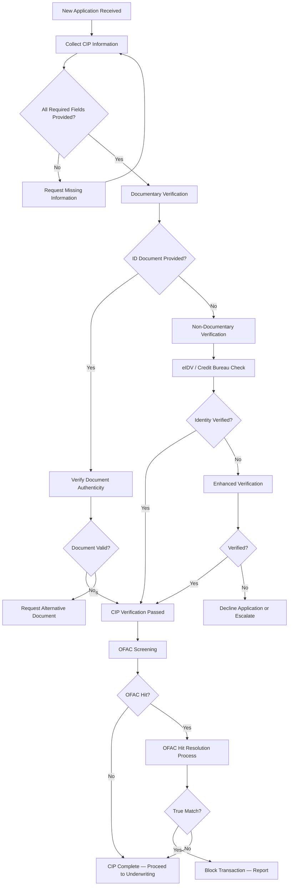

### 3.4 Beneficial Ownership Identification

The FinCEN CDD Rule (2018) requires identification of **beneficial owners** for legal entity customers:

| Requirement | Description |
|------------|-------------|
| **Ownership Prong** | Identify each individual who directly or indirectly owns **25% or more** of the equity interests of the legal entity customer |
| **Control Prong** | Identify **one individual** with significant responsibility to control, manage, or direct the legal entity (e.g., CEO, CFO, managing member) |
| **Verification** | Same CIP verification requirements as for individual customers |
| **Exemptions** | Publicly traded companies, regulated financial institutions, government entities, certain pooled investment vehicles |
| **Record Retention** | 5 years after account is closed |

#### 3.4.1 Entity Types Requiring Beneficial Ownership

| Entity Type | BO Required? | Notes |
|------------|-------------|-------|
| Corporation (private) | **Yes** | Both ownership and control prongs |
| LLC | **Yes** | Both prongs |
| Partnership | **Yes** | Both prongs |
| Trust | **Yes** | Trustee(s) and/or beneficiaries depending on structure |
| Publicly Traded Corporation | **No** | Exempt — already subject to SEC disclosure |
| Government Entity | **No** | Exempt |
| Bank / Registered Financial Institution | **No** | Exempt — already regulated |
| Non-Profit (501(c)(3)) | **No — Ownership** / **Yes — Control** | Exempt from ownership prong; still need control person |

### 3.5 PAS Integration for CIP

| PAS Component | CIP Function |
|--------------|-------------|
| **Application Intake** | Collect CIP data fields; validate completeness |
| **Identity Verification Service** | Integrate with eIDV vendors; documentary verification workflow |
| **OFAC Screening Service** | Real-time screening at application; batch screening for in-force |
| **Risk Scoring Engine** | Assign initial customer risk score based on CIP data |
| **Document Management** | Store identity documents; maintain verification records |
| **Audit Trail** | Log all CIP activities with timestamps, results, and analyst actions |

---

## 4. Customer Due Diligence (CDD)

### 4.1 Risk-Based Approach

CDD is the **ongoing** process of understanding the customer's identity, activity, and risk profile. The level of due diligence is calibrated to the customer's risk level:

| CDD Level | Applicability | Scope |
|-----------|--------------|-------|
| **Simplified Due Diligence (SDD)** | Low-risk customers (e.g., employer-sponsored group plan participants) | Basic identity verification; standard monitoring |
| **Standard Due Diligence (CDD)** | Normal-risk customers | Full CIP; customer profile; standard transaction monitoring |
| **Enhanced Due Diligence (EDD)** | High-risk customers | All of CDD plus deeper investigation, more frequent review, senior management approval |

### 4.2 Customer Risk Scoring

```mermaid
graph TD
    A[Customer Risk Assessment] --> B[Customer Factors]
    A --> C[Product Factors]
    A --> D[Geographic Factors]
    A --> E[Transaction Factors]
    A --> F[Channel Factors]

    B --> B1[PEP Status]
    B --> B2[Occupation / Industry]
    B --> B3[Entity Type / Structure]
    B --> B4[Adverse Media]
    B --> B5[Age / Employment Status]

    C --> C1[Product Type — Single Premium vs. Periodic]
    C --> C2[Cash Value Amount]
    C --> C3[Investment Features]
    C --> C4[Surrender Charge Schedule]

    D --> D1[Customer Domicile]
    D --> D2[Country of Citizenship]
    D --> D3[Fund Source Country]
    D --> D4[FATF High-Risk Jurisdictions]

    E --> E1[Premium Amount / Frequency]
    E --> E2[Transaction Patterns]
    E --> E3[Third-Party Involvement]

    F --> F1[Direct vs. Agent-Assisted]
    F --> F2[Online vs. In-Person]
    F --> F3[Agent Risk Profile]
```

### 4.3 Risk Scoring Model

| Factor | Weight | Low Risk (1) | Medium Risk (3) | High Risk (5) |
|--------|--------|-------------|-----------------|----------------|
| **PEP Status** | 20% | Not a PEP | Domestic PEP | Foreign PEP |
| **Country Risk** | 15% | Low-risk country (US, UK, CA, AU) | Medium-risk country | FATF high-risk / grey list |
| **Product Risk** | 15% | Term life; small annuity | Moderate cash value product | Large single premium; max-funded UL |
| **Premium Size** | 15% | < $25K annual | $25K - $100K | > $100K or lump sum > $50K |
| **Source of Funds** | 10% | Employment income / retirement | Business income | Cash-intensive business; foreign source |
| **Third-Party Involvement** | 10% | No third party | Business-related third party | Individual third party paying premiums |
| **Transaction Pattern** | 10% | Normal; consistent with profile | Somewhat unusual | Inconsistent with profile |
| **Adverse Media/Watchlist** | 5% | No hits | Minor/dated hits | Active hits |

**Composite Score Calculation:**

```
Risk Score = Σ (Factor Score × Factor Weight) for all factors

Risk Tier:
  Score 1.0 - 2.0 → Low Risk
  Score 2.1 - 3.5 → Medium Risk
  Score 3.6 - 5.0 → High Risk
```

### 4.4 Enhanced Due Diligence (EDD) Triggers

| Trigger | Description | EDD Actions |
|---------|-------------|------------|
| **PEP — Politically Exposed Person** | Government officials, their families, close associates (domestic and foreign) | Senior management approval; source of wealth/funds verification; enhanced monitoring |
| **High-Risk Geography** | Customer domicile or fund source in FATF high-risk or non-cooperative jurisdiction | Country-specific risk assessment; source of funds verification; enhanced monitoring |
| **Unusual Transaction Patterns** | Activity inconsistent with customer profile or product purpose | Detailed transaction review; customer interview; enhanced monitoring |
| **Large Single Premium** | Single premium exceeding threshold (e.g., $100K) | Source of funds verification; purpose documentation |
| **Adverse Media** | Negative news regarding financial crime, fraud, sanctions, corruption | Detailed investigation; risk committee review |
| **Complex Ownership Structure** | Multi-layered entities, trusts, or structures obscuring beneficial ownership | Full beneficial ownership identification through all layers |
| **Cash-Intensive Business** | Customer operates in industry with high cash exposure (restaurants, retail, construction) | Source of funds verification; enhanced transaction monitoring |
| **Third-Party Premium Payments** | Premiums paid by person other than policyholder | Verify relationship; document business purpose |

### 4.5 Ongoing Monitoring and KYC Refresh

| Activity | Frequency | Trigger |
|----------|-----------|---------|
| **Transaction Monitoring** | Continuous (real-time or daily batch) | Every transaction |
| **Periodic KYC Review — Low Risk** | Every 5 years | Scheduled review |
| **Periodic KYC Review — Medium Risk** | Every 3 years | Scheduled review |
| **Periodic KYC Review — High Risk** | Annually | Scheduled review |
| **Event-Driven Review** | As triggered | Change of ownership; large transaction; address change to high-risk jurisdiction; beneficiary change; adverse media hit |
| **Watchlist Rescreening** | At least daily (batch) or real-time at trigger events | OFAC SDN list updates; other watchlist updates |

---

## 5. Transaction Monitoring

### 5.1 Suspicious Activity Indicators for Life/Annuity

| # | Indicator | Description | Risk Level | Rule Type |
|---|-----------|-------------|------------|-----------|
| 1 | **Early Surrender** | Surrender within first 2 years, especially with significant surrender charge acceptance | High | Threshold + Behavioral |
| 2 | **Large Single Premium** | Single premium exceeding threshold (e.g., $50K, $100K, $250K) | Medium-High | Threshold |
| 3 | **Maximum Overfunding** | Premium payments that approach or test IRC §7702 limits | High | Threshold |
| 4 | **Structured Premiums** | Multiple premium payments just below reporting thresholds | High | Pattern |
| 5 | **Rapid Policy Changes** | Frequent changes to ownership, beneficiary, or address within short period | Medium | Velocity |
| 6 | **Unusual Beneficiary Changes** | Beneficiary changed to unrelated individual or foreign entity | Medium-High | Behavioral |
| 7 | **Free-Look Abuse** | Application followed by free-look cancellation, repeated pattern | High | Pattern |
| 8 | **International Wire Transfers** | Premiums funded via international wire, especially from high-risk jurisdictions | High | Source |
| 9 | **Third-Party Premium Payments** | Premiums paid by someone other than the policyholder (not recognized exception) | Medium | Behavioral |
| 10 | **Cash Premium Payments** | Large cash payments for premiums | High | Source |
| 11 | **Policy Loans — Immediate** | Large policy loan taken shortly after policy issuance or large premium payment | High | Timing |
| 12 | **Multiple Policies — Same Owner** | Multiple policies purchased in quick succession | Medium | Velocity |
| 13 | **Applicant Indifference to Product** | Applicant shows no interest in product features; focused only on investment amount and liquidity | Medium | Behavioral |
| 14 | **Address Discrepancy** | Application address doesn't match ID verification address | Medium | Data Quality |
| 15 | **PEP Transaction** | Any transaction by identified PEP | Medium-High | Status |
| 16 | **High-Risk Jurisdiction** | Customer or fund source in FATF-listed jurisdiction | High | Geographic |
| 17 | **1035 Exchange Patterns** | Repeated 1035 exchanges, especially across jurisdictions | Medium-High | Pattern |
| 18 | **Premium Refund Requests** | Requests for premium refund to different payment method or different payee | High | Behavioral |
| 19 | **Inconsistent Source of Funds** | Stated source of funds inconsistent with occupation or known income | High | Behavioral |
| 20 | **Unusual Settlement Options** | Election of unusual settlement options that facilitate fund movement | Medium | Behavioral |

### 5.2 Monitoring Rules Design

#### 5.2.1 Rule Categories

| Category | Description | Examples |
|----------|-------------|---------|
| **Threshold Rules** | Simple dollar-amount or count thresholds | Single premium > $100K; aggregate premiums > $200K in 12 months |
| **Velocity Rules** | Frequency-based rules over time windows | > 3 policy changes in 30 days; > 2 address changes in 60 days |
| **Pattern Rules** | Complex patterns across multiple transactions | Structured premiums (multiple payments just below threshold); buy-surrender-buy pattern |
| **Behavioral Rules** | Deviation from expected behavior based on customer profile | Premium amount inconsistent with income; early surrender acceptance of charges |
| **Network Rules** | Relationships between entities | Multiple policies with overlapping owners/beneficiaries; agent-linked suspicious activity |
| **Geographic Rules** | Location-based risk indicators | Fund source from high-risk jurisdiction; address change to high-risk country |
| **Watchlist Rules** | Matches against sanctions and other watchlists | OFAC SDN match; PEP list match; adverse media |

#### 5.2.2 Threshold Calibration

| Consideration | Description |
|--------------|-------------|
| **False Positive Rate** | Thresholds too low generate excessive false positives, overwhelming investigators |
| **False Negative Rate** | Thresholds too high miss truly suspicious activity |
| **Regulatory Expectation** | Regulators expect reasonable thresholds based on company's risk profile |
| **Industry Benchmarks** | FinCEN advisories and industry peer practices inform threshold selection |
| **Tuning Frequency** | Thresholds should be reviewed at least annually; more frequently for high-priority rules |
| **Backtesting** | Historical transaction data used to evaluate rule effectiveness |
| **Statistical Analysis** | Use statistical methods (distribution analysis, standard deviation) to set thresholds |

### 5.3 Alert Generation and Investigation Workflow

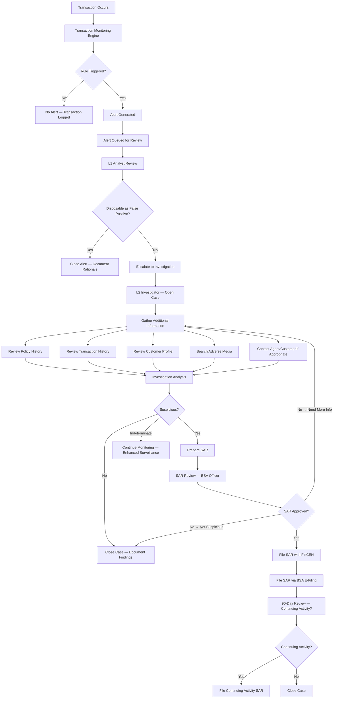

### 5.4 Case Management

| Component | Description |
|-----------|-------------|
| **Case Creation** | Cases created from escalated alerts or manual referrals |
| **Case Assignment** | Auto-assign based on priority, investigator capacity, specialization |
| **Documentation** | All investigative steps documented; evidence collected; analysis recorded |
| **Timeline** | Track investigation timeline against SLAs (e.g., 30-day SAR filing deadline) |
| **Escalation** | Escalation path from L1 analyst → L2 investigator → BSA Officer → Legal/Management |
| **Disposition** | SAR filed, closed-no SAR, referred to law enforcement, referred to SIU |
| **Audit Trail** | Complete, immutable audit trail of all case actions |

---

## 6. Suspicious Activity Reporting (SAR)

### 6.1 Filing Requirements

| Requirement | Detail |
|------------|--------|
| **Who Must File** | Insurance companies (as defined in 31 CFR 1025) |
| **When to File** | When the company knows, suspects, or has reason to suspect suspicious activity involving $5,000 or more |
| **Filing Timeline** | **30 calendar days** from initial detection (may extend to 60 days if no suspect identified; must then file within 30 days of identifying suspect) |
| **Filing Method** | FinCEN BSA E-Filing System (bsaefiling.fincen.treas.gov) |
| **Form** | FinCEN SAR (successor to SAR-IC for insurance) |
| **Retention** | SAR and supporting documentation retained for **5 years** from date of filing |

### 6.2 SAR Filing Triggers

A SAR must be filed when the insurer knows, suspects, or has reason to suspect that a transaction:

1. **Involves funds derived from illegal activity** or is intended to hide or disguise funds derived from illegal activity
2. **Is designed to evade** any BSA requirement
3. **Has no business or apparent lawful purpose** and the insurer knows of no reasonable explanation after examining available facts
4. **Involves use of the insurance company to facilitate criminal activity**

### 6.3 SAR Narrative Writing

The SAR narrative is the most critical component of a SAR filing. It must answer the **5 W's**:

| Element | What to Include |
|---------|----------------|
| **Who** | Subject identification (name, SSN/TIN, DOB, address, phone, occupation, account numbers); role of subject; relationship to company |
| **What** | Description of suspicious activity; transaction details (amounts, dates, types); patterns identified |
| **When** | Dates and timeframes of suspicious activity; date of detection |
| **Where** | Locations involved (addresses, branches, states, countries); where funds originated/were sent |
| **Why** | Why the activity is suspicious; what rules of thumb or red flags were triggered; why activity is inconsistent with customer profile or product purpose |
| **How** | Method of executing the suspicious activity; how funds moved; how the scheme works |

### 6.4 SAR Confidentiality

| Rule | Description |
|------|-------------|
| **No Disclosure to Subject** | It is a federal crime to disclose the existence of a SAR to the subject of the report (31 U.S.C. § 5318(g)(2)) |
| **Safe Harbor** | Filers are protected from civil liability for SAR filing under federal safe harbor (31 U.S.C. § 5318(g)(3)) |
| **Law Enforcement Access** | SARs are available to law enforcement; may be used in investigations |
| **Internal Access** | Access to SAR information should be limited to need-to-know personnel |
| **PAS Impact** | SAR-related data must be segregated with strict access controls; SAR status must not be visible to customer-facing staff |

### 6.5 Continuing Activity SARs

| Requirement | Detail |
|------------|--------|
| **Review Period** | Review suspicious activity at least every 90 days after initial SAR filing |
| **Continuing Activity SAR** | If activity continues, file a continuing activity SAR at least every 90 days |
| **Reference** | Reference the initial SAR filing number in continuing SARs |
| **Updated Narrative** | Provide updated narrative covering activity since last SAR |

---

## 7. OFAC Screening

### 7.1 Overview

The **Office of Foreign Assets Control (OFAC)** within the U.S. Treasury Department administers and enforces economic and trade sanctions based on U.S. foreign policy and national security goals. All U.S. persons (including insurance companies) are prohibited from conducting transactions with sanctioned persons or entities.

### 7.2 OFAC Lists

| List | Description | Update Frequency |
|------|-------------|-----------------|
| **Specially Designated Nationals (SDN) List** | Individuals and entities owned or controlled by, or acting for/on behalf of, targeted countries; also includes designated narcotics traffickers, terrorists, and those engaged in proliferation of WMD | Multiple times per week |
| **Sectoral Sanctions Identifications (SSI) List** | Entities operating in specific sectors of sanctioned economies (primarily Russian) | As needed |
| **Consolidated Sanctions List** | Combined list of all OFAC sanctions programs | Daily |
| **Non-SDN Menu-Based Sanctions (NS-MBS) List** | Persons subject to menu-based sanctions | As needed |
| **Foreign Sanctions Evaders (FSE) List** | Foreign individuals/entities determined to have violated U.S. sanctions | As needed |

### 7.3 Screening Triggers

| Trigger Event | When to Screen | Lists |
|--------------|---------------|-------|
| **New Application** | At application intake; before policy issuance | SDN, SSI, Consolidated |
| **Change of Ownership** | When ownership transfer is requested | SDN, SSI, Consolidated |
| **Beneficiary Change** | When beneficiary is added or changed | SDN, SSI, Consolidated |
| **Disbursement/Payment** | Before any disbursement (claim, surrender, withdrawal, annuity payment) | SDN, SSI, Consolidated |
| **Premium Receipt** | At premium receipt, especially for large or irregular premiums | SDN (premium payer if different from owner) |
| **1035 Exchange** | When receiving or sending a 1035 exchange | SDN for all parties |
| **Periodic Batch Screening** | At least daily against list updates | SDN, SSI, Consolidated |
| **List Update** | When OFAC updates SDN or other lists | Screen entire in-force book |

### 7.4 Name Matching Algorithms

| Algorithm | Description | Strengths | Weaknesses |
|-----------|-------------|-----------|------------|
| **Exact Match** | Character-by-character comparison | No false positives | Misses variations, misspellings, transliterations |
| **Fuzzy Matching** | Edit distance, Jaro-Winkler, Levenshtein | Catches misspellings and minor variations | Higher false positive rate |
| **Phonetic Matching** | Soundex, Metaphone, NYSIIS | Catches names that sound similar but are spelled differently | May miss non-English names |
| **Alias Matching** | Match against known aliases in SDN list | Catches alternative names | Requires comprehensive alias database |
| **Transliteration Matching** | Handles Arabic, Cyrillic, Chinese name transliterations | Essential for non-Latin script names | Complex to implement well |
| **Token-Based Matching** | Breaks names into tokens; matches subsets | Handles name reordering | May generate false matches on common tokens |

### 7.5 Hit Resolution Workflow

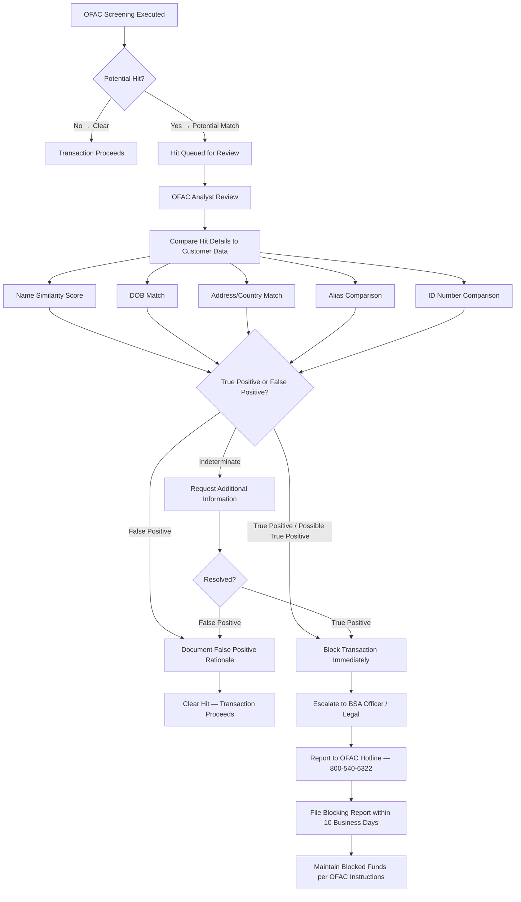

### 7.6 Screening Frequency and SLAs

| SLA | Target | Rationale |
|-----|--------|-----------|
| **New Application Screening** | Real-time (< 5 seconds) | Must screen before processing |
| **Disbursement Screening** | Real-time (< 5 seconds) | Must screen before releasing funds |
| **Batch Re-Screening** | Within 24 hours of list update | Ensure in-force book is current |
| **Hit Resolution — False Positive** | Within 4 hours (business hours) | Minimize transaction delays |
| **Hit Resolution — True Positive** | Immediate blocking; OFAC notification same day | Legal requirement |
| **Blocking Report** | Filed within 10 business days | OFAC reporting requirement |

---

## 8. Insurance-Specific Money Laundering Typologies

### 8.1 Single Premium Products as ML Vehicles

| Phase | Technique | Detection |
|-------|-----------|-----------|
| **Placement** | Launderer purchases large single premium whole life or annuity using illicit funds (cash, structured deposits, or proceeds of crime) | Large single premium alerts; source of funds verification; cash premium monitoring |
| **Layering** | Policy surrendered after short holding period; proceeds received via check or wire to bank account, creating apparent "insurance proceeds" | Early surrender alerts; velocity monitoring; surrender charge acceptance |
| **Integration** | "Clean" funds used in legitimate economy; source appears to be insurance company | Pattern analysis across customers; agent monitoring |

### 8.2 Policy Loans as Layering Technique

| Step | Description | Detection |
|------|-------------|-----------|
| 1 | Purchase cash value policy with large premium | Large premium alert |
| 2 | Take maximum policy loan shortly after | Immediate loan alert; loan-to-premium timing |
| 3 | Loan proceeds appear as legitimate borrowing from insurance company | Loan timing analysis |
| 4 | Repay loan (or not) — either way, funds have been layered | Loan activity monitoring |

### 8.3 Free-Look Abuse for Fund Cleansing

| Step | Description | Detection |
|------|-------------|-----------|
| 1 | Purchase policy with premium from illicit source | Standard CIP/CDD |
| 2 | Exercise free-look cancellation within statutory period | Free-look cancellation tracking |
| 3 | Receive refund from insurance company (refund check or wire) | Free-look pattern detection; refund method monitoring |
| 4 | Repeat with different products/companies | Cross-product pattern analysis |

### 8.4 Overfunding and Early Surrender

| Indicator | Red Flag Level | Description |
|-----------|---------------|-------------|
| Premium significantly exceeds typical amount for product/age | **High** | Maximum funding of UL or annuity well beyond apparent insurance need |
| Surrender within 1-2 years accepting surrender charges | **Very High** | Willingness to lose 5-10% suggests funds are not legitimately earned |
| Funds paid to different party than premium payer | **Very High** | May indicate layering |
| Multiple same-pattern transactions across different products | **Critical** | Systematic ML activity |

### 8.5 Third-Party Premium Payments

| Scenario | Risk Level | Legitimate Explanation | Red Flag |
|----------|-----------|----------------------|----------|
| Parent pays child's premium | **Low** | Family financial planning | None |
| Employer pays executive's premium (split-dollar) | **Low-Medium** | Documented compensation arrangement | None if documented |
| Unknown third party pays premium | **High** | Difficult to justify | Significant ML risk |
| Multiple unrelated third parties pay same policy | **Very High** | No legitimate explanation | Critical ML indicator |
| Premium paid from foreign entity | **High** | International business arrangement | Source of funds; country risk |

### 8.6 Trust-Owned Policies

| Risk | Description | Mitigation |
|------|-------------|------------|
| Opaque ownership | Trust structure may obscure true beneficial ownership | Identify all trustees, grantors, and beneficiaries |
| Foreign trusts | Trust established in secrecy jurisdiction | Enhanced due diligence; country risk assessment |
| Multiple trustees | Complex trustee arrangements may be used to obscure control | Identify all persons with control or economic benefit |
| Frequent trust changes | Frequent changes to trust structure, trustees, or beneficiaries | Change monitoring; event-driven review |

### 8.7 1035 Exchange Patterns

| Pattern | Risk | Description |
|---------|------|-------------|
| Repeated exchanges across companies | **Medium-High** | May be used to obscure source of funds or create complex audit trail |
| Exchange from high-risk jurisdiction carrier | **High** | Funds originating from offshore or lightly regulated insurer |
| Exchange significantly increasing cash value | **Medium** | Unusual growth pattern |
| Exchange immediately followed by surrender | **High** | ML layering technique |

---

## 9. Fraud Types in Life Insurance

### 9.1 Application Fraud

#### 9.1.1 Identity Fraud

| Type | Description | Detection Methods |
|------|-------------|------------------|
| **Stolen Identity** | Using another person's SSN, DOB, and name to obtain coverage | eIDV; MIB check; credit bureau verification |
| **Synthetic Identity** | Combining real and fictitious elements to create new identity | Identity analytics; CRA inconsistency detection |
| **Impersonation** | Claiming to be someone else during application process | Photo ID verification; biometric verification |

#### 9.1.2 Misrepresentation

| Misrepresentation Type | Description | Impact | Detection |
|----------------------|-------------|--------|-----------|
| **Health/Medical** | Concealing pre-existing conditions, medications, treatments | Adverse mortality selection; claim losses | MIB, prescription database (Rx), medical records, APS |
| **Lifestyle** | Concealing hazardous activities (skydiving, scuba, racing) | Risk classification error | Post-issue investigation; social media analysis |
| **Occupation** | Misrepresenting occupation or income | Risk classification; insurable interest | Employment verification; income documentation |
| **Tobacco/Nicotine** | Denying tobacco use | Mortality classification error (smoker vs. non-smoker) | Cotinine testing; prescription database |
| **Travel** | Concealing travel to high-risk countries | Mortality risk; underwriting decision | Travel database checks; passport stamps |
| **Financial** | Overstating income/net worth to obtain higher coverage | Insurable interest issues; adverse selection | Financial verification; income documentation |

#### 9.1.3 Stranger-Originated Life Insurance (STOLI) / Investor-Owned Life Insurance (IOLI)

| Characteristic | Description |
|---------------|-------------|
| **Definition** | Life insurance policies obtained by a third-party investor who has no insurable interest in the insured, typically on elderly individuals |
| **Scheme** | Investor funds premiums; insured assigns policy after contestability period; investor is beneficiary |
| **Red Flags** | Policy amount disproportionate to insured's means; premium financing; unknown beneficiary designation; age 65+ with maximum face amount; policy intended for immediate resale |
| **Regulatory Response** | Most states have enacted anti-STOLI legislation; insurable interest laws; 2-5 year prohibitions on policy transfers |
| **PAS Detection** | Face amount vs. income analysis; premium financing detection; beneficiary relationship analysis; policy transfer monitoring |

### 9.2 Agent/Producer Fraud

| Fraud Type | Description | Detection | PAS Support |
|-----------|-------------|-----------|-------------|
| **Churning** | Excessive replacement of existing policies to generate commissions | Replacement rate monitoring by agent; commission pattern analysis | Policy replacement tracking; agent activity monitoring |
| **Twisting** | Inducing policyholder to replace policy through misrepresentation | Replacement form analysis; customer complaints | Replacement form capture; complaint tracking |
| **Forgery** | Forging policyholder signatures on applications, change forms, or withdrawal requests | Signature verification; callback verification | Document management; signature comparison |
| **Rebating** | Providing unauthorized inducements to purchase | Commission analysis; expense pattern monitoring | Commission tracking; incentive monitoring |
| **Premium Misappropriation** | Collecting premiums from customers but not remitting to insurer | Premium reconciliation; agent account auditing | Agent billing; premium reconciliation |
| **Unauthorized Activities** | Selling unapproved products; acting outside license scope | License verification; product authorization | Producer licensing integration; product authorization matrix |
| **Identity Theft (Agent-Perpetrated)** | Agent uses customer information for personal gain | Unusual access pattern monitoring; customer complaints | Access audit logs; unusual activity detection |

### 9.3 Claim Fraud

| Fraud Type | Description | Red Flags | Detection |
|-----------|-------------|-----------|-----------|
| **Staged Death** | Faking insured's death to collect death benefit | Death certificate irregularities; foreign death; small/unknown funeral home; missing body | Death verification services; forensic investigation; SIU |
| **Murder-for-Insurance** | Homicide motivated by insurance proceeds | Recent policy purchase; large benefit; suspicious circumstances; beneficiary involvement | Law enforcement coordination; claim investigation; SIU |
| **Forged Death Certificates** | Presenting fraudulent death certificate | Document irregularities; unverifiable registrar; inconsistent details | Death certificate verification; vital records check |
| **Beneficiary Fraud** | Beneficiary impersonation or forged beneficiary change | Identity discrepancy; recent beneficiary change; unusual payment instructions | Beneficiary verification; identity check at claim |
| **Disability Claim Fraud** | Feigning disability to collect disability benefits | Social media contradicts disability; surveillance evidence; inconsistent medical evidence | Surveillance; social media monitoring; IME |
| **Material Misrepresentation (Post-Claim)** | Discovery of application misrepresentation within contestability period | MIB hits; prescription database; medical records inconsistency | Post-claim underwriting investigation |

---

## 10. Fraud Detection Analytics

### 10.1 Rule-Based Detection

| Approach | Description | Strengths | Limitations |
|----------|-------------|-----------|------------|
| **Business Rules** | Expert-defined rules based on known fraud patterns | Transparent; auditable; immediate implementation | Only catches known patterns; high false positive rate |
| **Decision Tables** | Tabular rules with conditions and actions | Easy to maintain; business-analyst friendly | Limited to simple condition combinations |
| **Threshold Alerting** | Alerts when metric exceeds threshold | Simple; effective for outlier detection | Requires careful calibration; static |

### 10.2 Machine Learning Models

| Model Type | Application | Algorithm Examples | Training Data |
|-----------|-------------|-------------------|--------------|
| **Anomaly Detection** | Identify unusual transactions or patterns that deviate from normal | Isolation Forest, One-Class SVM, Autoencoders | Unsupervised — normal transaction data |
| **Network Analysis** | Identify connected fraud rings; agent-client-beneficiary networks | Graph neural networks, community detection, link analysis | Network/relationship data |
| **Supervised Classification** | Classify applications/claims as fraudulent or legitimate | Gradient Boosted Trees (XGBoost, LightGBM), Random Forest, Neural Networks | Labeled historical fraud cases + legitimate cases |
| **Natural Language Processing** | Analyze claim narratives, notes, and correspondence for fraud indicators | BERT, GPT-based models, text classification | Claim notes, investigation notes |
| **Predictive Scoring** | Score each application/claim for fraud likelihood | Logistic regression, ensemble methods | Historical fraud outcomes |

### 10.3 Feature Engineering for Fraud Detection

| Feature Category | Example Features |
|-----------------|-----------------|
| **Application Features** | Face amount/income ratio; premium/income ratio; number of prior applications; time between applications; agent assignment frequency |
| **Policy Features** | Policy age at event (surrender, claim, change); premium funding pattern; cash value trajectory; rider utilization |
| **Customer Features** | Number of policies across companies (MIB); address change frequency; occupation risk level; age at issue |
| **Transaction Features** | Transaction amount; transaction frequency; time between transactions; transaction type sequence |
| **Agent Features** | Agent replacement rate; agent complaint rate; agent lapse rate; agent early surrender rate; agent geographic concentration |
| **Network Features** | Degree centrality (number of connections); betweenness centrality; shared addresses; shared beneficiaries; shared agents |
| **External Features** | Death certificate verification score; prescription data matches; social media signals; adverse media signals |

### 10.4 Model Deployment and Monitoring

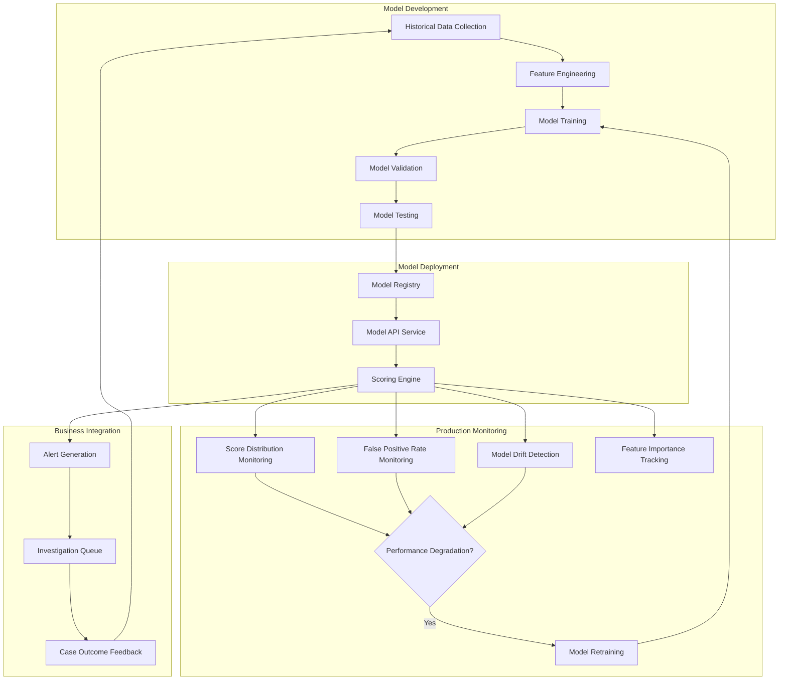

### 10.5 SIU (Special Investigation Unit) Operations

| SIU Function | Description |
|-------------|-------------|
| **Intake** | Receive referrals from claims, underwriting, compliance, analytics |
| **Triage** | Assess referral severity and investigative value |
| **Investigation** | Conduct fraud investigation using internal and external resources |
| **Documentation** | Document investigation findings, evidence, and conclusions |
| **Resolution** | Recommend action (deny claim, rescind policy, refer to law enforcement, refer to state fraud bureau) |
| **Reporting** | Report to state fraud bureaus as required by law; maintain investigation statistics |
| **Training** | Train claims, underwriting, and customer service staff on fraud indicators |
| **Analytics** | Partner with analytics team on fraud model development and rule tuning |

---

## 11. Data Privacy in AML/KYC

### 11.1 Data Retention Requirements

| Data Type | Retention Period | Authority |
|-----------|-----------------|-----------|
| **CIP Records** | 5 years after account closure | 31 CFR 1020.220 / BSA |
| **CDD Records** | 5 years after account closure | FinCEN CDD Rule |
| **Transaction Records** | 5 years | BSA |
| **SAR and Supporting Documentation** | 5 years from filing date | 31 U.S.C. § 5318(g) |
| **OFAC Screening Records** | 5 years | OFAC guidance |
| **Beneficial Ownership Records** | 5 years after account closure | FinCEN CDD Rule |
| **Training Records** | Duration of employment + 5 years | BSA program requirements |

### 11.2 Cross-Border Data Sharing

| Consideration | Description |
|--------------|-------------|
| **314(a) Information Requests** | FinCEN may request that financial institutions search records for accounts/transactions related to ML/TF investigations; response required within 14 days |
| **314(b) Voluntary Information Sharing** | Financial institutions may voluntarily share information about suspected ML/TF under safe harbor; requires annual notice to FinCEN |
| **GDPR Implications** | For customers in EU, GDPR requirements may conflict with AML data retention and sharing; legitimate interest and legal obligation bases for processing |
| **CCPA/CPRA** | AML data generally exempt from CCPA deletion requests under GLBA and BSA regulatory requirements |
| **Cross-Jurisdictional Investigations** | Mutual Legal Assistance Treaties (MLATs); Egmont Group (FIU-to-FIU sharing) |

### 11.3 Privacy Law Compliance in AML Context

| Law | AML Exemption/Interaction |
|-----|--------------------------|
| **GLBA** | AML/fraud detection is a permitted use of NPI under GLBA financial privacy provisions |
| **FCRA** | AML investigations may use consumer report data; permissible purpose exists for fraud investigation |
| **CCPA/CPRA** | BSA compliance data exempt from CCPA deletion requests; GLBA-covered data generally exempt |
| **HIPAA** | If medical underwriting data is relevant to fraud investigation, HIPAA fraud exception may apply |
| **ECPA** | Electronic surveillance must comply with Electronic Communications Privacy Act |

---

## 12. Compliance Program

### 12.1 BSA/AML Compliance Officer

| Responsibility | Description |
|---------------|-------------|
| **Program Oversight** | Responsible for day-to-day management of the AML compliance program |
| **Board Reporting** | Regular reporting to board of directors on AML program status, SARs filed, risk assessment results |
| **Regulatory Interface** | Primary contact for regulatory examinations; FinCEN inquiries |
| **SAR Approval** | Final approval authority for SAR filings |
| **Policy Updates** | Ensure AML policies and procedures are current |
| **Training Oversight** | Ensure training program is adequate and completed |
| **Resource Management** | Ensure adequate staffing and technology resources |
| **Qualifications** | Senior-level individual with AML knowledge and authority; CAMS certification recommended |

### 12.2 Board Oversight

| Requirement | Description |
|------------|-------------|
| **AML Program Approval** | Board must approve the AML compliance program |
| **Annual Risk Assessment Review** | Board must review annual AML/CTF risk assessment |
| **Regular Reporting** | Receive regular (at least quarterly) reports on AML program metrics |
| **Resource Allocation** | Ensure adequate resources for AML compliance |
| **Culture of Compliance** | Set tone from the top; compliance culture throughout organization |

### 12.3 Independent Testing/Audit

| Element | Description |
|---------|-------------|
| **Frequency** | Annual or biennial (annual recommended) |
| **Scope** | Full assessment of AML program adequacy and effectiveness |
| **Independence** | Performed by qualified independent party (external firm or internal audit with no AML responsibilities) |
| **Methodology** | Sample testing of transactions, alerts, SARs; policy review; technology assessment; training adequacy |
| **Report** | Written report with findings, recommendations, and management action plans |
| **Regulatory Expectation** | Regulators will review independent testing reports during examinations |

### 12.4 Training Program

| Audience | Content | Frequency | Delivery |
|----------|---------|-----------|----------|
| **All Employees** | General AML awareness; red flags; reporting obligations | Annual | Online/LMS |
| **Customer-Facing Staff** | CIP procedures; suspicious activity identification; escalation procedures | Annual + at hire | Classroom + online |
| **Compliance Staff** | Advanced AML; SAR writing; OFAC compliance; regulatory updates | Annual + ongoing | Classroom + conferences |
| **Senior Management/Board** | AML program overview; regulatory updates; risk assessment; governance responsibilities | Annual | Briefing / presentation |
| **Agents/Producers** | Suitability; replacement; AML red flags; reporting obligations | At appointment + annual | Online/field training |

### 12.5 Record Retention

| Record Type | Retention Period | Format |
|------------|-----------------|--------|
| CIP/CDD records | 5 years post-account closure | Digital (searchable) |
| Transaction records | 5 years | Digital |
| SARs | 5 years from filing | Digital (restricted access) |
| OFAC screening records | 5 years | Digital |
| Training records | Employment + 5 years | Digital |
| Independent testing reports | 5 years | Digital |
| Policies and procedures (all versions) | Current + 5 years | Digital (version-controlled) |
| Board minutes (AML-related) | Permanently | Digital |

### 12.6 Regulatory Examination Preparation

| Preparation Area | Actions |
|-----------------|---------|
| **Documentation** | Ensure all AML policies, procedures, risk assessments, independent test reports, and training records are current and accessible |
| **SAR Review** | Review sample of SARs filed for completeness and quality; ensure timely filing |
| **CIP/CDD Files** | Ensure customer files contain required CIP documentation and current CDD |
| **Transaction Monitoring** | Demonstrate monitoring system effectiveness; provide alert metrics, investigation outcomes |
| **OFAC** | Document screening procedures; provide screening statistics; demonstrate hit resolution process |
| **Training** | Provide training completion records for all applicable personnel |
| **Technology** | Demonstrate monitoring system capabilities; explain model governance if ML-based |

---

## 13. Data Model for AML/KYC

### 13.1 Complete Entity-Relationship Diagram

```mermaid
erDiagram
    CUSTOMER {
        varchar customer_id PK
        varchar customer_type
        varchar first_name
        varchar last_name
        varchar full_legal_name
        date date_of_birth
        varchar ssn_tin
        varchar tin_type
        varchar address_line1
        varchar address_line2
        varchar city
        varchar state
        varchar zip_code
        varchar country
        varchar phone
        varchar email
        varchar occupation
        varchar employer
        varchar industry_code
        varchar citizenship
        varchar residency_status
        varchar risk_tier
        decimal risk_score
        date risk_score_date
        varchar pep_status
        date last_kyc_review_date
        date next_kyc_review_date
        varchar kyc_status
        timestamp created_at
        timestamp updated_at
    }

    CUSTOMER_IDENTITY_VERIFICATION {
        varchar verification_id PK
        varchar customer_id FK
        varchar verification_type
        varchar verification_method
        varchar document_type
        varchar document_number
        varchar document_issuer
        date document_issue_date
        date document_expiration_date
        varchar verification_vendor
        varchar verification_result
        decimal confidence_score
        varchar failure_reason
        date verification_date
        varchar verified_by
        varchar document_image_path
        timestamp created_at
    }

    BENEFICIAL_OWNER {
        varchar bo_id PK
        varchar entity_customer_id FK
        varchar individual_customer_id FK
        varchar ownership_type
        decimal ownership_percentage
        varchar control_title
        varchar verification_status
        date verified_date
        timestamp created_at
    }

    CUSTOMER_RISK_ASSESSMENT {
        varchar assessment_id PK
        varchar customer_id FK
        date assessment_date
        varchar assessment_type
        decimal overall_risk_score
        varchar risk_tier
        decimal customer_factor_score
        decimal product_factor_score
        decimal geographic_factor_score
        decimal transaction_factor_score
        decimal channel_factor_score
        varchar pep_flag
        varchar adverse_media_flag
        varchar high_risk_country_flag
        text risk_narrative
        varchar assessed_by
        varchar approved_by
        date next_review_date
        timestamp created_at
    }

    OFAC_SCREENING {
        varchar screening_id PK
        varchar customer_id FK
        varchar screening_trigger
        varchar screening_type
        date screening_date
        varchar lists_screened
        varchar screening_result
        int potential_hits
        varchar resolution_status
        varchar resolved_by
        date resolved_date
        text resolution_notes
        timestamp created_at
    }

    OFAC_HIT {
        varchar hit_id PK
        varchar screening_id FK
        varchar list_name
        varchar list_entry_id
        varchar matched_name
        decimal match_score
        varchar match_type
        varchar hit_status
        varchar resolution
        text resolution_notes
        varchar resolved_by
        date resolved_date
        timestamp created_at
    }

    TRANSACTION_ALERT {
        varchar alert_id PK
        varchar policy_number
        varchar customer_id FK
        varchar rule_id FK
        varchar alert_type
        varchar alert_severity
        date alert_date
        varchar alert_status
        text alert_description
        decimal transaction_amount
        varchar transaction_type
        date transaction_date
        varchar assigned_to
        date assigned_date
        varchar disposition
        text disposition_notes
        varchar disposed_by
        date disposed_date
        varchar case_id FK
        timestamp created_at
    }

    MONITORING_RULE {
        varchar rule_id PK
        varchar rule_name
        varchar rule_category
        varchar rule_type
        text rule_description
        varchar rule_logic
        varchar severity
        char active_flag
        date effective_date
        date expiration_date
        decimal threshold_amount
        int threshold_count
        int time_window_days
        varchar product_applicability
        varchar last_tuned_by
        date last_tuned_date
        int ytd_alerts_generated
        int ytd_true_positives
        decimal ytd_true_positive_rate
        timestamp created_at
    }

    AML_CASE {
        varchar case_id PK
        varchar case_type
        varchar case_status
        varchar case_priority
        varchar customer_id FK
        varchar policy_number
        text case_description
        varchar assigned_investigator
        date opened_date
        date due_date
        date closed_date
        varchar disposition
        text disposition_summary
        varchar sar_filed_flag
        varchar sar_id FK
        varchar escalated_to
        date escalated_date
        varchar approved_by
        date approved_date
        timestamp created_at
        timestamp updated_at
    }

    AML_CASE_NOTE {
        varchar note_id PK
        varchar case_id FK
        varchar note_type
        text note_content
        varchar created_by
        timestamp created_at
    }

    AML_CASE_DOCUMENT {
        varchar document_id PK
        varchar case_id FK
        varchar document_type
        varchar document_title
        varchar storage_path
        varchar uploaded_by
        timestamp uploaded_at
    }

    SAR_FILING {
        varchar sar_id PK
        varchar case_id FK
        varchar sar_type
        varchar fincen_tracking_number
        date filing_date
        date activity_start_date
        date activity_end_date
        decimal total_amount_involved
        varchar subject_customer_id FK
        text sar_narrative
        varchar prepared_by
        varchar reviewed_by
        varchar approved_by
        date approved_date
        varchar filing_status
        varchar bsa_efile_confirmation
        date next_review_date
        varchar continuing_activity_flag
        varchar prior_sar_reference
        timestamp created_at
    }

    SAR_SUBJECT {
        varchar subject_id PK
        varchar sar_id FK
        varchar customer_id FK
        varchar subject_role
        varchar first_name
        varchar last_name
        varchar ssn_tin
        date date_of_birth
        varchar address
        varchar account_numbers
        varchar relationship_to_company
    }

    PEP_SCREENING {
        varchar screening_id PK
        varchar customer_id FK
        date screening_date
        varchar screening_vendor
        varchar screening_result
        varchar pep_category
        varchar pep_position
        varchar pep_country
        varchar pep_relationship
        varchar resolution_status
        text resolution_notes
        timestamp created_at
    }

    ADVERSE_MEDIA {
        varchar media_id PK
        varchar customer_id FK
        date screening_date
        varchar source
        varchar article_title
        varchar article_url
        date article_date
        varchar category
        varchar relevance_score
        varchar review_status
        text review_notes
        varchar reviewed_by
        timestamp created_at
    }

    SANCTIONS_LIST {
        varchar list_id PK
        varchar list_name
        varchar list_source
        date last_updated
        int entry_count
        varchar list_type
    }

    FRAUD_REFERRAL {
        varchar referral_id PK
        varchar referral_source
        varchar referral_type
        varchar policy_number
        varchar customer_id FK
        varchar agent_id
        date referral_date
        text referral_description
        varchar fraud_type
        varchar priority
        varchar status
        varchar assigned_to
        varchar case_id FK
        varchar siu_case_number
        text investigation_findings
        varchar outcome
        decimal loss_amount
        decimal recovery_amount
        timestamp created_at
        timestamp updated_at
    }

    KYC_REFRESH {
        varchar refresh_id PK
        varchar customer_id FK
        date scheduled_date
        date completed_date
        varchar refresh_status
        varchar trigger_type
        varchar reviewed_by
        text findings
        varchar risk_tier_before
        varchar risk_tier_after
        decimal risk_score_before
        decimal risk_score_after
        timestamp created_at
    }

    CUSTOMER ||--o{ CUSTOMER_IDENTITY_VERIFICATION : "verified_by"
    CUSTOMER ||--o{ CUSTOMER_RISK_ASSESSMENT : "assessed"
    CUSTOMER ||--o{ OFAC_SCREENING : "screened"
    CUSTOMER ||--o{ TRANSACTION_ALERT : "triggers"
    CUSTOMER ||--o{ AML_CASE : "subject_of"
    CUSTOMER ||--o{ PEP_SCREENING : "screened_for"
    CUSTOMER ||--o{ ADVERSE_MEDIA : "monitored"
    CUSTOMER ||--o{ KYC_REFRESH : "refreshed"
    CUSTOMER ||--o{ FRAUD_REFERRAL : "referred"
    CUSTOMER ||--o{ BENEFICIAL_OWNER : "owns"
    OFAC_SCREENING ||--o{ OFAC_HIT : "produces"
    TRANSACTION_ALERT }o--|| MONITORING_RULE : "triggered_by"
    TRANSACTION_ALERT }o--o| AML_CASE : "escalated_to"
    AML_CASE ||--o{ AML_CASE_NOTE : "has"
    AML_CASE ||--o{ AML_CASE_DOCUMENT : "has"
    AML_CASE ||--o{ SAR_FILING : "results_in"
    SAR_FILING ||--o{ SAR_SUBJECT : "identifies"
    FRAUD_REFERRAL }o--o| AML_CASE : "investigated_as"
```

---

## 14. Transaction Monitoring Rule Examples

### 14.1 Decision Tables

#### Rule TM-001: Large Single Premium

| Condition | Low | Medium | High | Critical |
|-----------|-----|--------|------|----------|
| Single Premium Amount | $50K - $99K | $100K - $249K | $250K - $499K | ≥ $500K |
| Customer Risk Tier | Any | Any | Any | Any |
| **Action** | Log | Generate Alert (L2) | Generate Alert (L1 Priority) | Generate Alert (Immediate) + Notify BSA Officer |

#### Rule TM-002: Early Surrender with Charge Acceptance

| Condition | Values |
|-----------|--------|
| Policy Duration | < 2 years |
| Surrender Charge % Forfeited | > 0% |
| Surrender Amount | > $25,000 |
| **Action** | Generate Alert (L1 Priority) |
| **Rationale** | Accepting surrender charges indicates unusual motivation; potential ML layering |

#### Rule TM-003: Structured Premiums (Anti-Structuring)

| Condition | Values |
|-----------|--------|
| Number of Premiums in 30 Days | ≥ 3 |
| Individual Premium Amount | $5,000 - $9,999 |
| Aggregate Premium in 30 Days | > $20,000 |
| Premium Payer | Same individual |
| **Action** | Generate Alert (L1 Priority) |
| **Rationale** | Multiple premiums just below $10,000 suggest structuring |

#### Rule TM-004: Rapid Policy Changes

| Condition | Values |
|-----------|--------|
| Change Events in 60 Days | ≥ 3 |
| Change Types Monitored | Ownership change, beneficiary change, address change |
| **Action** | Generate Alert (L2) |
| **Rationale** | Rapid changes may indicate preparation for fraudulent claim or ML activity |

#### Rule TM-005: Free-Look Pattern Detection

| Condition | Values |
|-----------|--------|
| Applications in 12 Months | ≥ 2 |
| Free-Look Cancellations in 12 Months | ≥ 1 |
| **Action** | Generate Alert (L2) |
| **Rationale** | Pattern of application followed by cancellation may indicate free-look abuse for fund cleansing |

#### Rule TM-006: Third-Party Premium Payment

| Condition | Values |
|-----------|--------|
| Premium Payer | Different from policy owner |
| Relationship | Not recognized family/business relationship |
| Premium Amount | > $10,000 |
| **Action** | Generate Alert (L2) |
| **Rationale** | Third-party payments may indicate ML or premium misappropriation |

#### Rule TM-007: International Wire Premium

| Condition | Values |
|-----------|--------|
| Payment Method | International wire transfer |
| Originating Country | Any |
| Premium Amount | > $10,000 |
| High-Risk Country | Additional escalation if from FATF high-risk jurisdiction |
| **Action** | Generate Alert (L1); L1 Priority if high-risk country |
| **Rationale** | International wires, especially from high-risk jurisdictions, require enhanced scrutiny |

#### Rule TM-008: Agent Anomaly Detection

| Condition | Values |
|-----------|--------|
| Agent's Replacement Rate | > 2× peer average for same product/region |
| OR Agent's Early Surrender Rate | > 2× peer average |
| OR Agent's Customer Complaints | > 3× peer average |
| **Action** | Generate Alert (L2); flag for agent review |
| **Rationale** | Anomalous agent patterns may indicate churning, twisting, or facilitation of ML |

### 14.2 Rule Performance Metrics

| Metric | Target | Measurement |
|--------|--------|-------------|
| **True Positive Rate** | > 5% (industry benchmark for AML) | True positives / Total alerts |
| **False Positive Rate** | < 95% | False positives / Total alerts |
| **SAR-to-Alert Ratio** | 2-10% (varies by rule) | SARs filed / Alerts generated |
| **Alert-to-Case Ratio** | 10-30% | Cases opened / Alerts generated |
| **Average Investigation Time** | < 15 business days | Alert date to disposition |
| **SAR Filing Timeliness** | 100% within 30 days | SARs filed within deadline / Total SARs |

---

## 15. BPMN Process Flows

### 15.1 SAR Filing Process

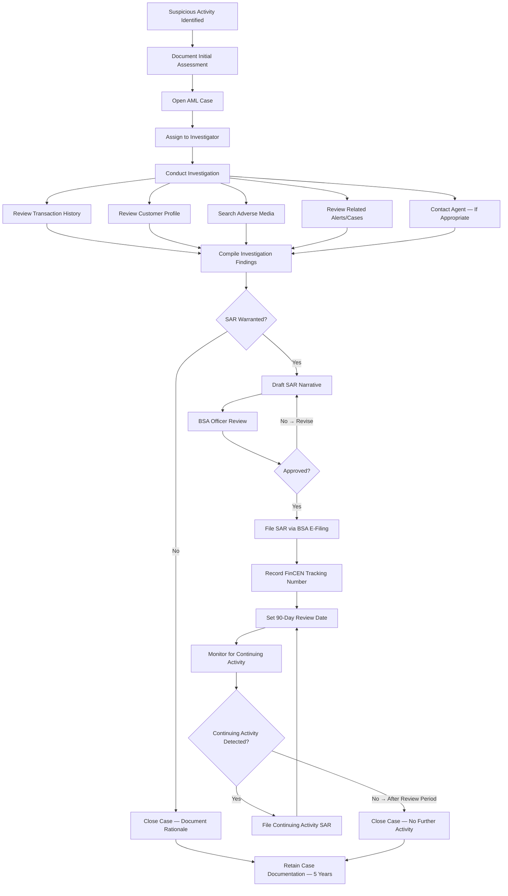

### 15.2 OFAC Screening Process

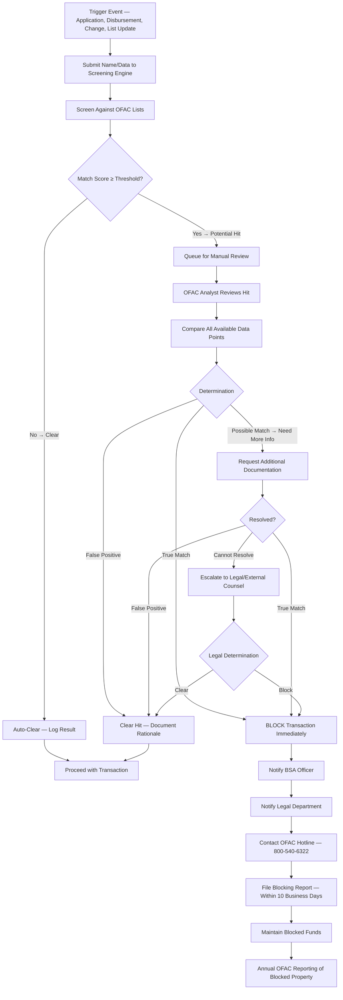

### 15.3 CDD Review Process

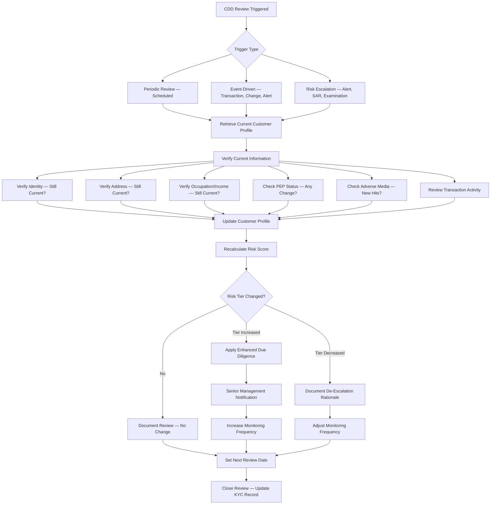

---

## 16. Architecture

### 16.1 AML Transaction Monitoring Platform

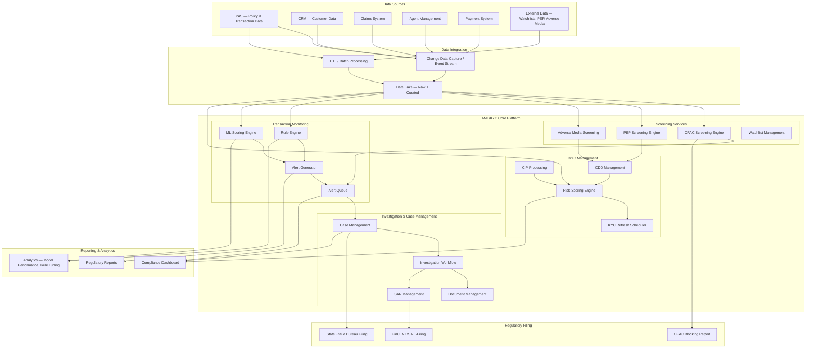

### 16.2 Screening Service Architecture

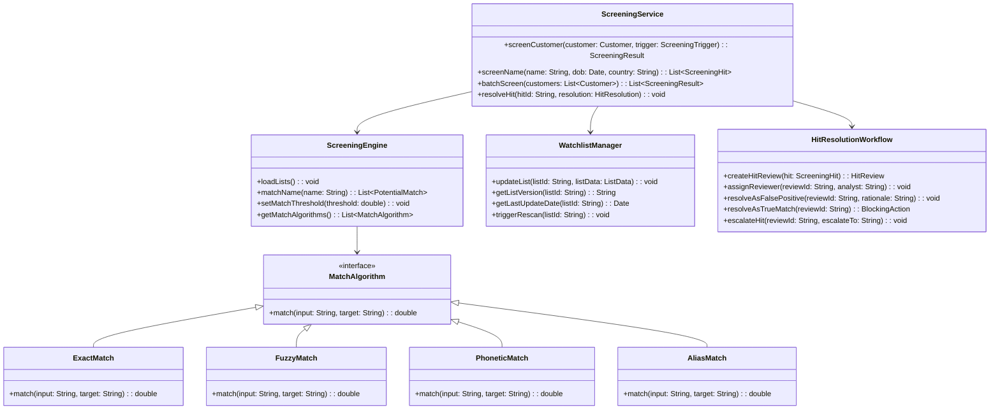

### 16.3 Integration Patterns

| Integration | Direction | Protocol | Frequency | Data |
|------------|-----------|----------|-----------|------|
| **PAS → AML Platform** | Outbound (event-driven) | Kafka/Event stream or API | Real-time | New applications, transactions, policy changes |
| **AML Platform → PAS** | Outbound (API) | REST API | Real-time | Screening results (clear/block), case status |
| **OFAC List Updates → AML Platform** | Inbound | HTTPS download or vendor API | At least daily | SDN, Consolidated list updates |
| **PEP Database → AML Platform** | Inbound | Vendor API | Daily or real-time | PEP list updates |
| **AML Platform → FinCEN** | Outbound | BSA E-Filing (XML) | As needed (within 30 days) | SAR filings |
| **FinCEN → AML Platform** | Inbound | Secure portal | 314(a) requests | 314(a) name search requests |
| **eIDV Vendor → AML Platform** | Inbound | REST API | Real-time | Identity verification results |
| **Credit Bureau → AML Platform** | Inbound | HTTPS/API | Real-time | Identity verification; credit data |

---

## 17. Implementation Guidance

### 17.1 Key Design Principles

| Principle | Description |
|-----------|-------------|
| **Risk-Based Approach** | All AML/KYC controls calibrated to risk level; don't apply EDD to everyone; don't apply SDD to high-risk |
| **Defense in Depth** | Multiple layers of control: CIP → CDD → Transaction Monitoring → Investigation → SAR |
| **Separation of Duties** | Alert investigation, SAR preparation, and SAR approval by different individuals |
| **Confidentiality by Design** | SAR information segregated with strict access controls; no SAR data visible to customer-facing staff |
| **Audit Trail** | Every screening, alert, investigation step, and disposition logged immutably |
| **Regulatory Agility** | Rules and thresholds configurable without code changes; new watchlists addable without deployment |
| **Performance at Scale** | Screening must be sub-second for real-time triggers; batch screening must handle full in-force book overnight |
| **Vendor Independence** | Abstract screening and identity verification behind service interfaces for vendor substitution |

### 17.2 Technology Stack Recommendations

| Component | Recommended Technology | Rationale |
|-----------|----------------------|-----------|
| **Transaction Monitoring** | NICE Actimize, Oracle FCCM, SAS AML, or custom engine | Industry-standard platforms with insurance-specific rule libraries |
| **OFAC Screening** | Fircosoft (Accuity), Dow Jones Risk & Compliance, Bridger Insight | Specialized screening engines with fuzzy/phonetic matching |
| **Case Management** | Custom or NICE Actimize Case Manager, Palantir | Investigation workflow; documentation; SAR preparation |
| **Identity Verification** | Socure, Jumio, LexisNexis InstantID, Onfido | Multi-source verification; document authentication |
| **PEP/Adverse Media** | Dow Jones Factiva, Refinitiv World-Check, ComplyAdvantage | Comprehensive global coverage |
| **Event Streaming** | Apache Kafka, Amazon Kinesis | Real-time transaction feed to monitoring engine |
| **ML Platform** | Dataiku, SageMaker, or custom Python/Spark | Fraud model development and deployment |
| **Data Lake** | Snowflake, Databricks, AWS S3/Glue | Centralized AML data repository |

### 17.3 Common Implementation Pitfalls

| Pitfall | Description | Mitigation |
|---------|-------------|------------|
| **Over-Alerting** | Too many false positives overwhelming investigation team | Careful threshold tuning; ML-based alert scoring; backtesting |
| **Under-Alerting** | Missing truly suspicious activity | Comprehensive rule coverage; red team testing; regulatory guidance review |
| **SAR Quality Issues** | Incomplete or poorly written SAR narratives | SAR narrative templates; BSA officer review; training |
| **Screening Gaps** | Not screening at all required trigger points | Map all trigger events; automated screening integration at each point |
| **Data Quality** | Incomplete or inaccurate customer data undermines screening and monitoring | Data quality controls at intake; periodic data remediation |
| **Siloed Systems** | AML, fraud, and compliance systems not integrated | Unified financial crimes platform; shared data lake; cross-referencing |
| **Lack of Feedback Loop** | Investigation outcomes not fed back to improve monitoring rules/models | Case outcome data pipeline; periodic model retraining; rule tuning based on outcomes |
| **Inadequate Testing** | AML rules not tested against known typologies | Scenario-based testing; known-pattern injection; regulatory scenario testing |

### 17.4 Metrics and KPIs

| Metric | Target | Measurement Period |
|--------|--------|-------------------|
| **CIP Completion Rate** | 100% of covered product applications | Monthly |
| **OFAC Screening Coverage** | 100% of trigger events screened | Monthly |
| **Alert Disposition SLA** | 90% within 5 business days | Monthly |
| **SAR Filing Timeliness** | 100% within 30 days | Monthly |
| **True Positive Rate** | > 5% (industry benchmark) | Quarterly |
| **Investigation Backlog** | < 2× weekly volume | Weekly |
| **KYC Refresh Compliance** | 95% completed by scheduled date | Monthly |
| **Training Completion** | 100% of applicable staff | Annual |
| **Independent Testing Findings** | < 5 high-priority findings | Annual |
| **Regulatory Examination MRAs** | 0 matters requiring attention | Per examination |

---

## 18. Glossary

| Term | Definition |
|------|-----------|
| **AML** | Anti-Money Laundering — the set of procedures, laws, and regulations designed to prevent criminals from disguising illegally obtained funds as legitimate income |
| **BSA** | Bank Secrecy Act — federal law requiring financial institutions to assist government in detecting and preventing money laundering |
| **CAMS** | Certified Anti-Money Laundering Specialist — professional certification administered by ACAMS |
| **CDD** | Customer Due Diligence — the process of verifying customer identity and assessing risk |
| **CIP** | Customer Identification Program — minimum identification and verification requirements under USA PATRIOT Act |
| **CTF** | Counter-Terrorist Financing |
| **EDD** | Enhanced Due Diligence — deeper investigation for higher-risk customers |
| **FATF** | Financial Action Task Force — international body that sets AML/CTF standards |
| **FinCEN** | Financial Crimes Enforcement Network — bureau of U.S. Treasury responsible for BSA administration |
| **FIU** | Financial Intelligence Unit — national agency responsible for collecting and analyzing financial transaction data |
| **IOLI** | Investor-Owned Life Insurance |
| **KBA** | Knowledge-Based Authentication |
| **KYC** | Know Your Customer — the process of verifying customer identity and understanding their activities |
| **ML** | Money Laundering |
| **MRA** | Matter Requiring Attention — regulatory examination finding |
| **OFAC** | Office of Foreign Assets Control — U.S. Treasury bureau administering economic sanctions |
| **PEP** | Politically Exposed Person — government official, family member, or close associate |
| **SAR** | Suspicious Activity Report — report filed with FinCEN when suspicious activity is detected |
| **SDD** | Simplified Due Diligence — reduced CDD for low-risk customers |
| **SDN** | Specially Designated Nationals — OFAC list of sanctioned individuals and entities |
| **SIU** | Special Investigation Unit — insurance company fraud investigation team |
| **STOLI** | Stranger-Originated Life Insurance |
| **TF** | Terrorist Financing |
| **eIDV** | Electronic Identity Verification |

---

## 19. References

### 19.1 Federal Laws and Regulations

1. **Bank Secrecy Act (BSA)** — 31 U.S.C. §§ 5311-5332
2. **USA PATRIOT Act** — Pub. L. 107-56 (2001), Sections 312, 313, 314, 326, 351, 352, 356
3. **FinCEN AML Program Rule for Insurance Companies** — 31 CFR 1025 (2006)
4. **FinCEN CDD Final Rule** — 31 CFR 1010.230 (2018)
5. **Anti-Money Laundering Act of 2020 (AMLA)** — Division F of Pub. L. 116-283
6. **Corporate Transparency Act** — Division LXIV of Pub. L. 116-283 (Beneficial Ownership)
7. **OFAC Regulations** — 31 CFR Chapter V
8. **SAR Filing Requirements** — 31 U.S.C. § 5318(g); 31 CFR 1025.320

### 19.2 FinCEN Guidance

1. **FinCEN Advisory FIN-2019-A005** — AML/CFT Priorities
2. **FinCEN Guidance FIN-2012-G002** — SAR Filing for Insurance Companies
3. **FinCEN Advisory FIN-2011-A013** — Voluntary Information Sharing (314(b))
4. **FinCEN Guidance on CDD** — Frequently Asked Questions (2018)
5. **FinCEN National AML/CFT Priorities** — Published June 2021 (updated periodically)

### 19.3 OFAC Resources

1. **OFAC SDN List** — treasury.gov/ofac/downloads
2. **OFAC FAQ** — Guidance for financial institutions
3. **OFAC Compliance Framework** — Published May 2019
4. **OFAC Enforcement Guidelines** — 31 CFR Part 501, Appendix A

### 19.4 NAIC and Industry

1. **NAIC Insurance Fraud Prevention Model Act (#680)**
2. **NAIC White Paper on Anti-Money Laundering**
3. **Coalition Against Insurance Fraud** — insurancefraud.org
4. **FATF Guidance on ML/TF in the Insurance Sector** — fatf-gafi.org
5. **IAIS Insurance Core Principle 22** — AML/CFT
6. **ACAMS (Association of Certified Anti-Money Laundering Specialists)** — acams.org

### 19.5 Technology and Vendor Resources

1. **LexisNexis Risk Solutions** — Identity verification, fraud analytics
2. **Socure** — Digital identity verification
3. **Dow Jones Risk & Compliance** — Screening, PEP, adverse media
4. **NICE Actimize** — Transaction monitoring, case management
5. **Jumio** — Document verification, biometric identity

---

*Article 37 of the PAS Architect's Encyclopedia. Last updated: 2026. This article is for educational and architectural reference purposes. Consult current FinCEN guidance, OFAC regulations, legal counsel, and compliance advisors for AML/KYC program decisions.*
