# Article 38: Microservices Architecture for Policy Administration Systems

## Table of Contents

1. [Introduction](#1-introduction)
2. [Domain-Driven Design for PAS](#2-domain-driven-design-for-pas)
3. [Bounded Context Identification](#3-bounded-context-identification)
4. [Context Mapping](#4-context-mapping)
5. [Service Decomposition](#5-service-decomposition)
6. [Data Ownership & Boundaries](#6-data-ownership--boundaries)
7. [API Design per Service](#7-api-design-per-service)
8. [Inter-Service Communication](#8-inter-service-communication)
9. [Data Management Strategies](#9-data-management-strategies)
10. [Saga Patterns for Insurance Workflows](#10-saga-patterns-for-insurance-workflows)
11. [Service Mesh for PAS](#11-service-mesh-for-pas)
12. [Testing Strategy](#12-testing-strategy)
13. [Deployment Architecture](#13-deployment-architecture)
14. [Monitoring & Observability](#14-monitoring--observability)
15. [Anti-Patterns & Pitfalls](#15-anti-patterns--pitfalls)
16. [Reference Architecture](#16-reference-architecture)
17. [Conclusion](#17-conclusion)

---

## 1. Introduction

Life insurance Policy Administration Systems (PAS) represent some of the most complex enterprise applications in any vertical. A single PAS must simultaneously manage the complete lifecycle of insurance policies — from initial quoting and application through underwriting, issuance, in-force administration, claims processing, and policy termination — while adhering to intricate regulatory requirements that vary by jurisdiction, product line, and distribution channel.

Historically, PAS platforms were built as monolithic systems running on mainframes or large application servers. These monoliths served their purpose for decades, but their rigidity has become a critical liability in an era demanding rapid product innovation, omnichannel distribution, API-driven ecosystems, and cloud-native scalability.

Microservices architecture offers a compelling alternative. By decomposing the monolith into independently deployable, loosely coupled services organized around business capabilities, insurers can achieve:

- **Independent deployability**: Ship underwriting changes without touching billing
- **Technology heterogeneity**: Use the best tool for each job — graph databases for party relationships, time-series databases for valuations
- **Scalability granularity**: Scale claims processing independently during catastrophic events
- **Team autonomy**: Allow domain-expert teams to own their services end-to-end
- **Resilience**: Isolate failures so a billing outage doesn't take down policy servicing

However, microservices for PAS introduce significant complexity. Insurance domain transactions often span multiple bounded contexts, data consistency requirements are stringent (regulators examine financial accuracy), and the interconnected nature of insurance operations means that naive decomposition creates a distributed monolith that is worse than the original.

This article provides an exhaustive guide for solution architects designing microservices-based PAS platforms. We ground every decision in Domain-Driven Design (DDD) principles, provide concrete service decompositions with detailed data models, define communication patterns for insurance-specific workflows, and address the operational concerns that determine production success.

---

## 2. Domain-Driven Design for PAS

### 2.1 Why DDD Is Essential for PAS Microservices

Domain-Driven Design is not merely a helpful framework for PAS microservices — it is a prerequisite. Without rigorous domain modeling, microservice boundaries become arbitrary technical divisions rather than meaningful business boundaries, leading to excessive inter-service coupling and the dreaded distributed monolith.

Life insurance is a domain with deep, specialized knowledge:
- **Ubiquitous language** varies significantly between sub-domains: "premium" means something different to billing (amount due) versus underwriting (risk price) versus accounting (earned revenue)
- **Aggregate boundaries** must align with transactional requirements: a policy change transaction must be atomic within its aggregate
- **Domain events** drive critical business processes: "PolicyIssued" triggers billing setup, commission calculation, reinsurance cession, and correspondence generation

### 2.2 Strategic Design

Strategic DDD helps us identify the high-level structure of the PAS domain:

#### 2.2.1 Core Domain

The **core domain** is where the insurer's competitive advantage lies. For a life insurance carrier, this typically includes:

- **Product Configuration**: The ability to rapidly define and modify insurance products
- **Underwriting**: Proprietary risk assessment algorithms and decisioning
- **Policy Lifecycle Management**: The core state machine governing policy status transitions

These areas warrant the highest investment in modeling quality and should be built (not bought) using the richest domain models.

#### 2.2.2 Supporting Domains

Supporting domains are necessary but not differentiating:

- **Billing & Premium Accounting**: Complex but standardized across the industry
- **Claims Processing**: Important but follows well-established patterns
- **Commission Management**: Hierarchical calculation with industry-standard structures
- **Correspondence Management**: Template-driven document generation

#### 2.2.3 Generic Domains

Generic domains can often be addressed by off-the-shelf solutions:

- **Document Management**: Storage, retrieval, indexing
- **Identity & Access Management**: Authentication, authorization
- **Notification Services**: Email, SMS, push delivery
- **Workflow/Task Management**: Human workflow orchestration

### 2.3 Ubiquitous Language

Each bounded context must define its own ubiquitous language. Here are examples of how the same concept differs across contexts:

| Real-World Concept | Policy Context | Billing Context | Accounting Context | Claims Context |
|---|---|---|---|---|
| Person who bought policy | PolicyOwner | Payor | AccountHolder | Claimant |
| Money paid | Premium | BillingAmount | PremiumRevenue | ClaimPayment |
| Policy document | PolicyContract | BillingAgreement | FinancialInstrument | ClaimPolicy |
| Status change | PolicyStatusChange | BillingStatusChange | JournalEntry | ClaimStatusChange |
| Date of change | EffectiveDate | BillingDate | PostingDate | LossDate |

This linguistic divergence is a clear signal of bounded context boundaries. Attempting to unify these into a single model creates a "god object" that serves no context well.

### 2.4 Domain Events Catalog

A comprehensive domain events catalog is foundational. Here are the primary domain events in a PAS:

```yaml
# Policy Lifecycle Events
- PolicyApplicationSubmitted
- PolicyApplicationAccepted
- PolicyApplicationDeclined
- PolicyIssued
- PolicyActivated
- PolicyChangeRequested
- PolicyChangeApplied
- PolicyLapsed
- PolicyReinstated
- PolicySurrendered
- PolicyMatured
- PolicyTerminated
- PolicyConverted
- PolicyExchanged

# Underwriting Events
- UnderwritingCaseCreated
- EvidenceRequested
- EvidenceReceived
- RiskAssessmentCompleted
- UnderwritingDecisionMade
- CounterOfferExtended
- CounterOfferAccepted
- CounterOfferDeclined

# Billing Events
- BillingAccountCreated
- PremiumBilled
- PaymentReceived
- PaymentApplied
- PaymentFailed
- PremiumWaived
- GracePeriodStarted
- GracePeriodExpired
- NonForfeituteOptionApplied

# Claims Events
- ClaimReported
- ClaimValidated
- ClaimUnderReview
- ClaimApproved
- ClaimDenied
- ClaimPaymentAuthorized
- ClaimPaymentDisbursed
- ClaimClosed
- ClaimReopened

# Financial Events
- JournalEntryPosted
- ReserveEstablished
- ReserveReleased
- ValuationCompleted
- GLPostingCompleted

# Commission Events
- CommissionCalculated
- CommissionAuthorized
- CommissionPaid
- CommissionChargedBack
- CommissionHierarchyUpdated

# Reinsurance Events
- ReinsuranceCessionCreated
- ReinsuranceCessionModified
- ReinsuranceBordereau Generated
- ReinsuranceRecoveryRequested
- ReinsuranceRecoveryReceived
```

---

## 3. Bounded Context Identification

### 3.1 Methodology

We identify bounded contexts through a combination of:

1. **Event Storming**: Collaborative workshop identifying domain events, commands, aggregates, and context boundaries
2. **Business Capability Mapping**: Aligning contexts to organizational capabilities
3. **Linguistic Analysis**: Identifying where the same term means different things
4. **Data Ownership Analysis**: Identifying natural data clusters with clear ownership

### 3.2 Primary Bounded Contexts

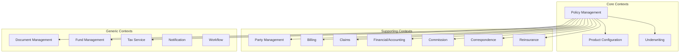

#### 3.2.1 Policy Management Context

**Purpose**: Manages the complete lifecycle of insurance policies from application through termination.

**Key Aggregates**:
- `Policy` (root aggregate): PolicyNumber, Status, EffectiveDate, TerminationDate, PlanCode, CoverageDetails
- `PolicyTransaction`: TransactionType, EffectiveDate, ProcessingDate, Details
- `Coverage`: CoverageType, FaceAmount, BenefitAmount, RiderDetails
- `Beneficiary`: BeneficiaryType, Allocation, Designation

**Key Invariants**:
- A policy must have at least one active coverage
- Beneficiary allocations must total 100%
- Status transitions must follow the state machine
- Effective dates must respect policy anniversary and regulatory constraints

#### 3.2.2 Party Management Context

**Purpose**: Maintains a unified view of all parties (individuals, organizations) and their relationships.

**Key Aggregates**:
- `Party` (root aggregate): PartyId, PartyType (Individual/Organization), Demographics
- `PartyRole`: RoleType (PolicyOwner, Insured, Beneficiary, Agent, Provider), AssociatedEntityId
- `PartyRelationship`: RelationshipType, FromParty, ToParty
- `Address`, `Phone`, `Email`: Contact information with temporal validity

**Key Invariants**:
- A party must have at least one valid contact method
- Role assignments must be validated against business rules
- Identity verification status must be tracked

#### 3.2.3 Product Configuration Context

**Purpose**: Defines insurance products — plans, coverages, riders, rating structures, and business rules.

**Key Aggregates**:
- `Product` (root aggregate): ProductCode, ProductType, ProductStatus, EffectiveDateRange
- `Plan`: PlanCode, CoverageDetails, EligibilityRules, IssueLimits
- `RateTable`: RateTableId, DimensionKeys (Age, Gender, Class, Band), Rates
- `BusinessRule`: RuleId, RuleType, RuleDefinition (decision table, formula, or script)
- `Commission Schedule`: CommissionType, Rates, Qualification

**Key Invariants**:
- Products must have valid rate tables for all issue age/class combinations
- Business rules must be versioned; changes create new versions (never modify in place)
- A product must pass validation before activation

#### 3.2.4 Underwriting Context

**Purpose**: Evaluates risk for insurance applications and determines insurability, classification, and offer terms.

**Key Aggregates**:
- `UnderwritingCase` (root aggregate): CaseId, ApplicationReference, Status, RiskClassification
- `EvidenceRequirement`: RequirementType, Status, DueDate, Vendor
- `RiskAssessment`: AssessmentType (Medical, Financial, Lifestyle), Score, Findings
- `UnderwritingDecision`: DecisionType (Approve, Decline, Counter, Postpone), Terms, Reasons

**Key Invariants**:
- All mandatory evidence must be received before final decision
- Risk classifications must follow the carrier's underwriting guidelines
- Decisions must be auditable with full reasoning trail

#### 3.2.5 Billing Context

**Purpose**: Manages premium billing, payment processing, and premium accounting.

**Key Aggregates**:
- `BillingAccount` (root aggregate): AccountId, BillingMode, BillingDay, PaymentMethod
- `BillingStatement`: StatementId, DueDate, AmountDue, Items
- `Payment`: PaymentId, Amount, PaymentMethod, PaymentDate, AllocationDetails
- `PremiumAccounting`: PolicyId, AccountingPeriod, PremiumEarned, PremiumUnearned

**Key Invariants**:
- Payments must be applied in policy-defined order (cost of insurance → policy charges → fund allocation)
- Grace period rules must be enforced per product and jurisdiction
- Billing mode changes must be prospective

#### 3.2.6 Claims Context

**Purpose**: Handles claim intake, adjudication, and settlement for all claim types.

**Key Aggregates**:
- `Claim` (root aggregate): ClaimId, PolicyReference, ClaimType, LossDate, Status
- `ClaimBenefit`: BenefitType, CoverageReference, CalculatedAmount
- `ClaimDocument`: DocumentType, Status, ReviewNotes
- `ClaimPayment`: PayeeId, Amount, PaymentType, WithholdingDetails

**Key Invariants**:
- Claim must reference a valid in-force policy at the date of loss
- Settlement cannot exceed policy benefit limits
- Tax withholding must comply with jurisdictional requirements

#### 3.2.7 Financial/Accounting Context

**Purpose**: Manages financial valuation, accounting entries, and general ledger interfaces.

**Key Aggregates**:
- `AccountingEntry` (root aggregate): JournalId, DebitAccount, CreditAccount, Amount, PostingDate
- `PolicyReserve`: PolicyId, ReserveType (Statutory, GAAP, Tax, IFRS), Amount, ValuationDate
- `ValuationRun`: RunId, ValuationDate, Methodology, Status
- `GLPosting`: PostingId, LedgerAccount, Amount, Period

**Key Invariants**:
- Journal entries must balance (debits = credits)
- Reserve calculations must use regulator-approved methodologies
- GL postings must reconcile to sub-ledger totals

#### 3.2.8 Commission Context

**Purpose**: Calculates, tracks, and pays agent commissions and manages distribution hierarchies.

**Key Aggregates**:
- `CommissionSchedule` (root aggregate): ScheduleId, CommissionType, Rates, Tiers
- `CommissionTransaction`: TransactionId, AgentId, PolicyId, Amount, Type (FirstYear, Renewal, Override, Bonus)
- `AgentHierarchy`: AgentId, Upline, OverrideLevel, SplitPercentage
- `CommissionStatement`: StatementPeriod, AgentId, Transactions, TotalDue

**Key Invariants**:
- Commission percentages must not exceed 100% across all splits
- Chargeback rules must be enforced per product and contract
- Hierarchy changes must be prospective (no retroactive recalculation without authorization)

#### 3.2.9 Correspondence Context

**Purpose**: Manages template-driven document generation and multi-channel delivery.

**Key Aggregates**:
- `Template` (root aggregate): TemplateId, TemplateType, Version, Content, DataBindings
- `CorrespondenceRequest`: RequestId, TemplateId, DataContext, DeliveryChannel, Priority
- `GeneratedDocument`: DocumentId, Format, ContentHash, ArchiveReference
- `DeliveryRecord`: DeliveryId, Channel, Status, Timestamp

**Key Invariants**:
- Regulatory correspondence must use approved templates
- Generated documents must be archived for retention period
- Delivery status must be tracked for proof of notice

#### 3.2.10 Reinsurance Context

**Purpose**: Manages reinsurance treaties, cessions, and recoveries.

**Key Aggregates**:
- `Treaty` (root aggregate): TreatyId, Reinsurer, TreatyType (Automatic, Facultative), Terms
- `Cession`: CessionId, PolicyReference, CededAmount, RetainedAmount, TreatyReference
- `Bordereau`: BordereauId, Period, TreatyId, CessionDetails
- `Recovery`: RecoveryId, ClaimReference, RecoveryAmount, Status

**Key Invariants**:
- Retention limits must not be exceeded
- Cessions must reference valid treaties
- Bordereau must reconcile to individual cession records

---

## 4. Context Mapping

### 4.1 Context Map Overview

Context mapping defines the relationships between bounded contexts. These relationships determine how contexts communicate, share data, and influence each other.

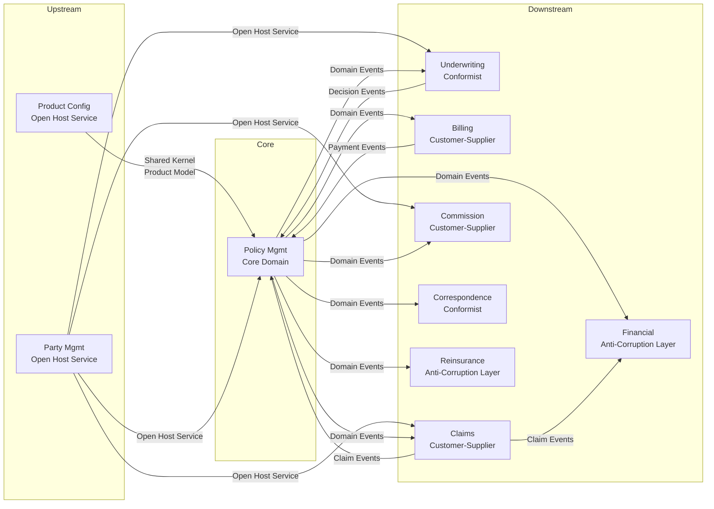

### 4.2 Relationship Patterns

#### 4.2.1 Shared Kernel: Product Configuration ↔ Policy Management

Product Configuration and Policy Management share a kernel of product-related value objects:

```java
// Shared Kernel — published as a library
package com.insurer.pas.shared.product;

public record PlanCode(String value) {
    public PlanCode {
        Objects.requireNonNull(value);
        if (!value.matches("[A-Z]{2}\\d{4}")) {
            throw new IllegalArgumentException("Invalid plan code format");
        }
    }
}

public record CoverageType(String code, String description) {
    public static final CoverageType BASE_LIFE = new CoverageType("BL", "Base Life");
    public static final CoverageType ACCIDENTAL_DEATH = new CoverageType("AD", "Accidental Death");
    public static final CoverageType WAIVER_OF_PREMIUM = new CoverageType("WP", "Waiver of Premium");
    public static final CoverageType TERM_RIDER = new CoverageType("TR", "Term Rider");
}

public record RiskClass(String code, int rank) {
    public static final RiskClass PREFERRED_PLUS = new RiskClass("PP", 1);
    public static final RiskClass PREFERRED = new RiskClass("PR", 2);
    public static final RiskClass STANDARD_PLUS = new RiskClass("SP", 3);
    public static final RiskClass STANDARD = new RiskClass("ST", 4);
    public static final RiskClass SUBSTANDARD = new RiskClass("SS", 5);
}
```

**Governance**: Changes to the shared kernel require agreement from both teams. A shared CI build validates compatibility.

#### 4.2.2 Anti-Corruption Layer: Financial/Accounting

The Financial context has its own domain model that must not be polluted by the Policy context's model. An ACL translates between them:

```java
// Anti-Corruption Layer in Financial Context
public class PolicyEventTranslator {

    public AccountingTransaction translate(PolicyIssuedEvent event) {
        return AccountingTransaction.builder()
            .transactionType(AccountingTransactionType.NEW_BUSINESS)
            .effectiveDate(event.getEffectiveDate())
            .accountingDate(determineAccountingDate(event))
            .entries(Arrays.asList(
                new JournalEntry(
                    LedgerAccount.DEFERRED_ACQUISITION_COST,
                    event.getFirstYearCommission(),
                    EntryType.DEBIT
                ),
                new JournalEntry(
                    LedgerAccount.COMMISSION_PAYABLE,
                    event.getFirstYearCommission(),
                    EntryType.CREDIT
                ),
                new JournalEntry(
                    LedgerAccount.PREMIUM_RECEIVABLE,
                    event.getFirstPremium(),
                    EntryType.DEBIT
                ),
                new JournalEntry(
                    LedgerAccount.UNEARNED_PREMIUM_RESERVE,
                    event.getFirstPremium(),
                    EntryType.CREDIT
                )
            ))
            .policyReference(new FinancialPolicyRef(
                event.getPolicyNumber(),
                event.getProductCode(),
                event.getCompanyCode()
            ))
            .build();
    }

    private LocalDate determineAccountingDate(PolicyIssuedEvent event) {
        // Accounting date rules: use paid-to date or effective date,
        // depending on accounting methodology
        if (event.getPaidToDate() != null) {
            return event.getPaidToDate();
        }
        return event.getEffectiveDate();
    }
}
```

#### 4.2.3 Open Host Service: Party Management

Party Management exposes a well-defined, versioned API that other contexts consume:

```yaml
# Party Management Open Host Service (OpenAPI 3.0)
openapi: 3.0.3
info:
  title: Party Management Service API
  version: 2.1.0
  description: Open Host Service for party data access

paths:
  /api/v2/parties/{partyId}:
    get:
      operationId: getParty
      summary: Retrieve party by ID
      parameters:
        - name: partyId
          in: path
          required: true
          schema:
            type: string
            format: uuid
      responses:
        '200':
          description: Party found
          content:
            application/json:
              schema:
                $ref: '#/components/schemas/Party'

  /api/v2/parties/search:
    post:
      operationId: searchParties
      summary: Search parties by criteria
      requestBody:
        content:
          application/json:
            schema:
              $ref: '#/components/schemas/PartySearchCriteria'
      responses:
        '200':
          description: Search results
          content:
            application/json:
              schema:
                $ref: '#/components/schemas/PartySearchResult'

components:
  schemas:
    Party:
      type: object
      properties:
        partyId:
          type: string
          format: uuid
        partyType:
          type: string
          enum: [INDIVIDUAL, ORGANIZATION]
        name:
          $ref: '#/components/schemas/PartyName'
        identifiers:
          type: array
          items:
            $ref: '#/components/schemas/PartyIdentifier'
        addresses:
          type: array
          items:
            $ref: '#/components/schemas/Address'
        roles:
          type: array
          items:
            $ref: '#/components/schemas/PartyRole'
```

#### 4.2.4 Customer-Supplier: Policy Management → Billing

Policy Management (upstream/supplier) provides billing-relevant data to Billing (downstream/customer). Billing defines what it needs, and Policy commits to providing it:

```java
// Billing Context — defines its needs via an interface
public interface PolicyBillingDataProvider {
    BillingSetupData getBillingSetupData(String policyNumber);
    PremiumSchedule getPremiumSchedule(String policyNumber, LocalDate effectiveDate);
    List<BillingChange> getPendingBillingChanges(String policyNumber);
}

// Event that Billing subscribes to
public record PolicyIssuedForBilling(
    String policyNumber,
    String planCode,
    String billingMode,         // Monthly, Quarterly, Semi-Annual, Annual
    BigDecimal modalPremium,
    LocalDate billingEffectiveDate,
    String paymentMethod,       // ACH, DirectBill, ListBill, PayrollDeduction
    PayorInfo payor,
    BankAccountInfo bankAccount // if ACH
) implements DomainEvent {}
```

#### 4.2.5 Conformist: Correspondence → Policy Management

Correspondence conforms to the Policy context's model for policy data, translating it into its own document data model:

```java
// Correspondence Context — conforms to Policy events
public class PolicyEventToCorrespondenceMapper {

    public CorrespondenceRequest mapPolicyIssued(PolicyIssuedEvent event) {
        Map<String, Object> dataContext = new HashMap<>();
        dataContext.put("policyNumber", event.getPolicyNumber());
        dataContext.put("ownerName", event.getOwnerName());
        dataContext.put("planDescription", event.getPlanDescription());
        dataContext.put("faceAmount", event.getFaceAmount());
        dataContext.put("effectiveDate", event.getEffectiveDate());
        dataContext.put("modalPremium", event.getModalPremium());
        dataContext.put("billingMode", event.getBillingMode());
        
        return CorrespondenceRequest.builder()
            .templateCode("POL_ISSUE_PKG")
            .recipientPartyId(event.getOwnerPartyId())
            .deliveryChannels(List.of(
                DeliveryChannel.PRINT_MAIL,
                DeliveryChannel.ELECTRONIC_PORTAL
            ))
            .dataContext(dataContext)
            .priority(Priority.HIGH)
            .regulatoryRequired(true)
            .build();
    }
}
```

---

## 5. Service Decomposition

### 5.1 Complete Service Decomposition Diagram

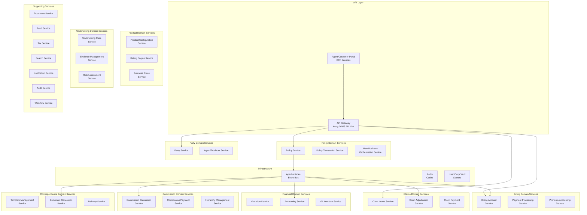

### 5.2 Policy Service

The Policy Service is the core service managing policy lifecycle and state.

**Responsibilities**:
- Policy CRUD operations
- Policy state machine management
- Policy transaction processing (endorsements, changes)
- Coverage and rider management
- Beneficiary management
- Policy search and retrieval

**State Machine**:

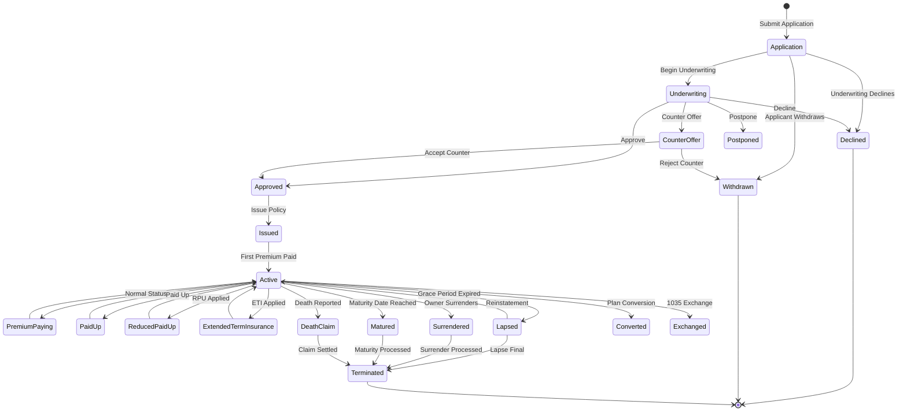

**Domain Model**:

```java
@Aggregate
public class Policy {
    private PolicyId policyId;
    private PolicyNumber policyNumber;
    private PolicyStatus status;
    private PlanCode planCode;
    private LocalDate applicationDate;
    private LocalDate effectiveDate;
    private LocalDate issueDate;
    private LocalDate terminationDate;
    private PartyReference owner;
    private List<Coverage> coverages;
    private List<Beneficiary> beneficiaries;
    private List<PolicyTransaction> transactionHistory;
    private PolicyValues currentValues;
    private FundAllocations fundAllocations; // for UL/VUL products
    
    // State transition methods enforce invariants
    public PolicyIssuedEvent issue(IssueCommand command) {
        assertStatus(PolicyStatus.APPROVED);
        assertAllCoveragesValid();
        assertBeneficiaryAllocationsComplete();
        
        this.status = PolicyStatus.ISSUED;
        this.issueDate = command.getIssueDate();
        this.policyNumber = command.getAssignedPolicyNumber();
        
        return new PolicyIssuedEvent(
            this.policyId, this.policyNumber, this.planCode,
            this.effectiveDate, this.issueDate,
            this.owner, this.coverages, this.beneficiaries,
            calculateFirstPremium()
        );
    }
    
    public PolicyChangeAppliedEvent applyChange(PolicyChangeCommand command) {
        assertStatus(PolicyStatus.ACTIVE);
        assertChangeAllowed(command.getChangeType());
        validateChangeEffectiveDate(command.getEffectiveDate());
        
        PolicyTransaction transaction = PolicyTransaction.create(
            command.getChangeType(),
            command.getEffectiveDate(),
            command.getDetails()
        );
        
        applyTransactionEffects(transaction);
        this.transactionHistory.add(transaction);
        
        return new PolicyChangeAppliedEvent(
            this.policyId, this.policyNumber,
            transaction.getTransactionId(),
            command.getChangeType(),
            command.getEffectiveDate(),
            transaction.getEffects()
        );
    }
    
    public PolicyLapsedEvent lapse(LapseCommand command) {
        assertStatus(PolicyStatus.ACTIVE);
        
        // Check for non-forfeiture options
        NonForfeitureOption nfo = determineNonForfeitureOption();
        if (nfo != null) {
            return applyNonForfeiture(nfo, command);
        }
        
        this.status = PolicyStatus.LAPSED;
        return new PolicyLapsedEvent(
            this.policyId, this.policyNumber,
            command.getLapseDate(),
            command.getLapseReason()
        );
    }
    
    private void assertStatus(PolicyStatus expected) {
        if (this.status != expected) {
            throw new InvalidPolicyStateException(
                "Expected status %s but was %s".formatted(expected, this.status)
            );
        }
    }
    
    private void assertBeneficiaryAllocationsComplete() {
        BigDecimal totalPrimary = beneficiaries.stream()
            .filter(b -> b.getDesignation() == BeneficiaryDesignation.PRIMARY)
            .map(Beneficiary::getAllocationPercent)
            .reduce(BigDecimal.ZERO, BigDecimal::add);
        
        if (totalPrimary.compareTo(new BigDecimal("100.00")) != 0) {
            throw new PolicyValidationException(
                "Primary beneficiary allocations must total 100%, currently: " + totalPrimary
            );
        }
    }
}
```

**Database Schema (Policy Service)**:

```sql
-- Policy Service Database (PostgreSQL)
CREATE TABLE policies (
    policy_id UUID PRIMARY KEY DEFAULT gen_random_uuid(),
    policy_number VARCHAR(20) UNIQUE,
    status VARCHAR(30) NOT NULL,
    plan_code VARCHAR(10) NOT NULL,
    application_date DATE NOT NULL,
    effective_date DATE,
    issue_date DATE,
    termination_date DATE,
    termination_reason VARCHAR(30),
    owner_party_id UUID NOT NULL,
    issue_state VARCHAR(2),
    issue_age INTEGER,
    created_at TIMESTAMP WITH TIME ZONE DEFAULT NOW(),
    updated_at TIMESTAMP WITH TIME ZONE DEFAULT NOW(),
    version BIGINT NOT NULL DEFAULT 0  -- Optimistic locking
);

CREATE TABLE coverages (
    coverage_id UUID PRIMARY KEY DEFAULT gen_random_uuid(),
    policy_id UUID NOT NULL REFERENCES policies(policy_id),
    coverage_type VARCHAR(10) NOT NULL,
    coverage_status VARCHAR(20) NOT NULL,
    face_amount NUMERIC(15,2),
    benefit_amount NUMERIC(15,2),
    insured_party_id UUID NOT NULL,
    effective_date DATE NOT NULL,
    termination_date DATE,
    risk_class VARCHAR(5),
    rate_class VARCHAR(10),
    table_rating INTEGER DEFAULT 0,
    flat_extra NUMERIC(10,4) DEFAULT 0,
    created_at TIMESTAMP WITH TIME ZONE DEFAULT NOW()
);

CREATE TABLE beneficiaries (
    beneficiary_id UUID PRIMARY KEY DEFAULT gen_random_uuid(),
    policy_id UUID NOT NULL REFERENCES policies(policy_id),
    coverage_id UUID REFERENCES coverages(coverage_id),
    party_id UUID NOT NULL,
    designation VARCHAR(15) NOT NULL, -- PRIMARY, CONTINGENT, TERTIARY
    allocation_percent NUMERIC(5,2) NOT NULL,
    relationship VARCHAR(30),
    irrevocable BOOLEAN DEFAULT FALSE,
    effective_date DATE NOT NULL,
    termination_date DATE,
    created_at TIMESTAMP WITH TIME ZONE DEFAULT NOW()
);

CREATE TABLE policy_transactions (
    transaction_id UUID PRIMARY KEY DEFAULT gen_random_uuid(),
    policy_id UUID NOT NULL REFERENCES policies(policy_id),
    transaction_type VARCHAR(30) NOT NULL,
    effective_date DATE NOT NULL,
    processing_date TIMESTAMP WITH TIME ZONE NOT NULL DEFAULT NOW(),
    status VARCHAR(20) NOT NULL,
    details JSONB NOT NULL,
    created_by VARCHAR(50) NOT NULL,
    created_at TIMESTAMP WITH TIME ZONE DEFAULT NOW()
);

CREATE TABLE policy_values (
    value_id UUID PRIMARY KEY DEFAULT gen_random_uuid(),
    policy_id UUID NOT NULL REFERENCES policies(policy_id),
    valuation_date DATE NOT NULL,
    cash_value NUMERIC(15,2),
    surrender_value NUMERIC(15,2),
    death_benefit NUMERIC(15,2),
    loan_value NUMERIC(15,2),
    accumulated_value NUMERIC(15,2),  -- for UL products
    net_amount_at_risk NUMERIC(15,2),
    created_at TIMESTAMP WITH TIME ZONE DEFAULT NOW(),
    UNIQUE(policy_id, valuation_date)
);

CREATE INDEX idx_policies_status ON policies(status);
CREATE INDEX idx_policies_owner ON policies(owner_party_id);
CREATE INDEX idx_policies_plan ON policies(plan_code);
CREATE INDEX idx_coverages_policy ON coverages(policy_id);
CREATE INDEX idx_beneficiaries_policy ON beneficiaries(policy_id);
CREATE INDEX idx_transactions_policy ON policy_transactions(policy_id);
CREATE INDEX idx_transactions_date ON policy_transactions(effective_date);
```

### 5.3 Party Service

**Responsibilities**:
- Party CRUD (individuals and organizations)
- Identity management (SSN, TIN, DOB verification)
- Address management with USPS validation
- Relationship management (family, business)
- Role management (owner, insured, beneficiary, agent)
- Party search with fuzzy matching
- Duplicate detection and merge

**ERD**:

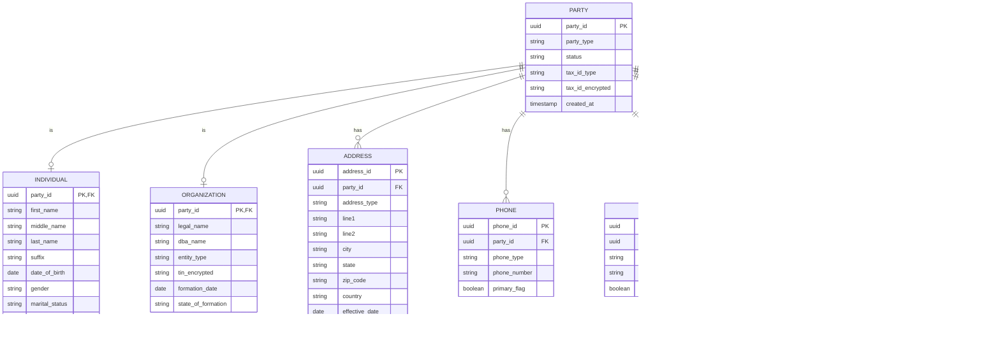

### 5.4 Product Configuration Service

**Responsibilities**:
- Product/Plan definition and lifecycle management
- Rate table management (mortality, expense, lapse, interest)
- Business rule definition (eligibility, limits, validation)
- Commission schedule definition
- Product versioning (effective-dated)
- Product approval workflow

```java
@Aggregate
public class Product {
    private ProductCode productCode;
    private String productName;
    private ProductType productType; // WHOLE_LIFE, TERM, UNIVERSAL_LIFE, VARIABLE_LIFE, ANNUITY
    private ProductStatus status;
    private LocalDate effectiveDate;
    private LocalDate terminationDate;
    private List<Plan> plans;
    private List<RateTable> rateTables;
    private List<BusinessRule> businessRules;
    private List<CommissionSchedule> commissionSchedules;
    private ProductVersion version;
    
    public Plan getPlanForIssue(PlanCode planCode, LocalDate issueDate) {
        return plans.stream()
            .filter(p -> p.getPlanCode().equals(planCode))
            .filter(p -> p.isEffective(issueDate))
            .filter(p -> p.getStatus() == PlanStatus.ACTIVE)
            .findFirst()
            .orElseThrow(() -> new PlanNotFoundException(planCode, issueDate));
    }
    
    public BigDecimal calculatePremium(RatingRequest request) {
        Plan plan = getPlanForIssue(request.getPlanCode(), request.getEffectiveDate());
        RateTable rateTable = findApplicableRateTable(plan, request);
        
        BigDecimal baseRate = rateTable.lookup(
            request.getIssueAge(),
            request.getGender(),
            request.getRiskClass(),
            request.getBandForAmount(request.getFaceAmount())
        );
        
        BigDecimal annualPremium = baseRate
            .multiply(request.getFaceAmount())
            .divide(new BigDecimal("1000"), 2, RoundingMode.HALF_UP);
        
        // Apply table rating and flat extra
        if (request.getTableRating() > 0) {
            BigDecimal tableRatingFactor = BigDecimal.ONE.add(
                new BigDecimal(request.getTableRating()).multiply(new BigDecimal("0.25"))
            );
            annualPremium = annualPremium.multiply(tableRatingFactor);
        }
        
        if (request.getFlatExtra().compareTo(BigDecimal.ZERO) > 0) {
            annualPremium = annualPremium.add(
                request.getFlatExtra()
                    .multiply(request.getFaceAmount())
                    .divide(new BigDecimal("1000"), 2, RoundingMode.HALF_UP)
            );
        }
        
        // Apply modal factor for billing frequency
        BigDecimal modalFactor = plan.getModalFactor(request.getBillingMode());
        return annualPremium.multiply(modalFactor)
            .setScale(2, RoundingMode.HALF_UP);
    }
}
```

### 5.5 Underwriting Service

**Responsibilities**:
- Underwriting case management
- Evidence ordering and tracking (MIB, MVR, APS, labs, inspections)
- Automated underwriting rules engine (straight-through processing)
- Risk classification and scoring
- Decision management (approve, decline, counter-offer, postpone)
- Underwriter workbench support

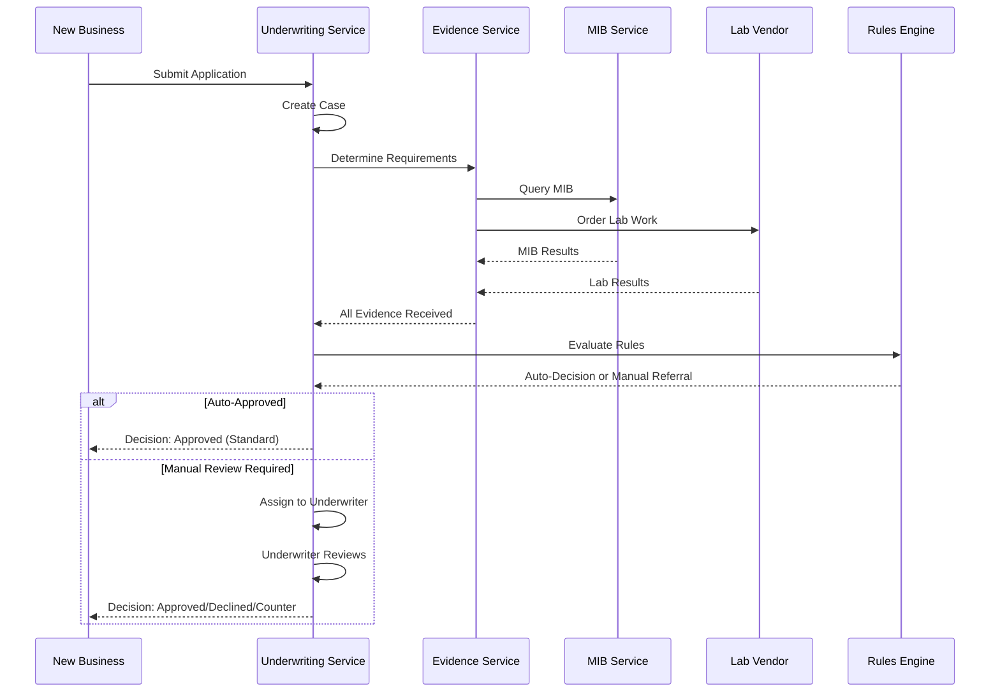

### 5.6 Billing Service

**Responsibilities**:
- Billing account setup and management
- Premium billing cycle execution (generate statements)
- Payment processing (ACH, credit card, EFT, check)
- Payment application (allocation across policies in list bill)
- Grace period tracking
- Lapse/reinstatement processing
- Premium mode changes
- Non-sufficient funds (NSF) handling
- Payment plan management

```sql
-- Billing Service Database
CREATE TABLE billing_accounts (
    account_id UUID PRIMARY KEY DEFAULT gen_random_uuid(),
    account_number VARCHAR(20) UNIQUE NOT NULL,
    account_type VARCHAR(20) NOT NULL, -- INDIVIDUAL, LIST_BILL, PAYROLL
    billing_mode VARCHAR(15) NOT NULL, -- MONTHLY, QUARTERLY, SEMIANNUAL, ANNUAL
    billing_day INTEGER NOT NULL CHECK (billing_day BETWEEN 1 AND 28),
    payment_method VARCHAR(20) NOT NULL, -- ACH, DIRECT_BILL, LIST_BILL, PAYROLL
    status VARCHAR(20) NOT NULL,
    payor_party_id UUID NOT NULL,
    bank_account_id UUID,
    created_at TIMESTAMP WITH TIME ZONE DEFAULT NOW()
);

CREATE TABLE billing_account_policies (
    id UUID PRIMARY KEY DEFAULT gen_random_uuid(),
    account_id UUID NOT NULL REFERENCES billing_accounts(account_id),
    policy_id UUID NOT NULL,
    policy_number VARCHAR(20) NOT NULL,
    modal_premium NUMERIC(12,2) NOT NULL,
    billing_effective_date DATE NOT NULL,
    billing_termination_date DATE,
    status VARCHAR(20) NOT NULL
);

CREATE TABLE billing_statements (
    statement_id UUID PRIMARY KEY DEFAULT gen_random_uuid(),
    account_id UUID NOT NULL REFERENCES billing_accounts(account_id),
    statement_date DATE NOT NULL,
    due_date DATE NOT NULL,
    total_amount_due NUMERIC(12,2) NOT NULL,
    minimum_amount_due NUMERIC(12,2) NOT NULL,
    status VARCHAR(20) NOT NULL, -- GENERATED, SENT, PAID, PARTIAL, PAST_DUE
    grace_expiration_date DATE,
    created_at TIMESTAMP WITH TIME ZONE DEFAULT NOW()
);

CREATE TABLE billing_statement_items (
    item_id UUID PRIMARY KEY DEFAULT gen_random_uuid(),
    statement_id UUID NOT NULL REFERENCES billing_statements(statement_id),
    policy_id UUID NOT NULL,
    item_type VARCHAR(30) NOT NULL, -- PREMIUM, POLICY_FEE, LOAN_INTEREST, RIDER_PREMIUM
    amount NUMERIC(12,2) NOT NULL,
    description VARCHAR(100)
);

CREATE TABLE payments (
    payment_id UUID PRIMARY KEY DEFAULT gen_random_uuid(),
    account_id UUID NOT NULL REFERENCES billing_accounts(account_id),
    payment_date DATE NOT NULL,
    amount NUMERIC(12,2) NOT NULL,
    payment_method VARCHAR(20) NOT NULL,
    payment_source VARCHAR(50), -- bank account reference, check number
    status VARCHAR(20) NOT NULL, -- PENDING, APPLIED, RETURNED, REVERSED
    reference_number VARCHAR(50),
    created_at TIMESTAMP WITH TIME ZONE DEFAULT NOW()
);

CREATE TABLE payment_allocations (
    allocation_id UUID PRIMARY KEY DEFAULT gen_random_uuid(),
    payment_id UUID NOT NULL REFERENCES payments(payment_id),
    policy_id UUID NOT NULL,
    statement_item_id UUID REFERENCES billing_statement_items(item_id),
    amount NUMERIC(12,2) NOT NULL,
    allocation_type VARCHAR(30) NOT NULL
);
```

### 5.7 Claims Service

**Responsibilities**:
- Claim intake and registration (multiple claim types: death, disability, accelerated benefit, waiver)
- Claim validation (policy in-force at loss date, coverage verification)
- Document management for claims (death certificates, medical records, police reports)
- Adjudication support (benefit calculation, exclusion checking)
- Payment authorization and disbursement
- Tax withholding (1099-R generation)
- Reinsurance recovery initiation

### 5.8 Financial/Accounting Service

**Responsibilities**:
- Policy reserve calculations (statutory, GAAP, tax, IFRS 17)
- Accounting entry generation (double-entry bookkeeping)
- General ledger interface (batch posting to GL)
- Financial reporting (statutory annual statement, GAAP financials)
- Cash flow projection
- Sub-ledger reconciliation

### 5.9 Commission Service

**Responsibilities**:
- Commission calculation (first-year, renewal, override, bonus, trail)
- Agent hierarchy management (upline/downline, split percentages)
- Commission statement generation
- Chargeback processing (policy lapse within chargeback period)
- Commission advance and recovery
- Compensation plan management

### 5.10 Correspondence Service

**Responsibilities**:
- Template management (creation, versioning, approval workflow)
- Data assembly for document generation
- Document generation (PDF, HTML, print-ready formats)
- Multi-channel delivery (print/mail, email, portal, fax)
- Delivery tracking and proof of mailing
- Regulatory template compliance

### 5.11 Document Service

**Responsibilities**:
- Document ingestion (scan, upload, email, fax)
- Document classification (ML-based categorization)
- Document indexing and metadata management
- Document storage (encrypted, with retention policies)
- Document retrieval and search
- OCR and data extraction

### 5.12 Fund Service (for UL/VUL products)

**Responsibilities**:
- Fund/sub-account setup and management
- Unit valuation (daily NAV calculation)
- Fund transfer processing (policyholder-directed)
- Dollar-cost averaging
- Automatic asset rebalancing
- Fund performance tracking

### 5.13 Tax Service

**Responsibilities**:
- Tax withholding calculation (federal, state)
- Cost basis tracking (IRC Section 72)
- 1099-R generation and filing
- 1035 exchange basis transfer
- Modified endowment contract (MEC) testing
- Tax reporting to IRS and state authorities

---

## 6. Data Ownership & Boundaries

### 6.1 Principle: Each Service Owns Its Data

The single most important principle in microservices data architecture is **service data sovereignty**. Each service owns its data store, and no other service may directly access it.

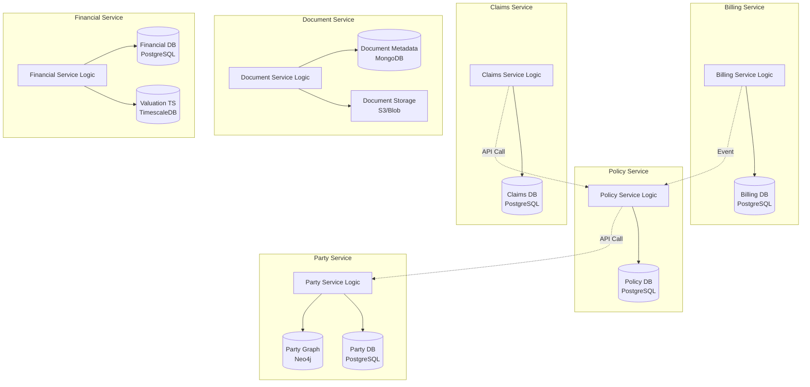

### 6.2 Shared Data Patterns

#### 6.2.1 Event-Carried State Transfer

When a downstream service needs data from an upstream service frequently, use event-carried state transfer to maintain a local read-only copy:

```java
// Billing Service maintains a local copy of policy data it needs
@EventHandler
public class PolicyDataProjection {
    
    private final PolicyBillingDataRepository repository;
    
    @HandleEvent
    public void on(PolicyIssuedEvent event) {
        PolicyBillingData data = PolicyBillingData.builder()
            .policyId(event.getPolicyId())
            .policyNumber(event.getPolicyNumber())
            .planCode(event.getPlanCode())
            .ownerPartyId(event.getOwnerPartyId())
            .ownerName(event.getOwnerName())
            .effectiveDate(event.getEffectiveDate())
            .modalPremium(event.getModalPremium())
            .billingMode(event.getBillingMode())
            .status(PolicyBillingStatus.ACTIVE)
            .build();
        
        repository.save(data);
    }
    
    @HandleEvent
    public void on(PolicyChangedEvent event) {
        PolicyBillingData data = repository.findByPolicyId(event.getPolicyId())
            .orElseThrow();
        
        if (event.affectsBilling()) {
            data.setModalPremium(event.getNewModalPremium());
            data.setBillingMode(event.getNewBillingMode());
            repository.save(data);
        }
    }
    
    @HandleEvent
    public void on(PolicyTerminatedEvent event) {
        PolicyBillingData data = repository.findByPolicyId(event.getPolicyId())
            .orElseThrow();
        data.setStatus(PolicyBillingStatus.TERMINATED);
        data.setTerminationDate(event.getTerminationDate());
        repository.save(data);
    }
}
```

#### 6.2.2 API Composition

For queries that span multiple services, use an API composition layer (typically in a BFF — Backend for Frontend):

```java
// New Business BFF — composes data from multiple services
@RestController
@RequestMapping("/api/v1/new-business")
public class NewBusinessBFFController {
    
    private final PolicyServiceClient policyClient;
    private final PartyServiceClient partyClient;
    private final UnderwritingServiceClient uwClient;
    private final ProductServiceClient productClient;
    
    @GetMapping("/applications/{applicationId}/summary")
    public ApplicationSummaryDTO getApplicationSummary(
            @PathVariable String applicationId) {
        
        // Parallel calls to assemble the composite view
        CompletableFuture<PolicyApplication> applicationFuture =
            CompletableFuture.supplyAsync(() -> 
                policyClient.getApplication(applicationId));
        
        CompletableFuture<UnderwritingCase> uwCaseFuture =
            applicationFuture.thenCompose(app ->
                CompletableFuture.supplyAsync(() ->
                    uwClient.getCaseByApplication(app.getApplicationId())));
        
        CompletableFuture<PartyDTO> ownerFuture =
            applicationFuture.thenCompose(app ->
                CompletableFuture.supplyAsync(() ->
                    partyClient.getParty(app.getOwnerPartyId())));
        
        CompletableFuture<ProductDTO> productFuture =
            applicationFuture.thenCompose(app ->
                CompletableFuture.supplyAsync(() ->
                    productClient.getProduct(app.getProductCode())));
        
        CompletableFuture.allOf(
            applicationFuture, uwCaseFuture, ownerFuture, productFuture
        ).join();
        
        return ApplicationSummaryDTO.builder()
            .application(applicationFuture.join())
            .underwritingCase(uwCaseFuture.join())
            .owner(ownerFuture.join())
            .product(productFuture.join())
            .build();
    }
}
```

### 6.3 Data Consistency Strategies

#### 6.3.1 Eventual Consistency

Most cross-service operations in PAS can tolerate eventual consistency within well-defined time bounds:

| Operation | Consistency Requirement | Acceptable Lag |
|---|---|---|
| Policy issuance → Billing setup | Eventual | < 30 seconds |
| Premium payment → Policy values update | Eventual | < 5 minutes |
| Policy change → Commission adjustment | Eventual | < 1 hour |
| Death claim → Reinsurance recovery | Eventual | < 24 hours |
| Policy transaction → GL posting | Eventual | < end of business day |
| Daily valuation → Fund unit prices | Eventual | < 1 hour after market close |

#### 6.3.2 Outbox Pattern for Reliable Event Publishing

To ensure reliable event publishing without distributed transactions:

```java
// Transactional outbox pattern
@Service
public class PolicyService {
    
    private final PolicyRepository policyRepository;
    private final OutboxRepository outboxRepository;
    
    @Transactional
    public Policy issuePolicy(IssuePolicyCommand command) {
        Policy policy = policyRepository.findById(command.getPolicyId())
            .orElseThrow();
        
        PolicyIssuedEvent event = policy.issue(command);
        
        // Save both in the same transaction
        policyRepository.save(policy);
        outboxRepository.save(new OutboxMessage(
            "policy-events",
            policy.getPolicyId().toString(),
            "PolicyIssued",
            serialize(event),
            Instant.now()
        ));
        
        return policy;
    }
}

// Outbox poller publishes events to Kafka
@Component
public class OutboxPoller {
    
    private final OutboxRepository outboxRepository;
    private final KafkaTemplate<String, String> kafkaTemplate;
    
    @Scheduled(fixedDelay = 100) // Poll every 100ms
    @Transactional
    public void publishOutboxMessages() {
        List<OutboxMessage> messages = outboxRepository
            .findUnpublishedOrderByCreatedAt(100);
        
        for (OutboxMessage message : messages) {
            kafkaTemplate.send(
                message.getTopic(),
                message.getAggregateId(),
                message.getPayload()
            ).whenComplete((result, ex) -> {
                if (ex == null) {
                    message.markPublished();
                    outboxRepository.save(message);
                }
            });
        }
    }
}
```

---

## 7. API Design per Service

### 7.1 REST Resource Design Principles

Each service exposes RESTful APIs following these conventions:

- **Resource-oriented URLs**: `/api/v1/policies/{policyId}/coverages/{coverageId}`
- **HTTP methods**: GET (read), POST (create), PUT (full update), PATCH (partial update), DELETE
- **Consistent response format**: Standard envelope with data, metadata, and error structures
- **HATEOAS links**: For discoverability of related resources and available actions
- **Pagination**: Cursor-based for large collections
- **Filtering**: Query parameters for common filters, request body for complex filters

### 7.2 API Contract Example: Policy Service

```yaml
openapi: 3.0.3
info:
  title: Policy Service API
  version: 3.0.0
  description: |
    Core policy lifecycle management API. Manages policies from 
    application through termination.

servers:
  - url: https://api.internal.insurer.com/policy-service
    description: Internal API (service mesh)
  - url: https://api.insurer.com/v3
    description: External API (through gateway)

paths:
  /api/v3/policies:
    get:
      operationId: listPolicies
      summary: List policies with filtering
      parameters:
        - name: status
          in: query
          schema:
            type: string
            enum: [APPLICATION, UNDERWRITING, APPROVED, ISSUED, ACTIVE, LAPSED, TERMINATED]
        - name: ownerPartyId
          in: query
          schema:
            type: string
            format: uuid
        - name: planCode
          in: query
          schema:
            type: string
        - name: cursor
          in: query
          schema:
            type: string
        - name: limit
          in: query
          schema:
            type: integer
            default: 25
            maximum: 100
      responses:
        '200':
          description: Paginated list of policies
          content:
            application/json:
              schema:
                $ref: '#/components/schemas/PolicyListResponse'
    post:
      operationId: createPolicyApplication
      summary: Create a new policy application
      requestBody:
        required: true
        content:
          application/json:
            schema:
              $ref: '#/components/schemas/CreatePolicyApplicationRequest'
      responses:
        '201':
          description: Application created
          headers:
            Location:
              schema:
                type: string
          content:
            application/json:
              schema:
                $ref: '#/components/schemas/PolicyResponse'
        '422':
          description: Validation errors
          content:
            application/json:
              schema:
                $ref: '#/components/schemas/ValidationErrorResponse'

  /api/v3/policies/{policyId}:
    get:
      operationId: getPolicy
      summary: Get policy details
      parameters:
        - $ref: '#/components/parameters/PolicyId'
        - name: include
          in: query
          description: Related resources to include
          schema:
            type: array
            items:
              type: string
              enum: [coverages, beneficiaries, values, transactions]
      responses:
        '200':
          description: Policy details
          content:
            application/json:
              schema:
                $ref: '#/components/schemas/PolicyDetailResponse'

  /api/v3/policies/{policyId}/transactions:
    post:
      operationId: submitPolicyTransaction
      summary: Submit a policy change transaction
      parameters:
        - $ref: '#/components/parameters/PolicyId'
      requestBody:
        required: true
        content:
          application/json:
            schema:
              $ref: '#/components/schemas/PolicyTransactionRequest'
      responses:
        '202':
          description: Transaction accepted for processing
          content:
            application/json:
              schema:
                $ref: '#/components/schemas/TransactionAcceptedResponse'

  /api/v3/policies/{policyId}/coverages:
    get:
      operationId: listCoverages
      parameters:
        - $ref: '#/components/parameters/PolicyId'
      responses:
        '200':
          description: List of coverages
          content:
            application/json:
              schema:
                $ref: '#/components/schemas/CoverageListResponse'

  /api/v3/policies/{policyId}/beneficiaries:
    get:
      operationId: listBeneficiaries
      parameters:
        - $ref: '#/components/parameters/PolicyId'
      responses:
        '200':
          description: List of beneficiaries
    put:
      operationId: updateBeneficiaries
      summary: Update all beneficiary designations
      parameters:
        - $ref: '#/components/parameters/PolicyId'
      requestBody:
        required: true
        content:
          application/json:
            schema:
              $ref: '#/components/schemas/BeneficiaryUpdateRequest'
      responses:
        '200':
          description: Beneficiaries updated

components:
  parameters:
    PolicyId:
      name: policyId
      in: path
      required: true
      schema:
        type: string
        format: uuid

  schemas:
    PolicyResponse:
      type: object
      properties:
        data:
          $ref: '#/components/schemas/Policy'
        links:
          $ref: '#/components/schemas/HATEOASLinks'
    
    Policy:
      type: object
      properties:
        policyId:
          type: string
          format: uuid
        policyNumber:
          type: string
        status:
          type: string
        planCode:
          type: string
        applicationDate:
          type: string
          format: date
        effectiveDate:
          type: string
          format: date
        issueDate:
          type: string
          format: date
        ownerPartyId:
          type: string
          format: uuid
        issueState:
          type: string
        issueAge:
          type: integer

    HATEOASLinks:
      type: object
      properties:
        self:
          type: string
        coverages:
          type: string
        beneficiaries:
          type: string
        transactions:
          type: string
        values:
          type: string
        availableActions:
          type: array
          items:
            $ref: '#/components/schemas/ActionLink'

    ActionLink:
      type: object
      properties:
        action:
          type: string
        href:
          type: string
        method:
          type: string
```

### 7.3 API Versioning Strategy

```
Versioning approach: URL-based major versions, header-based minor versions

Major version: Breaking changes → /api/v3/ → /api/v4/
Minor version: Non-breaking additions → Accept-Version: 3.2 header

Rules:
1. Adding optional fields to responses → minor version (backward compatible)
2. Adding required fields to requests → major version (breaking)
3. Removing fields → major version (breaking)
4. Changing field semantics → major version (breaking)
5. Adding new endpoints → minor version (backward compatible)
6. Adding new enum values → treat as breaking (consumers may not handle)

Sunset policy:
- N-1 version supported for 18 months after N release
- N-2 version receives security patches only for 6 months
- Deprecation headers returned: Sunset: <date>, Deprecation: true
```

### 7.4 Internal vs External API Boundaries

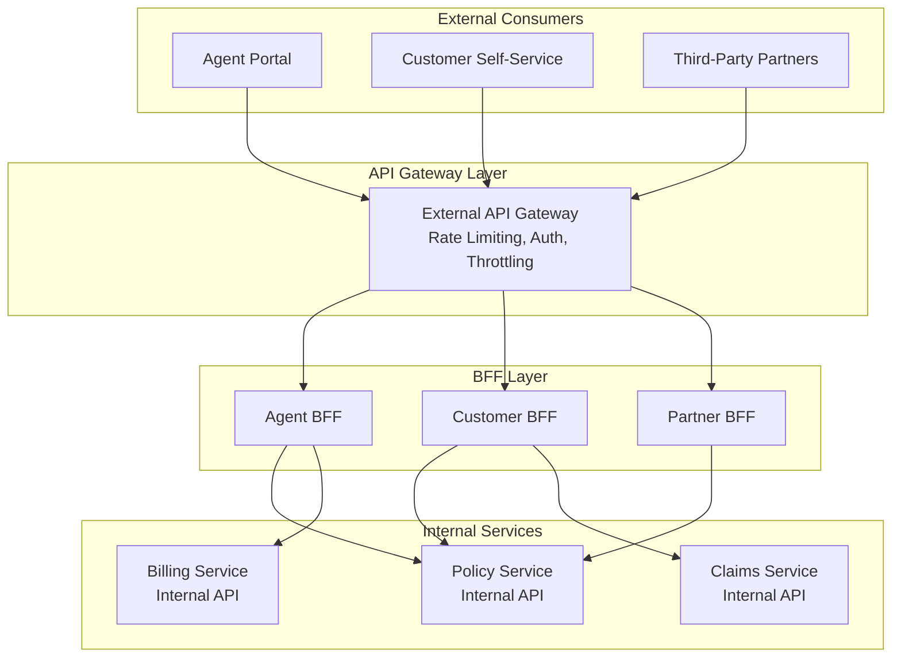

**External APIs** (through gateway):
- OAuth 2.0 / OIDC authentication
- Rate limiting per client
- Request/response filtering (no internal IDs exposed)
- API key management
- Usage analytics
- Versioned and documented for consumers

**Internal APIs** (service-to-service within mesh):
- mTLS authentication (service mesh)
- No rate limiting (use circuit breakers instead)
- Full domain model exposure
- Service discovery (Kubernetes DNS)
- Contract testing between services

---

## 8. Inter-Service Communication

### 8.1 Communication Decision Matrix

| Use Case | Pattern | Protocol | Rationale |
|---|---|---|---|
| Get policy details for display | Synchronous Request | REST/gRPC | UI needs immediate response |
| Get rate table for premium calc | Synchronous Request | gRPC | High performance, typed contract |
| Submit new business application | Async Command | Kafka command topic | Long-running process, no immediate response needed |
| Policy issued → billing setup | Async Event | Kafka event topic | Downstream reaction, loose coupling |
| Policy issued → correspondence | Async Event | Kafka event topic | Downstream reaction, loose coupling |
| Payment received → policy update | Async Event | Kafka event topic | Cross-context state change |
| Batch valuation processing | Async Batch | Kafka + batch processing | Large volume, no real-time need |
| Health check / readiness | Synchronous Probe | HTTP GET | Infrastructure requirement |

### 8.2 Synchronous Communication (REST)

```java
// REST client with resilience patterns (using Resilience4j)
@Configuration
public class PolicyServiceClientConfig {
    
    @Bean
    public CircuitBreaker policyServiceCircuitBreaker() {
        return CircuitBreaker.of("policy-service", CircuitBreakerConfig.custom()
            .failureRateThreshold(50)
            .waitDurationInOpenState(Duration.ofSeconds(30))
            .slidingWindowSize(10)
            .permittedNumberOfCallsInHalfOpenState(3)
            .recordExceptions(IOException.class, TimeoutException.class)
            .ignoreExceptions(PolicyNotFoundException.class)
            .build());
    }
    
    @Bean
    public Retry policyServiceRetry() {
        return Retry.of("policy-service", RetryConfig.custom()
            .maxAttempts(3)
            .waitDuration(Duration.ofMillis(500))
            .exponentialBackoff(2, Duration.ofSeconds(5))
            .retryExceptions(IOException.class, TimeoutException.class)
            .ignoreExceptions(PolicyNotFoundException.class)
            .build());
    }
    
    @Bean
    public TimeLimiter policyServiceTimeLimiter() {
        return TimeLimiter.of("policy-service", TimeLimiterConfig.custom()
            .timeoutDuration(Duration.ofSeconds(5))
            .build());
    }
    
    @Bean
    public Bulkhead policyServiceBulkhead() {
        return Bulkhead.of("policy-service", BulkheadConfig.custom()
            .maxConcurrentCalls(25)
            .maxWaitDuration(Duration.ofMillis(500))
            .build());
    }
}

@Component
public class PolicyServiceClient {
    
    private final WebClient webClient;
    private final CircuitBreaker circuitBreaker;
    private final Retry retry;
    private final Bulkhead bulkhead;
    
    public PolicyDTO getPolicy(String policyId) {
        Supplier<PolicyDTO> decoratedSupplier = Decorators
            .ofSupplier(() -> webClient.get()
                .uri("/api/v3/policies/{policyId}", policyId)
                .retrieve()
                .bodyToMono(PolicyDTO.class)
                .block())
            .withCircuitBreaker(circuitBreaker)
            .withRetry(retry)
            .withBulkhead(bulkhead)
            .decorate();
        
        return Try.ofSupplier(decoratedSupplier)
            .recover(CallNotPermittedException.class, e -> {
                // Circuit breaker is open — return cached/degraded response
                return getCachedPolicy(policyId);
            })
            .get();
    }
}
```

### 8.3 Synchronous Communication (gRPC)

For high-performance internal communication, particularly for the Rating Engine:

```protobuf
// rating_service.proto
syntax = "proto3";
package com.insurer.pas.rating;

service RatingService {
    rpc CalculatePremium (PremiumRequest) returns (PremiumResponse);
    rpc GetRateTable (RateTableRequest) returns (RateTableResponse);
    rpc BatchCalculatePremiums (stream PremiumRequest) returns (stream PremiumResponse);
}

message PremiumRequest {
    string plan_code = 1;
    int32 issue_age = 2;
    string gender = 3;
    string risk_class = 4;
    string tobacco_status = 5;
    double face_amount = 6;
    string billing_mode = 7;
    string state = 8;
    int32 table_rating = 9;
    double flat_extra = 10;
    string effective_date = 11;
    repeated RiderRequest riders = 12;
}

message PremiumResponse {
    double annual_premium = 1;
    double modal_premium = 2;
    repeated PremiumComponent components = 3;
    string rate_table_version = 4;
}

message PremiumComponent {
    string component_type = 1;
    double amount = 2;
    string description = 3;
}

message RiderRequest {
    string rider_code = 1;
    double benefit_amount = 2;
    int32 insured_age = 3;
}
```

### 8.4 Asynchronous Communication (Kafka)

```java
// Kafka topic naming convention: <domain>.<entity>.<event-type>
// Examples:
//   policy.policy.issued
//   billing.payment.received  
//   claims.claim.submitted
//   underwriting.decision.made

// Event publisher (in Policy Service)
@Component
public class PolicyEventPublisher {
    
    private final KafkaTemplate<String, CloudEvent> kafkaTemplate;
    
    public void publish(PolicyIssuedEvent event) {
        CloudEvent cloudEvent = CloudEventBuilder.v1()
            .withId(UUID.randomUUID().toString())
            .withSource(URI.create("/policy-service"))
            .withType("com.insurer.pas.policy.issued.v1")
            .withTime(OffsetDateTime.now())
            .withDataContentType("application/json")
            .withData(serialize(event))
            .withExtension("policyid", event.getPolicyId().toString())
            .withExtension("policyNumber", event.getPolicyNumber())
            .build();
        
        kafkaTemplate.send(
            "policy.policy.issued",
            event.getPolicyId().toString(), // partition key
            cloudEvent
        );
    }
}

// Event consumer (in Billing Service)
@Component
public class PolicyIssuedBillingHandler {
    
    private final BillingAccountService billingAccountService;
    
    @KafkaListener(
        topics = "policy.policy.issued",
        groupId = "billing-service",
        containerFactory = "cloudEventListenerFactory"
    )
    public void handlePolicyIssued(CloudEvent cloudEvent) {
        PolicyIssuedEvent event = deserialize(cloudEvent.getData());
        
        billingAccountService.setupBillingForNewPolicy(
            BillingSetupRequest.builder()
                .policyId(event.getPolicyId())
                .policyNumber(event.getPolicyNumber())
                .planCode(event.getPlanCode())
                .billingMode(event.getBillingMode())
                .modalPremium(event.getModalPremium())
                .paymentMethod(event.getPaymentMethod())
                .payorPartyId(event.getOwnerPartyId())
                .billingEffectiveDate(event.getEffectiveDate())
                .build()
        );
    }
}
```

### 8.5 Kafka Topic Architecture

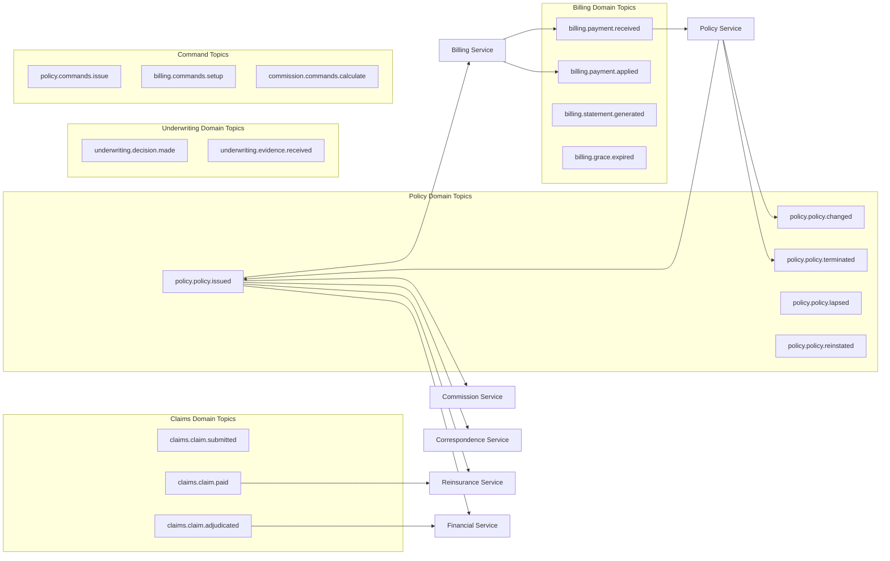

---

## 9. Data Management Strategies

### 9.1 Polyglot Persistence

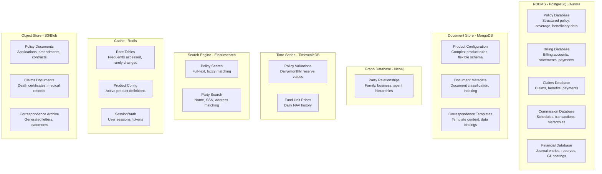

### 9.2 CQRS for Policy Inquiry

```java
// Command side — writes to normalized RDBMS
@Service
public class PolicyCommandService {
    
    private final PolicyRepository policyRepository;
    private final PolicyEventPublisher eventPublisher;
    
    @Transactional
    public void applyPolicyChange(PolicyChangeCommand command) {
        Policy policy = policyRepository.findById(command.getPolicyId())
            .orElseThrow();
        
        PolicyChangeAppliedEvent event = policy.applyChange(command);
        policyRepository.save(policy);
        eventPublisher.publish(event);
    }
}

// Query side — reads from denormalized read model
@Service
public class PolicyQueryService {
    
    private final PolicyReadRepository readRepository;
    
    public PolicySummaryView getPolicySummary(String policyNumber) {
        return readRepository.findByPolicyNumber(policyNumber)
            .orElseThrow(() -> new PolicyNotFoundException(policyNumber));
    }
    
    public Page<PolicyListView> searchPolicies(PolicySearchCriteria criteria) {
        return readRepository.search(criteria);
    }
}

// Read model projection (updated by events)
@Component
public class PolicyReadModelProjection {
    
    private final PolicyReadRepository readRepository;
    
    @KafkaListener(topics = "policy.policy.issued", groupId = "policy-read-model")
    public void onPolicyIssued(PolicyIssuedEvent event) {
        PolicyReadModel readModel = PolicyReadModel.builder()
            .policyId(event.getPolicyId())
            .policyNumber(event.getPolicyNumber())
            .status(event.getStatus())
            .planCode(event.getPlanCode())
            .planDescription(event.getPlanDescription())
            .ownerName(event.getOwnerName())
            .insuredName(event.getInsuredName())
            .faceAmount(event.getTotalFaceAmount())
            .effectiveDate(event.getEffectiveDate())
            .issueDate(event.getIssueDate())
            .agentName(event.getAgentName())
            .agentCode(event.getAgentCode())
            .modalPremium(event.getModalPremium())
            .billingMode(event.getBillingMode())
            .build();
        
        readRepository.save(readModel);
    }
    
    @KafkaListener(topics = "policy.policy.changed", groupId = "policy-read-model")
    public void onPolicyChanged(PolicyChangedEvent event) {
        PolicyReadModel readModel = readRepository.findByPolicyId(event.getPolicyId())
            .orElseThrow();
        
        readModel.applyChange(event);
        readRepository.save(readModel);
    }
}
```

### 9.3 Event Sourcing for Audit Trail

For the Financial/Accounting context where audit trail is paramount:

```java
// Event-sourced accounting aggregate
public class AccountingLedger {
    
    private LedgerId ledgerId;
    private List<AccountingEvent> events = new ArrayList<>();
    private Map<LedgerAccount, BigDecimal> balances = new HashMap<>();
    
    // Reconstitute from event history
    public static AccountingLedger fromHistory(LedgerId ledgerId, 
                                                List<AccountingEvent> events) {
        AccountingLedger ledger = new AccountingLedger();
        ledger.ledgerId = ledgerId;
        events.forEach(ledger::apply);
        return ledger;
    }
    
    public JournalEntryPostedEvent postJournalEntry(PostJournalEntryCommand command) {
        validateBalanced(command.getEntries());
        validateAccountsExist(command.getEntries());
        
        JournalEntryPostedEvent event = new JournalEntryPostedEvent(
            UUID.randomUUID(),
            ledgerId,
            command.getJournalId(),
            command.getPostingDate(),
            command.getEntries(),
            command.getDescription(),
            command.getSourceTransaction(),
            Instant.now()
        );
        
        apply(event);
        return event;
    }
    
    private void apply(AccountingEvent event) {
        if (event instanceof JournalEntryPostedEvent je) {
            for (JournalLine line : je.getEntries()) {
                balances.merge(line.getAccount(), 
                    line.getType() == EntryType.DEBIT ? line.getAmount() : line.getAmount().negate(),
                    BigDecimal::add);
            }
        }
        events.add(event);
    }
    
    private void validateBalanced(List<JournalLine> entries) {
        BigDecimal debits = entries.stream()
            .filter(e -> e.getType() == EntryType.DEBIT)
            .map(JournalLine::getAmount)
            .reduce(BigDecimal.ZERO, BigDecimal::add);
        
        BigDecimal credits = entries.stream()
            .filter(e -> e.getType() == EntryType.CREDIT)
            .map(JournalLine::getAmount)
            .reduce(BigDecimal.ZERO, BigDecimal::add);
        
        if (debits.compareTo(credits) != 0) {
            throw new UnbalancedJournalException(debits, credits);
        }
    }
}

// Event store implementation
@Repository
public class AccountingEventStore {
    
    private final JdbcTemplate jdbcTemplate;
    
    public void append(LedgerId ledgerId, AccountingEvent event, long expectedVersion) {
        int updated = jdbcTemplate.update("""
            INSERT INTO accounting_events 
            (event_id, ledger_id, event_type, event_data, version, created_at)
            SELECT ?, ?, ?, ?::jsonb, COALESCE(MAX(version), 0) + 1, NOW()
            FROM accounting_events WHERE ledger_id = ?
            HAVING COALESCE(MAX(version), 0) = ?
            """,
            event.getEventId(), ledgerId.value(),
            event.getClass().getSimpleName(),
            serialize(event),
            ledgerId.value(), expectedVersion
        );
        
        if (updated == 0) {
            throw new OptimisticConcurrencyException(
                "Expected version " + expectedVersion + " for ledger " + ledgerId
            );
        }
    }
    
    public List<AccountingEvent> loadEvents(LedgerId ledgerId) {
        return jdbcTemplate.query("""
            SELECT event_type, event_data FROM accounting_events 
            WHERE ledger_id = ? ORDER BY version ASC
            """,
            (rs, rowNum) -> deserialize(
                rs.getString("event_type"), 
                rs.getString("event_data")
            ),
            ledgerId.value()
        );
    }
}
```

---

## 10. Saga Patterns for Insurance Workflows

### 10.1 New Business Issuance Saga

The new business issuance saga orchestrates the complex workflow of policy issuance:

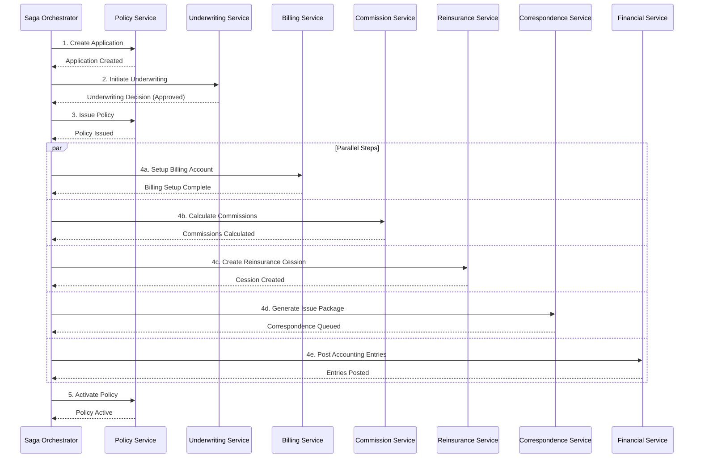

```java
// Orchestration-based saga for new business issuance
@Component
public class NewBusinessIssuanceSaga {
    
    private final PolicyServiceClient policyService;
    private final UnderwritingServiceClient uwService;
    private final BillingServiceClient billingService;
    private final CommissionServiceClient commissionService;
    private final ReinsuranceServiceClient reinsuranceService;
    private final CorrespondenceServiceClient correspondenceService;
    private final FinancialServiceClient financialService;
    private final SagaStateRepository sagaStateRepository;
    
    @Transactional
    public void execute(NewBusinessIssuanceCommand command) {
        SagaState saga = SagaState.create(
            "NEW_BUSINESS_ISSUANCE", command.getApplicationId()
        );
        sagaStateRepository.save(saga);
        
        try {
            // Step 1: Issue the policy
            PolicyIssuanceResult issuanceResult = policyService.issuePolicy(
                new IssuePolicyRequest(command.getApplicationId(), command.getIssueDate())
            );
            saga.completeStep("POLICY_ISSUED", issuanceResult);
            sagaStateRepository.save(saga);
            
            // Step 2: Parallel downstream setup (using CompletableFuture)
            CompletableFuture<BillingSetupResult> billingFuture =
                CompletableFuture.supplyAsync(() -> billingService.setupBilling(
                    BillingSetupRequest.from(issuanceResult)
                ));
            
            CompletableFuture<CommissionResult> commissionFuture =
                CompletableFuture.supplyAsync(() -> commissionService.calculateCommission(
                    CommissionCalcRequest.from(issuanceResult)
                ));
            
            CompletableFuture<CessionResult> reinsuranceFuture =
                CompletableFuture.supplyAsync(() -> reinsuranceService.createCession(
                    CessionRequest.from(issuanceResult)
                ));
            
            CompletableFuture<Void> correspondenceFuture =
                CompletableFuture.runAsync(() -> correspondenceService.generateIssuePackage(
                    IssuePackageRequest.from(issuanceResult)
                ));
            
            CompletableFuture<Void> financialFuture =
                CompletableFuture.runAsync(() -> financialService.postIssuanceEntries(
                    IssuanceAccountingRequest.from(issuanceResult)
                ));
            
            // Wait for all parallel steps
            CompletableFuture.allOf(
                billingFuture, commissionFuture, reinsuranceFuture,
                correspondenceFuture, financialFuture
            ).join();
            
            saga.completeStep("BILLING_SETUP", billingFuture.join());
            saga.completeStep("COMMISSION_CALCULATED", commissionFuture.join());
            saga.completeStep("REINSURANCE_CESSION", reinsuranceFuture.join());
            saga.completeStep("CORRESPONDENCE_GENERATED", null);
            saga.completeStep("ACCOUNTING_POSTED", null);
            
            // Step 3: Activate the policy
            policyService.activatePolicy(issuanceResult.getPolicyId());
            saga.complete();
            sagaStateRepository.save(saga);
            
        } catch (Exception e) {
            saga.fail(e.getMessage());
            sagaStateRepository.save(saga);
            compensate(saga);
            throw new SagaFailedException(saga.getSagaId(), e);
        }
    }
    
    private void compensate(SagaState saga) {
        // Compensate in reverse order
        List<CompletedStep> completedSteps = saga.getCompletedSteps();
        Collections.reverse(completedSteps);
        
        for (CompletedStep step : completedSteps) {
            try {
                switch (step.getStepName()) {
                    case "ACCOUNTING_POSTED" -> 
                        financialService.reverseIssuanceEntries(saga.getEntityId());
                    case "CORRESPONDENCE_GENERATED" -> 
                        correspondenceService.cancelCorrespondence(saga.getEntityId());
                    case "REINSURANCE_CESSION" -> 
                        reinsuranceService.cancelCession(step.getResult());
                    case "COMMISSION_CALCULATED" -> 
                        commissionService.reverseCommission(step.getResult());
                    case "BILLING_SETUP" -> 
                        billingService.cancelBillingAccount(step.getResult());
                    case "POLICY_ISSUED" -> 
                        policyService.reverseIssuance(step.getResult());
                }
                saga.compensateStep(step.getStepName());
            } catch (Exception e) {
                saga.failCompensation(step.getStepName(), e.getMessage());
                // Requires manual intervention
            }
            sagaStateRepository.save(saga);
        }
    }
}
```

### 10.2 Claim Settlement Saga

```java
// Choreography-based saga for claim settlement
// Each service reacts to events and publishes its own

// Claims Service — initiates
@Component
public class ClaimSettlementInitiator {
    @Transactional
    public void submitClaim(SubmitClaimCommand command) {
        Claim claim = Claim.create(command);
        claimRepository.save(claim);
        eventPublisher.publish(new ClaimSubmittedEvent(claim));
    }
}

// Policy Service — validates coverage
@Component  
public class ClaimPolicyValidationHandler {
    @KafkaListener(topics = "claims.claim.submitted")
    public void onClaimSubmitted(ClaimSubmittedEvent event) {
        PolicyValidationResult result = policyService.validateCoverageAtDate(
            event.getPolicyNumber(), event.getLossDate()
        );
        
        if (result.isValid()) {
            eventPublisher.publish(new ClaimCoverageValidatedEvent(
                event.getClaimId(), result
            ));
        } else {
            eventPublisher.publish(new ClaimCoverageInvalidEvent(
                event.getClaimId(), result.getReasons()
            ));
        }
    }
}

// Claims Service — adjudicates after validation
@Component
public class ClaimAdjudicationHandler {
    @KafkaListener(topics = "claims.coverage.validated")
    public void onCoverageValidated(ClaimCoverageValidatedEvent event) {
        Claim claim = claimRepository.findById(event.getClaimId()).orElseThrow();
        AdjudicationResult result = claim.adjudicate(event.getCoverageDetails());
        claimRepository.save(claim);
        
        eventPublisher.publish(new ClaimAdjudicatedEvent(
            claim.getClaimId(), result
        ));
    }
}

// Financial Service — posts accounting entries
@Component
public class ClaimAccountingHandler {
    @KafkaListener(topics = "claims.claim.adjudicated")
    public void onClaimAdjudicated(ClaimAdjudicatedEvent event) {
        financialService.postClaimEntries(
            event.getClaimId(), event.getBenefitAmount(),
            event.getClaimType(), event.getPolicyNumber()
        );
        
        eventPublisher.publish(new ClaimAccountingPostedEvent(event.getClaimId()));
    }
}

// Tax Service — calculates withholding
@Component
public class ClaimTaxHandler {
    @KafkaListener(topics = "claims.claim.adjudicated")
    public void onClaimAdjudicated(ClaimAdjudicatedEvent event) {
        if (event.isTaxable()) {
            TaxWithholding withholding = taxService.calculateWithholding(
                event.getBenefitAmount(), event.getCostBasis(),
                event.getPayeeState(), event.getPayeeTaxId()
            );
            eventPublisher.publish(new ClaimTaxCalculatedEvent(
                event.getClaimId(), withholding
            ));
        }
    }
}

// Reinsurance Service — initiates recovery
@Component
public class ClaimReinsuranceRecoveryHandler {
    @KafkaListener(topics = "claims.claim.paid")
    public void onClaimPaid(ClaimPaidEvent event) {
        List<Cession> cessions = cessionRepository.findByPolicyId(event.getPolicyId());
        for (Cession cession : cessions) {
            BigDecimal recoveryAmount = cession.calculateRecovery(event.getClaimAmount());
            if (recoveryAmount.compareTo(BigDecimal.ZERO) > 0) {
                reinsuranceService.initiateRecovery(
                    cession.getTreatyId(), event.getClaimId(), recoveryAmount
                );
            }
        }
    }
}
```

### 10.3 1035 Exchange Saga

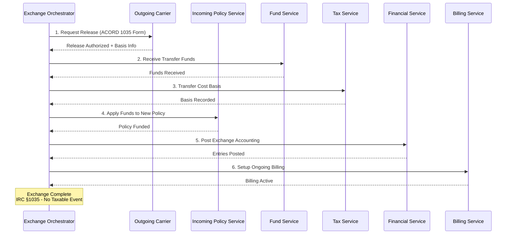

---

## 11. Service Mesh for PAS

### 11.1 Istio Configuration for PAS

```yaml
# Istio VirtualService for Policy Service — canary deployment
apiVersion: networking.istio.io/v1beta1
kind: VirtualService
metadata:
  name: policy-service
  namespace: pas-production
spec:
  hosts:
    - policy-service
  http:
    - match:
        - headers:
            x-canary:
              exact: "true"
      route:
        - destination:
            host: policy-service
            subset: canary
          weight: 100
    - route:
        - destination:
            host: policy-service
            subset: stable
          weight: 95
        - destination:
            host: policy-service
            subset: canary
          weight: 5

---
# Istio DestinationRule for Policy Service
apiVersion: networking.istio.io/v1beta1
kind: DestinationRule
metadata:
  name: policy-service
  namespace: pas-production
spec:
  host: policy-service
  trafficPolicy:
    connectionPool:
      tcp:
        maxConnections: 100
      http:
        h2UpgradePolicy: UPGRADE
        maxRequestsPerConnection: 10
    outlierDetection:
      consecutiveErrors: 5
      interval: 30s
      baseEjectionTime: 30s
      maxEjectionPercent: 50
    tls:
      mode: ISTIO_MUTUAL
  subsets:
    - name: stable
      labels:
        version: v3.2.1
    - name: canary
      labels:
        version: v3.3.0-rc1

---
# mTLS strict mode for PAS namespace
apiVersion: security.istio.io/v1beta1
kind: PeerAuthentication
metadata:
  name: default
  namespace: pas-production
spec:
  mtls:
    mode: STRICT

---
# Authorization policy — only Billing can call Policy's billing-related endpoints
apiVersion: security.istio.io/v1beta1
kind: AuthorizationPolicy
metadata:
  name: policy-billing-access
  namespace: pas-production
spec:
  selector:
    matchLabels:
      app: policy-service
  rules:
    - from:
        - source:
            principals: ["cluster.local/ns/pas-production/sa/billing-service"]
      to:
        - operation:
            paths: ["/api/v3/policies/*/billing-data"]
            methods: ["GET"]
```

### 11.2 Service Mesh Architecture

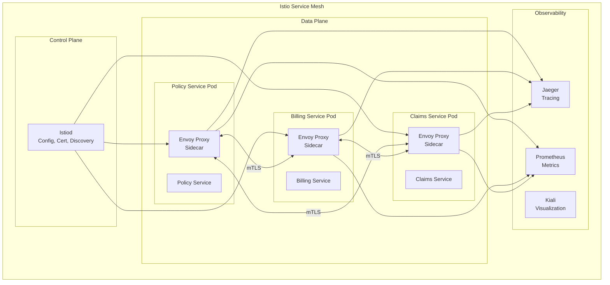

---

## 12. Testing Strategy

### 12.1 Testing Pyramid for PAS Microservices

```
                    /\
                   /  \
                  / E2E \          End-to-end tests (5%)
                 /  Tests \        Full business flows
                /----------\
               / Integration \     Integration tests (15%)
              /    Tests      \    Service + DB + messaging
             /----------------\
            / Contract Tests    \   Consumer-driven contracts (20%)
           /  (Pact/Spring CC)   \  API compatibility
          /----------------------\
         /     Component Tests     \  Service-level tests (25%)
        /   (TestContainers, WireMock)\  
       /----------------------------\
      /         Unit Tests            \  Domain model tests (35%)
     /  (Aggregate, Value Object, Svc) \
    /----------------------------------\
```

### 12.2 Contract Testing with Pact

```java
// Consumer-side contract test (Billing consuming Policy API)
@ExtendWith(PactConsumerTestExt.class)
@PactTestFor(providerName = "policy-service", port = "8080")
public class PolicyServiceContractTest {
    
    @Pact(consumer = "billing-service")
    public V4Pact getPolicyForBilling(PactDslWithProvider builder) {
        return builder
            .given("policy POL-001 exists and is active")
            .uponReceiving("a request for policy billing data")
            .path("/api/v3/policies/POL-001/billing-data")
            .method("GET")
            .headers("Accept", "application/json")
            .willRespondWith()
            .status(200)
            .headers(Map.of("Content-Type", "application/json"))
            .body(new PactDslJsonBody()
                .stringType("policyNumber", "POL-001")
                .stringType("planCode", "WL2025")
                .stringType("billingMode", "MONTHLY")
                .decimalType("modalPremium", 150.00)
                .stringType("status", "ACTIVE")
                .date("effectiveDate", "yyyy-MM-dd", 
                    Date.from(LocalDate.of(2025, 1, 1)
                        .atStartOfDay(ZoneId.systemDefault()).toInstant()))
            )
            .toPact(V4Pact.class);
    }
    
    @Test
    @PactTestFor(pactMethod = "getPolicyForBilling")
    void testGetPolicyBillingData(MockServer mockServer) {
        PolicyServiceClient client = new PolicyServiceClient(
            mockServer.getUrl()
        );
        
        PolicyBillingData result = client.getPolicyBillingData("POL-001");
        
        assertThat(result.getPolicyNumber()).isEqualTo("POL-001");
        assertThat(result.getModalPremium()).isEqualByComparingTo("150.00");
        assertThat(result.getStatus()).isEqualTo("ACTIVE");
    }
}

// Provider-side verification (in Policy Service)
@Provider("policy-service")
@PactBroker(url = "${PACT_BROKER_URL}")
@SpringBootTest(webEnvironment = WebEnvironment.RANDOM_PORT)
public class PolicyServiceProviderVerificationTest {
    
    @TestTemplate
    @ExtendWith(PactVerificationInvocationContextProvider.class)
    void verifyPact(PactVerificationContext context) {
        context.verifyInteraction();
    }
    
    @State("policy POL-001 exists and is active")
    void setupPolicy() {
        Policy policy = TestPolicyBuilder.anActivePolicy()
            .withPolicyNumber("POL-001")
            .withPlanCode("WL2025")
            .withModalPremium(new BigDecimal("150.00"))
            .withBillingMode(BillingMode.MONTHLY)
            .build();
        policyRepository.save(policy);
    }
}
```

### 12.3 Integration Testing with TestContainers

```java
@SpringBootTest
@Testcontainers
public class PolicyServiceIntegrationTest {
    
    @Container
    static PostgreSQLContainer<?> postgres = new PostgreSQLContainer<>("postgres:15")
        .withDatabaseName("policy_db")
        .withUsername("test")
        .withPassword("test");
    
    @Container
    static KafkaContainer kafka = new KafkaContainer(
        DockerImageName.parse("confluentinc/cp-kafka:7.5.0")
    );
    
    @Container
    static GenericContainer<?> redis = new GenericContainer<>("redis:7")
        .withExposedPorts(6379);
    
    @DynamicPropertySource
    static void configureProperties(DynamicPropertyRegistry registry) {
        registry.add("spring.datasource.url", postgres::getJdbcUrl);
        registry.add("spring.datasource.username", postgres::getUsername);
        registry.add("spring.datasource.password", postgres::getPassword);
        registry.add("spring.kafka.bootstrap-servers", kafka::getBootstrapServers);
        registry.add("spring.redis.host", redis::getHost);
        registry.add("spring.redis.port", () -> redis.getMappedPort(6379));
    }
    
    @Autowired
    private PolicyService policyService;
    
    @Autowired
    private KafkaConsumer<String, String> testConsumer;
    
    @Test
    void whenPolicyIssued_thenEventPublished() {
        // Given
        CreateApplicationCommand command = TestCommands.aCreateApplicationCommand();
        Policy application = policyService.createApplication(command);
        
        // When
        IssuePolicyCommand issueCommand = new IssuePolicyCommand(
            application.getPolicyId(), LocalDate.now()
        );
        Policy issued = policyService.issuePolicy(issueCommand);
        
        // Then
        assertThat(issued.getStatus()).isEqualTo(PolicyStatus.ISSUED);
        assertThat(issued.getPolicyNumber()).isNotNull();
        
        // Verify event published to Kafka
        ConsumerRecords<String, String> records = testConsumer.poll(Duration.ofSeconds(10));
        assertThat(records.count()).isGreaterThan(0);
        
        ConsumerRecord<String, String> record = records.iterator().next();
        PolicyIssuedEvent event = objectMapper.readValue(
            record.value(), PolicyIssuedEvent.class
        );
        assertThat(event.getPolicyNumber()).isEqualTo(issued.getPolicyNumber());
    }
}
```

### 12.4 Chaos Engineering for PAS

```yaml
# Chaos Mesh experiment — simulate billing service failure during payment processing
apiVersion: chaos-mesh.org/v1alpha1
kind: PodChaos
metadata:
  name: billing-service-failure
  namespace: pas-staging
spec:
  action: pod-failure
  mode: one
  selector:
    namespaces:
      - pas-staging
    labelSelectors:
      app: billing-service
  duration: "120s"
  scheduler:
    cron: "@every 4h"

---
# Network delay between Policy Service and Underwriting Service
apiVersion: chaos-mesh.org/v1alpha1
kind: NetworkChaos
metadata:
  name: uw-network-delay
  namespace: pas-staging
spec:
  action: delay
  mode: all
  selector:
    namespaces:
      - pas-staging
    labelSelectors:
      app: underwriting-service
  delay:
    latency: "2000ms"
    jitter: "500ms"
    correlation: "50"
  duration: "300s"
  direction: both
```

**Chaos Testing Scenarios for PAS**:

| Scenario | Expected Behavior | Validation |
|---|---|---|
| Billing service down during premium billing cycle | Payments queue in Kafka, processed when restored | No lost payments, eventual consistency |
| Database failover during policy transaction | Transaction retries on new primary | No duplicate transactions, data integrity |
| Kafka broker failure | Producers buffer, consumers catch up | No lost events, idempotent processing |
| Rating engine timeout | Circuit breaker opens, cached rates used | Graceful degradation, accurate when restored |
| Document service unavailable | Correspondence generation deferred | Queue builds, batch processes when available |

---

## 13. Deployment Architecture

### 13.1 Kubernetes Deployment

```yaml
# Policy Service Deployment
apiVersion: apps/v1
kind: Deployment
metadata:
  name: policy-service
  namespace: pas-production
  labels:
    app: policy-service
    version: v3.2.1
    domain: policy
spec:
  replicas: 3
  strategy:
    type: RollingUpdate
    rollingUpdate:
      maxSurge: 1
      maxUnavailable: 0
  selector:
    matchLabels:
      app: policy-service
  template:
    metadata:
      labels:
        app: policy-service
        version: v3.2.1
      annotations:
        prometheus.io/scrape: "true"
        prometheus.io/port: "8081"
        prometheus.io/path: "/actuator/prometheus"
    spec:
      serviceAccountName: policy-service
      containers:
        - name: policy-service
          image: registry.insurer.com/pas/policy-service:3.2.1
          ports:
            - containerPort: 8080
              name: http
            - containerPort: 8081
              name: management
            - containerPort: 9090
              name: grpc
          env:
            - name: SPRING_PROFILES_ACTIVE
              value: "production"
            - name: DB_HOST
              valueFrom:
                secretKeyRef:
                  name: policy-db-credentials
                  key: host
            - name: DB_PASSWORD
              valueFrom:
                secretKeyRef:
                  name: policy-db-credentials
                  key: password
            - name: KAFKA_BOOTSTRAP_SERVERS
              valueFrom:
                configMapKeyRef:
                  name: kafka-config
                  key: bootstrap-servers
          resources:
            requests:
              cpu: "500m"
              memory: "1Gi"
            limits:
              cpu: "2000m"
              memory: "4Gi"
          readinessProbe:
            httpGet:
              path: /actuator/health/readiness
              port: 8081
            initialDelaySeconds: 30
            periodSeconds: 10
          livenessProbe:
            httpGet:
              path: /actuator/health/liveness
              port: 8081
            initialDelaySeconds: 60
            periodSeconds: 30
          startupProbe:
            httpGet:
              path: /actuator/health/readiness
              port: 8081
            failureThreshold: 30
            periodSeconds: 10
      topologySpreadConstraints:
        - maxSkew: 1
          topologyKey: topology.kubernetes.io/zone
          whenUnsatisfiable: DoNotSchedule
          labelSelector:
            matchLabels:
              app: policy-service

---
# HPA for Policy Service
apiVersion: autoscaling/v2
kind: HorizontalPodAutoscaler
metadata:
  name: policy-service-hpa
  namespace: pas-production
spec:
  scaleTargetRef:
    apiVersion: apps/v1
    kind: Deployment
    name: policy-service
  minReplicas: 3
  maxReplicas: 15
  metrics:
    - type: Resource
      resource:
        name: cpu
        target:
          type: Utilization
          averageUtilization: 70
    - type: Resource
      resource:
        name: memory
        target:
          type: Utilization
          averageUtilization: 80
    - type: Pods
      pods:
        metric:
          name: http_server_requests_per_second
        target:
          type: AverageValue
          averageValue: "100"
  behavior:
    scaleUp:
      stabilizationWindowSeconds: 60
      policies:
        - type: Pods
          value: 2
          periodSeconds: 60
    scaleDown:
      stabilizationWindowSeconds: 300
      policies:
        - type: Pods
          value: 1
          periodSeconds: 120

---
# Service for Policy Service
apiVersion: v1
kind: Service
metadata:
  name: policy-service
  namespace: pas-production
spec:
  selector:
    app: policy-service
  ports:
    - name: http
      port: 80
      targetPort: 8080
    - name: grpc
      port: 9090
      targetPort: 9090
```

### 13.2 Helm Chart Structure

```
pas-helm-charts/
├── charts/
│   ├── policy-service/
│   │   ├── Chart.yaml
│   │   ├── values.yaml
│   │   ├── values-staging.yaml
│   │   ├── values-production.yaml
│   │   └── templates/
│   │       ├── deployment.yaml
│   │       ├── service.yaml
│   │       ├── hpa.yaml
│   │       ├── pdb.yaml
│   │       ├── configmap.yaml
│   │       ├── serviceaccount.yaml
│   │       └── ingress.yaml
│   ├── billing-service/
│   ├── claims-service/
│   ├── underwriting-service/
│   ├── party-service/
│   ├── product-service/
│   ├── commission-service/
│   ├── correspondence-service/
│   ├── financial-service/
│   ├── document-service/
│   ├── fund-service/
│   └── tax-service/
├── infrastructure/
│   ├── kafka/
│   ├── postgresql/
│   ├── redis/
│   ├── elasticsearch/
│   └── monitoring/
└── Chart.yaml  (umbrella chart)
```

### 13.3 GitOps with ArgoCD

```yaml
# ArgoCD Application for Policy Service
apiVersion: argoproj.io/v1alpha1
kind: Application
metadata:
  name: policy-service-production
  namespace: argocd
  annotations:
    notifications.argoproj.io/subscribe.on-sync-succeeded.slack: pas-deployments
    notifications.argoproj.io/subscribe.on-sync-failed.slack: pas-deployments
spec:
  project: pas-production
  source:
    repoURL: https://git.insurer.com/pas/helm-charts.git
    targetRevision: main
    path: charts/policy-service
    helm:
      valueFiles:
        - values-production.yaml
      parameters:
        - name: image.tag
          value: "3.2.1"
  destination:
    server: https://kubernetes.default.svc
    namespace: pas-production
  syncPolicy:
    automated:
      prune: true
      selfHeal: true
    syncOptions:
      - CreateNamespace=true
      - PruneLast=true
    retry:
      limit: 3
      backoff:
        duration: 5s
        factor: 2
        maxDuration: 3m
```

### 13.4 Feature Flags

```java
// Feature flag configuration for gradual rollout
@Configuration
public class FeatureFlagConfig {
    
    @Bean
    public FeatureManager featureManager(LaunchDarklyClient ldClient) {
        return new LaunchDarklyFeatureManager(ldClient);
    }
}

@Service
public class PolicyService {
    
    private final FeatureManager featureManager;
    
    public Policy processTransaction(PolicyTransactionCommand command) {
        // Feature flag: new billing integration v2
        if (featureManager.isEnabled("billing-integration-v2", 
                context(command.getPolicyId()))) {
            return processWithNewBillingIntegration(command);
        }
        return processWithLegacyBillingIntegration(command);
    }
    
    // Feature flag: new valuation engine
    public PolicyValues calculateValues(String policyId) {
        if (featureManager.isEnabled("valuation-engine-v3",
                context(policyId))) {
            return valuationEngineV3.calculate(policyId);
        }
        return valuationEngineV2.calculate(policyId);
    }
    
    private EvaluationContext context(String policyId) {
        return EvaluationContext.builder()
            .policyId(policyId)
            .environment(activeProfile)
            .build();
    }
}
```

---

## 14. Monitoring & Observability

### 14.1 Distributed Tracing

```java
// Spring Boot with Micrometer Tracing (Brave/Zipkin)
@Configuration
public class TracingConfig {
    
    @Bean
    public SpanCustomizer policyServiceSpanCustomizer() {
        return new SpanCustomizer() {
            @Override
            public Span customizeSpan(Span span, Object... context) {
                if (context.length > 0 && context[0] instanceof Policy policy) {
                    span.tag("policy.number", policy.getPolicyNumber());
                    span.tag("policy.plan", policy.getPlanCode());
                    span.tag("policy.status", policy.getStatus().name());
                }
                return span;
            }
        };
    }
}

@RestController
public class PolicyController {
    
    private final Tracer tracer;
    
    @GetMapping("/api/v3/policies/{policyId}")
    public PolicyDTO getPolicy(@PathVariable String policyId) {
        Span span = tracer.currentSpan();
        if (span != null) {
            span.tag("policy.id", policyId);
        }
        
        Policy policy = policyService.getPolicy(policyId);
        
        if (span != null) {
            span.tag("policy.number", policy.getPolicyNumber());
            span.event("policy.retrieved");
        }
        
        return policyMapper.toDTO(policy);
    }
}
```

### 14.2 Metrics & SLOs

```yaml
# Prometheus alerting rules for PAS
groups:
  - name: pas-slos
    rules:
      # SLO: Policy Service API availability > 99.95%
      - alert: PolicyServiceAvailabilitySLOBreach
        expr: |
          (
            sum(rate(http_server_requests_seconds_count{
              app="policy-service",
              status!~"5.."
            }[5m]))
            /
            sum(rate(http_server_requests_seconds_count{
              app="policy-service"
            }[5m]))
          ) < 0.9995
        for: 5m
        labels:
          severity: critical
          domain: policy
        annotations:
          summary: "Policy Service availability below 99.95% SLO"
          description: "Current availability: {{ $value | humanizePercentage }}"

      # SLO: Policy transaction latency P99 < 2s
      - alert: PolicyTransactionLatencySLOBreach
        expr: |
          histogram_quantile(0.99,
            sum(rate(http_server_requests_seconds_bucket{
              app="policy-service",
              uri=~"/api/v3/policies/.*/transactions"
            }[5m])) by (le)
          ) > 2.0
        for: 5m
        labels:
          severity: warning
          domain: policy
        annotations:
          summary: "Policy transaction P99 latency above 2s SLO"

      # SLO: Billing event processing lag < 30s
      - alert: BillingEventProcessingLag
        expr: |
          kafka_consumer_group_lag{
            group="billing-service",
            topic="policy.policy.issued"
          } > 100
        for: 2m
        labels:
          severity: warning
          domain: billing
        annotations:
          summary: "Billing service Kafka consumer lag exceeding threshold"

      # SLO: Claim processing time < 24 hours
      - alert: ClaimProcessingTimeSLOBreach
        expr: |
          (time() - claim_submitted_timestamp{status="PENDING"}) / 3600 > 20
        for: 15m
        labels:
          severity: warning
          domain: claims
        annotations:
          summary: "Claims approaching 24h SLO for processing time"

  - name: pas-business-metrics
    rules:
      # Business metric: Daily new business volume
      - record: pas:daily_new_business:count
        expr: |
          sum(increase(policy_issued_total[24h]))

      # Business metric: Premium collection rate
      - record: pas:premium_collection_rate:ratio
        expr: |
          sum(rate(payment_received_total[30d]))
          /
          sum(rate(premium_billed_total[30d]))

      # Business metric: Claim approval rate
      - record: pas:claim_approval_rate:ratio
        expr: |
          sum(rate(claim_adjudicated_total{decision="APPROVED"}[30d]))
          /
          sum(rate(claim_adjudicated_total[30d]))
```

### 14.3 Centralized Logging

```java
// Structured logging for PAS services
@Aspect
@Component
public class PolicyTransactionLoggingAspect {
    
    private static final Logger log = LoggerFactory.getLogger("POLICY_AUDIT");
    
    @Around("@annotation(PolicyTransaction)")
    public Object logPolicyTransaction(ProceedingJoinPoint joinPoint) throws Throwable {
        PolicyTransactionCommand command = extractCommand(joinPoint);
        
        MDC.put("policyId", command.getPolicyId());
        MDC.put("transactionType", command.getTransactionType().name());
        MDC.put("effectiveDate", command.getEffectiveDate().toString());
        MDC.put("userId", SecurityContext.getCurrentUserId());
        MDC.put("correlationId", CorrelationContext.getId());
        
        log.info("Policy transaction initiated", 
            kv("action", "TRANSACTION_START"),
            kv("policyId", command.getPolicyId()),
            kv("transactionType", command.getTransactionType()),
            kv("effectiveDate", command.getEffectiveDate())
        );
        
        try {
            Object result = joinPoint.proceed();
            
            log.info("Policy transaction completed",
                kv("action", "TRANSACTION_COMPLETE"),
                kv("policyId", command.getPolicyId()),
                kv("transactionType", command.getTransactionType()),
                kv("result", "SUCCESS")
            );
            
            return result;
        } catch (Exception e) {
            log.error("Policy transaction failed",
                kv("action", "TRANSACTION_FAILED"),
                kv("policyId", command.getPolicyId()),
                kv("transactionType", command.getTransactionType()),
                kv("errorType", e.getClass().getSimpleName()),
                kv("errorMessage", e.getMessage())
            );
            throw e;
        } finally {
            MDC.clear();
        }
    }
}
```

### 14.4 Grafana Dashboard Configuration

```json
{
  "dashboard": {
    "title": "PAS Service Health Dashboard",
    "panels": [
      {
        "title": "Service Availability (SLO: 99.95%)",
        "type": "gauge",
        "targets": [
          {
            "expr": "sum(rate(http_server_requests_seconds_count{status!~\"5..\"}[5m])) by (app) / sum(rate(http_server_requests_seconds_count[5m])) by (app) * 100"
          }
        ],
        "thresholds": [
          {"value": 99.0, "color": "red"},
          {"value": 99.9, "color": "yellow"},
          {"value": 99.95, "color": "green"}
        ]
      },
      {
        "title": "Transaction Throughput by Service",
        "type": "timeseries",
        "targets": [
          {
            "expr": "sum(rate(http_server_requests_seconds_count{uri=~\"/api/.*\"}[5m])) by (app)",
            "legendFormat": "{{app}}"
          }
        ]
      },
      {
        "title": "Kafka Consumer Lag by Service",
        "type": "timeseries",
        "targets": [
          {
            "expr": "sum(kafka_consumer_group_lag) by (group)",
            "legendFormat": "{{group}}"
          }
        ]
      },
      {
        "title": "P99 Latency by Service",
        "type": "timeseries",
        "targets": [
          {
            "expr": "histogram_quantile(0.99, sum(rate(http_server_requests_seconds_bucket[5m])) by (app, le))",
            "legendFormat": "{{app}}"
          }
        ]
      },
      {
        "title": "Business Metrics",
        "type": "stat",
        "targets": [
          {
            "expr": "sum(increase(policy_issued_total[24h]))",
            "legendFormat": "Policies Issued (24h)"
          },
          {
            "expr": "sum(increase(claim_submitted_total[24h]))",
            "legendFormat": "Claims Submitted (24h)"
          },
          {
            "expr": "sum(increase(payment_received_total[24h]))",
            "legendFormat": "Payments Received (24h)"
          }
        ]
      }
    ]
  }
}
```

---

## 15. Anti-Patterns & Pitfalls

### 15.1 Distributed Monolith

**Symptoms**:
- All services must be deployed together
- A change in one service requires changes in multiple services
- Services share a database
- Tight coupling through synchronous request chains

**Root Cause**: Improper service boundaries that don't align with business domains.

**Fix**: Re-evaluate boundaries using DDD. Services should be independently deployable. Use asynchronous communication for most cross-service interactions.

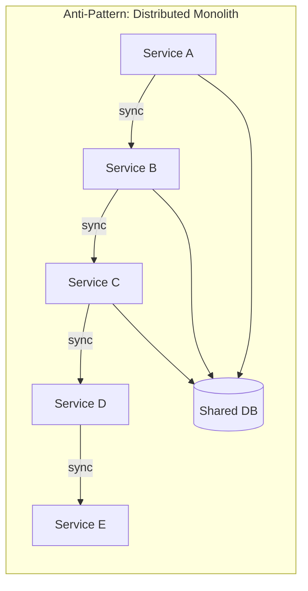

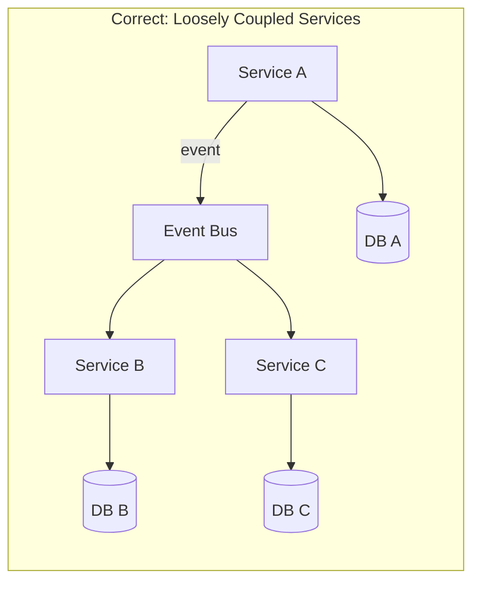

### 15.2 Chatty Services

**Symptoms**: A single user request results in dozens of inter-service calls, creating cascading latency and fragile call chains.

**Fix**:
- Use event-carried state transfer for frequently needed data
- Implement BFF pattern to compose responses
- Use CQRS read models optimized for specific query patterns
- Consider service consolidation if two services always communicate

### 15.3 Shared Database Anti-Pattern

**Symptoms**: Multiple services read/write to the same database tables, creating implicit coupling.

**Fix**: Extract shared tables into a dedicated service with a well-defined API. Use data replication through events for read needs.

### 15.4 Improper Boundary: Anemic Services

**Symptoms**: Services are organized by technical layer (API service, business logic service, data access service) rather than by business capability.

**Fix**: Each service should own its full vertical slice — API, business logic, and data access for a specific business capability.

### 15.5 Missing Idempotency

**Symptoms**: Duplicate events cause duplicate processing (double billing, duplicate commission payments).

**Fix**: Implement idempotency keys on all event handlers and API endpoints:

```java
@Component
public class IdempotentEventHandler {
    
    private final ProcessedEventRepository processedEvents;
    
    @Transactional
    public <T> void handleIdempotently(String eventId, Supplier<T> handler) {
        if (processedEvents.existsByEventId(eventId)) {
            log.info("Skipping already-processed event: {}", eventId);
            return;
        }
        
        handler.get();
        processedEvents.save(new ProcessedEvent(eventId, Instant.now()));
    }
}
```

### 15.6 Lack of Correlation IDs

**Symptoms**: Impossible to trace a business transaction across services.

**Fix**: Propagate a correlation ID through all synchronous calls (HTTP header) and asynchronous messages (event metadata).

```java
@Component
public class CorrelationIdFilter extends OncePerRequestFilter {
    
    @Override
    protected void doFilterInternal(HttpServletRequest request, 
                                     HttpServletResponse response,
                                     FilterChain filterChain) throws ServletException, IOException {
        String correlationId = request.getHeader("X-Correlation-ID");
        if (correlationId == null) {
            correlationId = UUID.randomUUID().toString();
        }
        
        MDC.put("correlationId", correlationId);
        CorrelationContext.setId(correlationId);
        response.setHeader("X-Correlation-ID", correlationId);
        
        try {
            filterChain.doFilter(request, response);
        } finally {
            MDC.remove("correlationId");
            CorrelationContext.clear();
        }
    }
}
```

---

## 16. Reference Architecture

### 16.1 Complete PAS Microservices Architecture

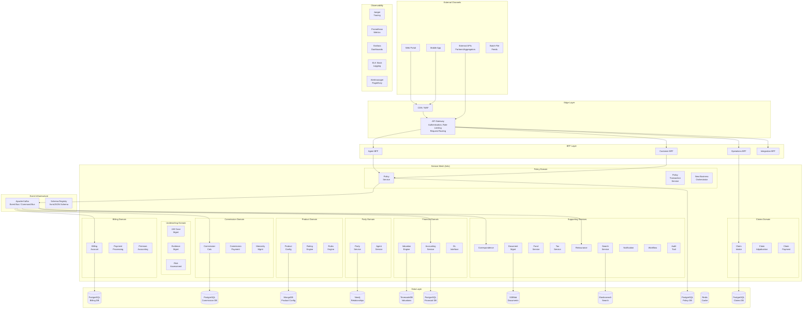

### 16.2 Decision Framework for Service Granularity

| Factor | Coarser Services | Finer Services |
|---|---|---|
| Team size | < 5 teams | > 10 teams |
| Domain complexity | Simple, few rules | Complex, many rules per context |
| Scalability needs | Uniform load | Different load patterns |
| Release cadence | Infrequent | Frequent, independent |
| Technology needs | Homogeneous | Polyglot |
| Data isolation | Can share | Must isolate |
| Operational maturity | Low DevOps maturity | High DevOps maturity |

**Recommendation for PAS**: Start with services at the bounded context level (10-12 services). Split further only when justified by concrete scaling, team, or release-cadence requirements. Avoid premature decomposition.

---

## 17. Conclusion

Microservices architecture for PAS is not a silver bullet — it is a strategic decision that trades the simplicity of a monolith for the flexibility, scalability, and team autonomy needed by modern insurance operations. Success depends on:

1. **Rigorous domain modeling**: DDD is not optional. Without proper bounded contexts, you build a distributed monolith.
2. **Event-driven communication**: Insurance workflows are naturally event-driven. Embrace asynchronous patterns with reliable event delivery.
3. **Data sovereignty**: Each service owns its data. Accept eventual consistency where the business allows it, and use sagas where it doesn't.
4. **Operational investment**: Microservices demand robust observability, deployment automation, and incident response capabilities.
5. **Incremental adoption**: Don't rewrite everything at once. Use the Strangler Fig pattern to migrate incrementally (see Article 40).

The architecture presented in this article is a reference that must be adapted to each insurer's specific context — product complexity, team structure, regulatory environment, and existing technology landscape. The principles, however, are universal: align services with business domains, communicate through well-defined contracts, and invest in operational excellence.

---

## Appendix A: Service Catalog

| Service | Domain | Tech Stack | Database | Communication |
|---|---|---|---|---|
| Policy Service | Policy | Java 21, Spring Boot 3.x | PostgreSQL | REST, Kafka |
| Policy Transaction Service | Policy | Java 21, Spring Boot 3.x | PostgreSQL | REST, Kafka |
| New Business Orchestrator | Policy | Java 21, Spring Boot 3.x | PostgreSQL (saga state) | REST, Kafka |
| Party Service | Party | Java 21, Spring Boot 3.x | PostgreSQL, Neo4j | REST |
| Agent/Producer Service | Party | Java 21, Spring Boot 3.x | PostgreSQL | REST |
| Product Configuration Service | Product | Java 21, Spring Boot 3.x | MongoDB | REST |
| Rating Engine Service | Product | Java 21, Spring Boot 3.x | Redis (cache) | gRPC |
| Business Rules Service | Product | Java 21, Drools | MongoDB | gRPC |
| Underwriting Case Service | Underwriting | Java 21, Spring Boot 3.x | PostgreSQL | REST, Kafka |
| Evidence Management Service | Underwriting | Java 21, Spring Boot 3.x | PostgreSQL, S3 | REST, Kafka |
| Risk Assessment Service | Underwriting | Python 3.12, FastAPI | PostgreSQL | gRPC |
| Billing Account Service | Billing | Java 21, Spring Boot 3.x | PostgreSQL | REST, Kafka |
| Payment Processing Service | Billing | Java 21, Spring Boot 3.x | PostgreSQL | REST, Kafka |
| Premium Accounting Service | Billing | Java 21, Spring Boot 3.x | PostgreSQL | Kafka |
| Claim Intake Service | Claims | Java 21, Spring Boot 3.x | PostgreSQL | REST, Kafka |
| Claim Adjudication Service | Claims | Java 21, Spring Boot 3.x | PostgreSQL | Kafka |
| Claim Payment Service | Claims | Java 21, Spring Boot 3.x | PostgreSQL | Kafka |
| Valuation Service | Financial | Java 21, Spring Boot 3.x | TimescaleDB | Kafka (batch) |
| Accounting Service | Financial | Java 21, Spring Boot 3.x | PostgreSQL (event store) | Kafka |
| GL Interface Service | Financial | Java 21, Spring Boot 3.x | PostgreSQL | Kafka (batch) |
| Commission Calculation Service | Commission | Java 21, Spring Boot 3.x | PostgreSQL | Kafka |
| Commission Payment Service | Commission | Java 21, Spring Boot 3.x | PostgreSQL | Kafka |
| Hierarchy Management Service | Commission | Java 21, Spring Boot 3.x | PostgreSQL, Neo4j | REST |
| Template Management Service | Correspondence | Node.js 20, Express | MongoDB | REST |
| Document Generation Service | Correspondence | Java 21, Spring Boot 3.x | - (stateless) | Kafka |
| Delivery Service | Correspondence | Node.js 20, Express | PostgreSQL | Kafka |
| Document Service | Document | Java 21, Spring Boot 3.x | MongoDB, S3 | REST |
| Fund Service | Fund | Java 21, Spring Boot 3.x | TimescaleDB | REST, Kafka |
| Tax Service | Tax | Java 21, Spring Boot 3.x | PostgreSQL | Kafka |
| Search Service | Cross-cutting | Java 21, Spring Boot 3.x | Elasticsearch | REST |
| Notification Service | Cross-cutting | Node.js 20, Express | Redis | Kafka |
| Audit Service | Cross-cutting | Java 21, Spring Boot 3.x | PostgreSQL (append-only) | Kafka |
| Workflow Service | Cross-cutting | Java 21, Camunda | PostgreSQL | REST, Kafka |

## Appendix B: Event Schema Registry

All events must be registered in the schema registry with backward-compatible evolution:

```json
{
  "type": "record",
  "name": "PolicyIssuedEvent",
  "namespace": "com.insurer.pas.policy.events",
  "fields": [
    {"name": "eventId", "type": "string"},
    {"name": "eventTimestamp", "type": "long", "logicalType": "timestamp-millis"},
    {"name": "policyId", "type": "string"},
    {"name": "policyNumber", "type": "string"},
    {"name": "planCode", "type": "string"},
    {"name": "effectiveDate", "type": "string"},
    {"name": "issueDate", "type": "string"},
    {"name": "ownerPartyId", "type": "string"},
    {"name": "insuredPartyId", "type": "string"},
    {"name": "totalFaceAmount", "type": {"type": "bytes", "logicalType": "decimal", "precision": 15, "scale": 2}},
    {"name": "modalPremium", "type": {"type": "bytes", "logicalType": "decimal", "precision": 12, "scale": 2}},
    {"name": "billingMode", "type": {"type": "enum", "name": "BillingMode", "symbols": ["MONTHLY", "QUARTERLY", "SEMIANNUAL", "ANNUAL"]}},
    {"name": "issueState", "type": "string"},
    {"name": "riskClass", "type": "string"},
    {"name": "agentCode", "type": ["null", "string"], "default": null},
    {"name": "metadata", "type": {"type": "map", "values": "string"}, "default": {}}
  ]
}
```

---

*This article is part of the Life Insurance PAS Architect's Encyclopedia. See also: Article 39 (Cloud-Native PAS Design), Article 40 (Legacy Modernization Strategies), Article 41 (Security Architecture for PAS).*
